# 课程 P1：从异构Pwn到IoT漏洞挖掘 🛠️💻

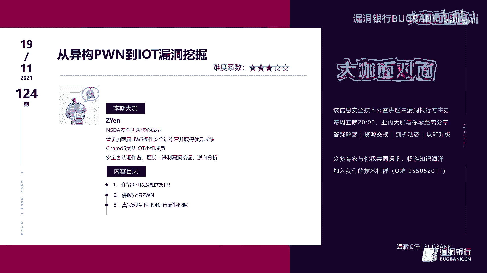

在本节课中，我们将学习IoT（物联网）安全的基础知识，了解如何获取和分析IoT设备的固件，并掌握在ARM、MIPS等异构架构下进行漏洞挖掘与利用（Pwn）的核心方法。课程最后将介绍在真实环境中进行漏洞挖掘的思路与流程。

***

## 第一部分：IoT与固件基础 🧩

上一节我们概述了课程内容，本节中我们来看看IoT到底是什么以及其核心——固件。

IoT本质上是“万物互联”的概念。从安全研究人员的角度看，IoT设备就是一个完整的嵌入式计算机系统，包含硬件和软件实现。我们研究IoT，重点是分析其内部逻辑，而非纠结于宽泛的定义。

固件是固化在硬件中的软件，是分析IoT设备最本质的目标。我们分析固件，实质是分析其内部的文件系统。

以下是获取固件的几种主要方法：

1.  **互联网搜索**：从设备厂商官网、安全论坛或通过搜索引擎寻找固件下载链接。
2.  **触发更新并抓包**：利用设备在线更新机制，抓取固件下载请求包，从中提取固件下载地址。
3.  **拆机读取Flash芯片**：使用热风枪等工具将存储固件的Flash芯片从设备上取下，通过编程器读取内容。这是最直接的方法。
4.  **不拆机读取Flash芯片**：使用测试夹和树莓派等工具，通过引脚连接直接读取焊在板上的Flash芯片内容。成功率不稳定。
5.  **通过Shell打包提取（不推荐）**：通过串口等方式获取设备Shell权限，再将固件打包传输出来。此方法受设备是否开放Shell及权限限制，通常不作为首选。

获取固件后，需要对其进行解包以得到文件系统。常用工具是 **`binwalk`**。

```bash
binwalk -Me firmware.bin
```

参数 `-Me` 可以递归解压固件中的所有文件系统。有时 `binwalk` 无法成功解包，可以尝试使用 **`mount`** 命令挂载固件镜像来提取文件系统。

分析IoT设备，通常从分析其对外接口（如USB、SD卡槽、网络服务）开始，因为输入接口关联着处理逻辑，是漏洞的潜在切入点。

***

## 第二部分：异构架构Pwn入门 ⚙️

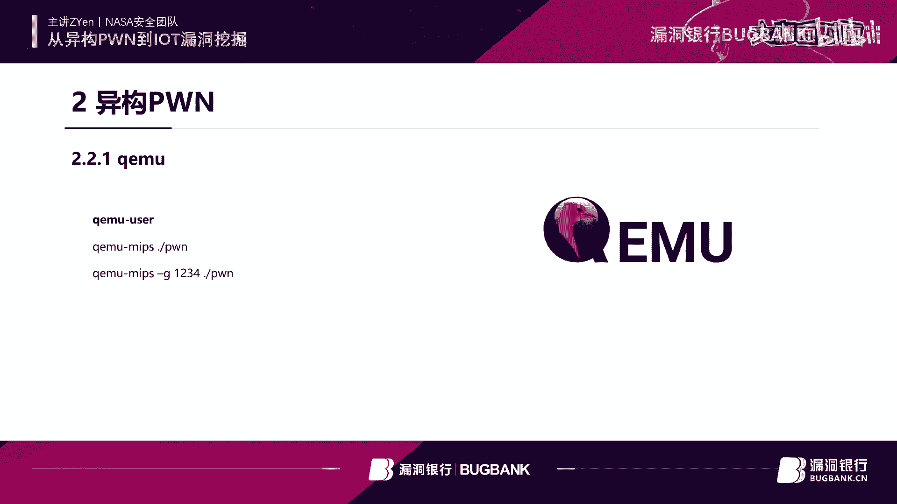

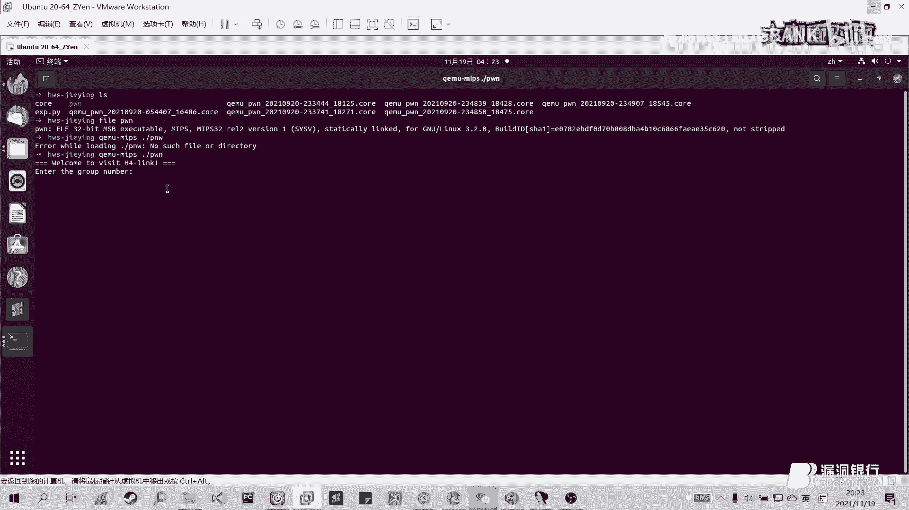

上一节我们介绍了固件的获取与解包，本节中我们来看看如何在非x86/x64架构（如ARM、MIPS）下进行漏洞利用，即“异构Pwn”。

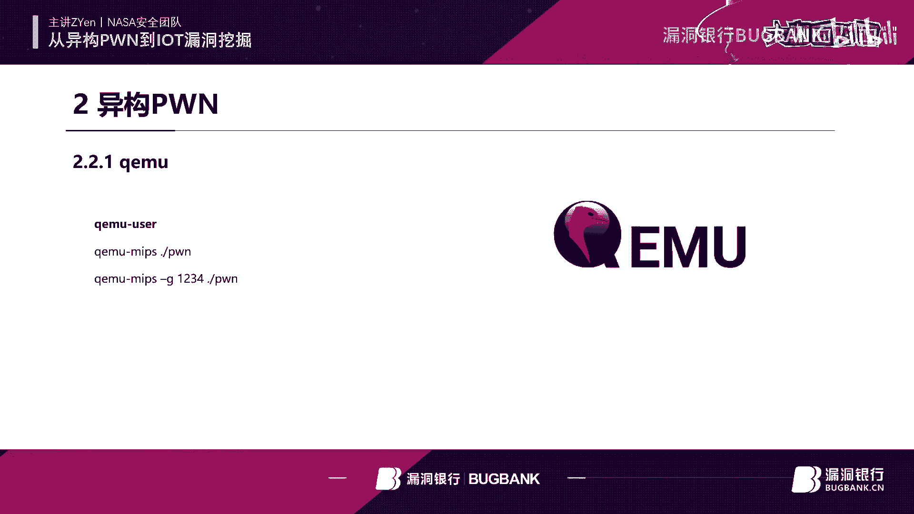

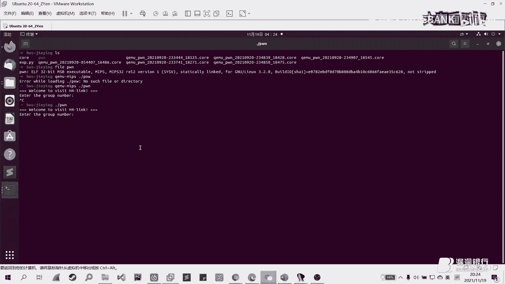

“异构Pwn”主要指在ARM或MIPS架构下的漏洞利用。本课程重点讲解MIPS架构，因为它在许多路由器和摄像头设备中仍被广泛使用。

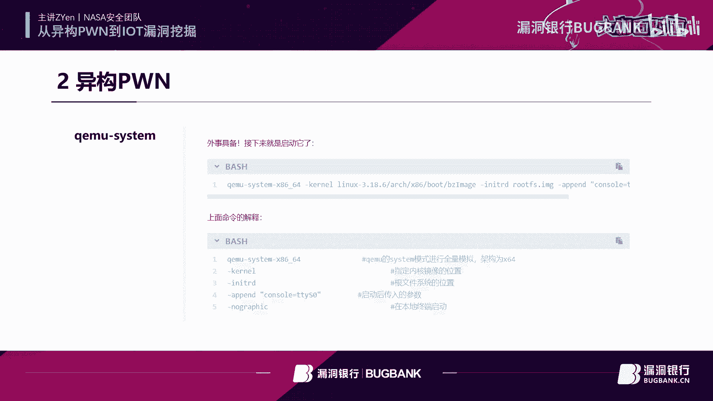

由于程序二进制代码的差异，我们需要搭建对应的模拟环境来运行和调试异构架构的程序。

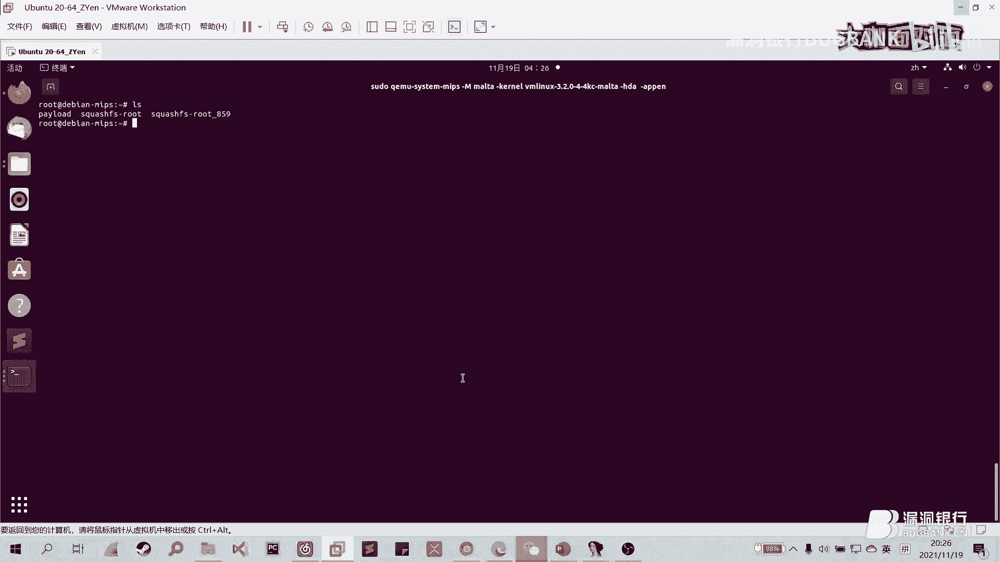

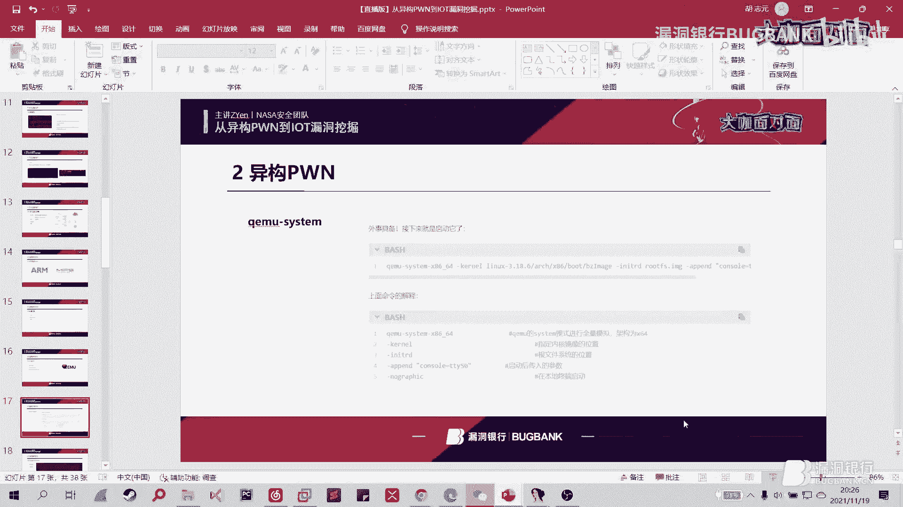

以下是搭建异构Pwn环境所需的工具：

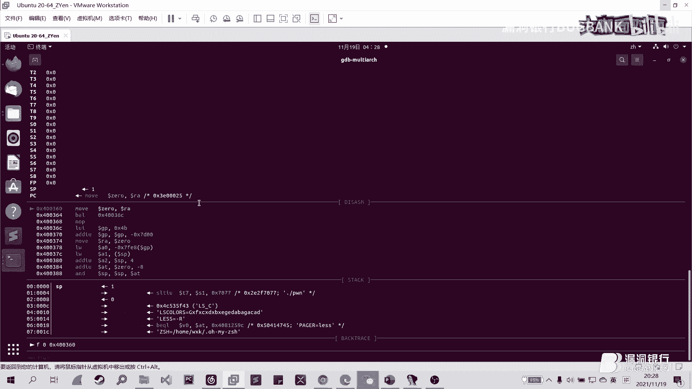

1.  **QEMU**：一个轻量级的开源模拟器，可以模拟整个操作系统（系统模式）或单个程序（用户模式）。对于Pwn题，通常使用用户模式模拟，命令如 `qemu-mips ./pwn_binary`。
2.  **GDB Multiarch**：支持多种CPU架构的GDB调试器，可以连接QEMU暴露的调试接口进行动态调试。启动QEMU时需加 `-g` 参数指定调试端口。
3.  **DVRF靶场**：一个包含多个存在漏洞的MIPS架构程序的练习靶场，适合初学者上手实践。

在MIPS架构下进行漏洞利用有一个特殊问题：**缓存一致性**。MIPS有独立的指令缓存和数据缓存。当Payload被写入内存（数据缓存）后，若未及时同步到指令缓存，程序跳转到Shellcode时可能执行失败。

解决方法通常有两种：
*   在劫持控制流前，调用 **`sleep`** 函数等待缓存同步。
*   将攻击分为两步：先写入Shellcode，等待片刻后再发送触发漏洞的Payload。

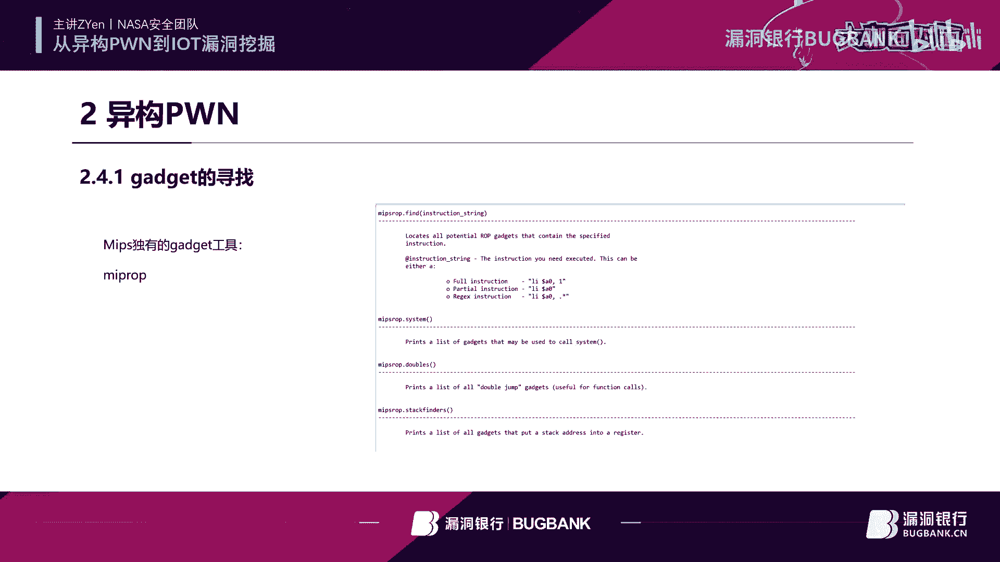

在真实IoT设备漏洞利用中，**Return to Shellcode** 是常用方法，因为很多设备未开启NX（不可执行）保护，且堆栈地址往往不随机化。

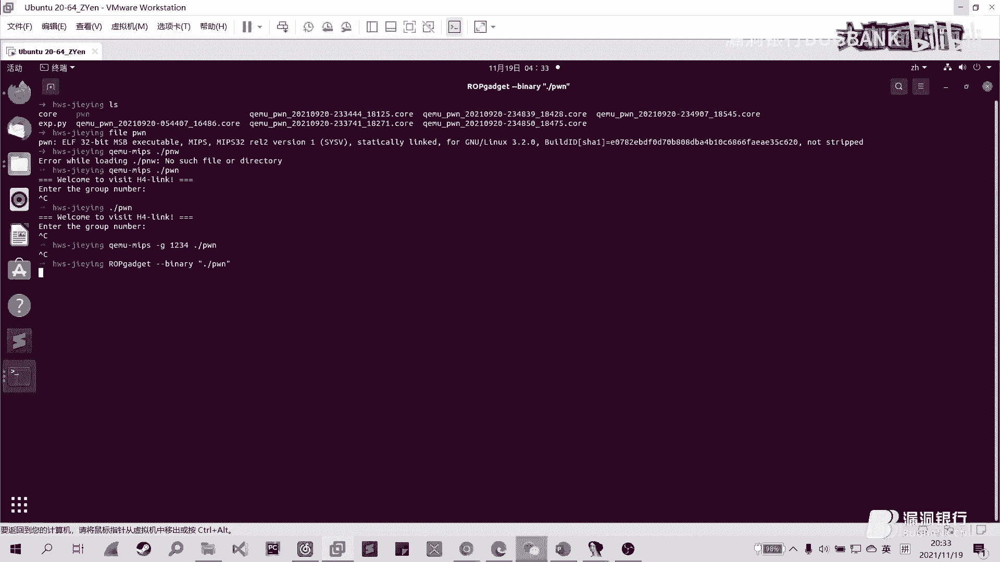

异构Pwn与x86架构Pwn的主要区别体现在以下几点：

*   **Gadget寻找**：x86下常用 `ROPgadget` 工具，但在MIPS下其输出杂乱且慢。推荐使用 **`mipsrop`** 插件（需安装到IDA Pro中），它提供了 `find`、`stackfinder` 等更高效的命令来查找特定功能的指令片段。
*   **ROP链构造**：MIPS没有 `push`/`pop` 指令，而是通过 `lw`/`sw` 指令在栈和寄存器间传递数据。构造ROP链时，需要先设置函数参数寄存器（如 `$a0`），然后调用函数（如 `sleep`），最后跳转到Shellcode地址。由于指令可能包含空字节（`\x00`），有时需要采用“地址-1再+1”的技巧来绕过。
*   **Shellcode生成**：`pwntools` 生成的Shellcode在MIPS下可能不可用或包含坏字节。通常从 **`msfvenom`** (Metasploit) 或 **shell-storm.org** 等网站获取现成的MIPS Shellcode进行修改。

***

## 第三部分：真实环境漏洞挖掘实战 🔍💥

上一节我们学习了异构Pwn的基本技术，本节中我们来看看如何在真实IoT设备上进行漏洞挖掘。

漏洞挖掘的目的是帮助厂商完善产品安全性。首先需要进行信息收集。

以下是信息收集的主要步骤：

1.  **端口扫描与服务识别**：使用 `nmap` 等工具扫描设备开放的所有端口，识别运行的服务（如HTTP、Telnet、SSH）。
2.  **历史漏洞分析**：搜索该设备或同类设备历史上曝出的漏洞，其漏洞模式可能在当前设备的新版本或其他模块中重现。

接着，对固件进行逆向分析，定位潜在的漏洞点。

以下是定位漏洞点的几种方法：

1.  **字符串搜索**：在固件中搜索常见的危险函数名（如 `strcpy`, `system`）、调试信息或错误提示字符串，快速定位关键代码区域。
2.  **二进制差异比对**：对比设备新旧版本固件，分析被修改的代码区域，这些地方可能修复了旧漏洞或引入了新问题。
3.  **模糊测试**：使用像 **FirmAFL** 这类针对固件的模糊测试框架，自动化地测试设备服务，快速发现崩溃点。

找到可疑点后，进行深入逆向分析。IoT设备中常见的漏洞类型包括：

*   **栈缓冲区溢出**：使用未检查长度的危险函数（如 `strcpy`）。需注意MIPS中“叶子函数”的返回地址存储在 `$ra` 寄存器，而非栈上。
*   **命令注入**：用户输入未经滤即拼接至命令字符串，并传递给 `system`、`popen` 等函数执行。例如，某摄像机在连接Wi-Fi时，将Wi-Fi名直接拼接进命令中，导致可注入任意命令。

漏洞确认阶段需要进行动态调试。由于设备资源有限，通常采用远程调试：

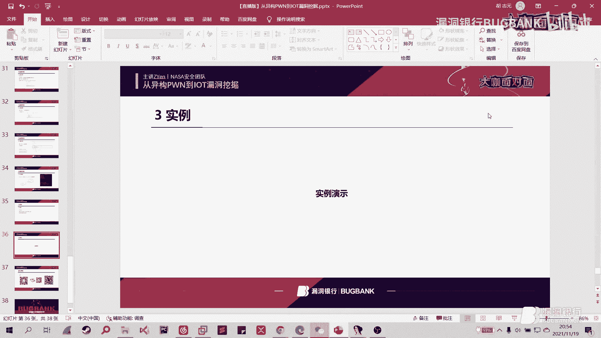

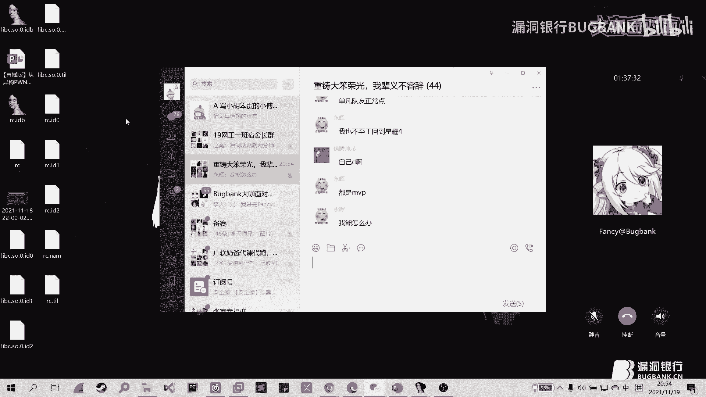

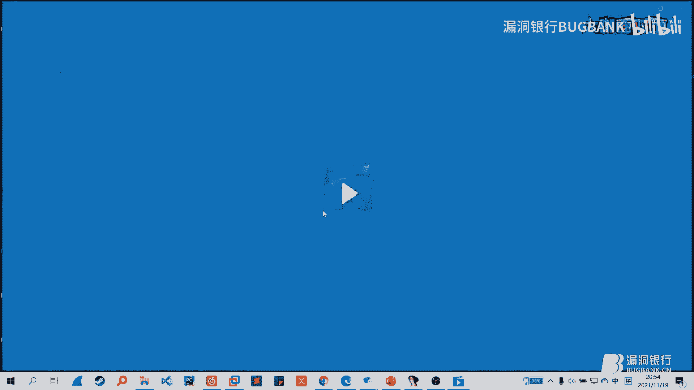

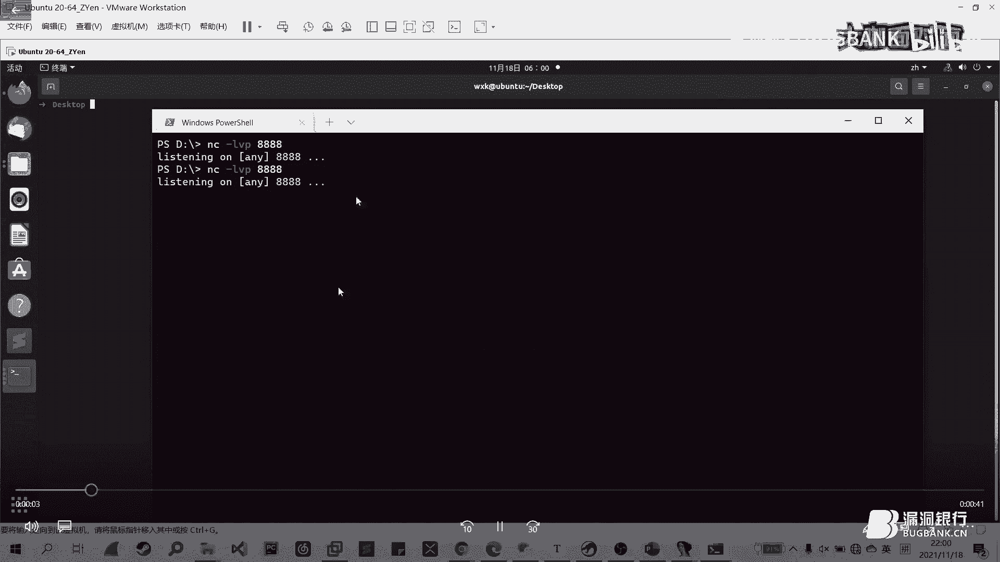

1.  将轻量级的 **`gdbserver`** 上传到设备并运行，监听特定端口。
2.  在本地使用 `gdb-multiarch` 连接设备的 `gdbserver` 端口进行调试。

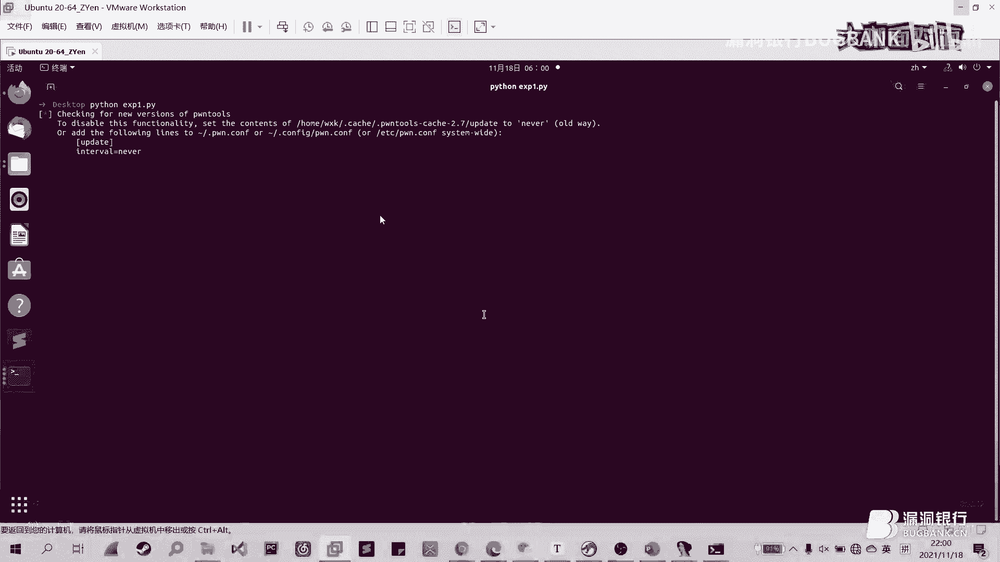

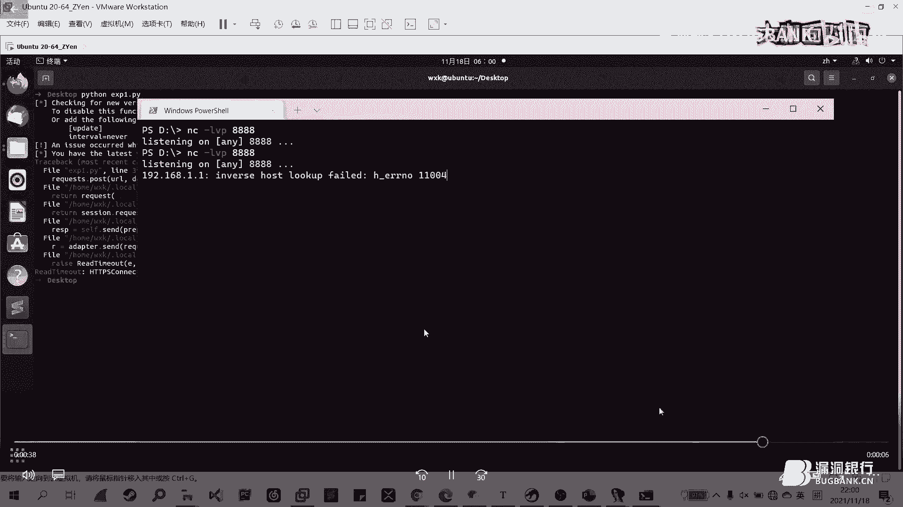

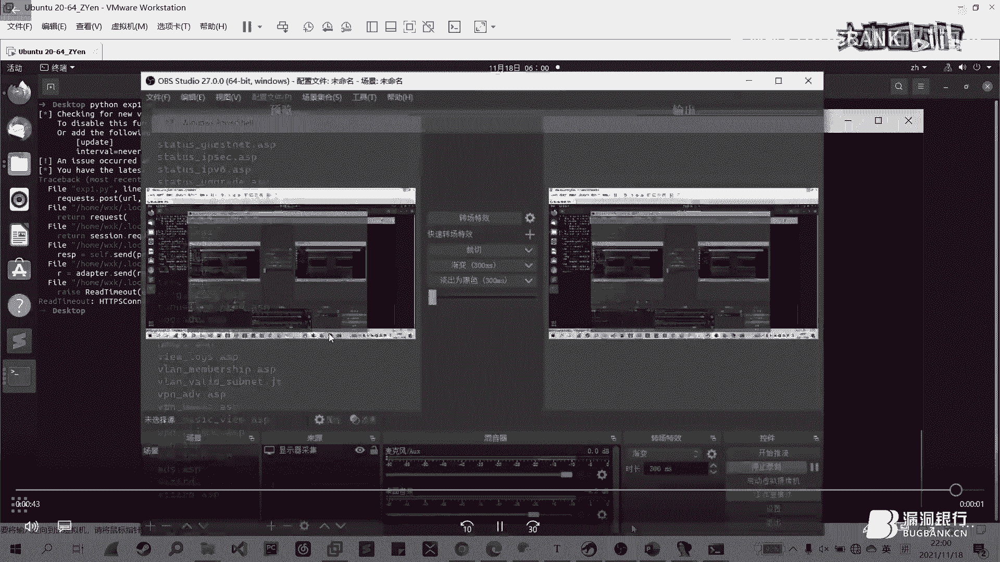

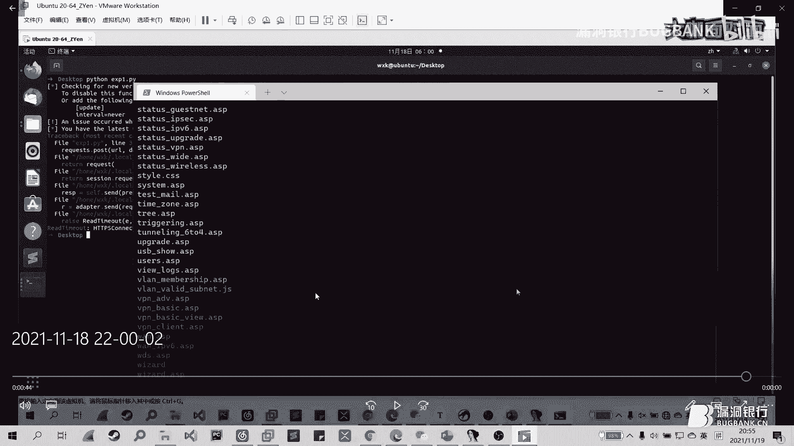

最终，构造恶意的数据包或输入，触发漏洞，完成利用（如获取反向Shell）。


***

## 总结与演示 🎯

本节课中我们一起学习了IoT安全研究的完整链条：

1.  **理解IoT与固件**：明确了分析目标。
2.  **固件获取与解包**：掌握了多种提取固件文件系统的方法。
3.  **异构Pwn技术**：学会了在ARM/MIPS架构下搭建环境、寻找Gadget、构造ROP链和利用漏洞，特别是处理了MIPS的缓存一致性问题。
4.  **真实漏洞挖掘流程**：从信息收集、逆向分析、定位漏洞到动态调试与利用，了解了在真实设备上进行安全研究的思路和方法。

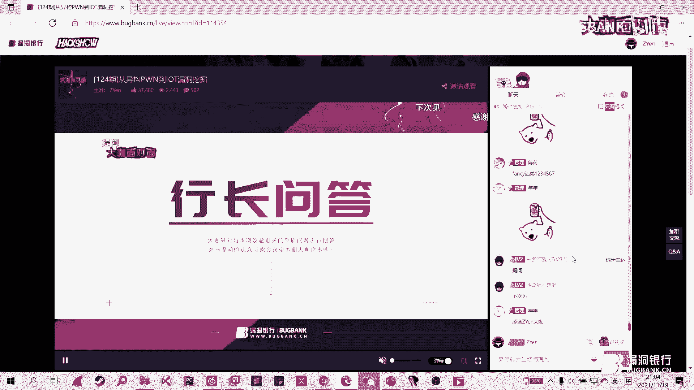

课程最后通过一个真实漏洞的利用演示，展示了如何通过构造恶意请求，在目标IoT设备上成功获取反向Shell，验证了整套方法论的有效性。


（注：演示脚本和攻击细节未公开，仅展示结果。所有研究应在合法授权范围内进行。）