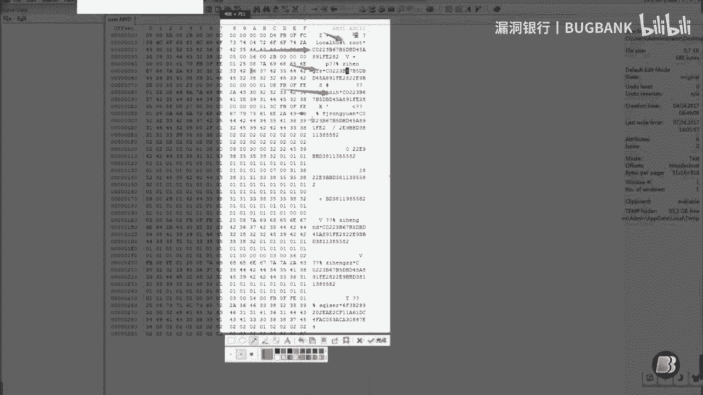
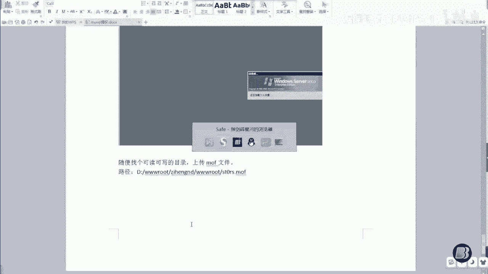
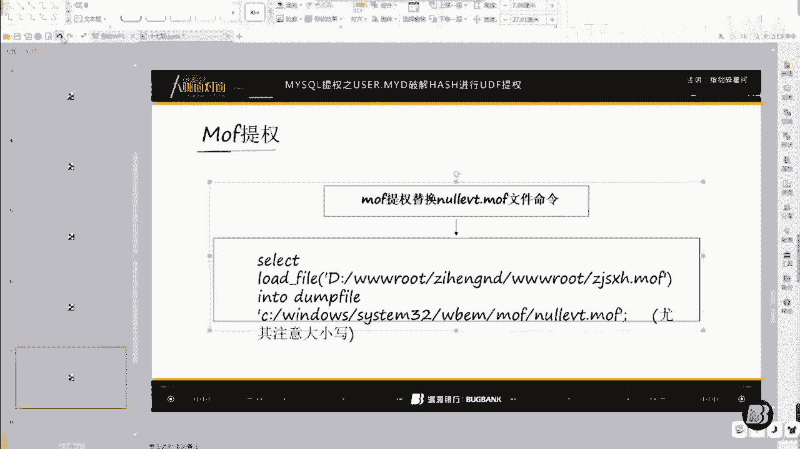

# P1：17【录屏】权限提升之MYSQL提权——指剑碎星河大咖分享 - 漏洞银行BUGBANK - BV1pK4y1D73Q

小伙伴们晚上好，欢迎收看漏洞银行大咖面对面第17期，我是今晚的主持人ancy。今晚将由星辰安全团队指见最新和大咖来提提全难度系数三颗星大咖演讲期间，希望大家能和大咖互动交流。言探讨与分享内容无关的话题。

保持对大咖和小伙伴们的尊重。下就有请只见最新盒开始演讲吧。给他说清楚。好，大家好。嗯，今天我给大家讲的是权限提升是买C口提血。然后我是主讲直接睡星河，我来自是TDIS团队啊。然后。

这个提呃这一节课呢主要分三个啊，第一个mycycl提全是什么？第二个UDF提全。MFT恤。首先我们来看一下这个第一个吧，马ci口提选是什么？你是否拿下了一个微博shop要，但是阿语权限太低。

拿不到服务器权限。选了此个时，你只要微博shop要满足以下条件，即可多一种方法让你微博shop要权限变成服务器权限。首先第一个买s果数据库。然后第二个找到myciq数据库最高权限账呃。

账户密码root最高权限就myciql的最高权限是root啊账号密码。然后不会找的话，请继续看下来啊。然后第一步。🎼第1个UDF提权啊，两组提全麻烦。然后第一个看一下UDF提权原理啊。

麻烦这位刚才是哪一位把麦关一下啊，然后获取到myCl的最高运行权限root创建存储过程执行命令。然后我们看一下怎么获取mysql最高的运行权限ro头的账号密码呢。感谢。

是这个这个啊读取数据库分子文件一般为。呃这几个文件啊一般。NINC点PHP的这些文件都可以看一下啊，一般的话这种都可能存在。

然后我们先看下这一种吧。好吧，我今天是实战给大家讲一下啊。然后希望大家也不要那个看一下，看懂一下就行，好吧。

🤧嗯。

Yeah。等我这网速有点慢啊，好可以了，是吧？Yeah。然后我们来找一下这个所说的这我先说的这几个文件吧，好吧，然后看一下在哪哪个文件夹里面。

呃，不在这里面啊，还是在这个呃这里面啊，然后我这写在word文档里面啊。嗯。Yeah。🤧嗯。然后这些的话你这样看基来了啊，可能是这一个可能是这一个，有可能是这一个啊。然后那次我找一下，好像吃这一个吧。

听到没有？

嗯。然后这里呃这里虽然是乱码，但是还是可以看到DBA啊，这里DBho的，然后本地地址，然后DBU呃买是呃数据库的用户名密码，然后数据库名。然后这些的话。看到再看到我们前面的啊。前面我说了。

要获取了mysq最高权限要root，但是我们这里不是root，这里是这个啊。欢 rootot，然后我们这里。看第二部。下载us色点MID文件。然后这个的文件的话，一般在。等一会。啊即系得表。

一般在买呃数据库目录下的买C个数据库。文件夹价啊，这样说可以理解吗？Yeah。等一下啊。哦。录像啊，等一下，我等一下再录像，好吧。MID是数据买这个数据库的类型吧。那我们直接来下载一下看啊。

直接用菜刀下载吧，然后进入。硬盘的根目录，这里有个mysl呃，DATTA啊，那这里有个这里都是数据库的。截图下啊。Yeah。我给大家简单的讲解一下，好吧，这里是呃买sl的目录。

然后这目录下面有一些数据库，然后。这个数据库呢这几个数据库都是的啊。然后这个mycycl的也就是呃默认的那个数据库里面有很多MID文件，MYI文件什么的。然后我们下载1个MVD文件。桌面没下载吧。

没下载一下载下来吧。好，现在已经下载完成这个文件啊。这个文件的话呢破解啊，现在破解解密号奇密文啊。我们用这个winHE叉这个软件。使用winHE超。打开优色点MVD文件。就是MD啊。这里面有很多的。

有很多的数据库密码啊，root这个是刚才那个数据库的呃其他数据库都是对应的。这前面的是数据库啊，都是用户名。

前面都是用户名，然后。然后后面就是密码嘛，但是我们要怎么去解密嘞？嗯。解密号是密文啊。上到于FT进来。Mixico。灭蚊为40位。但是你看一下这些灭纹的话，明显是不足40位的。

打开user点MMYD文件灭文不足40位。拼证啊。让他们拼凑成40位，这样然后我们就直接用呃那个word文档吧，好吧。Thank you。Yeah。这个是蜀吧，是。8、216、2024啊。

然后我们这个后面加1个24。まずは。33。小沙。Yeah。1分之1。17啊，这个是17。然后现在的话下面的我们现在不需要去看啊，然后就看到这里有1个23位和1723加17，这个应该都懂吧，等于40位。

然后我们把17位的放到18位的后呃，23位的后面。然后去。3D5里面啊。现在可以看到已经差不多紧密了啊，然后但是需要收费买呃CMD5就是这样啊，然后我我是找别人购买的啊，然后解除。呃，铭文为。

这个中午我是读的汉中啊，我也不知道是什么。然后现在开始我们的。获取到了已经获取到了最高的权限密码啊。嗯。用户名为默认的root。铭文密码为汉中啊，然后现在就获取了这个权限账户密码，然后进是UDF提全。

呃，这个木马里面一本都会自带的啊UDFT圈。然，这里是地址，端口，端口是默认的，用户名呃是root啊，密码的话。就是。这个嘛点出来的嘛？解出来的密码，然后填进来户名是mysql，不用更改。

mysql是最大权限的数据库嘛，然后连接连接成功。但是我这里安装的话，它是安装出错啊，然后我们执行一下命令这个。查看版本。好，可以说是呃，现在是可以查看到版本的啊。

🤧嗯。

Okay。然后执行命令执行命令的话，这个我看了之前那个危险漫步的那个讲课啊，它是讲的执行命令的嘛，然后我们直接let use一下。呃，这里所有的账户名都出来了啊。权限的话不用看。

一般都是这个权限能执行成功耗掉，然后就是添加个用户名。这添加过一个。Okay。啊，明令执行成功。这个的话我相信我不用多讲吧。还是给翻译一下吧，添加一个。用户。透你为。用户面哪位。Okay。嗯。

没有这个啊，但是你看我们的权限。看权限啊。letus，然后这个用户名是有的，但是权限不是最高权限。

V对高斜线。就算我们现在登录嗯。给大家详细的演示一下，好吧。

She。一。Oh。

Yeah。所以这款前它提，你登录的时候，它就会提示这个啊，到时候原车呃。远程桌面用户的组，有没有该成员啊？现在是user，user是用普通用户吗？普通用户，然后我们就要把它权限给提上去。来 job。

诶来来。皮。返D。我打的今晚出这了吗？翻一下好吧，翻一下呃。将用户名为。一用户提升自啊。嗯。然后这里关于这个的话，我需要详细的说明一下啊，之前我自己提全的车。我就是这一步一直卡在这里，一直提交不成功。

至于为什么我给大家说一下，因为少了少了这个S。找这个S啊，我当时也不知道我是因为没有人告诉我还是什么，还是我自己的理解错误啊，然后就默认的。把这里的呃这个字符变成这样，然后一直填加不成功。

然后后来我查看了一下管理组呃，查看了一下呃，这个用户。这个用户的话，他是在这个组，然后我才想到啊，我这里是少加了一个S，然后加进去才提现成功啊。这里我已就退出来了啊，然后执行。并令执行成功。等一下啊。

随便反正是个垃圾服务器，然后我们再看mini行成功，然后。

Okay。看一下这个权限。She。Yeah。

看到没有？权限已经增加了一个组啊，本地组成员这个啊是这个刚才这里我怕挡住了啊，这个增加了一个。

呃，这个最高用户组的权限嘛，然后登录一下，正式的录。Yeah。T。这个一般都是的啊一般都是的嗯。最简单的呃。

那个不是MD5啊，因为呃因为是MD5上，你看看一下啊。那这里是自动的啊类型，我并没有选择MD5啊，它这里有很多类型啊，MD5，然后买cil买cil5这些的选择自动的话，你只要输入密文它就会自动破解啊。

自动判断是哪一种类型然后破解啊。

哦。

Yeah。

你看到现在已经已经登录进来了啊。等一下我把图面缩小一点，再大不好看。然后现在已经拿到了我们的服务器权限啊，拿到了我们的服务器权限。然后我们看一下MFT权。😊，先把这个给关掉吧，这个服务器有点卡着。

先看一下。Yeah。mycycl不你 root账户没有路径那就想办法找路径啊，你这个只能先拿到维博信才能提全把这个P密板边没有那个。Go。上对。来看一下我们的MF原理啊。关于MOF提确原理。

其实就很简单，就是利用了这个路径下的这个文件。这个文件的特性是什么？每分钟都会在一个特定的时间去执行一次的特性来写入我们的CMD命令，使其被大入执行。

执行买sql的命令用我们的MF文件替换这个特定文特定的文件啊。

没有什么什么。然后MF文件的话，我等一下会给大家打包啊。然后这个现这个的话现在可以关掉了啊，这个文这个工具我等一下也给大大家一起打包，然后。😊，这个。M文件，我们用note pad加加号打开啊。

可以看到这里面。这些我是看不懂啊，反正然后但是这里的我看得懂。这个。这个命令的话，大的有1万。这样子这个命令LET点EXletus。呃，不要这个us色吧。别这个有是架。这个我都没注意啊，也没事呃。

letus呃，然后这个是用户名密码，然后杠IDD这完全就是我们刚才执行的命令嘛，对吧？但是把这个把它带入执行的话，我们上传一下，随便找个可读可写的目录。所。随便找个可读可写的目录。上转MF。注意啊。

一定要可读可写啊，然后。直接在。这里吧。之前我把这个删掉啊。对。选程文件。Yeah。Okay。好，上个成功啊，然后路径的话，路径。Go as you guys。 Yeah not。路径是这个啊。

然后我给大家讲一下这个。

提全你的命令。步骤啊提全步骤获取买sqQ最高用户权限账号密码。然后刚才自上一次是上那个讲UDF提群的时候，我已经讲过了啊，然后接着讲这个上传MF文件进续UDF提全。我现在已经上传了啊。

这下命令。嗯。

Yeah。Y外双间提全命令。Yeah。Yeah。哪隔这么远吧。我操他妈的。Yes。这己别单的了啊。然后我先这里简单讲一下吧，等一下复制这里的，然后这里是。上传的mf文件路径。

然后这里是这个一般的话不用变啊，一般都是系统默认的，写那个MF文件啊MOF。

然后我们直接把这个复制进来。W。啊。注意啊，这里尤其注意大小写啊，mys口我觉得的话对这方面是挺严格的啊，比如这个括号单音号什么的，都必须是英文的。如果一旦是中文的或者是别的，它就会执行不成功。

那我们来。麦sco语句提取呃语句执行啊密码还是刚才那个密码。行来看一下是否可以执行啊，查看myscle版本BGB版本啊mycycll的这个是。好开干的啊，放进来了继行。执行呃C口语句成功啊。

但是它这个特性的话，我当时也没看，然后我们就直接用CMCMD是不能执行的啊。然后我们看一下。看下这里是否已经添加了一个用户进去。好，还没有添加进去啊，那就稍等一下。要等他这里添加用户进去啊。

这个因为我之前说了嘛，这个PPT里面之前也说了吧。每分钟都会在一个特定的时间去执行一次，然后现在还没到执行的时候，然后我们就要稍等。

Well。Yeah。我这个是嗯是那个什么。5点。好像是5。0吧哦。对。现在一般用到5。0以下的一般很少了啊。嗯。怎么面。Yeah。再执行一下。啊，可以看到啊，现在已已经成功了。😊。

Yes。

い。添加成功。数据库版本刚才是5。5。5点几呀，我忘记了。嗯，看一下啊呃是这个。Okay。By。5。5的啊。5。5的这个是。这得气急死。然后我们再来修改一下这个。嗯。再来修改一下这个MI文件啊。She。

し。那里改成那个。What。I。改成这个将这个用户提升至管理员管理员组的命令啊。说。感谢文店。O判断成功啊，然后。那个啊Y。继续还是执行这个命令啊，还是执行这个命令，把这个路径换一下，更换一下就可以了。

嗯。可是可以吧，但是我没有试过呃，不不对吧，MFT恤莫斯。不可以啊。所非章的意直执行。我当知。同意时间的话，那这个我还真的没有深入研究过啊，没有深入研究过，到时候课后讨论一下，好吧。嗯。The来。

到时候我们课后讨论一下，然后现在我们继续把这个。执行下。🤧嗯。He。Yeah。啊。执行。He。嘻。是。执行成工啊，然后我们。再用UDFD全来试一下吧。再看一下是什么管理组啊。Yeah。

还是这个本地主的啊，那就要稍等一下，等到等到这里有一个呃。管理组啊。有。不。这个嗯我想一下啊。Okay。You。More。She。如果没有执行。Yeah。She。可以试一试就知道了。行吧。

等一下顺便试一下，好吧，嗯好给大家解解解答一下这个问题，好吧，这个问题。昨然一下子我也被问住了啊，这个。这个是讲实色的啊。当时对我当时为什么说不可以嘞？因为我当时觉得如呃如果。如果用户都没有添加上去。

要继续执行。提升市管理员。四个派出所，因为我是这样想的啊。但是呃当时我没有考虑到啊那个MFP选的话，它前面是先执行的这个，然后他继续在执行的提升日管里面啊。Okay。这も是な。Yeah。No。Oh没。

我知道我知道我知道。Yes。再提行一下。好，可以看到他现在已经在这个管理组里面了啊，在这个管理组里面。然后我们登录一下，看一下是否可以登录。Okay。Yeah。我会咩。冇回俾话可系了吗啊。Yeah。

Yeah。嗯Yeah。What。一天一情。Yeah。Yeah。8。还原的话，其实。这方面的我倒是没有过啊，反正用户也一直在啊，然后就。我想说的是这个。Yeah。Okay。你道好到现的等下等。W。

来点击登录一下啊，点击确定。好，可以看到他现在已经是登录进来了啊。Yeah。

She。Yeah。然后这个MOFN业委会与PPT写和大家打包啊，然后。Yeah。嗯，看一下你们还有没有什么问题。Okay。P须。Oh。Okay。She。Okay。o k。嗯，行，那我就感谢大家的观看啊。

然后感谢大家支持乐洞银行与我们团队啊，这节课我就讲到这里。😊。

Yeah。嗯，好的，那我们感谢直接孙星和大咖的分享。然后我们接下来进入行长问答环节，然后对今天课程有疑问的小伙伴可以提问了。那看刚大家和那个星河的互动非常多，然后星河也帮大家解答一些问题。

然后剩下还有什么问题，现在可以再继续提问。

第一。He你你你你。既然有了马塞克ical的精神。Yeah。root权限的话，一般的话。有点符合。Y。Okay。衣橱题恤。Yeah。是。一。嗯。哎，放开好了。Yeah。嗯。嗯。No。

大家有什么实质性的问题吗？跟跟那个讲课内容有关的。另一个时项买赛果提拳有什么小技巧，或者是这个的话，我还没有深入研究过。如果我研究了，再跟你们一起分享吧，好吧。Yeah。数据是不一样。Yeah。

Okay。Okay。对。Yeah。Yeah。🤧嗯。Okay。Okay。除非他。嗯。也是。自己构价个，然后写一个注入页面表。再去次。Right。唔知。Okay。Okay。Okay。嗯然好。嗯。

请问关于这节课的话，还有没有什么问题啊，各位。各位小伙伴还有什么问题？没有了吗？😔，Yeah。那给带给大家最后一几句话，没有的话。有效问提温是吗？Y到SKL之后怎么拿试啊？The homes。

Thank you。Yes。Yeah。Yeah。Yeah。Yeah。嗯。Okay。Okay。She。嗯，那大家大家还没有还有什么问题吗？没有的话，我们问答环节就先告一段落啦，可以吗？Yeah。Yeah。

OK那我们问答环节今天就先到这里结束了。然后有疑问的小伙伴课后可以再找大咖聊，然后也可以跟其他小伙伴交流。那我们接下来进入今天的互动环节，然后我们会请直见最星和大咖。嗯。

在所有直播过程中参与互动的小伙伴是因为最积极认真听讲的小伙伴，然后我们代表直接最星河，然后跟我们漏斗银行一起送书给你。然后星哥你可以选一位。嗯。我看一下聊天记录吧。好的嗯。Yeah。Yeah。Yeah。

The，Yes。Yeah。Yeah。Yeah。Yeah。Yeah。嗯，被选中的同学是可以自己挑选一本书，然后我们代到新丰和邮东银行，然后给你送的。Yeah。这个的话。Yeah。大大还听不清我的声音吗？

好，可以听见可以听见了嗯。😊，Yeah。Yes。我们星河好像很认真的在学。这么多小伙伴都要，但是名额只有一个。被选到的小伙伴是比较幸运的那没选到小伙伴以后也有很多机会的。Yes。飞这是。就这问吧，好吧。

哪一位新了，你可以艾特他一下，等一下我找一下。嗯嗯，好好。Yeah。这个吧。啊，不对不对。干嘛哼。Yeah。Yeah。OK是嗯b同学是吗？同学同b同学。我看他在刚才讲课的时候提的问题比较多啊。嗯，好。

那恭喜我们的b同学，然后嗯恭喜你获得由指接孙新和大咖和我们漏洞银行为你送出的书一本。然后之后活动结束之后，我会私聊你。然后我们在后续商讨那个你想要的书，然后就恭喜你了。

然后其他没有被选中小伙伴也不用也不要觉得嗯就是遗憾之后有很多机会，然后大家也可以通过我们的微信公众号和微博了解我们的送书的后续详情。然后说是有被选中的小伙伴自己挑选的。😊，嗯。

然后我们今天的大咖面对面就到这里结束了。然后大家可以结束之后继续跟大家大咖和小伙伴们嗯探讨我今天的课程内容。大家可以课后继续探讨。好吗，那我们今天的课程就到这里结束了。好的好的，谢谢。好的好的。

谢谢谢我们星河，谢谢星河的分享。那我们今天课程到这里结束了。😊，这忙嗯。好。对，大家可以退QQ电话的。Yes。Sure。

