# 课程P1：MySQL权限提升实战教程 🚀

在本节课中，我们将学习两种关键的MySQL权限提升技术：UDF提权和MOF提权。当你已经获得一个Webshell但权限较低，无法直接控制服务器时，如果目标系统满足特定条件，这些技术可以帮助你将Webshell权限提升至服务器系统权限。课程将分为三个部分：首先介绍MySQL提权的基本概念，然后详细讲解UDF提权的原理与步骤，最后解析MOF提权的实现方法。

## 1. MySQL提权概述 🔍

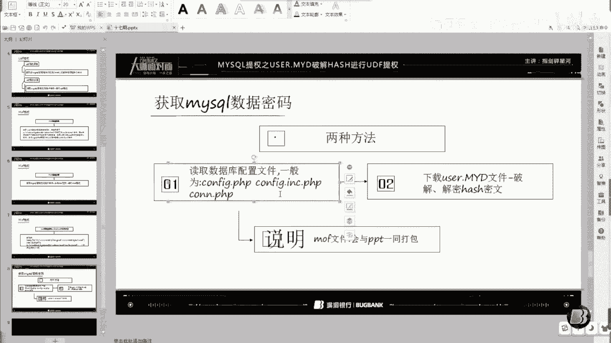

MySQL提权是什么？简单来说，当你通过渗透测试拿下一个网站（Webshell），但获得的权限（如Apache或PHP运行账户）太低，无法执行系统级操作时，如果该网站使用了MySQL数据库，并且你能获取到数据库的最高权限（通常是root账户），那么你就可以利用数据库来执行系统命令，从而将权限提升至服务器管理员级别。


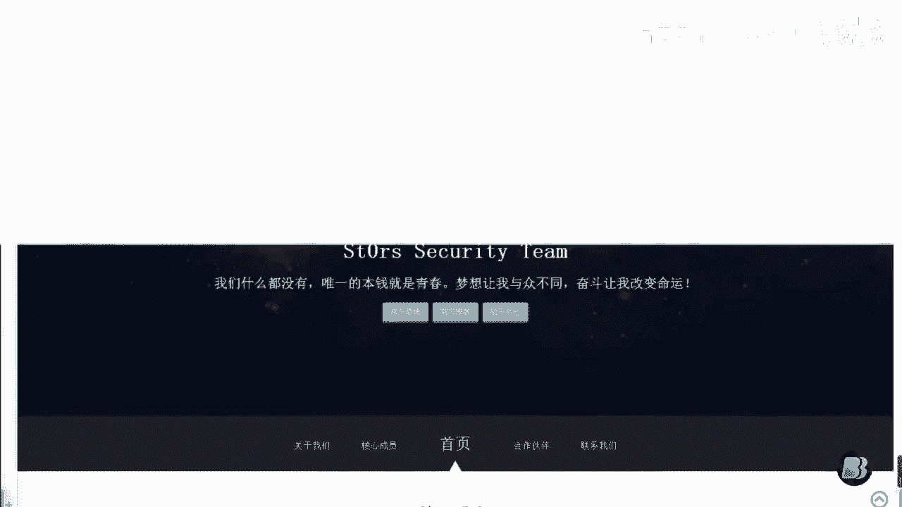

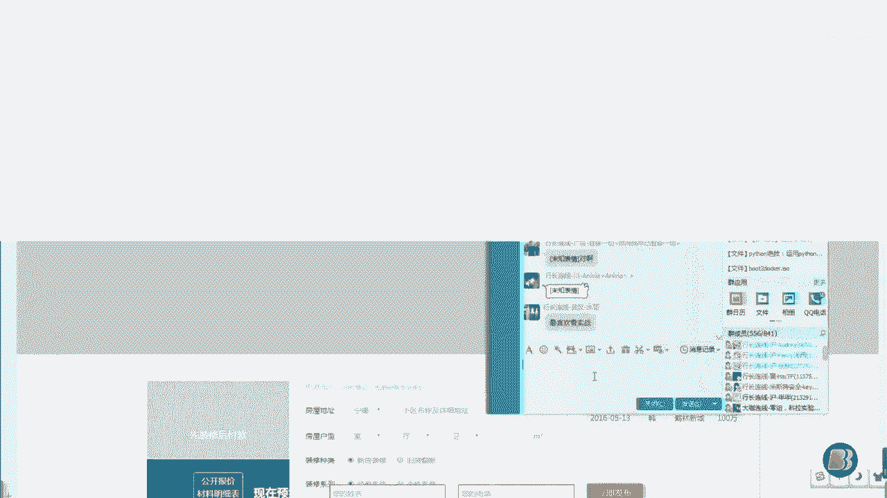

要实现MySQL提权，需要满足两个核心条件：
1.  目标网站使用了MySQL数据库。
2.  你能找到MySQL数据库最高权限账户（通常是root）的账号和密码。


如果不知道如何寻找数据库密码，请继续往下看。

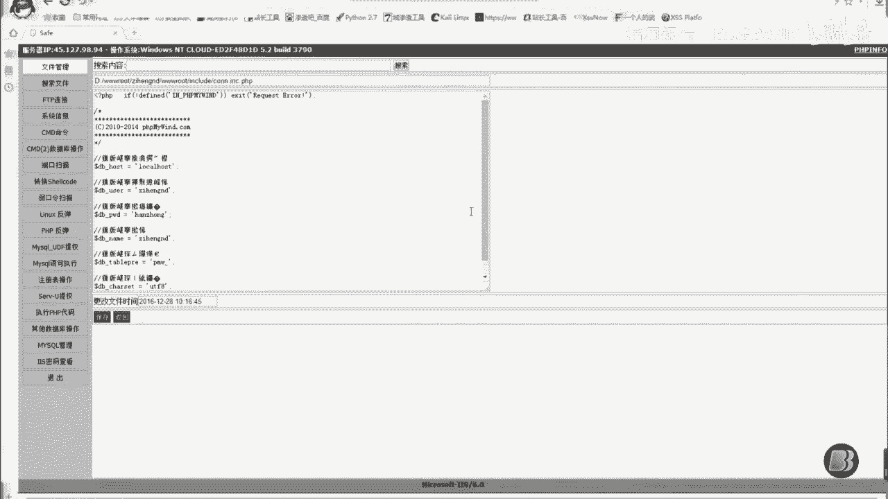

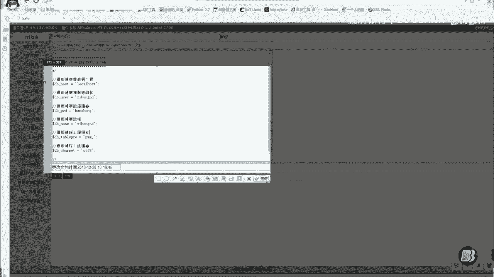

## 2. UDF提权详解 ⚙️

上一节我们概述了MySQL提权，本节中我们来看看第一种具体方法：UDF提权。

### 2.1 UDF提权原理

UDF提权的原理是：获取MySQL的最高运行权限（root账户），然后利用该权限创建自定义函数（存储过程），最终通过该函数执行操作系统命令。


### 2.2 获取MySQL的root账号密码

获取root密码是提权的第一步。通常，我们可以通过读取网站的数据库配置文件来获取连接信息。这些文件可能包括：
*   `config.php`
*   `conn.php`
*   `database.php`
*   `dbconfig.php`
*   `inc/config.inc.php`

以下是一个查找数据库配置文件的实战演示。通过分析这些文件，我们可以找到数据库的连接信息，包括主机、用户名、密码和数据库名。


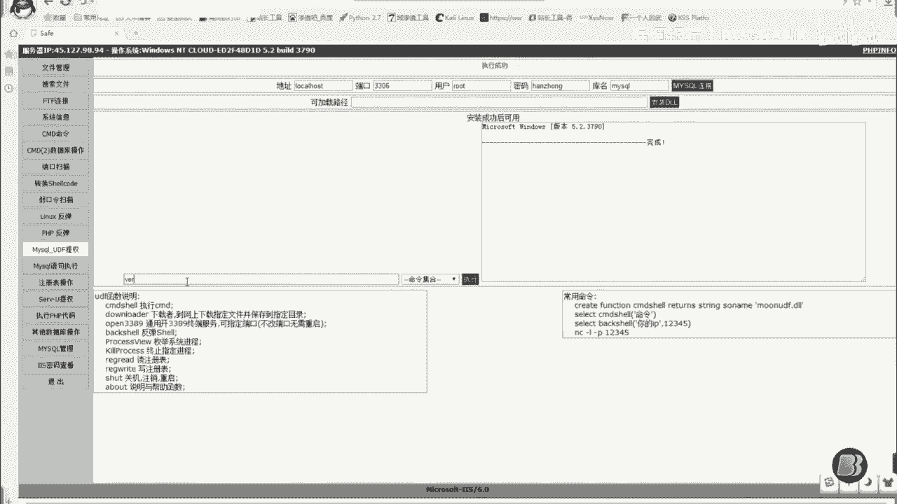

在找到的配置文件中，我们发现了数据库连接信息，但这里的用户名可能不是`root`。这时，我们需要进行第二步操作。

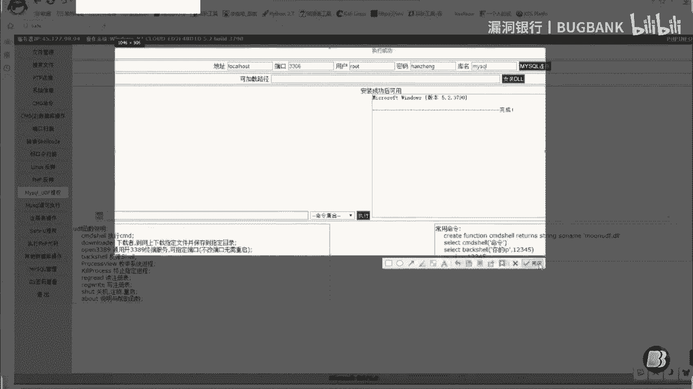

### 2.3 下载并解密user.MYD文件


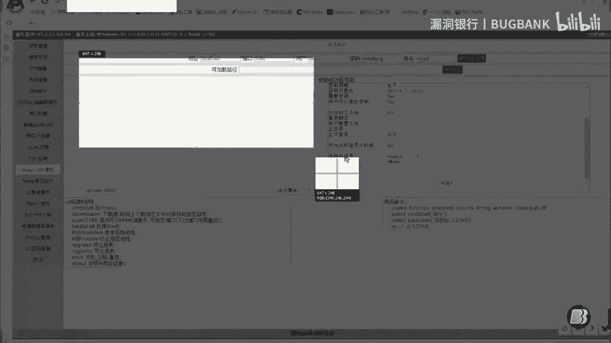

如果配置文件中不是root账户，我们可以尝试从MySQL的数据目录中下载`user.MYD`文件进行破解。该文件通常位于MySQL安装目录下的`data/mysql/`文件夹中。

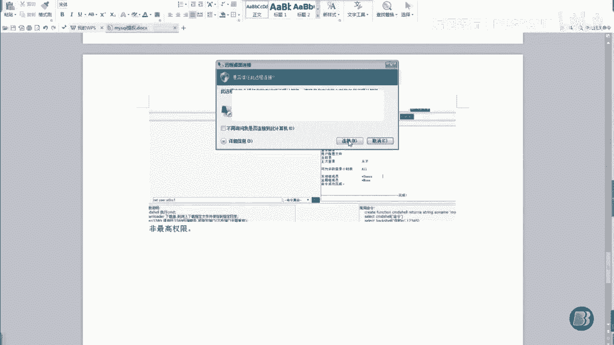

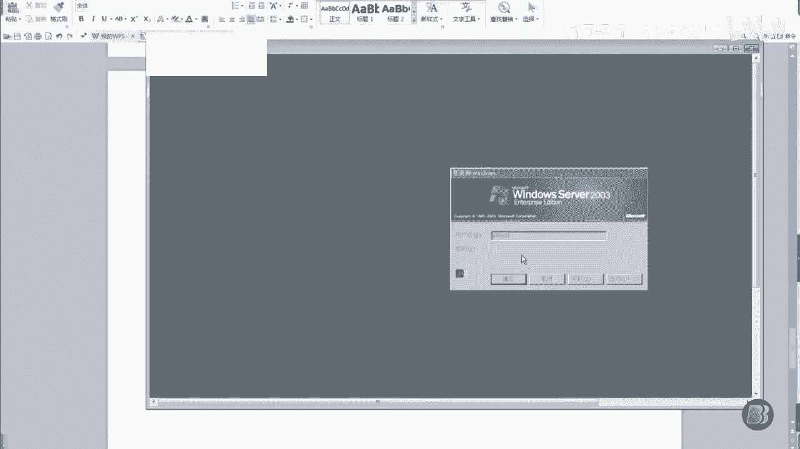

以下是操作步骤：
1.  使用工具（如菜刀）连接到服务器，进入MySQL的`data`目录。
2.  找到`mysql`数据库文件夹，下载其中的`user.MYD`文件。


下载完成后，使用`WinHex`等十六进制编辑器打开`user.MYD`文件。文件中存储了MySQL的用户名和加密后的密码。

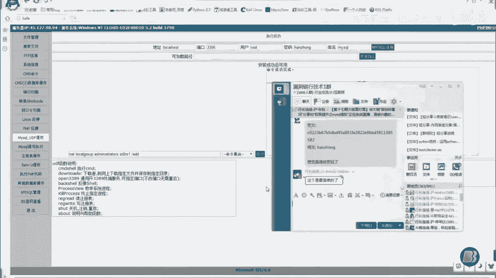


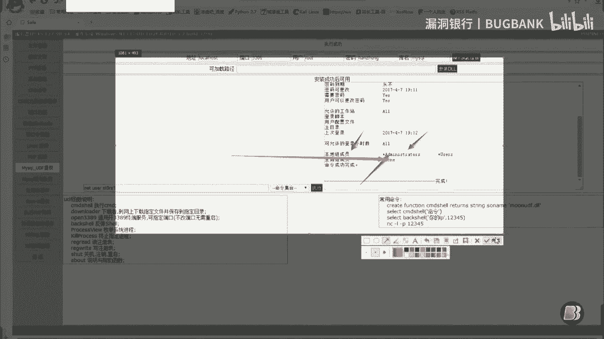

MySQL的密码密文通常为40位。如果看到的密文不足40位，可能是被截断了，需要将相邻的两段密文拼凑成40位。例如，一段23位的密文和一段17位的密文，将它们拼接起来。


拼接后的40位密文，可以使用在线或离线的MySQL密码破解工具进行解密。解密成功后，即可获得`root`账户的明文密码。

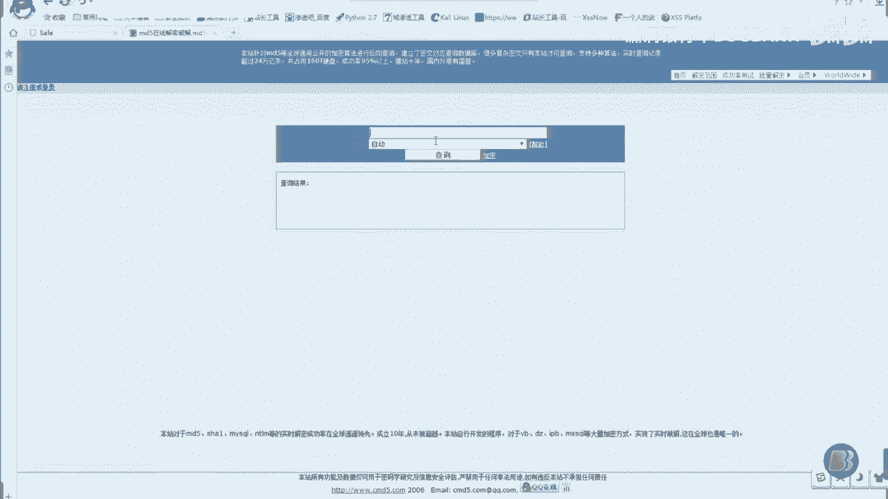

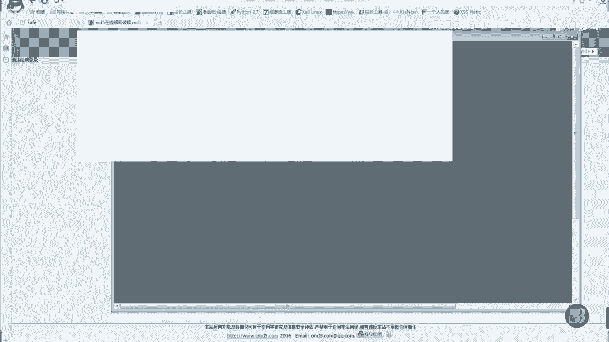


### 2.4 执行UDF提权

获得root账号密码后，就可以使用提权工具进行连接。许多Webshell管理工具都内置了UDF提权功能。


操作步骤如下：
1.  在提权工具中填入目标服务器的IP地址、MySQL端口（默认3306）、用户名`root`以及解密得到的密码。
2.  选择数据库为`mysql`（这是权限最高的系统数据库）。
3.  点击连接。连接成功后，可以首先执行`select version();`命令来查看MySQL版本，确认连接有效。


4.  接着，可以尝试执行系统命令。例如，添加一个系统用户：
    ```bash
    net user test123 密码 /add
    ```
    命令执行成功后，系统会添加一个名为`test123`的用户。


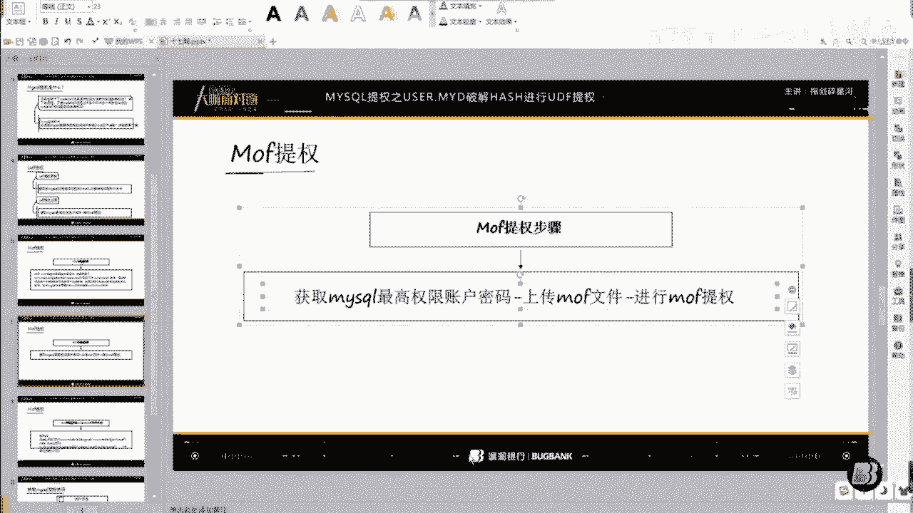

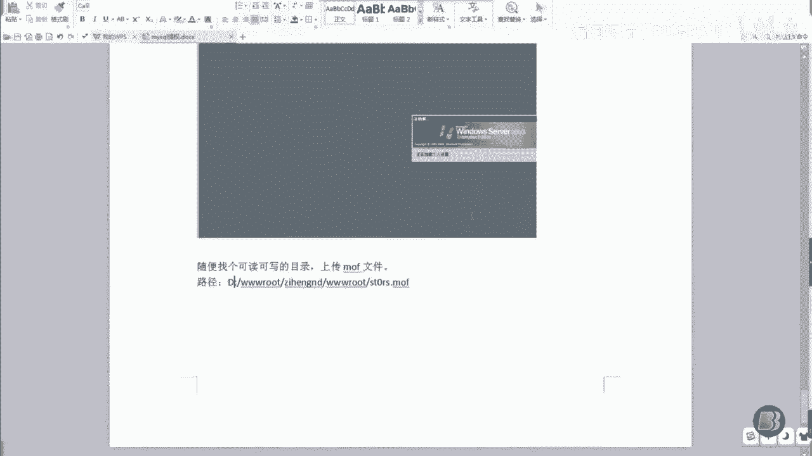


5.  然而，新添加的用户默认只有普通用户权限。我们需要将其提升到管理员组。执行以下命令：
    ```bash
    net localgroup administrators test123 /add
    ```
    **关键点**：命令中的`administrators`组名必须带有`s`，这是英文Windows系统的标准管理员组名称。缺少`s`会导致提权失败。


6.  再次查看用户信息，确认`test123`用户已成功加入`administrators`组。


7.  最后，使用远程桌面（RDP）等工具，用新创建的管理员账号和密码登录服务器，至此便获得了服务器的完全控制权。


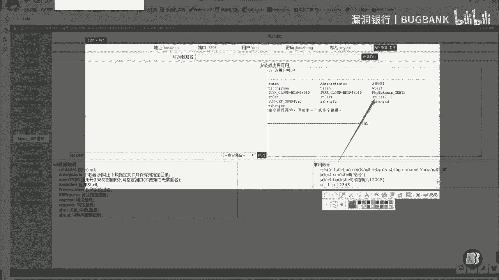


## 3. MOF提权详解 ⚙️

在掌握了UDF提权后，我们来看另一种方法：MOF提权。这种方法利用了Windows系统的一个特性文件。

### 3.1 MOF提权原理

MOF提权的原理是利用了`C:/Windows/system32/wbem/mof/`目录下`nullevt.mof`文件的特性。该文件每分钟会被系统特定服务执行一次。通过MySQL的写文件权限，我们可以用包含恶意命令的MOF文件替换它，从而使系统自动执行我们的命令。


### 3.2 MOF提权步骤

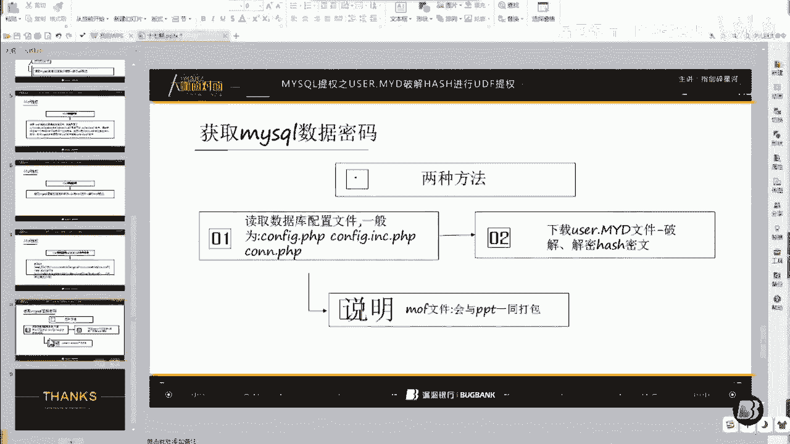

以下是MOF提权的具体步骤：


1.  **获取MySQL的root权限**：与UDF提权第一步相同。
2.  **准备MOF文件**：MOF文件内容包含要执行的系统命令。例如，一个用于添加用户的MOF文件核心部分如下：
    ```bash
    #pragma namespace("\\\\.\\root\\subscription")
    instance of __EventFilter as $EventFilter
    {
        ...
    };
    instance of ActiveScriptEventConsumer as $Consumer
    {
        ...
        ScriptingText = \"var os = getObject(\\\"winmgmts:\\\\\\\\.\\\\root\\\\cimv2\\\"); os.Get(\\\"Win32_Process\\\").Create(\\\"net user mofuser Password123! /add\\\");\";
        ...
    };
    ```
    你可以看到，其中嵌入了`net user`命令。
3.  **上传MOF文件**：将准备好的MOF文件上传到目标服务器上一个有读写权限的目录。
4.  **执行MySQL语句**：通过MySQL的`load_file`和`into dumpfile`函数，将上传的MOF文件内容写入到系统的`nullevt.mof`路径。执行的核心SQL语句如下：
    ```sql
    select load_file(‘C:/path/to/your.mof’) into dumpfile ‘C:/Windows/system32/wbem/mof/nullevt.mof’;
    ```
    **注意**：SQL语句中的括号和引号必须是英文符号，否则执行会失败。

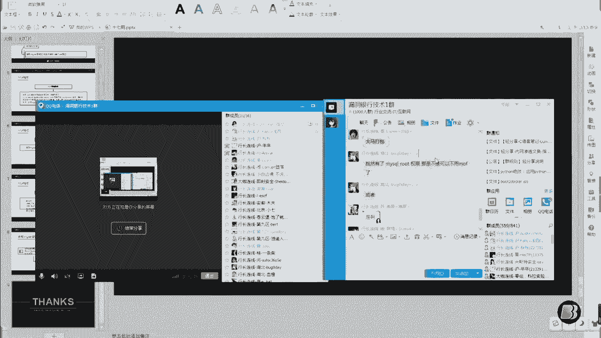


5.  **等待执行**：由于MOF文件每分钟被系统执行一次，因此上传并替换后需要稍作等待。之后，可以查看是否成功添加了用户。
6.  **提升用户权限**：如果需要，可以修改MOF文件中的命令，将已添加的用户提升至管理员组，然后重复上传和执行步骤。


7.  **登录验证**：最终，使用通过MOF提权创建的管理员账户登录服务器，验证提权成功。


## 总结 📝

本节课中我们一起学习了两种重要的MySQL权限提升技术。
*   **UDF提权**：通过获取MySQL的root密码，创建自定义函数来执行系统命令。关键在于找到密码文件并正确解密，以及在提升用户权限时使用正确的管理员组名（`administrators`）。
*   **MOF提权**：利用Windows系统`wbem/mof`目录下文件的定时执行特性，通过MySQL写入恶意MOF文件来执行命令。关键在于文件上传路径的权限和SQL语句的正确性。

这两种方法都能在特定条件下有效提升权限，但都依赖于获得MySQL数据库的高权限访问能力。在实际安全测试中，请务必在获得合法授权的环境中进行，并理解每一步操作背后的原理与风险。