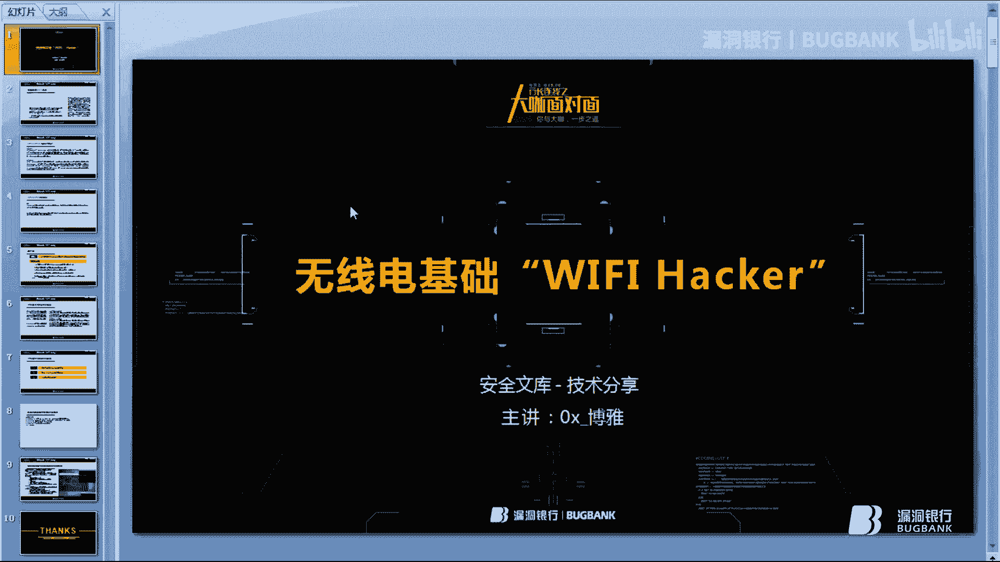
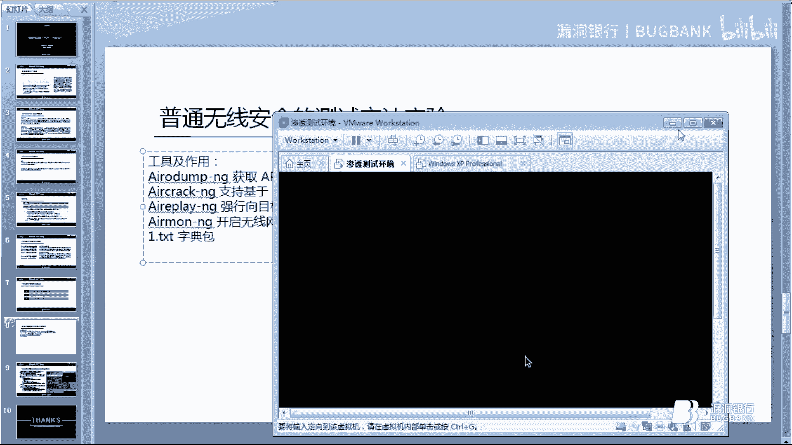
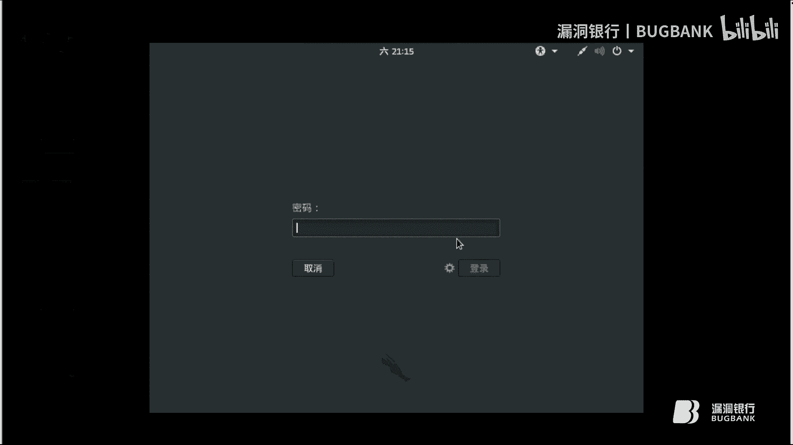
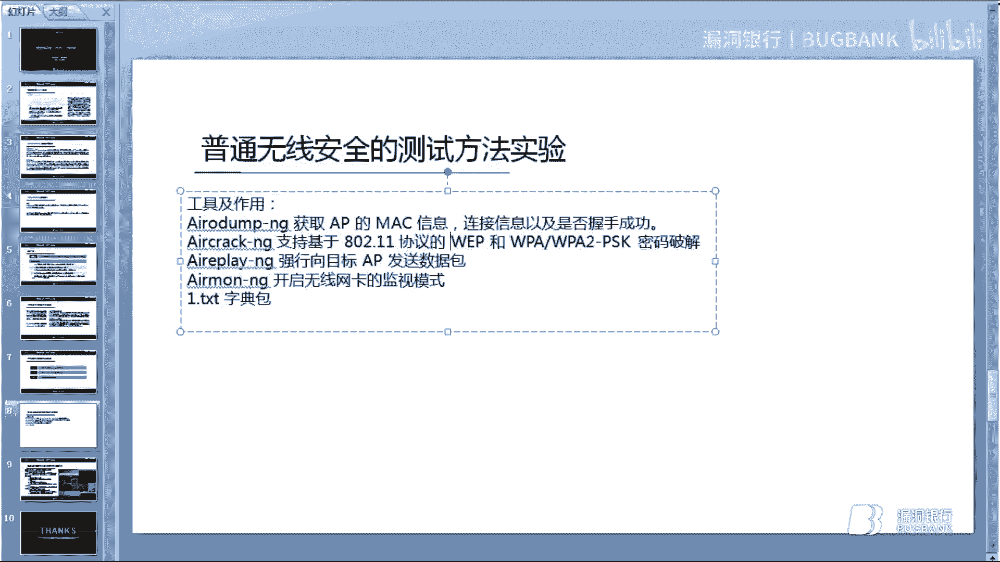
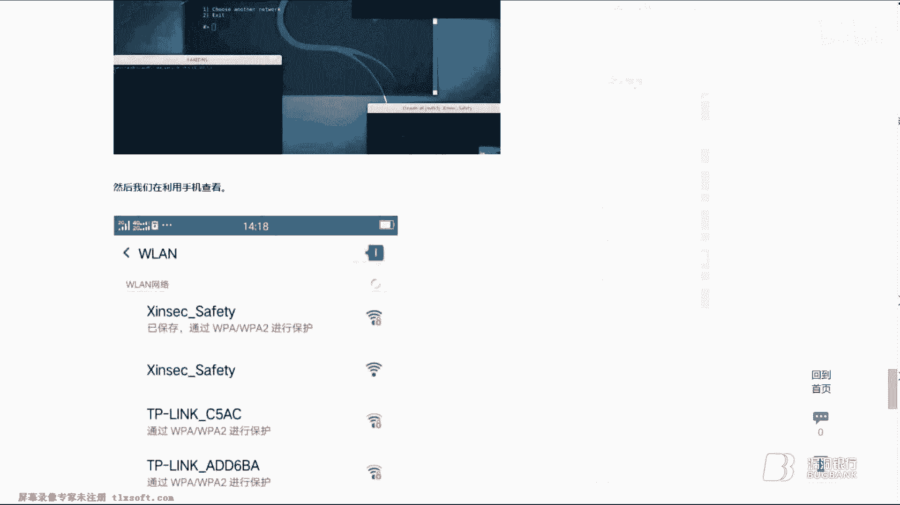
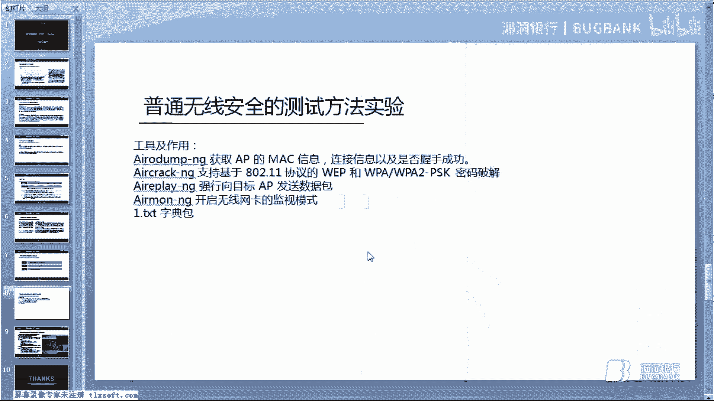

# P1：18【录屏】初探无线安全WIFI HACKER——第十八期大咖0x_博雅分享 - 漏洞银行BUGBANK - BV1Ty4y1a74Y

Yeah。Yeah。hello，大家好，我是来自安全轮库的博雅。啊，我今天给大家带来一课无线电基础wifi黑客。嗯。

这一期的话咱们就作为漏洞银行的第18期大咖面对面来系统的学习一下呃无线电方面的一些基础基础性的理论知识，以及如何运用那个linux卡利系统下的一些无线测试环境来对于无线电安全。

无线安全进行一些嗯安全测试。

然后快速读懂wifi信道嗯。这个wifi信道的话，它总共是有14个新道，它就像这个图图中跟大家所示的这一种，它分别。分为1234567到14。然后咱们国家的话，它那个信道划分是13个无线路由器信道。

它和那个对讲机的频道频道类似。就是说它是用那个无线信号作为传输媒体的数据数据信号传送通道了，是一个传送通道。然后大家可以把它理解为就是空间中不同的一个频段。就是说所有的无线设备、手机、电脑。

还有无线路由、收音机，这些都混杂在电磁波里面。然后呃在这边跟大家要讲一个注意点，就是说这个新道。大家可以看到啊，我这一个东西的话，它是那个360360安全路由器。这个是去年参加那个360wifi。嗯。

破解大赛路由器破解大赛的时候送的一个。然后先来看一下它这个功能，它这边的话这个是名称，然后这个是加密方式，加密方式它这边有WPA和WP22个标准。

后面咱们也会进行系统的讲解一下这个WP和WP2这两个标准。然后他在这边有一个无线信道，无线信道的话，这边有一共有13个一共有13个。然后为什么在这边要讲一下无线信道。

就是这个无线信道它是会进行互相干扰的。好比说现在有两个两个wifi同时都处于这个信道一上。当这个信道上面传输过大量的就是流量，网络流量之后，它这它这两个它这个信道上的两个wifi。

它都会造成那个数据数据之间的相互干扰，就是造成那个网络延缓，还有就是。哦。网速网速不佳等等等等。这些都是由于这个处于同一个频段上，同一个信道上面，然后它会造成那种就是说信号干扰。

然后WP和WP2它这个介绍。就是这个wifi的加密方式。介绍的话主要是有两种WPA它是一个wifiproedac，它是那个由那个wifi安全联盟做出来的。

它们是一种保护无线网络、无线电脑网络wifi系统的一个。一个安全的系统，就是说呃当你手机要连接这个wifi的时候，你就必须要输入它这个设置的密钥。当你把那个密钥连接呃，输入上去成功之后。

它才够它才能够为你提供网络服务。它这个是。建立在前一代WEP上面产生的就是说WEP它由于这个漏洞太多。咱们国家有些人的话就是在08年或者是07年的时候，他们家里那个wifi上面路由器上面是有那个功能的。

就是说WEP加密。现在咱们这个都没有了。老老版本的那个路由器上，它都有WEP加密的。但是那个WEP它弱点太多，可以说基本上是密码秒破。所以说后来在WEP的那个基础上，嗯。

人们就产生了这一种造出了这一种WPA的加密方式。WPA2的话，它是那个也是wifi联盟做的，它是对于那个WPA就是进行了一个更加高级的算法，就是在WPA它这个加密的基础之上，然后再进一次的进行加密。

再进行一次加密。然后就是说WP2它现在是基本上主流的那种嗯wifi安全保护策略里面的主流的一种。然后他们两个的区别的话就是说WP和WP2，他们采取的那个算法，加密算法是不同的。

WP它是WP2的跟低级的加密。也就是说WP2它比WPA是要更加高级的，就是安全可靠。然后他们现在都支持那个新型的网卡。然后。记WEP之后，因为它那个WEP加密是不够安全的。

所以就出现了WP和WP22个加密算法。在这两个加密算法之上。就是说现在如果要破解wifiwifi密密钥的话，就是必须要进行跑密码包跑密码包，然后你才可以可以跑出来这个东西。握手包。

握手包的话就是咱们之前跟你们说的，就是你如果手机要连接一个wifi，你就必须通过一个握手协议。这个协议就好比说是一个握手，然后就咱们就把它叫为握手包称为握手包叫做握手包。然后它这个握手申请。

当它一个就是手机手机它连接一个wifiwifi的时候，它就会首先握出发出一个信息，好比就说是你好，然后这个时候就是说它在连接这个wifi。然后它这个wifi它收到这个信息之后，就会返回去问说是你是谁。

然后。然后他会说是这这个是我的名片，然后哦原来是自己的，如果说你输入的那个密码是正确的话，他就会返回这样一个信息。就是说哦原来是自己，然后就让你使用它这个wifi网络。如果说你输入那个密钥错误。

它这个是进行不认的。好，咱们先把那个网卡外置进去，外置的网。加进去。嗯。然后，根据网络示意的话，它这个握手包它就是指无线AP嗯，和它的一个合法客户端在进行认证的时候。

捕获信息原文和加密或密文的这样一个协议。握手握手协议也就是。俗称的握手协议，这这就是握手包的原理。然后干扰通讯验证红水攻击。这个东西的话就是说很多人对于他来说就是特别好理解。

就是说把他理解成为D到ss一样的攻击的话，就是特别特别容易。将它理解为ddos是特别特别容易的。因为。因为这个。验证红水攻击它主要的目的。主要的作用主要的目的，它就是用来。进行那个通讯干扰，通讯干扰的。

它和那个无线AP建立联系之后，他会把那个AP发送大量的伪造的那个身份验证请求。身份验证请求就是说在某一时刻之内，它会向你那个路由器发送很多的连接连接信息，就是要跟你握手。

然后你那个当你那个无线路由器承受不了这个这个压力的时候，它会自动断开和那个手机的所有的连接。也就是在这样一个过程中完成了抓包，完成了抓握手包的这样一个过程。干扰通讯，大家可以将它想象为D到死。

就是拒绝服务式攻击。🤧咳。网络拒绝服务攻击的一种形式。将它作为ddos的话，就是对比一下，就是更更容易的可以理理解这个东西。然后干扰通讯沿重洪水攻击，它主要可以做这样三点，一是。可以干扰通讯能力。

造成通讯的干扰。第二个是它和那个L杠G那个套件进行无线攻击。然后第三个它是经常被人们用来做无线安全测试。然后在基础概念讲完之后，咱们就直接开始那个普通的无线安全的那个测试方法的实验。嗯。工具在这里的话。

工具的话，咱们用这个air杠G这个工具，它可以破解WP和WP2的一个密钥。然后还需要一个字典包，字典包的话就是说一个密码包吧。这就是咱们所说的跑包，嗯，就是说当你那个密码包足够大的时候。

你抓到它那个握手包之后，你就可以用这个air杠G这个工具来进行跑包。当它把那个密码跑出来的时，如果你那个密码包里面就是特别大里面包含了许多密码的时候，很有可能它这个wifi的密码就暴露在这个里面。

好比说一些弱口令密码，像edmin艾min123，还有就是那个12345678，或者说是那个数字一串数字连接的那些都可以通过这个密码包来破解。然后咱们就直接进入正题。

哦，有点慢啊。

它这一个密码包的话，它主要就是。配合那个aircon杠G来进行破解了。就是说有很多人他不是很理解这个密码包，说是哦，那我那个密码包太小怎么办？太小的话，你可以去那个某宝上面。某宝上面有那个专门跑包的人。

就是说他们。自配自配有十几台服务器，一直在那边24小时在跑包。24小时在跑包，然后通过他们的那个强大的数据包，可以跑出来很多的东西。也就是说你只需要抓住那个握手包，你就给他们，让他们跑。

然后他们就会帮你跑出来那个密码。我记得在13年的时候，好像是10块钱一次。这几年我没有试过，这几年我自己有那个密码包，没有用过他们的。好，然后咱们看一下。好，他这边是有一个无线网卡的。

关0这个是无线网卡。然后咱们开启一下。阶梯模式。好，他这个现在是开启不了电梯模式。能不能重启一下网卡？通启网卡是需要4条命令的。然后咱们用这44条命令，4条命令直接来重启这个网卡。然后进入那个GT模式。

哦后，start。关离。对啊。这边这个。输错了。嗯。好，直接进入它这个监梯模式。现在的话可以看到。他这边一共是有5个wifi，一共是有5个wifi。然后咱们现在需要破解的是这个新SEC这个。

就是我设置好了这个wifi名称的这个，然后咱们就直接通过破解这一个来看一下它那个aircom杠D套件是如何进行无线安全方面的一些东西的。好，让我们直接考拖加C。然后让他直接开始抓包。抓包文件名的话。

咱们就命名为。最新吗最新。这个信道的话是一。在前面跟大家讲过，它这个信道如果相同的话，它会造成那个通讯干扰。现在的话你看在这样一个wifi上面，一个wifi信道上面，它一共有一在一的wifi信道上面。

现在周围的这些局域网里面，它一共是有3个是处于同一个信道上面。所以说它这个网络网速会特别特别的慢。好，直接让它进行抓包。他现在是一直在抓这个。在处于一信道上面的这细胞。然后我现在需要看一下我手机的那个。

IDmark地址。通过抓我手机的包，然后来。看那个好。12A这个。哦，是这个。然后咱们现在就用用前面跟大家讲到的那个验证红水攻机来进行无线安全的测试。通过应用验证红水攻击将它这个无线。

无线的那个客户端打下线，就是在打下线的这一个过程中呢，然后咱们现在是一直在进行网络数据包抓取的，就在这一个过程当中，他就会抓到那个握手包。然后现在咱们直接开始。好，现在咱们接着继续来。进行验证洪水攻击。

在这边需要他那个BSSID。怎么就直接将这个BSSID直接复制上去。嗯。后面是紧跟着他那个mark地址。好，然后进行1次验证洪水攻击。这个时候我会发现我这个手机的那个。wifi现在他已经掉。

然后咱们再连接这他攻击的过程中，咱们再连接。这个原理是什么？原理就是当你那个无线网络自动掉线之后，它那个手机客户端这边它会自动去继续连接你所保存的那个wifi的密码。呃，保存wifi密码的那个wifi。

它会自动去连接这个东西。就在它连接的过这个过程中，然后你就发到了那个握手包。好，咱们这边一共是来了20次的那个验证活水工具。然后咱们现在抓包清。呃，进行密码拆解。将它命名为1234。我们双击把它打开。

先看一下这个密码包。它这个是由很多的数字，这些东西一起组合而成的一个东西。这个。我这边直接把这个密码添加进去。就是说当你这个密码包足够大的时候。

通过你抓子的握手包，它就可以进行那个wifi密码安全的一个测试。然后咱们再把它那个招包的文件看一下。刚刚咱们抓到那个是最新能开源属性。他这个是网络包抓取，这个都是网络数据包。怎么叫它直接复制过来。

然后直接回车，它这边会出现很多的这个。这个wifi。然后。现在就是说咱们选择，因为咱们选择破解的是这个，咱们就直接选择三，让它进行破解。好，直接密码秒破。soft点Og就是这个。看到他这个密码是一样的。

破解的东西也是一样。然后现在普通的无线安全测试完了之后，要跟大家分享的一个是收微工程学和无线安全的，它那个完美的结合版。嗯，主要是利用这样一款工具。这样一款工具，它现在已经在那个。g the沪省北京。

嗯，显示页面404，这个工具现在已经消失了，但是我这边还是有备份，然后现在已经将这个上传到网络上，大家可以百度搜索，然后可以找到。找到这一款软件。然后它是用来做无线安全测试的。

然后它的原理呢主要是一它能够扫描那个wifi信号。第二个的话，它能够抓到握手包。这一步它主要是为了验证那个wifi密码是否正确的。然后第三个他会使用那个web接口。第四个它会。

使用一个假的AP来模拟那个原本的接入点。然后。百度看一下啊。我之前写过这样一篇文章，然后被。搜狐网和腾讯被搜狐和腾讯那边被人转载。哦，这个是我的一片，然后底下这个也是我的一片。这个也是我的一篇。

都是一样的。嗯，这个是被那个华东网的那个黑白之道，他们给我转载了一下，这个是关于这个软件的安装的一个过程。安装的一个过程。咱们就在这边不简单的介绍这个安装过程，直接就开始。呃。

我跟大家讲一下这个工具的使用方法。直接进入。他这边让你选择语言，咱们就直接选择6cheese。现在他让他需要扫描一个信道，咱们就默认让他扫描所有的新道。这个是一件式的，不需要咱们做太多的处理。

就是傻瓜式的操作无线安全操作。嗯。好，看它扫描差不多的时候，咱们就把这个。叉叉掉他现在扫描到的这些东西。咱们需要破解的是这个，然后。5咱们就直接选择5。好，现在他让你就是说选择一下暴力破解的话。

就是跟咱们上面讲到的这个普通的无线安全。测试是一样的。然后咱们现在选择伪装AP，利用社会工程学方面的一些东西。好，他现在说是让默认默认要存储到这个路径里面，将抓到的握手包存到这个路径，咱们就直接回车。

让它存储，然后选择一不要 ground杠G。然后继续回车一。好，现在这边弹出两个框，这个就是前面跟大家演示那个普通无线破解的时候，他用到的那个验证风水攻机。然后这个的话它是在进行抓包。

他这这两个它就是一个一键式的，就是说他通过抓包来。进行这样一个东西。好，现在我这个wifi已经掉了。赢掉了。好，然后咱们检测一下握手包。好，现在。直接一回车。好，他现在让你选择一下攻击的目标。

攻击的方式，咱们就一选择web伪造方式。然后他这个的话也是让你选择一下语言，然后咱们就直接选择7。然后它这边就会自动伪造出来一个无线AP让你进行连接。然后。就在这个过程中。

它伪造出这个无线AP让你进行连接的时候。大家可以看一下这个页面。

好，现在一共是出现三个框。四个号啊。5个孔。

它出现这5个框的话，它现在就是在进行一系列的攻击。然后大家现在可以看到这个图片的话是我之前截到的。嗯，然后现在讲的话效果它也是一样的，可以看到它现在一共有两个无线无线网络，一个是这边有锁子的，是加密的。

一个是没有加密的。这个有锁子的这个。是咱们需要是咱们进行需要那个无线安全测试的一个wifi。然后这个的话是没有没有锁。就是说当它验证洪水攻击的时候，会把这个有锁的这个wifi打下线，手机连接不上。

然后就在这个过程中的话，你那个手机，因为它自动保存了你那个wifi的账号密码，连接的那个密钥。然后它会自动连接这这样一个名称的一个wifi。当它连接不上这个的时候，它会选择第二个连接。

选择第二个连接之后，它就会出现一个web页面。它就会出现一个外部页面出来。好，我现在我看一下我手机上昨天有没有保存啊。它在这边的时候，它会出现一个外围页面。把那个we部页面。出现之后，咱们就。

这个时候他会。出现一个那个。然后当他那个手机在连接上这样一个第二个的这个wifi的时候，它会自动出现一个呃页面脚本。当你就是说当你手机连接上之后，你手机点击浏览器进去之后。

它会自动跳转到一个web页面上。这个web页面就是咱们在之前选择好的这个在这一块选择好的一个页面，咱们选择7码chse汉语面板。然后他会说是你那个wifi现在存在一个安全问题。需要你输入那个密钥。

然后当你输入那个密钥之后，它这一个攻击就会完成，它这些5个框都会自动结束。然后他那个密钥就会以这一种形式展现出来，以这种形式展现出来。跟咱们上面的那个展示方式是一样的。只不过在这里的时候。

咱们就用到了那个类似于wifi钓鱼，类似于wifi钓鱼的一个原理。但是它跟wifi钓鱼又不一样，不一样之处在于。wifi钓鱼的话，它只是那种普通的钓鱼，它没有其他的方式，对吧？然后。

它是只是一个普通的钓鱼。咱们这个的话，它他这个抓到握手包之后，他拿到你那个密码之后，他还要跟那个握手包进行一下匹对。如果那个匹对成功，就说明你那个wifi是正确的。咱们在上面进行普通无线测试的时候。

它会出现错误。就是说如果你那个密码包不够强大，它会随机给你出一个密码，就说是它破解出来这个密码了。但是这个不同，这个它会把你输入的那个密码直接就是说是进行跟那个握手包进行匹对。如果匹对成功。

它那个密钥就会直接出来。

嗯，好的，本期的话就无线安全的基础方面的话，就先跟大家分享到这。Yeah。

