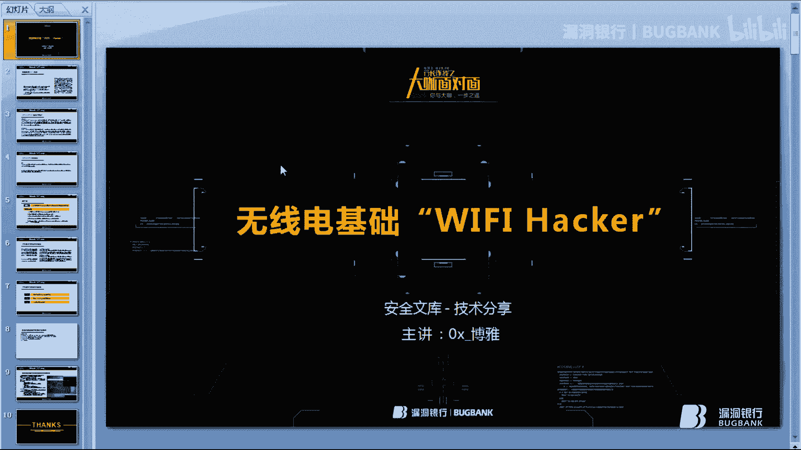
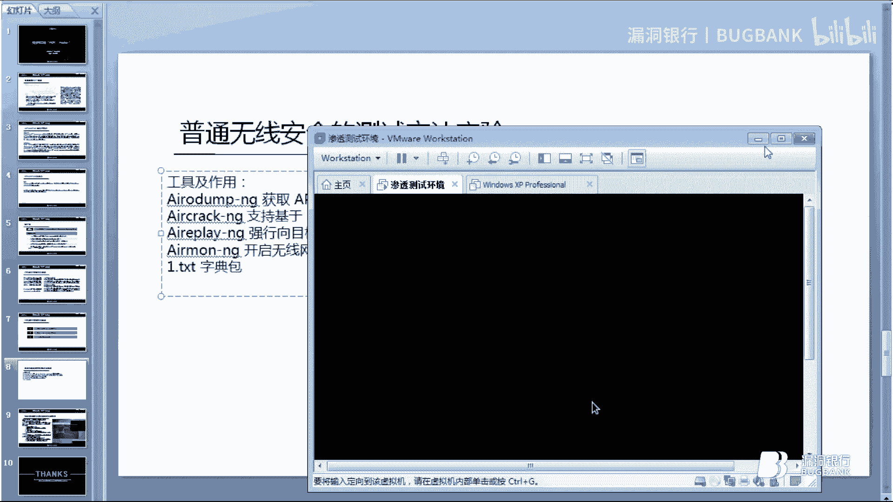
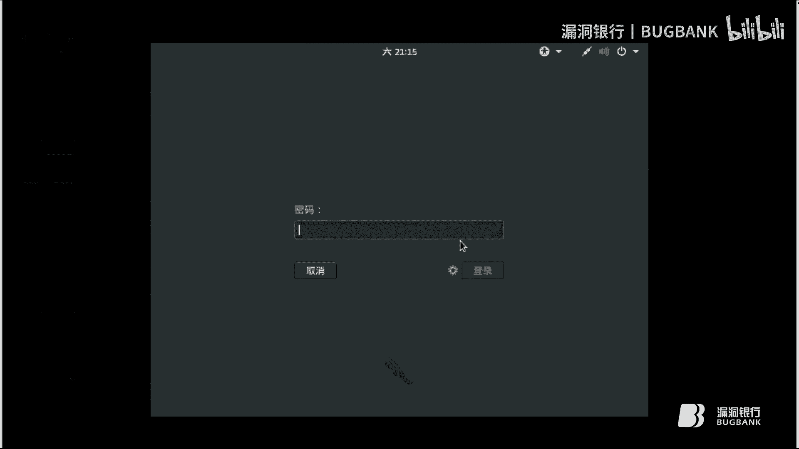
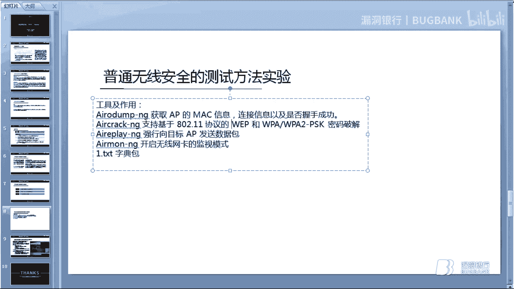
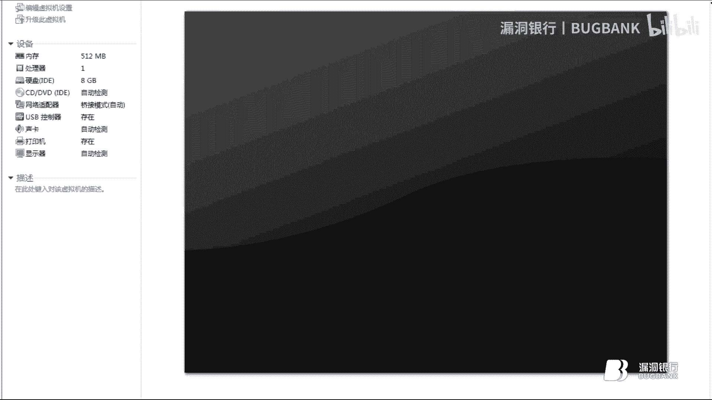
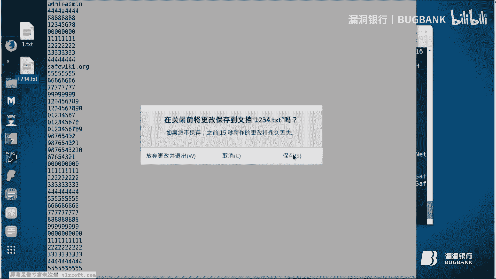
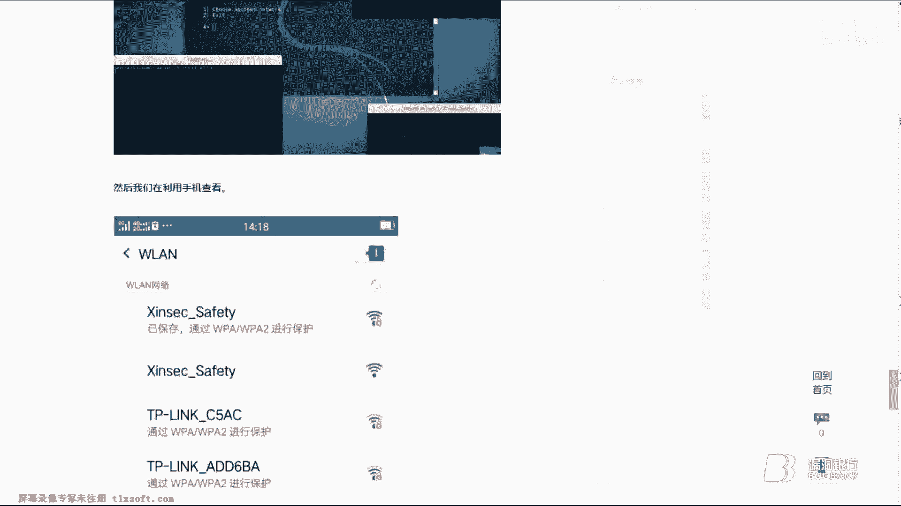
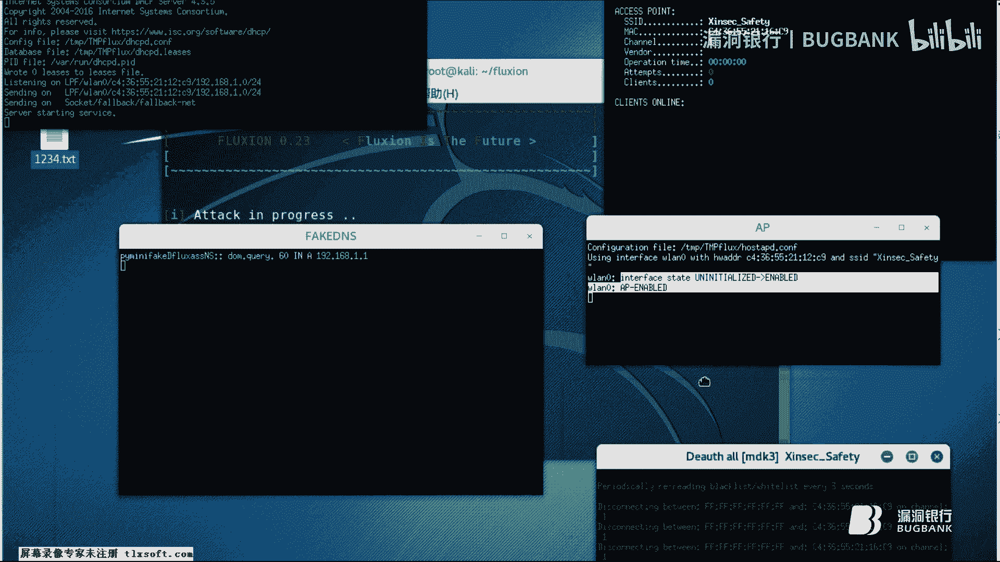
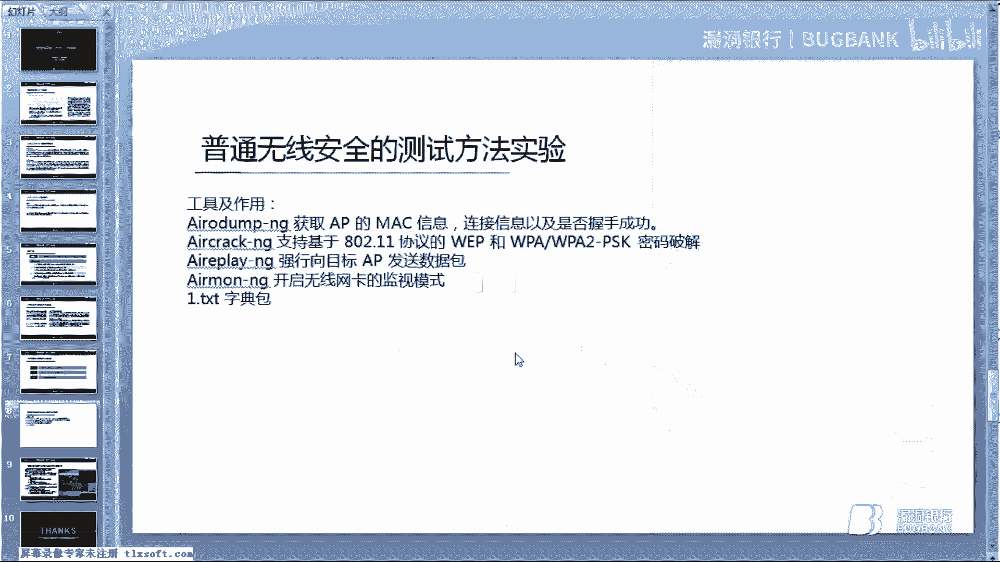

# 无线安全基础教程 P1：初探WiFi安全 🔐



在本节课中，我们将系统地学习无线安全的基础理论知识，并了解如何在Linux Kali系统下搭建无线测试环境，对WiFi安全进行测试。

## 概述：WiFi信道与加密标准 📡

上一节我们介绍了课程目标，本节中我们来看看WiFi的基础概念。

WiFi信道总共有14个，如图所示，它们分别是信道1到14。在我国，无线路由器信道划分为13个。WiFi信道类似于对讲机的频道，是使用无线信号作为传输媒体的数据信号传送通道。可以将其理解为空间中不同的频段。所有无线设备，如手机、电脑、无线路由器、收音机等，都混杂在电磁波中。

以下是关于信道的一个关键点：
*   当两个WiFi同时处于同一个信道（例如信道1）时，如果该信道上传输大量网络流量，会造成两个WiFi之间的数据相互干扰，导致网络延迟和网速不佳等问题。

## 核心加密标准：WPA与WPA2 🔒

上一节我们了解了信道，本节中我们来看看保护WiFi的加密方式。

WiFi的加密方式主要有两种：WPA和WPA2。它们是WiFi安全联盟制定的，用于保护无线网络（WiFi系统）的安全系统。当手机连接WiFi时，必须输入正确的预设密钥才能获得网络服务。

这两种标准建立在早期的WEP加密之上。由于WEP漏洞太多，基本上可以秒破密码，因此后来在其基础上发展出了WPA加密方式。

以下是WPA与WPA2的核心区别：
*   **WPA2** 是在WPA基础上采用更高级算法再次加密的版本。
*   WPA和WPA2采用的加密算法不同，WPA2比WPA更安全可靠。
*   它们都支持新型网卡。在WEP因不安全被淘汰后，WPA和WPA2成为主流加密算法。

## 破解原理：握手包与验证洪水攻击 ⚔️

了解了加密方式后，我们来看看安全测试中涉及的核心概念。

目前要破解WiFi密钥，通常需要进行“跑密码包”。这个过程的核心是捕获“握手包”。

握手包是指当手机连接WiFi时，必须通过一个握手协议。这个过程类似于双方打招呼确认身份。如果输入的密码正确，WiFi（AP）就会允许设备接入网络；如果密钥错误，则连接失败。

根据网络定义，握手包是指无线AP与其合法客户端在进行身份认证时，捕获信息原文和加密密文的协议，俗称握手协议。

接下来介绍“验证洪水攻击”。很多人容易将其理解为类似DDoS（分布式拒绝服务）的攻击，这有助于理解。






验证洪水攻击的主要目的是进行通讯干扰。攻击者与无线AP建立联系后，会向AP发送大量伪造的身份验证请求（即握手请求）。当无线路由器无法承受这种压力时，它会自动断开与所有客户端的连接。正是在这个过程中，攻击者完成了抓取握手包的操作。







可以将验证洪水攻击视为网络拒绝服务攻击的一种形式。与DDoS类比，更容易理解这个概念。

以下是验证洪水攻击的主要作用：
*   干扰通讯能力，造成通讯干扰。
*   与`aircrack-ng`套件配合进行无线攻击。
*   经常被用于无线安全测试。

## 实践演练：使用Aircrack-ng进行基础破解 💻

在讲解了基础概念后，我们现在开始进行普通的无线安全测试实验。

本次实践使用的工具是`aircrack-ng`套件，它可以用于破解WPA和WPA2密钥。此外，还需要一个“字典包”（密码包）。

所谓“跑包”，就是指在捕获握手包后，使用`aircrack-ng`工具，利用庞大的字典包来尝试匹配密码。如果字典包足够大，包含了常见的弱口令（如`admin`、`admin123`、`12345678`或连续数字等），那么WiFi密码很可能被破解。

有些人可能担心自己的字典包太小。解决方案是，可以寻求某些在线服务，他们拥有多台服务器和强大的密码数据库，专门提供“跑包”服务。用户只需提供抓取到的握手包，他们就能尝试破解出密码。

现在，我们进入正题，开始演示。

**步骤演示与命令说明**



首先，我们需要配置无线网卡。假设无线网卡接口为`wlan0`。

1.  **开启网卡监听模式**：将网卡设置为监听模式以捕获数据包。
    ```bash
    airmon-ng start wlan0
    ```
    如果无法直接开启，可能需要先关闭干扰进程，然后重启网卡接口。
    ```bash
    airmon-ng check kill
    ifconfig wlan0 down
    iwconfig wlan0 mode monitor
    ifconfig wlan0 up
    ```

2.  **扫描周围WiFi网络**：使用`airodump-ng`扫描。
    ```bash
    airodump-ng wlan0
    ```
    此命令会列出所有可探测到的WiFi网络，包括其BSSID（MAC地址）、信道、加密方式等。

3.  **针对目标网络抓包**：锁定目标WiFi（例如名为“TestWiFi”，BSSID为`AA:BB:CC:DD:EE:FF`，信道为6）进行数据包捕获。
    ```bash
    airodump-ng -c 6 --bssid AA:BB:CC:DD:EE:FF -w capture_file wlan0
    ```
    *   `-c 6`：指定信道。
    *   `--bssid`：指定目标AP的MAC地址。
    *   `-w capture_file`：指定抓包文件的前缀名。
    *   此命令会持续捕获该网络的数据流，等待握手包。

4.  **发起验证洪水攻击以获取握手包**：为了加速获取握手包，我们主动将已连接的用户踢下线，在其重连时抓包。打开另一个终端。
    ```bash
    aireplay-ng -0 10 -a AA:BB:CC:DD:EE:FF -c Client_MAC wlan0
    ```
    *   `-0 10`：表示进行10次验证洪水攻击（deauthentication攻击）。
    *   `-a`：目标AP的BSSID。
    *   `-c`：目标客户端的MAC地址（如果不知道，可省略此参数攻击所有客户端）。
    *   执行后，目标客户端会断开连接并自动重连，此时在第一个终端的抓包窗口中就能捕获到握手包。

5.  **使用字典破解密码**：捕获到握手包后（通常`airodump-ng`窗口右上角会显示“WPA handshake”），使用`aircrack-ng`进行破解。
    ```bash
    aircrack-ng -w password_list.txt capture_file-01.cap
    ```
    *   `-w password_list.txt`：指定字典文件路径。
    *   `capture_file-01.cap`：指定包含握手包的数据文件。
    *   工具会开始尝试字典中的每一个密码。如果密码在字典中，则会成功显示出来。

## 进阶结合：社会工程学与无线安全 🎣



在完成普通的无线安全测试后，本节介绍一个将社会工程学与无线安全完美结合的进阶工具。



该工具的原理是多合一的：
1.  扫描WiFi信号。
2.  捕获握手包（用于后续验证密码正确性）。
3.  使用Web接口。
4.  创建一个伪造的AP来模拟原始接入点。

**攻击流程简述**

工具运行后，会扫描网络并让用户选择目标。选择“伪装AP”和社会工程学攻击方式后，工具会自动执行以下步骤：
*   对目标加密WiFi发起验证洪水攻击，使其掉线。
*   同时，创建一个与目标WiFi同名但**未加密**的伪造AP。
*   当用户的设备因原WiFi掉线而自动尝试重连时，会连接到这个伪造的开放AP。
*   一旦连接，用户的浏览器可能会自动弹出一个伪造的Web页面（例如“网络需要认证”或“系统升级需输入密码”）。
*   当用户在伪造页面上输入WiFi密码时，该密码会被攻击者获取。
*   工具随后会用这个获取到的密码去验证之前捕获的握手包。如果匹配成功，则确认密码正确，攻击完成。

这种方法与普通“WiFi钓鱼”不同之处在于，它不仅仅是通过欺骗获取密码，还会用获取的密码与真实的握手包进行技术验证，从而确保密码的准确性。

## 总结 📝

本节课我们一起学习了无线安全的基础知识。我们从WiFi信道和WPA/WPA2加密标准讲起，理解了握手包的概念和验证洪水攻击的原理。随后，我们实践了使用`aircrack-ng`套件进行基础的WiFi密码破解流程。最后，我们探讨了一种结合社会工程学的进阶攻击方法，它通过创建伪造AP和钓鱼页面来更高效地获取并验证密码。




希望本教程能帮助你建立对无线安全测试的基本认识。请注意，所有这些技术应仅用于授权的安全测试和学习环境，未经授权攻击他人网络是非法的。