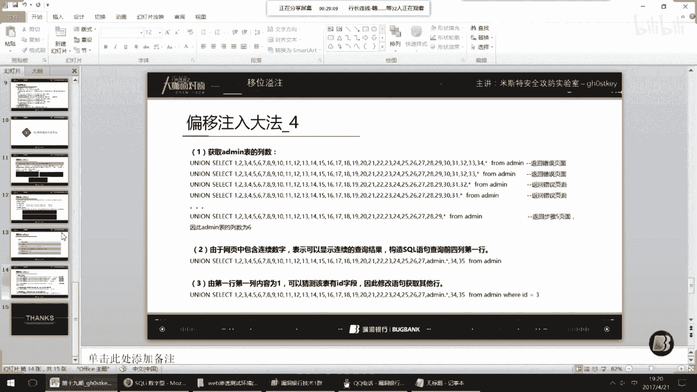

# P1：19【录屏】SQL注入扩展-移位溢注——第19期大咖gh0stkey分享 - 漏洞银行BUGBANK - BV1UX4y1G72X

(音樂)。

各位網友們，晚上好！歡迎收看《有肉的銀行大主辦的大咖面對面》第19期，我是主持人Fancy，今晚交由Mr安全團隊核心Ghostkey大咖來為我們分享，SQL注入或者VM注入，難度係數三顆星。

大咖演講期間，希望大家能多多和大咖互動交流，但請避免探討、分享沒有人關的話題，保持對大咖的尊重，OK，那我們現在就有請我們的Ghostkey大咖開始演講吧，可以開始咯，嗯，好。

今天咱們講的這個東西叫一味易注，是基於偏移注之上研究的，但是這個技術呢是已經不需要偏移注的那種方法了，那麼我是來自Mr安全工房實驗室的Ghostkey，有不對的地方請多多指教，這是關於我們。

大家可以簡單的看一下，好，今天這節課呢有四個，一，什麼是一味易注，二，了解偏移注，三，一味易注大咖來演，四，Mr的小廣告，好，第一個我們進入什麼是一味易注，相信大家在剛入手這個SQL注入的時候。

肯定都玩過ASP加AXES的這樣一個搭配，對吧，那麼在這個AXES的數據庫類型注入的時候，我們獲取不到列名，但前提是能獲取到表名的時候，我們一般會選擇使用偏移注這個技術。

但這種注入方式呢往往借助的是個人的一個人品，且其步驟繁瑣，那麼在本課程中我們研究了新的一種注入技術，讓偏移注不再需要人品，在這裡我們定義這種注入技術為一味易注技術，在這裡呢這種技術完全可以應用到。

PAP加MySQL的這樣一個環境中去使用，好我們進入第二個了解偏移注入，可能有些人不知道什麼是偏移注入啊，之前也說過了獲取不到列名，前提是能獲取到表名的時候使用偏移注入，它的普通步驟就是判斷注入點。

然後order by得到一個它的列數，第三個就是表名，第四個聯合查詢，第五個獲取表中的列數，就是相當於是使用一個聯合查詢，第六個就是開始偏移注入，對吧，那麼這時候呢我們來實際操作一遍。

一開始我們判斷15點數存在使用AND 1等於1，對吧返回正，AND 1等於2返回假，那麼這個真假判斷呢是根據正常頁面訪問，以及你的語句是否跟正常頁面相符，去判斷的，那麼這時候存在注入。

我們先去判斷這個步驟，order by啊，一般我們取一個最大的50，好它報錯了，取一個中間數吧，25返回正常，然後我們再去再往前取一下，35呢，然後取40呢，好35到40之間，36試一下。

不行35是可以，那麼這時候我們先記錄一下，35，判斷完這個之後我們來獲取一下它的表明吧，這個語句是獲取表明的，什麼意思呢，先來說一下AND是和嘛，對吧，然後這個英文單詞是。

就是檢測你這個返回的結果是否存在的，select然後sync from admin，意思就是，它到你這個admin這個表裡面去查詢所有內容，如果你是有內容的，那麼它會返回一個內容值給你。

然後這個函數它就會檢測是否存在，如果存在的話就說明這個admin這個表也存在，那麼這時候就可以使用這個語句，去判斷是否存在admin這個表，這邊我們去訪問的時候可以看到它返回是正常的。

然後這是正常的就說明它存在admin這個表，然後我們也記錄一下，先，type in admin，然後這時候有些人可能會把這個新號換成列名，但列名如果我們獲取不到呢，假設這邊獲取不到，我們就應該使用那個。

聯合殺群了，35，然後from admin，去訪問一下你會發現它顯微了，看到沒有33等等一些顯微，那麼正常的情況下是在這些位數上去寫什麼，是不是去寫這個列名之類的，那麼這時候我們沒有該怎麼辦呢。

我們先使用新號遞減，新號遞減，怎麼遞減呢，先把35換成新號，訪問出錯，我們一直遞減到它不出錯為止，一直遞減，OK遞減到29的時候它就不出錯了，這邊我們也記錄一下29，這時候我們就可以使用一個公式。

來算這個新號它代表多少，這邊使用orderby得出的結果35，減去這個新號遞減得出的結果29，等於6，那麼新號它相當於是佔6個大小，這邊123是3個大小，那麼佔6個小小就是1到6，這6個大小。

那這時候可以看到，有些時候它會直接爆出數據，看到沒有，數據就直接出來了，但是我們要得到自己想要的，就需要去使用那個片一柱，在後面加上這個公式，這個語句，去訪問的時候你會發現，它這個列數不匹配。

因為你後面加了這個東西，相當於是兩個admin了，看到沒有，它是賦予了兩個別名，admin，那這時候你需要再去減掉6個，也就是24，123，對，看到沒有，再減掉6個的時候。

你會發現它又爆出了一些數據出來，但是還是沒有獲取到有用的，這時候可以使用打亂順序法，在前面加個a。id，然後b。id，都好，它這個順序被我們打亂了，然後輸出出來，在這時候，可能你的東西。

你的想要的密碼還沒爆出來，admin888，它可能是用戶名，對吧，想要的密碼m第五值沒有爆出來，這時候我們可以使用多級片一，多級片一在後面加個，再把admin附一個別名，a。id=c。id。

前面不要忘了加一個括號，這時候我們還，因為多級嘛，它又加了一個，又加了一個，我們必須得再刪去6個，13456，那時候你去訪問，你會看到，對吧，然後我們還可以加a。id，b。id都好，就這樣，依次循環。

我們再加三級片，前面再加個括號，再選取6位，13456，再去訪問，對吧，再打亂，ok，可以看到使用多級才能爆出來，但是如果有時候你這個，order by得出的它的那個列數，它如果只有少數的幾個。

比如說沒有35個，對吧，沒有35個，只有15個，那麼你使用片一住的多級的片一住的話，那麼你需要的列數必須為很多，所以這個就需要你的人品質，有多高了，對吧，好，這是一個片一住，剛剛技巧也說了。

然後這是一個片一住的一個公式，我們再來看一下，剛剛的研究，怎麼去研究，剛剛的那個步驟呢，由於步驟6的方法需要，它的人品質，且語句很繁瑣，因此在這邊我們研究新的技術，可以看一下，我們再來回顧一下。

步驟6的語句，它是表示給table取兩個別名，步驟6取兩個別名，一個A一個B，知道吧，是兩個別名，而這個on a。id=b。id，這樣的條件是為了滿足這個語法需求，實際並沒有什麼作用。

因為相同的內容的相同內容的表，相同的字段一定是相同的，那麼這時候我們再回過頭來看一下，步驟5，看一下步驟5，它是獲取什麼，這樣一個列數，其實就遞減吧，印號遞減，由於聯合查詢中。

slack的後面添加數字的目的是為了，讓聯合查詢返回結果和正常查詢返回的結果的列數一致，如果不一致的話，數據庫就會報錯，所以為什麼我們這邊要用聯合查詢，然後把這個什麼1到35全部給列出來。

那麼如果我這邊就加個1，然後加個from，你會發現它就會報錯，對吧，這是一個，而且信號呢，一般是在咱們計算機方面，信號還有問號，它是代表通背符，這邊我們用不了問號，所以就不說問號了，信號呢。

它代表通背符，可以表示整個表格的所有列，也就是剛剛我們那個admin的所有列，它可以表示，因此通過這個數字來站位，並使用這個信號來代替table中的所有列，使得聯合查詢可以完成。

然後我們推算出這個信號的值，也就剛剛我們這個步驟，怎麼推算出信號的值呢，等於6對吧，這時候我們繼續研究，偏移柱整體公式方法，發現即使使用這個多級偏移柱，也就剛剛那個Anager嘛，多級的偏移柱。

它需要一定的概率，也就是人品值，才可以得到想要的結果，所以我們嘗試使用的新的方法，能不能替換這種不固定概率的方法，這是一個研究過程，可以來看一下，它的原的聯合查詢語句，是這樣的一個東西，對吧。

然後新語句，因為我們得知信號它是一個通背符嘛，那麼我們把信號帶進去，得到一個新語句，對吧 大家可以看一下，這其實就是一套公式啊，那以此類推，我們可以報出table的每一列內容，就是使用這個。

報出table的每一列內容，如果P<k，那麼這邊說一下，P是頁面報出的數字啊，P<k，則沒法報出P+1列至k列的內容，如果n-p<k，那麼則無法報出第一列k-，然後括號n-p的這個列，這個公式呢。

大家也不需要背了，只需要掌握一下，這個新語句的用法就行了，好，一味挹注大法來演，我們來嘗試了解一下這個，了解這個偏域柱的用法，得出新學員通過MySQL進行嘗試的發現，可用於這個偏域柱中。

一由原語句得出的，聯合查詢的目的是，構造和原網站相同列數的查詢結構，對吧，使得頁面上可以顯示，對應的數字，也就是我們這邊的顯微嘛，算數，可以看到這就是顯微，這條語句相當於是做了兩次查詢。

並將他們的結果合併，第一次是查詢了select1，然後from table，第二次做了這個select1 from table，然後將他們的結果合併，就這樣一個東西，這邊有圖啊。

然後我們為了滿足原理1的要求，保障這個聯合查詢的結果和，原網站查詢的結果的列數一致即可，那麼因此我們的table。xin號，向前移動至頁面顯示的數字處，來報出這個table列中的內容，我們來試一下。

可以看到這邊，它顯示的是2829 331，對吧，這邊我們可以換，2829 331，換6位嘛，我們xin號是代表6個，換6位，然後table。xin去查詢，你可以看到，我們這樣的注入方法還需要概率嗎。

是不是直接把這個數據給溢出出來了，相當於是溢出啊，也不算是溢出，是報出來了，那麼我們這邊15 17 18 19呢，在這邊，看到沒有，是這樣的，那麼如果你的這個結果是在這邊的，你可以推斷一下，可以往前推。

可以往前再推一位，這個出來了，或者往後推，那麼這個也能報出來，看到沒有，所以這個完全不需要你的人品質，這是一個，我們再來了解一下具體的原理吧，這邊可以看到原語句是這樣的，然後也可以變成這樣的。

假設數字45在頁面上顯示，由下圖可知啊，我們這邊是mysql的一個環境，數據已經查詢出來，已經啊，但是頁面沒有顯示，這個通過評一查詢結果偏移啊，我靠不好意思，這邊打錯了，顯示到頁面的數字上去。

即可爆出敏感字段，也就這個意思啊，這相當於就是咱們聯合查詢的一個原理，是了解了一下，就是你這個數字到底是怎麼在這個sql語句中去執行，然後怎麼給結果給你的，是這樣一個過程，然後偏移大法3。

就使用這個了對吧，判斷註入點數存在，然後order by 3獲得表明，4獲取不了獵鳴，5使用聯合查詢，6使用新註入技術，這邊我們重新再來一遍啊，了解原理之後的我們可能會懂得更加透徹一點。

首先判斷是否存在註入，OK它存在的，然後我們order by，我把這邊記錄先清空掉，50對吧，40，三數對吧，得到一個三數，判斷表明，OK，阿滋命存在，我們再判斷一下有其他表明嗎，比如說news。

好它也存在，這是一個然後咱們這邊信號，換成什麼獵鳴都獲取不了對吧，這時候我們是使用聯合查詢，然後這邊from阿滋命，顯微，顯微之後我們根據結果，使用新的註入吧，從這邊開始，23456，OK數據爆出來。

就這樣一個過程，可能認為這個註入在MySQL中用不了，實際上用得了嗎，其實是用得了的，來看一下，這是我在本地大家的環境，首先我們也正常來判斷註入對吧，and1。1，and1。2，好存在註入。

order by，這邊是3，4是不行的，3，我們聯合查詢，在這邊呢，前面我們少了一個步驟，我們也可以使用這個語法去獲取，獲取什麼東西，你這個表名對不對，是存在這個阿滋命這個表的，我們這時候呢為了。

可以看到我們MySQL，小於5。0的是不是也需要猜呀，是不是也需要猜獵鳴，以及表明，MySQL它大於5。0的，它是不是需要從那個，information streamer，那個數據庫中去取。

而且很麻煩對不對，語句很麻煩，那這時候呢，我們使用聯合查詢，3，阿滋命，然後去返回，讓它顯一下位吧，加個簡號顯位了，對吧23，那這時候呢我們可以去測試，阿滋命點新，這個新號呢，在這邊可以包括全部。

因為他們的，列數是相同的，都是三位，那這時候你可以看到，就可以把這個數據，整個給報出來了，對吧，那這個呢，可以看到這邊是一個步驟，一個步驟，這個就是一位一著。

那麼就是到這邊了，有什麼問題。

我先保存吧，好，更多：http：//fashionecstasy。com (搜尋： laptop吸 females 🔍)。

