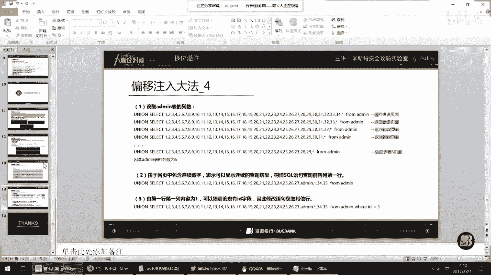
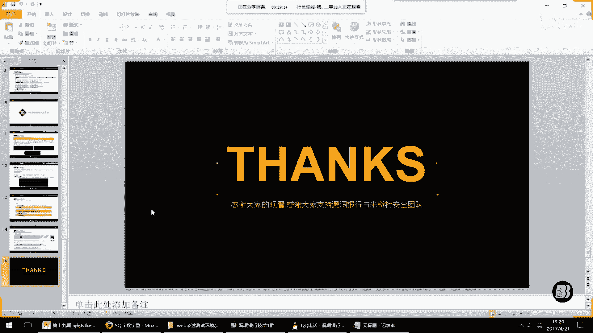

# 课程 P1-19：SQL注入扩展 - 移位溢注 🎯


在本节课中，我们将要学习一种名为“移位溢注”的SQL注入技术。这是一种在传统“偏移注入”基础上发展而来的新方法，旨在解决偏移注入依赖运气、步骤繁琐的问题。我们将从基础概念讲起，逐步深入到新技术的原理与应用。

---

## 一、什么是移位溢注？🤔

上一节我们介绍了课程主题，本节中我们来看看“移位溢注”的具体定义。

相信大家在刚接触SQL注入时，都接触过ASP搭配Access数据库的环境。在这种环境下进行注入时，如果**能获取到表名但无法获取列名**，通常会选择使用“偏移注入”技术。

但这种注入方式往往依赖个人运气（即“人品”），且步骤繁琐。在本课程中，我们研究了一种新的注入技术，让偏移注入不再需要依赖运气。我们将这种技术定义为“移位溢注”技术。

这种技术同样可以应用到PHP加MySQL的环境中去使用。

---

## 二、了解偏移注入 🔄

在深入新方法之前，我们需要先理解传统的“偏移注入”是如何工作的。

偏移注入的普通步骤如下，以下是具体步骤列表：

1.  **判断注入点**。
2.  使用 `ORDER BY` 得到查询的列数。
3.  获取**表名**。
4.  进行**联合查询**。
5.  获取表中的列数（通常使用星号 `*` 递减法）。
6.  开始**偏移注入**。

接下来，我们通过一个实际操作来演示这个过程。

首先判断注入点是否存在，使用 `AND 1=1` 返回正常页面，`AND 1=2` 返回错误页面，据此判断存在注入点。

然后使用 `ORDER BY` 判断列数。例如，尝试 `ORDER BY 50` 报错，尝试 `ORDER BY 25` 正常，最终确定列数为35。

接着获取表名。使用语句：
```sql
AND EXISTS(SELECT * FROM admin)
```
如果页面返回正常，则说明 `admin` 表存在。

由于无法获取列名，我们使用联合查询。构造语句：
```sql
UNION SELECT 1,2,3,...,35 FROM admin
```
访问后页面会显示数字位（即“显位”），例如数字33。

此时，我们将联合查询中的数字序列（1到35）替换为星号 `*` 并递减测试，直到页面不报错。假设递减到29时正常，则星号 `*` 代表 `35 - 29 = 6` 个列的位置。

传统偏移注入会使用类似以下的繁琐语句，并通过不断调整别名和顺序来尝试爆出数据：
```sql
UNION SELECT 1,2,3,...,29,a.id,b.id FROM admin as a, admin as b
```
甚至使用多级偏移：
```sql
UNION SELECT 1,2,3,...,23,a.id,b.id,c.id FROM (admin as a, admin as b), admin as c
```
这种方法需要大量尝试，成功率依赖“人品”。

---

## 三、移位溢注大法演示 🚀

上一节我们回顾了传统偏移注入的不足，本节中我们来看看新的“移位溢注”技术如何更高效地解决问题。

传统方法的核心问题在于步骤6需要概率且语句繁琐。我们的研究发现，联合查询中 `SELECT` 后面添加数字的目的，是为了让联合查询返回的列数与原查询一致，否则数据库会报错。

而星号 `*` 是通配符，可以表示指定表中的所有列。因此，我们可以利用这个特性。

我们推导出新的注入公式。假设通过 `ORDER BY` 得知列数为 `n`，通过星号递减法得知 `*` 代表 `k` 列，并且在页面显位中看到了数字 `P`。

那么，我们可以构造如下语法的查询来爆出数据：
```sql
UNION SELECT 1,2,3,...,P-1, 表名.*, P+k,..., n FROM 表名
```
这个语句的意思是：将联合查询中从位置 `P` 开始的 `k` 个占位符，替换成 `表名.*`（即该表的所有列内容）。

让我们来实际操作。假设页面在位置 28, 29, 33 显位，且 `*` 代表6列。
我们构造：
```sql
UNION SELECT 1,2,...,27, admin.*, 34,35 FROM admin
```
执行后，原本在28、29、33位置显示的数字，就会被 `admin` 表前6列的实际数据内容“溢出”显示出来。

如果数据没有完全爆出，可以调整 `P` 的值（向前或向后移动一位），例如用位置27或34作为起点来替换 `admin.*`，直到爆出目标数据（如密码字段）。

这种方法**完全摒弃了对“人品”的依赖**，通过精准的“移位”操作，直接将表数据“溢注”到显示位中。

---

## 四、在MySQL环境中的应用 💡

可能有人认为这种注入只适用于Access数据库，实际上它在MySQL中同样适用。

在MySQL版本小于5.0时，我们同样无法直接查询 `information_schema` 来轻松获取列名，传统方法也需要“猜”。

使用移位溢注技术，过程完全一致：
1.  判断注入点。
2.  `ORDER BY` 测列数。
3.  猜解或获取表名。
4.  联合查询显位。
5.  使用 `表名.*` 替换显位位置的数字，爆出数据。

例如，在MySQL中确定列数为3，表名为 `admin`，并在位置2显位。则可以构造：
```sql
UNION SELECT 1, admin.* FROM admin
```
这样就能将 `admin` 表的所有列数据，从第2位开始显示出来。

---

## 总结 📝

本节课中我们一起学习了“移位溢注”这项SQL注入技术。



我们首先回顾了传统偏移注入依赖运气、步骤繁琐的缺点。然后，我们深入分析了联合查询和星号通配符的原理，并在此基础上推导出了新的注入公式：**`UNION SELECT 1,2,...,P-1, 表名.*, P+k,..., n FROM 表名`**。



最后，我们演示了如何利用这个公式，通过移动 `表名.*` 在联合查询中的位置，精准地将数据字段“溢出”到页面显示位，从而高效地完成注入。这项技术适用于Access和早期MySQL等无法直接获取列名的环境，极大地提高了注入的确定性和效率。