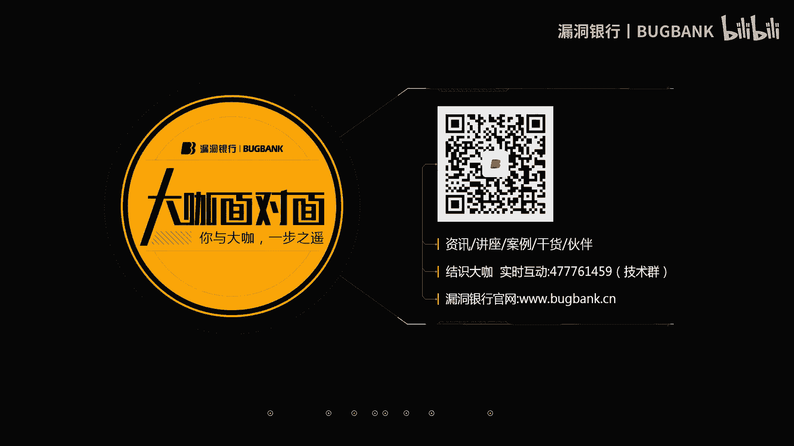

# 课程P1：常见提权方法与运维建议 🛡️

在本节课中，我们将学习渗透测试中一项至关重要的技能——提权。我们将探讨提权的基本概念、核心命令、不同类型（如端口提权和EXP提权）的原理与实操，并了解相应的防护策略。课程内容力求简单直白，适合初学者理解。

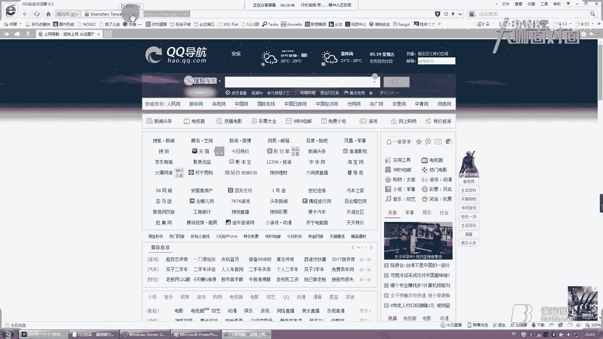

## 什么是提权？🎯

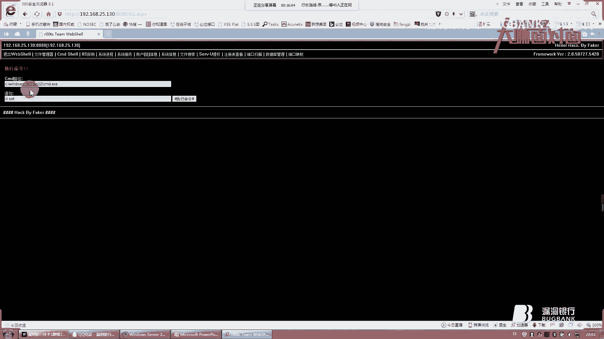


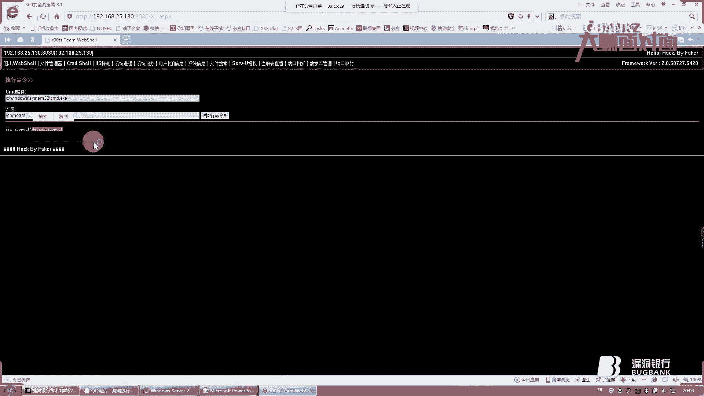

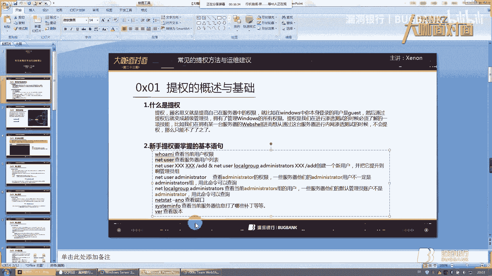

上一节我们介绍了课程概述，本节中我们来看看提权的核心定义。


提权，顾名思义，就是提高我们在服务器中的权限。例如，在Windows系统中，网站通常运行在较低权限的用户（如IIS用户、Guest来宾用户）下。通过提权，我们可以获得管理员（Administrator）或系统（SYSTEM）权限。拥有了这些高权限，我们就能远程控制服务器（例如通过远程桌面连接），进行更深层次的操作，如内网渗透。


提权是渗透测试中的关键步骤。假设我们只获得了一个Webshell（网站后门），这通常只是低权限访问。若不会提权，则无法进一步深入目标网络。


## 基础提权命令 💻

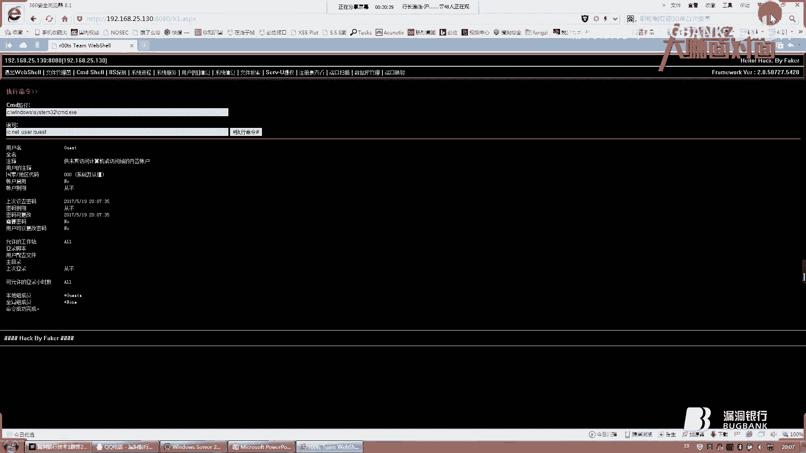

了解提权概念后，我们需要掌握一些基础命令来探查和操作目标系统。以下是渗透测试中常用的几条Windows命令及其作用。


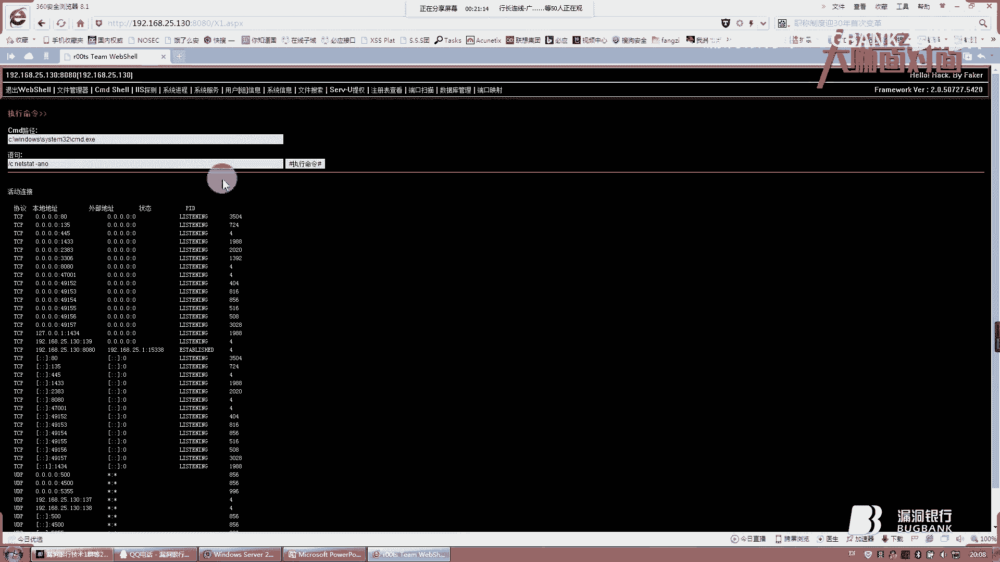


**1. 查看当前用户权限**
这条命令用于查询当前用户所属的权限组。
```cmd
whoami /priv
```
如果回显显示是`NT AUTHORITY\SYSTEM`或包含`Administrators`组，则表明当前已具备高权限。


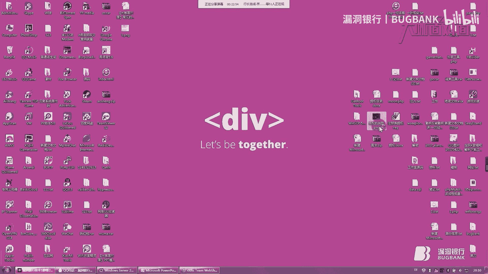

**2. 查看系统用户列表**
此命令列出服务器上的所有本地用户账户（不包括隐藏账户）。
```cmd
net user
```


**3. 创建用户并加入管理员组**
这是最直接的提权方式之一，用于添加新用户并将其提升为管理员。
```cmd
net user [用户名] [密码] /add
net localgroup administrators [用户名] /add
```
例如，创建用户`test`并加入管理员组：
```cmd
net user test P@ssw0rd! /add
net localgroup administrators test /add
```

**4. 查看管理员组中的用户**
此命令用于确认哪些用户属于管理员组，有助于判断提权是否成功或发现已有管理员账户。
```cmd
net localgroup administrators
```

**5. 查看网络连接与开放端口**
此命令用于查看服务器当前监听的端口，有助于发现数据库、远程桌面等服务。
```cmd
netstat -ano
```


**6. 查看系统补丁信息**
此命令列出系统已安装的补丁，是寻找可利用漏洞（EXP）的关键步骤。
```cmd
systeminfo
```


**7. 查看命令行版本**
此命令有时用于判断命令行环境是否可用。
```cmd
cmd /version
```

## 提权的类型 🗂️

掌握了基础命令后，我们来系统性地了解提权的几种主要类型。提权主要分为两大类：**EXP提权**和**服务器端口提权**。

**EXP提权**
EXP（Exploit）指利用软件或系统中的漏洞（尤其是溢出漏洞）来执行任意代码的程序。
*   **系统溢出漏洞**：利用Windows操作系统本身的漏洞。例如：MS08-067（巴西烤肉）、MS14-058、MS15-051等。
*   **第三方软件溢出漏洞**：利用服务器上安装的第三方软件（如编辑器、输入法）的漏洞。例如：Notepad++的DLL劫持、旧版搜狗输入法漏洞。
*   **直接抓取密码**：在已具备一定权限（如管理员权限）后，使用工具（如Mimikatz）直接从内存中抓取明文密码或哈希值。

**服务器端口提权**
通过攻击服务器上开放的特定服务端口来获取权限。
*   **MySQL提权 (3306端口)**：利用MySQL数据库的root权限执行系统命令。
*   **SQL Server提权 (1433端口)**：利用SQL Server的xp_cmdshell存储过程执行系统命令。
*   **Serv-U提权 (43958端口)**：利用FTP服务器软件Serv-U的默认口令或漏洞执行命令。
*   **Redis提权 (6379端口)**：利用未授权访问的Redis服务写入计划任务或SSH密钥。

**其他致命提权途径**
除了上述技术手段，一些管理疏忽可能导致更直接的“提权”。
*   **弱口令**：管理员密码设置过于简单（如123456）。
*   **权限配置错误**：Web目录权限过大，允许直接上传并执行可执行文件。
*   **敏感信息泄露**：将服务器密码、数据库连接配置文件明文存放在Web可访问的目录中。

## 端口提权实战演示 🖥️

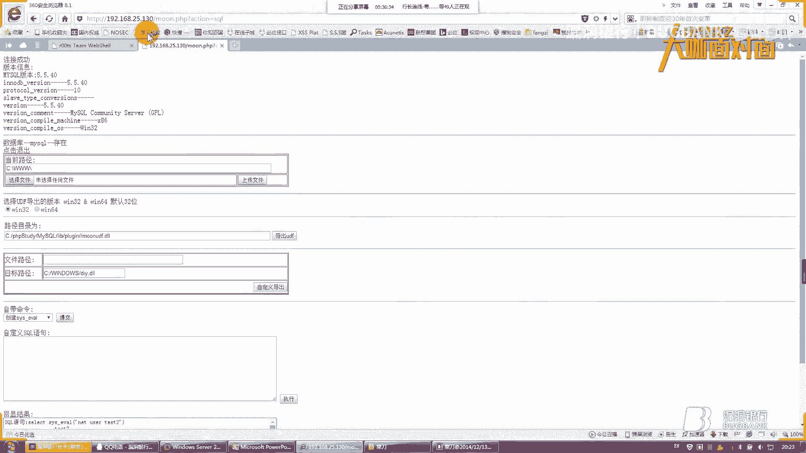

理论需要结合实际操作。上一节我们介绍了提权的类型，本节我们将通过具体案例来演示两种常见的端口提权方法。


### MySQL提权 (3306端口)

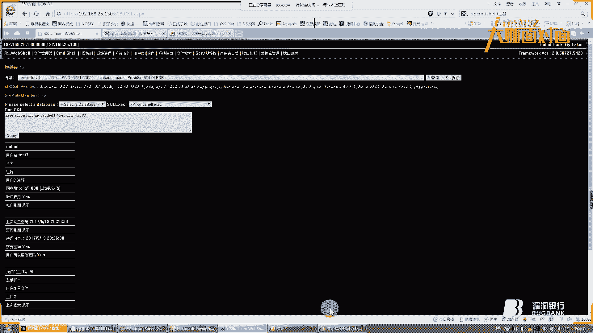

MySQL提权通常发生在网站使用MySQL数据库，并且我们获取了数据库的root用户密码时。

**核心原理**：通过MySQL的`root`账户（在Windows上通常以系统权限运行服务），创建用户自定义函数（UDF）来执行系统命令。


**前提条件**：
1.  获取MySQL的`root`用户密码。
2.  MySQL服务以系统或管理员权限运行。
3.  具有向MySQL插件目录写入文件的权限。

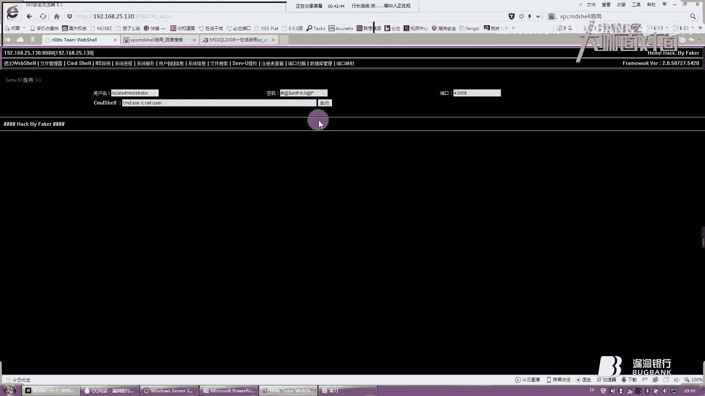

**常见步骤与问题**：
1.  **上传UDF DLL文件**：将包含执行命令函数的DLL文件上传到MySQL的插件目录（如`lib/plugin`）。
2.  **创建函数**：在MySQL中执行SQL语句，创建调用该DLL中函数的自定义函数。
    ```sql
    CREATE FUNCTION sys_exec RETURNS STRING SONAME 'udf.dll';
    ```
3.  **执行命令**：通过创建的函数执行系统命令，例如添加用户。
    ```sql
    SELECT sys_exec('net user hacker P@ssw0rd! /add');
    SELECT sys_exec('net localgroup administrators hacker /add');
    ```

**常见问题**：
*   **导出失败**：可能因为插件目录不存在或没有写入权限。可以尝试手动创建目录，或使用其他已知可写目录。
*   **MOF提权**：另一种MySQL提权方法，但在Windows Server 2008及以上系统可能失效。

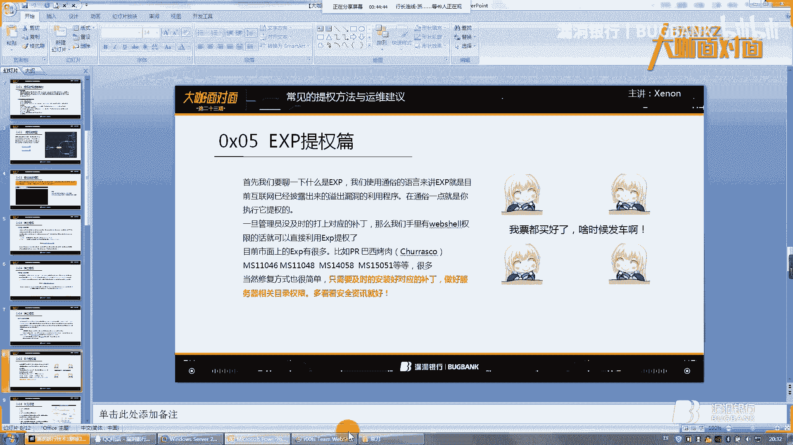

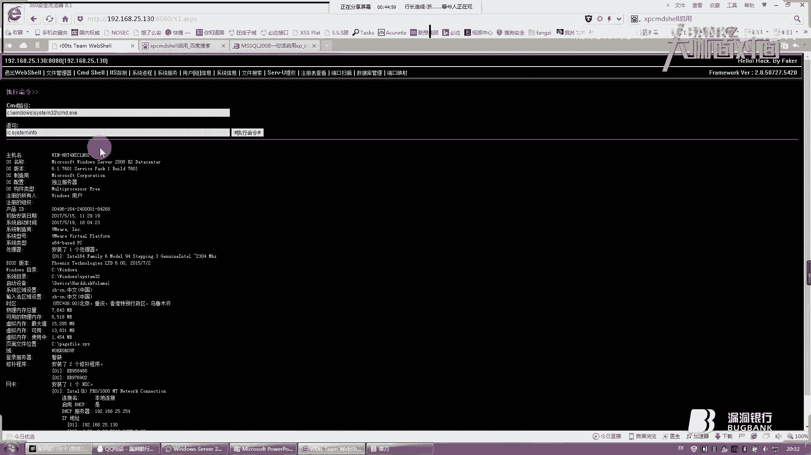

**防护建议**：
*   为MySQL的`root`用户降权，使用普通用户运行MySQL服务。
*   严格控制数据库安装目录和插件目录的读写权限。
*   有条件的情况下，实行站库分离（Web服务器和数据库服务器分开）。


### SQL Server提权 (1433端口)

SQL Server提权在获取了`sa`（系统管理员）账户密码后非常有效。

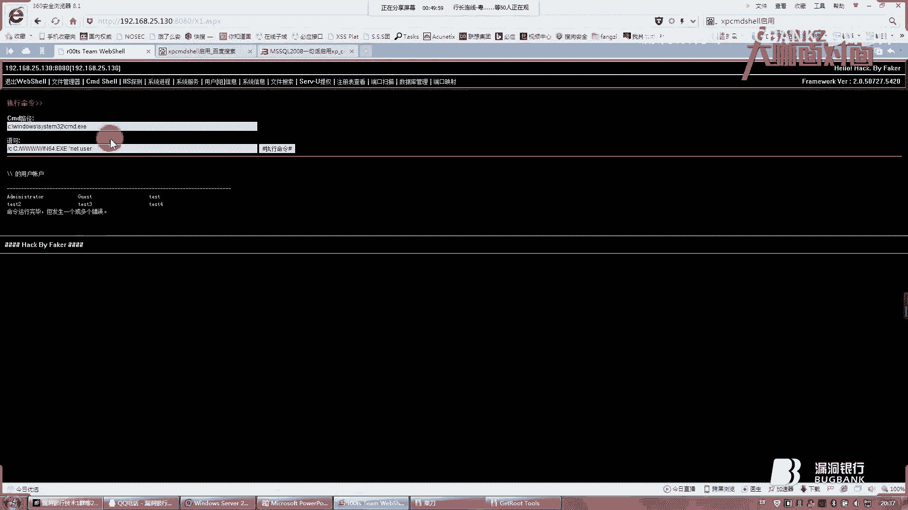

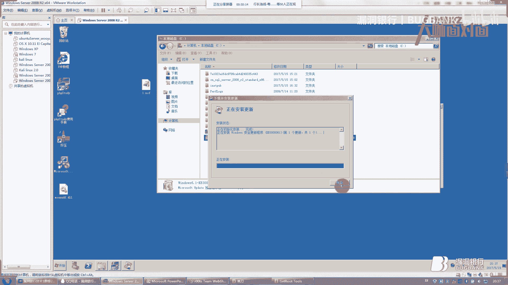


**核心原理**：SQL Server的`xp_cmdshell`存储过程可以执行操作系统命令。默认情况下，`sa`账户拥有执行该过程的权限。

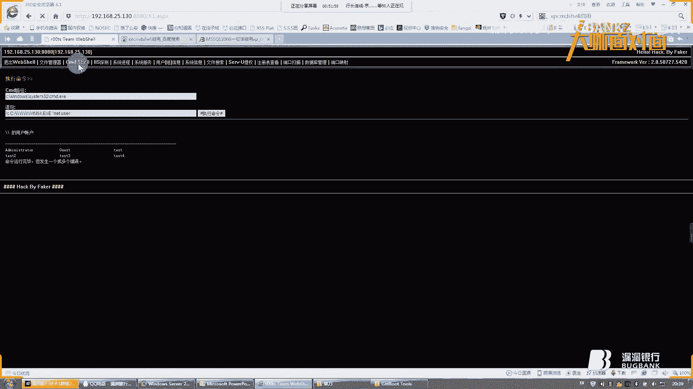


**前提条件**：获取SQL Server的`sa`账户密码。

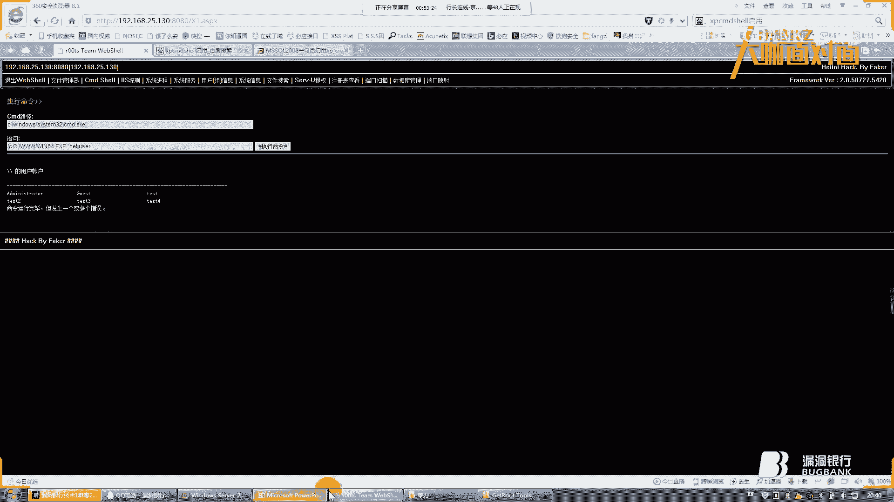

**操作步骤**：
1.  **连接数据库**：使用`sa`账户密码连接SQL Server。
2.  **启用xp_cmdshell（如果需要）**：在高版本SQL Server中，该功能可能默认关闭。
    ```sql
    EXEC sp_configure 'show advanced options', 1;
    RECONFIGURE;
    EXEC sp_configure 'xp_cmdshell', 1;
    RECONFIGURE;
    ```
3.  **执行系统命令**：
    ```sql
    EXEC master..xp_cmdshell 'whoami';
    EXEC master..xp_cmdshell 'net user test_sql P@ssw0rd! /add';
    EXEC master..xp_cmdshell 'net localgroup administrators test_sql /add';
    ```

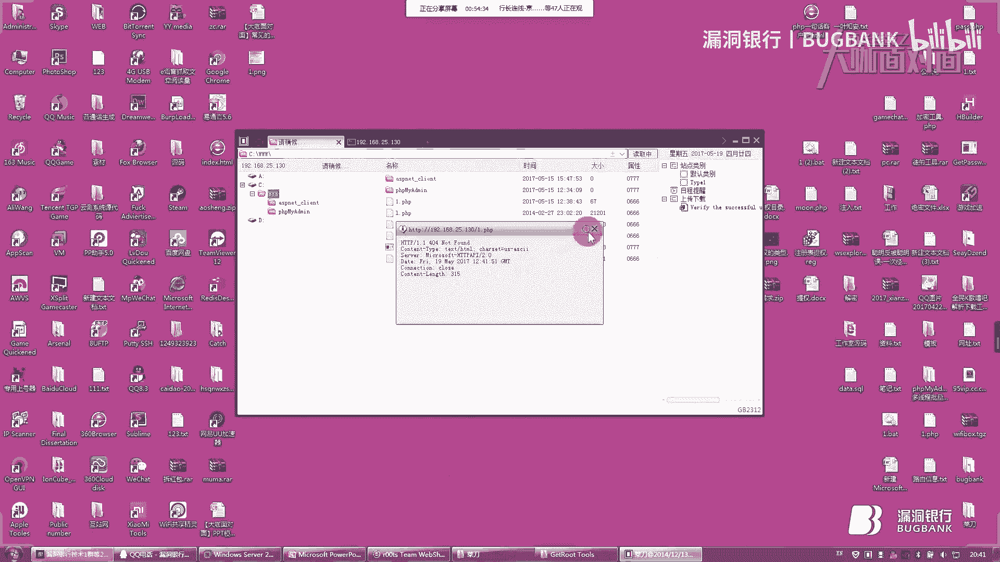


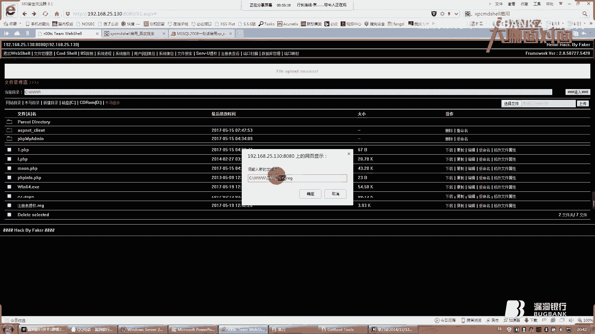


**防护建议**：
*   在安装SQL Server时，对`sa`账户进行强密码设置并定期更换。
*   在不需要时，禁用`xp_cmdshell`存储过程。
*   应用程序连接数据库时，避免直接使用`sa`账户，应创建专用账户并赋予最小必要权限。
*   做好站库分离。


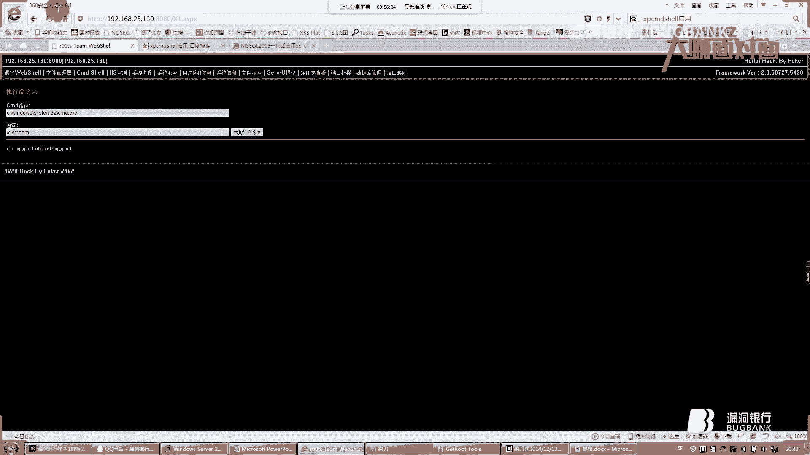

## EXP提权实战演示 💥


除了利用服务端口，直接利用系统漏洞是另一种强有力的提权手段。本节我们将演示如何使用系统溢出漏洞EXP进行提权。


**核心原理**：利用操作系统未修补的漏洞，运行特定的攻击程序（EXP），使当前低权限进程获得系统权限。

**操作流程**：
1.  **信息收集**：使用`systeminfo`命令查看目标系统已安装的补丁。
2.  **匹配漏洞**：根据缺失的补丁编号（如KB3041832对应MS15-051），寻找对应的EXP。
3.  **上传EXP**：将EXP可执行文件上传到目标服务器可写可执行的目录（如`C:\Windows\Temp`）。
4.  **执行EXP**：通过Webshell或其他方式执行EXP。通常EXP可以附带要执行的命令。
    ```cmd
    MS15-051.exe "net user test_exp P@ssw0rd! /add"
    MS15-051.exe "net localgroup administrators test_exp /add"
    ```
5.  **验证提权**：使用`net user`等命令验证新用户是否已成功添加并加入管理员组。


**注意事项**：
*   某些EXP在高版本系统（如Windows Server 2008 R2）上执行添加用户命令时，可能会因密码复杂性策略而失败。可以尝试先添加用户，再单独执行加组命令。
*   执行命令的路径问题：有时需要将EXP复制到`C:\Windows\System32`目录下，或去掉命令中的路径引号。


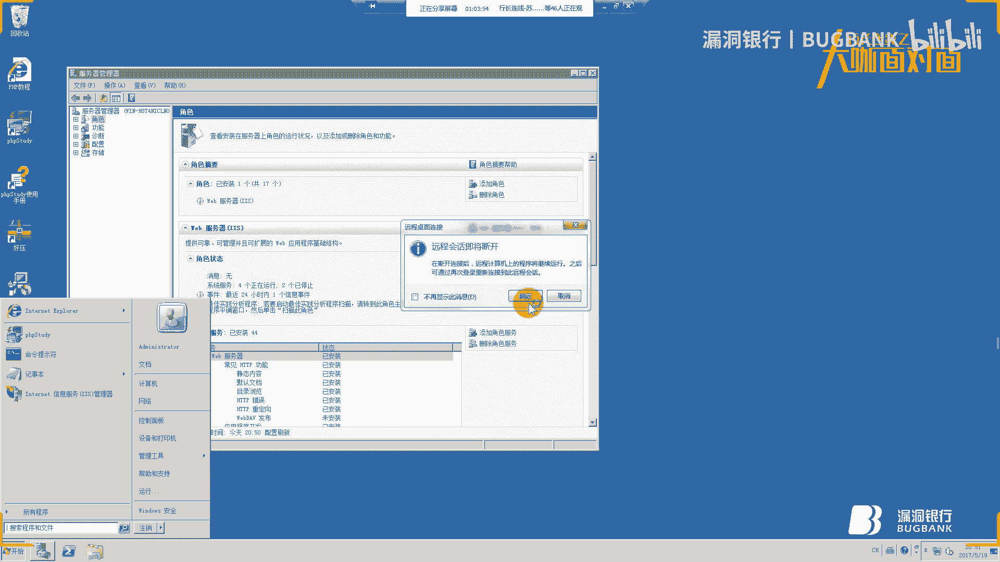


**防护建议**：
*   **及时更新补丁**：这是防御EXP提权最根本、最有效的方法。密切关注安全公告，及时安装安全更新。
*   **最小权限原则**：确保所有服务和应用都以所需的最小权限运行。
*   **部署安全软件**：使用主机安全软件（如杀毒软件、EDR）拦截可疑的提权行为。

## 特殊提权技巧：注册表克隆 👥

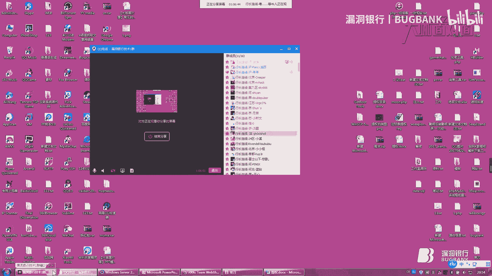

在实战中，我们可能会遇到即使获得了系统权限，添加管理员账户的行为也被安全软件拦截的情况。这时，可以尝试一种“曲线救国”的方法——注册表克隆。


**核心原理**：Windows用户的权限信息存储在注册表中。通过将管理员（如Administrator）用户的注册表权限配置项（SID相关键值）导出，修改后导入到来宾用户（如Guest）的配置中，从而将Guest用户“克隆”成Administrator的权限。

**关键步骤**：
1.  **导出管理员注册表项**：在具有系统权限的Shell中，导出`HKEY_LOCAL_MACHINE\SAM\SAM\Domains\Account\Users\`下对应管理员用户（如`000001F4`）的键值。
2.  **修改注册表文件**：将导出的`.reg`文件中代表用户SID的键名（如`000001F4`）修改为Guest用户的SID（如`000001F5`）。
3.  **导入到目标系统**：将修改后的`.reg`文件上传到目标服务器，并执行`regedit /s clone.reg`静默导入。
4.  **激活Guest用户并修改密码**：默认Guest用户可能被禁用，需要启用并设置一个已知密码。
    ```cmd
    net user guest /active:yes
    net user guest NewPassword123
    ```
5.  **登录验证**：此时使用Guest账户和设置的密码进行远程桌面登录，实际获得的将是Administrator的权限。

**注意**：此方法对系统环境（如SAM结构）有一定依赖性，在不同系统版本间可能需要进行测试调整。

## 总结与建议 📝

本节课中，我们一起学习了渗透测试中常见的提权方法与运维建议。

**我们主要学习了**：
1.  **提权基础**：理解了提权的概念、目的及基础探查命令。
2.  **提权类型**：区分了EXP提权（系统/第三方漏洞）和端口提权（MySQL, SQL Server等服务）两大类。
3.  **实战演示**：逐步演练了通过MySQL、SQL Server进行端口提权，以及利用系统EXP进行提权的具体过程。
4.  **特殊技巧**：了解了在常规提权受阻时，通过注册表克隆用户权限的备用方法。
5.  **防护思路**：针对每一种攻击方法，都给出了相应的运维安全建议，核心是**及时打补丁**、**最小权限原则**和**合理配置**。

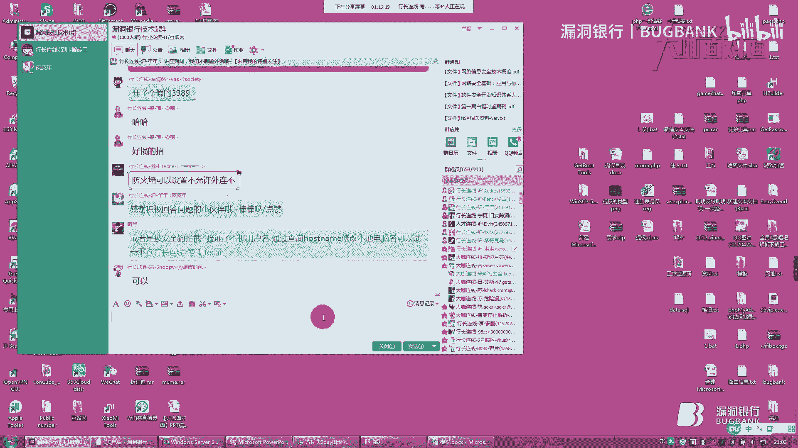

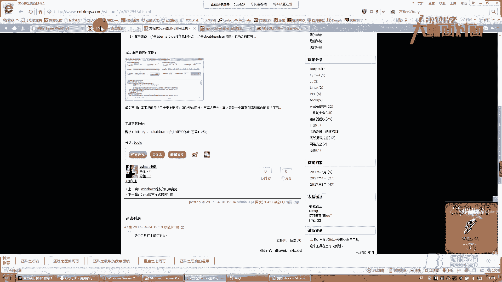

**给学习者的建议**：
*   **合法授权**：所有安全测试必须在获得明确授权的前提下进行。
*   **动手实践**：在安全的实验环境（如虚拟机、靶场）中反复练习，加深理解。
*   **持续学习**：安全技术更新迅速，关注最新漏洞和安全动态。
*   **善用搜索**：遇到问题时，先尝试利用搜索引擎寻找解决方案。

**给运维人员的建议**：
*   **补丁管理**：建立严格的系统补丁更新流程。
*   **权限收紧**：遵循最小权限原则，为服务和应用配置所需的最低权限账户。
*   **配置审计**：定期检查服务器上的服务配置、账户权限和敏感文件存放位置。
*   **日志监控**：开启并定期审计安全日志，及时发现异常行为。


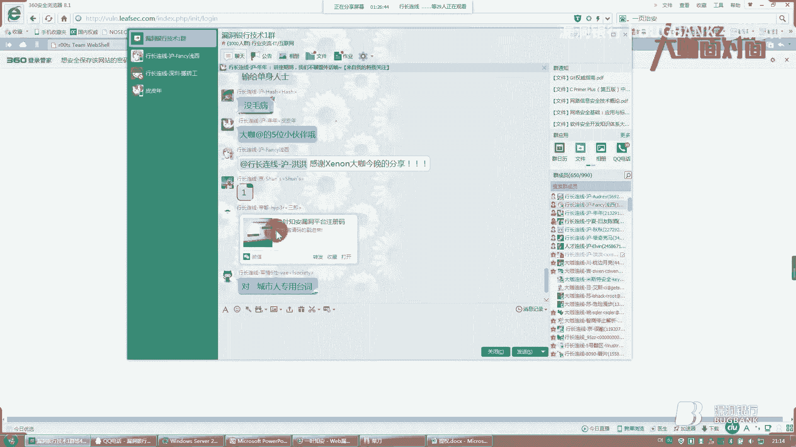


通过本课程的学习，希望大家不仅能了解攻击者的手段，更能从防御者的角度思考如何构建更安全的系统。