# P1：38【录屏】打造的的python军火库-全能扫描器整理与开发——大咖digo8 - 漏洞银行BUGBANK - BV1364y1D7CF

Yeah。Yeah。Yeah。为知识而存，应技术而身。小伙伴们，大家晚上好，欢迎参加漏洞银行信息安全技术讲座。大家看面对面，已经迎来了第38期，我是主持人宁面。那今晚嘉宾是POI团队的核心成员digo。

那本期主题是用pathon打造自己的军火库，全能漏洞扫描器的整理与开发。今晚digo会教大家用python打造自己的专属漏洞扫描器。😊，那有一点心动的你就认真听讲吧。本期直播分成三个环节。

首先是第go我的主题演讲，接着是行长问答环节，留时间给大家提问。最后就是大咖赠书环节。第个会选出一位最认真听讲的观众送出这本黑客攻防实战加密与解密，能不能拿到，就看你们有没有认真听讲，踊跃提问了。😊。

那规则就说到这里，下面就有请dego开始今晚的讲座吧。

非常感谢大家花时间来听我这个讲座。这在座的也有一些很多大佬，这我讲的不好的地方大家体谅一下，毕竟。毕竟没大佬厉害嘛，一直是大佬，这大家都是啊，然后就简单介绍一下，我的话就是叫digo啊嗯。😊。

我我也不知道这个怎么称呼我，反正大家就这叫吧。第第个。然后的话就是嗯团队的话是这个PY团队，然后呃这里面有很多大表哥啊，就是这位大表哥，然后是ga大表哥，嗯，反正就都在向他们谈学习。

还有一个是嗯qui you大表哥，他们都是很厉害的。嗯，大家可以去。找他们搞基啊，这个确实这样。然后的话嗯我简介上。有些这个啊前段时间的话在家乙方公司，然，现在的话在360那边也是混饭吃的。

大家以后也可以往360这方面去就去发展。到反正待会儿我会给大家介绍一下，就是行业里面的一些东西，但大家对就是安全这个行业有一些整体的了解。当然还是刚才那句话，技术不是次要的，主要是你的一些规划。

规划要好，规划好了之后，你才能向着你的目标不断去努力。我才不会有迷茫和跑徨。然后的话嗯咱们开始吧，是介绍的话也没太多介绍的。就是。嗯看一下，确实没什么记绍的，就是大家对我这个人有一个整体的一点了解。

大家可以去百度搜一下，就是POI安全团队专访。就是说的就是我们这个团队嗯。嗯，然后的话我说一下今天的内容。第一个是给MASF与open base一个漏洞审描器，然后是一个python一个漏洞审描器。

但样的话MASF我这个是虚拟经嗯没装，然后这个东西也挺简单的，我就给大家过一下大致流程。嗯，刚开始啊有个还有个in1yy。你是在MS下的。那这个和这个是大同小异的，就也没什么区区别不当。

然后大家可以去自己尝试一下。这个的话就给大家就是过一下这个东西。啊，首先是嗯。这个嗯这个的话就是相信大家都不陌生MF然后就是他的联系方式。嗯，因为这这个的话刚才我也和大家说过了，我这个是虚拟机。

里面不可能再去装虚拟机了，然后就没法给大家演示，但这个东西也是很简单的，大家就是感兴趣有时间多余的话可以去卡虑一下，这个是卡接一下的。然后把这个命令敲一遍。然后我流程也是写的相当待会给大家看。

我流程也是想写的相当的详细的。这个我感觉也没操作的必要，然后就给大家是讲一下。嗯，首先是连接数据库，连数据库话有两种方式，这种是比较方便的，都是MDBstar类，这个是一个徐长对我说的。

他以前当然嗯然后常规的还是这样嗯，创建一个数据库，然后就是给他一个账号密码，然后再去连接。好，然后是咱们的op我的话嗯，这里面首先要更新卡令。更新卡令的话，大家把这个编辑一下这个文件。

就是把这里两个语言给放上去，然后再把这载产命令输入进去，大概等个半天的时间嗯，看你网速，把微频道可能快一点。这至我更新的时候就花了半年时间，就是然后就可以了。然后是安装open就是APDK嘛这个安装。

然后是这个是检单安装的完整性。安装完之后要改个密码。因为大家如果具体实际操作的话，安装完之后会有很长的一串，就是它那个东西会很长，然后不变记忆，你要改一下自己的一个密码是这样的，然后是启动，就是它下来。

然后是访问这个地址，咱们就可以看到啊这个页面。就看到这样一个很亲切很可爱的页面，然后把你的账号密码给输进去，这样就可以嗯登录这个东西啊。这个扫描器还是挺好的。

我感觉的话当然扫描器最多是那个NEUS yes这个啊然后是加载op年都种扫描。啊，这个过程我感觉还是挺好玩的这个东西啊，首先是加载它漏点，然后是连接数据库D，然后是看下它状态。

你要出现这个连接到MOS就连接到那数据库，然后这才是数据库连接施工。但不光是这里还有一些用进行扫描，还要进行一些啊只要是和数据库有交互的，就是连接东西要存在里面。就说是那个M1710嘛。

这个东西它也是要就是进行啊数据库连机的。嗯。这个是连接open这个和NEUS是一样的，这后面这个端口不太一样，然后是账号密码，这个那个端口嗯大家可以去看一下，这端口不太一样，然后后面加个OK。

然后就可以连接。那的话扫描目标是我我这个的话是在一调一个win203下的一个扫描是这样。啊，然后是创一个扫描任务，比如说open就是目标码创建，然后是winN03，就是IP地址。

然后是给他给他几个新的名字。然后大家就可以看到这里长串，然后查看一下配置列表，配置列表就是你要以哪种方式扫描。比如说这是空扫描，然后是一个呃主题发现，还有一些全面的。

还有一些我是选择这个一个快速而且比较完整的一个扫描。嗯，然后是创建任务扫描机器，然后是这个呃V203，然后是把这个ID就前面这个。嗯，前面咱们这个这有个ID，然后是配置列表，这有一长串，看你选择哪个。

就把这两个给复制到后面后面这里来，就是这里。啊，但我这个不知道是什么原因，它会这么长一串。网上它是有些参考资料，它是比较简单的。比如说这个是第一个扫描，就是一，这个是第一个选项，就是一嗯。

这么长一串是看着长一点，其实也是可以扫的。当是开始任务就是开始你把这一条输完之后，它会在这里有一些这个啊，大家可以star点，然后就可以把这个任务给开始。当时长按扫描建作。他这个就是他扫描状态。

这已应开始了1%。那后的话等待扫描完成，然后就导出自己想想的一些方式。比如什么嗯参airHTM，还有就是一些嗯。切个题格式都可以导出导出一个报表嘛，然后就是导出报表。嗯。

这个的话就是他扫描完之后就基本是这个结果。嗯，但大家问我为什么要用这个扫描的话，就是大家可以去深入研究一下，扫描之后到底可以怎样利用。其实这个你如果能量好的话，也是可以节约很多呃时间的。这个也比较。

就是你在就是工作时候有一个很好的审核器是很有用的这个。然后这个的话就嗯扫这个的话给大家简单介绍一下，我们的重点还是这个找到乐驼扫描器。嗯。那咱P。首先我我介绍一下n扫描最话是这样的，有个插件系统。

等于有个端口扫描，目录包破C模式识别，插面用，还有一些CDN识别。然后像插件的话，有一些啊助检测叉S检测wap器爆破，还有文件备份，还有一些邮件爬虫，这都是在插件里面做功能里面的。嗯。

然后的话他一些目录结构我们可以来看一下。但是长什么样子的？Yeah。嗯，它有一个d，这里面就是存放一些一一些啊，比如说叉S测试代码，还有一些。目录之类的东西。嗯。

然后的话这个LB这是存放核心文件的一个库。然后这里面有一些文件，一些U个管理，还有一个下载文件。然后这里面啊有个主文件，然后这里还有一些。这个一些助检测，还是叉S一些插件，这个是一些。这个基本的一个嗯。

但是这里面还有个以查品这个功能，反正是这样的。像这个的话，这个以差别我会给大家，我这也给大家带来一些以差别，待会儿再提一下吧，就是挺多的以差别到我这还是。看下。那这。啊，这一叉别S挺多，待会大家提一下。

好，然后我首先来介绍一下这个扫描器的一个大体流程，一些啊功能。比如说一些网站爬虫啊数检测，还有些嗯插件开发，还有一些叉S检测爆破还有一些备份扫描识别端口扫描与系统指纹分析还敏感目录爆破。

还有是CDN检测，还有最后就是生成为报告，这个是一个附加功能的。然后一些功能，比如说一几秒钟之内快速爆破10万的字检快速去破解个7然后是5正识别模式打造一个导致这在一XP就是刚才我给大家看到的打造一个属于自己的但这个功能的话还是挺完善的。

我自我感觉到虽然有些功能比扫描器来说，比起那些扫描器比如AW来说是要弱一些。因为它的功能相对比较这个只是一个初。大家可以往上面去加点东西。😊，对，就是你现在最好是全屏，因为这边看不太清楚嗯。

啊，行，我待会操作的时候就把它给退出。嗯，嗯，好啊，这个嗯这个的话因为是只是一个出行，然后大家可以往上面去添一些东西，就是可以去进行是再次的开发。

嗯，然后扫描器的一个思路就是一个基本的思路。检测CDN，然后是没有发现CDN的话嗯转换IP单个扫描啊，关者是这有一个错的，大家要注意一下，因为这个还是很理解的转换IP单录扫描，然后是敏感目录扫描。

然后是CMS识别，那是爬虫信息收集啊，就是基于爬虫的一些各类。比如说注入啊叉S检测之类的，这是一个基本的流程。大家对这个首先有一个整体的认识。咱后的话咱们就从第一个功能开始吧，就注入。

咱们先讲一下注度检测吧啊，这个PPT的话就是大家先首先看一下，我主要是从代码上来给大家分析这个东西。像PPT这个确实比较抽象啊，我们看一下代码。啊，首先是用这里的啊，这是一个主文件，这个等们待会儿再说。

然后是有个注检测证里面有个。嗯。我把这个字体放大一点。Yeah。你好像好像。嗯，就这。方面上反应，我不知道这个大家能不能看清楚。这个应该是还是嗯比较好看清楚这个。啊，我就从这里来分析吧。哎。

不是这个东西，就是这个就是时有点怪。然后是这个嗯首先这个嗯这个把大把这个加大，这个就是1个UTF杠8嘛编码。然后注入的话是这样一种思路。啊，首先咱们是。测试就这的话基本上思维就是这样的，嗯。

将返回内容与内容做对比，然后再找一个国外的网站。

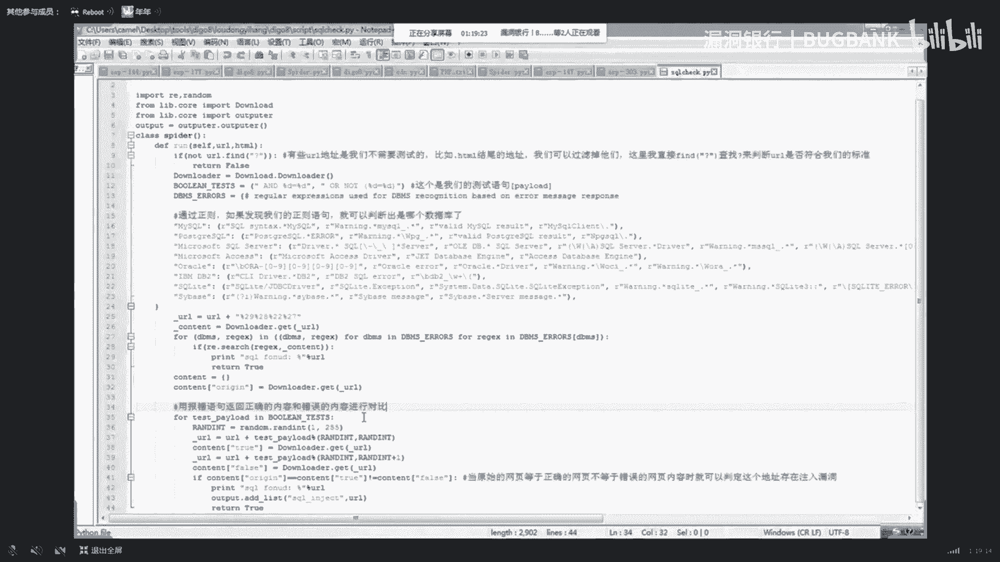

这个我也不知道有没有一些比较危险的行为，就是给大家演示一下吧。一个国外的网站。应该是没多大问题的。

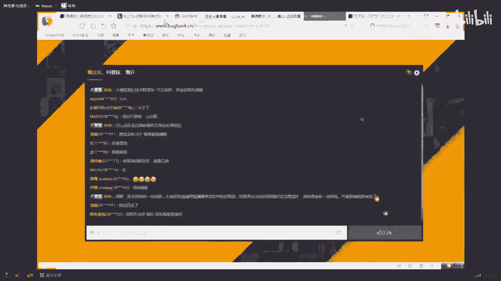

毕竟被怕喝茶嘛，我还是不想去喝茶了。Yeah。啊，就这样一个网站，这个国外的。然后咱们就是这样一种思路，就用大家最熟悉的一些逻辑判断。比如说出个案子一等于一。好按的一等2，通过这种方式。方式来判断的。

好像点了一个东西，我不知道有没有什么影响，我把这个缩小一点，你待会又点。嗯，思路还是很简单的，主要是你要通过代码来实现。那这里还有报错，弄这个啊，只成这样。嗯，咱们来看代码，这样的嗯。

通过将报错页面和正确的页面做对比。啊，比如说这个是一个原始页面和一个正确的页面，还有一个错误的页面，大家就是对注入应该是这些东西已经很熟悉了，这个东西我就不多说了。

就是通过原始页面等于正确页面不等于错误页面。这个逻辑，然就可以很轻松的判断注入漏洞。这是第一个嗯。这里比较好理解这个东西。然后判断出之后，咱们会发现网网上会抛出这样一些东西，说你有个错误，嗯。

然后是这样secre这个然后抛出一个错误，的有一个mycycl server。好，咱们根据这个错误，然后就可以通过正则来匹配它是哪一个数据库，就是比如说mys就有一个这个码，就是这里面抛出了这个错误。

就这个然后其他数据库的话，比如说它里面还有一个myser。比如说大家看到这里这个mys就是这样。然后这些什么po circle，这些它都有这种关键词，这就是通过一个正则来匹配一个数据库的过程。好。

然后这前面一个第一个第一个这个函数是干什么用的？就比如说咱们上次也是在这里找了一个网站，比如说这个网站。也是个国外的。大家要弄就弄一些国外的，不要找国内的国外的风险很大的。比如说也是这个网站。啊。

真是有。嗯，等一下我找一下。这。Yeah。The对。Yeah。啊，是这个网站。这我去mark克里面找木鬼了。嗯。嗯，比如说这样这样个网站，它是这样的一个逻辑啊，这个就是判断一些UR不需要测试的。

比如说咱们这是一个嗯这样一个网站，比如说咱们随便哪个，它去是1个HTML像这种的话，咱们就直接可以跳过，就不用再去测试，因为它没问号嘛，一般一般像注入的话，大部分都是帮在这种情况的。

像这一些伪静态制入的话，咱们这个工具是没能力去检测的。大家可以去如果感兴趣的话，可以去自己搞一些怎样检测伪静态之类的这种注入像这样嗯它有个问号，这个就是这个意思在这里。嗯，然后这个的话我先嗯。先讲到这。

然后我给大家说一点题外话，就是抽一两分钟。我也给大家准备了一些题外话。比如说啊我是如何就是学习的一个过程。嗯，但但一开始学生的话，像群里面肯定有很多大流的对这种这种东西的话。

可能是也会勾起自己一些心生的心酸的一些回忆。比如说当年为来学这个东西啊，嗯每天晚上翻墙啊，去抓肉鸡啊，但一些小白的话，听到这种东西确实是比较迷茫的。然后我就把这个东西给踢下，就是学习的过程。

学习过程的话，当时我也是嗯回想起自己这几年学生的这个过程确实是挺艰辛的。刚开始学的时候是嗯没有任何人给我指点的，都是靠自己学的，确实这方面嘛，学校他也不会教，然后自己学的话全靠自己摸索。

然后我就把自己学习一个。从以前学习一个过程，到以后要学什么东西给大家说一下。但但以前的话我也走了很多弯路。然后现在总结起来的话就是呃渗透。但也不能说震斗，就是一些嗯攻防知识，大家可能对这方面比较感兴趣。

这方面。嗯，然后游客很重要，就开发开发一定会很低啊。不管你是做开发还是不做开发，开发一定需要。咱们可以不信的话，可以你可以找一些招聘网站，开发是很重要的。你每一个公司他必须要要求你开发能力。

你没开发能力，你和别人就不是一个城市的。你如果以后想多拿多就是多拿点公司的话，你必须会开发开发的话，我在这里推荐的是新人。但这种对大牛来说就不用说了。P一P获者交往。然后拍thon是必须要会的。啊。

但我也在学开发，我开发学的不是特别好啊，这是一个题外话。然后总结总结起来就是学习一个过程，基本就是这样的，你要学习公防知识，但你就是不要说找不到网站，就是像就是像我们漏洞银行嘛，比如说漏洞银行，像以前。

像这个。厦门漏洞银行就是一个很好的学习平台，大家可以在上面学习。因为我确实前段时间也看了，所以确实有一些思路很好。比如说在这里我不知道大家有没有就是关注这个东西。这个网速确实有点那个。啊。

咱们先继续讲吧，因为时间有限，毕竟然后这个待会儿再和大家说，说一点题外话。然后就是然后这个功能过了之后，就咱们的一个嗯。啊，咱们的一个就是爬行的一个功能，爬行的功能的话是在这里的。

环且是一个比较核心的一个文件，呃，把它放在是这个核心文件里面的。然后是这里面。嗯，这里面的话这个思路还是也比较啊，但这个这个用嗯这个呃phoshop这个。这库进几些，然后把它丢在UR管理器。

UR管理器的话，就是咱们在这里写的这个东西，就是这个嗯download点PY。还有个是月2。管理这个。这两个就是和这里面所说的两个东西是有很大关系的。比如说咱们在这里咱们这里，因为这是一个有很多功能嘛。

咱们肯定要写一个就是UR管理的，还有一个UR下载的，把它保存在本地。然后UR下载的话，它会就是你每一次用的时候，它会把它给阻塞掉。当你用完之后，它会再继续进行这样一个思路。啊，在这啊这个是做检测。

不是这个，这是一个就是URUR管理，还有一个UR下载的一个库。就是比如说一个不是这个功能，比如说这是一个下载一个URI的，它一个qui用这个库，然后是一个getpo引擎，然后是一个刚子下面啊。

UR就是下载下来，然后再通过这个。啊，U儿管理一些呃第一个。然后是一个添加一个新的U儿进去，把它添加进去，然后再检查它有面这个U饵。嗯然后的话是。然后咱们就看这个扫描文件，介绍这两个呃。定义了两个方法。

然后再用这个方法来就是对他就着进行解析，用verb用这个呃这个模块。因为我英文不是特别的好。然后有时候这个也请大家谅解，毕竟只有6级水平嘛，不是特别好。然后是在调用了华总，对他进行爬行。嗯。

这这个的话就是网上爬行嘛。上次就是呃我面试的时候也问到我这个问题，为什么就是会用这个这你怎要保证你爬行他不会无限制爬下去。然后我就和他说的，就是用这个进行几析，然后对它进行爬行，只要爬行完网页。

就爬行就会停就会进行停审，是用它进行几析，就这样一个就是思路。然后这里的话使用了一个多线程。啊，多线程的话，这个嗯我们就是那个银行上就是在那平台上也讲有为大佬你讲的这个也提到了这个方法。

然后大家不知方法吧，这这个知识点。然后大家可以去就是看一下，就多线程的一个支持。这是一个爬屏的功能。好，咱们继续看到PPT。这个助检测还有一个爬虫，这我已经把这个介绍过了啊，这是一个刚这个也提过了。

然后是爬虫的思路也提过了。然后是好，然后就是个邮件收集系统，邮件收集系统的话，这个呃还是比较好理解的。它一个流程就是把它加入到这个一个环境变量，然后将所有的UR文元码传给插件，然后插件完之后加指示权。

嗯归还给扫描器，然后咱们看一下具体的代码。啊，在是在这里面呢，是一个邮件管理的，嗯邮件检查了一个。其实这个思路是很简单的，它主要是把音网页嘛，刚刚也收到了，然后通过一个正常匹配，然后把这些有个art。

还有一个点的这种嗯匹配出来，它就是这一个邮箱，这里面有一些这样一个邮件，这个思路还是很简单。然后咱们看下个功程。就是一个嗯。这个也讲了，然后是一个X子检测。叉子检测的话。

这个功能也是呃相对来说思思落很简单。但你要写出来就是也不是那么容易。好，参数检测参数检测的话，这个也是比如说这个网站对吧？咱们也把这个网站拿出来做例子。但这个的话这都是一些比较基础的东西。

大家可以就是直接我给大家随便提一下这个东西啊，主要是这样的，我就是介绍一下扫描去实这些工作，刚才把这个把这个去掉之后，然后咱们把这个给加上。就是加一些pload。

pload的话在这里面就在我们扫描器的一个呃地铁的目录下，有一些叉S检测的一些load。啊，就这些啊，把这的给全部给加在后面来测试它是否存在叉S这个。嗯，主要是如果他存在差值漏洞的话。

他是不会对这个给进行过滤的。如果他就是不存在这个的话，他会把这个给过滤掉。然后还会反像这种的话，估计是做了过滤，然后就是啊不让你去测试之类的。大家可以下去看一下，就是基本思路是这样的。啊。

这是一个x pay的情况的一个目录。在这里面。然后这里这里的话就是对。嗯，他这样的对UI进行拆分，他为什么要进行拆分。比如说就是咱们这个网站。比如说这样。比如说他后面还有几个参数呃，按。嗯。

我就随便写一下A等于。是45，然后是C等于89。然后这样的，如果说咱们遇到的是这样一个dction网站，有些网站它后面有很长的一串，那么咱们就要用到这样一个功能，对UR和参数进行拆分测试。

就是把它提取出来，提出来之后按每个。如果提取出是A，就把这个就测试A后面的这个用配去测试思路还是相当简单的。但提取的那个东西，咱们在证。好，就创建一个函数来分割这些文本。

就是我刚才说到的这个就是那个X子检测一个问题。讲到这里的话嗯，然后我再讲点奇外的一些东西吧。嗯，就是这个。就是对一些行业的一些看法。就是大家学这个的话，听到最多的就是一些黑产黑产，然后就是一些。

但这个的话我只是。因为我最近不是在看一个东西嘛，就是在这里面我找到。就最近在看这个东西。这我前年看到一个文章，它是一个就是这也是一个黑产吧，就相当于然后希望大家不要碰这种东西。

其实它技术并没有太高的一些对你技术是没有提升的。然后就是也是为了就赚一些钱嘛。然后就是像这样他涉嫌诱导诈骗，申请了6亿的一个黑产。然后大家感兴趣可以把这个文章给看一下，就。我我身边有一些人在做做东西。

一个月反正就是赚很多钱，但他们那钱都不敢那。就以希望大家不要碰这些东西。所以这像这种网上已经公布出来的东西，然后就是肯定是啊网安那边就是他们已经对这些手段之类的，他们已经很清楚了。是你在做的话。

你如果存在侥定心理。你看这种网上都已经写出来了，然后就是肯定是大家也是知道你的一种思路，然后希望大家不要碰这东西毕竟很危险，然后还是踏踏实实的，就是呃去。你不是踏踏实实是吧？啊，你要在你的合法手段之内。

然后说到这个的话，就给大家提一下这个就是嗯你学网络也好，学安全也好，然后学开发也好，一些就是啊你的一个发展发展的一个方方向。就比如说这个啊从事IT这个IT的话，就是这样这个咱们就不说了。

比如说它有一些薪水，然后是一些能力提升。咱们咱们主要看这个这样一张流程图。一个就业方向，这是一个我感觉这个已经很全了。比如说开发数据库、网络安全、网络工程安全运维、授权销售啊，你实的不好的就回老家去啊。

考什么公务员之类的，这个也是希望大家有一个直接的一个规划。比如说你开发就是在学校对这个很就是很熟悉，有一代码了解就可以开发，然后转什么部门主管，然后是技术总监，或者就是呃但这个咱们不说啊。

这个已经是人生颠覆了。后面咱们做一个普通的一个程序员，只要能做到一个主管就已经差不多了啊。然后是一个如果你对。编程不是特别感兴趣，然后你可以往安全方面就是去找。因为这个安全的话，毕竟说是个测试嘛。

只是一个测试，所以你喜欢是导装。然后但但你学到最后的话，你会发现你肯定你不白开发。因为现在我也是在学开发，这个也没办法，毕竟这个是仪切的根本，然后是白帽子，然后是啊这个又是人生巅话，咱们这些都不提。

就看前面的。啊，然后对啊就是说对黑客技设有强硬的兴趣，但是对编池这法又不太喜欢无法学会。这个确实是这样，我刚开始就是学开发很头疼，然后就学这个东西，现在又去搞开又去搞开发，确实比较尴尬。

然后这个又是人生联盟。然后这个的话就是运维岗位，运维岗位就是。😊，比如说你喜欢你去技术，比如说外部搭建，人家搬家代理，网络技算，就网络工程、安全工程、运维工程，还有授权工程师都可以。然后你如果喜欢编码。

但是都不喜欢，但对企业有非常了解，你可以做授权，授权就是卖产品嘛。像一些盟，它里面都有一些东西，去卖一些产品。然后这里面啊你如果金额非常外向，你可以去做销售，你是像绿盟上的公司销售是很多的。

就是像这种公司他养了一大堆销售，然后你会发现你会跟着销售到处跑，然后实在不行的话，啊这种编码和技术都不喜欢，你又想找个体验工作。比如说急接做运维啊，数据库管理员，这东西都是很集中的，就是混吃等死了。

也不是说真这相对来说比较轻松，但是苦的也时候很也很苦。然后啊实在不行的话，你就回老家运模师了。然后你发家里面有钱的话，可以开个公司当个CEO董事事会之类的啊，这个是一个啊一个行业的一个技。

这我就是感觉这个给大家说一下会比较有用。因为有些人比较迷茫嘛，不知道自己我。往哪去发展？好，然后咱们继续将我们的扫描器。扫描天我们已经讲到这里了，因为我这个确实跳的有时候比较大，就是也。Yeah。

这我主要是还是给想给大家去分享一些自己呃学这个来的一些经验。不光是技术，光技术的话，不管你这要你花个两三年，肯定是比我更厉害的。也不要。亲我这些比较基础一些东西。你如果方向不太对的话，这个就不太好了。

啊，这个不意思，因为这个比较吃内存这个虚拟机。好，咱们是讲到讲到就是一个XS，对吧？啊。咱们来继续接着我们的扫描器。嗯，XS嗯，然后咱们就是一个W7包裹插件。W7包裹插件的话思路是这样的。

就是嗯大家也先是首先了解吧。咱们先首先是阿尔法提下，就是默认同时接收的参数是1000个。然后IS项默认接收的参数是5883个是6000个。然后咱们就可以用这样一种思路。比如说我在这里搭建了一个站点。

我看一下，应该是搭建起来的啊，就这样。Yeah。虚拟机确实性能不是很好，大家就是理解一下。因为我有一台电脑坏了，我知道别人进的那个也是不太好。是这样。嗯，好像打开比较多啊。这本地搭建一个就是战略嘛。

那咱们在这里放了一个遗段木马。啊，就这样的一个营销部吧。那咱们可以通过就是呃提交一些pos的参数。来看一下这个东西。嗯，咱们密码是X。啊，比如说这里。啊，这样是一个已跟成功执行了。

比如说咱们按这个X是正确的，比如咱们选个C的话，它是没办法回填的。这个嗯大家应该都知道这个东西。好，然后咱们就可以利用。比如说这个是阿帕奇，对吧？阿帕提咱们这里写就在这里。

阿玛奇同时接受的参数是1000个，但IS的话是6倍，咱们就可以用这眼轴思入，在它后面加上这个东西。有新有人员PP嗯应否。然后呢，咱们又来一个就是嗯E等于PP info还有。啊，就是这样一种思路。

Yeah。嗯，这样之后咱们就可以比如说这个是阿法提嘛，一次传送1000个，然后咱们就可以很快的来判断它密码是存在在哪个范围的。然后再通过二分法那种往中间取嘛，然后就可以很快速知到密码。那这个的话。

我在这里找了一大堆字典。这个我还没测试啊。因为前段时间我找了300300多个啊，不是3000个吧，3秒钟就啊，就是把它给报复完了。然后这个的话我刚才是把它给找上去。哦，完没车子。

咱们一起来看一下到底行不行。我心里个讲这个东西也是没底的，因为毕竟这个字典数量很大。我看一下有17万17万条刺，不知道能不能把它给找出来，咱们就试一下。对。他这样的，然后是把这个。嗯。

可能这点这点的数量是确实有点太大。上次我找的是3000个。那是。不行的话，咱们再换成三线0课来给大家看一下。啊，你看包破啊，很快啊，你看是这这多少多少啊，你看啊，刚才我也是讲这个东西。嗯。

咱们来看一下10千万条字典个十百千万1万，10千万条字典，他多长时间，他大概是1234567。大概30秒就把它给报复完了，你看这个速度是多快，比那个b效复更快。然后这个的话。

咱们这里就是计鉴的是这种思路对它进行一个批量的一个爆破，一次性传入1000条。咱们给大看一下代码具体的。然后是在进。在这里检查一个web，咱们来看一下它是怎样洗的。然后，这个是比较比较失软。

是比较清晰的。它就是呃少到1个PPP如果看它是1个PPP它有wa特征，然后就对它进行一个web的一个爆破。然后是呃咱们这里面。在这个对点里面存放的是一个我们的字典，大家可以去任意的加字点。在这里面。

比如说我当我这里面没多少字典，你可以像我一样去加个17万条字典，只要你的性能够好，这也是很快就可以把它给po布出来。但。如果是IS的话，它的速度会提升6倍。

也就是呃17万的智联3三四秒钟就可以把它给报复完吧，速度是相当惊人的这个。嗯。😊，嗯，在这里啊，它是一个一次性才是999个参数吧，对它进行检测，就用这质眼里面了，这是一个爆括的一个就是一个思路。

咱们来看下一个。啊，一个是开发备份扫描的一个工具，这个是一个备份扫描开发。那，不是一个备份扫扫描器，咱们是寄件了是这个。你看一下。咱们借鉴的是这个思路，是一个呃某个大流戏的，他用的是这个思路。

咱们来看一下。看见他在吗。这这是别人的代码，然后咱们待会儿再来看一下我写的代码，它是这样的。嗯，他是通过就是也是检查后缀吧，来通过识别里面后缀名是你那个后缀记尾的一些文件。但是他这个写的太长了。

这个东西有些东西就是没全部写上去来看一下，就是我们写的。这审描器里面的。然后是。确实有点多这个东西。当是在这里。哎，不是是1个BAK的一个东西。Yeah。啊，是这里。你要扫描备份哪一个。功能。

和那个代码是差不多，就是如睡者，但有些东西我把给就是嗯三眼掉。这是一个。嗯，一个。识别后缀是以这种后缀为基尾的，就以前0个扫描器嘛，那个扫描器是扫描这种也能检测到这些。

比如说一些3WYZIP还是RAR这种，然后你就可以把它整张的原码给下下来，这一个这样的一个思路。

好，咱们来看下个sMS识别。呃新问。

s识别的话就是通过一些s过有的特征来就是判断它的一个类别。然后咱们主要是一些正则匹配，啊，就是URL来进行匹配。然后是还有就是通过MD5这种方式，咱们来具体来看一下。比如说在这里。嗯，是WCMS。嗯。

好，在这里面这是一个，首先是把它是证里个去，就是个对立，然后是。一个方法，然后主要是在这里，它是通过一个正着匹配，它就是1个URURL来匹配。然后是在这里再通过MD。

咱们来可以看一什么一个就是对文件里面是一些什么东西。比如说在这里这里是一个地点。好，咱们可以看到这里是通过UI啊，如果存在这个UR，这个就是很明显是FCK嘛，然后是人用正常匹配，它可能是SPCMS。

然后是内蒙，它一在网页里面出现这个它。S它到底是什么simmons，这个思路还是相当的简单。就啊。方法是挺多，是一些指纹特征。

大家从从这里也可以就是知道指纹特征可以通过这四种最基本的方法来识别这UR正则，然后是看网页，然后是看一个M。然后是嗯讲了这么长，然后又给大家提点题外话。我还是准备一些话题。然后是一些嗯职业职业的话。

大家如果就是想往安全方面发展。确实因为我以前呢进腾讯那个同学，我就挺佩服他的。他是只要的一个人，他是一个很出名的一个人，他就是呃他经常看招聘网站，他看招聘网站是有么目的的。

他是为了了解那个职位到底需要什么东东西，然后他就补什么东西。就是当时刚开始我也不懂他为什么就是总爱就是看这东西，然后就自己啊。闷着头去研究一些技术，确实所以说别人就去腾讯了。然后我就猜大家换饭吃。

就这个差距之间一点。就是嗯。但这这个的话这个他需要登录，我刚才没登录，这个大家可以去看一下。就拉拉个网上这个互联网是呃还是比较多的，他一些安全。这些啊。Yeah。5万是以上的。如果不行的话，咱们就。

还是要手机，我不要把手机输出去啊，免得被别人被那大佬短信轰炸，这样不好啊。然后这样我就给大家提一下，就是你在发展的时候，比如说咱们去一个什么啊就收这个职位安全工程师。输入法也是挺坑了，我这个。

有时候我都不知道怎么把它给点出来，这个输入法。啊，这个职位就是一个渗透渗透的岗位。嗯，一个渗透测试基本上就是这个就是就是这个岗位，大家可以去就是下去之后了解一下，就不要。不要就是嗯。就像我以前一样。

就是闷le头绪学，还是要给自己一些呃实位上的一些规划。确实。三东。好，这个阿里巴巴招聘的。嗯，以阿里为目标去努力还是很好的。就是因为我也是一直想想进阿里嘛，然后就是嗯他待遇也很好，你进阿里的话。

好像年薪是18万起吧，18万上限是30万，你刚进去一个毕生刚进去就是这么多很难进的。然后大家学习的话要根据这个要求学要，不要去就是自己就乱搞。那比如说你要就是有一些这这周渗透。

然后是看这个我是这方面比较弱，就是编程方面，然后是看他有一些熟练掌握编程语言，还有就是，这些也要去学的。然后是啊这个咱们就不说了，就这样，然后是还有这个背景干净，不要去做黑产，然后搞得自己一辈子都毁了。

这又是一个题外话给大家就是说一下啊，然后咱们接着来看审核器。

呢个新思秒。

那后功能都已经下的差不多了，然后这个目标端口扫描。端口扫描的话就是像这样的啊，这个思路也是相当的简单的。就是通过比如说这个80对应的是wa，如果是8080，应般是他们卡对吧？然后是3389。

这个就是远程桌面端口嘛，就这样一种方式，然后就可以知道他端口还带在系统指纹，但这个要建立在管理员啊对安全知识不是特别熟悉啊，他没有更改特定的端口。如果他把游戏管理员很聪明的，那把一些3389改为其他的。

或者把这个time们卡的默认给改掉。啊，这个咱们来看一下。打开的比较多啊，我这个其实。嗯，咱们是一个就是系统的一个识别，就是一个端口扫描。在这里。好嗯，这样这样这一个嗯这一些数屏啊，还有一些象征。

还有是一个对列函数。啊，首先是这里有一些对应的指纹。就是一些系统服务对的指纹，然后是这里用一个速给，一个就是。这个去进行就是探去去连连接他嘛，连接他这个服务就样授给之付。

然后是有个工作来工作完了之后来调方这个县程。但这里原来一个县程，它会快点。Yeah。

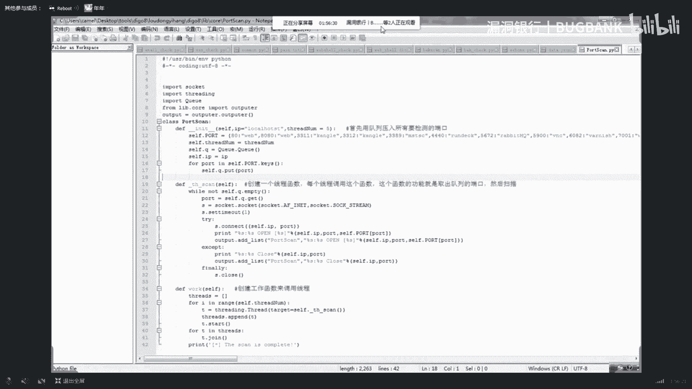

嗯，思路是很简单的。就是看你能不能把它给实际写出来，这个通过这样，然后是敏感目录，敏感目录。这个的话啊其实并没有太多好处的，这个就和就是遇见是一个相同工作原理的，也不是相同工作原理吧。

就和预见这种方式是差不多的。比如说这里。

哦，我不第啊，就这里咱们直接通过小案头来判断。比如说比如说遇见他不如说这样扫的嘛，比如说什么200啊404啊之类的，我刚刚好像还下了一个预箭，我看一下。看能不能。哦，算了回去看是时间有限。

然后是通过预见，是大家应该对这个预见是应该是再熟悉不会一个工具啊，那个工具是也是一个经典嘛，比较然后是通过判断有什么404，主要是判断404啊200这两个就是啊状态码来判断它是否存在这个目录。

然后咱们这个目录。嗯，然后咱们这个他是在。这里面的。比如说对对，然后咱们有个D2。77，就通过这个嗯，大家看到这个的话肯定是很熟悉啊，这个不就是遇见那几个配置文件嘛，里面的记个就是和那个预件是一样的。

通过返回的状态嘛来判断。好，咱们记得看下功能，这个也讲。按卡算。啊，等一下不一个，这个是刚才点的太快了。好，明感目录。然后咱们是一个另外一个功能，就是CDN检测插件CDN检测。嗯，CD检测的话。

主要是网站如果用了CDN的话，咱们就可以停止了。因为你找不到真实IP很多东西都做不了。但你连接叉S注之类还是可以检测的。嗯，像提到一些功能，就功能就少了很多，不能做了。比如说端口辅端口扫描之类的。

就不能再做。然后咱们CDN检测是用的是这样一种思路，我给大家就是介绍一下。啊，还有这里让给大家提。嗯，这个这个这呃这这个文件上还没有。比如说是这个文件。大家是看到这里面，他从个从这个里面。

从这个文件里面导入这个这样一个。就这你要想它导入的话，你要在下面建1个II这个点PY它这个空白的文件什么都没有。如果你没有的话，它就会提示找不到这个东西。这这大家注意一下，把这个地方。

然后在这里面啊不是这个。CD点的是另外一个。对着这个找错了东西太多了，这个东西。是这个CDN检测的一个插件。啊，就这样的。嗯，他这样的，他是通过就是呃我们是通过这样一种思路，比如说这是一个测征云。

就是公司一个产品，就是我们公司参与云那边。好，是这样的一个思路。然后在这里面之后，咱们把我们的网站给放进去。啊，就是这样这个网站。好，就是通过啊通过这个网站不同的地方来拼他拼他之后，然后就。

如果他是从不同地方来拼这个地方，它的就是呃IP是不一样的那说明他使用了CDN如果就是他的IP都是一样的那说明他没有使用CDN你看这它是从台湾美国来拼它都是一样的。

说明它没使用CDN但也不排除他CDN是用的美国的CDN它在大陆它是不加速的。这就你就有一种方法，就绕过CDN去找找真实IP地址，你可以用比如说中国的一些CDN它就是对国外它是不加速的。因为它是要缓存嘛。

它是一个就是分发嘛，分发这个然后他在国外你可以用一国外的地址来拼，它，可能就能找到真实地址。但这个是个国外的概点。我这个只是呃给大家举个例子。

比如说这网站咱们就假设它是一个国就中国的一个地址使用的方面使用CDN它的IP地址都是一样的。这种的话嗯。我只打个比方，但是这个这可能是我说的那种情况，它这个国外的CDN加速，它在中国内。

它没有那种就是呃分发内容分发的这种网络。然后就是你中国就拼它是一样的。但美国的话，他可能就只有CDN这个也大家需要注意一下。但这个的话他这样来拼他。这就是这一种思维是一种查找真实IP地址的一种思路。

就通过外国的。一些东西来拼另外一个国家的这种一个。顺便给大家提一下这个东西，然后是在这里。通过这个，然后是嗯把这个返回之后，咱们可以去查看查看它数据包。审查元素看一下，然后是网络里面。Yeah。嗯。

能在这里。要可能要等一下。好，是把这些东西，因为这个就是这个就和写爬虫是差不多，我感觉。就是通过这个，然后是你可以就是最后再匹配，就匹配到这里面。你看你看这如果匹配出来的都是同1个IP地址。

那就是说明他是没有使用CDN的，就是这样一种思路。啊，然后是当你如果知道他一个域名了，你知道域名之后，你如果去知道他的IP地址，一个真实的IP地址。也不是不是存在IP地址。

那就是这个几就是他是常IP地址，这他的IP地址，等于是通过这样一个东西。比如说这东西拍摄来看一下。嗯，首先是用这裤。然后是。这样我给大家就写在这，大家可以去就操作一遍。Yeah。然后是有一个售备。嗯。

但是用这个就是get it后 by name用这个。去获取他的IP开里面都是IP啊，这样就可以得到他的IP。嗯。啊，这是一个就是一个时间功能。但我们功能已经已经讲的差不多了，不知道大家听到这样。啊。

然后就是一个这个东西还是比较好理解的，就是是那个我一报报告嘛，在这里面。就是刚才我们刚才才看到一个output。就在这里面。就把我们一些东西嗯，把我们就是扫描出一些东西，把它给打印到就是网页上来。好。

就这样这样的一个东西，大家可以去看一下代码，到时候大家可以找我要一下，然后咱们就最后把这个扫描器给运行一下吧。啊。因为我刚开始没运行这个扫描器，就是也不想那么快把这个就是大家看到结果。

然后再去这个这样格是特别好。那我在线。在运行三号线。嗯，明细刚才我也测试是。我另外在电脑上测试是没问题的，但这里面测试有点小问题，大家待会儿可以看到。好，是这样来看一下他是具体是怎样的一个过程。

看一下它效果吧，并不是什么样的过程。

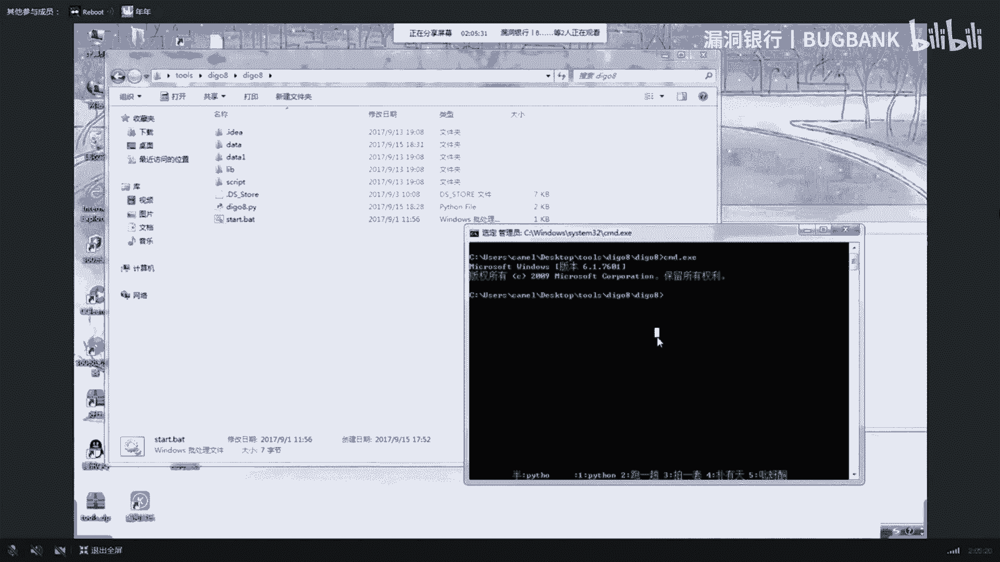

T。啊，是这样。Yeah。好，现在检测CDN。比较慢，他点到CDN的时候有点慢，其他就比较快了。嗯一个小时确实讲不了太多东西，只能给就是有些东西给提一下。具体还是要靠大家要下去自己好好去琢磨讲啊。

然后这于在扫描系统端口播了。比如说他什描什么什么FTP啊，什么SHH啊之类的。然后是2325这些端口并的。

现在已经在扫这个。但我这个东西可能是有点太大的一些文件。如果就是现在没扫完的话，待时候大家找我要一下这个源码，大家自己拿去测试一下，还是挺好玩的。这个东西并不是说功能都强大，是比较好玩。

然后就是也可以实现一些基本的一些功能。好，然后比如说他开了1个SSL，然后开了一个叫保演端口。嗯，比较慢。好，这已经完成了，然后就已经来测试这下面就是一个反布了嘛。比如说哎。还有。几啲啊。他在访问着。

感受不报，我感觉有点像。为了什么款式T滴？啊，具子还有还有这种目录，我还以为是一个字母的。啊，这是1个200的一个，然后是这状态嘛，比如说一个他扫FCK就是404，然后是再扫其他的。然。

这个的话有个时间有限，就基本的功能，就最后他会测试一些叉S之类的，加载一些东西，大家有兴趣可以自己去测试一下这个东西。然后最后再在这里面有个生成的一个网页报告。

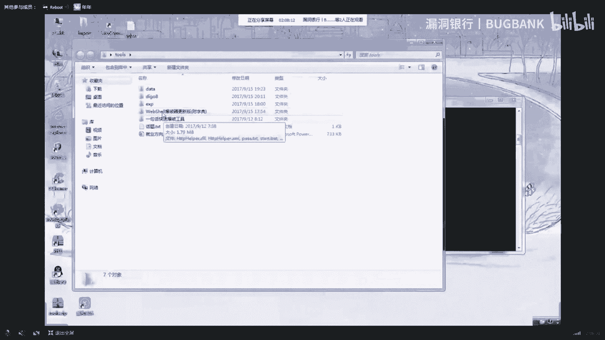

这就这个扫完的话，估计啊可能快慢的话，可能要少个半个小时到一个小时，还是比较长的时间。大家可以自自己看一下。

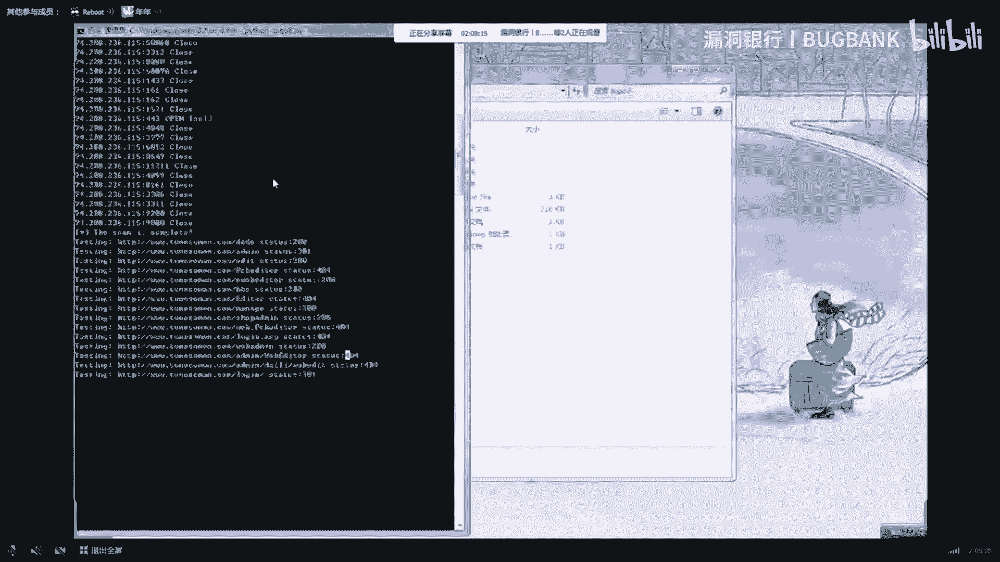

这网页报告就是他已经嗯扫完了扫完了这样1个IP，然后是这些系统探测。

就这样一个基本上输了。然后我基本上要讲的就讲的差不多了。然后大家还有什么问题吗？可以是问一下，看一下这个问题。嗯好。感谢digo的精彩演讲，满满干货。那相信听了今晚的讲座。

你已经会用python打造自己的军火库了。😊，嗯，如果说还有什么疑问，那可以提出来，第个会给予大家解答，让我们把聊天时切换到问答区板块，开始进行今天的问题解答。😊，It嗯。Oh。嗯。

这个你可以就是加一下我QQ嘛好。切行，大家可以加一下我QQ之类的。然后有些东西我能给大家知道的，就知道一下。啊，这个这个360测网站对吧，我把这个给就是给发给。其实其实这个的话，你们找我要要代码。

这里面代码里面全都是有的。对。大家可以加一下我QQ，然后就是有些问题可以问一下我。是PUC嘛POC是我是在看到那个Cbug上有一些就是代码嘛，然后就想然后可以开发这一样的功能。你如果感兴趣的话，可以去。

看一下自己商品，这全是是手集的一些东西。但也不是我自己写的，就是我在别人给我一些东西，他是以前在那个插件一个是那个Cbu做嘛，有很多这种东西。

CDNCDN它是通过就是刚才我也说了嘛，就是这样一个，它通过就是这网站，然后就是拼它就不断的用这样去拼它。然后就是如果他返回的IP都是一样的，就是这些IP它是一样的。

说明它没有使用CDN如果一个使用了CDN的网站，它会你从不同地地方去拼它，它的IP是不一样的。

是一个基本的一个思路。

Yes。Yeah。小伙伴如果还有疑问的话，可以抓紧时间提问。多多提问，还有可能成为4名观众。好，获得证书。Okay。Yeah。这版本嘛版本就是在这里。

嗯，这个是这里你如果要的话，呃，也不是说叫不要，我待会把这个全部发给你吧，就是这里面等一下找一下。这是也有这个问题。我看一下这个D址。啊，然后是这里面。我里面只是列举了几个简单CMS。比如说这里。

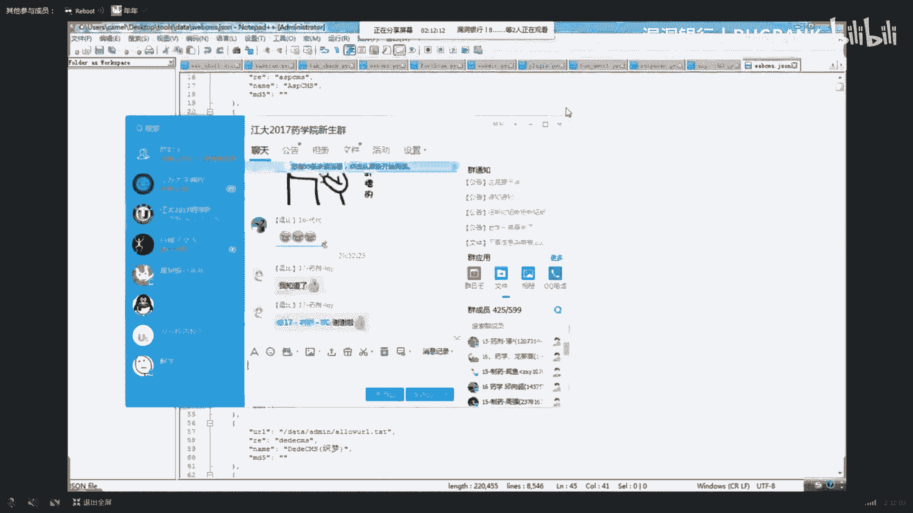

就这样嗯，他一个比如说都都是字贸，你可以通过也可以通过你去找一些差别。他比如说UR不一样，或者他一些政策匹配出来的不一样去匹配。然后我这里面的话，大概有就是几千个吧。

你可以拿去试一下自己是一些国内比较常见的。但主要是刚才也说了，就是你看你看如果它版本不一样。看它有没有这四个地方不一样的，这是四个地方不一样的。然后你再写一个输出它是什么版本的。

你可以根据这样来就是自己写一个这样一个特征识别。

Yeah。

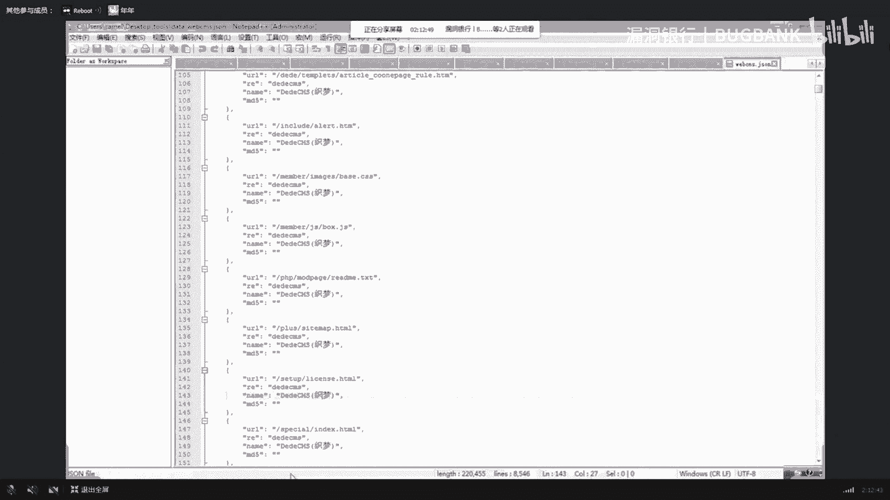

这个你可以自己去写啊，这个就是以前那个通过就是通过Cbu，就是那个这个嘛。

当是我是这样想的，就是大家可以就是自己去往这方面就是想一下。Yeah。

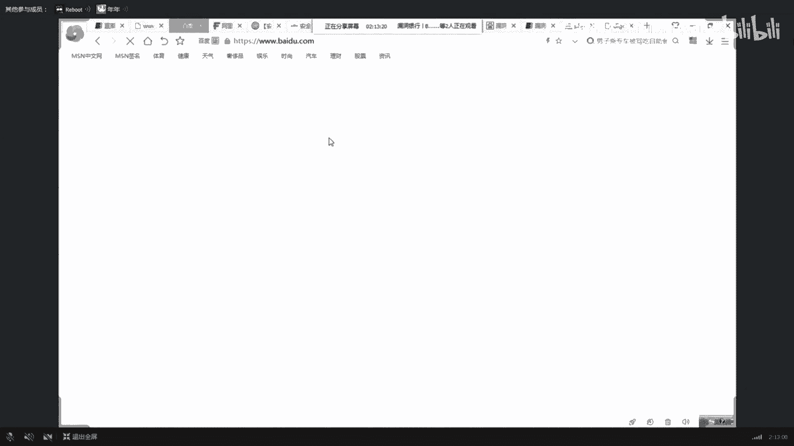

啊，sim指纹我待会发给你吧，我这里有一些就还是比较全的。就就是嗯。

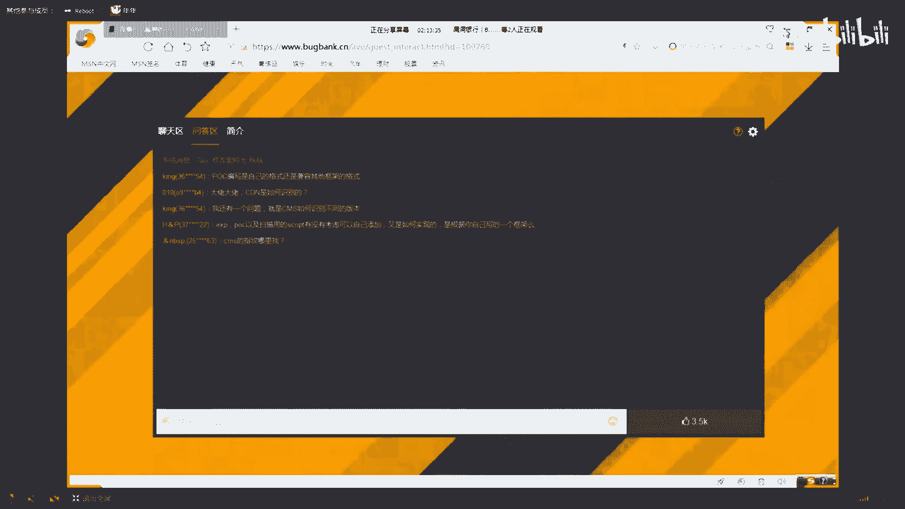

不不是谁报给发给谁的？我念错，就这个，它就是一个插件嘛，加在插件。主要是你可以去参照这上面的一些思路。我一开始想的是就参照这样一个思路去写，但是最后没写，是也是给大家自己可以去。嗯，同试一下。

因为这里的一些嗯以差品是大概有2000个，就是以差P吧。这可以就你找我要一下，是以前在上面收集的一些东西。

嗯，对你可以把这是这个自己去添加个功能，就是看一下它这上面。嗯，这个这个我刚才也说过了，也如果就是网络工程师的话，主要还是偏运维，就在这张图里面。

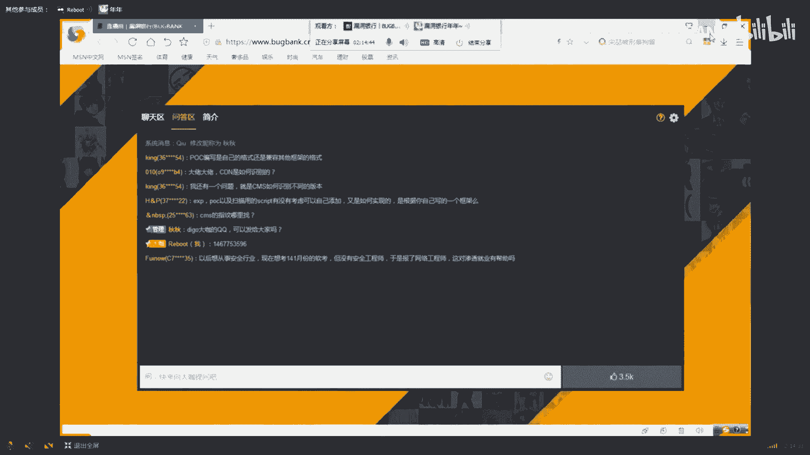

就是这个这个你可以看一下。就网络嘛，因为网络像C3E的内容我也学过吧，就是我对网络还是就是嗯有一些比较熟悉的。就这样，是网络工程师的话，主要是偏运维方面的，就是它和云计算差不多关系是比较大的。

你如果想搞云计算的话，可以去学网络，但这些东西都是相辅相成的。你需要这肯定是有好处的。不管你学什么。

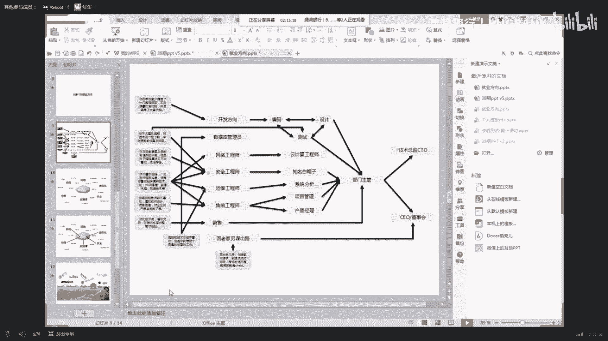

啊，区别啊区别就是他们的那些功能比我们，就是我们这个只是进行一些嗯原理功能上的一些简单实现。但他们那些扫描器都是很成熟的一些扫描器。毕竟扫描器那么厉害吧。你如果想去开发的话，可以在这个上面继续开发。

然后像有些大佬他手里面也有一些自己开发扫描器，但我很菜的，没他们厉害，然后就只能写这种一些原理上的识别的一些东西。肯定是AWV这些厉害啊。这场媒具其实你可以去自己去，就是根据这个呃来自己去开发的。

就是根据我这个，然后写些功能上去。我这只是一个抛砖引玉的作用。好，那我们规定提问时间也差不多了。那感谢digo的耐心解答。如果还意犹未尽的小伙伴，可以添加大咖QQ和D呃diiggo私下交流。😊。

那下面就进入我们最后的福利环节，打开赠书。现在就请digo选出一位认真听讲的伙伴送上这本黑客攻防实战加密与解密，只能幸运拿到，赶紧选择吧。给给这位小伙伴吧，因为我看他提问的比较多的。

应该是对这个东西应该是还是听的挺认真的。嗯，可以双击一下它，然后再开始核进行关注。对，再开始核系。嗯，就是也非常感谢大家是花时间来听我这个东西。😊，好，那恭喜这位谢运观众嗯。

获得这本黑客攻防实战加密与简历。那需要你在弹窗里留下正确的收获信息，我们会尽快将书籍寄给那到这里，本期的大咖面对面也要和大家说再见了。感谢黑go的精彩呈现，也感谢小伙伴们的踊跃参与。下周五晚8点。

汇动银行大咖面对面第39期，我们精彩继续。😊。

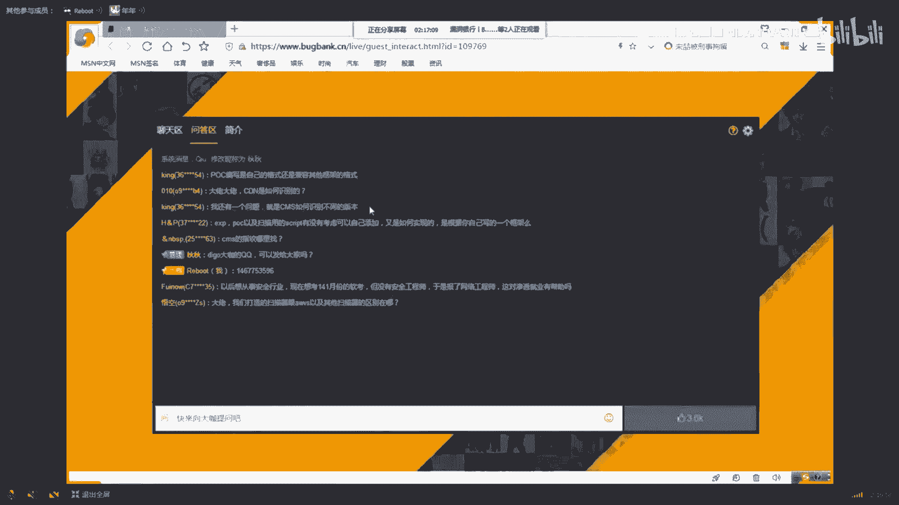

嗯。Yeah。

