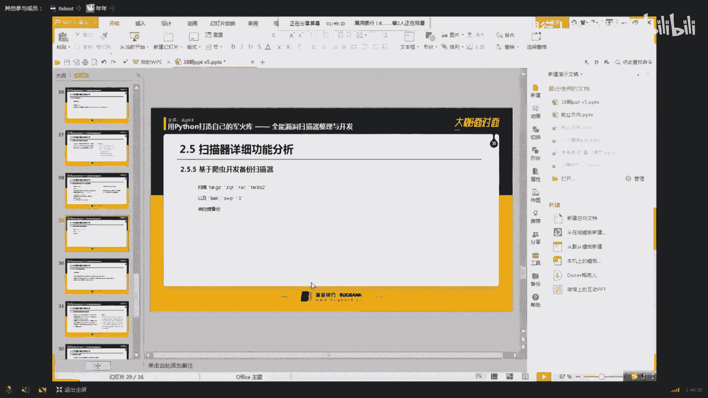

# 课程 P1-38：用 Python 打造全能漏洞扫描器 🛠️


在本节课中，我们将学习如何使用 Python 从零开始构建一个功能全面的漏洞扫描器。课程将涵盖扫描器的核心模块设计、关键漏洞的检测原理以及代码实现，旨在帮助初学者理解自动化安全测试工具的内部工作机制。

## 概述

本次课程内容分为三个主要部分：首先，我们将简要介绍两款成熟的扫描器（AWVS 与 OpenVAS）的部署流程；其次，课程的核心是详细解析一个用 Python 编写的自定义扫描器的各个功能模块；最后，我们会探讨安全行业的职业发展路径，并提供一些学习建议。

---

## 第一部分：成熟扫描器简介

在深入开发自己的工具之前，了解现有的成熟解决方案是很有帮助的。本节我们将快速浏览 AWVS 和 OpenVAS 的基本安装与启动流程。

### AWVS 安装流程

AWVS 是一款知名的商业漏洞扫描器。其安装主要涉及数据库配置。

1.  **连接数据库**：通常使用 `./wvsdbmgr` 命令进行连接和初始化。
2.  **创建与配置**：需要为扫描器创建专用的数据库、用户名和密码。
3.  **启动访问**：完成配置后，启动服务并通过 Web 界面访问。

### OpenVAS 安装流程


OpenVAS 是一个开源的漏洞评估系统，功能强大。


以下是其安装步骤：
1.  **更新系统**：编辑源列表文件，添加官方仓库，然后执行系统更新命令。
2.  **安装软件包**：使用 `apt-get install openvas` 命令进行安装。
3.  **检查与配置**：安装后检查完整性，并修改默认的复杂密码。
4.  **启动与登录**：启动 OpenVAS 服务，通过浏览器访问其 Web 管理界面。

上一节我们介绍了两种成熟扫描器的部署，本节中我们来看看如何开始构建自己的 Python 扫描器。


---

## 第二部分：Python 漏洞扫描器开发

我们自研的扫描器将包含多个核心功能模块。其基本工作流程是：先进行 CDN 检测，若无 CDN 则转换 IP 进行扫描，随后依次进行敏感目录爆破、CMS 识别、爬虫信息收集以及各类漏洞检测。

### 1. SQL 注入检测模块

注入检测的核心思路是通过逻辑判断来识别漏洞。

**检测原理**：
通过向参数提交 `and 1=1` 和 `and 1=2` 这类 payload，对比服务器返回的页面内容。如果原始页面与 `1=1` 的返回页面相同，但与 `1=2` 的返回页面不同，则可能存在 SQL 注入漏洞。

**代码实现要点**：
*   **参数过滤**：首先判断 URL 是否包含 `?` 等查询符号，过滤掉如 `.html` 等静态页面，减少无效测试。
*   **报错信息识别**：如果网站开启错误回显，可以通过正则表达式匹配报错信息中的关键词（如 `MySQL`、`PostgreSQL`）来判断后端数据库类型。

```python
# 伪代码示例：基础的注入检测逻辑
if normal_page == payload_1_page and normal_page != payload_2_page:
    print("可能存在SQL注入漏洞")
```

### 2. 网络爬虫模块

爬虫模块负责收集网站的所有链接，为后续漏洞检测提供目标。

**实现思路**：
使用 `requests` 和 `BeautifulSoup` 库来抓取和解析网页。将发现的 URL 放入一个队列中进行管理，并使用多线程技术提高爬取效率。

**关键组件**：
*   **URL 管理器**：负责去重和调度待爬取的 URL。
*   **下载器**：负责下载网页内容。
*   **解析器**：从下载的内容中提取新的 URL 和有用信息。

### 3. 邮箱收集插件

该插件用于从网页源代码中提取邮箱地址。

**工作流程**：
1.  爬虫将网页源码传递给插件。
2.  插件使用正则表达式匹配邮箱格式（如 `xxx@xxx.com`）。
3.  将收集到的邮箱列表返回给主扫描器。

### 4. XSS 漏洞检测模块

XSS 检测通过尝试提交多种攻击载荷（Payload）来测试目标参数是否被过滤。

**检测方法**：
1.  **拆分参数**：对 URL 中的多个参数（如 `?a=1&b=2`）进行拆分，逐个测试。
2.  **加载 Payload**：从预定义的 Payload 文件（存放于 `data/` 目录）中读取测试向量，附加到参数值后面进行提交。
3.  **判断结果**：如果提交的 Payload 在响应中原样返回，则可能存在 XSS 漏洞；如果被过滤或编码，则可能安全。

### 5. Web 服务爆破插件

该插件利用 Web 服务器（如 Apache、IIS）对 POST 参数数量的限制，实现高速密码爆破。

**技术原理**：
*   Apache 默认最多接收 1000 个参数，IIS 约为 6000 个。
*   插件将大量密码字典（如数万条）拆分成每批 1000 条，通过一个 POST 请求同时发送。
*   通过响应差异快速判断密码是否存在于某批字典中，再结合二分法定位具体密码，极大提升爆破速度。

```python
# 概念性代码：批量参数提交
payload = {'password1': 'pass1', 'password2': 'pass2', ..., 'password1000': 'pass1000'}
response = requests.post(url, data=payload)
```

### 6. 备份文件扫描

此功能用于发现网站存在的备份文件（如 `.bak`、`.zip`、`.rar`），这些文件可能泄露源代码。




**实现方式**：
构造一个包含常见备份文件后缀名的字典，依次拼接在目标 URL 后进行访问。通过检查 HTTP 状态码（如 200）来判断文件是否存在。

### 7. CMS 指纹识别

识别网站使用的 CMS（内容管理系统）有助于快速定位已知漏洞。

**识别方法**：
1.  **特定 URL 访问**：尝试访问 CMS 特有的路径，如 `/wp-admin/`（WordPress）。
2.  **页面特征匹配**：在网页 HTML 中搜索 CMS 特有的 meta 标签或注释。
3.  **文件 MD5 比对**：获取特定文件（如 `/robots.txt`）计算 MD5 值，与指纹库进行比对。


### 8. 端口扫描与系统指纹识别


此模块用于探测目标服务器开放的端口及其对应的服务。


**实现思路**：
*   使用 `socket` 库对常见端口（如 21/FTP, 22/SSH, 80/HTTP, 3389/RDP）进行连接尝试。
*   根据端口号、服务旗标（Banner）等信息，推断服务器运行的操作系统和服务类型。


### 9. 敏感目录爆破

与备份文件扫描类似，使用一个庞大的目录字典（如 `DirBuster` 的字典），通过发送大量请求并分析状态码（200、403、404）来发现隐藏的目录或文件。

### 10. CDN 检测插件

如果目标网站使用了 CDN，会隐藏真实 IP，影响后续的端口扫描等操作。

**检测原理**：
利用多个地理分布不同的第三方 IP 查询服务（如 `ip.chinaz.com`）来 ping 目标域名。
*   如果从各地查询到的 IP 地址都相同，则可能未使用 CDN，或使用的 CDN 未在该地区加速。
*   如果查询到的 IP 地址不同，则很可能使用了 CDN。

**获取真实 IP**：
一种绕过 CDN 的思路是查询域名的历史 DNS 记录，或尝试通过国外节点访问，因为有些 CDN 仅对国内线路加速。

---


## 第三部分：行业思考与学习建议


在掌握了技术工具之后，明确的学习方向和职业规划同样重要。


### 学习路径建议


1.  **渗透测试知识**：这是安全领域的基础，需要不断学习和实践。
2.  **编程能力**：无论选择哪个方向，编程都是核心技能。建议新手从 **PHP** 或 **Python** 开始，这对理解 Web 安全和自动化测试至关重要。
3.  **利用优质平台**：像“漏洞银行”这样的SRC平台提供了合法的学习和实战环境，可以在此研究漏洞案例，学习他人思路。


### 职业发展方向


安全行业的职业路径多样，可以根据个人兴趣选择：
*   **安全研发**：偏向开发，编写安全工具或产品。
*   **渗透测试/安全服务**：模拟黑客攻击，评估客户系统安全性。
*   **安全运维/安全运营**：负责企业自身安全体系的建设和日常监控。
*   **售前/售后技术支持**：为客户提供安全产品的解决方案和技术支持。


**重要提醒**：务必远离“黑产”。任何利用技术进行非法活动都将面临法律风险，断送职业生涯。技术应在合法合规的范围内使用。


### 如何有效学习


*   **研究招聘要求**：定期查看心仪公司（如阿里、腾讯）对安全岗位的招聘描述，了解市场需要的具体技能，并以此为目标进行学习。
*   **理论与实践结合**：在理解原理的基础上，多动手写代码、搭环境、做实验。
*   **规划与总结**：避免盲目学习，制定阶段性目标，并定期总结复盘。


---


## 总结

本节课我们一起学习了如何用 Python 构建一个多功能漏洞扫描器。我们从扫描器的整体架构讲起，深入分析了 **SQL 注入**、**XSS 检测**、**爬虫**、**爆破**、**指纹识别** 等核心模块的实现原理与代码思路。同时，我们也探讨了安全工程师的成长路径，强调了 **编程基础** 和 **合法合规** 的重要性。


希望本教程能为你打开安全工具开发的大门。记住，这个扫描器是一个起点，你可以在此基础上不断添加新功能，使其更加强大。