# P1：39【咖面】突破多层防护，控制你的shell-Metasploit会话结合DNS协议——大咖天策 - 漏洞银行BUGBANK - BV15f4y1t7qV

為知識而存，因技術而生。

小夥伴們大家晚上好，歡迎參加漏洞銀行信息安全技術講座。大咖面對面第39期，我是主持人妮妮。今晚嘉賓是專業研究Metasploit好多年的天策大咖。那帶來主題為突破多層防護，控制你的share。

Metasploit繪畫結合DNS學藝的演講。今晚天策會教大家突破各種防護，控制share的全過程。是不是有一點心動了呢？那就認真聽講吧。本期直播分成三個環節，首先是天策的主題演講。

接著行長問答環節留時間給大家提問。最後就是大咖贈書環節，天策會選出兩位最認真聽講的觀眾送出Metasploit滲透測試指南的修訂版。今晚福利很多，大家要認真聽講踴躍提問啊。好，那規則就和大家說到這裡。

下面有請天策開始今天的講座吧。好的，謝謝妮妮。那我就給大家講解一下吧。

今天主要分享三個議題，就是第一個就是Metasploit繪畫與DNS學藝的結合。這個DNS學藝大家都知道，在防火牆中很多防火牆都是不會去攔截這個DNS的。然後這個怎麼說呢？

這個DNS在很多防火牆也是沒有這個，壓根就沒有這個選項，就是說沒有去限制DNS學藝之類的。因為限制了這個DNS學藝的話，大家都清楚會導致很多這種業務情況，什麼上不了網啊，然後各種業務出現問題啊。

所以說這個風險還是很大的。大家如果說有認識這些甲方安全公司的小夥伴，你可以去問一下他們，你說現在如果說這個DNS可不可以說限制，然後他可能會回答你說限制是可以限制，但是是比較難以限制的，因為目前說的話。

像我有一個朋友也是在甲方公司上班的吧。他對我跟我說的結果就是說，他們公司壓根就沒有說限制DNS學藝這種情況，也沒有說特意去關注DNS流量這種日常的操作，基本上都是關注其他流量的操作。

像他們公司的防火牆是比較老的嘛，幾年前的，他說壓根就沒有限制DNS這個選項卡，然後我說，然後我又說一句話，然後這個DNS學業的這個簡介，大家都應該比較熟。

我就不多介紹了，然後今天我主要給大家介紹是什麼，給大家介紹就是說，這個使用一款工具能把這個流量轉載到Mirror16匯化的流量，轉載到這個工具，就使用這個工具進行中轉一下，可以把流量變成DNS的流量。

這款工具叫做什麼，DNS Card2，這個工具是國外一網網友開發的，使用的語言都是使用的是Ruby，這個Ruby大家都知道是比較有潛力的語言，也是比較方便的，和Python他們這種管理方式都是差不多的。

基本上也是比較一個輕量型的語言吧，可以開發出很多比較好用的工具，這裡我就不多介紹語言的好處了，反正就是很好了，大家都可以去學了，這款工具的地址是在這個底下，大家都知道，Github上面。

可以去把這個下載下來，然後進行安裝，安裝的方法我給大家這裡簡單說一下吧，安裝的方法，建議大家是在Kali或者是在Ubuntu上面進行安裝，這個安裝的環境也很簡單，需要Ruby的2。3到2。2以上的版本。

然後這個安裝步驟呢，首先我們要更新一下系統的語言，然後我們還需要裝一些組件吧，組件也不多，大家都是幾個常見的，然後還有我們需要裝一個Ruby語言管理插件的東西，叫做Ban，Ban安裝之後。

我們還要修改一個文件的原地址，文件原地址呢，他這個在這個根目錄下面有個叫Server的目錄，進入這個Server目錄，他修改一個gm。file這個文件，把這個原地址給他修改成淘寶源。

為什麼要修改淘寶源呢，因為我國網絡環境嘛，是吧，畢竟訪問國外他是有一定的缺陷的，所以說建議沒有科學上網的小夥伴可以改成Ruby的淘寶源，然後Ban的話。

然後最後就是修改了之後你們就Ban安裝一下就可以了。

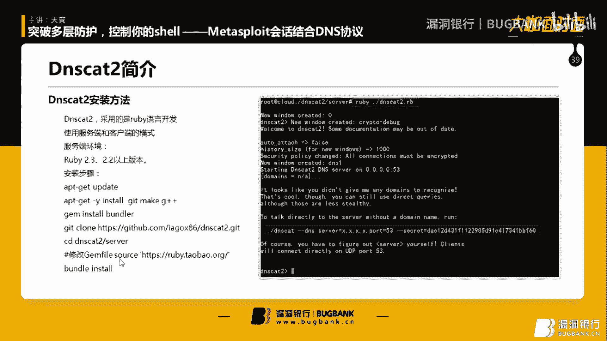

這裡我給大家簡單的演示一下吧，嗯，首先我們我這裡只要是Kali進行安裝。

大家可以用Wubuntu進行安裝也可以，嗯，Biancocart，為什麼大家看到了嗎，注意的是這個文件了，我就打個編輯，大家都應該知道這10日的老司機了，我就不多介紹，主要是這一塊要修改。

一定要修改一下，修改之後我們就可以進行Ban的安裝了，Ban的安裝的話，大家這裡一定要使用什麼，root權限，如果使用非root的權限的話，他以後運行會出現很多很多的問題，比如說什麼問題呢，嗯。

監聽不起這個端口啊，然後各種各樣的問題，建議大家一定要使用root的權限去運行，為什麼呢，因為root他可以起一個監聽端口，如果普通用戶去起的話，他是一般來說是起不來的，如果說你使用速度啊。

速度這個命令他一定會出錯的，大家不要去試了，我已經給大家試過了，所以說大家還是用root的權限去運行，所以說更方便嘛，這裡我就不多安裝方法，我就不多給大家介紹了，如果有什麼不懂的，等一下可以提問吧。

我再給大家裝一遍看一看，然後我們再說一下下一步，下一步我們為什麼要這個如何做結合呢，這個其實也很簡單，大家也說那個不就是這個換湯不換藥嗎，是嗎，然後我還是這裡我還是要給大家講一講，詳細一波，是吧。

那DNS Card2呢，他有個功能，他的開發出來的這個控制台，他是操作方法是很相似的，就是說他也可以管理繪畫管理這些，這個他也可以是什麼，然後還有文件上傳端口轉發這些功能。

都有他不過他和沒有所以區別就是說他是一個比較輕量性的，沒有賣出這個會換這麼多功能啊，然後這麼多雜七雜八的這個這個套路啊之類，他就是個簡簡單單的使用DNS協議作為一個C2通道的一個工具，只是這樣的。

然後作為一個端口，這個我們主要是說什麼呢，他就是說我們DNS Card2客戶端與服務端連接上之後，他在進行他在目標機上運行一段PoE學代碼，然後PoE學代碼之後，然後把這個目標機的端口轉發到我們本機。

然後我們在進行連接，這個應該很簡單，大家是老司機的，應該都比較能聽懂我在說什麼，如果聽不懂，我就給大家演示一下嘛，我們這裡我生成PoE學用的工具是一個叫PS1的那個incode的。

他這個可以生成一段就是把所謂這些payload的，然後生成一段PoE學代碼，然後在目標機上執行就可以進行這段payload的，我給大家演示一下。這個這個Ruby的話。

大家可以去這個這個這個Ruby的腳本，大家可以去Github上面下載，如果不知道地址的，等下我會給大家把這個地址拿出來。這一切都是常規操作，大家應該比較作為一個老司機都比較熟悉了，是吧。

我們首先不要生成代碼，我們首先要幹嘛，我們首先還是開啟一個監聽。

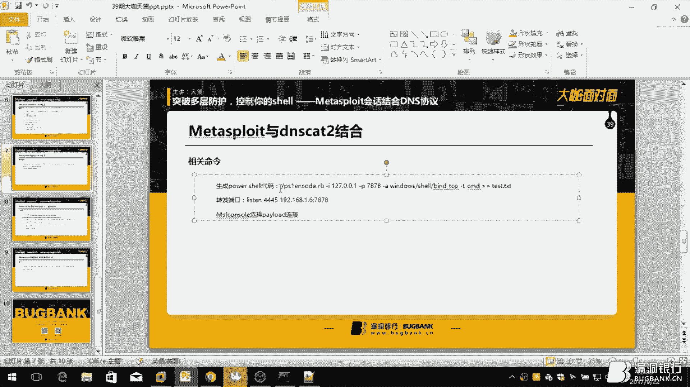

開啟一個DNS卡特2的服務端的監聽，這裡的話也很簡單，直接Ruby DNS卡特2，一定要在DNS卡特2的server目錄底下，然後大家可以看得到這個，這個他他已經給我們一個在客戶端運行的模板。

他模板是什麼，首先DNS一個參數，然後指定一個指定一個DNS的服務器，指定一個端口，然後再指定一個密鑰，這上面要很關鍵，為什麼呢，因為這沒有這上面要他是連接不上去的，為什麼要這上面要呢。

因為他DNS這個流量吧，他說他小，但是他他要給這段流量進行加密，給這段流量進行加密是為什麼呢，為了防止以後調查取證，還有就是被一些防火牆這些，例如有DNS協議那種監控防火牆的，防火牆進行探測到之類的。

反正就是類似於這麼SSR，大家應該知道那個方向軟件吧，大家都應該都懂，就肯定要一個預先裝的密鑰，然後連接上來，這樣也可以對流量進行加密，這個流量他的加密方式，我我沒有記錯的話，之前的應該是RC4加密。

我們只要在客戶端上運行上的代碼就可以連接上了，這個管理方式也很簡單，我先給大家演示一下怎麼連接上來，這個我給大家說呀，這個客戶端，這個客戶端，他一定他客戶端吧，他這個他已經有編譯好了。

還有多個有network下面，也有windows下面的，主要大家還是用了windows下面的吧，應該windows下面他是有編譯好的，編譯好的環境，編譯好的，所以說建議大家使用編譯好的，這個兼容性更高。

如果說你要自己去下載他的代碼編譯的話，他是在這個目錄下面，他是有有一個代碼的，在這個目錄下面，他是有各種各樣的代碼，我們你可以對他進行編譯，像windows3的話，就對應windows的。

大家都應該都懂，我就不多多介紹這個編譯的東西了。

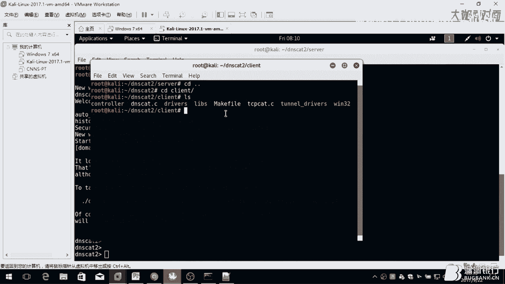

好，我們首先我們就是在使用把這個連接上來，我們一定要我我開啟這個流量監聽的一下，大家給大家看一下，避免大家說我這個騙大家的感情，是吧，好，我連接上來吧，這個。

一定要指定好的ip地址，千萬不要錯了，錯了的話可能就是導致各種連接不上的，我看都是點2。5，大家記住啊，我這個卡里是點2。5，這個溫馨是點2。6，大家一定要記住不要搞錯了，搞錯了，這是很尷尬的。

我先給大家看一下這個，把我錢是開的，對，他是開的，大家為什麼我為什麼就用windows的方法錢呢，因為我沒有我沒有那個實體的方法錢，所以說我給大家拉這個溫度是把我錢也是一下，大家不要介意是吧，那個雖然。

我說一個。我連接上來的，我們就專門看這個ip地址，好像是這個吧，我也不知道這個真的表達是什麼，應該大家看這個已經他這個密碼下的提示已經已經已經已經連接成功了，然後他支持這個什麼txtmx這種解析的。

然後這個請求方式。這是請求方式，然後你看他發的包對吧，他有他那天dns他有個這種協議，他有一個優缺點是什麼，他的優點是什麼，比較隱蔽難以發現是吧，這個大家都已經知道了，然後還有就是說。

第二個就是說他一個缺點是什麼，他一個缺點就是說每次發的包都很小，不會說很大，你看每次發的包都100多100200300多字節的都不會說很大，所以說你這個這個注定了的話，他會不會說很大。

你看每次發的包都100多100200300多字節的都不會說很大，所以說你這個這個注定了的話，他是比較小的，難以限制的，然後他同時呢也就是說不可以傳輸過過大過過大的這些流量過去一次性，他不是說不讓你傳。

他就是說一次性傳不過這麼大，是吧，所以說大家還是建議大家使用那種比較輕量型的這個payload的，所以說我給大家選擇了缺單口這種缺類型的這種payload的。

所以說我給大家選擇了缺單口這種缺類型的這種缺code的，然後我們進行演示，好，這你看看了吧，這個只要客戶端運行這個他這個服務端立刻就接收到一個這個繪畫，你看他給他繪畫命名的ID是什麼。

我給大家說過之前說過他這個DNS card他這個控制台和manage thread控制起來，他是操作方法是很相似的，為什麼呢，因為他借鑒的就是manage thread的那個框架的思想。

所以说像号规划大家都应该知道了吧所以我们看一下他有没有什么帮助，他主要什么主要是你看这个这个控制台上没有什么你要进入画面之后他有更多的命令选择会话应该怎么选择，SELSLM-1。

好进入了我们的第一个会话，第一个会话之后他他有很多功能吗这个会话里面就有更多的功能他有血这个血主要用的什么这个新建一个血的，嗯。

就是就是说新建一个3M的会话到到到我们这里就是他生成的话默认我在你是生成的数啊，然后单路的下载文件输出一个文件到什么地方然后执行一个然后监听这个端口转发吗。

这个主要用的我们主要用的是血然后还有这个当过转发功能好我们，就先新建个血吧血血的会话，等一下啊这个有点延迟大家不要介意这次有点延迟大家都应该都懂是为什么呢因为他太小了他肯定。

传输过去他肯定是要修需要一段时间的所以说大家一定要见面是吧，千万到我们去切换到会话2，啊就会怕我们看他的IP地址，大家记住啊这是点呀点6啊这是这个目标这个是点呀点6啊来记住啊，这个我们一直我们知道了。

然后，这样然后我们，要退出这个会话的话，如果肯定加谁的话大家都知道直接就直接就把这个服务那给崩掉了我们按什么，解决价值这他就把他就把他会话放到后台了。

给大家简单的介绍这个dns卡的2之后这个控制台一些使用方法然后客户端连接上来这些方法之后，之后大家如果可以用什么不懂，可能我说太快了大家可以等一下向我提问我，做解答。

好dns卡的我们这里就告一段落首先我们在这里我们就生存一段payload的生存这个payload的呢，我用的是这个，这个脚本，有些老司机可能就知道这个就不就是这个带那个代码的脚本吗。

这个这个我都我都我都已经熟知了你不用讲了但是为什么还讲，因为，我还是要讲吗是吧反正我就是要用这个讲，反正你反正我就是要这样讲，你们一定要听是吧。

简单的给大家介绍一下这个这个命令的这些参数，这个该，大家都知道指定IP地址我我为什么要指定要去点一点要打这个等下的我的给大家就，介绍的时候大家就应该不懂，然后这个该什么这是选择一个。

这个这个payload大家都这个这个端，开一个什么端口啊，选择上车类型啊然后再，输出到一个什么地方这个大家都应该，不知道我就不多介绍了。

我们看下这个生存这个payload，大家看下我这个这个就很惨了是吧就大家不要急只是说，只是说这段payload的生存的这个加密的比较长所以说我们主要是在没有经常运行的让。

感觉说在你行我我都不知道就是没有运行的，地方，哎，这个去，该不是生成一个，会话吗会话，好的会话不就是这个先不听吗是吧，我们直接在这个会话你们执行吗，但是这边带着最好这边有点惨所以说执行出来的话，他。

他是要一定的时间他们，那是吧，他现在执行了，这个一定要等一下他执行执行过他一定要等如果说你不等的话他是会，他是一定要等一下，刚刚我没输对输到，他刚输到有点延迟，他应该执行了他就不要他就不要急。

大家千万不要急，因为这个一定要等一等，一定要等一等，因为大家也看到这个，这个包发的他已经在很努力很努力的往外发包了，是吧，应该执行完了好之前我们的目标机上看一下他有没有开启在本地开一个8，7878张。

我这一通过来直接这么多去看。

是吧，这已经有七八七八了对吧，这下我们该怎么办，我们肯定不能直接，直接连接他对吧，我们首先做什么我们首先要把它转发过来为什么怎么过来因为我看见是他本地的端，本地的七八七八，我使用，这个吧我使用。

在会话音里面使用啊记住，退出，感觉到直接，切换到会话音，然后再对这样，这个什么这个是我本地的本地的当口就是，点2。6的78把点2。6的七八七八让我转到我的4445当我上面来这个老师今天在干，我的介绍。

我们进入麦克斯的控制台那时候的控制台大家都应该很熟悉了我就直接，加错一个参数，应该是要这样，我就直接快速的过一遍吧这个我没有没起数据库，这就会没有起来，大家不要介意等一下，开的比较慢这个没数据。

然后在机器性能不够不够好吧，内存太低了，我只给他放了两句的内存应该，不大够我都习惯用4G的内存了，什么款大家都应该知道，这是什么都是开一个监听的模块是吧。

然后选择一个配乐的这个配乐的选择什么选择这个吗知道大家都应该比较清楚的这个。

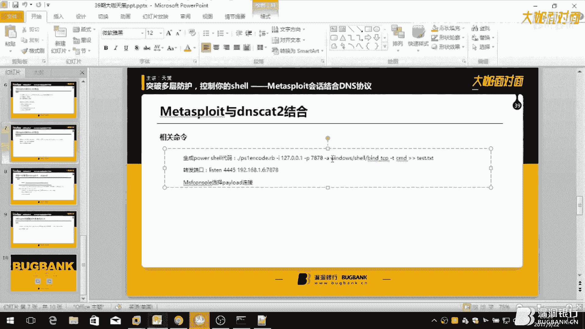

好事对因为他是一个这个修的是什么这是一个正向连接的修复的，所以说正向连接修复的我们我们要连接哪个东西要连接本地的4445所以说这个，好事的这边肯定是127。0。0。1啦然后就啊。

断口是什么当初当初是什么是45啊，我们要切换过去是，对吧，然后，看一下看一下嘛是吧，没什么错啊我们运行一下大家注意运行之后这里他提示会连接成功，所以说我，运行一下，他已经连接成功了那我在这里看一下。

他走的还是DNS协议完全没有什么tcp直接流量的存在，是吧，我们的执行的命令很开心是吧，老大可以用，没所谓，干自己想干的事然后没得睡，大家说这个没了16万肯定加谁那不是中断了吗。

大家就注意啊我哥说了肯定加值这，他就会叫你他就会跟你说是否把事情，一放到后台然后他就怎么你二位就是放到后台吗是吧，这都是常规操作大家都应该都懂我再看一下。

干爱了我师傅师傅有对你看他这就有一个血类型的那个会话血液型的话怎么提升的话在我这里不多的介绍大家都应该都懂，但是提升的话我跟大家说提升过后他就不是dh协议了。

提升过他就是tcp了至于为什么大家可以这就是讲，这个，这个这个的话，这个我跟大家讲一下这个。

这个工具有什么缺点了这个工具的缺点是什么，如果说，都因为这个工具吗大家都知道他是开源，他也开源的话肯定是有人给他写其他的，其他的那个执行那个年纪方式是什么呢。

加年纪方式一个就是有一种大家熟知的叫pull血，他的话他执行过后的话，在你上传他有一个上传文件的功能吗，如果说他用这个上传文件的功能的话他会就是说你上传比较大一样的文件。

他会去卡死建议大家不要上传太大的文件因为怎么说呢因为上的那个太大的文件，他这个通道他是来不及这么反应的然后他是比较，怎么说呢他是比较，你放大的他可以他可以传但是他要很慢。

你想一下你放一个五六十兆的东西过去，他可能给你传个半小时，那你是不是很尴尬，因为这个怎么说呢现在，DNS大家都知道最近有，最近有一款新闻就是什么，插血上次事件是吧然后最近的一个。

垃圾清洁软件他也出现了这种DNS后门的，这个不得不引起我们的这个重视了是吧这个毕竟，最近很多人都拿这种，就是大型的这种，虽然说他收集的是我们的一些技术信息但是这也是危害很大的，插血的那种简直就是不能冷。

他直接就，直接就把我的什么，密钥密码这些全部上的上去了你说是吧，这就很杀人了，插血怎么，这就很尴尬，但我能怎么办我肯定是，选择原来插血官方是吧就用他的产品毕竟他的产品这么好用你说是吧，没办法。

好了给这个就给大家介绍完了如果说大家有什么不懂的话可以问我，是吧但在提问提问我看到你提问的比较好的可能我就会给你的名字一下发送给你，这里我这里就没说的控制台我就不退出了，给大家讲第二个吧，第二个。

使用电视的天使的值接受没有什么配乐。

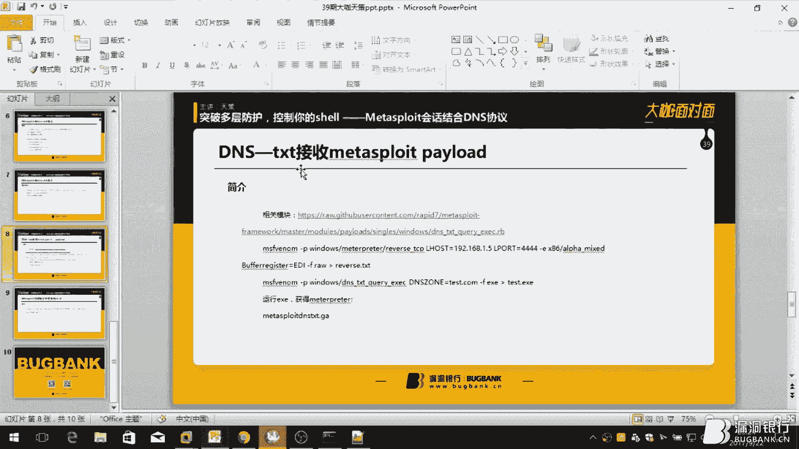

这个是什么概念呢，我先给大家查一个域名吧，等你可能大家都看到了我就给大家先清掉，假装我刚刚开始是吧，我们使用OSlookup，我们选择查查我们可以查一个二级域名的值，二级域名的值呢。

我们选择查询的值值类型什么txt，txt我们回车一下，大家看到了吧，这一段值是是是payload或者sharecode的其中的一段，这一段sharecode的值，是什么意思呢就是说。

假设说我我写一个程序，我去查询，ABCD，这是个二级域名的，的txt的值我们把这四个域名的查询的值，存放到一个边量里面，我们在，执行这个边量是吧执行这段sharecode，然后。

是不是这段sharecode就会，我们在执行这段sharecode之后我们就可以获得一个规划，这是一个国外的话很多这种都是这种什么webDAV。

什么dns这种另外一种协议的很多这种这种传输payload现在比较，比较火了吧，像前段时间我还看到有视频也是这种方式也是可以，绕过绕过防火墙绕过这个杀卵的因为他们这些技术都有一些特点就是说。

不会在你的磁盘上面写入任何文件，只是在内存里面写入，所以说这个就大大避免了被杀的如果说你的杀毒软件比较厉害的话内存，里面都是什么都可以杀的话那种，那种是例外大家都不要介意这个我们是常规操作常规操作。

不是什么骚操作是吧，我看AB我们查一下B版，然后查一下C，是吧大家看到了这是一段值，这个值呢，为什么前两段为什么这么多为什么第三段就这么少呢是不是我们sharecode的减少不是，是因为为什么，他。

第一段和第二段的值都是255个字节，然后第四段为什么不是因为第四段这个，sharecode已经升了，差不多了就前面这两，前面这两255已经，已经放得差不多了后面就剩下100多个字节就放了第三个域名是吧。

有的小伙伴就问了这个sharecode怎么生成啊，这个这个sharecode的生成怎么更新上去啊，这个等一下我告诉大家是吧。

主要我们用的模块是这个模块我给大家看一下，大家，可以现在可能看不懂这个模块的这个代码，这不这个没关系我给大家讲一下，首先他跟我们这个模块，定义的是什么定义的是一个windows的模块，然后他定义的。

平台的框架是什么x86的框架大家都应该是比较熟悉的，然后模块的名字，这是模块的这个简介这是这是一段定义的信息，然后这引入了一个windows payload，然后他这个payload的这个类型。

然后这个，应该是大小吧对，这个杂七杂八的我就当这里是一个注册的一个选项，他这个选项什么DNS，DNS-JONE这个意思是什么，就是说这是去定一个查询的域名。

大家一定要记住一定要是根域名，像漏洞银行这种什么。

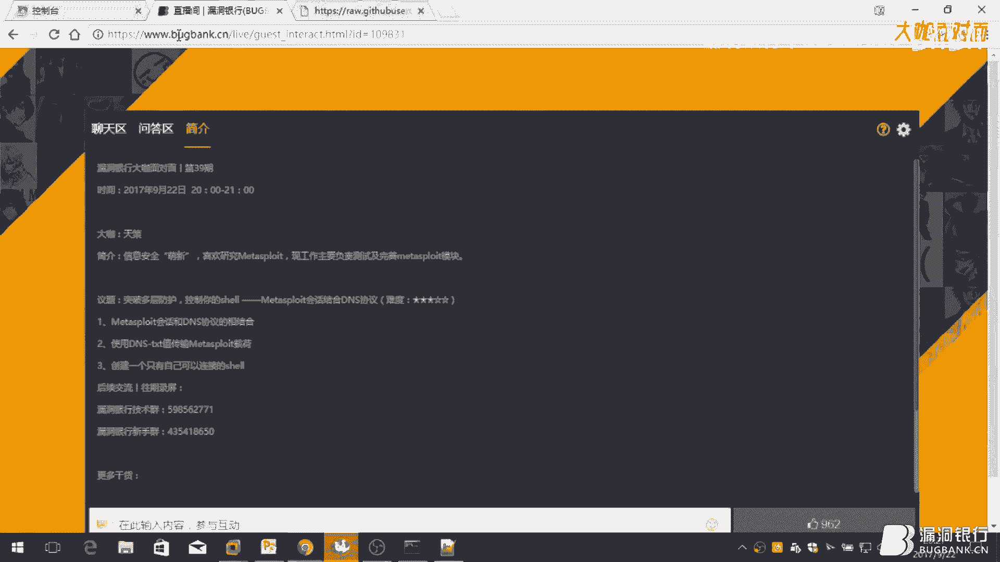

是吧这种，这个根域名吗，是吧这个根域名是吧，所以说用这个根域名他是放存在这种根域名的，这个一大家一定要准备一个域名这个准备这个域名，用，大家可以用免费的也可以用付费的我这里，用的就是，免费的吗，是吧。

这里我就不登录了是吧我已经更新好了。

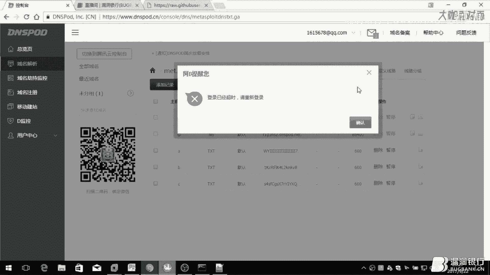

因为刚刚我，开播之前我已经放上去了这个，怎么添加大家都应该都是。

都应该知道我这里就给大家讲一下怎么切割吧，他也说一下使用指南，什么先生成一段，缺扣的，然后再用，再更新到域名然后更新域名之后，再用这个payload甚至一个ES1到目标机上执行。

这么说大家可能不清楚我给大家操作一遍大家都应该清楚了，他这里给大家讲他这里说的是去查询三个域名的值但是我经过这个监控发现我发现，会去查询四个域名的值，他的域名他已经给你定好了，ABCD。

ABCD大家照着这个放上去就可以了，大家没事也不会给自己域名什么添加什么ABCD的那个二级域名吧。

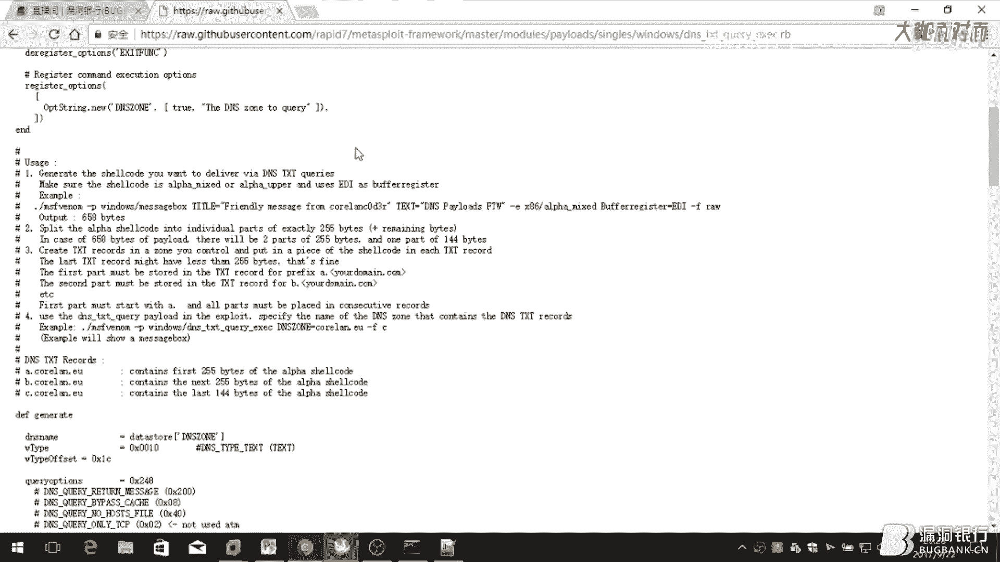

是吧，所以我今天来操作一遍吧，这个，这个会话我可以关了这个会话我可以关了我就关掉他去了，我先给大家操作一遍这个这个MeshLay我不关因为等下我还用到这个模块这个窗口我给关了。

这个服务端也可以关了毕竟我等下不用了嘛，我首先给大家生成一样这个255个之间的虚扣的是吧，这个生成虚扣的大家都应该，比较亲自输入了这个密我就不给大家多介绍，大家都应该，选择一样的payload。

然后选择一个IP地址选择一个端口，再选择一个加密类型，在那个，田中的，还有就是干爱途选择一个什么，这个生成类型吧是吧大家都文件类型大家都应该清楚的好，对你提出我们他生成了720个字节我们看一下这个文件。

这是720个字节，这720个字节呢，大家每一段要切割成255个，怎么切割呢，我写了个脚本，我用路比写了个脚本啊这个毕竟我，毕竟我这么热爱的路比是吧，给他看这个这个人比较渣。

因为我就我就按照他方法写了一下嘛是吧。

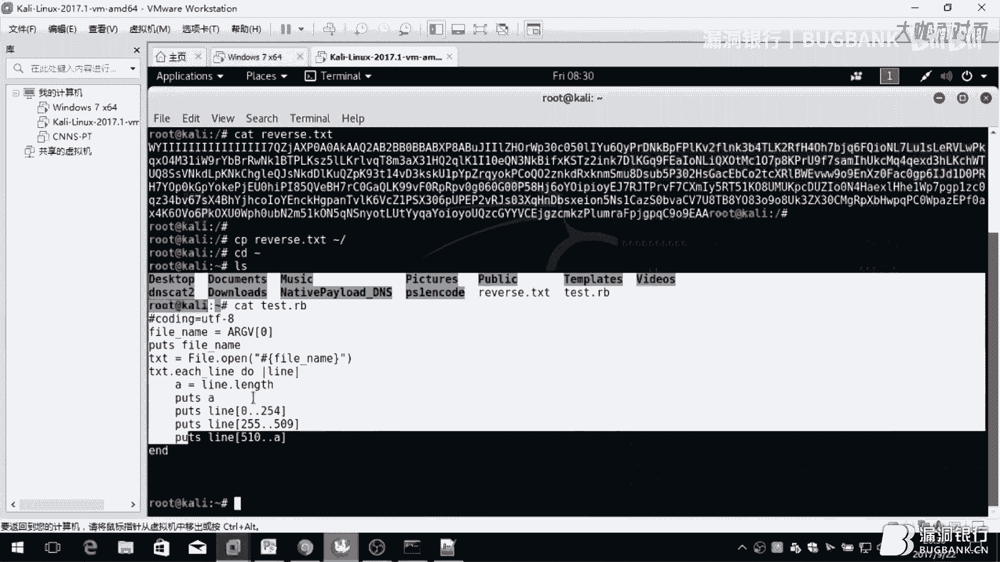

比较比较这个比较，有差了点吧等会会分享给大家，我切割一下这个使用方法也很简单，这个这个文本他自动会切割好，然后把这段代码更新到你的，更新到你的这个。

这个说更新到你的域名的这个纸上面就可以了我这里已经是更新完了的所以说我。

他每次生成的削扣的他是不一样的大家要注意啊，他每次生成削扣的他是不一样他不是说今天，这是我上之前生成的削扣的然后我现在生成一个削扣的他的只是不一样的所以说大家如果说。

这个也可以作为这个待会怎么可以应用到什么范围，弄完给大家看吧反正你们把这个值更新到这个域名的这个，这个txt的值里面就可以了跟这个更新域名的天使就操作我就为大家操作毕竟。

我的域名还是比我的我的域名还是比较扎的所以，不开玩笑了继续给大家下一步，生成热量披露的之后，我们，就使用这个，这个模块生成一个esc在目标机上执行，对了建议大家做实验的话，开一下阿发奇的。

阿发奇的服务为什么，因为，很多人的话你是先生成一个esc然后再，放到自己的，物理计算你的物理计算会有各种各样的什么，杀毒软件啊这些人就把你杀掉了你杀一下以后给他同意。

就很麻烦了所以说建议大家开个阿发奇的服务把这个一个是放到这上面做实验的话做实验的话可以放在上面，方便下载吗是吧，也可以当然你可以用其他方法这是我自己的方法，是吧，我们看一下有没有txt，还没生成。

大这个域名大家就要。

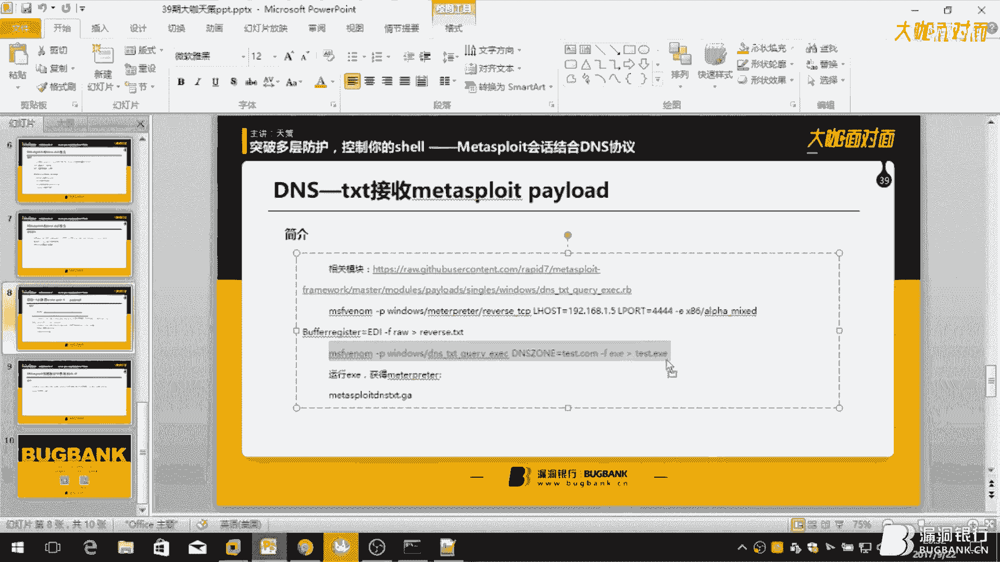

输输对啊千万不要输出，输出的话，他会上不了线，我真的输的，我真的运的值是吧真的我真的运的值，大家都应该清楚这个，这是我，临时申请的运营是吧毕竟我的网站这么毕竟我的网站天天用落口令。

发大家把我的网站是吧，我就，我又换了这上面了，这个，这木阿发奇的目录大家都应该清楚就是在这个路径下面的我就不是看了下面的看了下面的阿发，就是这个像我就不给大家介绍了，大家都应该懂，看一下。

看是不是有应该应该是有因为为什么有人用我之前就生成过了，是吧，我妈，我们的目的就是先下载这个，下载这个，现在先把这个，下载下来为什么因为，本来我也玩的就是要下载下来了，不要问为什么了就是要下载下来。

天舞，是吧，很暴力对吧直接就直接就在目标就算执行这个是吧，是吧，记住啊我这个做的不是免杀大家大家不要不要不要不要不要胡乱一段腿，就直接就搞，搞整天就想搞个大新闻啊之类的千万不要有这种想法是吧。

我们做的是技术技术讨论真的技术讨论所以说，大家千万一定要，你也不要不要不要搞出事情来是吧搞出性能千万也不要说是我我叫的是吧，等一下我给大家，我先终止一下吧等一下我给大家演示一下这个他会去查些什么。

好这一步我们什么在麦克思控制台这里，我们选择一个，这个配乐的这个选择配乐的，大家可能会说，我知道我知道就是用这个配乐的吗，错不是用这个配乐的，只有这个配乐的好吧，大家一定要记住用用你生存的那些扣的配乐。

这个我就，不多介绍了，什么是那个配乐的应该都懂，我很熟悉了，L号是吧，这个，192。668。1。5对吧，我要选是吧，他就在这个端口一样选择对啊我为什么要特意，我为什么特意。

把这个前面45人在搞是是呢为什么呢，那就怕大家差一个这个装口是大家，不操作是吧不操作去的又回来，又回来说，你这个方法不对啊你这个在忽悠老百姓啊，是吧，我跟他要说我这个不是忽悠绝对不是忽悠。

只是说你的端口设置错了大家一定要设置对，4444端口呢他也是麦克思控制台的默认的端口，他，他这个每个模块默认的端口基本上不是什么冷门的模块，基本上都是4444端口，虽然有一种叫ACPS端口。

这个另外的端口大部分模块都用的是，4444端口作为监听的，好我们看这个参数有没有设置错，没有什么设置错是吧，就是说我们跟他们一场，加入后台运行嘛这个，大家都应该都懂是吧我就，这个，老司机这个都懂的。

看后台这个是否有这个监听的任务是吧有。

我再运行一下，我又我那运行有可能会上表现为什么因为我的，这个域名更新的值我不知道和我先生的值对不对啊我先试一下如果没上线，大家不要介意，我先看一下监听，是吧这个，好你看，是吧。

这是什么ABCD去查询这是个域名的值，是吧，你看还是上线了是吧，这是什么意思你看，我们首先看这个包吧这是一个这是一个发送的一个，包对吧，发生一个包我们看下他回应的是什么回应的就是说回应的就是我们。

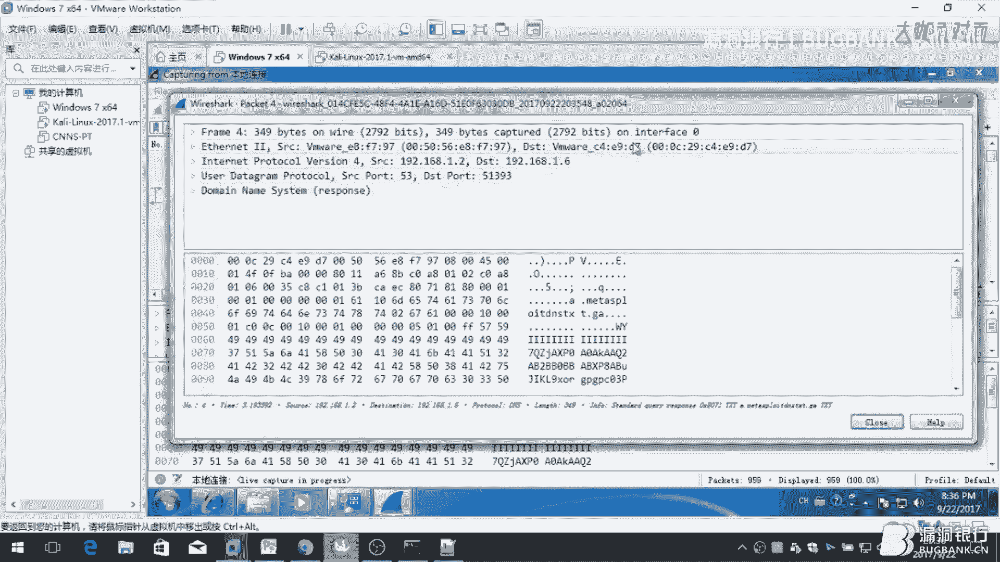

就是这段子。

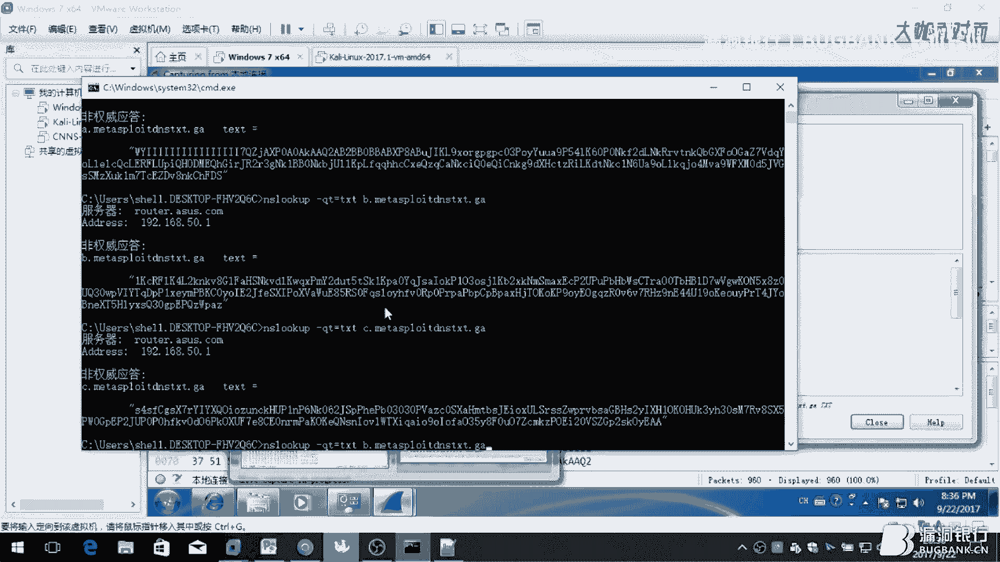

回应的就是这段子，然后再查询，D，第二个B再查询一个C再查询一个D是吧，他查询的这个D为什么没有值呢D我没有定义啊我都没有这个D这个，D这个名字啊是吧，大家如果不相信的话可以去。

查询一下这个值这个域名的值。

我这些命令我可以放在公屏上大家可以去查询一下，分别是ABCD前面这个二级域名我先把这个。

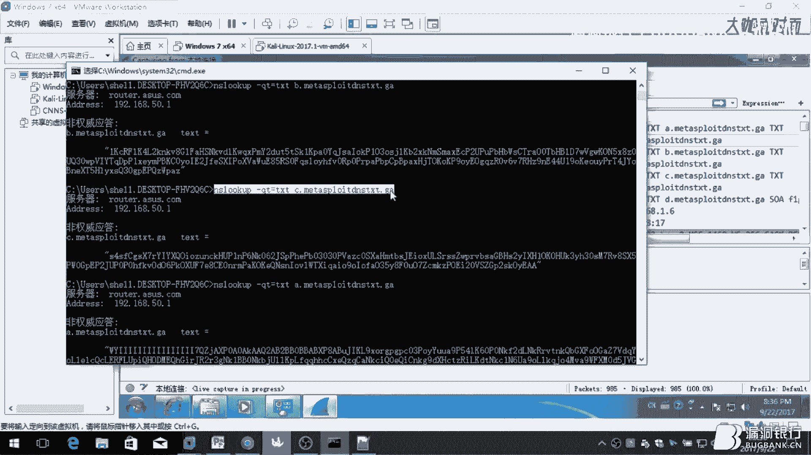

值，看到这下面，大家可以去查一下绝对就是这样的不不可能。

不可能说查询出来的值肯定是跟我一样的，但你不要平凡查询因为为什么因为我这个DNS比较垃圾，是吧，平凡查询他为什么会出现各种各样的什么延迟查询不了的所以说这时候大家不要急。

这时候大家一定要站定因为你下你再查询你耐心一点，你可能这一次查询他出不来第二次查询他就出来了你说是吧。

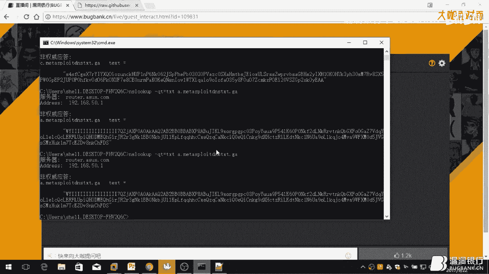

所以说大家一定要稳住，是吧别别别，别烂是吧应该都懂，我们看一下这个，海底捞的会话是不是，是不是，搞错了这个情况比较惊艳是吧，你就会搞得各种骚操作了之类的，想干嘛就干嘛是吧，这个这个就是。

这就是一个会话对吧，大家都应该比较熟，这就是，用TXT，DNS的TXT值来传输这个payload的，这个，不是说比较这个可以，大家可以简单理解为什么了就是说，大家以前都玩过什么远控吧。

远控他有个功能叫什么更新上线IP，这个大家都说更新上线IP大家都会心一笑是吧，这个这个和更新上线IP是一个道理，假设说，你别说你这个做了免杀之后是吧，做了免杀，你这个做了免你首先你把这个做免杀。

这个域名可以不用换了因为这个域名大家都知道，如果说你做了API攻击的话是吧，你这个域名，看到隐私保护谁查不到你对吧谁都查不到你对吧这个就，这个域名，简单一点的就单个域名如果说复杂一点的多个域名的那种的。

那种就可能不是用这种方式的更新有可能用另外一种方式如果说你是比较小的，只是想留个后门，方便控制的你可以，就是说，运行这个，就是说，你做把这个作为一个免杀放到这个目标机上面，然后。

他你这个域名的域名是不变的，是吧你的域名不可能随便变然后，你这个ABCD的，固定比如说我不想用点1。5了我想换个这个payload换个IP换个端口换个加密方式，加密方式，怎么办就直接把换个换了之后。

再把这个值更新上去，更新上去之后，他就是，他你在预计这段值他就，上线的是你的新的IP新的这个payload了，所以说这个可以用的就是说存后门的话也是可以。

比较方便的也不会被管理员发现你可以轻轻松松就结束的话，他也不会说发现你这个，是否有什么异常，他只是感觉之前是有异常但是之后他发现好像是没有了所以说你可以这样子是留后门的，这个留后门，是比较骚的操作是吧。

这个，大家做免杀的话可以去，看一看动物这个表格的这个免杀，这个效果他这个效果还是比较好的，是吧大家有什么免杀不懂的问题，可以去问动物表格这都没问题，如果说你知道这个方法有个缺点是什么缺点就是说。

如果说你是国内的话你用国外的那种DNS服务器的话，服务器的话，他是13有的时候更新不上来为什么，我们社会主义的国情是在这里是吧我们这个具体我就不多说为什么会会这样的，反正大家都懂。

这个大家一定要搞国不是搞，在国内测试，一定要国内的点，不要不要用什么，国外的电视，是吧因为我们社会主义的电视，就就很好了是吧效果就非常非常好，这个操作就给大家介绍完了如果说大家有什么不太懂的。

可以向我提问这次没问题，我喝口干喝口水啊，我给大家点击，讲完掉我给大家点击三个吧第三个大家都很简单了我就我先不给不给大家打个这个批的页面的，我现在，大家都知道，这个生成的血，这个生的血什么。

大家说我不会做面杀的确我不会做为什么呢，因为我不懂面杀我为什么要跟你说面杀是吧我今天讲的跟你讲的不是面杀我跟你讲的，是另外一种协议是吧这个我就不给大家，做个介绍，大家，我给你讲第三个议题吧反正不要。

第三个就是说，这个，他就知道这个菜刀啊这些什么，人家这个木马，都是要，加输了一个密码进行认证的，然后呢，你别说你搞了个正向连接的，的话。

你就你说你搞一个正向连接的血谁都要来连接你的只要输入对应的配对的是吧，然后，这个，这就给大家造成很大困难为什么我的血你可以念呢，是吧，你的我就我就去就不让你年就只可以我指定的东西来念是吧，这就，很尴尬。

是吧，这个，怎么操作呢，你呢这个那谁他有个模块我不知道这个模块大家知不知道应该大家都知道的，这么快，是一个就是说，他是一个隐藏的血然后他，开一个端口的话这个。

他指定了a号词就是指定一个ip地址连接吗大家这个大家都知道，就是说他最指定ip开放的多一个端口这个我给大家演示这个很简单，这个大家不要，大家不要说我菜我比我这个我这个比较萌新的是吧。

有的时候这个操作我都知道为什么你还是。

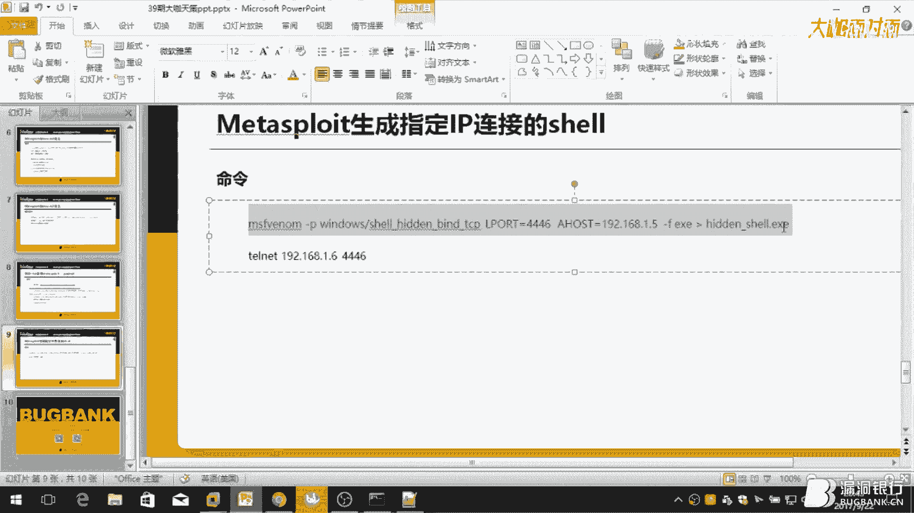

哎，毕竟我是菜鸟吗大家一定要。

一定要体验下菜鸟的性质是吧，我们是个来平台我也说什么我是挺有点，对啊，我这话口是4446，会的吗我能不能去上开4446端口对吧，把这个什么考虑到什么地方，考虑到，哎呀，是吧，考虑的是这样。

我再去下载下来我会去上去运行一下对吧，改一下名字，我是拿着书啊大家大家可以不要介意，说错了，一波尴尬的操作是吧，我看一下，开了，没有考虑过去，没有考虑过去，非常尴尬，好吧我直接升到这个目的下面吧。

小叔小叔很正常很正常都是常规操作大家不要介意，我们下载下来，大叔说了这个名字，人老了很多东西都记不住了不像你们年轻人是吧，运行一下，运行一下吗是吧我看下开开这个端口，我看一下，4446是吧开了。

我最简单发什么NL扫描一下，1。5，我看有没有看对啊，那就，点1。5我是点2。5吗，有点操作，会是错了吧，没有没有没有没有，看一下，这就尴尬了，小伙伴说可能是防火墙的原因，我试过好像不是防火墙。

好了我们关掉那我们就关掉防火墙试一下吗，是吧说说防火墙的问题，这样试一下呀，这很尴尬是吧。

没关系我觉得大家可能在操作的时候也会碰到这种问题，所以，试一下别慌，我知道搞错了搞错了，为什么，我刚扫的是点2。5扫自己的IP，我觉得你刚喝的不是水是酒什么是喝醉了，我们再扫一下，4446。

我们这个这个IP的话他是连接不上去的就是说，我的物理级是连接不上这个开启的港口的，但是我的卡里下面这就是说开了白金当时的机器他是可以连接的，他说这里可能找不出来我也说可能是防火墙这边的问题。

直播让你扫出来，对可以连接的大家一看是可以不是说是吧，可能你扫不出来但是他还是能连接上，因为我这个会话他没有退出来。

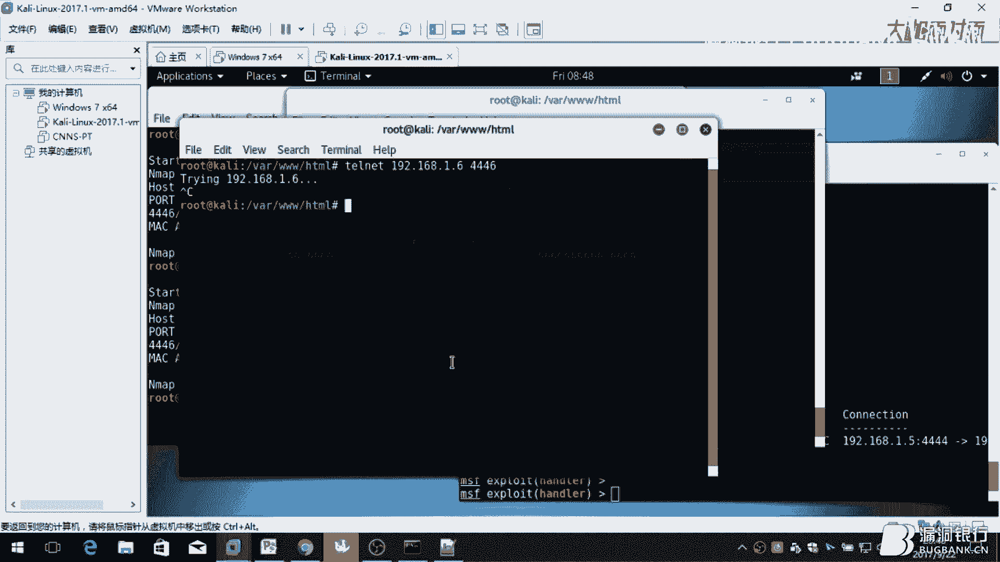

但是音乐是吧，这个错误的很正常的，对对对对很正常。

爱记性，但是这台是死活连接不上去的是为什么因为我他，不在我的白名单之类他是会说就是因为这个IP不在本名单之类，他就不让你，是吧这就可以保证我们学不会被你轻轻松松拿着去不会被别的，去走对吧，大家可能说是。

都很菜的技术，这个这个只是说这个只是说给你提供一个，留外部这个后门的方法吧，不一定说跟你说，可能会不一定可能会给你带来帮助但是一些小细节可能大概，在这个操作吧就主要这个模块也别冷了我看国内可能应该。

应该有有人写但是传播不是太管我今天只是给大家拿出来说给大家做一下分享而已，只是给大家知道而已比如说这个是我原创的一些方法可能。

有些方法都是可能是我在网上看了我只是拿出来给大家分享一下所以说大家如果说这些，这些见过的小伙伴可能都觉得这次也没什么是吧，你谁说这都是跟谁如果说，我只是拿出来给大家分享一下并不是我想说我有多厉害是吧。

我只是说把我所见所闻把我知道一些东西拿出来分享买最，还有一些其他一些什么操作的话大家也可以拿出来分享一下吗是吧毕竟不是，大家这个技术不要藏着掖着是吧藏着掖着也，也个人爱好吧反正大家我建议。

我还是希望大家多分享分享是吧毕竟可能你，很多操作我也不知道是吧，我这里就给大家分享完了也讲得不是太好希望大家，多多见谅，好，那感谢天色的精彩演讲，我觉得干货还是很多的，那听了今晚的讲座是不是对。

有了更进一步的了解呢，或者还有什么困惑吗，有议题相关问题都可以提出，天色会给大家解答，让我们把聊天室切换到问答器的板块开始今天的问题解答吧，好我看到问答器已经有问题了，天子传输是否会这个和。

本身自在的电视隧道有什么区别这个我还没做研究因为，他也是有一个，就是说传输这个，就是说只有电视这个也是有这个模块的电视的是吧这个我知道但是我还没做这个对他们，精心比较因为我还没有就是说我还没有，详细的。

对这两个经历比较所以说你的问题，我是解答不了的，我看第2个吧，电视是不是产生比较多奇怪的电视请求，你这个肯定是会产生很多电视请求但是你说奇怪主要是看个人吧如果你觉得奇怪肯定，细心的管理员肯定是能发现的。

为什么因为，他比较细心嘛他就会去关注这个电视，是吧，所以说，看第3个就是说你肯定会产生很多的因为你是不停的和他进行交互的肯定会产生很多，这个电视请求所以说，你的话在细心的管理员面前这个还是比较。

容易被发现的所以说，这个针对是初心的管理员还是一些防火墙的问题，你可以看一下那个问答是已经有问题了我就是在看问答区，好，有点多，DNS速度慢怎么解决如果DNS发生IP的变化怎么办。

一般来说你用公共电视像DNS，像阿里云啊，腾讯云啊，还有360啊他们这种，本地的DNS服务你可以用他们的DNS服务器，你可以不用自己搭，你可以用他们的，为什么在，这个我可以。

和就是说为什么要没有本地搭建DNS服务器，为什么要用在线的服务器，为什么呢因为，这个的话你不能说能在企业内部搭个DNS服务器，你怎么可能，这么说吧反正，跟你这样说吧在线域名的话，他通用性高一点是吧。

他不会就不会导致一些杂七杂八的东西是吧，在线域名有个好处就是你可以自经一管理，你可以不受其他人的管，当然如果说你用的是自己搭建的DNS服务器也是可以的这是一点关系都没有的。

是吧但是我用的是公共的DNS所以说，我认为是个人来说是比较方便的如果说你只可以自己搭个DNS服务器的话这也是可以的，这都是没问题的，不会说什么在线域名之类的，不受这些。

影响只要是你自己搭建DNS服务器你怎么弄都可以，DNS除了TXT直的TXT，还有其他支段，有可以有有的，有的，其他的支段的，这个这个稍后我会我可以发给你因为。

我也忘记这个字段的名字但是他是可以传输的他是他是有的，是有的，是有的，我我看一下对他是有的一定，有让我发给你因为那个字段我，我也忘记了我等一下现在我叫你发给你就可以了，这个有的但是，他那个字段的话。

怎么说呢他那个字段我试验的话他是，他那个比较冷门也是比较冷门的，比较，他也是可以他那个字段的话闹过反火钱的这个。

这个还有闹过那个杀卵的几率他是更高的在YouTube上面是有这个这个视频的我也可以把这个视频，发给你，我在，给大家说一下这个问题传输速度能提高吗，传输速度的话他的传输速度就是在这里的没有说，很快也没说。

只能说，他的提高的方法不是，提高的方法只能这样说找一个，稳定的公共电视服务器就是说现在360啊，还有，PoD这种稳定的，电视，服务商，他的，他的电视，他就是解析的速度他就更快。

这就会提高我们这个传输速度吗如果说你用的是，自己搭建的或者是之类的话，他肯定传输速度是有限制的，是，是慢的，如果是你用公共的话他肯定是传输速度快的嘛，所以说，这个还是跟这个电视服务器有关系的。

如果说你电视服务器慢你肯定传输速度慢吧是吧，对我给大家讲解就是说这电视卡的他一定要一定你可以不是在云端，你可以，就是来的云服务器专门做电视卡的服务器你可以就是说买一台，服务器专门做当然这个。

传输速度的话，就是说也是根据你的就是，就我刚才说的，根据你的，你就是目标机器到云服务器的速度，这么快，如果说你目标机器在云服务器的速度慢的话，他肯定也是慢的对吧大家这点大家想都想得到不用我说。

大家应该是想得到，好这里就没有看什么域名，但是，ns记录如何利用原理在什么为什么，会不会的这个ns记录这个作为，客户的那个他那个是另外一种的他和我这种是不一样的他这个他用的另外一种这个就是说，讲的。

不是，扣的这个问题这个扣不得他这个我知道你说的那个东西，他用的那个，前以后那个鞋是不一样的，这是为什么因为他这个，他这个，他这个比较，他的我还没做仔细过研究但是我知道他这个我知道他是，他有这个东西。

他这个东西的话他这个，我也看过他这个也上线的话，上线的话他也没有跟你说他可以闹骚乱但是，他只是说他用的是dns传输他的传输，我可以明确给大家说过，我看过他的那个官方演示的说明，他出的传输，他传输就是说。

你用cobol的那个连接上来之后，他的传输的协议，血命啊，都还是和manage rate，一样的也是说也就是一个血命啊他不会说有太多的功能出来，因为他是dns注定了，他不可能说现在来说的话他不可能有。

过多的这个dll加载过去，因为为什么大家都知道，dns他那个manage rate他有三种类型的模块，一种类型的模块就是比较小的，就是单独建立一个就是，单纯的一个血命行的模块。

是吧然后还有一种就是比较还有一种就是，比较大型的就是说像，你的provider可以说加载目标记账的哈希子啊，然后，开启目标记账端口vnc这种的，会话这种会话的话，他是什么概念的我跟你。

我给大家简单介绍一下吧，他这个就是说首先他要这个大一点的配置他是首先建立一个连接，建立完一个连接之后，他再传输，把这个dll还有一些，必要的代码传输到目标记账，在进行执行然后，这个通道再进行一个加密。

所以说他这个的话对网络的质量的要求就很高如果说你网络质量很慢的话，他会加载不出怎么dll还有这些的话，那个大眼的配置他不适用于DNS协议这是为什么因为，我实验我就说如果说用大眼的配置传输的话。

他是可以传输，当然了时间你知道多久吗，我测试的话真的是，40分钟，40分钟再传输一个配置并且，这个配置的就是会话传输关键功能，后续的功能他就是加载不出来的他都是慢慢慢慢加载出来的。

很多密码基本上在那个大型的大型的载荷箱他是，没有用的，所以说大家千万不要去搞什么，就是说用，DNS传输很大的，Payload，DNS稳定性如何，这个还是一个句话就是说，就是说，你的服务器到目标机器上。

如果说，像你去访问海外你用国内的机器去访问海外的服务器，肯定是不稳定的对吧，这个肯定是不稳定的，对不对大家都这个大家都应该就是肯定是要你到服务器这边通信比较好的话，这他，才会，通信比较好是吧。

大家说最重要什么，PCE反弹有DNS反弹性0币高吗，这个怎么说呢，按道理讲道理是没有的，讲道理是没有的，看你什么反弹吧，你用我找的你用的是这种，就是说在线比如说，有一个DLL然后。

你远端加载他的DLL然后，在执行中在在返回汇化，这个相当于就是adb下载一个DLL反弹，但是，这个有个缺点是什么有个缺点就是说，他是说adb的软件是adb的软件他是可以被监控到的。

如果说你adbs的话应该稍微好一点，DNS的话，他肯定是更隐蔽一点，最重要的是可能，我回答完这个问题我回答一下这个问题，传输不稳定怎么解决，不稳定你找一下稳定的DNS不就好了吗，你找一下稳定的服务器吗。

这个这个很简单吗，DNS数据传输，这个反正你找一下稳定的DNS他是很稳定的，你如果说不稳定的话可能是网络波动，是吧这个网络波动的问题，这个我也没办法解决如果说你的网络有问题，那谁能帮你解决是吧。

DNS看到传输大，我说的不是传输大学会的会不会造成攻击的，网络卡顿问题，这个不会为什么呢，因为他，你只只你要这样你可以自己做下事，就说你自己硬邦泼沫血蛋吧，你自己的机器会卡住吗不会吧，是吧。

不会造成他的网络卡顿因为，他传输的就是200到300个字节，是吧，200到300个字节怎么会造成他的网络堵塞，除非他的网络特别特别差，是吧会堵塞那就没办法了，能不能设置一个开关通过公网设置是否。

我先回答一下这个问题，DNS数据传输是否有大小限制，这个传数据传输的话，他TXD值是有大小限制的，当然你DNS大小限制的值，大家可以都可以去百度得到，这都是公开的，大小限制你用的是其实你用的是哪个字段。

TXD字段就是255个字节，大家都你们有域名的可以去添加域名去试一下，这个肯定是有限制，TXD的值肯定是有限制的，其他的值的具体的限制大小大家可以去查，因为我这里没有做详细的。

我这里最清楚就是TXD的值，它是255个字节，我再回答最后一个问题，我就好好是开关公网设置是否打开，开启通道后回联到指定的IP，设置一个开关，你设置开关我不知道是什么意思，但是通过公网设置是否打开。

通过公网设置，你这种操作可能是比较骚的操作，我可能没有这么，我没有超过这么，我又这么骚的操作，这个想法也没有这么骚的操作过，所以说你这个问题我是回答不了的，但是我只能跟你说。

这个是和更新上线IP是一个道理的，更新上线IP是一个道理的，好的我这基本上就讲完了，因为我是吧，行，我觉得时间也差不多，然后感谢大咖耐心解答，下面我们就进入下面的福利环节，大咖赠书。

今天我们大咖天策友情加赠了一本书，也就是说今天晚上我们会选出两位幸运观众，每人获得一本Methasploit渗透测试指南，现在就请天策选出两位，你觉得认真听讲的小伙伴。

送上这本Methasploit渗透指南的修订版，那看谁能幸运拿到吧，就问答区的吗，还是聊天区的，都可以，我就找几个，看聊天区的，毕竟问答区就这么一些人，肯定要照顾一下聊天区的人是吧，可以，看一下选谁。

我去送了一个对吧，好，看一下，我找几个上面一点的，你考虑的很周到，照顾大家的感受，我基本上都送完了，好我基本上都送完了吧，来吧，好那今天的幸运观众已经出来了，就是匿称为Hello和K024DJI。

我们的K core，好恭喜两位幸运观众获得这本Methasploit渗透测试指南，那需要你们在弹窗留下正确的收获信息。

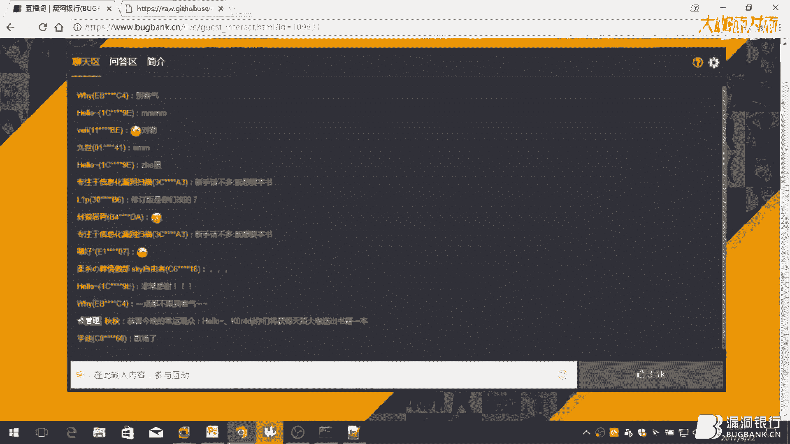

我们会尽快将书籍寄出，那到这里本期的大开面对面也要和大家说再见啦，感谢天策的精彩呈现，谢谢小伙伴们的积极参与，下周晚8点，骆龙银行大开面对面第47精彩继续。

我们不见不散吧，(字幕：Sky Vision Media)，(字幕：Sky Vision Media)，(字幕：Sky Vision Media)，(字幕：Sky Vision Media)，你也是。

