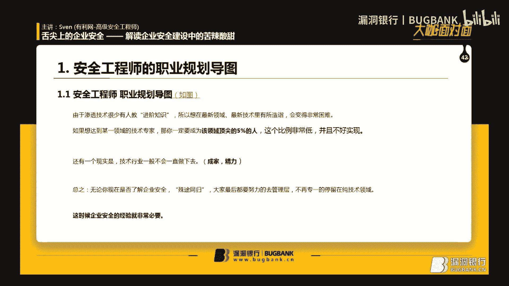

# 课程 P1-42：企业安全建设实战指南 🛡️

在本课程中，我们将跟随高级安全工程师 Sven 的分享，系统性地学习企业安全建设的核心知识、实践方法以及面试技巧。课程将涵盖企业安全的重要性、具体工作内容、实战经验以及如何与不同角色沟通协作。

---

## 为什么要学习企业安全？ 🎯

上一节我们了解了课程概述，本节中我们来看看学习企业安全的必要性。

从招聘市场的需求来看，纯粹的技术岗位（如渗透测试工程师）占比较小，而更多岗位需要企业安全相关的知识与视野。掌握企业安全知识，对于个人职业晋升和长远发展至关重要。

技术钻研存在瓶颈，成为某个技术领域顶尖的5%非常困难。此外，随着年龄增长，精力可能无法持续支持高强度的技术攻坚。因此，向管理层或规划层发展是更可持续的路径，而企业安全正是这个方向的核心。

**企业安全**是一个企业想要做大做强的必要环节。大型企业都设有自己的安全应急响应中心（SRC），以应对外部安全测试和攻击。企业常因安全漏洞被黑产或竞争对手攻击而导致业务受损，例如游戏公司可能遭受DDoS攻击导致玩家流失。

---

## 企业安全 vs. 渗透测试 🔄

上一节我们探讨了学习企业安全的原因，本节我们来对比企业安全工程师与渗透测试工程师的不同。

渗透测试工程师通常针对单一目标进行深度漏洞挖掘与利用。而企业安全工程师则需要具备全局视角：

*   **工作范围更广**：需关注公司内外整体安全，包括员工上网行为与安全意识、网络边界与端口管控等。
*   **关注产品安全**：需对产品进行全面的安全检测，避免因漏洞导致客户损失及法律风险。
*   **结合业务特点**：安全策略需根据公司业务量身定制。例如：
    *   游戏公司需重点防范DDoS攻击。
    *   金融公司需警惕“薅羊毛”等业务逻辑漏洞。

企业安全的覆盖面极广，主要包括：

*   公司网络架构（如内外网隔离、DMZ区设置）。
*   产品安全性。
*   员工安全意识等。

因此，一名合格的企业安全工程师需要强大的沟通能力和广泛的技术覆盖面，即：**上能找领导要预算，下能安排员工工作，左能开会培训，右能协同开发运维**。

---

## 企业安全工程师的实战经验 💼

上一节我们明确了企业安全的工作范畴，本节中我们通过Sven的个人经历，看看这些工作如何具体落地。

以下是Sven分享的几个关键工作场景：

**1. 上线安全检测与项目组撕**
*   **场景**：在中石化期间，安全岗位常不被开发/运维喜欢，因为安全要求可能导致他们返工。
*   **挑战**：考验沟通能力，需要软硬兼施，推动漏洞修复。

**2. 与投资方开会**
*   **场景**：需要理解投资方提出的安全需求是否合理。
*   **关键**：能判断需求的可行性。例如，对方要求每月对所有业务系统测试并出具报告，这可能不合理，因为等保三级系统也仅要求一年一测。

**3. 开发安全培训**
*   **目标**：让开发人员有兴趣听、愿意听。
*   **方法**：融入“黑客”视角，展示漏洞的实际危害与利用过程，让开发人员直观理解漏洞严重性。例如，通过DVWA搭建环境进行演示。

**4. 开发自动化工具**
*   **端口监控**：编写脚本调用Nmap/Masscan，监控服务器端口开放情况，及时发现风险（如数据库端口暴露在外网）。
*   **邮件监控**：利用企业邮箱API，监控员工邮箱登录IP、发件行为等，用于防范钓鱼邮件和内鬼泄密。
*   **巡风监控**：对开源资产漏洞扫描系统“巡风”进行二次开发，实现漏洞自动告警与报表生成，提升效率。

**5. 与开发对接漏洞修复**
*   **原则**：严重的漏洞（如明文存储密钥）必须坚持修复原则。
*   **技巧**：对于难以修复的低危漏洞，可提供变通方案（如通过配置WAF或限制访问来源进行防护）。需要体谅开发的辛苦，但也要坚守安全底线。

**6. 等级保护（等保）**
*   **定义**：国家对信息系统安全等级提出的强制性要求。
*   **分级**：根据系统受损后对公民、社会、国家造成的危害程度，分为1-5级。
*   **企业常见级别**：二级或三级。完成等保备案可使系统合规，并在出事时明确责任。

---

## 如何从零开始建设企业安全？ 🏗️

上一节我们学习了企业安全的具体工作，本节我们来看看，如果加入一个安全基础为零的公司，应该如何着手。

工作流程可以遵循以下步骤：

**第一步：资产梳理**
这是所有工作的基础。需要全面梳理公司的服务器、业务系统、系统组件（如Apache、Tomcat）等资产。可以整理成Excel表格或内部系统。只有摸清家底，才能在出现漏洞时快速定位影响范围。

**第二步：熟悉业务系统**
在梳理资产的同时，要理解每个业务系统的功能。例如，一个音乐App可能包含支付功能，这就需要重点关注支付逻辑漏洞（如1元购、金额篡改）。

**第三步：端口管理**
许多漏洞源于弱口令或未授权访问。严格控制服务器端口对外暴露是有效的防御措施。

**第四步：安全自查**
使用扫描工具对业务系统进行初步安全检查。这里体现了“要预算”的重要性：商业扫描器能提供中文报告和修复建议，能极大提升与开发团队的沟通效率。

**第五步：处理外部漏洞报告**
关注各大漏洞平台，及时处理白帽子提交的漏洞。修复时需确保服务器未被留下后门。

**第六步：进阶安全建设**
当基础安全稳固后，可以开展更深入的工作：
*   **基线检查**：检查服务器安全配置（日志、密码策略等）。
*   **代码审计**：通过工具或人工进行。
*   **无线安全**、**内部等保**、**建立企业SRC**等。
此时，企业安全水平已较高，可考虑进行安全研究甚至业务转型。

---

## 如何向领导争取安全预算？ 📊

上一节我们梳理了安全建设的步骤，本节我们学习一个关键技能：如何说服领导为安全建设投入资源。

核心是制作一份能打动领导的PPT，思路如下：

**1. 阐明安全现状与趋势**
向领导说明国内外严峻的安全形势（如DDoS攻击、数据泄露事件频发），强调安全威胁无处不在。

**2. 指出公司当前风险**
用事实说话，展示公司历史漏洞报告或攻击事件。用比喻让领导理解技术概念，例如将DDoS攻击比作“4.5万人挤爆一家10人小店”。

**3. 提出解决方案与规划**
清晰阐述你的安全建设蓝图，分阶段说明要做什么、需要什么资源（人、钱、工具），以及能带来什么价值（规避风险、满足合规、提升信誉）。

**关键点**：让领导认识到安全的必要性和紧迫性，而不仅仅是为了“合规”或“背锅”。安全建设是责任，也是投资。

---

## 企业安全岗位面试技巧 🤝

上一节我们学习了内部沟通技巧，本节我们看看如何在面试中展现企业安全思维。

面试官常会考察你对企业安全的整体构想。回答时应结合应聘公司的业务特点（如金融公司关注支付漏洞和薅羊毛）。

Sven分享了他的回答框架，从三个层面展开：

**1. 主动防御**
在攻击发生前主动行动。包括：漏洞自查、业务系统安全检测、及时修复已知漏洞（如0day）。

**2. 被动防御**
在攻击发生时进行防御和记录。包括：部署WAF/IPS/IDS、态势感知系统、记录攻击日志、部署蜜罐等。

**3. 追根溯源**
在攻击发生后进行取证和溯源。包括：分析服务器日志、历史命令、配合公安部门调查等。确保在发生严重安全事件时，能提供有效证据，避免企业独自担责。

---

## 总结 📝

本节课中，我们一起学习了企业安全建设的全貌：

1.  **为什么学**：企业安全关乎职业发展和企业生存，是技术向管理转型的重要领域。
2.  **做什么**：工作范围覆盖全局，需兼顾技术、管理和沟通，核心是保障企业业务安全稳定运行。
3.  **怎么做**：从资产梳理入手，逐步推进端口管理、安全自查、漏洞修复，最终实现体系化的安全建设。
4.  **如何沟通**：学会用领导能理解的方式（如制作PPT、打比方）争取预算和资源；在面试时，用“主动-被动-溯源”三层框架展现安全规划能力。

企业安全是一条融合了技术、管理与艺术的综合赛道，需要持续学习、广泛涉猎并不断提升沟通协作能力。