# P1：49【录屏】40分钟速览提权姿势-后渗透阶段提权技巧与案例集锦——大咖一介菜菜分享 - 漏洞银行BUGBANK - BV1Wb411y7Uy

(廢話)。

(廢話)，大家好，非常感謝大家來到這裏，這裏是十九天的大咖面對面，非常感謝各位的邀請，今天我們給大家帶來的議題就是，四十分鐘數碼體驗姿勢，所謂的體驗由恆生後生到業障。

當你達到Y不碎之後，你來做什麼，所謂的體驗，今天給大家講五個方面，第一個就是體驗代數，第二個是什麼體驗，什麼是體驗，簡單說就是對當前權限進一步的提升運用，當你達到Y不碎之後。

有的時候你會感覺到他的權限各方面，可能還有更深入的一層挖掘，這個時候就可以進行體驗性，體驗可以做什麼，可以發現更多的潛在的服務器，或者是網絡設備漏洞，當然體驗不僅僅可以針對Windows服務器。

也可以針對一些交換機設備，你如果交換機命令非常OK，OK，那你設好一個網絡之後，你可以直接入侵他的交換機，看他整個網絡結構，這都可以的，因為體驗的話，從大的方面講的話，不僅僅是Windows服務器。

體驗的常用命令，如果說你要接著體驗，對一些命令，對一些操作命令一定要死機應變，也不是死機應變吧，就是一定要熟悉，Lighter user xxxx-ad，添加一個用戶名為什麼，預言為什麼的帳戶。

這個都應該是很基礎的條件，然後Lighter logo group，Enemy_s xxx-ad，就添加上條語句的，就假如說我這個xx是Enemy，就添加Enemy，實際體驗過程可能會用到官方改組。

如果說我官方以前的組是這個組，我為了混淆，我也可以把它改為這個，這個時候我寫的方法很簡單，只需要查詢當前，他在什麼用戶群就OK，然後我又可以把這條命令變一下，當然拿到WiFi的時候。

也不要著急的想去執行這兩條命令，你先查一下當前的賬戶選項，Who am I 是誰，就查一下當前的權限，因為權限不關你胃口不大的話，你照樣拿不起來，對吧，這條命令是前兩條命令的縮寫版。

他代表先執行完我們這個符號前的命令，再執行他後面的命令，這樣的話可以省時省力也省時間，體現分類，體現總體來說分類的話就沒有什麼好說的，一種是常規體現，一種是非常規體現。

所謂常規體現就是當你拿到WiFi的時候，有可能會發現覺得是這個選項，其實你可以直接體現，還有非常常規體現就是針對一些新主機，就是類似於一些C9，或者是很多廠商的迅速器設備。

非常規體現和常規體現唯一的區別是，非常規體現你要通過ESR必須打他，而常規體現的話，就可以直接通過我們前面說的Light Yoda的命令去搞定，好，下面就給大家具體的演示。

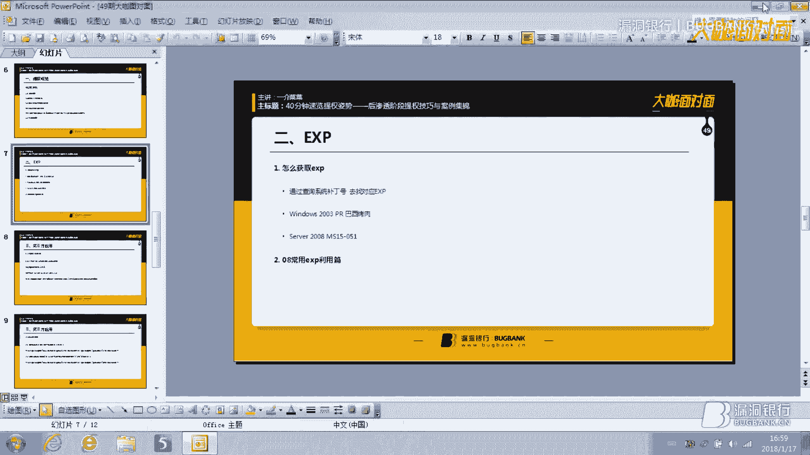

在這裡我已經。

有一個WebShop，但進入WebShop之後，首先第一件事，先查一下他的權限，你不要什麼都不弄就瞎懟，瞎懟肯定就沒有什麼好結果，看當前選項為Test，這個權限可以說已經很低了，屬於S管理處權限。

而我所說的所謂的常規體現，在Windows203，我們這裡一般是，Network Servers權限，就網絡服務，他會有意義，我們現在就先要稍微大一點點，但是自從Windows 3。8。

Windows 3。12，或者Windows 3。16，他默認就是S虛擬管理處，如果說，管理人配置不當，什麼叫做管理人配置不當。

就是不該給的權限給了網站，我們剛才彈回來是Test，現在我們就可以直接彈為一個Setting。

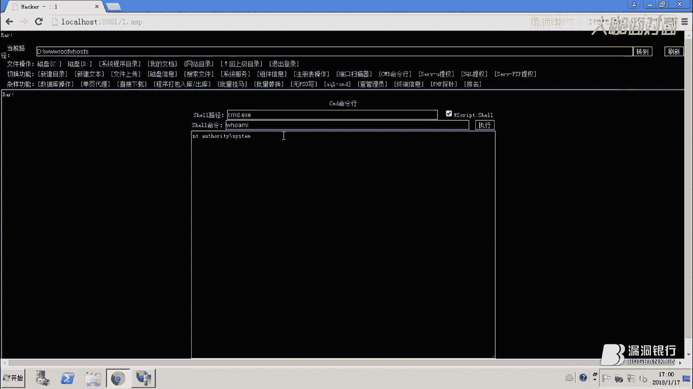

因為他的精神管理處，他的精神管理處標示為，Logo Setting本地系統，所以說在這裡就可以直接。

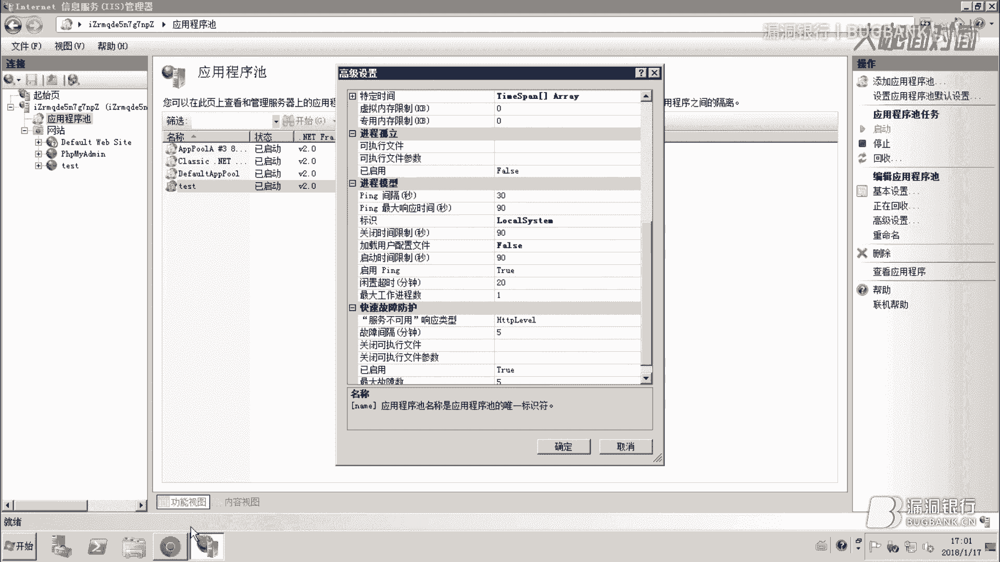

給我們一個Setting權限，這個時候就可以直接，就加一個用戶名為一秒為一的任務，我們可以看他的加密，OK一定要加密，OK，現在我們說的非常危險。

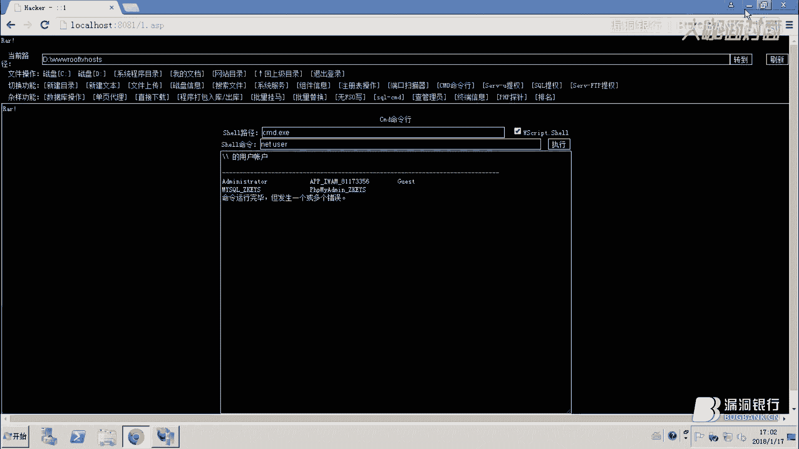

說的非常危險，就是，這裡精神值，一般我們輸入其他精神值，就是要不就是類似用戶，要不就是。

回來，Test，你要遇到這種情況怎麼辦，這種情況，我們可以通過系統沒有打了，exp-booting來打，首先我們找查，最後查booting號，在這裡我給大家說一個比較簡單的方法，當然我不知道大家有沒有。

有通過booting號查詢，查詢可以利用到exp的一個工具，我就沒有，但是如果，方便可以用那個工具，搞一下。

這裡，KB3177467，還有KB976902。

這兩個都代表他最新的Windows booting，有的時候也可以通過，另外一個方法去查他。

我去查他，也可以通過，自動化，自動化的話，有一個缺點，就是你沒有辦法知道，他是booting到底打不打，因為我昨天我今天驗證過，KB3045172，他在通過。

System Analyzer命令，是可以查，是查不到。

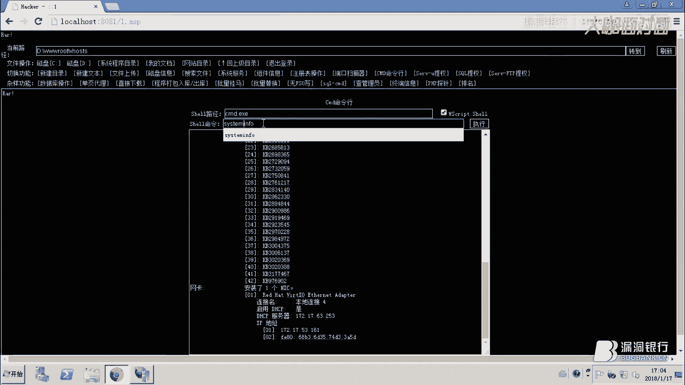

但是我用，KB3045102漏洞，一查不去打他，反而會提升漏洞一休。

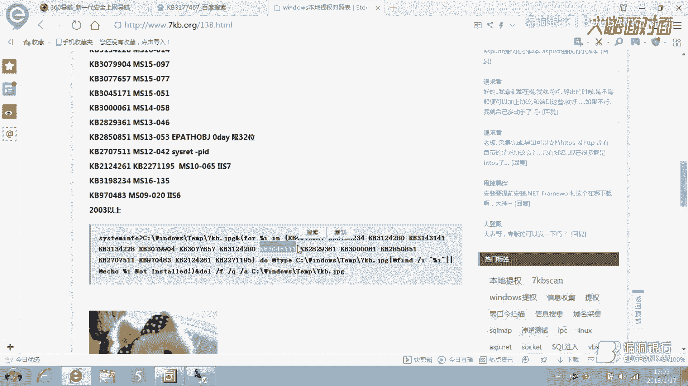

這個時候你就去看，他最新的booting打到哪一塊，因為微軟有一個，Windows閱讀報告匯總，在這個匯總裡，你可以很明很清楚看到，他把漏洞打了幾個分，那個時候你再通過幾分之後了，一查不去打。

這樣成功度就會大一點，在這個裡，可以看到，他打的最新是，KB3177467，但是我們在這裡查。

KB3177467，他僅僅是一個更新程序，而不是一個安全更新程序，此更新提高Windows 7，或者是Windows 308 R1，服務對於潛在穩定性，而並不是一個更新，並不是一個安全更新。

所以說我們就可以利用，MS15051打他。

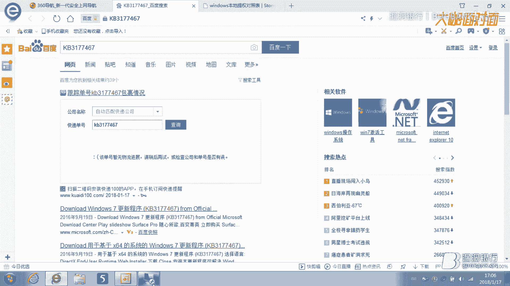

不出意外的給我們打回setting，還有就是我們在這裡，設路徑，如果是虛擬主機的話。

他是不會讓你直接調用，默認settings3下的3D，這個時候，解放和電腦，我們需要找一個可讀可寫，然後可執行的用戶，去放我們的3D，好OK，就這個目的C，E就這個點，所以好多網站，為什麼很多網站。

傳一個3D，比如傳一個exp上去，總是提示沒有全面執行，就是這個原因，OK，我們去到他的執行，去到整個目錄的執行，OK，現在我們可以來驗證一下。

他就會提示解放，Dualign，因為這個目錄不具備，我們的webshare執行的，webshare的權限是user，或者iosr，我們的webshare不具備，同時不具備這兩個權限，所以就會提示。

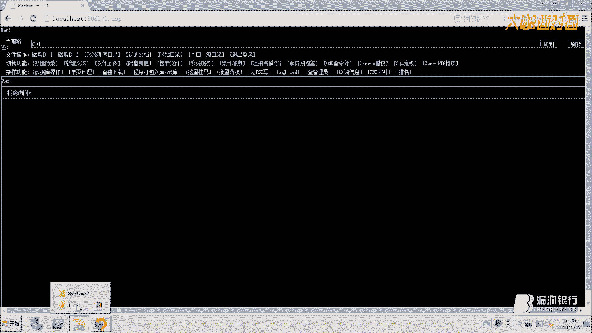

具備。

那我們現在再試一下，OK，已經彈回來我們想要的結果，這樣的話就不用給大家演示，怎麼加賬戶了，因為我們已經已經，他提示權限已經是setting，就剩下的就是let you的，查查查查看ad。

按著我們常規打OK，此時我要給大家提一下，磁盤性是這塊，因為這一塊的話，我們要在實戰之中，C盤的很多目錄，都是覺得是，要么就是你能看，不能寫，要么就是能寫不能看。

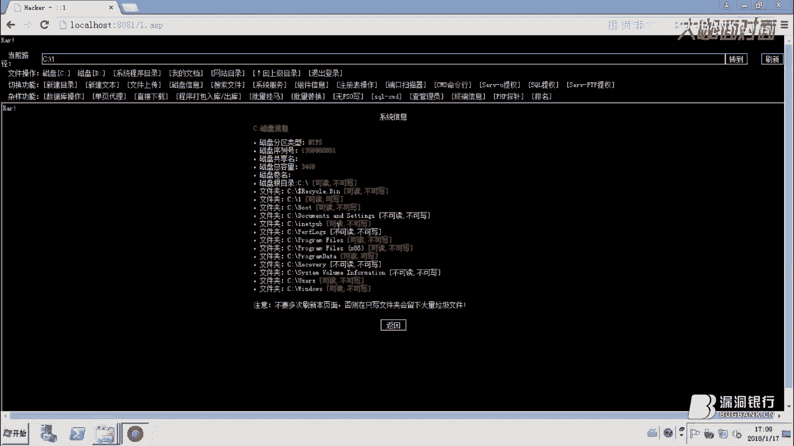

這個時候大家要判斷，到底，怎麼去，看可讀可寫可實行，同時具備，同時具備三個條件，這就留著，sx的演示，這個是檢查，目錄的可寫可可讀可執行，在Windows，有些目錄是可以被替換的，這個時候就可以替換。

就是編列整個C盤，我們就可以直接替換它，因為很多目錄的話，他如果同時具備可讀可寫可執行的話，你給他存了，就算他有可讀可寫，但不可能，那你也白搞，因為不管你存什麼，他都會提示許可，這是整個C盤的情況。

這是前面的帳戶可以訪問的情況，這是前面的帳戶可以訪問的情況，這個時候我們也不能一個個去試，可以去百度一下，Windows提權的常用目錄，這個百度都有，還有提權的最好不要，在自動目錄下放3D。

或者放exe等程序，空格目錄的話，Windows有一個缺點，就是空格目錄有的，他彈不回音響而且，我也不曉得什麼原因，所以盡量就是在正常的目錄，就比如說這種，比如說這種，在這種目錄放文3D，還有提權程序。

這樣他就會比較順利，這是常規權還有exp的方面。

還有就是我們的第三方。

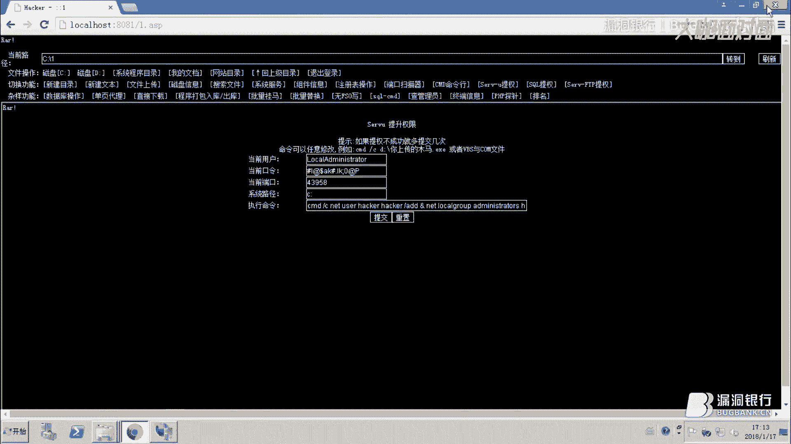

所謂第三方就是，要麼就是SoYo，要麼就是一些第三方的管理條件，或者是MySoQ管理條件，MySoQ管理條件，他會把他的密碼放在，一般放在C盤的某個用戶目錄上，但是這個也不一定，你看不到。

他繼承了也會有這個權限，而我們Win7就是有這個權限，好先給大家說一下，SoYo，SoYo的話，當然你們也不能去硬懟他。

當然你們也不能去硬懟他，當然你們也不能去硬懟他，也不能說我看你教程有這樣搞，我也這樣搞，這樣不科學也不現實，4398是本地人的端口，就是4398他是SoYo，他第三方名稱叫SoYo FTP。

也是個第三方的FTP軟件，但是這個FTP軟件，他默認是給的Settings權限，所以這個時候我們就可以利用他，如果他的密碼用於，如果他沒有設置密碼的話，就可以直接利用文碼功能的SoYo提權。

比如說我們先，他會有一個，權限，我們看看他的權限是什麼，看在這裡已經直行910，然後我們去地圖，可以翻下去，一點點，看不出意外的他會設定，這樣後面的話，我也有不用給大家多解釋，剩下該怎麼做。

就來他有的那些，好。

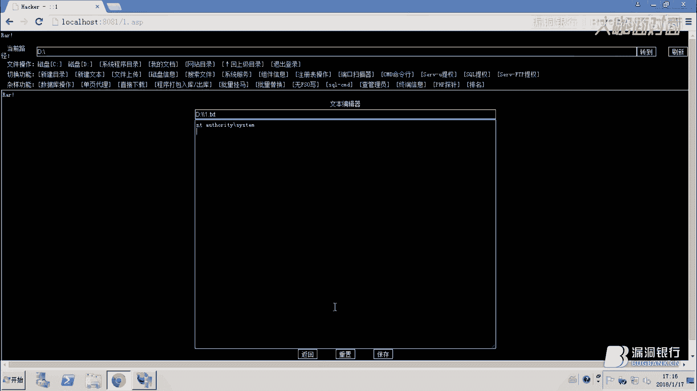

這是SoYo還有常規的FTP，當然對於SoYo防護這塊，就怎麼找是目錄，一般的話，就是在這目錄，因為我這個是綠色版的，所以我把它放在這目錄，如果他的這個目錄，可以便利的話，就可以去找一下有沒有這個。

如果說還是不行，就按照我剛才說的，掃他整個C盤，總會有一些意想不到的收穫，這是翻磁盤的一個技巧，對於這一塊的話，防禦方法，這個加一個密碼，當然就算你加密碼，他也不上去，因為對於黑客來講，還是可以通過。

這個目錄，這個文件，這個配置文件，去獲取你的密碼，好，OK，那你說，我把這個密碼加牛逼的，隨機字符，隨機字母，各種隨機行不行，OK也可以，因為這個默認是不允許你更改，如果說，他管理員，把這一切的寫的。

寫的非常牛逼的話，但是給他這個目錄的權限，你發現如果這個目錄權限，有一個讀取和執行，或者加一個，創建文件寫入數據，勾取這樣權限的話，我們就可以直接，創建一個新的這個文件，可以直接修改這個文件去替換。

然後本地可以裝一個sorio，加個密碼，然後用我們本地的密碼去替換他，一個很牛逼很牛逼的密碼，這樣就OK，當然替換之前，你不要忘了給他把原來的密碼，備份一下，不然的話管理員會發現，這是防守三之一。

防守三之二就是，我不讓，以後不讓這個讀這個目錄，這樣就OK了，然後這是第二種方法，然後還有第三種方法，就是把sorio整個來降權，就用一個，比如說用gas的權限，用心sorio，這樣也可以，但我覺得吧。

第二還有第三種方法，是最穩妥的方法，就第一種方法就是，只假設用，這樣的話，也會有不安全隱患，好這是，exp還有sorio，接下來給大家說。

怎麼利用Windows本身的exp，就是所謂的漏洞，去打他，還有通過常規體，還有就是，sorio ftp，這種方式，接下來給大家講就是，買sorio體驗，因為買sorio的話，我想要，我想。

各位朋友應該，在mouseover提問中，會遇到各種各樣的問題，比如說，我UDF導錯了，為什麼用不了，就算各種包錯，這個時候買sorio，選擇分兩種情況，第一種就是，小於等於5。0。

第二種就是大於等於5。1，因為現在很多新主機，就是用的大於等於5。1，這個時候，我們買sorio，如果小於等於5。0的話，必須要把我們的UDF，導入到c盤Windows，或者c盤Windows。

C++項目，如果說大於等於5。1的話，必須要導入到，買sorio的插件部項目，好接下來給大家，做下演示，好，就是怎麼查看，網友們買sorio服務，我們也可以通過，這條命令，進去查看。

72寸306就證明它存在，好接下來，我們在翻它的字板，好OK，怎麼獲得肉的密碼，我們在一些網站的安裝部落下，比如說dd3s之夢，還有比如說帝國，帝國備忘的帝國，我們可以去找它的配置頁，databsc。

去找它的配置頁，它裏面就包含了，一些肉的信息，用戶名運用，當前sorio用戶名，還有編碼，這四條信息，然後我們可以加以利用，還有一種方法，就是如果我說，這條件均不能滿足，我們就需要翻它的字板。

因此有的時候，我們買sorio，安裝部落是可以便利的，如果說存在便利的情況下，就翻它的data，我們只需要把這三個文件，下載到本地，然後本地裝一個，通過這三個文件去覆蓋，就可以看到，看到它滿足的密碼。

我們這裏可以看一下，看一下，一二就直接在服務器操作輸出了，就直接在服務器裏面看了，因為實戰當中，你可以把這個文件，直接下載回來，然後就按照我說的，把這三個文件覆蓋，然後就可以看到它密碼，好OK。

密碼為這個，密碼為這個，好，好，因為這個密碼我之前已經知道，它是ZKEOS，所以這裏文件不夠滿，好，接下來怎麼辦，當我獲得密碼的時候，就可以直接上UDF體驗碼，好，在這裏，它直接指示我們的路徑為。

證明到這麽一張，這麽一張串的路徑，對，直接指示我們路徑為這麽一張串，這個時候我們只需要點擊導出UDF，導出，這個我來說自訂導出，自訂導出，如果大家之前有被覆蓋的情況，或者導出過多的話。

我們就可以通過自訂導出，但自訂導出的話，接下來的創建SemmlyShell，這一塊，它這塊，這裏的路徑，你可能需要改一下，否則就會跟個人爆錯，首先導出之後，你先創建一個SemmlyShell。

去創建一個，就表示MeshHub，它可以調取SemmlyShell，只要我接下來查看用戶，好OK，沒問題，我們如果想執行此系列命令的話，很簡單，就把它上一個1複製，給我查看當前權限，Setting。

看短口話，也是一樣，好，這個就是MeshHub體驗，需要注意的就是MeshHub 5。0版本的話，我們要把它導出到C盤的Windows什麼東西，就導出到這麽東西。

或者是C盤Windows Settings，Settings上，這樣就OK，在這裏我找到一篇文章，有專門分享MeshHub的一些，如何調整跟問題的解方，對於MeshHub 5。0版本的話。

你必須將DLL導存不要記是系統問，或者問Settings上，否則的話，就會看到一些錯誤，還有就是，使用Server語言創造功能的語法，就剛才的語法，函數名，比如3DShare，導出DLL路徑。

如果根本的話就直接，就往剛才的路徑，如果說是我們另外的路徑的話，那我就必須填我們導出的路徑，對於MeshHub 5。0的意見，語言創造功能DLL不用帶全路徑，如果你在DLL已經將DLL導出系統。

那你就可以省略路徑，直接省略路徑，否則你將看到這麼一個錯誤，我想很多的朋友都會遇到這麼一個錯誤，還有就是另外一個錯誤，如果執行這條語句的話，出現這條錯誤，這條錯誤的話，我想很多朋友都會遇到。

然後因為這是一個MeshHub的bug，官方網站大家可以了解一下，這一大堆，百度挺牛逼啊，百度挺牛逼啊，OK我們看一下它的解釋，在某些情況下，什麼什麼的存在而優劣，就什麼什麼導致什麼什麼。

什麼被我從什麼什麼什麼實際成，這才官方大概也是，然後我們寫的方法就是，你可以手工輸入，刪除，這個裡面，有個名字叫做3D刪的東西，因為很多人都會遇到這種情況，在這裡我想直接給大家說一下。

就是具體情況一定要具體分析，也不要出現一導致失敗，然後就不能放棄，沒希望，肯定不是這樣，出了問題我要學會解決問題，而並不是放棄，這樣的話，也不夠體現，對於整個學習生來講，都會是一個很大的麻煩。

好這是MeshHub這一方面，好接下來我們談一下Social，Social的話，在早期的Windows203版本，我想各位朋友在T203的時候，那會非常的易，因為在Windows2000。

早期的Social是Windows2000，那個的話就不是任何限制，直接我們通過Lightyear就可以直接搞定，但對於Windows308，Windows3012，Windows3016。

還我們怎麼得到它的Social密碼，第一就是反此盤，第二就是通過它的網站配置鏈，去找它的上密碼，這兩種方法，好我們這裡已經進去了，選擇儲存庫，在這裡我們直接執行，Vnet，好OK，直接是Vnet。

不出意外它會報錯誤，Social主者對主線超越3B Shell過程，Sys。超越3B Shell的訪問，什麼什麼一大堆這個時候，解決方法很簡單，(解決方法)，基本上大家可以去百度一下這個方面的原因。

為了省時間我在這裡直接給大家，把這個解決方案列出來，(解決方案)，OK就這個，用這個語句就能OK就能解決剛才的報錯誤，執行的方法很簡單，執行的方法很簡單，對它執行完之後準備要用回顯的。

這個時候大家不必驚慌，就證明實行錯誤啊什麼的，沒有這種情況，(解決方案)，好OK，不出意外它會setting，還有就是當我們的國內主。

這些只是一個小洗手。

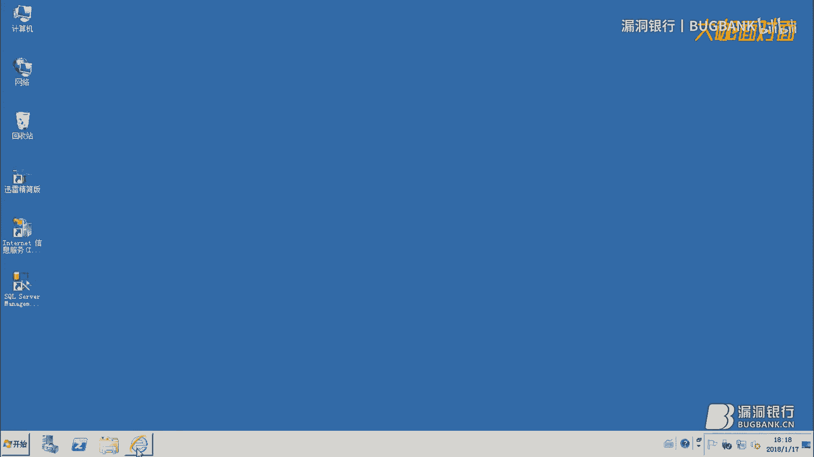

如果說我們389端口被改了怎麼辦，第一就是通過這個，去找一般都是其他遊戲端口去找，第二個就是通過，(解決方案)，通過直接上命令去找，一般情況下，我直接找，1992，(解決方案)。

要怎麼確定1992的ID，都錯對應端口號，OK，這也是一個方法，我們的40分鐘觸拿提前支持就講到這裡，接下來就回答大家所提的問題，我問一下命令執行完端口就關閉了，聯繫不上，這個你得看是什麼端口。

如果389你可以幫它開，幫它開389這個可以的，你可以擺渡一下相關的命令，提前支持最大困難是什麼，不全信不全信還是不全信，但是你也許有想過還怎麼，沒有選一種創造學習，打開多少XP貢獻給大家行嗎。

這個我感覺還是平時要多收集，對多收集，提前支持度的自學專業，沒有別的，文案的把大電批評之後，打開批評為什麼選擇空白，全信全信還是全信，提前怎麼收集，如果你也是作為一個真正用的，用文來用者來講話。

你給客戶處理一些網站安全問題，時候就能收集了，用微遇到主要控制，用微遇的話，用微遇比較繁瑣，你要學會很多的言論命令，學很多的解決問題方法，提前對於用微有什麼幫助，順手吧，毛與洞的關係。

針對XP提前如果禁掉一些環境，如果我是WMS主線被禁掉的話，你可以嘗試用APX，你可以去看看有沒有第三方，也可以放他在磁盤，因為有的管理員，他對磁盤設計不嚴格，填到有什麼技巧，就我剛才說的這些。

也不說有什麼新技巧吧，只說一些小技巧都在，API提前方式，好API，我在這給大家說一下API，因為API的話就也很早就出來了，但是，嗯，嗯，嗯，嗯，嗯，嗯，嗯，嗯，嗯。

API是針對我Lite或者Lite1，同時被禁掉的情況下，就是我通過Lite也繳不上，通過Lite1也繳不上，就是這種情況，嗯，嗯，嗯，嗯，嗯，嗯，嗯，嗯，嗯，嗯，嗯，嗯，嗯，嗯，嗯，嗯，嗯，嗯，嗯。

但API提前他只能，做一些加賬戶，從底層提前加賬戶的一些操作，也是，一些大佬發現的一個操作，他的利用方法，嗯，嗯，嗯，嗯，嗯，嗯，嗯，嗯，嗯，嗯，嗯，嗯，嗯，嗯，嗯，嗯，嗯，嗯，嗯，嗯，嗯。

當然這個API提前他也是需要你胃口大，才能執行，嗯，嗯，嗯，嗯，嗯，嗯，你如果胃口不大的話，哦，這裡是steampunk，嗯，嗯，嗯，嗯，嗯，嗯，嗯，嗯，嗯，嗯，嗯，嗯，嗯，嗯，嗯，嗯，嗯。

但是這裡也是不會有任何提示了，這是可以看到你加一個賬戶，F4C可以，他的權當然是隨時都能去，這個就是所謂的API提前。

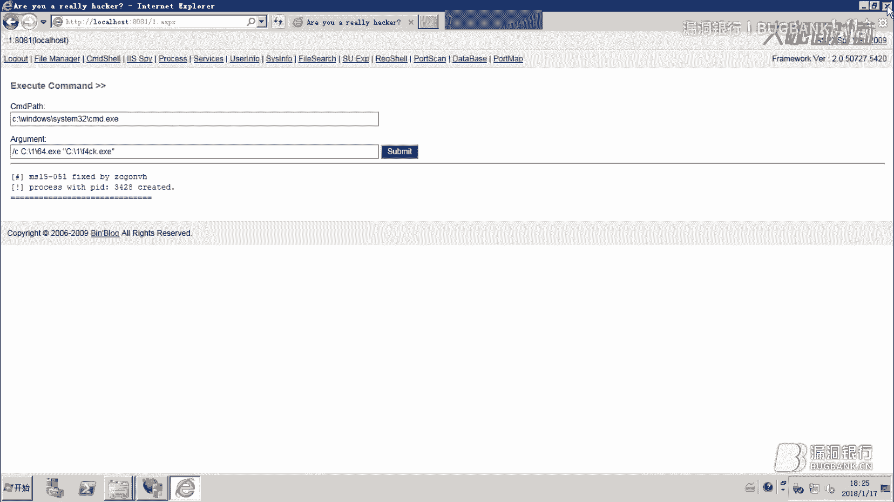

他是如果說我Lite和Lite一同時被清掉了行不行。

使用的方式，針對SPC如果清掉主電，這個和這個，我是連熱體的一樣，嗯，多翻磁盤吧，多收集一些信息就OK了，如果website都有所有磁盤權利還有提供必要，這個問題怎麼回答你。

如果website都有所有磁盤權利，嗯，這個主要看你想做什麼，你如果想要服務器的話，嗯，當然你可以進行下一個操作，但是如果說這台服務器，你都有所有權利但是他不定，打響權，你認為還有權利必要嗎。

Linux時期XP持續執行，這個的話，我前一陣子也遇到過這個問題，就一直我也沒有想到，可能是淳樸，也可能是，你的exp問題，添設一下支持點勝利，MySQL，exps，除了這些還有，還有想問的還是支持。

這個的話，嗯，支持的話，就得看你自己，因為提權的話就，提權文不做話就那麼多，對吧，MS對提權，嗯，我一般不用MS，用這個的話，用的，不是很多，提權在哪些環節下，這無所謂了，這個都可以。

執行你所有這些小文都可以，對於STL就可以直接拿到SET圖顯示，不需要提權，不解釋。

好了，本期打開評論片就到這裡，謝謝大家觀看，再見，(字幕製作：貝爾)。

(字幕製作：貝爾)。

(字幕製作：貝爾)，(字幕製作：貝爾)，(字幕製作：貝爾)，(字幕製作/時間軸：秋月AutumnMoon)，回来。

