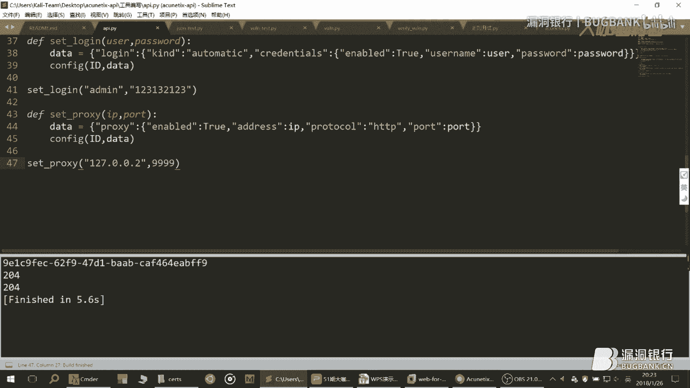

# P1：51【录屏】自动化挖洞方式大起底-扫描器优化方案及脚本编写——第51期大咖三米前有蕉皮分享 - 漏洞银行BUGBANK - BV1Ct411t7pY

为知识而存，因技术而生。小伙伴们，大家晚上好，欢迎参加漏洞银行信息安全技术讲座。大咖面对面。今晚是咖密的51期，我是主持人年念。😊，本期我们请到了克拉实验室的大咖，3米前有胶皮。

给大家带来主题为自动化漏洞挖掘方式大起笔。扫描器优化方案及脚本编写的讲座。那在讲座过程当中，小伙伴们有什么问题都可以随时提出。大咖会在演讲结束后的航上问答环节来解答。😊。

大咖赠书环节还会选出一位最认真听讲的观众，送出大咖挑选的python绝技，利用pathon成为顶级黑客一本。那到底怎么才能把你的扫描器发挥最大的效用为你所用呢？那就让焦皮在接下去的时间里为你一一解答吧。

下面让我们把时间交给大咖，咱以前有招皮。嗯，各位漏洞银行的小伙伴们，大家晚上好。嗯，今天我给大家分享一下，我在使用AWBS的时候的一些思路。呃，因为我是小白嘛，可能会有一些地方讲的不是很好。呃。

还请大家多多指正，大家一起交流。AWVS呃，相信大家都不会陌生。在windows系统下是一款比较常用的we漏洞扫描的工具，而且也是比较出名的。嗯。这标题说自动化的肯定是夸大了吧。

就不过真的是可以减少你们手工验证漏洞的时间。这是有主要有两个内容。第一个就是呃调用扫描器的API进行批量的添加扫描的目标，还有设置目标。第二个就是关于扫描器的数据库的使用。

我会呃教大家怎么连接这个数据库，然后查询里面的信息，然后把这些信息提取出来，然后再进行个漏洞的验证。

嗯，这是目录。就是在。在这之前说一下，为什么要呃使用只会使用扫描器。就可以从扫描器这里我们可以学到什么东西。第一个就是作为安全人员的必备技能吧。如果你注意看的那些一些公司的招聘安全人员的岗位的时候。

你会发现岗位嗯的要求通常会有熟练某某使用某某某扫描器者优先。就是所以呃所以学会用多种扫描器是很有必要的。第二个就是提高效率吧。呃，开发扫描器的初衷就是减少人工的检测，而且扫描器的速度是很快的。也不会累。

嗯，就是第三个学习一下扫描器的思路，还有规则。就是我在学习的时候呃，比如发呃一些敏感的信息泄露，就是比如备份文件这些规则。就是在前人呃。破解了上上一个版本。就是上上一个版本的那些规则。

就像这些备份文件的规则一样。

呃，你们都可以去看一下。这是文件的名，还有这是文件的后缀。

然后这里还有很多很多的规则。呃。就是你们可以再简单的写一个脚本。再利用各自规则去扫，这样就不用打开这么大一个扫描器去扫，就比较有针对性。第四个就是发现呃扫描器的不足嘛呃并完善它。

在我使呃使用这些扫描器的时候，就。呃，有些。逻辑上的漏洞，还有月前这些是扫描器无法做到，检测不出来。然后还有一些对国人的习惯。因为这个扫描器毕竟是外国人开发的嘛，所以对于中国人的习惯还是。呃，比较弱。

然后我们进入下一个内容。就是调用呃扫描器的API进行嗯。的，脚本的编写。在这之前，我们先学一下pyython的基础，就是呃列表还有字典。就是列表是中括号括起来以逗号分隔的呃，里面的元素。

还有字点是大括号括起来，就是就呃这个就是那个JS格式的解析。这个第一个是把以编码的JS字符串转化为python的对象，就像转化为字典或者列表这之类的。第第二个就是把python的对象转换为JS呃呃。

字不串，到时候就是。嗯，po提交数据的时候要用到了。我们还要第二个是一一些request的库的基础，就是你们会那几种请求就可以了。这个不懂的，可以去百度一下。

然后我们今天的漏洞测试环境是web for pen test。然后呃这里扫描器的安装，这个相信大家都会。就是如果你不是在本地安装的话，就要勾选一下这个呃这里。可可以远程访问。

同时你们那边还要设置一下防火墙。这里还有一个就是SSL证书的问题，就是不知道大家有没有遇到过谷歌浏览器提示那个漏呃扫描器的页面不安全就是。就是这里就是。显示这里是不安全的。然后如果出现这种情况的话，在。

在那它有一个目录。就在C一盘的那有一个目录。嗯。就是这里是有一个证书的，你们打开浏览器导入就可以了，就是设置这里。高级安全性这里就可以管理证书。然后因为我这里已经导入了，看就是第一个。

然后我现在是已经导入了，所以这个浏览器是提示它的证书是有效。然后我们来看一下呃，它的。API的获取。获取API呢就是点这里点配，然后拉下去这里。是如果你是刚刚刚安装完了，是没有生成的令牌的。

所以你要点一下生成令牌。这里我已经生成了，所以就可以直接复制，就等一下可可能要要用到嘛。然后我在这里讲一下API的验证。就是在HTTP请求头上加上这一段就可以了。就是后面这个就是你的令牌。

只有带上他的请求，就才才是合法的，否则就是报那个未授权嘛。

我们在这里。就写一个吧。呃，这个是已我已经构造了这个请球头，就在后面就可以调用了就可以了。呃，现在我给你们简单的写一个吧。然后这个就是你主机的。呃，URL。这个就是令牌。

然后我们先来添加一个目标。添加一个目标，它的呃请求方式是post，然后URL是这个。然后提交的数据是这个，然后解释一下，也就是这个是地址，就是你要添加的目标的地址。然后这个是描述。如果这个是中文的描述。

也就是经过编码。

我们。先定义一个函数吧。描付UL。Oh。我们这里要用到request库。Post。嗯，添加一个目标，我这里有说明。就是提交的方式是post，然后这这里是URL。对不对。然后提交的数据是。这个。

这里就是URL嘛，你们可以把它改。叉叉叉就是描述，然后这里需要那个提交一下它的数据。对。这里就要用这的格式化一下。因为这它是那个HTTPSS协议的嘛，然后我们在这里就不验证它的证书。然后我们把就是这个。

す过来。我们把验证改为甲，然后再把请求头。加上去。再把它返。返回复制给。啊。😮，然后我们来打印一下他的内容。在下面我们先调用一下这个函数。我们添加一个目标，就添加的是这个靶机。

就现在是已经添加，我们看一下。这个是已经添加过来了，对吧？我们把它删。

删除一下。我们再试一下，就是现在是打印它的返回信息。然后返回的他的目标的ID就说明他添加成功了。然后这个是比较有用的，因为后面的呃操作都要都要呃这个ID才可以。就是它返回的是那个JS格式，我们现在来。

教大家怎么解析这个JS。然后就是这呃这样子嘛。把先把它加载进来。就返回一个质贬的对质贬的对象。我们可以打印一下JS的内容，就发现它是一个大括号了，对吧？也就是刚才说的字典呃，字典呢的它访问的。

方方式就是这样。这里是键，这里是值。我们可以打印一下，看他只返回了他这这个目标的ID是吧？然后我们在这里写一下。Okay。我们把他ID返回来啊。我们就可以就是只打印它就可以直道ID了。

然后添加目标我们设置吧，就是敲完了，然后我们来进下一个。

然后我们就是正常的添加了目标，是不是要对目标进行设置？就是这些可以。设置速度，还有站点的登录。对吧还有呃代理服务器爬虫的UA这种。然后配置扫描的参数呃，请求类型是这个PAATCS。

然后请求的URL是这个。然后中间的大括号括起来的ID就是刚才返回的那个。

嗯。在这里写一下吧。我们同样要使用到request的库。这是只是那个请求的方式不同。就是那个嗯。DATCH。还有URL也是不同。会换换为ID吗？然后我们在下面写呃设置。速度的。

测试速度提交的数据是这一个。我们就再可以定义一个吗。嗯。我后面的也复制过了。就是这里可以。呃。换成你要想要设置的速度，慢中快嘛。然后你就可以把ID。然后再提交给那个设置。嗯。嗯。

我们再调用一下这个函数吧。

我没有写那个返回执啊，就是呃。这个就可以设置到了那个抬感的速度，对不对？

等我们再进行。应该写一个返回。不知道。我们返回它的状态码，因为这个是靠那个状态码识别它的是是不是成功了。我们下一步就是设置那个站点的登录，就是其实提交的。呃，插带的都是一样的，只是。呃，只是这个不一样。

就是其他的URL，还有提交的方式都是一样。我们可以把这里改。就是这样改是可以的。我们把它整整一个复制一下。然后这里是你的账号，这里是你的密码。然后我们可以调用一下这个。函数。把这些换。

换成提交过来的参数。其实这些都是一样的嘛。然后我们再调用一下这个参数呃，调用一下这个函数。用户名可以设置。嗯。3是。然后我们再可以。拿当呃之前的，我们可以打印一下他的ID。

这样这样就不用每次的都要添加一个。

又添加一个。等一下就不用这样了。不是这个。这个就设置了站点登录，对吧？我们把前面那几个删掉。

嗯，然后下一个就是代理服务器，就是。只是提交了这个就可以。其实设置这个请求的都是一样。然后我在这里就就只写这几个了。对，IP。请求的数据是这个。嗯，把它改一下。这个就是你要设置的IP。然后这个就是端口。

我们把它设置。就是刚才那个ID嘛，我们把它复制一下。把这个猪死了。不然每次都要添加一个。我们再运行一下。就是他返回的是204，就说明是设置成功了。我们来看一下这一个目标。

4999啊，就是刚才这个。

呃，设置这里就讲这么多啊，就是我们。

我教大家一种方法就是。可以。不不用文档也可以，就是呃。知道他提交了什么数据，就在这里打开。按F12就打开这个。然后切换到网络这边。然后你们可以在这改，然后再提交保存嘛，然后看他的请求的过程。

我们就点一下这里。我们就可以看到这里是提呃提交的方式是这里，然后拿到后面，我们就可以看到他提交过什么的数据。就是我把刚才是把它改为慢速了，对吧？然后他提交的就是这。啊。然后。这样你们就可以自己写了吗。

我在这里就呃不说这么多，因为后面还有就是设置完了就要开始扫描目标了，对吧？

我们来开始扫扫呃，扫描目标是。

开始扫描它的提交方式是post，然后这里是你刚刚获取的那个目标的ID，这个是扫描类型。如果全都是一的话，就是完整的扫描，这里从哪里找呢？然后这里就要连上一下。数据库。数据库这里以后就是等一下会讲的。

然后这里就有扫描的类型。如果都是一的话，就是完整扫描。就是如果。是这个的话就是只扫那个高危的漏洞。这个是只扫那个绕口令这个。就爬就是只用爬虫爬爬去网站。然后这个就是测那个叉SS，这个就是收购作用。

这两个我我我都不知道。然后我们来写一下吧。

呃，就是他。开始扫描。那这里要ID。然后它的URL在这边添加一个扫描。提交的数据是这个。Oh。然后个这这个就是ID我们用这个吧。然后下面这个就是扫描的类型。然后我们打印一下它的返回的信息吧。然后我那个。

调用一下这个函数。目标的ID就是刚才那个，然后这个扫描的目标我们从这里找了。

🎼就是如果你们呃在写完善这这个时候。就可以写一个字典了，然后我我们运行一下。读错了。唱。哦。但是没有加上。然后他就返回来了这个。

信息是吧，现在应该是开始扫描了。然后我这里是因为我设置了那个。但呃，因为我设置了这个代理服务器，但是我本地又没有开，没有监听这个端口，所以它是扫描不了，就是我们在这里。

先把这个关掉吧。

然我我们再执行一次。

再回来看一下。还是没有上啊。

呃，既然是这样，我们就开始。

讲下一个吧。应该是开始撒，我们把它删掉。这个。就是我用其他语言写了一个，就是调用靠URL的原理都是一样，就是只是请求的工具改了靠URL。嗯，这里我等一下就是讲完了会演示一下这个工具使用。

我们呃进行第二第二个环节吧，就是呃扫描器数据库的使用。嗯，其实API也是可以做到这些的。但是呃API的请求每一次只能获取99个漏洞的信息。就是要如果要再呃获取的话，就要再请求一遍。而且他这个是。嗯。

就是这个漏洞嘛，然后我们。点这里它是一页一页只显示那个99个漏洞的信息。如果我们往再往下拉看拉到底了，它又加载，对吧？它是这个。呃，用了阿贾克斯异端请求，就是我。

要用API操作是很麻烦的。所以我选择用数据库。

然后首先呃这个数据库的呃数据库类型是这个嗯然后。这些信息从哪里得到的呢？其实这里是有一个呃文件的。就是这个配置文件里面是有的。都在这里，然后嗯密码呢在本地是不用密码的。就是密码随便写都是对的。

在如果是远程的话就不行了。啊。我们先。打开这个连接一下看一下吧。就是。我们先来看一下这个。这一个。表吧。这个表呢就是里面有所有漏洞的类型，还有漏洞的描述，还有漏洞修复的方案。的表都在这里。

如果扫描器扫到的漏洞，就会在这里根据这个漏洞的ID，然后去选择漏洞的信息。这是呃这些是可以改的，但是这个我不建议大家改。就是如果把它改成中文的话，就相当于汉化了嘛。然后我们来这里扫改一个试一试。

就是我搜这里。搜一下。

我们复制出来给大家看一下。就是这种啊，然后呃翻译的时候要注意一下，就是这些HTML的标签就不用不用翻译了。还有可能会有一些唉的实体服，大家在翻译的时候也不不用翻译。

就是我觉得是翻译是没有什么用的了，对于我来说是没有什么用。但是可能对于一些公司的人来说，可能会有用。因为他们要生成那个。

呃，中文的报告嘛，这个是。就是它生成的报告也是中文的，如果是现在改了。

我你把它全部改了吧。

我们先把它翻译。

我们再复制回回去这里。是这个吗？那我们保存一下。现在我们回到呃这个we。这里刷新一下。哎。😊，没找到啊？嗯。先保存保存的。应该有缓存吧，这里。那我们先这个。不管是可以汉化的，这里是。

这个是这些漏洞的描述，还有报告。然后我们再讲另外一个表。然后这一个表示比较重要的。呃，我们重点讲一下这个表，因为这个表里面有检检测出来的漏洞的详细的信息，比如这里是URL，对吧？还有这是呃漏洞存在的。

将。这里是详细的。攻击的详细过程。还有这里是一个完整的HTTB请求的数据。这个是那个攻击的配漏嘛，然后都是在这里可以找得到，这个就是那个请攻击攻击的键，这就是攻击的配漏。然后这个就是ATTM。

不是就是AE那个ATTTP请求的响应。呃，我们这就。几个数据库的作用就讲完，然后我们要用python来连接它就是。喂。我们要打开打开这里吧。去下载一个库。这里说一下就是。你要下载的那个。

和适和你python的位数和版本相同的就行。就是你python是32位的，就下32位的。我的系统和系统是没有关系的。然后他如果是没有错的话，安装的时候会自动识别，就python的安装目录。

然后把它安装到那个python的相相关的路径里面，到时候点下一步就可以了。安装完了就是我们开始写脚本。呃，就是。这一个就是导入库它的这这个库，然后这个是连接数据库，然后。这个是执行呃搜狗命令。

然后再把他们的返回信息都取回来，这个要关闭的嘛，然后后面就不用你。

呃。Yeah。我在这里写写到有，然后就可以把他们都搜都查出来。我们先打印可以打印一下他们的URL看一下。这些就是漏洞存存在的UI啊。这些是HTTP请求的数据。然后这些是比较有用的，所以我就把它列出来呃。

这只是简单的把它们全部拿出来。呃，我在这里写的是比较。因为。嗯，这里是查的，他们的在就是不是星号啊，就是针对的针对他们来查的。然后从这个表就是从这个表里面查。然后我们说一下呃。

漏洞。第二是。喂。

我们说一下要提取哪些信息，就是刚才说了，就是呃漏洞的类型嘛，就是你要先知道它的漏是什么漏洞吧。然后这个是URL，然后在这里是搜狗注入嘛，这这里就相当一个注入点，然后这就是漏洞存在的纰漏。

因为搜狗注入这里有一个比较特殊的地方，就是。这里有一个。原始的那个值。就是这里。这个值是呃等一下会用到，也是决定于你验证成不成功的。然后讲一下呃漏洞验证的思路吧。就是你要先判断它的漏洞的类型嘛呃。

因为你得先知道它是什么漏洞，然后就选择一款验证的工具。然要看一下这个工具需要什么参数。再从数据库里面提取这些信息，然后传给那个验证的工具。呃，工具最好是开源的，这样你就可以去修改它。

可以把它改为呃比较合适验证漏洞的工具。就比如这一个是爆破叉SS的对吧？然后。

嗯，我在这里把它改了。就是你原呃原来的原来的这个版本是刚如果是刚刚下载的话，呃，是比较。是那个要交互模式的才才可以。就是需需要你用户的交互嘛，这里要一个填一个，然后再敲，这样是不是很麻烦？呃。

然后这里我把他们改了改成了。直接在命令行里传参数进来的。这种就不用不用你交互嘛。就是直接这里杠U后面接URL就可以了。就像呃叉SS呃这样。

直接传参数进来就可以了。呃，就是如果是原版的话，你还要敲三遍，对吧？然后我。

再讲一下这里。就比如我想验证那个叉SS的工具，我要选择一款验证叉SS的漏洞的工具。嗯，这个。呃，大家都用过。然后原版的还有一个就是那个。如果是没有叉SS没有参数的话，它是识别不了。参数。这个没有。

也就是这种4G呃那个响应的吧。触发事件，这就是鼠标的触发事件。这个是没有没有任何的参数的对吧？这种是原版的那个是呃做不到的，然后是检测不出来的，因为它会报错。

我们来试呃，不是这个我们来试一下。原版的。就是get。对吧然后再把。刚刚那个要爱啊。

我等一下。就是你手工验证的时候是。

比较麻烦的了。就是这种是没有参数的，它默它会。提示这这这个UIL里面没有参数，但是我把它改了。喂。错了。把这个复制到。然后把请求的方式改一下。这样我们就可以验证出它是有漏洞的。

🎼然后呃如果是想验证搜狗注入的漏洞的话，我们就选那个搜cle map，然后就是给验证漏洞的全参数。就是你如果是手工的话，可以这样子吗？就是把。把你那个请求的ATTM呃。

不是就是呃HTTB请求的数据复制一下，然后就。把它保存到一个文件里面是吧？然后就是这个。哎，不对。复制错了，应该是复制产呃，搜索注入的。我们来测一下第一个，简单一点。

然后是不是把它复制到这里，然后再用呃smar调用调用这个文件。

一。就是这样去检测。是不是有漏洞，对吧？あ下。就是思路是这样子的，然后。嗯，再看一下哎。然后我们看一下代码吧，这边的。

就是。从这里把它的呃数据取回来。然后再判断它的数呃漏洞的类型是不是呃收狗注入的这个名称吧，这类型是不是？然后这里就要刚才说的那个原始的那个值。

就是。嗯，这一个值。如果他如果你是随便点的话，就是呃随便添加的话，是就是测试呃。就是验证漏洞的几率成功是很低的。这个是验证出来的。就是这个这样就可以验证出来了。但是如果你。就是这里随便改。

如果是改了数字的话，他有可能是不认的，就是请求的呃数据类型是不同的嘛，传的参数。然后我们就要。把它的原始的提交的参数这里。

记下来，然后用ZS格式把它取取回来。我们再看一下验证的这边就是发送了到什么码，然后把他们呃保存到保存到桌面这个目录。保存到这里，这里就有几个他们的文件名都是呃以MD5命名的。然后再写到这个文件。

然后再调用呃收纳来执行嘛。然后再把他们。把他们的返回类返回的信息，就像这样返回了这一堆信息，判断这些信息里面是否是否存在纰漏这个单词。是是如果是有这个单词的话，就说明是呃有漏洞了，对吧？

就是判断他配呃这个pay漏的单时是否在它返回的这个值里面。如果是有的话，就写一下报告，把它记录下来。呃，现在我们还没执行。

呃，这里就是刚才我。还没开始直播的时候执呃执行的这些。然后我们再来看一下。

呃，这只有两个判断啊，这里是呃我们。如果第一个第一步判断失败的话，我们就要加一加一下要过的脚本嘛，就是。你。这里如果失败的话。也不能放弃，对不对？然后这里就可以利用这些呃脚本进行要货。

这里我呃只是把脚本复制到卡里这个文件里面。复制啊注意次复制啊，就是不要移动，它它就会检测里面的文件名，然后再。再用这里的呃传这参数。调用这个。很煎明，然后再跑一遍。就是我在这里。演示一下给大家吧。

看一下。杠S3就是检测那个验证那个高危的漏洞。就是如果是检测叉SS的话，就把它们替把它的URL提取出来。然后再传参数，像这样传参数过去。嗯。这这里我们要。

看一下叉SS这边的。他有一个规律，就是。就是这里是有。🎼前面是4位，然后是随机生成的字符是字符串，就有可能是呃大小写字母，还有加数字。呃，这里括号里面也是4位，然后这里我们就可以利用正则呃。

正则来匹配它就是这8这里四位，这里4位，我们就可以用正则表达式，然后把它们替换成要弹的框。

我们这里是换了这个啊，你们也可以呃换这个嘛。这个可能会有些程序员可能可能会拦这个单词，所以换一个吧，这个不是那么常用。然后这里就会去执行我这个脚本。就是第一次注入失败了嘛。

然后就会要去调用我这个压过脚本。这里只是呃这个要要过的脚本，只是把。空格转换为这个注释。然后就可以绕过两个漏洞。然后如果这边跑完了话，我们可以看一下呃桌面的报告。这个是。已经生成的是呃存在有漏洞了。

然后这里我们单击打开。

哎，不对，复制就复制。

就是在里面呢也也不能是呃有100%是可以成功的就是。

经过验证的话，就几率是比较高的对吧？🎼然后这些是已经扫出来是有漏洞的了，然后才会写到这个文件里面。然后这个是收狗注入的嘛，然后就验证验证成功了就会保存到这个文件，我们就可以这样执行一下。

然后因为刚才这刚才这里已经跑了一遍了，它肯定是有缓存的，所以这样就非常快。然后就是。然后你们就可以继续在这里手工来敲了嘛，就差截图了，对不对？嗯，然后这里是就是有漏洞啊，看这里是有这么多个。

都是有漏洞的。然后如果验证失败了的呢，然后就会保存到这里这这个文件。就是这个呃就算是失败了，这这里我是把它嗯这个正则换换了一下。

也是也是应该是可以弹光。

是吧。然后就是还有一个。

这个也是应该是可以的。哎，等一下。

就是就算失败了也也是可以，就是还有剩下这个。就是我只只验证了叉S，还有搜狗注入，就有这么多漏洞，就是只有一个搜狗注入是没有没有验证成功的。剩下的你们就自己可以手工啊，这个工具都扫不出来，我能怎么办？

我也很绝望啊。就是你们可以用这些脚本。只要。你们可以添加多几个进进这个文件夹。就是但是这样是很费时间的，就是有能力的呃朋友可以把它改成那个多进程或者多线程。

这样就比可能会比较快。呃，我我拍整很水了，所以就做不到。然后呢，就是。呃。验证漏洞的这这一方面就讲这么多。然后呃其实还不仅仅是可以用来验证漏洞的对吧？呃。你们在这里也可以看到这些有。就是DV或者信息的。

这里也可以作为一种信息收集的途径啊，就是用正则匹配来匹配这些邮箱。还有这些IP的泄漏，就是文件的路径这些泄漏啊，你们也可以。在这里进行信息收集。然后呃。我就写了这两个验证的脚本。然我们讲一下呃，最后的。

一些。就就是。第一个你们可以上网找一下怎么去清除扫描器的那个标志。呃，什么是扫描器的标志呢？我们在这里呃找一下啊。

我们打印一下他们的请求的过程。我们复制一下剪切一下吧。那，新建一个。商家。这些就是他请求的过程啊，你看然后再请求头的就是头部这里是是不是有它的标志，然后是WBS。

就是如果别人别人的网站是呃安装了袜或者防火墙的话，可能就会把你的。把你认认为是你在扫他的网站，然后就把你给拿掉。然后这样就你们就少不了了嘛，然后就是呃这里。

呃，第二个就是。你们可以用呃来找其他端口的we服务嘛，就是你不要就是你就是扫扫域名的时候，默认是不是80端口，就是只是扫80端口的话，这样就是他们还有其他其其他的端口开放的那个HTTB服务。

你就扫不到了，对吧？就是我比如找一个例子吧。

就像是呃这种的，就它不是不是那个80呃80端口的嘛。就是这种的话。呃，这次。呃，如果是就是80啊，它可能是一个静态页面。就是这种静态页面，你怎么怎么怎怎么找漏洞，对吧？

然后可能你就是发现他有开的别的端口，然后你又找到了它，你这样就可以在他这个端口里找漏洞啊。然后呃。怎么扫这个你们都会。然后就是第三个。嗯。

怎么这样？

就是第三个，如果是设置那个登录登录扫描的话，最好用测试的账号。因为爬虫这个很难控制啊。一个不小心做了什么敏感的操作，就比如删除了你的东西，就把你东西改了。我我试过被爬虫杀完的所有的文章啊。

就是呃扫扫自己的东西。就是还把邮箱改了，就这个教训是比较大的。然后第四个就是嗯不要影响别人的网站的正常业务。然后就呃频率可以设置低一点。然后第五个，如果你。知道了他的网站的CIS，而且是开源的。

你们就可以在本地搭建这个网站。因为本地的速度就比较快，而且是没有什么防火墙的。你们可以扫在本地扫出来漏洞，然后套套上去远程的网站。就像比如比如这样。啊。就比如是你们不要去扫我的网站啊。

就是你们去找一下他的C样S。然后就是在这里输入呃，找一下，然后发现它是开源的，然后你们就去这里下呃下载一源码回来，然后在本地搭建，然后你们就可以在这里下载。然后在本地搭建，然后你你们就可以扫本地的。

对吧？我们在这里开一下本地的服务器。应该是可以的，然后你们就可以在本地扫了嘛，就不用扫别人的网站，这样呃是很快，而且是没有什么防火墙。呃，就是嗯第六个就是漏报和误报，就是任何一个。

扫描器都是无法呃扫描出所有的漏洞的，也不要因为呃你用了扫描器，然后一个漏洞也没扫出来，就以为自己的网站是很安全。嗯，最后就别忘了手工了，然后高质量的漏洞只是用扫描技能扫出来。那最后我再演示一下我的呃。

我写的工具吧也也称的是上是轮子吧，然后。就是他是调用了那个靠URL的。就是你在这里。呃，我退回退回去啊，就是在这里设置好你的。呃，令牌还有还有你的URL就是在这里本地的扫描器，或者你这这里可以添加了吗？

然后你们就是想扫举呃，值域名的时候，就直接把它拉进去。然后我先不扫这么多啊，然后可能会挂掉。然后你们就可以在这里设置呃。然后就可以开始批量扫描。这里就比python好用一点吧，可以这么说。

然后他就开始扫呃，开始添加。我们来这边看一下，它是开始添加了对吧？因为我这里。呃，我这里是设置了代理，我本地又没有监听这个呃1080端口，所以它是扫不出了，就是无法连接那呃外网。就因为连接外网的话。

这边推流可能会挂掉，就是会占占掉网速嘛。因为这里是设置了呃代理服务器的，如果不设置的话，它会直接扫内呃扫外网，这样我的网速就会慢下来。就只现在在直播嘛，然后这些呃子子域名你们上哪里找？

这里就推荐一下这个吧，然后这里有资产。你们可以在这里找找那个。找纸的域名就直接。这里就可以有了。别挂了，不然很尴尬了。然后你们就可以导出。在这里你们就可以导出。导出就可以在这里下载了。

然后这这些就是指指域名，只要你们复制出来，然后粘贴到我工具这里就可以了。然后就比较方便。呃，还有如果你们就是不。就是不想这个要扣资呃，扣积分呢。有如果你们不想的话，就直接这样复制就可以了。

然后复制到这里，然后这里点上那个table，因为它这是一个表格嘛。然后我们就点一下批量添加。哦，我们应该按一下快捷键F18。LF8不是F。就是现在就可以开始添加了。我这这里同时也是设置啊。

就是防止那个推流断掉嘛。我们可以看一下，它这里是已经开始添加了。这里我呃是不扫描，然后我们停停止一下。然后我把它关掉吧。都删除了。

然后我今晚讲的呃内容就到这里了。啊，大家新年快乐。啊，好，那我们先进入今天的行长问答环节。我，这里就是第一个问题吧，我们。它怎么自自带的配漏，对吧？呃，这里我们不用要不不要用自带的配漏啊。

这里我都是修改过的，然后就是。呃，我们刚才讲了嘛，然后这里是。这里它是有一个。就是刚刚开始那个值。你把这个哎这个这个原原始的值。把配漏改成这个就可以了。就刚才忘了讲。然后就是我看一下这个。

然后它是第三第三关第三。搜狗注入第三关。然后这里它的原始那个值是录的对吧？ROT然后你们把把它的想把它的胚漏这里删除掉，把这一段删除掉，把它改成那这个ROT就可以了。就是怎么。就是这样子。

我也是试了很多遍才发现这个问题。然后你是这样的。呃，这个配漏吧，然后把它删掉。这个删掉，然后把它的。原这个值。复制一下，然后把它放放在这里。因为他请求的时候就只。只用呃。就只识别的这个嘛，然后。

你这个拍的这么长，它是不会。不会理你了，就服务器那边嘛，就不认你嘛。呃。哎，在哪里？就是这里第一个第一个问题。怎么才可以。获得提交的数据包。这个。😔，这里他们会返回那个呃数据的。就是第二个问题，对吧？

我这里有一个调试的功能。我们请求一下。然后他们这里就会有。有响应对吧？他们这里都是基于那个JS格式。你们可以上网找一下呃，在线的工具来解析一下这个。好，对，应该是这个。

然后你们就可以用python来解析这些。这些数据的。他是有返回值的。

就是我是用那个靠URL。就是大概是这样的，然后异常状。他是会返回的。

然后这里第二个问题，如果还是不懂的话，就加我加我QQ吧。断点扫描有站太大，需要扫几个小时，一扫一断网就没了。断网了，他这里。你这里扫扫描这里是有的，然后这里会显会显示它什么时候停止了，你们就可以。

暂呃暂停是不同，不可以暂停的，只只能停止。啊，这是一个问题。没。可以。这。这个你要呃用其。就是用什么浏览器。第三个问题。你可以装一下呃火狐浏览器试一下。呃，12345第5个就是十1的。

我是没有看到过有添加，就是自己添加那个扫描的插件呢。第10个版本是可以的呃，第11个我就没有研究。登录场。动登录账号。然后这个产生它爬虫是呃。你可以呃设置在在这里。设置一下，就是目标嘛。

这里可以是爬行爬虫，这里可以添加一下爬呃排除的路径。就是哪些地方你不让他爬。这个测试的话，反正它是呃控很难控制的。图形界呃这个图形界面一言写的。看界面就可以看出来了，然后请求头的话，你们可以用。呃。

请求头。你们可以用bu吗？就可以用这个来清清除。这么多扫呃。请求war。然后你们就可以在这里。这里代理这里以后这里有呃设置。然后翻到下面这里呃的。匹配这里请求匹配请求，这里你们可以添加它的请求的头部。

这里就是你然后把这个勾上啊，然后我这里试一下呃，在哪里呢？

就是比如我要清除这一个。就把它加上去，然后我们就返回空嘛，我们再把这个勾上。

现在就添加一个，然后就就是这种方法去添加。

然后然后这里代理这里要把这个。拦截这里关掉。

然后你们扫描器这边要设置一下的HTVB的这里这个代理嘛，然后你们。

设置设置它。和那个8的监听的端口是一样的，就可以了。就是8080，你们可以把这个改一下，改为8080，然后保存。我们在这里演示一下，然后就是这样，我们再开始扫描啊。创建一个扫描。

然后你们就会发现它这里有是是不是。可以拦了，现在。然后就可以在这里清除嘛，然后我先把它停掉。扫描这里。有两个，然后把这个删。然后你们就可以在这里呃删除它的请求头。怎么设置？然后呃设置这里有1个UA。

这个UU agent呃，这个可以设置为那个百度的UA吧。百度百度爬虫或者是谷歌爬虫的，我这里有一个，哎，刚才也是忘了叫。

呃，就是哎怎么在哪里？就是你可以上网找一下。这啊对，就是这一个。然后这一个是。是那个百度的爬虫的UA。

然后你们就可以复制粘贴到这里。然后选择保存就可以，这个可以要一些的wauff吧，但是不是全部。就是有效果的。他会误误认为你是爬虫。百度的八充。脚本的编识有什么好的简简单就可以了。呃。

这个简单一点就可以了。输入验证码的呃，这个输入验证码的话，这里有有一个设置，就是登录站点登录的。然后这里可以用灯。呃，这个配置文件，然后你们就可以打开这个。就是。哦，我不应该是用这个网站做演示。

就用我的。随便找一个。长这个吧。我不是想扫你啊。就是点这里。如果是有验证码的话，你们可以用这种方式开始那个。记录器。哎呀。好尴尬啊。那就是这种你们可以上网找一下这种教程，然后就是用这种方法。

它会有下一步下一步。然后你登录的话，它会保存你的绘画的。嗯，这个他网站开了绑护。呃，数据库。怎么和数据库中显示。的扫描结果是怎么核？哎，我怎么读不读不明白。哦，它是显示它是呃加载进来的嘛，从数据库里面。

就是这些信息都是。佢。他们这这里的页面都是从数据库里面提示。虚拟经按住这个端口啊。哦。这个问题又问了一次，对吧？然后换浏览器也是打不开。你扫描器为什么要安装到到。虚拟机呢本来就扫描的很时候就会很卡。呃。

web20这个我没有试过。然后。会有出现这种情况吗？我先打开一下我的。进去看一下吧。就是。我打开我的win气。嗯。😊，没有问到的，可以加加一下我的QQ啊，就是在Q群里面。看我的头像就可以添加。

就可以去加一下我的QQ。还有什么问题要问的吗？嗯。🎼感谢焦皮的耐心解答。我觉得大家提问起来还是很踊跃的那从提问就能看出，大家都有在认真的听讲。😊，那最认真的小伙伴也值得嘉奖。

下面先进入到我们的大咖赠书环节。那究竟谁能幸运获得这本大咖精心挑选的pathon绝技，利用pathon成为顶级黑客呢？😊，那下面就请焦皮定夺吧嗯。幸运观众在哪里？而我觉得这个。这个断边这个。乱新啊。

断点那哦啊提问断点那个很有想法，我都没有想到好。好的。就是那个乱星是ID。好的。那恭喜这位幸运观众，你的ID是乱星，那恭喜你获得python绝境，运用pathon成为顶级黑客一本。

那需要你在相应的区域留下正确的收货信息，我们会尽快将书籍寄出。😊。

那本期优化漏洞扫描器，你们都学会了吗？那希望大家听完本期大咖面对面都能有所收获。再次感谢3米前有胶皮大咖的细致准备，也感谢小伙伴们的积极参与。今天的看面就要跟大家说再见啦。😊，大咖面对面，周五8点见。

下周五晚，我们再一起听歌，一起嗨。🎼。

🎼好完了。🎼あ？🎼What is in her。🎼まな。🎼一つ美白天一。🎼なん。🎼There's something about I。🎼他又不问。🎼换一个。🎼だけ。🎼That怎么？🎼他不自己干嘛。

🎼Yeahね。🎼提然每次来过。🎼点没买 love的。🎼Left them。🎼的责亮。🎼哦那那那那那。🎼一次美白可以。🎼What is？

