# 课程P1-51：自动化挖æ´æ–¹å¼å¤§èµ·åº•â€”—扫æ器优化方案åŠè„šæœ¬ç¼–写 🚀

在本节课中，我们将学习如何通过调用扫æ器APIå’Œæ“作其数æ®åº“，æ¥ä¼˜åŒ–自动化æ¼æ´æŒ–æ˜æµç¨‹ï¼Œå¹¶ç¼–写脚本以æ高效ç‡ã€‚课程内容主è¦åˆ†ä¸ºä¸¤éƒ¨åˆ†ï¼šä¸€æ˜¯é€šè¿‡API批é‡ç®¡ç†æ‰«æ任务，二是è¿æ¥æ‰«æ器数æ®åº“以æå–和验è¯æ¼æ´ä¿¡æ¯ã€‚


---

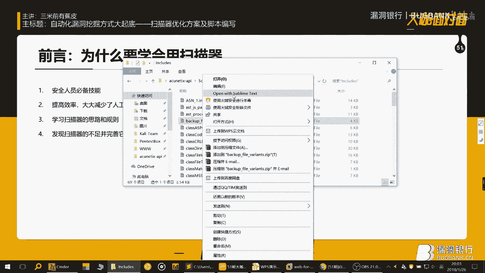

## 为什么è¦å­¦ä¹ ä½¿ç”¨æ‰«æ器？🤔


上一节我们介ç»äº†è¯¾ç¨‹çš„整体目标，本节中我们æ¥çœ‹çœ‹æŒæ¡æ‰«æ器技能的必è¦æ€§ã€‚以下是几个关键åŸå› ï¼š

1.  **作为安全人员的必备技能**：许多安全岗ä½çš„æ‹›è˜è¦æ±‚中，æ˜ç¡®åˆ—出“熟练使用æŸæŸæ‰«æ器者优先â€ã€‚
2.  **æ高工作效ç‡**：扫æ器的开å‘åˆè¡·å°±æ˜¯å‡å°‘人工检测，其扫æ速度快且ä¸çŸ¥ç–²å€¦ã€‚
3.  **学习扫ææ€è·¯ä¸è§„则**：通过研究扫æ器内置的检测规则（例如针对备份文件泄露的规则），å¯ä»¥å­¦ä¹ å‰äººçš„ç»éªŒï¼Œå¹¶ç¼–写有针对性的轻é‡çº§è„šæœ¬ã€‚
4.  **å‘ç°å¹¶å®Œå–„扫æ器的ä¸è¶³**：扫æ器å¯èƒ½å­˜åœ¨é€»è¾‘æ¼æ´æ£€æµ‹ç›²åŒºï¼Œæˆ–对国内开å‘者的习惯支æŒä¸è¶³ï¼Œäº†è§£å…¶åŸç†æœ‰åŠ©äºæˆ‘们进行补充和优化。

---

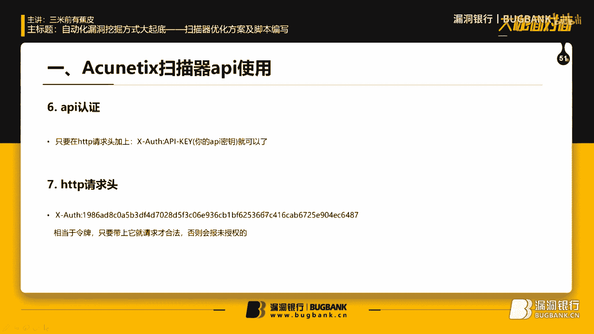

## 第一部分：调用扫æ器API编写脚本 🛠ï¸

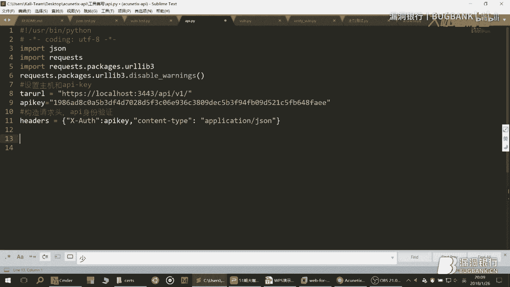

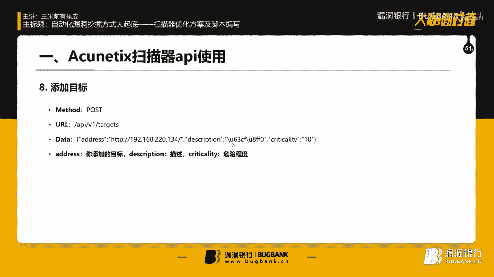

上一节我们了解了学习扫æ器的æ„义，本节中我们将动手å®è·µï¼Œå­¦ä¹ å¦‚何通过APIä¸æ‰«æ器进行交互。

在开始编写脚本å‰ï¼Œéœ€è¦æŒæ¡ä¸€äº›Python基础知识。


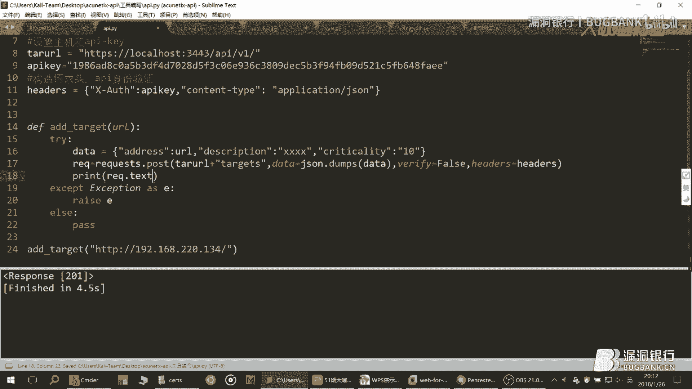

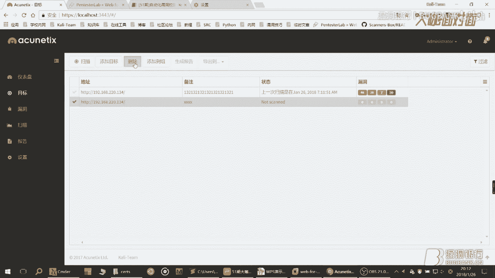

### Python基础准备

以下是编写脚本所需的核心知识：

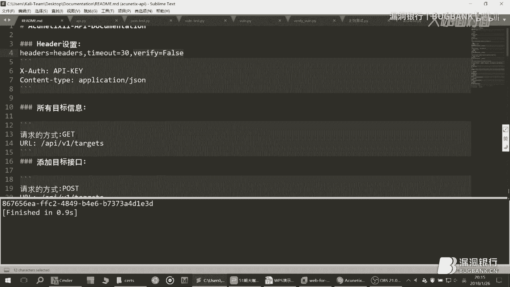

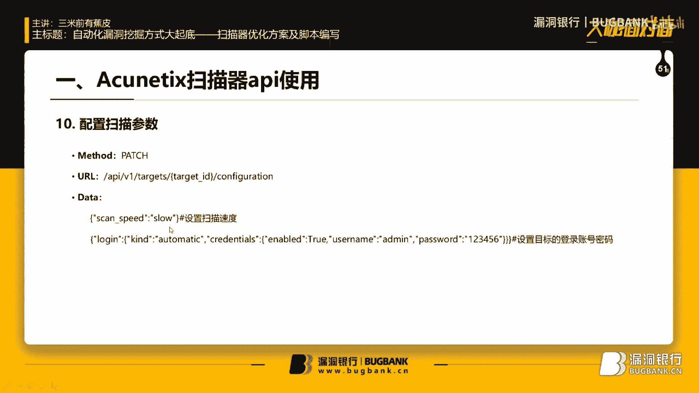

*   **列表ä¸å­—å…¸**：
    *   åˆ—è¡¨ï¼šç”±ä¸­æ‹¬å· `[]` 括起，元素以逗å·åˆ†éš”。例如：`[‘a‘, ‘b‘, ‘c‘]`
    *   å­—å…¸ï¼šç”±å¤§æ‹¬å· `{}` 括起，是键值对集åˆã€‚例如：`{‘key1‘: ‘value1‘, ‘key2‘: ‘value2‘}`
*   **JSON处ç†**：
    *   `json.loads()`: å°†JSONæ ¼å¼çš„字符串转æ¢ä¸ºPython对象（如字典或列表）。
    *   `json.dumps()`: å°†Python对象转æ¢ä¸ºJSON字符串，用äºPOSTæ交数æ®ã€‚
*   **Requests库**：用äºå‘é€HTTP请求。需è¦æŒæ¡å‡ ç§åŸºæœ¬çš„请求方法，如GETã€POSTã€PATCH。

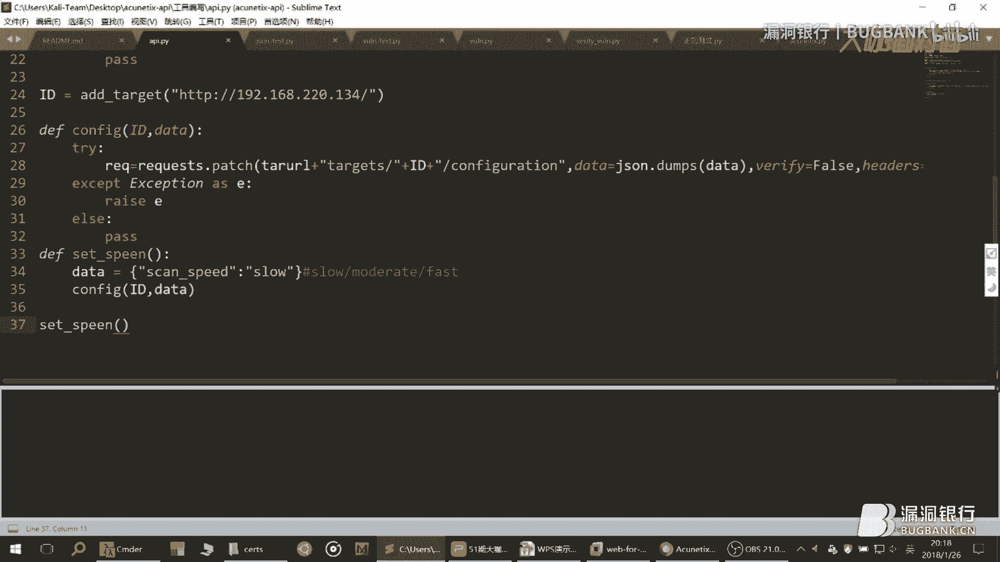

### ç¯å¢ƒä¸é…ç½®


本次演示使用的æ¼æ´æµ‹è¯•ç¯å¢ƒæ˜¯ `Web for Pen Test`。关äºæ‰«æ器（AWVS）的安装，请注æ„以下两点：


1.  若安装在远程æœåŠ¡å™¨ï¼Œéœ€åœ¨å®‰è£…时勾选“å…许远程访问â€ï¼Œå¹¶é…置好防ç«å¢™è§„则。
2.  è‹¥æµè§ˆå™¨æ示è¯ä¹¦ä¸å®‰å…¨ï¼Œéœ€è¦æ‰‹åŠ¨å¯¼å…¥æ‰«æ器自带的SSLè¯ä¹¦ï¼ˆé€šå¸¸ä½äºå®‰è£…目录下）。


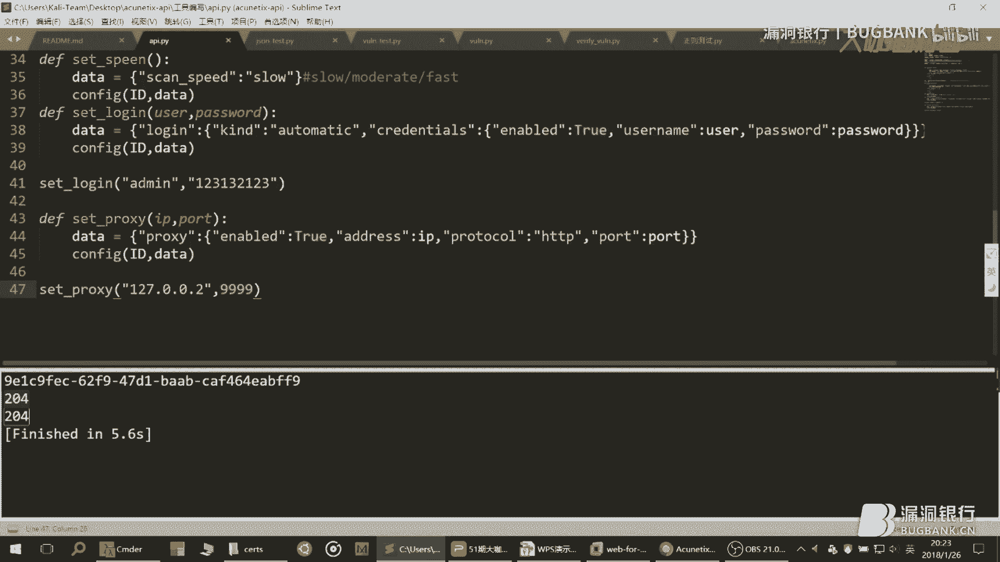

### è·å–ä¸éªŒè¯API密钥

API密钥是调用æ¥å£çš„凭è¯ã€‚


1.  在扫æ器Webç•Œé¢ï¼Œè¿›å…¥ `Configuration` -> `API Keys` 生æˆä»¤ç‰Œã€‚
2.  在HTTP请求头中，必须添加 `X-Auth` 字段进行验è¯ï¼Œæ ¼å¼ä¸ºï¼š`X-Auth: <ä½ çš„API令牌>`。


以下是一个Python请求头æ„造示例：
```python
headers = {
    ‘X-Auth‘: ‘你的API令牌‘,
    ‘Content-type‘: ‘application/json‘
}
```

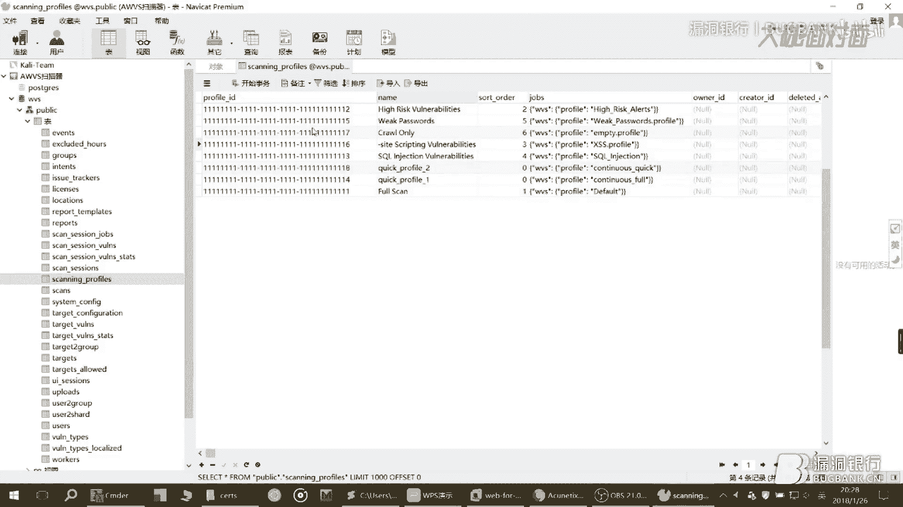

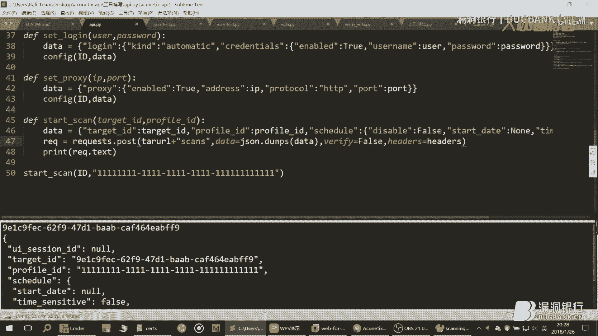


### å®è·µï¼šæ·»åŠ æ‰«æ目标

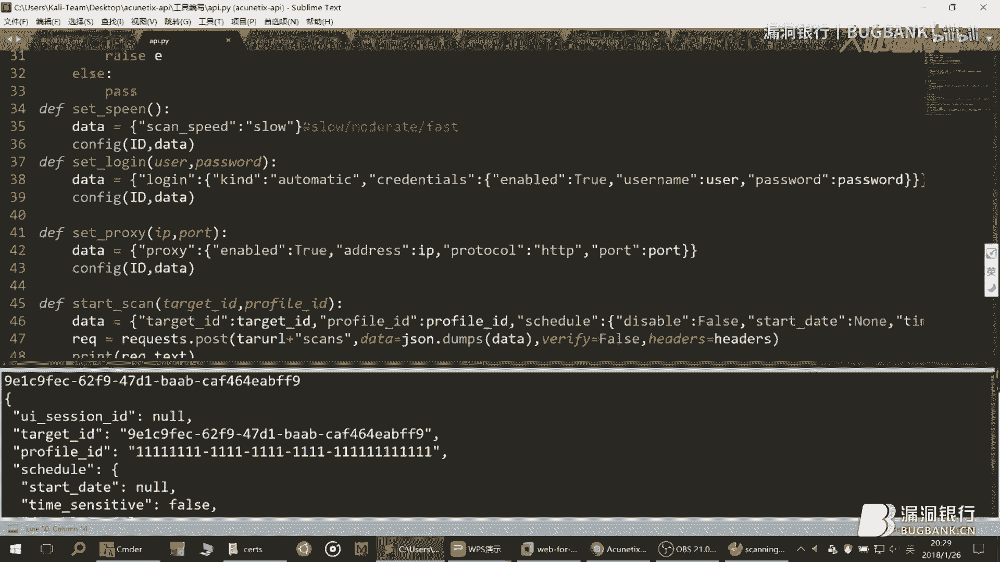

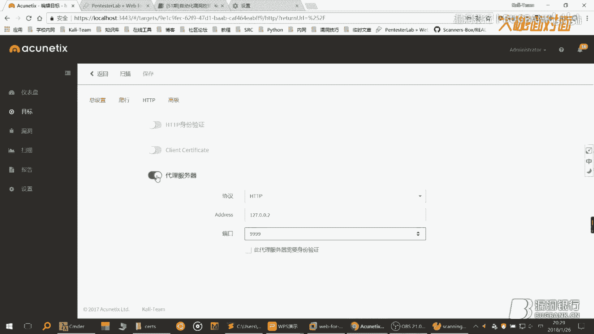

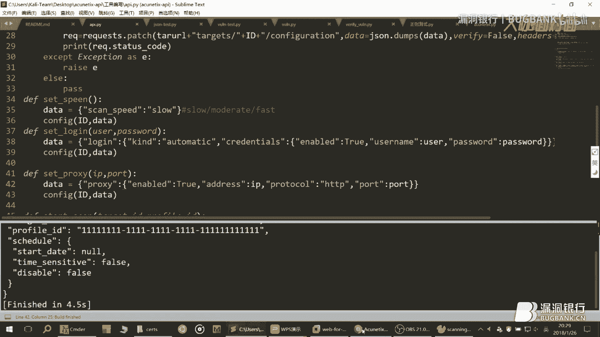

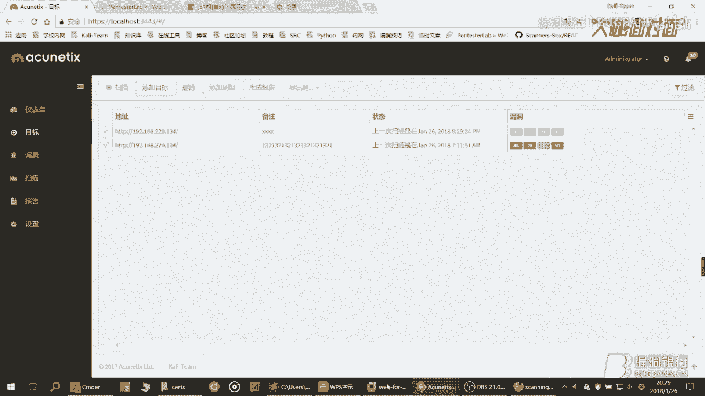

添加目标的请求方å¼æ˜¯POST，URL为 `/api/v1/targets`。


以下是添加目标的函数示例：
```python
import requests
import json


def add_target(api_url, token, target_address, description):
    url = f“{api_url}/api/v1/targets“
    headers = {
        ‘X-Auth‘: token,
        ‘Content-type‘: ‘application/json‘
    }
    data = {
        ‘address‘: target_address,
        ‘description‘: description
    }
    # 忽略SSLè¯ä¹¦éªŒè¯ï¼ˆæ ¹æ®å®é™…情况调整）
    response = requests.post(url, headers=headers, data=json.dumps(data), verify=False)
    return response.json() # è¿”å›å“应信æ¯

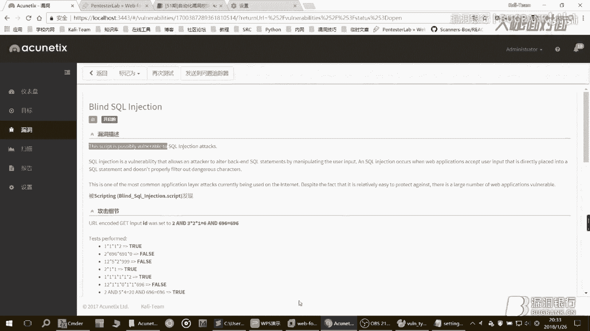

# 调用函数
result = add_target(‘https://your-awvs-host‘, ‘your-token-here‘, ‘http://test.com‘, ‘测试目标‘)
print(result)
```
执行æˆåŠŸå，会返å›ä¸€ä¸ªåŒ…å«ç›®æ ‡IDçš„JSON对象。这个ID在åç»­æ“作中至关é‡è¦ã€‚

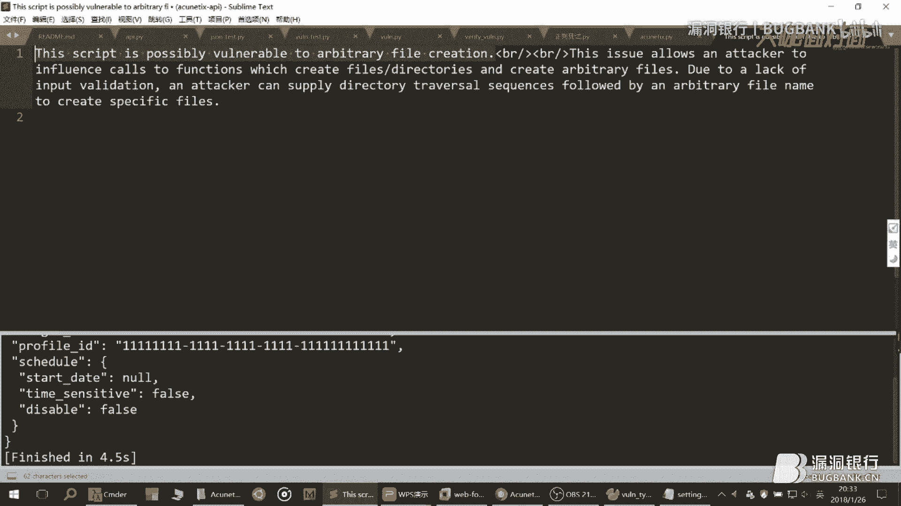


### å®è·µï¼šé…置扫æå‚æ•°


添加目标å，需è¦å¯¹å…¶è¿›è¡Œé…置，如扫æ速度ã€ç«™ç‚¹ç™»å½•ä¿¡æ¯ç­‰ã€‚

é…置请求通常使用PATCH方法，URLæ ¼å¼ä¸º `/api/v1/targets/{target_id}/configuration`。


以下是设置扫æ速度的函数示例：
```python
def set_scan_speed(api_url, token, target_id, speed):
    url = f“{api_url}/api/v1/targets/{target_id}/configuration“
    headers = {
        ‘X-Auth‘: token,
        ‘Content-type‘: ‘application/json‘
    }
    # speed å¯é€‰ ‘slow‘, ‘moderate‘, ‘fast‘
    data = {
        ‘scan_speed‘: speed
    }
    response = requests.patch(url, headers=headers, data=json.dumps(data), verify=False)
    return response.status_code # 通常æˆåŠŸè¿”å›204


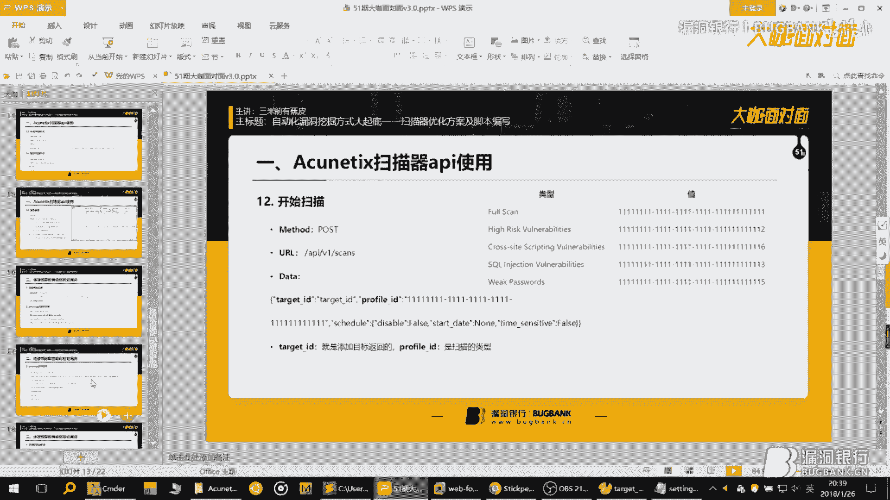

# 类似地，å¯ä»¥ç¼–写设置登录凭è¯ã€ä»£ç†ç­‰å‡½æ•°
```
**å°æŠ€å·§**：如æœä¸æ¸…楚APIæ交的具体数æ®æ ¼å¼ï¼Œå¯ä»¥ä½¿ç”¨æµè§ˆå™¨çš„å¼€å‘者工具（F12），在扫æ器Webç•Œé¢è¿›è¡Œæ“作时，äºâ€œç½‘络â€æ ‡ç­¾é¡µä¸­æŸ¥çœ‹å®é™…å‘é€çš„请求。


### å®è·µï¼šå¯åŠ¨æ‰«æ


é…置完æˆå，å³å¯å¯åŠ¨æ‰«æ。请求方å¼ä¸ºPOST，URL为 `/api/v1/scans`。

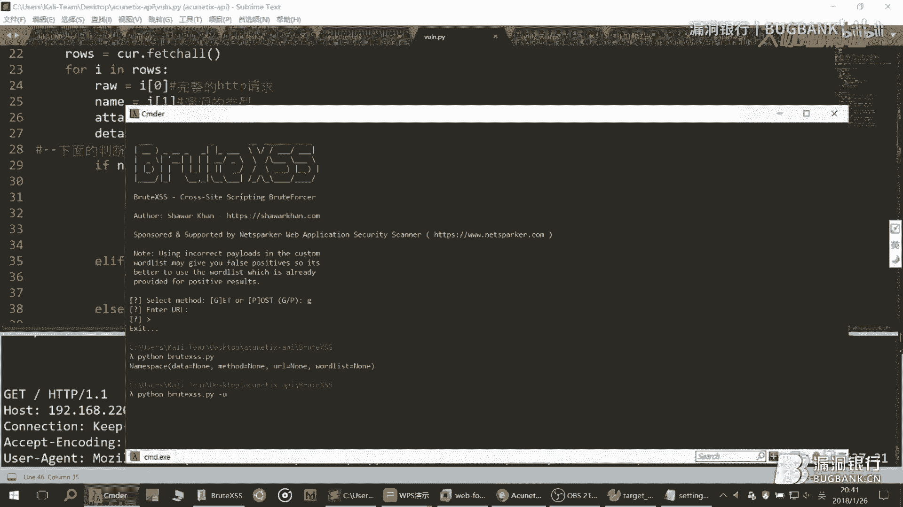

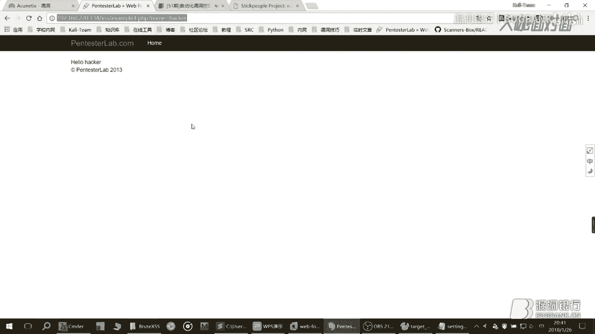

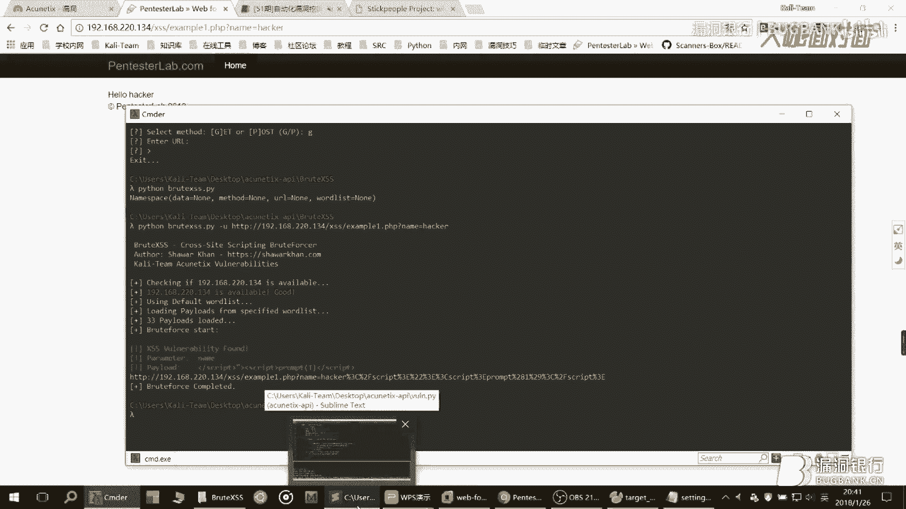

å¯åŠ¨æ‰«æ需è¦æŒ‡å®šç›®æ ‡ID和扫æç±»å‹ã€‚扫æç±»å‹ä»£ç å¯åœ¨æ•°æ®åº“或官方文档中查询，例如：
*   `11111111-1111-1111-1111-111111111111`: 完全扫æ
*   `11111111-1111-1111-1111-111111111112`: 仅高å±æ¼æ´

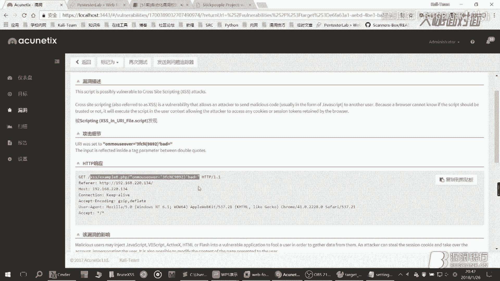


以下是å¯åŠ¨æ‰«æ的函数示例：
```python
def start_scan(api_url, token, target_id, scan_profile_id):
    url = f“{api_url}/api/v1/scans“
    headers = {
        ‘X-Auth‘: token,
        ‘Content-type‘: ‘application/json‘
    }
    data = {
        ‘target_id‘: target_id,
        ‘profile_id‘: scan_profile_id
    }
    response = requests.post(url, headers=headers, data=json.dumps(data), verify=False)
    return response.json()
```


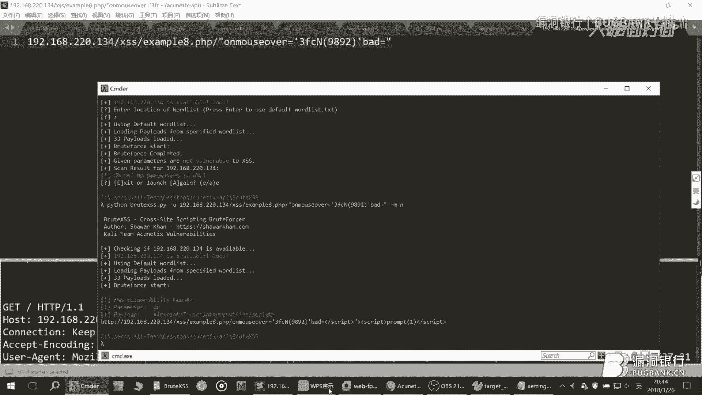

---

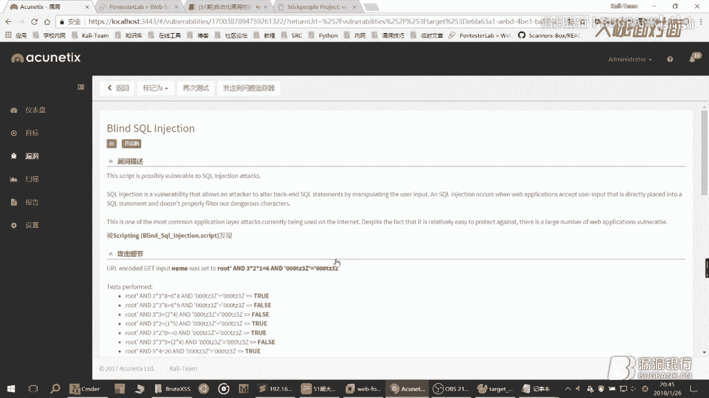

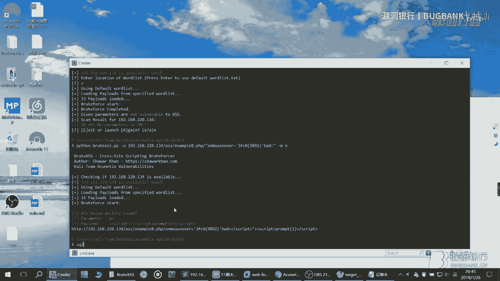

## 第二部分：扫æ器数æ®åº“的使用 🗃ï¸


上一节我们学习了如何通过APIæ§åˆ¶æ‰«æ器，本节中我们æ¥çœ‹çœ‹å¦‚何直æ¥æ“作扫æ器数æ®åº“，以更çµæ´»åœ°è·å–和验è¯æ¼æ´ä¿¡æ¯ã€‚

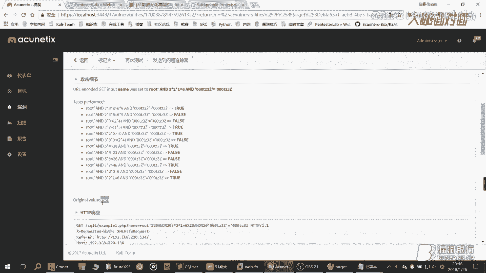

虽然API也能è·å–æ¼æ´æ•°æ®ï¼Œä½†å­˜åœ¨åˆ†é¡µé™åˆ¶ï¼ˆæ¯æ¬¡æœ€å¤š99æ¡ï¼‰ã€‚ç›´æ¥æŸ¥è¯¢æ•°æ®åº“则更为高效和全é¢ã€‚


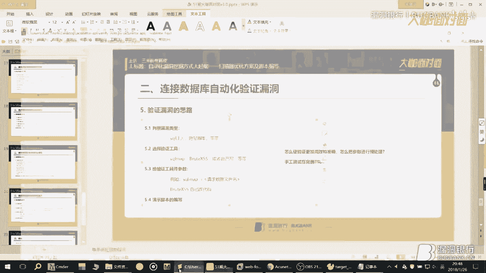

### è¿æ¥æ•°æ®åº“


扫æ器（AWVS）使用PostgreSQLæ•°æ®åº“。è¿æ¥ä¿¡æ¯å¯åœ¨å…¶é…置文件中找到。本地è¿æ¥é€šå¸¸æ— éœ€å¯†ç ã€‚


以下是使用Pythonè¿æ¥æ•°æ®åº“的示例：
```python
import psycopg2


# è¿æ¥å‚æ•°
conn = psycopg2.connect(
    database=“wvs“,
    user=“wvs“,
    password=““, # 本地å¯èƒ½ä¸ºç©º
    host=“127.0.0.1“,
    port=“5432“
)
cursor = conn.cursor()
```

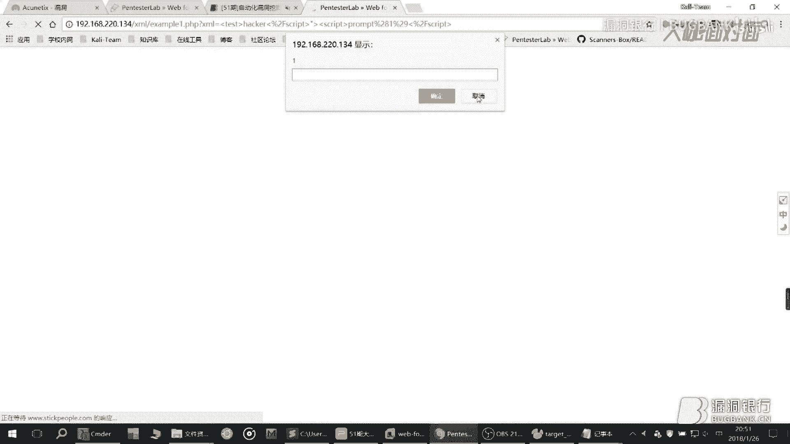

### 核心数æ®è¡¨


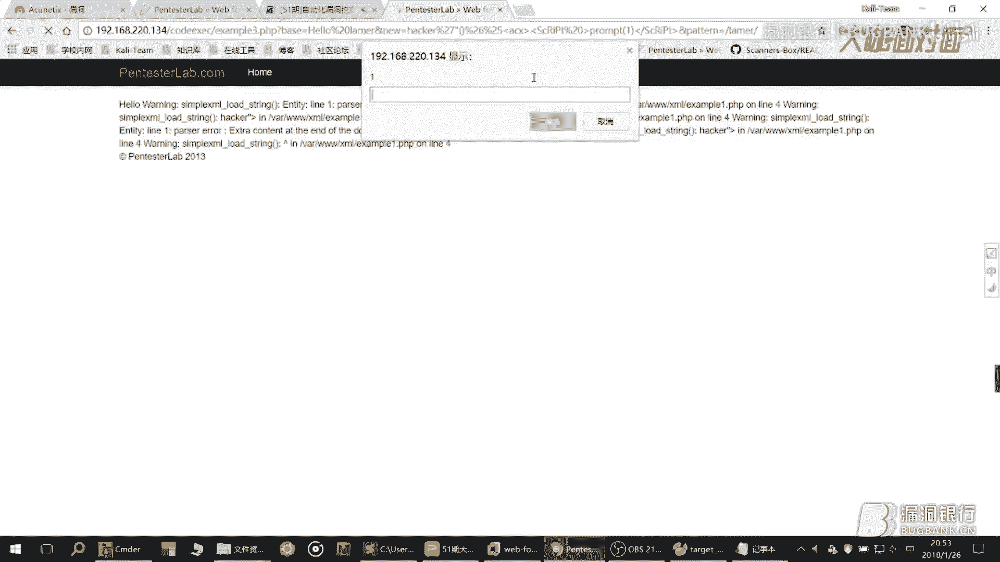

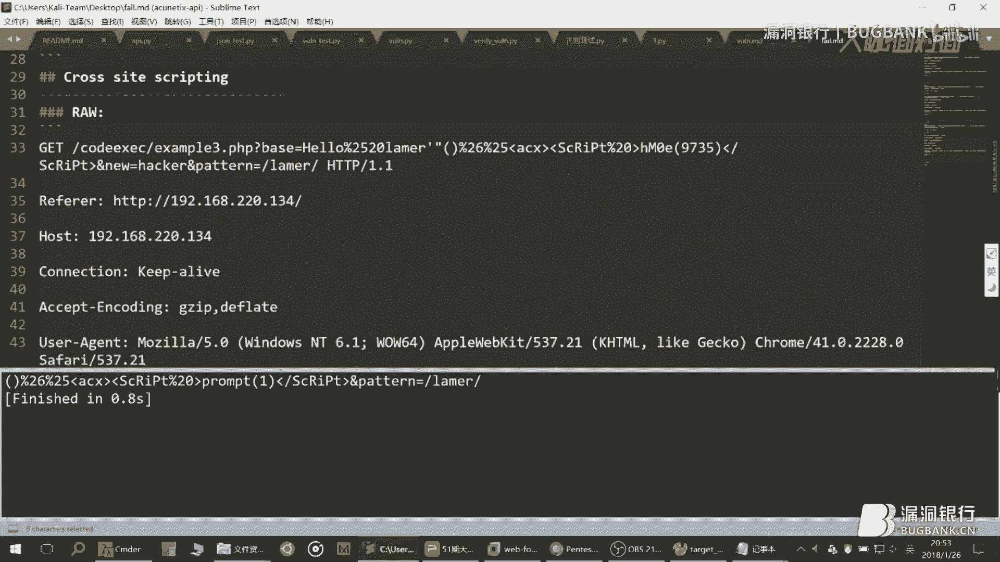

æ•°æ®åº“中有几个é‡è¦çš„表：


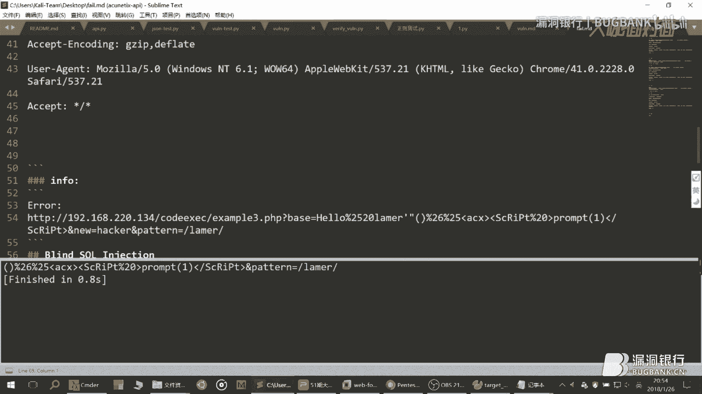

1.  **`dast_scans` 表**：存储扫æ任务信æ¯ã€‚
2.  **`vulnerabilities` 表**：**这是最é‡è¦çš„表**，存储了检测出的æ¼æ´è¯¦æƒ…，包括：
    *   æ¼æ´ç±»å‹
    *   存在æ¼æ´çš„URL
    *   攻击å‚数（`attack`）
    *   完整的HTTP请求数æ®ï¼ˆ`request`）
    *   攻击载è·ï¼ˆ`proof`）
    *   æœåŠ¡å™¨å“应（`response`）
3.  **`vulnerability_types` 表**：存储æ¼æ´ç±»å‹çš„æè¿°ã€ä¿®å¤æ–¹æ¡ˆç­‰ã€‚å¯ä»¥ä¿®æ”¹æ­¤è¡¨å†…容以å®ç°æŠ¥å‘Šæ±‰åŒ–，但需注æ„ä¿ç•™HTML标签和字符å®ä½“。

### ä»æ•°æ®åº“æå–æ¼æ´ä¿¡æ¯


ä»¥ä¸‹æ˜¯ä» `vulnerabilities` 表中æå–关键信æ¯çš„示例：
```python
# å‡è®¾å·²å»ºç«‹æ•°æ®åº“è¿æ¥ conn
cursor.execute(“SELECT url, attack, proof, request FROM vulnerabilities WHERE scan_id=xxx“)
vuln_records = cursor.fetchall()


for record in vuln_records:
    vuln_url = record[0]
    vuln_attack_param = record[1]
    vuln_proof = record[2]
    vuln_raw_request = record[3]
    print(f“æ¼æ´URL: {vuln_url}“)
    print(f“攻击å‚æ•°: {vuln_attack_param}“)
    # 进一步处ç†...
cursor.close()
conn.close()
```

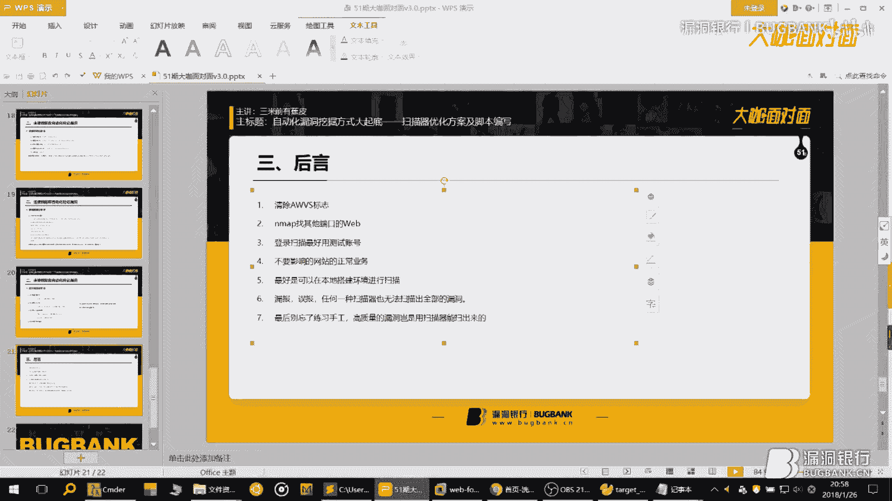


### æ¼æ´éªŒè¯æ€è·¯

è·å–æ¼æ´ä¿¡æ¯å，å¯ä»¥ç¼–写脚本进行自动验è¯ï¼Œä»¥å‡å°‘手工确认的工作é‡ã€‚

基本æ€è·¯å¦‚下：
1.  **判断æ¼æ´ç±»å‹**：根æ®æ•°æ®åº“中的æ¼æ´ç±»å‹å­—段。
2.  **选择验è¯å·¥å…·**：为ä¸åŒç±»å‹çš„æ¼æ´é€‰æ‹©åˆé€‚çš„å¼€æºéªŒè¯å·¥å…·ï¼ˆå¦‚SQLMap用äºSQL注入，XSStrike用äºXSS）。
3.  **æå–并传递å‚æ•°**：ä»æ•°æ®åº“记录中æå–工具所需的å‚数（如URLã€è¯·æ±‚æ•°æ®ã€æ”»å‡»ç‚¹ï¼‰ã€‚
4.  **调用工具并解æ结æœ**：执行验è¯å‘½ä»¤ï¼Œå¹¶åˆ¤æ–­è¾“出中是å¦åŒ…å«æˆåŠŸæ ‡è¯†ã€‚

**关键点**：对äºSQL注入，需è¦æ³¨æ„ `proof` 字段中的攻击载è·å¯èƒ½è¿‡é•¿ã€‚有时需è¦å°†å…¶æ›¿æ¢ä¸ºæ•°æ®åº“ `attack` 字段中记录的åŸå§‹å‚数值，æ‰èƒ½æˆåŠŸéªŒè¯ã€‚例如，将 `proof` 中的 `1‘ AND ‘1‘=‘1` 替æ¢ä¸º `attack` 中的åŸå§‹å€¼ `rot`。

**示例：验è¯XSSæ¼æ´**
å¯ä»¥ä¿®æ”¹ç°æœ‰XSS工具（如XSStrike），使其支æŒä»å‘½ä»¤è¡Œæ¥æ”¶å‚数，并优化其对无å‚æ•°XSS的检测逻辑。
```bash
# 修改å的工具调用方å¼
python xsstrike.py -u “http://target.com/page?msg=<script>alert(1)</script>“
```


**示例：验è¯SQL注入æ¼æ´**
将数æ®åº“中的 `request` 字段ä¿å­˜ä¸ºæ–‡ä»¶ï¼Œç„¶å使用SQLMap进行测试。
```bash
# 将请求数æ®ä¿å­˜åˆ°æ–‡ä»¶ req.txt
# 使用sqlmap测试
sqlmap -r req.txt --batch
```

### 编写自动化验è¯è„šæœ¬

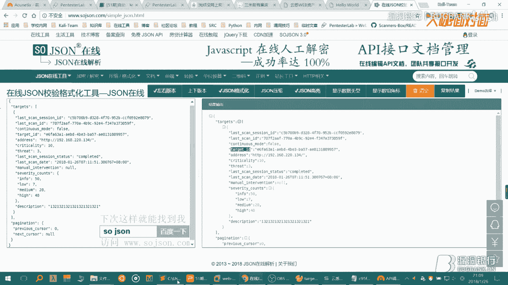

å¯ä»¥ç¼–写一个主脚本，自动完æˆä»¥ä¸‹æµç¨‹ï¼š
1.  查询数æ®åº“，è·å–æ–°æ¼æ´ã€‚
2.  æ ¹æ®æ¼æ´ç±»å‹åˆ†å‘到ä¸åŒçš„验è¯å­å‡½æ•°ã€‚
3.  调用相应的安全工具进行验è¯ã€‚
4.  将验è¯ç»“æœï¼ˆç¡®è®¤çš„æ¼æ´ã€è¯¯æŠ¥ï¼‰è®°å½•åˆ°æŠ¥å‘Šæ–‡ä»¶ä¸­ã€‚

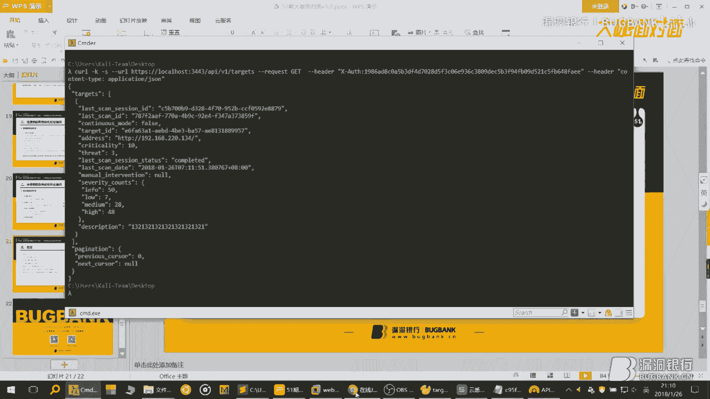

对äºéªŒè¯å¤±è´¥çš„案例，å¯ä»¥é›†æˆç»•è¿‡è„šæœ¬ï¼ˆå¦‚将空格替æ¢ä¸ºæ³¨é‡Šç¬¦`/**/`）进行二次å°è¯•ã€‚

---

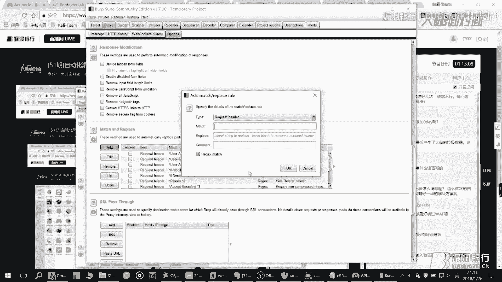

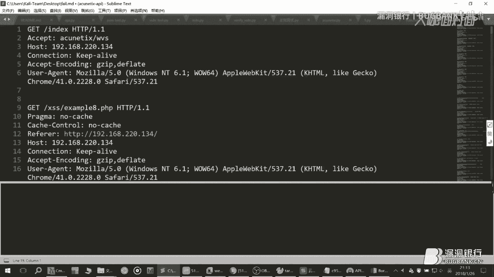


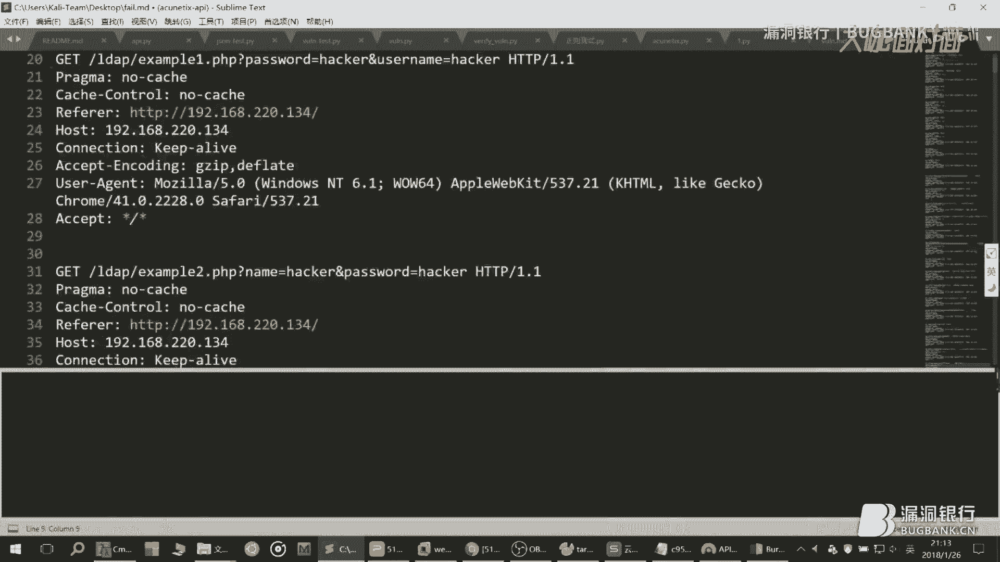

## 注æ„事项ä¸æœ€ä½³å®è·µ ğŸ“


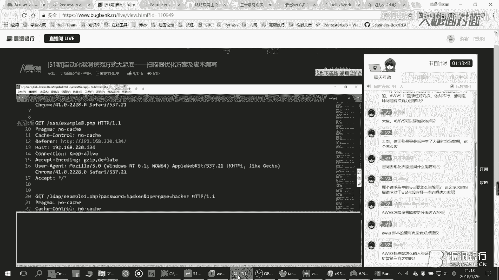

在利用扫æ器进行自动化挖æ´æ—¶ï¼Œè¯·åŠ¡å¿…注æ„以下几点：


1.  **清除扫æ器特å¾**：扫æ器å‘出的请求头中å¯èƒ½åŒ…å«ç‰¹å®šæ ‡è¯†ï¼ˆå¦‚`Acunetix`）。这些特å¾å®¹æ˜“被WAF识别并拦截。å¯ä»¥é€šè¿‡ä»£ç†å·¥å…·ï¼ˆå¦‚Burp Suite）修改或清除这些请求头。
2.  **关注é标准端å£**：ä¸è¦åªæ‰«æ80/443端å£ã€‚许多HTTPæœåŠ¡å¯èƒ½è¿è¡Œåœ¨å…¶ä»–端å£ä¸Šï¼Œå®ƒä»¬ä¹Ÿå¯èƒ½å­˜åœ¨æ¼æ´ã€‚
3.  **使用测试账å·**：如æœé…置了自动登录扫æ，务必使用测试账å·ï¼Œé¿å…爬虫对真å®è´¦æˆ·æ•°æ®é€ æˆæ„外修改或删除。
4.  **æ§åˆ¶æ‰«æ频ç‡**：é¿å…对目标网站造æˆè¿‡å¤§å‹åŠ›ï¼Œå½±å“其正常业务。设置较ä½çš„扫æ速度。
5.  **本地æ­å»ºæµ‹è¯•ç¯å¢ƒ**：如æœç›®æ ‡ç½‘站使用开æºCMS/框æ¶ï¼Œå¯åœ¨æœ¬åœ°æ­å»ºç›¸åŒç¯å¢ƒè¿›è¡Œæ‰«æ。这样速度更快，且没有WAF干扰，å‘ç°æ¼æ´åå¯ç›´æ¥åœ¨çœŸå®ç½‘站上验è¯ã€‚
6.  **ç†è§£è¯¯æŠ¥ä¸æ¼æŠ¥**：没有任何扫æ器能å‘ç°æ‰€æœ‰æ¼æ´ã€‚ä¸è¦å› ä¸ºæ‰«æ器没有报错就认为网站ç»å¯¹å®‰å…¨ã€‚高质é‡çš„æ¼æ´å¾€å¾€éœ€è¦ç»“åˆæ‰‹å·¥æµ‹è¯•ã€‚
7.  **ä¿¡æ¯æ”¶é›†**：扫æ器结æœä¸ä»…是æ¼æ´ï¼Œä¹ŸåŒ…å«æ•æ„Ÿä¿¡æ¯æ³„露（如邮箱ã€IPã€æ–‡ä»¶è·¯å¾„）。å¯ä»¥åˆ©ç”¨è¿™äº›æ•°æ®è¿›è¡Œæ›´æ·±åº¦çš„ä¿¡æ¯æ”¶é›†ã€‚

---

## 总结 ğŸ¯

本节课我们一起学习了自动化æ¼æ´æŒ–æ˜ä¸­æ‰«æ器的高级用法。


1.  **API自动化**：我们æŒæ¡äº†å¦‚何通过Python脚本调用扫æ器API，å®ç°ç›®æ ‡çš„批é‡æ·»åŠ ã€å‚æ•°é…置和扫æå¯åŠ¨ï¼Œä»è€Œå°†æ‰«æ器集æˆåˆ°è‡ªåŠ¨åŒ–工作æµä¸­ã€‚
2.  **æ•°æ®åº“æ“作**：我们学习了如何直æ¥è¿æ¥æ‰«æ器的PostgreSQLæ•°æ®åº“，ä»ä¸­æå–详细的æ¼æ´ä¿¡æ¯ï¼Œå¹¶åŸºäºè¿™äº›ä¿¡æ¯ç¼–写自动验è¯è„šæœ¬ï¼Œæ˜¾è‘—æ高了æ¼æ´ç¡®è®¤çš„效ç‡ã€‚
3.  **å®è·µæŠ€å·§**：我们æ¢è®¨äº†æ¸…除扫æ特å¾ã€å¤„ç†é标准端å£ã€ä½¿ç”¨æµ‹è¯•è´¦å·ã€æœ¬åœ°æµ‹è¯•ç­‰ä¸€ç³»åˆ—最佳å®è·µï¼Œä»¥ç¡®ä¿è‡ªåŠ¨åŒ–过程既高效åˆè´Ÿè´£ä»»ã€‚


è®°ä½ï¼Œæ‰«æ器是强大的辅助工具，但无法替代安全研究员的手工测试和深入分æ。将自动化ä¸æ‰‹å·¥æµ‹è¯•ç›¸ç»“åˆï¼Œæ‰èƒ½æœ€å¤§åŒ–挖æ´çš„深度和广度。