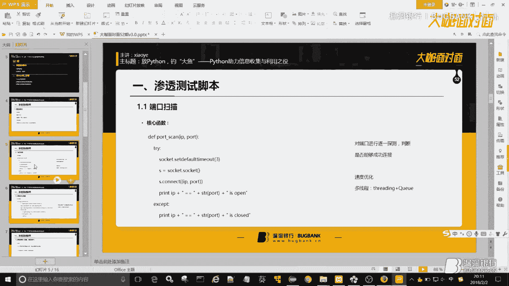
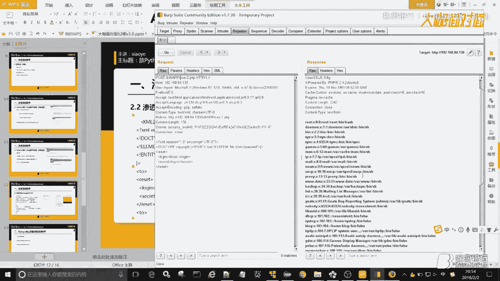
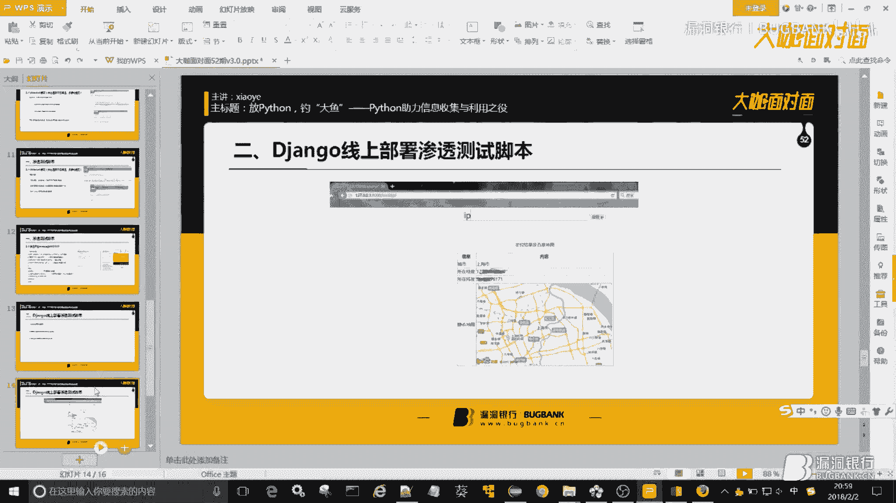
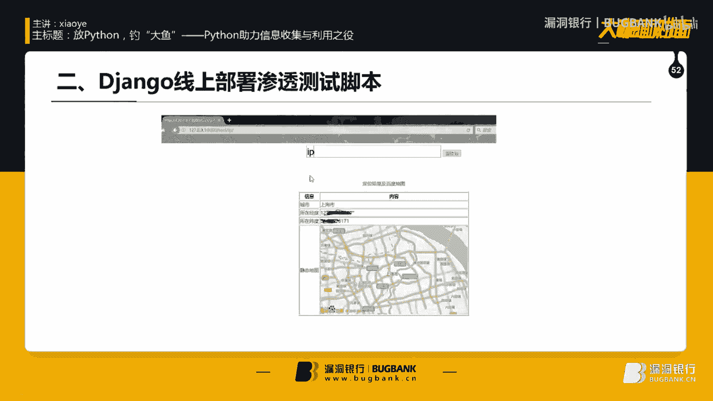

# P1：52【录屏】放Python，钓“大鱼”-Python助力信息收集与利用之役——第52期大咖xiaoye分享 - 漏洞银行BUGBANK - BV1Ft41187X7

(音樂)。

(音樂)，欢迎参加漏洞银行信息安全技术讲座，大咖面对面，今晚是咖咪的52期，我是主持人年念，今晚我们请到了农夫安全团队的核心成员小叶，给大家带来技术分享，那本期的主题是放Python钓大鱼。

Python助力信息收集与利用之义，在演讲过程当中，小伙伴们有什么问题都可以随时提出，大咖会在演讲结束后的行长问答环节来解答，大咖最初环节还会选出五位最认真听讲的观众。

送出大咖挑选的黑客攻防技术宝典web实战篇第二版一本，那话不多说，下面就让我们关门放Python，请出大咖小叶为大家一一详解吧，大家好，这一次和大家分享的这个主题是放Python钓大鱼。

Python助力信息收集与利用之义，然后这个主要是讲Python在深入测试中的一些作用，然后我们是分两大块，第一个是讲一些常用的深度测试脚本，这些脚本都是比较常见的，比较常用。

然后第二块会和大家去做一个简单的这个深度测试脚本的jongo线上部署，就是把脚本深度测试脚本去部署到这个jongo上，让我们开始今天的这个分享，然后信息收集类，在这个web深度测试中。

其实信息收集是这个挺重要的，我大概就是写了一下这些要分享这些脚本，因为脚本是非常多的，我只能挑一些就是比较有代表性的去讲一下吧，然后有端口扫描，用户采集，目录探测，IP等等这些脚本。

然后我们先从一个最简单一个脚本去看，是端口扫描，这个端口扫描脚本我们利用的是这个对端口进行逐一的探测，逐一的去连接，如果能够成功连接，我们就暂时认定为这个端口是开放的，它的核心还是在这儿。

我给大家看一下完整的那个脚本，好，这个是实现了最核心的功能，最核心的功能，但是这后来我们再说这个效率问题，这个，首先是把我们命令行传入这个域名进行一个解析，然后获得它真实的IP。

然后这个Pulse list里存放的是我们要这个探测的端口，探测的端口，然后我们写了一个Full循环去便利这个端口，然后每一个端口就去调用一遍这个Pulse scan方法，核心还是会在这儿。

也就是说这个是核心的方法，就是建立一个TCP的socket的连接，然后逐一去探测这个IP和这个端口，然后尝试去进行连接，如果就是能够成功连接，不报错的话，就打印出这个Open信息。

如果在这个连接过程中出错的话，我们就打印出这个Close的信息，我们先来简单运行一下这个脚本，因为我是在本地起的一个服务，用Apache和MySQL，我们去看一下这个本地，好。

我们看到这个脚本是已经开始运行了，有明显的卡顿，因为这个是它是逐一的去调用这个Pulse scan这个函数，所以有明显的卡顿的，我们听一下，这是它探测出来的这个像80端口是打开的，3306是打开的。

其他有一些关闭的这个端口，然后这个是可以说是实现了最基本最基础的功能，但是如果你要是真正的去放到大网段下，去扫0~65535个端口的时候，这个效率显然是不够的，所以我们可以简单的加一个多线程。

这个多线程的写法是比较经典，是，记成thread array，然后重写这个run方法，这个多线程的写法，大家可以去看一看，可以去网上看一看，记成thread array，然后重写这个run方法，然后。

我们开的这个线程数在这儿是默认是10个线程，默认是10个线程，当然你也可以自己去修改，核心的函数依然是不变的，依然是去周四尝试进行TCP连接，我们来运一下这个脚本，多线程的这个脚本。

我们看到这个现在是已经运行了，这个效率方面其实是有很大差别的，像80端口是打开，306和43都是打开的，这探测结果是一致的，但是效率方面是有挺大区别的，所以大家如果就是对一个脚本的效率不满意的话。

你可以简单的用这个threading模块，加上这个queueing对列模块去写一个这个简单多线程，然后这个是今天的第一个脚本讲的是比较简单的端口探测，然后我们看，下一个下一个这个是讲的是百度UR采集。

其实这个百度UR采集，我感觉大家应该是接触过，不过大部分应该都是一些现成的工具，就是主要用在什么方面呢，就用在这个配合ESP进行一个批量的验证啊，批量刷动之类的这些东西啊。

像之前那个我后面会讲到就是之前那个Strike045嘛，对吧，别人把POC放出来的时候，其实你可以已经已经可以去配合这个百度UR采集去写一个批量，去写一个批量，然后这个呢。

百度UR采集主要也是用到了爬虫，但是它有一个地方是有点特别的，我们来看一下这个脚本，这脚本是在这儿，然后依然是采用的多线程的写法，Queue对列加上Selign多线程。

然后这个ArgPath这个主要是进行一些命令行参数的这个优化，比如说这个-P是指定爬取的页码数，-T是指定的爬取的这个线程，是指定多线程的线程数，这个-O是指定保存文件的位置。

然后我写了一个default，就是默认保存在当前目录下的request。txt里，result。txt，然后核心函数依然是在这儿，在这儿，依然是一个典型的爬虫吧，爬虫的话，我建议大家像一般静态爬虫。

你可以用request和这个bs4去写，然后如果这个特，如果你不喜欢用这个bs的话，也可以用正则，然后我们来看一下这个，我们来看一下Python，我们来看一下这个百度有个特殊的地方。

比如说我搜索bugbank，大家注意看待会看这个左下角，左下角，这个当我点到它的时候，它显示出链接并不是说3w。bugbank。cn，它是一个3w。baidu。com link_url这么一个链接。

我们点进去，我们其实刚刚是可以看到，它是先跳到了百度的一个域名，然后再跳到了真实的这个域名，对，它是先跳到了一个3w。baidu。com这么一个一个url，所以我们需要做的是。

我们第一次用request模拟的这个发起的get请求，然后进行解析获取了这个IBL-720的链接，它并不是我们真实想获取的那个真实的url，所以我们需要对这个我们获取到链接，再进行一次模拟请求。

依然是get类型的模拟请求，然后这个请求如果返回的状态码是200的话，我们就能获得这个真实的url，就能获得真实的url，然后下面我们可以把这个结果去，保存到这个txt文件，我们来简单运行一下这个。

因为这个限程数和那个我都是已经设定好的，它是已经开始跑起来了，我们暂停一下，这个我写的是，给大家看一下，大家看这，命令行参数，我写的第一个KVAL，这个是语法，然后我指定的页码数是30。

指定的限程数是30，这个就是我配置好的这个命令行参数，大家如果就是不是用这种集成工具，是直接命令行运行的话，这些你是要加在这个命令行参数后面，然后大家看到现在是已经返回了，asp问号ID这么一种。

就是带有这个语法特征的这么一些url，然后他会去保存在当前目录下的result。txt里，方便我们以后去进行这个批量的esp进行验证，这个是和大家要说的一个地方，就是这个二次模拟请求吧。

二次模拟请求去获得真实的url，这个是百度url采集脚本，简单跟大家说一下，实际上它就是一个典型的partial，然后我们下面看一下下面这个叫，目录探测。

然后目录探测的话，其实是有比较多的方法的，这里我挑两个就是最常见的，预见大家肯定都用过对吧，预见的话，你看他那个工具里面，它是带字典的，预见是跑字典，然后去查看是否存在敏感目录和文件。

然后其实还有一个思路是，还有一个常见的思路是用那个整站parsing，然后这个功能，这个popsut里是有的，就是有时候当你去跑字典，跑不出来那个敏感的文件或者目录的时候。

你用那个你把popsut的partial打开，然后如果他爬着爬着就是蹦出了一个，类似于要要你去登录的那个框，那就需要注意是不是那个就可能是，就是敏感的后台之类的这种这种这种目录了，然后我们看一下。

先看这个跑字典类型的，跑字典类型其实大概的思路也是非常明确简单的，就是说把字典取出来嘛，每一条字典和目标的域名进行一个简单的拼接，然后依然是模拟请求查看返回状态嘛，然后深度parsing呢。

就是爬取这个整站的链接，这个待会儿给大家讲一下，然后我们看一下这个，这个是目录探测的一个教本，依然还是采用的这个threading多线程加qune堆裂的模式去写的，大家可以去百度一下这种写法。

然后在这里是把这个因为这个跑字典嘛，需要有字典，我们把字典文件去读取出来，每一条放在这个堆裂里，然后呢，在这个我们继承的threading的这个类里，然后去去去把它传传过来。

然后取出每一条取出每一条这个字典，然后和URL进行拼接，这这这一块是这个核心函数和这个URL进行拼接，然后去用request发起get类型的请求，然后查看这个返回的状态嘛，查看返回的状态嘛。

如果他的状态码是200，我们暂时先认定这是存在，然后我们就可以把它保存到这么一个，result。txt里，然后我们来跑一下这个教本，因为它是多线程的，所以速度是比较快的，这你要是单线程写的话。

速度就比较慢，然后这个结果还是会保存到，这个result。txt，我们来看一下，OK这些都是他已经探测到的，存在了一些敏感的文件或者目录，好，这就是一个典型的跑字典类型的这么一个目录探测的教本。

然后接下来我们要看的是深度爬行，就是一个简单的整栈爬虫，这个呢，是当时木克网上我记得一个一个爬虫，然后我感觉挺不错的，然后就把它下下来，然后他是分了这么几个文件去写的，这个是总的总的调度文件。

然后这个这个这个其实是我感觉是这里面最重要的，是URL管理器，是做了一些逻辑处理，逻辑处理，然后这个就不说这个是下载器，其实也就是用request去模拟请求获取源码，获取源码，这个就是一个下载器。

这个output是做最后的这个结果的可视化，把它写到一个html里，这个是无所谓的，你也可以直接把它打印出来，然后这个是解析器，就是这个依然是用的这个bs4，然后去解析A标签。

因为我们要爬的是整站的链接，对吧，我们要爬的是整站链接，所以解析A标签里的Href，然后把所有的这个Href值，然后都获取到，然后所以这都是比较常规的，比较常规的爬虫思路。

然后其实最他和普通爬虫最不一样的应该是在这，我们写单个页面爬虫的时候是不需要进行这样的逻辑处理，我们就是直接去爬去的，我们来看看它这个整站的爬虫是怎么进行这个简单一个逻辑处理，它是写了两个θ。

第一个θ是，先说一下为什么用θ，因为在python里，θ是自动去虫的，自动去虫，所以用θ是避免你以后再做这个URL去虫之类的这些东西，它写了两个θ，第一个θ是这个newurls，这个是放待爬取的。

就是将要去爬取的URL的一个θ，还有oldurls，这个是放已经爬取过的这么一个URL，为什么要就是写这两个θ，因为举个例子吧，你比如说你去爬取3w。battle。com。

你爬到链接里很有可能也存在3w。battle。com，所以说如果你不写两个θ，你会怎么办，它可能会存在一个循环爬取，就是一直在爬取这个URL，所以说我们需要把已经爬取过的URL。

就是做一个标记去放到这么一个单独的θ里，然后它后面这个逻辑处理，当我们爬取到了一个新的URL，只有当它既不在这个我们已爬取的这个URL里，也不在就是我们已经存在于这个newurls的这个θ里的时候。

我们才能把它作为一个新的URL，然后去添加到这么一个θ里，然后后面这个就比较简单了，你比如说像这个，pop出来就是弹出来一个从要爬取的这个URL的θ里，去弹出来一个URL，但是你弹出来之后。

你立马要把它放到这个已爬取的这个URL里，因为你已经弹出来过了，然后我们大家来看一下这个整站爬虫给大家运行一下，这里爬的是这个bilibili，我们来看一下，它已经开始运行了，好我们看一下。

其实大家可以看到就是说整站爬虫的话，它是去爬去整站一个链接，这个其实也可以用在什么里呢，用在那个子民扫描里，大家看它可以去爬到这个app。bilibili。com，h。bilibili。com。

包括这个show和lib这么一个简单的爬取，主要比比普通爬虫多的就是URL处理这一块，这一块的逻辑，这一块逻辑，写了两个θ，然后去进行一个简单URL判断，好，这个是目录探测，然后是代理IP采集。

这一块代理IP采集也是要分两步去进行，就是我们首先需要找到一个这个提供代理IP的网站，去用爬虫简单的单页爬虫去获取它这个上面已经存在这么一个代理IP，但仅仅这样是不够的。

因为这种提供免费代理IP的这个网站里，就是它提供的IP，其实有很多是你不能直接去作为代理IP去使用的，所以我们需要做第二步就是IP存活验证，IP存活验证，我们获取真正可用的代理IP。

然后把它放到一个文件里，然后我们可以就是可以去做一个代理IP池之类这些东西，然后我们可以看一下这个代理IP的，我们是从这么一个代理网站，有点卡，不好意思，我们是从这个希思代理这个网站上去发的。

这个网站上它是有很多这个代理IP的，但是它并不是都是可用，所以我们第一步肯定要不管它能不能用，先把它拿过来再说，所以说是在这个方法里，让方法里还是简单的用request去进行一个get类型的模拟请求。

然后用BS去解析它的这个源代码，返回的这个页面源代码，然后我们去提取出我们想要的这个IP，因为它是存在于这个我们来看一下，它是存在于这个TR标签下的TD标签，然后我们就可以去解析，先解析出这个TR标签。

然后再去解析这个TD标签，最终获取最终我们需要获取的是它的这个IP端口，以及他所使用的这个协议，这三个是必不可少的，必不可少，然后我们接着获取到了之后，需要把它送到IP存活验证的这么一个方法里。

就是去判断它是否存活，这个方法是在这，我们把这个它的类型，比如说igttp或者是igttps传进来，把他的IP传进来，然后把它端口也要传进来，要传进这个方法里，然后我们写了一个dict。

然后大家可以去百度一下这个requests里，有一个这个属性proxy，这里它是可以提供什么，就是说你把代理IP传进去，他使用代理IP的这个IP去访问，去访问网站，去访问网站，然后我们来看一下。

就是这个网站是什么情况呢，就是说你访问这个网页的时候，他会返回给你什么呢，反而给你访问这个网页时候你的IP，这样的话我们简单逻辑处理就出来了，就是怎么办呢，把代理IP放到这个process。

然后去访问这个页面，然后从这个页面的返回里去解析出这个，解析出这个IP解析出它显示的IP，如果它显示的IP就是我们的代理IP，说明我们使用代理IP的身份，去访问这个网页是成功的。

也就是说这个代理IP是有效的，我就做了一个这么一个简单的逻辑处理，然后去把它就是保存到TXT里，或者是你往后写去把它保存到这个数据库里，也是也是可以去做的，然后这个是简单的一个，IP采集的这么一个教本。

主要分两块，第一个是先把所有的IP进行获取，第二个是把所有把这个获取到的IP进行一个存活验证，其实就是判断判断就是这个网站上的IP，是不是你的代理IP，这么一个简单的方法，然后是信息收集类。

我们先讲这么多，先讲这么多，讲的都是一些比较这个常见的思路，然后我们看这个，深度测试脚本，漏洞发现和漏洞利诱，然后这个有一个要最想说的是这个，Web Shell密码爆破。

这个是最开始应该是应该是那个Torres版主，接地气表格提出来的一个思路吧，我感觉用在这个爆破上还是挺好的，它是能够做到这个速度的一个优化，跑起来还是非常快的，然后我们接着往下看，哦。

Web Shell密码爆破，首先就是和大家谈一谈这个一句话木马，它的执行原理，然后在我本地我是放了一个木马进去，对就在这儿，这是一个典型的一句话木马，一个典型的一句话木马，然后我们访问一下他。

我们一下他把这个黑客帕打开一下，OK，我们来看一下这个简单看一下这个一句话木马，其实这个学过PAP的，你应该是知道这个运行原理是怎么回事，简单和大家说一说，就是一般的话。

我们最开始学的了解就是我们要用菜刀去连接，它的密码是什么，密码就是这个POST里面写的，在这里就是小页对吧，然后菜刀连上，我们就算获取了一定的权限，其实它内部的工作原理是怎么个样子呢，我们这样看一下。

我们写一个这个Echo Ad，然后我们发现页面上是打印出来，打印出来，我们如果去尝试写一些其他东西，你会发现一个比较有意思的现象，比如说我们去写个什么呢，就写这个。

我们去执行执行一个IP Configure这个命令，有些乱码我调一下编码，OK这是一个IP Configure的命令，其实我们还可以执行一些其他的一些系统的命令，系统的命令。

那这个它到底是怎么一个原理呢，这个从PIP语法角度来看，它是去接收参数名为小页这个参数的参数值，对吧，就是这么一串这么这么这么一串字符串，然后啊，但是用POS的形式。

最后这个EVL是把它当作PIP代码去执行，就是说把你传入的传入了这么一串字符串，把它当成了PIP代码去执行，这就是为什么啊，这个@是防止报错的，这就是为什么我们用菜刀啊，我们填这个所谓的密码。

就是这个参数值，我们连接进去可以去做一些操作，其实就是这个原因啊，其实就是这个原因，因为它把我们传进去的这个字符串，去当做了PIP代码去执行，哦，然后这里用到的一个。

这个webshell包括用到的是web服务器的一个特征，像APAC它是支持1000个参数同时去提交的，同时去提交，看我这面图，也就说这种参数，我们一次一次可以提交1000个。

像RIS是可以一次接受5000多个参数去提交的，那如果啊，我们一般这个一般的这个你去爆破，下入这个密码的时候，可能都是，单线程单参数这么一种思路，最最多在加个多线程，然后这里其实我们可以去怎么办呢。

就是，啊，我们去把这个字典进行一个简单的分组，我们一次就去提交1000个提交1000个啊，一次就去提交1000个这个字典，然后我们来看一下这个脚本，这个是，webshell密码爆破的一个脚本啊。

首先这个第一个接收的参数是啊，从命令行接收，接收这个webshell的地址，然后第二个是指定指定我们的字典文件，然后我们读取了文件获取文，读取文件获取它整体的长度，然后去除以1000。

因为我们是需要去分组的，1000个一组嘛，对吧，1000个一组，然后分为这些组，每一组每一组是1000个，1000个参数，1000个参数每组是1000个参数，在这就是这个是，在这就是说你比如说是。

比如说是第一组第一组啊，那那么他就是这个i，i是从从这个到到这，因为他们之间差值是1000嘛，对吧，所以说每一组是1000个，每一组是1000个，我们把它放到这个pos的data里。

然后去进行pos的提交，一次提交1000个，然后去打印出他这个页面的一个一个返回结果，然后仅仅是这样还是不够，因为你的这个字典很有可能不是一个成不是一千的倍数，所以他肯定是会有余数。

分组完之后会有余数啊，这个余数的话，我们单独写一下在这，单独写一下在这，然后这个剩下是跟着一样了，把他们也都放到一个data里，然后用python去用这个request去模拟pos的提交，然后打印。

让我们来看一下这个，他的效率，因为我们是一次提交1000个，所以理论上来说，他是比这个单参数的是能够增速1000倍的，如果是RIS是可以增速5000倍，哦对我在那个里不用这个。

然后第一个参数是这个这个值，然后第二个我们是加的一个字典，在这里我加了一个44万的字典，我们去看一下他究竟能多久去跑完，44万的字典在这，打开比较慢，因为比较大，44万的字典。

然后我把正确的密码是放到了最后，正确密码放到了最后，我们已经开始运行了，哎，之前运行的速度是比这个快的，是我服务器的原因吗，等一下，(寶具裝置中)，(寶具裝置中)，噴射服務器的原因。

這個就全部給大家就行了，這個44萬字典，我之前測的是能夠在六七秒之內去跑完的，六七秒之內去跑完，也就是說，如果你之後遇到這個webshell密碼爆破的時候，速率不應該是一個問題了。

問題主要是在於你字典的這麼一個準確性，準確性，這個用到主要思想就是分組去提交，一次提交一千組，最後把這個餘數一起去提交，然後去進行這個密碼的這麼一個判斷，密碼的判斷，這個是webshell密碼的爆破。

主要利用的是這個可以同，啊，APA器可以同時接受一千個參數去提交，RS可以同時接受五千多個，然後我們來看一下每個這個內容，是，啊，滲透測試平台BWAPP底下的XXEE SP。

這個我會帶大家去看一個滲透測試平台，這個BWAPP肯定是有人聽說過，他和這個dvwai是差不多的，然後裡面也是他是號稱集成了一百多種漏洞。

然後比dvwai要全一些吧，我個人感覺，從這裡打開那個，哦，BWAPP是有windows版本，也有這個linux版本，我建議大家下後者，因為他的這個可以測的東西比較多。

包括像心臟低血之類這些東西都是可以去測，這個平台我感覺還是做的不錯的，就是類漏洞類型很全，比dvwai要全，如果你就是全部的就是過了一遍的話，我感覺對你整體的這個能力還是有很大提升。

然後我下了這個是虛擬機的版本，你把它調成這個net調成net，然後和你主機可以進行一個通信，比較慢。

我們先來簡單看一下這個就是XML的語法，因為這個XXEE是XML這個web實體注入，我們先來看一看，這個XML的簡單語法，第一個是聲明，聲明它的variant還有它的這個encoding。

就是編碼UTF8，然後接著是DTD就是文檔類型的定義，然後你可以去定義元素元素，就是element不是元素的意思嗎，接著去定義web實體entity，然後這個web實體是我們最需要去關注的。

因為它就是web實體注入嘛，對吧，然後接著下面是文檔元素，然後在文檔元素裡，我們去調用這個web實體去調用web實體，如果在這個web，就是XXEE就是在這個web實體這一塊做文章。

web實體這一塊做文章，然後這就是這個虛擬機的版本，虛擬機的版本，它是基於Linux的，然後我們把這個程序打開，然後這個我們主機去訪問一下，OK現在是好了，這個深度測試平台大家進去之後。

我們的這個賬號密碼是，賬號是B1，B1賬號密碼是BUG，然後大家可以進去，然後就是這些都是它的這個測試的一個模塊，就是挺多的確實挺多的，比dvwil全一些，然後我們選擇是這個，點擊進去，然後在這。

我們需要進行一個簡單的抓包，去看他這個數據傳輸，數據傳輸中有沒有什麼問題，我們點這個，然後我們發現抓到了一個POSE類型的包，而且在這裡，它是這個XML的典型寫法，典型寫法。

然後我們把它放到這個repeater裡，repeater裡，我們看它是有這三個元素，然後我們結合剛剛所學的這個，XML語法的一些知識，我們去給它構造一個惡意的web實體，在這。

剛剛我們已經講了這個基本的這個語法結構了，我們這個丟的web實體就在就在這個login，就在login，這個就是我們構造的這個web實體，我們是想要去讀取他這個ATC下的這個password。

也就是存一些用戶信息的這麼一個文件，一個文件，我們去看一下，OK，看他已經就是讀取到了這裡這個文件，讀取到這裡的文件，它是存在這個XXE的，我們可以去進行修改這裡的web實體的這個內容。

比如說我們可以去達到一個探測端口，或者是其他探測內網的端口，或者讀取一些其他的這個敏感文件，然後這個就是說，如果我們就是要去對這一次，這次工具去寫一個esp，其實也是比較簡單的，我們來看一看。

打開一下這個，其實就是先說一下，slope主要還是要模擬這個請求，對吧，因為這個XML是在數據傳輸裡，所以我們需要對這個當前目錄下這個文件，然後對他發起pause的請求，數據呢。

數據就是就是怎麼我們我們構造好這個pile的，這個寫下來應該還是比較簡單的，比較簡單，哇，我以為會在卡，OK，我們看這個esp在這，其實是比較簡單，我們看一下就是從鍵盤傳入一個pile的。

然後這個我們需要加上cookie，需要加上cookie，因為這個滲透測試平台，他是登錄過後，對吧，剛已經登錄過了，產生了一個cookie，把這個cookie更換一下，對vwi也是基於登錄後的。

所以說有時候你寫那個esp的時候，你要注意這一點，就是你模擬請求的時候，把這個，把這個cookie給帶上，然後他怎麼寫的呢，然後我們看到url不多說了，就是剛剛我們的這個BWAPPXE2。

然後這個headers，寫pile的時候建議大家在headers裡加上這個UI，然後cookie，然後data，最重要的pile是存在於data裡，然後根據我們剛剛所說。

因為我們已經知道了他的幾個這個文檔元素，比如是script，然後login，然後reset，所以我們就可以把它寫死了，寫死了，然後pile的話，我們是在這和這些其他這些東西進行一個簡單字符串拼接。

然後最終由這個request去發出這個post的請求，然後我們來看一下這個腳本運行，哎，錯了，怎麼運行到這了，OK，好，現在是這麼一個情況，那我們就去就是等待你去輸入，你想想想進行攻擊的。

比如說我們想要讀取這個etc目錄下的password文件，我們就可以這樣，我們看到他已經返回了對吧，已經返回了，我們還可以去讀取其他的一些文件，或者是探測端口，探測端口啊，探測端口。

比如說這樣簡單的去探測一下端口，就是，要輸入的時候，把這一條輸入，或者是你去探測其他的80啊，81啊，這樣之類的端口，這個可以用於就是你在內網的時候去進行一個簡單的測試，進行簡單的測試。

這個是我們講的這個XXE啊，然後接下來會給大家去看一個這個。

哦。

不用這個esp的批量，我們剛剛已經說了，已經就是簡單的把思路去說了，比如說我們最開始拿到的這個一個原始的esp，這個不是啊，應該是在，這個我記得是就是那個，045剛出來時候的一個esp吧，時間挺早的。

時間挺早的，別人寫的，這是別人寫的一個esp，然後這個你不要指望別人去給你直接放出一個批量的腳本啊，這個是就是你運行之後讓你去輸入一個網址，然後讓你輸入一個命令，他不命令執行了。

我馬上輸入一個命令去檢測，然後這個我們要想把它改造成批量怎麼改，其實最簡單最簡單的這個想法，就是配合我們剛剛的URL採集腳本，我們URL採集腳本是可以把一些就是採集的這個URL保存到文件裡的，對吧。

我們已經實現這個功能了，所以我們只需要增加一個讀取，從字典裡去讀取讀取這個URL就在這，我們打開這個txt文件，然後逐條去讀取，然後啊，每一條都去執行一遍這個poc，每一條都去執行這個poc。

但你可以把這個命令寫死，比如說寫成壞嗎之類的這些沒有危害的，這麼一種就是你測試的時候要注意注意就是就是啊，寫成這種沒有危害的一些漏洞，然後沒有危害的命令，然後去簡單的去判斷一下。

然後如果你想做的就是比較成形的話，你可以去加上這個aegopath，去進行一個這個命令行參數的處理，你比如說加一個-u後面跟你字典的這個位置，就是URL就是存在URL的這麼一個文件的位置。

然後去逐條執行這個poc，這其實就是一個簡單的PWASP，一個比較簡單的PWASP，然後我先關一下這個BWAPP。

剛剛有問這個鍵盤佈局的這個問題，鍵盤佈局我記得我當時是在哪在這吧，KBaud這兒，這兒這兒，我們先這個這樣一下，現在是成功了，反正就是在這兒在這兒，你去增加一個，我想一想在哪，在這兒增加一個，這個吧。

我記得是，對應該是這個這個，然後把它close，然後應該就可以了，然後應該就可以了，這個是這個鍵盤佈局確實是存在這個問題的，不知道為什麼，把這個關機。

然後接下來去帶大家看第二大塊是。

Jungle線上，Jungle線上部署，滲透測試腳本，這個Jungle大家，如果你學Python的話，應該是有所了解的，就算沒了解，應該也聽過，它是一個Python web框架，功能比較全。

如果你想玩那種比較，小的比較比較輕量級的，你可以去試試Flask之類的，這樣這樣其他的一些框架，然後我們會帶大家看一下這個兩個簡單的小腳本，一個是IP定位，第二個是這個在線字典的一個生成。

這個在線字典生成是不是說普通的這個社工字典，那就不用去寫腳本，就是它是根據你輸入的這麼一個域名，然後和一些其他的這個常見的一些這個弱口量去進行一個拼接，進行一個拼接。

然後它就是做成做成最後的線上的效果是。

是這樣，因為前端我沒怎麼去寫，前端我沒怎麼去寫，就做成的效果是這樣的，就是說你在線上是可以調用這個滲透測試的腳本。

然後我們來看一下，(畫面)，不要卡，(畫面)，這個就先不用了，把它擦掉，(畫面)，我現在大家來看一下，大家可以先看一下這個它內部的這麼一個分支結構，就是說在這裡我們需要關注的這幾個文件。

因為我只是簡單講一下，沒用到那個model，就是數據庫相關的，CQBG相關那個我是沒有用到，主要用到的文件是，首先你自己寫的腳本，因為你要去調用嘛，自己寫的腳本，這個是IP定位的，這個是字典生成的腳本。

這個是你需要自己完全去寫的，然後還需要用到這個vils。py，以及後面的這個settings。py，還有這個urls。py，我們來看一看，這個ipapi，這個是自己寫的腳本。

這裡我是調用了這個百度的一個ip定位，百度一個ip定位，然後把它寫成方法去，你比如說這條ip訪問之後，它會返回給你一串傳輸數據，然後你可以從中解析獲得精度，緯度以及程式。

然後還有一個百度靜態地圖的這麼一個，一條這個ipi，也就是說你給它一個精度緯度，它可以給你返回一張這個靜態地圖，這個是我們自己寫的腳本，然後就是說一下大概的這個流程，就是說你去新建了一個，一個什麼呢。

新建了一個應用APP的時候，你不要忘了把它加到這個文件，settings。py，文件夾就這兒，不要忘記把它加到這兒，我們大致的看一下這個到底是怎麼回事，我先起一下這個服務，我們起在8000端口。

這個話就是如果你想正式上線的話，正式部署上線的話，就是不要用這個RunServer之類的這些東西，就是你可以搭配Nginx，或者是UWS-GI去進行部署，在這裡我只簡單的測試一下，所以就不用那些東西。

然後我們去，防御一下，8000，OK，這是能防的成功的，可以看到就是說，我們隨便搜索一個，比如說杭州IP，隨便找一個IP，這就是一個簡單的就是你把IP放這兒，然後我去給你做一個簡單的定位。

甚至一張這個簡單簡單地圖，這是一個例子，並不是說只能寫這種教材，我們來看看它到底是怎麼回事，就是我們首先要看這個文件，URLS。py，這個裏面需要關註的是這兒，比如說我們拿這個當例子，這條。

這個是我們寫的，用鄭澤去寫的這個關於訪問的URL的一些規則，你看這個是Tool，然後IP，我們訪問的最開始訪問的也是Tool。ip，然後訪問到這個之後，他會去接著幹嘛呢，我們看到後面還有一個。

還有一個三刷，這個就是這個，我們看到這個是調用的Vios。py，Vios。py，這個Vios。py，調用的Vios。py，也就是說我們一旦訪問這條URL，就是這個這條URL，他會跳到哪呢，跳到Vios。

py裏的IP API方法，也就這個方法，他就會跳到這兒，跳到這兒之後，我們看他怎麼一個處理的流程啊，先是通過GET類型接受了一個IPVL，名為IPVL的參數，然後這個是我寫的一個默認的IP。

隨便寫了一個默認的IP，然後這個我們看到，這個是又引入的一個對吧，IP API，這個就是我們寫的這個腳本，我們自己去寫的腳本，因為我們需要調用他，讓他去幫我們完成一系列的這個動作，然後我們傳入IP之後。

到了這兒，然後他自動給我們去調用百度的API，去產生這個所在的經度緯度以及程式，然後反而給我們一張，還有這個這個參數會反而給我們一張，靜態地圖的地址，靜態地圖的地址，OK也就是說，我們現在已經獲得了。

給你給我一個IP，我傳過來已經獲得了程式，經度緯度，然後還有靜態地圖的這麼一個鏈接，靜態地圖的這個地址鏈接，然後我們把這些東西，把這些東西渲染進一個igtml文件裡，去做成可視化，在這兒。

在jango裡變量是用兩個花招的形式，這種形式兩個花招形式去寫的，我們就是把這個我們獲取到的這個結果，經過腳本處理過這個結果，去傳到這個igtml文件，就是摸，摸板裡摸板裡摸板裡的igtml文件。

然後讓他去顯示，就這麼一個簡單的思路，先是根據這個URL，確定了vios。py裡的這個函數，也就是這個，然後這個函數是調用的，我們自己去寫的一個第三方的一個腳本，然後這個腳本經過一個處理結果之後。

把結果返回給我們這個這個函數，然後到這兒，然後我們把處理過後的結果呢，去渲染進一個igtml文件裡，最終達到一個結果的可視化，這個是這樣的，我們來看一下這個，這個其實也是一樣的，都是一樣的流程。

這個腳本的話，比如說我們剛剛那個端口探測，也是可以去這樣做的，把它寫成一個方法，把結果給return過去return過去，然後我們在這個在這個，在這個vios。py這個文件裡去寫一個方法。

然後去把它這個腳本處理過的結果，去渲染進一個igtml文件裡，最後去做成可視化，我們看一下這個，這個我簡單的說一下吧，大家有興趣的話，可以去查一下這個esr-ex，這個是用於幹嘛呢。

是可以生成一些這個字典，根據自定義的規則生成一些字典，根據自定義的規則生成一些字典，比如說我把配置文件寫在這兒，寫在這兒，就說什麼呢，我們就是和一些常見的這個常見的，比如說年份啊。

或者是你寫的常見的弱口律啊，和他們進行一個簡單的組合，簡單的組合，就這個模塊，這個模塊大家有興趣的話，可以去百度一下，然後還是一樣，我們把最後的處理結果寫成return，return回哪呢。

return回這兒，return回這兒這個方法裡，這個方法裡，然後結果我們已經獲取到了，最終還是要把它渲染進，模板裡的這麼一個IPML文件裡，這顆，在這兒，在這兒，然後我們來看一下這個。

這個如果你不加不加這個域名的話，它會自動返回給你一些常見的字典，這個是你寫在一些文件裡，然後比如說，比如說我給個域名，把個bank。cn，我想要生成和它相關和這個域名相關的字典，點擊一下，啊。

對已經生成好了，已經生成好了，下面是下面這個就是所顯示的結果是和你自己的制定的這些規則是有關的，比如說我們剛剛這個配置文件裡，我們換一種寫法，它生成是完全不一樣的東西，然後看它生成了這些，生成了這些。

然後啊，剛剛其實講的那些深度測試腳本，大多數也都是可以按這種模式去給你去去這個直接部署到這個，簡單的部署到這個jangle上面，如果你想正式部署上線的話。

需要結合一些Nginx或者UWS+i之類這些東西，這個模塊在這個字典生成也還挺好用的，然後建議大家去百度一下用法，這裡也沒時間具體去講一下這個用法，然後今天的分享就到這兒吧，好嘞。

那感謝小葉大咖的細緻講解，這場Petson助力信息收集與利用的戰鬥圓滿成功，那下面就讓我們收拾心情，進入到下面的行長問答環節，大家在聽講過程當中產生的疑惑，或者實際測試當中遇到的困難都可以提出。

曾叔再向你們招手啊，文這句是什麼意思啊，運行腳本後的結果能保存到文當中嗎，這個是就是你如果要保存到，你想把這個結果保存到一個比如說TXT文檔，你是要自己去寫的。

像剛剛我們這個是你比如說你寫個without，等一下不好意思啊，我把那QQ關了，就是說，我把那QQ關了，就是說你需要自己去寫啊，就是說比如說剛剛的那個，with什麼什麼點Open。

然後後面你可以寫寫那個寫你保存的這個路徑之類的這些東西，就是我現在文件打開了，你看這一段剛問那個文件就是結果能不能保存呢，你得自己去寫啊，自己去寫，他不會說自己去給你保存的，你看這個withopen。

這個就是你打開一個TXT文件，然後A是追加的去寫追加的去寫，追加去寫，然後這個是文件的位置，這是文件的位置追加去寫，然後這裡寫的是F。write，這個就是這個就是把這個結果寫進文件裡寫進文件裡。

這個是需要你自己去寫的，就是自己去實現文件的讀取，這個如何限制別人用Patchome，啪取自己的網站信息，你比如說你可以簡單的簡單的來說，第一個，你是要判斷UI頭判斷UI頭，這就是我剛剛說的。

為什麼就是我們寫Patchome的時候，要加上這個headers，然後加上一些常用的這個這個東西，還可以對一個IP的這個發起請求的這個頻率進行一個限制，這些都是方法都是方法，然後，看一看。

這麼多庫都是怎麼學的，按照開發的項目來學，還是先把庫都學一遍再寫，Patchome的第三方庫其實非常非常非常非常多的，你要說把它都學一遍再寫，我感覺不是很現實，就是說最最高效的方法是什麼。

我感覺是你用到了，你去查那個文檔，你去查那個文檔，然後就是能把它先能把它寫出來，後面再去深入的去了解深入的去了解，WebShare，這個我好像沒說啊，這個我是只給只給你們提供一個方法，就是怎麼回事。

我用嘴說的，就是說還是用那個request去模擬請求，模擬請求，因為被安全給我攔截，它有一個特征，它會返回給你什麼，它的返回頁面裡有一個那個什麼頁面，然後上面顯示網站網址之類的對吧。

然後你把這個作為特征，你把你所有想要測試的pilot都寫進一個txt裡，然後用python去讀取，挨個去讀都讀過來，然後每一條珠條去發起請求，然後你判斷頁面的返回頁面的返回啊。

如果它不帶有這個網站防火牆的字眼，那就說明這個pilot你是成功的，如果它說就是返回的結構裡帶有這個網站防火牆之類的這些字眼，也就是說你這個其實已經被攔截的，就是這麼一個簡單的思路。

批量爆破不會被當成cc嗎，這個問題你控制一下那個，你比如說那個現成數，現成數cc的效果就是我感覺你不要不要現成，不要開太大，基本上不會有什麼問題的，啊，這個web shell腳本操作性不大。

掛了之後需要知道路徑，有了這兩個才能夠。

對這個其實，哦，等一下，這個說的是對的。

這個說的是對的，我們首先就是需要知道這個web shell的這個，這個地址才能去進行爆破，至於怎麼知道這個web shell的地址，我們前期做信息蒐集的時候，是需要去做這個目錄探測的對吧，目錄探測裡。

你比如說你發現了tester。pip，你訪問之後是一片空白，那你你的直覺其實是告訴你，這有可能就是一個這個，有可能就是前人留下的一個web shell，這個怎麼說呢。

還是要看你能不能正確的去找到這麼一個路徑吧，然後，還有什麼問題呢，Scape啊，這個庫我沒怎麼去看，就是我平時寫靜態爬蟲，基本上就是request，然後鄭澤模塊。

然後bs裡的bill of solve去解析，然後基本上是這樣的，靜態爬蟲這個我沒怎麼去看，然後這個jungle，請問這種後台怎麼蓋的，對於這種就是別人已經做好這個web框架，你去找一下這個。

只能說去找一下這個已知的這個漏洞了，就是我記得前陣子是爆過的，jungle這個漏洞是爆過的，爆過一些漏洞的，你看一下那個他們的漏洞詳情，然後試試能不能複現，因為要是你自己去。

你自己去拿著拿著他再去白盒審計一遍，我感覺有點困難，有點困難，還有一個問題是，很多都是和庫相關的，對，其實這是這是Python的一個優勢，就是說你幹什麼，都基本上都有都有一個庫，就很方便。

有很多庫是不知道該如何去尋找去學習，這個的話，我記得網上是有一些就是類似常用的庫吧，我記得是有一個叫什麼網，玩蛇網還是什麼之類的，就是就是說你寫腳本是怎麼去寫，就是你想實現這個功能，你想實現這個功能。

你去看看網上有沒有一些就是現成的這個腳本，然後你看一看看一看，然後就是或者你去翻一下那個文檔，然後看看上面有沒有實現這種功能的庫吧，就是說基本上不會有太太偏的，怎麼怎麼怎麼酷的這個存在。

就說你能想去實現了，基本上基本上前人基本上是有實現過的，基本上我寫這個腳本是有這種感覺的，就說我剛才講的那些腳本，其實早就已經被人實現不知道多少遍了，然後模仿去寫吧，這個，然後還有什麼問題嗎。

覺得時間也差不多了，感謝小葉的耐心解答，也給小夥伴踴躍的提問點贊，好，大家認真提問過後，下面就進入我們的大咖贈書環節，究竟誰能幸運獲得這本大咖精心挑選的黑客工坊，技術寶典web實戰篇呢。

那小葉選擇權就交給你了，我剛選的是北風飄然，對是吧，北風飄然，今天的幸運觀眾就是北風飄然，那恭喜你獲得黑客工坊技術寶典web實戰篇的第二版本，只要你在相應的區域留下正確的收穫信息。

我們會盡快將書籍寄出，Person這個大寶貝，你們的大魚也快要上鉤了，那今天的咖面到這裡就全部結束了，再次感謝大咖小葉的認真準備，也感謝小夥伴們的積極參與，大咖面對面，週五八點見。

下週五晚也就是年前最後一次，大咖面對面，我們再相聚吧，(音樂播放)。

(音樂播放)，(音樂播放)，(音樂播放)，(音樂播放)，(音樂播放)，(音樂播放)，(音樂播放)，(音樂播放)，(音樂播放)，(音樂播放)，(音樂播放)，(音樂播放)，(音樂播放)，(音樂播放)。

(音樂播放)，(音樂播放)，(音樂播放)，(音樂播放)，(音樂播放)，(音樂播放)，(音樂播放)，(音樂播放)，(音樂播放)，(音樂播放)，(音樂播放)，(音樂播放)。

