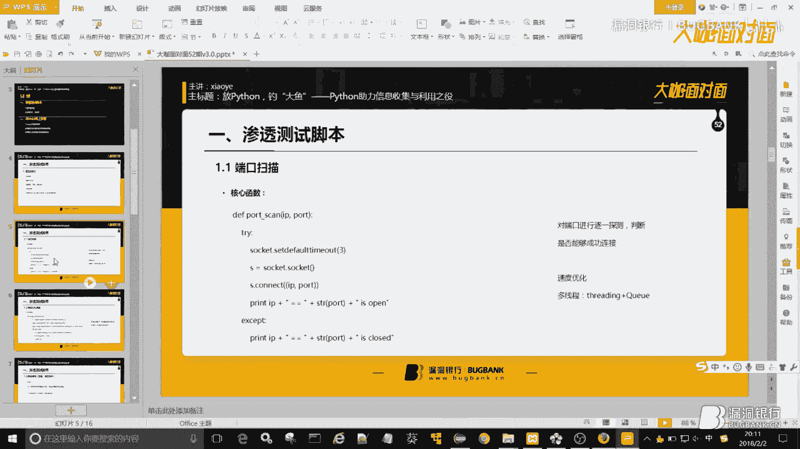
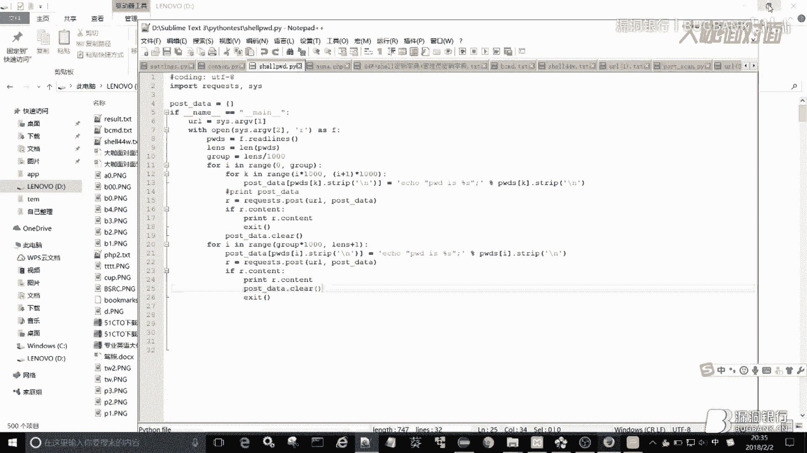
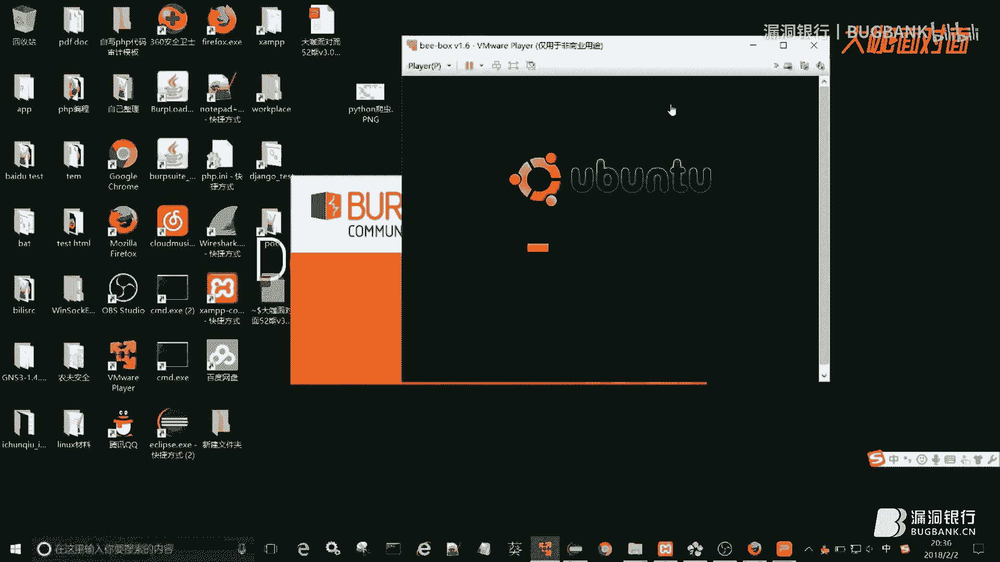
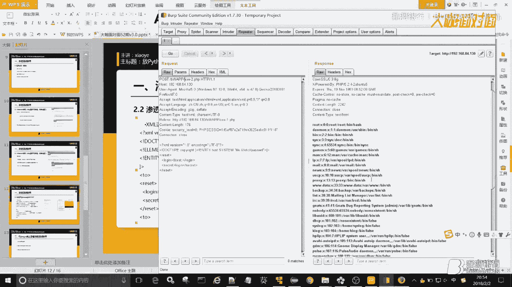
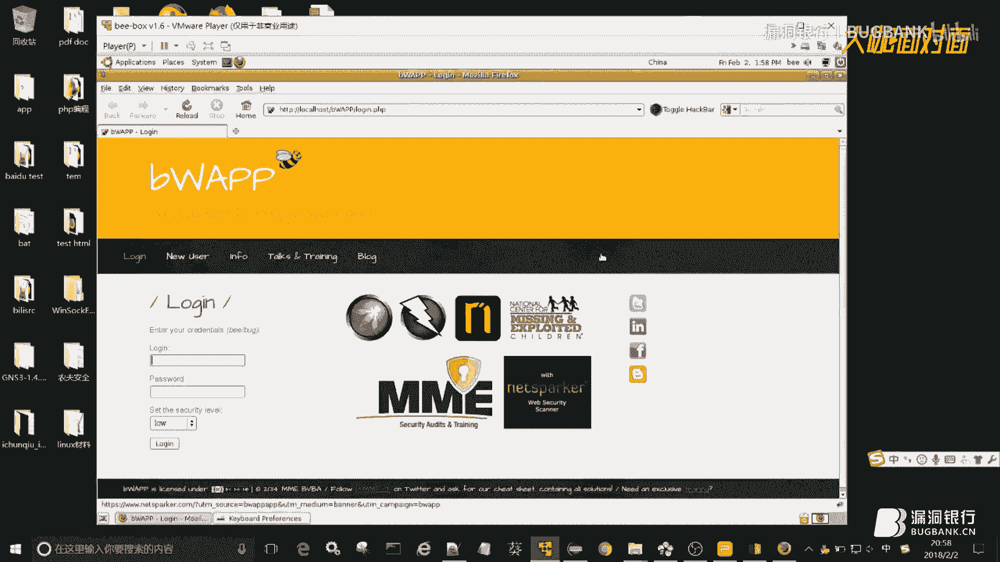
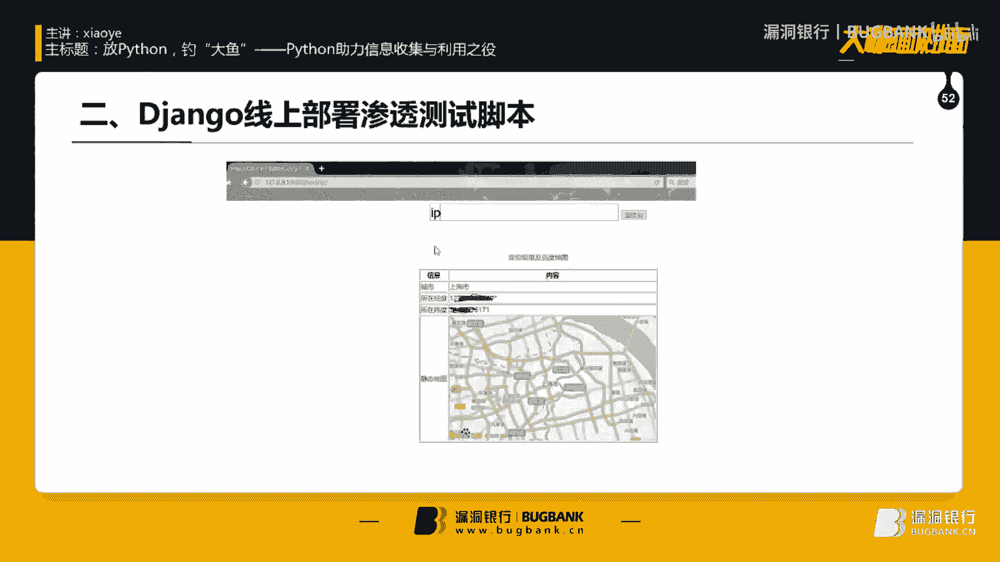

# 课程P1-52：放Python，钓“大鱼”——Python助力信息收集与利用之役 🐍🎣


在本节课中，我们将学习如何利用Python编写脚本，辅助进行信息安全领域的信息收集与漏洞利用。课程内容分为两大板块：一是介绍渗透测试中常用的Python脚本，二是演示如何将脚本部署到Django框架中，实现线上化工具。

---

## 第一部分：信息收集类脚本

信息收集是Web渗透测试中至关重要的一环。本节我们将介绍几个代表性脚本，包括端口扫描、URL采集、目录探测和代理IP采集。

### 1. 端口扫描脚本

端口扫描用于探测目标主机开放了哪些网络端口。其核心原理是尝试与目标IP的指定端口建立TCP连接。

**核心代码公式**：
`socket.connect((ip, port))`

我们从一个最简单的单线程脚本开始。它逐一尝试连接端口列表中的每个端口。




```python
import socket

def port_scan(ip, port):
    try:
        s = socket.socket(socket.AF_INET, socket.SOCK_STREAM)
        s.settimeout(1)
        s.connect((ip, port))
        print(f"[+] Port {port} is open")
        s.close()
    except:
        print(f"[-] Port {port} is closed")
```

然而，单线程扫描大量端口时效率低下。为了提高速度，我们可以引入多线程技术。

**多线程改进思路**：
继承 `threading.Thread` 类并重写 `run` 方法，结合 `queue.Queue` 管理任务队列。默认开启10个线程并行扫描，效率显著提升。

### 2. 百度URL采集脚本

此脚本用于从百度搜索结果中批量采集真实URL，常用于后续配合漏洞POC进行批量验证。

**核心步骤**：
1.  模拟搜索请求，获取百度跳转链接（如 `www.baidu.com/link?url=...`）。
2.  对跳转链接发起**二次模拟请求**，以获取最终的真实目标URL。
3.  将采集到的URL保存到文件（如 `result.txt`）中。

脚本同样采用多线程架构，并支持命令行参数指定爬取页码、线程数和输出文件。

### 3. 目录探测脚本

目录探测旨在发现网站存在的敏感目录或文件。主要有两种常见方法。

**方法一：字典爆破**
读取预定义的字典文件，将每条路径与目标URL拼接，然后通过HTTP请求的状态码（如200）判断是否存在。

**方法二：深度爬取（整站爬虫）**
爬取网站所有链接，可用于发现字典中未包含的隐藏路径或子域名。其关键在于URL去重处理。

**URL管理逻辑**：
使用两个集合（`set`）：
-   `new_urls`: 存放待爬取的URL。
-   `old_urls`: 存放已爬取过的URL。
每次发现新链接时，仅当它既不在 `old_urls` 也不在 `new_urls` 中时，才将其加入 `new_urls`，从而避免循环爬取。

### 4. 代理IP采集脚本

获取可用的代理IP需要两个步骤。

**步骤一：IP获取**
从提供免费代理的网站（如“西刺代理”）爬取IP、端口和协议类型。



**步骤二：IP存活验证**
核心思想是使用 `requests` 库的 `proxies` 参数配置代理，然后访问一个能返回客户端IP的网站（如 `http://httpbin.org/ip`）。如果返回的IP与我们配置的代理IP一致，则证明该代理有效。



**验证逻辑代码**：
```python
proxies = {‘http‘: f‘http://{ip}:{port}‘}
resp = requests.get(‘http://httpbin.org/ip‘, proxies=proxies)
if ip in resp.text:
    print(f“有效代理IP: {ip}:{port}“)
```

---

上一节我们介绍了信息收集的几种实用脚本，本节中我们来看看如何利用Python进行漏洞发现与利用。

## 第二部分：漏洞发现与利用脚本

### 1. WebShell密码爆破脚本

此脚本利用Web服务器（如Apache、Nginx）支持一次性接收多个POST参数的特性，大幅提升爆破速度。




**一句话木马执行原理**：
以PHP为例，`<?php @eval($_POST[‘password‘]);?>` 会执行POST参数 `password` 的值作为PHP代码。连接工具（如菜刀）的本质就是向此参数传递特定的代码字符串。

**效率优化思路**：
-   Apache通常支持单次提交约1000个参数。
-   Nginx支持更多。
-   传统爆破一次提交一个密码，而我们可以将密码字典按1000个一组进行分组，一次HTTP POST请求提交一整组密码。
-   处理完所有完整分组后，再单独提交剩余的零散密码。


这样，理论上比单次提交提速近1000倍。脚本核心在于对字典进行分组，并构造包含大量键值对（如 `password1=xxx&password2=yyy...`）的POST数据。




### 2. XXE漏洞利用脚本




以渗透测试平台BWAPP中的XXE漏洞为例。XXE（XML外部实体注入）发生在应用程序解析XML输入时。

**基础XML语法回顾**：
```xml
<?xml version=“1.0“ encoding=“UTF-8“?> <!-- 声明 -->
<!DOCTYPE root [ <!-- DTD定义 -->
  <!ENTITY xxe SYSTEM “file:///etc/passwd“> <!-- 定义外部实体 -->
]>
<root>&xxe;</root> <!-- 引用外部实体 -->
```

**漏洞利用**：
在BWAPP的登录请求中，我们发现其传输的数据为XML格式。通过抓包修改，在XML中插入恶意的外部实体定义，可以读取服务器文件（如 `/etc/passwd`）或探测内网端口。

**编写EXP脚本**：
脚本需要模拟登录后的POST请求，并在数据包中插入构造好的恶意XML载荷。注意需要携带有效的会话Cookie。

### 3. POC批量验证脚本

当获得一个针对单个目标的漏洞POC后，可以将其改造成批量验证工具。

**改造方法**：
1.  使用之前介绍的URL采集脚本，将目标URL保存到文件（`urls.txt`）。
2.  修改原POC脚本，使其从 `urls.txt` 中逐行读取URL。
3.  对每个URL执行一次POC检测逻辑（通常使用无害的命令进行验证）。
4.  可以增加命令行参数处理（如 `-u url_file`），使脚本更通用。

---


## 第三部分：Django线上部署渗透测试脚本 🚀

我们可以将写好的Python脚本集成到Django框架中，构建一个简单的在线渗透测试工具平台。本节以IP定位和在线字典生成为例。

**Django项目基本结构**：
-   `views.py`: 处理业务逻辑，调用我们写的脚本。
-   `urls.py`: 定义URL路由规则。
-   `settings.py`: 项目设置，需注册新建的APP。
-   `templates/`: 存放HTML模板文件。
-   自定义脚本文件：如 `ip_api.py`, `dict_gen.py`。

**部署流程示例（IP定位）**：
1.  **编写功能脚本** (`ip_api.py`)：调用百度IP定位API，返回经纬度、城市及静态地图链接。
2.  **配置URL路由** (`urls.py`)：将特定URL（如 `tool/ip/`）映射到 `views.py` 中的处理函数。
    ```python
    urlpatterns = [
        path(‘tool/ip/‘, views.ip_api),
    ]
    ```
3.  **编写视图函数** (`views.py`)：接收前端传递的IP参数，调用 `ip_api.py` 中的函数获取结果，并将结果传递给HTML模板进行渲染。
    ```python
    from . import ip_api
    def ip_api(request):
        ip = request.GET.get(‘ip‘, ‘8.8.8.8‘) # 获取参数，设置默认值
        result = ip_api.get_location(ip) # 调用自定义脚本
        return render(request, ‘ip_result.html‘, {‘result‘: result}) # 渲染模板
    ```
4.  **创建模板** (`ip_result.html`)：使用Django模板语法（`{{ result }}`）展示返回的数据和地图图片。
5.  **运行与部署**：开发时使用 `python manage.py runserver` 测试。正式上线需搭配Nginx和uWSGI/Gunicorn等WSGI服务器。


**在线字典生成**：
原理类似，调用 `exrex` 等库根据自定义规则（如结合域名、常见弱口令、年份）生成字典，并通过Django前端展示结果。

---

## 课程总结


本节课我们一起学习了Python在渗透测试中的多种应用：
1.  **信息收集**：掌握了端口扫描、URL采集、目录探测和代理IP验证脚本的编写思路与优化技巧（如多线程）。
2.  **漏洞利用**：理解了WebShell密码爆破的效率优化原理、XXE漏洞的利用方法，以及如何将单个POC改造成批量验证工具。
3.  **脚本部署**：了解了如何将功能脚本集成到Django框架中，实现Web化、在线化的渗透测试工具。


通过本课程，希望你能够举一反三，将Python编程能力灵活运用到实际的安全测试场景中，提升工作效率。