# P1：53【录屏】年前放大招！看实战getshell新姿势-SSRF漏洞利用与getshell实战——第53期大咖Whysec分享 - 漏洞银行BUGBANK - BV1Ft41187yt

这个电话好像是用来电话的，为知识而存 因技术而生。

小伙伴们大家晚上好，欢迎参加漏洞银行信息安全技术讲座，大咖面对面，今晚是咖面53C，我是主持人年念，本期我们请到了安全公司渗透测试工程师，Yshak，给大家带来技术分享，本期的主题为，年前放大招。

看实战get share新姿势，SSRF漏洞利用与get share实战，在演讲过程当中，小伙伴们有什么问题都可以随时提出，大咖会在演讲结束后的行长问答环节来解答，今晚大咖赠书环节会选出一位幸运观众。

送出大咖挑选的Person黑帽子，黑客与渗透测试编程之道一本，话不多说，下面请出大咖Yshak，让我们get share就现在，大家好，我是本期大咖Yshak，今天主要给大家讲解一下。

SSRF漏洞利用与get share的实战，今天我主要分为四个讲解给大家讲解，第一个是什么地方最容易出现SSRF，第二个是本次案例我们是基于CORO，所产生的SSRF进行一个测试，第三个就是。

我们本地搭了一个Diskard论坛，利用SSRF漏洞加radius进行反弹，第四个就是简单的介绍一些SSRF图片的绕过。

因为前期已经有大咖讲过SSRF了，这里我就不再对SSRF基础做一些讲解了，我就直接讲正题，首先的话给大家讲一下，就是什么地方最容易出现SSRF，算是一些小经验，第一个是IDC产商云服务器产商是比较多的。

因为云服务器产商会有各种网站连接，或者说网站响应测试，让你去请求网站，看它是否正常，是不是打不开之类的，因为这样的话它相对是发了一个请求，如果说这个请求我们可以普获，并把它修改的话。

这个就是一个SSRF的一个点，第二个的话是有远程图片加载的地方，像现在一些副文本编辑器的话，比方说你传一个图片，你放在那里的话它会有个按钮，是下载远程图片到本地，这也是算一个SSRF漏洞。

因为它也是可以用来做一些基础的，比如说端口扫描是可以做的，然后第三个的话是最好的利用点，像一些网站采集网站抓取的地方，特别是有一些电商平台，它会有一些推广，比方说就是让你去淘宝或者天猫，输入一个网址。

然后把那个商品推荐给大家，它就会把商品的标题，title以及内容给采集过来，如果说这个点没有进行任何过滤的话，我们是可以直接利用Fail协议，来进行一个文件读取的，这个点是非常好的一个利用点。

然后第四个是头像上传的地方，因为我进行SSRF测试的时候，发现某些大型网站，它喜欢用远程图片的一个加载，例如就是我后面举的这个例子，比方说URL=http，然后一个图片的地址。

这个地方的话它是一个远程加载的，然后这种点也是非常好用的，最后一个就是一切让你输入网址和IP的地方，我感觉其实都存在SSRF漏洞，因为现在SSRF漏洞，我感觉还不是特别的普遍，大家都觉得它可能意义不大。

说了这么多，然后的话我们就是直接进入实战，因为今天的话我们主要是基于CRR所产生的SSRF漏洞，来给大家讲解，首先的话先给大家讲解一下CRR的一些基本命令的一些使用。

CRR我想大家都知道它是一个，一般我们用它来发起一些https的请求，比方说我这里要请求百度，CRR-v，百度。com，如果说目标站点正常可以打开的话，那我们就会返回我们所请求的网站的一个地址。

但是其实CRR的话它支持很多种协议，它不止单纯的支持https，比方说它还支持ftp协议，比方说我们使用CRR-v，我们这边先使用nc进行一个开个短口进行监听，nc-r-v，我们监听4个6。

然后我们这边进行请求，6666，大家可以看到我们是成功的利用了CRR发起了一个ftp的一个请求，大家可以看到我现在这两边是建立了一个socket，如果说我只要把一方给中断掉的话。

它就会这两个会话就会中断，这样的话就相当说，比方说我们可以使用它来进行一个端口扫描了，如果说我们使用CRR-v ftp协议，请求一个不存在的端口，比如说4个2，它就会直接提示连接失败。

当然除了ftp的话，还有一个就是我们的字典协议dict，还是一样的，我们先使用nc在这边进行监听，dict-127。0。0。1，6666-info，然后的话大家可以看到右边窗口，是已经成功的。

其实到了我们的一个信息，可以看到当前使用的版本是lab-curl-7。5。4的，然后发生一个data，内容是info，其实dict其实像我们这点协议，它可以直接操作本地radis的。

如果说你的radis未授权的话，就是没有账密码的话，它是个直接操作radis，比方说我们先本地看一下radis有没有启动，大家可以看到radis行了，比方说我们输入info，大家可以看到返回了这些信息。

然后的话我们再使用c222的dict协议来请求，6379，大家可以看到返回的内容是一模一样的，就是说我们的dict协议，它其实如果说我们内网的radis，它是未授权访问，它没有账密码的话。

我们就可以通过ssrf漏洞来操作它，比方说我们可以查当前有多少个key，EYS新，看有没有目前有这么多，这是我们c222请求的，我们这边再使用radis的一个客户端看一下。

大家可以看到它的结果是一模一样的，就是说如果说我们存在这个的话，而且它未授权，dict协议是可以直接访问radis，那我们是不是可以利用网上已经公开的版本，就是已经公开的漏洞。

利用radis来进行一个反弹效率，很明显肯定是可以的，后续的话就是我会给大家演示一下，如何通过radis来进行一个效率反弹，最后还有一个就是也是我们本次用到反弹效率的一个协议，叫做gopher。

也是一样的，它也是可以用来进行一个端口探测的，比方说我们还是请求本地的666，然后发送一个info，然后这边先把它退出，先使用nc监听一下，然后这边请求，大家可以看到我们的内容也是发过来了。

然后这个协议具体讲具体的话，大家可以百度百科一下，因为这里有些原因我就不多介绍了，介绍一下它简单使用就行了，大家看到gopher协议也是可以的，也是可以进行一个，比如说一个端口的一个扫描的。

如果说端口成功，它会建立一个连接，如果端口不存在，我们一样的请求一个不存在的端口，2222它会密码就是提示一个端口连接失败，既然讲了这么多命令行的话，接下来我们就使用网站的来看一下。

就是说php调用curl，请求网站，然后存在ssf页面的一个地址，比方说我这边打开，我本地打了一个环境，http，首先我代码我给大家看一下，http，就简单的定一个函数，然后电话需要然后他去请求。

这边我们是请求，我们使用的是http协议去请求百度，然后可以看到我们这边请求内容，跟我们这边使用命令行的结果是一模一样的，比方说我们在-v，然后请求我们的http百度。com，结果是一模一样的。

我们知道，curl它默认支持很多协议的，比方说如果说他这里存在ssf，我们没有做进行任何过滤，我们使用file协议，是不是这样就成成功了，进行一个文件读取，那看到我们在使用本地curl-v，file。

edc，passwd，可以看到结果是一模一样的，前面file协议我们讲过，就是我们讲一下，如何通过ftp来进行一个本地的，他自己一个端口扫描，比方说我们前面这里讲的，首先使用nc进行监听，-v。

-r-v，6666，然后我们这边使用ftp，6666，大家可以看到这个左上角，这有个圈是一直在转动的，就证明他们这两个已经在建立着连接，如果说一方不中断掉的话，他们永远不会断。

比方说如果说我现在把这边给中断掉，大家可以看到他马上就刷新了，这样的话就相当于说，如果说他本地的6666端口是开放的，他就会长时间的一个等待，就是连接的一个状态，如果说我们再请求一个。

不存在的一个地址4个2，大家看一下他马上就刷新了，如果说他，如果说你使用nvep进行一个端口探测不准确的话，那使用这种方式进行端口探测是非常准确的，比方说我们再请求个80。

大家看到他左上角现在还是一直在转的，就证明80端口是开放的，他是有个时下有个延时的一直在一直延时，只要你去中断中断他他才会断掉，如果说我们再请求一个8088，端口是不是没有开放了。

大家看到他马上就刷新了，ftp可以的话，我们再试一下dict字典协议是不是也是一样的，比方说我们操作本地的radius，大家可以看到，这个结果跟我们使用radius的客户端得到的结果是一模一样的。

比方说我们也是involve，大家可以看到这两个结果是一模一样的，就相当于说如果说当当前被我们攻击的网站radius，他只对就是只有只能本机可以访问的话，那我们就可以通过ssr漏洞来对他进行一个访问。

然后后续的话我们就可以通过radius的一些特性，来进行一个需要的一个反弹对不对，还是要比方说我们查一下的key，新可以看到他目前有这么多个在我们这边再看一下，在我们的终端执行一下，效果是一样的。

我们查一下羊群看得仔细一点，大家看到是一模一样的，既然这样的话，然后我们还是在使用下他的一个端口扫描试一下吧，也是一样的，我们先把这边退出nc-l-vv666，然后6666。

然后发个消息是involve，大家可以看到这边来了，他版本是也是一样的是nebo-curl-7。5。2，然后发了一个info，如果说我们不中断他的话，他这个链接就会一直在接你的，如果说我们中断中断了。

大家可以看到他这立马就立马在这边就可以刷新了，这样的话就相当于说本地的一个利用ssr，我就可以利用ssr的ftp，dict go for都可以进行一个本地的一个内网的一个端口扫描，但是很多很多网站的话。

他他是默认他是只允许http请求的。

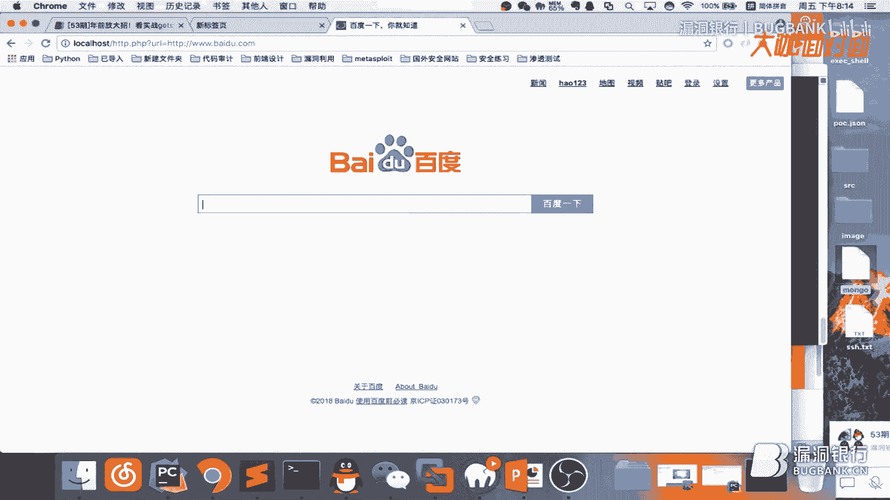

他是不允许我们比方说可以直接file啊，这些的share的肯定是不允许的，因为这样危险是非常大的，比方说就是discard一个ssr漏洞，我这边先把服务启动一下给大家看一下，我先把服务重启一下。

网络重启一下，然后看一下当前IP是多少。

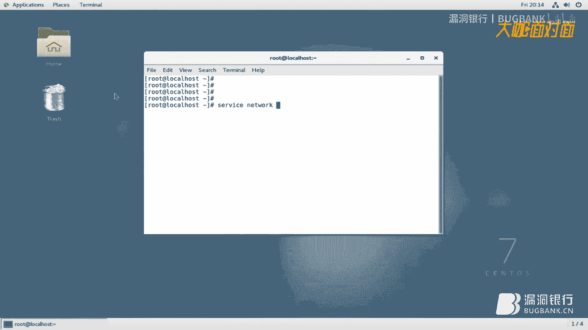

172。16。100。16，172。16。1，16，这是一个discard一个论坛，我目前的这个版本是差3。0的，然后的话他存在是一个全版，当时是一个全版本的一个ssr漏洞。

这边给大家看一下他的漏洞地址，是，是这一个，我把这边处理一下，哎，http，百度。com，嗯，因为这个它是有图片限制的，它有图片后缀限制，但没说我们可以通过传参的方式来进行一个绕过，data=1。

cpg，大家可以看到，他明显的有一个加载对不对，就证明他去请求这个网站了，如果说我们这个时候输入一个不存在的一个网址，随便输吧，哎，他也有去加载哦，这不是很好测，嗯。

就是这边我直接使用我的远程服务器nc来进行监听吧，sh root，nc -l -vv，4个6，比方说我们还要进行4个6短口，然后，我们这边来进行，发折，因为我的域名解析到了我当前登录的这台服务器。

所以说我们这边使用他来自己请求看一下，嗯，大家可以看到，啊这边是发一个请求过来的，呃连接来自这个就是我们，呃我们本地搭建这服务器的一个外网这个地址，啊大家可以看到我们内容是从都没接收到了的。

就是说他他他是其实他只限定的ft，就是http协议，比方说如果说你直接在这里，你比方说像我们前面使用的ftp，发折然后请求我们这个地址，明显是不行的nc我们进行监听，啊这样肯定是不行的。

但这种方法怎么绕过来，呃前面就是，有位大牛也讲过有位大凯也讲过，就是怎么绕过方法，啊这里的话我们会利用到一个，啊pap一个hide的一个函数叫做hide，这个函数大家可以看一下，啊可以去百度一下。

介绍的挺详细的，就是比方说我们我们写的我们写了一个内容，是这样子的我们写了个一点php，是这样子的，就想说如果说我们这个时候请求一点pap，他就会跳转到，啊我们这个我们这个网址，将将的话是不是如果说。

我们把这我们把这里改成ftp协议了，对不对那那他是不是相当于说，去改成我们的fdp协议，他是不是相当于说就就使用了cur-v，ftp这样这样来请求了，比方说我们改更改一下我们在。

我们的远程服务器上面新建一个文件，啊我这边已经有了，我给大家看一下我的一个源码，php，大家看到我的源码是这样子的，就是说啊，他请求这个页面，然后的话我就跳跳到了这个，啊使用了一个字典协议。

然后请求我们这个地址的一个四个六端口。

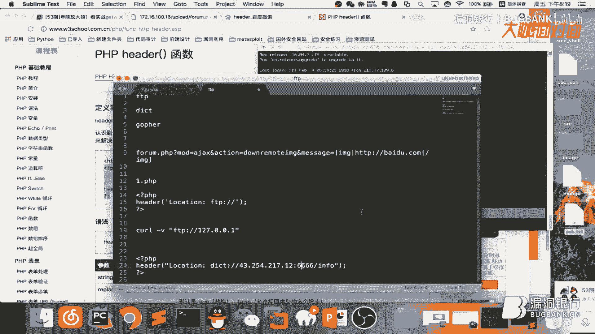

然后这个时候我们再使用nc进行监听一下，-l-vv6666，然后，然后使用这个远程请求我们那个服务器地址，比方说我这里来一个，我们地址是dict。php，然后还是一样的。

要通过我们的传传方式来进行一个绕过，dict。php，啊大家稍等一下，他这边还没有过来，啊我这边使用是ftp协议，不好意思这里要更改成http，好大家可以看到明显的他就有一个，呃就是延时了，对不对。

这样大家可以看到请求已经过来了，我我们我们这里明明使用是http协议，但是到这里的话他就，使用了一个支点的一个协议来进行连接，大家看到，他他这个呃连接内容跟我们使用，dict协议是一模一样的。

比方说我们这边可以连接看一下，首先还是这边使用nc进行监听，然后这边curl，-v，对大家可以看到，呃返回的信返回的消息是一模一样的，嗯前面的话，啊这样的话就像是，呃得到了一个绕过效果。

啊前面我我们有讲过就是说，通过ftp的话可以对他本地短口进行一个扫描，呃等一下我先这边看一下，好这边继续。

前面我们有讲过可以对他本地h，就是说可以使用ftp，对对他进行一个扫描对本地端口进行扫描，如果说我们扫，我们扫描本，我们连接本地的66666端口，如果说这个端口存在的话他会他会，他会就是呃。

他会去连接就会有有一定的，呃连接时间，如果说不存在的话他就会马上返回。

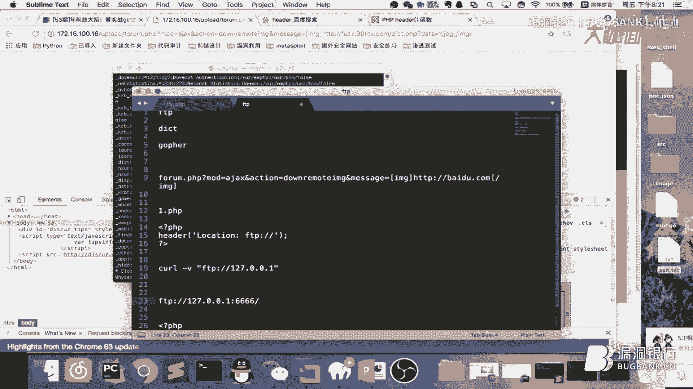

比方说我们这个时候更改一下，然后使用还是使用我们远程服务器，我这里好像是有会ftp。pap，我们看一下内容，啊，好吧我先把这个更改一下，vi ftp，比方说我们这个时候我们去。

用ftp去连接他本地的666端口，看他是否开放，6666，6666，啊我们这边是使用了ftp，大家可以看到他的刷新非常的非常的快，没有半年的延迟，这样的话我们就可以前面我们也我们本地。

实验过比方说我们还是打开本地来看一下，http，如果说我们这边使用，ftp协议，访问请求本地的666端口，因为我本地这次是没有用nc进行一个监听的，大家可以看到我回车之后，反应非常的快。

就证明我们这个端口是没有开放的，这个时候我们就可以知道我们远程的这个服务器。

172，16，他他的80端口是存在的，啊他啊他的666端口是没有开放的，比方说我们这个时候我们再更改一下。

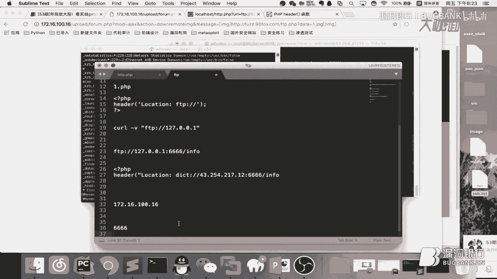

我们来尝试一个，存在的端口因为因为他是，呃http协议嘛，所以他的80端口肯定是开放的对不对，所以说我们更改一下，ftp。php，我们让他去连接本地的一个80端口，然后我们这边再刷新看一下，嗯。

大家可以看到，这是他的他的，等待时间是非是非常慢的是非常久的，啊因为因为他这个系统设置的话他会有个，默认操作时间如果说，就是等到多少毫秒，所以他没有选的话他就会自动断掉，大家看到。

这次我们的这个连接是花了16。6秒的，就就相当于说，我我们这我们请求的这个8080端口，他是开放的，比方说还是一样的，我我们再使用我们本地的这个看一下，这个时候我们请求本地的80也是，他也是开放的。

大家看到，他的他的请求也是非常缓慢的，对不对这样的话我我们是不是知道，远程服务器的6666666端口是，关闭的，哦然后他的80端口是开放的，我们我们再来扫描一下他的3306试一下，因为因为使用。

SSL漏洞的话我们可以配合，比如说mysocal redis和memcache，然后等等来进行一个，一个需要的一个反弹，这这里的话我后续是给大家使用redis，来进行一个反弹的，我们请求3306。

咦稍等一下，先不保证，vr fdp，我们请求本地的3306端口看一下，3306，然后我们再再来一次，然后我们再再来刷新一下，就老是更改一个值吧，因为谷歌他缓存非常严重，如果说不更改的话。

他有时候可能显示不出来，然后再回车看一下，大家可以看到他这次的，结果也是非常明显的，证明这个端口是有开放的，对不对他因为他连接等待时间是比较，长的，但是。

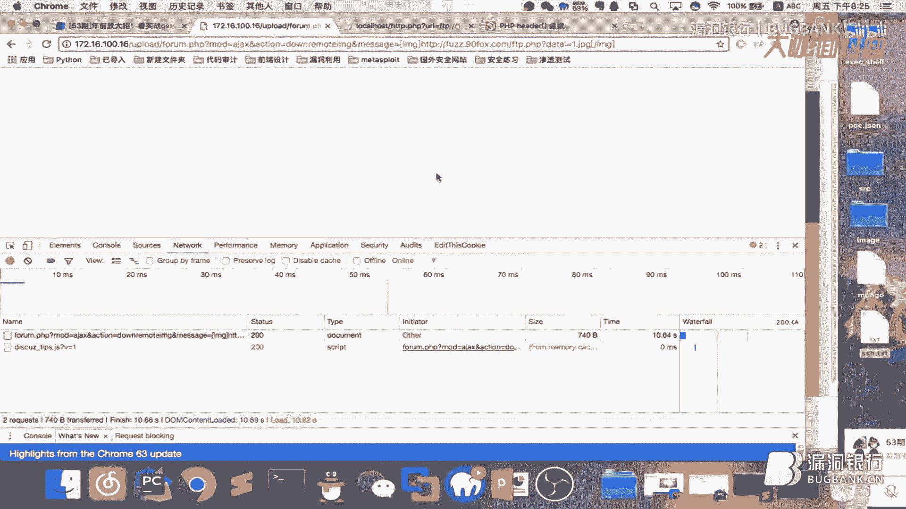

如果说我们探测一个端口，每次每次去改的话，这样是不是很麻烦，所以说的话我们可以通通过一种，传参的方式，这里我写了个。php文件给大家看一下，php，这里这边我接收了几个参数，一个是ip，和一个端口。

然后还有一个s是我们要使用的协议，然后一个data是我们要发送的一个内容，然后的话后面也是使用的，这个head进行一个调整的。

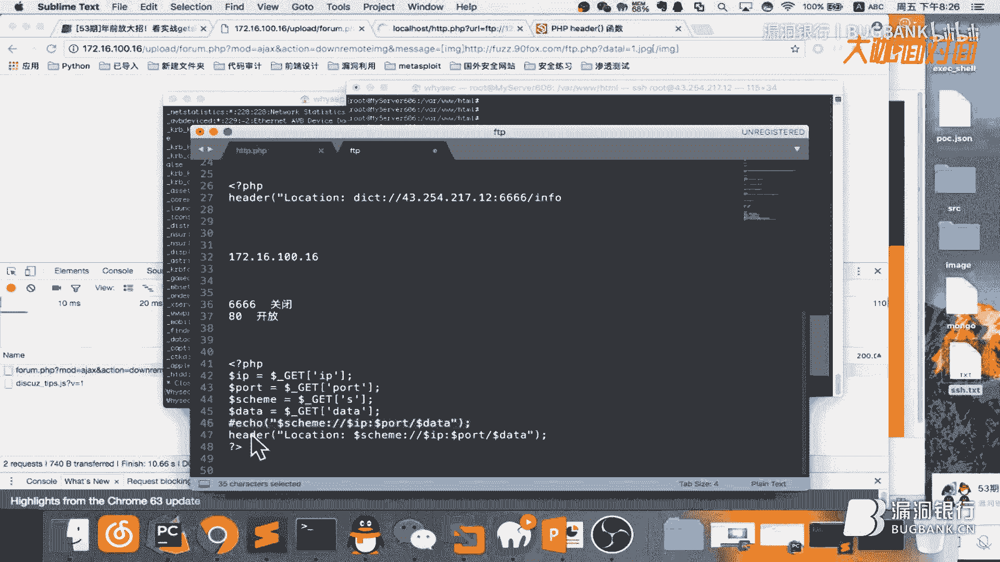

这边我们可以直接请求这个文件看一下，ssrf，然后看一下我们需要接收什么参数，首先第一个是，s我们还是使用ftp的一个协议，然后，好这边叫什么，ip，ip我们是要探测它本地的一个端口，开放情况。

那就127。0。1，如果说你要扫描它的内网段的话，那你就可以输入它内网的一个ip，进行扫描对不对，因为我们这边是扫描它本地的，然后的话还有就是我们要使用的，我们要扫描的端口是80，data就等于。

因为前面我们有讲过它这个，它是限定的图片的一个后缀的，必须是你是，图片后缀才可以进行log，然后我们这边加个，参赏看一下回车，哎稍等一下这边它是，ssrf ftp，啊它的年纪好像是。

看一下可能说我这边拼接有问题，嗯我直接，我拿我这个脚本的吧，嗯，啊ip然后我们这边8口，端口是80，回车，啊大家可以看到，它的一个响应时间是非常慢的，就证明这个端口是开放的，这样的方式的话。

是不是我们通过传参就不用每次，比方说你要干啥，你就去改一下这个文件，然后把端口改一下这样探测，这样是非常的麻烦对不对，嗯还有对虽然时间不太靠谱，对这个时间是非常是不是很靠谱的。

就是这个需要就是你多测多测几次，然后取个大概时间我们才能，进行判断的，然后我们再试一下，还是试一下一个不存在的一个端口，6666，啊可以看到他马上就就返回了，一秒钟都没有只有，只有600多毫秒对不对。

这个时候我们就可以对他的本地的他，他的一个服务端口进行一个，啊系统性的一个扫描对不对，嗯，当然当然我们不可能说哈，一个个去探测啊，啊这里的话我是我是，我是接住了盘神，呃首先是他的一个。

呃一个request，一个呃，叫什么request的一个库，然后的话这边是定义的一个函数，啊然后这边的话我我是，扫描了一些比较常见的一些端口，就是，我们就是也比较关注的一些端口吗，啊这边是一个循环吗。

然后把整个每个端口一次循环一下，然后这边，看到我我这个远程的这个，这个的话是我，呃搭的一个ssss，rf。pap，然后这个就这个后面的，就是我刚才给大家使用的，啊那个一样的。

然后我这边是设计个操作时间的，如果说他，呃操作时间，大于6了对不对，我就把这个异常给捕获，就就证明他的端口是开放了啊，然后我们这边来运行试一下，大家可以稍等一下，因为他这个是比较慢的。

如果说你端口开放的话，他他就要去6秒，这样去请求，大家看到他首先出来一个22，他目前扫描出来两个端口，呃22跟我们的80是开放的，而我们可以连接试一下，22是sh端口吗，比方说我们ip是多少。

17216，我们使用sh连接看一下，16。18。16，大家看到他是成功连接的，就证明我们我们这个，呃扫描扫描是没有问题的，可以看一下我，我们这边是有定义21这些端口，看见没有，21他是他是没有开放的。

比方说我们可以调一下，探测一下看他是不是，真的扫描正确，16，21啊大家可以看到他是连接失败的，就证明他的端口是没有开放的，我们这边再使用这个，再使用呃手动探测看一下，可以看到他也是马上刷新的。

并没有说有多少毫秒的一个延迟，对不对啊多，多少秒钟的一个延迟，就证明21端口他其实，他也是没有开放的，啊，但是啊这这个脚本他，他不一定百分百的准确啊，就是如果是有有些端口，你觉得他可能开放的。

然后他没有扫描到的话，我建议大家是，可以手动的就是加一下，比方说啊像一些redis的默认端口啊，啊这边他是没有扫描出来的，看一下是不是我们要加哦，我们搜索一下6379，啊他我有。

我有加但是他好像没有扫出来哦，我们手动探测看一下，嗯6379，嗯大家可以看到，他是明显的有一个延，延时的就证明，呃本地的redis，他是可以进行一个访问的，就证明本地redis，他是一个开放的状态了。

比方说我们可以远，我们可以远程连接他试一下，就使用连去连接他的一个端口，16，6379，大家看到我们远程连接他是他是，失败的，但是我们通过ssr rf漏洞去扫描他，连接他发现他是正常的。

因为现在redis一般默认配置的话是，他只用是本机访问吗，但是，账号密码的话现在设的还是比较少，因为他本机访问的话，呃工具就很难供应到了，所以说账号密码的话，呃有些人也懒得设，然后就直接就不设了。

既然我们我们知道了，就是这个这个网站，他本地开了一个redis，他本地的redis服务是开启的，然后前面我我们也说过，我们可以。

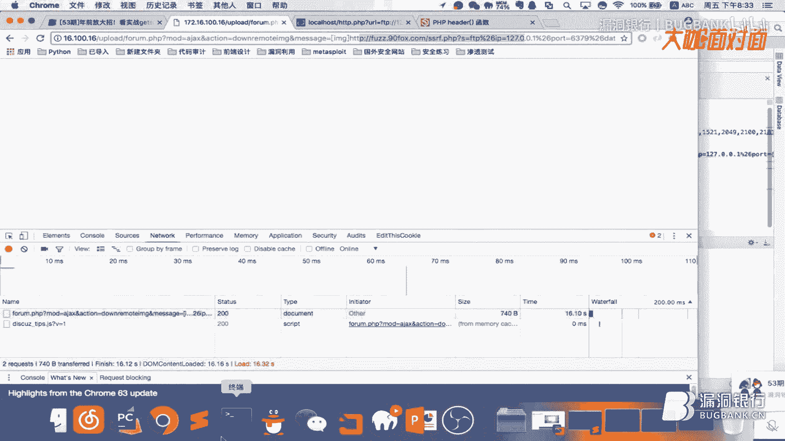

我们可以通过，这点协议，data，来操作redis，这边我可以给大家再看一下，比方说我本地也有个redis。

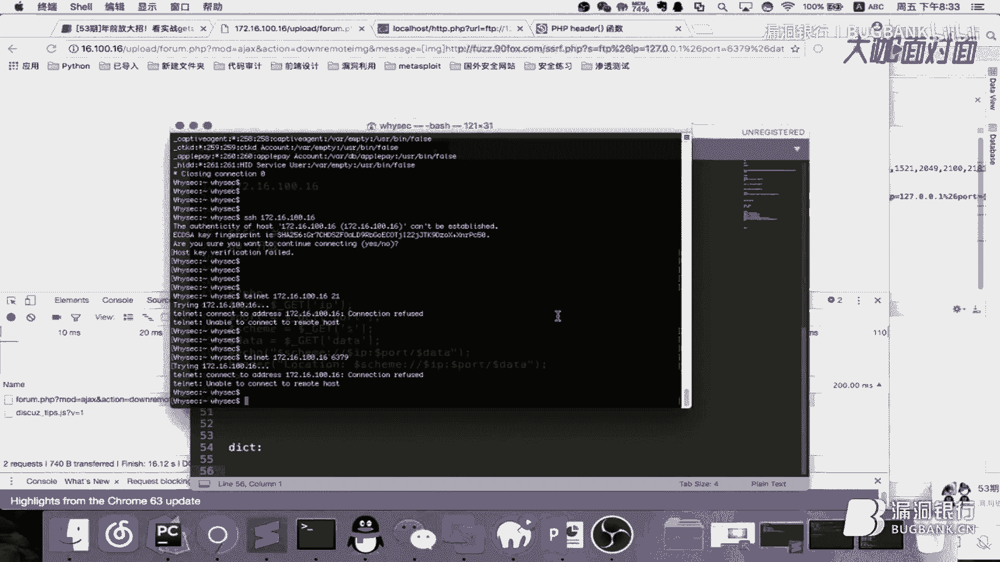

呃一个道理，我们使用crl，-v，dict，我们请求我们本地的redis，6379，然后info，大家看到成功了，他是返回了一个redis的一些信息，对不对，这样的话我我们就完全可以把把这个，呃。

这种方法利用到，我们我们远程的这个服务器上面，但是这里是没有回衔的，我们是不是非常不是很好利用，当然我们就可以通过其他其他的方法，比方说我先进入这个服务器，哎稍等一下，有点卡住了，啊这这是这是我。

啊这是我这个论坛的一个，他的服务器，然后我这边有个脚本我先给大家看一下，啊这个脚本我想大家应该都知道吧，就是，呃redis的一个未授权访问嘛，然后使用他，呃他的一个，啊呃。

计划任务来进行一个下午的一个反弹，对不对这个大家我想应该都了解，我们可以先。

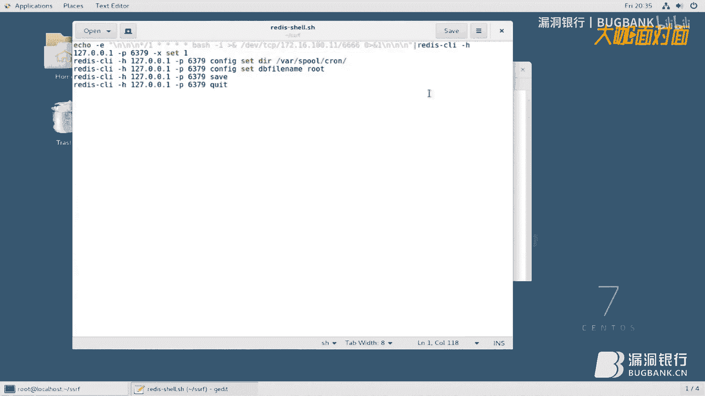

先先在他服务器里面运行一下这个脚本，看一下给大家看一下效果，比方说我们看一下我们这边的it是多少，呃172。16。100。11，然后，这这这边是是这个的，然后我们把它保存一下，然后我们这边先监听一下。

-vv，32端口是6666，我们先本地测试一下他吗，redis-shell，可以看他是成功返回五个 ok 的，我们可以看一下计划任务有没有写入成功，呃大家可以看到，呃我们在这里面执行的话。

通过redis的一个反弹shell的话，计划任务是成功，成功的一个，呃写入成功的，我们可以看到这边稍等一下，他可能返回有点慢，稍微等待一下，我们说内网好像有什么还是什么鬼啊。

大家可以看到啊shell已经来了，我们ifcompute看一下啊，他没有命令执行，他应该是没有加载，呃环境编辑，我们可以直接，通过这样的方式来访问一下看一下，可以看到啊，这个ip跟我们是一模一样的。

172。16。100。19，嗯大家看到这种方式，如果说redis，我们外网也可以访问他，那利用这种方式，肯定肯定是可以直接，呃进行一个反弹shell的，但是，现在这期我们要讲的是如果通过ssrf。

呃来调用redis进行一个反弹shell，首先我们先把它给关掉，我把这个计划任务也清清除一下，清空一下，如何通过ssrf，就是我们这个地址，我们这个链接来调用他的话，这个时候我们就要。

我们就要使用到一个协议叫做gopher，这个协议的话大家可以去，仔细了解一下，他是可以操作像什么redis，mysql这种都可以进行操作的。

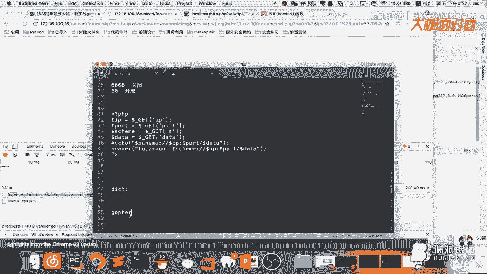

比如说我们首先，我们先把我们刚才的这个，就是一个反弹shell的一个数据，给抓取下来，把它转成一个，gopher他支持的一个协议方式，我们先编辑一下刚才那个文件，嗯，嗯，我们把这个端口先更改一下。

嗯替换，把它替换成33334个3，呃全部替换一下，让我们保存一下，我们这里使用一个端口转发工具，对他对他的一个端口进行一个转发，然后 tcp，stn，3333，因为我们刚才写的端口是33吗。

然后把它转转发到，cp-co，呃主机的logo host，呃6379端口，好这边输出一下输出命令了，少了一个 k，啊这边是开启成功的，然后，我们再来运行一下我们刚才的一个脚本，是啊，可以看到啊。

这个他的一个tcp的一个数据流，我们是成功的抓取下来了，我们把这个保存一下，把他的一个tcp数据流保存一下，然后通过我们先把它这个保存一下吧，ssrf把它保存成一个文件，然后我们通过一个脚本。

把它转换成go for可执行的一个协议，呃这个脚本的话，啊大牛有分享，我到时候我分享给大家就好，1。py ssrf，点logo，好这是我们把它把它转成了一个，go for一个协议。

协议的样子还是把把这个先保存一下，456。txt，啊好成功，然后我们我们先看一下，刚才我们是运行那个是有计划任务的，我们把它先清一下，呃-r，啊-r吧，tab，嗯-l，呃啊计划任务已经清空掉了。

然后我们把我们刚才的一个，啊好好我到时候发你一份，嗯我们把它放到我们的网站格木。

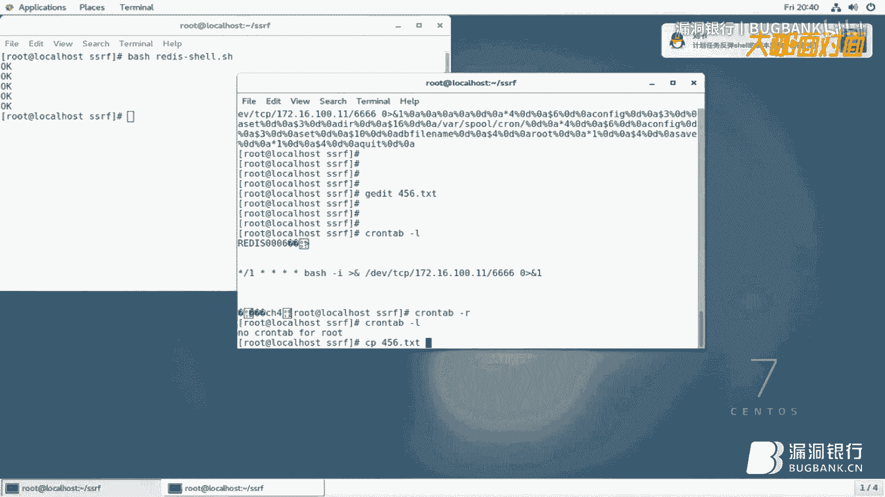

把它下载下载，好我们这边先把它下下来一下，455，6。txt，好这有了，啊这个是我们通过一个脚本啊，然后把redis的一个他一个tc，他的一个就是法兰西奥的一个，tcp的一个数据流，然后转成ready。

转成go for支持协议的一个方式的，啊一个链接吧，啊有了这个链接之后的话，这个时候我我们把它保保存到，我们的一个。php文件。

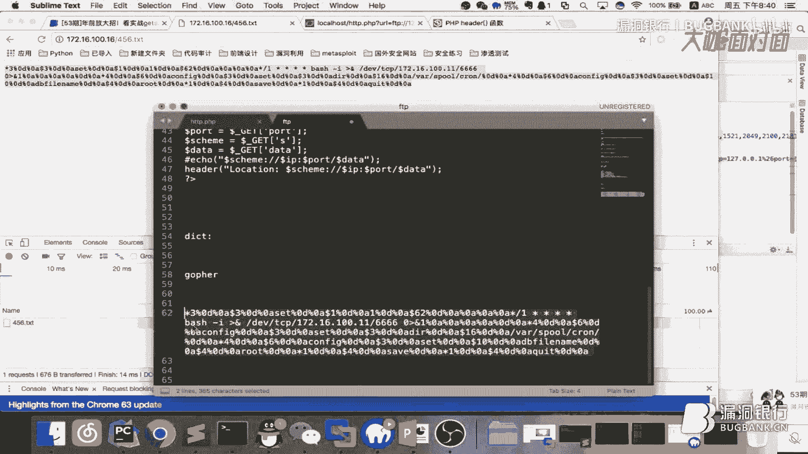

转成了一个服务器文件，然后说前面我们是端口扫描，我们是用ftp协议，这个时候我们还是一样的，我们就选ftp这个文件，但是呃，然后，我们这个这次我们就不使用ftp协议了，这次我们要使用go for协议。

go，go p h e r，斜杠，然后是我们要请求他本地一个redis，127。0。0然后6379，对不对然后，我们要给他发送的数据保持这个，然后把它保存一下，首先我们要把这个，这个redis的这个。

好，首先大家可以看一下，目前我这里是没有计划任务的，看下是没有任何计划任务的，对不对，然后我们来访问一下我们刚才那个地址，ftp。php对不对，就是我们刚才保存的，回测一下，请求了我们这个地址了。

然后我们再回到服务器看一下，看到没有计划任务已经成功的反弹，就是已经成功的写入进去。

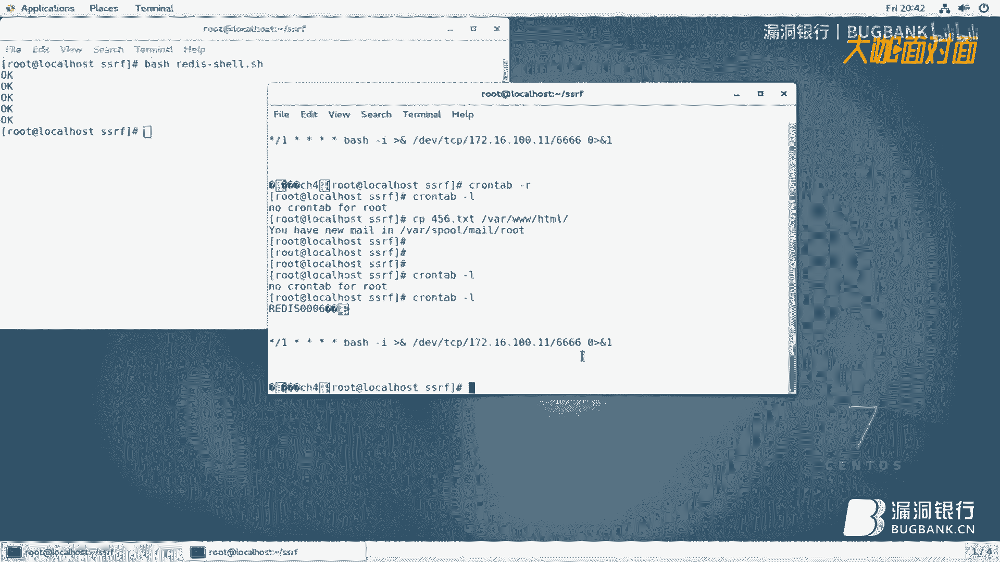

这个时候我们在这边来监听看一下，6666，不好意思喝口水，稍等一下这个是比较慢的，还没有还没有来。

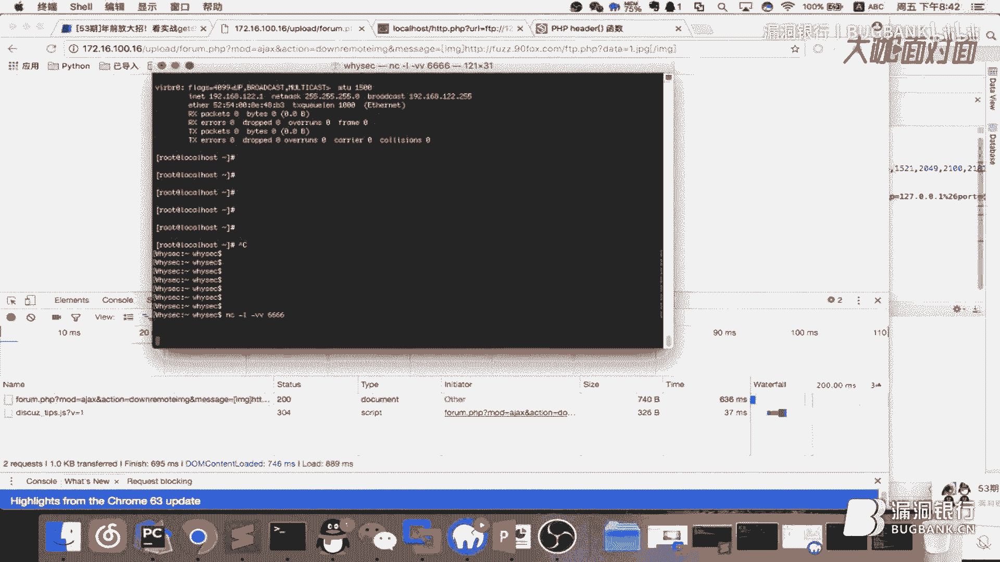

不要慌，这边计划任务已经，写进来了，这边肯定是可以监听到的。

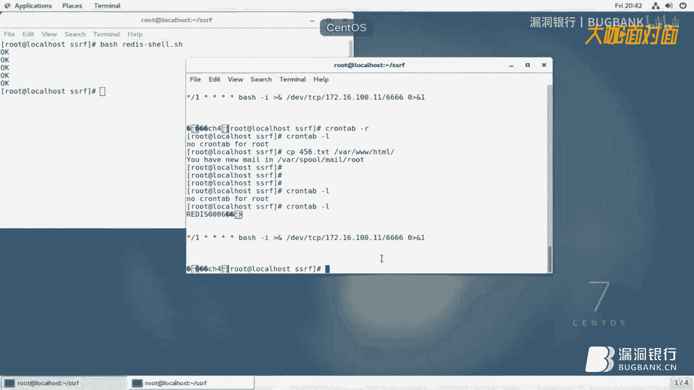

我们看一下IP数正确，17216 100。11，100。11，怎么还没有过来，我的天，不慌，刚好VV，4个6，再来，重新开个窗口，监听一下，来了来了这边来了我们这个就关掉了，大家可以看到。

他是成功的反弹到了下午的，我们还仔细，EVE computer看一下，IP就是当前的17216，100。16，大家看到，如果说，像这个网站Diskard他一个论坛，他是好像是低于3。

1的版本都存在这个SSR漏洞嘛，如果说像这个，他本地服务有Redis而且是，只有他本地本机可以访问，但他是，未授权的，就是说没有账号密码的，那我们就可以通过，一个Redis配合，就是我们使用我们的。

Google协议，然后去请求本地的Redis就可以进行一个效率反弹了对不对，大家也知道，像DC这种论坛进到后台拿效率也是个麻烦事情对不对，但是如果说，像，用SSR还不漏洞，根本就不需要做什么。

只要他本地有Redis然后未授权的话，我们就可以，直接，获得一个root的一个效，像你拿了一个效的话如果说你使用，网站效拿到的话他可能还是个APA其权限的，但这个的话他是个root权限的效对不对。

这不是想干啥就干啥了，然后，怎么一个流程我再给大家梳理一下吧，首先，就是说我们是，通过一个端口端口端口扫描的一个方式对不对，去看下他本地开放哪些端口。

如果说他本地开放了6379因为6379默认是Redis的一个端口对不对，他开放了Redis端口然后的话我们就可以，通过Google协议调用他本地的一个Redis然后进行一个，一个效率的反弹，RM。

-RF，这种东西不要做啊，太坑别人了千万不要干这种事情。

然后呢，端口扫描发现之后发现成了Redis的话，然后我们再使用一个Google协议就是配合，我们的Redis的他一个，反弹效的一个脚本对不对，就可以对他进行一个，反弹了，反弹效的话就给大家讲到这里吧。

但是，然后后面还讲一下就是我，后面这张PC上面说的，简单的绕过一些SSR图片的限制，大家可以看到，这个洞的话，如果说，如果说你后面不是图片结尾的话他看到，他刷新非常的快，他是不行因为他限制了。

后缀只允许是图片的格式比方说1。CPU，对这样他就会去请求，不信我们大家可以看一下我们这边，我看一下这个这个服务器不错的我把这个端口先关掉，我们这边是使用NC来进行监听，刚刚VV，4个6。

一个道理我们请求，请求他，大家可以看到，我这个时候我的后缀是1。JPG是一个图片的他才可以请求到，我们把这个关掉，然后我们再使用这个监听，这个时候我们把这个后缀给去掉，大家看到，他是没有连接过来的。

像这种方式的话，我们就可以通过阿帕奇的一个特性来进行他的一个绕过，大家知道看我PDT吧，大家知道，阿帕奇配置文件中，这个具体具体怎么我也不晓得反正就是加个这个东西，就是如果说你想把图片格式。

当做PAP解析你就加一行这个，如果说，你想把TXT当做解析也行你把这个，复制过来，加一行这个，把它改成。TXT，这样的话TXT他也就当做，PAP来解析了，我给大家实践一下吧。

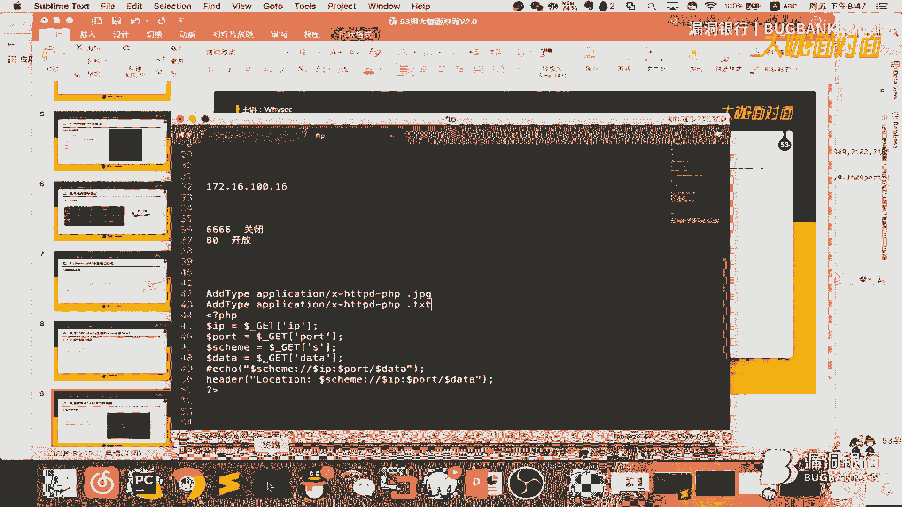

我看一下我这里我这里好像是有改的，ACH，RETC，SITE，VI00，我这边我这边有加了我这边是加了一个，把我们的图片，当做PAP来解析，然后我们再回到我们刚才的那个，FTP。PAP的文件。

我们复制一份，PHP，把它复制成一个文件一个图片的格式，AA。这个这个什么，鬼，复制好之后的话，比方说我们先进我们这台服务器我们把，目前的这个计划任务给他清空一下，看一看他目前还是在的对不对。

我刚才访问了一下他不好意思，刚好先把他给清空掉，他现在是没有了，然后这个时候，我们就直接请求我们看到那个图片地址，AA。这个什么PG，请求成功了然后我们再看一下，是不是成功写进去，咦，哎稍等一下，AA。

我们看一下AA。GoPro 6379是没有问题的，我刚才是不是多加了个什么东西啊，我这边多加了个写杠难怪啊，看没有大家看到他明显是有刷新的有去连接的，我们再看一下，大家看到看见没有。

他也是成功的已经写入了，写入计划任务了，我们还是我们再使用NS来鉴定看一下，稍等一下我这个比较慢，如果说大家用远程服务器的话，其实它响应速度是非常快的，因为这是本地啊我也不知道什么鬼它比较慢，稍等一下。

我们可以看到这边它是，已经写入计划任务成功了的，看一下这里。

还有一种方式也可以绕过，啊对这种方式也可以绕过，呃但是，有有些啊，他他限制的你不允许存在。php。

跟。asp，这种就这种后缀啊，就是你的url里面他不允许存在这种，这个时候你就可以用我们这种方法绕过，对不对，你就可以你就可以把你alpha几配置一下，把图片或者 txt文本，当做php来解析。

这这样相当于说你请求了1。php他，请求1。txt，他其实解决的用户就1。php，当1。php来做解析对不对，啊可以看到啊他的一个，我们的一个share还是成功返航到了，可以看到啊，172。16。

100。16，嗯可以看到也是成功的返航到了，就说这个方法的话，如果说像你遇到一些就是比较坑的，就是我介绍我刚才说的，他不允许说你让你存在。php，就。aspx这种脚本文件只允许你图片的话。

这个时候你就可以让我们用我们这种方法，来进行一个绕过，其实这种我感觉，用到的挺多的，因为我有测试过发现，很多他他都限制了，你一个就是你一个图片的后缀，然后用这种方法的话是可以达到完美的，一个绕过的，嗯。

好最后就是想给大家说一下吧，呃ssrf能做的很多但是，我感觉很很多白帽子，目前对他还不是非常重视啊，就比方说，大家可以看到今天我演示的通过ssrf，就是调用本地redis的话，他可以直接就是进行一个。

需要的一个反弹，这样就是他威胁是非常高的，其实他还可以调用，你们开车啊，mysoco这种来进行反弹效应也是可以的，这个大家可以自行研究啊，然后，我今天就讲到这里了吧。

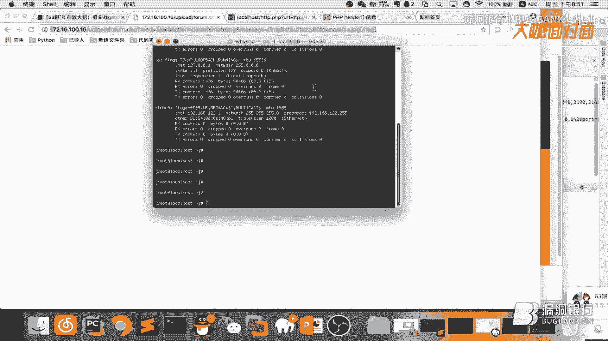

好感谢YSAC的耐心讲解，那这场用ssrf来get share的新姿势，大家都学会了吗，那下面就让我们进入到行长问答环节，大家在听讲过程当中没有听懂，或者实际测试当中产生的疑惑。

都可以提出了，那大家抓紧时间，好首先回答一下这个啊这个，sync什么的什么的吧，啊ssrf通常会出现到哪些位置，啊因为我前面ppp也有讲过一些，啊主要是一些，呃网站采集啊网站抓取。

然后就是可以比方说像有些地方，让你输入网站地址，然后出去让你请求一下，看他状态是否可达，这种地方就基本上他会存在ssrf漏洞，然后具体的其实前面有，呃有位大咖他也讲过，大家可以看一下前面大概讲了。

啊这个小时的这个，我回来一下，其实这个原因有很多啊，你这个0，0毫秒与30毫秒，我以3秒像我遇到这种情况，我一般是什么呢，我我首先会请求他本地127。0。0。1，他的80，他的80端口他的返回是多少。

因为这个网站可达的话，他他的80的端口的一个状态是最准确的，因为80端口肯定是开放的对不对，请求他他的时间是多少毫秒，然后跟其他端口的一个毫秒进行对比，如果说跟他时间差不多的话，那端口应该也就是开放的。

我一般都这样来进行一个测试的，请问协议被限制为http或者https，还能不能利用这个ssrf啊，那个看一下，我我跟就是这个dj这个论坛演示的话，他是限制了，呃http协议的。

给我刚才用的是一个pap一个hide，还是一个跳转，啊这个肯定是肯定是可以的，如果遇到内网ip被过滤了怎么办，有没有什么办法可以解决啊，啊你这个肯定没没得解决啊，因为本来。

ssrf他他就是用来攻击内网的，他大部分都是用来攻击内网的，如果说你内网被过滤了，那你还攻击啥对不对，如何判断url中参数存不存在ssrf，啊这个东西的话，最好的他大家可以利用dns login。

来来进行探测啊，如果说没没有没有那个平台的话，大家可以，可以看一下直到创与了，则创与个dns login的一个免费平台，大家可以注册一个，一手可以啊发给大家，ssrf与cs啊，rf的区别是什么，啊。

ssrf的话，他可以直接跟着笑啊，你csrf也可以了，虽然说csrf，csrf配合xss也可以，但是ssrf攻击面肯定是比，csrf要广很多吗，然后而且这两个东西，呃完全就，就不不在一个层面上我感觉。

而这个如何理解朱小所说的ssrf，是有钱人的漏洞啊，啊因为大家知道，像一般的你你，你个论坛你你不会配配，配radius这种东西，只有说，除非你的论坛人多啊，高并发或者业务量大的话。

你才会用radius这种东西对不对，就是只有有钱人他他他的并发才会高啊，他他才会用radius，他才会用radius这种东西啊，然后这个，他才会用radius这种东西啊，所以说ssrf肯定是有钱人玩的。

对不对，除了ftp，参数还有什么参数可以用来手工探测ssrf，呃这个很多啊http也可以啊，因为，因为http也是一样的，啊这个有很多啊，大家可以cll刚为省看一下，他他那些协议。

呃很多都可以用来就是进行一个探测的，大概好我直接用包厢来利用叉叉1的ssrf，滑向特点吗，不是啊嗯他你这个我不是很理解啊，他们是用叉叉1的ssrf啊，因为这种我建议，你这个说的不是很明确。

我不知道你什么意思啊，但是你用ftp协议来来的话肯定是最快的，据我测试啊ftp他进行端口探测是最快的，进行端口探测是最快的，如果可以为何fftp协议比http快啊，这个我也不知道为什么测出来的。

呃内网实际上做了隔离ssrf，是不是就没有危害了，啊你也可以这么理解哦。

嗯好那我觉得时间也差不多了，那感谢ysec的解答，也给小伙伴们踊跃的提问点赞，那大家都有在认真听讲，下面就进入到我们的大咖赠书环节，究竟谁能幸运获得这本，大咖精心挑选的拍色黑帽子。

黑客与渗透测试编程之道呢，那下面就请大咖ysec，选出本期的幸运观众了，小时啊，啊我我点了那个小时，好的那今天的幸运观众就是小时，那恭喜你获得拍色黑帽子，黑客与渗透测试编程之道一本，希望你在。

相应的区域留下正确的收获信息，我们会尽快将数据寄输，那年前放大招，看实战get share新姿势，这份春节礼物是不是诚意满满呢，那年前最后一次咖面，到这里就全部结束啦，再次感谢大咖的认真准备。

也感谢小伙伴们的积极参与，今天的咖面就要和大家再见了，大咖面对面周五八点见，请大家期待我们年后的重新启航吧。

yeah，it's just me myself and i，so low right until i die，cause i got me for life，got me for life。

i don't need a hand to hold，even when the night is cold，i got that fire in my soul。

i don't need anything，to get me through the night，except the beat that's in my heart。

yeah it's keeping me alive，i don't need anything，to make me satisfied，cause the music does me good。

and it gets me every time，yeah and i don't like talking to strangers。

so get the fuck off me i'm anxious，i'm trying to be cool，but i may just go asian。

say fuck y'all to all of y'all faces，it changes though now that i'm famous。

everyone knows how this lifestyle is dangerous，but i love it the rush is amazing。

celebrate nightly and everyone rages，i found how to cope with my angers，i'm swimming in money。

swimming in liquor my liver is muddy，but it's all good i'm still sipping this bubbly。

this shit is lovely，this shit ain't random i didn't get lucky。

made it right here cause i'm sick with it，cuddy they all take the money for granted。

but don't wanna work for it，tell me now isn't it money，it's just me myself and i。

solo ride until i die，cause i got me for life，i got me for life，i don't need a hand to hold。

even when the night is cold，i got that fire in my soul，i don't need anything。

to get me through the night，except the beat that's in my heart，yeah it's keeping me alive。

i don't need anything，to make me satisfied，cause the music does me good，and it gets me every night。

like，cause the music does me good，and it gives me，every time，i don't need anything。

to make me satisfied，i don't need anything，to make me satisfied，i don't need anything。

to make me satisfied，(再會)。