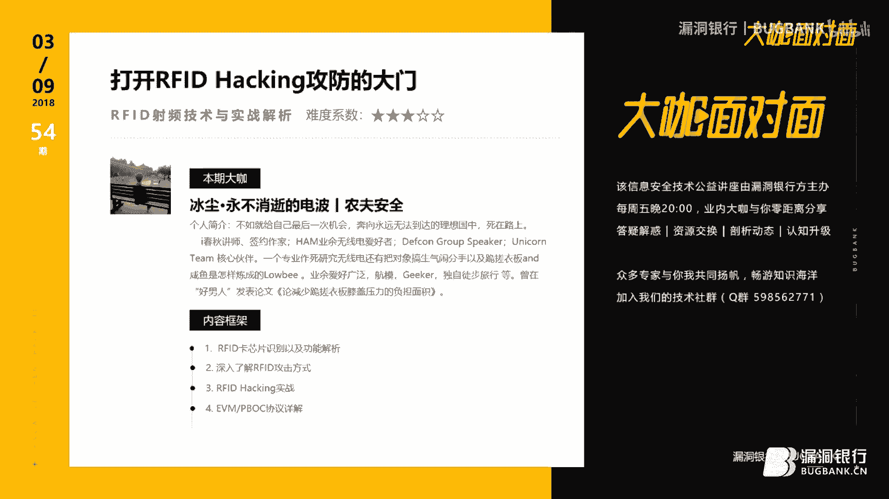
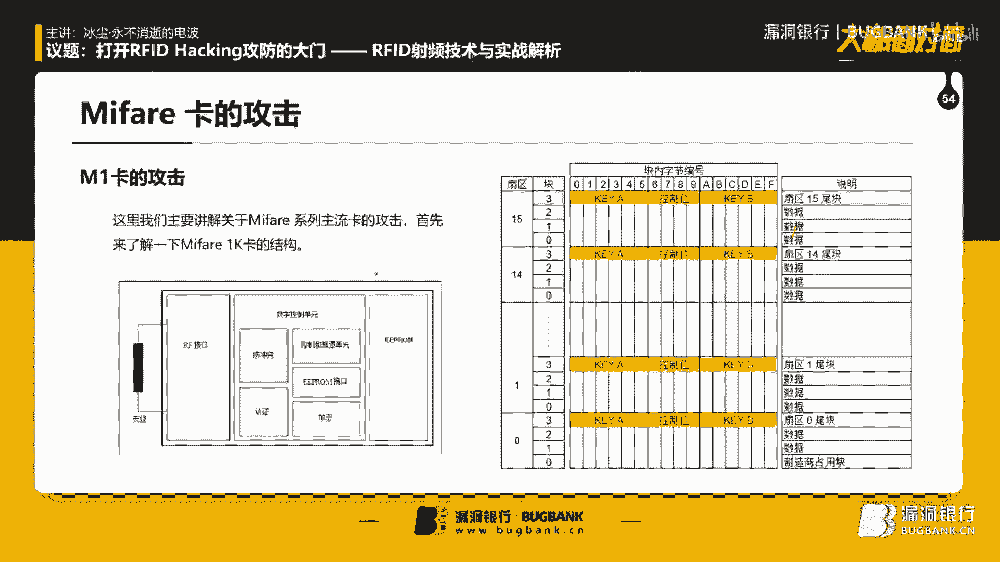
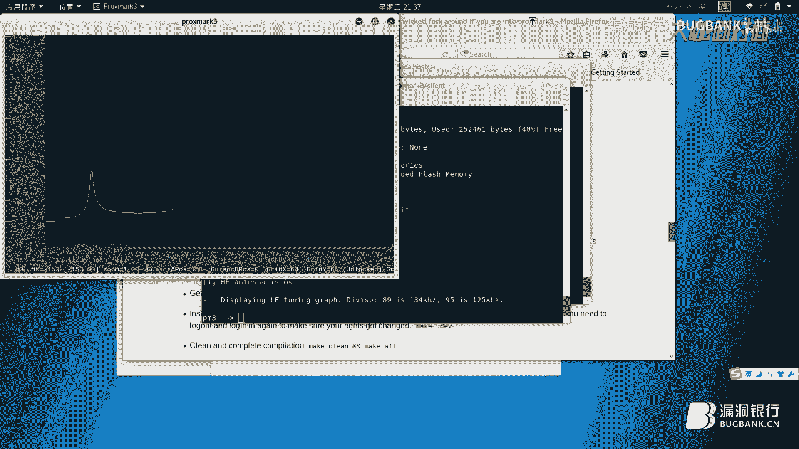
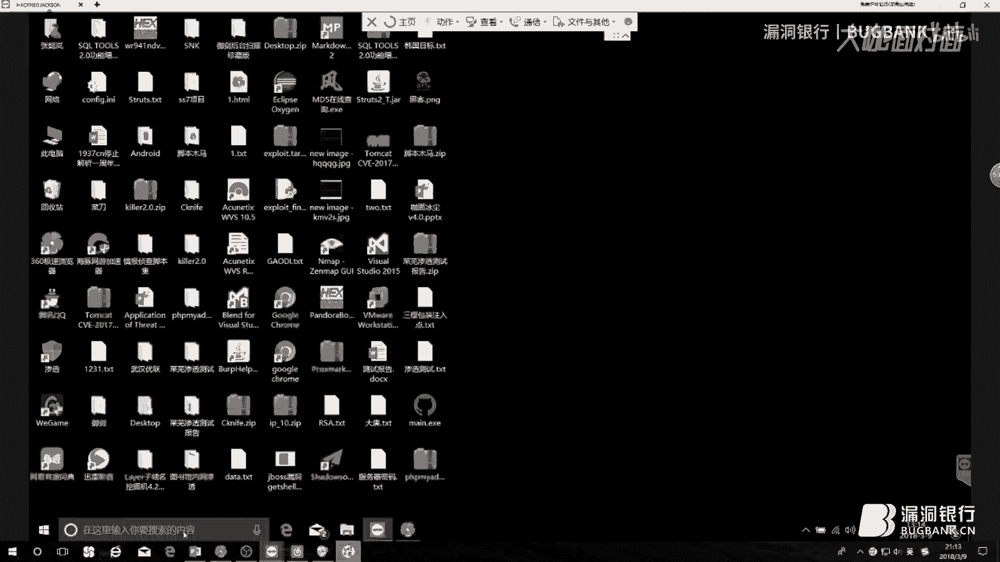
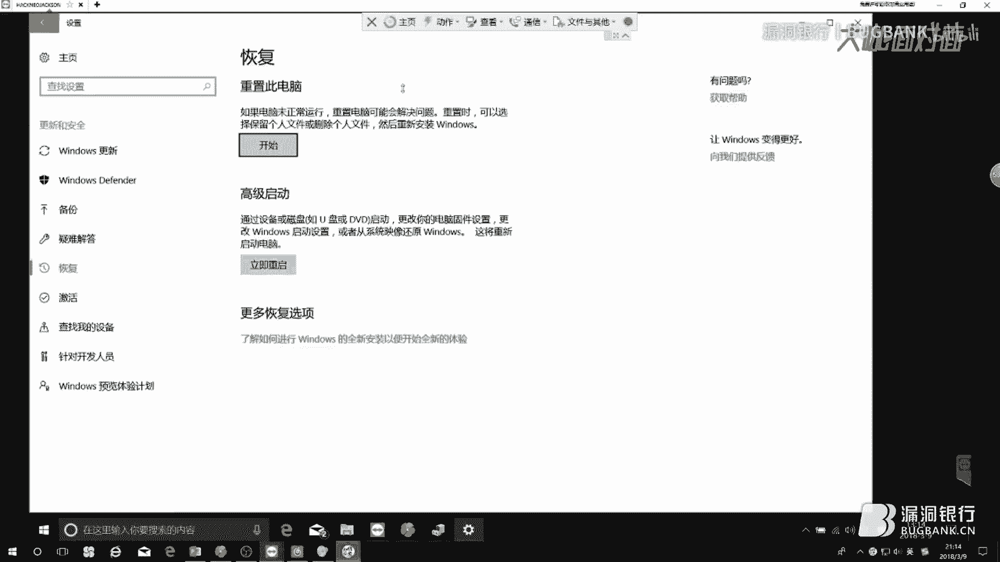
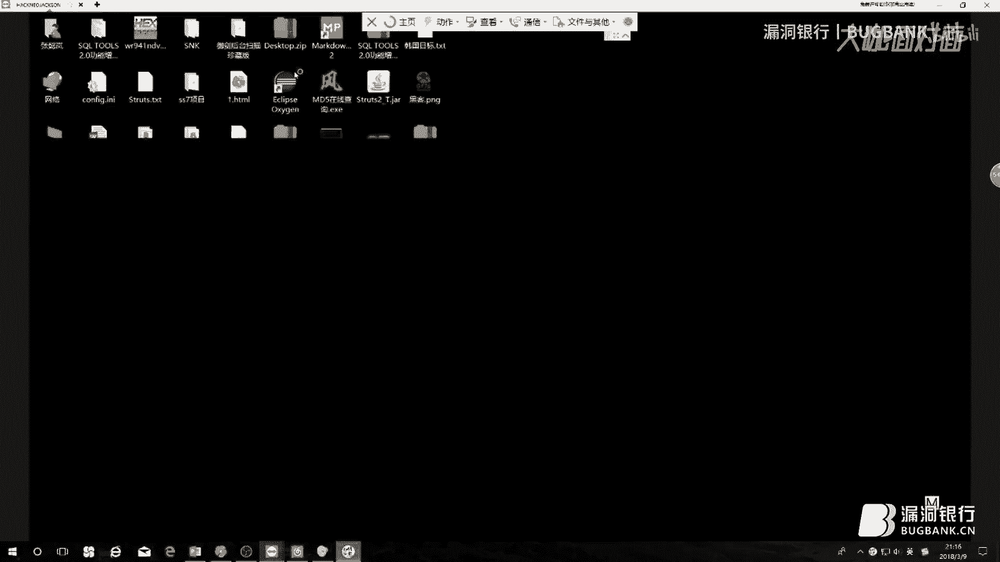
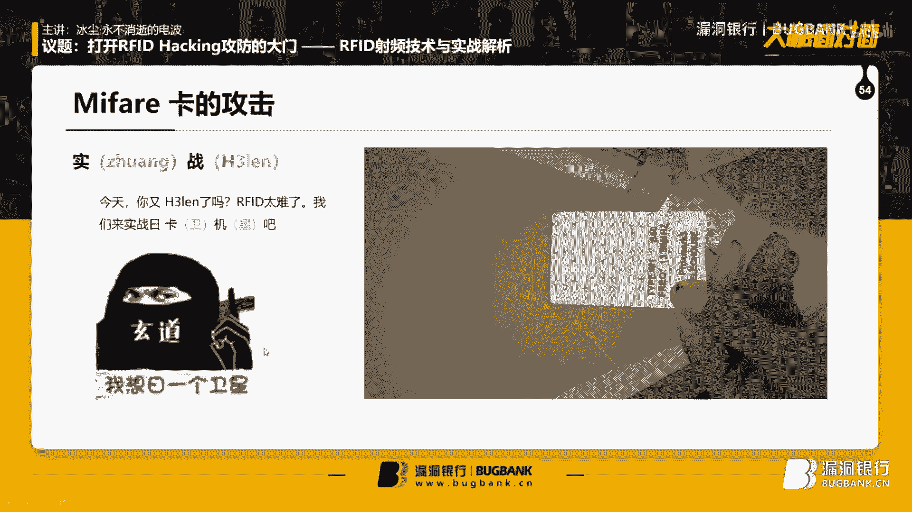
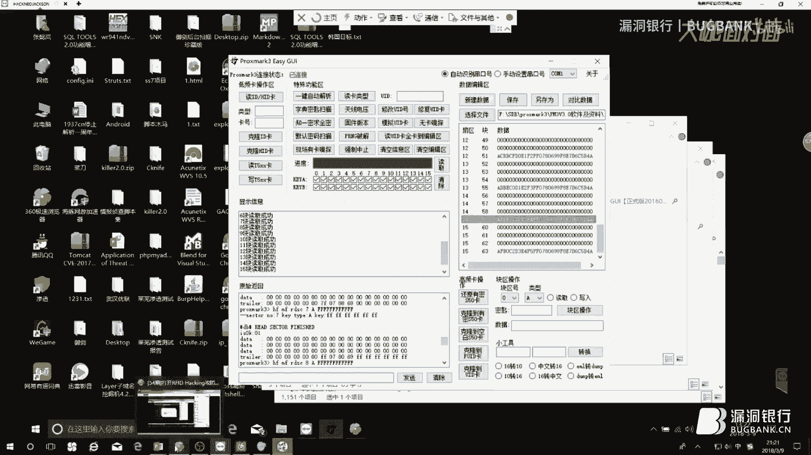
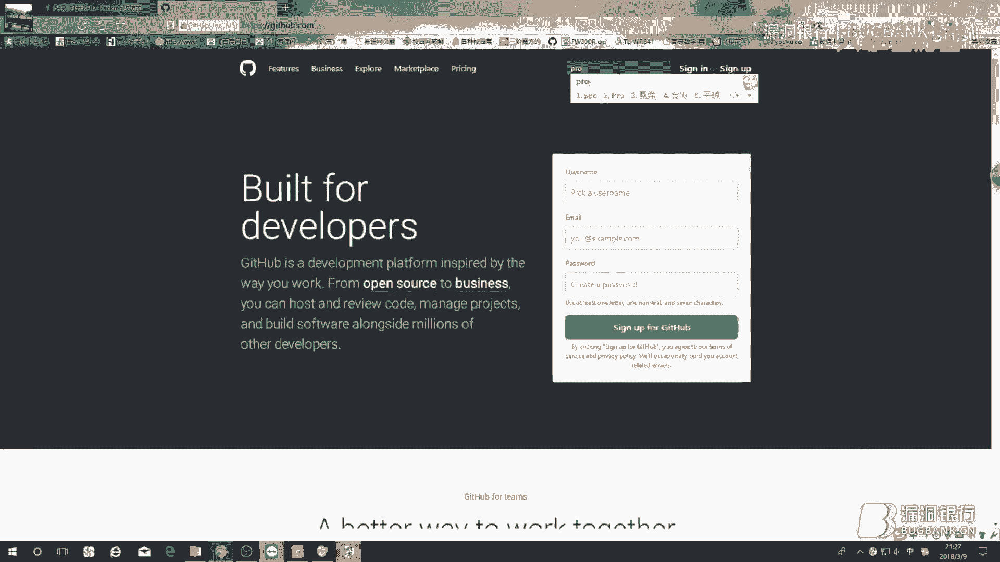

# 课程 P1-54：打开RFID Hacking攻防的大门——RFID射频技术与实战解析 🚪📡


在本节课中，我们将学习RFID（射频识别）技术的基础知识、常见卡片类型、攻击原理以及实战操作。课程内容将从基础概念入手，逐步深入到具体的攻击手法和工具使用，旨在为初学者打开RFID安全研究的大门。



---

## 课程概述与声明 📜

上一节我们介绍了课程的整体框架，本节中我们先来看一些重要的前提声明。

学习RFID和无线技术，首先必须了解相关法律法规。在中国，操作无线电发射设备需要考取“业余无线电台操作证书”。该证书考试通常由当地无线电管理局或相关协会组织，每年举行数次。证书分为A、B、C类，对应不同的操作权限。请务必遵守法规，合法研究。

另外，需要澄清一个常见误区：RFID卡（如IC卡）内部是芯片和线圈，并非磁性材料，因此不存在“消磁”的说法。

---

## RFID技术基础原理 ⚙️

上一节我们明确了学习前提，本节中我们来了解RFID的工作原理。

RFID系统主要由阅读器（Reader）和标签（Tag，即卡片）组成。其基本工作原理是：阅读器通过天线发射特定频率的无线电波。当标签进入磁场范围时，其内部的线圈通过“电磁感应”产生电流，从而为芯片供电。芯片被激活后，与阅读器进行数据通信。

根据供电方式，RFID卡可分为：
*   **有源卡**：卡片自带电池供电，工作距离较远。
*   **无源卡**：卡片完全依靠阅读器发射的电磁波获取能量，常见如门禁卡、饭卡。

根据工作频率，RFID卡主要分为以下几类：
*   **低频（LF）**：如 **125 kHz**。常见于ID卡，穿透性强，但读写距离短、速度慢。
*   **高频（HF）**：如 **13.56 MHz**。最常见，读写速度较快，是MIFARE系列卡、NFC技术的工作频段。
*   **超高频（UHF）**：如 **860-960 MHz**。读写距离最远，速度最快，但穿透性差，常见于ETC、停车场系统。

---

## 常见RFID卡片类型 🗂️

了解了基础原理后，本节中我们来看看市面上几种常见的RFID卡片。

以下是几种典型卡片介绍：
*   **MIFARE Classic 1K卡**：最常见的高频卡，采用ISO14443-A协议（常称14A协议）。存储容量为1KB（1024字节），分为16个扇区，每个扇区有4个块（共64块），每个块16字节。每个扇区的最后一个块用于存储密钥（Key A, Key B）和控制位。
*   **UID卡**：一种特殊的高频卡，其UID（卡片唯一标识号）可以被任意修改，而MIFARE卡的UID是出厂固化的。UID卡可以完全兼容MIFARE Classic的读写设备。
*   **HID卡**：一种常见的低频（125kHz）卡，通常较厚，内部线圈为粗大的椭圆形。多用于旧式门禁系统。
*   **T5577卡**：也是一种低频卡，但卡片较薄，内部线圈通常为正圆形。它可重复读写，常用于门禁克隆。

**小技巧**：区分卡片类型的一个简单方法是，在强光或台灯下透视卡片，观察内部线圈的形状（正方形多为高频MIFARE/UID卡，粗椭圆形多为低频HID卡）。

---

## 数据校验算法基础 🧮

在深入攻击方式前，我们需要理解数据通信中保证准确性的基础——校验算法。本节中我们介绍两种简单的校验方法。

数据在无线传输中可能出错，因此需要校验机制。以下是两种基础算法：

1.  **累加校验（Checksum）**
    原理是将所有待发送数据字节的值相加，将和作为校验码附加在数据末尾一起发送。接收方重新计算数据和，与收到的校验码对比，判断数据是否出错。
    *公式示例*：发送数据 `6, 23, 4`，则校验和为 `6 + 23 + 4 = 33`。发送的数据包为 `[6, 23, 4, 33]`。

2.  **循环冗余校验（CRC）**
    这是一种更复杂的校验算法。发送方和接收方预先约定一个“除数”（通常用多项式表示）。发送方在数据帧后附加若干位0，然后用这个数据帧除以“除数”，得到的余数作为**CRC校验码**。接收方进行相同计算，若余数为0则认为数据正确。
    *核心运算*：此处的除法并非算术除法，而是采用 **“模2除法”**，其本质是 **异或（XOR）** 运算。

---

## 攻击方式与工具介绍 ⚔️

掌握了原理和卡片类型后，本节中我们探讨针对不同类型卡片的攻击思路及常用工具。

### 低频卡（如HID）攻击
*   **模拟攻击**：使用工具（如Proxmark3）读取目标卡的ID号，然后将该ID号写入一张空白卡，完成克隆。
*   **爆破攻击**：使用设备自动、快速地遍历所有可能的卡号（如从0000到FFFF），直到门禁系统接受其中一个。
*   **中继攻击**：攻击者A在门禁读卡器旁放置一个设备，模拟成合法卡片；攻击者B在持卡人附近放置另一个设备，模拟成读卡器。两者通过远程通信（如4G）连接，将持卡人的认证信号中继到门禁，实现“隔空刷卡”。

### 高频卡（如MIFARE Classic）攻击
MIFARE 1K卡曾存在严重加密漏洞。
*   **嗅探攻击**：在卡片与合法读卡器通信时，监听并捕获其交互数据。
*   **密钥破解**：利用如“Darkside”等漏洞，通过已知扇区密钥推算其他所有扇区的密钥，或直接暴力破解弱密钥。
*   **数据篡改**：获取密钥后，可直接读取、修改卡内数据块的内容，例如修改金额字段。

### 常用工具选择
以下是几款主流RFID研究工具：
*   **Proxmark3（推荐）**：功能最强大的开源工具，支持低频和高频卡的读写、嗅探、模拟、破解等多种操作。有价格较低的兼容版（约400元）和功能更强的官方RDV4版本。
*   **ChameleonMini（变色龙）**：专注于高频卡的模拟与嗅探，便于伪装成各种卡片。
*   **ACR122U**：一款简单易用的高频（13.56MHz）读卡器，价格便宜，适合入门和基础操作，但不能处理低频卡。



**注意**：在Windows系统下使用Proxmark3可能需要禁用驱动程序强制签名认证才能正确安装驱动。建议初学者在Linux系统（如Kali）下使用，环境配置更简单。


---

## 实战演示：Proxmark3基础操作 💻



理论最终要服务于实践。本节中，我们将以Proxmark3为例，演示一些基础操作命令。

以下是在Linux环境下使用Proxmark3客户端的典型流程：

1.  **连接设备**：启动客户端，连接到Proxmark3。
    ```bash
    ./proxmark3 /dev/ttyACM0
    ```




2.  **高频卡识别**：识别一张MIFARE卡。
    ```bash
    hf 14a reader
    ```





3.  **破解密钥**：尝试使用常见默认密钥列表进行破解。
    ```bash
    hf mf chk * ?
    ```




4.  **读取数据**：成功破解后，读取卡内所有扇区数据。
    ```bash
    hf mf dump
    ```


5.  **低频卡识别**：识别一张低频ID卡。
    ```bash
    lf search
    ```




**数据对比分析**：在修改金额类操作前，通常需要对比刷卡前后的数据差异。可以使用 `hf mf dump` 命令分别保存两个状态的数据文件，然后使用对比工具找出发生变化的字节，结合校验算法分析出金额存储的位置和格式。




---



## EMV/PBOC协议简介 💳


最后，我们简要了解一下更复杂的金融支付卡标准。


EMV是以Europay、MasterCard、Visa三大组织首字母命名的金融IC卡全球标准。中国的银联芯片卡标准（PBOC）是基于EMV标准的衍生版本。这类卡片（如带“闪付QuickPass”的银行卡）属于CPU卡，内置微处理器，安全性远高于MIFARE这类逻辑加密卡。

使用Proxmark3可以读取部分PBOC卡的非敏感信息，例如通过发送特定的应用协议数据单元命令来选择支付应用。
```bash
# 示例：选择支付应用
hf 14a raw -s -c '00A404000E325041592E5359532E4444463031'
```
返回 `90 00` 表示选择成功。但这通常仅限于读取卡号、发行商等公开信息，无法直接篡改交易数据。

---

## 课程总结 🎯


本节课中我们一起学习了RFID技术的核心内容。我们从RFID的基本原理和卡片分类入手，讲解了累加校验和CRC校验算法。接着，我们深入分析了针对低频HID卡和高频MIFARE卡的多种攻击手段，如模拟、爆破和中继攻击，并介绍了Proxmark3、ChameleonMini等实用工具。通过实战命令演示，我们了解了工具的基础操作。最后，我们简要接触了更复杂的EMV/PBOC金融卡协议。


希望本教程能为你打开RFID安全研究的大门。请记住，技术应用于合法授权的测试与研究，并始终遵守法律法规。