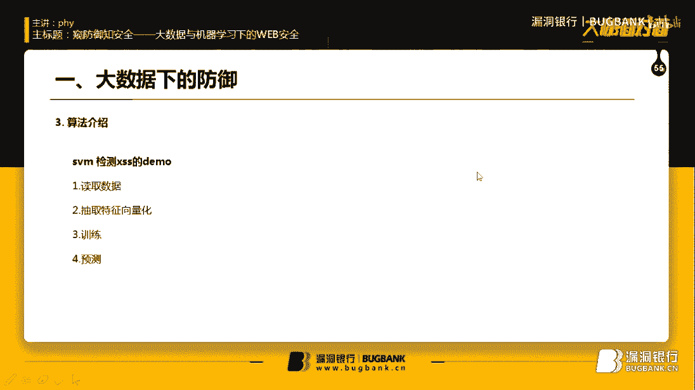
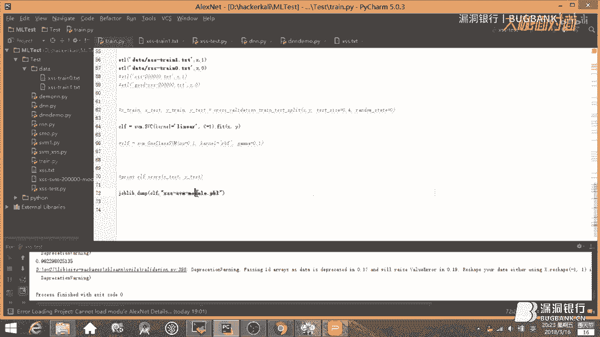
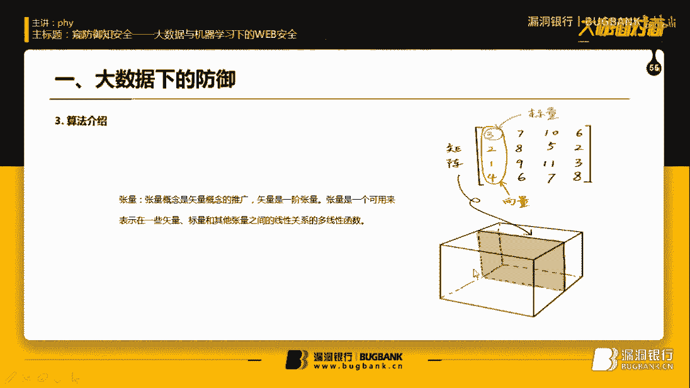
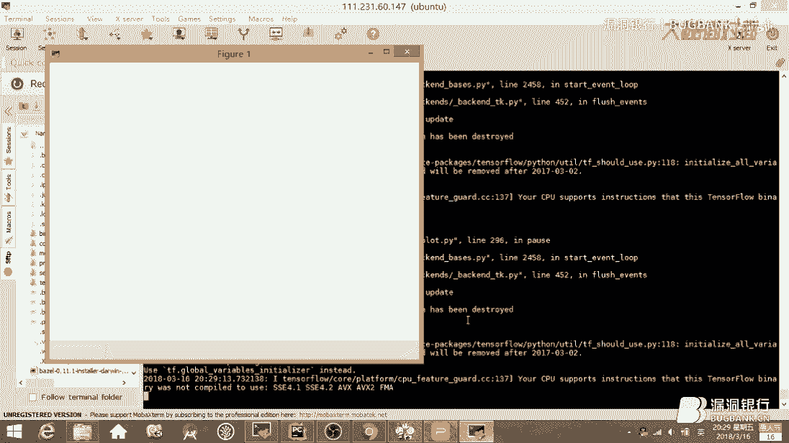
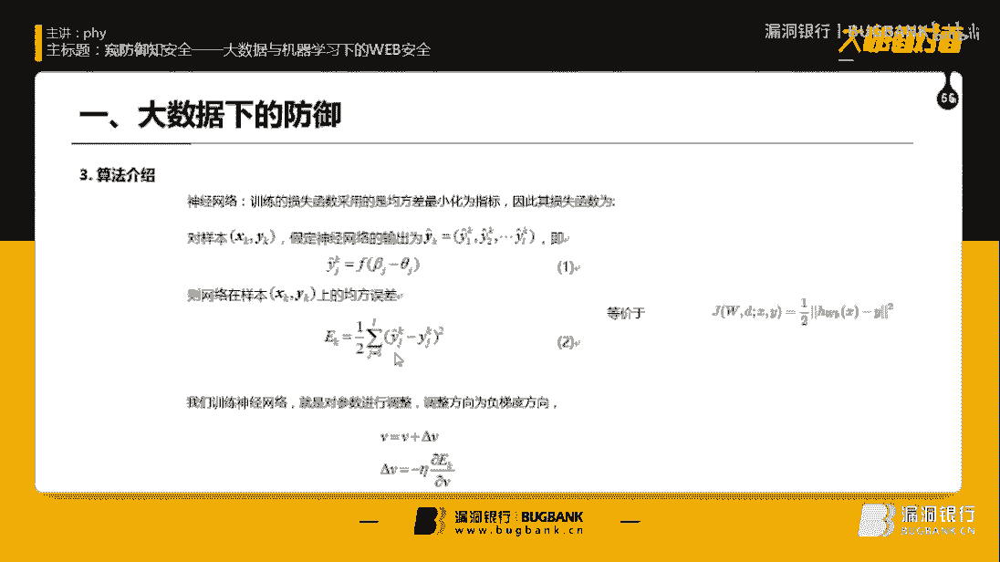
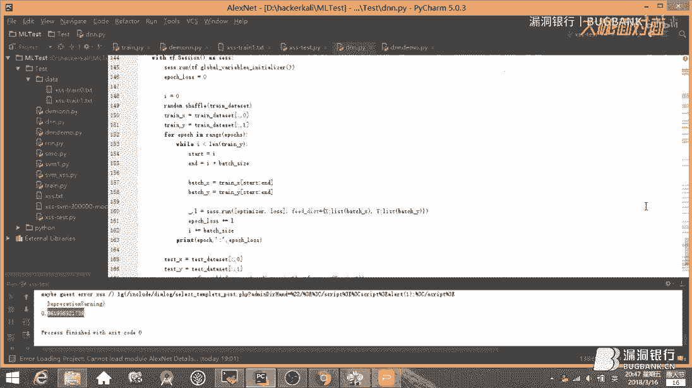
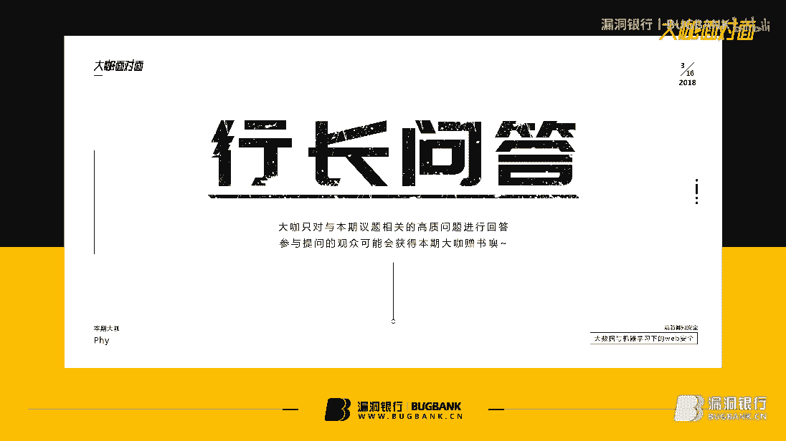

# P1：55【录屏】窥防御知安全——大数据与机器学习下的WEB安全-55期大咖Phy - 漏洞银行BUGBANK - BV1Ft41187Cu

嗯，为知识而存，因技术而生。小伙伴们，大家晚上好，欢迎参加漏洞银行信息安全技术讲座大咖面对面。今晚是开面的55期，我是主持人年念。😊，本期我们请到了一个人的安全部成人员大咖PHY给大家带来技术分享。

本期的主题为窥防御知安全、大数据以与机器学习下的关部安全。在演讲过程当中，小伙伴们有什么问题都可以随时提出。大咖会在演讲结束后的行长问答环节来解答。

今晚的大咖赠书环节会选述一位幸运观众送出大咖挑选的外部安全之机器学习入门一本。那话不多说，下面请出大咖five开始今晚的讲座吧。呃，大家好，我是范。呃。

今天主要和大家扯一下这个大数据和机器学习下的那个防御。呃，讲得爆的地方你们可以后面说哈，有什么问题也可以问一下。呃，前面我们主要讲一下防御，后面讲一下自身安全的问题吧。呃。

我们知道传统wa就是用政则表达式。呃，来防御一些流量的攻击。比如说sircle住叉SS这些攻击啊呃大部分都还是防得住的话，但是一些零队的漏洞。呃，他基本是防不住的，都是要等一些什么补丁，或者N多天之后。

他可能才知道有这个漏洞。然后在里面再加加一些正则表达式来防住这些东西啊。呃，而且传统的wa啊无法在风控领域做的很好。像刷羊薅羊毛。呃，和刷单这类。这里的话挖基本上是做不到的吧。嗯，机器学习呢它在。

图像语音自然源处理。嗯，这些地方呢已经做的很好了。嗯。而且它能在呃大大量的已知数据内去预测未知的一些数据吧。嗯，他。就像是你和一个函数嘛。然后你用未知的数据输入进去，它能给以出这个函数对应的值。啊。

目前大多数web入侵检测都是无监督的嘛，就是训练。训练日常的正常的业务数据。呃，如果和正常的业务数据不匹配的话，那很有可能就是一些异常的攻击的数据吧。呃，这是建立机器学习wa的一个流程吧。首先要。呃。

从传统wa服那边积累下来的数据日志。呃，像这些拦截下来的。攻期数据都要记录下来。然后。呃，这些数据呢我们要将下将它结构化，然后。呃，结构化之后，我们要把它进行向量化，向量化送到一些算法模型里面。

然后最后用模型来预测之后的业务。这是一般企业呃大数据。大数据架构，然后上层的话用算法、数据挖掘机器学习呃来处理一些。一些场景，比如说呃风控安全之类的吧，还有BI数据分析。嗯。一般呢我们要从各个地方呃。

各地方传入一些数据。你比如说像webAPP都会有一些日志请求，然后请求到一些呃服务器上。然后这些数据呢。这些数据都要进行结构化。结构化呃通过再通过存储到HDFS就是分布文件分布式文件系统的。嗯。还赌跑。

大家有玩过吗？呃，HDFS就是分布式文件系统。这个map reduce呢。他其实就是对数据进行处理。嗯。E map就是一个小任务，然后所有的小任务它返回一个结果。

 reduceduce呢将所有这些小任务的结果呢进行一些处理。这就m reduce吧呃，park呃m reduce的功能差不多。H base呢主要是数据库吧。转成数据库的形式比较好操作。啊。

这些都是大数架构的一些组件吧。反正最终都是要通过一些数据挖掘算法模型。嗯，来对这些数据进行一些升化吧。嗯。这是。刚才的流程嘛进行一些简化。嗯。存储的数据其实分两部分，一部分存储到离线的系统。

还有部分直接线上流失进行处理。直接送到算法模型里面去学习。数据采集数据存储，一个离线，一个流失，最后再进行数据分析可视化。嗯，下面我们要介绍一下算法。呃，安全这一块主要。安全和风控其实都是呃检测异常嘛。

比如说呃异常的用户啊，异常注册的用户，还有什么攻击的流量、病毒木马等等等等。嗯，像。病毒木嘛，这里啊。异常数据量很少，一般很难收集到吧。所以一些监督学习。我要标注，就是我要标注这个是正常数据。

这个是异常数据这类的算法可能不太适用。呃，我们下面介绍的是支持降量机SVM算吧。它其实就是一个二分裂器嘛。他他的意思就是要找，比如说这个是二V平面吧，我要找一条线，把一个负样本，一个正样本把它切割开来。

我们看一下电影。嗯，假设一个T数据集啊，这里的这些X都是向量，嗯都是一些高纬的向量。比如一个物体，某些属性都是这个向量的维度。然后。比如这个是正样本。那么Y我们可以令它等于一之类的。嗯。

我们后面进行一些。具体的数学推算看一下。呃，SVM叫做支持下量G。嗯。你看。这里是负样本，这里是正样本吧。这些边界这些边界。离中间这个切割平面最近的这些点。就叫支持销量嘛。我们SVM最终的目的是什么呢？

就是。这两个样本到中间这个平面。相加的距离，我们要求它最大值。嗯，最大值下的这个平面方程是怎么样的？这个是超平面房产。我们是从简单的平面方程推推呃推理到那个高维平面的情况下吧。这是三维平面。呃。

的公式吧，然后它的距离公式是D等于平面方程除以。A方加B方加C方的更好吧。我们如果要改写成范数形式吧。算数的公式就在这里了。我们改写成范数的形式话，我们看一下，把ABC都拿出来，放到一个向量里。

就讲ABC。呃，然后X0Y0Z0。再拿出来。那么。上面这个就变成比如ADABC是欧米伽向梁。嗯，对，欧米伽，然后X0Y0Z0组成的坐坐标组成的向量是X。嗯，那上面这个方程。是不是变成了这种形式了？

欧米伽乘以X加B。我明白。这个负一是后面移过来的。也就是平面方程的形式嘛，下面这个就变成了。就是欧米伽二犯数。这个P等于2。如果是二的情况下，就是。平方平方平方，然后2分之1就是根号嘛。哦。

这是我自己的数学推算。比如。😔，正面正样本这里有一点到中间这个分割的超平面距离为A。然后副样本这里是到这个平面的距离是BA加B最终推出来的是什么呢？就是欧米伽二函数分之2。你看A是。A是欧米伽转质。

这是因为是向量，我写成转质，其实直接写向量形式也可以的。乘以X加B等于1。然后下面都是我们你看二分数的屏，二番数嘛。嗯。因为上面还有个绝对值，上面就变成1加1。最后就等于二除这。我们目的就是。Qiu。

😔，2除以欧米伽二函数的最大值。最大值辖的欧米伽和B。这样我们就能求出这个。中间这个超频远方程。超频面方程欧米伽B都是它的参数。呃，约束条件就是。呃，样本的分类乘以这个。方程大于等于一。呃。

这是为什么呢？比如说。我这里有个副样本，副样本在这里。他现在它现在Y的分类肯定是小于等于负一的吧。因为在这条边界方程之下嘛。那乘起来就是YI乘以欧米伽。乘以X加B。负负得正啊。上面一样。

所以是大于等于一吗？然后求这个等价于求下面这个东西。其实就是把这个提取出来一样。就是2分之。欧米伽的二函数的平方。就是这个东西约束条件跟原来是一样的。那个朗的乘述法呢就是。求一个函数在约束条件下。

达到极致。的方法。达到极值，求出那个极值点的坐标的方法。是怎样求的？就是用一个拉格郎的系数。比如说这里是阿尔法，阿法乘以这个约束条件。乘以这个约束条件，加上原来的这个函数构成了这个拉格兰人函数吧。

然后我们对它对这个函数再进行求偏导的操作。偏导，然后因为它都等于0。这跟这跟高中嗯或者说大学的高等数学求提资方法。呃，都差不多的吧，都是令导数等于0或者。嗯，二阶大数等于01人。

然后求它的极值求极值下的那些坐标嘛。然后我们把这两个方程。等于零的偏导数方程带到原来的拉个朗人函数里面。然后就得到了这个东西。是么。下面这两个东西啊。这两个东西有什么用呢？这是球。😔。

就是为了求欧米伽B用的。你像样本这些参数都已经知道了吧。最终我们求出来是这样子的。嗯。SBM有个1签方法是SMO吗？他就是固定。嗯，在。一轮优化的情况下。只固定阿发癌阿发坠。之外，所有的参数。

然后来优化阿尔法和阿尔法Z。ち。呃，后面讲一下原理吧。呃，前面的情况下，我们都是建立在这些样本直接线性可分的情况下吧。是，有可能原来的空间分不完全分不了。比如说像这样的曲线。在二维平面下，根本。

是直线分不了的吧。呃，我们可以给这些样本加一个维度。嗯，比如说到了三位空间这里。我没发现。嗯，你们发现用一个平面就能把这些很好的这些样本很好的区分开来，是不是？然后我们把。这个平面上原来空间。

平面上的样本。和高纬空间之间的映射之间设为一个函数斐 Xper X。然后。原来平面的超平面的方程就变成了。这样子的形式。我们把呃斐 XI再乘以斐X这个提取出来啊，我们直接令它等于一个函数K。

那么原函数就被简化成了FX等于西格玛。K乘阿尔法IYI加上一个B是吧？这个K就是关键。它很大程度上决定了SVM算法的好坏。呃，核函数呢。恒函数有个定理。嗯，不过那个定理挺挺烦的。

就是半正定矩证作为横函数嘛。嗯。我们经常见到这些，比如说线性和多项值合，还有镜像梯合函数吧。呃，SVM呢它是监督性学习，你是必须要给出两，比如两种样本。比如说这是正享样本，那是负享样本。呃。

所以他对异常检测方法来说其实是比较弱的。但是我们这里有个one class SVM。它就是检测异常数据挺不错的，它是指训练一种样本。呃，大量的比如说正常的业务流业务数据，用一些正常的数据流量。

它不是SVM的球超平面，它是这个求曲面的求一比如说一个球面把。正常的数据全都包起来。然后如果超出这个球面之外呢，它都是异常数据。嗯，我们来看一下。

嗯，SUM的demo吧。嗯，我们首先呃。这两个list吧。X是样本。Y是最终的分类，0获1吧。呃，我们要做的是提取。嗯，Ul。或者说HTTP流量的特征。嗯，比如说这这些都是这些都是一些正常的URL请求。

然后呢。这个。这些。URL请求都是叉SS攻击啊。那我们要提取这些URL的特征，提取出来，把它变为向量，然后送到SVM算法里进行训练。那依据UL有什么特征呢？呃，比如说是长度。

然后还有什么特殊的字符串或者特殊的字符。如果放到一些再放到一些业务场景里面的话，呃，很可能。有什么，比如说IP请求的频率，然后还有一些。呃，还有一些。嗯，请求连接时长，或者说呃。我这说什么了？

比如这个用户是。新注册或者等等等等，还有很多特征。呃，我们现在。抽取一些简单的特征嘛。呃，叉SS经常见的符号建括号吧。呃，还有URL请车里面没有经常见到什么。斜杠放斜杠。你像叉SS叉SS里面。

比如我要接收。反弹回来的c奇。一般。一般我都是用叉S平台吧，叉S平台在SRC里面直接把GS加加载进来吧。所以很有很有可能会有HTTPSRC等于HTTP什么什么点点点com之类的。

然后叉SS特征词像alert script。呃，one error还有等等等等。呃，还还有一些什么余额编码，什么base64编码。呃，各种编码我们其实都可以把它加进来的。这边。

我们是用正则表达式提取下特征。呃，就像这里的用HDT就返回一。呃，这里直接返回了URU的长度。这里也直接返回了长度，然后最后把这个把这四个函数统一起来。统一起来之后就变成了1个12344尾的一个向量码。

然后我们从这些零和一这个文件里面。一句一句把这些UIL。都变成向亮的形式。这四个是直接从URL里。把它变成数字版，然后变变成一个思维向那，我们放到data里面。嗯。这一呢就是攻击的数据。

返回的就是攻击数据转化之后的全部的下梁。这零都是正常数据啊，返回零就是这个正常数据最后的向量。然后。呃，SVM的话，我们可以用。SK learn这个包里面，它直接帮我们实现了SVM这个算法的。

我们可以自己选择一些参数和核函数。如果想自己自己实现的话，也可以上网去看一下。如这个SMO实现的SVBM算法很长的，挺长的。我们这边直接用SK论。直接 feature。X和Y把之前XY的数据全都放进去。

然后模型。最后耽了下来。

我这边已经训练好一个模型了，我们现在来测试一下。嗯。我这个叉SSTX里全都是攻击的数据啊。我打开这个。攻击数据的文件，然后。呃，每行也转都转换成项梁，然后再送到刚才训练好的模型里面。

训练好的模型我已经load出来了，然后直接predict这predic每行的URL。如果他说这个是等于等等于一的话，预测的类别等于一的话，那就说明这个是工具数据了。因为我这边全都是工具数据吧。呃。

如果等于一的话，这边我另一个设了一个变量。即系。呃，这就等于J加一就是预测成功一次嘛。总的话。总的数据量的话，我设了个I来记录。诶。我这边大概是几百条的攻斤数据吧。他好像。达到0。6的准确率，0。

96的准确率。因为因为这些都是比较不是不是特别复杂的数据，比较简单的数据。你要简单的数据，所以它准确率比较高。但是真的放到业务场景里面的话，它可能会有很多误保的。传统SVM的话，其实是效果。嗯。

没有之后要讲的那个深度学习，深度神经网络好的。呃，你们自己也可以试一下这个one class SVMKlon也直接进行了封装的。呃，下面我们要讲一下。就是深度学习神经网络。我们先看一下张亮的概念吧。呃。

一伟的张亮其实。就是向量嘛，二维二维它其实就是矩证嘛。你像三维的话，就是这个样子了。一个矩阵，一个矩阵加起来我们。我们知道图片嘛，图片其实就是2GB。1HGB的一个丈量吧。嗯。

R1个矩阵BRGB3个矩阵组成了一个三层。

M乘N的一个张量码。嗯。神经网络。大概就是这样子啊。就是构建一些数据节点吧。然后通过权重，通过权重相乘到这个节点。然后再传播到下一个节点，最后输出一个结果嘛。比如这里的话。嗯，这个节点等于什么呢？

其实就是。X1。乘以欧米ga1-1。就是这里到这里的权重。然后再。乘以X2乘以乘以欧米伽1-21啊，就是这个节点，再乘以这个权重。下面我们给他一个常数嘛。就是B。毕业成一个罪权众。跟之前那个。呃。

欧米伽乘以X加B那个形式很像。都是。呃，就像那个直线Y等于KX加B那种形式。线性的形式吧。啊，因为这种线性的形式啊。他不能拟合一些复杂的。高位的一些函数嘛，所以我们要给它加一个激活函数。激活函数什么的。

呃，我们人的神经元其实也是有这样的差不多的功能吧。你一个神经元必须要兴奋到某一个阀子之后，才会对下一个神经元进行放电，是不是？呃，激活函数其实大概就是这样的作用吧。他把呃这部这部分数据放大。

这部分数据缩小。加入一些非线性的因素。看之前如果加入激活函数的话，模型就会变成这个样子。嗯。可以看一下。嗯，可以先可先看一下呃，我我写了一个小的demo。都没有效果。😔。

这红色的线就是通过神经网络训练的拟合出来的函数。这些蓝色的点。啊，就是真实的样本吧。可以再再看一遍，它就是。曾经网络它它用途就是慢慢的拟合出一个很复杂的一些高纬的一些函数嘛。原来你看是这样子的。

通过每次轮回训练。最后你和到这个样本的样子吧。啊，再看一下这它的数学形式吧。如果我们加了激活函数之后啊，它的数学函数数学形式就变成了这个样子吧。我们定H直接等H等于计化数吧？嗯。

最终的输出Z就等于这种形式吧，直接乘一个H了。最终，每个节点。啊，通过数学推导出来就会变成这种形式啊。ZI等于西格马WI乘以H加BI。然后最后再通过一个激活函数HH等于F there。嗯。

神经网络是如何训练的嘛？他其实是通过。呃，梯度。就是反向传播。梯呃，我们先看下一张啊，什么是梯度呢？就是。呃，现在我们这是一个，比如说这是一个三维的一个函数吧。啊。

梯度就是这个函数上这个点某个点它某个点这个点最快函数下降的这个方向，梯度是一个方向方向导数，它其实就是方向导数。嗯。我们在异维情况下，比如Y等于FX。它的导数，然后我们再给它加一个方向。呃。

就是变成向量的话，它就是其实就是梯度。我们要训练的话，其实就是。呃，误差。我们预测出来的值。预测出来值和实际之实际值之间之间的误差函数。我们就是要把这个误差函数。呃。慢慢减到你比如说一个局部几小值。

在局部几效值内的话。那么这个。呃，这个模型就跟实际值之间相差的很小嘛，因为误差被已经达到局部第二值，已经非常小了。嗯。我们调整参数的话，其实是通过反向传播。通过数学的练式法则。呃，看一下前面的。

比如这个是误差函数嘛？预测值和实际之值之间相减平方乘以2分之1。然后我们要对这个物像函数进行求导。

求骗导是。比如这个西塔是之前的欧米伽和B。然后。通过直接通过联系法子。转换成。这些Y的形式。然后人经网络通过一层一层之间导数之间传递，然后我们来调整一下这个W，就是欧米伽和P吧。呃，其实就是。嗯。

我每次都要沿这个方向导数下降多少呢？嗯，比如我下架了德taW。和，得他比。我就下降了这么一段。然后慢慢下降下降下降下降。啊，这就是一个训练的过程吧。嗯。刚才就是最基础的神经网络了。

其他的话像CN嗯RN都是。平常用到最多的一些。嗯，神经网络的模型结构吧。如果它深度神经网络其实就叫深度学习吧。啊，我们中间会添加各种层，然后来让这个模型达到很好的效果吧。呃，理论上来说呃，越深。

或者说成序量越多。神经元越多的神经网络给你合任意的一形列函数，任意的复杂函数啊。像IN它是循环神经网络嘛，其实就是。🎼呃，前意时刻的输入输出，对后面嗯后面的时刻的输出都是有一些影响的。

就是添加了一些权重。呃，转基神经网络的话就是通过卷积核。进行举证的特征措取。特征出举之后。再送到下一层的神经网络里面。像一层一层一层都是通过卷机呃，卷机其实。是一种积氛嘛，带权重的积氛。

通过一层一层的特征出取，最后达到结果，然后再通过梯度梯度下降，反向传播。我们来调整。比如W和B。呃，我们看可以看一下了。Oh。之前的那个demo吧。呃，是这个。呃。

我们用的这里介绍例子用的是天梭flow深度学习框架。是谷歌的深度学习框架。呃，它是怎么定义升级网络的吗？我们可以看一下，很很方便的。呃，我们先定义呃一个神经网络层的一个权重，还有B吧。

variariable就是初始化一个张量嘛。我们直接初始化呃。我们需要的维度，比如说2乘3飞机初始化1个2乘3的张量，然后B我们也初始化了。不过这些维度都要一一对应的。嗯，我们就先看WB都初始化好了。

然后这个呢就是矩证乘法。就变成了W乘以X加B。就是之前的形式，Y等于WX加B的形式，这是矩证乘法。嗯。actificationification就是激活函数啊。如果有激活函数的话，我们通过。

通过激活函数把这个Y再进行激活一下。然后最后我们得到这一层神经网络的输出retturn output。呃，下面我们来人为的造一些样本数据。我们人为的造一些，比如我们在-1到1之间。嗯。分成300份。

分成300升数据造一份，然后YY就是X平方减0。5。加上一些噪音嘛。就是刚才我运行的这个demo。让它跟二元函数有一点不一样。我们来看一下那个。之前的效果吗？这就是人为造的数据。呃，我们添加嗯。

这是第一层网络吧。我们现在添加一层网络，然后给一个激活函数，relo这个激活函数，这是一个激活函数啊，然后这是一个输出层。这是两层神级网络。呃，los就是。之前PET里的这个误差误差函数吧。

我们定一个los函数就是。实际的Y减去预测的值的平方。嗯，然后。全部加起来了。这个去禁止。这是电义的los函数，然后这里选择梯度下降的学习梯度下降的学习算法优化器啊。就是。防线传播梯度下降的。

签色不要直接帮我们封装好了。啊，最后调用这三个ter floor，terflow的这个API初始化所有的张量。因为天ker floor它其实是。定义好图，然后再一步一步计算出来的，定义好神经网络嘛。

一层一层，然后再直接进行。把数据喂进去再进行运算。然后看一下这边。这边是画图的。直接看训练的部分吧。每次呢。😔，每次我们都是把这个。嗯，对，这里。把X datata。外data都送到之前的那个。

之前那个呃定好的网络里面。然后预测出来的值。六点去上班了。我们再把它画出来。每次的输进来的X和。最后预测的是我们再多画出来，就是刚才看到那个函数变化的样子啊。嗯，看这个点目看完之后。我们再看一下。

用神经网络的话，呃，检测一些。异常，比如说异常的话，要怎么检测？呃，就比如说我们现在是8序神计吧，就是所有linux命令神计嘛。呃，每一条命令我们要怎么变成项梁呢？现在我们用神经网络的话。

就是不用特征出取了。我们要做的就是把一句命令。嗯，或者一些HTTP流量也好。嗯，直接把它通过这些字符串词转成向量。呃，这边有个包的。NLTK是一个自然语言处理的包吧。还有其他。😔，比如。嗯。有前8。

还有。各种各样的自然员处理的包吧。呃，tken nice这个函数就是分词作用嘛。这个函数就是把一句一句话进行分词。分词之后，我们要建立此表。在大量的日志之上，我们要建立呃自己的词表达。嗯。

一些词表我们可能要需要去掉一些频繁出现的，它频繁出现的一些东西，一些词可能它是没有什么太大的利用价值的。还有一些出现特别少的一些词，可能也有可能就是打错了这些词，嗯，我们把它全都去掉。去了之后。

就得到最终的词表了吧。最终词表得到词表之后，我们要把每句话转成向量嘛。嗯，怎么转成向量呢？就是。业界现在。哦，就是叫one hot方法嘛，有。更好的还有用神经网络建立磁项量的方法的。比如说现在这次。

这是最终的词表了。然后这里是一句话。呃，这句话怎么转成下来呢？要看I，就I在这个词标里面出现了几次，如果没有出现的话，就是0。嗯，think在这个词标里出现几次呢。think的话好像也没出现。

那可能也就是0。嗯，这里可能写错了。如果说比如说grechgrech在这个词表里出现了一次，那我就给他了个一。如果。如果gre出现了两次的话，g出现了两次的话，那就是2。嗯。

然后就这样子把一句话转成了向量的形式啊。啊，这些都是对词进行处理的。比如说小写处理，还有一些圆形处理。这些也没什么用。然后的话。呃，我们现在比如这个是正常的日志。这些这个是不正常的日子。

比如呃拿到服务器之后，通常进行一些提权操作的一些不正常的设用命令，我们把它。呃，放到这里来嘛？然后再通过之前自己写的呃磁转向量。字符串转向量的这个函数。嗯，一句句全部转换了。转到上两个I。啊。

最后我们可能会组成组成一个举证，一个张亮的形式吧。然后最后有了这些数据转存的张量之后，我们要。定自己的神经网络了吧。我们定于第一层第一层的神经网络的权重，还有8SB。然后第二层第三层。啊。

总共简单一点的话，总共。总共三层神经网络的形式吧。然后的话呃第一层W乘以X加B。一个re路的激货函数。这一层到雨路，再到第二层。又是一个乘法，W乘X加B。然后。再通过一个激活函数，最后得到最终的。

最后一层的神经网络的输出。这里都是对数据集进行分割的操作。淑女切片分割。呃，训练的代码在这里。这个adam of其实跟之前的梯度下降是一样的。只不过他用了一些动量的形式，把前前一步。

梯度下降的方向考虑也考虑也进来。嗯，落丝函数在这里吧。los函数呢这里选择了用stion maxlog哈log的这个los函数。啊，最终的话这步这些训练。

去了代码方式。就是feed嘛，ss点撞。把自己的数据输入进去。然后一步步。呃，一步得到训练得到最终的模型。啊，其实这三个这三层神经网络呢。呃，因为。嗯，太太浅了。所以拿出来效果不是很好。

睡脸效效果很很不好的。可能需要自己定七八层，还要加入各种乱七八糟的层。呃，像b区 normalmal转底成等等等等。可能最终效果。会比较好。用神经网络形式呢，是比传统的SVM这种算法。

传统的计术学习算法比较好的。呃，这里训练的话是很慢的，我也没有训练。呃，所以就不演示了。呃，看完这些东西之后，我们看一下。呃，继续学习本身的一些安全问题吧。嗯。嗯，比如说这里说的图像识别吧。

图像呢其实刚才讲过，这是RGB的一个张量吧。一张图片。啊，我们通过算法呢。都是通过之前这些什么数学数学运算形式，一个一个张量举证相乘。然后最终得得到一些分类的结果吧。呃，但是我改变举阵中的一些。

改改变矩阵中行列值我第一次下到卡错了，我下到航空来了啊。比如说。呃，我改变1个2GB矩阵张量中的呃0。5改成0，然后再保持保存成一张图片。可能我们人眼啊根本无法分辨出来啊。但是对机器学习算法。

它会非常敏感的。呃，好几个地方的话，你稍微都变成修改一下，机器学习算法可能会非常的密的。最后得出来的结果可能会完全不一样的。嗯。这些对抗样本呢。就是就很有可能欺骗了一些机器学习算法。啊。

比如说手机上的人脸识别这个算法，然后通过一些伪造的假的图片，让它潜移默化之后，最后乱可能乱七八糟的东西都能识别出你自己原来的人脸。啊，还有深度学习，机器学习它所依赖的一些库。它本身可能有很多的漏洞。

因为。呃，他依赖非常多的算法库吧。你比如像刚才讲的天orf。它是一个深度学习框架吧，他就依赖了这些呢刚才用的n派。用的数学矩证数学运算的一个算法库吧。还open系理这些图像和哪库。

然后这些都是底层的一些C库吧。然后最后。建立在这么多框架之上之后，才有我们的模型，我们的呃一些。业务场景，一些业务逻辑。呃，所以它可能包含很多的一些安全隐患吧。呃，这是去年吧。

2017年所有深度学区框架，才有经济学区框架。它出的这些漏洞吧，各种各样的，你像多次攻资，多次的漏洞。还有对异出的这些漏洞。都有。然后看一下机器学习的普及呢可能让很多事情做很多事情都比较方便吧。

但是它自身也有很多安全隐患吧。如果如果这些隐患不解决好的话，可能很难。应用到一些对安全和敏感的领域吧。嗯。啊，今天大概就讲到这里了吧。唉，好，那感谢f的耐心的讲解，常言道未施工验脂房嘛，由此可见。

防灾安全领域的难度及其重要性。那么既然有难度并且很重要，大家肯定有很多问题想问大咖。那下面就让我们进入到行长问答环节。😊，和本次议题相关的问题都可以提出。那小伙伴们抓紧时间提问啦。

逻辑漏洞的话其实是可以防护的。逻辑漏洞，比如说一些支付漏洞嘛哈，支付漏洞嘛，它跟平常正常的支付其实是有明显区别的。我们可能把呃HTTP这些流量都拿出来，放到呃算法里面是可以的。然后刚才说。对叉SS检测。

为什么用SVM算法呢？呃，其他算法其实也。有很多的，你比如说像。呃，比如呃他刚才讲的这个辅助贝列式算法。呃，捕助便野师，还有一些比如说决策术孤立森林。等等这些传统机器学习算法可能。呃。

对一些场普通业务场景来说的话都是比较好的效果。但是对异常数据异常数据很少情况下，他们可能真的啊效果是很差的。但是深度学习深度学习神经网络的话，它能它有很好的效果。因为它。呃，理论上来说。

它可以拟合很任意的函数，任意复杂的函数。所以说神经网络优势比传统的机器学习算法大。呃，学习大数据开发必须很好的数学，大数据开发可能不需要。但是你研究机器学习深度学习算法的话。

可能数学是必须要有一定基础的。短信炸弹是吧？哦。短信炸弹。呃，短信炸弹的话要看一些形式吧。呃，比如说你对N多个手机号进行轰炸的话。这个识别。呃，你又不是特别频繁的话，这个识别其实是比较困难。

但是如果你对单一手机好进行轰炸，呃，这相当于高频率的高频率的一个1个IP请求一个。接口是吧，这CC攻击一样，其实挺容易放大。啊，数据来源呢呃刚才说了呃，异常数据的话是比较少的。

我们可以通过比如像one class SVM这样的。无监督学习，我们只训练一些正常的样本，就是把所有的正常业务流业务逻辑的这些数据都拿来训练。呃，除了这些业务逻辑正常的之外的那些数据啊。

我们预测出来的话都是这些都是异常数据。嗯，神经网络防御出了问题，责任人是谁？啊。其实。呃，神奇网络是有它的局限性的，它只能呃只能用来辅助人辅助人的工作吧。啊，他出了问题的话。呃，人肯定是要人负责的。

不是算法本身负责的。因为它有可可能很多误报，也有可能很多检测不出来的。它只是为人提供一些更好的呃防御方法，它能预测一些未知的漏洞吧。嗯。过你合是吧？哦，过拟盒。你比如说像在深度学习领域的话。

可能有很多网络层，它就是为了解决固拟盒这个问题。比如说帮举nomal层呃，然后还有一些参数的调整的话，也可以做做到那个。呃，防止过拟合的问题，还有训练时长的这些问题啊。呃，零对漏洞的话说了嘛。呃。

我们神经网络它是。你和一个复杂的高位函数，它是通过数学张量这种方式嘛。你比如说零队漏洞的话。你比如说零队漏洞的话，呃，他可能。呃，跟原来数据。跟训练的数据是有差别的。

但是比如说它可能长度或者单词出现的跟原来数据完全不一样。呃，所以这个模型很有可能把它视为异常的。所以它是这这是防御零对漏洞的。自反映林黛路的原理啊。呃，积忆学习。呃，现在的话主要做防御比较好做。

做漏洞挖掘的话，可能还需要。挺长的时间发展吧。呃，工业界的话，你像一些。呃，大厂商的话，他们可能数据收集的比较全面，非常多，所以呃可能效果会比较好一点，但是误报率还还是挺高的。呃。

有可能把最简单的东西都给误本了。但是它防御的话还有防御防御的话，还有风控这方面，确实比传统的wifi，还有传统的风控系统都是更好的。好，时间也差不多了。那感谢爸的解答。

也给小伙伴们积极的听讲和认真的提问给点赞。那下面就进入我们大咖赠书环节。那究竟有谁能幸运获得这本大咖精心挑选的Y班全职机器学习入门呢？下面就有请five选出本期的幸运观众吧。😊，呃。

我选了一等于MC平方啊。E等于MC平方。好，可以将它。成位吸引观众。那恭喜这位叫做。E等于MC平方的小伙伴获得这本外班全职集体学习入门。那需要你在相应的区域留下正确的生活信息，我们会尽快将书籍寄出。

那今天晚上发的大咖带我们从大数据和机器学习的角度领略了安全领域防御的风采，收获颇丰。那今天晚上的咖面到这里就全部结束啦，再次感谢大咖的认真准备，也感谢小伙伴们的积极参与。大咖面对面，周五8点见。

那下周五晚我们不见不散吧。😊，🎼Can keep my hands through myself。🎼快都没下。🎼Letttle baby到 this你。Am I coming out of ne？

🎼for kick。🎼食べてなナイデセ。🎼Maybe over now， but I feel is。🎼For cake。🎼Let me theけ98。🎼Maybe over now。

 but I feel less down。🎼Got another mouth do。Ler with the baby sister mom。🎼The grave。🎼的意思。

And are coming out of my field。Rbble just for kicks now。🎼強いなナイディセ。I have had your feel。

 but you feel hass stuff。🎼For kick。I could like 1986 now might be over now， but I feel upset。

🎼You could fight a word for peace。🎼Given to that easy living。 Good to my hope and dreams。

🎼Slipping with my enemies， we could have w。🎼Some down。🎼Don' you give a little ticket。🎼め的ほ。🎼透明。ふ呵。😊。

Ivo just for cakes yet。🎼The best for my heart to aclip now might be over now， but I feel it。🎼。

🎼And just forget。🎼Do in last96 setsだ。🎼Maybe必 over now。🎼在。🎼Just forget。🎼けけば。🎼Maybe over now。

🎼I feel less that。🎼踩ger feel的香味。