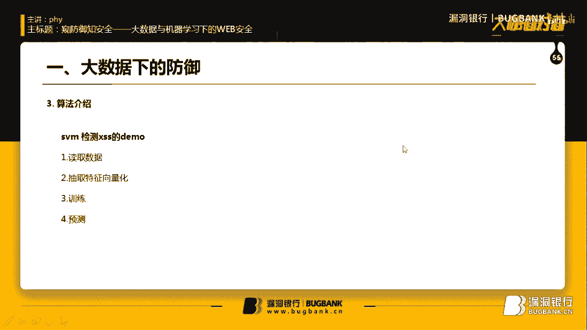
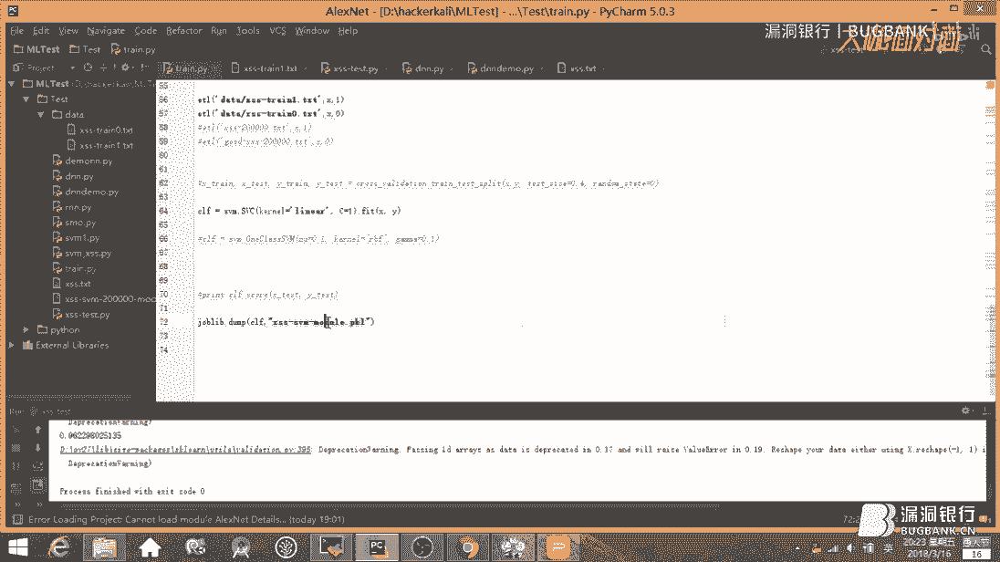
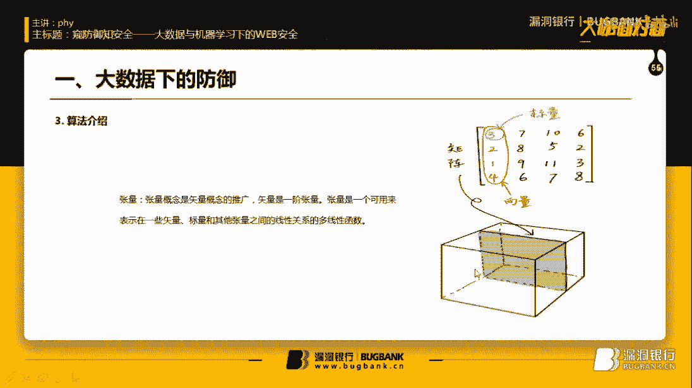

# 课程P1：大数据与机器学习下的WEB安全 🛡️💻

在本课程中，我们将学习如何利用大数据和机器学习技术来增强WEB安全防御。我们将从传统方法的局限性讲起，逐步深入到机器学习算法和深度学习神经网络的应用，并探讨其背后的原理与实现。

## 概述：从传统防御到智能防御

传统WEB应用防火墙主要依赖**正则表达式**来防御如SQL注入和XSS等攻击。虽然能应对大部分已知攻击，但对于**零日漏洞**的防御能力较弱，通常需要等待补丁发布。此外，传统WAF在**风控领域**（如识别刷单、薅羊毛行为）效果有限。

机器学习技术在图像、语音和自然语言处理领域已取得显著成果。其核心优势在于能够从大量已知数据中学习规律，从而**预测未知数据**。这就像构建一个函数 `f(x)`，输入新数据 `x`，就能得到预测输出 `f(x)`。

目前，大多数WEB入侵检测采用**无监督学习**方法，即使用正常的业务数据进行训练。任何与正常模式显著偏离的流量，都会被标记为潜在的异常攻击。

## 构建机器学习WAF的流程

构建一个基于机器学习的WAF，通常遵循以下流程：

1.  **数据收集**：从传统WAF或服务器日志中积累数据，包括拦截的攻击数据和正常业务流量。
2.  **数据结构化**：将收集到的日志数据转化为结构化的格式。
3.  **数据向量化**：将结构化数据转换为机器学习算法可以处理的**特征向量**。
4.  **模型训练**：将向量化后的数据送入算法模型进行训练。
5.  **预测与部署**：使用训练好的模型对新的业务流量进行实时预测和分类。

在企业的大数据架构中，数据从各个终端（如Web、APP）采集，经过处理存储在分布式系统（如HDFS）或数据库（如HBase）中，最终通过上层的数据挖掘和机器学习模型进行分析，应用于风控、安全、BI等场景。

## 核心算法：支持向量机

在安全和风控领域，核心任务之一是**异常检测**，例如识别异常用户、攻击流量或病毒木马。由于异常数据通常很少，难以收集足够样本进行标注，因此监督学习算法（需要大量已标注数据）可能不适用。

下面我们重点介绍**支持向量机**算法。

### SVM的基本原理

支持向量机是一种**二分类器**。其核心思想是：在样本空间中，找到一个**超平面**，能够将两类样本（例如正样本和负样本）尽可能地分开，并且使得两类样本中离这个超平面最近的点的间隔最大化。

这些离超平面最近的样本点被称为**支持向量**，SVM的名称也由此而来。

我们从一个简单的二维平面开始推导。一个平面的方程可以表示为：

`Ax + By + Cz + D = 0`

将其改写为向量形式。令权重向量 `ω = [A, B, C]`，特征向量 `x = [x, y, z]`，偏置 `b = D`，则平面方程可简化为：

`ω·x + b = 0`

样本点 `x_i` 到该超平面的距离 `d` 公式为：

`d = |ω·x_i + b| / ||ω||`

其中 `||ω||` 是向量 `ω` 的范数（例如L2范数）。

SVM的目标是最大化两个类别支持向量到超平面距离之和，即最大化 `2 / ||ω||`。这等价于最小化 `||ω||^2 / 2`。

其数学优化问题可以表述为：

在约束条件 `y_i (ω·x_i + b) ≥ 1` 对于所有样本 `i` 成立的前提下，最小化目标函数 `(1/2) * ||ω||^2`。

### 核函数：处理非线性问题

前面的推导基于样本线性可分的假设。然而现实中，数据往往是非线性可分的。例如，在二维平面中，一条曲线无法用直线完美分割。

解决方法是使用**核函数**。核函数可以将原始特征映射到更高维的空间，使得在原始空间中非线性可分的数据，在高维空间中变得线性可分。

常见的核函数包括：
*   **线性核**
*   **多项式核**
*   **径向基函数核**

对于非线性SVM，决策函数变为：

`f(x) = Σ(α_i * y_i * K(x_i, x)) + b`

其中 `K(x_i, x)` 就是核函数，它定义了高维空间中的内积运算。

### One-Class SVM：用于异常检测

标准的SVM是监督学习，需要正负两类样本。而**One-Class SVM**是一种用于异常检测的无监督方法。它只使用**一类样本**（通常是正常数据）进行训练，其目标是找到一个超球面或超平面，将大部分正常数据包围起来。落在边界之外的数据点则被视为异常。

## 实战：使用SVM检测XSS攻击

上一节我们介绍了SVM的理论基础，本节我们通过一个简单的例子，看看如何用SVM算法来检测XSS攻击。

我们的目标是：从URL请求中区分出正常的请求和潜在的XSS攻击请求。以下是实现步骤：

1.  **准备数据**：收集两类URL数据，一类是正常请求，一类是已知的XSS攻击payload。
2.  **特征工程**：将URL字符串转化为数值特征向量。我们可以提取一些简单特征：
    *   URL长度。
    *   是否包含特殊字符，如尖括号 `<`, `>`。
    *   是否包含XSS常见关键词，如 `script`, `alert`, `onerror`。
    *   是否包含特定模式，如 `http://`（可能用于外链）。
3.  **向量化**：使用正则表达式检查上述特征，为每个URL生成一个多维特征向量。例如，`[长度， 是否含<>, 是否含script, 是否含http]`。
4.  **训练模型**：使用Python的`scikit-learn`库，将特征向量和对应的标签（正常为0，攻击为1）送入SVM模型进行训练。
5.  **预测与评估**：使用训练好的模型对新的URL数据进行预测，并计算准确率。

在简单的测试集上，这种方法可以达到较高的准确率。但在复杂的真实业务场景中，需要更精细的特征工程和模型调优来降低误报率。

## 进阶：深度学习与神经网络

传统机器学习方法（如SVM）需要人工进行特征工程，而深度学习能够自动从原始数据中学习特征表示，在处理复杂模式时往往更具优势。

### 神经网络基础

神经网络模仿人脑神经元的工作方式。最基本的单元是**神经元**，其计算可表示为：

`z = W·x + b`

其中：
*   `x` 是输入向量。
*   `W` 是权重矩阵。
*   `b` 是偏置项。
*   `z` 是线性输出。

为了引入非线性，使网络能够拟合复杂函数，我们需要在神经元后添加**激活函数**，如ReLU、Sigmoid等。加入激活函数 `σ` 后，输出变为：

`a = σ(z)`

一个神经网络由多层这样的神经元连接而成。数据从输入层进入，经过若干隐藏层的变换，最终到达输出层得到结果。

### 神经网络的训练：反向传播与梯度下降

神经网络通过**训练**来学习。训练的目标是找到一组参数（`W`和`b`），使得网络的预测输出尽可能接近真实值。

1.  **定义损失函数**：用于衡量预测值与真实值的差距，例如均方误差。
    `Loss = (1/2) * Σ(y_pred - y_true)^2`
2.  **反向传播**：利用链式法则，从输出层开始，反向计算损失函数对每一层参数的梯度（偏导数）。
3.  **梯度下降**：沿着梯度反方向（即函数下降最快的方向）更新参数，逐步减小损失函数值。参数更新公式为：
    `W_new = W_old - learning_rate * ∂Loss/∂W`
    `b_new = b_old - learning_rate * ∂Loss/∂b`

通过多次迭代，网络参数不断调整，最终使模型拟合训练数据。

### 使用神经网络进行异常检测

对于像系统命令日志或HTTP流量这样的序列数据，我们可以使用深度学习模型（如循环神经网络RNN或卷积神经网络CNN）进行处理。

关键步骤是将文本数据转化为数值张量。常用方法是**词嵌入**：
1.  **分词**：将句子分割成单词或子词单元。
2.  **构建词表**：基于训练数据创建词汇表。
3.  **向量化**：将每个词映射为高维空间中的一个向量。简单的方法可以是**One-Hot编码**，更优的方法是使用预训练的词嵌入模型（如Word2Vec, GloVe）。

将序列数据转化为张量后，就可以构建深度神经网络模型（例如包含Embedding层、LSTM层、全连接层）进行分类或异常检测训练。深度网络能够自动捕捉序列中的时序依赖和复杂模式，通常比传统方法效果更好。

## 机器学习自身的安全问题

机器学习在提升安全能力的同时，其自身也面临新的安全挑战。

*   **对抗样本**：通过对输入数据添加人眼难以察觉的微小扰动，可以导致模型做出完全错误的预测。例如，一张被轻微修改的图片，可能让人脸识别系统将陌生人识别为特定用户。
*   **框架与依赖库漏洞**：机器学习系统依赖复杂的软件栈（如TensorFlow, PyTorch框架，以及底层的NumPy、OpenCV等库）。这些依赖中可能存在安全漏洞，成为攻击入口。
*   **数据投毒**：攻击者通过污染训练数据，可以在模型训练阶段植入后门或偏见，影响模型上线后的行为。

因此，在应用机器学习于安全敏感领域时，必须同时考虑其自身的安全性和鲁棒性。

## 总结

在本课程中，我们一起学习了大数据和机器学习技术在WEB安全防御中的应用。

我们从传统WAF的局限性出发，探讨了机器学习在异常检测方面的优势。我们深入讲解了**支持向量机**的原理，包括其优化目标、核函数处理非线性问题的方法，以及适用于异常检测的One-Class SVM变体，并通过一个检测XSS攻击的实例进行了演示。

接着，我们介绍了更强大的**深度学习神经网络**。我们了解了神经元、激活函数、反向传播和梯度下降等核心概念，并讨论了如何将文本数据转化为张量，并用深度网络进行安全检测。

最后，我们审视了机器学习技术本身面临的安全挑战，如对抗样本和供应链漏洞，认识到在利用其强大能力的同时，也必须关注其安全性。

机器学习为WEB安全防御提供了新的视角和强大的工具，但它并非银弹。将其作为辅助手段，与人的经验和传统方法相结合，才能构建更智能、更健壮的安全防御体系。