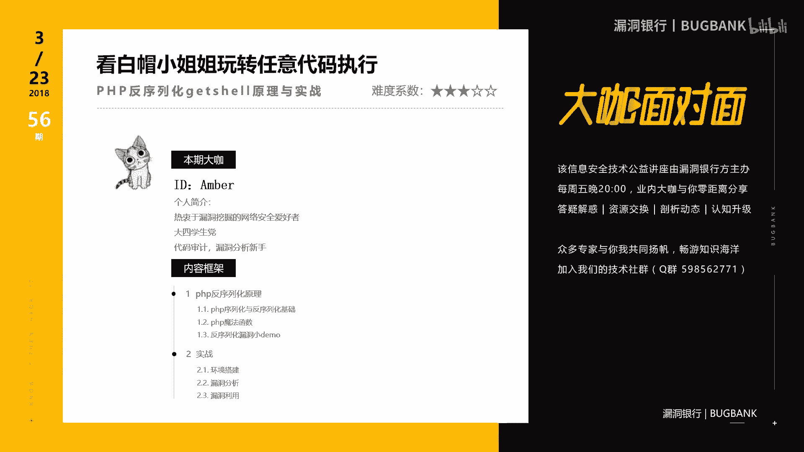
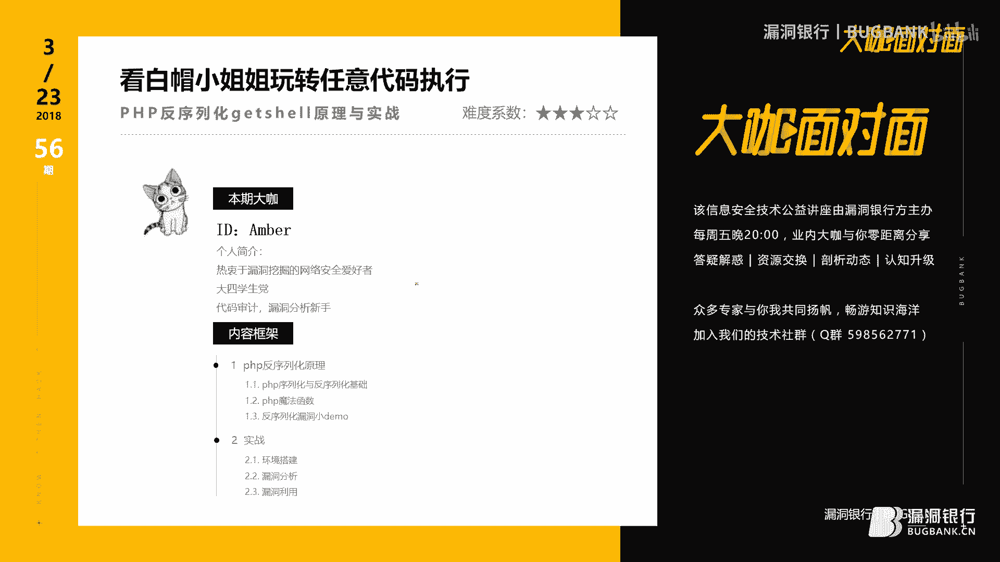
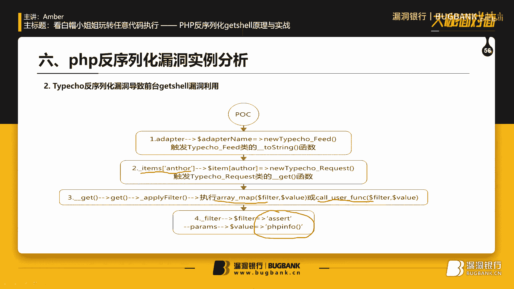
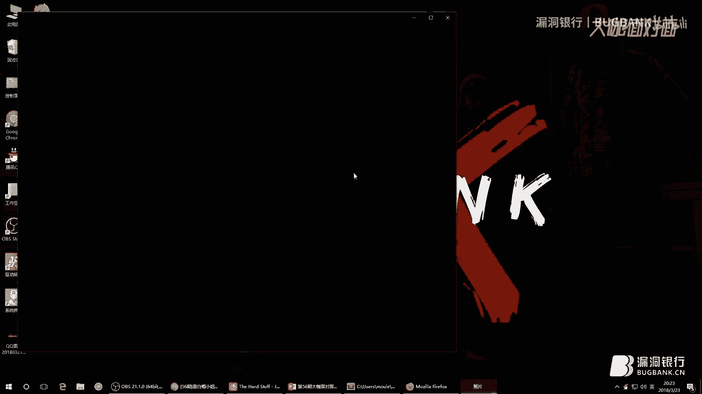
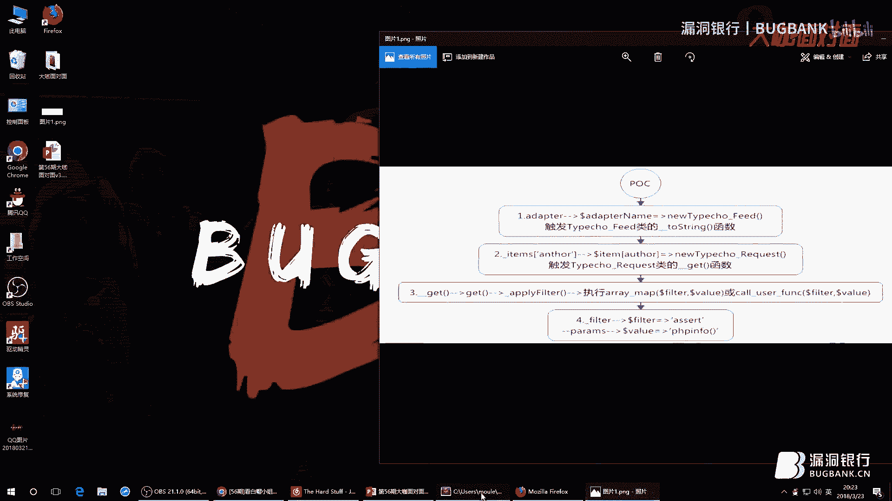
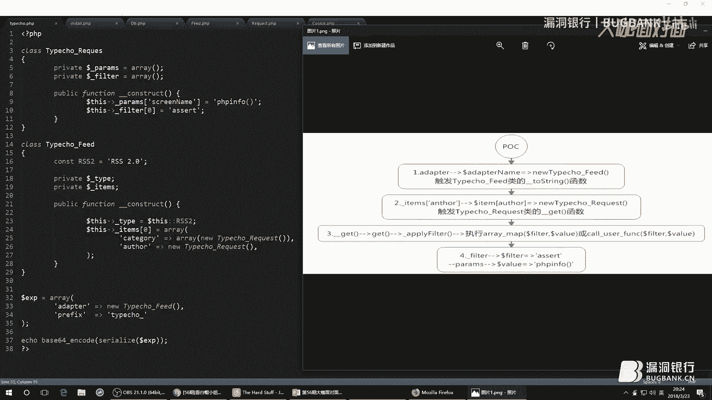
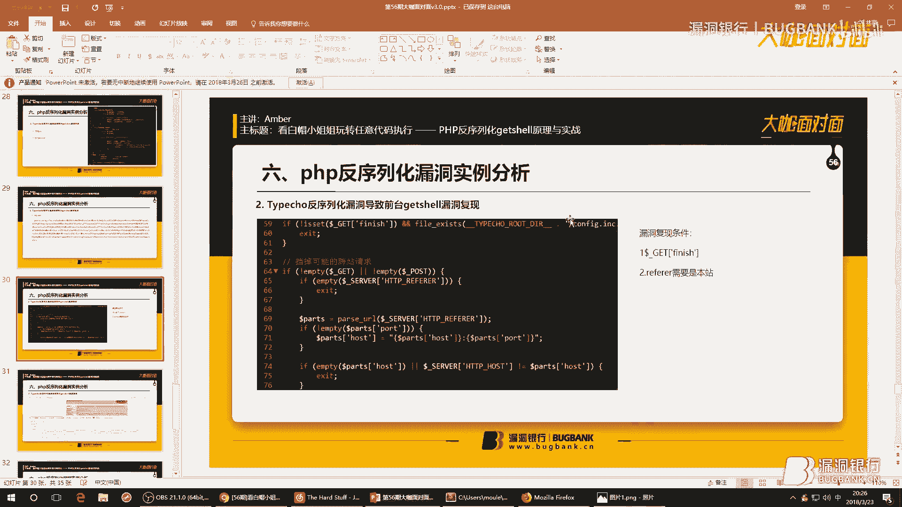
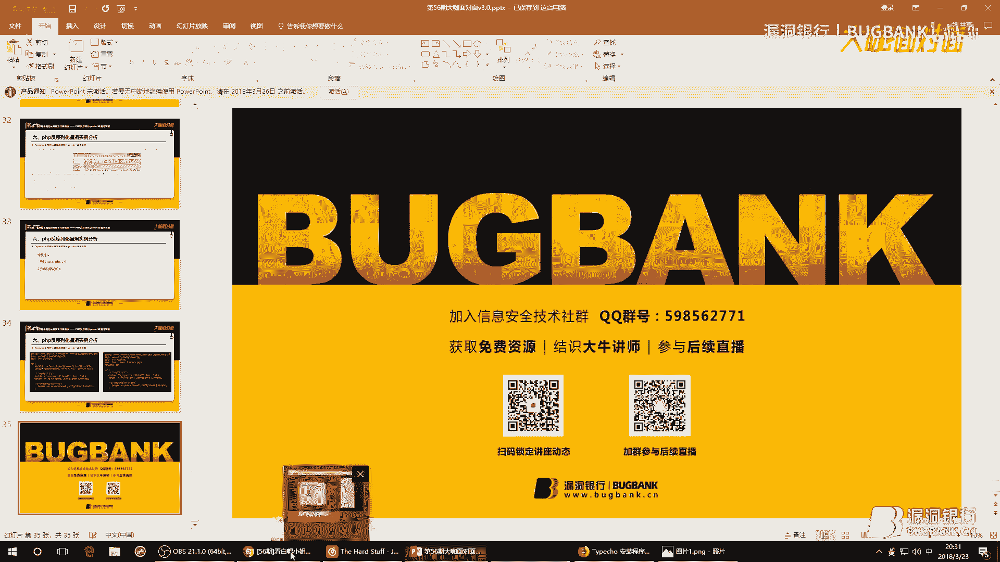
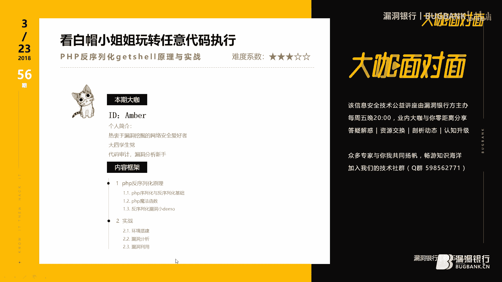

# 课程 P1-56：PHP反序列化漏洞原理与实战 🎯







在本节课中，我们将学习PHP反序列化漏洞的原理、发现方法以及如何利用它执行任意代码。课程内容分为两部分：第一部分介绍PHP序列化、反序列化及魔法函数等基础知识；第二部分通过实战案例，分析一个真实博客系统中的反序列化漏洞。

## 概述

序列化是将变量转换为字符串的过程，以便保存或传输。反序列化则是将字符串还原为原始变量。PHP提供了 `serialize()` 和 `unserialize()` 函数来实现这两个过程。然而，如果反序列化的数据由用户控制，并且程序中存在特定的“魔法函数”，就可能引发安全漏洞，导致任意代码执行。

## 第一部分：基础知识

### 什么是类与对象

在了解序列化之前，需要先理解类和对象的概念。类可以看作是一个蓝图，它定义了属性和方法。对象则是根据这个蓝图创建的具体实例。

例如，我们可以定义一个“人”的类，它拥有“姓名”和“年龄”属性，以及“吃饭”、“睡觉”等方法。创建一个具体的人，比如“小明”，就是一个对象。

**代码示例：定义一个Person类**
```php
class Person {
    public $name;
    public $age;
    
    public function information() {
        echo "Name: " . $this->name . ", Age: " . $this->age;
    }
}

// 创建对象（实例化）
$per = new Person();
$per->name = "Amber";
$per->age = 18;
$per->information(); // 输出：Name: Amber, Age: 18
```

### PHP序列化与反序列化

PHP使用 `serialize()` 函数将对象转换为字符串，使用 `unserialize()` 函数将字符串还原为对象。序列化后的字符串包含了类名和对象的属性值，但不包含方法。

**代码示例：序列化与反序列化**
```php
// 序列化
$serializedStr = serialize($per);
echo $serializedStr;
// 输出类似：O:6:"Person":2:{s:4:"name";s:5:"Amber";s:3:"age";i:18;}

// 反序列化（前提是Person类已定义）
$unserializedObj = unserialize($serializedStr);
$unserializedObj->information(); // 输出：Name: Amber, Age: 18
```

### PHP魔法函数

PHP类中有一些特殊的“魔法函数”，它们会在特定条件下自动触发，无需手动调用。这些函数是反序列化漏洞的关键。

以下是六个与反序列化相关的重要魔法函数：

1.  **`__construct()`**: 在创建对象时自动调用。
2.  **`__destruct()`**: 在对象被销毁时自动调用。
3.  **`__sleep()`**: 在使用 `serialize()` 函数时自动调用。
4.  **`__wakeup()`**: 在使用 `unserialize()` 函数时自动调用。
5.  **`__toString()`**: 在把对象当作字符串使用时自动调用。
6.  **`__get()`**: 在从不可访问的属性读取数据时自动调用。

**代码示例：魔法函数触发**
```php
class MagicExample {
    public function __construct() { echo "构造！\n"; }
    public function __toString() { return "字符串化！\n"; }
    public function __destruct() { echo "析构！\n"; }
}

$obj = new MagicExample(); // 输出：构造！
echo $obj; // 输出：字符串化！
// 脚本结束时，对象销毁，输出：析构！
```

### PHP反序列化漏洞的产生原理

反序列化漏洞，也称为对象注入漏洞。其产生需要满足几个条件：
1.  程序中存在 `unserialize()` 函数，并且其参数用户可控。
2.  反序列化过程中，会实例化一个类。
3.  该类中定义了会自动触发的魔法函数（如 `__destruct`, `__wakeup`, `__toString` 等）。
4.  这些魔法函数中执行了危险操作（如文件删除、代码执行），且操作参数用户可控。

漏洞触发链可以简化为：**可控输入 -> `unserialize()` -> 实例化特定类 -> 触发魔法函数 -> 执行危险代码**。

## 第二部分：漏洞发现与实战








上一节我们介绍了反序列化漏洞的原理，本节中我们来看看如何发现和利用这类漏洞。



### 漏洞发现与简单利用


在代码审计时，我们的目标是找到可控的 `unserialize()` 函数，并追踪其可能触发的危险魔法函数。




以下是两个简单的漏洞模型：


**案例一：利用 `__destruct()` 删除文件**
假设在 `test5.php` 中发现以下类：
```php
class DeleteFile {
    public $filename;
    public function __destruct() {
        unlink($this->filename); // 危险函数：删除文件
        echo $this->filename . " 被删除。";
    }
}
```
我们的思路是：找到一个可控的 `unserialize()` 来调用 `DeleteFile` 类，从而触发 `__destruct()` 函数。
随后在 `test6.php` 中发现了可利用点：
```php
include(‘test5.php‘);
$data = unserialize($_GET[‘payload‘]); // 参数可控
```
接下来构造Payload：
1.  实例化 `DeleteFile` 类。
2.  将 `filename` 属性设置为要删除的文件（如 `1.txt`）。
3.  序列化该对象。
4.  将序列化字符串作为 `payload` 参数传递给 `test6.php`。

访问 `test6.php?payload=(序列化字符串)` 后，`1.txt` 文件将被删除。


**案例二：利用 `__toString()` 读取文件**
假设在 `test8.php` 中发现以下类：
```php
class ReadFile {
    public $filename;
    public function __toString() {
        return file_get_contents($this->filename); // 危险函数：读取文件
    }
}
```
我们的思路是：找到一个可控的 `unserialize()` 来调用 `ReadFile` 类，并且后续有将对象当作字符串使用的代码（以触发 `__toString()`）。
在 `test9.php` 中发现了可利用点：
```php
include(‘test8.php‘);
$obj = unserialize($_GET[‘payload‘]); // 参数可控
echo $obj; // 将对象作为字符串输出，触发 __toString()
```
构造Payload的过程与案例一类似，访问后即可读取指定文件内容。




### 综合实战：Typecho博客系统反序列化漏洞分析

本节我们将分析一个真实的、链式调用更复杂的反序列化漏洞（Typecho 1.0/1.1 安装文件漏洞）。

**漏洞概述**
漏洞存在于 `install.php` 文件中。攻击者通过构造特定的序列化数据，传递给 `config` 参数，最终可以触发 `call_user_func` 或 `assert` 函数，实现任意代码执行。

**漏洞分析流程**
1.  **入口点**：在 `install.php` 第230行，`$config = unserialize(base64_decode(Typecho_Cookie::get(‘__typecho_config‘)))`。这里 `__typecho_config` 来自Cookie或POST数据，用户可控。
2.  **触发链起点**：`unserialize` 的数据被用来实例化 `Typecho_Db` 类。在其 `__construct` 构造函数中，代码进行了字符串拼接操作：`$adapterName = ‘Typecho_Db_Adapter_‘ . $adapter;`。如果 `$adapter` 是一个对象，PHP会尝试将其转换为字符串。
3.  **触发 `__toString()`**：为了触发字符串转换，我们让 `$adapter` 是一个 `Typecho_Feed` 类的对象。该类定义了 `__toString()` 方法。在该方法中，有一处代码：`$item[‘author‘]->screenName`。如果 `screenName` 是 `$item[‘author‘]` 对象的一个不可访问属性，就会触发 `__get()` 魔法函数。
4.  **触发 `__get()`**：我们让 `$item[‘author‘]` 是 `Typecho_Request` 类的对象。该类定义了 `__get()` 方法，其中会调用 `get()` 方法，并最终调用 `applyFilter()` 方法。
5.  **最终漏洞点**：在 `applyFilter()` 方法中，发现了危险函数调用：`call_user_func($filter, $value)`。其中 `$filter` 和 `$value` 的值均来自我们可控的反序列化数据。
6.  **构造利用**：通过精心构造的反序列化数据，我们可以让 `$filter=‘assert‘`，`$value=‘phpinfo()‘`，从而实现任意代码执行。

**漏洞利用Payload构造思路**
根据上述分析，我们需要构造一个嵌套的对象结构：
1.  最外层是 `Typecho_Db` 对象，其 `adapter` 属性设置为 `Typecho_Feed` 对象。
2.  在 `Typecho_Feed` 对象的 `items` 数组中，设置 `author` 属性为 `Typecho_Request` 对象。
3.  在 `Typecho_Request` 对象中，设置 `params` 属性，使其 `_filter` 数组包含我们想要的过滤器（如 `assert`），并设置对应的值（如 `phpinfo()`）。

将整个结构序列化后，再进行Base64编码，作为 `__typecho_config` 的值发送。


**漏洞复现与修复**
-   **复现**：搭建存在漏洞的Typecho版本，在安装页面，通过Cookie或POST提交构造好的Payload，即可看到 `phpinfo()` 页面被成功执行。
-   **修复**：
    1.  **临时措施**：安装完成后立即删除 `install.php` 文件。
    2.  **根本措施**：升级到已修复的版本。修复方案通常是在 `install.php` 中不再直接反序列化用户输入的配置，而是采用更安全的方式处理初始化数据。


## 总结



本节课中我们一起学习了PHP反序列化漏洞的完整知识体系：
1.  **基础概念**：理解了PHP中序列化 (`serialize`)、反序列化 (`unserialize`) 的作用，以及 `__construct`、`__destruct`、`__toString` 等魔法函数的触发条件。
2.  **漏洞原理**：掌握了反序列化漏洞的产生条件：用户可控输入、`unserialize()` 函数、存在危险魔法函数的类。
3.  **发现与利用**：学习了通过代码审计寻找漏洞的模式：先找可控的 `unserialize()`，再找其触发的类链中的危险操作。并通过删除文件和读取文件的简单例子加深理解。
4.  **实战分析**：深入剖析了Typecho博客系统中一个复杂的反序列化漏洞链，理解了如何从入口点开始，通过一系列魔法函数的自动触发，最终达到执行任意代码的目的。


反序列化漏洞是一种危害极大的漏洞类型，需要开发者在代码中谨慎处理用户输入，并对反序列化操作进行严格限制。对于安全研究人员而言，理解其原理是进行白盒审计和漏洞挖掘的重要基础。