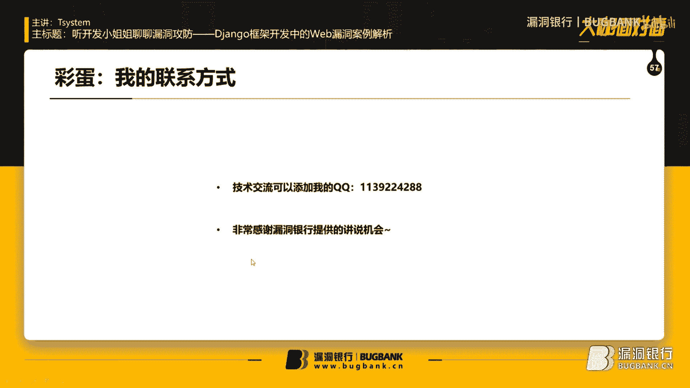
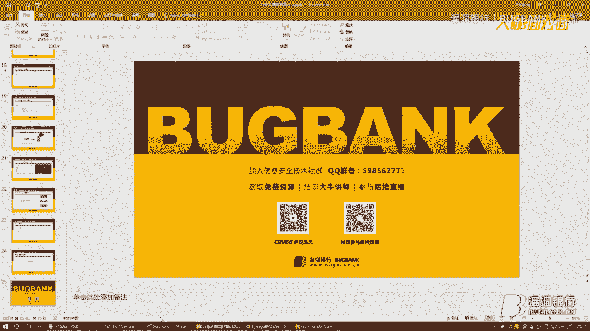
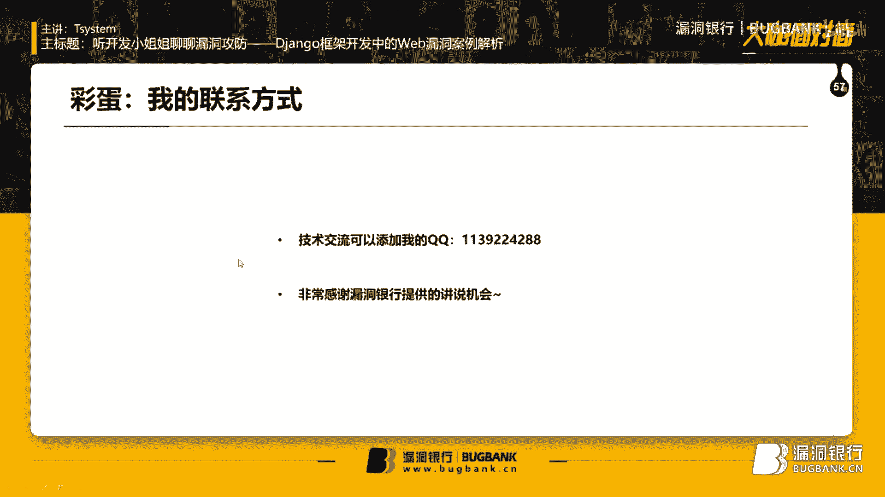
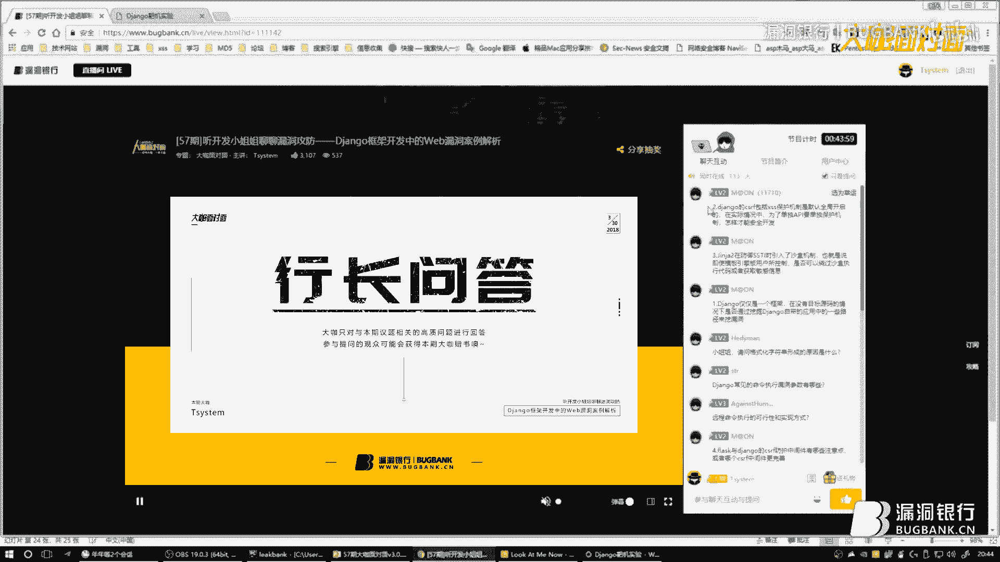
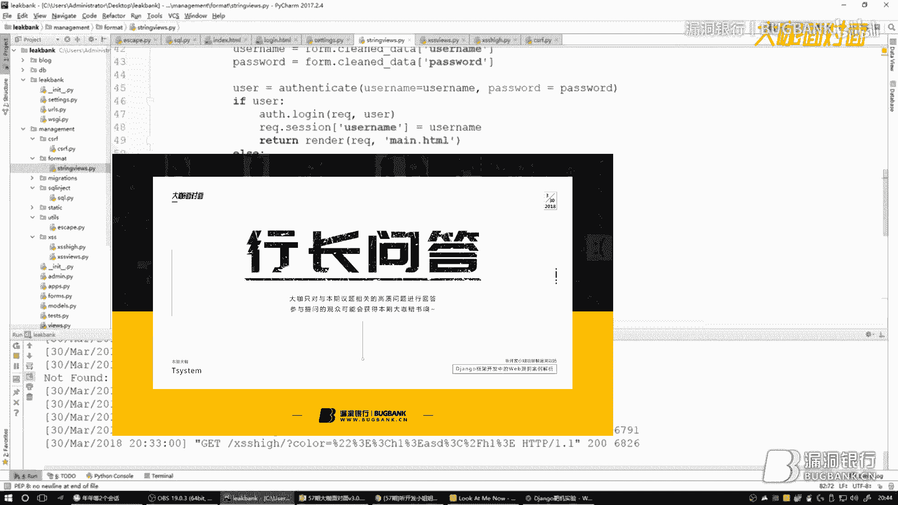
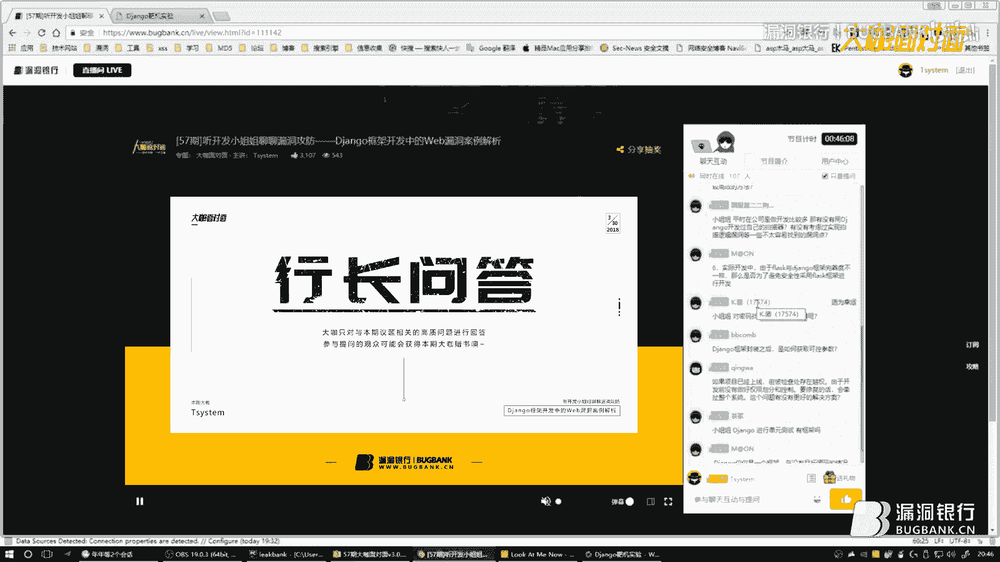
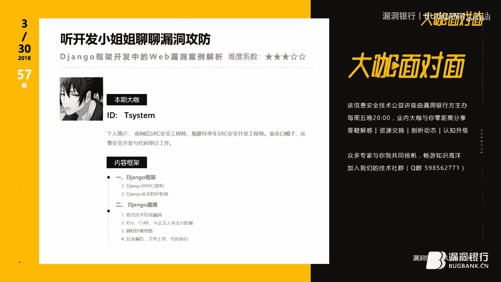
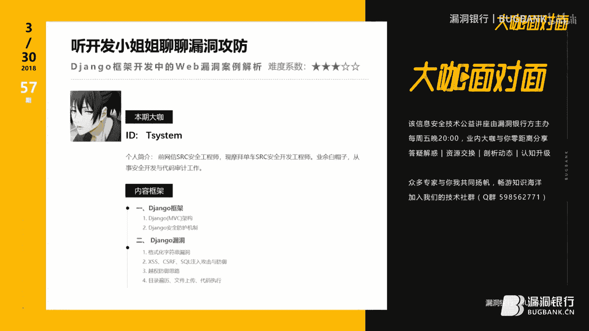

# 课程P1-57：Django框架开发中的Web漏洞案例解析 🛡️💻


在本课程中，我们将跟随开发工程师的视角，深入探讨在Django框架开发过程中可能遇到的Web安全漏洞。课程将从攻击和防御两个角度，分析漏洞的成因、利用方式以及如何编写更安全的代码。

***


## 一、Django的MVC架构与快速入门 🏗️

上一节我们概述了课程内容，本节中我们来看看Django的基础架构。

Django采用了经典的MVC（Model-View-Controller）设计模式。以用户修改个人信息为例，其运行流程如下：
1.  用户发起修改请求（如一个URL链接）。
2.  请求到达URL控制器，由它进行路由匹配，找到对应的视图函数。
3.  视图函数执行核心逻辑，例如从用户Session中取出Token与服务器端存储的Token进行比对，验证权限。
4.  验证通过后，视图函数从Model（模型）中取出用户数据。
5.  取出的数据返回给视图，视图将其渲染到前端模板，最终展示给用户。

了解架构后，以下是快速创建一个Django项目的步骤：

1.  **安装与创建项目**：使用 `pip install django` 安装框架，然后通过 `django-admin startproject myproject` 命令创建项目。
2.  **创建应用**：进入项目目录，使用 `python manage.py startapp myapp` 创建一个应用。应用目录下的 `views.py` 存放业务逻辑，`models.py` 定义数据模型。
3.  **注册应用与配置数据库**：在项目的 `settings.py` 文件的 `INSTALLED_APPS` 列表中注册新创建的应用。同时，在 `settings.py` 中配置数据库连接信息。
4.  **运行项目**：执行 `python manage.py runserver` 命令，即可在本地启动开发服务器。

当HTTP请求到达Django时，框架会生成一个 `HttpRequest` 对象，它包含以下重要属性：
*   `method`: 请求方法（GET、POST等）。
*   `FILES`: 上传的文件。
*   `COOKIES`: 客户端发来的Cookie信息（字典类型）。

此外，通过启用中间件，还可以使用：
*   `user`: 代表当前用户的对象（若未认证则为 `AnonymousUser`）。
*   `session`: 用于服务器端会话存储。

在视图函数中，必须返回一个 `HttpResponse` 对象。常用的构建响应的方法有：
*   `render(request, template_name, context)`: 将数据（上下文）渲染到指定模板并返回HTML页面。
*   `redirect(‘some/url/’)`: 将用户重定向到另一个URL。

***

## 二、Django的安全防御机制与常见漏洞 🔐

在快速了解Django的工作原理后，本节我们将重点审视其安全机制及可能被绕过的漏洞。

### 1. 格式化字符串漏洞

**漏洞成因**：开发者错误地使用Python的字符串格式化功能，将用户可控数据直接用于格式化，导致敏感信息泄露。

**攻击示例**：
假设视图函数中存在如下不安全代码：
```python
template = “User email: {}”.format(request.user)
email = request.POST.get(‘email’)
result = template.format(email=email)
```
攻击者可以构造特殊的 `email` 参数为 `{user.password}`。当该参数被填入模板字符串时，`format()` 函数会解析它，并尝试获取 `request.user` 对象的 `password` 属性，从而导致密码泄露。

**更危险的利用**：
攻击者可以进一步利用Django自带的 `admin` 应用作为跳板，访问项目配置文件 `settings.py`。例如，构造Payload：`{user.groups.model._meta.app_config.module.admin.settings.SECRET_KEY}`，可能泄露数据库密码和密钥等核心配置。

**安全修复**：
避免直接使用 `format()` 处理用户输入。应使用Django模板引擎的安全渲染机制：
```python
email = request.POST.get(‘email’)
return render(request, ‘template.html’, {‘email’: email})
```
这样，所有变量都会经过Django模板的自动转义处理。

### 2. XSS（跨站脚本）漏洞

**漏洞成因**：虽然Django模板默认会对变量进行HTML转义，但在某些情况下，这种保护会被关闭或绕过。

**不安全代码示例**：
```python
color = request.GET.get(‘color’, ‘’)
return render(request, ‘template.html’, {‘color’: mark_safe(color)})
```
`mark_safe()` 或模板过滤器 `|safe` 会告诉Django该内容是安全的，无需转义，从而引入XSS风险。

**其他可能绕过防护的场景**：
以下是几种需要特别注意的情况：
1.  **在JavaScript中直接输出动态内容**：例如 ``。建议对动态内容使用 `escapejs` 过滤器。
2.  **使用 `mark_safe` 或关闭 `autoescape`**：如前所述，这会禁用转义。
3.  **DOM型XSS**：前端JavaScript直接操作DOM时产生的漏洞。建议对输出到HTML的内容进行编码。
4.  **直接使用 `HttpResponse` 返回动态内容**：例如 `HttpResponse(name)`，这会绕过模板引擎。

**安全修复**：
对于需要在模板中渲染但又可能包含HTML的内容，应使用 `django.utils.html.escape` 函数进行转义。
```python
from django.utils.html import escape
color = escape(request.GET.get(‘color’, ‘’))
return render(request, ‘template.html’, {‘color’: color})
```
注意：`escape` 函数默认只转义 `<`, `>`, `&`。若要转义引号，需传入第二个参数 `True`：`escape(value, True)`。

### 3. CSRF（跨站请求伪造）防护

**Django的默认防护**：
Django通过中间件 `django.middleware.csrf.CsrfViewMiddleware` 提供CSRF防护。它要求每个POST表单都必须携带一个名为 `csrfmiddlewaretoken` 的令牌，该令牌由服务器生成并与用户会话绑定。

**防护要点**：
1.  **确保中间件开启**：检查 `settings.py` 中的 `MIDDLEWARE` 设置。
2.  **在模板表单中添加令牌**：使用 `` 模板标签。
3.  **处理AJAX请求**：需要将CSRF令牌放在请求头中，如 `X-CSRFToken`。

**Session与Cookie机制的对比**：
早期可能使用Session存储令牌，但这会给服务器带来存储压力。Django默认的CSRF机制是基于Cookie的，更高效。它采用“双Cookie验证”等策略，既安全又减轻了服务器负担。

### 4. SQL注入漏洞

**漏洞成因**：在Django中，如果错误地使用原始SQL查询或底层数据库API，仍可能导致SQL注入。

**不安全代码示例**：
```python
from django.db import connection
def user_contacts(request):
    user = request.GET.get(‘username’)
    sql = “SELECT * FROM user_contacts WHERE username = ‘%s’” % user
    cursor = connection.cursor()
    cursor.execute(sql) # 危险！直接拼接字符串
```
**安全修复**：
*   **使用Django ORM**：这是首选方案，ORM会处理参数化查询。
*   **使用参数化查询**：如果必须执行原始SQL，务必使用参数化查询。
    ```python
    cursor.execute(“SELECT * FROM user_contacts WHERE username = %s”, [user])
    ```
    注意：Django的数据库后端使用 `%s` 作为占位符，而非某些驱动使用的 `?`。

**核心防御思想**：
从以上几种漏洞可以看出，最根本的原则是：**永远不要信任用户输入的任何数据**。对所有来自客户端的参数（GET, POST, Cookie, Header等）都必须进行严格的验证、过滤和转义。

***

## 三、逻辑漏洞：越权与Python脚本的结合利用 🕵️♂️





上一节我们讨论了常见的注入和跨站漏洞，本节中我们来看看逻辑层面的安全问题。

越权漏洞通常由于访问控制不严导致。一个典型案例是：Web应用在Cookie或请求参数中明文传递用户ID。
```http
Cookie: user_id=123
```
攻击者可以轻易地将 `user_id` 修改为124、125等，尝试访问其他用户的数据。如果后端没有检查当前登录用户是否与请求的用户ID匹配，就会产生越权访问。

**利用方式**：
攻击者可以编写简单的Python脚本，自动化地遍历用户ID，批量获取敏感信息。
```python
import requests
for uid in range(100, 200):
    cookies = {‘user_id’: str(uid)}
    resp = requests.get(‘http://target.com/profile’, cookies=cookies)
    if ‘email’ in resp.text:
        print(f”Found data for UID {uid}”)
```

**防御措施**：
1.  **使用不可预测的标识符**：避免使用自增整数作为用户唯一标识符在客户端传递。可以使用UUID或加密后的令牌。
2.  **严格的会话管理**：用户身份应由服务器端的Session决定，而不是客户端传来的参数。
3.  **每次操作进行权限校验**：在关键业务逻辑处，必须验证当前登录用户是否有权操作目标资源。

***



## 四、目录遍历漏洞与综合防御建议 📁

本节我们探讨另一个常见漏洞——目录遍历，并对Django安全开发进行总结。

**漏洞成因**：当代码直接使用用户输入的文件路径来操作文件系统，且未做任何限制时，就可能发生目录遍历。
```python
def read_file(request):
    filename = request.GET.get(‘file’, ‘default.txt’)
    with open(filename, ‘r’) as f: # 危险！用户可输入 ‘../../../etc/passwd’
        content = f.read()
    return HttpResponse(content)
```

**防御措施**：
1.  **净化输入**：过滤用户输入中的 `../` 等特殊路径字符。
2.  **限定基础目录**：使用 `os.path.join` 将用户输入的文件名拼接到一个安全的、预定义的目录之后。
3.  **白名单验证**：如果可能，只允许访问已知、安全的文件列表。
```python
import os
from django.conf import settings



def safe_read_file(request):
    filename = request.GET.get(‘file’)
    # 过滤路径遍历字符
    if ‘..’ in filename or filename.startswith(‘/’):
        return HttpResponse(“Invalid file path.”)
    # 拼接安全的基础目录
    base_dir = settings.STATICFILES_DIRS[0]
    filepath = os.path.join(base_dir, filename)
    # 可选：验证最终路径是否仍在基础目录内
    if not os.path.commonprefix([filepath, base_dir]) == base_dir:
        return HttpResponse(“Access denied.”)
    # 安全地读取文件
    ...
```



**Django安全开发综合建议**：
以下是构建安全Django应用的关键点：
1.  **零信任原则**：对所有用户输入进行严格的验证和过滤。
2.  **最小权限原则**：严格控制文件系统、数据库和系统命令的访问权限。
3.  **安全的访问控制**：实现完善的用户认证和授权逻辑，避免越权。
4.  **使用加密传输与存储**：敏感数据（如密码）必须加密存储（使用强哈希算法如PBKDF2、bcrypt），通信使用HTTPS。
5.  **安全的文件上传**：限制上传文件类型、大小，并确保上传目录没有执行权限。
6.  **管理会话安全**：设置合理的Session过期时间，使用安全的Cookie设置（HttpOnly, Secure）。
7.  **保持依赖更新**：定期更新Django及其依赖库，以修复已知安全漏洞。



***


## 总结 📝




本节课中我们一起学习了Django框架开发中多个关键的Web安全议题。

我们从Django的MVC架构和请求处理流程入手，理解了其基本工作原理。随后，我们深入分析了**格式化字符串漏洞**、**XSS漏洞**、**CSRF攻击**和**SQL注入**的成因与防御方法，核心在于不信任用户输入并善用框架的安全特性。


接着，我们探讨了**逻辑漏洞（越权）** 如何与自动化脚本结合进行利用，强调了访问控制的重要性。最后，我们分析了**目录遍历漏洞**，并给出了一系列Django安全开发的综合建议。




记住，安全是一个持续的过程，而非一劳永逸的特性。在开发中始终保持安全意识，遵循安全最佳实践，是构建健壮Web应用的基石。