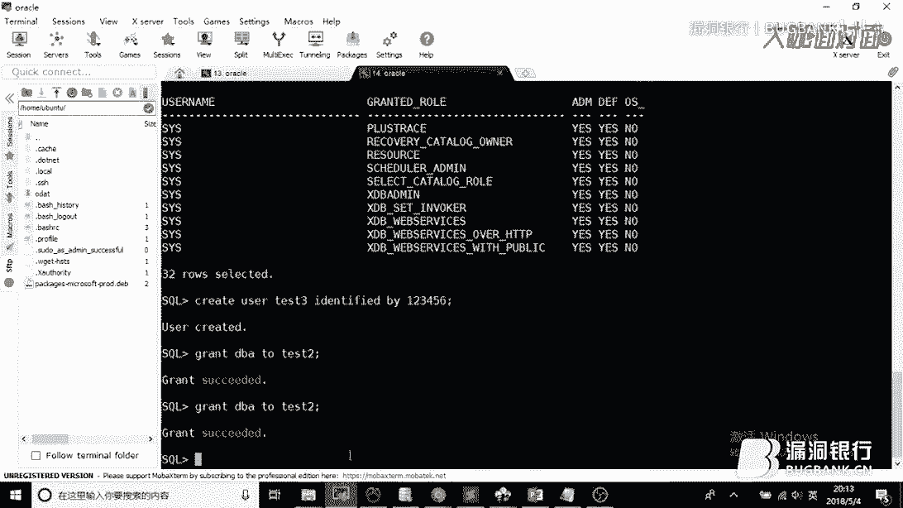

# P1：60_x264 - 漏洞银行BUGBANK - BV1Ft411f7gq

Yeah。

嗯。🎼呃，我来分享提前这一方面内容的原因是因为呃通过审计去找到一个circle注入之后，经常会困惑于说没有办法进一步去进行攻击。所以呃才去花了很大功夫去总结提全这样的一个事情。

然后现在也是把我总结的东西分享给大家。上一次也就是第58期呃，在我们的漏洞银行应该也有一些录屏入屏入屏视频。然后是讲了mycircle和MScicle的一些提前操作。

但是因为时间原因就没有讲到这个le的提前操作。所以这一次是继续给大家分享完这部分。嗯，我的介绍就这样。嗯，好嘞，呃感谢P大卡2少我们大咖面对面。那因为今天时间也呃差不多，我们就。🎼呃。

直接直奔主题好不好？嗯，好的，这次我的分享其实是主要就是这一个呃oracle的提前操作。和上次一样，我会主要抓住一些典型的提前方法，去给大家讲解一下，对于oracle数据库提全来说。

它的一些主要的思路是怎样的。然后会针对一些比较容易复现的例子去进行一些实际操作，然后大家去呃了解一下这样的事情。呃，然后的话就是讲解提前操作，它背后的一些原理。比如说分析我们的漏洞呃EXPPOC呃。

或者是一些内部的一些操作原理之类的。

然后我们今天的内容的话哈呃这里PPT上给的目录可能有点少。但是我详细的来说哈，详细的来说，我接下来的是主要会讲解第一个如何快速搭建这个oracle的环境。第二个是oracle数据库的基本操作。

第三个是如何去获取oracle的一些默认密码，或者是呃入口令什么的。第四个就是讲解oracle10这一版本的提全漏洞，以及再往后就是只如何通如何通过oracle数据库去执行我们的java代码。

最后就是oracle11G版本的一个逻辑漏洞。呃，这就是本次要讲的全部内容。呃，废话就先不多说了，我们就直奔主题。首先来说那个题。首先就来讲一下如何快速搭建这样的环境。呃，因为上次通过上一次的分享。

我大概是了解到可能说呃会有更多的呃我们的新人希望来通过呃漏洞银行这一个机会来学习一些东西。而上次因为时间原因，我讲的也太呃有也有一点快，所以这次我会尽量的放详细一点。

因为我们这次只有一个数据库需要去介绍。然后对于新人来说，呃，就拿我刚开始来说嘛，我是很少接触像oracle这样的数据库的，也是到后面我在学java代码审计的时候，才慢慢接触这个oracle数据库。

然后才去学习它的一些东西。所以对于新人来说，学习如何搭建这样一个复现这样一个环境，应该是比较重要的一件事情。呃，搭建环境来说的话。主要就是两个两个途呃两个途径嘛，一个是wemware。

一个是使用docker。我在之前的时候，也就是在准备上一次分享的时候，是使用了微mware，然后在windows2003里面去搭建了我的呃测试环境。但是非常令人那个恼火的事情。

就是中间我去打了去北京打了一场比赛。然后回来的时候就是那个电脑丢在北京了。所以我的环境都是在这两天现搭的。然后因为我昨天中午的时候才借到我朋友的一部电脑，然后才装好系统，然后才装后面一些东西。

大家可以看到我这个右下角可能还存留着一个就是我的windows还没有激活。因为我是昨天中午才准备好的系统。所以的话今天的环境方面可能会有一点点仓促这一点，我会尽量通过讲解上的丰富来弥补这一个缺憾。呃。

然后我从昨天中午开始装我的系统，然后到现在在这里跟大家分享，我是复线了在本地，包括一个远远程的，我是复现了两个数据库。呃，为什么这么快呢？就是今天要讲的重点讲的一个东西叫docker。呃。

docker如果是那呃大佬们应该都知道docker是什么东西啊。当然如果你搞安全的话，呃，很如果你搞安全有一段时间，然后还没听说过docker，那可能就真的是有一点low了。我这一次的话呃快速搭建的话。

我主要是依靠docker来进行这样一个搭建的个操作。呃，这里就用实际的环境来给大家实验一下这样的一个操作吧。

就是我会在我的呃远程的VPS上去简单的去进行这样一个。

docker的操作，我可以把这个给大家放大一下。可以大致看清楚。呃，使用docker应该是作为我们搞安全来说的话。呃，必备的一个。呃，必备的一个技能。因为呃我们需要经常的去复现一些乱七八糟的环境。

然后如果你能够使熟练的使用docker的话，会大大节省我们的时间。然后这一次的话呃，比如说我在复现这样一个docker漏洞的时候。

不比如说我在出现这样一个oracle的漏洞的时候，我就可以登录我的VPS。然后去托取远程的一个镜像，这个镜像可以理解为什么呢？就是一个别人已经封装好的环境，然后你把它拖下来，下载下来。

你就可以直接用这样一个东西。呃，这个镜像我是直接拖好了。实际上呃如果你没有拖过，就可以这样去进行一下操作。然后你再。需你在VPS的image下就可以看到已经下载好的镜像，然后就可以通过下面的命令。呃。

就是我就不做具体演示了。因为我已经在之前创建了一个docker，然后就是通过下面命令，比如说那个run操作docker round操作，然后这个run命令的话，在这里。可以仔细的来看一下这个ro命令。

对于我们的oracle数据库来说，它的默认端口。你像你比如说那个呃my circle有一个默认端口338，不是那个3306嘛。然后对于oracle数据库的话，它的默认端口是1521。

然后我们在开放docker的时候，同样也把这个22端口也映射了出来，是为了我们去连接SSH会方便一点。呃，然后在后面的话，我们还使用一个刚一参数。

这个刚一参数的效果不是作用就是允许我们的这一个docker去被外界访问，叫oracle allow remoteote，就是允许外界去访问。然后去呃进行一些操作上的信息操作上的改变。呃。

我之前在这个环境搭建过程中已经搭建好了这样的一个环境。然后呃像你在自己在复现的时候，只需要执行这样一个ro命令。这一个整一个我们分享过程中会使用到的文档，会到最后分享分享给大家。然后这个docker呃。

你在使用这个ro命令创建了一个docker之后，就可以使用dockerPS去查看你当前拥有的docker。还是同样放大一下，应该大家可以看清楚一些。就是我使用了dockerPS。

然后看到了当前的这样一个docker，然后找到这一个呃docker ID，然后就可以进入我们今天的正题。执行这样一个操作，我们就可以进入到我们搭建好的这一个docker环境里面。

然后去进行进一去进行进一步的操作。呃，我就是呃我的VPS，因为是搭在云上，因为是语音上的VPS嘛，所以它的那个下载速度很快，从整一个拉取到最后创建好我的docker。

它这个时间可能会只会需要5分钟这样的时间就可以搭建好一个orac数据库，然后供我们去练习。呃，然后你我们进去之后就可以去执行一些。就可以来进入我们的oracle，然后简单看一下这个数据库。

它到底有一个有一些什么样的呃特性或者是语法或者基础语法什么的。我们切换到oracle是比如oracle这个用户，然后再移动到oracle的呃名航，不是那个目录下。执行一下连接数据库的操作。

可以看到我们就已经连接到这个share里面。呃，这个操作就是我们在进行呃提前操作肯定是通过web端进去嘛。呃，当然也不一定，有可能是爆破的入口令嘛，但大部分是通过web端的circle注入漏洞去进去的。

呃，今天呢为了节省这样的一个时间。因为srcle注入漏洞有有一些限制，或者是而且它那个会呃比较慢显示起来也比较模糊。所以我们就直接通过我的这个呃管理界面去进行一个连接，然后去给大家展示。呃。

当然在这里的话，因为我们时间今天时间可能比较充分嘛，我就推荐给大家安利一个软件叫这个mobil term这个这个软件。呃，这个软件的话它。不管是性能还是功能还是那个免费，因为它是免费的嘛。呃。

我觉得它每个方面都是要强过比较常用那个叉 shell的，而叉 shell唯一比它强的可能就是体积比较大了。这个也算是一个弱点。呃，给大家安利一个这样一个软件。呃，然后回到正题，我们通过SSH。

我这里是直接直接连接上了这个东西，你也可以通过外部界面去执行这样一个思cle语句，然后连接上了这个呃执行界面，然后去简单尝试一下这个数据库。哎，是不是能够正常的去进行工作。哎。

可以看到我们刚刚执行了一个查取它的用户权限，查取用户权限的一些配置。

包括现在我们也可以去创建一些呃这个这一些这个命令，就是我现在在呃选中的这一个命令是会在之后我们的分享过程中频繁去用到的这样一条命令，就是创建一个用户，然后给他起一个，然后给他创使用一个密码。

创建一个用户。

一般我们提前操作最终也就是增加用户，然后维持久化的去呃维护这样一个权限。然后给这一个用户赋予这样的一个权限，然后让他能够呃完成一些操作。我们。

付给这一个test3。

呃，可以看到，就目前来止呃我的这个docker是完全可以正常的去进行一个呃数据的交互工作的。呃，而它的这个创建从开始到到现在，呃，也可能也只需要10分钟5分钟的时间。

所以docker是一个非常方便的东西，也是今天特别想要去介绍给一些新人朋友的东西嗯。

呃，这里呢再次给大家安利一个非常好的一个平台和训练的机会，就是P师傅的V在git upub上有一个项目叫VUL hub这样的一个项目。他这个项目里面呃可以简单看一下，我给大家翻拉一下。呃。

P1赋1复现了很多的一些漏洞。比如CVE2002018的这些漏洞就。呃，都已经很新了，然后就可以通过docker呃compos。docker composeos的话跟docker操作起来很像。呃。

但是它内部区别大家可以自己去百度去了解，就是呃通过这一个项目就可以快速的去复献各种各样的漏洞环境，然后去节省大家学习呃安全知识的一个这样的呃过程，节省大家的时间，这个项目已经很出名了。

但是考虑到今天有很多新人朋友，包括我的一些学弟一也在看这一看这一期内容，所以这个也是安利给大家，大家可以下去去了解一下这一个项目，呃，为自己的学习省时间吧。

呃，然后的话呃我们。我们这一次为了让这一个，因为这一次主要是起展示作用。像我们日常在渗实战渗透的过程中，可能很多人像我一样会更喜欢使用像这样的命令行呃，使用MSF或者其他东西去进行操作。

因为它的效率很高。但是因为今天我们主要起的是一个展示作用。所以我就在我的本机上呃，这个刚拿到手一还没有一天时间的这台呃新电脑上去搭建了一个呃。

ac11G的11G版本的数据库，然后去我们可以通过一些呃管理端口，然后去对这些数据库进行管理。这里的话呃，如果你要对数据库进行管理的话，推荐使用na cat全家桶na cat的话。

它不管不只有mycircle circlercle。如果你在如果你看过上一次58期的分享，或者是呃58G分享的话，应该也也应该也能发现。我上一次的时候也是用的这个na catna cat它的界面很好看。

而且功能很强大，也是安利给大家一个工具。呃，网上有办法免费，这个就自己想办法哈，八仙过海各显神通。这里的话我就直接使用我本地的这一个环境了。虽然远程搭过这样的搭过这样的东西，但是大家可以往上翻一下。

你可以看到这里就是我在输入一些命令的时候还是很不方便。呃，这样的话就不利于我们这一次的展示，所以就。转到这里。

呃，所以我这次的主要操作是应该是会在我的本机上进行操作，以方便大家去看这样的一些东西。推荐那位 cat。然后接下来的话呃，刚才简单示范了一下一些实际上怎么去去做的这样一个事情。接下来的话呃。

讲解一下oracle数据库的一些，如果你要去学提全，它那你必须要掌握的一些基础知识。就是首先第一点就是它所使用的circle语言。呃，我们一般来说哈。

我们技术最多的叫mycircle mycircle使用的差不多是标准的circle语句，它只有简单的一些增山改查的那些操作。呃，但是呢如果你要去实现一些较为复杂的业务。

比如说那个MScircle或者是我们今天讲的这个oracle数据库，它要实现一些复杂的业务，仅仅依靠原声的circle语言，可能会有一点点不足。

呃以他们就对于circlecircle这个语言去进行一些扩展。像那个像那个MS circlercle的话，它是进行扩展，然后成了一个叫Tcircle的语句。

如果上呃我的上一次的分享里面对它提前方式里面也有讲呃。像oracle的话，它扩展之后就使用了PL circlercle这样一门语言。呃，它的这门语言更多的就是加入了一些语法特性。

然后能让circle去执行一些更复杂操作。因为因为什么呢？因为像oracle这样的数据库。呃，它一般来说的话，一般来说的话，是那些比较大型的企业，然后或者是银行物流，然后是比如说民航啊。

什么航空公司那些大型的企业，他们对于性能可能要求要求并不高，但是对于稳定性的要求很高，尤其就举一个例子嘛，因为我们的这一个扩展，我们对语言的扩展。

其实主要是想实现一个呃主要是是为了创建一些复杂的存储过程。而创建复杂存储过程，存储过程是在干嘛呢？就举个例子嘛？就是比如说银行你取一笔钱，然后转到另一个人账户上，那你取钱，然后。转钱，然后转了之后。

可能一些其他数据库，多个数据库同时要进行改动。那么如果说我们按照普通的circle语句，就一行一行写circle语句，然后它改动了，改动完了，万一执行了一半，它的这个执行出现了问题。

那就会造成一些灾难性的后果。就比如说我这边钱扣了。但是我要转给我朋友，我朋友的账户却没有增加，这就是一个灾难性的东西，所以就发明了一个储存过程，也就是一块，要么全执行完，要么就只要么就全部执行。

所以呃这个是维护我们数据操作的稳定性的一个必然操作，也就是存储过程。

当然，如果学过MS circlecle数据库的，呃，肯定也是对于这个呃有过一些了解。之后的话讲解一知道之后的话，呃，因为我们今天讲的是提全操作嘛，所以我们就必须要去了解一下这一个呃提全操作。

它就是oracle数据库的一些权限信息。呃，对于orac数据库的话，它对于用户的权限分为三种嘛，一种叫DBA一种叫resource，一种是connect呃，简单从字面上大家应该就可以去了解这样的东西。

DBA就是dabbase administrator，就是我们的系统最高权限，只有DBA才可以去创建数据库什么样的东西。而resource呢就是一个一些可以创建实体。实体就是类似刚才说的那个存储过程。

但是你不可以去创建数据库，不可以去修改数据库，不可以去删除数据库。嗯，最后的这一个connect呃，我们就是。只能登录rale，然后查一点数据，但是不能创建存储过程，也不能去操作数据库的结构。一般来说。

我们的web如果他做了一些安全配置的话，我们通过web能够获取到账号是会拥有resource和connect这两个权限的。那么我们的提权目的就是为了去获取这1个DBA的权限。

就是为了去获取这1个DBA的权限。那么呃其实在这个呃沃拉克数据库里面就是怎么去获取呢？如果就是还是因为我是接着258期的去讲的嘛，呃58期有讲过说我们提权操作的本质。

就是它的一些呃道理就是你要让一个高权限的用户去执行一个命令，然后那个命令去把你本身拥有的低权限的这个权限给它提到上面。也就是说比如说rootroot我最高可以把其他一个用户也提到root，对吧？

就也不能是root嘛，就是像差不多的权限嘛。那么对于oracle里面它其实有一个特性是比较有意思。呃，就是一个叫它的权限分为除了上面的这一个权限等级，还可以分为两层，一个叫不是分为两层。

就是对于存储过程的，或者是函数的这样一个权限分为两类嘛，一个是definer运行权限，还有一个invoker运行权限呃，这个invoker后面这个Y应该是不存在的哈。呃，就是一个是definer。

一个是invoker，然后definer很简单就是谁去创建的这个存储过程。那么。这个存储过程就拥有某种权限。那这个invoker就是谁来调用的这一个存储存储过程。这两个权限在oracle里面是分开的。

也就是说我们默认的话，就是我们默认的话，如果我去就是有一个函数嘛，有一个函数，比如说很简单的1个EXE函数，有一个函数，我这个用户我可以去我调用这个函数的时候，它所使用的权限。

实际上是定义函数时使用的权限。这个就和我们平常一些其他数据库是不一样的。它本身呃，所以说呃那么在这个oracle里面，它是存在一些漏洞或者是逻辑漏洞，或者是一些设计缺陷。

是导致我们存在一些存储过程或者是函数是允许允许一些低权限用户调用。但是与此同时，那些存储过程的创建者又是DBA的权限，也就是最高权限。那在这种过这种情况下，我的低权限用户就可以执行一些高权限操作。

从而完成我们的提权。这个是今天讲讲这个提权必须要了解的这样一个知识。一般来说的话，我们就需要去找一些我们可以控制的调用过程，然后去尝试去进行这样的一个提权操作。

那么接下来就是来讲一下我们的这个呃oracle它涉及的一些弱口令。呃，我们这节课讲的是提前操作。那为什么要呃拐到弱口令这边呢，因为虽然说提权，我们在讲提权以及提全很重要。

但是而且可能大家理解提全就是掌握很多漏洞嘛。然后很拽的那种。但是在实战过程中，其实什么漏洞都不如一个弱口令好用。而且呃对于实战来说，人才是最大的漏洞。那一个粗心的管理员或者是粗心的那些网站的负责者。

他们才是最大的漏洞。所以我如一而对于oracle而言的话，他会有一些默认密码。在这里我只给出了大概是。七八个这样子。但实际上我总觉得这个roword密码是有十几个，到后面我放出的资料中会全部给到大家呃。

写一个字典去爆破，这样都是OK的。就是这是呃弱口令爆破呃，结合其他字典以及沃拉克的特性去爆破弱口令。这是这实际上是实战中你获得更高权限的一个直接的方法，而不是通过一些漏洞。也是最常见最呃常用的一个方法。

那除了这一点的话，我们还可以通过去获取口令。呃，获取口令的话，其实就是我们通过一些低权限，然后去查询数据库中的一些敏感信息，然后利用这些敏感信息，或者是利用一些提现漏洞。

但然这里包括提现漏洞哈呃去获取一些加密过的密码，然后去对些密对这些密码去进行解密，就跟你的那个呃oracle可能如果大家没有接触过的话，买circle应该至少是玩过的，利用circle map去打进去。

然后获取用户的哈西密码，然后去破解才不管是通过彩虹表或者一些其他方式都是OK的。那么呃对于这一个过程呃是较为繁琐的，我们有没有办法去简化这样一个过程呢？当然是有办法的。

首先第一个就是MSMSF这个神器嘛，就是呃这里提一点经验之谈哈。呃，因为因为我这里是呃新电脑嘛，所以我的卡利没有装，所以这次就不做不对大家进行呃演示了。然后对于MS如何去进行这样一个操作。

如何去进行这样一个操作？这里是有一个黑猫大会，一个老外去进行的讲解，呃，是英文的，但是呃阅读起来应该没有太大问题。你可以一边使用谷歌翻译，一边进行阅读。它这个讲的是比较详细。

就如何通过MSF去进行对orR口进行一些攻击呃。

包括你还要去需要去进行一些特别的设置。因为默认呃MSF是缺一些组件的。然后这里的话就是提到两一两点经验之谈。第一个就是一定一定一定要去关注一些呃比较大型的会议。

因为它这里是会讲到一些很权威很前沿的这样的一些技巧。然后而而那些技巧的话，可能在之后的几年甚至十几年那个漏洞依然会存在于市面上也就给了我们搞安全的这样一些诸多机会。像这1个PDF呃。

它是09年的非常老的一个东西。但是它的内容呃，是。至少在国内我是没有看到呃写的像这样详细的，所以能够阅读英文英文文英文的一些材料是一个比较重要的东西。而另一个经验之谈就是其实我们对于一些老旧的漏洞。

是没有必要去挨个挨的去把它给搞懂，然后去练习的，呃，就拿这次我们的讲解来说，我们之后会呃讲解呃orac10J以及oracle11G的一些操作。ac10J的它的这个版本，就是算是已经很老的版本了嘛？

它有一些漏洞，那我们是不是要自己去复现一个orac1J的环境呢？我这次的话呃在我的docker里面，在我的docker里面，以及说我的本地搭建的这个orac数据库都是使用的orac11G的版本。

那我们是不是还要复现一个10J呢，其实完全没有必到必要的。因为呃。

呃，漏洞太多了，你完全你没有这个可能说把所有的漏洞全部练习一遍。而对于那些老旧的漏洞，就是我们应该采取什么样的方式呢？就是通过利用类似MSF这样的一个集成集成的工具。

网上有很多这样的工具去它整合了一些旧的漏洞。当然新的没有新的没有整合。那新的就需要你去手动复现，以及手动去收藏这样的一些姿势。但是那些旧的来说。

这些集成工具已经完全okK也就不需要再去浪费这样的一个时间。这是一个给大家公告。

呃，后面的话再介绍一个专门对于oracle数据库进行提全的一个这样的工具，叫ODAT。是这样的一个数据库ODAT。呃，它里面也是呃。有很多功能，比如说呃获取密码，然后获取那个用户的SID。

然后去执行一些系统命令，利用漏洞。这里你看呃可以逃避你的权限，也就是提权嘛，对吧？这也就是我们要学习的这样一个东西。呃，然后我在之前的时候，我看一下现在可不可以找到。在这里呃，我自己。

另一个比较常用的工具呃，就是像这一个oracle shell。这个工具，一个大牛，一个大牛写的叫ra beyond的ra beyond的这样一个大牛写的呃，这样一个工具。

它也是一个比较方便的进行oracle提前操作的。然后刚才介绍三个这个工具，我之后会放到群里，刚才介绍三个工具可以带来方便我们提前操作。呃，这是在讲讲我们的呃原理之前讲的这样一个东西。

因为今天的内容是会是从从简到难，从刚开始的时候，我还是希望对呃新人友好一点，你可以去利用工具去进行一些复现，不要去呃，不用搞那么多的事情，然后磨自己的耐心。然后你除你去获取你的口令，也就是账号密码的话。

还可以通过一些其他的方法。这里是说就比如说刚才说的注入，以及说利用文件读取漏洞什么的，查去查看它的配置文件，呃，再或者就是反编译java环境的一些class，因为oracle和java，那简直是绝配嘛。

对吧？呃，都是那种又大又慢又稳定的那种。那么后面的话就开始介绍今天的算是硬菜嘛。呃，会因为会涉及很多代码性的东西以及操作操作上的东西。呃，就是我们的提前操作。首先第一个就是常规的去寻找一些存储过程。

这一个是什么道理呢？我们打开这样的一个。He， hey， dude。就是刚才有说到存储过程是一个什么样的东西呢？存储过程就是一个呃执行一系列操作，你可以理解为一段脚本。然后执行完这一段脚本。

我们就可以去完成某一些目的。那么对于存储过程来讲，它是很它也是有可能会出现一些漏洞的。就比如说呃我目前呃对，刚才忘了给大家去哎对，呃，我等一下需要去创建这样一个存储过程。

而我要去对我本地的这样一个环境去进行操作。那么在windows对于windows而言的话，你只需要去上官网，然后去下载这样的一个安装包，然后去安装就O呃，acle，因为我这次时间比较紧急。

我就直接下载了一个比较小巧的版本，叫一呃ex这样一个版本。然后企业版的是大概是两个G，R这个只有300M。呃，但是如果大家要学。

习的话还是推荐去使用企业版的。因为这个对于提前练习来说，会有一些功能用不到。这个也是我在今天有一点恼火的东西。呃，安装完之后，我们就可以在这个呃软件列表里面找到我们的srcle命令行，然后去连进来。

连接来之后就可以去呃连接我们数据库。这个connect connect呢就是。呃，CONN呢就是起一个连接作用，然后后面的就是用户名杠上你的密码。

然后显示已连接。这个时候我们呃可以试一下刚才执行过的一些操作，来验证一下这个链接是否是正常的。OK是可以执行操作的。那么呃其实因为我们现在要去创建一些用户嘛，所以我们就重新再开一下这样的一个窗口。

以一个最高前限C4C4DBA去执行。我们的创建用户的操作。

现在是连接到了哎。No。先是连接到了我们的这个上面，然后我们现在就创建一个用户。创建一个低权限用户。呃，平号是2吧，平号是一应该是平号是应该是已经被我创建过了的。

大家后面就可以根据这个视频来自己去进行一些进行操作。因为呃。呃，我个人比较比较佩服的一个师傅，叫柠檬师傅，他本身就他他的一个口头禅就是呃know it， then do it就是知道，然后去做。

这样你才能进步。你去你不做的话，像我们搞计算机的，你不去自己去试一下的话，是不可能去搞定这样的一个事情的。呃，这个语句的意思就是创建用户名字叫P号42。然后密码也是P号2。前面其他都是语法。

然后我们执行这样一个用户创建。然后这这个就是刚才我们执行过，但是没有去讲它的呃含义的。呃，就是我赋予我把这些权限赋予给我的这样的一个用户。赋予给我的P2这样的一个用户啊。

当然这里我就不给他DBA权限了哈，因为给他DBA权限太高了，我们现在目的就是通过就让他去执行DBA权限。那DBA执行DBA权限一个最最明显体体现是什么呢？就是我通过这个P horse用户。

然后我再去创建一个用户AOK。我现在是只只给了他什么权限呢？connect呃resource select，然后这三个权限，然后其他权限都没有给他，然后回撤授权成功。然后我们来尝试一下能否登录。

OK这个是没有问题的。那么后面的话我们就需要去呃通过na cat for orac去进行连接。

那在这里的话呃，我在这里已经连好了，但是这里有一个坑要给大家说一下。呃，如果当然如果你是使用的企业版本的呃，数据库应该是没有这样的一个问题的。就是看下看一下这个配置。这个配置的话。

就是你在这里新加一个链接，然后选择or口，然后这里填就OK了。我直接来查看我已经写好的配置。呃，对于这个账号，我直接使用的是system用户，也就是最高权限，然后去进行一些操作，模拟一下网站的管理员。

因为管理员一般都是呃sst权限嘛，就是最高的那一个。然后这里要注意的是你在创建的时候，一定要把这个sname改成差异，呃，默认的时候它是一个CR什么东西，一个四个字母的字符串。

但是我们使用的是expressexpress应该是这个名字哈，就是小型版，呃，我是这样理解的，小型版的这样一个数据库。所以呃这里需要改成差异，你才能进行。然后填上你的密码，然后就OK，然后就可以连上。

我们可以连接一下试试，等它变为彩色的时候就已经连上了，可以看到我们就可以访问这里面的很多东西。O。嗯。那么我们我在之前在自己测试环境的时候，也是使用另一个用户。在这里我使用是gues。

gus的话我我同样的。

我也是只给了他connect和resourcese，还有select权限，没有给他DBA权限。然后现在我通我就要通过一些提前操作去把这个ge权限给提升上去。

同样的。连接上。然后我在这里去创建一个执行的窗口。去创建一个我我现在大家可以看啊，这里是我现在以什么身份执行下面的circle语句。这次为了演示，所以使用的是这样一个图形化操作。一般的话。

当然很多情况下是使用lininux系统或者其他unux系统在命令行进行操作嘛，其实都是一样的。我这里是可以选择我使用哪一个账号，我可以换到public，就是使用这一个。

然后oracle就是oracle一就是使用这个最高权限。我先使用oracle一去创建一个存储过程，我现在模拟的是什么样的过程呢？就是对于管理员来说，他想要去呃完成某一些功能。

那么他就要去创建一些存储呃存储过程。呃，他但它在创建存储存储过程的时候，就像我们普通程序员在写代码的时候一样，它很有可能会有一些安全生安全性的隐患。

就比如说我这里创建的这一个p号呃create这样一个函数，在那里可能看不清，我们就在这里放大一下。这个语法呃简单讲一下这个代码哈，这个语法就是创建或者替换。就如果存在的话，呃，一个存储过程叫这个。

然后接收一个参数叫MSF不是MSG。然后在这里面的话。执行了这样一个操作呃，exece呃imit imit是可以执行呃搜cle语句，然后执行一些特殊的语句的，是将一个参数对这里，然后进行进行执行。

但是它没有进行使用任何的参数引入的安全机制，也没有使用一些过滤函数，所以就导致。导致他这里可以注入。也就是说我们可以通过这个MSF去进行一些注入。那么我们执行一下这样的一个语句。执行了之后。

就会有一个函数叫p horse create这样一个函数。接下来我们对于这个oracle呃最高权限，我们去给其他用户付付给他们去执行这一个含这一个存储过程的权限。而这样的一个情况。

在实战的就实际过程中是会大量存在的。因为呃web网站，它需要一个低权限的用户去操作。但是呃创建存储过程又不能交这个这个权限又不能交给那些低权限用户，所以一般都是最高权限去创建一个存储过程。

然后赋权给那些低级权限用户去告诉他们说哦，你可以去用这样一个存储过程。呃，付给这样一个权限之后，呃，我们对于public用户就可以使用了。我这里切换一下呃。

注意我这里是已经切换到了我的public呃权限。然后这个时候我去执行这样的一个操作。如果我执行这样一个呃EXEC然后这个函数这样的操作就拿我们上面这个代码来说的话，执行。

然后这里是put line就是输出输出我们这样的一个呃pack by horse这样字符串。这是O的，完全没有问题的。但是因为它本身在对这个语句进行呃进行操作的时候，它没有进行任何过滤。

也没有使用一些安全的机制。所以就导致我们实际上在这里是可以进行注入的。就是比如说我在这里执行一个呃，我在传入参数的时候，我的MSG实际上是这一个字符串。然后我就是这个字符串。

然后我就直接的把它的这个语句的意思给完全改变了。它的语句从原来的本原本的只是一个输出，然后就变成了我哎我执行一下这个函数，然后并且哎执行一下什么什么东西，这样的话它就会导致一个漏洞。我这样执行一下。

就是。这样的话就会导致呃因为那个存储过程，我们刚才说嘛存储过程是最高权限去创建的。那么对于acle来说的话，执行一个存储过程，它这一个存储过程能够使用的最高使用的权限是它的创建者，而不是使用者。

那么那么我们通过外部界面去注入这样一个恶意的MSG参数的时候，呃，带进去执行了，而且执行它的。虽然我们是通过一个低权限的用户带进去的。但是它所获得的权限实际上是创建这一个存储过程的用户。

也就导致了有这样一个提权就可以通过这样一个操作去创建去创建一个用户run一下。包括我们通过后面这样个语句。去授予这一个用户所有的权限。DBA权限也是包括在内的，授予这样用户一个所有的权限。

那么后面那么后面我们就可以来看一下呃这个用户是不是看一下我们的刚才操作。是不是成功的？哎，注意哈，我现在这里是public public，我现在切换回去。因为我刚才呃创建的时候是使用的最高权限。

但是后面我的操作都是使用public，就执行的过程中就是使用一个低权限模拟一下我们的web去操作的过程。因为我的呃环境现在也不是完整的。然后现在我们切换回最高权限，然后去看一下。是否创建了这样一个函数？

我在这里执行一个查询操作，来检验一下我是否呃成功创建这样一个。Yonghu。返回闹，但是哎对呃，在oracle里面我的用户储存的时候都是使用大写的。你看我们在后面呃选的话是大写的。哎，可以看到。

这个用户已经成功创建，而且是今天创建的。嗯，这样就完成了一个添加用户，并且给他赋予一个较高权限的一个提现操作。也就是说我们在注入的时候是可以去寻找一些呃存储过程。

如果那个存储过程在管理员写的时候写的不严谨，那我们就可以利用这些存储过程来完成这样一个操作。呃，这个过程其实就是我的老本行就是代码审计了。呃，也是一个很有意思的。

把从审计外部代码的呃这样一个操作移接到了审计数据库里面存储过程。也就是说。

其实代码审计其实也就是所有的代码就是来找它可能产生的歧义。呃，这个就是我们这一次。存储过程的。操作。那么后面的话我们来讲一下，对于oracle10G这样一个版本，它存在一个呃一些什么样的漏洞。呃。

10G的版本，因为我现在本身上面是11G的环境嘛，所以就不再对这个10G版本进行复现。而且这个呃老实说有点老了。呃，我们来看一下，呃。

在这个oracle10G的版本中有一个函数叫get dorm index tables这样一个函数。呃，它这个函数是存在一个circle注入漏洞的。那这个函数其实是呃数据库本身自带的。

但而且它的执行权限是最高权限。所以我们可以通过它的这个circle注入漏洞去执行这样的一个circle注入操作。我们可以通过一些方式去获取它的呃代码，就是获取它的那个源码。

然后对它的源码去进行分析，这个获取源码的过程就不说了。因为它这一个过程是呃因为它数据库本身是开源的嘛，你可以自己去下载一个，然后去获取，然后去分析它的源码。这个就不属于我们提全的部分了。呃。

我们简单来看一下这个源码，这个源码其实蛮长的。Cong。从这里一直到。这里但是这一次我还是想要去把这个源码仔细的给大家分析一下。因为呃体验一下就是真正是怎么去进行审计，以及说怎它到底怎么就提全了。呃。

它的代码核心点在于这个get table gett table当这个get table小当刚当这个get table呃不是一的时候，这个是一的过程呃，如果你想看当然也可以去仔细去看。

这里就简单绕简单带过当它不是一的时候，是指是代码的执行是跳到这里，也就是el，然后执行后面一些操作。那么在后面的时候看可以看这里进行了一个数circle语句的拼接。

那么这个时候这一个t以及这个t type type name这两个参数，我们如果往上翻的话，或者是去呃找一些再往上的一些外部端的东西的话，可以发现这两个参数实际上是没有进行任何过滤的。呃。

也就是说这样的参数我们可控的。而与此同时好消息是这个get tables同样也是我们可控的。以我们就可以通过一些呃措施呃去让。它这个参数不等于0不等于一，然后让它执行逻逻辑跳到这里。

然后再控制这一个tpe streamma以及t name去完成这样一个circle注入操作。这个就是这一个漏洞的内部的一些原理。这个呃如果有接触过代码审计的话。

会发现这个和我们日常审呃PHP代码或者什么其他代码是完全一样的一个操作。

然后我们就可以通过利用这样一个漏洞，就类似刚才的这样一个方式创建用户，以及给这个用户或呃提升权限之类的。那么对于呃那么对于这一个漏洞的话，网上呃网络上已经给出了就是大牛已经给出了完整的呃E叉P呃。

呃，算是POC嘛。这个POC呃需要去讲一下，就是这个POC它是一个呃比较通用的POC。因为呃因为我们在这里的时候，这里有一个规则要给大家介绍一下，就是我们在这里的时候。

就是我们在这一个管理页面的时候去执行circle语句，就是差不多是我们什么语句都可以执行嘛，包括创建啊什么的，各种语句都可以执行。但是呃对于。但是对于。口来说，就也就是说对于我le来说。

在DBDML里面。DML里面是没有办法执行DDL语句的。它这个什么意思？这个就是一个专专业术语了。呃，DML就是。简单讲upate select updatedate。update。

然后insertd这些这些语句DML就是select update和dlect这3个，然后。这种在这些语句里面，oracle的语法是不允许它，不允许他执行DLL语句的。什么叫DLL语句？就是D。

DDLDDL语句就是我们刚才所说的grant。以及后面的rework这种语法的语句是不允许执行的。所以我们先需要通过某种方式去执行我们的E叉P。然后简单看一下这些E叉P。哎，可以看到那个。系嘿。哎。

这里。他这里是使用了一个叫呃。它这里是使用了一个叫auto autotos，然后trans transaction那个这个这样一个语法，通过这样一个语法可以去执行可以在web端。

就比如说我们web端的话，这里前面有一个就是很常见的那种E撇un select什么什么东西。通过web界面就可以。执行我们后面的。一些操作就是通过这一个autonnomous这样一个语法。

执行后面的一些。操作grant DBA thought。然后这个语法的话呃，这里看起来会比较复杂。但是呃简单来看的话，它其实就是。简单来看的话，大致的语法框架就是这样子，就是创建一个这样的存储过程。

然后就呃在这里面做一些语法上的规则上的绕过，然后就可以执行我们的groundand或者reoke这样的语句。就直接通过外b端可以创建用户。

然后这个就是我们这次要讲的是呃oracle10这提圈漏洞，它的漏洞的原理。对于这个提圈漏洞的话呃。刚才讲包括这1个E叉P，你要自己写的话，呃，虽说不是很难，但是需要时间。

那么对于这种比较老的漏洞来说的话，呃，MSF呃，mate sport是已经集成了这样的一个这样一些这样一些东西。我们只要使用它的一些板块就可以。

然后操作方法刚才也给了大家一个黑帽大会的PPT可以去参照性的去看。

然后呃最后两个讲到这个执行java代码，就是刚才的实际操作，我们讲解了环境搭建，以及说这一个呃算是底层的底层，就是通过。存储创建存储过程，然后去进行提全。但后面呃我们可以看到哈。

我们可以看到oracle你提起oracle公司的话，除了它的数据库还会理所当然的想到另一个东西叫java。因为java被oracle收购了嘛，那这两这两个东西其实之间的联系是非常紧密的。刚才也说过了。

java和oracle它两个是绝配，呃，都是又呃又长又臭，然后又呃稳定性又强，是这样子。那么对于我们的呃提前操作来讲，实际上是可以通过呃一些方式去执行我们的javajava那个代码的。在这一个。

诶，对，只行我们的java代码的。这里简单提呃这里简这里提示了一下这样。就是我们如果获得了一个较高权限，不是最高权限嘛，然后就是可以创建存储过程，但是不能改数据库结构的这样一个权限。

然后需要去提到系统的。比如说root权限或者是windows的 system权限的话，你就可以通过执行java代码来执行。因为java本身它的权限很高嘛。然后呃实际上它的过程简单分析一下。

可以看到它的circle语句，也就是PL circlecle这样一门语言。可以和ja码java无缝去链接到一起，去创建一个存储过程。这个也是oracle的一个特性嘛，呃也是算是一个很方便的地方。

但也是它很危险的地方。这里很遗憾的话，就不能给大家测试。因为我使用的是呃，因为我这里使用的是那个express的版本，就是我使用的是我使的是oracle11Gexpress的版本，呃。

它本身是不附带java的环境的呃，如果你想要去直测试这样的东西需要去安装企业版。但是那个安装又比较费时间，所以我这里就没有弄。呃，给大家讲一下这个背后的原理，就是一个简单的创建java类。

然后在这里面就是读取输入，然后执行。

就这样很简单，very就是非常简单。在这里使用了这个rtanine，然后去exix，然后去执行这样一个命令，这是一个存储过程。如果你有这样的权限，就可以创建一个就是呃通过这一床长串代码嘛。

然后创建一个java的。创建一个java带有java代码的存储过程，然后去进行体验操作，执行我们的输入命令。呃，如果你是通过外部端去进入的话，同样是可以通过上面介绍的那样一个方式，或者是一些其他的方式。

呃，在我们的select语句里面就去执行创建存储过程的这样一个操作，然后去在然后再调用这样一个操作去执行。呃，因为我本地呃我在之前的时候就在准备58期的时候，本地复现过这样的环境。

就是我这里给出的方法是完全OK的，是我自己测试过的。

如果大家在测试过程中有什么问题的话，可以去联系我的QQ，然后去我们去可以帮助你去一起解决一下这样的一个问题。然后到最后的时候，我们就可以去达到一个什么样的效果呢？通过调用这个runCMD。

我们就这个也就是我们创建存储过程，然后去开启windows的CMD呃CMD，然后去执行命令，然后去将命令返回出来。

可以执行到这样的一个。情况。然后的话也就是我下面就是我们最后一个知识点，也就是。orracle11G的权限绕过。唉，对，这里的话呃，因为我这里我放了一个截图，这个是一个作者，也就是我学习他的文章嘛。

然后他他这里一个复线截图，我本地也是测一测测试成功的。大家可以自己下来去试一下，安装一个企业版的orac数据库。然后下面介绍一下这个呃oracle11G的逻辑漏洞。

这个漏洞就是呃通过呃就是你只要拥有一个它是一个serv维漏洞，而且很，而且还是一个比较早的。你只要拥有create section create session权限。

那就可以绕过它的逻辑去赋予任意的java权限呃，最高的话，当然就是系统最高权限了。呃，这个它的一些原理就是我们看到这里。是因为它本身允许调用这一个呃，你可以理解为类吗？这一个类里面的函数。

那么这一个类呃可以看到这里。

它这里的java代码，如果你去分析的话，是一个很危险的这样一个操作。

那么只要你拥有这样一个权限，就可以去通过这一个权限去绕过进去，然后去执行呃赋予。任意的java权限。那么这一个create section的权限实际上是非常容易的就可以去满足的。

因为create section就是你连数据库，你就要有这个create section的权限。所以这个等于是没有限制你的呃条件，只要你有一个用户就可以通过这样的一个逻辑漏洞去赋予任何的java权限呃。

java权限，然后去执行你的java代码。呃，然后这里的话就是大牛也是在black呃hat黑猫大会上的一个大牛给出的东西。然后我这里把那个大大佬的。把大牛的PPT也是给下载下来，等一下会分享到群里。

大家可以按照这个PPT去呃学习一下如何去具体如何去进行这个java的呃这样一个操作。呃，这里是一个简单的POC也就是创建还是老样子嘛，创建存储过程，然后去呃利用，就像刚才一样。

就像刚才的那1个10G漏洞一样，我去看怎么样才能走到一个比较危险的逻辑里面，然后去执行一些危险的操作。然后在这里也是传入一些特殊的操特殊的参数，然后执行一些危险的操作。

这个也就是我们今天要讲的这样一个内容。那么后面的话呃我还要就是还想要给大家去分享一个东西，就是呃我在上次打比赛以及说在学习这个提前操作的时候，发现的一个蛮不错的工具包跟提全有关的。

关于提全的资源就是呃在啰嗦一遍嘛。对于提前来说的话，零思路不要死，就是不要说只想着从漏洞层次去完成这样一个体前操作，或者是只想着通过呃外部端漏洞去完成这样操作。你完全可以灵活一点，通过操作系统的。

或者是其他的方面，包括入口令。

一些其他操作去呃获取更多信息，然后去进行进一步操作。那么这里的话是分享给大家一个工具包，也是本次的呃直播给大家就是会。呃，分享就是会。选一位幸运观众给到那本书里面的附带的工具包。

这个工具包里面它就会有非常多的非常多的提全的lo提全的那个软件。比如说呃这种各种各种，然后还有一些经典的说经典的E叉P都会在里面是总结比较全的。然后同时我也会把今天的一些PPT啦，一些资源放到这里面。

大家也可以去58期去看后去看那个PPT后面分享给大家一些系统层次的。分享一些系统层次的一些提全的资源，然后去多多去学习，扩展自己的知识面，然后去完成你的这样一个整个的提全流程。呃。

这个就是大概这个大家这个大概就是我今天给大家分享的内容，呃，就到这里啊，谢谢大家。好嘞。😊，嗯，今天既然开启了直奔主题这么一个style，那我们就直奔下面的行长问答环节。你想过程当中。

如果有什么疑问的话，小伙伴抓紧时间提问啦。

看第一个问题嘛，只有一个怎么知道DBA创建了哪些存储过程，这个是有一个语句的。呃，如果我没有记错的话，就是在刚才我我先先取消一下哈。在刚才的时候，哎，这里这个朋友也给出了嘛。

就是呃在一些敏感的数敏感的那个数据库文件或者表里面是可以查到的。这个原理类似于my circlerl的 information库，呃，会有各种各样信息，是通过这样的语句。

就可以查到每一个用户创建哪些存储过程是可以这样的。然后的话这个问题通过web端注入金网数据库一般是什么权限？呃，这个数据库存过程过滤，然后有资势原。呃，首先就是通过web端进入。

通过scle注入进去的话，一般是会有。就像我在这个PPT里面讲到的，一般是会有这样的一个。

翻一下啊。一般是会有resource和connect权限，一般是没有DBA权限的。

那么这个存储过程可不可以存在？当然是可以存在存在过滤啊，这个也是呃一作为开发者来而言，或者是运维者而言，应该有的这样一个安全意识。有什么姿势去进行提全？刚才给大家介绍的。

比如说找一些找一些那个呃薄弱的存储过程，以及说到以及后面的那个两逻辑漏洞，以及说那个危险的函数，都是一些姿势，但是那些姿势是一些比较经典，也是我目前用到是比较管用的一些姿势。当然一些有一些偏门的姿势。

也可以去收集。然后circle map是可以进行提全的。呃，这个是完全O的。但是我自己用的话，没有刚才提到的三个工具好用，一个是MSF这个工具。另一个是一个大牛写的这样一个工具，叫 share。

还有一个就是刚才在外部端给大家打开的一个。

叫这个ODAT这三个工具，我因为它是专门呃可以说是这三个工具的板块是专门针对用ra的，所以它的更新啊什么的，我觉得是要强于circle map的。呃，是这样的。

然后CVE20182628的这一个新反序列化的复现问题。

这一个问题的话，我觉得我们可以下面去私聊。因为呃这个我复现过其中的一个版本，然后扩展版本我是没有复现，呃，也不清楚您到底是要复现哪一个版本。所以我们可以下面去慢慢聊。

oracle防提全防防范提全的方法有哪些方法？呃，这个的话其实就很多了。呃，虽然我我我不是专业嘛，但是我从尤其强调一下那个尤其强调一下那个叫呃尤其强调一下在。代码层，也就是你在写存储过程的时候。

这个是一定要注意的。而防范方法就和呃你写PHC代码一样，就是多一些过滤，以及采用一些成熟的安全机制。呃，应该是我没有去具体去写过存储过程。但是呃应该是能够。呃。

想到说肯定是存在类似PO这样的一个呃类似的模类似的模式，可以用来防范偶拉克漏洞。然后刚才看到一个弹幕哈，刚看到个弹幕也是讲的很好，就是呃直接把注入点干掉，这个是必这个是要大力去处理的。

但是也面临一个问题，就是呃同对于我们的代码审计经验来讲，有非常非常多的。开源代码，那些被审过无数遍的代码，到现在仍然是会存在circle注入漏洞，而且这个比例很高。

所以对于circle注入漏洞来来讲的话，呃，防范不是说。简单的我想干掉就干掉。那么你具体怎么样防怎么样去要要去怎么样防范呢？那就需要你去说，比如说我。嗯，怎么样防范呢？比如说我可以通过呃使用一些安全的。

开发框架。然后去进行防范。呃，就比如说PDO或者是mysqlI这样的类似这样的哈，对于存储过程应该有其他的。数据库普通权限不能绝对路径写shall了吗？数据库普通权限应该是不能写shall的吧。

这个写shall就是文件操作权限还是会限制的稍微严一点的，除非它有一些逻辑上的漏洞，存储过程的漏洞是可以。嗯，普通是应该是不可以。授权circle在没有参数里面的数据外。没变说从生。啊。

这个这个问题你可以下去测一下，它确实是以那个存储过程的用户去执行这样一个srcle语句的。学习提全的方法是什么？呃？这里给大家一个建议哈，因为提前在之前的时候。

我们是没有找到一些什么书啦什么的去介绍这样一个东西。呃，在但是后面就是今天今天给大家呃说了一下那个今天给大家呃就是要等下给大家送书的那个环节嘛，提到一本叫网络攻防实战研究，就是漏洞利用与提权这一本书。

这个它是看最近的改版日期是一2018年呃4月份，然后所以是比较新。当然他可能最新到2016年，但是这是一个巩固你整个提权知识体系的一个方式。那么如果你要去呃学习一些新的东西，就是关注各种各样社区。

这些社区，比如说安全课或者先知，包括我们的漏洞银行，它也专门的社区嘛，就是然后多和其他人交流，然后去找。各种各样提全。我在上一次的58期那个里面里面的时候，呃，给到了一个我的小伙伴。

就是也是我们道国实验室的一小伙伴。他研究出的一个也不能研究出嘛，算是学习国外的一个比较新的提现方式。那个方式的话，在目前的win10以及win7系统中，呃，最新版本都是可以去使用的。可以去了解一下。

任意的注入点衔接一个存在的DBA创建的process。这种结壳是可以任意衔接的吗？如果是注入点，然后又存在1个DBA创建的呃存储过程，那应该是吧。就是如果你有注入点，然后同时它要有这个过程。

那你就可以通过我们PPT里介绍的呃一些方式去在select语句里面去执行复杂操作嘛。这个是OK的。本身的C扣注入的话加。本身的漏洞。它是本身的漏洞。

因为就拿我们刚才介绍的那个呃oracle10G的这样的一个呃漏洞漏洞来看的话，它本身呃的储存储过程，它使用的是PL circlecle语句创建的存储过程是没有涉及java代码的。

但这个这种情况下也是存在这样的一个漏洞了。所以它本身就存在漏洞，而且它最危险的地方，也就是oracle最危险的地方。呃，在于它的存储过程的调用存在一个呃definer和rewalkker这两个类别之分。

然后它的机制是我调用存储过程的时候，实际上使用的是创建者的权限。是这一个机制导致了它的存储过程变得如此的不安全。呃，所以我认为是更多的是oracle本身的漏洞。当然你说java代码漏洞。

我理解如果你是说那个呃外部端代码的话，那就是circle入入漏洞嘛，对吧？这个circle注入漏洞不管是存储过程，还是这个java代码中都可能存在。我，我们今天讲的主要是这个oracle。

oracle相比于mycircle主演能力在哪？oracle的资料会小少一点。因为就像我刚才说的嘛，刚才好像也有弹幕在问，就是说那个就是说呃oracle去哪里练习，去哪里找或者是怎么去学习。

其实oracle就像我说的，我也是在接触java代码审计之后才去了解这样一个东西。因为它在实战中过程中更多的会存在于内网以及说呃一些大型的一些深度环境里面，普通的环境里一般都是mycircle了。

或者什么MS circlercle啊这样一些东西。所以oracle比较少。所以他的学习资源，也就是网上的一些分享的东西也会比较少。主要难点在于这里，而其实它本身的一些呃思路逻辑什么呢？

和我们的mysl数据库是很像的。如何查看服务器是否被人进行了提前操作，被人进行提前操作。最简单的就是去查看那一个呃去查看用户列表啊，有没有创建用户，包括呃有没有一个进程，可疑进程。

就是如果你是一个公司的运维人员的话，你是要对这个公司的呃，你是要对这个公司呃服务器上该有什么进程，不该就是该有什么进程，该有什么呃东西，哎，对，刚才这个这个弹幕也可以就是日志嘛。

就是要有一个详细的了解了解，你不能说你不能说那个我呃你你不能说我运维，我还不知道，那你发现异常的话，就这样。然后也可以去使用一些关键的软件。呃，如果说你想要去再去看那个提前操作什么什么痕迹什么样的东西。

呃，再安利一下我们今天要送的那本书叫完工。实战研究漏洞、利用与提全这样一本书，淘宝就可以买到，我就不同提供链接了，免得有人说我那什么传销那个什么是吧，打广告是吧，就自己买，觉得这本书其实挺好的。

OR口低型用户的OSR。分几个步骤。这个我没有具体去想过没有去具体想过提前后几个步骤。呃，我能想到步骤就是第一信息搜集，就是看它有哪些危险的地方。第二尝试提前，第三爆破热口令。第四提前成功。

然后去拿到那个shall，然后进行进一步操作。刚才有人提问到说呃那个oracle数据库就是呃刚有人刚应该是有人提问到说这个呃数据库也是是是怎么来着，哎，好像忘了，那算了吧。确实挺贵的。

但是他的那个知识也很值。那今天好像是没有其他问题了。那今天我的回答环节就这样吧。哎，好，那感谢大咖的解答。因为今天时间有限。还有问题的话，你可以私底下和大咖进好。先下面进入我们的大咖赠书环节。

今天给大家准备了一个大家伙，就是这本网络攻防实战研究漏洞利用比题全。所以留到最后的都是最幸运的，是不是？那下面就有请大咖P horse为我们选出本期的幸运观众吧。嗯，我就选一个。体问最长的吧。

我我没有什么好的想法，就这一个叫PAAT什么什么东西。这呃对这个朋友哎。啊。好，那恭喜这位幸运观众获得这本大咖。嗯，本期直播一直在安利的网络攻防实战研究漏洞利用与提全。那没有拿到测试的小伙伴也不用难过。

然后你们可以。私底下自己去购买一下，因为大咖亲测这本书真的很赞。对，那新运观众呢需要你再相应的去留下正确的生活信息，我们也会尽快将书籍寄出。那今天的看面到这里也就全部结束了啦，辛苦大咖认真准备。

那也感谢小伙伴们的踊跃参与。😊，啊，说出我们的。slogan啊，想直播还得上专业直播，大咖面对面专业的白帽技录直播。那如果你也想来咖那一展风采和网界大咖切磋技术的话呢，记得来找我报名。

打开面对面，周五8点见，咱们下周再约吧。🎼，🎼Keep my has myself。🎼does theも。あク。🎼当最落在的的ズ你。🎼么こらら。🎼さトキせ。🎼366。🎼底有问。🎼ト比列。

🎼Like iss nothing that。🎼天有吧。🎼He lift。🎼抓爸猫爸猫的。🎼Baby是。🎼Gre big。🎼一次。🎼Its second City。🎼有吧。🎼いして。🎼一起。🎼3天给6。

🎼れして。🎼就。🎼F it。