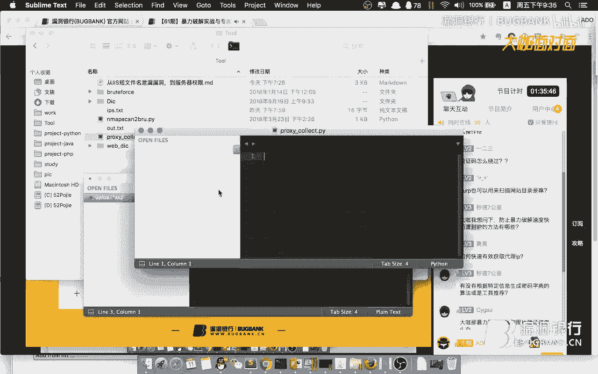

# P1：61期-暴力破解-ADO(2019.8重制版)_x264 - 漏洞银行BUGBANK - BV1Tt411f7SM

为知识而存，因技术而生。小伙伴们，大家晚上好，欢迎参加漏洞银行信息安全技术讲座大咖面对面，我是主持人绵念。

今天呢我们迎来了大咖面对面活动第61期本期为大家请到了呼声很高的神秘大咖ADO为大家带来技术分享。主题为暴力破解实战与专属工具定制。在演讲过程当中，随时欢迎小伙伴们提问。演讲结束后的行长问答环节。

ADO师傅还会为大家答疑解惑。打开赠书环节呢，还为大家精心准备了一本渗透测试实践指南必知必会的工具方法。那认真听讲赠书就有可能是你的。话不多说，下面请欣赏大咖ADO为我们带来的暴力破解秀吧。

嗨乐动银行的各位小伙伴，大家周晚上好。那么我呢是今天呢主要来讲一讲这个暴力破解的实战与相关工具的一些定制。那么暴力破解呢其实是个简单的东西。但是这个东西呢又非常重要。

所以呢呃就把它单独拿出来给大家分享分享。嗯，简单介绍一下我自己啊，我就是一个普普通通的信息安全爱好者，呃也陆续参加过一些呃攻防比赛。嗯，当然呢最终也是运气比较好获得了一些名次。

然后平常呢是比较喜欢挖洞的。然后呢呃在挖洞方面呢也有一些心得。当然。就因为挖洞方面有些心得，所以我才深刻体会到啊，其实暴力破解呢，它还有很大很大的呃空间来帮助我们成功挖洞。

OK那么今天呢我们主要讲的内容呢就是暴力破解。然后主要分了2块内容。第一块呢我们来讲一讲暴力破解的一些基础。哎，就是基础篇，哎介绍了一下什么是暴力破解啊，然后还有我们不得不说一下字典。啊。

很多小伙伴都都都在说字典是怎么回事，需要字典怎么样。大家放心，呃，后面课程有你们想要的东西。然后再来讲一讲暴力破解的一个分类，然后基础篇结束之后呢，我们就会进行实战篇。实战篇呢我们就来看一看呃。

关于协议破解，bab应用破解，还有一些小技巧的分享。那么我们现在呢就正式进入我们的课程暴力破解实战与专属工具的定制。那这是一个目录，我们再不细说，直接进入今天的主题。那么首先呢在课程开始之前。

我们来想一想什么是暴力破解。其实呢呃对于每一个挖洞的白帽子来说呢，呃这暴力破解我们都不陌生。那么暴力破解，也就是暴力破解法呢或称为群局法是一种针对于密码的破译方法。然后呢呃在一些特定的领域，呃。

为了提高密码破译的效率，也会专门为其制作超级计算机，比如说呃IBM就为美国军方制造了飓分，就是很有代表性的一个。那么对于呃这种暴力破解呢呃流传着一句话，就是说呃破解任何一个密码，也只是一个时间的问题。

呃，可见呢这个暴力破解，对信息系统或者说呃对这个安全方面还是有很大很大的威胁的。那暴力破解既然这么重要。我们来看一看它又有哪些威胁呢？这里呢我把它命名为学的案例。呃。

左侧这篇图呢是在乌云的呃网站上搜索弱口令所检索到的一个结果。我们可以看到一有2000多条记录，都是一些网站存在弱口令的一些信息。而且这里啊单单只是弱口令。如果说我们在对这个关键字呃进行一些呃改变。

那么在所有漏洞当中以暴力破解而成功侵入系统的这种案例呢，可以说呢是相当相当多的。然后右边呢这是一张我在那个咱们漏洞银行进行漏洞挖掘，挖掘到的一些漏洞。然后我是随便截了一张图啊，可以看到在这些漏洞当中。

就有很大一部分是跟呃暴力破解。解有关的。然后我们可以看到啊，通过这些暴力破解获得的漏洞，它的这奖励啊也都是非常可观的。所以说呢暴力破解虽然简单，但是它的危害巨大。既然说完了。概念说完了它的危害。

那么暴力破解的根基是什么？就是我们现在看到的不得不说的字典。如果说没有一个好的字典，没有一个强大的字典，暴力破解呃，基本上是很难成功的。只有说我们的字典非常的呃厉害了，或者说覆盖面特别全了。

或者说我们字典针对性特别强了。这样子的话呢，我们暴力破解的成功率才会上去。然后字典呢，他就是按照特定的组合方式生成的，包含了很多密码的文件。哦，这里我简单举了个例子，假如说有一个人他姓名是张三。

他生成是19881月2日，他的手机尾号是8899，同时呢他是一个北京人，然后他的QQ号码是789345等等等等，还有一些其他的。然后我们通过目前已经搜集到的这些信息就能够针对这个人生成一组。

他特定的字典。那么这里呢我们把这个人所有属性当中与字符有关的数据抽取出来，可以看到这里是张三，他的拼音的全拼简拼以及呃姓的全拼名的简拼，还有这里有个北京的简拼等等等等。还有其他一些组成了字符。

然后这里还有数字呃，通过他这个生日嗯，1988010212012等等这些组合，还有他的QQ号码789345等等。嗯，以及北京。的区域代码110100来生成了这么一组数字为主的信息。

最后呢我们将字符和数字这两组信息进行一个拼接结合，最终组合起来一个呃看起来非常复杂，但。命中率非常高的一组字典。这样子的话呢，在我们以后的呃针对这个人的暴力破解过程呢，呃势必成功率呢会提高不少。

那么既然字典这么重要，那我们字典又是从哪里来呢？嗯，一方面呢我们需要广泛的搜集这些字典。嗯，比如说有些程序默认的口令和密码。嗯，这里呢有一些呃比如说FTP的呃，mysqq呃ciq server等等。

他们都有一些默默默认的呃用户名，然后还有一些程序呢，它有默认的密码。嗯，它在安装过程中，如果说不做修改的话，呃，往往会遭到攻击者的利用。嗯，然后还有搜集到的一些常见的。

比如说top100top500top1000top1万top10万等等这些字典来应用于不同的场景中。然后还有一些用户名字典、密码字典，像这个用户名字典呢。也许就包含的是呃咱们常常说的中国的姓名。

top100或者top500全拼简拼等等。然后这个密码字典呢呃也是一样。这里呢是我从那个网上搜集到的一些字典。嗯，可以看到它分明别类列了很多。然后呃一方面我们通过搜集，另一方面。

我们当然要通过自己掌握的一些信息来生成这些字典。嗯，然后我们就必须要使用到了字典生成工具。这里呢是我随便找了一个截了个图，哎，用来生成嗯，这个用户名的一个字典，但字典生成工具有很多啊，大家也可以动手呃。

呃，随便的编写一些简单的小软件来实现字典的生成。那么我们都已经搜集了一些常见的了，但是对于呃一些特定的场景，我们还需要一些更高精度的一些字典来辅助我们完成一些测试的呃工作。

那么这里呢我又列举了一些常见的账号口令的组合。嗯，比如说这里常见的账号有呃这些test guess叉叉什么什么admin等等。

那么常见的口令呢呃也有test123456116个16个6等等等等A1B2啊，还有一点这里给大家嗯稍微提一下，嗯，在这个时候大家可以盯着自己的键盘看一看，我给大家念一两组字典，大家看一下啊。

假如说有一组字典呃，有一组密码是EQ2W3E。大家是不是瞬间能理解这这样子的密码呢，它就是根据键盘的一个排列和分布生成的。嗯，还有一些常见的，比如说呃QAZWSX还有什么ZXC等等。这一系列字典。

在实际的测试当中呢，都是遇到过很多次的。然后呢，我们再说把这些常见的账号和口令进行一个组合，最终组合起来。呃，当然这个组合方式呢也是根据我们在平常测试过程中总结的经验。而来。

比如说呃它会常用的有这种啊后面跟一些简单的数字，或者说这种测试账号进行呃简单的重复。还有一些是呃中间加一点特殊的字符，然后和数字进行一个简单的拼接，哎，等等。这样子这样子的字典，嗯，在测试当中呢。

真的是遇到的非常非常多。所以大家只要有耐心把这些东西造出来了，也许。突破这个系统的呃关键点，你就已经拿到了手里。那么既然说到了。要把这些已知的信息，把我们常见的这些。嗯，组合方式组合在一起。

生成一些字典。那么我们必然要使用到了工具。这在这个时候呢，市面上的这些工具呢其实呃都不是很好用。所以我们必须自己动手呃，来编写一些工具来帮助我们做这些事情。

那么这里呢我给大家安利一个python的第三方库。EXRE叉它呢其实是呃对正则分析的一个第三方库。它的功能呢呃我们可以在这里看到，当引入这个库之后，使用库中的这个方法，可以对我这里这一个正则。

所有的可能进行一个打印。也就是说他会把正则所有的可能都给呃列出来。这样子的话呢，正好符合我们现在这个场景的需求，可以快速的帮我们嗯有机的把一些字典呃，把一些呃已知的信息进行一个特定的排列组合。

生成我们想要的一个字典。那么方法就是这样了，大家可以自由发挥。同时呢我们也可以把这个工具扩展到了我们的呃。BP当中哎方便我们做一些呃测试。然后这里呢我已经写好了这个一个简单的用法。

感兴趣的同学呢可以呃去看一看。那么现在我我们简单的演示一下这个工具。

呃，我看我是放在了这里，我们先。简简单单的看一下它的源代码。

这里呢就是它的一个代码，非常简单啊，我们忽略这些东西啊，嗯先是引入了这个第三方库。哎，然后呢它的核心的呃函数呢就是这一个。然后我们稍微往下看一看，待会再解释上面这些东西是怎么回事。最核心的一句话在这里。

他会呃把我们呃这个。通过这个地方呃引入一个呃表达式，然后进行一个呃字典的生成。然后这个地方呢我们可以看一下，在这里这里呢我是预制了一个字典的生成规则。

是通过这些特殊符号和这个年份以及数字的一个简单的组合。然后我们再来回过头看一下我这里写的都是什么意思。哎，在这里。我这里写的是什么意思？哎，很简单进行一个简单的切割，哎，然后进行一个读取，进行一个保存。

然后通过这么简单的一些代码，就能实现比较强大功能。随后呢，我又通过一个。python的方式把它编写到了这个BP的呃扩展当中，方便我们进行一些测试。这是也是非常简单一些代码啊。

然后大家来一起看一看这个最终的效果。呃，这里呢我们有一个简单的测试的网站。

这里有个登录的页面。我们点击抓刀。放开。可以看到这里已经有数据过来了哎。为什么迟迟没有反应？啊，我把它没有放开。OK可以看到呢嗯这里是正常发了个包，我们不不管其他的。嗯，哎我记得我应该是给他预。

改了host文件。给他设置了个域名。我们看一看。哎，没有问题。OK再来一次。不管他。呃，在这里是吧，可以看到这里呢是呃简单的发了个包。提交了用户名和密码一些东西。当然这都不是关键。

我们关键的是我们看一看我们这个呃扩展工具的一个最终的效果。可以看到这里呢我们有个s to yDIC create。点击之后呢，它就会生成一个字典。我们是简简单看一下字典的内容。哎。

可以看到有有这些内容已经出来了，然后可以看到这里出现了ADO的字样。然后我们通过观察代码就可以发现，它是把整个hos文件传入到了这里。

而整个host文件hos就是。就是。这个内容就是这个内容。

然后呢，代码呢呃会对呃这些东西进行一个筛选，然后把它们去掉，把不是他们的放入呃字典的呃组成的一个成员当中，最终呢生成了字典。

然后呢，最终我们在这里看到字典呢，就是这样子的，有一些基础的。然后有一些组合。然后这里呢有一些根据该域名生成的字典。嗯。通过这种方法呢嗯我就不说在其他地方吧，在漏洞银行的一些呃呃任务的测试当中呢。

确实是遇到过成功的案例，所以大家一定要注意，这种真的是呃会会帮助你成功啊，并不是说随随便便写个工具，并不是没有什么用的。O那么我们说完了字典生成，我们接着往下讲，那么字典现在也有了。

我们就来要正式进入我们的暴力破解了。那么暴力破解又有哪些分类呢？那么大的来说呢嗯可以分为协议类的协议破解。还有呢就是web应用的应用破解。那么协议破解很好理解。

比如说我们说的SSHnet fTPDP等等等等等等一些。那么web应用的呢啊就。

是我们所所所常说的呃网站。当然呢这里也要给大家提一下，这个外围应用的暴力破解，并不单单是指哎网站的用户名口令的破解网站，它还有很多其他东西去破解。比如说我们所说的呃，这个目录呃，可以进行破解，哎。

敏感信息也可以进行一个扫描和破解等等。它的应用其实是非常广的。我们不要局限在只针对它的用户名和密码进行一个破解。那么接下来我们就进入我们实战环节来看一看嗯，他们都是如何进行破解的。

首先一个呢是协议的暴力破解。协议的暴力破解呢嗯其实呢在最早很早很早之前呢，已经有不少的工具了。嗯，比如说我们最早听说过的呃，什么1433抓机喽，FTP弱口令扫描了。还有一些3389抓机喽等等等等。

是非常非常多的。嗯，他们呢都是用来实现不同协议的口令的一个破解。当然呢要说到最强的工具，必须就是这个hdro九头蛇，它可以说呢是最强大的暴力软件破解之一。为什么呢？那么这里我们来说一下，首先呢。

第一点呢，它是一个跨平台的工具。像我们前面说的什么1433呃抓机工具等等的，那些可能在呃windows的系操作系统中呢呃用的比较多，在其他操作系统中可能还没这些东西，但九头蛇不不同啊。

它在无论是在windowsm还是在mac系统下呢都可以进行一个安装和使用。其次第二点呢，它呢支持了很多很多很多种协议，几乎可以覆盖我们所想要的任何场景。

比如说它支持嗯这个RDP也就是3389也支持FTP买sqq serverorrange sSH等等。凡是你能想到的，它都支持可以说呢是非常强大的。呃，最后还有一点呢，它这个参数呢非常灵活，我们可以呃。

很轻松的定制一些参数来实现我们嗯的一个暴力破解的任务的执行。那么我们现在啊就着重来呃讲一讲这个hdro是如何使用的。那么他呢这里有个帮助文件，啊，有个简单的使用的说明，我把这些参数呢进行了列举和总结。

嗯，可以看到它有这么多参数啊，分别代表着不同的使用的方法。嗯，大家可以自己在下载这个工具之后呢，嗯在帮助命令里查看一些这些用法都有哪些功能。那么针对于他这个工具呢。

其实我们可以总结出来hdro的一些主要的参数。我把它分为三个主要的应用场景。第一个是单用户单目标，就是我们知道这一个目标是什么。我们知道要对这个地址的什么协议进行破解。

而且我们也呃也也知道他可能用的就是这个用户名。那么我们就使使用这种模式使用小L指定用户名大P指定密码文件，然后跟上我们的这个IP地址，最后跟上我们的协议即可。然后第二种场景呢就是多用户单目标。

就是说我们知道目标的地址，知道目标的协议。但是不知道它有什么用户名，也不知道它有什么密码。这样子呢我们会对不同的用户名和不同的密码进行一个嗯破解。然后就是大L指定用户名文件，大P指定密码文件。

然后跟上目标的IP地址，以及最后他的协议。然后最后一个场景呢就是呃范围更广了，就是多用户多目标。我既不知道我要破解的目标，也不知道它有哪些用户名和密码，我们就可以用到这一条哎，用大L指定用户名文件。

大P指定密码文件，用大M指定目标地址列表，这里面是一个一行一行的IP地址的列表可以这么说，最终呢跟上我们的协议，哎，通过这三个场景呢，基本上可以覆盖我们在平常测试当中与淘的一些东西。

当然它还有一些其他的参数呃，我们在特定的场景中呢也要也需要灵活的应用。比如说呢嗯比如说这个杠F2杠O将结果输出到文件。哎，这样呢我们就不担心它什么时候结束。嗯，最终我们只要去查看这个文件的结果即可以还。

还有一点呢就是杠T它来用来指定嗯程序运行的线程数，哎，线程数越大，速度越快，但是可能会因为网络安全设备防护或者说一些其他的原因导致它的效果反而比较差。还有一个呢就是这个参数比较重要。

杠E杠E呢它是一个可选项，可以用来设置是否对空密码进行试探。然后我们通过这三个场景以及一些有用的呃比较实用的参数进行一个设置。然后就能非常容易的进行一个暴力破解的攻击。OK我们再回过头来看一下。

既然我们说到了呃，要要进行暴力破解，然后在多用户多目标的这种模式下呢，这里呢我们要指定一个地址的列表。我们来看一看，嗯，如果说我们使用这种模式，也就是最复杂的这种模式。然后呃hdro这个工具。

它一步步是如何来做的。首先第一步我们必须也是肯定的，需要先确定目标。如果说我们一股脑的呃把所有的IP地址都写到这里，然后进行一个破解。那我们想一想是不是效率非常的低呀。所以在这里可以看到。

如果说我们要对这个呃。22端口的SSH协议进行一个破解的话，我们必然先先把这些所有开放二端口的地址先筛出来，然后再进行一个暴力破解。这样呢呃它的效率呢会高很多。所以我们先要使用一些端口扫描的工具。

将这些开放的协议的地址先给扫描出来。这里呢嗯我们就又得用到一个其他的小工具。因为在普通的如果说你我们退出来看一下。如果说我们用Nm。

进行一个扫描的话。它出来的结果是这样子的，这样子的话，无论我如何保存，我都不是很方便。能把我们想要的这个端口。和这个IP地址对应起来，保存下来。这样子呢在我们实际过程中呢，又无形中增加了我们的工具量。

所以呢我们可以通过也是通过python。

他的这个呃n map第三方库来简单的对这个扫描的结果进行一个处理嗯。这些代码呢在那个嗯这个第三方库的官方网站上都有，都是很好理解的一些代码。哎，然后它这个程序呢有个好处。

我们可以以N map所支持的格式进入我们的扫描目标。比如说这里我们可以以这种形式进入嗯。这么一个地址来对这一个C段进行一个扫描和识别。那么我们看一下这个程序的一个效果。

拍色。A map。然后我们可以看到。他要求我们建入一个地址，建入一个端口。okK我们根据他的要求。一个地址我们就嗯1到10吧。3306。程序提示，我们正在运行，我们稍安勿躁来等一等结果。那么在平常这个。

测试当中呢，我我并没有写过一些非常庞大复杂的程序。比如说就大家呃常说的什么综合性的一些扫描工具呃等等等等大范围的一些扫描工具。一方面呢这些扫描工具很可能会被一些安全设备所拦截。

最终呢连你的这个房的IP地址都给办掉。另一方面呢，这些工具呢嗯并不是说。特别特别的好用。嗯，它的结果呃需要对那个你的这个整个程序的代码呢有很高的要求。我是比较喜欢编写一些非常小的一些工具。

比如说我在做这个呃任务的测试当中呢，我可以编写345个呃这种小的脚本啊，用来应对不同的一些需求。然而在另一个测试当中呢，这些脚本也许是完全用不上的。我又需要编写其他的一些脚本啊。

我认为呢只有这种定制化的高级化的这种程序的编写，哎，才能更有效的发现一些呃。特定的一些漏洞。哎，这里我们结果已经完了，提示哎这个5。9，它的端口3306端口是开的啊，我们可以看到这里有个alt文件。

然后呃保存了它这个开放的。

端口以及这个IP地址。当然，如果说我们要放入到这个hro当中呢，只需要IP地址。然后我们这里要做的呢，只是在这个地方简单的把这个代码稍微一改就可以。

然后随后呢，这些代码呢我会都会共享出来，呃，供大家使用。那我们继续往下吧。然后第二步呢就是开始攻击啊，开始攻击就是使用我们前面呃所说的那些参数来进行。然后可以看到呢。

这里呢是我对某一个公司的这个类网段呢进行了一个扫描，可以看到发现了这么多弱口令。那么协议破解一方面呢，我们可以使用呃这个呃已有的一些工具呃，也比如说就是hdro。那么另外一方面呢。

我们也可以自己自己编写一些工具，呃，因为这些工具呢其实呢编写起来都是非常简单的。我们只要结合一些python以及它的第三方库。然后定制一些自己的字典，就能编写属于自己的暴力破解工具。

那么这里呢我是针对不同的写。协议都编写了一些呃这种小工具。

小工具虽然说零散吧，但有的时候感觉用起来还是挺爽的。那么我们随便看一个。嗯，就就这个my赛克吧，比如说。也是用到了它的这个嗯mysqq DB这个库以及n map这个库。我们看一下啊，先是入口。

它让我们输入这么一个目标，然后呢嗯。进入到了这里。可以看到呢，它是先通过N map这个库对目标进行一个扫描。如果说目标开放了3306，也就是my circleq对应的端口，它就会返回。

最终呢会把这些数据呃通过这种。生产消费的模式，呃，然后应用多线程，然后放入到这里进行一个暴力破解。其实它的核心程序呢就这么短短的几行。哎，上面都不算，就这么短短的几行。嗯。

可以看到呢嗯它无非就是用了一个连接，如果连接成功就。就告诉我们成功不成功就跳过。继续进行下一个测试。那么我们可以简单的来看一下这个。工具的效果啊。Pthon。叫啥名字来着mys。哎。

它提示我们进入这么一个地址。其实呢就是这个地址。我们就从。8到10吧，范围稍微啊5到10范围稍微小一点。哎，可以看到，其实扫描出来了这个。5。9呢它是开放了3306端口，然后呢用它内置的这些呃。

字典呢进行了一个测试，然而呢并没有发现热口令。

唉，非常好用的一个小工具啊。那么我们继续回到我们的PPT小工具它有什么好处呢？它呢就是因为工具是你自己编写了，所以呢无论在任何场景，任何时候你都能快速的把它进行一些简单的修改。

应用到了一些呃比较复杂的场景当中。然而这些场景呢嗯使用工具呢可能没那么方便，而往往就是因为不那么方便，好多人就放弃了这种尝试。这时候呢往往我们就有一个严重的漏洞，就失之交臂了。好了。

那么以上呢我们讲的都是协议的这个暴力破解。那么嗯有有一些嗯已有的工具，我们也可以自己编写一些工具。啊，那么接下来呢我们就来看一看这个应用的暴力破解。也就是说我们这个。外网站的一些相关的破解。

其实呢它的核心原理呢就是反复的提交web表单，或者说是web请求，依据返回的信息来判断是否破解成功。那么这里呢我们就不得不说这个BPBUIPsuit。它可以说呢是最好用的web测试软件之一。

那么可以说呢每一个做这个web渗透的呃小伙伴呢，基本上这个工具呢是人手一份啊。那么今天我们就主要来讲它这个引出的模块，也就是说暴力破解模块主要就是用到了它这个引出的模块呢，其实呢它呃它是有非常灵活。

非常强大的，但可能呢有些同学呢对他的一些参数呢还不是很清楚。嗯，那么这里呢我就先嗯我们课程中呢会对它呢进行一个呃详细的介绍。嗯，首先呢是一些简单的使用啊，我就速速的往过走，哎。

设置代理浏览器和BP都要进行设置。哎，浏览器的话呢，我们建议使用插件。然后呢，如果说想要抓HTTPS的包呢啊还要导入证书。然后其次呢，这里我们额外提到了，如果是mac系统的话。

我们可以使用这个呃这个工具来快速的实现。

代理的设置。那我们来简单看一下，就这个工具。它也可以帮我们快速启动一些东西，快速查找一些东西。那么这里我们来看一下它这个。功能。它可以定制。通过自己编写定制一些快速启动的插件。

然后这里呢我是编写了一个代理切换的插件哎。它的核心代码呢是这些。针对mac系统呢，如果说你建入这么一条命令呢，它会把这个wifi就是无线的代理呢设置为本地的HTTP。8080。

然后呢呃反正就是使用这么一个插件，都能帮我们快速的实现这个呃代理的切换。那么这里给大家简单演示一下。首先可以看到我之前浏览器呢并没有设置代理，我们刷新一下。

再访问一下。可以看到啊这个BP呢没有抓到任何的包。哎，现在来。哎，可以选择我们选择。选择好了再阀问。可以看到这里呢就已经是抓到了包。

然后呢。就通过这种一些小工具呀，小插件呢啊。在一些细枝末节处呢提高我们的效率，来提高我们的乐趣。然后呢提高我们嗯成功率。我们再往下，然后还是老生常谈的拦截登录请求加载至引出的模块。

然后我们也知道它的快捷键是cttrol和R。然后呢，就是设置一些参数，然后呃包括一些字典呀、攻击线程呀，就可以进行一些暴力破解的攻击了。这里我们就不细说了。然后最后呢就是坐等结果哎。

通过这个返回的呃长度。或者说返回的状态码，或者说返回的长度来判断。如果说它返回的长度和返回的状态码都一样，怎么办嗯。这种场景肯定是有的。我给大家简单举个例子，假如说它所有的返回的状态码都是302。

就是一个跳转。然后它这里返回的长度就是返回的数据的内容呢，它可能就是一个跳转的地址。然后跳转的地址，它有有有一个类似于这个flag的这种标签。如果说flag等于一，我们认为登录失败，继续跳回原地址。

如果说flag等于2，我们认为登录成功跳转到了呃这个登录后的界面。然后在这种场景下呢，它这个返回的状态嘛和返回的长度都是一样的。唯一不一样的就是这个一和2。这时候呢。

我们可以使用BP当中的呃正则匹配的那个模块，然后对这个。内容呢进行一个匹配，然后最终呢这个内容会显示在呃下一列的这里，然后可能这些这些这些这些都是一，只有一个是2。然后通过这种方式呢。

我们就可以判定出来这个为二的地方呢，它的这个嗯。最终呢就是我们想要的结果。这里呢给大家简单的。在BP里看一下。嗯，我这里应该有一个嗯直接放到出动模块。随便加载一个。我们就不选了。还是选一下吧。嗯。

随便选一个吧。然后在这个正则匹配的地方呢，在这里options。下面的group extra。然后我们可以在这里选择呃我们需要匹配的内容，哎，用户名密码错误。那么在这里呢，我就给大家讲一讲嗯。

我在实际当中呃，这个地方用的比较多的一个呢可能就是前面说的嗯，返回的状态码和长度都一样，很难判断是否成功。另外一个呢嗯我们可以通过在这里的匹配来看一看。这个用户名是否存在？不知道大家理解了没有。

我们可以。假如说在这个场景里啊。我先取消。假如说在这个场景里，我们并不知道用户名。我们必然要把它勾起来是吧？然后我们可能要选一个用户名的字典是吧？哎，用户名的字典选上之后，我们就要跑是吧？跑的话。

它肯定嗯有一些网站因为设置的不是非常好。如果说嗯用户名不存在，它直接提示用户名不存在。如果说用户名存在，它可能会提示用户呃它可能会提示密码错误。然后在这个地方呢，我们会。我们可以把它这个提示信息勾出来。

然后进行一个呃运行，最后呢就可以根据结果来判断这个网站它有哪一些用户。也是信息获取的一个手段，也是帮我们扩展了呃攻击的途径。O这里呢我们说的有点多，我们继续往下走。最后呢就是我们的主角。

我们就来详细看一看这个演出的模块。它呢嗯又有哪些呃详细的功能？那么引出的模块呢，其实呢功能非常丰富，也非常强大。呃，最在最。最最外面这个地方。也不能说最外面最开始这个标签这个地方呢嗯它有好几个选项。嗯。

attack type。首先呢一个模式呢是sniper哎狙击手的意思。嗯，它的意思呢就是使用单一的payload的。也就是我们刚刚啊那样子的选择。然后呢，是第二个模式，选一个payload的。

同时应用到多个位置。哎，什么意思？没事，我们继续往下看，待会我们演示。然后下一个呢。多组配load的分别放入对应的位置。哎呦，这又是什么意思呢？嗯，然后我们再往下看是多组配load的放入所有的位置。

OK它就这四种模式。那么我们现在演示来看是吧？我们。

这个文字看不懂，我们可以通过这个演示这sniper。不用解释了吧，想必大家用的也比较多，然后这里直接运行。哎，出来了。我们把它删停。可以看到呢提交的。因为我选呢呃加载配漏的地址呢是地方呢是这里。

所以呢它会对这个地方的内容呢嗯进行一个变换。然后后面内容不变，剩下所有内容都不变，进行一个提交。那么我们再来看第二个。一个配漏的放到多个位置，那么我们必然需要多个位置。然后我们再来看我们把它清掉。

Test。你假假说就这三个吧。运行。哎，可以看到。啊，不好意思，我这里是选择错了。应该选这第二个模式。来，我们运行。哎，可以看到账号和密码处呢都是同样的内容。这个呢就是一个payload放入不同的位置。

当然，如果说你有三个payload，4个payload都可以通过这种方式来做。然后再看第三个呢是多个payload放分别放入对应的位置。那么我们可以看到，这里已经可以选择不同的配load的组。

分别放入不同的位置。123。123412345。这里需要注意一点啊，它因为是要一一对应的，所以用户名有几个密码也必须要有几个。我们运行。该可以看到。一对应分别放入不同的位置，没有任何问题吧。

然后最后一种模式呢，就是多个配load的放入所有位置。这个呢。可能大家平常用的也比较多。哎，直接运弦。它就是一个排列组合，把他们呢所有的情况呢都列出来，哎，以尝试。

那么这里三种模式呢，我们就都掌握了。嗯，在一些特定的场景中呢，这些模式呢可以帮我们省去不少事情。那么这一块讲完了，我们再讲另外一块比较重要的内容，就是这个payload size。

我们设置这个payload的时候呢，它也也有很多很多的功能。也许很多小伙伴在平常的呃测试当中呢，只是简单的加载一个字典，哎，或者说简单的选择一个呃数字。那么它这个强大的功能呢，你完全就视而不见了。

那么今天我们就来简单科普一下。它又有哪些？首先呢是简单的列表，哎，可以手动添加一些payload的，这个不用多说。然后另外呢可以指定文件，哎，这也不用说，其次呢是这个迭代器。哎，这个这个非常关键啊。

待会儿我们着重讲一讲这个迭代器是怎么回事。它呢有8个站位，每一位呢都能设置payload的。哎，感觉很厉害哦。然后再下一个呢就是这个字符替换。

它呢可以把你设置的一些呃配漏的当中的字符呢，字符呢进行一个替换嗯。要不我们简单的看一下吧，可以看到这里。有他这里意思就是把A替换成4。然后如果说你这里加载了一个字典的话，它会进行这样的替换。

嗯，再往下就是大小写处理，哎，也没有什么好说的。然后这里还有个从响应响应放大一点，从响应内容中提取数据作为payload的这个也是非常非常有用的一个东西。比如说我们现在提交表单。

它有那个CRSF talkingken的限制。我们可以先访问把这个token渠道，然后带入到我们请求当中进行放。发嗯再发起新的请求。嗯，还有一个场景就是。

就如我这个演示网站里看到的一样，这里呢我是简单的设置了一个验证码啊。但是我们通过。观察发现啊这个验证码啊，它是以这种直接就是以字符的形式写在了网页的源代码中。然后在这样的情况下呢。

我们可以通过访问取出这个验证码，然后再呃放入到我们请求的披漏的当中进行一个访问。这样呢可以说呢它这个验证码其实是无效的。

我们再往下呃，这个不合法的参数指定长度，不分不合法的这个uni库的参数编码呢，主要是用来进行一些father的测试。尤其是在这个文件上传，或者说呃secle注入呃，wa by pass的场景下呢。

可能用的比较多。然后下面一个是指定生成指定程度的字符串嗯。

生成指定长度的字符串。我们可以简单看一下。我们基础的字符是A，它最小长度是1，最大长度是1000，以50为补长。最终呢。效果呢就是这样子嘛，pass变成了这样。

是吧。这个在什么地方用的好呢？这个也是在一些发的场景下用的比较好，尤其是在那个我们在测试一些呃防火墙，或者说wa的边界的时候呢，如果说我们在请求文件过程，它会丢弃一些内容，嗯，来实现wauff的绕过。

在下面一个呢就是数字哎没什么好说的，日期也没有什么好说的。哎，这个也没有什么好说的pay空配load的。嗯，没有什么好说的。嗯，user name用户名和email账号生成。嗯，这个账号生成呢。

我们其实完全可以用它这个迭代器来做。然后这有个ECB加密，然后基于插件生成披load的这这里呢就需要我们自己呢来编写一些插件。嗯，比如说我们在这个登录的过程中呢，它是通过RSA加密。

的方式把我们键入的密码进行了加密。这样子的话呢嗯使用它原生的一些功能呢是不能实现的。我们可以通过编写额外的脚本来对我们这个密码的这一段呢进行一个加密，最终呢生成一个密文。

放入到我们的请求当中来实现一个破解。然后再其次呢，就是将其他位置的配漏的进行复制，这也没什什么好说的。我们现在呢就来。讲一讲我这里比较关注的这个迭代器。哎，想。我相信啊很很多小伙伴呢嗯对这这个。

用的都不是很好。我们先把它去掉，我们来看一看这迭代器是什么什么用啊。迭代器呢这里呢可以有8个站位。假如说我们现在有个场景呢是这样子的，我们知道他的用户名是这个，而且我们知道他的密码可能是一个呃邮箱。

以邮箱的形式组成组成那个密码，那么需要怎么做呢？哎。邮箱那前面呢可能是一些邮箱的组合，我们随便选一个字典，然后邮箱第二部分是什么？肯定是一个艾特服饰吧。那么邮箱的第三部分是什么？比如说。

QQ点com是吧，16三点com。是吧126点com等等等等。我们就以这个为例吧。这样子的话呢，把他们三个哎这个at特。什么什么点com组合起来呢，是不就生成了一组邮箱，我们执行看一下。嗯。哦。

这里要选sniap模式。哎，可以看到这里呢是不是通过我们这种嗯。迭代器的方式呢就生成了一组邮箱啊，这里还有一点呃小小的需要注意的。我们可以看到呢，它把这个点呢都进行了一个user编码。

然后我们可以看这里BP呢它默认会对这些东西进行user编码。所以呢如果说嗯我们不希望它进行编码呢，把这个勾取掉就可以了。你再来看一看。哎，没有任何问题吧。这样子的话呢我们就生成了一组邮箱的组成组合方式。

如果说我们知道它的一些额外的信息，然后生成一个字典，然后再通过这种组合方式生成邮箱列表嗯，成功率肯定会上去的。嗯，另外我们再来讲另外一个场景。嗯，我们都知道这个HTTP的basic认证，嗯。

它应用其实挺广的。比如说这个tca的这个管理界面，默认的管理界面，它就是用的HTTHTTP的basic认证，如果说我们要对那个basic认证进行一个暴力破解，好像也挺麻烦不好弄是吧？嗯。

还得编脚本哎还要那样那样这样这样，那我可能有些小伙伴不知道，我们先简单说一下这个HTTP。basic认证它是一个什么样的。方式他呢其实呢是需要你先提供一个用户。名称。再需要你提供一个密码，然后中间。

需要用。这个嗯冒号分隔开，最终呢。把它进行一个base64的转换。生成了一串。base64编码，这样呢就是呃HTTP的basic认证。那我们来看一下如何使用这里的迭代器来做这件事情。其实也非常简单。

首先我们先引入一一串字典是吧？也就是说这里是用户名的字典。比如说他。他。他。他。那么第二部分呢，这里就不是艾特符了。是什么呢？是冒号。第三部分就是我们的密码，123456。6。哎，简单两来两个。

我们看看效果。嗯，这样呢是不是就生成了一组配漏的，也就是说是中间的这一部部分。接着呢我们在下面呢可。有个选项，我们把它放大一点。下面呢有个选项。Payload processing。

payload的处理。这里呢我们可以看到有个隐库的，这里我们可以选Base64隐库的okK。然后让程序执行。哎呦。出来了。那么这一串呢就是我们嗯所生成的basic认证的呃。这种编码方式。

那么通过这两个简单的例子。大家是不是觉得？这个这个这个迭代器这个功能是不是非常非常强大，非常好用呢？那么嗯。在现在回想起来，是不是以前遇到的一些场景，完全可以用今天讲的这某些内容应用到。

而我们因为太麻烦，没有去尝试呢。那么接下来呢我们就呃。再来讲一些额外的话题。那么正题呢我们讲完了，我们来讲，如在其实现在呢就尤其是近几年呀，我们在这个外表层面的防护呢，其实是做的是越来越好了。嗯。

一方面呢确实是这种安全事件比较多。然后国家呢整个对安全的重视程度也越来越高。另一方面呢也确实是呃这些安全的厂商呢，他们生产了不少的设备，哎，设备总要卖出去是吧？卖出去的话嗯，无论你设备怎么样。

他至少多多少少是有一些作用的。那么往往呢我们就会遇到一些半IP的场景，哎测试的好好的哎，突然就把你IP办了。那怎么办呢？在这种场景呢嗯一方面呢我们只能减少我们的降低我们的动静了。哎，我们悄悄的弄。啊。

我们轻轻的弄。嗯，对于BP呢我们可以尝试把它这个线程数减少，减少线程呢嗯可以有效的防止这个呃半IP，也就是说防止这个wa呢对我们的识别。因为有些wa呢它会对那个请求的线程数呢有有一个要求。

一般呢我是会设在呃1我比较习惯设置的是18和14这两个值。因为我我是心里这么感觉的，就是如果说我是一个那个wa的程序。序员就是编写代码程序员，我就会想，如果说什么样一个请求大于什么一样一个情况，哎。

我会把他这个IP认为是一个攻击的IP那么我想哎，20好像是一个比较高的值。那这样子的话，我会把。请求线程数大于20的设为呃攻击者。然后就是站在攻击呃站在这个防护者的角度呢，嗯我们去思考的话。

我一般会把这个线程数设在18和14这两个点，嗯，大家也可以根据自己的想法和经验试一试。当然呢，在一些特定场景中呢，我们最好啊把这个线程数直接设为一进行测试。那么这呢基本上就是万无一失了。

当然如果说你长时间的请求还是有问题，怎么办？那么我们只能动手编写程序了，动手编写程序。我们。同时呢还需要很多的这个代理资源，我们需要编写程序嗯使用代理进行一个请求。这样子的话呢，不管你分不分都无所谓。

因为呢不是我的真实IP封掉的，只是我代理的IP那么在这里呢，我突然又想起一点给大家额外说一下，在那个circle注入测试当中，我们是不是也有很多呃手段呀，比如说这个temper脚本来绕过wa。

但是往往还有一种场景我们比较容易忽略。如果说我们不停的请求的话，wa会认为我们是一个攻击行为，虽然他没有识识别到我们是个circle注入攻击，但它可能会识别到我们是一个不断发起请求的这种CC攻击。

也会把我们的IP办掉。这时候怎么办？我们其实也可以通过这个temper脚本来实现。我们只要在。

或脚本当中呢呃哎呀要不我。打开看一下。

嗯我们随便看一个。哎咦咦假说就这个吧，无所谓了嗯。这里呢是一个过某。过某安全软件的脚本，哎，非常简单啊。这里是呃通过fa则测试出来的，我们回到正题去讲。如果说呃它没有识别出来是个s口珠。

但是识别成了CC攻击怎么办？这时候我们只要在这里简单的加入两行代码。Input time。time点sleep。哎，我们让每个请求他都停顿一秒。间隔一秒，这样呢我相信啊只要不是嗯。

特别针对的特别呃奇葩的这些安全防护软件呢，他都认为你是一个正常的请求，而不是1个CC攻击。

那么我们这是额外想到的一点，给大家说了一下。我们继续往下，这里呢又说到一个嗯RS短文件名泄露，这个漏洞呢非常奇怪啊，奇怪在哪里呢？嗯，是这样子的。我们这个漏洞呢，想必大家也遇到了不少呃。

如果说你是使用了国内的一些扫描工具扫描出来的，它的漏洞级别基本上在低或者是中，最高也是中了。但如果说你是用国外的一些扫描工具发现的这个漏洞，它的级别基本上是中和高。那么像那个。

AWVS它扫出来RS短文件名就是个高位漏洞，为什么呢？为什么一个文件名泄露会成为高位漏洞呢？那么我们就要仔细想一想了。首先呢这个漏洞呢嗯它的这个效果可以给大家大概说一下。

它会拆解目录和文件前六位以及文件的后缀名的前三位。这样子的话呢有几个特特别的要注意的。首先呢如果说你文件特别短的话呢，它会猜不到。其次呢，如果说你文件特别长的话呢，后面还有一些内容你也是不知道的。

然后就因为它这个特点呢，我们如果说呃后面长度很长，但我们不知道我们可以使用暴力破解的手段呢，一方面呢可以帮助我们拆解一些后台地址。另外一方面呢可以帮助我们拆解一些敏感的文件。哎，比如说这个备份文件。嗯。

什么CQ文件等等。这些文件下载下呢呃往往呢包含的就是网站的一些呃整站的打包的代码，以或者说一些数据库呃相关的一些内容。可以说呢嗯通过这种方这两种方式呢泄露了很多东西。那么它是怎么变成一个高危漏洞的？嗯。

这里呢我有个简单的例子。

给大家分享一下。那简单说一下，这个例子呢，其实就是在我们漏洞银行的某一个任务当中遇到的真实的场景。嗯，首先呢我们是通过这个RS短文件扫描工具扫描出来。它有一个目录是这样子的。

通过这这个呢我们可以判断出来它的后台地址呢可能是ADMINL叉叉叉叉叉叉在这个目录下面。这时候呢我们可以拿出我们的BP，然后设置一个。前面可能没讲到设置一个呃。设置一个把它放大一点。设置一个。

blue focus去哪里了？blue focus哎，在这里设置一个嗯暴力破解。的模式，然后嗯我们把这个去掉，然后把它长度设为1到4位。然后进行一个破解，然后嗯花费了一些较长的时间之后呢。

我们跑出来了它的后台地址是这样的一个地址。然后呢我们就可以呃在后台。又多出了几条攻击线。一方面呢我们可以对后台这个呃用户名密码进行暴力破解。哎。

另外一方面呢我们可以对嗯后台登录框处进行一个circle注入的测试。那么在测试过程中呢，暴力破解无解无结果，scle注入也不行。这时我怎么办呢？不要忘了，我们还有RS短文件名泄漏泄露这个漏洞。

然后我们对这个目录，就是我们已经拆解出来的这个目录再次利用工具进行一个扫描。最终呢我们是发现有不少文件。然后这时候呢我们就要开动我们的大脑嗯以及我们积累的一些知识，对后台这些文件进行一个补全。

比如说我这里举个例子，我们猜出来了。这么一个。这么一个。猜出来这么一个地址的话，我们认为它是什么呢？肯定就是upload相关的呗。是吧这就没什么好说的这就需要我们通过平常积累的一些知识。然后呃很幸运啊。

在这里呢我们是通过这种方式呢发现后台有部分文件可以进行未授权的访问。然后再通过一些经验呀，我们给这些呃。地址后面呢加上构造一些参数。然后这样如果说构造参数成功，返回了数据的话呢。

我们又产生了新的攻击路线。一方面是为授权的访问产生的信息泄露。另外一方面，像这种动态页面，我们可以进行srcle注入。嗯，然后在这个实际场景中呢是发现了有个文件上传漏洞而轻松的get shell。之后。

嗯，我们大概看一下吧，因为权限比较死，然后呃又发现了数据库连接信息，最后获取了st权限。这就没有什么好说的，反正我们的重点就是在前面使用了这个RS短文件和这个暴力破解这两个东西呢呃进行了一个有效的结合。

从而实现了从一个。我们通常意义上认为比较。不重要比较危害低的一个漏洞。变成了一个高位漏洞。嗯，这里呢也就是我前面所说的，暴力破解，并不只是对你的这个用户名和密码进行破解。我们在这种不同的场景下呢。

都有一些灵活的应用。那么下面呢我们再来讲一些额外的。那么我们这里说到了没有体力，你做什么渗透啊，然后我这里列了一大堆哎。左边是一个区域号段，了解一下区域号段，北京市的110000。

北京市辖区东城区西城区哎，什么什么一大堆，然后它有都有自己对应的区域号段。然后这里呢手机号段了解一下，那么手机号段它的组成。方式呢主要是前三位网络识别号，47位地区编码，8至11位用户号码。

然后呢呃三大运营商呢都有一些自己的开头的一些号段。哎，通过这两个东西。我们是不是能。干这么一个事情。能生成字典了是吧？首先一方面我们可以生成特定地区的身份证号。身份证号的生成规则嗯，网上有哎都很简单。

什么地区编码加什么加生日呃，再加什么四位什么码呃，加三位什么码，最后一位是性别码等等。然后我们同样也可以伪造手机号。当然了，这里就有个问题了，通过这么伪造出来的字典啊，真的是特别特别大，看着都想放弃。

那么我们再回过来头来看一看这句话没有耐力，你做什么渗透啊，口令就在那里就看你想不想试一试了。在。通过这种方式。真的能发现不少问题。那么也是前几天吧，前几天我我在做一个呃测试的时候呢。

是是伪造了这个手机号。然后把他的那个密码设置个123456，然后跑了。大概。四五个小时吧。就发现了嗯好几个绕口令，这样子的话呢。我们如果说单对一个登录框，根本没有任何办法的时候。

暴力破解就是我们唯一突破的关键。所以我们不能放弃任何机会啊，一定要有耐心，有耐力继续做下去。然后我们再提到另外一点，就是没有眼力，你挖什么SIRC啊是吧？挖SIRC其实就是考验你综合素质的一个时候了。

哎，体力要好，眼力要好。哎，你还要有耐心是吧？如果说当这些掌握了，你再学习一些知识样子的话呢，你肯定会呃成为挖动。高手的。那么嗯这里我只是抛砖引玉的给大家讲解了一些如何获取网站用户名信息的内容。

第一点就是我们前面已经提过的哎错误信息的提示。当然我们前面说的是在登录过程中它的报错信息哎，用户名不存在哎，用户名存在啊，不是存在用户名密码错误，通过这种不同的报错，我们就能判断出来这个用户是否的存在。

其次还有一点就是我们在注册的时候。大家一定要脑洞放大，在任何地方不能掉以轻心啊。只要凡是能帮助我们获取更多信息的地方，我们都要注意。在注册地方，假如说我输了一个test，它提示哎，注册成功。

我输了一个test一，它提示注册失败，用户名已成已已存在，那么我们是不是可以确定哎test一是一个已有的用户。我们是不是可以对test一进行一个包底破解，对吧？然后还有一个就是这个密码找回的地方。

密码找回的地方一般呢它会先让你进入一个用户名，说呃你点击说密码嗯点击密码找回。然后说请输入用户名，然后输入用户名之后，一般会跳转到下一步，请输入邮箱或者等等之类的。如果说你在这里输入用户名，点击下一步。

它提示用户名不存在，那么它用户就是不存在。如果说它提示其他的，假如说请输入邮箱，那么这里我们是不是也能判断出来这个用户是否存在呢？哎，这里就是一个错误的提示信息。这种方式。

其次第二点呢就是这个发布新闻信息的用户嗯。这里呢我们可以简单看一下我。搭建的这个环境。哎，这里有三条新闻，第一条。可以看到这里有个。发表的用户哎，第二条也有，第三条也有。通过这个方式。

我们是不是就能判断出来哎，这个系统可能有三个用户哎，它分别是他他他是吧？还有一点我们再看下一个就是便利用户的空间页面。嗯，这个呢在那个BBS。呃，CM那个论坛当中呢用的比较多，呃，都可以便利用户信息。

像一般这个UID比较小的一些值呢，它对应的就是一些呃最初的管理员的一些用户名。如果说我们能把这些呃权限较较高的这些用户呃给渠道，然后进行一个破解。嗯，这样呢嗯对于我们成功率呢会有有所提升。

我们这里也有个例子。我们可以看到，将假如说假如说假如说这里并不没有显示啊，这里并没有显示啊，我们只有点进去这个新闻。才能显示他的作者是他。我们再点这个新闻，就可以看到他的作者是他。

这个时候呢我们也可以用嗯。嗯，用这些已有的信息来搜集用户名。嗯，我们可以简单的。看一下。嗯。加上代理。访问一下。你好。很皮哦，为什么呢？因为我们可能有缓存记录。尝了一下。哎，出来了。

然后我们再回过来分析，哎，这是配置5。这是配置一，哎，我们可以发现呢，它只是对最后这个数字进行一个变换，从而就能访问到不同的新闻。然后不同的新闻是有不同的用户写的。而现在我们就要搜集这些用户信息。

非常简单。把它放到引出的模块。我们把它放大吧。然后这里呢只要对这个地方进行一个。选择。这里我们可以输12345。当然如果说数据很多，还是需要选用number。补长是一最长最最短最长。O。嗯。😊，1到5。

抽风了吗？31到5。哎，没有问题，为不知道为什么我的。BP好像不是很高兴。我们重新设置一个。一。哎，好了。因为他有的时候啊，你这里设置的他一一时半会。哎识别不出来，哎呀，好烦，不管它。

那么我们这里呢先设置了一个，这样我们密信。哎，运行之前是不是好像少了什么事情啊，我们要干什么？忘记了，我们干的要是我们要干的就是把那个呃发布新闻的用户名取出来。这时候我们继续用到这个政策匹配的。地方。

嗯。使用起来非常简单，只要简单的把它一选OK。Go。然后这里就可以看到哦，原来这个系统有这些用户发表了新闻。这样子的话呢，我们是不是可以从侧面判断出来哎。他这些用户可能就是后台的管理员之一。

如果说针对他，我很难进行一个破解。但是针对这种test a我塞。是不是又有新的发现呢？像这种测试账户，它这个口令一般都不会特别强。然后最后呢我们再看还有一点呢，就是帮助文档。其实呢很多这个应用系统。

尤其是对那个政府网站呃使用的一些应用系统呢，他在后台呢经常会有一个帮助文档这么一个东西。而帮助文档当中呢，它会详细的描述如何登录系统，如何进行登录后的一些操作。其中有一项可能是对用户的管理。

也有可能其中有一项他在截图过程中不小心截到了他当前登录的用户名名称。这样子的话呢可以反面的帮助我们。嗯，获取到这些这些用户信息。那么这个呢也是在实际场景中遇到过的。嗯，在去年还是什么时候吧。

也是咱们漏洞银行的一个任务当中啊，是一个学校的任务，啊，后台没有发现任何东西，最终呢发现有个帮助文档，然后文档中呢在一张截图上呢，他截了一个奇奇怪怪的用户名。最后呢对这个用户名进行破解，发现漏洞。

然后进了后台，然后后面就不用说了。一般后台比较弱，都都能发现注入呀上传呀等等这些问题。可以说呢有一个点。突破最终获取了很多很多的东西。这里呢我也是简单的。一个页面。哎。

不知道大家在之前看到这个页面的时候，有没有发现这个帮助。如果说有发现帮助的同学呢，那么你挖SRC呢一定是一把好手啊。我们来简单看一下这个帮助页面是什么东西。哎，出来了，它是一个readme点PDF。

然后后台。有个呃简单的呃用户管理的一个界面的说明。然后用户管理界面呢列出来了系统所有的用户名。那么这样呢可以说呢也又从另一种手段帮我们获取到了这些用户的信息，以上呢就是今天的分享。

那么希望呢呃通过呃今天这些内容呢嗯能对大家有所帮助吧。至少在以后挖洞过程中遇到暴力破解的一些呃场景呢，大家能有一些思路呃，并不是说对着一个呃简单的登录框就无从下手了。好了，今天我讲呢就到这里。

ADO是不是带来的细致讲解，那下面让我们跑步进入今晚的行长问答环节，评讲过程当中，如果还有什么疑问，小伙伴们赶紧抓紧时间提问啦。

哦，已经看到了，先说一下这个同学吧，怎么要绕过验证码。如果我没有嗯，如果我用字典爆破，没有成功，是换字典还是换思路？呃，反正。怎样检测暴力破解攻击，还有一般怎样防御暴力破解攻击。那么问了好多问题啊。

我们一个个说吧，首先是一个怎么绕过验证码嗯。嗯。先说第一点吧，这个验证码它不一定有效。哎，就比如说我搭的这个测试站，虽然说这里有个验证码，让你输入验证码，其实呢它这个验证码是没有任何效果的。

你你可以不管它，还有呢是遇着比较多的呢，它是把这个验证码和cookie是放在一起的，所以说呢嗯也可以说呢是验证码无效的。

然后还有一点呢，就是在那个有些场景呢，它验证码是会存活一段时间的。但是有个前提，如果说你不刷新页面，它验证码会存活一段时间。如果说你刷新了页面，验证码就变化了，这种时候怎么办呢？

就是当我们进行暴力破解测试的时候，肯定要用BP抓包嘛。装完包之后呢，嗯页面会自动刷新。刷新完之后呢，我们把这个刷新之后的新的验证码填入到我们嗯。需要暴力破解的这个。地方的这个。验证码当中。

这验证码当中这样子呢我们就可以继续进行暴底破解了。

然后这是这是一些验证码，可以呃无验证码失效的一些场景。嗯，然后还有就是如果说验证码确实不失效怎么办？嗯，有两种方法，嗯，各有利弊吧。一种是那个我们使用一些呃验证码识别的工具。嗯。

主要是最传统的是那个python的那个图片识别的那个呃那个东西，当然那个是对于一些随嗯就是对对于一些呃图片呢非常明显的很简单的验证码嗯识别起来呢是比较好。但是对于一些稍微进行一些扭曲的这些验证码呢。

识别起来是非常差的。然后第二种方法呢就是嗯我们现在比较火的机器学习嘛，我们可以用那种方式锻炼一个我们的模型来提高验证码识别率。当然好像就带。

加油奖有点大了啊。然后第三种方法呢就是我们使用那个打码平台，哎，它会有人工在线打码，然后嗯准确率很高，但是我们就需要呃花一点钱了。所以针对不同的这个方式呢，我们就选择嗯。不同的办法吧。

如果说这个任务真的非常重要，你你也是心中如有神助的告诉你后台进去之后，一定能拿到系统的最高权限。那么你不惜一些代价，也可以尝试嗯，用用这种打码平台啊什么的方式来绕过验证码。然后我们再看这个。

他说如果是字典爆破没有成功怎么办？嗯，字典爆破没有成功的话，嗯，你可以尝试着先换一下字典。当然呢嗯。我建议啊就是如果说你在爆破的时候，一定要思路要灵活，一定要结合当前网站。嗯，就比如说你对。

一个网站爆破的话，我们最后讲了有很多获取网站用户的一些方式，一一定要找出这些特定的用户对他们进行一个破解。你不能对一个网站呃，就对着这个ADMIN移动测哎，死活测不出来，感觉没办法了。嗯。

那那就那就不太好了，所以呃思路也要换呃，测试还是要继续测。然后第三点，对于网站怎样检测呃暴力破解攻击，这样呢主要是还是通过那个房的线程数嘛。如果说你线程数过大的话，我们就认为你是一个呃这种暴力破解。

或者说是可以认为它是1个CC攻击。然后最后呢，还有一般怎样防暴力破解攻击，这还不简单吗？现在的这种嗯滑动验证码等等之类的，简直就是暴力破解的噩梦。

虽然说可以通过python的一些模拟器浏览的库来来来来绕过这个，但是那样子的话，真的会大大降低我们这个测试的效率，提高呃这个攻击者的门槛。可以说也是变相的呃防御了暴力破解攻击。嗯。

验证码绕过的这个我们也已经讲了。哦，这里有个。同学说的这个op是怎么操作的？得到用户名的那个oppo。呃，你是不是是指这个。op普是吧。它下面直接就有个选项是group extra。就是匹配设置。

就在这个oppo里面。往下。往下的这个地方。然后我们只要添加。在这个时候呢，你想把什么东西匹配出来，你只要把它选上就可以了。就简简单单选上。比如说我们想把这个意键反馈匹配出来。

或者说就是把这一个部分就是这个DIV里面的内容匹配出来，我们就这么选上。然后我们可以看到啊BP是自动的帮我们嗯做了一个正则。他就是在这个之后，在这个之前。这样子的话呢就能。很方便的匹配到我们想要的东西。

哎呦，我的BP今天不是很舒服啊，速度很慢。

总之呢就是这样操作的，啊，我们再往下BP也可以用来扫描网站目录吗？嗯，那么当然是的，啊，可以看到这里呢是匹配到的。因为是中文，所以是乱码。嗯，我们不管我们看BPK以进行网站目录扫描啊，当然可以了。嗯。

就比如说还是以还是以我目前这个测试的这个为主吧。如果说要对网站目录扫描的话。如果说对他这个目录下面的新的目录进行扫描，我们可以这样加上。哎，有有有有有。这里呢我们当然就要选一个网站的目录了，是吧？嗯。

选上网站的目录之后呢，我们设置呃线程数。就可以进行一个呃对目目目录的扫描。同样呢它还有个好处啊，它会对这个。不同的响应的状态码哎，返回的长度都进行一个返回。嗯。

我们再往下啊说什么呃速度快而遭风IP这样子的话呢，还是我们课程中讲到的两点。一点呢你是降低暴力破解的速度，一点呢是呃编写。程序使用代理。嗯。

这里可以给大家简单看一下，其实使用代理呢也非常简单啊。

在python代码里头呢，他只要。这么设置一下，这是你的代理的内容，然后加一个呃request的库的话，加一个这个参数，这是你代理的内容，就可以呃使用这个代理进行一个请求。

如何快速有效的获取代理IP，这还不简单吗？嗯，不是有很多那个开放的这个呃代理的网站嘛，我们只要写个爬虫就行了。但是呃爬虫写完一定要对我们爬下来的这个代理啊进行一个验证嗯。

进行一个验证。这样子的话呢，这个代理呢才是你这个本本机呃，确确实实能用的代理。嗯，虽然说呢会呃丢掉很多很多的代理信息，但是这样子的代理呢，你选出来的都是一些质量比较高的。

拍子我们可以简单看一下这个。我们是对西菜代理进行一个爬取，可以看到有很多就是因为超时，我们就把它丢弃了。但是总有一些代理会出来，像这种代理绝对就是质量很好的。你本地本地使用没有问问题的。

然后嗯我们代理程序写好之后呢，我们可以呃选择一台不用的或者闲置的机器不停的让它运行，然后嗯排取非常非常多的代理，然后在我们最终想要代理的时候呢，能快速把它代理渠道。

然后这也就是我们所说的平常要积累很多东西。然后在用的时候才能呃显得那么呃轻松写意。然后我们再看有没有根据特定信息生成字典的算法或者是工具的推荐。嗯，工具还是我们之前讲到的这个。

核心的核心的核心的核心。我们看一下我们PPT的前面。我们还是python的这个库。他可以把所有政则的情况列出来。然后呢，它核心的核心呢就是你要会写这个正则。你有了一些基础信息，你也要通过这个正则的编写。

把所有的可能性都列出来。哎，这就是我们的呃基础。然后最后呢我们在呃使用这里我推荐的这个。呃，这个这个。哎，还不是这个。这个。简单的几行代码来生成。然后这里呢有一个地址。

大家可以。去看一看，当然也不要全看我的了，大家可以。灵活的根据我们提供的这个方法来定制属于自己的东西，我认为这才是最好的。图片验证码图片验证码之前做过一些图片识别的东西。嗯，反正效果不是很好。

然后还是尽量想办法来看一看能不能绕过这个验证码。请问如何防止别人暴力破解自己开设的各种服务？嗯，这个也很简单啊，你只要把那个嗯。开放的这个呃这个这个协议，你你像公网开放的端口啊进行一些限制就行了。

或者说你可以添加一些IP的白名单。只要有一些IP能够访问到你的这个端口就可以了。然后下面这个同学说只要是是不是只要字典强大，什么都可以破解。那么当然是这样子的啦，如果说你可以进行暴力破解。

然后你也不办我的IP，那么我搞一个超级超级大的字典。当然迟早有一天我会破解到你的密码。嗯，大佬针对。个别网站用社工库播嗯，社工库的话。嗯，我主要是。用了一些那个呃也是网上公开的一些社工户。

我会下载到本地，再查一些那个邮箱密码的时候用的比较多，也会用到。OK好像都回答完了。IP代理池推荐一下。如何收集字典？看到就存下来。这就是收集字典的方式方法。哪些编程语言嗯。要不就python吧。

简单易学。挖洞中的优先级，挖洞哪有什么优先级啊？很多时候挖动就是一个呃不断找出度。的工作。如果说你只有升暴力破解这一条路了，那还有什么优先级呢？当然是直接进行暴力破解。如果说有sQ注入的话。

你还要暴力破解干什么呀？直接是呃当账号密码直接登录就可以了。所以呃拉动并没有优先级。我们嗯只是不断的寻找它的一些弱点，然后把它的弱点进行组合。好，那感谢ADO师傅的解答。嗯，时间也不早了。

那下面就进入我们大咖赞说环节。那今天晚上赠书是ADO师傅精自挑选的这本渗透测试实践指南，必知必会的工具与方法。啊，相信会对大家的技术，余生会有很大的帮助。那究竟谁能如此幸运呢？

下面就有请带开一迪O选书本期的新运观众吧。嗯，那我就选这个低位。小伙伴没有人点点点，因为他问的嗯东西也比较多，看来是呃认认真真在听了，所以我就选他了。啊，这位什么？没有人没有人点点点。好。😊。

那吸引观众就产生了，恭喜这位没有人小伙伴获得这本渗透测试实践指南必知必会的工具方法。那需要你在幸运观众领奖处留下正确的收获信息，我们会尽快将书籍寄书。今天的咖面到这里也就全部结束了。

大咖认真辛苦准备辛苦了辛苦了，那也感谢小伙伴们的踊跃参与。想直播呢还得上专业直播，大咖面对面专业的白帽技术直播。如果你也想来咖面一展风采和网界大咖七图技术的话，记得来找我报名哦。打咖面对面，958连见。

我们下周再约。

🎼I you my。dance。🎼Of。🎼Getther。🎼For my。🎼せてだ。🎼也需。🎼大不老。🎼决定。🎼我的想。🎼不人。🎼I you my。🎼あユまば。🎼缘分你。

🎼In front of me of my。🎼し？Together。

