# 课程P1：暴力破解实战与专属工具定制教程


## 概述

在本节课中，我们将要学习暴力破解的基础概念、核心工具的使用方法以及如何定制专属的破解工具。课程内容分为基础篇和实战篇，旨在帮助初学者理解暴力破解的原理，并掌握在实际渗透测试中的应用技巧。

---

## 基础篇：暴力破解核心概念

### 什么是暴力破解？

暴力破解，或称穷举法，是一种针对密码的破译方法。其核心思想是尝试所有可能的密码组合，直到找到正确的那个。在信息安全领域，流传着一句话：破解任何一个密码，都只是一个时间问题。这凸显了暴力破解对信息系统的巨大威胁。

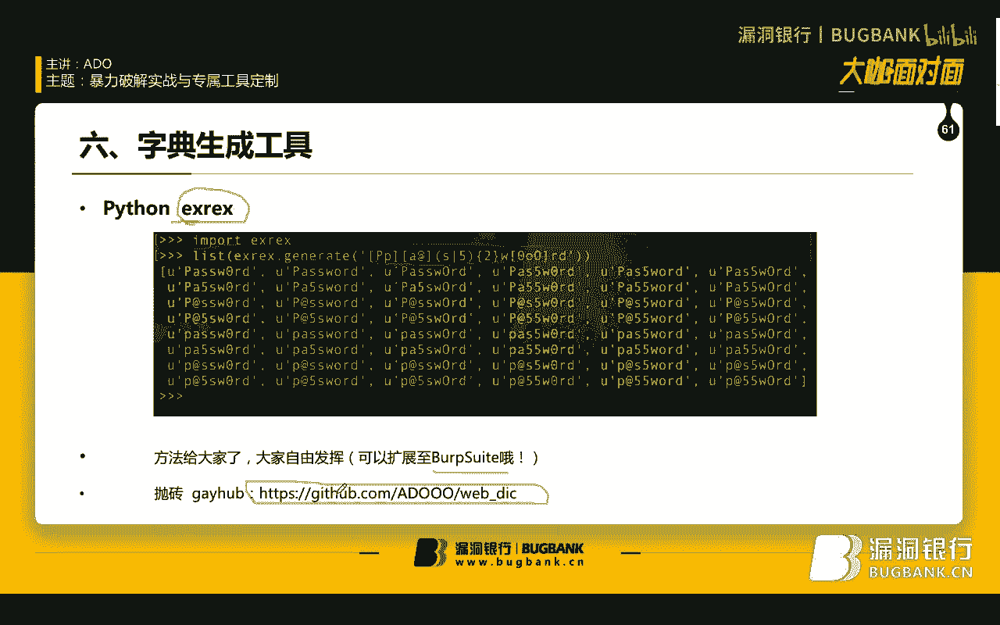

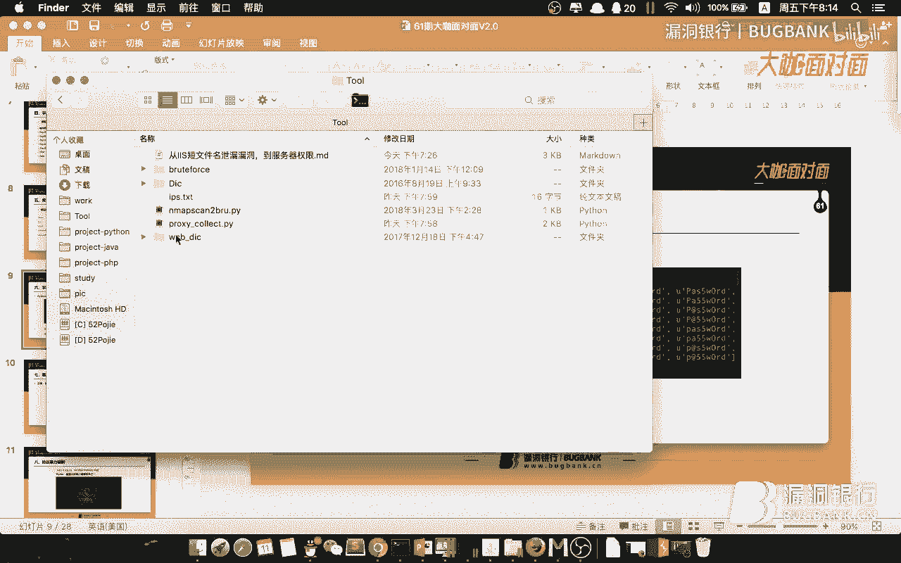

### 暴力破解的危害与案例


暴力破解的危害巨大。左侧图表展示了在漏洞平台上搜索“弱口令”可得到数千条记录。右侧图表则展示了在实际漏洞挖掘中，通过暴力破解获得的漏洞往往能带来可观的奖励。这些案例表明，虽然暴力破解原理简单，但其成功率和危害性不容小觑。

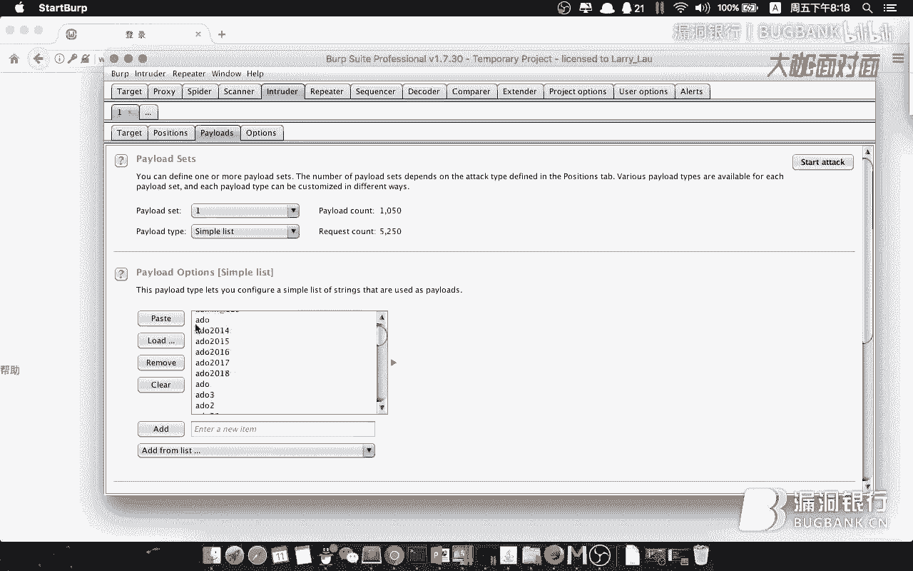


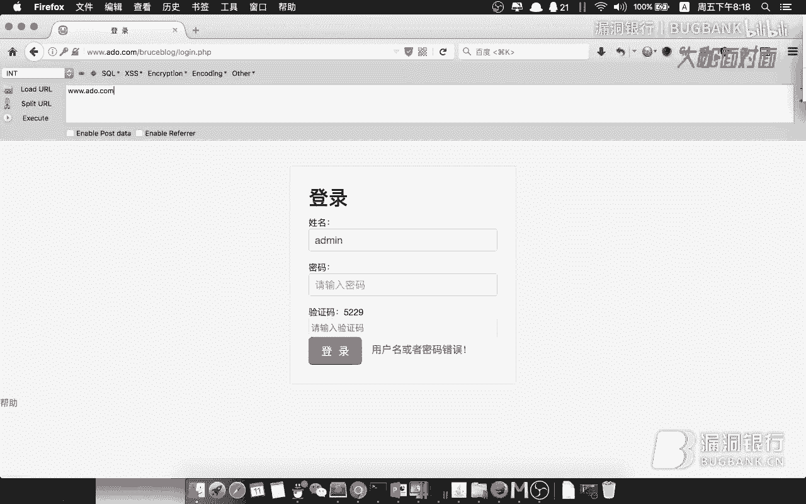


### 暴力破解的根基：字典


如果说暴力破解是攻击手段，那么字典就是其弹药库。没有一个强大、精准的字典，暴力破解的成功率将大打折扣。字典是按照特定组合方式生成的、包含大量密码条目的文件。

**字典生成示例：**
假设目标人物“张三”，生日为1988年1月2日，手机尾号8899，北京人，QQ号为789345。我们可以从其信息中抽取字符和数字元素进行组合。

*   **字符部分：** `zhangsan`, `zs`, `zhangs`, `zhan`, `bj` 等。
*   **数字部分：** `19880102`, `880102`, `8899`, `789345`, `110100`（北京区号）等。

将字符与数字进行各种拼接（如 `zhangsan1988`, `zs880102`），就能生成一组针对性强、命中率高的专属字典。


### 字典的来源与生成


强大的字典来源于两方面：广泛搜集和针对性生成。

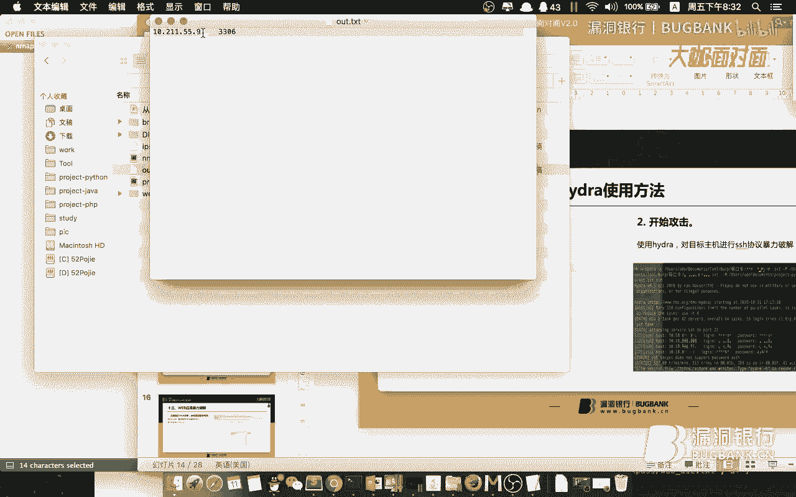

**以下是常见的字典来源：**
1.  **默认口令：** 各种服务与程序的默认用户名和密码（如FTP、MySQL的默认账户）。
2.  **公开字典：** 互联网上流传的常见密码列表，如 `top100`, `top1000`, `top10000` 等。
3.  **用户信息：** 基于目标姓名、生日、手机号、地域等生成的社工字典。
4.  **键盘模式：** 观察键盘布局生成的密码，如 `qazwsx`, `1qaz2wsx`, `zxcvbn` 等。
5.  **常见组合：** 将常见账号（`admin`, `test`, `guest`）与常见密码（`123456`, `admin123`, `password`）及简单变体（加后缀数字、特殊符号）进行组合。


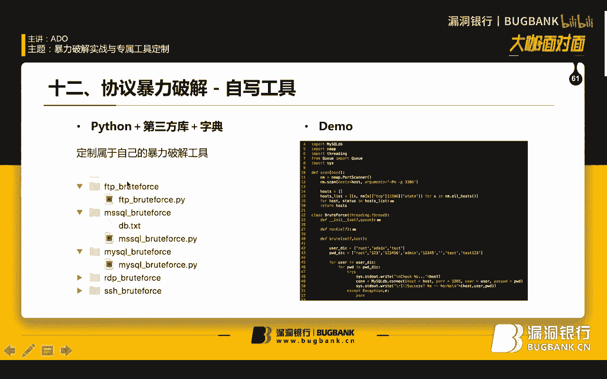

为了高效生成针对性字典，我们可以使用工具。这里推荐一个强大的Python第三方库：`exrex`。

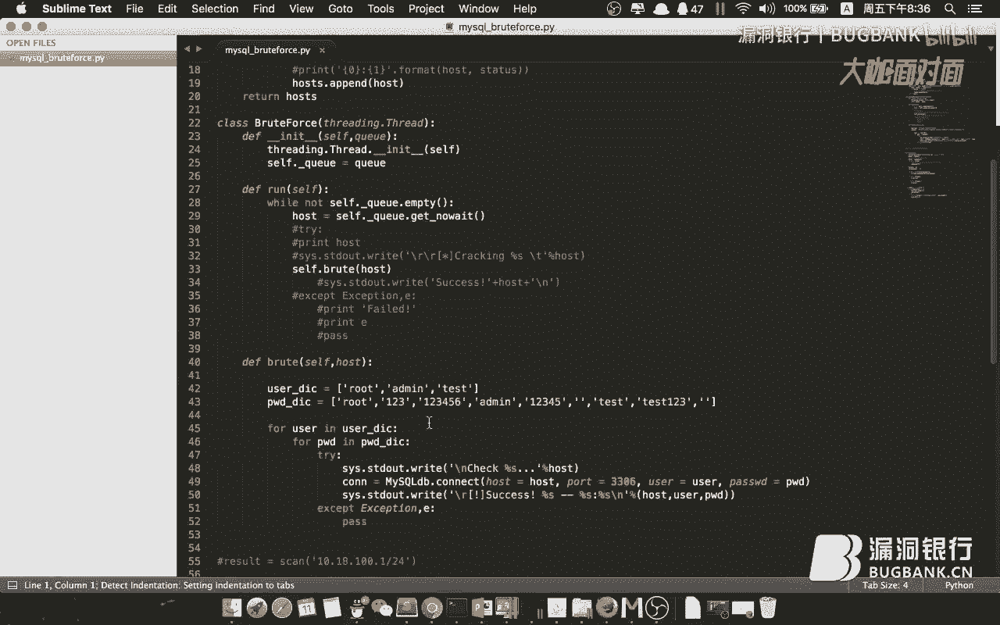

**exrex库示例代码：**
```python
import exrex
# 生成正则表达式所有可能的匹配
pattern = ‘(admin|test)[0-9]{1,3}’
for password in exrex.generate(pattern):
    print(password)
```
这段代码会生成如 `admin1`, `test99`, `admin123` 等密码。我们可以将此功能集成到Burp Suite等工具中，实现自动化字典生成。

---

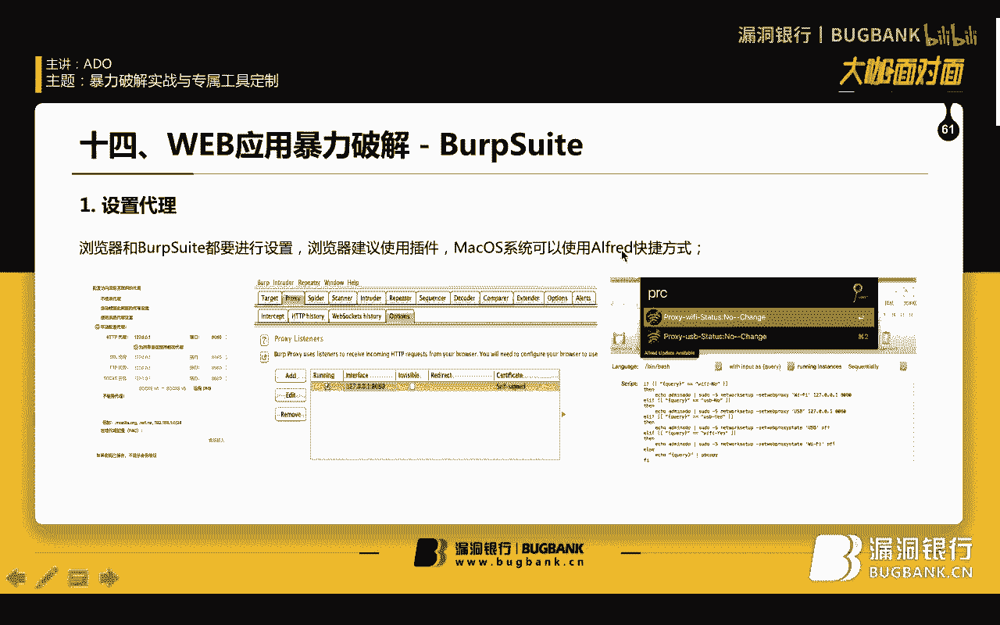

## 实战篇：协议与应用破解


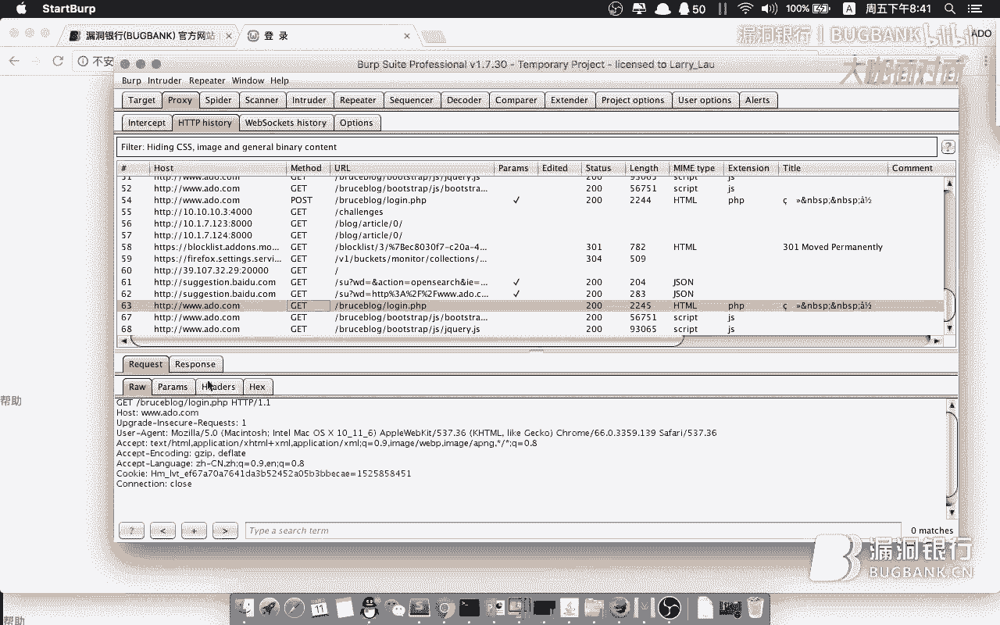

上一节我们介绍了暴力破解的基础和字典的生成，本节中我们来看看如何将这些知识应用于实战。暴力破解主要分为两大类：协议破解和Web应用破解。

### 协议暴力破解

协议破解针对的是如SSH、RDP、FTP、MySQL等服务。最强大的工具之一是 **Hydra（九头蛇）**。


**Hydra的优势：**
*   **跨平台：** 支持Windows、Linux、macOS。
*   **协议支持广：** 支持RDP、FTP、MySQL、SSH等数十种协议。
*   **参数灵活：** 可以定制各种攻击场景。

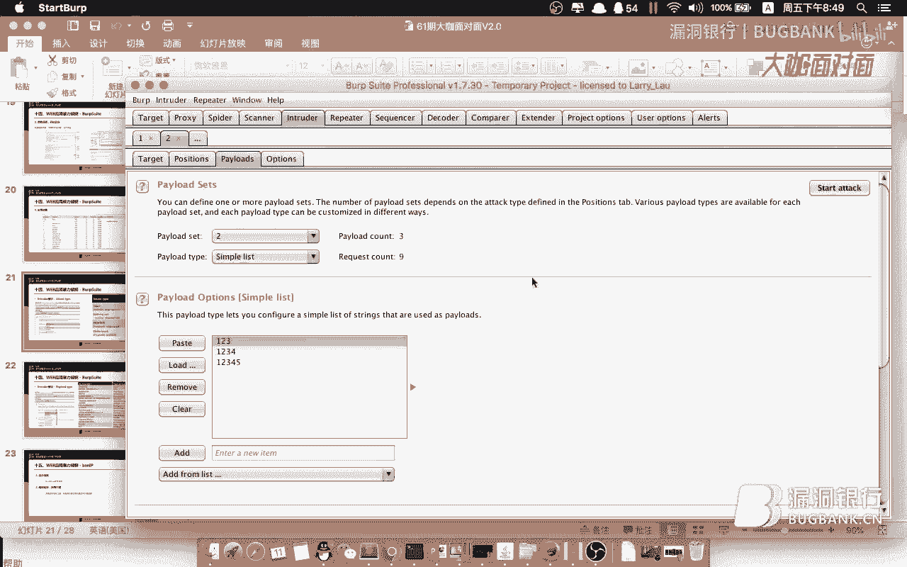

**Hydra核心使用场景与命令：**
以下是Hydra的三种主要攻击模式：


1.  **单用户单目标：** 已知目标IP、协议和疑似用户名。
    ```bash
    hydra -l admin -P pass.txt 192.168.1.1 ssh
    ```

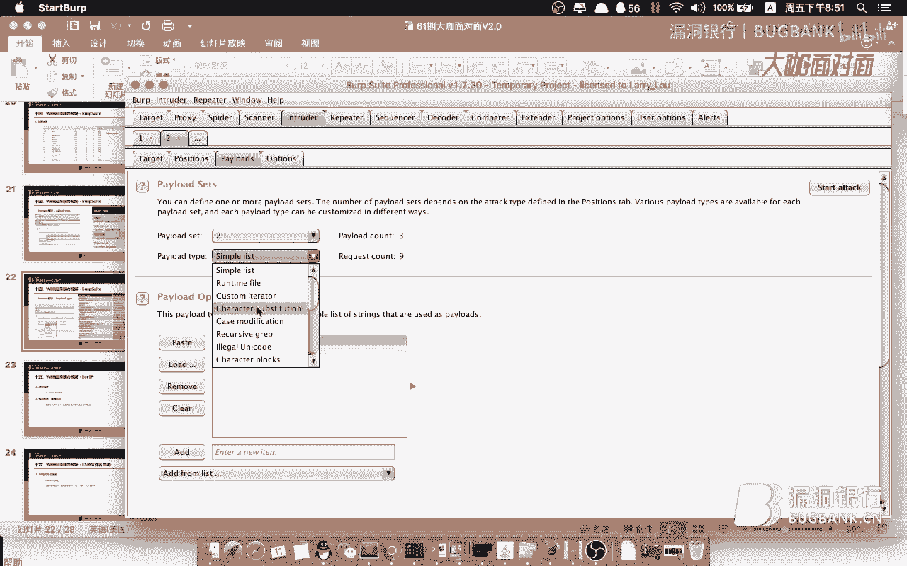

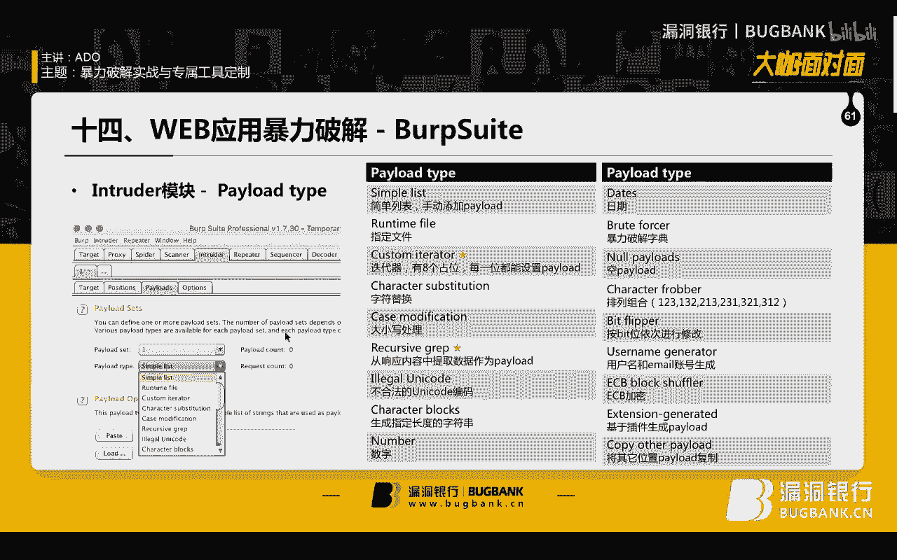


2.  **多用户单目标：** 已知目标IP和协议，需要尝试用户列表和密码列表。
    ```bash
    hydra -L user.txt -P pass.txt 192.168.1.1 ftp
    ```


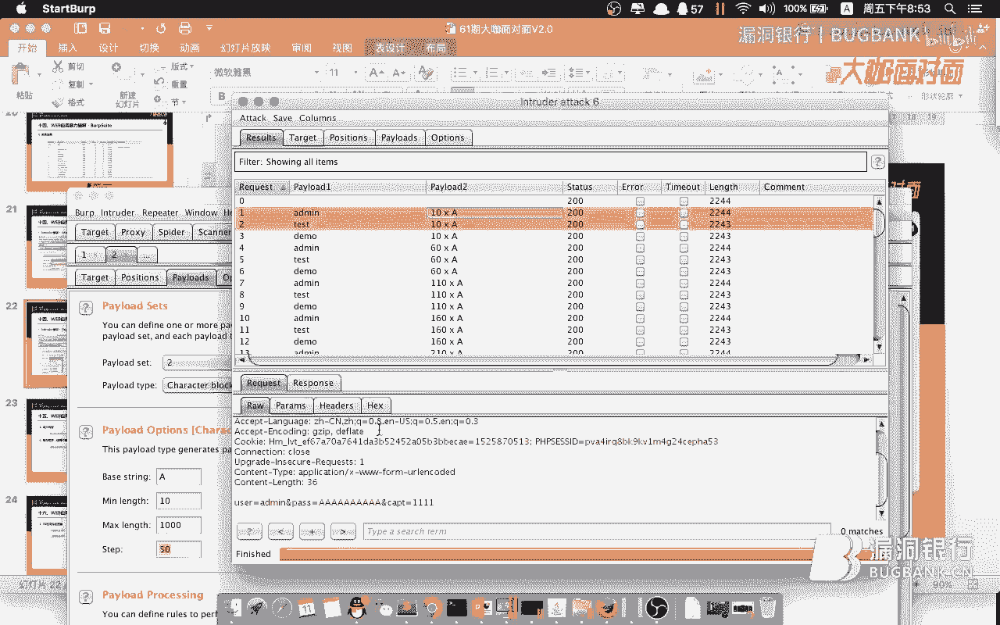

3.  **多用户多目标：** 对多个IP地址进行批量测试。
    ```bash
    hydra -L user.txt -P pass.txt -M targets.txt ssh
    ```

**实用参数：**
*   `-f` / `-o`：找到第一个匹配后停止 / 将结果输出到文件。
*   `-t`：设置线程数（需谨慎，过高可能触发防护）。
*   `-e`：尝试空密码或与用户名相同的密码。

**攻击流程优化：**
在实际攻击中，直接对大量IP进行爆破效率低下。应先进行端口扫描，筛选出开放目标服务的IP。

**使用Python的nmap库进行目标筛选：**
```python
import nmap
nm = nmap.PortScanner()
nm.scan(hosts=‘192.168.1.0/24‘, arguments=‘-p 22 --open‘)
for host in nm.all_hosts():
    if nm[host][‘tcp’][22][‘state’] == ‘open’:
        print(host)
```
将扫描结果保存为IP列表文件，再交由Hydra进行爆破，可大幅提升效率。

**自定义协议破解工具：**
除了使用现成工具，我们也可以编写简单的Python脚本，针对特定协议进行破解。这提供了更高的灵活性和隐蔽性。

**MySQL暴力破解脚本示例：**
```python
import pymysql
def brute_force_mysql(host, user, password):
    try:
        connection = pymysql.connect(host=host, user=user, password=password)
        print(f“[+] Success: {user}:{password}“)
        connection.close()
        return True
    except:
        return False
# 此处可结合多线程和字典列表进行循环尝试
```


### Web应用暴力破解


Web应用的暴力破解核心是反复提交请求（如表单），并根据服务器响应判断是否成功。最常用的工具是 **Burp Suite Intruder** 模块。

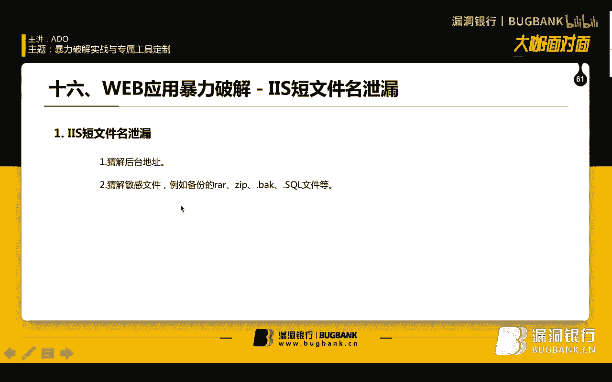

**基本使用流程：**
1.  浏览器和Burp Suite设置代理。
2.  拦截登录请求，发送到Intruder模块（快捷键 `Ctrl+R`）。
3.  设置攻击参数（密码字典、攻击线程等）。
4.  分析响应（长度、状态码、特定关键字）以判断成功与否。

**Intruder攻击类型：**
*   **Sniper（狙击手）：** 使用单一的Payload列表，依次替换一个标记位置。
*   **Battering ram（攻城锤）：** 使用单一的Payload列表，同时替换所有标记位置。
*   **Pitchfork（草叉）：** 使用多组Payload，每组对应一个标记位置，并行替换。
*   **Cluster bomb（集束炸弹）：** 使用多组Payload，进行笛卡尔积组合，尝试所有可能性。

**Intruder的Payload处理功能：**
Intruder的Payload设置功能极其强大，远不止加载字典文件。

**以下是部分高级功能：**
*   **递归提取（Recursive grep）：** 从服务器响应中提取数据（如CSRF Token、验证码）作为下一次请求的Payload。
*   **字符替换（Character substitution）：** 将Payload中的特定字符进行替换（如 `a` -> `@`, `s` -> `$`）。
*   **编码/加密（Encryption）：** 对Payload进行Base64、MD5等编码或自定义加密。
*   **迭代器（Iterator）：** 最强大的功能之一，可将多个Payload组合起来。

**迭代器（Iterator）实战示例：**
1.  **生成邮箱列表：** 假设我们知道目标密码可能是邮箱格式。
    *   位置1：用户名字典（如 `zhangsan`, `lisi`）。
    *   位置2：固定字符 `@`。
    *   位置3：域名字典（如 `qq.com`, `163.com`）。
    组合后生成 `zhangsan@qq.com`, `lisi@163.com` 等Payload。
2.  **生成HTTP Basic认证字符串：** 用于破解路由器等设备的后台。
    *   位置1：用户名字典。
    *   位置2：固定字符 `:`。
    *   位置3：密码字典。
    生成 `admin:123456` 格式的字符串，再在 **Payload Processing** 中添加 **Base64-encode** 规则，即可得到完整的认证头。

---

## 进阶技巧与思路拓展

### 绕过防护与提升效率

*   **降低请求频率：** 在Burp Suite中减少线程数（如设为1），或在自己编写的脚本中加入 `time.sleep(1)` 延时，可有效避免被WAF封禁IP。
*   **使用代理池：** 编写Python脚本，从免费代理网站爬取并验证可用代理，构建代理池，使请求来自不同IP。
    ```python
    import requests
    proxies = { “http”: “http://10.10.1.10:3128”, “https”: “http://10.10.1.10:1080” }
    requests.get(“http://example.com”, proxies=proxies)
    ```


### 信息搜集与用户枚举


暴力破解不局限于密码，也可用于信息搜集。


**以下是获取网站用户名的几种方法：**
1.  **错误信息差异：** 在登录、注册、密码找回等功能处，输入不同用户名，观察“用户名不存在”和“密码错误”等提示差异。
2.  **内容页面挖掘：** 新闻、文章、论坛帖子的作者信息通常会显示用户名。通过爬虫或Burp Suite Intruder遍历ID，可以收集大量潜在用户名。
3.  **帮助文档泄露：** 许多系统的后台帮助文档中，截图可能意外包含当前登录的管理员用户名。

### 漏洞组合利用案例


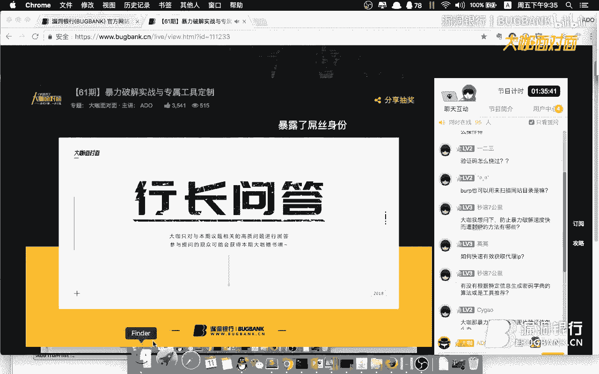

一个低危漏洞通过与暴力破解结合，可能演变为高危漏洞。例如 **IIS短文件名泄露漏洞**。
1.  利用工具扫描出疑似后台目录的短文件名，如 `admini~1`。
2.  使用Burp Suite Intruder，对该短文件名缺失部分进行暴力破解，补全出真实后台路径，如 `admin_login.asp`。
3.  成功访问后台后，可能发现新的攻击面（如文件上传、SQL注入点），最终获取系统权限。


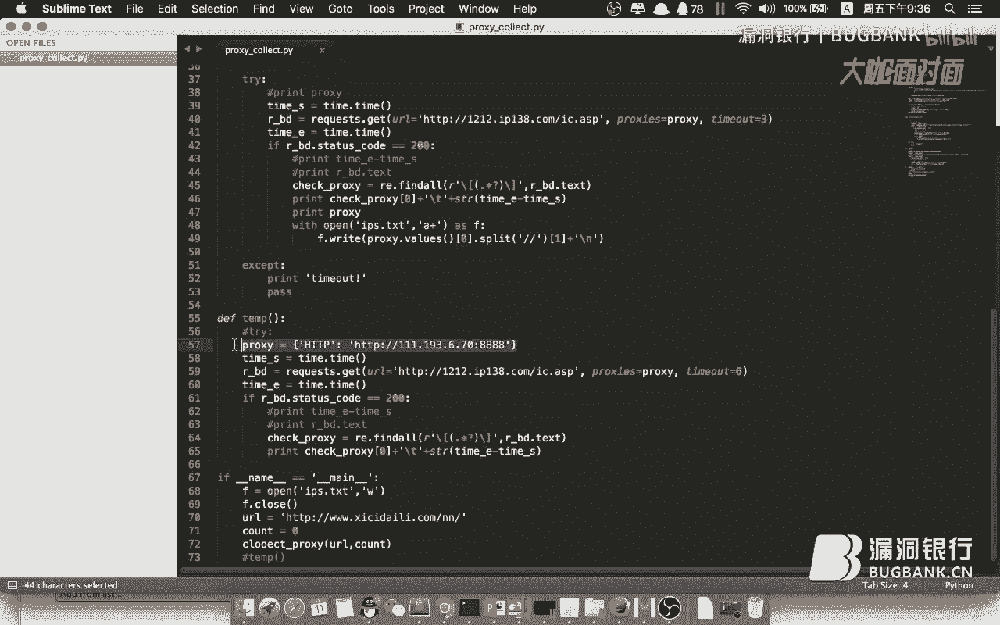


### 耐心与耐力


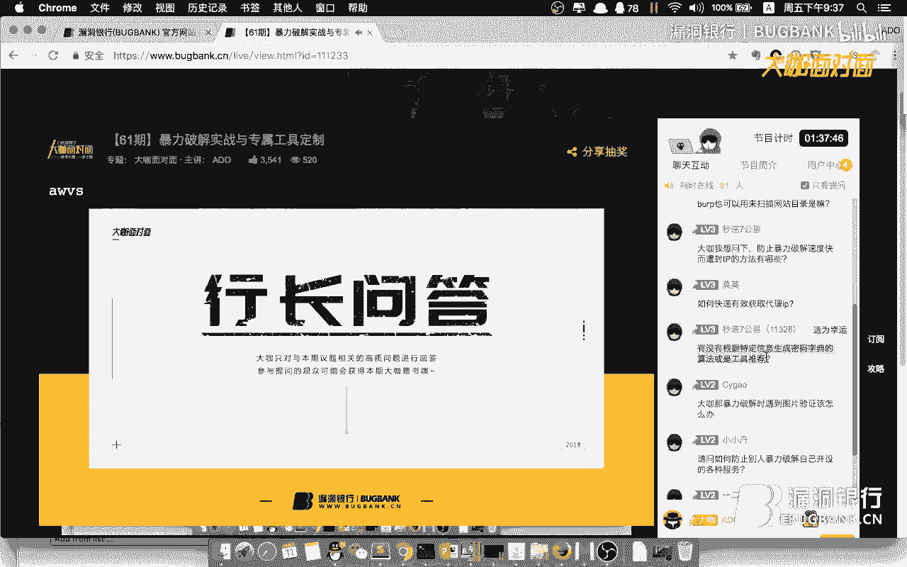

没有耐心，无法做好渗透测试。当常规手段失效时，基于社会工程学信息（如地区号段、手机号段）生成海量字典进行“盲爆”，虽然耗时，但有时是唯一的突破口。口令就在那里，关键在于你是否愿意尝试。


---

## 总结


本节课中我们一起学习了暴力破解的完整知识体系。
我们从**基础概念**和**字典生成**出发，理解了暴力破解的根基。
随后深入**实战**，掌握了使用 **Hydra** 进行协议破解和利用 **Burp Suite Intruder** 进行Web应用破解的高级技巧，特别是迭代器等强大功能。
最后，我们探讨了**绕过防护**、**信息搜集**和**漏洞组合**的进阶思路，并强调了**耐心**在渗透测试中的重要性。
希望本教程能帮助你在未来的安全测试中，更有效地利用暴力破解这一基础但至关重要的技术。