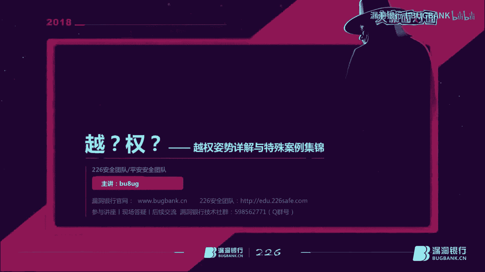
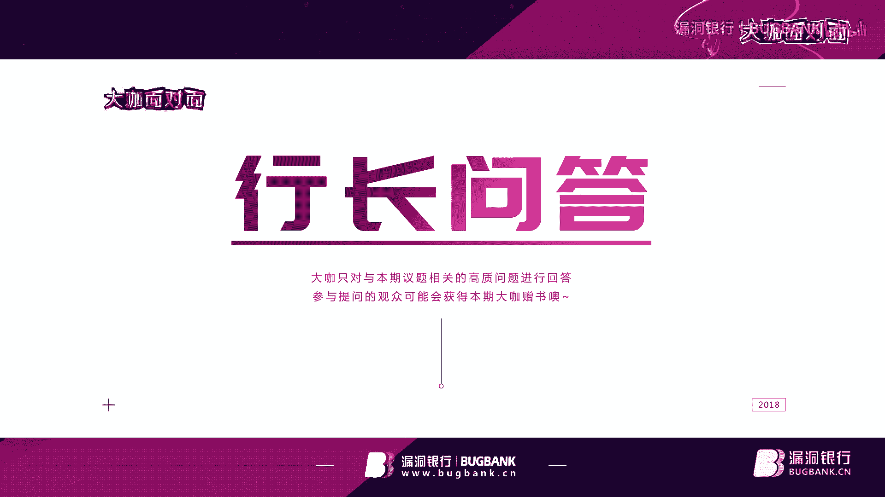
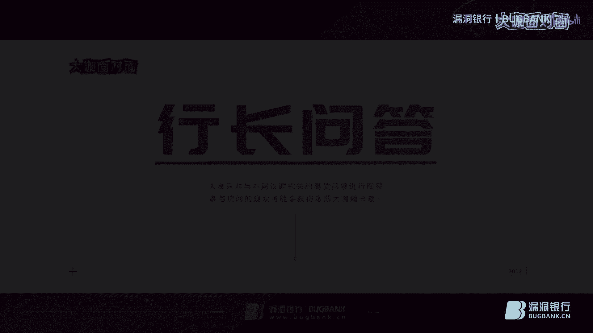

# P1：65期丨越权姿势详解与特殊案例集锦-bu8ug_x264 - 漏洞银行BUGBANK - BV1ft411Z7sK

为知识而存，因技术而生，小伙伴晚上好，欢迎参加第65期恶动银行安全技术直播打咖面对面，我是持人秋秋。今晚我们请来的大咖bug，他是226团队核心，现在任职于平安集团担任高级安全工程师。

通过大家看到大咖设计的内容提纲和刚材交流，应该不难看出我们今天请来了一位特别皮的大咖。今晚呢他会为我们进行关于乐权方面的知识分享。那他会有哪些新奇的例子和有趣的经验呢？我们拭目以待吧。在大咖演讲结束后。

我们还会有10到15分的问答环节。大家如果有什么想问的，都可以届时在聊天区发出。问答结束后，bug大咖还会选择一名幸运观众，赠育一本有趣的算法入门书，叫做算法图解。好啦，我试完了。

下面就请大大咖开始进天分享吧。嗯，好嗨嗯，大家好，我是bug。呃，现在是在216团队，然后是他们里面的核心。然后现在也就是在平安集团，是平安蓝军。然后呢，我呢比较致力于安全研究。

而且我是具有多年APT攻击经验。当然了，今天我肯定是会讲APT的。平常呢喜欢一些比较新颖的玩意，也是喜欢一些比较稀奇古怪兴奇的一些攻击手法。然后呢比较热衷于情报分析。本期的话分享内容的话有4点，呃。

第一个是跃拳到底是个啥玩意。第二点是上下左右跃拳到底怎么越。第三个呢是没事就越，不要面子吗？第四个是震惊，漏斗还能这样挖。然后的话这次我会讲一些分享一些月权的知势详解与特殊的案例紧急。呃。

当然这些是仅供参考，有些欢迎补充。

首先先讲第一个内容。呃，月权是什么？呃，越权漏洞呢它是外国应用程序中一种常见的安全漏洞，它的威胁在于一个账户即可控制全站用户数据。当然，这些数据仅存在于漏洞功能对应的数据。

越权漏洞的成因主要是因为开发人员对数据真山改查是对客户端请求的数据过分消息而遗漏的权限判定。所以测试越权是和开发人员听信心的过程。当然了，我这次内容也会讲呃不只讲如何越权，也会讲一下越权如何防护。

我先跟大家大家讲讲为什么越权现在这么虎。其实越权这个漏洞嘛很早就存在了，不过是以前呃很多东西都不在互联网上。比如说网银啊，这些东西都不在网上，说你越权了也看不到什么东西，也拿不到钱。

也没有什么造成经济损失。所以说这个漏洞很多人是忽略的。现在嘛随着互联网加的发展。呃，大家呢就是钱啊，这些东西都是数数字化信息化嘛。所以说就很多人注重了越权这个漏洞挖掘，而发现了很多的越权漏洞。呃。

这边介绍完了，然后可能大家对月犬还是不太了解，我就打个比方吧。比方来说呢，对于一个房屋使用房屋的有哪些人肯定是主人访客，还有不速之客。呃，如果是通过使用钥匙打开了房屋门。我们呢在房屋里面可以做些什么呢？

作为房屋的主人呢？我们可以使用房屋里的所有东西，也可以呢随意进出任何一个房间，因为他是主人，正房应是他的，相当于呢系统里面的管理员。而对于一个访客来说，他只能在房屋的公共场地使用。比如说客厅这样子的。

而房屋的某些房间，比如说卧室呃，则需要主人的授权才可以使用，或者是客房，或者是主人的书房这些东西。因为这个的话就相当于普通用户，或者是一些高权限一点的用户。呃，除此之外呢。

还会有刚才提到的不速之客来到这个房间里。哈能来到房间里可能会翻箱倒柜。那么为什么还能翻箱倒柜？那首先还能进来。呃，进来之后呢，他还能。到任何房间里还能打东西。所以说。这个房屋的安全做的不够。

所以说才会给不是最客提供了可能。而在系统中，我们对于这种不速之客的访问，就称之为虐权了。然后第二点，上下左右越拳到底怎么越。呃，大家可能都知道越拳的话一般分为两种，最多分为三种，平行越权垂直越权。

最多加一个交叉越权。为什么我说上下左右越权。其实呢有些大家可能认为就是越权就是这三种，但是其实向上越权，向下有时候也能越权。当然这点我在后面会讲的，呃，我们先讲一下水平越权。水平越权漏洞。

一般出现在一个用户对象关联多个其他对象。比如说呢订单地址等，并且要实现对关联的对象的一些ID啊。呃就是座机操作的时候，开发者者呢会习容易习惯性的在生成一些表单。在这个时候呢。

就会根据认证过程的用户的身份来长出，就会就是根据用户里发送数据包的一些ID啊来提供入口，然后让用户提交请求，然后并根据这个ID来操作它的一些对象。而在处理这些东西的时候呢，往往默认只有权限。

有权限的用户才能得到这些入口。进而进行操作。但是啊他就不会进行校限这些权限了。所以说嘛大部分这些情况。就会出现一些平行月全，这个嘛其实很严重。在后面呢我会讲一些很新奇的手法，大家不要走。

而横向这种水平的横向月权，其实简单来说嘛，就是攻击者尝试访问与他拥有相同或者相近那个权限的用户资源。比如说嘛两个人都是互主，哎他互相访问这个优势了。后面呢会有详细的案例。

然后我们再讲讲水平热拳经常出现的位置。当它主要是下单成功之后的订单查看处，收货地址的删除和添加，还有下单的时候的地址修改，这个大家可能见的比较少，当然还有一些其他的没有列出来的。然后我们先讲一个案例。

案例一是股市的行情很好。呃，现在比特币好像行情不太好啊。然后A和B是多年的股友，两个人是多年的死对头。最近呢两人很看好一只股。B呢想探探口风A买了多少股，但是A呢很保密，这东西肯定不让B看了。

所以说呢A在购物场合的PC端操作的时候没人挡住，没注意。哎，别看了一眼啊，看的呢还是A的订单号。这样的话的话，A离开了之后，B登录了自己的号，在订单详细页查看了自己的购买记录。

发现这个地址的有一个参数就是订单号。呃，大家可以看啊，这个订单号还是蛮长的。这个对于这个币的记忆力也是蛮好的，挺佩服的。所以说呢他就开始把A的订单号替换成这个订单号，替换到这地址栏里面。然后呢。

没想到他确实还能看到了。呃，在这个案例中呢，A和B其实原则上只能看自己的那个股票信息。订单信息，但是呢不能看别人的。但是为什么D改了一个小小的参数，就能看A的订单信息呢？

其实这就是一个的比较典型的水平越权。其实这个东西的话是因为系统存在水平月全漏洞，而没有对用户的数据进行访问限制。他默认了，你输你输进去的都是对的。再讲第二个案例。第二个案例是有一个写作网站。

作者A登录之后，可以对自己的文章进行一些发布、查看、删除等操作。当他删除一篇文章之后呢，他发送了1个UIL是这个它中间看大家可以看到它中间有个deelete。然后的话他执行删除操作ID是文章号。

也就是一号。然后当A他想恶意攻击B或者是其他的时候，他把文章号改成2，然后一执行，发现执行成功了。所以说呢。这个A就恶意删除了，反正不知道谁的那个文章。呃，对那个造成什么损失，大家也就可以想想。

比如说你呃A无意删了删了什么土豆的文章啊，那就很很好玩了，是吧？所以说这个也是越权，是因为呢就是他没有对。用户就是进行限制这种热选现在。也不说没有，但是比较少见了。但是这种主机常用的越深。

下面开始讲它的产生条件。它的产生条件主要有3点，当然还有其他的必要，就是其他的点我没写进去，但它主要是有三点。呃，三点是首先他直接通过对象来用。这种通过修改一下参数。啊，比如说第一点嗯。

那个什么在案例一中。还有202中都发生了，修改一下参数，它就可以产生越权了。然后第二点是多功能阶段，多阶段功能智能化比较有意思，算是一个比较奇思妙想的技巧。当然在后面我会仔细讲到。

它就是你每一步就是因为很多开发者还会把它分成很多步，呃，每一步可能互相没有进行健全，就会导致这种功能，后面我会详细的讲一下，呃，第三点呢是静态文件，比如说嘛有些免费的网站，呃，它你要下发东西。

然后但是还有会员啊，比如说最近嘛给大家透入一个小小的窍门啊，就是最近刚发现了一个呃某视频网站呃，我只会告诉你们是某视频网站，你会员呃登录之后，然后弄个一天两天的会员，然后把理想看的去缓存下来。

然后你退出登录。不管怎么样，你的缓存剧你都能看，而且那个剧呢还是VIP的剧，很爽的。然后下面是可以讲一下垂直乐拳，垂直月拳和水平月权不同，它是在于不同级别的角色之间乐权。

比如说嘛管理员和普通用户或者是大管理员和小管理员这样子的垂直月拳呢，就刚才我讲了，它分为上下向上月拳和向下月拳。比如说呢在某些网站发布文章、删除文章等操作，这个应该是管理员的。但是一个小的匿名用户。

可能或者是一个写稿的，他呢也可以做相同的事情。他能改的这些权限，他就是向上有权。向下月权呢也是一个很有意思的。比如说嘛嗯就像卖保险吧，平安吧，卖保险嘛，业务员呃业务员的领导可以看到业务员的客户的信息。

啊，这就是向下有权，打个比方，就这样子。然后先讲案例。案例一是A是某个相城系统的买家卖家。B是某商城系统的一个买家。然后呢，卖家A它是可以设置店铺，因为它是卖家嘛，还可以发布商品。

但是买家B呢他只能购买商品，因为他买的他不需要设置店铺什么的。所以说呢应该是按理说啊这个地方权限应该很好划算。但是呢A和B的关系好，B也想看看A的店铺如何设置的，可能B也想开店了。

于是呢A发给第一个店铺可设置的页面，而且还是可编辑的。谁想到这个A种，为什么要这样想？刚才刚巧呢B正在逛商城呃，也不知道看什么。于是呢在同一个呃浏览器上新建了一个页面，访问了A给他的店铺的设置链接。

结果呢B访问成功了。而且呢他还改了一下A的页面。然后提交。然后提示说店铺设置成功，然后看了一下效果，哎，真的设置成功了。其实呢按照系统的设计吧，只有系统的卖家才可以设置店铺，为什么买家B也能设置店铺呢？

其实原因是呢系统做设置的时候，没有对系统的角色做最小的访问控制。任何系统角色通过某种方式都可以进行比自己权限更高的操作？这个就成了权职越权了。然后看一下下个案例。呃，下关案例就是也是A和B。A也是卖家。

B也是买家，他们还是关系好。然后呢，A想看看B买了什么东西。最近然后呢。B呢就给了A一个可以设置的链接。哎，我也不知道为什么啊，这个刚才A给了B一个呃编辑页面，B又还给A一个编辑页面。

他他们俩有什么关系？我这可真搞不懂为什么要这样设置。然后呢，A也在他在设置店铺，于是他也是打开了这个页面，哎，发现访问成功，访问成功，这就很不对劲了。然后呢，他修改了里面的参数。还能提交。好难提交哎。

这个就有意思了，哎，又设置成功了。哎呀，这个真的就是很有意思的，A能访问BB能访问A，这个权限控制的很大呀。是吧。所以按照系统的设计，只有买家才可以设置个人信息，而卖家为什么能设置呢？

而且卖家能设置其他买家的信息，完全都混乱的。这个原因呢其实就是系统做设置收益，也是没有对系统的角色做最小权限的访问控制。所以说呢这个也是一个月圈，而且也是垂直月圈。

然后现在来讲讲纯世瑞城的产生的一些条件。它的产生条件主要是呢通过隐藏UL来实现访问控制。这个是经常有人会做的。第二个呢是多阶段的功能。也就刚才讲的这个呢我在后面会说一下。第三点呢是平台配置错误。

平台配置错误的话，这个东西就是有些人呢会把平台的一些配置。呃，它没有完全的配置，就是没有基于最小权限进行配置，导致呢你的权限过大，用户权限过大或者是管理员权限过大。就导致了一些错误。

然后这一页是一个越权的哦，现在我们讲到第三点了，没事就被越不要面子的吗？是啊，那些开发者或者是运维来说，你没事就越我网站，我这个不要面我这网站不要面子的吗？而权限说我不要面子的吗？是不是？

所以说我来讲一下月泉的防护。大家把这个放大海。呃，首先呢月权要有两个账号，最好是有两账号，A账号和B账号。因为这样的话比较好。当然一般来说就是测平行越权的。如果你是做安全服务来说的话，呃。

你可以尽量的管客户要一下，要三个账号。我建议是要三个账号，一个是两个皮行账号，还有一个是高权限的账号，或者是一个低权限的账号，反正权限都不要不同，这样的话比较好测试。首先呢大家看。全越全嘛就四个方面。

针酸奶查和数据库有点像。在这里呢我们就先只讲一下帧帧的话还有两种请求嘛，ge型和posts。那先讲ge。开的话就是你在UIL里面呃说那个把ID改了，然后或者是把B的ID给A的，或者把A的ID给B的。

然后访问成功呃，访问到就是互相你ID所对应的账号，啊那就成功了，这很简单，对吧？呃，那poss的类型就比较复杂。大家可以看到。pos类型的话，就是把A账号的功能，把A的库ook替换成B的库ook。

替换酷之后，再执行一些操作。你看一下这些操作，就是比如说你把A账号的库替换成B账号会，然后你A账号执行B账号的一些操作。比如说购买商品，你看看是不是最后是B购买商品了，就是这样的一个意思，然后发包。

然后发包如果是他发就说你的是错误的，或者是你还是A，那么就是越选失败了。如果你是成功在用B账号买东西，本来也A账号，然后你用B账号买东西，那么你就是越选成功了，大概越权的一个原是这样子的。

那我知道原理了，那就该防护一下了吧。其实呢呃对于防护来说的话，类似于一些请求。比如说查看用户信息，不能只根据用户信息的用户的1个ID进行搜索。比如说嘛226的ID呃，本来ID是226。好了。

你改成227228哎，进去了。哎，这就不对了，对吧？呃，这是get型的，比较容易看到pos的也示，也有些在data技数里面呃，上面两个大字ID两个大字那写着，是吧？你你藏起来嘛。

但是藏起来呢就会造成第二点问题。库中获取当前的ID防止呃你就是攻击者呢，他可以从酷中获取。你酷，你加个MD5，我解一下MD5好了，又是2个ID那么大字。

是吧所以说呢你可以在3S和酷中可以加入一些不可预测不可拆解的用件信息。啊，比如说你2262626261堆226，他才知道你这个是是不是你ID还是你的一些随机数啊，对不对？这就对了吧。

还有呢就是可以在每个页面加载前进行一下权限认证。呃，这就这种方法做的比较好的话，我看着比较支支付宝。支付宝的话在进行一些操作的时候，它都会进行一些权限的认证，就是一些敏感操作的话，都会进行权限验证。呃。

这就到第四点的。第四点其实第三点的升级，就是你每个敏感操作的时候，让用户呢在输入一个密码或者是短信验证码。这个的话就很算是可以防御大部分的越权的吧。反正对于这种的况，我是没有特别的。

如果没有如果仔细看的话，就没有什么特别的方法了。嗯，我看到呃有人说黑猫大会有一届是。对，APP有一选漏洞，这个是的确的。嗯，当年的话是。反正是那个APP好像被撸的一塌糊涂吧。那时候也是比较早了。

现在你去试试，你能能弄我，我请你喝酒。然后现在呢就看看实战了。20一呃大家可以看到啊这个地方是头像这个位置，头像的话也不知道这个开发是耍酷啊，还是干什么，还是显示这个水平高呀。

头像是这种通过pos包取数据的方式。然后这个数据呢数据呢是他的ID号。呃，这样的话，你改这个ID号可以按米儿头像，这个有什么用没什么用，的确没什么用。但是它是一个最简单。最低V的乐拳。

但它也是一个最典型的乐拳。APP也分getbos这个在后面你再发一下问题，我会详细的讲一下的。然后的话。这样子越权，然后但是你现在是越越权一个头像，对吧？就没什么危害，就是看头像没啥危害。

但是如果你是订单呢，就像前面所说的订单呢。所以说。然后现在讲案02在ku克中的乐权呃，刚才有人说了，掏唤可以越权吗？to惠可以越权吗？c克掏唤其实都是一样的，都是一个健全操作。

但是健全操作它本身也可以进行乐权的。所以说刚才那个问题我回答了，在酷慧中也可以越旋。你比如说这个地方呃，大家稍微再放大看一看，我这个地方它是一段酷惠，它里面有1个UCID。呃，虽然不清楚。

但是也我这边标了很大1个UCID一看。那肯定这个地方肯定要改了。所以说见到UCID见到ID什么的就去改，就是怼，绝对没错，怼得动，那就是日期好，怼不动嘛？换个例换个地方再怼嘛。

是吧这个东西哦刚才有人问两个账号要分两个浏览器，打开，好麻烦。bo泡有没有办法查看2个ID可以啊，但是你肯定还是要打开两个浏览器的，或者你要登录两个账号，b泡可以这个存储所有的信信息，你可以随便改。

其实根本的问题，这个问题还是没不是很好绕货的。当然你也可以用那种无痕模式，无痕模式就好一点。现在继续讲继续讲，在酷的话，这块地方也是可以修改的。所以说呢。你你们这些开发就是我不知道有没有开发哦。

开发的话要注意了，不要起这个UCID这个名字嘛，你换个名字嘛，你换个UCDI嘛，对不对？那当然只是那个假设。所以说嘛就不要这样子，你要隐藏的深一点。然后现在有一点小的骚操作了。大家可以看到啊。

这个其实这个数据包嘛，它没有后面的user IDD的一些参数。就是我这两个红箭头指的这些这些东西都没有的。然后它呢是根据前面的它有一个cook，它有个类似于cook的方式来进行一个验证。

但是在这里呢它很奇葩，这就骚操作来了，加了一个这种usID的东西，然后还加进去。然后呢，系统就觉得哦你加了这个东西是吧？那就行了，那我就懒得判断了，懒得看你那个呃库里面的那些东西了。好了。他加进去了。

加进去的话，它就这样直接强制的认证成功了，他就可以强制说我就要看这个ID的信息，我就要看那个ID的信息。好了，这就被虐了。那这种设计也是很奇葩的，很傻逼的，也不知道这个开发怎么设计的。

然后第二个要骚的操作。第二个必操作操作就是修改返回包。这个的话就是刚才我讲的一个。分步骤的健全。这个的话就是比如说重置密码。还有我这里面注册账户，你第一步测试，好后第一步先测试这个账户是不存在的。好。

存在的看可以发个no，不存在，可以发个yes。好，你把yes改成no好了，他就说认为这个账号啊的确不存在的，不存在的话，可以允许注册。在注册的时候还有没有继续校验。

他觉得你既然提交了那个你这账号肯定不存在的，这样的话就有可能造成一种情况。就是这个重复注册，重复注册的话，最严重的话就是你把那个用户信息给抵掉了。好了，本来别人注册了一个账号，然后你注册一个账号。

把他的账号抵掉了，那他里面钱不你拿到了嘛，这多危险是吧？当然了也可以造成一个拒绝服务啊，大家都登不上去了，密码全部错误，然后重置密码的所有信息都失败了，后了，用不了了那。拒绝服务啊。

其实拒绝服务不只是D dos对，D doss只是一种手段。被D到死之后，网站打不开，只是拒绝服务的一种。你服务用不了了，只要是服务用不了了，都叫拒绝服务。有人问咋知道有UCID这个参数的？

UCID啊这个东西。us什么意思？用户ID是什么意思？就是那个一个数用户的一个序列，所以说它是一个用户序列，这个的话是比较常用的。然后呢，大家呢可能会有一些。呃，疑问了大脑去挖洞呃，做动策嘛。手动策呀。

做什么SLC啊，还有一些活动啊。这个大佬挖那么多漏洞。啊，我呢啥漏洞都挖不到。咋回事啊？人与人差距真的这么大吗？是吧很多人就劝退了。是不是啊？其实呢他有几个点。首先呢那些大佬他拥有别人测不到的点。

其次呢要细心。然后呢，还要细心。再然后呢。还是洗。当然了，信心很重要。但是你会你觉得我会小惺心。no no no。我呢其实要讲的是第一个点。你要拥有别人测试不到的点。好了，如何拥有别人测试不到的点呢？

那么有些大佬啊。他们为了挖滴滴的乐洞。专门呢注册车主啊，可能还买辆车，那那大佬的作风嘛，买辆车，然后去挖漏洞滴滴的。然后有些大佬呢。他专门。去美团还有什么饿了么送外卖。当骑手挖漏洞，大家可以想象啊。

呃一个大佬送外卖下了单测试一下。然后到了客户呢说哎，你先别点确定，我再我测试一会儿，然后你再点确定是吧？碰到美团商家了，哎，可以的那你肯定能测到很多漏洞了。是吧这个美团这种的话外卖也有商家。

刚才不是说有商家吗？这个就是这样子的。最后嘛还有些么？大佬为了挖陌陌的漏洞，专门去约了几天，这个大家都懂了嘛。画面呢大家也要自己想象，还有的大佬啊自己开直播了。该有的大佬呢那个穿非本性别的装扮了。

然后大家自己可以想象。而且呢其实说实话。挖这些洞，你可能是看起来你需要投入一些东西，但是你就觉得自己收获人有没有那么多吧。就比如说嘛这个大家自己想象的这个蒙窝的这个洞。你去呃看主播给主播打赏打赏吗？

或者是请妹子小姑娘吃几顿饭，然后的话哎给了点，然后你挖了一个洞，成本不全回来了，顺便呢还收获一个妹子是吧？或者还吸了一堆粉是吧？啊，缺钱欠劝退这个嘛就没办法了。我原来曾经挖了一个洞。

就是我砸了很多钱进去，把我的身家全部砸进去了，然后挖倒了。然后该讲了，刚才讲完了那些就来讲一下这个一个亮点。大家要的一些干货来了，刚才前面都是基础，大部分都是基础。现在是针对特定角色的渗透测试。

其实刚才我讲了三个案例，滴滴、美团、陌陌啊都是那个这种针对特定角色的渗透测试。他们呢其实主要就是你这些角色你不是一般人可以碰到的。所以说呃这种针对角色特略案例的话，呃，比如说像在我们先来讲实战案例。

比如说呢这一点大家看一下图。这个的话是我在一个那个安全脉搏里面的，看到的，它是一个内部系统，被无意中发现了，发现就发现了。你安全度的好点就没事了。但是呢看内部的安全有没有人重视，就导致了一个入口令。

然后进去进去之后呢，又可以看到这个人权限特别高，可以看到大家可以应该我不知道大家能不能看清楚。我给大家念一下，它有几个比较严重的，就是一个面单打一程序。还有一个加密狗驱动。还有一个是在线客户管理系统。

所以说嘛这个的话就是很严重了。其实呢在国内吧，很多系统它的内网。很只要你进了内网。那他基本上对你就不设防了，大部分都是这样子的。因为他们觉得你外面这一层安全就够了，那么就够了。

所以说很多大佬找这种就是进行这种针对特定角色的渗透测试来进行渗透。第二个案例是沃云上的一个案例。这个案例是URP教务系统阅权访问，可查看越狱学生的课表成绩。然后后面括弧需要登录。需要登录，那好了。

划重点了，它需要登录。什么人可以登录？那肯定是这个系统的一些呃管理员啊，或者是用户啊或者老师。那有人可能就这样子了，我去当个老师吧，可以，你去当老师可以的，说明你能挖一堆漏洞。😊，是吧。就这样子的。

你需要有这种权限，你可以访问这个系统的权限。更深入进去，你要突破外面这个一层膜，对吧？膜嘛这个东西突破了，那就你们就很顺畅了。越权漏洞属于逻辑漏洞吗？越权漏洞是属于逻辑漏洞。有的不需要登录就能进后台。

的确啊，这也属于越权，你进了后台，就相当于你得到了那个用户的权限了呀。然后呢，针对这些特定角色的渗动测试。怎么发现这些？首先。呃，真实的付款。就像我刚才讲的，我花了一笔巨款。然后投资了一下。

然后我就真的挖了一挖了一笔洞。所以说这个你要真实付款，付款之后呢，你还要收货，你确认收货，说不定你可以帮别人确认收货。如果你是商家，你帮别人确认收货。好了，那就好玩了。你这可以刷单嘛，对吧？

然后收货之后的评价，你可以。越升别人的评价。哇，刷评价刷单了更好玩了。是吧还有一些开放平台申请，然后金融站点的一些身份证身份认证。当然了。还有刚才有听众说的那种直接越旋进去，然后灯录状号直接绕过去了。

那种是做的比较烂的，从外面烂到里面的。我知道肯定还有很多人想这种漏洞还有什么其他点，那我再补充一下吧。其实呢像你比如说你注册滴滴司机，呃，就比如说前一阵的嘛，滴滴司机滴滴这个事情有点大嘛。

就是你看到的一些别信息，其实就属于一个越权。当然了，你还可以怎么说呢？你还可以越权到城市越权其他的司机。是吧你看看谁的司机，那个司机车开的好，哎，你看看能不能再弄到他号码是吧？顺便那个PY吧。对不对？

还有呢就像外卖外卖的话，那个金额的话，你可以看你想知道其他家的。那个金额，还有他们的那些券怎么弄的，你也可以略选过去，你可以尝试一下略选这种的这种点。其实它的点很多，就是你所能见到的所有的。

可以点的东西。还有后面等会儿我会讲一些其他的一些点，你都可以去测。呃，再比如说呢呃像咱漏洞银行这个系统。你是不是可以测我可不可以代替别人发言，我可以可以可不可以把弹幕的颜色改了。呃，对不对？

我是不是可以把弹幕的字体改了？😊，是吧。啊，还有人说运权管理对吧？把Q秋的地址找到，然后把它运权了，是吧？😊，都有都可以的。我讲这么多话，大家可能会有疑问，我没钱。我没车。是吧又没有什么身体那就不好了。

又不不能做成骑手的啊，你这些内容是不是在为难我胖虎啊？嗯，没说没错，我就是在为难你，你跑过来咬，你跑过来咬我呀。😡，是吧。就为难你呃，人家有这条件，人家就能挖倒，你没这条件也没办法。

下面呢不过嘛下面我还会给大家再分享一些，前端也是有惊喜的。呃，我先不讲前端有什么惊喜，哎，先看案先看模拟，我这里呢只是做奇景模拟，这是案例一般不会放，因为这种案例太少了。而且就算我挖到的话都是。

刚挖到的。现场演示啊。不可能不可能不存在的。这东西我这么懒，你觉得我会做现场演示吗？😡，是吧。我PPT都懒得做。好不容易做这么多PPT是吧？首先有些呃架构觉得服务器优化后台东西占用的好多呀。

那就把这些东西能放到前台的那就放到前台吧。所以说嘛就会出现这种图片上的消息。它呢是一个一个交管局的。可以查询接口。本来应该服务系去查了。但是呢他呢就是让前端去查。其实本来让前端查。也没有什么问题吧。

但是呢。让前端查他把这个接口泄露出来了，然后他没有做一些加密什么的。查完之后，大家可以看到有一段哦，它不加这个参数，一天只能查询200次。其实这个接口是收费的。啊，这就好玩了，我随便查别人的东西。

我是免费查，对吧？这就是一个。然后呢，第二个点。就是。有些人呢会觉得网页加来很慢，这个嘛在ID软览器上很多执行。对吧。对的，有些人呃刚才那个案件有些人讲了说从前端查看到登录后会跳转的地址，然后直接访问。

对的，这种问题我也遇到过，的确出现这种很奇葩的情况。或者你直接伪造一个胡ookki扔过去，他又认了，然后你就登进去了啊，这容就全很奇葩的。还有第二种情况就是。用户体验好一点，都把卡具加载了吧。

很多架构是会这样子的优化服务器的一些做法。呃，比如说嘛IE浏览器。你一个页文加载那么慢，这不是我黑IEIE确实这样子。他加载这么慢，那行，我全加载了，先提前预加载一下。哎，你看吧，我这网页支持多好。

对所有路览器都支持，对吧？但是呢就会造成一个问题。那就是你多加载了，你知道你的账户是什么人吗？你把管理员都下载出去了。嗯是吧你看这个地方。他对明老给看也下载进去了。然后他怎么起，怎么构造这个东西。

他也加载进去了。啊，你这是你是那个了。嗯，用户调查一下都快了，是这人家都加载好了，直接调出来就行了。对吧这种预加载了，当然了，还有一些其他的情况。呃，比如说呢。你可以。也是加载。

但是你可以在一些前端代码里面看到它一些端口，它没有加载。但他告诉你这个端口是干什么的了，你直接去访问。就跟刚才那个说的一样，你直接访问他就进去了，然后他就登进去了。这种很奇葩的问题。

其实都是前前端对代码的一些控制不严。前端其实它只是一个显示的功能。当然你做力加载也可以，但你不要一加载一些奇奇怪怪的一些东西吧。那么下一个内容很精彩哦，大家真的很精彩，我期不期待。下个环节呢就是嘛？

很精彩的。呃，我们22团队呢现在上线了一个网络安全工程师，有个小班课。😊，然后第二期呢在招人。大家可以截图一下这个地址。行吧。我这边讲完了。

嗯，好的，那感谢报道大咖的用心分享。那刚刚一边互动，一边讲解有很多点大家都已经解答，大家应该也学到不少吧。那相信大家还是很多问题想要向大咖提问，那大家不要害羞哦，如果有问题就发出来。

下面让我们进入到好找问答环节。APP阅权也分get和post吗？没错，APP阅权也分get和post。因为APP其实相当于以前我不知道大家有没有做过CS客户端。CS客端其实跟APP没什么区别。

都是一个cle一个serv。他的交互其实也是有get和post，有些用的方便的话，他们直接一个get一个很长很长的东西，然后发过去。反正他觉得你也不知道，我get一下就OK了。

所以说就是这会的确会有这种get和po的各两种请求的乐权。然后呃这个人问的修改返回包的时候，响应码不是常规的，而是1000代码或者加密怎么整这个的话。划重点了，要教你们一个骚姿势，就是你可以把这个。

因为你肯定我觉得话你大家都用的是barbe shoot嘛。对吧。这个的话我就只说b不袖了，你可以把这个响应码，就是成功的响应码，你复制成一个文本。然后你再。因为只要它里面一般来说它不会加一些验证的。

只要它不加验证，你复制成一个文本，然后。你在遇到这个情况下，在错误的情况下，你要越码，你把这个响应码再粘回去，导入导出，那么这样就可以了。加密的话其实可以解密的。前端说实话理论上是可以解，但是很费力气。

特定角色有没有多可以那种开发学生、教师管理员多个权限测试的案例。这个的话呃怎么讲呢？如果你去做测试是肯定可以的，而且你可以相当相互约，你可以尝试去相互呼域。然后比如说学生可以看到一些信息。

然后你学生尝试看到教师或者管理员，肯定在这里面肯定管理员不能看到教师和学生的信息，但他们可以管理学生和教师。所以你们可以相互人遇。很大可能性会出现管理员可以看到教师和学生的信息的。嗯。

所以说这个问题问的还不错的。然后基于绘画的身份验证可以有越权吗？嗯，可以有啊，绘画是什么？taen啊，会会呀，你把会会换了，你把陶坑换了。不就越权了吗？这个是不是没听课啊？如果直接进入到后台文件。

提示权限不足，请重新登录。这个情况的话要分两种情况了。嗯，首先呢。是。你能你如果能把这个地方中断掉，然后你继续执行的话，这也可以算是越权。如果不能的话，那么也得看，可能是在前端进行了一些校验。

你把前端去掉了就不能就可以了。然后有些泄露的接口，但提示打开路由器配置错误，为什么？这个其实呢有两种情况，一是前面前端进行了一个呃健全一个权限的限定，就是前端GS这些你需要分析GS。

然后还有一种是后端或者路由器那些就是后端进行了一些鉴定。这个的话就要想其他办法。如果月权的参数有加密处理，如何更好的利用这个点？有一个办法。比如说金额。你就构造一个1块钱的，然后提交过去。

替换成100块钱的就过了。就是最骚的操作。库会混淆，酷会很淆的话怎么说呢？呃，这个方法有很多，比如说你空费里面加时间戳，就算有时间有混淆，还有你通过Q费里面放出一堆东西。人家根本不好测，这也是可以的。

也算是一种混淆方式。然后APP端乐权跟外播端乐权测试方法也是一样吗，的确可以看成一样的。因为APP端也是APP和外播都是。呃，你跟服务器进行交互。都需要交互，而外部层次上越权都是交互，都是在交互过程中。

就是这样子的，如果全部加载了还理员GS在客户端怎么融合搭上它GS啊。你不看GS怎么知道怎么加载的？😡，对吧。越权能自动化测试吗？如果越权可以自动化测试的话。那为什么那些扫毛器都不说。

我能扫出那个月全流动呢？是不是啊？所以说嘛这要靠你们或者靠你们来开发这种自动化测试了。po的不置改cook改data是不是还可以是啊，刚才有玩友里面改的就是data的数据，而不是cook的数据。当然。

有些比较厉害的开发，比较有经验的开发的话，他们可以在cookpost或或者其他奇奇怪的角落里面放上一堆那个ID呀这种验证码这种验证很坑伪造cook有什么工具。轨到顾客这要看你co客怎么做。

你这个问题有点有点大。月权如果单独怼参数的话，如果用漏扫，岂不能也能扫到。呃，漏扫的话其实怎么讲呢？因为漏扫它不会把每个参数进行对的，它只会进行一些测试。而阅权的话其实是有一定的逻辑性的。而且。

漏扫无法判断到底越没越权成功，这是最主要的一点。因为你不管你登录成功，越选成功，就是失败，可能它的差别很小，可能都是这一个页面，可能就一个名字有区别。它不会认定你这样子是越权成功了或者越选失败。

他没法判定。所以说漏扫现在市面上说什么能扫出瑞晨的漏扫都是比较虚的，可能它能简单的一些吧。呃，主要是少叉SS吧，或者CO之路这样子可能当成越权了吧。如何把学会员提升管理？这个的话呃有两有一些方法。

比如说的话有些人是递家，比如说临时管理。好，你的会员ID是226。啊，所以说呢你把R6改成0啊，你就是管理员了，或者改成一，这都是管理员了。一般来说是这样子。

当然还有其他的情况就是呃你的管理员是有一个特殊参数。Y就是管理员等于Y哦，是的，那就是管理员了。所以这个地方你改成Y，还是成管理员，或者改成弄，还能不是管理员的。

这样子嗯，感谢报的大咖耐心解答。那下面我们还有福利哦，就是我们来进入大咖赠书环节吧。今晚我们证书是大咖亲自挑选的算法入门相关的书，叫做算法图解。那最近谁会成为幸运儿呢？下面大大咖来出幸运观众吧？

叫路飞飞飞什么ID是21292大家拒越全，大家拒越全他大咖今天刚教完月泉就鼓励大家马上实战。好的，那我们今天幸运观众已经产生了，恭喜这位直播间ID为21292名称叫做路飞飞飞飞的小伙伴啊。

你将获得这本大咖精心挑选的算法图解这本书。那好了，今天大家都很热情，嗯，非常感谢大家参加本次直播。那今晚的大咖的面嗯，内容已经到此结束了。那报的大咖果然不负众望啊，可以说是荣登木工银行最皮大咖的宝座了。

真心再次感谢你为大家带来的分享，辛苦啦。

同时也感谢每一位观众伙伴的踊约参与，想直播还得上专业的大咖面对面，专业的白帽技术直播。如果你也想来开面一展风采和网界大咖切磋技术的话，记得来找我报名哦。大卡面对面，周五8点见，我们下周再约吧。

have one thing favorite。🎼That one dance。🎼就那对不对。不。🎼AndI'm trying to learn你。🎼就。🎼Walked in this party。

🎼我给你。🎼好きに 人ソ家 の 前。🎼Hey。🎼Okay， I want you to do this day。🎼那。🎼朋恼散。Don't start。Go star， hey。

 running man on na。🎼Weun a man on a。🎼R a man on Ney man on。🎼Do要 dad do要得 do要得。🎼You爱你。🎼You要 dad地son。

🎼Do我点在。Oh crazy。Give free， Lego， Lego， letgo， Lego， Le go。嘿嘿。😊。

