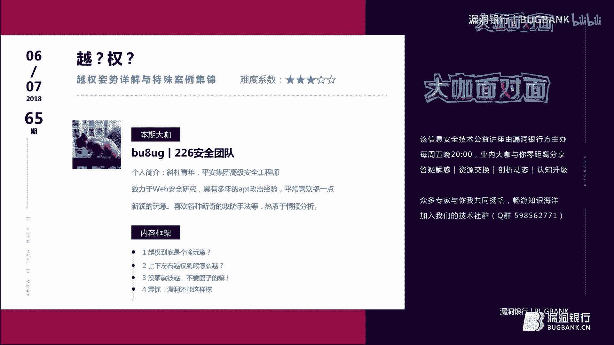
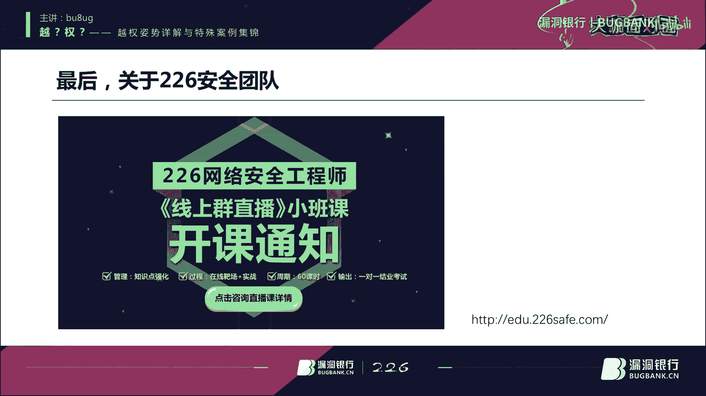
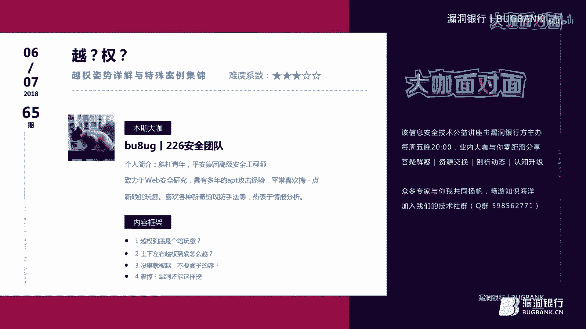
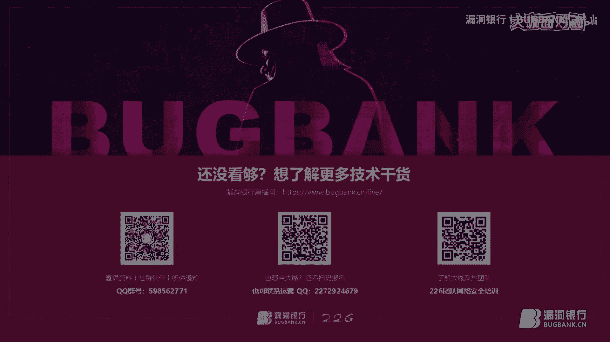

# 课程P1：越权漏洞详解与特殊案例集锦 🎯

在本节课中，我们将系统性地学习越权漏洞。我们将从基础概念入手，了解什么是越权漏洞，然后深入探讨其分类、成因、测试方法以及防护措施。课程中会穿插大量真实或模拟的案例，帮助你理解如何发现和利用这类漏洞，并最终掌握如何有效地进行防护。

## 1. 越权漏洞是什么？🔍

越权漏洞是Web应用程序中一种常见的安全漏洞。它的威胁在于，攻击者利用一个账户即可控制全站用户数据。当然，这些数据仅存在于存在漏洞的功能所对应的数据范围内。

越权漏洞的成因主要是因为开发人员在对数据进行增、删、改、查操作时，过分信任客户端提交的数据，而遗漏了关键的权限判定环节。因此，测试越权漏洞的过程，本质上是与开发人员“斗智斗勇”、测试其信任边界的过程。

上一节我们介绍了越权漏洞的基本定义和成因，本节中我们来看看为什么这类漏洞如今备受关注。

越权漏洞其实很早便已存在。但在过去，许多核心业务（如网银）并未完全互联网化，因此即使存在越权，也难以造成实质性的经济损失，导致该漏洞长期被忽视。如今，随着“互联网+”的发展，资产日益数字化，越权漏洞所能触及的“价值”大大增加，因此受到了广泛关注。

为了更形象地理解，我们可以打一个比方：将一个系统比作一栋房屋。
*   **房屋主人**：相当于系统管理员，可以访问和使用所有房间和物品。
*   **访客**：相当于普通用户，只能在客厅等公共区域活动。进入卧室等私密房间需要主人授权。
*   **不速之客**：相当于攻击者。如果房屋（系统）的安全措施不足（如门锁不牢、房间未上锁），不速之客便能闯入并翻箱倒柜，访问其本无权访问的区域。这种“不速之客”的访问行为，在系统中就被称为“越权”。

## 2. 上下左右越权到底怎么越？⬆️⬇️⬅️➡️

大家通常将越权分为两类：水平越权、垂直越权，有时还会加上交叉越权。我之所以称之为“上下左右”，是因为除了常见的平行（水平）和垂直越权，在某些特定场景下，向上或向下越权也存在其特殊性。

首先，我们来探讨最常见的**水平越权**。

水平越权漏洞通常出现在一个用户对象关联多个其他对象（如订单、地址）的场景中。当开发者实现对这些关联对象的操作（通过ID进行增删改查）时，容易习惯性地根据已认证用户的身份生成操作入口（如表单、链接），并默认只有合法用户才能获得这些入口。然而，在处理用户请求时，系统往往只验证了操作入口的合法性，却未再次校验当前用户是否有权操作该ID对应的数据对象。

简单来说，水平越权就是攻击者尝试访问与他拥有相同或相近权限的其他用户的资源。例如，两个普通用户之间互相访问对方的订单信息。

以下是水平越权经常出现的位置：
*   下单成功后的订单查看页面。
*   收货地址的删除和添加功能。
*   下单过程中的地址修改功能。
*   其他未列出的用户数据操作点。

为了加深理解，我们来看两个案例。

**案例一：股市行情窥探**
A和B是股友。B在A操作时，瞥见了A的股票订单号。随后，B登录自己的账户，在查看订单详情的页面URL中，将订单号参数替换为A的订单号。替换后，B成功看到了A的订单信息。这个案例中，系统未对用户访问的数据ID进行所属权校验，导致了典型的水平越权。

**案例二：文章恶意删除**
在一个写作网站上，作者A登录后可以删除自己的文章。删除请求的URL中包含文章ID参数。A将自己的文章ID（例如1）改为其他文章ID（例如2）并发送请求，系统成功执行了删除操作。这意味着A可以越权删除其他用户的文章，这也是水平越权的一种表现。

水平越权的产生条件主要有以下几点：
1.  **直接对象引用**：通过直接修改请求参数（如ID）来访问未授权数据。上述两个案例均属于此类。
2.  **多阶段功能**：一个完整操作被拆分为多个步骤，若步骤间缺乏连贯的权限校验，可能导致越权。这是一个比较巧妙的技巧，后续会详细讲解。
3.  **静态文件访问控制**：对静态资源（如会员视频缓存文件）的访问权限控制不当。例如，某视频网站会员登录后缓存的VIP视频，在退出登录后仍可离线观看。

接下来，我们看看**垂直越权**。

垂直越权与水平越权不同，它发生在不同权限级别的角色之间。垂直越权可分为“向上越权”和“向下越权”。
*   **向上越权**：低权限用户执行了高权限用户的操作。例如，匿名用户或普通用户能够发布或删除本应属于管理员权限的文章。
*   **向下越权**：高权限用户访问了本应无法访问的低权限用户专属数据。例如，业务经理越权查看了下属业务员的客户敏感信息。

**案例三：买家越权修改卖家店铺**
A是商城卖家，B是买家。卖家A拥有设置店铺的权限，而买家B没有。A将店铺设置页面的链接发给了B。B在浏览器中新建页面访问该链接，竟然成功打开并编辑了A的店铺信息，且修改生效。按照设计，只有卖家才能设置店铺，此处因系统未对角色做最小权限访问控制，导致买家B向上越权成功。

**案例四：卖家越权修改买家信息**
同样是卖家A和买家B。B将自己的个人信息编辑页面链接发给了A。A访问后，不仅能查看，还能修改B的个人信息并提交成功。这同样是系统权限控制缺失导致的混乱，属于垂直越权。

垂直越权的产生条件包括：
1.  **通过隐藏URL实现访问控制**：依赖URL保密性而非服务端校验，一旦URL泄露则权限失效。
2.  **多阶段功能权限校验缺失**：与水平越权类似，在分步操作中权限校验不连贯。
3.  **平台配置错误**：系统平台（如中间件、框架）的权限配置未遵循最小权限原则，导致用户权限意外扩大。

## 3. 越权漏洞的防护 🛡️

对于开发者和运维人员而言，网站被随意越权是难以接受的。因此，了解如何防护至关重要。

测试越权漏洞通常需要至少两个账号（例如A和B），用于测试水平越权。在进行安全测试时，建议准备三个账号：两个平行权限账号（测水平越权），一个高权限和一个低权限账号（测垂直越权）。

越权操作主要围绕数据的“增删改查”进行。请求方式主要为GET和POST。
*   **GET型越权**：直接修改URL中的参数（如ID），尝试访问他人数据。
*   **POST型越权**：在请求体（Data）中修改参数。更复杂的一种是，在保留A账号会话（Cookies）的情况下，将请求中操作对象的ID替换为B的ID，观察操作是否以B的身份生效。

防护越权漏洞的核心在于服务端对每次请求进行严格的权限校验，绝不信任客户端提交的任何与身份、权限相关的参数。

以下是关键的防护措施：
1.  **对用户标识进行强校验**：执行查看、修改用户信息等操作时，不能仅依据客户端传来的用户ID。应从当前可信的会话信息（如Session）中获取用户真实身份，再与请求参数进行比对。
2.  **使用不可预测的令牌**：在Session或数据库标识中，加入不可预测、难以篡改的令牌信息（如随机数、哈希值），而不仅仅是简单的用户ID。
3.  **页面加载时进行权限预校验**：在每个页面或功能模块加载前，进行统一的权限认证。例如，支付宝在进行敏感操作前都会有多重验证。
4.  **关键操作进行二次验证**：对于敏感操作（如支付、修改密码），要求用户进行二次验证，如输入密码、短信验证码等。这能有效防御大部分越权攻击。

## 4. 实战案例与特殊技巧 💡

掌握了基础原理和防护方法后，我们通过实战案例和特殊技巧来深化理解。

**基础案例：修改ID越权查看头像**
某系统通过POST请求获取用户头像，请求参数中直接包含了用户ID。修改这个ID，即可越权查看其他用户的头像。这是一个最简单、最典型的越权漏洞，虽然危害较小，但揭示了最根本的问题。

**技巧一：Cookie中的越权**
权限校验依赖Cookie中的用户标识（如`user_id`）。攻击者直接修改Cookie中的`user_id`值，即可冒充其他用户。因此，开发中应避免使用`user_id`这类显而易见的参数名，并对其进行加密或哈希处理。

**技巧二：强制添加参数**
某些系统在验证时，如果发现请求中额外添加了某些参数（如`user_id`），可能会优先采用该参数而忽略会话中的真实身份。攻击者通过强制添加此类参数，即可实现越权。

**技巧三：修改返回包（多阶段校验漏洞）**
在某些分步操作中（如重置密码、注册账户），系统可能在第一步校验账户状态，第二步执行操作时却默认第一步的校验结果依然有效。攻击者拦截第一步的响应包，将表示“账户不存在”的标识改为“账户存在”，从而可能绕过校验，进行重复注册等恶意操作，导致账户覆盖或拒绝服务。

**高阶思路：针对特定角色的渗透测试**
许多高价值的越权漏洞存在于普通用户无法触及的功能中。这就需要测试者拥有“特定角色”的权限。
*   **真实场景**：为了测试滴滴司机端漏洞，有人注册成为司机；为测试外卖系统，有人去当骑手。通过拥有这些角色，才能访问并测试对应的后台功能，发现越权点（如查看其他司机信息、篡改订单金额等）。
*   **案例**：某内部管理系统暴露在外网，通过弱口令进入后，发现该账号权限极高，可访问内部打印程序、加密狗驱动、客户管理系统等敏感模块。这属于垂直越权进入内网后，面临的权限控制松散问题。

**前端惊喜：预加载与接口泄露**
前端优化可能引入越权风险。
*   **接口泄露**：某些本应由后端调用的收费接口（如交管局查询接口），被错误地放在前端调用且未加密，导致攻击者可以免费无限次调用，越权查询他人信息。
*   **数据预加载**：为了优化体验，前端可能一次性加载所有用户（包括管理员）的数据模板或组件。虽然页面不显示，但通过浏览器开发者工具可以查看到这些本应隐藏的数据和接口地址，为越权提供了入口。

---

**课程总结**

本节课中，我们一起学习了越权漏洞的完整知识体系。
1.  **概念与成因**：理解了越权漏洞是源于服务端对客户端请求的过度信任，缺乏有效的权限校验。
2.  **分类与案例**：详细分析了水平越权（同权限用户间）和垂直越权（不同权限用户间）的原理、常见发生位置及生动案例。
3.  **测试与防护**：学习了使用多账号测试越权的基本方法，以及从服务端校验、使用安全令牌、二次验证等角度进行防护的核心策略。
4.  **实战与技巧**：探讨了Cookie越权、修改返回包、针对特定角色测试等实战技巧，并指出了前端优化可能带来的新型越权风险。

希望本教程能帮助你建立起对越权漏洞的清晰认识，并在安全测试或开发实践中加以应用和防范。