# P1：68期丨那些年的文件上传姿势总结-C1h2e1 - 漏洞银行BUGBANK - BV1ft411Z7Aa

为知识而存，因技术而生，小伙伴们晚上好，欢迎参加68期漏洞银行安全技术直播。打开面对面，我是主持人秋秋。今晚我请来了一位00后的白帽子，见多了精英大佬，你是否也对技术小鲜肉充感兴趣呢？😊。

或许你会以为00后的孩子还在玩泥吧。但其实呢他们也在向技术大牛努力靠近。是的，今晚我们就请了张伟白帽子，他是我们梦的银行的老朋友，叫衬衫。我分享那些年的文件上传知识总结这个主题难度虽然不是太高。

但会把文件上传相关的知识讲得面面俱到。查缺补漏，今晚一定会有你需要的知识啊。在大咖演讲结束后，还互动问答环节。问答结束后，大咖还会选出一名幸运观众，赠于书籍python取嚼机。

运用pyython成为顶级黑客。好啦，那下面就请衬衫开始今天的分享吧。OK大家好啊，我是陈珊。今天给大家讲的议题是那些年的文件上传资识总结。咱们不说废话了，直接开始咱们内容。

这是咱们的一个今天讲的四个点。咱们第一点就是说会去把入门文件上传基础去给大家做一个讲解。然后就是是谁阻止了我的上传。第三点就是绕过防火墙的一个姿势总结。第四点就是我们会去分析一些以往的一些经典的案例。

OK下面我们进入第一板块了。第一，文件上的基础文件上来的漏洞是指用户上传了一个可执行的脚本文件，并通过此脚本文件获得了执行服务器服务器端命令的一个能力。这种攻击方式最为直接和有效。文件上传本身没有问题。

有问题的是，文件上传之后，服务器咱们去处理解释文件。如果服务器的处理逻辑不够安全，那么就则会导致严重的后果。上传文件是web脚本语言服务器的web容器解释并执行了用户上传脚本，导致代码执行。

这就是一个文件上传漏洞的一个基础的一个扫描。然后咱们进行下一步。就是首先咱们就要去讲，由于容器导致的一个文件漏洞。我们要讲一下，第一点就是阿帕奇的1。X和2点X版本的一个解析漏洞。

因为它解析文件名是从后往前，就是从右往左解析，他读文件名的话是读自己能认识的文件名，这个是什么意思？我给大家用这个。比如说有1个123。2PHP文件。

这个时候呢它不会这个时候咱们可以在后面写一些其他它识别不了的文件名。比如说写1个AAA这个时候它是从这个位置。从这个位置，然后向这个位置依次执行，这样的话，他他不认识这个AAA这个格式。

他就会把这个过掉，就是去当做因为他能读取这个PHP的一个文件名文件名。他既然能读取PHP文件名，他就会把这个。123点PHP点AAA这样的话当做1个PHP文件去执行。然后下面就是第二个就是IS6。

0的1个目录解析文件，目录解析漏洞。这个漏洞就是说。有一个。简单的一个目录。这个目录为1点ASP。这个目录下面有一些内容。

它的内容可能就是1点GPG这个1点GPG可能就是咱们那个呃一句话木马或者是web shell。这里的1点ASP目录里面的所有内容，比如说它为1点AA也会被当做呃ASP文件去执行。这就是目录解析漏洞。

然后第二个就是。可以也可以是一点ASA。还可以是1点C12。这两个都可以是做一个目录名，这个时候就需要做一个跨目录的一个上跨目录，或者是一些其他的一些姿势了。嗯，可能咱们在上传的时候会有一个参数。

就是PAATH这个变量。很多时候就会有一个这样的一个变量，它后面就是一个目目录，这样的时候咱们可以去尝试用这个目录去。做一些绕过。我。咱们下面就第三第三个板块。第三个板块是IIS6。

01个文件解析上传web show。这个时候web shell的名为web shell点ASP后面的是。允许上传的格式名，这个允许上传的格式名。一可能就是比如说头像处就是JPGPNG这样的格式。

他的就是如果是GBG可以是上传的文件的话，就是wi shell点。AP。然后呢，我们用这个。呃，分号去隔开它，然后后面这个东西点点GPG或者说点PNG这样的话他读文件名，读到这个这个分号之后。

它就不会往后面读了。所以它就解析为外 shell点ASP了。然后他这个点GPG只是为了绕过他那个绕过它的一个拦截。然后第四个是NG5点。0。5X0。6X00。7的0。765之前，0。8的0。

837之前的一个漏洞是将外设修改为可以上传的格式。如。web shell点儿JF点PHP。然后就是web shellGF空格PHP这个就是类似于一个阶段和00阶段的思路是一样的。那就是只能说类似什么。

然后咱们后面把文件零零阶段也讲掉啊，什么叫零零阶段呢？就是说在HES编码里面呃，我们的空格是。20对不对？然后咱们可以把20修改为0。就是修改为2个0。

这样的话它就变成了呃在UIP suit里面就变成了一个这个。呃，一个小方框的一个东西，那个东西就能做一个截段。他读文件名的时候，读到这个位置，他就不往那边读了。就是他们应该比如说web shell。

点儿嗯PHP然后这边咱们加一空格，这个是NG这个解析是加空格，然后呢点。呃，JPG这样的话也可以做一个绕过。00阶段的话，只是把这个空格。把这个空格变为了摆，就是变为了。HES里面的00。

这样的话也是做了一个阶段。他读到他从从左边开始读，然后向右边读，然后web show他读到点PHP读到这个00之后，后面内容他就不管了。这个大家能理解吧，然后。就下一步。

这是咱们的一个温容器导致的一个解析漏洞。首先咱们在上传之中，我们要去做一些准备工作，准备工作就是。嗯，一共是几个点。第一个点就是说咱们要明白他的语言。这个时候是咱们上传web show的时候。

你不能说GSP的站，你上传1个PHP的一句话，对不对？所以说要要知道它的语言。然后呢，外部容器和系统系统的话可能会有一些其他的绕方式。比如说windows里面就有一个data，就是。好的。😔，T。

这就是它的命名规则导致绕过。如果是windows就这个漏洞，如果是linux，就有可能是THP这样的一个。大小写的一个绕过，所以说系统也是比较重要的。还有就是咱们第二个需要的是一个上传点。

这个上传点的位置非常多，可能是头向上传处。但是经过各位表哥，还有啊我看案例的一些总结，我觉得这个上传点，他越偏越好。因为你要是主要业务的话。肯定也会有一个他可能就是比较重视这个安全程度。

所以他就是把这个主要业务做的比较好。为什么很多人都是打边缘业务的这就是这样一个原因。然后第三个，上传文件都可以上传什么格式的文件。这个时候我建议大家可以用发子去测试一下，他能他允许上传什么文件的格式嗯。

这样的话咱们可以去寻找白名单以外的思路。就是他如果是黑名单的话，就就是有思路可以去到过。如果白名单的话，咱们可以用截段这样等等的一些思路，也可以去到过他这样的一个东西。好。

然后第4个上传之后会不会被重命名。如果就是说嗯时间呢，用户ID都有可能会把它重命名。这个大家能理解吗？就是说这几个准备工作，然后这里面我还要给大家讲一下这个位置，应该再准备一个web shell嗯。

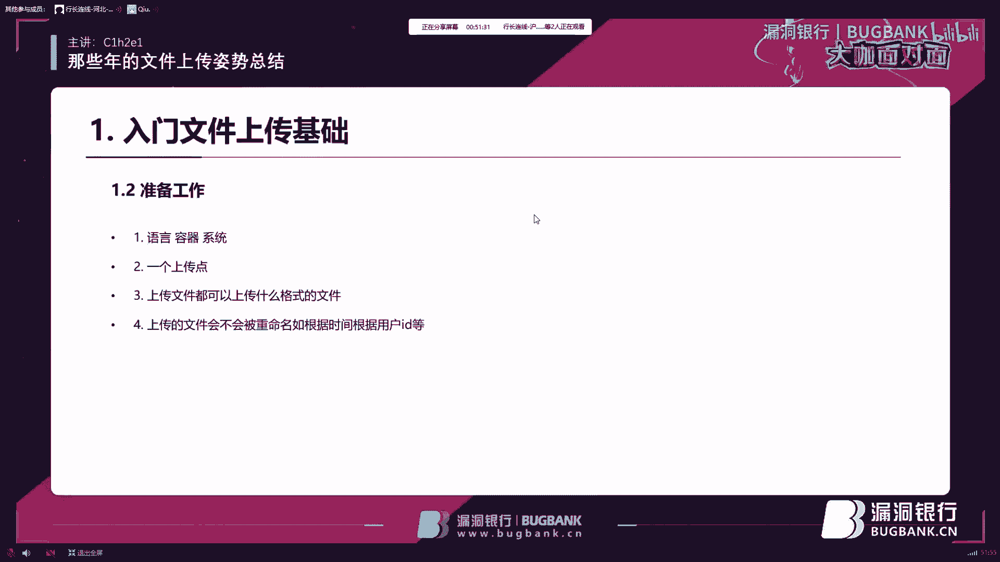

我看我我也不知。这个是geit他的一个项目，这个是因为因为我这个浏览器，就是我这个windows一直在杀这个东西，所以就是不能给它解压出来。所以咱们就在这个里面看吧，这个是一个。we设的一个项目，嗯。

基本上其他这些我不太常用，我比较喜欢用这个菜刀设里面这个。然后。でし。啊，有一个这个强悍点PHP他这里面的一句话木满，我觉得都比较好。你看他每一个使用的方法也都写出来了，也挺多的。

这样的话嗯咱们都可以去做一个测试。他有可能检测文件内容的时候，咱们就得去做一个绕过了。因为咱们上一期陌陌表哥也去讲一个这个文件上传，咱们可以去回顾一下陌陌表格的课，对不对嗯。好，那么继续往下讲。

然后咱们准备工作做完之后，咱们就要开始去了解为什么咱们不能直接上传。咱们在上涨过程中，为什么许绕过是什么导致咱们绕过？就是这个WAF是防火墙嗯。

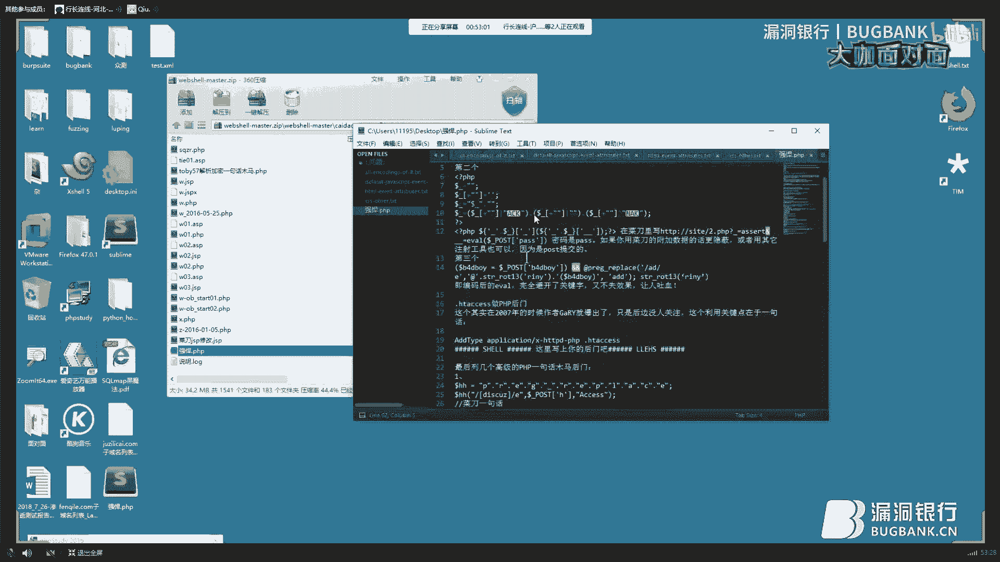

就是外边用的一个防火墙，它导致的一个绕果。首先我们要理解它是一个什么样的过程。首先它第一步是读取整个文件名对比黑名单。它第一个可能是读取整个文件名对取。就是看文件文件名的后缀是不是恶意文件。

这个时候比如说咱们的PHP文件，或者说GSPASP这样的话，他如果读到了这个东西，他就可能去给你拦截下来，或者说是不允许上传，啊，这是第一种。第二种就是说看目录权限，这个是主机才有的。

还有一些这个也是一种绕过那个上传的一种思路，对不对？它有可能就是只在那个一个目录里面去看。如果这个文件上传理解恶意文件的时候不允许。但是你可以去通过这个PATH那个函数就个参数去。做一个修改。

尝试去跨目录上传，这样的话也可以去导致一个文商漏洞。第三点就是说读文件名。啊，应应该是读文件内容，读文件内容看15个web shell。它比如说咱们这样的一个web shell是有一些特征的，对不对嗯？

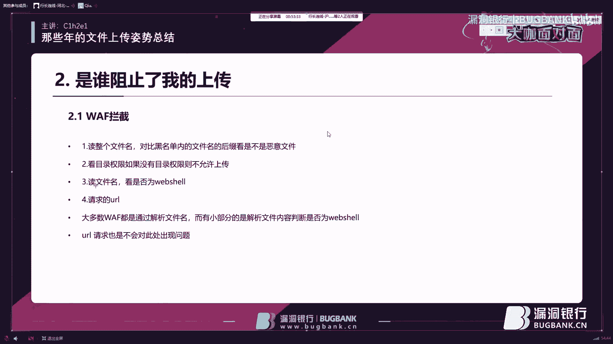

看如果要是这样的一个we show，是不是它非它非常有特征，是不对？有PAP然后有个这个东西。他可能就是读到这个东西之后，他就默认你是web show，然后就不让你去上传。他有可能是这样的一个东西。

然后呢，第四个就是请求的URL，它可能就是只限制你几个URL里面的内容，不允许你去上传一些文件文件。所以说咱们可以在这个位置也可以做一个绕过，然后呢，就是大部分wa都是解析文件名。

只有小部分去解析文件内容的。我这个大家要知道，嗯，因为解析文件内容的话，会比较耗时间，也比较那个占那个耗资源啊。然后呢，URL请求是不会对此对此出问题的。基本上咱们在上传那些绕过过程中。

基本上也没有几个去在URL中做什么手脚的啊，然后我们第二个就是说wa的一个运行规则。首先我们要知道第一个运行规则，就是读那个头，是不是他读取了头文件之后，然后再去读取文件名。

读取头的意思就是说看你是否是不是一个正常的请求，或者说。

里面是不是有手机代码之类的。然后呢，我们第二个就是读文件名，读文件名的时候是。读文件名之后，读取文件，读取文件内容是有个we，然后再读递交上来的名字。这个可能就是fi IDD这样的一个参数去做一个。啊。

读取。所以说这就是这就是一个简单的一个wa运行规则。我们要是在这个几个部分里面做一个呃绕过方式，才能去导致一个绕过。好，我们这边讲一个就是wave识别。这个wa识别的工具是。嗯。

这个wa识别的工具是WF00F这个在get upub上有，大家可以去看一下这个脚本写的很好。它这个是只需要WF00F，然后呢，后面加入咱们的URL这个参数就可以了，直接能去做一个识别。

它现在能支持的这个。wauff也特别多，咱们可以去用一下这个脚本。然后就是说手工这个思路，我觉得比较好的一个思路，就是也是很多表哥也都在说这个事，就是说你咱们先去报错他，报诉他之后。

他可能会有一些因为大家用用wauff都发现他会不会有一个那个就是说嗯误报反馈，对不对？有那个东西。然后咱们通过误报反馈那个网址，然后做呼意IIP之类查询，这样的话就能查询到是哪个厂商的。

查询到哪个厂商之后，你就知道他的是哪个品牌的wauff。OK这个位置大家能理解吗？嗯。然后呢，我们进入。下一个板块就是说绕存在绕过wa的位置，也就是这几个包体这个位置咱们先抓一个包看看啊。

我这个可这 study。

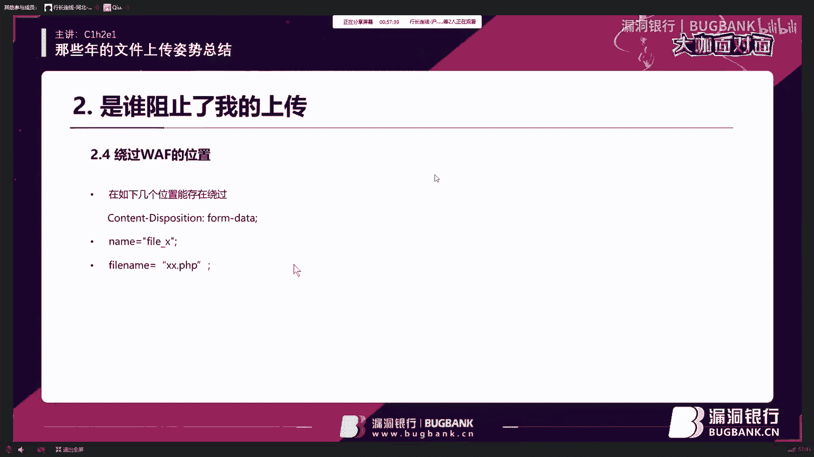

这个是upload lap那个靶机环境，嗯，是这样的一个东西，咱们去正正常的去抓1个ATTTP请求包试一下。

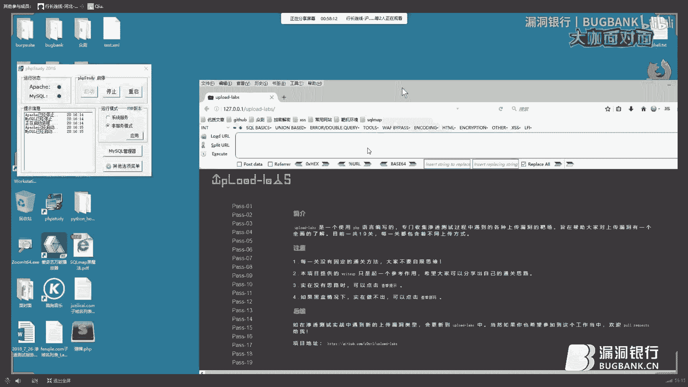

首先咱们这个时候顺便把介绍一下啊，它是一个和scle lab是差不多的，也是一个这样的一个把机环境。大家如果要是想要去练习的时候，我比较推荐这个可以在这个里面去练习。然后他这边有黑盒白盒的一个切交换。

可以去直接查看源代码。是不是？

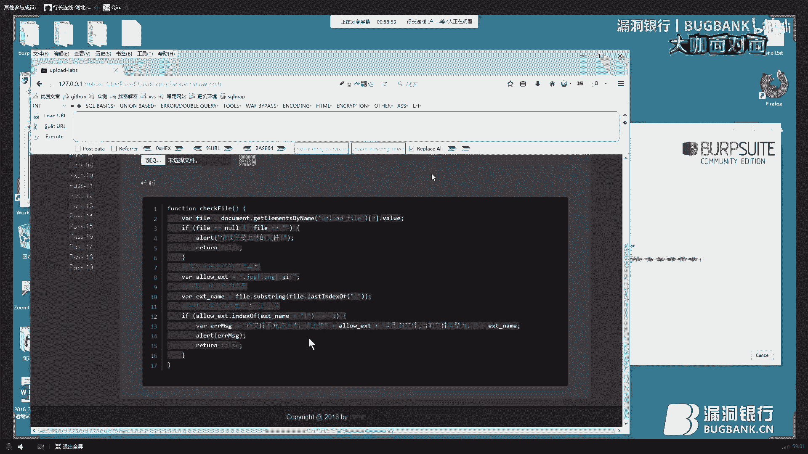

这个人。这个。

这个时候咱们先测一下正常的正常解决方能不能抓能不能抓到。嗯。找不到等下，我看看是不是这个代理配置有问题。好了。那个时候我们来接下1个127的日。对吧这个位置能抓到请球包了哈，然后呢。

我们在这个upro live里面尝试先要去。找一个正常的使用包，这里我们在。做咩。因为第一关是JS，我觉得可以直接。把这个GS关掉，这样的时候咱们咱们再上传一个。

咱们上上1个PAAPY射吧。嗯。这个时候就是一个正场请求包，对不对？

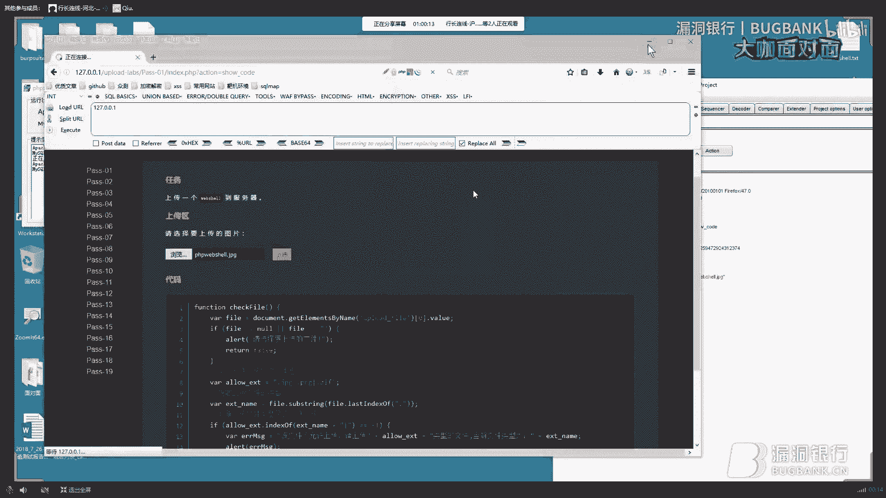

哎，神奇。这个型优包的话。也分为几个部分是吧？从这个位置到这从这个位置到这个位置是h点头。拍的头头。然后呢，我们下面的内容为下面内容的就是咱们的包体，是不是？

所以说咱们基本上在headder里面是不存在绕过的。我们在什么里面存绕过，就是在这个位置，就这一个小框框里面。所以它这个里面才能导致一个绕过。最常见的一个绕过就是在file name这里面。

然后就是在这个位置countent tape。他也能去做绕过，然后就是这这两行里面是有绕过的可能的。然后剩下这里面基本上嗯除非是一个内容的一个绕过，其他的就是咱们可以暂时先不看这个位置。

主要看的是这个这个位置。然后就是这个。name upload file，还有就是file name这个位置这里。只有这几个位置，咱们可能是存在绕过。所以说咱们一般构造的时候。

也就只在这几个位置够构到那个呃去绕过就可以了。然后呢，我们进行下一步就是说绕过啊wauff的一个姿势，这个姿势很多很多。这里只能我觉得可能几千种几万种都有可能。因为基本因为它太大了那种东西，是不是？

所以说咱们能讲的也就只有这个13种思路，比较常用的和精华的。嗯，我们首先我第一种就是去发作文件名的后缀。这样的话。呃，去寻找黑名单以卖的一个文件。

这个时候我那个后面会有车后那个会有车王那精选那个表格的一个东西，咱们列也提前介绍一下，这个是这个就是fauzzDB嗯，非常好的一个东西。它结合了很多的。

呃，你看人家叉SSX pass这里面都有四个注入。嗯，咱们可以去get一下这个fauzz在google里面就有，然后还有在那个在get hub上也有吧，这个这个在get hub上应该也有嗯。然后呢。O。

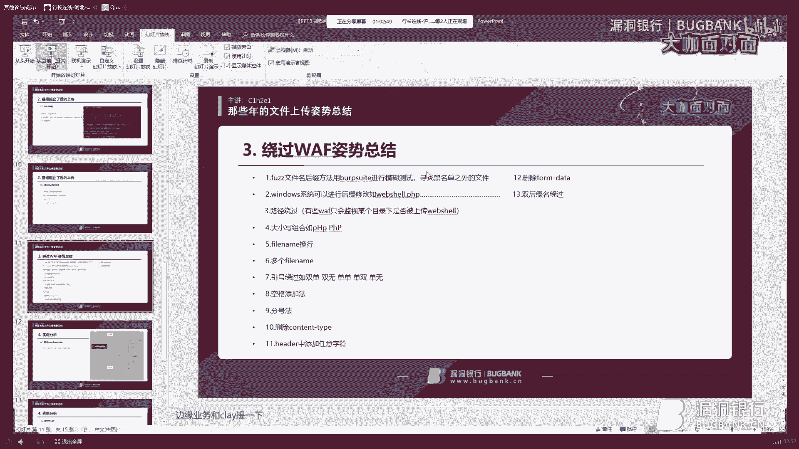

这是这是这个发子。这样的话咱们可以去通过这个文件名文件名的后缀去发子，它也可以去捞go。然后呢。他有可能就是把一些后缀就是给扔，就是漏掉了。这样的话也可以去就是让我一个思路。然后呢。

这个时候我们有一种windows windowsdows系统，是不是windows系统可以是修改后缀，比如说web shell点PHP点点点点点。因为咱们平时的时候，如果要是。

新建一个文件文新建一个这个文本文档。如果咱们叫123点PHP后面咱们加一个点的话。

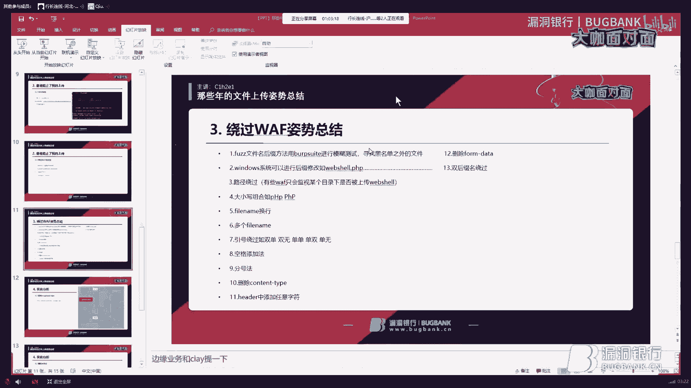

是不是修改为123点PHP了，这样的话也是存在着过的。他如果是判断你后面如果是不是只是PHP的话，咱们加个点也有可能。然后我们再加一堆点呢，是不是还是一样的？对不对？所以说这这就是有可能去存在一个绕过。

然后呢。

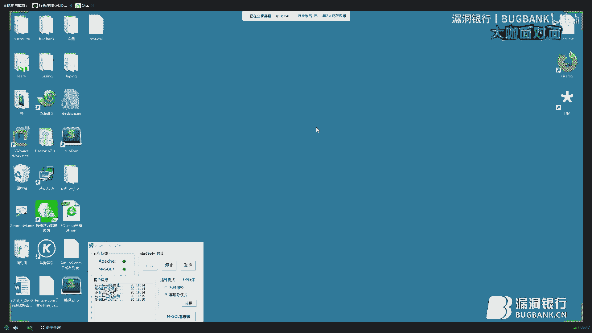

第二个让我思路就是。这个路径绕过，就是说有些话uff是指监视某个目录是否被上成web show。这个就是PAATPAATH那个变量，然后咱们去做一个更改。

第四个就是我刚刚说的linux里面的大小写组合切换PHP，然后PHP对不对？这样两个大小写切换的话，也有可能去到了一个绕过。第五个就是fill name换行，这个fill name换行的话就是在。

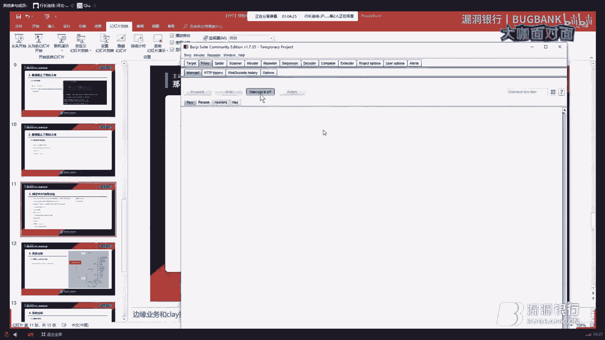

在这个fi name里面，就这个位置做一个换行。就这样换行之后也有导也有可能导致导致一个绕过，然后呢继续。file name换行是不是？然后就是多个file name，其实不用再进这个PPT了。

多个file name是什么思路？你看下这个啊就是file name点GBG，对不对？然后我们后面可能是file name点。PHP这样的话，他就有可能存在一个绕过。他第一开始读了这个。

然后他他又读了个这个就可能做一个替换了，对不对？然后呢，这就是这个是这样的一个可能。这是多个fi name的思路，然后就是引号绕过，这个我觉得比较惊慌，这个是什么意思？这边是有引号的，对不对？

我们可以做一个引号的一个修改嗯。因为这个位置是有一个双引号，这个位置也有一个双引号。我们把这两个双引号改成单引号，可以把这两个双引号改成一双一单。一单一双。都没有，是不是它有特别多种组合。

是不是咱们要把这个组合去做一个。组合做一个切换，这样的话它有有可能去绕过。然后呢就是空格添加。这空格添加的话，可能在每个地方都有可能。就比如说fill name这个位置，你要加空格，它也是有可能绕过的。

比如说这个name这个位置加空格，它有可能也有可能绕过。然后呢。第九个就是分号。这个分号加哪个位置，我给大家加一下。分号加在这个upload file，这个分号的后这个引号的后面。然后呢。

file name的前面它有可能导致一个绕过。这个在这个我也挖到过这样的一个洞，然后呢。就是一分号法是一个，然后删除这个countent paper，也就是这个位置做一个删除。删除之后就没有了，对不对？

他有可能就是单独只检测这个我搜集的时候，就是找了很多网上的PHP的这个生传代码。我发现他们基本上都是检测这个东西con tape。如果你要是这个东西成功了，成立了，你这里面内容它不检测。然后呢。

我们下一个就是。下一个是hi在里面添加这一字符，这就是这个是在boundundunderry里面。这个位置。这个不也有个countt tape，大家看到没有？

我们在这个里面也是可以在这个counttent tape里面。方队里面可以去加。这个前面比如说咱们可以加一个by passs是吧？我在某易云看到这样的一个思路。嗯，我看一下是是在。这个位置可以加一个。

Bypass。是不是他就有可能导致一个绕过。然后呢，下一种思路就是。第12种思路是删除from data这个位置有一个from data，是不是我们把它做一个删除，也可能导致一个绕过啊。

还有一个就是后面就没怎么写了，对不对？然后就是双后证明，这个双后双后证明，我想说一下这个比如说因为咱们在那个叉SS里面有一种是是不是SCIIPT这个时候我们在后面包一个。后咱们可以再包一个。

是不是SCRIPT。我讲啊IP包1个IPT，然后这里面包一个。SCR是不是他他有可能就是把你这个东西去给你去掉，他既然给你去掉的时候，他还留了一个也是能当做一个执行。这是叉SS的思路，对不对？然后呢。

我们如果文件上试中是不是也有可以这样的一个思路。他如果就是把你那个PHP强行检测的话，你可以这样嗯就是点PHP正常咱PHP文件是这样的，是不是它可能加1个HP。然后加个P。或者说PH。

然后后面把这个H去掉。是不是双后者名也是一个绕过的方法。然后呢，就是一个超长文件名，这个我也没没有怎么去写这个超长文件名是什么意思？这个fill name是不是他有可能就检测你几个东西。

咱们可以去写特别特别多的这个文件名，这样的话它有可能导致着过。然后就是。嗯。这个位置的大小写大小写切换，我觉得从这个conent dis这个位置。

还有from data name file namecon tape这个位置基本上我觉得都能去做一个大小写切换，因为它没有什么限制，你知道吧？它这个位置也没有限制，这个位置没有限制。

你因为在在PP里面基本上大小写切换是没啥事。但是在GSP里面有有时候可能会报错。你像fill name换行在GSP里面就应该是不管用，它就会呃报就是报错或者是怎么样的。然后呢，这个位置是不是也能做切换。

这个思路特别特别多，就是我觉得文件上传的思路就是靠靠去试，你一个一个去试试就能去绕出来。好吧，然后呢。我们这里有一个这个靶场，这个靶场是applo laps嗯。是这样的一个靶场。

它这一共是十九关也是挺好的一个这样的一个东西。嗯，和sl是特别像我刚才给大家看到这是它的主界面。咱们只需要kit一下，然后把那个呃创建一个upload upload就可以了。然后呢。

这边是每一关的一个图图，然后他也可以去做一个。

查看你代码，然后还有提示。我把这个PSS关掉。查会员代码是不是然后有个提示，你得刷新一下，让他把JS关掉。然后这边要有提示，这里呢，我往后面他这个还有这还有一个思路总结。

是不是每个地方都有非常好的一个靶场。这里面还有一个w up这个项目，你们以看一下这个嗯。很多很多每每一关都写的特别特别详细。他这里面包含的思路也特别多。你看啊嗯这道图呢。

它这里面有这个ATATACSCCESS后裔大小写点绕过空格绕过data绕过配合解析漏洞，双后缀明上传特殊解析上传特殊可解析后缀GS检查。

然后文件头day imagine sizeESLim tape二次渲染详应竞争这里面挺好这里面这个非常好的一个框架。我们。

哎，我BRRP秀的是不是开着？

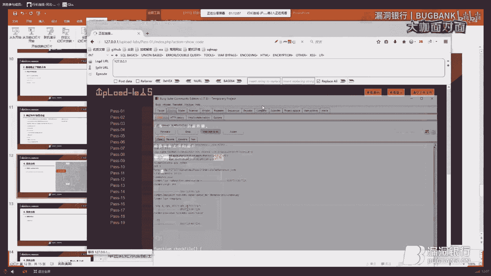

然后我们这里可以查看提制，是不是本pass。在客户端不会去，然后嗯你看每一关都有这样的一个提示，也是然后还有这个清功上传文件的功能。

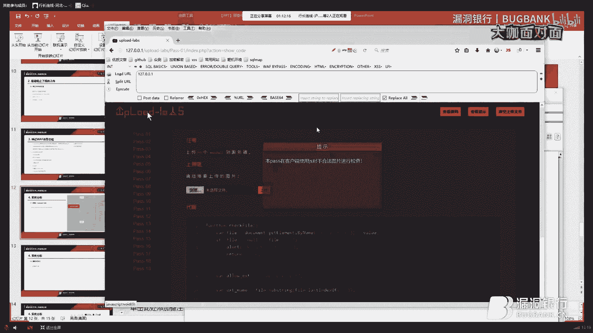

O。就是这样的一个靶场，我觉得我觉得非常好。如果要是把这个想要把文件上要玩的特别好的话，可以把这个打卡靶场圈打通。但是并不是靶场是全部，大家可以去啊银行去实战挖一些漏洞，这样的话也是给大家增加一个经验。

嗯。看一下这个。然后就是这个车王曲线表哥的那个发子。

这个是。是吧这个是出网表格的位那个博客，大家可以看下这个位置。嗯，我我这边。咱们先做这个发子，然后后讲那个实例分析。咱们往下直接看吧，这个就是他前面写的一个前沿，然后by pass原理非常好，非常好。

然后呢，这是get upub啊，这只有这个fasDB的地址。

你看他这边有特别多的一个特别多的东西，每他这他这个呢是wordless MIMSC这个东西。这个里面的一个。APLCSE点TST然后咱们也在里面找一下。法子BB。MC3项是吧，然后是。CSE里面。

这个是特殊啊，这个我我用这个打开。没有自动换号。这是他的一个。哦，这是第一个是吧，第一个里面就是这个东西，然后呢，后面会有很多很多。嗯。养一个发自地B的好处，这个就是它的一个实战的一个文献转。

这个时候他这个普通商城包和咱们商城包是一样的。他这里面他上传的是发的是哪个位置？他是直接去测试这个位置仪器前面。test前。把分号放在这个位置，太子前去做一个发子，这样的话可能去导致一个绕过嗯。

在你看这个位置它的1个PHP生成页面代码，非常好的一个思路，这是他的那个。的是吧很多，然后然后就是用那个UF的这个PIPIHfo这个位置。其实就用BIRPC的这个这个模块嗯，音是什么这个东西。

然后这个这里面咱们可以换一个这个这个东西，然后配料的里面把这个把这个配料的往里面一导粘贴一下之后。再把那个。他他在这个位置，对不对？咱们可以在这个位置设置个设置个一，或者说文件名的话可以这样。

然后添加一个这个到乐服务，然后咱们在配out的里面写一些什么？把那个直接把这个发子DB的那些特殊符号什么都导进来，导进来之后。再做一个再跑一个发子，陪out子一陪out二赔out子3。

然后之后就是能上成功的就会返回来。咱们再看哪个东西是能能成功绕过的。发质大发好，对不对？就是咱们在很多的时候，有些咱们咱们去挖不到洞，就是很多时候就能用发子去做出嗯。这样我也挖不到。还有一批嗯嗯。

然后咱们去呃分析几个比较经典的案例，这个就是data绕过。

这个是某云的一个案例嗯。上传PHP。这个就是。

这个就是利用了一个。windows的系统特性是不是点点绕过，然后呢冒号。A点GBG是不是？然后最后用这个冒猫这个doller data成功的一个rogo。

嗯，这个案例的话。看看能不能把图放大一点。和咱们那个是差不多的，这里面有一个fill name。这个位置是什么？这个位置是file name，我太模糊了，是是file name，然后这边是他的那个。

是file name是file name吧。upload file name。对，然后这个是upload file1，然后这个是他的那个文件名，这里面内容。就是这个位置的绕存在的绕过。

这样之后它既然已经成就是说它如果能成功上传，因为它是windows，对不对？它如果能成功上传之后，这个它既然已经存它已经是就是说把这个文件已经上传到目标的系统上去了。

它现它既然是windows点PHP冒号冒号这个dollar data就会被重置为点PHP。这个大家能理解吗？这个思路然后就会就会导致一个成功的上传。好，这个是。

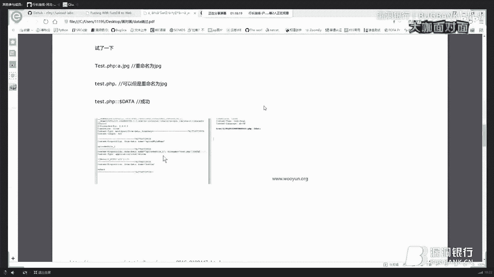

对他绕过，然后咱们找一个fi IDD和控。

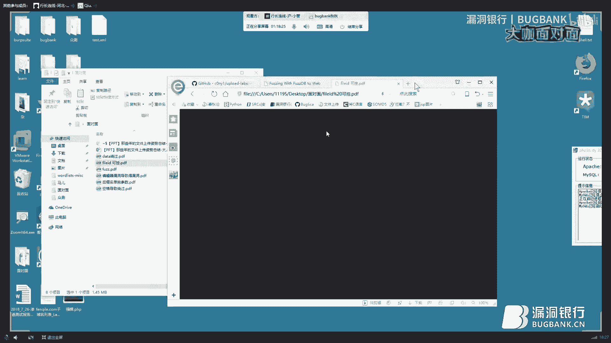

ID可控制是什么？这个是YYMSML里面，它这个是已经嗯它有一些敏敏感文件能能去做一个读取了，所以所以也就是才找找到这样的一个东西，这个是什么呢？这这个我看能不能能放大一点是吧？

是不是他平时咱们的请求包，这应应该是没有这个fi ID，对不对？他有这个fi ID，而且还有一个路径。其实这个位置就就就是刚才我说那个PAATH参数了，对吧？

fi ID你修你这个fi name它可能就只检查fi name。它既然只检查fi name的时候，你可以尝试这个fi ID是不是它最终那个名字。如果是fi ID是最终的名字的话。

那么fi name起什么名字都无所谓的。就只要去修改fi ID为你想要的那个一句话管的格那个。格式，然后就可以做一个成功的成，就然成功上传之后就可以成功执行了。嗯。这个是。这个是万宏威那个。

这几个都记得挺清楚，然后就是编辑性漏洞导致的这样的一个发子。

编辑器漏洞就像FCCK editorit，还有什么Ewe editoritor，还有各种各样的editor。

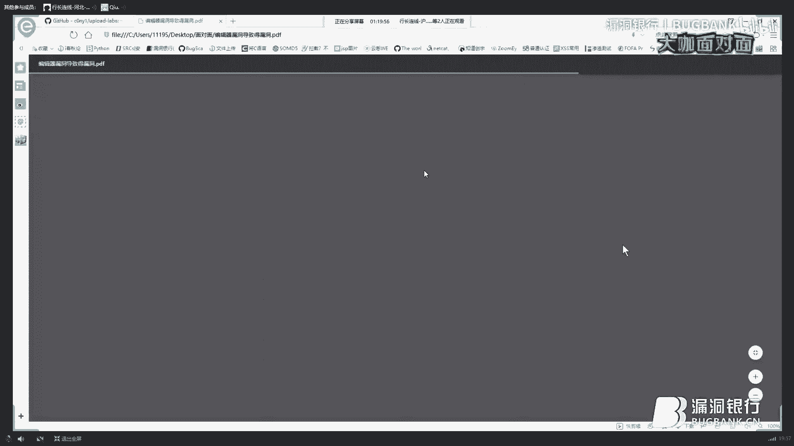

他们也会去导致一些漏洞的一个产生。这里就是。77017001。嗯，继续啊，这个是什么？这个是FCCK配置不当。这个时候我就想讲一下，就是这种东西是需要列那个扫明感文件才能扫出来的。

所以大家可以去用一下NIKTO反正我特别喜欢用INIKTO这个工具。就是。

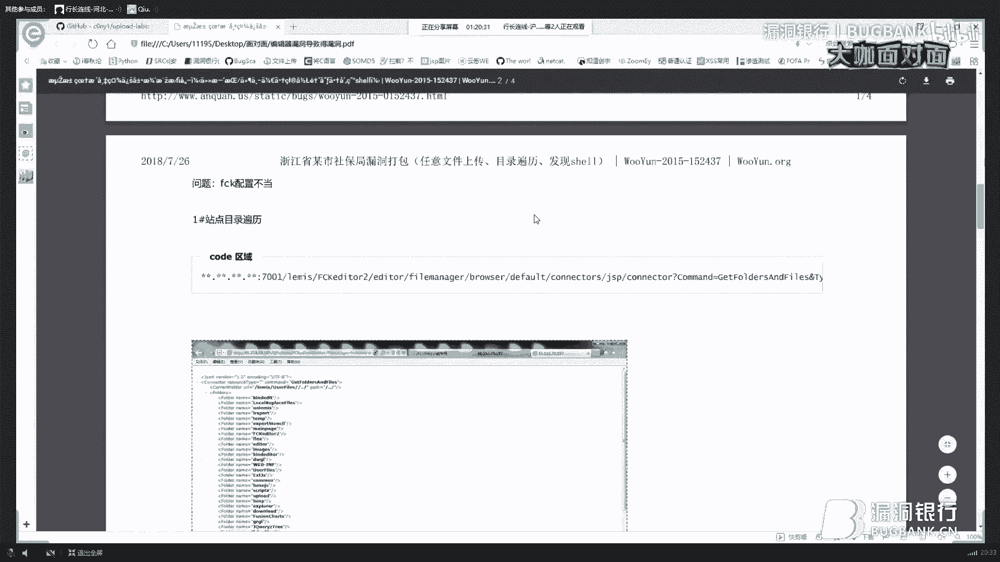

就这样，我这我这里面没有啊NIKTO杠H，然后后面加个IP就能去扫一些敏感文件是吧？反正我就用只用这一个，因为太菜了，就只会用这一个啊。

FCCK editorit它这个里面就是用它编辑器的漏洞，这属于是第三第三方的问题了。然后呢，用它的漏洞，然后就导致了一个。文件上传。这个是哪个版本？他没写版本FKID2，然后呢就用这个。

这是已经知道漏洞了，对吧？已经知道漏洞就是再利用一下就可以了。这应该是有ESP的吧。GSPI然后呢，7711哦，就这样的一个东西，上量大秀嗯。这也是个实间处，这是截段，这应该是截断之类的吧，到时候上传。

然后呢，就这样的一个东西啊。就是编辑器第三方的一个问题。所以说咱们扫一些敏感文件还是比较有用的。然后就是后缀名单独参数。登录之后什么泄漏这个位置再往下就往下找。哦，瑞文上传这个位置是什么意思啊？

这是他那个请求包，是不是？看三代。好，这个位置有1个1点ASP是不是SUFFIIX这个是后缀名，然后呢，readdom ID随机ID什么tape call back action这里面呃。

这这个是在这个位置，这个位置是fi name是吧？ from这应该是它的那个。你你就是你电脑上那个ID应该是from，因为它是from file name，它应该是你电脑上的ID，然后呢。

它这里面就有一个后缀名这个参数。这个这个比较少见。但是但是既然人家有这个参数，我觉得就就觉得就是还可以利用。他他既然能利用的时候，就是把这个ASP修改，就是应该是GBG文件的格式还是PNG的，然后呢。

它修改为这个ASP之后就会被当做ASP去保存。他既然装到AI去保存的话。也就能成功的去执行那个一句话木马。啊后就没有他没有神入是吧？有素质的白帽子。然后我们在后面找一个空格绕过。

这几个都是比较经典的案例。任意面读取，然后任意面上传。这个是upload点HTMMAHTM。这个位置。他说什么呃，可以上成功上传文件，但是文件名的获取。他就获取到文件名。是不是呃TMP点MHT。嗯。

MHT更改为UPD后面的数字减1。安位的。甜品TPAPAAP啊，这个应该是空，这个是什么？我看一下啊。2135点TMP。这不已经成功上场了吗？MHD。UPD后面的数字减1哦，这个就是说。

他这图全他这涂齐了吗？我这怎么啊，这这这这里下是这样的。这个是不是WU点PHP是吧？它应该是这个位置，你看到了吗？有一个。放大一点看是不是有一个空格呀，它这有空格之后就会导就会导致一个上传1个MHT。

这样的话前面的MMHT更改为UPD这样的话导致成功成功的重置为这个up2134点TMP点PHP。然后呢，成功的包含了PHP info。但是我觉得的话其实不用去用那些web show怎么样的。

其实直接可以去包含1个PAPPin，只要去证明一个危害就可以了。这这个咱们就不需要太深入这个东西。

因为你要太深入的话是吧，就是能去因对厂商不太友好。

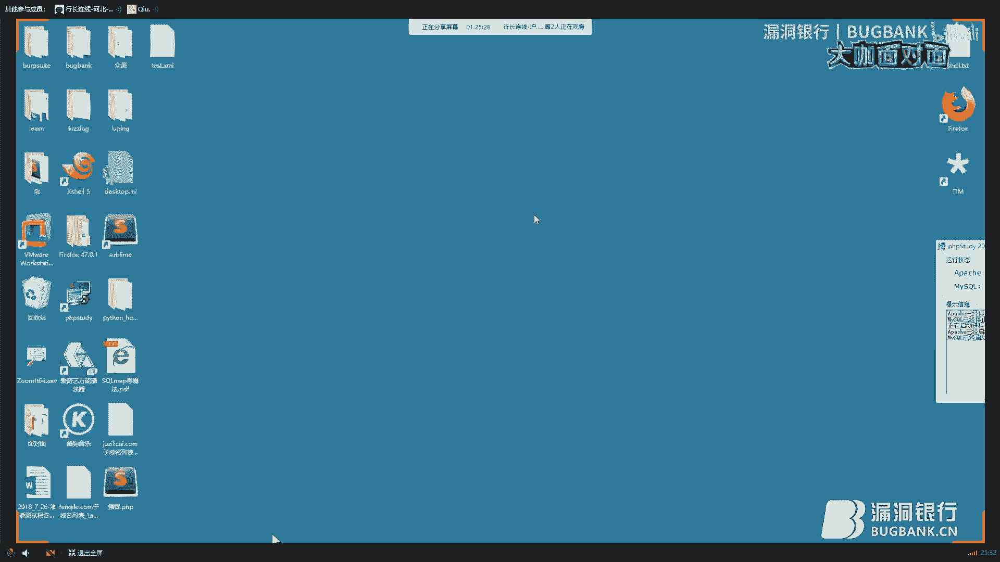

OK这就是咱们今天的一个议题啊，最后。可以。可乐就是我们漏总银行最皮的人。嗯，介绍一下课类表哥还在直播间吗？因为我都是打边缘也有的，而可play呢就是主站get是。

这就是文件上的那些思路。我觉得呢就是说咱们在这个测试过程中还是实践出真知。这个把机环境它只能说是一个呃思路的一个整理吧。

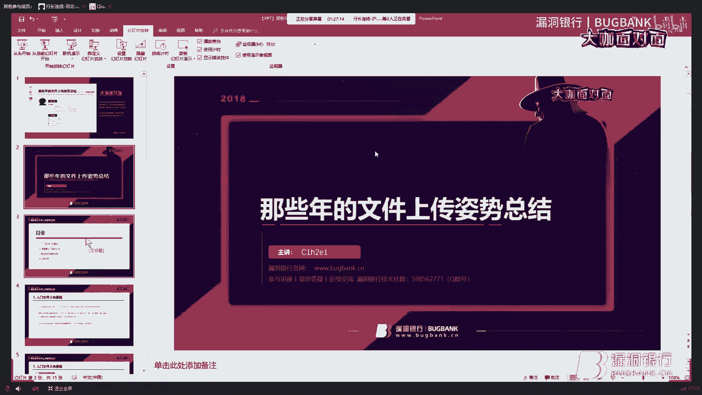

大家如果要是真的特别。想要去把文件上这个漏洞去学好的话，大家可以去找一些呃漏洞银行啊，这样去接一接任务。这样的话去挖一下漏洞，去挖一下实战去找一下文件上的漏洞。这样的话可能思路比较多。

你看啊这一共就已经19个思路了，不止这19个吧，起码得有几百个，对不对？咱们把这个几百个思路。如果往上试的话，可能就会有成功的。如果有成功的话，就该他效了，对不对？也是一次经历。

我觉得如果要是能把这几百个都试一遍，就是都能记在脑子里的话，那那你就是跟可乐一样达到了。OK嗯，我希望大家能够嗯更加勤奋一下。嗯，好，那演讲结束的话，后面就是一个问答团节啦。

大家有没有想要向大咖衬衫提问的呢？那可以在聊天群里面发出，同样也请衬衫勾选一下试看提问，以及有人在听讲过程中提出的问题，也可以给他家解答一下。

cententOS怎么绕过，centOS也属于是linux啊，他也可以去做一个，就是刚刚咱们说那个就是PHP正常的PHP文件是这样的是吧？

P然后小写的P然后APHP就是大家也切换这个也可以去也是一个思路，对吧？

如果上传之后自动改名字，自动改名字可以去做一个截段，就是发的时候也可能去绕过。还有就是那个第一个就是说他如果自动改名字的话，就属于就是呃重重命名了。重命名的话，你可以去做截段。

然后就是截段就是呃00阶段这个和这个这个和这个称是差不多的。然后就是那个刚刚说那个。发子这样的话也也也是能做一个阶段，就是类似于这样的。

比如说什么什么点PHP然后咱们既然前面的文件名里面就那就是一堆特殊符号就有可能也是绕过的。你看如果要是就这样的一个符号去下打一堆，必须先入文件名。

就是他那个特殊符号也是能存在着过的，就跟那个车网表格那个他那个博客是一样的，二次渲染就是跟那个看不清IRON是吗？ION这个表格它提问是一样的，就是这个就是二次渲染常见的编辑器有哪些？

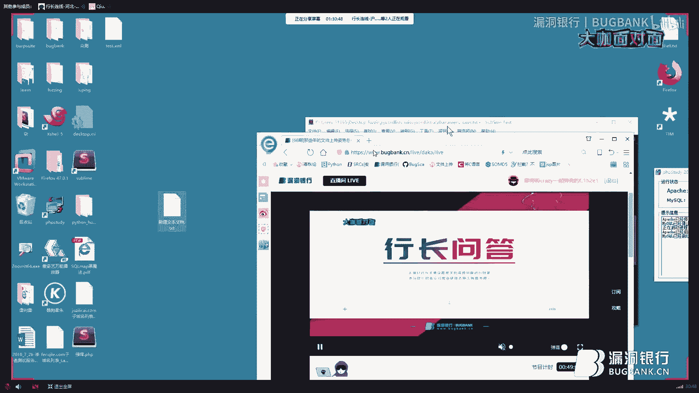

就是这个大家可以去从网上找一下，总结这个FCK editorit这种都有可能。

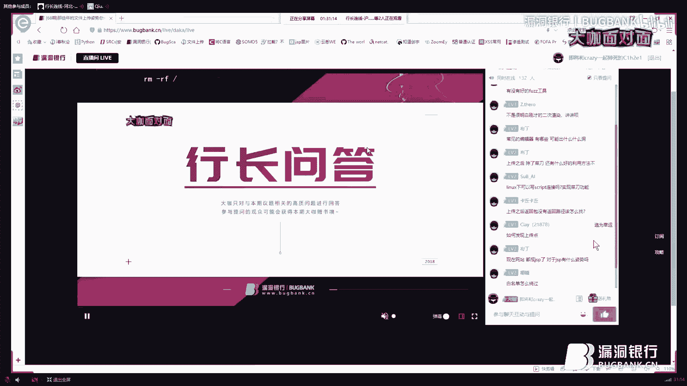

上传之后，除了菜刀以外，还有哪些利用方，我觉得只要那个只需要包含1个PHPin就可以了。你要是连菜刀的话，可能就有的时候是连不上的，它可能做一个限制是怎么样的。

其实用PHPin只要证明它执行了就已经算漏洞了，对不对？

然后白名单怎么绕过？白名单的照果就跟那个发子是一样的，还有那个。二次渲染那个基本上都是那个那几个思路。上传试之后，如何防止被管理员发现？你你为什么要防止被管理员发现呢？你可以去做一个后门之类的对吧？

上传HTTCESS加点TST这种洞有挖过不？这个HTAECESS这个就是它是阿巴喜利一个东西，我给大家看个源码，基本上嗯就是说他要去上传一个东西，就是说比如说平时咱们限制的可能就是我我再新建一个。

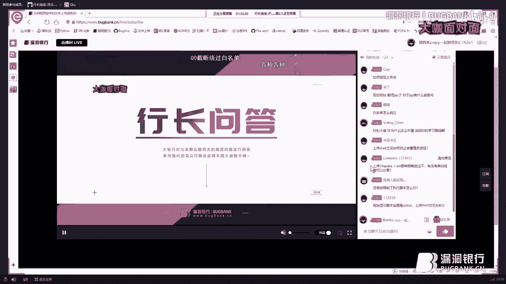

我怎么这么惨？

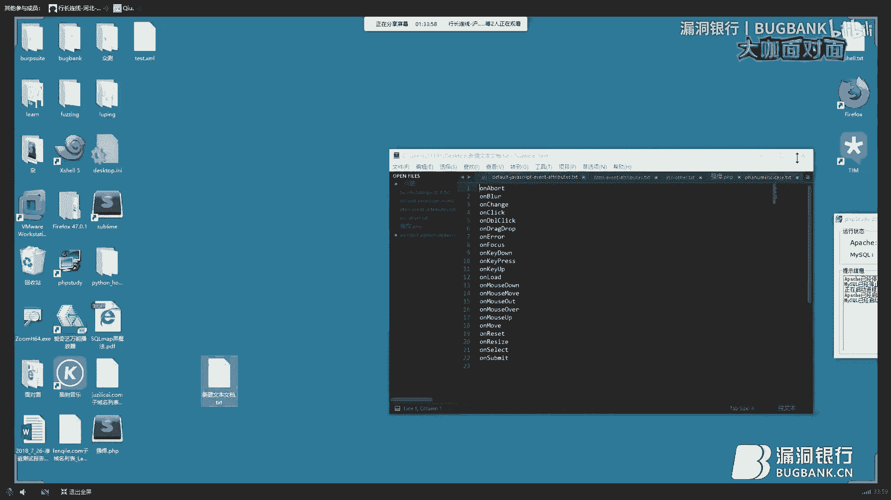

比如说咱们平时的时候上传一个这个它允许只允许上传一个点GPG文件。然后呢，咱们可以再上传1个H呃1点什么什么HTACSS这样的话。

它这里面内容就是说我可以让你也同意上传PHP文件或者这个点GSP文件点什么AASP文件就是这个意思。

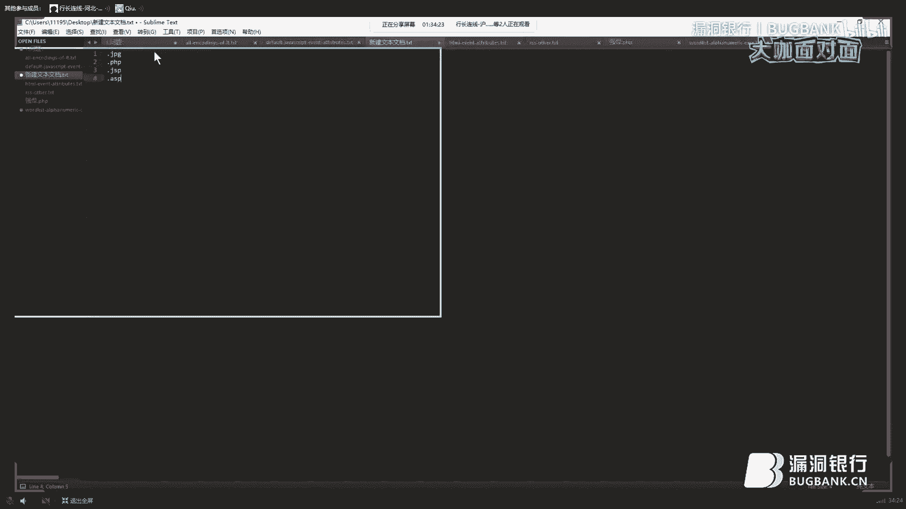

这个思路。被目录目录被限制了的执行脚本怎么办？只我反正我的话就是只报只用PHP的手。因为我觉得如果那样的话，可能涉及到一些。是吧法就是什么一些问题的话。

后缀显示脚本后缀为XHTML上传PHP访问404403。403是不允许访问的。你你看一下啊。

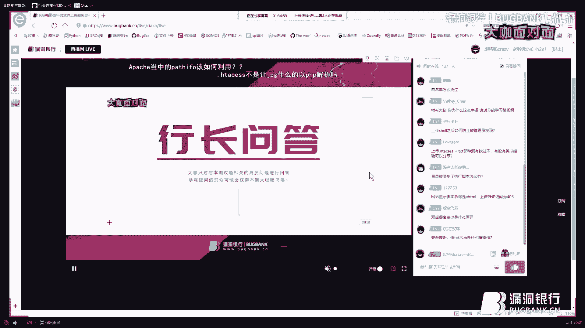

我现在这个127。0。0127。我这个本地的话就是哎。也是403的。你看他他因为因为没有这个木，你看。也是也是不允许访问的，403是不允许访问，是没有权限的问题吧。

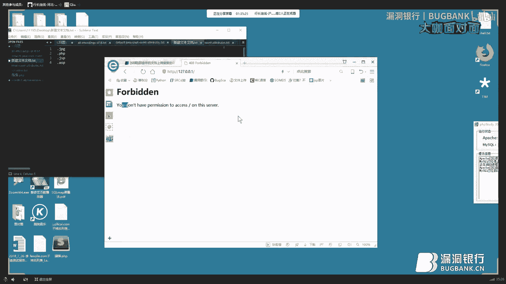

稍后这明照过就跟那个我刚刚不是说了吗？他双后这明照过，他有可能就是可以举个举个例子嗯。就相当于我带了四个小朋友一块去吃饭，然后呢，他让只让我带两个人，就把那两个人留外面，我们两个进去了就已经足够了。

这个意思能理解吗？阿里云的wa夫检查不到怎么办？你既然都已经知道他是阿里云的wauff了，你为什么还要检测他呢？对吧。怎么知道是否为你上传成功之后就已经就可以了。你这个你修改为。

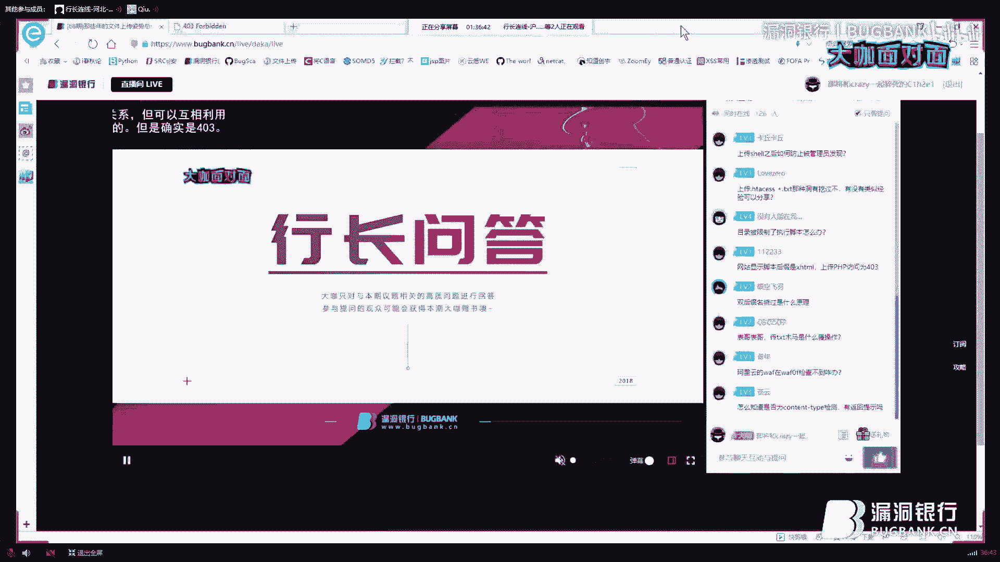

等一下，我我把就把这个拉大一点。

不解，怎么知道是我就con，他如果要是countent。

小恩。哎呀哎呀哎呀，体N体。杠TYPE它如果是这个检测的话，你如果绕过之后，你就上传成功了。对吧他他什么回险之类的，就已经直接上传成功不就对了吗？

嗯，今天大家比较热情，然后我觉得时间也挺晚的。然后大家如果还有什么想要问的话，可以之后再私下跟衬衫再交流，或者到群里面再交流都可以。再次感谢衬衫大咖的耐心解答。那相信已经帮大家解决不少问题啦。

大家后续如果还有问题的话，把样子去群里面或者跟衬衫私下交流。那最后就来到我们的大咖发福利的环节。今晚的赠书是python绝技，运用python成为顶级黑客。

那这是一本能够帮助大家来编写渗透工具的专业书籍。你想获得他吗？那要看衬衫大咖会不会选中你啊，下面我们让衬衫大咖来选出今晚幸运观众吗？那就选安这个表哥吧，选没幸运。

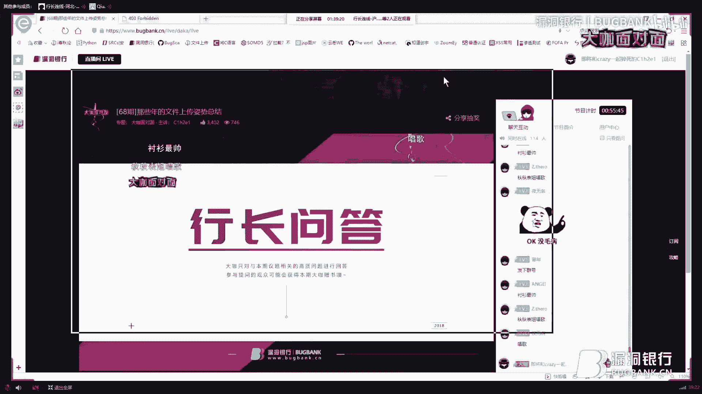

决定。嗯，好，那恭喜这位叫做angel的小伙伴，你将获得这本大咖证书。那请你根据直播间的提示，留下自己联系方式，或者你在直播后直接联系我来兑奖都可以。那好啦，嗯，今天来到直播播的尾声了。

00后的白帽子果然让人刮目相看。那如果你还没有再努力的话，会不会有危机感呢？

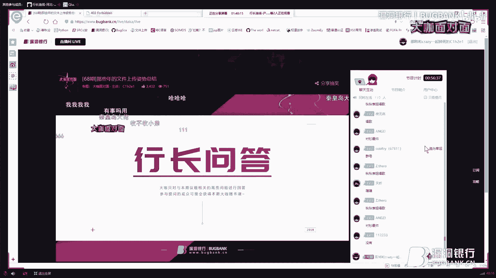

好啦，那再次感谢车衫的咖精济准备内容。虽然直播结束了，大家或许还可以关注到大咖的发展和动态。当然了也感谢每一位今天继续参与直播小伙伴，你们支持这种前进的动力，让我们一起来向成为技术大牛而努力吧。

那最后友情提示一下，想进群交的小伙伴呢，可以点击页面底部的加群链接。

🎼打开面的面，周五8点见，我们下周再约吧路家门口老仿佛老。😊，🎼在这伟大的细胞被那次的记号，我常会心痛。 but know home我不想惊动你，因为我周围同样就乌言瘴气。😡，🎼英雄战义没有清新统气。

只有歌手不唱歌在拼眼拼综义说话狗避不畅通，神情中令，所以我选择把自己存浸在心痛he up down。😡，🎼love get me play that down。🎼of。

 forget who we are and we fun not a goes wrong。🎼走的不听都。

