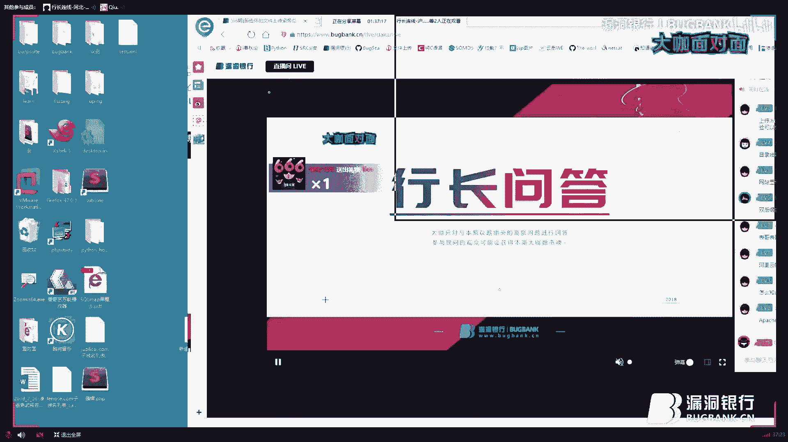

# 课程P1：文件上传漏洞基础与绕过姿势总结 🛡️➡️🚪

在本节课中，我们将系统性地学习Web安全中一个经典且直接的攻击面——文件上传漏洞。我们将从基础概念讲起，分析防护机制（WAF）的工作原理，并总结多种实用的绕过姿势，最后通过经典案例加深理解。

## 一、 文件上传漏洞基础 📚

文件上传漏洞是指攻击者上传了一个可执行的脚本文件，服务器在处理或解释此文件时，赋予了其执行命令的能力。这种攻击方式最为直接和有效。

文件上传功能本身没有问题，问题在于服务器对上传文件的后续处理逻辑。如果处理逻辑不够安全，就会导致严重的后果。其核心原理是：用户上传的Web脚本文件被服务器的Web容器（如Apache、Nginx、IIS）解释并执行，从而导致代码执行。

上一节我们介绍了漏洞的基本概念，本节中我们来看看由于Web容器自身特性导致的一些经典解析漏洞。

以下是几种常见的容器解析漏洞：

1.  **Apache 1.x/2.x 解析漏洞**：Apache在解析文件名时，会从右向左寻找它能识别的扩展名。例如，文件 `shell.php.xxx` 会被解析为 `.php` 文件并执行，因为Apache不认识 `.xxx` 扩展名。
    *   **公式/逻辑**：`[文件名].[合法扩展名].[任意不识别的后缀]` -> 解析为 `.[合法扩展名]` 文件。
2.  **IIS 6.0 目录解析漏洞**：如果目录名以 `.asp`、`.asa`、`.cer` 结尾，则该目录下的所有文件都会被IIS当做ASP脚本执行。例如，目录 `/upload.asp/` 下的文件 `logo.jpg` 会被当做ASP文件解析。
    *   **代码示例（假设的访问路径）**：`http://target.com/upload.asp/logo.jpg`
3.  **IIS 6.0 分号截断漏洞**：在文件名后添加分号 `;`，IIS在解析时会忽略分号后的内容。例如，文件 `shell.asp;.jpg` 会被解析为 `shell.asp`。
    *   **公式/逻辑**：`[真实文件名];.[伪装后缀]` -> 解析为 `[真实文件名]`。
4.  **Nginx 解析漏洞（旧版本）**：在低版本Nginx中，如果配置不当，遇到类似 `shell.jpg/.php` 或 `shell.jpg%20.php` 的URL时，可能会将 `shell.jpg` 当做PHP文件执行。这与“00截断”思路类似。
    *   **“00截断”原理**：在HTTP请求中，通过十六进制 `0x00`（NULL字符）截断文件名。例如，上传时文件名设置为 `shell.php%00.jpg`，服务器在读取到 `%00` 时认为字符串结束，最终保存为 `shell.php`。

## 二、 上传前的准备工作与WAF原理 🛠️

在开始尝试上传前，需要进行充分的准备工作。同时，理解是谁在阻止我们上传（通常是WAF）至关重要。

以下是上传前需要明确的几个关键点：

1.  **目标环境**：明确服务器语言（PHP/JSP/ASP）、Web容器（Apache/Nginx/IIS）和操作系统（Windows/Linux）。不同环境有不同的绕过特性（如Windows的 `::$DATA` 流、Linux的大小写敏感）。
2.  **寻找上传点**：上传点不仅限于头像修改处，还包括文章插图、附件上传、富文本编辑器等。通常，边缘业务的上传点防护可能更薄弱。
3.  **探测允许的格式**：使用工具或手动测试，探测服务器允许上传的文件后缀白名单或黑名单。这有助于寻找黑名单遗漏项或白名单的绕过思路。
4.  **确认处理逻辑**：上传后文件是否会被重命名（如基于时间戳或用户ID）？这决定了是否需要使用截断等技巧。

理解了自身需要准备什么之后，我们来看看防御方——Web应用防火墙（WAF）是如何工作的。WAF的运行规则通常遵循以下流程：

1.  **读取HTTP请求头**：检查请求是否规范，头部是否包含恶意特征。
2.  **解析文件名**：检查 `filename` 参数中的后缀是否在黑名单内。
3.  **检查目录权限**：某些WAF只监控特定目录的上传行为，这为跨目录上传提供了可能。
4.  **检测文件内容**：部分WAF会读取文件内容，检查是否包含Webshell特征码（如 `<?php eval($_POST[‘cmd’]);?>`）。
5.  **匹配请求URL**：限制只有特定URL路径才能上传文件。

需要注意的是，大部分WAF主要解析文件名，只有小部分会深度解析文件内容，因为后者更消耗资源。URL路径限制在实际绕过中较少遇到。

**WAF识别工具**：可以使用 `WAFW00F` 这类工具进行识别。命令格式为 `wafw00f http://target.com`。手工识别可以通过触发WAF的误报页面，从返回信息或IP查询来确定WAF厂商。

## 三、 WAF绕过姿势总结 🎯

了解了WAF的检查位置后，我们就可以有针对性地构造Payload进行绕过。绕过思路千变万化，以下是13种常见且核心的绕过姿势。

在HTTP上传请求包中，主要关注 `Content-Disposition` 和 `Content-Type` 这两个部分，特别是 `filename` 参数。

以下是一些有效的绕过技巧：

1.  **后缀名Fuzz**：使用Fuzz字典（如 `fuzzdb` 项目中的 `Upload-Filename` 列表）对 `filename` 后缀进行爆破，寻找黑名单遗漏的后缀（如 `php5`, `phtml`, `phps`）。
2.  **Windows特性：点号与空格**：利用Windows系统自动去除文件名末尾点和空格的特性。例如 `shell.php.` 或 `shell.php ` 在保存后都会变成 `shell.php`。
3.  **路径绕过**：修改 `path` 或 `filename` 参数，尝试跨目录上传到WAF不监控的路径。
4.  **大小写绕过**：适用于Linux系统大小写敏感的特性。例如 `Shell.PhP` 或 `SHELL.PHP`。
5.  **换行绕过**：在 `filename` 字段的值中插入换行符 `\n` 或 `\r`。
    *   **代码示例**：`Content-Disposition: form-data; name=“file”; filename=“shell.p hp”`
6.  **多个filename参数**：在请求中重复设置 `filename` 参数，WAF可能解析第一个，而服务器解析最后一个。
7.  **引号绕过**：修改 `filename` 参数周围的引号，如将双引号改为单引号，或混用。
    *   **代码示例**：`filename=‘shell.php’` 或 `filename=“shell.php‘`
8.  **添加空格**：在 `filename` 或 `name` 字段的任意位置添加空格。
9.  **分号绕过**：在 `filename` 字段前或 `Content-Disposition` 行内添加分号。
    *   **代码示例**：`Content-Disposition: form-data; name=“file”; bypass; filename=“shell.jpg”`
10. **删除Content-Type**：直接删除整个 `Content-Type` 头部，有些检测逻辑依赖此字段。
11. **Boundary内添加垃圾数据**：在 `Content-Disposition` 行内添加任意字符串。
12. **删除form-data**：将 `Content-Disposition` 中的 `form-data` 删除或修改。
13. **双后缀名/超长文件名**：使用 `shell.pphphp`（利用WAF可能删除 `php` 字符串的规则）或构造超长的文件名使WAF检测失效。

**推荐练习靶场**：`Upload-Labs` 和 `DVWA` 是极佳的文件上传漏洞练习环境，它们涵盖了从客户端校验到服务端各种防护的绕过场景。

## 四、 经典案例分析 🔍

理论学习之后，我们通过分析几个历史上的经典案例来巩固知识。

以下是几个具有代表性的实战案例：

1.  **Windows ::$DATA 流绕过**：在某云案例中，利用Windows NTFS文件系统的数据流特性。上传文件名为 `shell.php::$DATA`，系统会将其保存为 `shell.php`，从而绕过后缀检测。
2.  **参数可控导致绕过**：在某些CMS中，除了 `filename`，还有独立的 `fileid` 或 `suffix` 参数控制最终存储的文件名。如果只检测了 `filename` 而 `fileid` 可控，则可通过修改 `fileid` 为恶意后缀来利用。
3.  **编辑器漏洞**：如 `FCKeditor`、`UEditor` 等富文本编辑器，历史上存在大量文件上传漏洞。通常通过扫描敏感路径（如 `/editor/`）发现，利用已知的编辑器漏洞进行利用。
4.  **空格截断案例**：在某次实战中，上传文件后返回路径包含空格，如 `upload/2135.tmp mht`。通过将 `mht` 改为 `../` 并访问 `upload/2134.tmp.php`，成功执行了 `phpinfo()`。这利用了文件名处理时的空格截断和路径回溯。

## 总结 📝

本节课我们一起系统性地学习了文件上传漏洞。我们从**基础概念**入手，理解了漏洞成因在于服务器对上传文件的不安全处理。接着，我们探讨了因**Web容器特性**（如Apache、IIS、Nginx）产生的几种经典解析漏洞。

然后，我们强调了**攻击前的准备工作**的重要性，并深入剖析了**WAF（Web应用防火墙）** 的工作原理和检查流程。基于此，我们总结了多达13种实用的**WAF绕过姿势**，从后缀名Fuzz、系统特性利用到请求包结构篡改，涵盖了主要攻击面。

最后，通过分析**经典实战案例**，我们将理论知识与实际场景结合，加深了对各种绕过技巧应用的理解。记住，文件上传漏洞的挖掘很大程度上依赖于耐心测试和经验积累，多利用靶场练习，并在合规范围内进行实战，是提升技能的最佳途径。