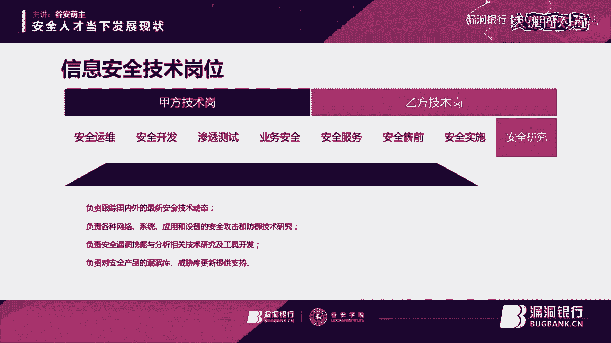
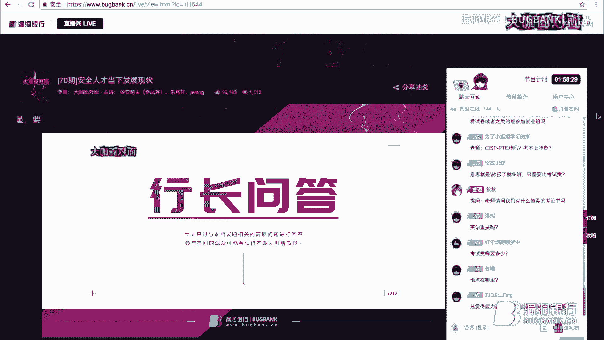
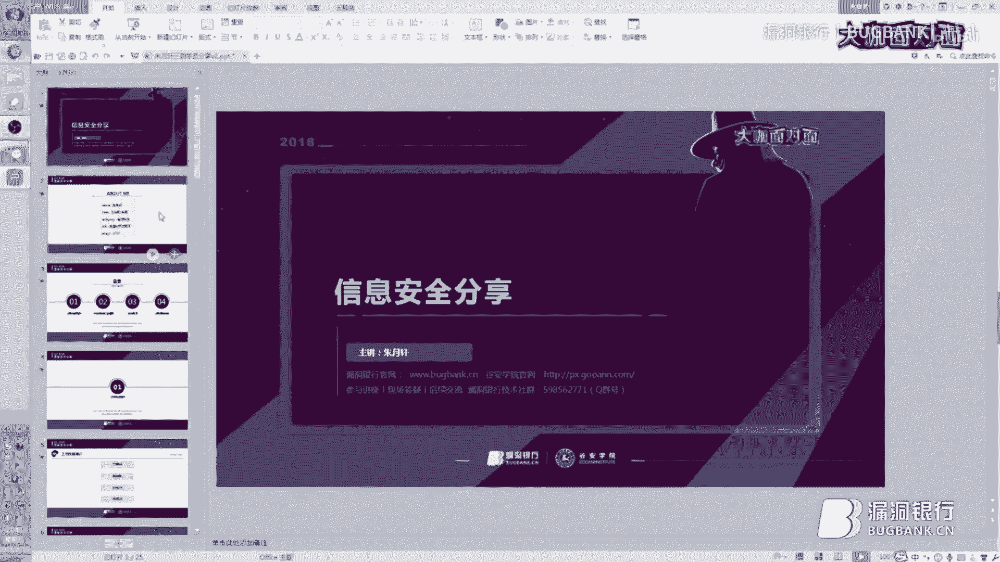
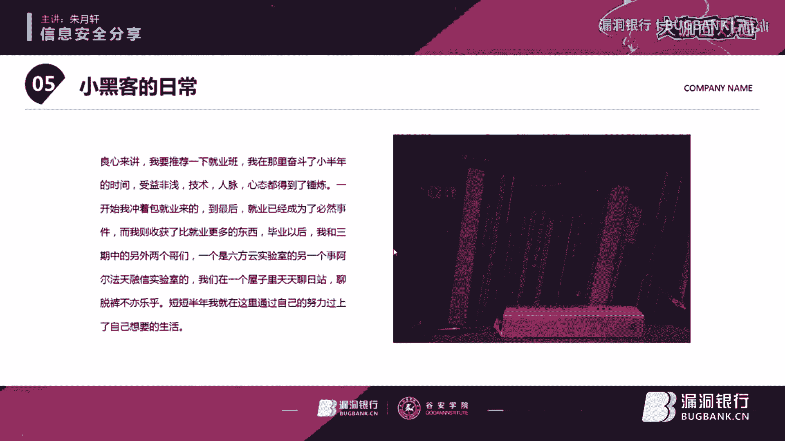
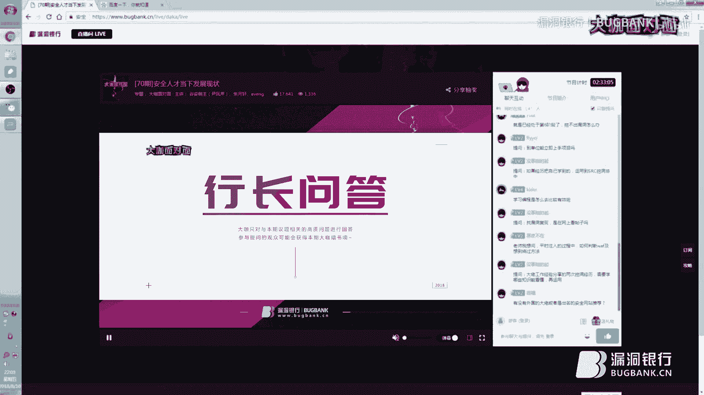

# P1：70期丨安全人才当下发展现状-谷安萌主 - 漏洞银行BUGBANK - BV1ft411Z73Y

为知识而成，因技术而生，小伴晚上好，欢迎参加第7期漏洞银行安全技术直播大咖面对面。主持人秋秋。今晚我们请来了古安学院网络安全高级讲师、网络安全就业班指导总监。

兼安全牛牛聘项目总监古安盟主尹凤婷老师为我们分享主题为安全人才刚下发展现状的内容。尹老师长期专注于信息安全行业优秀人才培养，还有着6年的高级安全讲师经验，对安全人才发展现状与未来发展趋势都有独特见解。

那今晚呢除了尹老师分享之外，还有特别请到他之前在古安学院培训过的两位已就业的学员，一位叫做Aventnge现任莫安科技安全分析师。另一位是朱月轩，现任汉斯科技安全服务工程师。

他们呢也将在今晚分享从古文安学院毕业后成为安全从业人员的心得和体会。所以今天的直播时间会比较长，各位观众朋友们，请做好准备。在开门将会带你完整的了解当下安全人才的发展趋势和就业前景，一定要听到最后哦。

那由于今晚有三位大咖一起来分享，所以我们的流程会有一些变化。在每位大咖演讲结束后，都会给观众提问时间。另外，今晚直播也是福利多多。福利一。

我们将在今天所有登录直播间观众里面选出30位赠送由安全牛出版的书籍，网络安全管理者精选100篇福利。2，今晚观看直播还有机会获得安全牛课堂价值万元的VIP视频教程大礼包免费学习资格。

那这些福利要如何获取呢？我们之后在直播的时候会逐一揭晓。大家记得关注。好啦，那下面就请国安门主尹凤琴老师来做今天分享吧。嗯，hello嗨感谢秋秋哈呃。😊，直播间的朋友们晚上好哈。呃，那首先呢同学们。

我先自我介绍一下啊。呃，我是国安学院网络安全就业班的负责人兼就业指导总监。呃，那我今天呢其实非常开心啊，能有这样的一个机会和大家去交流和分享。我希望呢就是在开开场的时候也说过。

我希望所有的同学呢在今晚呢都能有一个自己很好的一个收获啊。呃，那言归正传，我今天要分享的主题呢？就是当下安全人才发展的一些现状。此次分享呢？其实主要是面向啊现在即将毕业的一些大学生。

就是很多同学呢即将毕业了，想踏入安全大门。但是呢不知道自己现在何去何从，也不知道刚才像有同学有问到，我到底适不适合呀？呃，我能不能做安全啊。呃还有一个就是针对的对象就是。😊，工作1到3年的朋友。

想跨行的一些朋友，就之前呢没有从事安全这一块，但是呢现在安全很热，并且呢它也是一个朝阳行业。所以很多人呢想进入这个行业，但是不知道自己适不适合。所以我今天呢主要就给大家分享一下当前的安全行业。

现在的一些人才现状。这是我主要想分享的一个点。另外一个点呢，就是有的同学会跟我讲说老师呃，我觉得我现在因为之前学过一点这个安全的知识，我觉得我还可以。但是为什么去面试呢？屡屡失败。

为什么就是现在的安全公司真的对人才要求那么高吗？其实这个并不然，所以我也会针对这种现象去讲一下，为什么就是大学生会出现这种现象。那现在安全公司到底对人才的一个岗位要求是什么样的。

我都会在这后边去给大家进行分享。那最后一个模块呢？就是网络安全就业班。网络安全就业班是大家一直很关注的。一直之前就说哎老师有没有就是因为每次其实真的是学员太多。

所以加我学员的可能真的是在聊天过程当中不是会特别长久的去一一回复我。尽量都一一回复了，但是也真的很难。有的同学呢确实回复不到，没有系统给介绍过。所以后来有的同学就说老师为什么你不做直播呢？

给我们大家统一讲一下。所以我们也是开启了这个就业班的直播。啊，那这是我主要要讲的。今天就业班的一些内容在这里边会详细的做一些分析。😊，那第二个模块呢就是我们刚才秋秋提到的网络安全就业班的学员聪聪和轩轩。

这个是我们三期的就业学员。那为什么选择他们俩来做分享呢？其实我们三期呃大概的哈基本上七八个同学吧，都是信安专业的那也有就是五六个同学是非专业的，但是我选择这两个同学都是非专业的。

是因为很多同学就想跨行学安全跨行进入安全大门？但是不知从何学起，所以呢我选择了这两位同学，他们会在后面的内容里面详细去分享，如何从零学起。呃，他们也会分享他们在学的过程当中的一些困惑。

包括他们的一些经历，还有现在工作的一些状态。现在工作的一些内容，实战的一些内容。所以我觉得今天直播间的朋友们非常幸运哈，确实我们这个漏洞银行也确实真的是给大家的一个福利哈。呃。

让大家免费听这样的一堂这个也算不上课程吧，还是交流。啊，所以这个是我们今天要讲的模块大概是两个半小时的时间吧。呃，中间呢我们会有提问环节和休息几分钟的环节。所以大家呢可以根据自己的时间去调配。

刚才一个小伙伴说没有吃饭哈，尽量的还是要先边听边把饭吃了。啊，那个中间的这个奖励呢，我会在中间的时候会说，所以大家不要着急，好吧。好，呃，那在讲之前呢，我想说一下古玩天下。因为很多人说哎老师。

你到底是古玩天下的还是安全牛的因为现在安全牛的这个项目也是我来负责的，所以很多人有点搞不懂了。呃，我先主要介绍一下啊，其实安全牛呢是古玩天下的一个品牌啊，就是我们旗下的一个品牌。

那安全牛呢它是在安全行业现在是非常中立的一个平台，一个媒体平台。呃，其实受到很多安全公司呃，包括学员的一些认可。呃，现在古玩天下，我觉得啊品牌的这种知名度，可能还没有安全牛火。

呃以说呢我现在给大家解释一下，就是安全牛是我们旗下的一个品牌。那古玩天下呢是07年成立的，到今天呢其实是11个年头。那我们现在啊其实古玩天下一直都是在对这个。

网络安全爱好者，这个信息安全爱好者这些同学去服务的。我们现在培训的学员，大家可以看一下啊，现在我们为政府、国企、央企，还有一些安全厂商，互联网公司、银行、证券、电信等等。

总共培养的学员大概我们粗略的估算一下3万家哈。那我们现在国玩天下下边下设的古玩学院。我们古玩学院呢就是因为上在我们年初开股东会的时候，也去呃探讨了，我们要把我们的国安学院呢打造成一系列的一个体系。

首先从这个专业教育到培训认证，到就业培训，到在线教育。那在线教育就是安全牛课堂的一些课程啊，所以就业培训就是我们线下的网络安全就业班，主要是针对就是刚毕业的一些大学生应网界的大学生。

那在找工作过程当中呢，会有一些。呃，阻碍困惑，还有就是一些安全公司，呃，找不到一些优秀的合适的一些人才。那培训认证呢就是在安全行业，其实很多呃同事啊，同人们啊都会考一些认证。呃，要拿到这个认证。

其实呃比如说s加呃，刷SP大SPCSMPDE等等。这个都是我们要在工作当中以后去考取的啊，所以说其实古安呢我简单的介绍，就是培训的这模块没有介绍我们的安全意识安全值大数据等等。这些。

因为今天主要涉及的是培训的部分。所以我简单的介绍一下啊。那下来呢进入我们今天的主题，我要讲的这四个模块大给大家看一下啊。第一部分就是主要是安全人才发展的一个现状。第二部分就是现在安全行业的一些岗位要求。

第三部分就是一些技术岗的能力要求。第四部分是我们的网络安全就业班。那安全行业的一些人才发展现状，现在大家跟着我去思考一下啊，现在我相信直播间肯定会有很多企业的呃高管们就是用你们的话说就是安全的大佬们。

其实他们技术肯定是没问题的。但是他们愁什么，愁人才，招不到人才。现在呢就是从企业的角度来去分析啊，现在面临的一种尴尬的局面，就是高薪难求艺人。现在很多安全公司愿意花2万3万甚至4万。

这样的一个薪资去招一个合适的安全人才。但是呢就是每天因为会有很多HR跟我这边对接，包括安全公司的一些管理层会跟我讲，尹老师为什么我们招个人这么困难，每一天搜这个上百份的简历，但是没有一个合适的。

也许真的很幸运，招到一个合适的，带两个月3个月就流失掉了。这个到底是为什么大家可以思考一下啊，咱们也可以看一下官方数据。现在官方的数据啊，呃在国外其实流行一个词。叫什么词？很多人可能也听过啊。

就是用人慌。就是荒是荒芜的荒啊，用人荒。就是说现在信息安全的人才缺口其实是非常大的啊，预测到这个2020年其实有200200万这样的一个职位是无人可用的。所以现在企业在招人难这个问题上一直很难去打破。

我每天都会接受接收到啊安全公司的大佬们去跟我去讲啊，严老师啊，给我赶紧推荐点优秀学员吧，每天都会收到这样的信息，其实我也很无奈。那么大家想一下啊，这是从企业的角度。那从人才的角度呢？有人想过吗？

从人才的角度，真的我们的人才那么稀缺吗？其实在我们2000年以后啊，据我了解，在2000年以后，很多高校已经陆续开设这个信息安全专业了。那么其实信息安全专业的开放，人才其实应该是不断的增大。

对吧咱们可以看一下啊。这也是官方数据啊，2018年毕业的考生达到多少？预计820万，大家有想过吗？其实我看到这个数字我还是比较震撼的。虽然我知道呃就是毕业大学生肯定人数是很多的，但是820万啊。

那信息安全人才毕业生占127万，这些人去哪儿了？这些人为什么没有找到合适的工作。大家可以带着这个问题思考一下啊。那我个人啊去总结了一下，其实从企业的角度，企业去反思我们难道对人才的要求有点高吗？

难道是我们无法匹配到精准的人才吗？从应聘者的角度去考虑应聘者很多同学会跟我说，尹老师，我我是不真的能力太弱了，用你们安全圈的话说，就是我是不太菜了，对吧？那还是说我们的学员们。

应聘者们其实对自己的定位并不够清晰，他的职业规划其实是模糊的。因为很多刚毕业大学生，他不知道我到未来去安全公司，我能做什么，我会什么。我未来的一个职业生涯应该是什么样的。其实很多同学是不知道的啊。

这个其实是大家看似一个很表面的一个原因。那么其实我觉得产生这种现象的一个原因啊，最根本的我个人认为是这方面，首先从学校课程。和市场需求的一个对比。呃，我说到这儿，我想说啊。

直播间的朋友肯定有一些高校的老师啊也在里边。因为我们安全牛课堂的话也会给老师开设一些课程哈，很多老师也都在我们这里边学习。所以我说到这儿，这些老师不要介意啊，因为这是一个大的现象。

是这个从学校的层面去讲的。就我们的学校的课程呢，本身就是真的可能因为咱们起步较晚，所以说呢很多第一批从这个做信息安全的这个老师啊教这个专业的老师，其实他真的没有去一线实战过。

所以他可能真的不知道市场需求是什么样的。所以学生学出来之后，他的一个水平是很多理论知识还可以。但是呢一些实战项目是没有的。那我觉得其实最根本的原因是这个是因为我们现在学校的一些。

课程和我们这个市场的需求啊，它是脱节的。所以导致学生到了单位之后，他无法胜任这个岗位要求，无法完成自己的工作。其实这个我是觉得真的呃跟学生也没有关系。如果说有的学生说我在学校里边呃，除了老师授课之外。

学的之外，我还会去自学一些东西。呃，就刚才大家说的这些语言啊或者一些卡里时战啊等等。就是很多学生会去自学。那出来之后就感觉自己跟别的同学不一样了。

确实因为他自学的一些东西已经超过了现有同学只是等着被动的去接受一些知识。嗯，所以我觉得是这样的，这个根本原因我们在前几年发现的时候，我们就开始想做线下的这种呃人才培训就业培训。

这个也是我们就业班诞生的一个背景。稍后我会在下面的第四个环节会讲一下这个网络安全就业班。它这个产生，其实就是为了缩短这个学校出来的学生和现在企业的一个差距啊，是这样的。那除了这个原因之外呢。

其实很多小伙伴更关心的我刚才有讲到，那企业到底现在对应往届毕业生或者是工作1到2年的学生啊，他的一些要求到底是什么样的。大家可以看一下第二部分，就是现在安全公司的一些岗位要求标准是什么样的。

大家我现在不放PPT，大家想一下是什么样的。很多人说，那技术肯定得特别牛的那你刚毕业，你的技术嗯能达到什么什么样的一个水平呢，多高的一个水平呢？我觉得不见得不是我打击同学们，小伙伴们啊。

因为我经常会听到这个安全公司的一些管理层跟我讲说，尹老师我要跟你分享一个非常呃开心的事情，我今天招到了一个非常合适的人才，他的综合素质特别好，潜力特别好，我可以带一带。他的学习能力特各方面特别好。

真的我经常会听到这样的声音，但是我经常我不会听到说尹老师，你知道吗？我招到一个应届生，技术能力太强了，简直比工作两三年的这个经验还要丰富，真的不会有这样的。所以呢其实现在安全公司。😊。

对人才的一个标准啊，我指的是硬往借哈，其实主要就是潜力。就是主要看你的一个学习能力，学习态度。因为很多同学刚才我有讲到，有的同学是在学校就自学过一些呃安全方面的知识，还打过一些比赛。

那就觉得自己可能唉很牛很厉害。但实际呢其实企业看重的是你们现在因为你们刚到安全公司或者是刚进项目，真的真的不能独挡一面。那这时候其实你的学习能力和态度，还有你的执行能力是非常非常重要的那当然了。

技术基础也是一个因素啊。那我觉得其实如果真的呃给这个是给即将毕业的，或者是即将要参加工作的。还有说跨行的1到3年的朋友们的一些建议，就是我们无论现在你的基础水平是什么样的。

如果愿意有有安全公司安全平台愿意给你这样的一个机会去历练你。那我想我想你肯定是要把你的学习能力学习态度拿出来的这样的话，其实你到公司之后，有的人其实真的因为我的学员，我们首期班是在去年3月份开的嘛？

那我们去年3月份开完之后，我们首期班的学员现在6月份上班已经一年多了。那好多同学都已经升项目经理了。啊，已经可以独挡一面了，为什么呀？其实他进去的时候和其他同学是一样的，真的没有觉得能力多高超。

只不是他的学习能力很强，学习态度很好。那执行能力也很好，那公司发现你的潜力就会愿意去培养你，这个是肯定的。这个是我觉得啊现在安全公司对应往届的一些毕业生的一个要求，它的一个标准。

但是呢如果说对待这种3到5年或者是5到8年的一些技术大佬们啊，这些要求那肯定就是变了。但是我觉得呃首先你的综合素质里边包括什么，一定是包括学习能力的啊。所以上面讲的是这个安全公司的一些用人标准。

那下面呢主要就是着重的分享一下现在这个安全公司一些技术岗的一些能力要求。因为有很多这个小伙伴们之前问过，我说老师什么是安全，我到安全公司具体能做什么？其实每一个安全公司它的技术岗岗位职责都是不一样的。

但是呢大框是没变的。所以我把它分成，大家可以看一下甲方技术岗和乙方技术岗。那甲方技术岗，我们分安全运维、安全开发、渗透测试和业务安全。大家看一下安全运维，你主要要负责哪些内容。因为有很多同学之前跟我讲。

我是老师，我不想做安全运维，我觉得安全运维太辛苦了，觉得安全运维是安全当中最底层的。其实大家看一下这个安全运维要负责的一些内容，工作内容，大家看一下，是真的很底层吗？

其实很多安全公司的大佬都是从安全运维做起的。首先你对这个呃。你的公司的一些应用系统啊。呃，包括数据库啊、主机呀，还有一些安全产品，肯定是要做日常维护的，也要做一些安全检查。

那包括其实运维我觉得一个优秀的安全运维人才呃，体现他最呃机敏的一面和最这个优秀的一面，我觉得就是对安全事件的一个应急处理吧。因为应急响应这个事件的话，就是当安全事件发生了，没发生之前全是预演。

但是一旦发生了，其实我觉得很多人还真的是如果是有经验的和没有经验的差别还是很大的。所以安全运维这个岗我觉得还是很重要的哈。那第二个就是安全开发。大家可以看一下安全开发啊。我们主要负责的一些内容。

其实安全开发呃，就不单单是说你要对这个应用系统做一些安全支持啊。你首先对系统的一些架构设计呀，包括安全防护组件的一些开发呀，你这个都是要是你一个人来做的，包括一些测试啊，都是要去做的。

那第三个渗透测试渗透测试这个小伙伴们应该很感兴趣哈。在没有入安全行业的一些小伙伴们就跟我说，老师呃，我要去进安全这个行业了。那我要做这个呃安全我未来要做安全行业的大佬呃，我说那你想做哪个岗位呢？

现在起步我要做渗透测试。我说为什么呢？因为我看了一些黑客电影，我觉得这个做渗测渗透测试是非常牛的，再说了，安全里边不只有渗透测试嘛？再下边我会详细去讲，其实安全的这个模块啊，其实真的很广，它是一个体系。

并不是说安全里边只有渗透测试，呃渗透测试呢，其实也真的对自己的一些技术技术要求是非常高的。我现在经常听学生说我要做这我要做那我就会反问学生，那你会什么？就是你们下来。😊，今天也可以想一下。

我真的要做这些岗位，没有问题，理想都没问题。但是我一定要知道我会什么。我对这个岗位是否去会匹配度是百分之百的啊。大家接下来回来这个话题啊，看一下渗透测试。其实渗透测试的话，呃。

因为我相信啊在直播间的朋友肯定很多人是从事这个岗位的。其实渗透测试还是挺辛苦的啊。呃，当然了，对于呃技术人员来说，可能觉得挖洞是一个非常有兴趣的事情，非常开心的一个事情。这个因人而异啊。

那下面一个就是业务安全。其实业务安全在这个安全岗里边来说，我觉得它也是非常重要的。因为首先他对自己公司的一些产品啊一定是非常要非常了解的。他要了解用户的一个体验和需求的一个呃感觉。

因为很多呃我们之前一些这个业务安全人员就会去讲说。啊，严老师，我说用户体验怎么样？他说呃用户体验还行吧，我觉得体验还可以，我说那个那用户有反馈呢嗯反馈也还可以吧。

我说你对这个为什么产品你到底有多多少了解，为什么一问你都是还行，还可以，有没有真正的了解用户的一个需求。其实就像我们去逛街去买东西一样，那我们去买东西，我们比如说女孩子啊都爱逛街，都爱用化妆品。

我们固定的会用哪些品牌，那我们用完了之后是不是都会跟自己的闺蜜去分享，说啊，我用他们家的牌子还不错，是吧？这就是一个用户体验的一个过程。所以我觉得业务安全这一块的话。

其实真的是在安全当中也是非常重要的啊。😊，那下面看一下乙方岗啊。乙方技术岗。乙方技术岗的话，首先安抚安全服务工程师。安全服务工程师的话，其实现在是非常大众的一个岗位啊。

很多这个公司也真的特别特别缺这方面的人才。因为我觉得他是一个综合能力，应该很强的一个人才能达到这样的一个岗位。大家可以看一下他具体的具体具体的一些工作啊。

他要负责这一些呃安全方面的一些风险评估啊、安全加固啊、漏扫啊、极限检查呀，包括拽写报告啊，这些都是要你个人去做的。包括对这个安全事件的应急响应都是要去做。另外其实安抚的话，我觉得还是一定要口才好的。

就是呃我的技术能力是OK的同时，我的这个口才一定是很好的。因为他要负责跟客户进行去交流嘛。他要讲解这个整个安全服务，包括一些安全培训都是要去做的。他也因为他前期跟客户交流，如果不通畅的话。

不知道客户的一个想法和需求的话，那最终也没有办法做整改嘛。所以安全服务的话其实是一个综合性人才。那下面看一下啊，售前。售前的话，我说一下啊，很多人认为这个是安全售前跟销售一样。之前就有同学跟我说。

老师我不想做安全售前。我说为什么呀？他说因为我不想做销售。我说你觉得安全售前就是销售吗？其实安全售前销售很多人说，因为我本人是做销售出身的啊。那其实销售的话，很多人会说销售不难，因为销售每个人都能做。

只要把产品卖给客户就可以了。但是呢安全售前如果你不懂一些技术的工作，不做一些技术支持的工作，那你真的跟销售人员就等于均等了，但是其实你的作用和价值不是在这。

你的作用和价值是配合销售人员去做一些技术支持工作。那能否这个产品能否很成功的销售给客户，那我觉得售前的功劳是非常大的。😊，你要和用户进行现场的一个交流，你要整体介绍你公司的产品解决方案。

包括后期的一些投标方案，都是售前要做的。所以安全寿险我是觉得真的很历练人。我之前带过一个呃同事，之前挺不爱说话的，就是一个纯技术。那后来呢呃因为技术方面的话，发展觉得可能也比较累。

完自己呢也觉得想多方面的去提升。最后呢就跟着我做安全售前。那我带他去做售前的时候，我就会发现他不讲话的。他只是说啊那这是我们公司的产品。说123说完了之后，因为我们那时候是做安全意识。

安全意识的产品就会给人讲说，那我们安全意识产品应该是用哪些？回来之后，我问他，那你觉得客户的需求兴趣点在哪，那不知道那你怎么做的售前呢？对吧？但是现在他已经工作了两年了，现在非常厉害。

安全售前属于我觉得还是非常不错的，得到很多客户的认可，那他自己呢也得到了很大的锻炼，所以安全售前还是挺挺锻炼人的？😊，那下面呢授前做完了就是实施。实施这一块的话。

其实呃因为每个人对这个工作的岗位理解不一样啊，有的人会认为，哎呀，实施就简单了，售前是带着这种一线的任务，我要完成配合销售的这样。那实施的话，反正也应该没有什么问题了。

但是相反我觉得安全实施的话也非常重要。它一定是对自己公司的产品深入的去理解，包括一些产品的原理呀。都是要了解的，因为他要给用户做相应的一个培训。所以这是安全实施的一些工作。那最后一个就是安全研究。

大家可以看一下这个安全研究啊，其实这个就是你发展到呃很很高的一个层面了。就是可能有的人会很专注这方面，他愿意看这一些最新的动态啊，所以说这个是我们甲方岗和乙方岗，我罗罗列出来的啊。

其实很多公司根据公司不一样，他还会细分。那我罗列出来的是这8个岗位，大家可以看一下。罗列出来不是说让大家。因为现在有的小伙伴说，哎呀老师我听完了，我也觉得哎呀，确实是知道了有这些岗位。

但是我还是不知道我能做什么。其实给大家讲出来，不是说让你去对号入座。我只是让你明白，那这些岗位当中具体应该就是做哪些内容，你应该大概有一些了解，当你具备这些能力的时候，你就可以胜任这些岗位了。😊。

那我怕大家不够清晰，所以我又把这个整个安全技术岗的一些专业技能给列出来了。大家可以看一下。从这四方面吧，一个基础设施，还有应用系统，还有工防技术。

包括安全产品，这个我觉得都是一个安全技术人才应该具备的一些能力吧。包括一些技能。包就是比如说打个比方，我们看一下这个应用系统技术啊，呃外部应用移动应用和业务应用。其实这里边肯定还会有一些小框。

大家自己去罗列啊。就说到这儿，我插一句啊，就是在呃说一句题外话，就很多同学去学习的时候，也可以按照我这种方法啊去罗列。比如说我要学网络安全基术，我要学linux基础，我要学这个卡里时战，我要学外部安全。

你把你要学的这个知识啊，这个主题写出来之后呢，下边去罗列一些小点，我从哪学。这点我觉得其实对学习来说是非常好的，也一定要去记一些笔记。因为很多同学可能啊学完了之后，比如说利尼斯的一些基础命令，我看完了。

因为命令那么多，我可能也就只是觉得我记住了，但是最终其实我还没有完全掌握。嗯，这个我觉得大家是一个学习方法的一个分享吧。嗯。这个是回到我们这个主题啊，安全技术岗的一些专业技能。

那下面就有同学之前就问过我说，老师，那我知道了，但是我未来的一个发展路径是什么样的呢？也就是说我这职业规划应该是什么样的呢？在下边我给大家分享啊。我把这个信息安全技术发展路径分为3个。

当然啊这都是我个人的一个意见和想法。大家仅供参考啊。首先从这个服务产品化的方向，那我们可以向这个安全产品经理发展，向这个架构师发展。😊。

但是呢我们做安全产品应该具备哪些能力？大家可以看一下底下的小字啊。我们应该具备的一些能力。大家要看到。这个其实我觉得这个发展路径的话，我不做太多的一个赘述。是因为我觉得啊呃最初我参加工作的时候。

我说呃我也没有想过去做销售。那那时候我就觉得做销售其实是非常历练人的。所以我第一份工作是做的销售。那后来呢我也没想到我的职业路径会做到培训，最后呢做到培训管理，做到讲师。

就是完全都不是自己说预想到这样的一个呃慢慢的慢慢的一个职业路径。所以我觉得你们也是一样的。其实在你当下去工作或者去学习的时候，不用想，哎呀，我未来要怎么样怎么样，我真的一直觉得跟我的学员去说。

一直说一个词就是脚踏实地。我们要是说真的想去发展，想去让自己未来越来越升值，那我们一定是脚踏实地，把现在的这个路走好。那后来呢当我们到33岁或者是35岁38岁、40岁的时候。

或者甚至其实我觉得到40岁就有点呃晚了哈。直播间的朋友如果有40岁的，别怪我啊，没准现在你们都是某个公司的大boss了哈，其实我觉得就是因为技术嘛，安全圈的技术，我觉得还是挺吃青春饭的。

所以我们在三十几岁的时候，可以自己去规划一下，我们到底想往哪个方向去发展。其实呃因为我们这个我觉得我们学员的性格啊，人家都说性性格决定命运，这个还是挺有道理的。就是我品了一下我们之前的学员。

因为现在跟我共同的学员真的是我觉得应该。😊，有上万学员了吧，那这个学员的话都是如果说你的性格是纯内向的那我可能更多的是走这种纯技术路线。因为我不太喜欢跟客户啊，或者和其他人去打交道。呃。

之前呢我对技术人员的一个理解，也是真的是这种纯内向的。但是现在发现越来越多的这个技术人才的话，其实还是很幽默的，口才也越来越好，有点要抢我们的饭碗的意思了。

所以说呢呃根据自己的一个性格去选这个自己的一个发展路线吧。那性格和你自己的兴趣爱好，包括你的一个技能，就是你一定是要有这方面的一个技能，我对这方面感兴趣，也有能力去胜任，所以我就走这个方向。

那第二个呢就是我刚才说的专业技术研究方向，这个就是偏研究了纯技术路线。那我们可以向安全分析师去发展。第三个其实第三个路径，我觉得是大多数做安全的一些人才要走的吧，就是管理加技术。

因为之前有好几个女孩子问我哈，其实大家应该知道，呃，在安全行业的话，其实真的是嗯做安全的女生比较少哦，真的是这样的，我们的学员里边也是这样的。所以我们经常笑谈说我们是合生班，基本上全是男生女生很少。

那其实做安全的话，特别是做渗透测试这方面的话，或者做安抚这方面的话，其实很累。那很多女生的话不适合走纯技术路线，都会走这个安全管理加技术方向。如果说你懂一些这个技术。但是呢综合能力啊，各方面都很好。

懂一些管理是真的很吃香的那管理路线呢其实你可以像这种专业安全的一些顾问哪，咨询顾问方向发展。😊，大家看一下后边的具备能力和具备素质啊。当然这个都是我自己总结的。比如说你要具备，首先对这些要熟悉。

但是真正的如果你胜任这岗位，你不只是这点能力，不只是这点素质就可以的。啊，所以大家就是要根据自己的一个呃基本技能吧，去规划自己的一个方向。那下面要说的就是认证。

其实我上几天啊接触到两个学员是网安大队的呃，做信息安全的大概做了5年吧。这个学员就是一直都是做的非常好，也非常优秀。那企业的大boss想提拔他想把他提升管理者，但是呢发现他没有硬件的一些东西。

后来当时我还我还说哎为什么呀？他说我老师我那个我们大boss想提升我做管理者，但是遇到了困难。我说这是好事儿啊，怎么就有困难了呢？他说因为我没我没有一些这个呃培训认证的一些证书，我没有考。

然后我说这个会成为这个升职的一个阻碍嘛？他说会的，现在很多这个国企呀，或者是一些这个互联网公司都很看重的。因为你做完全嘛，那其实我觉得这个认证的一些证书，这就是属于一个呃金牌吧。

就是说你因为本身咱们就看啊这个网络系统数据库攻防，我们着重说一下安全。像在s家CSP刷SP还有PTE啊，现在非常火的，大家我不说也知道啊，现在360就是如果你有PTE的话，它是免技术面试嘛。

所以其实这些证书含金量是很高的。呃，我们后期啊想从事安全行业的一些人员，肯定都是要有的。这个就属于敲门砖了，因为也有同学啊，但是切记啊，也有同学之前前几天问过我说老师，我那个嗯不太懂安全。

我就是跨行转过来的，我之前工作5年了，做的是销售。我现在呢不太想就是我想从事安全，但是我没有那么多时间去学习，我考几个认证行吗？我考几个认证去当敲门砖，我说这个认证只是加分的。不是说你考了这几个认证。

你就能做安全了。这个大家不要混淆啊，一定是说你这个认证证书是对你来说是加分项啊，升职啊，加薪啊，这个都没问题。所以这是认证这一块啊，因为带一句啊，这个认证的话，古安的话。

因为很多直播间的朋友我相信都在安全牛课堂上，有大部分都学习过啊。我们这个安全牛课堂网校是一部分。那我们线下的培训认证也是一部分。所以考这些证书的话，大部分的现在的公司啊基本上全是在我们这儿考的。

因为我们有这种保过班啊。所以大家看一下啊，以后想从事安全行业的话，肯定是要拿的。不要等到刚才我说的那个学员，等到马上要升职了，成为阻碍了才开始考。那我上面说了这么多。

大家想一想自己对号入座一下现在是什么样的状态。因为我把安全人才啊分成几个状态，就是从这个。小白。我相信直播间里边应该有很多小白，但是可能我说的，因为我刚才有讲过，我不是技术老师出身。

所以呃你们说的菜鸟啊、大佬啊什么的，这些呃比较比较怎么说呢？就是你们说的一些这种标语啊，可能跟我理解的不太一样。我说的小白就是真的他之前完全不知道什么是安全，真的没有接触过。

那这时候其实他的心态是什么呀？我想说一下，这个也是给应届毕业生的啊，他们就我之前跟某高校哈去合作去谈的时候，他们的老师就跟我去讲说。他们的同学呢呃在这个毕业的时候，有大部分人选择考研。

完了一部分呢选择这个工作去或者是去培训。那选择工作的一部分同学呢，居然西安专业的同学，他不选择这个来安全公司去实习，因为什么原因呢？第一，他觉得安全离他太远。觉得安全呢是遥不可及的。

觉得自己完全这水平就做不了安全，其实安全没有那么高深。安全这个圈儿其实真的在安全圈的很小。因为我相信啊直播间的很多朋友之前肯定都见过我呃，我们因为在开一些双选会呀、牛片啊这些活动的时候肯定都见过。

所以其实安全圈特别小。那安全的这个圈子呢很好进入进来之后呢，可能在这个未来的发展，或者是你在学习的这个空间上会非常大。但是并不是说我真的就进不来。我觉得学我奉劝一些这个学信息安全的小伙伴们啊。

真的不要把你这个最优势的一个底子给放弃。嗯，上两天有同学我相信这个同学现在也在直播间啊，嗯某同学问我说老师啊，我学信息安全的。但是呢我们学校几乎没怎么教过linux，我完全基础就没有。

所以我现在在纠结我到底是要做安全还是学java。😊，还是做开发。其实我觉得啊很多现在工作56年的开发的一些同人们找我，老师我要转安全，其实我也很无奈啊。所以我是觉得啊这是针对小白的这个阶段。

我给你们的一些建议和想法。那第二个就是我们进入了这个职场了，已经进入安全行业了。但是呢发现好像真的安全不只有渗透测试。这个我刚才有讲过，后边我在网络安全就业班里面也会详细讲一下整个啊就业的一些方向。

也会去讲。😊，那等你沉淀3到5年的时候，你会发现哦，原来安全里边分这个纯技术路线、管理路线和管理加技术路线。因为之前其实我接触的学员真的是各式各样的，之前还有两个学员工作8年了。跟我讲说老师。

我我我要做安全，我说你都工作8年了，之前跟安全也没有关系，做的是系统运维。那我现在就完全想做安全这个模块，真的是其实挺难的，做了8年了，甚至今天还有一个呃我们上海的老师推过来的。

我当时也真的是后来我跟上海的老师还说呢，这样的这个学员后期就是你们自己解决就可以了。这个学员说我一定要报名就业班，呃，我现在就要报名，我说你别着急，因为我们就业班要这个经过三轮面试呢。

你先给我讲讲你的情况，你是之前工作过还是应届毕业生，因为真的这个电话打的时候，我当时也比较着急在开会，所以我没有细听这边的客户声音还挺年轻的，但是他跟我说，他工作20年了。我当时就非常诧异。

我说那您真的不适合这个就业班。但是他就不能理解我我我觉得我今天好像这个朋友也在直播间哈，我没有别的意思。我是觉得说真的您工作20年了之前的一些经验，真的非常非常丰富了。我觉得现在你想转安全成本太高了。

确实是目前说从我的角度来说，确实是帮不到你太多啊。所以呢最终呢等我们沉淀过后，我们就会想安全技术安全管理，怎么去选择小伙伴们自己去考虑一下。如果后期在这个就业上呃，就是职业生涯上。

包括一些岗位困惑上都可以随时联系我。好吧。😊，那下面呢就说一下我们网络安全就业班，这个是很多同学去关注的啊，说网络安全就业班到底做什么？在说这个之前先说一下这个福利吧，大家就等很久了啊。这块先说一下。

上面是我的微信号，很多刚才有问主持人秋秋这边我的怎么加这个老师啊，微信号，我念一下啊，Y376370839。大家可以看一下啊。看一下，可以加一下这个微信之后呢，加这个微信，我要我要说一下啊。

确实真的呃学员太多了，所以我会尽量的去回复啊，尽量看到都会去一一回复的？但是呢确实因为上次直播就弄到快11点，但是呢晚上几乎答疑答到一点半2点，最终还没有答完，很多同学老师，你怎么不理我呀，😊。

所以请同学们见谅啊。😊，因为我现在呃作为就业班的负责人呢，就是不单单是授课。呃，还要因为我们现在线下的网络安全就业班嘛，他们那边的一些阶段考评啊，包括他们的就业指导啊。

还有现在安全公司跟我对接的一些人才呀，都在我这边。所以真的呃不是特别能一一的去跟大家去去对接，也尽量的会去回复啊。如果说我真的没有时间回复的话，我会告诉你让老师去加你啊。

如果说那个老师之前确实是呃解决不了你的问题了，你就随时可以微信给我了。好吧。😊，这边现在就有好多同学加我说。领过预科班了是吗？这位同学，你是什么时间领取的呢？有人跟我私信哈，其实说到领取，我要说一点啊。

这个同学也是一个案例啊，他说之前领过，但是过期了，那我就想说呃，如果你稍后啊在这个抽奖过程当中的话，有领到这个就业班的课程的，你可以选择就是说老师我最近太忙了，我确实没有时间学习。

那我可以说在我有时间学习的时候，你找我，我随时给你开通。但是呢一定不是说你开通完了之后，你说老师我这两个月太忙了，我没学，那你是不是要再给我开通一次，那这个是不允许的，就是你这名额一旦是有你了。

我就会保留，你随时找我都ok你下次找我的时候，就是尹老师，我之前在漏洞银行上听过你的课，那我想开取这个就业班的课程，可以没有问题。但是呢你别说领完了之后，俩月了。你说我我没看完我现在要重新领。

因为咱们名额都是有。😊，限的这个三门课程，现在在我们这个安全牛网校上，是这个现在价值1万元的。呃，我大概说一下这三门的课程啊，主要讲的就是网络安全基础，还有linux运维基础，还有linux安全基础。

好，那我们接下来说我们下面的课程啊，说我们的那个就业班啊。呃，很多人对就业班呢，其实之前呢或多或少的有过了解啊，有的人是完全没有了解。我们其实就在我刚才有讲到的，我们这个安全人才这样缺口这么大。

很多企业都跟我们讲，你们做了这么多年的安全了，为什么不做人才这块的一个就业培训呢？我们国安的一些培训真的已经得到了业界的认可啊。在这儿我也再次表示感谢一下啊，就是很多无论是我们的一些呃同行啊。

还有我们的学员啊，真的就是非常认可安全牛的课程，非常认可我们线下的一些培训。所以说呃应邀这些企业的一些想法吧，他们就觉得这安全人才招聘真的是太难了。呃，现在呢确实是招一个人的成本。

实践成本和经济成本都非常高。所以呢就嗯想过说啊，那我们就开始做一个就业培训班吧。在去年3月份呢，我就正式把这个。😊，就业班成立了。那就业班呢成立之后呢，其实现在是输送了三期的优秀安全人才。

那现在我们正在上课的是四期。这个四期呢是9月底开始结结束。那我们三期的双选会我大概讲一下啊，其实我们整个学员在培训结束之后，我们都会有双选会。那双选会的，现在啊直播间的一些安全公司。

如果你是安全公司想招人的一些公司可以听一下，就是呃因为我们三期的时候报名就达到了52家企业，就是里边会包括绿蒙啊、太极啊、取名啊，360啊、身薪福啊、天荣信啊、新华三啊、任子行啊、安天安恒啊等等等等。

所以说这些企业，其实我讲的这些可能你们觉得哇塞全是这个行业的一些比较优秀的公司啊。那在这52名当中，我真的是无法取舍。😊，但是呢我们在三期的时候，学员只有10名，那怎么办？最后我就是呃真的是纠结又纠结。

最后选了这个14家企业来参加这次双选会，就三期的双选会。所以说。很多企业在三期双选会的时候，就已经预定了四期双选会。那我们四期现在预计是10月份开这个双选会吧，应该是在11前后去开这个双选会。

很多公司的话真的是呃也也会提前现在其实那天因为我让另外一个老师去统计嘛。说哎现在就有很多公司报名了。我说太早了太早了，我们一定报名时间是赶到一个呃时间点去截止的。要不然对很多企业不公平啊。

所以说这个是我们就业班啊成立的一个初衷，就是想帮助一些企业输送一些优秀人才，也帮助一些人才，他真的想。😊，找到一个很好的一个平台，但是没有这样的一个途径。那就业班的一些课程我要说一下啊，我们的课程设置。

因为很多同学或者企业都问过，为什么呃特别是企业说为什么你们输送的人才安全人才就真的这么的好，就真的技术能力啊或者综合素质这么好。首先从我们的课程设置这块。

我想说的就是我们全部是以用人单位的一些岗位要求为导向的。我们就业班的老师啊，我想说一下，总共投入到了师资成本啊，在四期是18名老师。

那这18名老师呢全是在一线工作的一些就是工作过的或者是工作的一些老师全部具有一些项目实战经验，对整个就是安全圈的一些现在前沿的一些技术都非常清楚。所以这个是我们的课程非常受欢迎的一个点。

那我们培训的对象啊，全部是以信息安全专业还有一些计算机相关专业为主呢？当然了，这个也打。😊，破了一个原有的思维啊，就是我之前是觉得只要肯定是以这两个专业为主就OK了。

但是呢现在很多跨呃跨专业的一些同学已经真的是呃征服了我觉得确实是跨专业的一些同学真的因为自己的兴趣和爱好，确实确实也能把安全学好，也确实现在在安全行业不错。所以说如果你技术能力基础O的话，你可以来挑战。

那第三个就是我们层层筛选。这个在呃开场的时候，秋秋也说过，说哎我听说这个同学来你们这都要经过筛选嘛，一定是要的。我们在线的这个三轮的筛选啊，说一下，首先第一轮呢就是我们的一个呃基础测试。

我相信直播间的很多朋友做过哈，很多朋友做过那个测试，跟我说老师啊，太难了。其实我想说，如果你这个基础测试没有没有。😊，就是做好的话，没有，就是确实是我们不以分数来衡量。很多同学说老师我没到60。

我是不行啊，或者有很多老师说老师我打了70分，我觉得还不错。其实我不是以这些分数来衡量的。我是主要考察。因为这个测试题主要考察你linux，还有网络安全基础，还有一些运维的一些知识，包括一些密码学呀。

协议类的那我主要是看你综合的一个方面的学习，就综合的一些基础。那第二轮呢就是因为本身我说过，我不是技术出身，所以我还不是过分的相信自己。第二轮我会让让我们这边专业的技术老师呢跟你电话面试。😊。

那专业的技术老师会给我一些建议啊，对这个学员会进行一个进行一个综合评估，觉得技术基术到底在什么样的水水平。那第三个的就是我由我这边综合的一个远程面试。

那第三轮呢主要就是说呃完全是看你个人的一个学习能力呀，呃包括你的一个沟通表达呀，思维逻辑啊等等，是一个综合的面试。那最后呢我们会以这种就是你合格了呃，来选。我们现在四期的话，总共报名的是86名同学。

但是呢最终能够参加培训的是14名啊，大家可以想一下啊这个比例。那我们就业班的话，为什么说是年薪10万起步呢？很多人不了解，就是我们就业班的话，一旦你能够参加这个培训，经过这三轮面试了。

我们就保证你年薪10万起步。这个很多人说，哎呀，年薪十0万起步是不是也不是很高啊？但是我想说的，首先在北京就是在安全行业的话，如果说你真的有技术能力。那安全公司愿意高薪聘请你。

但是如果说你真的没有一些实战能力，综合素质真的不行。那我相信就是4K5K很多人也不愿意去收，或者是收了之后，你在岗位当中不能完全是胜任这工作，最终你也会流失。

所以说我们这个整个就业班就是签一个10万的协议，先就业后付款。等你真正上班了之后，年薪达到10万以上了，我们才开始交费。那有的很多那个家长和学员跟我说，也落师。我真的觉得你太呃因为在安全行业。

其实呃做培训这一块，其实市场很乱，你怎么敢保证？或者有的家长就因为这个原因不让学生来学，不让孩子来学，说哪有天上掉馅饼的事儿，但是我想告诉你，古安可以做到就业班可以做到，为什么大家可以看一下。

其实做到不是我一个人的本事啊，确实是我们经过了这些层层的把关，最终打造出这样的一个结果。首先第一个就是层层筛选。我在刚才的时候讲到了。我们确实一点也不含糊。我每次要在开班之前啊，其实我很纠结，说实话啊。

我都不敢接电话，因为很多之前测试的学员就给我打电话，老师我要参加你们的就业班。但是我为什么没有过，后来我想了我这个确实应该给学生一个说法，因为我就会讲说你技术基础不行的话，真的没有办法来参加。

这个也是为你负责。😊，我不想说你来到这儿3个月之后，没有把自己的那个期望。最终呢结果的时候没有达到，这个是我们非常就是不允许做到的。确实是，所以这个前边这个筛选会非常严格。那第二个就是我们严格之后呢。

因为每个人的水平可能。都差不多了，但是呢也不是说你们真的就特别优秀，肯定是要经过一段时间的一个磨练。那我们所有的课程都是有严格的一个考核体系。我们下边我也会讲那个考核体系啊，我们有周考啊、月考啊。

还有综合考。呃，有的时候我在就业班的时候，学员会给我发消息，我就不能及时回复，因为我就会考核完了之后会找学员去呃聊。其实之前有学员也听过我们高老师的课啊。

我们高老师就是对这个是负责网络安全就业班这边整体的一个教务质量控制控制的一个人，他这个教务质量出任何问题都是不允许的。所以我们这边也会专门的放这样的一个负责人来做。这就是下边的一个教务质量把关啊。

那还有一个就是完善的课程体系。我们所有的课程呢，其实讲到这，大家可能就是比较好奇，那你们究竟讲哪些课程呢。之前我们的运营跟我开玩笑说。呃，你知道吗？咱们一公开课分享会有很多同行啊。

或者是一些同人们朋友们啊会来说你们到底讲什么课呀，想这个看一下呃，你们为什么能做到这么好。我说没关系看吧，这个因为呃所有的课程，包括我们这一整套的流程，其实我觉得模仿是模仿不来的。

因为我们整个的付出成本其实是非常高的。下边我也会详细讲这个完善的一个课程体系啊。最后一个其实最大的一个保障就是我们优秀的一些合作企业。😊，这个现在我们合作的一些企业的话，对古安的学员真的是认可度。

真的是已经超出我的想象。嗯，说百分之百我觉得都不为过。所有的国安出来的学员，其实呃我上几天因为我们有一个牛聘嘛，那牛聘的时候，很多企业需要这个人才的时候，我们就业班的学员没有毕业，我也会说那。

我们现在有不是就业班的学员，但是呢我看了一下简历，也沟通过，觉得还可以。其实这个完全就是帮忙了。因为我们不做这块的业务，只是说给这个安全公司和安全人才搭这样的一个呃服务。

那后来呢他就说啊不是就业班的学员啊，其实就会有点犹豫。我说不要这样想，可能这个学员的话，各方面会比较比较厉害呢，我可先给你把把关沟通一下，沟通完了之后，我觉得还不错，就会推荐过去。那推荐过去。

有的企业确实是说呃还可以，有的企业确实说哎还真不行。所以我觉得我们这个能得到一些优秀合作伙伴的认可啊，这个也是很难得的。😊，那我们看一下我们现在就业班已有合作的部分企业啊，我列出来的。

我相信直播间的朋友啊有很多也在这些公司。大家看一下我们合作的现在已有的学员在这些公司合作的啊，绿蒙、太极启明、神华、申信福、天荣信、新华三、360、任子行、汉斯、中国电信、安恒、联软、中软、三菱、莫安、迪普、东软、山石万科、联想。

😊，等等啊，还有好多就是我们都有合作，真的是觉得我觉得啊是每次合作的话，真的是呃我们对企业其实也很感谢，也很感恩。是这样的，就是我们现在这个合作的企业啊，大家看一下。

我相信啊直播间的朋友肯定有这些企业的一些同事们在。😊，在那在这儿我也就多说一句啊，这个四期的双险会在十1前后吧，要是想报名的企业的话，呃，发邮件给我，就是尽量不要发微信也可以，但是发微信我想说。

因为之前也漏掉过企业真的是太多了，所以说有的时候会呃漏掉，所以最好是发邮件给我，好吧。😊，邮件的话我会经常定期的会去看。好，那这个是我们现在已有的合作企业哈，就是其实因为有这么多好的企业去跟我们合作。

我们才有这么大的一个信心。因为嗯我们也真的是从内心里非常感谢这些企业哈。因为他们把我们的学员其实国安的学员进来之后呢，无论从这个不用你自己去做职业规划了。很多企业就是找师傅带你的时候，就会给你介绍的。

把你未来的一个定位，根据观察，两个月、3个月、4个月之后给你的定位就定出来了。呃，下面等会儿我们会分享那小伙伴就会说，刚才在跟我讲，我说你们直播前吃点东西呗。他说没事儿，他说呃过一段时间可能要休休假了。

我说为什么就是还是挺忙的，现在就是特别特别辛苦。就是当然了，就是成长和锻炼也是真的是有的。所以我是觉得就是进入这些企业，你们其实做安全的，我想你们应该。😊，比我啊因为你们都是技术大神们嘛。

就是完全对这些公司应该非常了解。无论从技术环境啊还是平台发展啊，真的非常不错。我也是每次双选会都会根据学员的特点去匹配这些企业，因为这些企业不可能全部都参加。当然了，如果说在双选会的时候，这些企业。

我筛选的企业啊呃没有说真的很好的匹配到你，或者是企业你你也确实是觉得还想再看看其他企业，我们下面呢也会安排下面的面试，就私下的一个面试。因为很多企业也没有办法说第一时间来去参加这个双选会。

我们的这个数量确实是有限。因为这期的话，四期的学员是14名，所以我们筛选的企业可能也不会超过15家嗯。😊，那下面就是课程体系了啊，课程体系大家可以看一下，其实我们所有的课程体系全是以项目的形式。

以三个大项目为主，一个是这个安全服务，一个是安全运维，一个是渗透测试。那我们所有的这个课程全是以小项目的形式。呃，安全服务里边会讲评估应急响应、等级保护、售前实施等等。大家可能看的不是特别清楚啊。

可以看一下。因为这个课程体系，这是部分的课程内容啊，之前很多学员可能会有。因为之前咨询就业班的。我给发过，包括安全运维里面会讲应用安全、网络安全、物理安全数据安全等等。就是我们其实总结起来。

所有的课程全是以这三大项目为主，外加一些等保啊、2000呀，IT审计呀，这些内容，我们其实三个月的学习啊，说实话，同学们肯定也知道，三个月的学习，如果我们想讲一个模块，详细的讲深入了。😊。

讲可能都讲不完，三个月讲一个模块都讲不完。所以说我们是希望什么？我们的学员在这三个月当中是怎么样的。是说你从大的一个方面要知道安全信息安全，这整个体系是什么样的里边包括哪些模块。

那具体的模块当中上实战项目，你应该具体做哪些工作，你应该具备哪些技能，慢慢的训练你哪方面，所以我们会由浅入深的去讲这个课程啊，不是说有的人说哎呀老师啊，我就想外部安全再多学两天。

因为我们外部安全总共是两三天的课程。那我这外部安全这块我想再多学点，有就人说老师我觉得哎呀linux基础那块，网络安全基础课应该再讲讲，我就那入。其实因为每个人的每个学员的需求啊，各方面都不同。

所以我们这个课程体系也是经过我们啊就长时间的去呃打磨呀，揣测呀，最终我们都是十几个老师坐在一。起去研究出来的啊，所以说所有的学员呢就是在这三个月当中，你学到的肯定都是一些呃入门的。

可以说我现在完全胜任一个安全运维的工作或者安全服务的岗位是没问题的。但是呢我最终要达到什么样的一个高的程度，一定是你在企业当中实践当中去去做到的，一定不是在这三个月当中去做到的啊，所以这个学生要明白哈。

😊，那这是我们整个课程体系。我们课程时间啊，我也说一下，就是早晨呃9。一直到晚上9点课程老师讲课的时间。但是呢学生的话基本上会到十一二点钟吧。因为每次都是其实这三个月还是挺辛苦的。很多学生跟我说。

老师我考研都没这么辛苦。所以说要是想真的有想法，想进入这个班级的，确实是要做好这个心理准备。那这个下面说一下就业班的考核啊，就业班考核每一周每月和三个月的一些综合成果。这个这块的话。

因为我们的一些考核机制啊太细了，没有办法在这放。所以就是说每次我一去，所有学员都很有点害怕吧？就是说哎呀，老师你怎么又来了，是不是我们没有考好啊，就是这样去会会有这样的一个想法。

其实就是我会对他们每一个阶段都会进行评估，每一阶段都会找任课老师去沟通，这个学员的一个状态。因为我们要保证你这三个月，其实就业班做这块的话，就是两个终旨。

第一个宗旨就是我要把你的一些实战技术技能一定是要提升上来。第二个就是一定最终结果是保证你高薪就业进入一个非常好的一个平台。这个是我的一个目标和宗旨啊。我们就业班的一个三大就业方向，大家可以看一下。

我们主推的方向就是三个，一个是安全运维，一个安全服务，一个渗透测试啊。呃，当然我们一期、二期、三期的同学也有个别的做了售前知识，还有产品实施，但是主推的就是这三个方向。

我们就业的城市啊就是北主推北上广深，北上广深。那有个别的同学说老师，我就想去安徽，我就想去大连。嗯，我就想去哈尔滨，这样的同学的话，如果说当地有这些安全公司办事处也是可以的。

但是如果说真的没有特别偏远的，那就没有办法啊，我们北京北上广深保证是10万起步，二线城市，因为大家也知道二线城市的话，薪资标准是不一样的，所以二线城市我们保证的是8万。我们三期有两个同学是在河南。

还有在杭州的。那在河南同学就跟我讲说老师你知道吗？我要是你年薪拿到10万的时候，我在这个郑州就可以横着走了。所以我就觉得还挺可爱的。就是说你如果说真的能来参加这个就业班的话，能进入这个培训班的话。

就不用考虑年薪这一块了。😊，首先就把你的技术能力学好就可以了。自然而然的你薪资就上来了。那下面是我们就业班的一些呃照片，我们上课的照片，还有我们双选会的照片啊。我们一期的时候是在17年3月20号开的。

二期的时候是8月份开的。呃，三期是今年1月8号开的。呃，现在是进行的4期，6月20号开的嗯。那呃刚才也有很多同学私信我说，那五期的时间能方便透露吗？这个可以透露。五期的话。

我计划是在9月初、9月初或者是9月中旬啊，一个月的时间吧。因为现在报名通过，就是已经筛选通过的是10名嗯。因为我们现在投入的老师成本一直都是学生要老师要比学生多。所以这期我计划是20名同学。

那这是我们双选会的一些现场。我们双选会就是参加的企业直播间的朋友肯定有很多企业之前参加过啊，就是我们现场呢就会呃很多学员呢就会跟企业自我介绍完了之后呢，一一的去交流，交流完之后呢。

企业当场就会发这个意向书。意向书，他意向书，有的是直接把offer就定了。那我就定这个学员我觉得还不错，给到13万14万。那有的同学呢就是说那我们还要HR的时候，还有一个三事。我们拿到这个意向书之后。

下来再跟这个公司去签这个合同啊，这个都是双向选择的。😊，这是授权会的一些现场啊，现场的一些照片。花森绿蒙。嗯。30起名。包括成都科莱。呃，华清荣天东软。汉斯。这边右下角这边的这个是迪普。

那这个下面是我们学员的一些感言哈，因为大家下来也可以去我们这个官网看一下。这个学员的话，每次我们毕业之后，学员感言其实我都比较感动，就是他们会写一些感言发给我。那我们放到网站上，我就觉得哦写的这么多。

就把自己的一个真实的一些感受都写出来了。😊，嗯。下面大家可以看一下，完之后呢，讲一下就业班三大黄金认证啊。这个认证的话就是说我们现在针对五期的学员会有这样的一个福利吧。我觉得这个福利是非常棒的。

就是我们赠送价值16680多的三个认证。呃，首先家家就我刚才讲了，就是他是作为安全人才必须的一个培训认证。那第二个就是PTE啊，PTE就是做渗透测试这块的话，很多人也会考完之后，第三个就是CSM啊。

大家看一下这三个认证啊。这三个认证的话，五期报名的话，我们现在因为我是希望我的学员啊，说实话一定不是说只是从古玩就业班培训完结束就OK了。到企业就O了。我们所有学员后期还会有沙龙。

包括我们学员呢都会在我们的就业群里边嗯，你后期的这个工作呀，出现。😊，任何的一个，比如说困惑呀呃。在这些职业规划方面的，或者是你生活上的工作上的都可以找我。那在技术方面。

我们都有专业的技术老师会去给你们沟通。所以后续的话就我希望我的同学都能有核心的一个竞争力。那这个证书呢也是免费赠送给我们就业班的学员的，不用花任何的这个培训费，这考试费呢。

C家和CSM的考试费也是由我们出的啊，那PTE的考试费是你自己来出的，培训费是我们出的啊，这个大家可以看一下，确实是在呃我我给大家争取的一些福利吧。我是觉得因为其实也算送企业的一个福利吧。

因为你们真正到了企业之后呢，也会要考的啊。😊，所以这个是我们赠送的一个三大认证。大家可以看一下。其实说白了哈呃我们整个就业班其实跟其他的一些传统培训机构不一样的地方，就是我们能实现真正的一个高薪就业。

能实现你真正的来到这个班级之后，能真的学到一些实战技能的一些知识，能让你说呃来了之后跟以前因为我每次去就业班，我都会跟他们说，哎，你们这周的成长和收获，他们就会跟我讲，那我就会让他们纸质的会发给我。

我也会看有时间我都会看。有的同学说三大认证好心动。那你心动的话，就一定是要把你的技术能力提上去，要不然的话没有办法参加培训，就没有这个。😊，嗯，其实说回来啊，就是真的就业班我觉得介绍应该差不多了。

其实在还想私下了解的，可以私下去跟我沟通哈再了解。😊，呃，之后这是我送大家的几句话吧，我觉得我非常喜欢，就是我是希望你们的过去啊，我们没有参与。但是你们未来成功的道路上，我一定会一路随行。

我一直因为嗯之前我的家人也跟我沟通过说，因为特别忙嘛，一直也没有时间说太多的跟家人去沟通。他们说你的工作这么忙，这么累，为什么呀？我是觉得这是一个信念吧，我是觉得做这个事情。呃，非常的满足。

觉得每次帮助学生，学生在就业之后呃，或者在得到一个高薪之后，就会跟我说，尹老师真的特别感谢你觉得你是这个改变我人生的一个转折点吧。一个老师我是觉得真的其实嗯没有说这么夸张吧。

但是呢我是觉得没帮助一个同学我都很开心。嗯，也很满足。有的同学问我说，就业班在线测试在哪里？嗯，测。😊，是在我这儿测试的话，你们直接发微信给我，我给你们测试链接。好吧。呃，之后这句话也是送给大家的。

我是希望哈就是大家可以自己看一下啊。就是呃我们现在正走向这个未来世界。但是我们更希望很多同学能更决定未来的一个走向啊，因为现在安全这个行业真的非常火。那我们现在呢其实加入这个行业呃，是非常正确的选择。

但是呢未来我相信你们都是呃安全行业的一些技术大佬。我经常跟我的同学开玩笑说，后在20年后或者是30年后，老师要抱你们大腿的，就是你们一定是非常好非常优秀的一个安全人才啊。😊。

所以今天我的课程就到这儿了啊，大家可以看一下，就是后边这个。国爱盟主的微信号也是我这边的，我再说一遍，微信号就是Y376370839。所以说呢我今天的课程就到这儿了。完了之后呢，下面就是我们的学员分享。

这两个同学呢，我是希望就是大家一定去仔细去听。因为他们给你们分享的，完全是一些干货和技术，就是他们会对整个他怎么在安全行业从零起步啊，怎么去走的一步一步。

我真的觉得对于呃跨行或者是零基础的学员来说是真的非常有用的。呃，也下面就是辛苦秋秋这边可以联系下学员。完之后呢，大家有什么问题可以问一下，好吧，对我们先进入关于李老师你的一个问答环节吧。

那三个月集中学习吗？对，呃三个月是集中，它是线下的一个封闭培训，就是我们是三个月呢都和大学去合作。这边有集中的。😊，宿舍、食堂还有教室呃，在职学习的话就看你自己了。就是如果你真的不能离职的话。

现在工作很好的话，也不是为了就业，只是为了提升自己一些技能的话，那建议您可以看一下呃就是线上的这个网络安全就业班。线上网络安全就业班呢主要是针对安全运维这一块的嗯。第二个问题啊。

就是需要什么样的基础才能跟上培训进度呢？呃，需要提前学完lininux所有吗？其实也不用，就是看在线测试吧。你测试完了之后，我才能评估你到底是否能进入培训，好吗？嗯，PTE难考吗？PTE的话。

这得看你自己啦。因为我们现在报PTE的基本上都是95%以上的通过率吧。嗯。老师有实战，但实战经验不全去过小公司，但看实在我这边能参加就业班吗？呃，是这样的，我对能否参加就业班的这个所有问题。

就是我先回答一下，就是你能否参加得看这个你的一个技术基础，你在线测试。如果想测试的学员，到时候会发我微信，晚点你们发我微信私信我好吗？之后测试完了之后，因为我也得经过三轮的评估。

才能决定你是否能进入培训啊，不是简单一句两句话就okK的。嗯，如果说你进入不了的话，还有一个问题，就是如果你进入不了，那我们这个预科班的学习，他就是针对这个呃就业班想来上就业班。

但上不了的学员会会赠送这个预科班的课程，你就好好把这个预课班里边的linux啊，网络安全基础啊，还有这个leaing思运维好好补一补。补完了之后呢，呃基本上问题就不大。啊，所以这个下来的话。

我们分享的学员也会说啊。😊，呃，对呃，下边有个学员问，就是如果说你报了就业班的话，呃，三大认证。我刚才说的C加CSM培训和考试费都是我们出的PDE的培训费是我们出的，但是考试费呢是自己出的啊。

英语重要吗？英语肯定是呃有一定因素，但是呢不是说哎我真的如果你好是加分项。但是说如果特别不好的话，现在我们就业班四级的学员的话，我们老师也会让他们每天学英语啊，也很重要。呃，安全公司招人啊。

看的是一些综合素质还是单项，其实是综合素质。因为其实就跟我们就业班选人也是一样的，看的是综合素质。有的学员的话，你的技术能力真的是特别强。说实话啊，你的能力特别强，但你的学习态度。呃。

或者是不是你的学习能力特别强，说错了啊，你技术能力基础特别强，但是你学习能力或者是学习态度我发现有问题，我也不会要。因为有之前有这样的学员，技术能力特别强，但没有进入就业班就一直在给我打电话。

一直在打电话，后来甚至投诉我就说为什么老师不要我，对吧？是因为我觉得呃我们真正的想把这个项目做好，想让说嗯所有的学员能学到东西，而不是说哎老师我有我有钱，我能交得起学费，完了之后呢。

你们国外又有这样的平台，我来混三个月，我就能进绿蒙就能进启名，这个是不可以的。我们对企业负责对比负责。所以说不是说你你真的技。😊，不好就O的。呃，入企业需要学习安全到什么程度？

这个看企业的一个不同的一个就是对岗位要求吧。因为这个真的是不好说嗯，看你自己就确实是能力啊，各方面基础到什么样的一个水平。因为每一个岗位它要求是不一样的。嗯，对于自己各种擅长的技能。

对于技术公司有没有推荐？呃，有想找工作的，就觉得自己各方面技能还不错的，可以可以私信我哈。那下面等会我会讲一下。因为现在我看我这里边微信现在有148同学加我了。那大家到时候等会儿提问的时候。

就是结束之后啊，大家分下类，到时候等会儿我再说怎么分类啊。😊，完了之后。😔，安全牛的培训是甲方还是乙方？你是说就业的企业吗？甲方乙方我们都是OK的。甲方乙方都有的。职位的话，就业方向就是三个主推方向。

安全运维、安全服务渗透测试。哦。呃，有同学说那个语言学的精好不好，容易就业，还是掌握多门语言。当然了，多门语言是加分项啊。😊，嗯。安全就业班其实主要针对对象也不是毕业生。

我们现在的合成部分基本上是应届毕业生，往届毕业生，还有工作3到5年的，5年以上就基本上不是会不会收了。我们四期的话有5年半的一个同学。但是是因为他的爱好和各方面综合素质我觉得还OK。

但是呢5年以上呢几乎我们是不会收的。呃，就业班适合在职学吗？刚才我回答过这个问题了啊。呃，其实呃如何选择自己的方向啊，就是除了兴趣之外的话，还是要看你的一个自己的技术能力了啊。因为这个理想很丰满。

现实很骨感。这句话相信很多人都听过，就是你一定要看你的技术能力。好多同学之前跟我说过，我说老师我就想做渗透测试，我就想做安全服务，我就想做分析师，但是你有没有这个能力，我希望同学们就是不是说教啊。

真的完全不是说教，就希望同学们在呃去找工作，或者是进入这个公司的时候，一定要问我自己真的会什么，一定要问我自己真的会什么，我能否胜任这个岗位，而不是说我要找什么样什么样的，好吗？😊，H。

下面这同学说一些呃实战的东西啊，就是怎么提高，其实还是要上实战项目的。因为这个实战项目的话，确实是每个人都缺的，真的是每个人都缺的，不是说单单是你。呃，报名这个网络安全就业班。网络班的话。

我们是推荐工作，就是我们网络安全就业班的线上班。线上班的话我们是推荐工作，但是不保证就业。因为我们这个你线上的学习成果，我没有办法去衡量和考核，只能说是外界的去督促，但是呢不能完全的去呃保证。

所以只能是推荐工作。线上班是推荐工作啊，线下班是保证完全百分之百就业，并且是高薪。大学自学的话需要学习什么基础，那就看你这方面，你现在是学的什么专业了，还是那句话，不管你学习哪方面的一个知识。

一定是一定是要有系统的去学，不要说在网上找一些呃这个。什么从小白到大神，只需要2个PPT，只需要两天时间，就类似于这样的。我觉得真的是呃真真真真的是挺挺坑人的啊。PTE。嗯，PTE的这个课程的话。

下来的话，你可以私信我啊，我会让专业的PTE老师去给你们去解答。因为这属于认证课程了，另外一个模块。呃，这个同学说这个。从事安全必须经过正合的培训的。其实是这样的啊，其实你要真的想从事安全这一块呢。

不是说你一定要培训，而是说你培训呢能加快你这个方向的选择。就是说你可能之前自己去学的时候，这块学一块那块去学一块都是自学。但实际呢其实你学的效率并不是很高。

那你对这个现在安全公司的一些岗位要求也不是很了解。所以说学习起来成本很高。最终呢还没有真正的去实现自己的技能提升，那把自己就是耽搁了啊。下面这个我们学员分享也会分享到这儿的啊。

就是自学和系统的学习的一些区别。😀H。😊，这个同学的发言很有意思啊，他说目前是在一个公司安全岗，但是整天。😊，呃，做一些外部应用，完了之后看看警报，他觉得这个甲方安全不应该是这样做，怎么去提升呃。😊。

嗯，其实是这样的，因为每个公司的安全岗的话，他的工作岗位都是不一样的，内容也是不一样的。我觉得其实如果你要对现有的工作岗位呃，不是特别的满意，或者是说呃想想提升的话，那看你从自身吧。

自身你想提升哪个模块完自己去学。因为你改不了改变不了现状的话，一个人是改变不了整个这个呃岗位啊，或者公司环境的一个现状。那你就看看自己去提升一些知识啊。😊，但是不要有负面情绪啊。嗯。

信息安全岗位是年轻犯吗？年龄大了怎么办？其实我想说啊。😊，嗯。任何一个就是岗位，其实都是青春饭。真的是。其实你说我们虽然我也是身在安全行业啊，但是我们属于呃培训，那我们培训的话，其实讲师也是一个青春饭。

那讲师可能你讲到4050的时候可能都讲到50啊，讲到40的时候其实就很麻烦了。那现在我们我经常开玩笑说我讲课讲3个小时以上就上不来气儿了哈。所以我觉得那个年龄大了，如果你现在之前就在安全岗了。

那你可以继续去学习。因为我觉得学习是呃不能终止的啊。但是如果说你之前没有在安全岗，你现在已经40以上了，那转行的话，有风险，需慎重。😊，呃，专科专科学生的话是这样的，就是如果你呃在开场的时候。

秋秋其实已经问过了。如果说学历不高的话，完你还想从事安全的话，那一定是说你技术一定要过硬的。如果你技术能力OK的话，其实这个学历就不是什么问题了。但是如果你技术能力不OK的话。

在呃就业当中企业就会卡你就会用学历去卡你。嗯，考研的话研究生的话是这样的，因为我们一期二期的学员也有研究生。呃，那就业班的研究生的话，在就呃就业当中的话会占有一点优势。从薪资上的话会占有一点优势。

他会觉得哎你技术还不错，又是研究生，那可能从比本科生吧要高出1K到2K的一个薪资。😊，嗯，甲方乙方其实都一样，不会我不会过多的去评论甲方和乙方啊，因为这个看你个人嗯。呃。

当然企每个企业招人的岗位都肯定是不同的呀，要求肯定不同啊。因为每个公司的环境也不一样。嗯，技术能力以什么形式去定义的话，其实这个也不是特别好，特别容易去说。因为这个没有一个完全的定义标准。

就包括说我去呃选择就业班的学员也是一样的。可能我硬性的是你技术和学习能力。那其他的比如说你沟通表达能力呀，逻辑思维呀，包括啊在你找工作的时候，演员也很重要。这个真的不是说像啊。呃。

其实呃说了哪个岗位待遇比较好，我觉得是这样的啊，无论你在哪个岗位上，只要是你技术能力ok，薪资都是O的。我希望就是所有的同学们都一定是呃踏踏实实把自己能力提升了，一开始如果你刚进入这个行业。

不要想我薪资要拿到多高多高。这个我分享一下个人的一个小经历哈，就是说呃我个人的话刚工作的时候真的实习工资只有800块钱。那慢慢的去工作一年以后，我的工资是120015003000，那工作两年了。

我那时候我的同学呢其实工资都已经达到四五千了。但是呢我仍然还是2000多30千0。但是呢就是经过一段时间的历练，可能我的工资涨到1万或者是100015000。那我的同学呢可能还是45000。

所以我觉得是这样的，就是你要看你自己的能力适合哪。的岗位最终呢再去呃说去小心思和待遇。那在安全行业的话，岗位安抚啊、渗透啊，还有运维呀、售前知识啊，这些岗都是O的。培训课的话就是呃考试费是多少。

什么的考试费，培训地点是在北京，培训地点是在北京。因为目前我们的师资啊投入的都是在北京。所以目前的话呃就业班就是在北京有。但是认证的话，我们这个呃深圳啊、上海呀、杭州啊都有。我们就业班的学费是吗？

我们就业班的学费是25000的。25000。之后那个住宿费的话，住宿和吃饭的话是这样的，我们因为是跟大学合作的嘛，所以说这个住宿费的话是学生宿舍的这种8人间，8人间是500块钱一个月嗯。

吃饭就是食堂的这种早上3块左右嗯，周五和晚上10块钱左右。好，那下面我们就要请尹老师去做休息啦。接下来我们会请到古玩学院的两名学员来分享关于他们现金在安全企业里的收获和心得。那我们稍作一下休息。

切换一下主讲画面，大家稍等一下，我们下面来讲的是那个朱月轩，他现在是汉斯科技的安全分析师，对吗？

对，然后下面他会来给大家分享一下他从古玩毕业以后的工作上的一些心得，还有他生活上的一些变化。然后嗯大家先听他的分享，然后等萱萱分享完之后，我们再欢迎匆松来演讲。好，萱萱，你可以开始了。嗯，好的。

然后我先讲一个刚才大家问的比较多的问题吧。然后就是看刚才大家说安全这个圈里如果老了怎么办？然后这个问题我就是从我们公司来看啊，安全这个行业绝对是越老越吃香的，他跟那个程序员不一样，程序员可能你到老了。

头发掉光了，然后也没人要了，对吧？七离子饭的，但是安全呢他不一样，他越老越值钱你想像外部安全完了，还有移动安全，移动安全完了，还有5G安全，5G安全完了还有AI安全，实在不行，后面还有区块链啊。

人工智能啊，汽车啊什么的啊，能搞的地方多着呢，所以各位小伙伴不用慌啊，然后呢，我就开始今天正式的这个我的分享。

嗯，我介绍一下我自己吧，然后我叫朱月轩，然后是古安的三期就业班学员。我现在就职于汉斯科技有限公司。然后任职安全分析工程师一职。然后我的薪水呢现在是年薪17万。然后呢，我想说一下啊。

我之前并不是学信息安全这个专业的，甚至连网络都不是。我大学本科学的是呃材料科学与工程，是一个工科，连理科都算不上。然后呢呃也是算是响应习主席的号召吧，然后就是没有网络安全，就没有国家安全。

然后对这个也比较感兴趣，然后就。呃，参加了参加了这个就业班，然后学习，然后也顺利的找到了工作，感觉还是非常爽的。😊，然后我今天主要从四个方面，然后跟大家进行分享。

第一个方面就是呃我简单的介绍一下我工作的内容，然后给大家介绍一下什么是安全分析。然后第二就第二个呢是我想跟大家分享一下，就是呃我自己理解的从小白到专家所这条路上所要经历的7个阶段吧。

第三个第三个我要跟大家分享的是我是从如何从一个工地搬砖的。然后经过了不到一年的时间呢，就成了一个呃IT界的民工吧，然后也拿到了年薪17万的这样的一个薪资，然后毕业才一年，我觉得已经呃算是很高了。

然后最后一个呢就是跟大家讲一下安全分析中，就是我最近就是这个月，然后在互网行动啊，还有一些证券分析中啊，证券公司的分析工作中，然后啊发现了两起典型的安全事件，然后给大家做做一下介绍。

然后给大家理解一下这个安全分析的具体工作。首先来讲一下我安全分析的工作内容。这个内容呢还是需要接触一下客户的，然后需要了解一下客户的需求。这个了解需求嗯，不是跟安全没什么关系。

但是它是你啊一个必备的技能啊，因为呢我觉得就是呃你在工作中，你只有了解了需求，你才知道要什么，包括你的领导也是一样啊，你知道领导想想让你干什么，你就去干什么，然后你才能升职更快一些。

然后第二点呢就是系统部署，这个可能也跟安全没什么关系。但是呃他要求对linux的操作比较高一些啊，就是你必须得懂linux，然后不限于centtoOS啊，可能红帽啊IIBMAX都要懂一些。

第三个呢就是安全分析。这个这个安全分析对安全的基底安全的功力要求的比较高一些。嗯，首先呢你得知道怎么攻。然后你只有知道你你只有知道知道了怎么攻，你才知道怎么防，然后或者你才能知道就是别人打。

你知道是别人从哪儿打的，怎么进来的。然后后打成了没有，这都是你需要了解的。最后呢就是你得给公司整理一份报告，然后去提交给客户，然后让客户了解到啊，因为客户是小白嘛，你要给客户讲明白了这个攻击是怎么回事。

然后从哪来的，打成功了没有，然后给他们做一下汇报。第二点，我想跟大家分享一下，就是啊从小白到专家，也就是传说中的黑客啊，总共要走的7个阶段。这个7个阶段呢都比较典型。第一个阶段呢就是哎呀黑客好牛逼啊。

然后我要当黑客啊，是可能就是看了电影啊，或者看小说啊啊，就像我有一个朋友，他看了一本小说叫重生黑客之神啊，然后就想当黑客了，然后就走上了安全圈这条不归路。😊，然后第二个呢就是上百度搜索啊。

我如何成为一名黑客，然后去看前辈给的一些经验。这个时候可能就会搜索到了鱼弦的一些技能表啊，或者是各个大佬的发布的一些技能单。第三个阶段呢就是拿到了竞东单，然后开始上各大论坛，去搜索各种攻击手段。

或者是上门户网站，像福瑞buff这样的漏洞银行这样的，去搜索各种漏洞。第四个阶段呢也是大家最容易迷茫的阶段，就是啊感觉知识太多了，学不完，感觉编程也得会。然后手机APP也得会。

然后后然后那个网页网站外b也得会，系统还得懂，然后就感觉太多了，然后这种感觉哪个拿出来单拿出来学个两三年也学不完。然后但是现在却要一下子全要去学去懂，然后感觉就很迷茫。然后接下来阶段呢就是。迷茫过了。

然后就是选择自己的方向，因为人嘛不可能就是精力有限，不可能全去学习，所以你就要选择自己的方向。比如说你是对外部感兴趣，你就去学外部，然后对逆向感兴趣，你就学去学逆向啊，去做木马分析之类的。然后呢。

到后面呢，你就会开始自己去看书、看视频，然后尝试自己去挖漏洞，然后去破解软件什么的。然后这个时候你就已经开始渐渐入门了。第六个阶段呢就是去学一门编程。然后这块呢我推荐pyython啊，因为人生苦短嘛。

我选pyython。然后灵活的掌握一种或多种攻击手段，这个是呃使用工具，但但不只限于使用工具。然后熟悉的编程呢，你也可以尝试自己去开发自己的用的顺手的工具。然后第七个阶段呢就是成为了安全专家。

然后像道哥呀、刺哥啊、鱼侠啊这样的复合圣手这样的安全界的大牛。然后他们都是安全界一这样的一个引入一个明灯。然后在安全圈里也有一呼百应的这种啊这种地位。第三个我要跟大家说一下如何学习。

然后就是因为我觉得我能从这个呃在一年的时间里，能从一个啊连linuxux命令都不会的啊，这样的一个小白是纯小白。然后就是成功的走入安全圈，然后拿到了一个不低的工资。

然后我觉得我的一些经验可以跟大家分享一下。那大家也可以参考一下。我呢曾经彻夜不睡，去研究一个linux命令的使用方法啊，我当时呢去研究的时候也没有觉得自己是在努力学习，我只是觉得我研究了自己喜欢的东西。

很开心。就像玩游戏一样，然后打英雄联盟，然后我就去通宵玩它，我也不会觉得我是在努力去学习游戏。我只是在做一个我喜欢干的事情，我就会很开心。😊，而当我真正的挖出了自己生平的第一个漏洞的时候。

我更是兴奋的睡不着觉。就是现在虽然回过头来看，就是当时挖出来的只是一个反射型的叉SS漏洞，但是真的是弹出来那个框以后，我觉得当时非常高兴，然后是一种特别莫名的巨大的一个成就感。😊。

这种成就感真的不是说啊去照张相声发个朋友圈，然后被不明觉厉的人点几个赞啊，要来的要更猛烈，更持久啊，就有点像习武多年的人，突然打通了任督二脉，然后突然就啊跨过了那种最初的那种连书都看不懂的阶段。😊。

但是但是呢就是在学习的路上啊，光有兴趣是不够的。就是无论正在上大学的还是已经工作的，或者是在上就业班同学，我都希望你们明白一点，就是不忘不要指望着在这个安全圈里，有大佬或把手把手的来教你如何成为黑客啊。

这也是新手最爱犯的一点。比如说网上经常有上当的。然后手把手教你到QQ啊啥样这样的啊，都是假的，都是骗人的，不用去信。😊，然后成为黑客的最重要的一点呢就是要把自己当成一个黑客一样来做事儿。而一个黑客呢。

他是不会去问这个老师呀，这个站怎么才能日下来。然后老师你你怎么才能把这个后门拿下来啊，这样的话，老师是不会告诉你的，或者告诉你一两次就会很烦了啊，因为在这个圈里是总去。

让大但大佬手把手教你也不是一个简单的事情。啊，那需要有很好的关系。老师呢只能教你个大概，在这个圈子里呢，具体要学什么，怎么学，都要靠自己的情报收集能力。任何一个黑客大佬都不是靠别人教能教出来的。

我总结了一下，就是我在学习中的四个阶段，学习任何一件事呢，都是要经历这个四个阶段比较好，就是先要去学习，然后就是看书看视频，你学习到一个新的知识点，然后去实践，你要去学到一个漏洞，你要去复现它。

然后复线的成功不成功的，你都要去总结一下，总结成功是为什么成功，复不成功是为什么不成功？然后最后反思，然后你要把前面所学的东西跟你再再早之前学的东西要结合起来，然后看看能不能发现一些新的东西。

就举个例子吧。比如说你现在想学挖路洞，然后你就去看乌云，在乌云顶上，你看见了we logic的漏洞，然后你就去你就想去复现它。这个复线呢成功不成功的，你都要去写个总结。我觉得这一套流程下来呢。

你可能就学会了docker啊啊可能说学会多一点吧，你可能就接触到了docker，然后web logic，它的原理啊，还有一些应用啊，然后还有反序列化函数。

还有一些具体应用的端口这样的一系列从前端到后端的知识，啊，甚至你要是比较啊聪明一些，然后你可能就会已经悟到了它这些从前端到后端的一个具体的数据流着走向。这些东西懂不懂的，你自己亲自去试一下。

去学一学就知道了。然后第四点呢，我是想分享一下，就是我最近在工作中，然后比较两两起比较典型的安全事件吧。也是让大家了解一下这个安全分析具体是干什么啊，我说一下啊。

安全分析这个工作在国内可能现在只是刚起步，然后但是在国外已经相当成熟了，然后感兴趣的朋友可以去谷歌一下，然后可以看一看在外国在美国，他们这些安信息安全起步比较早的这些发达国家。

他们的信他们的信息安全的人才缺口最大的不是什么渗透测试，也不是什么就是啊这些什么安全实施啊什么的，就是安全分析这个在他们的缺口是排在top ten里边的。😊，然后说一下我的遇见的两起典型的事件吧。

这个是我在工作中截下来的图啊。第一件事就是呃在一个证券的一个门户网站的主机里被安装了MS17010的后门。这个后门呢，它是这个可以看到我标红框的地方。

它这个啊发的配漏的这个典型这是这是非常典型的1个MS17010。它所发送的一个攻击载核，它是去探测其他的主机445端口是否有漏洞。这个漏洞是naA之前的呃发呃。

就是泄露的这个190多种黑客工具里面的其中一种吧，比较著名的双班中心的后门。然后当时他现在这个机子，它有这个数据流入的时候，已经表明他现在就是已经沦陷了。他这台机子已经被安装后门了。

他在不断的去打别人的主机，从右门里也可以看见。如果打成功了，他就会进行下一步的啊各种攻击手段。可能上MS要清聊凉或者CVE这些漏洞就开始打。第二个实践呢是在这个呃一个行动中，然后去看发现了啊。

这个是被动，发现了一个这个。连接矿池的这样的一个挖矿的一个事件。可以看见这个是一个比较典型的门罗币的一个域名，它不断的在往这个域名上发DNS请求，因为端口是5353嘛，那一直在发DNS请求。

但是这个请求一直没成功，可能是因为这个域名已经被国内封了。最后呢我是想跟。大家。最后呢我想跟大家分享一下，就是我的日常生活吧。然后我毕了业，然后就是就了啊我就了业以后呢，然后生活比以前水平要提高了很多。

先来看我的工作环境吧。我说了，我之前是学材料科学的，然后毕了业以后就去一家工地，然后在现场啊，当时的月薪只有3000块钱。😊，啊，过得非常苦。然后现在呢呃虽然也不是很好吧，但是毕竟有了自己的工作位。

然后也在办公室里。然后最最好的还是他的这个公司的零食，还有酸奶啊、咖啡啊，都是免费喝的，不限量的。然后第二个呢就是经济状况有了明显的好转，就拿送女朋友生日礼物这件事来说吧。然后去年呢去年呢就是这样的。

没送，根本就没送一个月3000块钱逛两次超市就没了。现在呢呃我是上个月的我女朋友生日，我送了她一串潘多拉的手链。然后这个感兴趣的话，也可以去查一下，看看多少钱嗯。就不细说了。然后最后呢总结一下。

就是良心来讲吧，我一般不推荐别的什么就业班啊，或者打广告之类的。呃，因为之前有一个学java的吧，学java的机构，然后也不具体点名了，然后就一直在给我打电话，然后说要让我上，一直一直在打。

每个星期都会跟我打。但是古安呢我觉得他。非常这个他作为这个一个培训机构，非常的就是让人无法理解。我当时想上这个就业班的时候，我是一直在追着他还差点没要我。因为我第一轮的面试没过吧。

我当时连d6克斯的命令CD什么是什么东西我都不知道。😊，然后但是呢我现在就是。啊，也非常走过来了以后呢，我就非常想感谢这个就业班吧。我在那里奋斗了小半年的时间。😊，啊，自己的收获呀。

还有技术啊、人脉啊都得到了这个。非常大的锤炼。就一开始我进这个班呢，我是呃就是冲着他包就业来的。就到了最后呢，我就觉得这个就业呢已经成了必然的事件。我就不再去管这个就不就业了，因为肯定能就业。

而后面呢我就收获了比就业更多的东西。我和三我和三期中的另外两个哥们儿啊，一个是在现在是在六方云实验室工作，另一个是在阿尔法天容信实验室工作。我们三个合伙毕了业以后合伙租了一个屋子。

然后在里面天天下班以后，天天聊聊日战啊，聊聊脱裤啊这样的啊，反正日子过得也很快活。😊，然后短短半年的时间呢，我就通过自己的努力和就业班的帮助，然后过上了自己想要的生活。然后呢呃今天呢我的分享就到这儿吧。

然后后面还有一位大佬要跟大家分享。那刚刚在你嗯讲的过程中，有些伙伴在提问了，这个现在搞渗透，也想学逆向的话，我觉得先不要都都去抓，因为实在是嗯渗透和逆向都是两门很大的学问。就是你要单独去学的话。

每一个可能都要学很长的时间才能成手。

如果要是想想学的话，可以先从渗透人手呃入手。呃，因为逆向的成长周期比较慢一些，可能要一年才会啊成气候。对外部感兴趣，公司要搞系统啊，那你就一起搞呗，反正你你外b的话，你最后肯定是要进入系统啊搞事情。啊。

肯定这是一条龙的嗯，搞外部的和搞系统没有什么本质上的区别。到单位能力一上手吧。呃，如果呃甚至学习能力比较强，而且真的想学的话，单位是会去培养你的。复线漏洞是在网上看帖子嘛？对，这个的话就是不会就百度。

注入过程中如何判断waF？呃，这个的话呃具体具体事项的话，可能技术的手上的话比较复杂。但是我从防守方来讲的话，就是呃如果你想绕过buff的话，就是呃要用一些。呃，别人没用过手段，你在网上能搜到的。

基本上都会被防火墙拦了。因为我在我在我的工作中啊，他们的一个企业中往往会接入多个IDSIPS防火墙啊，比如说他们同一个网的入口会按防火墙IPSID啊，这个IPS可能还是两个3个的。比如说绿蒙啊，几明。

他们都会啊同时集成在一条主线上，所以基本上嗯是只过wa夫也是进不来的。那个后面还有一个还有一个大佬要分享，我今天就到这吧。嗯，好的好的，感谢轩轩的解答和分享。就从你的角度讲了很多。

大家可能不知道的一些事情非常棒。那好，那下面就我们切换到最后一位分享者，也是之前古安学院的一个一名学院匆匆来做分享。😊。

再接下来聪聪吧，聪聪现在是任职莫安科技，但是安全服务工程师。然后他将来给我们分享安全领域另一职类另一职业的工作心得。那下面就请匆聪Ave大咖开始你的分享吧。嗯，好的，啊刚才之前各位大佬都讲完了。

然后挺晚的了啊，大家坚持到现在，然后我先说一下啊，然后这次分享，我这次分享的话是没有什么技术方面的东西。因为我针对的主要面向对象是咱们刚刚毕业的。然后呃就是找工作的这些同学们。

呃，然后加上我对工作的一些理解，还有我怎么怎么是从那个坑，然后再跳另外一个坑能，再到网络安全的。然后。这个属于前情提要啊。呃，这次分享的就是内容，就是我的对那个网络安全的经历。

然后包括我从一开始怎怎么入的这个行，然后到最后呃怎么到国安的，然后怎么入的行，呃，还有一些就是另外一方面就是对我现在对网络安全的理解。然后还有到目现阶段，然后我对网络安全工作的一些理解。呃。

有可能因为经验还是比较少，所以说大佬有可能有一不一样的那个意见，然后请大佬多多指正。啊，下面就开始我的我的分享了。然后首先介绍一下我自己啊，呃我是内蒙古人，然后目前就是于北京莫安科技公司。

然后做的是安全服务工作。呃，截止目前已经工作3个月。呃，我当时是5月份毕业的，然后在古玩网络安全就业班这边是三期学员。我一开始的话是不是从事网络安全工作，是一个执念一直让我走到今天。

我本科是学的动物医学，就是老兽医。然后之后一年多，然后当时因为是。哎，有一些坎坷，当时刚毕业，然后不好找工作之后。跳到了一个机电类的专业。就是从一个龙血跳到了一个。机电，然后最终然后经过我这些。

经过我中间的一些考虑，还有一些选择。然后我。决定进入网络安全就业班这边。呃，在这边分享呢，我估计大家多半是对我这些转折的地方感兴趣。因为有好多人都是都是想搞网络安全的。但是因为本科。

他所学的专业或者他目前的经历来说，呃，他有些不敢去跨出这一步。其实我当时也是不敢的。然后我我接下来我就会分享我究竟是怎么一步步。走到网络安全这一行业的。这个其实跟我的个人经历是有关系的。

我当时从最一开始的时候，我是在初中的时候，然后对网络安全就特别的热爱。家里当时是买了一台电脑，然后。当时那那一阵子，然后经常有一些黑客的那种新闻，然后我就去。电脑上百度了一下，当时是在好123。

然后搜到了一个叫黑客联盟，貌似是只有叫这个名字啊，但是我记不清楚了，因为好久远的事情了。呃，当时自己对电脑特别不熟悉，然后。进去一个页面，它这个页面是纯黑的一个底色，然后顶上有4个字，红色的呃。

叫黑客联盟。然后这个网站本身其实就是一个恶意网站了。然后当时我找到找不到入口，就找不到一些他们一些评论或者内容的东西。然后我就退出来了。退出之后，这个杀毒软件就开始一直爆读了。电脑当时是特别的卡。

就杀毒都杀不过来了。然后到最后。到最后找到找到我母亲，然后说这个电脑让我搞坏了，然后找电脑电的过来，然后重做的系统。然后这个就是可以说是我从一开始对网络安全的一个萌芽。呃，在之后呢。

然后我在初中毕业了之后，然后到高中毕业大学期间。呃，我因为我自己一直对这块特别的热爱，然后我就自己找一些零散视频学习这块经这块经济是不是跟大家就有一些告明了？然后因为上学嘛，然后以学业为主。

所以是一直断断续续的来学习的。一直不是特别专业，就是工具档。我感觉我工具档都不算当时的阶段，就是工具都利用不好的这种程度。啊，到了大学毕业之后。当时。哎，当时遇到了一点挫折，然后找找到第一份工作。

但就是这个属于机电的工作了嘛。然后其实这个工作就相当于干的一种苦力的，就技术含量特别的低。大家基本上会等稍微等一些硬件就会干的。然后当时干了有一年左右的时间嘛，然后就思考，因为。呃。

当时是在河北唐山那边干的，然后。就在想我自己干了这么久，工资也不是特别高。呃，也就3K3。5K左右，然后工资又特别低，然后自己又不喜欢我既然又不能赚钱，然后我又达不到我自己一个发展。

我这样浑浑噩噩的过下去。有什么意思呢？然后我就我这个时候又想起了网络安全，然后我就想。我既然想到就去跟就去做这个事情吧，至少不管是。不管说是成功或者失败，我至少拼了这一次，然后至少进了这一行，然后。

不论薪资的话，我也是会接受这个工作的。我至少喜欢这个工作。其实讲的这个话题。是因为。呃，我认为还有很大的一部分人，大家是十分喜欢网络安全，但是他由于。碍于现实的原因，或者没有契机，然后或者他没有一个。

没有这个勇气去做去跨出这一步。然后所以我就以我这个为例子，然后跟大家讲一下，这个跨行是可能的，但是需要你付出一定的努力。再加上一些正确的选择，这些我之后还会讲到的。呃，然后。到。

我是怎么到古安来学习的呢？这一模块。呃，当时是在因为在干一个机电类的工作嘛，技术含量低，重复性的工作呃。我当时就逐渐有了转行到网络安全的想法，但是公司是呢。一定要能干活的人。你过来公司。

我不可能花钱养你来学习，肯定是叫你来马上来输出，你马上能给我干活的东西。所以专业技能是一定要有的。然后我就在微信，还有知乎、google，然后这些地方找一些相关的经验分享。

我想知道他们究竟是怎么来学习的，然后怎么来跨越到网络安全这一行呢，然后找到特别多的回答。呃，我当时印象特别深刻，就找到很多人都提到一个点，就是卡里lin。我刚才在大家评论区也看到了，就是发的那个弹幕。

我也看到了，就好多人提到卡里。呃，这个人是渊老师做的嘛，在安全牛的一个课程。然后我当时就是找到了这个课程，然后我就去买了这个课程。我当时就是打定决心一步一步把这个课程学透彻。

我感觉我至少把这个东西学会了之后，我有一个基础的一个框架，是吧？呃，期间就正好在安全牛这个网站上面就有一个广告，就是国玩的线下版。当时是第一期啊，然后当我看到这个广告的第一直觉的时候。

我感觉这是一个机会，就当时真的特别心动。我当时对网络安全这块其实是。就真的特别想转过去了，但是我觉得我没有契机嘛。当时当我看到这个广告的时候，我马上就感觉这是我的一个机会。

因为从安全牛课堂角度的质量来说。他是值得信赖的，然后但是因为也因为。😊，处于稳妥起见嘛，然我就观望了一个第一期，然后我打算到第一期结束的时候，我看一下他们究竟效果是怎么样的。然后我再去报一下第二期。呃。

当到第二期的时候，我咨询了那个他们第二期的那边老师。嗯，那边老师让我就是做lininux基础啊，做做那个题，第一第一次测试的那个题。因为我对linux基础特别差，然后就没有通过考试。然后为了这样。

他就说这这样你不能来呀，你这个技术不行，你也跟不上的。呃，所以我就等第三期。其实这里要说一下lininux基础这方面，其实在。工作中，不论是工作中，还是说你之后自己学习过程中。呃。

linux基础都是一个很重要的一个地方，你卡lylin你也卡lylinux是一个工具集，这个你要会是吧？然后stoOS上面你要你可以搭建各种靶机。然后这个都是要会的，就为你以后的自学。

也是一个也是一个也是一个一个技术，因为你要自己去搭靶机去自己去做测试。很多环境包括你发现的最新的漏洞。都是要拿这些东西去来做一个复现的过程的。然后然后再回到这个主题上面啊。

然后我当时第三期的时候就特别早，我就联系尹老师了。然后他当时看我是很很有意向嘛，因为我真的特别喜欢。就是我的基础太差了，就给我呃严老师就给我开了一下那个预科班的一个基础课程。然后。呃。

为了参加第三期的一个。第三期的这个培训嘛，我一有时间就去学习，就包括工作结束之后，就是我我每天早早去完成工作，工作完之后就去学习。然后经过一个半月的。一一直维持的学习，然后我的基础。

我把所有关于lininux的课程都看了一个遍，就是很快的看。然后我看完第一遍之后，我又去看了第二遍。第二遍的话我就加上一些实践了。然后第一遍主要是为了我把这个课程捋下来。

对lininux有一个基础的了解。然后第二遍的时候去做一些实践，然后加深一下记忆。呃，但是一个月一个半月的时间呢，只够我看完第一遍，然后实践呢实践达到也就达到3分之1的程度吧。这个整个课程的3分之1。

我做了一个实践。呃，经过这这这一段时间的学习，然后我通过了第三轮的面试，然后进入了国玩就业班。下面我就讲。进入就业班3思测试之前尹老师也说过，然后三轮面试。呃，第一轮面试其实就是选择题100道选择题。

然后是限时是25分钟了。这个选择题。这方面呢呃包含很多的lininux的一些知识，包括一些命令，然后包括它运行原理的知识，lininux文件的文件的知识。因为在linux这边，一切接文件啊。

还有网络安全的一些相关知识，病毒类的网络类的。呃，网络攻击类的只是数据库类的值是。呃，当时我记得大概linux类的值是大概有50%左右的内容，其余的就比较杂乱了。呃呃平均平均一下。

然后第二轮的话是一个电话面试。呃，第二轮是电话面试，当时是呃面试我的是一个技术老师，就是呃在国安就业班这边是做课程设计的一个老师，他是总设计一个。然后当时是他考察我一个技术水平，然后技术能力呃。

对于我当时的面试来说，他问的都是linux知识。然后看一下我的基础是怎么样的。然后第三轮就是视频面试是尹老师负责，他考察整体素质、沟通能力，学习能力学习态度，然后他做一个总体的评估。

然后主要我认为这这第三部分它主要是看你的一个学习态度，还有一个人品。如果这三轮面试都通过的话，你就赢老师会通知你可以。到就业班几号报到，然后到哪里？呃，当时其实从一开始。第一期的观望。

然后到第二期的尝试，第三期的参加，我经历了差不多99个月左右的时间。就这个等待的时间。呃，在参加第二期的时候，我当时因为被刷掉了嘛。发现考核居然这么严格，因为他在我的概念里，这就是一个培训班。

然后我交了钱就可以进去学。但是他居然这么严格，然后我真的没有，当时说没有说受到打击这种感觉。就是感觉这个班他挑选进去的人肯定是一个水平都是相对较高的一个一个水平。然后他做出的一个承诺。

就是说百分之百找到工作也是说肯定是可能的。因为他既然敢做出这种承诺，肯定是要有一个人才筛选的一个高标准的，这个这个是可能的。然后我当时就感觉他们真的这个班的质量还是很高的。呃，其实这也是古安的一个优点。

就是说他们对于呃。呃，对于同学的筛选来说是很严格的。这样的话，对于我们包括以后的学习发展来说都是很有很有帮助的。然后下面我就会讲一下三轮面试呃，三轮面试讲完了。然后我接下来就讲一下我自己。

就是自学网络安全的这个这一块就是没有就业班这些东西了啊，大家听一下。呃，我当时是。就是从我一开始自学，当时我说初中开始开始自己搞这方面东西嘛。呃，我的观点仅是我自己的一个经历的一个观点。

然后不一定适合其他人，然后仅仅供大家参考嘛。对于我自己来说，我认为我自学是一塌糊涂的。因为我根本就没有一个正确的方法，还有体系。自学其实是一项很重要的自我发展技能，包括在你以后的工作，还有学习当中。

这个都是一个很重要的一个技能。如果你没有自学能力，基本上你就是在就业班学习完了，或者说你经过其他的培训也好之类的。你只是一个知识的一个复线人，你根本就不会去发展，去自自己进步。呃。

在我一开始的自学初期的自学呢，因为我年龄小，然后呃包括资源很多，就导致我自学特别乱。之前我也在看弹幕上有的同学说的，就是说自己学习的东西越学越乱，搞得自己都不知道怎么学了。因为其实网上资源真的是太多了。

就是从好多年之前就有好多资源，现在。呃，往后发展，网络安全这这方面越来越发展，网上资源肯定越来越主多。然后这里面就有就有几个问题了。第一个问题就是授课人的，就是你听的这个你听的这个课。

他授课人的课程设计是不是一个完整的授课体系？如果说不是一个完整授课体系，你会导致你跟着他学习的时候，根本就是东一片西一片，你根本就学习的知识就没法形成一个知识体系。你导致你自自己最后学，就是说很乱。

然后第二个问题就是资源很多。然后课程的授课人呢水平又参差不齐，然后就最终就导致我们学习的没有体系。然后包括你看这这啊这一块的视频，然后学到这些知识。但是你看另一边呃另一部分的，你从其他地方找到资源。

另一个人讲的，然后又是一个重复的内容。然后有的，但是重复的内容中又有不同的地方，然后你就不不想去失掉这些呃，不想失掉这些就没有的内容。所以你又把重复的内容。又听了一些。这就造成浪费了很多的时间。

然后让你发展很慢，你有可能听了三个月的知识，根本就是学顶多学到别人一个月的知识这种程度。呃，没有。然后就是这样这样你听的课很乱嘛，然后你就没有一个基础知识，你的基础知识就是一个很乱的一个架构。

然后让你让你自己就学习的越来越累，就跟。有如逆水行舟。呃，很难就学习下去，你就感觉根本就不适合这行，你会导致你自己信心丢失的。第三个就是因为资源很多，大家加了各种的QQ群，呃，看到了各种各样的论坛。

然后各种各样的微信群，各种各样的公众号，然后他们都发资源，然后你这边也收集，那边也收集，就导致了你见到什么资源就收集什么资源，就造成了一个收集P。我当时就是这样，这三个问题就是从我我从我当时的经历来说。

我有一个总结。你当当你变成一个收集P之后，你就变成了一个信息搜集者，你根本就看不了那么多的课程。然后你硬盘存了一个T，你有可能连200兆的视频你都看不了。然后但是又怕自己漏到知识，然后又很多重复的知识。

就你根本筛选不出来你需要的东西。然后从我这个初期自学经验来说，学习一定是要成一个体系的。然后就不然的话就会跟我之前一样，就事倍功半。你费了很大的力气，但是你学不了多少东西，所以说大家要自学的话。

一定一定要挑选一个比较优秀的老师，然后这个老师会呃这个老师会形成一个完整的体系课程，你一定要听这样课，不光是说呃不管是你参不参加培训班，或者说是你挑选一些网上的免费的课程，你都要找找这样的内容。

如果说你一开始听到这个课程，感觉他很乱。你看他一个一个目录的列表，你就可以看得出来。他这个课程有没有体系就很乱，你就直接直接把它删掉就可以了。因为你听也是白白浪费时间。

然后当你在初期有个大致的一个知识框架之后，你就会知道。你自己接下来要学什么了？然后你怎么样去进一步学习，提升自己呢？然后你自己目前缺乏技能是什么？你自学的能力就自然而然的提升了。因为你有这个知识框架。

你就会根据自己的自己的知识框架去查缺补漏，去提升自己。然后我这边就举一个例子吧，假如说你发现一个注肉点。然后在你的知识框架当中，你针对这种数据库，你有什么工具可以利用吗？有什么呃E叉P可以利用吗？

POC然后如果说你这个东西不能用的话，你这种利用工具不能用你这个数据库你怎么样手工注入？你就工具不能用，然后咱们就去想手工注入，这个是一个一个思路是吗？然后如果说你手工注入手工注入过程中。

它究竟这个针对这个版本的数据库，它有什么敏感函数可以利用。然后你怎么样去获得这些信息，你怎么样知道它有什么敏感函数可以利用。然后你怎如果说你这个函数是可以利用的，或者说你这个注入点是可以利用的。

然后但是它肯定会有wauff的。有waf，你怎么解决，你怎么样去编码，怎么样去绕过这些东西就是你的一个知识体系。如果说你不能够形成一个自己的知识体系的话，有可能你当你找到你的一个注入点之后。

然后你用一个工具一弄不行。然后啊这个点弄不了这个注入点我弄不了就过去了。啊。然后呃我接下来讲一下对就业的看法，还有我现阶段的一个工作。然后以下内容仅是我个人观点，大家仅供参考。

深透测试其实是安全服务的一个小部分。在安全服务当中，包括安全咨询了、等级测评、风险评估、安全审计、运维管理、安全培训。然后等等的方面。大家不要想安抚安全服务就是一个渗透测试，这个是不能画等号的。

所以说在在我们就是在我们选择我们的工作，包括自己未来发展方向的时候，就不要太局限。你一就了解清楚都有哪些方面，都有哪些行业，都有哪些技能。然后你了解清楚这些之后。呃。

你才能根据自己这些东西来进行一个自己下一步的规划。如果说你没有生涯规划的话，你到最后指是一个做工作的人。呃，因为毕竟说专门做渗透测试，就是假如说大家都是很喜欢做渗透测试嘛。呃有的客户会。

会要求你深夜以后测试就不要影响业务，或者说呃在有可能在半夜的时候有一个应急响应，你要马上紧急过去去维护，都会有这种情况。然后。而且另外加之知识迭代快，咱们现在的呃网络安全知识是迭代很快的。

每一天都有很多新的知识在在产生，新的开源工具在产生。然后在之后的发展，你就会受到你的年龄和体力的限制。随着你年龄增长，你你的精力还有体力都会有一个限制的，所以说大家就不要局限在专门做渗透测试。

你20岁可以做山渗透测试，你50岁还可以做渗透测试吗？半夜应急响应，你还能做得了吗？然后其实所以说你就要有一个。呃，就要有一个自己的一个工作规划。呃，在我看来，我个人的看法是啊，就先初初期。

然后做多种工作，就是咱大家不要局限自己说只做这一部分，我就是一个螺丝钉，就放在这里就可以了。不要去做这种，然后咱们先初期去接触各种各样的工作，然后根据自己的喜好与擅长来规划自己的职业发展。

因为你在接触工作的过程当中，你就会发现你自己对。啊，有可能你并不是特别擅长渗度测试，有可能你对安全审计审计这方面特别感兴趣，而且很擅长。然后所以说大家就可以把这个方向，把自己的职业规划给改一下。

改到安全审计相关的一些方面。诶。所以说在工作当中，我们就不要用不要被现有的工作固化掉自己，然后被工作牵着鼻子走，领导叫你干这个，你就去干这个，领导干叫你干那个就干那个。然后在工作的过程当中。

我们要多思考多学习，然后。呃，慢慢的确定自己发展的一个方向。然后一旦确定，然后你就你你利用你的一切业余时间，空余时间，就去往这个方向去填充相关的技能。然后到最后你跟领导去申请或者去谈，我想尝试一下。

做那方面的工作，领导会肯定会给你一个机会的。呃，对于我现在的工作呢，华北这边呃，默安一开始在华北这边是一个办事处的。然后华北办事处，然后现阶段已经成为了一个华北运营中心。所以就是在这个发展过程当中。

因为由小变大嘛，所以我工作范围也挺广的。像一些项目需求调研去跟客户访谈这种，然后还有产品部署去把把我们公司的产品去跟人客户部署，然后包括一些产品的认证，像呃这头一阵我去做销售许可证。

我们一个产品的销售许可证，然后我跟进的那个项目，然后还有包括一些面试的工作，你以后你要给你的部门招人，你要去面试他，然后你去挑选出你需要的人。呃，然后我也去会去给公司做一个面试，然后包括代码审计的工作。

我也去会做。呃，这样的话就是我学习了很多东西。呃，学东西最多的时候其实就是去实际部署部署产品的时候学到的。然后你这样的了解产品是最快的。另外你去呃在部署产品的时候，你会跟客户交谈。

然后你会去了解他们对产品的一个需求，然后然后会加深你本身对于产你们的产品的一个架构是怎么样，它这个功能是用什么是用什么呃什么架构来实现的，它都有什么组件。然后这个产品设计的概念是什么？

他是怎么想的出来做这个产品的？呃，这样就会让你对产品理解很快。然后最近我们这边人口缺口也很大，因为急速发展。然后大家如果说有兴趣的话，呃，找工作的话，可以之后再联系我，然后。如果你想来我们公司的话，呃。

下一部分就是说。关于面试。呃，其实在就业班这边会有一个专门的面试培训的。然后我会在这边讲一下我这边对于面试的一个理解。呃，这里面估计估计咱们这边是有一部分人是刚这两个月刚毕业的啊。

然后有的可能是呃对于面试这方面的问题。啊，很不清楚，其实面试最重要是有。你有一点技能优势，就是你你有你的卖点。然后这句话当然是废话，我我我没有技能，我怎么去面试啊，我人家公司肯定会不要我的。然后有技能。

但是你展示不出来，是现在咱们刚毕业的同学很多面临的问题。你没有办法去跟面试官展示出你的优势，你能去做什么，他根本就了解不清楚你他怎么去给你。去让你去做这个工作呢。然后去面试大家都会感紧张。

然后当时呃而且由于不了解公司，然后大家只能是过去面试之后，人家面试官问你问你什么问题，你回答什么，问一个回答一个什么，就跟大家在回答老师问题一样，这个是属于被动的一个遭受面试。呃，说遭受，其实就是说。

人家是主动方，你是一个被动方，你是只是一个响应。其实。从面试官的角度来说，他更希望是你来引导他。他。你想让他知道你会什么，你究竟擅长什么，然后你的学习能力如何，你的品质如何？呃。

你这个时候就可以呃对于学习能力这块啊，大家怎么展示呢？就是可以去。讲一个你快速，假如说我一个月学完PP之后，我自己做了一些什么样的工作。然后这种例子你去生动的描绘一下。然后你究竟在面试的时候。面试官。

你要告诉他你会哪一种语言，然后你做出过什么东西，包括你参加过什么CTF比赛，包括你参加过一些什么活动，你们学校社团的一些活动，这些都是面试官去愿愿意了解你的一个引子。如果说你只是被动的让他来提问你。

你来回答他的提问，有可能他问到的根本就不是你擅长的地方，他就会认为你什么都不会。这个就是说呃这就是大家面试的时候要注意的一个问题。不要让他来问你，你要主动一点。呃。

另外有可能就是有的人确实是达不到人家公司技术要求嘛，这个时候你就。不要去侧重展示你技术优势是在哪里，你你能满足人家公司什么点。你这个时候要展示出你的学习能力，你的一个呃你对这个行业的热爱。

然后你让他看到你的品质里面有什么让他值得去带你的地方，他有可能会因为这一点受到感动，然后就会愿意要你，然后让你过来来尝试一下，让你去做一个呃做一个实习。然后再加上一点演员，就是面试官就有可能要你了。嗯。

这边的话我再讲一下就是。身边的一个求职者的例子啊。嗯。像呃第一个例子就是这个都是我身边的一个例子。然后我当时是有有好多有其实有好多个例子了，就是我的一个朋友。呃，其中一个朋友就是。他当时是在一个。

某家庄石家庄的一个培训机构学的一个java。然后当时培训班承诺的是推荐工作，大家注意一下啊，是推荐工作。然后他来他当时在石家庄没想在石家庄发展，他想来到北京发展。

然后他就来他就选择说让人家公让让人家培训班推荐他来到北京的公司面试。然后当时他是在自己在北京租了一个几百块钱一个月的床位就是公寓那种。然后面试了将近一个月的时间啊，一个半月。一个半月的时间。

他一直在面试。然后最终因为他在培训班学到的技能就达不到人家公司的要求。就导致。他他一直受挫，对他的自信心，包括他对对他自己一个能力都是一个受一个挺大打击的。他当时感觉自己真的干不了这一行。

然后他就回家干别的行去了。然后栗子二是一个呃，也是我身边的一个朋友。他当时呃他也是刚毕业，然后他当时在。北京有一个亲戚，有个表姐，然后。其实他技术也是不行的。其实对于应届生来说，呃。

除非说你自己课下学习了很多很多知识，你才能弥补你在你在公司上面啊公司工作当中需要的一些技能。就说你如果仅仅在咱们那边学习老师教的知识的话，有可能是不满足的。呃，其实他他当时技术也是不够的，然后但是他。

对他的那个面试官面试的那个人，他展示出了他自己的一个自学能力。他举了好多个例子，就说自己怎么样学习，然后。经过多长时间，马上就上手自己做出来什么样的东西。然后另外一个他也人家感觉他这个态度也很踏实。

然后很品质也很好，然后他到最后也被公司利气录取了。然后我举这两个例子的。就是这两个例子我想说几个问题啊，就是一个是咱们有可能咱们大部分人有可能都是不是北京人，没有在这边有一个什么样的呃条件之类的。

所以说你过来北京面试住宿就是一个很大的问题，找房子其实真的很难的。然后另外一个就是你去面试的时候，应不应届的问题，很多公司都会对应届生有一个薪资的一个卡位。就是他认为你应届生只能这个价格不不能再高。

然后这个其实哎我个人感觉这是对应届生一个启视。有很多人有很多大佬，有可能在咱们这边听课，就有很多大佬，其实他的技术是很强的。但是到公司之后，人家就是这个态度，你怎么办呢？

就这属于一个行业里面共同的一个点。就是都是对应届生人是卡薪资的。然后另外是一个就是性格态度问题，有的大佬性格有可能稍微有些孤僻或者冷傲。呃，所以说就人家面试官看不上，他认为你这种人。

就是不会服从他的工作的，他不不愿意要这种人，他去愿意要听他的安排干活的这种人。呃，另外一个就是说第四点是一个技术能力的问题。你有可能应届生你学习的技术能力没有满满足人家公司的一个要求。呃。

下一部分就是说。就古玩就业班的一个优势。我当时为什么选择他？我当时其实经过很多深思熟虑的。因为我是动物医学毕业嘛，然后大家。呃，大家都清楚，然后。呃，其实讲的这一部分，大家肯定会认为我是打广告的。

我操呃，但是接下来我要说我为什么参加这个版，我经过一些考虑的，然后是呃其实。在那个你刚才我给大家讲的那个那些问那四个问题，大家就可以看到就是国安它的优势是在哪里的。首先第一个是他能保证一个高薪工作。

他在一开始筛选的时候就。就已经把那些。很差的人就筛出去了，他他怎么来保证高高薪工作，他怎么能保证你肯定能找到工作？因为他是把你从所有人当中筛选出来，你有这个潜力能被人家一公司要，所以他才会要你。呃。

然后找到工高薪工作，其实就意味着刚才问题的第一个问题，就是说你不会因为租房而困扰，你有钱，你怎么样租房都可以离公司近也可以。然后你想怎么住都可以。因为你薪资是满足的。租房其实是一个很大的问题。

大家以后会遇到的。如果说你在北京工作的话，你会遇到租房的问题的。然后第二个就是说在古安这边，它会解决一个跨行业的一个难度问题。你像我这个尹老师叫我过来，其实就是因为我是一个动物医学生。

然后跨到咱们网络安全这个行业。其实这个跨行业的一个难度问题也是他们可以解决的。然后第三个就是说在就业班学习的东西是可以进入公司，马上就能利用的技能。人家领导叫你去做一个东西。

马上给我做一个stoOS系统系统过来。然后你马上就可以做的出来，包括你去做安抚，马上让你去做一个什么东西，你马上就可以做得出来。然后另外因为古安的关系呢，其实你这个他的双选会就其实相当于一个内推了。

然后相对于你应以应届生的身份去投简历，你肯定是会有优势的。他不会再把你认为是一个应届生了。因为你的技术是打造的。嗯，然后。从第二条的一个优势呢，就是一个优质的人脉。

其实我认为这个人脉是你以后发展的一个方一个呃一个有利条件吧，一个是同学方面，在那个你去培训的同学都是经过筛选过，大家都是立志在网络安全这方面做出一些成绩的。然后这样的话，你就跟这些人在三个月的相处当中。

你就形成了一个圈子。你们自己一个小圈子。然后大家会进行一些知识共享，包括之前几期的同学，也会做一些知识知识知识的一些共享。然后行业内行业内其实网网络安全的公司并不多。然后大家都是。

都是对于常年在网络安全这一圈混的话，大家都是很了解的，相互之间。然后行业内事呢，然后咱们也可以相互共享的。然后另外同学们都在不同的公司里面了嘛。然后在以后你的发展当中，这就是一个合作的关系。

包括你以后有可能跳槽。这个都是你的人脉嘛。然后第三个就是说就业班的。一个知识体系。其实我最看重的是这个啊。呃，你在他是经过一个专业的老师。

然后架构出来的一个知识体系的这会让你在学习过程当中就有一个知识的框架。然后这样的话，你以后自学真的就简单了很多。

然后我分享就到这里了，然后有请秋秋表姐。嗯嗯嗯，好的，感谢Vsh大咖的分享。那这里也请你稍作留步。因为有人在演讲的时候也对你有一些提问嘛。呃，其实说推荐刚刚入门推荐使用什么系统。呃。

其实我个人推荐还是说如果说你想直接上手就学。😊，拒绝渗透的话，你可以。呃，学习一下卡lylinux系统，然后它是一个渗透工具机，你先你先去了解一下工具怎么来来用。呃，然后如果说在之后的话。

你也要对linux这方面有一些了解的。然后包括s透OS系统，然后你当时可以做一下呃做把机，然后这个这个是一个企业当中经常用到一个环境，然后还是以linux为主。啊。

然后下一个问题就是漏洞挖掘哪种最适合入手比较简单？漏洞挖掘这种其实。呃，讲道理的来说的话，其实为这个漏洞分为主机层面的一个漏洞。呃，就是直接对对于一个系统的攻击。然后还有包括应用服务类的漏洞。

你直接对它linux上面搭建一些VSFTP或者说其他的NG之类的这些漏洞进行一个攻击。然后还有一种就是业务漏洞。其实业务漏洞的话，这方面是呃不需要。不需要就是不需要多深入的基础。你要有一个逻辑的思维。

其实有镜像的，大家搜一下镜像，然后去找一些那些业务漏洞的一些案例，大家去体会一下，体会完之后，然后去一些呃就是像咱们漏洞银行这些平台上面就有一些政策的一些项目。然后大家可以去尝试一下。

这个是一个循序渐进的过程。你看案例，然后去获得经验，然后去挖洞，然后遇到问题再回来再看案例，这个是一个循环往复的一个过程。然后。呃，转型网络安全需要注意什么？这个转型网络安全呃。

其实我认为网络安全这方面最重要的还是你的一个呃就是对于对于网络安全的一个。一个热情吧。然后你要耐得下心去学习，这个是很重要的。然后呃另外一个就是说你去选择一个正确的一个知识课，呃，就是一个课程。

然后形成你一个知识框架。诶。个人我还是比较推荐安全牛的，其实也有一些其他论坛在做，你也可以跟一下，然后你可以体会一下什么样。呃，这个就是说转型网络安全，你一开始一定要形成一个知识框架。

你才能进一步的提升自己。咱们漏洞银行也有很多课程，都是一个形成体系的。像清泉大佬之前分享一系列课程，大家可以从这边也学习也可以。然后做安全怎么提到都是linux，为啥没提到windows？呃。

为什么这么说呢？因为windows的话。呃，因为lininux系统是很多企业都在它的它的企业都是用的lininux系统，然后它包括都是在lininux系统上面来架构架构出来的东西。

你如果说对于对于这个linuxux系统不熟的话，你到到时候搭一些环境之类的，你根本就是没有办法答出来，你没有办法去复现。然后就是说没有提到windowswindows的话。

这个就是咱们windows用的都是个人用的。然后个人用的话，你如果说想挖这种漏洞，那你这个漏洞就是属于零队级别的了。通杀全球的这种你这种漏洞要了解一下windows底层的东西，包括汇编之类的知识。

这个这个其实是很难的，我不建议大家这么来学习，这样这样是会让你丧失丧失那个学习兴趣啊。这边有同学说win server服务器是有win server服务器，但是很少的。我是从一个整体的角度来讲。呃。

然后有没有推荐的老师课程？其实我挺推荐的是呃袁方红老师卡里的。然后那个的话，如果你把整个课程都实实在在的学好的话，你一定会有一个长足的进步。就是肯定会形成一个一个好的知识架构的。呃。

然后wa绕过有什么实践方法，是下载什么什么研就和谐掉了。呃，waf绕过的话，其实像circle map里面就有很多脚本做一些混淆编码。其实waf这边呃就目前来说，行业内，很多都是基于一个正则匹配。

加上但是现在也有很多厂厂家厂家来加上一些。呃，就是说人工智能、大数据这种分析模型之类的东西呃，以后会很难的。但是如果说基于政则匹配的话，大家就可以加一些混淆呃，编码之类的这种东西来来绕过。呃。

自己搭环境去实践吧，这个袜不绕过还是还是很难的。实习生好找工作，不实习生其实不好找工作，实习之后转正怎么样？这个分公司待遇，你到时候面试的话，呃，公司会跟你说的。

你这个面试的时候待遇也是很重要一个参考因素。所以说你面试的时候就要问他，实习时候好像做这己事情都帮助别人。其实我认为做好自己事情是一个基本的。你如果做不好自己事情的话，领导还需要你干嘛吗？

所以说做好自己事情是基本的。如果说有时间还尽量去多帮助别人，这一方面是一个人脉。另一另外一方面呃，因为呃你对别人的帮助过程当中，你给别人传授知识过程当中，会加深你对你自己知识的一个呃对对。

其实你学习知识给你讲知识是完全不一样的。你这样会更加提升自己一个印象。关于面试时战经验去小公司大着队。呃，这个东西的话，其实对于外部渗透的方面，你不要去专一的去搞一个外部渗透，这样是很局限的。

我当时呃我之前也讲过，然后主机的话，主机还有基线，这些都是做安抚方面，你一定要呃一定要会做的东西，所以说这些东西的话，你也要去了解，但是不要了解，不用了解太深入，像阿里那边就有很多的一些基线加固方案。

你可以去了解一下，到时候去面试的时候，你可以解决，肯定会应肯定你要引导他，你去跟他说好多好多这些基线，你跟他说一顿之后，他就会让你过掉。CTF其实是有帮助的。我个人认为，但是还是有一些限制。

就是跟实战它是有不一样的地方的。但是CTF也是磨练技术一个基础，但是不要专注于CTF。没有学历，没有证书，但挖掘漏洞。其实有实战经验呃，学历和证书。是一个公司招招你的一个参考方面，但是说不是绝对的方面。

他们要的是做事的人。所以说如果你的挖掘漏洞能力可以的话，你就去你就去面试。但是你要去主动的展示给他，你不要你把这些学历证书方面的东西，避重就轻，给他略过掉，你侧重的是你挖掘漏洞。

你不要给他机会去问你别的一些问题，你让他见识到你的厉害就可以过了。然后今天时间比较晚了，就是如果大家后面还有问题的话，就是可以另外再加一下你好友向你提问吧。啊，行好吗？嗯好，辛苦辛苦你了。

今天演讲的非常棒。嗯嗯，刚刚有一个问题大家好像没有听清，就是你有推荐哪个老师的课程再回答一下。哦，我推荐的是安全牛的那个卡里lin的课程，是袁方红老师讲的。嗯，好嗯，那个大家应该听清了。那好。

如果还没听清的话，回头可以再看录屏啊，行好的嗯嗯好，那感谢呃匆匆大咖。那现在来到我们今晚直播的尾声啦。再次感谢刚刚在直播间分享的三位大咖。

那特别要再次感谢国安学院尹凤琴老师进行的高质量又专业的安全人才发展现状分析，要向你们说一声辛苦啦。也感谢今晚参与直播小伙伴们，特别要表扬能一路听到现在的人哦，你们的认真不会辜负。

那下面就到大家最期待的送书环节，也是我们兑现承诺的时候，那由于今天大家热情特别高，所以我们决定从本来计划30本书增加到40本。然后前40名扣了一的小伙伴都会拿到这本由安全牛来出版的书籍。

网络安全管理者精选100篇。那最后也呼吁一下在屏幕前的观众朋友们，如果你有实力爱分享，都可以来找我当大咖，登上动银行直播间一展风采传播知识技术，促进行业发展。那今。😊。

直播到此结束啦。嗯，再次感谢三位讲师的分享，也感谢小伙伴们的踊跃参加。奶大咖啡的面，周午8点见，我们下周再约。如果想关注后续直播的话呢，大家可以加一下多多银行的群，在本直播间的页面底部有群号。

然后也可以加一下我们的审核表姐ancy来进沟通进群。好，那直播到此结束啦。😊。