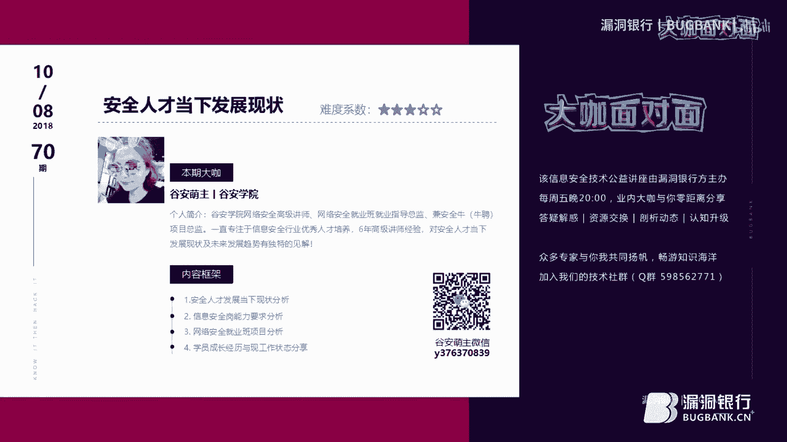
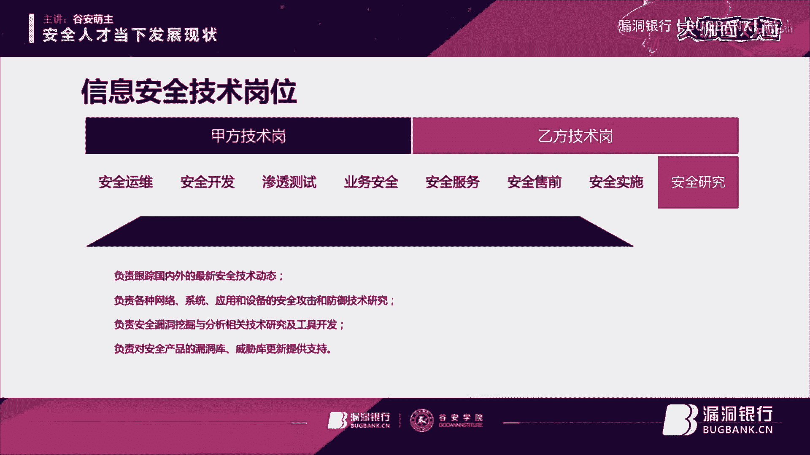
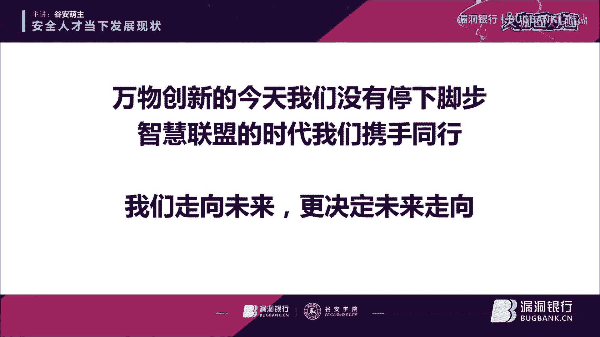
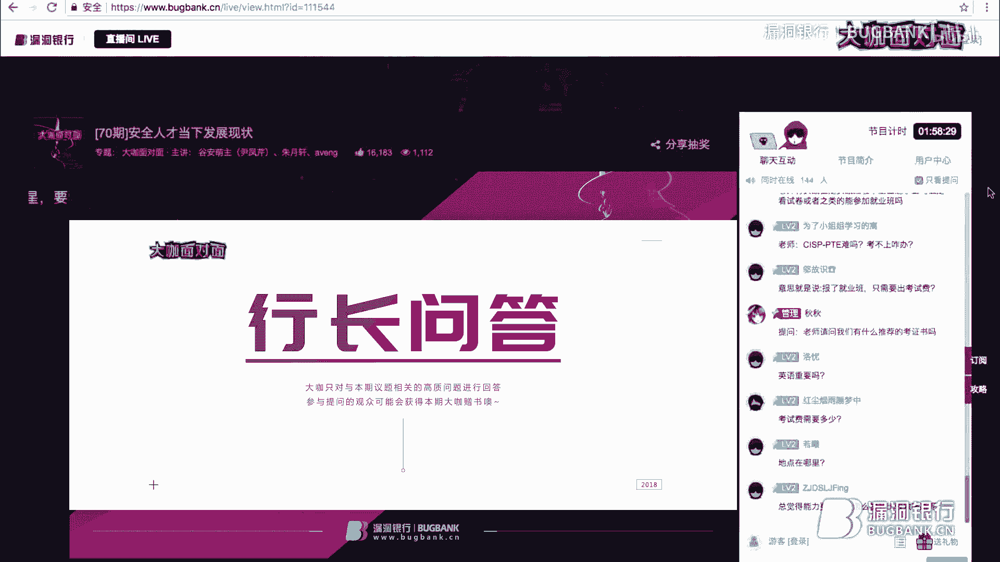
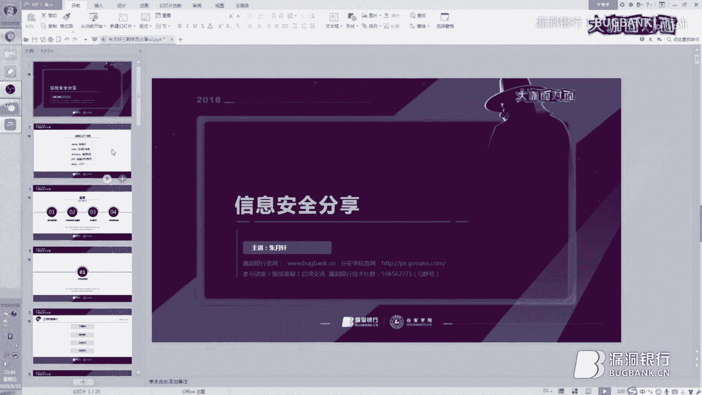
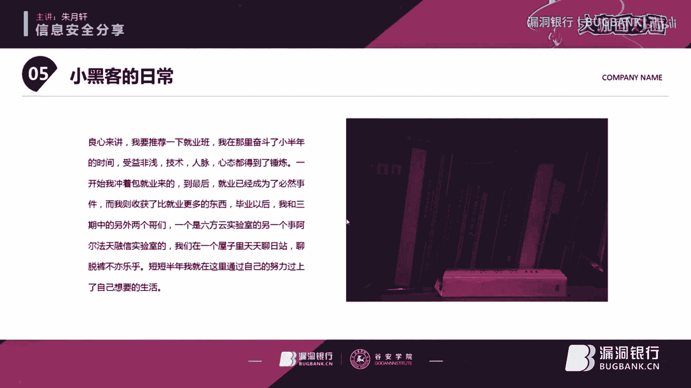
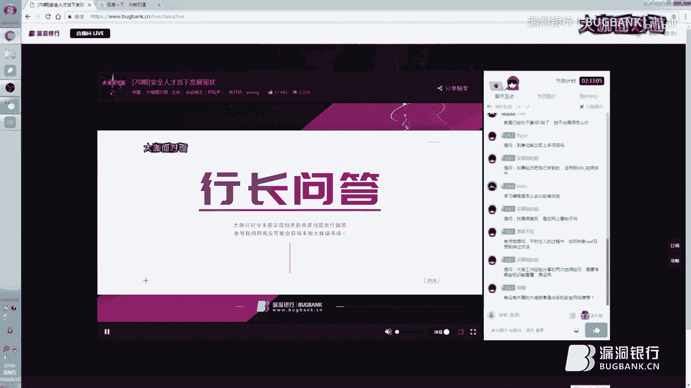
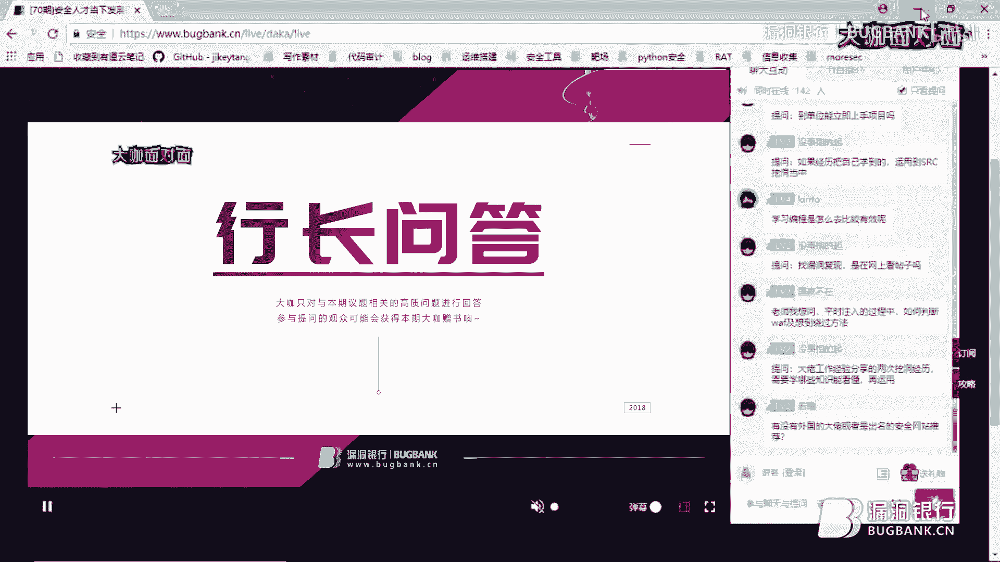
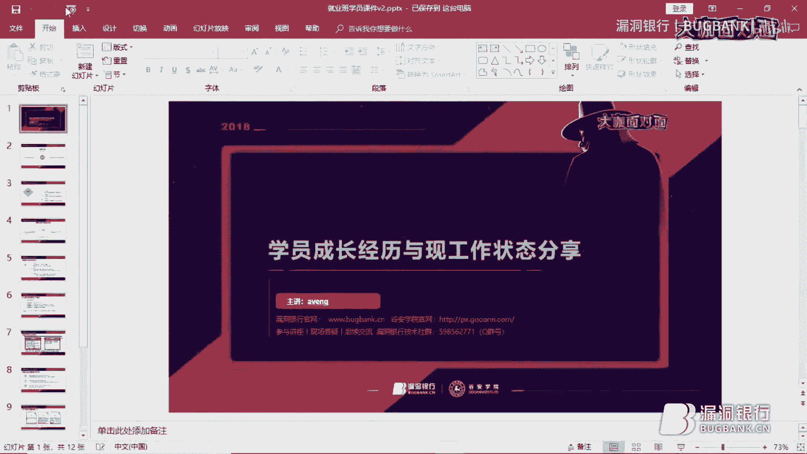
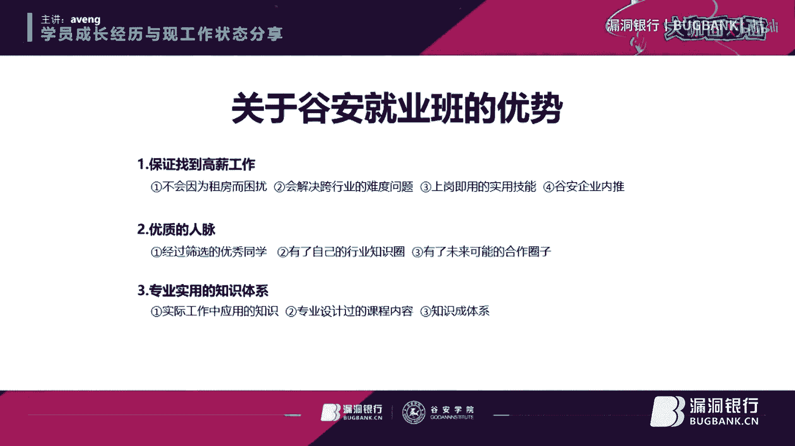

# 课程P1：安全人才发展现状与就业指南 🎯

在本节课中，我们将一起探讨当前网络安全行业的人才发展现状、企业岗位要求、技术能力模型以及一条清晰的职业发展路径。课程内容基于行业资深讲师的分享，旨在为即将毕业的大学生、希望转行的从业者以及对安全行业感兴趣的初学者提供一份实用的指南。

---

## 第一部分：安全行业发展现状与人才困境 🔍

上一节我们介绍了课程的整体框架，本节中我们来看看当前安全行业面临的核心问题：人才供需的严重失衡。

从企业角度来看，目前安全行业普遍面临“高薪难求一将”的尴尬局面。许多公司愿意提供月薪2万至4万的高薪，却难以招聘到符合岗位要求的合适人才。每天筛选上百份简历，可能都找不到一个匹配的人选，即使有幸招到，也可能在短期内流失。

然而，从人才供给的角度看，情况似乎并非如此。自2000年以来，国内众多高校已陆续开设信息安全专业。据统计，2018年高校毕业生达到820万，其中信息安全相关专业的毕业生约有127万。那么，这些毕业生都去哪里了？为什么企业依然感觉人才稀缺？

这种现象的根本原因，在于**学校课程体系与市场实际需求之间存在脱节**。许多高校的课程偏重理论，缺乏一线实战项目的训练，导致毕业生无法立即胜任企业岗位。而那些通过自学掌握了实战技能的学生，则更容易脱颖而出。

---

## 第二部分：安全公司的岗位要求与用人标准 📋

上一节我们分析了人才市场的结构性矛盾，本节中我们来看看企业究竟需要什么样的人才。

对于应届毕业生或工作1-3年的初级从业者，安全公司看重的核心并非顶尖的技术实力，而是**潜力、学习能力和工作态度**。企业明白新人无法立刻独当一面，因此更愿意培养那些展现出强烈学习意愿、优秀执行力和良好综合素质的候选人。

一个典型的例子是，有学员在进入公司一年后便晋升为项目经理，其成功的关键在于持续的学习和积极的态度。

对于拥有3-8年经验的中高级技术人才，要求则转向更深厚的专业技术积累、项目经验和一定的架构或管理能力。

以下是安全公司技术岗位的主要分类：

*   **甲方技术岗**（企业自身的安全团队）：
    *   **安全运维**：负责应用系统、数据库、主机及安全产品的日常维护、安全检查和应急响应。
    *   **安全开发**：负责安全架构设计、安全防护组件开发及测试。
    *   **渗透测试**：通过模拟黑客攻击，评估系统安全性并挖掘漏洞。
    *   **业务安全**：深入理解公司产品与业务逻辑，从安全角度保障用户体验和业务稳定。

*   **乙方技术岗**（安全产品/服务提供商）：
    *   **安全服务工程师**：综合性强，负责风险评估、安全加固、漏洞扫描、应急响应及报告撰写，需要良好的技术能力和沟通技巧。
    *   **安全售前工程师**：为销售提供技术支持，向客户讲解产品、解决方案，参与投标方案制定。
    *   **安全实施工程师**：负责产品的部署、调试和对客户的培训。
    *   **安全研究员**：专注于前沿安全技术、漏洞机理和攻防技术的研究。

---

## 第三部分：技术岗位的核心能力模型与职业路径 🗺️

了解了岗位分类后，我们需要明确胜任这些岗位需要掌握哪些核心技能，以及未来的职业发展方向。

一个合格的安全技术人才，其专业技能通常涵盖以下几个层面：

1.  **基础设施**：精通网络协议、操作系统（尤其是Linux）、虚拟化与云计算技术。
2.  **应用系统**：掌握Web应用、移动应用、业务系统的安全原理与防护技术。
3.  **攻防技术**：熟悉渗透测试、漏洞挖掘、逆向工程、恶意代码分析等。
4.  **安全产品**：了解主流安全产品（如防火墙、IDS/IPS、WAF）的原理与配置。

关于职业发展路径，可以根据个人兴趣和特长进行规划，主要有三个方向：

*   **服务/产品化方向**：向**安全产品经理**或**安全架构师**发展。需要具备产品思维、市场洞察力和技术架构能力。
    *   `发展路径：技术工程师 -> 高级工程师 -> 产品经理/架构师`
*   **专业技术研究方向**：深耕某一技术领域，向**安全分析师**或**高级安全研究员**发展。需要极强的钻研精神和持续学习能力。
    *   `发展路径：初级研究员 -> 中级研究员 -> 高级研究员/专家`
*   **管理+技术方向**：走技术管理路线，向**安全经理**、**安全总监**或**安全顾问**发展。需要技术功底、团队管理能力和战略视野。
    *   `发展路径：技术骨干 -> 团队负责人 -> 部门经理/总监`

此外，考取行业认可的**安全认证**（如CISSP、CISP、PTS等）是职业发展的“加分项”和“敲门砖”，尤其在国企、央企及大型互联网公司中备受重视。

---

## 第四部分：网络安全就业班——从学习到高薪就业的桥梁 🌉

对于许多希望系统学习、快速入行的朋友，专业的就业培训是一条高效的路径。本节将介绍一个典型的网络安全就业班模式。

该就业班旨在弥合学校教育与市场需求之间的差距，其核心特点是：

*   **严格筛选**：通过基础测试、技术电话面试和综合远程面试三轮考核，确保学员具备基本的学习能力和态度。
*   **项目驱动教学**：课程体系围绕**安全服务**、**安全运维**和**渗透测试**三大实战项目构建，由具备一线经验的企业讲师授课。
*   **保障就业**：采用“先就业，后付款”模式，与学员签订协议，保证年薪10万（一线城市）或8万（二线城市）起步。
*   **企业合作紧密**：与众多知名安全企业（如绿盟、启明星辰、天融信、360等）建立合作，定期举办“双选会”，为学员提供内推机会。
*   **赠送权威认证**：优秀学员可获得价值上万元的CISP、PTS、CSM等认证培训及考试名额。

培训周期通常为3个月的全日制封闭学习，学习强度大，但收获显著。许多非科班出身的学员通过此类培训，成功转型并获得了理想的薪资和工作平台。

---

## 学员心得分享：从零开始的实战之路 💪

本节中，我们通过两位成功转型的学员经历，来看看如何从零基础踏入安全行业。

**学员A（朱月轩，材料专业转行，现任安全分析师）：**
*   **学习心得**：兴趣是最好的老师。他将学习安全技术比作“打通任督二脉”，通过复现漏洞获得巨大成就感。他强调**自学能力和情报收集能力**至关重要，大佬不会手把手教学，需要自己“像黑客一样思考和实践”。
*   **方法总结**：遵循 **`学习 -> 实践 -> 总结 -> 反思`** 的循环。例如，学习一个Weblogic漏洞，就去搭建环境复现，无论成功与否都写下总结，从而掌握Docker、中间件、反序列化等一连串知识。
*   **工作内容**：介绍了安全分析工程师的日常工作，包括需求沟通、系统部署、安全事件分析（如检测MS17-010后门、挖矿木马）和报告撰写。

**学员B（Aventnge，动物医学专业转行，现任安全服务工程师）：**
*   **转行心路**：凭借对安全的“执念”和勇气跨行。他指出了自学容易陷入的三大陷阱：1）课程体系不完整；2）资源质量参差不齐；3）沦为“资料收集癖”。他强调建立**系统化知识框架**是高效自学的前提。
*   **面试建议**：面试不是被动答题，而要**主动展示**自己的技能、学习能力和项目经验。对于技术暂时不足的求职者，应重点展现学习潜力和踏实的态度。
*   **职业规划**：提醒新人不要将自己局限为“渗透测试工具人”。安全服务涵盖很广（咨询、等保、风险评估等），应**在工作中多接触、多思考，逐步明确并规划自己的发展方向**。

---

## 总结与展望 🚀

本节课中，我们一起学习了当前网络安全行业的人才现状、企业用人标准、核心技术能力要求以及清晰的职业发展路径。我们了解到，这个行业既充满机遇（高薪、缺口大），也充满挑战（要求持续学习、实战能力强）。

对于有志于进入安全行业的朋友，我们的建议是：
1.  **评估自身**：明确兴趣所在，客观评估自己的基础和学习能力。
2.  **系统学习**：无论是自学还是参加培训，务必建立系统化的知识体系，避免碎片化学习。
3.  **重视实战**：多动手复现漏洞、参与CTF比赛、尝试在合规平台进行实战测试。
4.  **规划路径**：结合自身性格和技能，尽早思考技术、管理或复合型的发展方向。
5.  **保持热情**：网络安全技术迭代迅速，唯有保持好奇心和持续学习的热情，才能在这个行业走得更远。

安全行业的未来充满无限可能，期待大家都能找到属于自己的舞台，成为守护网络空间安全的重要力量。