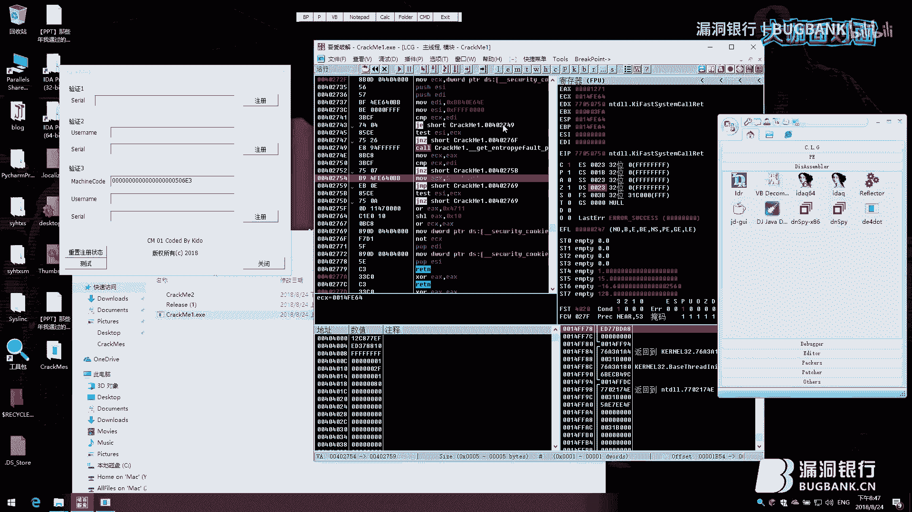
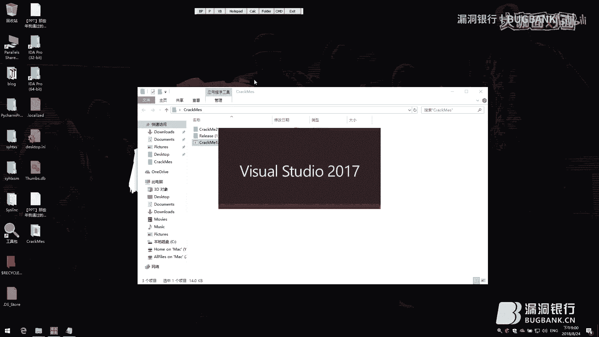

# P1：71期丨那些年我遇到过的软件保护-Kido - 漏洞银行BUGBANK - BV1Ft411f794

为知识而成，因技术而生，小本友晚上好，欢迎参加第71期漏洞银行安全技术直播大咖面个面。我主持人秋秋。今晚我们请来了有多年二进制逆向研究经验大咖kido，相信日差人都不会陌生。

他是5爱破解软件安全大区版主，曾在多个逆向培训课程中担任讲师。他还参与过5I破解多届quickme大赛与教程大赛出题评审。😊，kito已经好久没做类次的公作开分享啦。那今天能把请出山。

也是非常荣幸的事情。今晚kito为我们分享主题为那些年我遇过的软件保护。他会总结他所了解的软件保护相关知识。那今晚是不要错过，感天趣调票最后哦，那家看演讲结束后呢，还会互动问答环节。

观众们可以在看直播的过程中在聊天区提问，希望大咖会在问答环节为您一解答问答结束后，他他会选出一名幸运观众赠予书籍加密解密第四版。那这本书是看雪论坛时隔多年或在本发售的，很期待今晚学会信员哦。好了。

那下面就请kido大咖看今天分享吧。好，谢谢学。那个大家好，我是kido。今天就是来给大家做一个分享，也感谢漏洞银行为我们提供这样一个平台。那个分享的题目呢就是叫这个那些年我遇到过的软件保护。

题目可能讲的比较大然后今天分享的也都是一些我实际经历过的啊。如果有讲的不好的地方，还希望大家包涵。😊，好。那么今天这个主题呢，实际上主要还是讲软件保护方面的。然后给大家看一下我的大概的内容目录。

哦，对，在讲内容目录之前先跟大家介绍一下吧。这个我的小组sST team啊，现场看这个我的直播的应该也有我们小组成员这个感谢来捧场。好，讲一下我的这个目录。这个目录呢其实非常简单。

今天主要在这个两个方面讲，一个是软件注册方面，一个是软件破解方面，其实都是会讲到就是关于保护和对抗两个方面的内容呃。那我下面就直接开始了。首先那个今天讲的内容呢就是。叫做呃软件保护。

那么软件保护呢就不得不提到一个问题，就是什么是软件，或者说什么是程序。那程序呢。就是说啊以某种编程语言编写运行于某种目标结构体系上的命令。这个是我从百度上抄的啊，就是比较官方的一个回答。

那这里面有几个关键词，就是第一个是程序设计语言，第二个是这个结构架构体系，实际上应该说是啊这个语言方面呢，你像这个C sharpjavaPHPGS这种啊，包括说我们底层一点的语言汇编啊之类的。

这个都是说这个设计语言。体系呢你像这个叉86arm还有mps等等啊，类似于这些。那么。实际上一个软件我们要讲程序的话，首先要讲到整个程序的设计流程。呃，大学里可能大家也都会学到过。

或者是说从通过其他途径了解过。呃，我们在编写一个程序的时候，通常是用高级语言来编写，然后由编译器编译程这个。机器所能识别的机器语言。组装和电脑的朋友应该知道，我们的电脑基本上是最核心的部件啊。

有这么几个内存硬盘CPU啊啊，当然主板这些也都有啊。那么这里就要讲到这个CPUCPU它其实是一个电路板，对吧？那大家都知道电路呢它其实只能识别两个状态，一个是开，一个是关，也就是所谓的零和一。

那么其实机器也只能识别这些，包括我们说可能跑一些脚本型语言啊，实际上它的底层都是说传给CPU去实现这方面的。

只是一个简单的小科普啊。好，那给大家看一下这个图，这个图是我从OD里面随便截的，有认识OD的可能会知道啊，一会儿会为大家展示相关的内容啊。那么程序在被这个是windows下的一个程序啊。

程序在被载入到系统内存进行执行的时候，它首上有这么几个左边这一行呢是地址，对吧？就是它会被载到地址。这个当前进程进程内存空间里的哪个地址，中间这行什么558BEC啊，这一行，这都是那个机器。

机器码就是CPU所能识别的。右边这行呢是这个所谓的伪代码或者汇编代码。就是说我们人可能呃住记服吧，算是。55代表着pushEBP8BEC代表着这个有人可能说这个我有点看不懂是吧？这个没关系。

那个一会儿我们会具体实际讲一下，现在只是讲一下大概的序啊。

那第二点呢就是说什么叫win3二程序。提到这个问题呢，是因为今天我的这个分享主要还是讲一下win32方面的，也是比较熟，也是比较方便的啊。那什么是win3win32的程序呢？

就是运行于windows32是吧，win32系统下的一个程序，或者wins2子系统下的一个程序。那么这个程序一定是符合PE结构的文件。PE结构呢是这个portable。怎么说来着？可移动执行文件对吧？

嗯，可执行的一个文件，它大概的结构是这个样子的。这个这里只是大概一个展示，到时候我会给大家演示一下。还有就是wins32程序的启动过程，它启动过程其实很简单。你像你在windows下好。

我们在windows下双击打开任何一个程序。例如说这个啊，那首先我们的windows整个桌面进程叫explorore点EX1。就是这个，那么它会识别你双击点了哪个程序。然后发现是EXE的话。

他会交给系统来处理。系统检查说哦这个文件它存在啊，并且这个文件它是EXE格式的，是吧？它符合我们刚才说的这个PE的这个结构。好，那就把它加载起来，加载到内存中，然后进行其他的一些初始化操作。

包括执行啊方面的。那下一个就是讲这个为什么我们需要软件保护啊，需要软件保护的理由其实有很多啊啊，例如说这个我们希望自己的付出可以得到回报啊，这个就是说我写了一个软件，我感觉这个软件非常有用。它的功能啊。

可能是市面上比较急缺的那我想把它卖一个钱。卖钱的话，我不能免费放出去。放出去之后，他们可以随意传播发放。所以这个这个时候呢。

我们就可能需要软件注册的保护来保证只有我们授权过的合法用户才可以使用我们的软件。第二点呢就是不希望自己的劳动成果被别人盗用。具体具体下来呢，就是说例如说对某个问题，我们有一个解法。

我们写了一个程序来对它呃进行这个解析，对某个问题进行处理。那这个时候呢，可能说是有其他人也有这方面的需求。但是你不想让他们看到你的具体实现啊，也可以说是软件保护的一部分。

就是保护你代码不被别人轻易的识别出来他的流工作流程是什么样的。那么下一个呢就是说想挑战一下自己软件的安全性了啊，就是说我做了一个软件可能没什么用啊。

但是我就想让你知道我做保护做的有多厉害啊啊其实讲到这里呢，想给大家分享一下一个我当时算是大学的时候吧，了解的一个东西呃，当时呢我是在澳洲上学，然后同班呢也有这个新西兰的一些朋友。

我们在讨论这个军队的问题，因为当时也是闲的嘛，是吧，都喜欢到处讨论讨论军队的问题。然后他就告诉我说，新西兰没有没有军队，我说那你们不需要保护自己吗？然后他们看了我一眼，就说这个为什么需要保护。

我们是一个小岛国，总共也没有多少人，我们也没有矿啊，家里没有矿。这个为什么我们需要来保护呢？那如果说你的软件正是这种情况，就是没有什么太大价值，只是写着玩的话，那保护也不需要，对吧？

那如果说真的是说啊家里有矿啊，这个软件有一定的价值，你想要做保护的话，啊，也是可以了解一下这方面的内容。好，那下面呢就是我们的进入我们的正题，就是啊软件注册及对抗。软件注册方面呢。

我们首先这个讲一下一个软件要它的注册方法啊。举个例子。啊，刘说是这个我们这个随便举一个软件啊，这里头可能有需要这个。注册的地方，你看它这里需要注册，不然的话。

我这里有fourteen days remaining，对吧？我们这个还有14天的这个呃它就试用就到期了。这里就是一个简单的一个注册，你需要注册才能使用它的完整功能。

或者说你需要注册才能这个啊在试用期过期之后使用它。那这里呢我们从从浅入深讲，先讲一下这个简单色卡注册保护这方面。那什么叫简单算法注册保护呢？我们举一个例子，通过用户输入的用户名或者是机器信息等等信息啊。

经过算法计算出相应的序列号，然后程序判断你输入的序列号是否合法，就是是否和你输入的这些信息。是否和这些信息算出来的这个序列号是一致的啊，这个是最原始的那种做法啊。

所以我们这里列到这个简单算法注册保护方面。就例如说这个一会儿会有一个简单的1个CM来做。像第一行，这个就是我们输入一个序列号直接注册啊，第二行就是可能会复杂一点，输入一个用户名。

第三行就是他读了我的机器码，同时又读了我输入的用户名，然后把它和我输入的序列号进行比较，看看是否这个符合某种算法。那么对于一个简单的这个算法来讲啊。对于一个简单算法注册保护来讲，我们这里看一下这个例子。

就是这个东西。他是啊没有注册成功。这里我们测试啊，这个没有注册成功，没有注册成功，对吧？我们可以做的有几点。第一种呢是通过修改我们的关键指令。或者修改内存中的关键数据，使程序认为自己已经被注册。

因为如果我们有有这个方法去修改程序的执行流程的话，那么在他这里做这个判断啊，我是否被注册的时候啊，本来呢他会说我没有被注册。这个时候我们做一个啊我已经被注册了啊。这种方法。这种方法呢通常被叫做暴力破解。

也就是拍补丁的方法啊，那么第二种方法呢就是通过这个啊注入一个dell或者是通过加载器的方式。因为程序在读入你输入的，例如说用户名的时候啊，很多程序会把它算出合法的序列号。

这个常见于CTFCTF是你输入一个用户名，它会有有些程序啊会这个替你算出来序列号，然后直接要啊，比较你输入的那个序列号和那个序列号是否是相相同的。如果是相同的，他就让你说啊注册成功。

这个大家可能也比较有经验。这种方法呢，我们可以通过这个注入dell或或使用加载器的。方法啊在程序本身利用程序算出它的序列号的时候，把它读取并展示出来。这个方法呢也是比较传统，近些年也比较少见。

它叫这个内存注册机这种方法，或者英文叫snier，对吧？这个很容易理解。呃，序列号修弹器啊。那么第三种方法呢，就是需要花费一定的时间。这个我们把程序通过各种方式分析它的算法，还原程序本身注册使用的算法。

自己实现该算法啊，写一个程序，也就是写一个注册机算法注册机K generator K啊。那第三种方法呢，相对来说是呃比较耗时的。因为它需要你去一直判断程序。呃。

程序是怎么样来注册我这个的程序是怎么来算的啊。包括我们做CTF的时候，有时候也会遇到第三种这种啊，他会给你一个输入，说可以输入用户名，然后输入序列号，他来判断是否合法。然后最后提交flag的时候。

他会告诉你啊，你必须提交一个是某某某用户名合法的flag然后提交上去之后，他就说啊注册成功。这个我记得前段时间金融那个比赛吧。

好像有个大佬拿了一个CM给我那个CM其实是属于这个第二种可以用内存注册机来做的啊，他的内存中会直接算出来那个啊那个东西，然后还有另外1个CM应该是属于需要写算法注册机方面的这个到时候再了解吧。

那么讲完了刚才说的这个简单算法注册保护之后呢，要给大家讲一下这个复杂算法注册保护，现在都是给大家做一些概念性的介绍啊，具体的操作一会再来复杂算法注册保护呢，它有几个很明显的特点啊。复杂算法。

我们这里把它和上一个简单算法做区分，就是简单算法在算法被。别人或者是被破解者。完全还原出来之后，我们是可以直接写一个注册机的。那么复载算法通常来说都是由这个会内置一套IC公钥或者是ECCC的公钥等等啊。

就是PKI体系这个公钥认证。由这个非对称算法来来保证它的这个。序列号的安全啊。然后我们输入的序列号信息之内一般包含啊这个。私钥对这个序列号其他信息的一个签名。就是然后大家如果了解过IC相关方面的知识。

应该会知道私钥和公钥通常来说都是一对一的。一对一的情况下，私钥打出来的签名，公钥是可以识别的，其他人是无法伪造的，这个是我们这个。一个概念性的东西。那序列号之中呢通常也会。

绑定这个硬件码或者用户名等等啊，就是把用用硬件码，用户名等等东西压缩起来，然后用私要给他打一个签名，然后传递给他。像我刚才给大家看到的这款呃红色的这个小程序啊，reflectctor它其实就是这样做的。

它在注册的流程。是这里我们会输入一个序列号，然后他会去网上去找这个序列号，有没有注册。如果没有注册的话，他会本地发一个request，就是说你需要对这个东西进行签名，把把这个签名带回来。

我判断是否是正确的，如果是正确的签名的话，那我就给他通过还是用的这个叫复杂算法保护这一套的东西。那么其实还包括一些其他的东西，例如说是注册信息分段校验啊，注册信息分段校验实际上是一个很有意思的东西。

这个我首次见到它是在0几年一个视频录像软件的注册算法上面。然后它是这样的，你输入的序列号，它不判断长度，他只判断大于某个长度就好了啊。在你点注册按钮的时候，他只判断那个序列号前半部分是否合法。如果合法。

他就给你通过了。但是呢在它正常运行做一些功能性操作的时候，它会校验这个序列号的后半部分是否合法，就他把它分成两个部分来校验了啊，这个就是比较贱啊，这个东西我们一般叫它叫暗装啊，就是。

也增加了我们分析这个程序注册算法的一些难度。就是明明你这边这个成功了，但是它就是跑的时候就会出错。不知道为什么啊，那下一个就是运行式校验。就是说我们程序的运行过程中啊，还会多次这个对序列号进行校验。

在不同的位置用不同的，甚至说用不同的算法对这个序列号进行校验。这些都是一些增加我们刚才的那个呃分析难度，或者增加我们的这个序列号的复杂度的一个一些做法啊。那么其实如果说我们要绕过这个复杂注册算法的话。

也很简单。首先也是这个暴力破解的方式。打补丁的方式在程序执行到他来判断啊，我是否已经注册了。然后你就修改流程告诉他，你已经注册了，然后程序就相信了，他就正确的执行下去了，对吧？就是爆破是万能的啊。

第二个呢就是说使用补丁的方式啊，修改掉目标软件内置的这个公钥使用自己的密钥对，或者是说啊强行跑出啊，因为公钥有些在算法强度不高的时候，是可以直接跑出它的私钥的啊，跑出它的私钥。

然后通过他的那些算法来实现一道K点。这个一会会有例子给大家简单看一下啊。那么在基于PKI体系的这个算法来说的话。在这种复杂算法注册的情况下啊，除非目标的次要泄漏，或者是你把它跑出来了。

不然你是一定要对它的文件做修改的。不修改的话，它是不可能存在的。对它的文件做修改，或者在内存中对它的运行内存做修改等等。不然补丁的使用就是无可避免的。那下面给大家简单介绍一下，这个是呃近些年比较流行的。

其实算是就是网络加密，包括说是传统一点的这个硬件加密。硬件加密其实就是加密狗啊，其实包括银行的U盾啊等等，都属于这方面的啊。我们来介绍一下网络加密和硬件加密。其实网络加密和硬件加密呢就是是一样的东西啊。

只是说这个呃位置不一样，一个在网络端，一个在硬件加密口里啊，那么通常它的流程是这样的，程序在。真正执行具体功能，或者是在实现注册之前，它首先要检测一下啊远程服务器是否存在，或者说这个加密狗是否存在。

就是我们在这边统称它为远程端，远程端是否存在。存在的话，那你输入的这个程序的基本信息，你之前的注册信息是否是合法的。例如说这个用户名和密码是否匹配啊，或者说加密狗里面内置的那个密码是否对啊。

那么针对这个方面来讲呢，早期的加啊也不算太早期了啊，加密狗，包括现在的网络的执行方式啊，除去刚才我们说的那个啊简单比对一下用户是否存在。因为简单比对一下用户是否存在，听起来简单了一些啊，这个除去它之外。

通常呢还会有一些呃把程序中的关键数据。例如说我们。呃，某一个程序里的呃关键的代码。啊，也不算代码了，关键的静态数据啊，它需要一个文件把它放到远程端，并且在程序开始执行的时候。

或者是说执行到需要这些数据的时候，从远程端把它下载下载回来，放在内存里也好啊，放在本地文件里也好啊，然后保证程序没有缺失这些关键数据，这些应该说是静态数据吧啊，来保证它的正常执行。

那下一个呢就是近两年才建的比较多的。以前很少见到的，就是把程序中关键部分代码剥离。放到远程端程序在每次需要进行这些运算的时候，都需要向远程服务器发起这个呃发起这个计算请求。说我这边需要算这个函数。

你帮我算一下啊。例如说MD5啊，我们一个程序里面频繁的用到MD5，我们把MD5函数呢写在服务端。然后在程序运行到这个地方，他需要算MD5的时候，他就会向服务器去发一个包请求啊，我要算MD5服务器。

把结果返回给他啊。那这种情况其实也是近些年才比较常见的。因为以前大家的网络环境啊啊就是带宽啊、网速啊都不是很理想啊，近两年比较理想了，才有条件实现这些这个地方最开始是都是在加密狗比较常见。

因为加密狗呃高级一点的，像深思啊或者其他的加密狗里面，它会它可以做到就是你把算法烧录进去，它替你进行计算。然后整个程序的代码是不会被暴露出来，不可以导出的，保证了那个算法只存在于这个加密狗里。

那么对于他的破解方法呢，其实也是啊大家想一想也知道。第一点肯定和我们刚才那两个一样，就是暴力破解。啊，就是如果说程序不需要这个呃并没有远程执行的情况下，程序只判断了这个是否存在啊，是否可以用。

那我们这个时候只需要修改程序流程就就可以了。第二个呢就是对程序和远程端之间的通讯进行模拟啊，例如说这个。我们本身程序需要向一个服务器啊，百度点com对它进行通讯，检测自己的账号密码是否能通过。

那这个时候呢，我们通过这个网络劫持或者其他方法或者是修改程序内它的这个目标地址啊等等，让程序向我们自己搭建的服务器，或者是我们自己搭建的本地的一个程序去发送这些固定的这个呃登录包啊。

然后我们收到这个时候返回它正确的结果，这个就是模拟执行啊，把这个。正确的结果反而给他之后，程序就可以正确执行了。那么在程序。部分函数被抽取放到了远程服务器上。

并且你并不知道这个函数它是内部具体算法是什么样的时候，就是你无法模拟它的时候，我们可以有一个使用这个使用中转程序的方法。举举个例子，这边是一个我们的服务器server端。

这边是一个我们有一个正确账号密码啊，就是可以正常执行的一个白名单程序client C端。那么正常情况下，C和S端它是可以这个就客户端和服务端是可以正常这个进行沟通的，没有任何问题的啊。

那么这个时候我们这边出现了一个。算是被破解之后的一个客户端，非法客户端，客户端其他都正常执行。唯独到了需要运算某一个函数的时候，我们无法模拟。那这个时候呢我们可以这样。

将我们客户端所需要进行计算的这个函数的请求。发给我们的合法客户端，合法客户端肯定也是经过我们修改的，他可以接收这些请求，也可以往外发。在合法客户端接收到我们需要运算这个请求的时候，他去向服务器请求。

你帮我算一下我们我们的这组东西算完结果是什么。服务器一看啊，你是合法的那我就帮你算了吧。然后我们的非法客户端就正常进行执行了。这个叫这个其实就是常见于网络认证啊。

网络认证我这里提的网络认证是一个狭义上的网络认证，就是什么。呃，名字就不提了啊，名字就不提了，就是常用于外挂或者是其他东西的啊，这个是比较常见的。近些年的网络验证都必须有这个功能。

这个功能一般叫做高级API或者其他的，就是一个远程执行。然后你对它进行破解的，通常情况下方法就是就是这个。当然这个也是有其他绕过手段的啊。例如说在我们合法客户端启动的时候。

你绑定一些它本地的一些其他参与计算的元素。例如说他的进程ID啊等等啊，你把它提交到服务器上去。然后。这样我们重新画一下图。好，首先我们还是一样，这有一个服务器，这有一个合法客户端。

合法客户端在启动初始化的时候，登录的时候，把自己本地的进程ID提交的给了服务器。服务器是说啊，我知道了。好，那这个时候呢，我们这边也有了一个非法客户端。非法客户端在呃前面的过程都正常执行。

等他需要运算关键函数的时候，他说C，你帮我转发一下吧，他转发给了服务器。服务器接收到这个运算的时候，他并没有说以非法客户端提交的参数提交的进程ID来参与运算。

他以他最开始保存的这个合法客户端的来参与运算。那么服务器返回的结果也只能由合法客户端才可以使用，他哪怕转回了非法客户端，非法客户端对拿到它也是没有任何用处的。因为结果运算结果并不对，对吧？

那类似于这样一个流程。这个就没有什么例子了，因为这个网络认证比较难搭啊。那这个时候呢，我们通过前面这些简短的介绍啊，大家可以知道这个在这个程序远程执行的情况啊，代码抽离的情况。如果说你抽离的那部分代码。

是别人无法通过这个简单的运算啊，或者说哦我知道了，他就是个MD5啊，无法猜出来，无法被模拟的情况下。并且呢你的远端非常安全，没有被入侵，没有被破解啊，这种情况下，程序是不可能被彻底破解的。

只能说是部分函数可能能正常执行。那么到了某些关键需要这些运算的时候，他是无法被破解的这个也是我比较推崇的一个做法啊。最近有朋友写了写了一个软件，天天被人扑，还天天更新加密算法。我说你就这么做嘛，是吧？

把代码抽出来，放到远程去做，放到服务器上去做。也是我这两年有人问我该怎么做，我都是这么回答的啊，安全性比较高。那下一个呢叫这个复杂系统注册保护。说到复杂系统注册保护呢，我们可以看啊，上面我们都叫算法。

算法加密加密。那这里讲到了一个系统，其实很简单了，这个复杂系统注册保护就是把上面所有。难一点的东西全合在一起，网络验证也可以加进来，硬件加密也可以加进来，复杂算法也可以加进来。

甚至其他东西也可以加进来啊。那提到这个复杂系统注册保护呢，我们不得不提一个词叫壳。有些人可能比较熟悉，有些人可能啊没有听过，就是壳这个东西。那么壳是什么呢？壳是。

我们英文叫pecker或者是protector，就是压缩者或者是保护者啊。讲到壳呢就不得不提一下壳的分类和壳的历史。壳历史其实很很久了，好像9几年八几年就有了吧。当时是他的需求是这样的啊，我们有个程序。

当时的网络条件都不是很好，大家这个流量都很贵。那我有一个程序，我写完了啊，12兆20兆。我想发给他，通过网络去发，就感觉非常不方便，因为太大了，下都要下半天，对吧？那这个时候呢。

我们就有了这个需要压缩啊，但因为当时呢可能说是ZIP啊或者IR大家装的都不是特别多，就这个压缩器及压缩器，大家都不是很习惯用。那么也有这个壳可以把我们整个程序的代码进行压缩。那程序执行的过程中呢。

是这样啊。加了壳的程序执行是首先程序被加了壳的程序被系统载入。载入之后呢，首先执行壳段代码，把自己解压出来，解压到内存空间中，然后再去执行这个我们正常的程序的代码啊。

这个其实有做病毒分析的同学可能一听也知道啊，这个很类似于病毒的做法啊。首先我执行一段病毒程序啊，感染被感染了的病毒程序。执行完之后，你再去爱干嘛干嘛去。我就已经做完我该做的，我去感染其他人去了等等啊。

那么刚才说是简单的介绍了一下这个压缩壳的历史。后面也要讲一下这个关于加密壳方面啊，加密壳其实这个。很多啊VMPVM protectci engine等等啊，这个东西呃大家可以。在这里查看一下。

像这里面这个关于er方面，就是所有壳的地方，这些都是比较老的ASpro啊，codeizer这个其实并不算是一个壳啊，这个只是一个代码虚拟化。这个我们一会会提到。

包括P compact这都是很老的壳了PEP en protector啊TEPTMD。VMP等等啊，这些都是这个我们比较呃比较常见的一些壳，包括z protect啊等等。这是我入门的第一款壳ZP。好。

这些都是说这个比较常见。那么加密壳会做什么呢？在程序运行之前我们都知道啊，我刚才讲了，它会执行核断的代码，可断代码会对程序运行前的环境做一个检测啊，我是否正确的被执行，也会做一个校验啊。

有没有其他人过来啊对我做修改，有没有其他人过来搞我啊。那么同时呢经常还会包含这个程序注册机制。就是说你不需要自己去实现我们刚才说的那个复杂注册算法，或者说简单注册算法这些东西了，是有可断代码来帮你实现。

就是别人替你写好的，放在这里。也就是省去我们大量的这个保护方面的开发时间。这个主要是做程序保护的产品啊。那包括说在程序运行时，你也可以去调用一些壳代码给你提供的一些接口来检测啊，是我是否真正被注册了啊。

或者说你帮我实现一些其他的功能啊，你的壳是否还完整，程序是否被修改，程序是否被别人调试啊等等。那么对他的对抗呢，包括说对他详细点介绍都在下面啊，就是我们第二个讲的这个软件破解以及对抗方面的。软件破解呢。

我们这个了解过的人经常知道我们都会说静态分析、动态调试啊等等啊。这先提一下我们这个关于静态分析方面的。那接在分析方面呢，给大家介绍一下这个基本的信息分析工具啊。在这里面呢包括说这个啊在toth里面。

应该是P tos相关的这些。哎，这些都是我们的静态分析工具。

啊，给大家简单介绍几个吧，找我工具包，我工具包不是很全，这个大家不要介意啊。例如说我们刚才最开始提到的这个PE文件结构。这个有没们有starPE来把文件拉进来。好，这个就是这个程序的P结构。

它的入口点在哪？它的导入表啊，它的区段有哪些啊？这个大家如果感兴趣的话，可以事后去搜一些相关的教程啊，来来来了解，包括它的资源啊都在这里。我只是简单给大家介绍一下啊，这个导入表啊啊导出表啊。

包括它的这个。他的这个海点头，他的dos头。Optional header。这也是一个便于我们能这个比较方便的查看哦，说你哦你这个程序啊什么都没有依赖，或者你这个程序依赖了。可能这个d尔等等等等啊。

这个在具体分析中会用到它。那包括说我们其他的分析程序也有像这个DIE64，或者是以前大家比较喜欢用的PID等等。我们可以检测啊哦，这个程序是VC加加编的，并且它是VC加加14。

15这个版本的链接器来链接的。它是1个32位的程序啊。或者说我们一些加了壳的程序，可以用它来分析说是哦这个程序是用某某某某壳来进行保护的。

啊，这个就是我们的这个程序基本信息分析。在这个真正去分析一个程序之前，你首先要知道他是干什么的，就知己知彼方能百战百胜，对吧？你首先需要了解它的基础信息。那么在了解完它的基础信息之后呢。

我们就可以真正的对它进行啊分析了。就是我们这里讲的代码分析工具，主要呢来也是这个呃静态分析工具。

我们来看一下。静态分析工具里大家比较常见的这个IDAIDA是一款非常强大的静态分析工具，甚至它也可以动态调试，但是我用不太习惯而已啊。

因为大佬会比较喜欢用它包括我们这里的这个comp这个一听名字很明显啊，它是对这个VB写的程序进行反编译的包括我们这个Djavacomp对吧？对java的程序的程序啊，这个对点平台下的程序进行分析的。

都是一些比较常见的工具啊。我们看一下，大概看一下IDA的界面吧，我也不知道能不能打开，应该可以。啊。我们把程序拖进来。

对他进行一个静态分析。这里应该有个文，应该程序这里就非常方便了，帮帮我们分析出来了啊，这个程序一开始它是从这里进行执行的对吧？啊，从这个应该是从star开始执行的，实际上是从这里开始进行执行的。

然后包括程序它的执行流转都是什么样的？包括这里我们可以把这个机器码让它显示出来啊，这个程序的机器码是什么样子的？关于这些汇编语句都是什么意思呢？一会儿我会给大家简单提一下。

包括说甚至idDA还有这个流程图的方式啊，我们可以去一下关键的函数，就是我看一下啊。到了方婶这里。这个是我写的程序，这里是这个所有关于窗口事件的处理啊，大家可以看啊，这里首先进行判断它是是不是窗口事件。

是的话，它是哪个事件，是哪个按钮触发的，进行一些什么样的操作？然后包括IDA还有一个非常强大的叫F5插件啊，直接根据返还成这个C语言的伪代码。这是这个其实就是我的实现流程。你看这个很简单，我这里啊。啊。

可简单看一下吧。如果说是这个按钮，并且是左键的话。我检检测这个只是否真，失真的话就说你已经注册了，否则的话就说啊你还没有注册，这个就是一个全局变量啊。

这个代这个代码应该是在。对于他来讲，应该是在这个位置，是是他。检测。这些都是一些我们的静态分析工具，包括说我们的dpy，这个一会儿给大家讲一下啊。

JDGUI这些等大家用到的时候就可以自己相关去了解一下啊。

那么说有我们有这么强大的这个代码分析工具呢，同时也要对他做一些对抗，对吧？就是说如何去对抗它啊，我们有这个代码变形的方法，代码变形的方法，我们具体使用这个使用一下我们的OD来给大家讲一下啊。

Yeah。

F。哎呦，差点了差点蓝屏了，我的OD有点问题。在这个虚拟机环境下有点问题。有我婆姐的。

我嗯，等待重启吧。

这个strD在这个win10的新环境下有有点问题，会容易蓝屏啊，不管它这个代码变形。

我们举个简单例子啊，原本的代码是一句简单的。木屋。EAX。一好，我们将一这个值付给这个东西付给这个EX啊，具体是什么意思呢？大家可以理解为啊，我们给一个变量负值，使它的值变为一。那么我可以变形成什么呢？

我们先给一个其他无关的变量负值为一，然后再把这个无关的变量，不影响运算的这个变量的值复回来。这个是属于一个简单的一个呃，算是膨胀方面的吧啊，变形呢其实也有更深一点的这个。一点东西。

那下一个呢就是我们刚才说代码膨胀，像我刚才做的啊，这个关于具体的东西呢，大家可以去其他地方了解一下，包括代码化指令代码乱序。代码乱序就是在程序执行的过程中啊，我们会把这个程序执行的流程给它呃稍稍其实。

实际上来讲啊，流程是没有变的。但是在你分析的时候，你以为它变了啊，包括这个我们安卓上或者是IOS上常用的这个代码流程平坦化啊，把所有的这个分支代码全都合到一起平坦化。

下面就给大家简单介绍一下这个程序调试以及对象方面的程序调试工具。

他已经重启完了，我希望他不会死。我们调试的样本呢还是以刚才我们这个crme一以它来举例啊。好，起来了。稍等一下，我去把那个strongOD给他干掉。他这个。一。爽地的。D叉protect这个给他干掉。

把所有带驱动的都给他干掉。啊，这个jack给他干掉。好，差不多 on欧了 only machine。我的CE也给他干掉。这个这个灾区中的也给他干掉，因为我不知道这个系统。就现在的这个系统啊，它是这个。

究竟是什么原因才导致的他崩溃啊，我就拿这个来试一下。这个系统是我昨天刚装的一个虚拟虚拟环境，就是为了给大家演示一下这个。

哎，可以了，他可以正常跑了，就是为了漏洞银行刚刚装的啊，我们把这个CM拖起来啊。

还是举。什么。载入对头。好。这个就是我们一个比较常见的windows平台下的一个动态调试工具啊。这个是ODOD呢其实主要它的原因，我们用它的原因还是说它比较比较久吧。这个我们用的界面呢都比较习惯。

像以前的欧莱 ice啊什么的，它是有点有点那个意思啊，你像这个windybug，包括说啊有windybug，我我这边不知道装没装啊。啊，我哦装了。这个就是我们的windy bugg一样可以做调试。

一样可以做其他分析。这个是胖喜欢玩胖的大牛非常喜欢的一个工具。但是呢我就那个什么了啊，我就不是很不是很愿意用它，因为我毕竟不是一个玩胖的啊。

这边就是还是给大家介绍一下刚才那个啊。好，我们把下面的这个地方都给它注释掉这个。我们看一下啊这个。通常情况下，我们在介绍OD这款工具的时候，我们会介绍啊，说这个地方是这个代码执行窗口。

这个地方是寄存器窗口。左下角这个呢是内存窗口是吧？右下角这个呢是这个叫叫什么对战窗口啊，但是其实啊这三个全都是内存啊，左上角左下角和这个全都是内存窗口啊，因为程序执行的时候，其实我们可以了解啊，硬盘。

其实都不是必须的。它必须的只有两个，一个是CPU它需要CPU来进行执行相关的操作，一个就是内存，它需要把程序载入内存中。啊，通过内存传给我们的这个CPU来进行操作啊。那么关于CPU相关的。

其实就是我们这个寄存器，寄存器呢叫寄存器，临时存放东西的一个地方。这个东西是在我们CPU里啊，左边呢就是说我们的这个内存中相关的东西。那这个小黑杠在这里的意思呢，就是说。是什么呢？

就是说这个我们的程序当前执行到了这一句话，这是我们的OD非常聪明的把我们停在这里了啊。然后我们看一下这句话的意思啊，moveEXE它是它和那个linux下的汇编是不一样的。

这个是啊windows下的叫叫什么来？我也不记得了啊，这种汇编的格式啊，经过这句话之后，他会把一这个值付给EIXEX是我们寄存器中第一项这个EX这个值。我们看啊它现在是一串，我也不知道什么意思的。我们。

这个这个键叫单步，就是它只会执行这一步啊，在执行过这这一步之后，EX就变成了一。🤧嗯。好，那么我们要讲刚才我我写的那个实现，我们可以这样啊。故是一。泡谱。EX好，我们还原一下。

我们把EX改成一个其他的值啊，随便改成了一个。哎，居然还有内容啊，改成了一个其他的值。我们如果还想实现这个值，我们应该怎么样的啊？我们这个时候做了一个非常有意思的操作啊。

push一把一这个值压入到我们的对战中。至于关键的代码是什么意思呢？大家可以就是呃有不了解的朋友可以去这个其他地方学习一下，这里就不进行详解了啊。pushEX一压进来，压进来之后弹回EX对吧？

等等等等啊，就是各种各样的操作。那，这里也不是。太那个什么，主要给大家简单介绍一下这个这个工具线。具体的分析呢，一会儿再来啊。那这里有这个我们叫OD这个动态调试工具，同时有这个叉64Dbug。

包括我刚才展示的winDbug，这几个是windows平台下比较常见的。包括linux平台常见的像GDB，甚至说有人喜欢用这个啊IDA来进行调试，这都是可以理解的啊。然后程序调试的流程呢。

其实是这样的啊。我们这个给大家看一下。

啊。啊，就我这里也没写其他的，也写了一个简单的这个啊，给大家简单介绍一下啊。程序。首先我们这有一个调试器OD本身，我们说我们想调试crrack me1点EXE这个程序的时候。

它会向系统告知系统我想要调试这个这个crrack me一，然后系统检测能不能调能调能调好给你调给你调呢，他就把程序这个crrack me一起来了。这个时候你可以控制控制整个被调试程序。

这是crrack一1点EX。你可以控制他的执行状态。你可以让他暂停。你可以这个单步，但实际上单步的实现方法呢是这个比较复杂的啊，就是异常触发这个防线。调试器的最简单的原理就呃最不能说最简单吧。

最根本性的啊，他的做他所做的东西就是在我们被调试的这个程序执行到某个地方触发了异常的时候。那么这个时候呢，系统会接管这个异常。系统来判断你有没有被你有没有被被调试啊。他说有调试器是这个好。

那系统判断这个异常需不需要发发给我们的调试器。例如说我们的这个单步，单步其实也是由就是一步一一步来执行啊，这个其实也是由异常来实现的。

那有啊，那就把这个异常调试器可以处理的异常发给调试器。然后调试器说好，我要停在这里，那他就停在这里了。调试器说好，我决定放过他了，让他起来吧。哦，他就起来了。

对吧这是一个很简单的一个这个调试器的启调试启动的一个东西啊。具体的东西呢大家可以去搜索一下相关资料啊，这里只是简单做一个介绍。那么我们如何对抗调试呢？首先很简单啊。

我们可以通过系统提供的一些相关接口来判断程序是否被调试啊。例举个例子说是这个呃我们有一个叫啊。

is thebu present吧，应该是。依赖于我们伟大的百度啊。等等啊等等。大家可以去搜索相关资料。但是这个东西现在已经已经没有什么太大用处了。这个利用系统API来检测。

因为大部分的程序都有这个反反反反调试这方面的功能，就是说它不会被别人检测到啊。第二个呢就是比较猥琐的方法，也是很多很多都在用的，甚至有些病毒在检测安全软件的候也在这么做他检测的我们这个调试器的窗口信息。

还有内存特征码，例如说啊我这里写了一个程序，我程序本这个程序运行的时候来判断窗口名但凡存在破解个字，我就是被调试了，我自杀或者是我做的更恶心一点像某些病毒或者外挂我你的盘啊，这个我重启我改你的难改啊。

我改你的MBR等等等等信息啊一些猥琐的一些操作啊。那这个呢当然也是。

啊，基本上都是被处理掉了。像我就是我刚才被我干掉的那个蓝屏，是我蓝屏的那个strongOD啊，它是一个非常强大的插件，它会这个主动的strOD嘛，使OD更强，它会这个把整个窗体信息全都屏蔽起来。

让别人取不到你的这个OD的特征啊。

那么说这个内存特征码也是比较比较贱的一个操作，它会这个整个去搜索我们所有的内存空间啊。他打开所有他能打开的进程去搜索他们的内存是否符合某段特征码。如果这个并且这个特征码一定是这个调试器才有的啊。

如果存在这个特征码，我被调试了，或者有调试器存在，那它就退出啊下一个就是检测调试器的驱动符号之类的啊，我之前也发过一篇文章，就是说关于如何检测因为它虽然把bu进程隐藏了。但是它的驱动本身并没有隐藏啊。

它驱动会做一个改名，但是依旧能检测到啊，或者检测一些符号。这个常见于早期的那个叫什么oft等等啊。就是检测的是否存在。下一个就是程序执行行为检测。我们举个例子。嗯，我们还是回到这个这一句话啊。

CPU呢有一个非常有意思特权指令。RDTSC我们执行它一下，我们可可以看到EXCCED查变成291哈，我们再执行一个。😊，EDX的值改变了，我们再执行一下这个特权值列29B就是说我从。星号键。对。

我从这一句2A2变成了2A4，就是我这两个之执行这两句的时候，我能取到这个这是一个时间，你知道吧？然后你看啊我们这么做。首先我取第一个时间。好，取道在EDX2AF啊，然后我把它放进ECX里。好。

这时候ECX是这个RAAF了。然后呢，我这里在这个目录啊，我再我再执行一遍这个语句。好，又执行了。然后sED叉EC叉，我们使这个ED差的值减EC叉0乘F。好，就是说两个的时间差就已经被我们这个取出来了。

它是一个F大小的东西，对吧？那么既然其实CPU执行东西很快的。这么简单的4G为指令CPU执行起来，不可能有凌乘F这么多。它如果有凌乘F这么多的时间来做这个的话，肯定是证明我的程序执行异常。

我是被人调试了，对吧？就是利用这个时间检测，包括说这个window的指令叫get tick count。啊，这个是应该是没有被加载啊，就是取系统启动之后的毫秒数都可以来进行检测。

就是程序执行的行为的检测啊。下一个就是这个常见于游戏保护了啊，利用驱动来监管本身程序的中断使调试器接管不到我们这个包括说TP会做的一个利用驱动去修改内核的参数使这个在他之后，在这个我们这个驱动执行之后。

所有的调试器都起不来。改了一个标志位，所有调试器都失效啊。还有说我们这个双进程调试双进程调试的理解其实很有意思啊，就是通常在我们常见的平台，如说wind平台下一个进程X只能被一个调试器所调试。

那如果他自己先起来了，然后发现自己没有被调试。启动了另一个自而且是以调试的模式去启动的并且所有关键代码都在被调试的那个里面执行。你这个地方就是无法去直接分析他的行为了。也是一些比较猥琐的操作方法啊。

那下一个就是讲这个程序修改啊，程序修改就是我们有这个文件补丁技术啊。文件补丁呢主要是在于这个我们有一些好玩的一些工具。像这个拍里啊，当然我这里可能因为种种原因，我不喜欢用啊，就是别人替你写好的。

你说我需要派置哪个哪个命令行啊，这个我们先分析一下这个程序吧啊。

等会啊删除分析，我们先将程序运行起来。好，程序已经正确的运行起来了。我们看验证一啊，他这里谈了一个re resultsor run zero，对吧？就是说我们的这个呃序列号错误。

我们搜索一下内存中哪个地方有它的序列号，这个好，这里有。

我们来看啊。其他地方我们都可以不看啊，我们在这里sorry  run serial，对吧？那么们可以看下OD这个地方也是非常那个非常强势的。他他在这边对我们程序可能进行的跳转流程。

都做了一个简单的这个直线的功功能啊。这个地方就是属于OD的一些bug。因为我这个程序是拿VS2017编译的啊。VS2017编完之后呢呃我们的这个。会有一些比较比较猥琐的一些优化。

然后OD是一个比较老的一个。呃，一个工具了，它有些不能识别，这个可以通过插件来解决啊。但是我因为刚才把那些插件都干掉了，所以说嗯。那么在程序执行到哪里的时候，我们看刚才这这里有个run serial。

对吧？就是说这个呃错误，这里有一个correct serial，对吧？哦，run serial这个地方它把它 moveEX就是说啊我们的EX值其实是run。我在这里下一个简单的断点啊，断点的意思。

大家应该也都知道，就是程序执行到这里是会断啊，不是那个好，它不是这一句，我们去看下一个啊，我们只针对第一个来做，下面应该还有一个run serial。这是清空。

you have already been registered，这个是已经注册啊，没在这里，我们接着看刚才的那个我们的打开的这个搜索窗口。这里还有一个run theory。也不是这个。接着看。

这里还有一个run theory。啊，在这里。对，在这里应该correct your round theory。起来。好，执行到这里了。我们这个接下去这个采用单步执行的方式，我们去看啊。

这里直接就弹窗了啊，说这个sorry run serial对吧？弹完窗之后，他就跑走了。那他是从哪边过来的呢？其实是我们这里有一个取窗口的信息，应该是在这里。他这个被优化的完全不能看啊。呃，也鼠标。

sorry啊，这个鼠标会经常晃来晃去的。我们就是在程序执行到这里的时候，这个地方应该是我们的MD5操作吧。对MD5操作。这是程序执行的入口。他会一直在这里进行创体循环。双序循环之后。

我们有一个判断判断按钮事件的地方。print F option，这是MD5操作，这里是一个取序列号操作。这是我们的run server，这里直接弹窗，弹窗的时候是在这里是我们的。找你呀，那就不是这一句。

那就是别的地方。我们可以看这里它调用了一个函数，叫ge diallogg item啊，就是取我们的这个呃文本框里面的内容啊。好，我们这样我们去刚才那个地址get带那个item。Text a。

好。我们在这里输入一个。1234假的注册号注册。好，从这里把1234取出来了，这个函数就是系统函数啊，我们这个返回回去看一下，在这里它取到了我。我的1234。并且他取了一个kido。

那么下面他做了什么呢？这里我们直接来看，这里是1个MD5操作。这里也是1个MD5操作。他把这里用了1个WSpreFA百分之S。这个是什么意思呢？

就是说来调用了这个WS printFA这个产这个这个API啊，以这个格式来进行格式化格式化打印，格式化输出好。这里会一直循环的进行。好，这是1个MD5值。通过我们刚才的那个输入的那个序列号。

以及它拼接的那个kile在这个MD5这里进行。进行1个MD5操作，并且把它打印成这个铭文的方式。我们看接下来他干了什么。他在这里直接进行了比较。这个地方实际上在这里。他在这里对一和四进行了比较。

我们可以在这里下个断点，这个是程序代码被优化之后所所做出来的。这里直接提供sorry了。我们反过头来再继续看，在这个地方。好。他将我们EX指向的1234里面的一个值。和ECX指向的这个值都提取出来了。

然后。判断是否一样，不一样。好，直接下去就错了。如果我们把支撑。代码。

复制出来。他比较了是我们输入的值和那个是否一样。我们在这里如果把它放进来。我们来看啊，这个时候它应该是一样的啊。一样的。好，一样的开始计数器，取下一个，把第一位挪到后面去。加1加1。

再取下一个等等等等啊，一一直到他是一样的。

这个麦克的鼠标进来之后，一旦键盘，它就不好使了。我们执行起来啊，把这句断点去掉。

执行起来。这个时候呢他就会把我们的这个correct server推进去了。这个也是一个常见的一个啊，还是希望大家尽量避免这个所谓的算法分析方面。这只是一个简单的一个crack me。

在经过IDE呃编译器的优化之后，就已经变得非常不可识别了。我们这个时候还是回到刚才这个IDA我们来看一眼。

好，我们来看这里IDA直接替我识别出来，这个是de了个 function。我们用这个做CTF或者做其他东西最常见的1个F5的做法。可以看到这里啊。这个地方如果这个标志位为真的话，就是你已经注册了。

否则就是啊请注册这个标志位呢呃这个按钮事件呢，这个其实是这个air啊。就是说这个注册状态已经是真的啊。桌呃桌册状态已经被清空。那我们下面看这是具体的我们的按钮事件啊。呃。

去找到我们需要的那个应该是刚才我们看到的是这个。呃，只有一个该带了爱的。是在这里啊。取到了我们的内容，并且啊这个地方是MD5的初始化啊，它比较繁琐整的MD5初始化初始化MD5之后。

在这边我们把它格式化出来，格式化出来之后啊，把它这个进行一个安位比较的一个判断。这个这个地方其实就是一个呃叫什么来str compare。他给优化成这个样子了啊，然后go tola16从这里。

最后我们拿上面获取的值来判断是正确的还是错误的。

通常情况下，大家在CFCTF中啊是看不到这样的代码的。CTF一般给的都是啊叫什么debug版本啊，或者是一些流程比较清晰的早期编译器编译出来的，没有像现在经过这么混乱的优化。可以给大家看一下我的这个。

代码你这个CM其实是我写的啊，代码流程其实非常清晰，只是为编译器。

做的非常难以分析了，稍等。我们可以。稍等一下。这个代码非常短啊，我们看这里就是我刚才看到那个dg pro，也就是被IDA成功识别出来的那个啊。在这里他这个呃。啊，那刚才那个是message啊。

取到了我们的message。首先呢我们刚才的应该是注册方法一这里你看这个流程就是非常简单。这个IDE呢做了一个非常聪明的事情，他发现这个编译器啊，他发现这句代码，这句代码是一样的。

他把他们合并了给优化掉了，优化到一起去了，所以就变得比较难以识别啊。这个这个里面是具体的算法，我们从这里取出了序列号，并且把它放到了这个方法里面。Yeah。还必须。拿这个了。

然后从这里re method啊，这里是我们注册方法，这是第一个注册方法，取出我们的序列号，把它和kito这个字拼在一起，拼完之后扔进MD5，扔进MD5之后哦，不是不是和拼kito拼在一起啊。

是取出kito这个词对它进行这个MD5操作，然后判断我们输入的序列号是否是等于它。那其实在这里看我们这个流程的话，是非常容易被修改的。因为我们这里有一个全局变量啊，叫这个是否注册成功。

在这个所有的高亮这里，我们可以判断这里都判断了是否注册成功。如果注册成功就OK啊。如果注册不成功，就是这个er的窗口啊。我们可以看这里全都是这个用这个来判断的。那么是不是我们如果做补丁方式的话。

对这个是否注册成功，这个值进行修改，它就可以注册成功了呢，对吧？

我们还是用OD的方式来给大家看一下。刚才我们看到的那个地方，就是所谓的大补丁的方式。在这个run zero correct serial这里这是result方面。在这里啊，这里是弹具体弹窗口了。

这里是correct s。这里是ron theory，这里有个s5。这里有个setAL，这里是来做判断的。那个1234进来。注册。好。AR是0，我们这个时候把AR改成一。看一下结果。

run theory。好，回来。啊，等会儿啊，不是在这儿，我看一下啊，这里。moveEX到这个B register result里面，我们把这个EAX。改成一改成正。让所月。我看一下啊。

这里是个C目木EX凌晨10木EX。They would be registered result。这里测试状态就是注册成功。当然这哦这是两个注册，这个是最后把它重新填回去啊。

它真正的在这里判断的时候是这个C目来做的啊。这个是已经注册成功了，这里是清掉，这里是注册失败。我们可以回头看，这里有上面应该有个文本比较的地方啊。我们刚才看到的那串文本比较，在经过取窗口。

并且MD5做后在这里有一个这里做一个简单的文本比较。等会儿啊。过来。好，这里就是他做文本比较的地方啊，我们把1234和这个进行比较。如果不一样的话，SBBCXXOYEX1如果是一样的话。

经过所有的循环之后，它从这里跳出。XORECX。好，它跳到这里，ECX是-1。诶，为什么会这样顺幕。

这是哪来的？sorry sorry啊，这个崩锅了，这个优化后的指令我还得需要查一下。Sa move instruction proposal。

这个C moveCC这里conditional move。好吧。这里是C move conditionition move，就是看它具体是把这个ED差还是EAX移过去。那么在这地方明显是没有疑。

它应该是依赖于某个标志未来。来进行操作的，或者是依赖于某，应该是依赖于某个标志位进行操作，这是条件为假，就是没有异义。也不是C不是C。如果我们在这里是直接算成一个木EXED叉。

当然这个就比较猥琐的操作了，这个是啊。这里是congress，但是消息没有改。因为刚才的那个变量，就是我们这个bere result，它并没有改啊。我们从这里溯源EX从哪里来？EX从这里进行清空。

就是说我们不应该清空，应该跳过这个清空。或者是sAL让它变成真ECXV。对这里。这里应该是ECX，应该是对的。那我刚才改的没有问题。11S线S。一的情况，我们这里还原回去。1X是1。泰ECX。

看我们单步一下啊。赛A21AEX是1了。EX也是1了。ECX是0EB叉。C木5。条件为真，没错啊。我刚才也是这么改的。为什么这个就成功了？好，不管他了，这个可能地出了一些神奇的问题啊。

这个就是从这里通过修改流程来存在。就是我们通过修改这几句汇编指令啊，或者说修改这句汇编指令所相应的机器机器码来达到修改程序流程的一个东西给大家简单介绍一下具体的这个crme和它的源码。

来这个我会在事后放出啊。

那下一个就是内存补丁，内存补丁就像我们刚才OD所操作的一样啊，是在程序执行的过程中，这个对它进行修改啊，和文件补丁的区别呢就是说文件补丁是直接对文件本身进行修改。

那内存补丁呢是在程序执行的时候在内存中进行修改。那同样也有一种结合使用的方法，就是说我们的SMC啊，就是self modify code啊，这个自自修改代码啊，就是程序我们首先对它的文件进行了一个补丁。

那么在程序执行我们文件补丁的过程中，它会对它的内存代码进行修改，结合使用。包括说我们的代码签名的手段啊。等等。那么如何去避免执行呢？第一条就是说这个在程序执行的时候。

对程序本身的文件进行一个哈希值的表哈希值的一个校验啊。就是说我的哈希是否和我内置的这个哈h值是一样的啊，如果是一样的话，代表着我没有被修改，我是安全的。

第二个呢就是说在程序执行过程中对内存中关键的部分啊。例如说某个呃我们校验的一个段对它进行检检测，检测和的CRC值是否一样，也是其实也是相关，还是相关的啊，就是检测它是否被别人修改过。

第三个呢就是说检测这个系统关键DL防止被劫持。这个常见于早期的啊，因为现在新的系统DL劫持已经不是很常见了。我们可以这个去。看一下这个LPK这个劫持等等啊，这个是早期常见于木马程序啊。

就是说程序在系统在执行某个程序的时候，它会去判断啊这个程序当前目录下有没有一些dell。有的话，它强制给你载进来。因为这些dll它无论如何都是要载的啊，通常都是在sstem32目录下面。

但是有些时候呢在注册表这个某些值。确定的情况下，他会从程序当前目录来进行搜索，就是当前目录的优先级要高于系统目录。这样就会导致有一个莫名其妙的dll被直接载入了你的程序中。

那下一个呢就是利用驱动或者其他手段阻止内存被非法程序毒写。这个常见于游戏保护。然后everything is hack啊，因为时间关系先加速一下。就已经到了这里了啊。

everything is hack，就是所有东西都是可以被黑的，没有什么是不可以破解的。

那讲这里的时候呢，还是要给大家提一下我们这个刚才的一个实例吧。就是这款程序，我们可以看一下啊。这款程序我们在这个。注册的时候啊，这里需要输入一个密钥，12341234确定。这个处理密钥时出错。

请重新试啊。

好，我们把它关掉。我们来分析一下这个程序啊，这个刚才跳快了一些。好，首先我们说是这个在座。一切的操作之前，先要知己知彼，先要看这个程序是什么做的啊，我们分析一下，它是一个点net的程序。

那这个时候就是刚才给大家介绍的我们的这个静态分析工具，包括动态调试的工具DN sp。我们把它拖入DN4Y，因为点net的程序和包括java程序啊，包括说是我们。呃，一些这个执行自己码的程序。

它有一个非常明显的特征，就是说这个在我们的编程人员啊不为不对他做混淆的时候，它的代码是非常直观的。它通常是可以这个反编译成它的原来的源码的。好啊，我们这里拿电影py把它接上来看一下啊。

D影py是一个非常好用的工具，它又可以这个叫我们静态分析，同时也可以从这里对它进行动态的调试啊。我们可以这里通过启动，但是启动好像是需要管理员权限啊，我这里先不开。我你看它里面的模块就已经非常清晰了。

包括说这个核心模块编辑器模块，包括这个语言模块，包括是是这个授权模块。那我们知道这个程序，我们主要关注的是授权，所以一定在这里这里有个。我们就直接点开看了啊，非常简单。

这里有个license engine，就是引擎。那么它的程序的伪代码也就已经非常直观的属现出来了，并且这里应该是C shop的代码是可以改的啊。你想看他原来的这个IL code也是可以看的。

但是这个就有点反人类了啊，还是看C shop代码比较好一些。那ve license这里有一个。我们把这个license key，我们输入的key和email，我们可以从这边打开一下刚才的程序。

我们这里需要输入一个email，还需要输入一个license key。

这是可以。把这两个东西它会传入到这个ver license里面一看就是很明显了。然后他在这里会this点 dec，他们把这个license k给解密掉了，解密的如果说是没有出现任何异常的情况下。

如果是正确执行的话，license process是否成功呢？成功了，成功之后在没有任何异常的情况下，它会干什么呢？它会这个判断license是否为空license里面的email是否为空。

product是否为空，并且我们输入的email是否和license里的email相同，我们输入的product名是否等于这个名字。如果这两个都真的话，返回一个帧。

这个是这个verify license这个地方，我们在这里下一个断点，然后我使用管理员权限启动一下。

好，程序执行。他已经成功启动了。可能会比较慢啊。好，他这里直接校验了这个license啊，我们先放他放他过去。就它启动的时候会检验一遍license啊，我们点一下这个升级输入输入邮箱123。要地址。

1234书记来，我们可以看看一下现在程序的执行流程啊。好，首先derypt这个地方它是一定会一定会崩的，而且应该是崩在这里，就是它解密失败这里啊，我们走一下，看看这catch了解密失败了啊。

解密失败它就输出了一些啊这个。处理信息失败等等啊，而且还输出了两次啊。好，我们接着来重新走一下啊。如果我们在这里修改一下他的。解密失败解密失败。好，谈了一个解密失败的框。

be results等于false，对吧？我们找一下。好，我们这里看这个result，就是已经是fse了。如果这里我们可以修改它。把它改成针，并且返回的话。他会出错，出错原因是什么呢？

就是因为我他在进行完这个操作之后的下一步，肯定会取到我们license的一些值。但他发现它为空，所以他就出错了。这个是暴力破解的方法啊，这里暂时是不可取。

所以说这个核心关键代码还是在这个derypt里面，我们进去看一下。dery会把我们刚才输入的key传进来。那这个 key传进来之后，它做的也很简单，他载入了一份公钥，并且使用这个公钥啊，这个来对。

这里是初始化工样，并且把我们输入的那个key贝64转成这个bebe字呃数组，然后用IC对这个be数组进行这个解密。解密完事之后，如果解密成功，这一段是没有任何的那个。我们家上没有任何异常出现的情况下。

他会接下来处理。他在这里。他这个实现非常简陋啊，他调用了一下res shop的这个response这个库，然后对它进行一个反序列化，反序列化的值，他把反序列化的值返回回去了。好，那我们对他进行操作。

对他进行修改呢，其实原理也非常简单，就是我们。也一样，你看它的流程啊，它先载入公钥。然后进行解密，解密完成之后反去了化成这个结构体。那我们的实现呢就是说首先我们实现一个这样的结构体。

这样的一个序列化的一个可序列化的一个类。实现完成之后呢，我们把类里面的相关的，像这个email啊，name create dateproduct，license type ID全都附上值。附上值之后。

我们干什么呢？我们把它用一份私钥进行加密。加密过后呢，我们把它转成贝64的字符，然后传过来。就是说这个写注册机的过程完全是对它的这个注册算法的一个反向的一个过程啊。

那么我们这里看一下这个。啊，对他这里又又停下来了，把它停掉啊。

我这里看一下我这个很久以前写过的一份注册机的。呃，原码我已经不知了扔到那里去了，我直接以那个注册机来看。

哦，这里还还真是有源码，我们直接看源码吧，那就。好，这个源码非常简单啊，我这里输入用户名，输入email，这里生成siri啊，我们先尝试着尝试着生成一个啊。错误，为什么呢？

啊，我当时的源码做了一部分的保护，我们这里来对这个把这个保护去掉。我们输入一个用户名，ki斗。输入一个email。Kdo艾特。K6点comM。好，我们生成一下序列号。然后把序列号剪出来。

这是一个非常简陋的注册器啊。然后我们这边跑一下这个程序，一会儿再给大家看里面的具体算法啊。先测试一下注册机的可用性。这个应该能过吧。应该没有升级吧。啊，授权已经成功，授权给K的。对，没错没错没错。好。

这个没有框，非常开心，他没有更新啊。好，我们看一下这个里面的这个。

这部分代码我们两边对比过来看啊，这个程序它做的最失败的一点就是它的私钥泄露了。

他的这个pripriva key这个泄露了。他的食要泄露了，就非常。包括他私要的密码也泄露了。这个就很惨啊。我们来这里看一下他的注册代码。

它的ve license里面主要主要核心代码在dery里面，只要能解密成功就可以，对吧？好，我们这里两边对比看一下，首先它载入公钥没关系，我们这个载入这个私钥，就是这个它的合法私钥。啊。

载入私钥的时候呢，应该是需要传一个密码是吧？他的密码也泄露了，我们也放在这里啊。好。然后他干了什么呢？他对他我们刚才按我们刚才说的流程啊，我们需要先这个初始化一个license对象，然后把对象序列化掉。

序列化成jason文本。好，我们这里正常的填充我们的里面的内容，填充完成之后，我们他用什么库，我我就用什么库啊，这个也是给大家需要这个强调一下的，就是尽量还是用它原本的库。

尽量避免这个库的不同导致的这个啊算法出错啊。好，我把它序列化，序列化了之后，他干了什么呢？啊，我们按我们刚才说的啊，他这里有一个。加密是吧，那没关系。加密哦，它是from base6 string。

我们是to base6 string，然后打出来就是一个简单的一个反向的一个过程啊。那这个其实是没有经过任何。贾米没有经过任何混淆的一个一个一个代码啊。啊，就比较容易分析。像我的注司机。

我记得我发布出去的版本是里面加了一个虚拟机来。

然后防止破解，最重要的是增加我们的。破解成本。一切都还在继续。

感谢你们的。收听。嗯，提都是讲完了是吗？对头。嗯，好的，那下面进入到行长问答环节。大家如果有什么想要问的技术问题呢，可以在聊天群里面发出。那请kido大咖打开直播间，然后点击只看提问看一下问题。好。

我这里看到了啊，这个首先这里有一个这个跑解密算法的时候，PC端写脚本解常见嘛。非常常见。因为这个北归如果没记错的话，是一个做安卓的病毒分析的一个一个小姐姐一个选手啊。这个跑解密算法的时候。

因为在安卓端跑确实是有一些这个。呃，有有一些这个成本和难度，包括说你需要写完之后再导入到安卓端进行跑。所以PC端写是非常常见的。对于现在这些编译区优化的软件有没有什么好的办法破解，只有说熟练了。

因为VS2017写的程序，说实话，现在市面上比较少见，我也没有遇到过像今天的这个情况啊，下一个就是IDA有ELF反变为VC的插件嘛。啊，它其实并不是说反编译ELF啊。

而是说这个反编译我们的叉86的这个呃机器代码。这个机器代码不论是ELF也好，是还是还是说这个啊PE的文件也好，它都是相同的，一样都可以反编译啊。

这个back除了搜索支付上还有哪些快速定位程序关键算法位置的方法啊，也有啊，这个稍稍稍稍演示一下啊。

还是拿我刚才框调了的那个程序给大家演示一下啊，稍等。

讯机好像卡了，在我刚才。

不知道干了什么之后。好，我们程序运行起来了啊，运营起来了，我们这里点一下注册。这些先都不看它啊，这里他提示了提示了一个这个窗口啊，说是run theory啊，说是注册失败，我们干什么暂停它。好。

在暂停的状态下，程序这个时候其实是在这个呃暂停在了这个它弹出的小窗口这里啊，我们看一下这个点一下，可以看一下调用对战。我们可以发现这个调用对战就是他什么叫调用对战呢？就是一步一步从谁调过来，调到谁。

我们这调用了message box。我们在message box结尾的地方下一个端点，然后确定一下这个时候他就到达了结尾。然后我们单步一下就返回到了这个刚才弹出弹出这个消息框的地方。

然后在这个地方对于我们上面的这个算法进行一项一项回溯。比如说这里我们这个XD叉它是比较了一个标志位是否呃是否为这个是否为真为真的话。

我们就说说成功为假的话就说不成功我们再往上它那个标志位是从哪里进行比较的呢？啊，ECX这里X又是从哪里的？是从这里然后这里有个ECX零和这个那这个地方我。

又可以定位到程序的算法的关键点。都是一些比较常见的啊。我看下一个这个为什么我的IDA对XMM优化问题不能完美识别，你可能需要升级一下版本。非英特尔机器码有没有插件可以返回别人VC代码来的，有了。

有很多的，包括arM也有啊。ARM的这个。也是可以返，但是那些查件一般都是收费的吧。我记得前段时间ID好像泄露了一部分，应该可以。对，C move是和C查相关的。嗯。预然贷卡的软件如何分析？呃。

有几种方法嘛？首先还有有这个。比较传统一点的方法，我们可以破解之后再分析，也有比较呃比较方便一点的方法，我们带着壳来分析，对吧？呃，让他继续拥有壳的情况下，使它执行起来。我们直接去看程序的关键部分。

就是调试的部分，不是来静态的分析。有什么方法增加破解的难度？刚才应该讲了，能否将院证全部放过云端，这样会不会被绕过？像刚才讲的，验证全部放在云端，其实是可以被绕过的啊。验证放在云端的话。

如果你把本地的所有对于验证结果的判断全都绕过的话。那放在哪里都没关系了。这个呃验证放在云端其实并不是关键的防破解的一个步骤。像我刚才讲的，实际上是这个呃，我们叫什么这个程序的关键核心代码。

关键代码就是功能性的代码放在云端，这个才会增增加这个破解的成本。下一个是这个是不是市场上大部分客户端都能用注册机破解。呃，也不见得吧，现在市场上大部分的好像都变成网络验证了。外部狗入门你想难嘛？

有没有必看的书需要的相关知识，有啊，这个加解密。汇编指令。啊，加密解密3，包括我们今天一会儿会送出的加加密解密4啊。呃，这个都是可以的。然后这个大佬讲一下windows内核入门呃。

windows内核入门的话。太多了吧，这个可以了解一下以前比较传统的一些书籍啊。为什么ABK文件那没解，但是PG。不能的原因P也可以解压，EIF也可以解压，只是解压完之后是吧？呃。解压完之后。

你里面的东西取不出来而已啊，你也可以解压的，你可以拿7CIP试试解压。后面看不懂没关系，我也不知道在干什么。网络验证主要破解是什么破解思路。网络验证其实大部分来说，现在最常遇到的啊。

还都是说这个首先从封包层面上进行这个模拟。然后如果遇到封包层面不能模拟的情况，我们强行在本地进行绕过。加解密4有卖的嘛，好像是有预售吧。APK的本质是压缩包。没错，APK就是打了一个压缩包这个。

看一下讲完来一把麻将，你要打麻将吗？请问一下这个工具箱在哪里下载？这个工具箱好像是我自己的，就是里面也不是很全，没什么好下载的。刚知道这是虚拟机。我刚才虚拟机都蓝屏了，蓝屏了，我的声音还存在啊。

我们接着往下看常用什么语言写潘森写比较多，写脚本吗？脚本我我也是潘森写的比较多。吓得我的网都断了，吓得我都蓝屏了。有个人问那个解压的问题，保持APK文件能被解压。

但是P文件和EEFLF文件不能的原因是什么？OK因为APK文件它本身就是一个压缩包。他和压缩包没有任何区别。PE文件的本身并不是压缩包。7C7CIP能解压它的原因是因为7CIP识别了它的这个文件格式。

我们可以回来看一下啊。对于这个我们使用7CIP打开压缩包，你看他把它的段全都识别了。它只是说7CIP针对PE文件做了一个识别而已。

你看这个TTXT段里面，其实就是我们那些代码，你把它抽出来，其实也是一样的，里面确实是有那些代码的啊。只是说他解压之后效果不是不是很大嗯。APK是安卓。是安卓的安卓包吗。对，没错，是安卓安卓。对。

这个解压其实很有意思的。你看这个应该也可以解压。如果没记错，解压完哦，这个没打签名，解压完之后，正常情况下，如果是系统相关的程序，你是能在后面看到一个签名的啊。这个东西我们刚才看的和。啊，有点卡。

我们拿 studyP看啊。首先我们拿TC打开它，我们看这里有4个段，我们把它拉进来我们的这个PE文件分析工具里面。来看。这是一样的啊。这个是一样的，只是说其CIP增加了一个对它的识别而已。

如果说有签名的话，你在这里面还能看到一个就是额外的一个并不是渠段的一个附加信息。在这里面也能看到一个签名相关的东西。这个你解1个APK就出来了。对，确实。因为其实APK相关的应该是啊。

我这边应该没有GEB吧，这个北归可能比较了解一些。

EIF文件后面加命令参数才能解题的CTF加命令参数和这个其实是一样的效果，只是它是用参数作为一个输入手段，而不是用这个我们的这个窗口化的程序来做，其实是一样的啊。其实是一样的。怎么样才能找到关键点？

刚才好像演示过了，汇编语言学了怎么样逐渐向逆向发展。呃，学汇编语言其实只是为了看懂这个他这个。呃，我们返回编的结果而已啊。嗯，对你这个实际的分析呢。只是局限于在这里，你能看懂他的汇编指令。

也就是到这里为止了。往下来的话，其实还是多练了。就是你像我就比较生疏了。练的多的话，其实可以就是嗯对一些常见的代码，你一眼看过去就能知道它大概的功能。甚至说肉眼算法识别啊等等等等等等啊。

怎么样把一个文件夹打包成EXE。什么意思？就是啊啊。哦，文念接打不成EC，我懂你意思了。给你推荐一个。这是我比较喜欢的一个，虽然它加密不是特别强哈。去。这里看。他有一个专门的一个打包文件的工具啊。对。

这里。这个是应该在下下载里吧。这个个文件打包，他会把这个一个文件EI这些文件以及它所有的依赖等等啊，你自己随便写，包括导包括注册表啊什么的，打包进去在执行的时候并不会释放在内存里面直直接执行啊。

就是可以把文件夹一个程序以及它所有的依赖直接打包成一个工具。除了它之外，还有一些很多其他的比如说mo box啊等等啊，很多的啊。自己压自己压还是不是很推荐啊，in那 my watch box。对。

这给大家介绍一下现在。

现在在这边和我互动的一些选手啊。这个。粮油前比生化酶是一个dnet方面非常厉害的大大咖。这个我的这个dnet基础是向他学习的。嗯，看来也有很多大咖来捧场。非常感谢大家的支持。😊。

这个back这位就是可以。手工还原VM我第一次听到虚代码虚拟化可以被还灭，就是从他的名字开始的。拓海真衣嗯，这个是一个。98年的98年的吧，好像是非常帅气的一个小伙子，非常厉害嗯。都是大咖的熟人。好。

那看大家问的差不多了。那就感谢Kttle大咖那些解答吧。那相信大家在和大咖进一步交流之后呢，已定学到了更多。如果后续还有问题的话，可以到群里面或者和大咖在私下进行交流。

所以下面我们进入到大咖发福利的环节了。今晚我们的赠书是加密与解密的第四版。这本书呢是windows逆向相关基础知识的一个汇总的一个合集。那知道这本书肯定苦等很久了。他现在还处于一个预售期。

所以我们的书将会在9月1号之后呢才寄出，请今晚信用观众耐心等待。😊，好，那下面我们就请T6大咖来选出今晚幸运观众吧。然后我名额是一名啊，然后请在想赠送我们的小伙伴ID边上点一下视为幸运，拓海真衣。嗯。

好的，那今天就感谢这位叫拓海真一的小伙伴，也是第一个跟大咖心有灵犀的人。那恭喜你获得了这一本大咖赠书加密与解密第四本。好，那今天就到直播的尾声了。再次感谢QO大咖耐心精心准备的内容很用心。

那虽然直播结束了呢，大家今后也可以再继续关注QO大咖的发展和动态。那再次感谢大家的踊跃参与。那这里也号召一下。如果你也有意向来做这术直播的话，可以来找我报名。大咖面对面是一个传播知识技术。

展现白茂风采的舞台，不惧年龄，不畏自利，只要你有才华敢分享，都可以来帮大咖哦。😊。

那至于想教的小伙伴呢，也可以点击页面底部加群的链接。嗯，好，那后面我们就最后要放一些音乐，跟子家慢慢的散场啦。大家如果后续有问题的话，也可以继续做一些交流。大咖面对面，周五8点见，我们下周再约吧。

🎼Yeah， yeah。And we back。🎼你忘记不是供眼上的鬼去宝座。😡，🎼喜摸你的期在爱G，但我跟着dver real low。😡，🎼喜欢这个季不。🎼我打着兴子却无着。😡，🎼不要去。

🎼把那双手都去掉。😡，🎼的出气全都一起闹。🎼为恐拉 it掉。🎼看到你是。

