# 课程P1：软件保护与破解基础 🛡️🔓


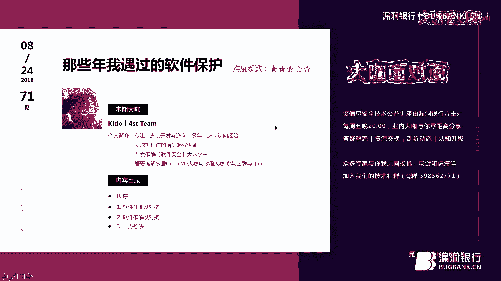

在本节课中，我们将学习软件保护与破解的基础知识。课程内容涵盖软件保护的必要性、常见的保护技术（如注册算法、网络验证、加壳）以及对应的破解思路与方法。我们将通过概念讲解和简单实例分析，帮助初学者理解这一领域的核心思想。

---

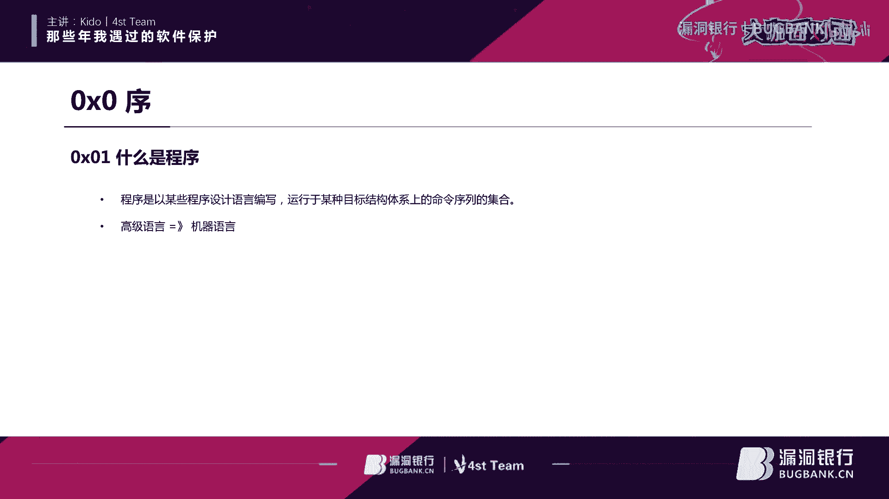

## 什么是程序与软件？💻


上一节我们概述了课程内容，本节中我们来看看软件保护的基础——程序本身。

程序是以某种编程语言编写，运行于特定体系结构上的指令集合。这里有两个关键点：
*   **编程语言**：如C、C++、Java、Python、汇编等。
*   **体系结构**：如x86、ARM、MIPS等。

程序的设计流程通常是从高级语言开始，由编译器编译成CPU能够识别的机器语言。CPU作为电路，只能识别“开”和“关”两种状态，即二进制中的0和1。

当程序被载入内存执行时，我们可以看到类似以下的结构（以Windows程序在调试器中的显示为例）：
```
地址        机器码        汇编指令
00401000    55            push ebp
00401001    8B EC         mov ebp, esp
```
*   **地址**：指令在内存中的位置。
*   **机器码**：CPU直接执行的二进制代码（以十六进制显示）。
*   **汇编指令**：人类可读的机器码助记符。

---

## 什么是Win32程序？🪟

既然我们主要讨论Windows环境下的保护，那么需要了解Win32程序。

Win32程序是指运行于Windows 32位系统或子系统下的程序。这类程序必须是符合**PE结构**的文件。PE即可移植可执行文件，是Windows上可执行文件的标准格式。

一个典型的PE文件结构包含以下部分：
*   DOS头
*   PE文件头
*   节表（描述代码、数据等各个节）
*   具体的节（如.text代码节、.data数据节）

Win32程序的启动过程很简单：当你双击一个.exe文件时，Windows资源管理器会识别它，系统检查其PE结构合法后，将其加载到内存并执行。

---

## 为什么需要软件保护？🛡️

在了解了程序的基本概念后，我们自然会问：为什么要保护软件？

以下是几个主要原因：
1.  **获取经济回报**：开发者希望软件能带来收入，因此需要确保只有付费用户才能使用完整功能。
2.  **保护知识产权**：防止核心算法或代码逻辑被竞争对手轻易窃取或分析。
3.  **技术挑战与安全验证**：有时保护措施本身也是对软件安全性的一种测试和挑战。

当然，如果软件价值不高，则无需过度保护。这就像一个小岛国无需强大军队一样。

---

## 软件注册与对抗 🔐⚔️

从本节开始，我们进入正题，探讨软件如何实现注册保护，以及如何对抗这些保护。

### 简单算法注册保护

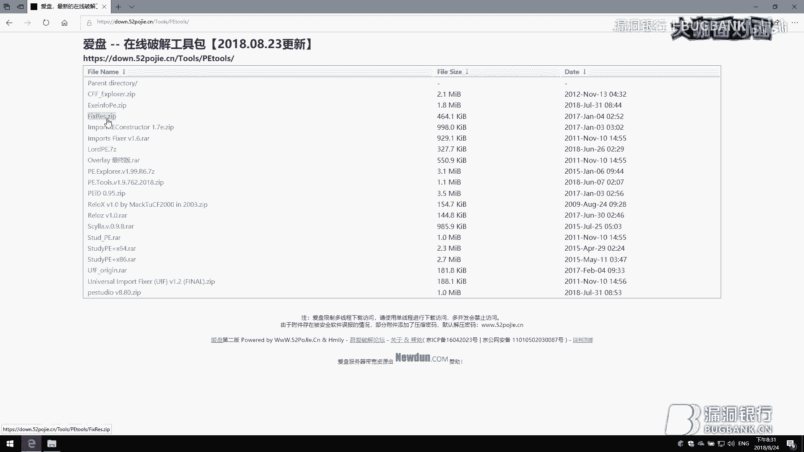

这是最基础的注册保护方式。其原理是：程序根据用户输入的信息（如用户名、机器码），通过一个算法计算出正确的序列号，然后与用户输入的序列号进行比对。

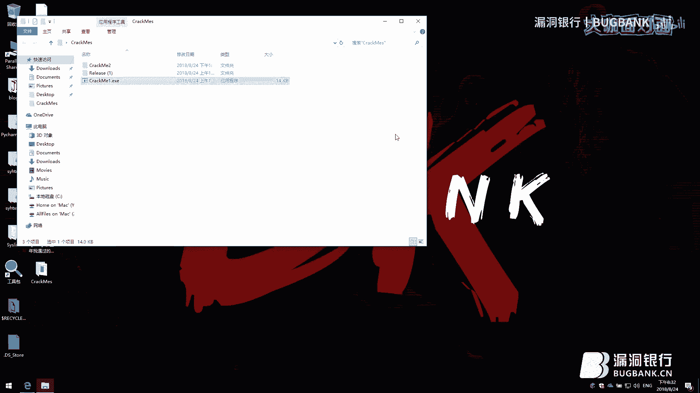

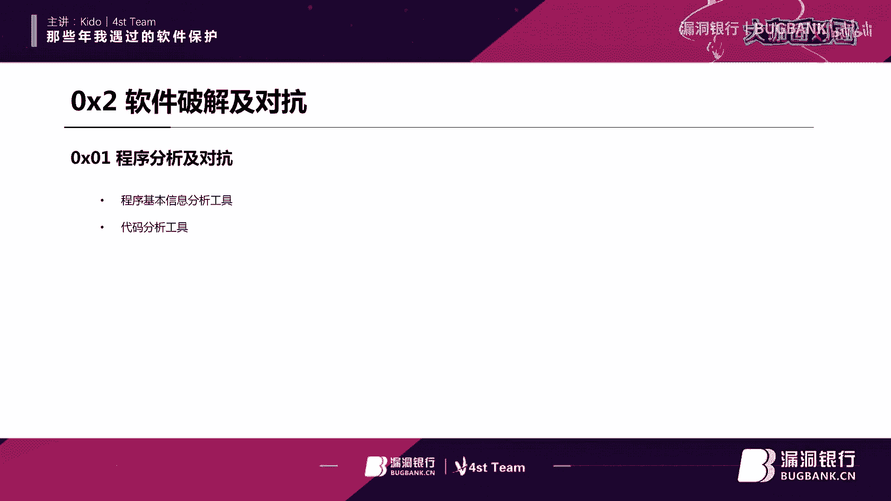


一个典型的流程可以用伪代码表示：
```c
// 程序内部计算正确序列号
correct_serial = calculate_serial(username, machine_code);
// 与用户输入比对
if (user_input_serial == correct_serial) {
    register_success();
} else {
    register_fail();
}
```

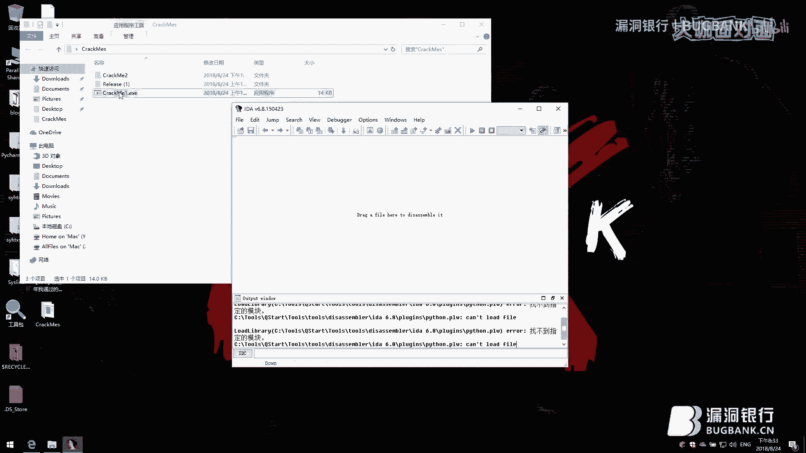

对于这种保护，常见的破解思路有以下几种：


以下是几种对抗简单算法注册保护的方法：
*   **暴力破解/打补丁**：修改程序的关键判断指令或内存数据，使程序直接认为注册成功。例如，将判断跳转指令`JNZ`（不等则跳）改为`JZ`（相等则跳）或直接`NOP`（空操作）。
*   **内存注册机**：通过DLL注入或加载器，在程序内部计算出正确序列号的瞬间，将其从内存中截获并显示给用户。
*   **算法注册机**：彻底分析程序的注册算法，自己用编程语言实现一个能生成合法序列号的程序。这是最彻底但也最耗时的方法。

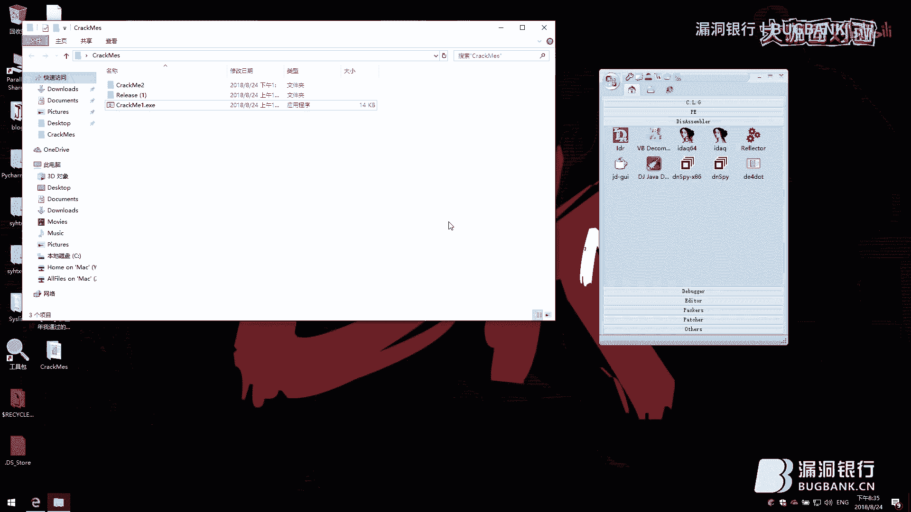


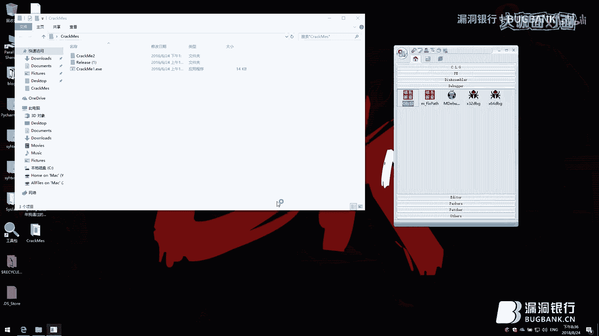


### 复杂算法注册保护

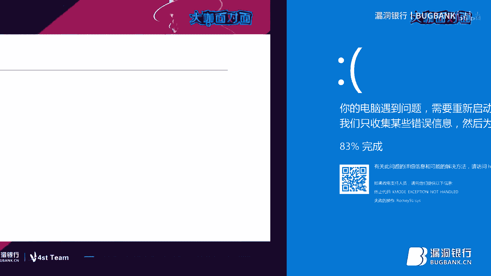

随着简单算法容易被破解，更复杂的保护方式出现了。复杂算法注册保护通常具有以下特点：
*   **使用非对称加密**：集成RSA、ECC等公钥密码体系。序列号中通常包含用私钥对用户信息（如硬件码）的签名，程序用公钥验证签名真伪。
*   **注册信息分段校验**：注册时只校验序列号的一部分，程序运行时再校验另一部分（俗称“暗桩”），增加分析难度。
*   **运行时多次校验**：在程序不同位置、不同时间点，用不同算法多次校验序列号。

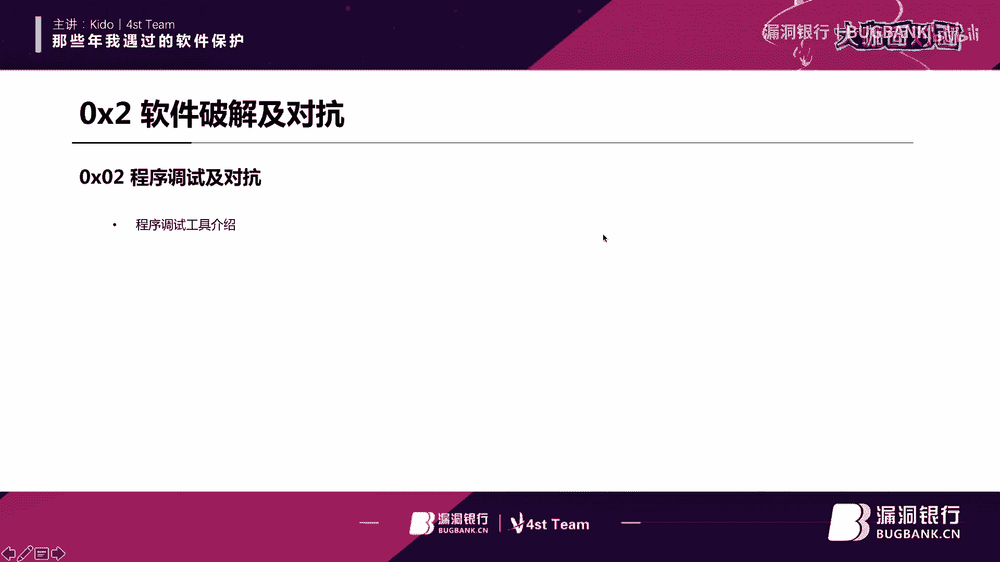


对抗复杂算法保护，除了暴力修改流程，还有以下思路：
*   **替换密钥对**：修改程序中内置的公钥，替换成攻击者自己生成的密钥对，从而可以自由签发“合法”序列号。
*   **暴力破解私钥**：在算法强度不足时，有可能通过计算破解出私钥。

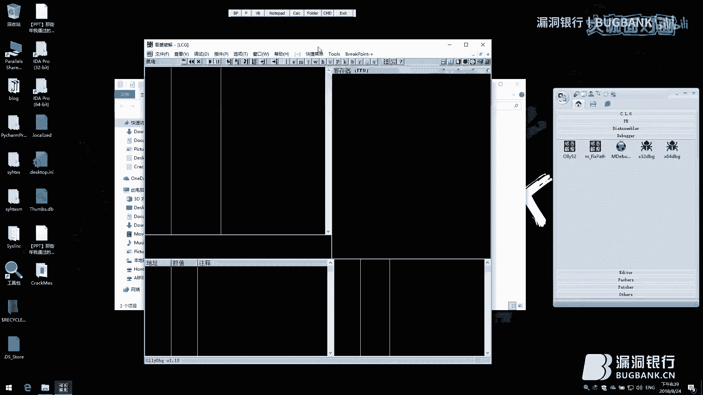


**核心要点**：在基于非对称加密的复杂保护下，如果私钥未泄露，想要完美破解（不修改原程序）几乎不可能，通常必须对程序文件或内存打补丁。

### 网络验证与硬件加密 🔌🐕

这是将验证逻辑放在远程服务器或专用硬件（加密狗）中的方法。

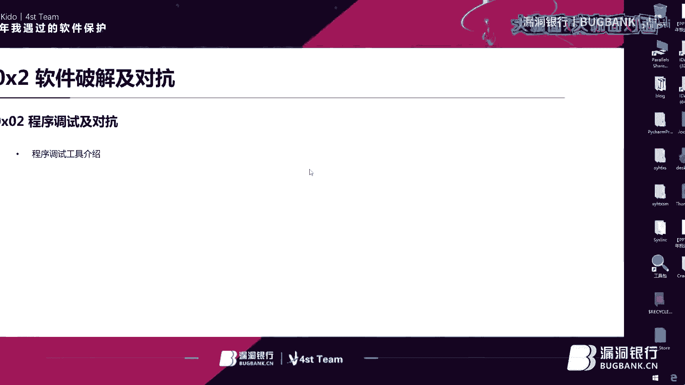

其典型流程是：
1.  程序启动或执行关键功能前，连接远程服务器或检测加密狗是否存在。
2.  验证用户凭证（账号、密码、加密狗内数据）的合法性。
3.  **高级形态**：将关键代码或数据放在远程端，程序运行时需要实时请求获取，本地不存储核心逻辑。

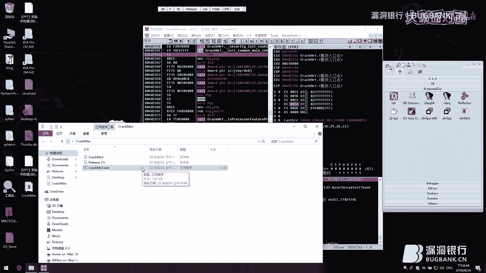

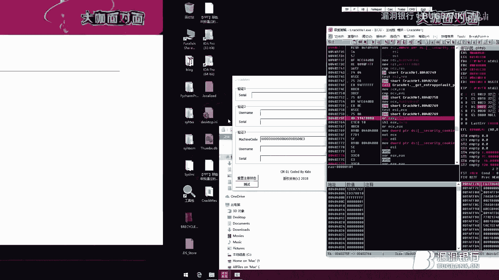

对于网络验证/硬件加密的对抗方法：


以下是针对网络验证和硬件加密的几种对抗思路：
*   **本地绕过**：如果只是简单的存在性检查，可以修改本地程序逻辑，绕过检查。
*   **模拟服务器**：通过劫持网络或修改程序连接地址，让程序连接到一个由攻击者控制的伪造服务器，该服务器返回“验证成功”的响应。
*   **流量中转**：当关键功能在远程执行且无法模拟时，可以让一个“合法客户端”作为中介，将非法客户端的请求转发给真实服务器，再将结果返回。当然，高级保护会通过绑定硬件信息等方式防范此招。


**安全建议**：将核心功能代码剥离到远程服务器执行，是当前提高破解门槛非常有效的方法。

### 复杂系统保护与“壳” 🐚

复杂的商业软件保护通常是上述多种技术的组合，并常常借助“壳”来实现。


“壳”是一种包裹在原始程序外的保护层。它最初用于压缩程序体积，后来演变为强大的保护工具。
*   **压缩壳**：如UPX，主要减小文件大小。
*   **加密壳/保护壳**：如ASPack、Themida、VMProtect。它们功能强大：
    *   反调试、反篡改检测。
    *   代码加密、混淆。
    *   集成注册验证机制。
    *   提供运行时保护接口。

加了壳的程序执行流程为：系统加载 → 执行壳代码（解密、反调试检查） → 解密原始程序到内存 → 执行原始程序。


---


## 软件破解与分析工具 🛠️


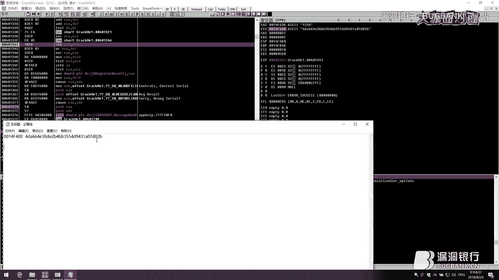


上一节我们介绍了各种保护技术，本节我们来看看破解者常用的武器——分析工具。


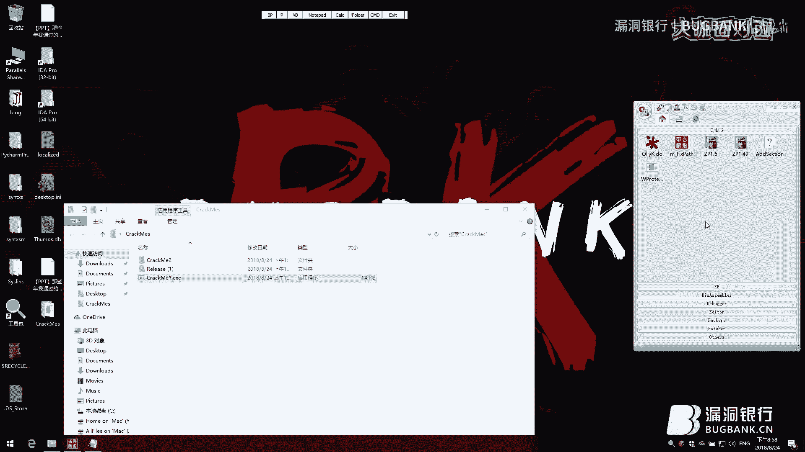

### 静态分析工具

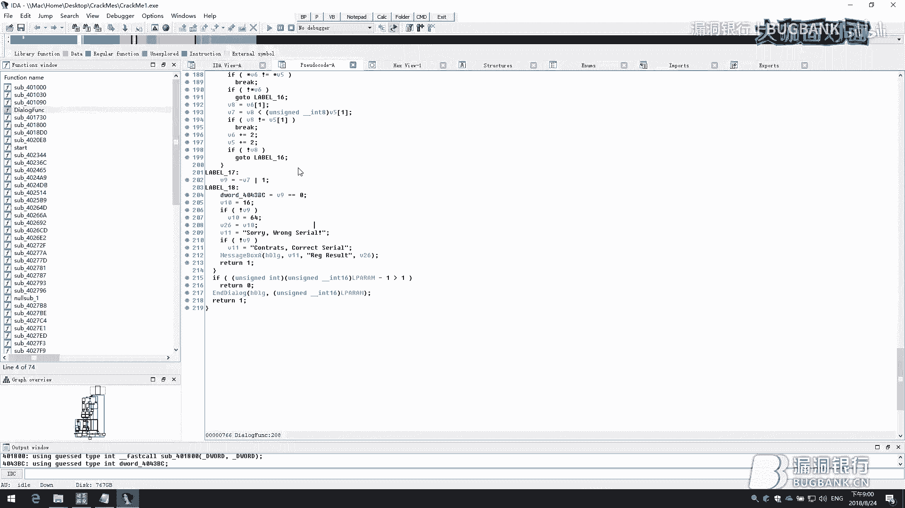

在运行程序之前，通过分析其文件本身来获取信息。


以下是常用的静态分析工具及其用途：
*   **PE结构分析工具**：如`StudyPE`、`CFF Explorer`。用于查看程序入口点、导入表、导出表、节信息等。
*   **程序信息检测工具**：如`DIE`。用于快速识别程序由何种语言编写、编译器版本、是否加壳及壳的类型。
*   **反汇编/反编译工具**：
    *   **IDA Pro**：功能极其强大的静态反汇编工具，支持多种处理器架构，能生成流程图，并有`F5`插件可生成C语言伪代码，极大提高分析效率。
    *   **.NET反编译工具**：如`dnSpy`。针对.NET平台程序，可以直接反编译出接近源码的C#代码，便于分析。
    *   **Java反编译工具**：如`JD-GUI`。用于分析JAR文件。

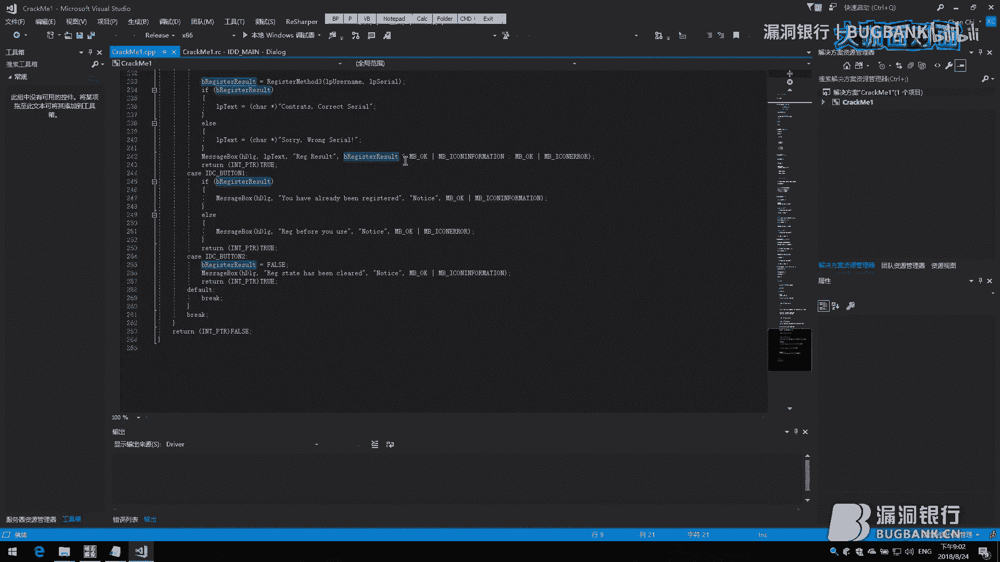

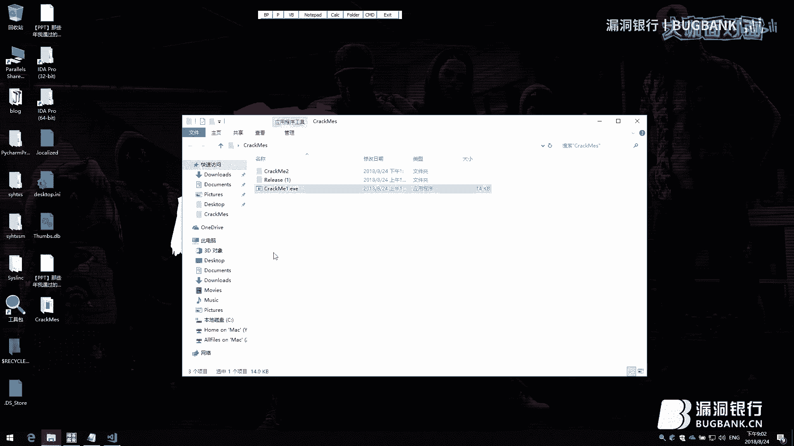

### 动态调试工具

通过运行程序，实时监控和分析其行为。


以下是主流的动态调试工具：
*   **OllyDbg**：Windows平台下经典的动态调试器，界面直观，插件丰富，适合初学者和日常分析。
*   **x64dbg**：支持64位应用程序的现代调试器，逐渐成为OD的替代品。
*   **WinDbg**：微软官方调试器，功能强大，尤其在驱动和内核调试方面是必备工具。
*   **调试器原理简述**：调试器通过操作系统提供的调试接口，接管被调试程序。它利用异常处理机制（如断点触发异常）来暂停程序执行，让分析者可以查看和修改寄存器、内存状态。

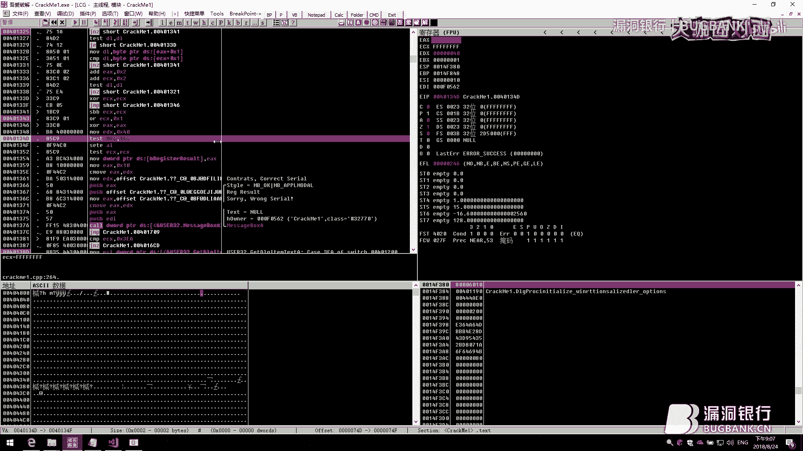

### 对抗动态调试

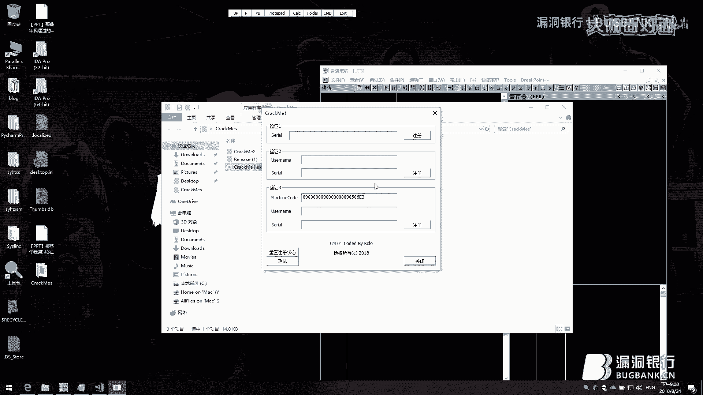

为了保护软件不被调试分析，开发者会加入反调试技术。

以下是常见的反调试手段：
*   **API检测**：调用`IsDebuggerPresent`等系统API检测调试器存在。
*   **特征检测**：扫描进程、窗口名、内存中是否存在调试器的特征码。
*   **行为检测**：
    *   **时间差检测**：利用`RDTSC`指令或`GetTickCount`函数，计算两段代码执行的时间差。若时间过长，则可能处于被单步调试状态。
    *   **陷阱标志检测**：利用一些调试器处理异常的方式与正常执行不同来检测。
*   **驱动级保护**：通过内核驱动修改系统关键数据，阻止调试器加载或使其失效。
*   **双进程互调试**：父进程以调试模式启动子进程，关键代码在子进程中运行。由于一个进程只能被一个调试器调试，这增加了外部分析的难度。

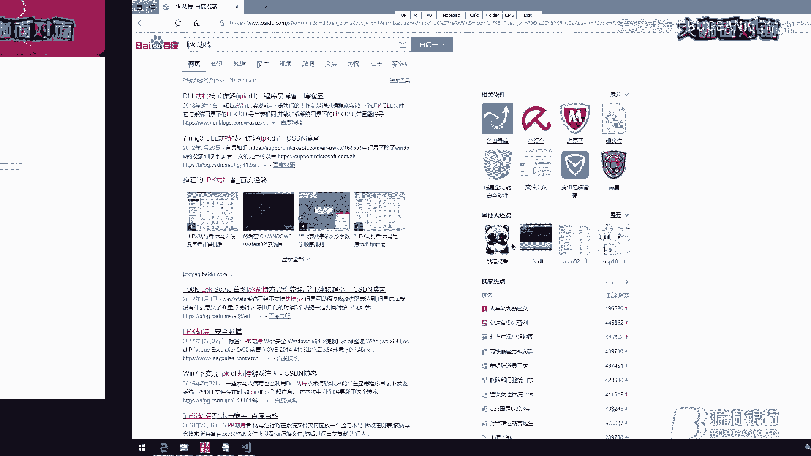

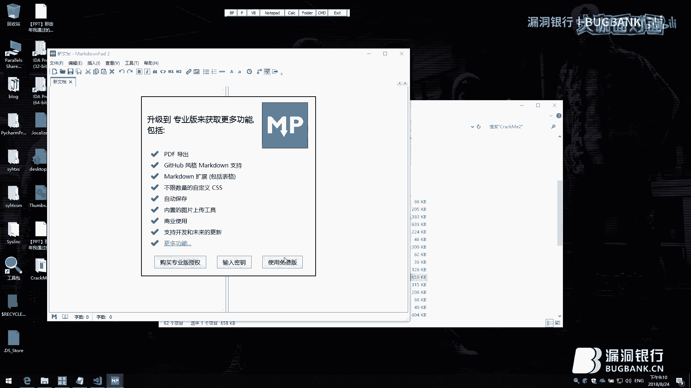

---

## 补丁技术与防护 🩹


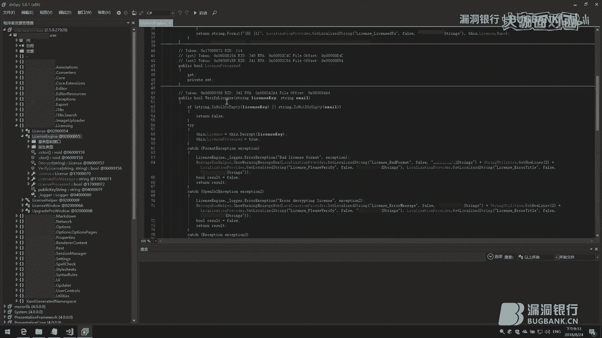

无论是静态分析还是动态调试，最终破解往往需要对程序进行修改，即打“补丁”。


### 补丁类型
*   **文件补丁**：直接修改磁盘上的可执行文件。例如，用十六进制编辑器或专用补丁工具修改指令字节。
*   **内存补丁**：程序运行时，在内存中修改其代码或数据。动态调试时进行的修改就属于此类。
*   **SMC**：自修改代码。程序运行时自己修改自身的代码段，常用于加壳/保护壳的代码解密过程。

### 如何防止补丁？
为了保护软件不被非法修改，开发者会采用以下措施：


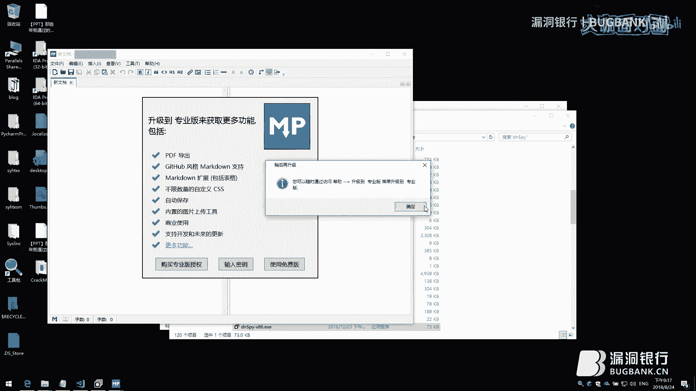


以下是几种防止程序被篡改的方法：
*   **完整性校验**：
    *   **文件哈希校验**：程序启动时计算自身文件的哈希值，与内置的正确值比对。
    *   **内存CRC校验**：对内存中关键的代码段进行循环冗余校验，确保未被修改。
*   **防止DLL劫持**：确保程序加载的系统DLL来自安全目录（如System32），而非当前目录下的恶意DLL。
*   **驱动保护**：通过内核驱动保护进程内存，防止其他进程非法读写。

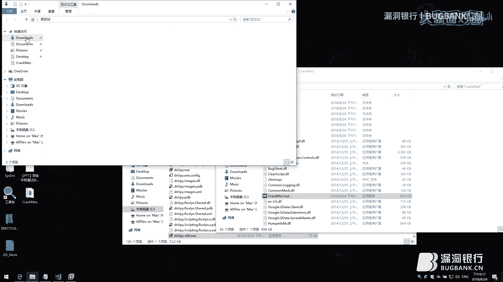

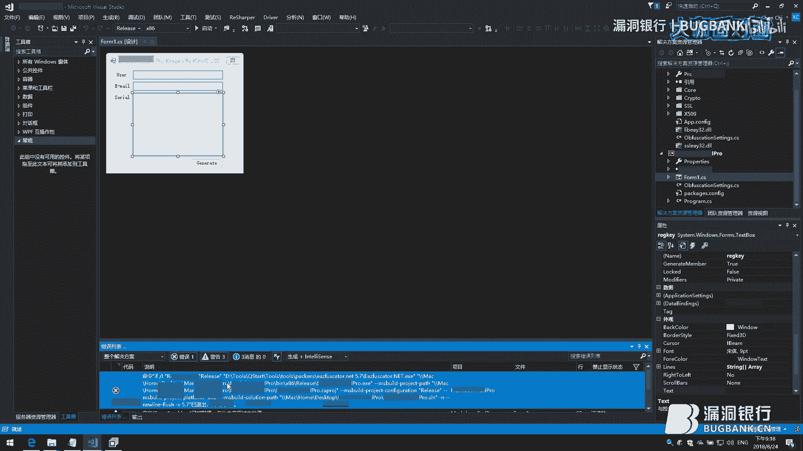

---

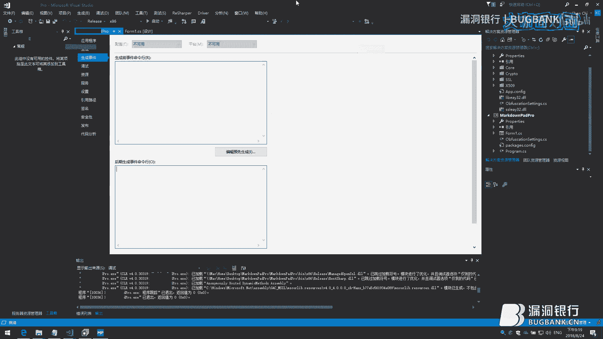


## 实例分析：一个.NET程序的注册破解 🎯

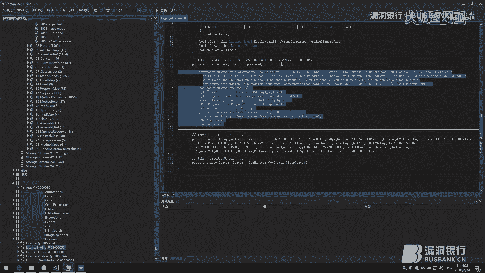

理论需要结合实践。让我们通过一个实际的.NET程序，来串联之前讲到的部分知识点。


**目标**：分析并破解一个使用非对称加密（RSA）进行注册验证的.NET程序。


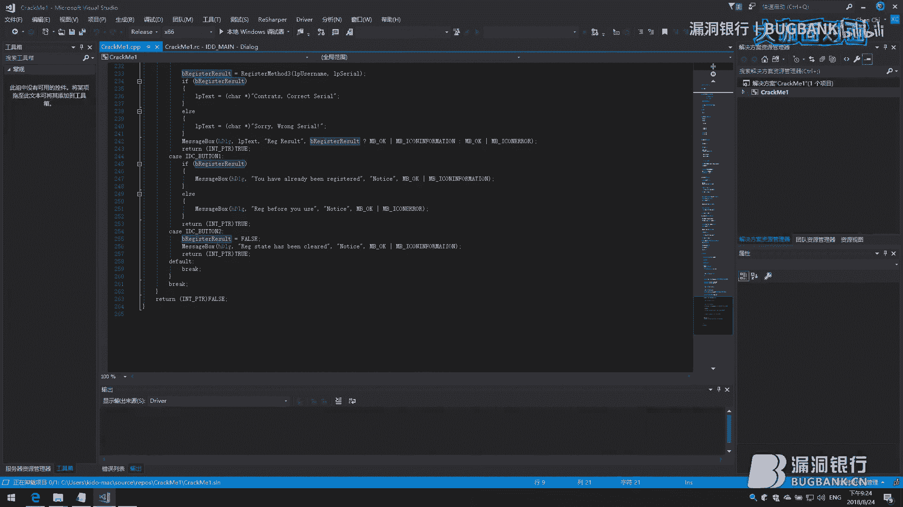

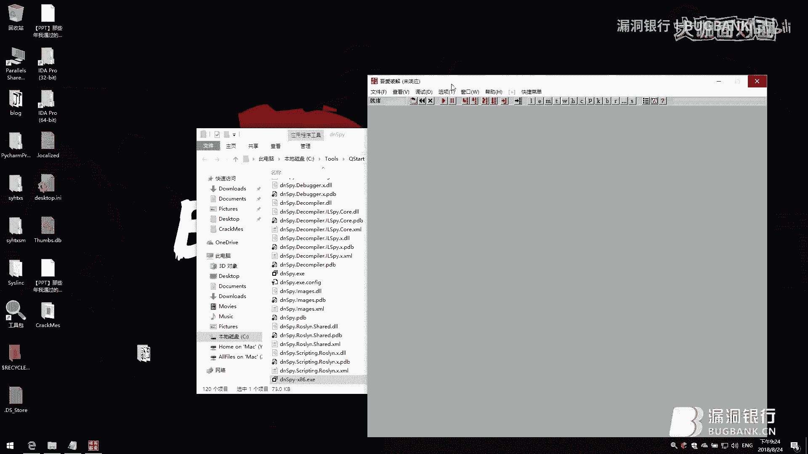

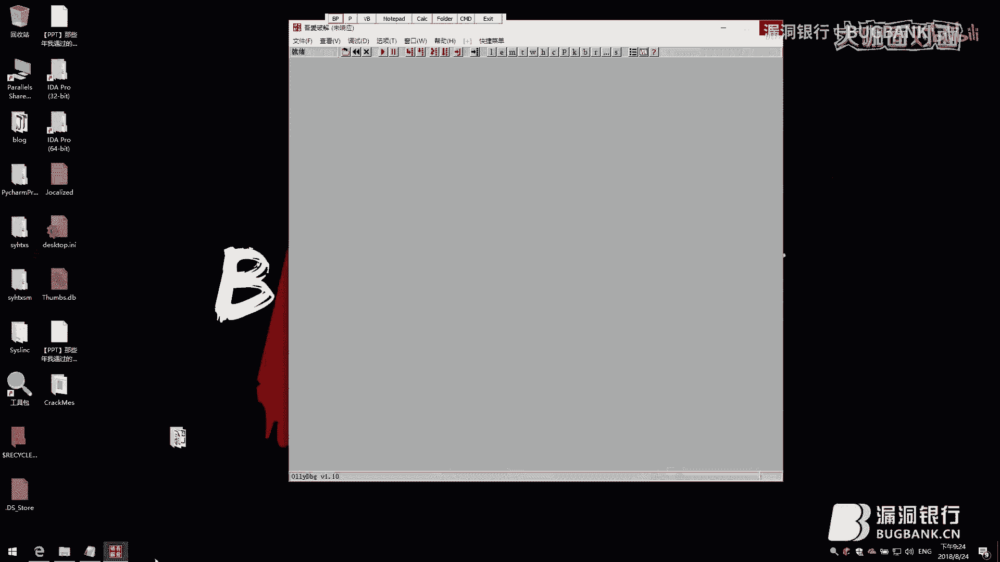

**工具**：`dnSpy`（.NET反编译与调试神器）


**步骤**：
1.  **知己知彼**：用`dnSpy`打开目标程序。浏览模块，很快找到`LicenseEngine`（许可证引擎）相关类。
2.  **定位关键函数**：在`LicenseEngine`中找到一个名为`VerifyLicense`的方法，它接收用户输入的邮箱和序列号。
3.  **分析验证逻辑**：查看`VerifyLicense`的伪代码，发现其核心流程是：
    ```csharp
    // 解密用户输入的序列号
    LicenseObject license = DecryptLicense(user_serial);
    // 验证解密后的信息
    if (license != null && license.Email == user_email && license.Product == "ExpectedProduct") {
        return true; // 验证成功
    }
    return false; // 验证失败
    ```
4.  **深入核心**：进入`DecryptLicense`方法。发现它使用RSA公钥对用户输入的Base64序列号进行解密，然后反序列化成一个`LicenseObject`对象。
5.  **发现漏洞**：进一步分析发现，该程序的**RSA私钥和密码竟然硬编码在客户端程序中**！这是严重的安全失误。
6.  **编写注册机**：由于私钥泄露，我们可以完全反向这个过程：
    *   构造一个包含任意邮箱和产品信息的`LicenseObject`。
    *   使用泄露的私钥对其进行RSA加密。
    *   将加密结果转换为Base64字符串，这就是合法的序列号。
7.  **验证成功**：使用自己编写的注册机生成的序列号，成功通过目标程序的验证。

**本例总结**：这个实例展示了静态分析（`dnSpy`反编译）、算法分析（RSA流程）和注册机编写的完整过程。同时也警示开发者：**绝对不要将私钥等敏感信息存放在客户端**。

---

## 总结 📚

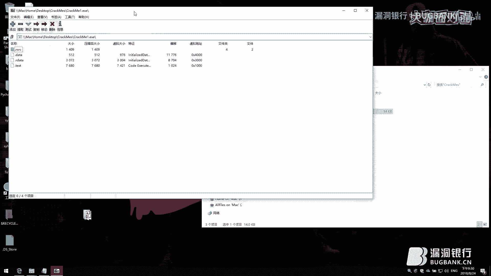

本节课中，我们一起学习了软件保护与破解的基础知识。


我们首先了解了程序与Win32程序的基本概念。然后探讨了软件保护的必要性。课程的核心部分详细讲解了多种软件保护技术：
*   **从简单的算法注册**，到**复杂的非对称加密验证**。
*   从**本地验证**，到**网络验证与硬件加密**。
*   以及集大成的**保护壳技术**。


相应地，我们也介绍了破解者使用的**静态分析**与**动态调试**工具，以及常见的**反调试**和**防篡改**技术。最后通过一个.NET程序破解实例，将部分知识点串联起来。

记住，软件保护与破解是一场持续的攻防博弈。没有绝对无法破解的保护，但优秀的设计可以极大提高破解成本，保护开发者的合法权益。对于初学者而言，理解这些基本原理是迈向更深入安全研究的第一步。

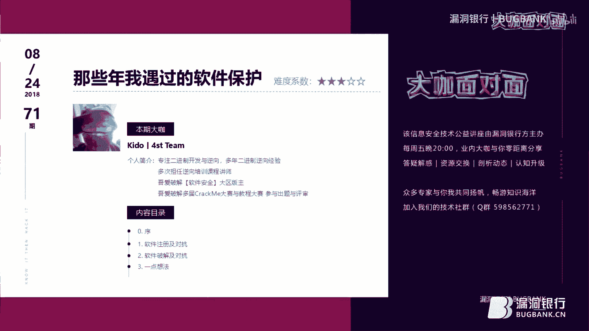


---
*注：本教程根据技术分享内容整理，涉及的技术仅用于安全研究学习，请遵守法律法规。*