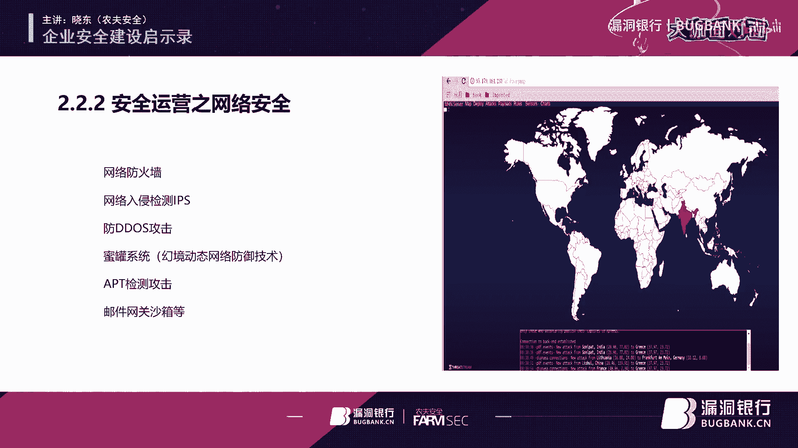
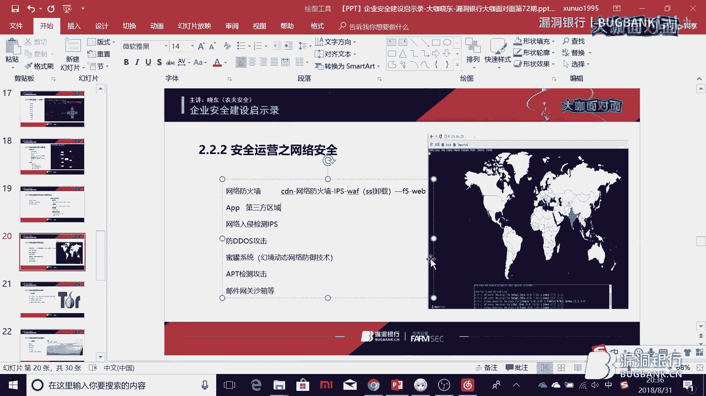
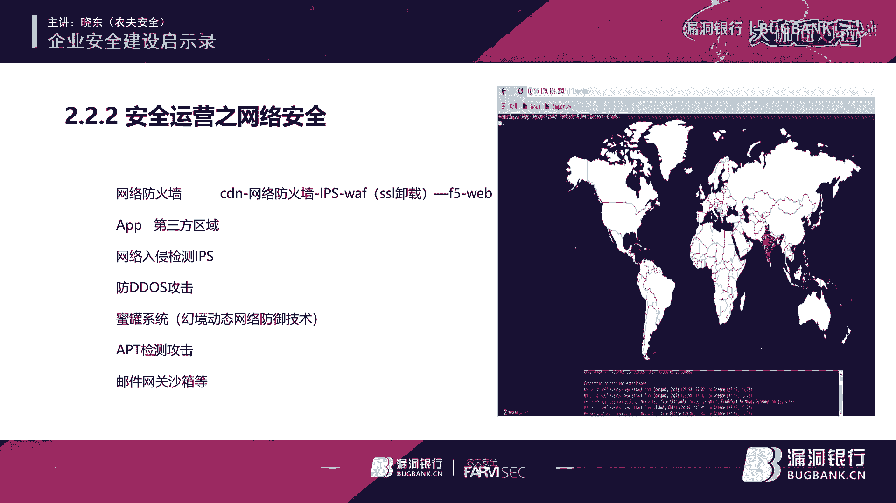
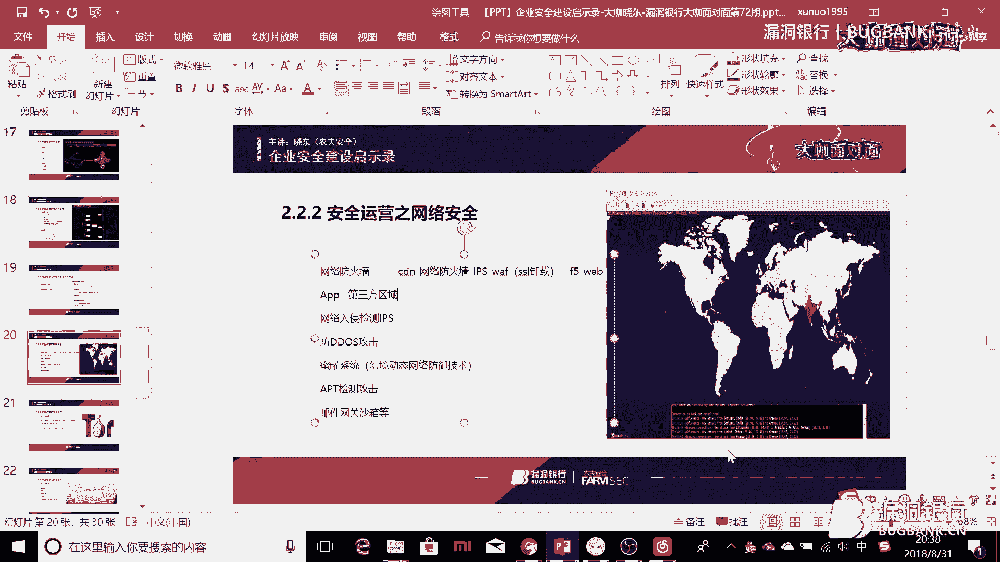
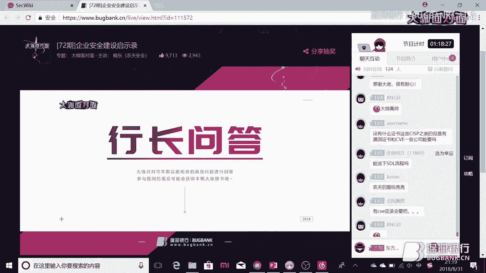
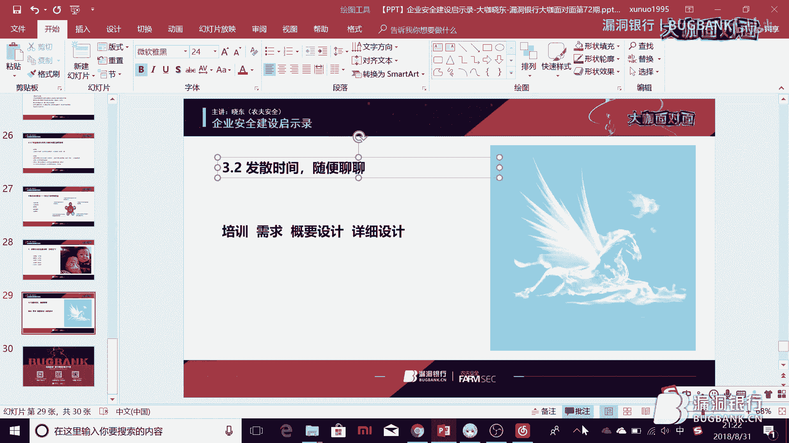
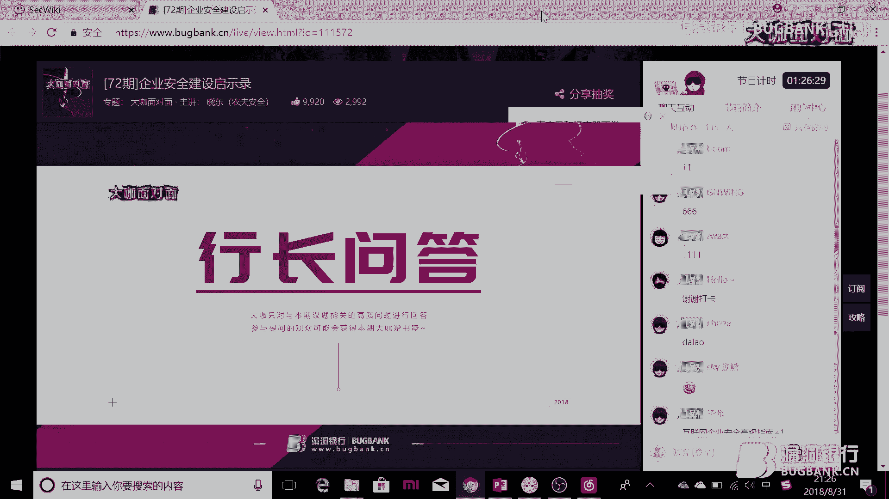

# P1：72期丨企业安全建设启示录-大咖晓东 - 漏洞银行BUGBANK - BV1Ft411f7Zc

为知识而存 因技术而生 小伙伴们晚上好。

欢迎参加第72期漏洞银行安全技术直播，大咖面对面 我是主持人秋秋，今晚我们请来了农夫安全团队的核心成员小冬大咖，做客大咖面对面，每次农夫安全成员来到直播间都感觉很皮，所以这次小冬大咖也是一如既往的。

他说自己是以靠颜值发家致富，靠技术实不果腹的为甲方安全人员自居，或许这也是团队继承的一种体现吧，今晚小冬会为我们分享企业安全建设启示录这个主题，你想知道关于企业安全建设的双因素。

三驾马车 四时之气都是什么吗，今晚一定要看到最后，听大咖演讲自然也少不了和大咖互动，问答后还会有大咖赠书的福利环节，今晚赠书可厉害了，我们要选出五名幸运观众，乔黑版是五名幸运观众哦。

赠书的一部分小冬大咖自己出资来购买，我们非常感谢他的一个资助，大家记得看到最后吧，我们只能帮你到这里了，好，那下面就请小冬开今天分享吧，哈喽大家好，首先谢谢秋秋刚刚的介绍。

那么我们就开始我们今天的一个演讲，好，那么今天的主题就是企业安全建设启示录。

首先是我的一个个人介绍，我的团队介绍，我来自农夫安全团队，是以TK为主治医生的一家专业治疗意义重的安全团队，那么可能很多人都知道农夫安全，豆腐其实是很厉害的嘛，我个人的介绍就是说。

我目前是在一家国有银行的信用卡中心，名义上的职位是项目经理，实际上的工作，所以说我称之为打杂人员，原来的背景是白帽子出身，所以说也跟在座的很多白帽子一样，深夜挖过洞。

所以希望我今天的一个分享能够给大家带来一些帮助，那么今天我们的演讲就分为三个部分，第一个部分就是企业安全建设的双因素，第二个部分就是安全建设的三驾马车，第三个部分就是合格企业安全建设者的四十之七。

所以大家只需要记着一个人为大家讲二三四就可以了，好，我们先讲一下企业安全的定义，首先企业安全的双因素是什么呢，一个叫企业，一个叫安全，那么企业呢，我们该怎么样划分呢，首先大家看一下这一张图，这张图呢。

是应该是前不久发生的，据说是来自于上海一家一家XX科技对吧，我这里就不说了，据称某互联网公司产品经理提了个需求，要求APP开发人员可以做到根据用户的手机壳来改变软件主题人主题颜色。

然后大家可能很多人都看过这个视频啊，就是嗯，然后发生了一些比较微微妙的动作啊，好，那么首先我们定一下企业，为什么我们要先讲一下企业呢，因为只有在企业中你才能找到一个合适的安全的定位，那么企业呢。

我认为分为以下三类，第一类呢，是科技驱动型的，我们称之为互联网公司的企业，也就是刚刚的这幅图中的是吧，产品经理跟APP开发人员打了起来，这种呢，称之为互联网企业，这种的企业的话，对安全的要求是很高的。

因为用户的数据用户的信息就是他们的生命线，当然也也出现了某BT公司的Bose嘛，也说了中国人很多时候是愿意用一些信息去换取便利的，当然我相信大部分人的话还是希望能够保留自己的隐私的。

所以这这一类的公司以BAT互联网公司为代表的科技驱动型的企业对安全的重视要远远大于其他行业，第二类呢，就是金融行业，这个呃，也就是我现在目前所在的行业，大概的分为呃银行证券保险基金期货信托呃等等。

一些其他的吧，这些金融行业为什么呢，因为这个东西其实是跟钱挂钩的，所以说大家对安全看来还是很重视的，所以说特别是在我们单位我们我们单位的话，目前来说的话，有两个部门其实是比较强硬的，一个叫合规。

一个叫安全，合规是生命线，安全是基线，所以说在金融行业做安全的话，你相对来说的话会有一个还可以的地位，第三个就是一个传统行业，比如说我们说的一些呃，比较保守的行业之类的，其他的这些都不取例子了。

那么我之所以讲企业呢，就会讲到一个，其实企业安全人员的定位是什么样的呢，比如说在互联网型的企业，以华为为例，他们的安全部是挂靠是由总经理是下面直属的，也就是说他们的安全的地位。

其实是跟要比开发运维网络是测试架构等等，要比这些要高半级，就是他们很多时候推行一些政策，一些制度是另行禁止的，第二类的话就是我们这一类的企业，目前我们的一个背景呢。

就是说金融行业基本可以做到就是说安全和网络运维开发是平级的，就是说你如果有什么事事情的话，其实的话大家是很愿意卖你一个面子去做这些事情的，传统行业的话，我所知道的，比如说上海的话有一家很大的航空公司。

它里面的话就是安全部是挂靠在运维部下面的，相当于是一个小的部门，相当于是一个二级部门，所以说他们的话很多时候的话，就是说会很难做，很多制度也很难去推行，所以说嗯锅比较多吧，好，那么我们讲完企业了。

我们要讲一下安全安全在企业中定义是什么，第一类呢，就是安全即服务，安全即合法规，以及最后的一个信息安全人员的定位好，安全即服务服务业务创造价值，那么这段话我就不读了。

就安全就是你可以把它想象成是一个桥的栏杆，如果没有这个栏杆的话，很多人不敢去通过这条桥，所以呢，就是安全是业务的保障线，安全的价值就在于说安全是为业务服务的安全，业务不是矛盾的，安全是业务的一个属性。

所以说他与业务不是矛盾的，但是安全与业务是相互促进的，前三点其实我是很认同的，这张图是我是我从别的别的地方抠出来的，应该是星银行的好，然后第四张呢，就是安全是安全与业务是鸟之双翼，车之双轨。

其实这句话嗯，在我看来的话，呃，根据每家企业的不同来定吧，目前对于我们单位来说的话，安全相当于是你鸟的一个翅膀，但是并不是一个很主要的一个，它只是业务的一个属性，业务会有很多属性。

但是安全是一个很重要的属性，好，那么安全既然要服务业务创造价值，那么我们就要知道业务的一些需求，那么现在的话，企业的话业务会有哪些需求呢，有防外来入侵，防违规滥用，防系统中断，防内部泄密等等等等的这些。

那么把这些业务需求综合起来的话，你会达到一个信息安全的目标，达到一个什么样的目标呢，就是保密性，完整性以及可用性，要达到这些目标，你需要有相应的安全建设的能力，那么这样的话呢。

我们看一下赵燕的这个赵燕呢，是那个互联网企业安全的作者嘛，所以他对安全的提出了五个等级，就是第一个问题呢，就是说你自认为你是安全的，当然所以说很多白帽子，包括我原来我原来做白帽子的时候。

我就认为就是是吧，可能很多很大的企业就是哎是吧，你没有那么多管理制度，你没有那么多的设备什么之类的，还不是照样被我挖出了高危，或者拿了鞋进了内网吗，好第二第二种呢，就是说具备救火能力。

就是说你去了之后呢，可能会有各种各样的突发应急事件，但是呢，安全团体能够把这些应急事件归于乌有，就是说把他们呃，把他的风险降到一个最小值，或者说损失降到一个最小值，那么称之为具备救火能力。

第三个话就是说具备了救火能力之后呢，可能会寻求一些体系化的建设，比如说可能会做一个比较简易的一个安全体系架构，第四层呢，就是说呃在达到第三层之后，能够尽可能去满足一些满足业务的发展，业务的扩张。

因为很多时候的话，业务其实是发展的很快的，而且会有很多很多的需求，比如说支付宝的这两年很火的支付宝的，就是说那个刷脸吗，刷脸识别的话，其实他就是一个新新业务，所以说如果那么怎么样让这一个新业务。

就说这样的一个新功能，不会被绕过或者说不被那个呃不法分子给利用了，那么这些呢是我们安全的一个考量，第五个呢就是一个持续的改进，然后找到自己企业的不足，然后不断的去改进啊，第二个话就是安全既合法合规。

一个是网络安全保护法，一个是等级保护啊，说安全保护法呢，就是说呃希望大家以后就是说不要去做未深层的测试，因为这个其实是很危险的等级保护呢，为什么要说等级保护呢，其实很多制度呢，等级保护的话。

有人说等级保护可能就是一个过场吧，但你可以利用这个过场去达到一些手段，比如说你原来推不动的一些制度策略，其实可以在等保中为了满足等保的符合项去强制推行，也可以得到上级的一个支持，所以说要讲一下等保。

其实等保的话，很多时候是企业安全建设的一个助力，就是说你可以根据说等保的要求，然后去做做一些事情，好，那么我们讲了要达到一个体系的一个建设，好，要达到服务业务的一个需求。

那么你应该信息安全者就是企业的信息安全者，有一些有一个什么的定位呢，首先呢，就是说我原来听别人讲过就是他们说，呃，如果说，怎么怎么样，然后之后就是如果说发现漏洞了，你应该怎么样。

对开发对应用对网络对测试，这些其实很多时候都是不对的，因为你会发现在企业中每一块其实都是必不可缺的，比如说没有开发的话，其实你的业务基本上就没有办法去很好的去保证运维跟网络也是安全。

也是我们都是其实是在一个背后的一个支撑，那么怎么样才能更好的推动一些我们说的一些安全策略，一些安全制度呢，不会引起下面很大的一个反抗或者一个抵触，情绪这个时候呢，就体现出来了，大家说讲相声吧。

讲相声是是是什么呢，大家如果听过郭郭德纲的相声的话，就应该会明白一个道理，讲相声靠的是什么，靠的是三分三分斗七分捧，所以在企业里面做安全也是就是你要想办法去捧着这些人，让他们觉得哎，他们很很厉害。

之后呢，你再利用把他们捧高的同时，再把自己捧高捧的比他们要更高，然后呢，去推动一些你想要达到的一些效果，好，所以说信息安全者的定义是什么呢，开发高运维硬网络横，所以我们做安全的就要又高又硬又横。

这样的话呢，你在企业里面才有地位，信息安全的目标是什么，我这里用了一张让子弹飞的，照片大家应该可以看出来这张照片的一个来源吧，这是当时江文饰演的马匪吗，去那个跟那个汤世爷见了黄老爷之后的一个聊天。

当时江文就说说我想站着还把钱给赚了，那么我们安全很多时候的定义是什么呢，我们就是想站着还把钱给赚了，那么就是说但是你怎么样才能把这个站着还把钱给赚了，有尊严的呢，所以说你要达到以下的一个目标。

第一的话就是自上而下的信任和依赖，我为什么说是要自上而下呢，你任何任何的推行任何企业中的你想要做的事情都必须得到上级的支持和信任，因为如果没有上级的支持的话，其实很多时候是很难做的。

很多如果说大家以后在做项目的话，无论是甲方还是乙方，你在做项目的时候，你就会知道一定就是说多请示是一个很重要的一点，就你一定要让你的上级知道你在干什么，然后呢，你如果做项目的话。

你要把你的项目的进度项目的风险不断的告诉他，然后让他如果有解决不了问题呢，让他可以就是说帮你去想办法嘛，所以如果说大家进了一个比较大的公司的话，像我们单位的话，现在大概有两万多人。

所以说各个部门之间其实都会有些矛盾的，那怎么办呢，大家通过邮件就开始就会有一些争论嘛，就是你一封我一封你一封我一封，大概回来大概有五六十封之后，然后抄到领导层，最后领导一锤定音。

所以说那么怎么样让领导一锤定音的时候，会偏向于你呢，这个时候你需要得到自上而下的信任，让他去依赖你这样就可以了，第二点呢，就是自下而上的排忧和解惑，其实你面对最多的安全，面对最多的是什么。

就是以我以我为例的话，我面对最多的其实就是我刚刚说的，开发运维网络测试，指控桌面单等等等等，我面对的是这些人，那么这些人呢，很多或多或少会遇到很多的困难，那么我应该怎么办呢，我应该帮他去解决这些困难。

比如说我们今天的话，其实是出现了一个我们就是有一个游戏嘛，然后被别人那个写了一个外挂，然后我今天是从早上九点钟，一直到下午四点，都在帮他找这个问题，就是说找到了这个外挂到底是利用了哪里的缺陷。

那么这个缺陷应该怎样去修复，那这样的话，就是说一次两次可能达到三次之后，他们就会认为你很专业，所以很多事情都会过来咨询你的意见，那么这样而来的话，安全的地位就得到了一个提升，第三点的话。

自内而外的自信和理解，我不知道在座各位有多少成年人啊，应该会有很多的在读的大学生啊，为什么呢，就是说很多时候你要明白一个道理，就是成年人的世界没有容易二字，我现在我就感觉到了很多，就是说你会做很多事情。

你会感觉力不从心，有的时候呢，你甚至会骂这个制度就是一个傻叉，或者叉叉叉叉叉叉团队的领导就是一个傻叉，为什么呢，因为很多东西你到他这的话，他就会推不动，而且他就会给你设置各种各样的阻碍。

各种各样的流程来羁绊你，这时候应该怎么办呢，包括很多时候开发也是啊，上次跟你说了吗，不是让你写那个过滤吗，为什么没有写呢，上次不是跟你说了吗，不要让你前男后女，为什么这次还有呢。

所以很多时候你是很崩溃的，但是说其实你要从他们角度去想呢，就是说你会发现他们其实很多时候也是被逼的很紧的，业务需求过来了之后，他们要加班加点的去做这件事情，我很多时候也在熬夜加班陪着他们，特别是去年。

我是从去年10月份开始管项目的，然后10月份之前的话呢，更多时候的话就是说是陪着加班啊，陪着什么搞测试什么之类的，后来好了一些来了一些小伙伴，然后又来了厂商，我就把这些任务分给厂商了。

我主要做一些协调性工作，所以说第一的话，自信的话，你要抱有一种心态，就是什么心态呢，就是我不管我最帅，是哪怕我说的是错的，我都要认为我说的是对的，你就要按照我说的来来做，哪怕你遇到很多很多的。

可能就是说他会说哎呀，业务不让改啊，或者说那个什么发版之前那个有风险之类的，你就要按照我我说的来做，很多时候你必须要这样的强硬，这样的强硬的话来自你自身的一个一个自信。

理解的话就是说也是去多多理解开发的小伙伴吧，毕竟他们很多时候也是嗯很不容易的，好，那第四第四点呢，就是说自外而内的专业跟博学就是说呃我不知道他有没有考过CSP，CSP的话，他有一个理论的话。

就是说是一英尺长一英寸宽，就是他会让你就是说呃告诉你很多很多的知识点，但是呢，他呢是非常一个浅显的，那么很多时候你为了应付不是应付，你为了把工作做得更好啊，你需要就是说表现出一种专业性。

这种专业性呢来源于你的博学，那么直至最后呢，大家好才是真的好，你会发现所有的部门都好了话就没人去告你的状了，我去年被告了好多次状，就是那种嗯我不知道该怎么形容啊，就是说他也不是告你个人的。

他就会说安全怎么怎么样怎么怎么样，知道吧，所以说就是说呃会造成一定的影响吧，但是但是今年以来呢，就是我脾气好了好了很多，在家的话呃大家配合的也比较好，所以说今年的情况会好一些，好。

那么我们说企业安全建设呢，要依赖于三驾马车，三驾马车是什么呢，我们知道要建立一个企业安全体系的话，现在更多的话其实是一个pdr模型，就是protection。

detection and response，呃protection呢，就是说一些保护的一些策略，detection呢，就是说一些检测的一些手段，响应呢，就是说我们说的是一个呃能够做一些应急响应啊。

或者事件处理之类的，他们呢分别对应于事前事中跟那个事后，就是事前你要保护事中呢，你要检测事后呢，你要去做一个响应，所以呢，称为pdr模型protection。

detection and response，好，那么企业安全的三驾马车呢都是什么呢，管理就是管理是方向，运营是常态，技术是支撑，所以大家从这张图里面就可以看得出来管理的也就是汤师爷汤师爷是动嘴的。

然后运维跟技术呢，两个人斗来斗去呢，其实他们两个是动腿的，管理的艺术呢，我这里分为了两个小节，第一个小节就是敢问路在何方，用汤水的话说呢，就是酒要一口一口喝，路要一步步走，步子迈大了。

看容易扯着那啥是吧，所以说管理很多时候的他需要给你制定一个安全发展的一个方向，管理的职责有哪些呢，就是说你怎样让一动嘴的去使唤动腿的，那么你的职责又在哪里呢，好，这些就是感问路在何方。

我不知道大家看了之后呢，有没有就是说对管理，哎，大致的一个大的一个工作范围，做了一个有一个详尽，就说管理很多时候的话，他制定的更多偏向于理论性的东西，比如说咱们这里面的制定性，先全管理体系框架。

ISO两万七啊，等保三道防线，大家知道金融行业的三道防线是什么吗，是科技，风险与审计，就是科技其实在最前沿的，你需要利用技术的手段去解决后面的风险，就由风险提出风险，由科技来解决。

并且最后能够做到做到一个事后的一个审计，所以叫科技科技风险与审计，好，你需要制定信息安全的一个方针，进行信息安全组织及人员管理，信息安全管理制度，风险管理规划与建设，就是你们进行要达到一个什么的目标啊。

监测与威胁的一些一些方法或者是那个手段，等等等等的，以及业务连被连续性与在被管理信息安全审计等等等等，就说我给大家这里呢，我给大家讲一下信息安全的一个制度，总共分为四级文档。

就是你们如果会去了一个比较大的单位的话，一般的话我都会有四级文档，第一级文档呢，我给大家举个很简单的，就好像说我会告诉你安全有很多方向，有外部端有爱不端，有逆向端是吧，可能最后呢。

可能可能还会发展成什么IOT啊，或者是AP那个就是说区块链安全啊，人工智能安全等等，它是很多很多方向，那么一级文档呢，会告诉你说我有我有这些方向，二级文档是什么呢，二级文档比如说外外不安全。

我会告诉你说有OWSB top10，有CircleDraw有XSS有CSRF有身份鉴别，失效的身份认证和绘画管理，有防控制缺失，又使用了不安全的安全组件等等等等，我会告诉你有这些漏洞。

那么三级文档是什么呢，我会告诉你说啊，比如CircleDraw是吧，有OCSESS，MADCIRCLE，CIRCLE SERVER，ORACLE对吧，可能还有其他的其他的之类的。

那么可能就是说MADCIRCLE的注入的话，可能会告诉你说有联合注入，有暴缩注入，有盲注等等等等，就这些他会告诉你这些方法，四级文档呢，其实才是最后告诉你说好，针对CIRCLE注入你应该用什么。

你可能用阿滴用明小子，或者用穿用穿山甲用CIRCLEMAP等等，这才是四级文档做的事情，我写过二三级二三四级文档，我没有写过一级文档，因为一级文档太宽泛了，现在还写不来，所以信息安全的话。

我的职责的话应该应该都有，这些其实我都有这些文档，我基本上都都写过，包括一些体系建设好安全管理的职责，在这里呢，我找到了，漏洞银行的一个一个招聘里面的话招聘的就是那个安全管理嘛，好。

大家看一下他这个岗位职责以及对他任职的要求，大家就会发现他很多时候的话，更多的话是偏重于理论性的东西，所以说，我不知道大家对这个有没有一些一些想法，其实的话。

安全管理要比安全技术跟安全运营的待遇需要高的，动嘴的一般都用来使唤动腿的，然后呢，动嘴的又拿的要比动腿的多，所以说，技术跟运营的话，如果想往上发展的话，其实管理是一条路，好，安全管理的职责呢。

也就是说我现在的一些职责制定信息安全发展规划，完善其安全体系建设制度，配合各类检查如监管等宝，因为我们每年的话会有监管来检查嘛，好，然后监管及上级发文回职监管，还有上级的话。

比如前一段人行就发了一个针对于金融行业的话，就是一个支付安全的一个提示嘛，然后各类报表的整理，这个就不用说了，然后跟其他部门如市场法律，还有财务沟通事宜以及其他等等的一些工作，这个其实来说的话。

你如果做技术做时间长了，偶尔做做这个还是感觉蛮有意思的，好，第二个部分呢，就是一个安全运营的发展，安全运营的tips以及安全运营跟运维之间的区别，其实我目前的工作的话，一部分就是在做安全运营嘛。

我是管理运营，然后技术其实是都是在做的，其实我认为应该是跟运营，区别不大，好，那么他的tips是什么呢，你主要是关注于哪些点呢，第一的话就是一个资产，企业的资产，第二的话就是一个情报，这些情报呢。

可能来源于外部，可能来源内部，也可能来源于各种各样的设备，或者各种各样的日制文件，第三个话就是针对于情报，从资产获取情报，从情报从情报的情况制定策略，然后再进行响应，看有无那个一些其他情况的发生，好。

安全运营跟运维，那么其实这个话我就写的是安全运营的一个职责嘛，包括资产GD应用安全，数据安全，网络安全，主机安全，安全监控，安全情报，CVE预警，人员监控等等，这个攻击链加钻石开展安全运营进化呢，呃。

原来是国外的一篇文章上写出来的，后来那个吕易主任嘛，人行的吕易主任，他把这个拿出来在森色的做了演讲的时候，提到过这个攻击链加钻石开展安全运营进化的一个一个体系吧，首先的话就是一个威胁情报到安全监控。

从安全监控的发现异常，到应急响应，应急响应之后呢，发现系统的薄弱点进行一个安全加固之后呢，在循环往复的实现一个威胁情报到系统加固的一个循环，达到一个系统的高可用性，高安全性，好。

那么安全运营的资产聚集有哪些呢，首先的话，一般的话公司网络的话都会分为互联网跟办公网嘛，互联网有分为测试网，所以说你如果是作为很多白帽子进了，进了甲方之后嘛，做的更多的话，其实就比较偏重于渗透测试。

也就是我们说的安全技术这这一个面一个面的话，所以说你需要对你们企业的网站APP，IPUIL端口服务，微信公众号QQ公众号支付宝服务窗，就是说你要需要对所有的业务，所有的对外开放的系统，所有开放的接口。

所有开放的模块，所有开放的功能去进行很熟悉，很熟悉，能够达到这样一种地步，需要精确到每一个系统对应的对外的域名，对内的内网IP，它上面有用了什么中间件，中间件版本是什么。

这样的话如果说出一个出一个0d的话，你可以更快的响应，有哪些服务好开发的项目经理运维的负责人，中间件的版本业务方，还有业务用很多时候的话，如果你说你要修一个漏洞，嗯，比如一个最最简单的短期轰炸吧。

如果说开发运维开发的水平会差一点吧，他可能会加一个图片证码，这个时候你需要去跟呃业务方去进一个，去进一个博弈嘛，因为这个其实加图片证码呢是很影响用户体验的，办公网的话就是有线跟无线无线管无线管控。

就是说单纯用于员工上网啊，那么这样的话，很多时候会有一些危险嘛，比如说别人跑到你们家楼下做一些嗯，做一些事情是吧，那么很多时候呢，我们现在策略的话就是说加入一个无线网，需要绑定mark。

而且很多时候的单位的网络最好不要加，我现在我现在都没有联络单位的网，因为因为现在上网行为管控就在我对面的同事那里，所以我每天有时候也会去看一看，所以说你每天看了什么延续攻略啊，什么之类的。

这些其实都是知道的，只是嗯，只是你不知道，好，有线的话基本上就是一个内部的一个预管控嘛，安全运营之利用安全与数据安全，应用安全其实是目前起来说应该是一个最重要的部分，为什么呢。

因为应用安全上面依托于业务业务依托于应用安全，所以说，很重要的一个设备呢，就是一个wap，wap呢，就是wap的作用是什么呢，第一个的话就是一个呃，防御常规类攻击，circle 注入跨站等等之类的。

然后策略优化调整活动安全保障，就很多活动的时候嘛，为了防止就是说，可能说流量流量会过来很多嘛，有的公司的话会选择把wap旁路，有的话还会继续，像我们的话，一般的话活动的时候只需要有人去看着。

就不至于说造成一些大的影响就可以了，另外一个它作用呢，就是一个虚拟补丁虚拟补丁的话，就是说很多时候的话，如果出现零丁的话，其实你可以在wap上做一条策略的，把这个攻攻击的一个一个样本。

或者把一个攻击的一个payload拿出来，然后做一条策略把它给拦着就行了，然后应用于数源权，其实还有一个就是说我们称之为说我们这边的话，是叫动态防护类产品，它的主要作用呢，就是说目前是负责一些账务安全。

比如说状库虚假注册，短信轰炸，皮箱开户等等，现在的话为了防止这些账户安全的话，也会用一些API网关，目前正在调研中，好业务欺诈呢，这一部分其实是没有在我们这边的，主要是在反欺诈部门那边，但是薅羊毛的话。

很多时候会由我们这边来，薅羊毛还有外挂，由我们这边来负责，数据泄露的话就是一个防怕虫防便利，很多时候，特别是保险公司，原来P2P活的比较多的时候，Bugbank这边有很多那种安全测试，大部分的话。

他们都基于一个用户标识的一个便利，比如手机号证件号，或者是叫UID去进行一个便利，那么获取别人的信息，我们称之为越权，所以这个很多时候的话，他可以做到一个数据防泄露，就是说防便利。

比如你请求的频率达到一个，达到一个你请求的次数，其实达到一个频率之后，比如一分钟超过了30次或者50次，那么这样的话可能很多时候就会进行一个，动态告警类，然后联动WARF把他们两个做成一个策略聚合。

然后把这个看这之后的评估能不能把这条IP给封掉，或者对这一个账户进行一个临时管控，好，然后数据外发安全评估，就是说与第三方合作邮件外发专线，数据库的一个安全审计等等，好，安全运营之网络安全。

那这个的话很多时候的话也是就是说我们说的一个网络安全的话，主要包括于哪些方面呢，就是说一个的话就是一个网络防火墙，很多时候的一些策略，比如说前一段的时间，农夫安全的小六给了我一个某家银行的。

就是全国排名前十代银行的一个share，其实呢非常简单，就是这家银行呢，把他们一个测试系统放到外面了，而测试系统呢，里面又包含了他们的一个IP的账号跟密码，而且非常弱的。

就像华柱酒店被上传的github的密码一样弱，就是root123456，这是这是真的，首先的话，我可以从这个事件中发现一些问题，第一的话，就是说为什么你的账号跟密码会是root123456。

说明可能你有一个完完善的管理体系，但是并没有真的去实施，这家银行的话是一家集团的一家银行，我我不说哪家在中国排名前十的好，那么第二点的话，其实他的防火墙其实是说明他们的防火墙管控非常是非常弱的。

像我们现在的防防火墙的话，你如果对外开任何一个端口，开任何一个服务，如果防火墙不给你开的话，其实的话你是没有办法对外服务的，所以说这个地方其实暴露出来他们管理和制度上的缺陷。

当然华柱酒店那个我们先不提啊，好，然后网络入侵检测IPS，那么我给大家讲一下网络IPS，他其他网络一个出口的一个大致的范围是什么呢。

首先你在访问的时候呢，你会首先的话，你会经过cdn，就是一个正常的cdn之后呢，你会你会到哪呢，cdn之后呢，其实你是到了网络防火墙，就是其实你到了防火墙防火墙之后的，你把其实这层的防火墙的话。

可以很多时候精确到端口嘛，等保里面要求啊，就是防火墙的话，你这个级别的话不能是any to any的，你需要精确到端口或者精确到指定的IP之后呢，你会经过IPS，经过了IPS之后呢，你会经过哪呢。

你会经过WARF，然后在WARF这里呢，会把你的SSL卸载，SSL卸载之后呢，你会到一般的话，你会到F5，F5的话里面的区应该是怎么分的呢，一般话分为分为外部区，然后我下面写吧，外部区，APP区。

然后第三方区，外部区的话，很多时候呢是存放的呢，是一些静态的一个一些页面，所以说你可以依据这些这些静态页面的，很多时候是很少跟那个数据库去进行交互的，APP区呢更多的话，比如说你登了一个门户网站。

需要查你的账单，那么很多时候呢，其实是由到F5之后到APP区，APP区之后呢，其实你对你是到了门户系统，门户系统呢会向ESB总线发起请求去ESB总线会伪造一条，会有一条报文会向那个账单系统去发起。

发起那个申请的一个查询吧，查询之后呢，他会那个返回给那个ESB，ESB再返回给门户网站，门户网站之后呢，再展现给你，所以说他大概是一个这样的流程。

但是说这样的设计，有一个很大的缺陷是什么呢，就说你的网络流量其实在经过IPS的时候呢，会有一个很大的问题，问题是什么呢，这里面数据全部都是加密的，这个时候呢，其实你IPS的里面全部都是密文。

很难发现一些比如说一些攻击的一些特征，好，我们讲了网络路径IPS呢，我们讲防DDoS的一个设备，防DDoS的话，现在也有一些设备，好之后呢，就是一个密关系统，密关系统的话呢。

现在的话我们还没有步到公网上，更多的话会在内网里面嘛，会做一些密关系统，比如说现在的话一个比较主流的话，就是一个幻境动态网络防防御技术，就是他可以就是说其实可以在一个网口上。

比如说你这一个C段其实只有五个机器，但他可以虚拟出来另外250个机器，把这个东西给填满，一旦有攻击者去对这些虚拟出来的机器进行攻击的时候呢，你就可以收到一个告警，密关一个最大的特点是什么。

就是它的准确性非常高，很多时候你开一个22端口开一个3389端口，你会发现爆破是很多的，这个是我原来那个在那个一台VPSS上搭的一个MH1系统，所以我当时是那个用了四个密关还是五个密关，之后呢。

然后神奇事情就发生了，我用了24小时，我受到了几十万条攻击，那么这样的话其实的话你就可以就是说针对于正常用户跟那个非法攻击者，你可以做一个区分，然后把那个非法入侵的话。

这样的话你就可以就是说做能够做到一个先知先行，然后呢就是一个apt检测攻击，主要的话就是一个非法外联的一个检测，还有一个就是邮件网关杀枪，很多时候会用去钓鱼，就是说一个企业的一个企业安全的话。

有的时候他从外部攻不进去，这会采用一些社工的手段，就是给你钓一个鱼。

让你打开一个文档什么之类的，好我们看一下安全运营之安全监控。

安全情报安全情报主要来源于哪些呢，我们现在的话就是说一个论坛，我们这些是主要我主要盯的话就是一些信用卡的一些论坛，写了一个爬虫在上面跑啊跑，还有QQ群微信群，啊暗网各类信息网站匿名联名聊天工具。

然后其实主要盯的那个主要盯的一些重要的要点在哪呢，第一个的话是钓鱼网站，然后虚假APP这样的话，很多时候虚假APP的话主要是去一些应用市场嘛，去搜有没有就是说，假冒伪劣的APP，然后非法注册网站劫持。

GitHub信息泄露百度网盘贴吧，就寻一的一个泄露，等等然后做一个情报搜集，然后CV预警通知加应急响应加预警通报，那个CV预警大家知道现在传播最快的地方就其实就是在朋友圈嘛。

所以说大家只需要加一些大佬的微信就可以了，其实也不用大家只需要，我不知道大家朋友圈有没有360的啊，有360的话你只需要加一个就行了，一般有什么漏洞的话360都会爆的，我朋友圈大概有30个360的。

所以说我会我每一有一个漏洞的话，我大概会收到30个甚至30个以上360的朋友给我推的消息告诉我有什么漏洞，所以说给他们还是还是点个赞好了，好安全运营人员监控，就是这个就是我刚刚说的一个叫呢。

就是说你连的单位的网，其实你做了什么单位单位的安全人员是都知道的，包括你可能浏览了一些不健康的网站，这些我们我们都知道了，因为我们会有一个无线网络，其实给你专门的做一个上网的。

你要用你自己的电脑连你自己的电脑或者你自己的手机，只要把那个mark之后就可以的，但是内网的话，如果说比如说你的预计器要上网的话，这个管控是很严的，各种各样的白名单黑名单限制，而且说我们讲究权限分离嘛。

就比如说你如果是以某个系统的管理员的话，你就没有上网权限的，所以这就是我们很多时候说的，这个系统明明有差SS，我差位置为什么没有打到管理员的cookie，就这个因为可能管理员真的没有上网权限。

你不要怪他，好，桌面监控然后数据防泄漏产品，数据防泄漏产品其实主要就是说防止一些，就是比如说很简单的一个一个道理，就是有人的话会把U盘插到自己的台式电脑上，把数据给拷走，然后就是一个邮件外发提示。

我去年我去年的时候参与一起事件调查的话，应该是去年7月份7月份，是这个人会把一些高端客户的一些信息去外发出去，嗯，昨天就是说我们金融行业嘛，就是说有一个非常有一个非常广的一个信息提示，就是啊。

就是算了提吧，就是就是中国银行，中国银行的一个分行呢，就是他利用那个自己的权限的那个便利，查询了750个客户的信息，然后以50元每条卖给了那个外部的用户吗，为什么呢，因为这些人都是他们的高端客户。

可能存款的话存款的话都会在上千万，甚至是甚至是上亿，就是把这些呢，客户以50元每条的每个数据每条信息卖出去的话，如果是一条一旦造成损失的话，其实的话是很严厉的，包括今年以来，自从二月份以来。

银监会发了很多的通知，很多银行就说就是查那个授信政策嘛，就包括你去以后的话，你可能会带贷款买房买车办信用卡，都会去人行去查你的授信政策，人行的查询虽然是不要钱的，但是说你把你的这个授信。

把你把他的这个授信查出来之后呢，你可以根据这个人的授信，然后去卖钱，所以说很多时候去今年已经通报了大概有十几起的，就是说各种分行人员，就是利用职务便利非法去查客户的一个授信情况，另外一个方面呢。

就是从这个他的一个活跃时间，来判断这个人有没有好好工作是吧，就像我说的，你进上班都看延禧攻略，可能没有好工作嘛，访问哪个站点，如果这个人经常访问一些招聘网站，是吧，那么这个人可能是很有可能。

就是说会造成一些，可能会进行离职，访问招聘网站，肯定是进行离职的，如果访问一些，是吧，国外网站的话，有没有可能已经被策反了呢，这个也是你需要考虑的，好，然后就是一个技术的命运，技术的职责，嗯。

我还没有工作的时候啊，很早以前了，就是我听他们说嘛，说安全安全三分技术七分管理嘛，其实的话，其实在我看来不是这样的，我一直认为的话，安全的话应该是至少是，五分技术，五分管理，甚至说技术比管理。

要更重要一些管理是方向，运营是常态，技术是支持，如果说没有支持的话，运营跟管理其实都是跑不起来的，所以我一直认为，在我看来的话，技术是很重要的，但是，奈何管理拿的比较多，所以说我也在寻求，嗯。

往管理靠一靠吧，现在部分的工作已经是管理了，好，然后呢就是安全测试，与系统上线前的纠缠，这个的话是我原来的，原来的工作，现在已经交给其他小伙伴去做了，为什么呢，因为就是说，应用系统上线前。

最后一道防线其实就是安全，如果说最后一道防线做不好的话，剩下的话就交给，就发布到互联网上了，可能会有各种各样的白帽子黑帽子，来进行一个测试，就会造成一个很难很难的损失了，好，技术的职责有哪些呢。

好预警保护，检测响应恢复，反击，这些其实现在整个的技术模型的话，技术你都要去做的，安全评估需求架构评审，有的企业的话还会做一些sdl，可能有需求评审设计评审盖要评审，安全培训等等之类的，安全检测。

比如说漏洞扫描，主机扫描之类的，代码审计渗透测试安全开发，你需要写一些小的脚本，或者写一些工具，来辅助你的工作的进行，内部系统优化二次开发，应急响应，这个是比较多的，因为我们的系统的话，开展的不是很多。

但是因为业务范围比较广，所以说很多时候会有很多的一些，一些问题，所以说我，我很大一部分工作，都疲于应付这些事情，当然了我们现在也在招，也在招小伙伴，如果说有小伙伴感兴趣的话，可以联系你们的社长江浩。

待遇的话还是可以的，好，然后就是漏洞平台，然后监管检查，客诉，紧急事件，CV预警等等之类的，好，之后就是安全测试与系统上线前的一个纠缠，我给大家讲一下，一般的话一个比较正规的一个应用系统上线前。

是应该怎么样的，安全是最后一道是什么，就是说，其实你应用系统开发完了之后，会在UAT上线之后，是由业务部门来测的，就是业务提出了这个需求，他看有没有实现，是由业务来进行测试，业务测试完成之后。

会由测试团队进行测试，比如说这次改动的点会不会对其他功能点，造成一些不那么兼容性，或者不协调，所以这个还会有测试来测试测试测完之后，才到安全测试这里，所以说首先的话会有项目经理。

我们现在的话会有一个漏洞管理平台，我们是自建的购买家二次开发，提交安全测试需求，然后会有项目经理，一般的话是我跟我另外一个同事，我们两个会分配给厂商，或者内部的其他两个小伙伴，然后进去进行一个测试。

他们测试完成之后会点一个测试完毕，之后会由我跟另外一个同事来出一个结论，本次是通过还是就是说未通过，之后就是说然后他拿会拿着我这一份报告，或者我这是一个截图，去到指控那里去进行一个报备。

就是说我安全测试通过了，我没有什么问题，然后指控会给他就是说会发一个就是说，变更统筹会，之后在变更统筹会上，然后跟运维还有跟网络去进行一个协调，之后才是一个发布的话，一般都是蓝绿发布，就是说先发布之后。

这一部分其实这一部分功能其实没有对外开放的，只有特定IP的人，就是我们内部的可以去测试，测试完成之后没有什么问题之后，然后再切回到最新的一个版本，如果一旦出了任何问题的话，就是及时的可以说蓝绿发布的话。

可以立刻就是说切到另外一条线路上，去进行一个更替，所以说安全测试是业务系统的最后一道防线，可能说如果说人员还比较充裕的话，其实上了生产之后你可以再做一层测试，因为UAT很多时候测试的时候是不全的。

它环境一会好一会坏，就是测试5分钟环境两小时，很多时候等的也是很心烦的，我们现在新招的小伙伴就是属于那种脾气不是很好的，那么我今天中午还跟他聊天，是吧，一直在劝他是吧，要心善美要真善美，好。

那么测试的时候很多时候是自动利用的，利用的漏洞管理平台的API接口去调用的，我们买购买的商业扫描去进行一个扫描，扫描完成之后去生成报告，测试人员对报告进行分析整理。

然后去再结合一些一些其他的抓包改包工具，然后去测逻辑漏洞，之后会有一个整合成一个报告，就你把漏洞导进去，它会自动给你生成一个报告，生成一个报告之后，它会把漏洞对接了一个你的一个公单系统。

去从你的CMDB里面，CMDB其实是一个资产管理的一个最重要的一个平台，从CMDB里面拉出来一个系统，系统负责人或者一个一般的话会抄一个，那个开发项目经理以及一个开发人员。

去把去把通过那个邮件发给发给他们，让他们就是说去漏洞进行一个修复，高高位的话的话，会要求他们在上线前修复中低位的话要求，嗯，两个版本，把两周或下一个版本就进选择，最后的话一般的话。

都是我对那个这个这个测试会下一个结论，因为另外一个同事现在在忙其他的去做新，去做一个新技术安全评估了，所以说自从年后的话，这部分功能基本上都都在我这边了，那么漏洞管理的话，很多时候的话。

其实跟很多白帽子都在想，我挖的漏洞到底去哪里了，其实我给大家，我给大家讲一下，你们的漏洞其实是一个怎么样的一个管理啊，有SRC的，可能管理起来更方便一些吧，我们其实建的话就相当于是一个内部的一个SRC。

漏洞来源的话，主要是上线前应用系统测试，然后主机中间线漏洞扫描结果，WARF发现的漏洞外部通报重测，好，基本上去对这些漏洞进行一个管理，管理应该怎么样管理呢，就是互联网系统的话。

高位要求48小时之内修复，上线前高位要求上线前修复，WARF发现漏洞按情况排期，很多时候我们制定的有高中低，就是这样的一个那个一个漏洞分级嘛，对高中低分别有不同的处置情况，然后呢，还有呢。

我很多一部分工作就是这样做报，不做报表的一个工作，就是对每系统每版本进行漏洞分析，分析该项目组出现频率高的漏洞专项培训，比如这个项目组，它每次都会出现思考注入，或者每次都会出现XSS。

那么说你需要把这个项目组的人叫过来，咱们进行一个单独的一个培训，对不同厂商，我现在的话有一部分工作的话是供应商管理，我现在手上还有三个项目吧，这个三个项目其中一个项目如果完了话，还会再引入两家供应商。

所以我现在基本上是两家助厂的，然后然后四家外部的六家，如果再把这两家引入，我手上还相当于是有八家供应商呢，所以说我需要对这些供应商进行一个考核，分析其强弱项及综合能力，对他们就是发现的漏洞嘛。

进行一个总结，实行一个淘汰机制，比如这家我感觉可能会差一些吧，所以说就是会找他们谈话，如果还不行的话，就只实行一个末位淘汰，只把他们淘汰掉，所以这就是很多乙方为什么说，甲方是爸爸的一个原因。

因为如果淘汰的话可能就没有，没有钱拿没有奶吃了，讲真的我给大家讲一个段子，就是乙方跟甲方的段子，就是我们呢就是说，跟一家互联网，就是说互联网安全媒体公司嘛，安全媒体有合作关系，然后是他们的甲方嘛。

然后他们举办一次大会嘛，我们去参加，我跟另外一个同事去参加，他们赠的是那种贵宾票嘛，我另外一个同事看到，他们的书包很好看，就想要一个，但是好说歹说这家的都不给，就是其实已经跟他们说了。

我们两家有合作的关系什么之类的，但这家就不给花钱买也不卖，然后我这个同事就是好说歹说，可能就是说也是那种又高又胖，脾气比较冲嘛，说老子一年给你们100多万，拿你们两个书包怎么了，然后说完之后呢。

效果非常立竿见影，当场给了两个，然后又用视频快递，给我们单位邮了8个，所以说我现在有两个他们的书包，背一个看一个，好，安全三驾马车的一个聚合安全工作的考量的一个度量，那么其实现在这个的话。

其实是现在我们的一个，安全工作的一个考核，就是说上级部门对我们团队的一个考核，安全团队的一个能力，安全的一些核心指标，比如说你要达到一些，什么样的核心指标，就是说比如说今年初的事件数。

然后跟安全相关的客诉数，应急响应的事件数等等非常少，这样其实是你的一个核心指标，比如说你要完成一些任务，比如说一些配合监监管检查，完成什么数据安全治理，什么系统改造之类的。

这些其实也是我们的一些核心指标，好漏洞数量这个就不用说了，这就是说我为什么说的话，其实我原来也做过登堡，原来在乙方的时候也做过登堡，登堡其实最看重的话，就是最后一项渗透测试。

也就是可能听过讲课的白帽子最喜欢的一项，就是我们说挖漏洞，我漏洞其实是很能体现你这个人，这个团队的一个技术水平的一个指标，然后就是威胁发现能力，比如说这个其实就很多了，包括上线前，包括生产。

包括各种各样的设备，态势感知，所以说现在很多都在去做一些态势感知，安全事件数的话，就是我刚刚讲的，可能发现的一些事件数会越来越少的话，其实是你一个发现的事件数越来越少，漏洞越来越少的话。

要么是你技术变差了，要么是别人的攻击更高级了，所以说不要因为发现的少的话而感到沮丧，好，合格企业安全建设者的四时之气，我首先给大家讲一下四时之气，双因素，然后三驾马车，大家可能都好理解，四时之气是什么。

四时之气，就是泛指一年四季的气象，就是形容人的话，就是说说这个人心胸开阔，气宇轩昂，就是说目标远大，什么有什么理想之类，反正就是说怎么形容，怎么形容好的就是怎么形容，比如说你如果形容一个人。

长得比较好看，你应该怎么形容他呢，如果说是一个男生的话，就是我原来看很多古诗词里面会写的话，叫面若灌玉，就是说这个人脸上你会发现这个人是吧，可能五官搭配非常好，就像玉一样精锐，就是面若灌玉，告言备持。

就是他的颜值非常高，那牙齿笑起来，就像贝壳一样，好，那么，合格的安全企业，建设者四时之气是什么呢，其实说实话，我现在还没有做到，因为我今天刚发了两次火，这点其实是很不对的。

因为很多时候做的很多时候做事很窝囊，你知道吗，就有的时候控制不住自己，第一个的话就是攻防兼备，干活不赖，所以说企业其实现在有两种，两种安全人员，第一种的话，就是说像我这样的。

也可能像在座各位这样的白帽子出身的，对攻防，就是说比较熟悉，所以说做事情的话，可能就是说，比较得心应手，攻防兼备干活不累，另外一种安全人员，就是说考个CSP，或者拿了一个什么证书。

然后就去做一些管理性类的工作，写个文档，做个汇报什么之类的，这种人第二种，一般的话做技术的话，其实是看不懂，我们这种做技术的第一种是看不起第二种的，但是不得不否认，人家第二种拿的就是比你高，好。

这个不说了，大家习惯就好了，好，第二点就是说思维灵活，说少做多，我们说，就是说言多必失，很多时候你要说少，多做事，少说话，还有一点的话，企业的邮件不要乱发，我原来有一件事，就是去年我把我领导给坑了。

就是一个机构的邮件，然后我回的不是很好，当时因为一件事情，市长部的就是说，把这边责任压到我们这边了，我看领导不回，我觉得我还是年轻比较冲动，就给市长部怼回去了，怼回之后回头。

然后就让我领导背了一个很大的锅，很多时候的措辞小k，小k我原来跟小k聊过，我跟小k小k聊的时候，小k就跟我说，他说一个人多大的价值，其实是跟你企业的结合度相关联的，就比如说你是一个白帽子。

那么你能为企业，其实你的价值就是说就是发现风险，你说我母猪产后护理学的特别好，那么其实可能对企业安全的话，没有什么用处，这个是一个很尴尬的地方，也是一个很实在的地方，就是你四个一定要灵活，说少做多。

就像我今天找我们的cso，批了一个东西，我刚跟cso说，我已经批了，我当时还愣了一下，因为他做事可能是很慢的，然后他看到我愣了一下，他就跟我说怎么，是吧，是不是第一次感觉我效率这么高，我说不是。

我说领导效率一直很高的，如果说如果领导一直吃，没有做某件事情，一定是在深思熟虑，就是很多时候你一定要思维灵活一点，你知道吗，你不要说，其实他效率真的不高，我说实话，很多单子都是卡在他那的，好。

然后就是好事多磨，别一把缩，就是一件事情我刚刚说的，就是说如果说一件事情来了之后，先不要去发邮件，先打电话，线下沟通，为什么，因为电话的话，他可能不会想到去录音，所以你们两个把事情说的八九不离十了之后。

你再发一封邮件出去，这样的话，就是说避免就是说后面会起很大的一个争端，因为我原来的话就是说，我原来在生产测试的时候，就是发现了，发现了几个高位，然后当时就没有没有那什么。

没有跟开发组的bose去协谈这个工作，然后所以就是说邮件发出去之后，被开发怼的不成样子，但是你为什么uat测试没发现，为什么到生产生产了才发现，还有我这个功能没变动，为什么你上个月没发现。

这个月才发现我中间造成损失了谁负责，就是说他很多时候会倒打你一耙过来，人都是这样，出了事情的话，很多时候都不会想自己的原因的，就是说我系统有漏洞，不是我开发的问题，一定是你安全没测出来问题，很多时候。

怎么说呢，习惯就好了，我刚开始不习惯，不我现在已经习惯了，然后多问多想提升自我，我现在属于一种比较好的状态是什么，就是说部门的就是说团队的其他人，除了我之外都是80后，他们很多时候就是说一些思路。

一些想法，一些处理设计性的作风，你可以跟着去学的，你会发现他们发一封邮件的，措辞，那个拟词，那个格式，是我现在还达不到的，就是说你可以怎么把一件事情说的清清楚楚的，同时又把责任撇得干干净净，就出了事情。

这些人肯定不怪我的这种，我很多时候的邮件就是说，会达到一种效果，就是说不出事的话，两边都好，出了事的话，是吧，很多时候就要撕，最后一点就是一个心态平和，立地成佛，就是叫莫生气，别人生气我不气。

气出病来无人替，我现在还算比较平和的，一般比较很少发火了，特别是做了项目管理之后，因为很多时候你要去求着别人的，你知道吧，你就比如说我前段一个项目，因为要测试，我需要申请服务器，申请服务器。

如果说你跟运营官员关系很好的话，你跟他说我单子已经提了，领导在审批了，对吧，他就直接把服务器给你了，咱们谁给谁，对吧，你先测试，如果说你关系不好，或者你把运维，反正或者把网络给怼了，他就会跟你说走流程。

什么走流程，就是一级一级批，等批完之后，你再下来之后，基本上两到三周就过去了，其实基本上如果说关系比较好吧，两到三周，其实测试已经基本上算完成了，这样的话，所以说你可以比较一下效率的高低，所以说。

尽量的与人为善，你知道吧，我很多时候都是心平气和，和颜悦色，好，然后就是一个发散时间，大家随便聊一聊，好，然后我的，我今天分享就到这里了，谢谢大家。

谢谢曲秋，谢谢骆东银行，好的，也谢谢小东大咖的分享，我觉得你讲得很嗨，内容也很有趣，很多例子也举得很生动，现在我们就到下一个，行赏问答环节，CSP PTE大佬听说过吗，你不要叫我大佬，叫我小东就行了。

我当然听说过了，这个的话目前来说的话，其实在企业含金，企业里面含金量还是很高的，如果说你能有这个证的话，平均的话可以加薪，3000~5000左右，可以的，如果说某员工利用虚拟专业网络。

去连接到外网链都是加密的，看到网络新闻你们会怎么做，虚拟专业网络，应该这个应该不存在，如果说你是用的你的PC机的话，其实你上网的话，第一的话会有一个权限的一个管控，我说了权限分离。

比如说你是某互联网系统的，那后台管理系统的管理员，你是没有上网权限的，这是第一点，第二点的话，你如果想做他说利用虚拟专网了，这不就是一个VPN吗，第二点的话，就是说一个预控，大家知道预控的管控。

其实是非常严格的，严格到什么地步，你想装一个，你想装任何的一个软件，如果说只需要，如果说涉及到了一个注册表的改动的话，你是没有任何权限的，必须要到管理员，所以说这个时候其实又牵扯到我说。

我另外一份杂活了，叫一个软件准入，就是说如果说一个员工，他想装一些软件的话，他比如果开发也好，测试也罢，就是他如果想装一些软件的话，第一的话他需要把软件给到我，我做一个测试。

如果说测试这个软件没有任何问题的话，我才会给到他装，然后他需要提一个安装软件安装的单子，然后由桌面端来给他进行一个装，这是第二点，第三点的话我们上网的话是采用黑白名单的话，比如说像一些。

比如说可能就是说百度你能访问，谷歌的话也可以让你访问，但是就是说一些其他的网站，比如说Github或者是马云，Syncios的这些开源开源代码管控的一些网站的话，其实是不允许你去访问的，这样的话。

如果另外一点让你说连一个虚拟VPN，第一的话这个虚拟VPN是不是需要安装，还是可以直接打开的，第二的话，如果说他本身电脑没有一个，没有一个就是说上网的一个权限的话，其实用了VPN他也是出不去的。

第三点的话我们会就是说每月应该是对，应该是每月现在是每月，现在是我另外一个同事在做，他会进行一个安全监测，会对你所有的一个流量，还有一个进程进行一个监控，如果说这个进程或者说这个软件。

不在我们的软件准用单子里面的话，会立刻就是先封禁这台电脑，然后自动去查，所以说这个的话利用虚拟专业网络的话，目前我还没有发现过，甚至包括你把一个预约账号提升为管理员账号之后。

我们一般能够在三天之内进行一个发现，好一般用什么自动化扫描工具，我是甲方，我原来想写，但是后来没有写了一个原因，就是说领导觉得自己写太麻烦了，所以说我们现在买的，我的一个项目就是一个自动化扫描工具。

买的国外的一款国内的一款，本来想买两款两款国外的，但是领导说要支持国产，两款加在一起的话是7位数以上，已经下来了，好企业怎么判断自己需要什么样的安全运营，对于这项技术人员在监控吗。

对于和开发的旧事案和开发TP就不想处理，交给安全技术人员，这是安全管理怎么做，安全管理应该怎么做，说实话，如果说不想跟开发纠缠的话，很简单，怎么简单，第一你要确定主要矛盾跟次要矛盾。

主要矛盾是在安全一方，还是在开发一方，对吧，把握主要矛盾跟次要矛盾，那么这样的话，其实你问题就可以明晰很多了，如果说你还是觉得，就说其实还是在一个TP9的话，这样的话，我刚刚我说了，三五十封邮件发过去。

来回踢了之后抄领导，这是我最多的处理办法，我会抄安全的领导，然后我会再抄开发的领导，我如果是跟开发T的话，但是一般的话，现在其实很少，很少，因为开发的话，毕竟对安全其实现在有点怕的。

他最后一道防线就是我，你把我得罪了，你以后所有的上线我都卡着你了，你上不去的话，你怎么混呢，对不对，大家都是出来混的，你没有一点业绩，你怎么混呢，对吧，企业安全从业者如何树立自己的威信。

一个人的安全不感觉不受控，安全本来就是用来背锅的，我们现在其实很多也是背锅，我背的锅也很多，我今年的绩效下调了20%，就因为去年背了一个很大的锅，如何树立自己的威信，威信的话，第一的话，你要足够专业。

让他们觉得，你能够帮他们解决问题，这是第一个你要专业，第二个的话，树立你的威信，第一的话，是就是专业帮他们解决问题，第二的话，很多时候你其实不需要，就是说用一些比较强硬的态度，我就说了，我刚刚就说了。

开发运维网络什么样的关系，就是说三分斗，讲相声是三分斗七分捧，你你可以三分斗七分哄，你可以哄着他，你比如说有一个系统，他们说我们是内网系统，我说内网系统怎么了，如果说你不要，我说你。

我说如果说外网一旦被攻破了，你内网系统有漏洞的话，是不是面临很大的风险，对吧，你那么漏洞不修干嘛，留着过年包饺子吗，我说你们上海人又不吃饺子，难道还能留着包汤圆吗，说完之后人家也哈哈大笑。

所以说事情就解决了一半，实在不行的话，我可以非常简单，你就是一超领导，领导最后一排板的就这样了，我跟你说，好，看上去比较注重漏洞扫描内容，WIFIPS，但是怎么监控未知的入侵新闻，比如说0day之类的。

0day之类的话，老实说以现在的现有措施的话，很多时候是很难的，真的，那么我应该怎么去监控0day呢，老实说现在还没有一个很好的方法，原来是说的话会，我原来我给大家，讲个事了。

我原来玩开源入侵检测系统snort的时候，其实你可以用snort的一些规则去做，包括WIFI你可以设一些规则，比如说，如果说一个黑客入侵者通过一个0day，拿下了你的管理主机之后，他一定会少不了的。

我们现在服务器都是Linux，他一定少不了的命令是什么，IPconfig，IFconfig，CATEDCpassword，WHOML这些命令，所以你可以在WIFI上面加一些策略。

就专门监测于这些去进行一个告警，就是说不拦他去进一个告警，然后告警的话，每天如果说超过三条之后，或者超过10条之后的话，你就要去很注重的一个处理了，另外一点的话，进了WIFI之后，很多事。

如果说他真的能进到外网的话，其实很多时候你的一些设备，会进行一个及时性的，就是刚刚有人说的应该SOC，叫态势感知，我们现在其实就在做了，不是我牵头的，是另外一个同事牵头的，因为改造的太大了，还有ELK。

ELK的话，现在只是把一些运营日志给拉，给接进去了，我现在的话，也在从一些，我们也在做自己的，我自己搭的有一个小的，SPARK，主要是用来分析FPS，IDS，邮件网关沙盒，就这些的，然后做了一个。

小的查询，但是确实说，还是需要一些专业的工具，但是说，国内做态势感知又做的，去年测了两家，第三家我都不想测了，因为我觉得做的，做的挺low的，报名需要辅导吗，目前是CSP是需要辅导的。

security+和含金量，CSP哪个哪个，CISSP被誉为CSO的必备证书之一，所以说如果要考的话，我建议考CISSP，因为，因为在座的各位，都是要当CSO的人吗，好安全例证书的话，先考CISP好了。

如果说从工作4年之后的话，再考一个CISSP，甲方是不是要有开发安全能力，代码审计能力，先跟自己写吗，我跟你说实话甲方，开发能力其实是，没有那么多的，说实话我现在也就会。

也就会Python跟PGP跟share，Python跟share写一些脚本的话，去跑一些东西，PGP的话是原来用它写过那什么，原来写过一个小的漏洞管理平台，所以说我现在我不怪开发的一个原因，是什么。

我自己写用PGP写的一个系统，都他妈有30多个sql住宿，我后来我就不怪开发了，我说我原谅他们，含金量怎么比较，含金量的话，其实你就看它的一个认可度就可以了，这些含金量的话，我认为，CISSP应该是。

在国内是受认可度，特别在大公司，在我们金融认可都是很高的，你如果拿到CISSP了，在我们单位是直接可以进技术专家组的，我现在就在技术专家组里面，我进技术专家组是因为当时，但是我来的时候。

但是在我来的时候，其实只有三个安全人员，现在有18个，好，CISSP，然后国内认可度比较高的话，就是CISP，然后之后是CSP PDB，Security+的话，这个的话好像我了解的话。

招聘的话好像证券对要的还是蛮热的，机器学习在人文安全中有大量需要自主开放的，还是教导营地三方模块呢，机器学习技能的话，目前我前段时间跟交大的网络工业安全学院的，老师在聊我们共同组建安全实验室的时候。

他的一个研究方向就是一个机器学习，老实说，用处大嘛，我们的WARF也是七位数以上的，号称的有机器学习功能，这一点的话我是相信的，还有的话，国内的好像也有款WARF说有机器学习功能，打个广告。

好像是长城科技的雷池吗，应该是，我们现在用的是国外的，然后机器学习技能有用处大吗，我觉得用处目前来说在甲方的话用处不大，因为我现在工作比较杂，也没有时间去研究这些东西，那么多安全设备。

每天产生的安全日志都上千条，我说何止上千条，我WARF一个月的日志都大概有40多万条了，全部是告警日志，全部告警日志40多万条，蓝的大概有7万条左右，就是已知出发的策略的，每天都会去分析，有SOG平台。

现在有一个简陋版的SOG平台，我们内部搭的，会自动发邮件去处罚，然后做了一个FPS，然后邮件网关，WARF，IDS等等的一个告警的一个联动，但是说不能做到实时，我只能这样说，我如果在座位上的话。

一封邮件过来的话，我会去看的，如果说我不在座位的话，其实没有人看到，目前来说是这样，好，还有人提问吗，没问题，我们有选他问甲方和乙方，最大区别在哪里，最大区别老实说，我觉得乙方的话。

可能做自己喜欢的事情多一些，就像我原来，跟你们一样挖漏洞，甲方的话事情比较杂，但是你可以得到一个，全面的发展，就像我现在运营技术管理，我都在做，可能对你的个人发展的话，会好一些，乙方的话。

如果说你技术真的做的特别厉害的话，在货量公司也是很吃香的，但是目前来说的话，我觉得做甲方还是比较好的，因为做甲方的话，有什么事情，你实在不想做的话，你就可以把乙方叫过来做，好，这是我比较偷懒的一个地方。

应急处置怎么，有没有涉及调查取证，目前还没有，因为如果说像我们这种单位，有调查取证的话，我基本上就换工作了，我目前还没换工作，所以这方面的应急响应还没处理过，倒是有一次我们在进行扫描的时候。

通过一个端口转发，把我们的第三方的应该是社保平台，还是什么之类的，然后把他们给扫了，然后做了一次，做了一次事件调查，我们更多的话，其实的话是处理的是什么，处理的是跟资金安全相关类的，比如说欺诈案件。

比如说用户的一些客诉案，客诉事情，再比如说一些很杂的事情，因为的话比如说运维的话，会找你做一些事情，开发会找你做一些事情，就比如说我今天出了好养忙的，不是好养忙，就那外挂事件，我们有一款游戏。

就是你通过一个，你设计这个外挂的服务器，然后他就会帮你自动去抢红包，所以说我要处理这个事情，我处理这件事情比较多，更多的话是比较偏重业务安全，基本上是这样，再比如说我们有一次的话。

就是因为信用卡积分可以兑换里程，我们有一次一个客户一下子兑换了，兑换了好像几千万的里程，就是说你可以从上海飞到欧洲来回，就是每天飞一班的话，来回的话你可以飞两个月左右，我们觉得这个数额实在太大了。

后来一调查才发现，在兑换里程的时候，竟然有一个负数积分兑换，开发当时我当时就跟开发扯皮了很久，为什么，你说没测出来，其实给他测出来了，UET给他测出来了，但是兑换里程有两个地方，一个是国内航线。

一个是国外航线，然后我当时测出来是国内航线，我就把它通报给他们了，但是我不知道国内跟国外，其实是两个接口，所以他把国内修了，把国外没修，所以整的最后反正怎么说，各打三十大板。

所以说我的绩效就被降了20%安全，你说算不算有责任，其实也算有责任的，国内测了，你为什么不测国外的，对吧，再说他上线前是你同意的，你同意了你就要负责任，所以怎么说，委屈不委屈，哪个地方都委屈。

习惯就好了，SDL的一个流程。

SDL的话培训在前，我给你大致化一下，我们现在其实也是在实践，好，培训，培训然后就到一个需求，需求就是说，其实是由业务方来提出一个需求，就是业务方说，我想达到一个什么样的需求，然后需求。

需求之后会有一个概要设计，概要设计很多时候就是一个大致的，我准备用扎瓦尔语言写，对吧，准备用Spring框架，对吧，实现的方法，我准备怎么样去实现，然后就是一个详细设计，详细设计。

就是说这个时候其实代码，是不是就是一个完整的了，就是他基本上已经把代码写好了，除了一些功能的一些增添跟完善，之后就说其实的话安全要穿插，每一步，首先的话你要对他进行一个培训，需求评审你需要去。

提出安全风险点，比如他说我需要给用户发一条短信，你要提出你的安全风险点，发一条短信动态认码，可能有什么问题，动态认码第一的话，可能存不存在短信轰炸，可能存不存在绕过，对吧，可能存不存在一些短信。

验证码的一个缺陷，比如说4位6位，可不可能被爆破，好，你说他又要做了一个防短信轰炸的措施，可不可能有可不可能加图片验证码，图片证码可不可能被识别，对吧，图片验证码的验证方式是怎么样的，对吧。

就是说我原来遇到过一个非常奇葩的，当然也是非常常见的，就是一个短信轰炸的问题，就是说其实是短信接口的问题是什么，就是说，你其实比如说你输入13888，11位输入，他会告诉你说一分钟之内能发一条。

但是你输入13888，9，就是12位，他就会，就是说你前端会认为这是一个新的手机，但是在送到短信网关的时候，他会把它，会取前11位，然后会再给他发一条短信，我们原来就遇到过这种问题。

然后被扣诉一下子发送了50多条，说要投诉到营营监会，可把我给吓坏了，差点又扣工资了，好，然后培训需求概要设计，概要设计的话这个的时候除了安全之外，开发之外一般的话运维跟网络也要去。

比如他要申请一个新的一个域名，可能需要，需要做https需要一个证书的管理等等，这些的话你都要去的，详细设计的话，很多时候的话你就需要给他们做一个代码审计，代码审计的话。

现在的话老是说一直想用国内的产品，但是国内产品整个菜好像不是很理想，最后还是用了国外的，好详细设计完之后，你需要他们自己的话，本身会用桑拿会做一个代码的一个，建装性或者规范性的一个扫描。

那么到我们这边的话，到我们这的话会用代码审计的工具，帮他们去跑一遍，跑一遍之后，然后人工再看人工看完之后，到应用上线，然后到到渗透测试，渗透测试完之后，然后他应用系统上线了之后。

你需要在生产上再帮他们测评，我现在是每个大版本的话，每周二变更的话，原来还会赔着，但是现在已经不赔了，因为感觉实在是熬不动了，就是他上了生产之后，你会立刻就给他再测一遍，当然我们也会订阅，就是每月。

然后每季度，去对生产做一个全量的扫描，然后尽可能的去发现一些问题。

好 我再看一下其他问题，到了python学到什么程度，我好像也没有学到什么程度，我好像也就会用一些模块，写个脚本，多线程什么之类的，管理工资多少，管理的工资一般是，技术工资的1。5倍左右。

管理是技术的1。5倍左右，比如说你技术可能拿20万，管理就拿30万左右，没问题的一个问题，我感觉肯定不轻松，管理的话对不对，对，你说，我觉得管理，我现在觉得管理最牛差了一点，管理竟然会用Excel做图。

做表格，我感觉好神奇，你知道吗，而且他们做的图是动态的，你知道吗，用Excel还能做动态图，我到时候就觉得好配合，很炫酷，反正在我看来管理的话，不仅要处理技术问题，还要处理人头人的问题。

所以那个可能是更大的，好，我们下面进入到大咖发福利的环节，今晚因为书比较多，我们抓紧时间把书送给大家，今晚要送5本书，然后其中有两本书，叫做互联网企业安全高级指南，还有三本书叫做企业安全建设入门。

这些书里面有4本都是，由小动大咖亲自出资来购买，送给大家的，所以大家可以特别感谢一下，大咖的这份付出，下面我们就来进行送书，恭喜刚刚以上小伙伴，我再报一下ID，获得企业安全建设入门这本书的小伙伴。

ID叫angel，然后kirito，然后alone，然后获得互联网企业安全高级指南小伙伴，叫做子尤和何子，请以上5位幸运观众在直播后，就是直接4标领，我秋秋来进行对讲。

也感谢小动大咖这次的一个出资，来到今晚直播的尾声了，再次感谢小动大咖精心准备，相信对所有的从业者都会有所帮助，大家通过问答也学到了很多额外的知识，请今后大家也继续关注一下，农夫安全和小动的动态。

也再次感谢大家的踊跃参与，这里号召一下所有有意向来做直播小伙伴，我们直播间是一个传递知识技术，展现白毛风采的舞台，不拘年龄不畏资历，只要你有才华敢分享，都可以找我来报名，也当大咖来分享技术一展才华。

如果想继续交流的话，可以点击底部的加群链接，那大咖们的面周八点见，我们下周再约吧，我能够让你大声尖叫也能让你祷告，你该记住我的名号，那些喽啰啸啸，向全天下昭告，镇压那些喧闹，没着良心做的事。

江湖中会有人偿命，要感谢擂台下的商人吹捧迎来全新，但衡量利弊的手段未免太过狠心，让一些不懂装作的人评论煽动无知的行为，想我真的忍无可忍，不是在卖弄身份，你看到的听到的都要去和别人争论。

但你殊不知那道理不知而听为虚，你也未必眼见为实一样无凭无据，但随风两边倒，甘愿做个墙头草，以为他自信的观点来议论别人头，他们会说好不晓得歌有多么糟，rap是不是正好连一首真的rap。

谁都听不懂还瞎凑热闹，谢谢观看 欢迎订阅点赞 转发 打赏支持明镜与点点栏目，感谢观看。

