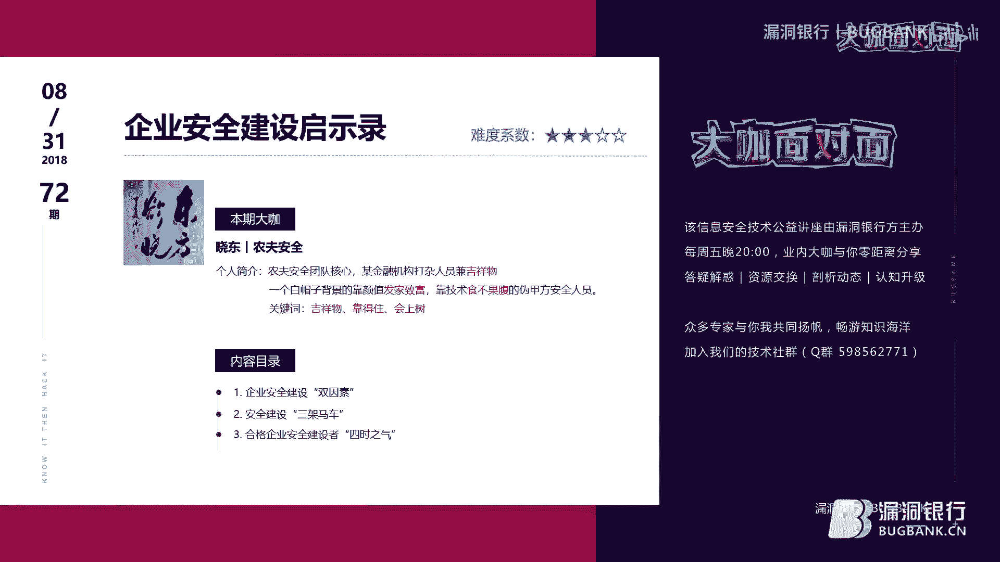
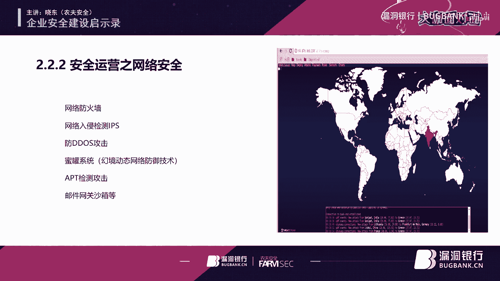
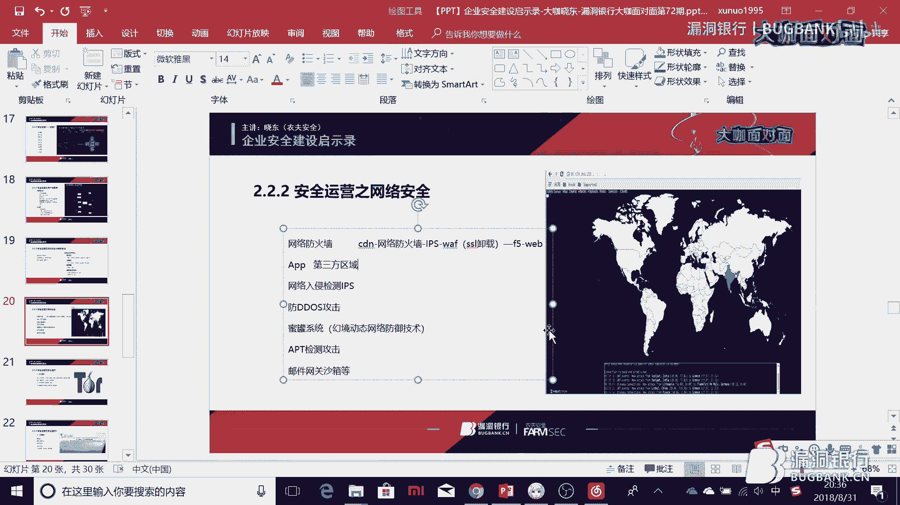
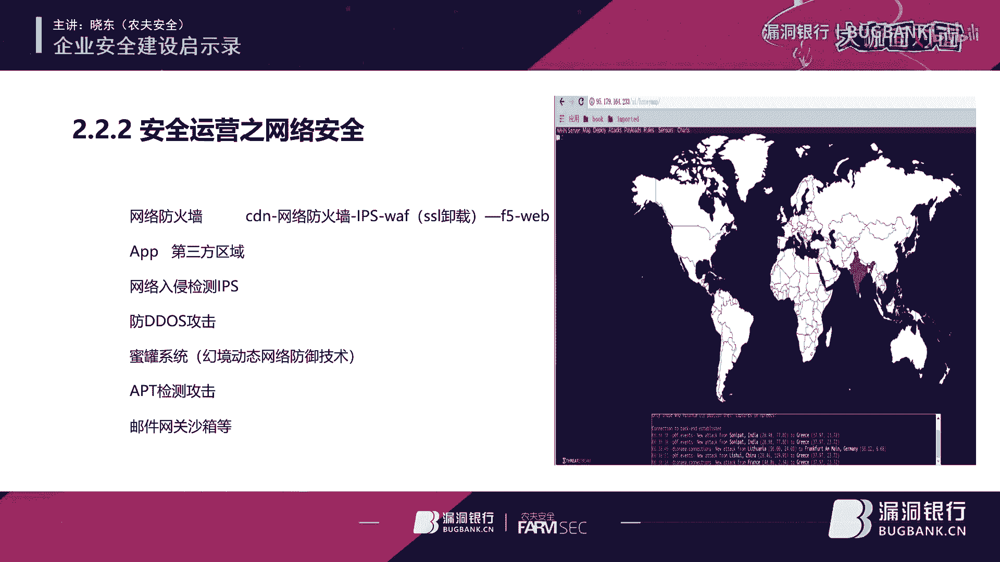
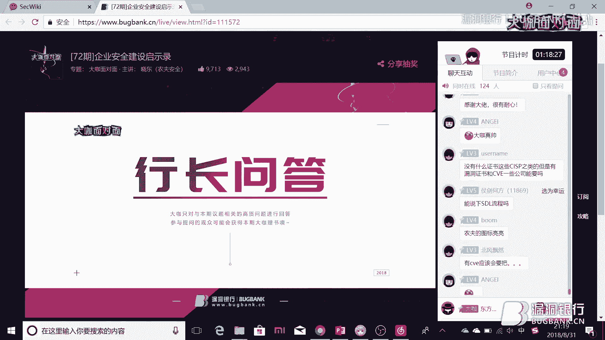
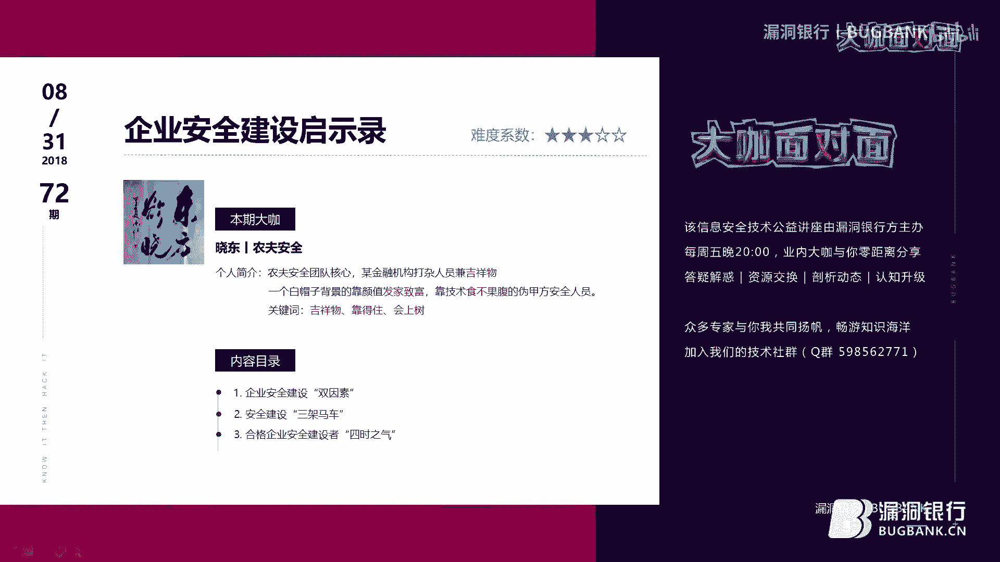

# 课程 P1：企业安全建设启示录 🛡️

在本节课中，我们将跟随农夫安全团队核心成员小冬的分享，系统性地学习企业安全建设的核心框架与实践经验。课程将围绕“双因素”、“三驾马车”和“四时之气”展开，旨在为初学者构建清晰的企业安全认知体系。

## 概述：企业安全的定义与定位

上一节我们介绍了课程的整体结构，本节中我们来看看企业安全的基础定义。企业安全建设首先需要理解两个核心因素：**企业**与**安全**。

企业可以根据其业务驱动模式分为三类：
1.  **科技驱动型（互联网公司）**：以BAT为代表，用户数据是其生命线，对安全要求极高。
2.  **金融行业**：与资金直接挂钩，安全是业务基线，安全部门通常与开发、运维等部门平级。
3.  **传统行业**：安全部门可能挂靠在运维等二级部门下，安全制度推行难度较大。

安全在企业中的定义包含三个层面：
1.  **安全即服务**：安全是业务的保障线，为业务创造价值，两者相互促进。其目标是保障业务的**保密性**、**完整性**和**可用性**。
2.  **安全即合法合规**：如《网络安全法》和**等级保护**制度。合规要求可作为推动安全建设的助力。
3.  **信息安全人员的定位**：在企业中，安全人员需要与开发、运维、网络等部门协作。策略是“三分逗，七分捧”，通过帮助他人解决问题来提升自身地位和推动安全策略。安全人员的终极目标是“站着还把钱赚了”，这需要：
    *   获得**自上而下的信任和依赖**。
    *   实现**自下而上的排忧和解惑**。
    *   保持**自内而外的自信和理解**。
    *   展现**自外而内的专业和博学**。

## 企业安全建设的三驾马车 🚀

理解了安全的基础定位后，我们来看看支撑企业安全体系的三个核心支柱，即“三驾马车”：**管理**、**运营**和**技术**。它们共同对应于PDR模型（Protection, Detection, Response）的事前、事中与事后阶段。

### 第一驾马车：管理（方向）

管理为企业安全建设制定方向和策略。其职责偏重理论体系构建。

以下是安全管理的主要职责范围：
*   制定信息安全发展规划与体系框架（如ISO27001、等级保护）。
*   建立信息安全组织、人员管理与制度体系（通常包含四级文档）。
*   进行风险管理、规划与建设。
*   配合各类监管检查（如等保测评）。
*   处理跨部门（如市场、法律、财务）的沟通事宜。

### 第二驾马车：运营（常态）

安全运营是日常工作的常态，关注于资产的持续监控与响应。它与系统运维有区别，更侧重于安全维度。

以下是安全运营的核心职责模块：
*   **资产管理**：梳理互联网、办公网资产，包括域名、IP、端口、服务、负责人等信息。
*   **应用与数据安全**：部署WAF防御常规攻击、提供虚拟补丁；利用动态防护产品应对撞库、虚假注册、薅羊毛等业务风险；防止数据泄露（如防爬虫、防遍历）。
*   **网络安全**：管理防火墙策略、网络入侵检测（IPS）、抗DDoS设备、蜜罐系统及APT检测。
*   **安全监控与情报**：监控内部网络行为；从论坛、暗网、GitHub等渠道搜集威胁情报（如钓鱼网站、信息泄露）；处理CVE预警并组织应急响应。
*   **人员监控**：通过上网行为管理、桌面监控、DLP产品等，防范内部风险。

一个有效的安全运营应形成“威胁情报 → 安全监控 → 应急响应 → 安全加固”的闭环。

### 第三驾马车：技术（支撑）

技术是管理和运营得以实现的支撑。其职责覆盖安全生命周期的各个环节。

以下是安全技术工作的主要职责：
*   **安全评估与检测**：进行渗透测试、漏洞扫描、代码审计。
*   **安全开发与工具**：编写脚本、工具以辅助工作，或对内部系统进行二次开发。
*   **应急响应**：处理安全事件、漏洞预警、监管检查及客户投诉。
*   **漏洞全生命周期管理**：
    *   漏洞来源：上线前测试、扫描结果、WAF告警、外部通报。
    *   处置流程：通过漏洞平台对接CMDB和工单系统，指派给负责人修复，并根据漏洞等级（高/中/低）设定修复时限。
    *   分析与改进：定期分析漏洞趋势，对高频漏洞团队进行专项培训，对供应商进行能力评估与淘汰。

### 三驾马车的聚合与考核

安全工作的成效需要通过可度量的指标来考核，核心指标通常包括：
*   安全事件数量
*   漏洞发现与修复数量
*   威胁发现能力
*   各项安全建设任务的完成情况

## 合格安全建设者的“四时之气” 🌟

掌握了企业安全的框架后，最后我们来探讨一名合格的企业安全建设者应具备哪些内在素养，即“四时之气”。

以下是合格安全建设者应具备的四项关键素养：
1.  **攻防兼备，干活不累**：兼具攻击（如白帽子）与防御视角，并能将技术能力转化为实际产出。
2.  **思维灵活，说少做多**：谨言慎行，尤其注意企业沟通（如邮件）的措辞；多通过线下沟通达成共识，再辅以正式邮件确认。
3.  **好事多磨，别一蹴而就**：处理问题有耐心，讲究方法。推动工作时，先尝试“哄”（协作），必要时再借助上级权威（抄送领导）。
4.  **心态平和，立地成佛**：保持平和心态，与人为善。在企业中，良好的人际关系能极大提升协作效率，避免因流程拖延。

## 总结

本节课我们一起系统学习了企业安全建设的完整图谱。我们从理解**企业类型**与**安全定位**这一“双因素”出发，深入剖析了构成安全体系的**管理、运营、技术**这“三驾马车”，最后探讨了安全从业者应修炼的**四项内在素养**（四时之气）。希望本课程能帮助你建立起对企业安全工作的宏观认识，并为未来的实践提供清晰的指引。