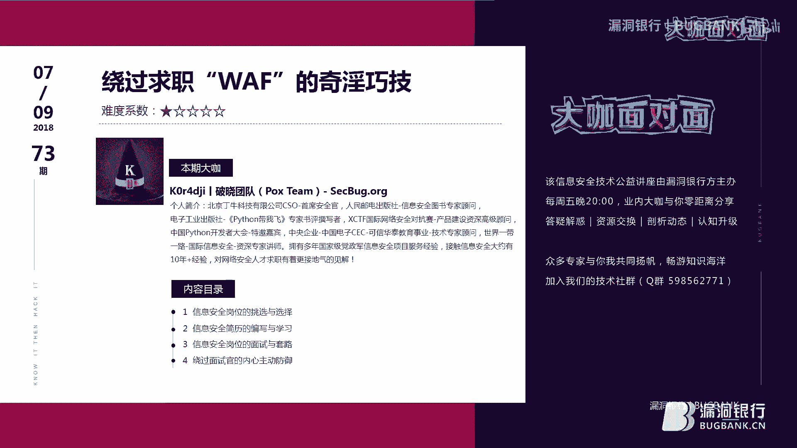
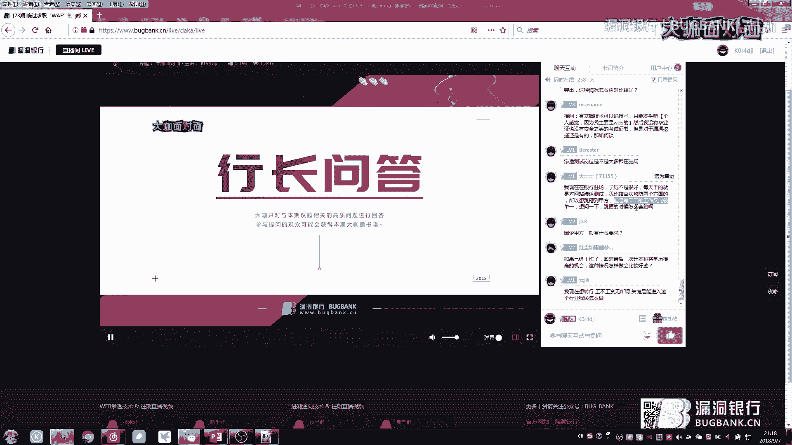
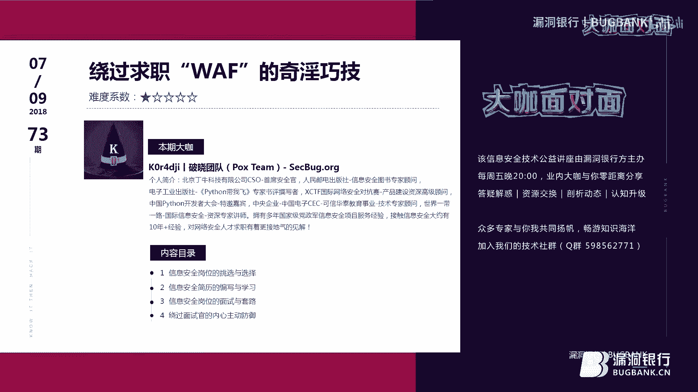

# P1：73期丨绕过求职“WAF”奇淫巧技-K0r4dji - 漏洞银行BUGBANK - BV1ct411f7MN

为知识而成，因技术而生。小朋友晚上好，欢迎参加第73期漏洞银行安全基术直播。打开面对面，我是主持人秋秋。今晚我们请来的一位大家都很熟悉的大咖小K小K现任北京丁牛科技有限公司CSO首席安全观。

是人民邮电出版社信息安全图书专家顾问，是世界一带一路国际信息安全资深专家讲师。他的个人履历实在是太过丰富。如果我全部要讲过来的话，怕是要耽误太久，所等等希望小K亲自来告诉你们吧。

这次小K是第二次来乐洞银行办直播了，他是2017年乐洞银行年度大咖最将最佳弹途奖样的获得者。那如果去年你没有看过小K的演讲，今年这场限定分享，就让知道K做的厉害。那今晚你将全面了解到安全人才的求资技巧。

小K还会教你如何撰写简历，以及绕过面试官的心理袜uff内容超级丰富哦。那再配上小K大咖的口才的话，今晚包你不会觉得枯燥，还能看到最后。在小K演讲之后呢，我们会有一个旁转问答环节，小K会挑战问题五十连展。

哪怕是又要过我们直播记录了。所以观众朋友们，你们可以大胆的提问，今晚只要有求职相关的问题，就可以畅所欲言，不要错过机会。问答结束后，小K会选择一名幸运观众，赠与他曾撰写过专家收评的书籍。

python带我飞。那认真听讲，参与互动就有机会获得。好了，我介绍完毕了，下面就请小K开始分享吧。

大家好，欢迎大家来漏洞银行听我的这个求职的课程。那么这堂课程的。嗯，主要内容是围绕求职为主，而不是技术方面。因为我觉得你技术学的再牛逼。你在求职的道路过程当中所遇到的问题，有可能是你无法预料的。呃。

也就是你在学技术的时候，你可以百度，但是你在求职的时候还是有很多的这个情况会发生，有可能会百度不到，是百度不到的情况，也有可能会百度的道，但是你读不懂啊，根本就看不懂它到底是什么个套路。

所以这堂课呢主要是围绕以这个内容为主啊。可以大家先看一下目录啊，目录第一个岗位的选择。第二个简历的编写。第三个呢是。这个岗位的面试。第四个是面试官的这一块啊，岗位的面试呢是基本的一个套路。面试官这块呢。

他又有别的其他的套路，也就是让你们了在求职之前或者是已经工作过的。了解一下他面试官他应该是一个什么样的态度，对吧？并且呢他岗位的面试上，他都有哪些流程，或者是哪些一个。比较容易走的弯路。

还有简历的编写这块，它涉及到你的求职门面岗位的选择呢，也就是你的这个选择的方向。看一下第一个啊看一下第一个。岗位的选择，也就是技术第一系列。技术第系列呢我列了大概10个岗位。

这10个岗位呢是在网络安全这个行业里经常看到的岗位。那这些岗位里我相信有很多的观众他呢也是从事过的，甚至有的他想转行，他只是看着眼熟，但是没有真正的去做过啊。

我这里不太嗯不太想一一解读每一个岗位都是做什么的啊，不太想解读每个岗位。因为那个比较浪费时间，所以说这个东西你大概看着眼熟。就可以了，就足够了，没有必要说一个个都把它分析出来，没有问分析出来。

因为这些东呢这这些岗位都是做技术方面啊，做技术方面。第二个啊第二个是岗位的选择，我们也就是我们的管理地。管理地呢，什么总监啦啊，部门经理啦，各种什么官了，对吧？什么C叉O了这种的。你像这种的话呢。

你也可以选择去挑战。你也可以选择不挑战，也就是你入到一个行业里，你总归要选择两个方向。特别是IT技术类，你到底是做技术呢，还是做管理呢？管理有管理的这个学习方法，技术有技术的学习方法。

你总不能说我技术和管理都做那样常规的正常企业是不会的，除非是创业企业，创业企业是这样。所以说你在听课之前。对于技术岗。和我们的管理岗有一个简单的了解啊简单的了解。你要是别的看不懂的话。

经理跟总监总能知道吧，哪个等级高，哪个等级低，对吧？你心里肯定都能清楚一些。那么面对岗位的选择。我们该怎么去学？啊，第一种情况我不太爱说话，就是喜欢技术，什么管理的就不要再来烦我了，沉迷于技术无法自拔。

第二种情况，比较擅长于表达技术基本功维非常的扎实，又有人脉资源。第三种情况，技术做的不不够深，管理又没经验，资源人脉又不够。第四种情况，我也不知道我能选啥啊，我也不知道我选啥。

其实啊其实这种的选择的话呢，是针对于你个人，针对于你个人。也就是说你更擅长于做什么。比方说你更擅长于做技术，你不不太想做管理，因为大家可能都知道做管理需要写大量的文档文案啊。

甚至说各种的一些个琐碎的事情可能都会过来，对吧？影响你对技术的上的追求。那么你就一直选择做技术就可以了啊，做技术就可以了。那么你像第二种情况啊，第二种情况，比较擅长表达技术功底又非常扎实。

有资源人脉这种你可以挑战一下管理岗去试一试，为公司团队做一些个。呃，相关的能力上的输出或者是品牌建设、形象推广等等都可以。第三种情况，技术做的又不深，管理又没经验，这种资源人脉又不够。这种你要反思了。

这种情况你绝对需要反思个人，你反思一下自己，你的定位是什么，你到底要做什么，而不是随波逐流，看别人觉得做网络安全挺好玩。嘚一下子你也进来了，进来以后呢，你你跟着别人跳来跳去，跳来跳去。

最后做的四不像技术又不像技术，管理又不像个管理。对吧所以说千万不要成四不像的群体，那样对你的损伤特别大非常大。因为你白白你因为你这样的话，你又白白浪费了很很长的时间啊。第四种情况我也不知道我能选啥。

你像这种不知道能选啥，说白了你还没入行，就是即使你入行了，如果你入行了三年以后，你还不知道你选啥。那我觉得这个行业可能不适合你。因为你都你都在这干了3年了啊，干在这干了3年，就算一个新手。

他也能看看清楚一些市场，看清楚一些套路了，还不至于说也不能不知道选啥的这种状态啊。其实这个总的来说，技术也好，管理也罢，你不挖掘你自己的潜能，公司没办法定位你，你只能做一条咸鱼。

这句话我说的一点也不过分，确实是这样，社会就是这样。你去任何一个团队，甲方也好，乙方也好，对吧？你不去发现自己到底能做一些什么，或者说自己一些个没有被挖掘的潜能，不去挖掘，不去尝试的话。

你去公司面试面试官。就是要。都不知道给你定位什么什么样岗位好，是定位技术也不对，定位管理也不对，那定位个啥呢？定位行政那更不对，对吧？定位HR那更不对了。对吧所以说他你自己都不清楚你到底要能做什么。

你不挖掘你自己潜能，你去面试呢，那面试官怎么能给你定位好，对吧？那肯定是定位偏的，所以说是非常不合理的一个状态。那么针对于岗位的选择的话，我们看一下五种情况啊，第一种情况叫疑惑。好紧张。

面试好像不过怎么办，还怎么选？第二种情况，放弃好紧张，面试官太厉害，没信心选。第三种情况比较慌，好紧张，我都懵了，不知道怎么说话，乱了阵脚。第四种情况比较扎心啊，就是完全被面试官碾压，被鄙视。

受了很大刺激。第五种情况，困惑。到底让我干哪个岗位，我到底适合哪个？我相信五种情况能包含住听众的所。80%的人群吧或百到90%的人群，这5种情况绝对符合你们在当时在面试的时候的一种心理状况，对吧？

所以说你看我底下的文字，写着你跟企业其实是双向的选择。你也在看对方，对方也在看你，你面试失败，不代表你这一辈子都会是失败的。其实有的时候我想跟你们说，面试官比你还黄，为什么这么说？

因为你想有的时候他面试官着急招人。他因他呢着急招人，又想着急佣人。着急招人跟着急用人它是两个概念啊，着急招人说白了就是我有可能不缺人才，但是呢我这岗位又不想让他空着，着急用人是什么呢？

就是我不管三七二十一，我就是要用这个人。啊，就即使他底子不好啊，着急招人，他有可能有个门槛是什么？就是你的技术门槛可能要相对要高一些。但你着急用人的话，他门槛可能会下降。

所以说你在选择岗位或者在选择企业的时候，一定要摸清楚他到底是在着急招人呢，还是在着集用人。你把他企业背后的招聘诉求，你最好能摸清一下，摸不清呢也没关系，对吧？所以说针对这种情况，你摸不清就摸不清了。

你可以去试一下。你在面你在跟面试官面对面尝试交流的时候，你就能感觉出来他到底是在用人还是在这个招人。我相信你们能有这种感觉。大在大企业的这个安全企业或在这个小小的企业，他都有这种感觉啊。

所以说在选择的过程中，针对这个这五种情况吧，总结的来说啊。就是你要去尝试你要去尝试，你不要觉得我简历扔过去了，pass了扔过去了，pass死了，扔10家pass10家扔10家pass1家，最后不玩了。

啊，最后不玩了。那我现在就反问这样群体这种这种一句话，就是你当时为什么要选他？很多人说了啊，我是为了兴趣，那为什么为了兴趣，为什么不走下去呢？就是你为了兴趣的这个选择岗位的时候。你根本没有下决心。

你欠缺一个决心，你只是为了简简单单的兴趣。你没有这个决心。所以说你在岗位选择的时候，在面试的时候，你压根儿就没有做到说让自己充分的发挥出自己的优势来。导致你在面试的时候肯定是要被pass的。

想都不用想啊，这是岗位的选择一种情况。下一个呢是这个简历的编写。简历的编写。我给大家说一下，大家可能觉得啊简历编写有啥呀？简历百度下个模板不就完事儿了吗？对吧？还用编写什么呀，对吧？

这个时候呢你要有这种想法呢。我也不说什么，他也是正确的。但是针对于有一些人他是错误的。针对什么样的人错误吗？就是那种没有什么经验的。因为啥？因为模板上有啥，他就写啥，他有东西。

他压根儿他就不会往上再去填了。比如说个人信息对吧？你的姓名、年龄、性别、出生年、出生年。我不要月日，我又不查户口，你的籍惯是哪？你这也就是你的老家，你的现住是在哪。其实面试官看看你现住的地方。

他要看看你的距离，他要看你的上班的距离啊，因为啥你距离远，他有可能你你这个求职人员有可能跟面试官去砍价了，就要价，要价可能会很高。哎，我住这么远，你应该跟我很高的工资，他有他有面试官，他在分析你的时候。

他可能会有这种心理。你的经验，也就是他要知道你工作几年了，你接触安全有几年了，对吧？他心里要有数，还有你的这个ID你要是常活于这个行业内的话，你的ID如果说这个比较有名的话，其实你在写上面呢也可以。

如果你要ID不有名，你就别写了，啊，没准还减分呢，对吧？因为这还减分，你的邮箱。因为啥，因为。HR他呢他要给你发送这个email邮件啊，email邮件。还有你的这个电话啊，还有你电话。

很多人啊简历上我在帮别人弄简历的时候，我发现一个问题，电话都写错了。我我当时没有留意没有留意呢，因为我没有备注他电话号码，所以说我看到电话，我就没纠结这个少写了一位的啊，把八写成三的啊。

什么什么情况都有，反现电话写错了，导致我在帮你自己的投递简历，或者说我在帮你投递简历的时候，就会发生一种情况，就是企业无法给你打打进电话，就放弃了，就可能不要了啊，就不要了。

因为你想一个能把电话写错的人。你觉得这种人能要吗？企业肯定会这么想，企业肯定会这么想，还有一种情况就是简历扔过来，没写电话写了一个QQ，难道你要让面试官加你QQ去聊吗？这都什么年代了。你还在用这种方式。

我觉得真的是不应该，你应该成熟一些，把你的电话放出来，再说你投的是企业，又不是一些做不正当的像那种那个黑色产业的那种，或能把你怎么样的，又对方又不是土匪。对吧我觉得没有必要，因为这种情况的话。

真的还是会有的，就留了QQ电话呃，电话没留，就留QQ或微信。完了，你这种情况完全就是。很让面试官很不想找你，真的很不想找你。另外一种情况就是你的证书，就是你的荣誉，对吧？我获过哪些荣誉，有哪些证书啊。

他要简单的看一下，这叫个人信息简介嘛，对吧？这也是个人简介信息简历里的对吧？这是。这方面你们大概要了解一下，看一下啊，我每一个括弧后面我都写了文字，就是让面试官让你们看到面试官的心里到底是什么样子。

再呢就是简历的编写技能技能技能方面啊。技能方面我曾经收到过一份简历，他从他的所有技能全从头到尾全写在精通。我当时我都看愣了，我就觉得这个人好牛啊，算了，不要了，因为什么很不现实。

没有一个人是把所有技能都全部精通的。啊，没有人敢这么写。所以说第一个阶段是你了解，第二个熟悉。第三个掌握，第四个才是精通。啊，所谓的了解就是你大概大约听过的熟悉的是你用过的，看懂我知道的。

掌握的是你会用的，会玩的，还能玩出花样的。精通的是随心所欲，怎么装叉都拦不住的那种。啊，所以说我看到那份简历精通，那我理理解为。呃，你就是万能的了，你就是你就是gad，你这么牛还来我这干嘛，对不对？

所以说容非常非常容易被pass掉。这个是简历的编写技能经验，用词上一定要慎重，用词一定要慎重，千万不要。有人啊他写那个office，京通office办公。我都我我当时我都看愣了，精通office。

我寻我办公这么多年写了这么多文档，都已经上百万字了，我都没敢我都没敢写精通，他都敢写精通。那好，精通。拉过来一面试不行，差太多了，根本就处理不了，只能处理简简单单的。其实高级点的，你像文档类高级的。

它都可以用这个office红代码去处理文档。你精通的话，那就说白了你的编程红代码都都已经很精通了呗，完全可以就是达到那种神一样的级别了呗。我只能这么理解，所以说办公文档office千万不要写精通。

因为如果你要写这一点的话呢，你要能做到也行，对吧？你要做不到，千万不要写啊。再就是这个求职意向。所谓的这个求职意向就是。到岗时间着急用人，你啥时候来呀？第二个工作性质。你是全职还是兼职？求职行业。

你是哪个行业？是金融行业？快递行业。医学行业、安全行业还是什么行业，你要写清楚。还有你要求职的这个地地点，也就是你在去找这份工作的时候，你要写在哪个城市上班？期望薪资目标的职能。

目标职能就说白了你的这些技能。都能做什么岗位。就是你写了一些个什么精通啊，了解掌握啊这些技能，你到底能做什么岗位？你先对自己有一个定位，HR才会对你有定位。目前的状态他要了解一下。

你是离职了还是在职观望一定要写上是不是能出差，长期拆可不可以？驻场可不可以？什么叫驻场？也就是你是A公司的人，派你去B公司上班。但是你的工资呢是由你A公司给你发，这叫驻场人员啊。

也就是你上班天天都要去B公司，但是你是A公司的人啊，为客户提供服务。这典型的是这种乙方的服务心态那服务套路。还有一个期望的成长，这你写不写都行，你写了也行，不写也行。啊，这个呢是简历编写当中的求职意向。

光一个求职意向就有这么多东西。你回头检查你的简历是否满足我这些个基本要点。这都是基本点。如果基本点你你这块没有写上的话呢，对你来说影响不是很大。但是你写全了以后。

对于你的这个简历上的这个精神面貌会有一个很大的改进。另外一个简历的编写，也就是我们的工作经验。你工作经验的他肯定要知道你在什么部门啊，部门多少人呢，任职哪个城市啊，任职哪家公司啊，什么性质了。

任职时间是多少，岗位叫啥呀？这个对吧？你的公司到底是什么性质，是民营企业了还是国有企业了，对吧？你的工作内容是什么呀？你的公司规模是多少，你目前什么状态啊，你离职的原因是什么呀？

你想都不用想HR肯定会问一个我我觉得一个稍微有一年以上的经验HR或者两年以上HR经验的唉那个人力资源HR我觉得这些问题他是要问的，包括面试官技术面试官本人，他也要是要过问一些问题。

对吧我希望呢你把这个工作经验这块呢，你这块你自己参考这个东西，我列出来是仅供大家做了一个参考，不是说绝对必须要写。但是你不写，你试试。啊，你试试肯定是要问，但是问你这些问题，我觉得是在浪费时间。

我觉得是浪费一个求职人员的宝贵时间。因为他有可能有很多家面试把问题都抛在这上面去问的话，我觉得太浪费时间了，不如写在上面，你自己去看你点到哪个，我就给你说哪个就可以了。他不会都点你个面试官在面试你简历。

看简历的时候他不会都看不了，不会都点，他只会选一部分。啊，这是工作经验这块。相关经验啊相关经验。你在平台提交的漏洞啊，或挖到什么漏洞，或或者说你在做某一项技术所突出的点。对吧比方说某系统渗透测试完了。

你你让面试官看啥呢？你让H官看什么呢？这简历一一一拎出来一看某系统测试，某系统测试全是某。倒也没问题，但是你某系统测试。你这个项目多少人才参加项目大概是做什么的，用了什么工具，用了什么技术。

碰到什么问题，怎么解决的问题，发现了哪些漏洞，有没有什么感悟，所学了什么知识，对吧？上了一些某系统渗透测试完了。就这这对于1个HR来讲，他内心是崩溃的呀。即使你前面写的很出色，到这块你要是不完善一下。

他一样会扔你简历。你们可能可能不知道啊，我虽然没有职业做过HR，但是我看过HR的工作状态，大大大概看过他所谓工作状态，就是他每天要筛选。呃，好几十份甚至上百份的简历，看不顺眼的就扔。

所以说你的简历首先第一关，先让HR看顺眼。再说别的对吧？这个是简历的编写相关经验的这这个模块啊所写的东西。再就是其他信息什么呀？自我评价，关注过哪些论坛社区发表过什么文章，哪个大会或沙龙演讲过。

参加过哪些CTF比赛，什么名次，什么学历，什么什么民间团队，这些你都可以写，你也可以不写。但是你写了呢，对于面试官对你对于你来对于面试官来讲，他对于你有一个重新的认识，或者是一个加分方面的一个认识。啊。

也就是职场砝码上的一个提升，这是简历的编写。所以说这个东西你写也好，你不写也好，我不难为你，你写了呢，它有可能加分，其使减分他也减不了多少。啊，这是面试官对你一个全方位的一个了解。

这样的话你才能去方便去谈价格。去谈价格。那有的人说了，那我求职就靠吹，那想就不露馅了吗？那是你自己。让那你自己我就看你能吹到什么时候。对吧我就不相信所有公司你都能能吹下去。

我觉得很多公司领导都不是傻子啊，你吹吧，你吹下去，早晚有天露露馅，露馅以后你你就完了，圈子就这么小。😡，圈子就这么想的，只要谁有点动静哈，一传播都知道，大家都知道，这又不是做软件工程圈。

又不是什么其他圈子，安全它这个就是很小。干点什么事情一串播就都知道。啊，所以说这里你要就一个有这方面的你要注意一下。简历的编写它呢有哪些这个套路，我给大家做一些提示啊，你简历写了什么。

面试官就问什么装逼可以，但是切记不要超出能力的30%，你一定要把控这个点，你装叉可以，你怎么装都行。但是你装叉的这个高度超越了你个人能力的30%，那你可能有危险。你可能就有危险，常在河边走。

你可能就得湿血。你可能。刚在河边走走一下，你就湿血了，没办法。经验少不可怕，可怕是你不会量化自己，对吧？什么叫量化自己？我写那些简历套路，其实就是帮你在量化你自己。这个简历的这个东西哈，如果你很牛。

经验很多，你可以两页简历就可以了。如果你刚求职，我推荐呢，你可以写三页，但是不要超过3页，最多不要超过5页。嗯，真的是不要太多面试官哈HR没有时间夸夸去把你这些东西多翻一遍。特别翻到第三页的时候。

每1个H面试官和HR他在阅读你简历的时候，他会有一种心态。就是不会一个个去看了。只会看你前面一两页，所以说最标准的或者是最优化最好一些的啊，废话不多的。

提炼非常干净利利落的那种两页或两页半足够别超过3页，上线是3页啊。对手很牛，没事儿，就怕你自己不敢谅剑。一份好的简历会赢得HR姐姐们的喜欢。对吧我说这个东西其实对于你们来说可能是废话啊，当然你不信呢。

没关系，你不信可以试一试啊，您可以试一试。好，我们接下来看一下这个岗位的面试，整装待发。什么叫整装待发，别穿着拖鞋就去了。头发呢也不整整是吧，对吧？就就就去了，所以说给人一种就是精神面貌上。

他就会给你减分。因为有的时候一张面试表格，它会有精神面貌的打分，有的企业可能会打，有的企业可能不会打啊，所以说这种东西啊，尽量即使你很牛是吧？但是你要尊重一下别人，对吧？这毕竟是公司不是你家。

即使你很牛逼，我希望呢你也要尊重一下你的对手，你连你对手都不尊重，对吧？你怎么可能尊重你你入职以后的同事呢？怎么可能肯定是不可能，对吧？第二个就是岗位的面试。我们的信息收集的这个阶段。什么叫信息收集啊？

你们学了这么多渗透了，信息收集不用我再讲你们所谓渗透信息收集是收集一些站点啦、域名啦、目录啊就各种的我们这个面试的这个信息收集。第一个，对方公司调查多少人，什么性质，产品是啥啊。

搜罗你自己的人脉这个网络查相关一些信息。看看明天面试过的人都什么战斗力，擅长什么。从情报里看看HR的这个基本的一个套路与信息问吧。跳槽过去的话，薪资涨幅比例是多少？要面试的部门是干嘛的？

更注重和定位是什么？了解里面有多少个坑，看看这个部门是不是大坑。所谓大坑呢，你自己去去揣摩啊，看看领导平时的管理关怀是不是都是套路。底下的人都是什么水平？高手占比是多少？

求职薪资对于我这个岗位的平均数值是多少。所以说你把这些所有信息数据都做一遍啊，都做一遍，做一个分析。你在面试的时候，我相信你在要价格砍价格，甚至说跟对方切磋价格的时候，我相信不会太离谱。

你有可能拿份简历过去了。哎，你好，我过来面试要价多少？面完了，你要要价要15K，其实是刚毕业的。对于一个刚毕业，你这些信息收集并没有收集就去盲目的要，那你肯定是面一家失百家面一家失败家。

你在玩大海捞针的这个战术，什么叫大海捞针？就是投100份，可能就有一家公司要你。但是我觉得你这个时候太浪费时间了，不觉得扎扎实实的不如把自己前期的工作做好，去扎实的让自己的飞得更高一些。我觉得这样更稳。

没有必要说玩大海捞针这个战术。因为我觉得现在这个年代你去玩大海捞针，我觉得。有点可怕，非常可怕啊。第二个啊这岗位的面试，也就面谈面试。面谈面试啊面谈面试。所以说面谈面试这个东西啊。

因为我之前啊呃因为大家可能都知道，我在这个之前在那个书PPT的时候，帮他们弄过这个相关的这个简历，还有帮他们有一些个企业的合作啊，那是我个人团队跟他们的合作我拿他们的案例来说呢。

就是他们呢有的时候呢是这个简历啊或什么的是都一样啊，都一样。这个并不可怕，这个并不可怕。就可怕的是你在面谈面试的时候啊。你的这个行为言谈举止可能会发生一些变化。每个人他。有的时候一说面谈了，金彪要紧张。

说不出话来了。其实啊你们无论是培训机构出来的也好，还是从大学出来也好，简历都一样。你记住了并不可怕，可怕的是你自己知道简历一样了，还不去上进做改进，或者说跟随别人的这个脚步，别人怎么走，你怎么走。

但是你没有想过，你这么走以后会发生什么后果。你从来不会想这些问题啊从来不会想这些。所以说我看到一些个呃简历一样的，我从来不会说他们，我把简历放一边，我直接看他们的这个出一些个情景型的问题。

或者说一些技术型的问题，或者说一些思考型的问题，抛出来，让他们去看。啊，所以说每个人答的可能都不一样。这个时候面试官看的就是这个了。所以说如果你你你跟你的小伙伴两个人都是自学出身，简历改真就是一模一样。

那么我希望你们这样的做法，尽量别就就是尽量避免一些减少一些这样的做法。因为这样是比较危险。这样比较危险，对吧？毕竟你们俩人改改就不一样啊。再就是这个笔写的面试。什么笔险面试。

他考察第一个考察对求职者的岗位、技能基础、思维能力、知识范围、目的的耐心，还有知识的熟悉程度啊，有人觉得笔试题那么难，还让不让活。其实他笔试题出难哈，有时候并不是针对你一个人，他呢是企业呢。

他对于人才的筛选，他也是在大海捞针。他就想看看这套题，他能不能有人做出来啊笔起来面试。所以说你做出来也好，没做出来也好。不要去想你之前做过的事情了，你要想你下一家该怎么去面啊。这就是电话面试。

电话面试电话面试有有的人啊在那个信号不好地儿打电话从那围了半天。跟跟企业喂企业这个边喂，这边听不着哎，你好，哎，听不着，哎，就就这半天过去了，你就完全是在浪费时间。我跟你讲，你听不着，你就说一声。

听不着嘛，你想浪费时间干嘛，是吧？你就实在你听不着对方，你跟他说，我们这个信号不好，我5分钟10分钟以后，我打给你。啊，打理你这边。所以说你针对于这块来讲，你要有一个礼貌，听不着了，你给他发个短信。

发个微信。网要是不好或什么的呢，你就完全呢可以回家充上电以后再跟他说，我刚才手机没有电了，网也不太好，所以说。你那边面试呢，我这边没有接到，那您现在有空吗？对吧？你客气一点，你别到时候一一说听不着哈。

你挂了就不理人家了，你不要玩这个套路啊，这个套路对你来说没。很惨的，对你来后果顶多是。没有这机会了没有了。那企业不会因为你再去什么的，他那么多简历不差你一个人。因为电话面试呢，他是异地求职。

电话比较方便，简单对求职有个大概了解，就是大概了解以后呢，我们可以对他有有一个这个相关的一个套路准备啊，因为他呢有的时候会远程面试电远程视频面试这些情况也也会有也会有。

因为简历的有现在大部分这个简历水分有时候比较大，所以说面试官现在也害怕，他也害怕啊。所以说在岗位面试呢，我完全可以建职兼职职场去做他的职场面试有两个套路。第一种套路是拿着简历跟你聊。

第二种套路不拿简历跟你聊。不管对方拿不拿简历啊。你要自信一些你要自信一些。有的人一看，哇塞，面试官不拿我简历就直接跟我聊了啊，所以说你要遇到这种情况，你要自自信一些就可以了啊，这种场景。嗯。

你不要担心太多，原念太多，问啥答啥就可以了，你也不要吹的把自己都吹出花来，没必要。这个剩余这个就是。在岗位面试的时候，一些套路啊。就是你这个。答问题。你看啊答问题。答不上来不可怕，重点是你答不上来。

还不给人思路。这是最可怕的。因为每一个面试官所问的问题都都是不一样的，而且他门槛也不一样。针对于个人能力水平，他也不一样。所以说问的问题他不一定所有人都能答得上来。你答不上来。可以。

你给你面试官一个思路，就是说这个问题我虽然答不上来。但是我针对于解决这个问题，我有几个思路。第一个思路。第二个第三第四咔哈一抛出来。其实你答不上来，面试官已经觉得无所谓了。他会觉得你解决这个问题。

思维很发散。他非常喜欢，大部分面试官都会很喜欢。他会觉得你值得培养。土来那个这个早期我们这一个啊那个水来降挡。啊，这个这个这个这个我相信大家可能都听过啊，其实呢我是故意把它写写错的，因为啥？

因为是兵来将挡。啊，水来土掩。我是写的是水来降挡。为什么要这么写？其实我写它原因就是。你在岗位的面试的时候。其实就如洪水一般，真的是就如洪水一般铺天盖地的那种就跟下冰雹一样的打击你啊，奇葩的问题啊。

都会砸到你头上啊，都会砸到你头上。其实你在面试的时候就相当于在水里游泳一样。你最后游出来也好，没游出来也好，那我那要看你自己了。其实他面试官的最基本的内心呢。来确定你适合做什么，你的技术爱好是什么？

你的基础是好是坏，确定你解决问题的战斗能力啊，其实它无非呢。考就这几点好就这几点常规的来说就这几点。当然还有我没有写没有没有写。因为我觉得这四这四点是最常用的啊。再就是厚积薄发。

厚积薄发呢就是取决于你的知识，知识取决于你沉沉淀稳定的时候，这个时期还有你勤能捕捉的一个态度。自信呢取决于我可以，我不服你的态度取决于失败是成功之母，不努力一定没戏。啊，所以说厚积薄发。

它取决于三大因素。三大因素里面大概有6个点，这6个点我都写在上面了。你可以自己参考一下啊，当然这个不是我们要这个解释的重点，你做一个参考即可。再就是面试的时候，我们可以玩出花样来事半功倍。

我们可以走内部推荐。内部推荐的话，我们首先要观察一下内部这个人什么地位，内部这个人到底有什么权利，内部这个人到底什么关系，他决定你推你简历的成功概率。啊，推你简历的重功概率。所以说我们可以面试的时候。

采用事半功倍的这个套路去尝试走内推啊，所以说你内推你不要太高兴。我说了，内推的话，你这个人他在公司地位、权利关系，他都要去考虑。啊，都要去考虑，因为啥？因为如果说他没什么地位，没什么权利，关系呢又一般。

他也能推。但是有的时候他一看啊这个人推的。他呢有的时候就是也会也会叫你去面试。但是呢我觉得相比来说地位地位高，权利大，关系呢做的好一些。他事半功倍做的这个他在用这个套路的时候，他会发挥的更好。

我不管你是这个技术好也技术坏也罢。所以说目前我分析的是中国式的求职市场所用的时代的套路就是这样。如果换成美国或换成其他国家，我觉得这个套路不一定能行得通。

所以说我只能根据国情市场来给你们分析比较实用的套路。我只能是这样解释。第二个，外部引荐。什么叫外部引荐？他呢也要考虑他的关系，还有能力啊，能力外部引进到内部是有一定的难度，没有一定非常好的关系。

一般没有办法做到给你引荐进去。其次就是个人能力。我这中间写有个问号是其他因素，决定你积攒人脉可用程度的时候到了。也就是你的人脉所积攒的时候呢，到底哪些可用哪些不可用。那在那个时候，你要看你求职的时候。

你能不能用得上。啊，所以说事半功倍，我们这里有一个外部引荐的套路啊，外部引荐也就是我推简历的时候，我不是这个公司的人，但是我一样推过去了。啊，外部引荐啊。事半功倍的第三个套路就是人才紧缺的时候。

戳他软肋。怎么戳他软肋啊？我们可以看到圈内大量的广告招聘人数非常庞大，新成立的企公司企业这三点满足其中一点你就可以去上啊，这三点不是必要点，它是这种选择点就是大量的广告了，人数呢非常庞大。

新成立公司企业一般来说，其中一点只要满足你就可以去投。所以说一般来说成功率概率就比较大。因为它缺人呢，着急用人呢。啊，他不是这个着急招聘，他是着急用人呢。他觉得这个人即使能力太差，我们可以培养嘛，对吧？

他就去要。不要别太差，就稍微有那么点基础，他就敢要你这个人去培养啊，所以说在岗位的面试的时候，你碰到这种情况不要慌，很正常。这就是我们岗位。在面试的时候，他有一些畸形问题。什么叫畸形问题？

比如说我就问你给你一个人扔孤岛，让你怎么生活问这种问题。😡，我觉得你不要慌你不要慌。其实问这种问题呢也很正常，也非常正常。因为你难免会遇到面试官，他就要这么问，他不问你。这个声用测试都什么流程啊。

等级保护都是怎么玩的呀，对吧？二进制逆向这个用啥工具啊，他不会问这个。他就问一些个奇奇怪怪的问题啊，奇奇怪怪的问题。他问这些奇怪的问题，其实无非就是想看看你你到底是怎么解决的这些问题。

就是考察你的耐心了，考察你的思维能力，考察他都是有目的的。所以说碰到激型问题，你不要慌，你怎么想怎么答就可以了啊。再就是企业呃，我们在这个岗位面试的时候，会碰到抛砖引玉的情况。什么叫抛砖引玉？

企业会把项目遇到的问题做成面试题，大量释放招人的信号啊，伪造了玩伪造了啊，也就是你在去企业的时候去写答案去了。第一，企业可能会录用你。第二，为了套答案，不录取你。如果你被pass也算正常现象。

正向来说呢，增加自己的知识面。反向来说呢就帮企业干掉了一个问题。这就是抛砖引域。职场里求职，抛砖引玉，这就有这么玩的。这就这么玩，我就遇到过啊，我就遇到过啊。再就是我们其次要对于这个问题啊，不要后退。

当你觉得困难的时候，说明你在上坡。当你觉得舒服的时候，说明你在下坡，希望上坡的周期能超越下坡的舒服周期。如果你觉得困难，这个坑你爬不上来，你辞职去下一家公司，同样一个坑你也是爬不上来。

这个我觉得说到大很能很多大家这个心里去了，你你再细细观察你在跳槽的时候，因为什么跳槽。公司不好是吧，跳了，那跳到下一家，你还是觉得他不好，因为什么觉得它不好？说白了，你这个问题根本就没有解决掉。

你去下一家遇到这个同样的问题，你还是解决不了，没有用啊。没有用，所以说知难而进，在面试的时候要记住这一点啊。再就是什么。面试的一野路子西型大法，什么西型大法就是。社工社工谁呀？社工行业里的简历。你好。

我是公司某某技术人员想跟你简单交流一下啊，有有意求职嘛，简单聊聊，其实你有的时候没有办法验证他到底是不是这公司的人，有可能他就是同行。没有上班人，他就想看看上班的人简历长什么样，他呢就去社工别人。

社工别人呢就把别人简历拿过来，别人简历一拿过来，他就去改，改完以后改成自己，他就去面试去了。这样呢就把别人的能力呢就是别人编写简历简历的个这个套路能力就吸到了自己身上。所以叫西刑大法。

就像西刑大法一样神奇。啊，有这样的套路，你自己小心点啊，不要表怪我没提醒你，你在投简历的时候，最好是通过朋友或通过比较信任的这这种关系去投递啊，你要投递到别人手上。我真不知道说什么。

当然当然也有这种情况，没有办法验证，我又不认识谁，我只能去这样做，对吧？所以说这样对你来说也没什么太大的坏处，只是给别人增加了好处。其实这个岗位面试我有一个个人感悟啊。其实套路非常多啊，我一节课讲不完。

真的是讲不完。因为我遇到了太多种的套路，太多种的玩法，太多种的形式了，根本就讲不完。所以说我这里写了一个小感悟，其实这个社会啊没有你想象中美好。网络安全说是缺口几百万。实际上你自己看看就知道。

缺的几百万都是有经验的，不缺小菜鸟，但是菜鸟们为了求职，用什么套路都不丢人。就这个社会就这么牛。这个社会就这么牛，我说的是都是实在话，都是放的实话，他不真的是不缺那些个。就是没没什么经验。

他缺的就是有经验的。其实你在于一个新手阶段想求职的时候，用一些套路，我觉得不丢人。大家都为了生存，每个人所用的套路方法，这个手法，还有一些思维思想都是不一样的。我觉得他没没没做错什么，没有错。

我觉得他没有错，就都是为了生活，就这么简单，就这么实在。就这样。再就是什么？我们可以啊看一下。然后我面试的wa第一个。切勿好高骛远，不要以为你有底子，就就比方你有你有这个底层的基础，就敢放肆。

刚毕业就敢申请BHT，自己都不知道上进还想换工作，还想求职你没劲了。因为啥？因为我遇到一个问题啊。K歌。你说你说的这些技能啊，我没做过，我死磕行不行？我当时的心态就是。算了，我给你扔到腾讯那儿。

你去碰碰运气吧。其实我的内心是其实我讨厌这样的人，因为你知道我有资源，你是处找我要，我可以给你，但是你又自己不努力，你这是在砸我牌子。啊，而且毁的还是你自己，我牌子砸碎了，无关紧要，但你把你自己毁了。

我在下一次不会再给你放任何的资源，你自己靠你自己。真的是有这样的人，就是看自己。有点底子，我说你你把这个知识补了，你把这个体系看了，你在面试的时候可能用得上，对吧？有的人真去做了，做的人呢。

大部分都面试成功了，少部分人可能因为其他因素没有面试成功。但是没做的人呢，他从那跟我去要资源，要一些东西。我真的是不想给，我只能说。我给你扔过去，你去碰碰运气吧，你只能这样没有没有别的办法，真的没有。

😡，第二个啊，面试绕过风的时候，我们有个经蝉脱翘，叫尺度的把控，怎么尺度把控呢？我们大家可以看一下。你面试了10个题，你答对了9个，对方想压榨你就会再增加10个高难度题。这样的话。

你可能后面10个高难度题只答对了一个。总总的来说，你从十个对九题反向变了10个对一个，综合比例就是20道题，你对了10个，大大增加了你薪资被卡的概率。就是透就是面试的透。所以说解决方法。有风险啊。

解决方法是有风险。这个面试官说十个退九吧还行，再问点，你不让他再问了啊，再问他底下在出什么套路，你根本就不清楚了啊，你可能再接接不下来了。所以说求职者完全可以说找一两个问重点问题再问后面还有几家面试。

怕时间来不及。一般来说，面试官不会为难你再找一两个问题去问问就可以了。这样的话呢，你是12个问题对9个。还不至于心资被砍一半的。对吧所以说这是面试绕过面试的时候，挖乎我们所用的套路。这个呢。

有风险有风险风险就是。你的排路和对方的套路可能出现对不上的情况，你要自己去。创新招数了。啊，自己去创新招数了。第二个啊，薪资的这个防线。这家企业给我6K，我期望13K面试官能打死你。啊。

没想法能打死你一般跳槽薪资涨幅是10到30%，没有50%的那种玩法很少。当然也当然也有啊，解决办法呢，面试官肯定说你上架6K啊，你这时候说对，但是我面了几个其他地方。

比如什么什么什么地方给至少都是10K，最多面一家给了16K，对吧？这采取的是什么采取是。在跟面试官的时候，玩的都是心理对抗。啊，玩的是心理对抗，你看看你能对对抗过他还是他能对抗过你。啊，所以说心理学。

神动测试里的心理社工，对吧？这个时候就能用得上了。对吧不要老是沉迷于技术。其实你在面试上，它转换套路的时候都是互通的，都是互通的啊，薪资防线你可以这么去突破。嗯，当然啊也是有风险。

我这我我这些所有的绕骂uff套路招数全部是有风险的，你自己去斟酌啊自己斟酌。再就是一箭双雕啊，一箭双雕。面试官说，你还有什么要问的吗？是这样，我想顺便切磋一个问题。

那么你需要把上一家面试题拿给下家面试官去做啊，对吧？你这样呢反向可以跟面试官证明，我知识面还不窄啊，我知识面还不窄，所以说这个套路非常野啊，在职场里好像没人用。啊，但是这个我没遇到过。

我也没去验证他是不是用这个套路去套路我的。因为我也是当过面试官的人。啊，所以说我我我教授这些东西，我希望你们变得更强来套路我。但是目前来说，我面试过的人从来没人敢套路我，因为啥？

你在面试我在面试你的时候。我会把你的信息抛到圈子里。用我的人脉去做匹配，我看你到底是不是这家公司。你人品怎么样？你上级领导是谁？我妈呀我一我一看上级领导谁谁啪微信息掏出来。

直接去问我说这个人在你这干过是吧？人品怎么样，啪哇一调查，你的数据全出来，这样的面试官，你是绕不了。你没招，他就是靠大数据靠这种大量的人脉去这种疯读你这些套路，是没没有什么好的办法的，没有什么好的办法。

但是有的时候面试官他不想去查，也不想去问，那还那还那还行，你可以去绕绕过他一下，否则你连绕的机会都没有，直接就给你pass掉，你爱谁谁，不管你咱不管你。所以说这个套路就是。你把每一家面试官题学会以后。

自己学会以后，把这些题拿给下家面试官去做。你看看你也考察一下他他到底有没有能力，这个团队值不得值值不值得你留下来啊，这是说我面试的忘。😡，后面还有。谦虚谨慎啊，你对知识熟不熟啊，还行，那你说一下呗。

首先我对这个知识点了解程度什么什么样子。其次我认为应该是什么什么样，但是我不敢保证我回答百分百正确，但是有一点肯定。有一点是肯定的那就是什么和什么什么什么对吧？这叫谦虚谨慎，你不要说对知识点熟不熟啊。

你说说呗，说的细碎。你说你这个面试，你说你还能能有机会去反超吗？这攻防转换也没这么玩的呀，对吧？你完全属于被动啊。你想一个求职人员完全陷入被动状态的话，你的结果只有一个，要么你被pass。

要不然你期望薪资我给你砍一半。你想都不用想啊，想都不用想。不良后果就这样啊不良后果就这样。你刚才不是很屌吗？所以说左边那个图就是你给我个机会，对吧？在那哭呢。就是这样，他不良后果就这样。

所以说在回答问题上一定要谦虚谨慎啊谦虚谨慎。当然了，我们还有绝地反击的套路。不会的问题我可以先放着嘛，你着什么急呀，根据简单的这个面试，分析对方的性格，你看看他内心的防线到底在哪个层次。

遇到尴尬的问题啊，要用幽默去缓解。如果面试官死板着里，你别跟他死磕，你要见机行事，自信的其实一定要拿出来啊，自信其要拿出来。对吧所以说你在针对不会的问题，你可以从其他角度下手，你别跟他死磕。

你死磕没没好处，你可以问问他吗？我说这个问题啊我回答不上来，但是我有一个其他的相关的解决办法可以尝试去解决这个问题。啊，你看你你看你的用词可以去尝试解决，而不是非得解决。所以说你在用词上一定要注意。

如果你想求值上达到一个很高的用这个程度的话，用词决定了你的这个次源层次。哎，比如说回答我和我们或什么的那绝对是两个层次的人。绝对是两层的啊。面试官一般这个想不要你就不要你。但是有一个出色的表现。

即使对方不想要你都得重新思考啊，这个东西它是它是有这个区分的。什么叫区分？就是说你在去解决这个事儿的时候。嗯，他呢。是没有的时候这个事情是没有解决方案的。有，但是有的时候是可以解决的啊，可以解决的。

另外呢，就是他呢是敢于切磋，什么叫敢于切磋啊？你要学会挖掘你自己，让你自己变更值钱。你对技术怎么看呢，对吧？求职者说，我需要思考一下思路，这个技术贴边点是什么？这个技术的通用性是什么？

这个技术底层是什么样的回答我对这个问题，首先我的角度是基于什么？然后我的思路是什么？其次类似的问题实践结果是什么？最终的解决方案是什么？我觉得这样一次的回答会让你。面试加很多的粉。不信的话。

你可以去锻炼一下去试一试。也许你聊到三个问题，面试官就不想再问了。他就说明天你来上班吧，期望薪资是多少，我去谈面试官去跟boss谈，你要赢得这样的机会，让面试官去跟boss谈。

而不是让面试官直接pass掉你。啊，pass掉你，你不要觉得他比你厉害，你就不敢问他不碰到越厉害的高手，你就越问他越问他，你还要就是就是说白了就要跟他切磋，他能给你切磋就切磋，不切磋。

不要勉强他给你切磋走就可以了，没有必要没有必要啊。再就是我们这个进行初探这个门槛的时候啊，心理探测问题扫盲问题的利用功网转换面试透露。这几个做转换的时候啊，切磋方向问题。

切磋技术问题、切磋细节问题、切磋思路性问题都可以的。你切磋任何一个类型问题，都可以探测他面试官的门槛，也可以探测出企业的门槛，也可以探测出其他的门槛。探测出门槛以后，如果你有针对性的套路。

你可以抽上去去打吗？对吧完全可以不用陷入被动。对吧一个人如果太被动的话，我觉得你这面的也太失败了，非常失败。我觉得啊。这个是出台门槛啊。工房转换啊工房转换。一般来说啊，我们挖掘面试漏漏洞的时候啊。

挖掘面试漏洞的时候，面试官一般都会说你对技术，你说说你对什么什么技术的了解程度。求职者一般内心是啥呀？什么技术？这个面试官没说对其他技术了解，这些技术我不会啊，换个角度问。你说的这个技术我了解过一点。

但是类似的技术我也有了解，可以聊聊嘛。比如什么什么技术什么什么什么技术。面试官说可以，那这个时候呢，你先绕过一个坑，找自己能干掉的问题，你先绕过这个防线，对吧？你别跟他磕，没必要啊，对不对？

绕过去一定要绕过去，绕过他走，绕他走完了，你把你自己能干掉的问题先干掉，回过来，你再把这个最难的再干掉。这双面你考试是一样的。😡，大题不会先空着呗，先做会的题呗，别到时候一交卷，我靠，会的题也没做完。

我靠，那你是双向损失。你在面试的时候完全属于被动状态。亏大了你就亏大了啊，工防转换啊，你自己参考啊，你自己做参考。再就是我们做这个经验积累的时候，您刚才的问题，方便交流一下，我想学习一下。

学习对方的套路和答案，方便以后做拆分和组合。刚才的问题我是这么想，你看对不对做切磋啊，我认为我感觉啊这是这这是之间的一个切磋，可以去除一些冷场效果啊，因为你在面试的时候，如果发现冷场的话。

你基本上嗯没你什么事儿了。就就就就会两个人尬聊。啊，面试官就说，哎呀，这个聊的很尴尬。求职者说是我也觉得尴尬。你觉得这样场景是你你需要的吗？其你你你最终要看的吗？你觉得尴尬，不觉得你为你自己掂量。

我觉得。求职人员与面试官尬聊，我觉得这个。很头疼啊啊非非常头疼啊非常头疼。好，我们看一下面试wa反向利用。怎么反向利用啊？第一，熟悉面试官的套路和问题类型。第二，对方的套路进行拆分和组合。第三。

面试的面试的时候尝试组合新的招数。面试气氛很重要。如果你冷场机会会大量被消减，吸收更多的套路和知识，方便你在切磋的时候做一个成长，反向的利用条件，当然不是死的。当然你需要你自己找感觉去触发。

你再跟他谈的时候，我什么时候去触发这个条件，就是是去除冷场了，还是去增加气氛了，还是说增加一些套路啊，或或或者说呃增加一些其他特效啊，你自己去啊自己去揣摩啊，套路呢是不断的揣摩出来的，不是不是死的。

我所有的这些这个知识点，所有都是活的，都是可以被推翻的，都是可以再次二次重重复利用的，都没有问题，看你怎么去用啊。所以说你可以在你的简历思维方面进行一些定制或改造。因为我说了，简历这东西确实是你的门面。

如果你征不得你的门面被认可的话，你不要再想啊，你简历都被扔了，你还想争取什么门面，没有门面，哪家企业会再去面你，除非你5年以后变成高手，没准会有人抢。好了，那么这个今天的课程呢。我大概就说这么多啊。

可能你们还没有听够吧，没关系，我留了我的邮件和我的二维码联系方式，你可以来扫我，对吧？私下跟我切磋，切磋什么呢？切磋你们跟面试官的一些套路，放到我这儿看看我是怎么解决的，对吧？都可以都可以。

当然你要是面试官，你害怕被求职者套路，你是面试官，你也可以来找我，我教你怎么防套路啊，怎么去反套路，你的求职者，都是可以的。因为我在这里这个知识体系，我完全可以做到一个攻方转换。

你你就说你想占到一个什么样的地位，你就说你在面试别人的时候，你想砍了多少薪资，或者说你在面试跟面试官去辩的时候，你到底想要多少薪资，怎么去要啊。我当然啊套路不是绝对的，只是做一个切磋和交流。

那么这个呢就是我的这个二维码啊，这不着急啊不着急。因为这个视频后期他在公开的时候，你再来看，这时候就有了啊。这个是我后期对一些个观众想说的事情，就是呃非常感谢你们能够听我的一些课程。

对我的个人和客人是一种认可。从小黑娱乐圈转到安全圈，我这堂课就是送给他们，就是也就是送给你们。呃，送给那些那些听完能有帮助的朋友啊，同时感谢2017年的那些关注我的人啊，一直没有跟你们道谢。

所以说非常感谢大家的支持，也感谢这个漏动平行提供的平台。我的2019年高级套路课程取决于你们2018年对我的支持。如果我这个没有这个获得大家的认可的话，我2019年包括以后可能不在露面啊。

当然这是一句玩笑话啊，一句玩笑话。后面呢做一个小小的广告啊。这个工信出版传媒集团人民邮电出版社呢再招一些书籍作者啊。如果你是IT技术爱好者都可以投稿到我这。

我这会安排一些相关的编辑给你对接书籍用纸内容排版书籍尺寸，封面的设计费用的结算合同的签订版权的维护。书店推广销量跟踪建议的反馈书稿修改内容的审核，书籍的印刷等多个环节，我们这里是一站式一条龙服务。

所以说欢迎大家投稿啊，也欢迎你来找我来去交流啊，也欢迎大家去人民邮电大厦去做参观因为我在那边呢是做一个顾问。所以说我觉得我有必要给他们做一些个宣传啊。好了，那么今天。这课呢就先讲到这里啊。好了。

球球我课讲完了嗯。嗯，好的，感谢小K的分享。我感最后一个与其说是广告，不如说是给大家提供一个机会啊。大家如果嗯有有能力有兴趣的话，记得要联系小K。

那下面我们就到今天我们更值得期待的小K大咖问答五0连展环节。第一个问题，面试官问的我不会怎么办。😊。

我觉得我这套路够够解答这个问题。第二个啊，你说你认真听课，这月得不是问题。北京除了北京比较好的城市，前安全比较好的城市，我觉得呃这要取决于公司它的发展情况。如果公司多呢。

我希望他这个他肯定是会增加分公司的，比较好的话，应该是二线了吧。二线的话，你比如说像武汉啦，成都啦或一些城市都还不错。第3个还没有毕业，马上实习。大佬觉得我们去小公司还是去大公司好，大小公司都可以。

你自己定。我说了这个东西取决于你自己啊，都可以，他都是成长。因为你就是实习，都是成长都可以。哪个要你你去哪个啊。技术岗哪个最有发展前景或哪个薪资最高呢？呃，技术岗我觉得任何一项技术。

它一旦做到架构师级别，我觉得他薪资都很高啊。技术岗以后，薪资会有很大的提升空间嘛，这个取决于企业。取决于你的老板对于技术是否是重视啊。我马上找工作，找专专科工作方向怎么好。专科工作方向取决于你的兴趣。

真的这都问题很非常犯那个那个什么啊。太太面太大啊。呃，那个这行面试学历重要还是技术重要？你有学历就砸学历，你有技术就砸技术，你有技术和学历就都砸。两个都没有的话，你自己想想别的办法啊，我只能这么说。

群里有没有这个比较好的方法。学习方法的话，我觉得还是取决于你个人对于某一项领域的。专钻研程度吧啊比较好的方法，这个没什么太好方法，就是好记性不如烂笔头。我觉得学代码应该是像那种。

写完代码以后去拿拿拿个笔，拿个拿个纸去默写，默写完以后去理解，理解完以后去电脑复现，复现完以后再去写两三遍以后，我选的代码，你记住了。新安专业毕业实习没挑好，做了网络运维，最后被派遣为。

办销售现在想转回信安，需要注意什么能提高成功率。你要转回新安的话，把你的网安技术提高上来吧，只能是这样，你是渗透也好，二进制也好，什么呃安卓逆向IOS逆向啊，甚至什么漏洞挖掘啊，外部代码审计。

我不管你选一个把它提上来，提上来以后，简历重新打造，把之前的经历也写在上面，要写的详细一些。然后你现在的学习经历也写在上面，技能经历也写在上面，然后重新去只能这样。面试大企业的时候。

面试的问题往往具有难度，超出一般本科水平，这种情况怎么办？这种情况的话，我我觉得啊你应该呢。去尝试这个你解决一下你个人能力问题，我只能是这样，因为。你如果你听了我的课程的话。

你可以采取这个事半功倍的这这种套路。所谓事半功倍这种套路就是走内推了。如果你自己这块不太愿意学，只能走走内推啊，走内推。所以说被具有深度超出这个本科毕业水平。面试的时候，你只能去私下去补更多的知识。

没有什么捷径去去超越这这种情况，我觉得这个是没有的。安全和java开发兴趣在安全，家里给的压力蛮大的，希望给的太高啊。这两个方向我们该如如何选择？你可以做到这个java代码审计嘛，这俩一块干了嘛，对吧？

也是可以的啊，怎么衡量自己的水平，什么要求才能入职生物测试公师。这个问题最简单，你把简历投出去，然后去面试，你自己去测，你自己衡量一下，让社会这帮面试官帮你去衡量你到底是一个什么水平。嗯。

让社会验证永远是最好的答案。面试的时候可以说自己的缺点完全可以。当然啊别老说自己缺点。优点你选5个缺点你选5个就完了呗，对对半匹呗，对吧？面试官问我有有什么优缺点怎么回答？你这个的话完全可以实话实说呀。

我的优点什么，我的缺点是什么？这个没有什么瞒着的，你就算瞒着他，他你你入职了就能瞒得住吗？你入职瞒不住，你就算面试撒了谎，你入职还是瞒不住，他也是会发现你的缺点。他反而会觉得你入职的时候没有跟我说实话。

反而欺骗了我。😡，啊，掌跟boss。提加薪要多一点。用你的能力去换，就这么简单。😡，就是说我这个能力应该是这个价啊，所以说你做一个参考啊，就直接跟他说就行，你不要别别扭扭的。哎呀。

我不好意思跟老板提加薪怎怎啊怎么着的，你别跟我来这个是吧？你有能力了是吧？我觉得就应该获取相关相应的回报，这应该就是一个社会企业相互。相互对员工呢进行一个交流，他也是应该有的。没有的，你就去提嘛。

你不要老等着你老板给你涨啊，老板给你涨，那不现实。我是大专生，自学信研计算机网络工程专业是否考虑升本，可是一一直有疑惑，没有必要升本，一直在纠结经验与学历之间，特别希望解答和帮助。我说了，有学历砸学历。

没学历砸技能，你自己选。你自己选啊你自己选。像我这种转行的，是不是因为离职原原因写成公司发展于个人。是不是离职原因与离职原因写成公司发展与个人不符。可以的，没问题没问题。

一般面试安全企业要经过几面HR面技术面一般都是怎面有有什么区别？HR面呢他一般都会经过两面到三面，第一面呢有可能是这种就是啊这个技术人员给你面。第二种可技术经理给你面。

第三种呢有可能是这种这种技术总监给你面，啊，第三种情况有可能是HR给你面，所以说他们的区别就是技术呢可能偏向于问技术，HR呢可能会问你，你的职业规划是什么呀，对吧？你对公司有没有了解呀，对吧？

他会问这些问题。在校生如何去找项目？找项目的话。找项目，你可以去周围去看看你周围的朋友或者是同学或者是其他行业的人。有没有相关的，你只能去问我没有什么好的办法。本科三本在读，现在大三网络工程专业。

想读信息安全研究生，您觉得有必要读研究生吗？之前打过CTF成绩不怎么样，参加过其他编程类竞赛有没有加分，参加过编程类竞赛有加分，成绩打过CTF不怎么样，你也要写出来嘛。首先你是参加了呀。

总比你没参加强吧。所以说你再简历要写出来，对吧？本科大三要不要读研究生，读研究生的话，你看你自己你觉得想读你就读你不读出来一样也能上班。那看你怎么去面试啊，安全岗自我介绍一般说什么有什么注意的。

没没什么注意，该说什么说什么，说我做过了什么，用过什么工具熟熟悉什么这都可以，看你自己。有必要考证吗？有必要考证的话，考什么证比较好，考不考证也随意，我就没有什么证，我就没什么证啊，我就没什么证。

跳槽要达到什么样涨幅才知道跳槽涨幅50%。啊，50%50%以上晋升面试都需要准备点啥。晋升面呃面试准备的需要你的工作成果，你的工作成果，还有你的资源人脉，还有你的其他个人能力，你能展现啥就展现啥。

全搂出来啊。当然啊你你搂呢，你要搂你你的好地方，你别坏地方你都往外搂啊，你坏地方搂了，你得有解决方案。我针对于这个问题，我是怎么解决的，是吧？你别啪啪给给你这个晋升面试，这个评委搂了一堆问题搂出来。

那不行，那你是要被pass的。面试的时候不能耍然我之后怎么才能体现出一个诚恳的态度，都什么样细节体现出来。你在跟面试官交谈的时候，你的眼神啊，你的眼神还有你回答的语气，还有语速。这都能体现出来。

我们有个培训班，校企合作班任说调国企，主要是做外外部渗透，说这个感觉公司很好，特别具体，没有跟我们说。但是在什么什么涨信息非常少。有几年前，学长在那里上班薪资不低，但是什么公司注册资金才30万。

不知道该不该去，有没有什么建议。这种建议的话，还要看你自己。还还是要看你自己，你是想去一个好的，还是想去一个坏的，想去一个好的，你该怎么准备，想去一个坏的，你该怎么准备。所谓好与坏呢。

在你的这个问题的眼里，我能感觉出来就是一个公司的注资问题。这公司注资高，那你可能就觉得好。这个公司注资低，你可能就觉得坏，就要看你自己啊，这要看你自自己该不该去，也是要去解决你自己的个人发展规划。

你的个人发展规划要符合的话，你就去不符合就不去，就这么简单。面试的时候表达不好，能不能拿电脑去现场用。第啊。现场用靶场表现自己的技术能力可以。但是呢一般面试官可能没有时间。可能没有时间去看你现场这个。

靶场展示能力，你可以采取文章的形式投稿过的文章，可以采取过你在线上做的一些个漏洞复现的视频，你不说话嘛，把视频细节录下来嘛啊，写文章嘛都可以表达你对于这个职位的个人能力啊，我达到这样的水平。

我什么时候拿到这样水平才必需要简历，一般怎么样展示。展示自己才能让别人来挖我。展示自己的话可以多方面因素你演讲的课程，打的比赛，还有各种各样的，你只要有兴趣了，做出成果来了，甭管他第几。都可以展示啊。

如何确定自己值多少钱？这个问题很简单，你把你简历撒出去，你去面啊，你去找几家企业，大企业，找几家大企业，找几家小企业，找几家中企业，分别对你进行面试。你去你去你可以去现场去试一下嘛，直接一试。

你就知道自己到底能值多少钱，你综合一下。我面试了某公司，然后面试官聊了半天，说给我点东西，也就是网站让我搞一搞。老哥，你该说我这个怎么去做。其实搞站呢你可以去搞嘛，对吧？如果你没搞下来。我说了。

我在讲课的时候，我就说了，你要把你的思路写下来。搞这个站，我应该用什么工具探测什么样信息，针对这些信息，我的思路是什么什么什么什么什么，因为搞一个站有可能耗费24个小时，耗费一个一个月的时间。

你不可能面试的时候就给可能给搞下来，所以说你要没搞下来，就把思路写下来，我觉得这个站点可能存在什么问题，用什么样工具，用什么样的方法，用什么样手段，遇到什么样的问题，可能会遇到什么样的题。

啪啪啪啪啪一写，我就不信面试官就因为你站没搞下来，不要你了，也有这种可能性，但是这种可能性不是很大。刚毕业要去大城市闯一闯啊。可以闯请问刚毕这个去小公司起步，还是去大公司发展都可以。真的都可以。

这没有什么说法没有。一般公司一十分注意毕业学校，不是名牌大学呃的学生在面试实习上劣势特别大嘛，不是。面试官问好自己的短板该怎么回答，我说了，问自己短板的时候，你可以绕着他走嘛，对不对？你要绕不过去呢。

那你就是实话实说啊，面试官，对不起，这个问题呢我没有学过啊，我没有学过啊，我可以去百度，我可以去问别人，但是你不要跟面试官说这个问题我不会啦，不可以绝对不可以。你说我这个问题我不会，但是我可以百度。啊。

一般这个。呃，面试官呃面试过程中有些问题在自己真实想法面试官可能答案不一样。如果说出来会不会给自己减分，不会。这个问题的话嗯，你给自己的减分的话，有可能会减不了多少，有可能还会加粉啊有可能还会加粉。

所以说你要是能想能能跟面试官想的一样，我感觉你都可以去当面试官了。你都可以去当面试官了，所以说能遇到那样的能人也不是件好事。为啥你能把面试官押回去了，他能要你吗？😡，把面试官押过去了，他就可能不要你了。

他你就把他饭碗抢了，他要你干嘛？😡，有这样的人，你小心点。毕业实习一般工资多少的？转正以后一般多少？毕业实习取决于你在几线城市，取决于在哪家公司，取决于你的老板到底能给你开多少钱？

如果面试同时问好几个问题，一起和面试官聊天，互相聊天时你已经问了，个反像是。但是大家都不发言造成冷场怎么处理。同时好几关面试官，也就是一个面试，可能有4个面试官相互聊天。你已经问了。问题。

但大家都不发言了，造成冷场。所以说这种情况我希望呢你用去一些幽默的语言，或用一些搞笑的语言去缓解。你比方说冷场是吧？那针对这个问题，你们有你们有有没有什么看法？假如说我不是一个面试求职者。

我就是一个纯技术人员跟你契合这个问题，你们是怎么看的，这样他就不冷场，这样的话，大家都分享自己的经验，对吧？这样就不冷场，如果面试官给出薪资不是很满意，但是公司却十分不错，该怎么抉择，取决于你自己啊。

取决于你自己，我没办法啊，你觉得。职业规划这么做的没问题，那你就这么做，那没没什么好办法。目前，应届生在一线城市的甲方，乙方薪资是多少？乙方薪资我说了，它取决于你的个人能力岗位啊，我这是受不了的啊。

刚开始面试怎么确定自己的水平，要多少薪资才合适，稍微比自己的水平薪资高多高多少合适。刚开始面试怎么确定自己水平，我说了，你要去自己去实战，投投50个企业或投多少个企业，你要去你要去试啊，你要去试。

实习实习面试官有什么不一样吗？知识深度和广度大概的范围。实习生和面试实习生面试有什么不一样？没什么不一样，没什么不一样。

他也会抛出一些正常正式员工的问题抛给你知识深度和广度大概范围大概范围我没没办法定面试官都是不一样的。你去100个公司，他和100个风格。你要做好准备啊啊，100个风和做好准备，没有什么大概范围。

大概范围它就是所谓的范围，取决于你的简历和公司的需求之间的结合。你的简历跟公司需求如果说结合到一块了，那可能就不一样了。面试官面试时，考官问到，你为什么离开上下单位表示考官表示考官什么心态？

就像前任女友为什么和上一人分手，很难回答，说实话还是说还是怎么回答。呃，这个东西你可以说实话，你可以说实话，没有必要说谎话。就是说我上家公司就是因为薪资不足离开的嗯。没有必要编。

但是呢你这个问题回答的时候要前期考虑取决于你对这家公司的信息收集到底收集了多少。对不对？如果你这家公司没有做任何的信息收集。那你的说的时候就要注意点了，但是你做了收集以后。

你就明显就知道我到底是该怎么去说了嘛。在甲乙方和甲方和乙方有什么区别？甲方呢给自己干活，乙方给别人干活完事了。有什么技巧可以快速了解其他同事工工资水平。哎，工资都是不对外的，工资都是不对外的。

所以说这问工资在职场里是非常敏感的。你私下里关系好去问问就可以了，别一个个去问啊。青岛的安全前景好吗？我不确定我没在青岛上过班。面试是不是一般都有条理性的讲述问题。

这这样的面试官会觉得自己思维比较清楚之类的，有条理讲述这样问题是最好的。他会觉得你思路是确实是比较清晰一些，但是一定要靠谱，你别扯了一堆，没有用的，没说能打死你啊。我之前在培训机构啊跟我混过啊。

现在进入安全圈，希望能得到你的祝福。好的，我祝福你。北京大学邮电呃北邮的信息学专业怎么样？专业还行，不错。最近校招是不是很大，最近的校招是不是很大力头？嗯。

你可以考虑想问问去实习实习还是去实实地培训机构好呢，取决于你自己。你觉得你面了10家pass1家呢，你可以考虑去培训。如果你面试了1家没有被pas1家，你就不要去了，你都行。

你看你自己像这种在成都上大学，被两所公司通知面试啊，异地那种异地那所公司非常不错，自己想留成都，只不过被成都那个面试公司不太理想，怎么选择选择一个你理想的吧啊，选择一个理想的吧。

如果你像你这种在成都上大学的话，如果你实在不行的话，我建议啊你去加一些个在成都安全公司上班的人问问他们的情况，问问他们情况，东西学的比较杂接触的范围有点广。

在面试的时候问的你突出点是什么时候就觉得自己总是觉得自己不太突出，这种情况应该比怎么。比较好这种东西。取决于你的自自信心。你你你其实你在问这个问题的时候，你明显就告诉我，你根本就没有太自信太自信。

所以说没有关系，说了就说了，他觉得low他就觉得他low。但是你要不说，那是你的问题啊，所以说两个概念。有基础可以说技术，只能说凑合吧，个人感觉我因为我主要从外部的。

但是没有毕业证之类的安全证考考证证书。但是对于漏洞挖掘还是有的那如何去谈那很简单，你就跟他谈我这个漏洞是怎么挖的，我的思路是什么？我用的工具是什么？我我用的手法是什么？我用的手段是什么？

我挖出来漏漏洞是什么样的，什么样的质量，对吧？我在对这个漏洞二次利用的时候又是什么样？所以说你在跟面试官扯技术的时候，他还是比较喜欢的。声动测试岗是不是大的都是驻场，不一定。我现在银行驻场学历不是很好。

每天干就对网站上测试，我比较喜欢公防两个方面，所以说要跳到甲方。嗯，但是每天干工作就比较担心，所以想问一下跳槽什么跳槽的时候是什么套路。你等着2019年时候听吧啊，甲国企甲方一般都什么要求，要求不一样。

如果已经工作了，面试对工最后一次。

本科学历提高机会这种情况会做怎么做会比较好一些。呃，面面对最后一次升本科学历，提高机会怎么做比较好一些，这个也是要看你个人。你觉得提了学历更好，那你就提学历，你觉得提学历浪费时间，那你去看能力就可以了。

嗯，我现在想转行工不工作无所谓，关键是能进入这行业，我该怎么做。进入这行业，我告诉你，你做做做你最己有兴趣的事情，对吧？做你最有兴趣的事情，你挖挖漏洞啦，对吧？学学看个视频学习啦都可以都可以。所以说。

进入这个行业。没你想象那么难。我想进入网络安全行业，但是会有点渗透，做助理有没有人要工资不太高。大哥，你这问题我整不了。因为啥呢？因为。你说你进入安全行业会一点渗透，你就问我做助理有没有人要。

到底你是问我做助理有没有人要呢，还是做渗透，有没有人要呢？所以这类问题你们就不要再往莽我这种了。所以说这种问题的话。两个答案啊，做渗透呢，你可以去努力，做助理呢，你也可以去努力啊。工资呢你那就看公司了。

基本上被选的问题，我这边已经答完了。E好的，我刚偷偷的去数了一下，呃，一共是6362个问题。

嗯，太厉害了，问题应该没了吧，没的话，是可以好像没有问题了。嗯，好，那我们就感谢小K的一个解答了。后面的话还有问题的话，可以大家之后再加小K微信，然后再私下交流吧。那后面我们来到大咖面对面的福利环节。

那小K大家送书啦。今晚的赠书是小大咖曾撰写过专家书评的书籍，on带我飞。那这本书将在互动银行出资采购。好，恭喜这位直播间ID为没事报不起的小伙伴，你获得这本大咖赠书，拍带我飞。那请你根据直播间的提示。

嗯，在付中心，然后幸运方钟领奖的地方填一下你的QQ号。那之后直播的时后，我会联系你来兑奖。😊，那我们直播要到尾声啊，嗯，小K还有什么想说的吗？还是有一句话啊，还是有一句话嗯。

想说就是这个以后啊或者你们出去装叉的时候啊。

如果被欺负了，你就找我就可以了。好了。😡，嗯。就今天来听过你这次演讲的都是以后都可以。你就可以保护他们，是这个意思吗？对，这么给面。😊，嗯，今天这个这个福利就是阳光普照奖我感觉。

大家以后可以凭直播间听讲过的这个记录啊，找小可以那个让他是帮你们收保护费。嗯。没了嗯那嗯好的，那再次感谢小K的精心准备。那今天如果你们听完了这词的内容，还求职失败的话，可能受不过去啊。啊好开玩笑的啦。

虽然我们也不能打百分百的保票，但一定会让你在职场上比别人更有优势。那如果你过来找到工作了，请来给小K大咖在致个谢吧。那再次感谢小K的进行分享，真的很辛苦，也感谢观众朋友们踊约参与。那这里我也号召一下。

如果你有意向来做直播的话，可以来大咖面对面一展风采。那我们不具年龄，不为自立，只要你有才华敢分享，就可以找我报名来帮动咖。那如果你后续还想继续关注我们直播动态，可以加底部的页面底部的加群链接。

然后本直播间这个地址也是固定的。大家可以收藏一下。那好，大咖面对面，周五8点见，我们下周再约吧。那再次感谢小K。😊。

🎼可。🎼你很懂。🎼Chriss scared。🎼我的 say。いきれ？🎼かせる。Yeah。