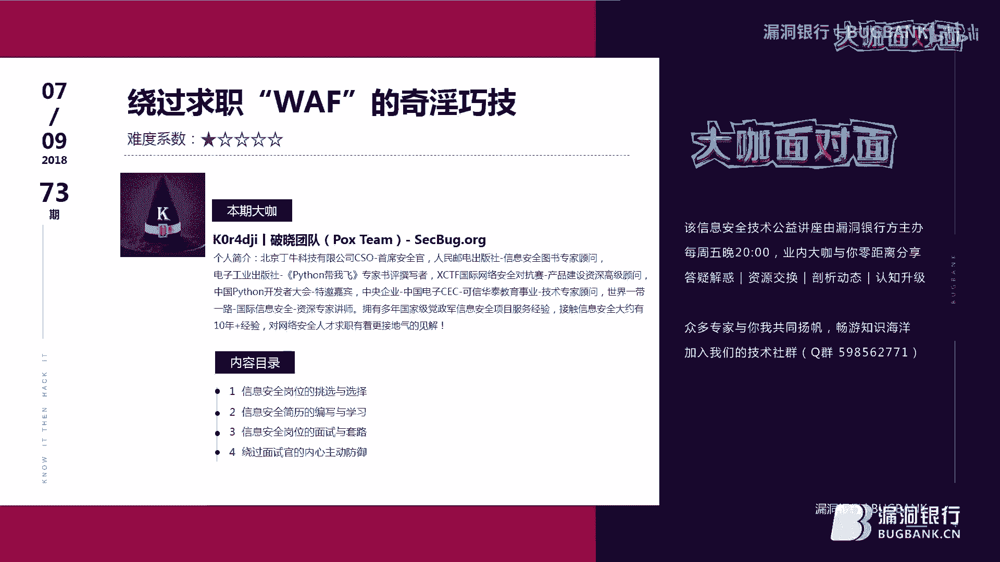
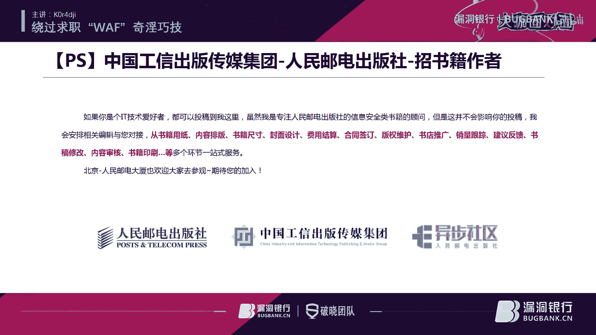
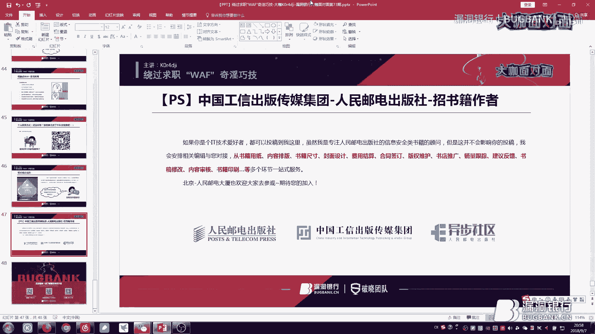
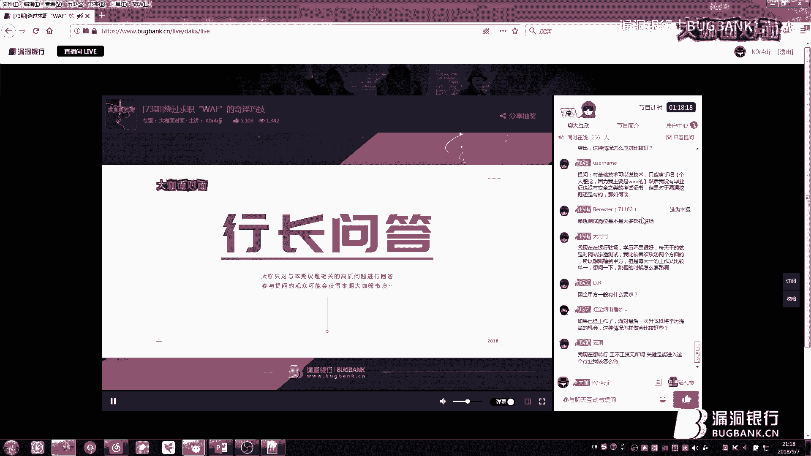
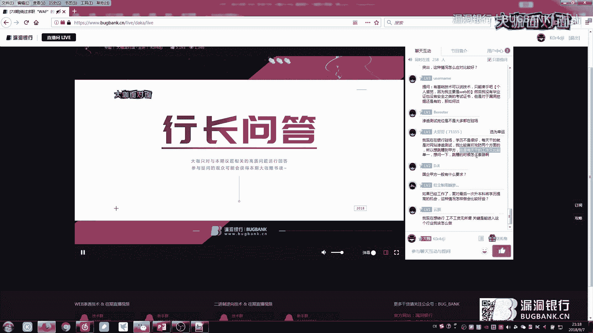
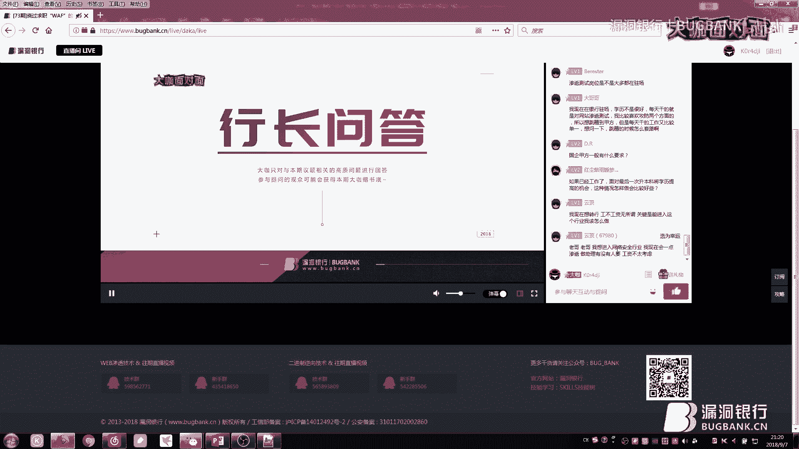
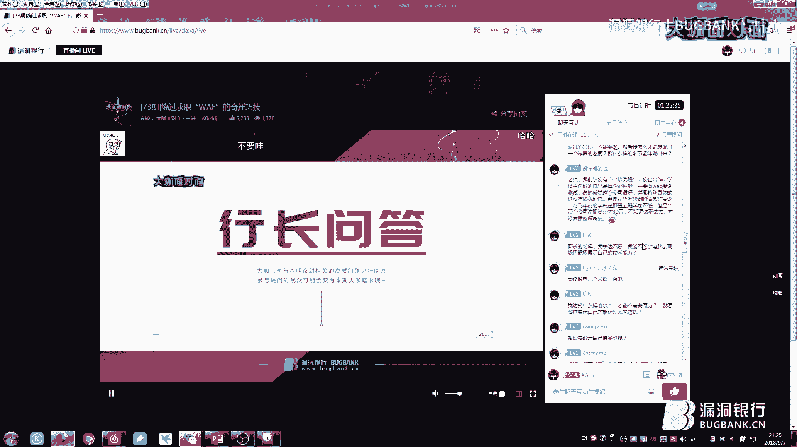
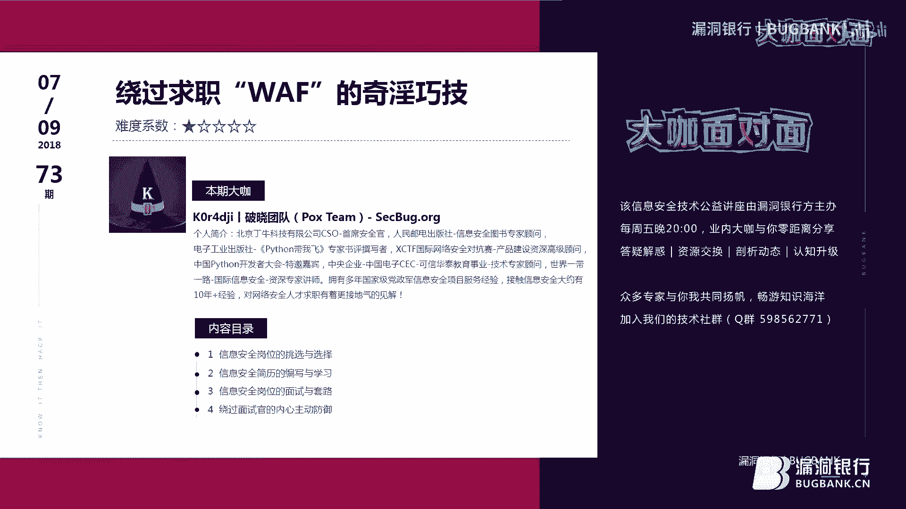

# 求职安全岗：绕过面试“WAF”的实用技巧 🛡️

在本节课中，我们将学习网络安全领域求职的核心技巧。课程内容不涉及具体技术，而是专注于求职过程中常被忽视的策略、简历撰写、面试沟通以及如何应对面试官的心理战术。无论你是应届生还是希望转行的从业者，这些方法都将帮助你更有效地展示自己，提升求职成功率。

## 岗位选择：技术路线 vs. 管理路线 🧭

上一节我们介绍了课程概述，本节中我们来看看求职的第一步：岗位选择。在网络安全行业，岗位大致可分为技术岗和管理岗两大类。

以下是常见的网络安全技术岗位列表：
*   安全运维工程师
*   渗透测试工程师
*   安全研发工程师
*   安全分析师
*   应急响应工程师
*   逆向分析工程师
*   漏洞挖掘工程师
*   安全架构师
*   安全咨询顾问
*   安全产品经理

以下是常见的管理岗位列表：
*   安全团队负责人
*   安全部门经理
*   安全总监
*   首席安全官（CSO）
*   首席信息安全官（CISO）

面对岗位选择，通常有四种情况：
1.  **技术钻研型**：热爱技术，不愿从事管理工作。
2.  **综合潜力型**：技术扎实，善于表达，拥有人脉资源，可挑战管理岗。
3.  **定位模糊型**：技术不深，管理无经验，资源匮乏。需要深刻反思个人定位。
4.  **迷茫未知型**：完全不清楚自己的方向。如果入行多年仍处此状态，需考虑行业适配性。

**核心公式**：`清晰的自我定位 + 潜能挖掘 = 明确的岗位选择`
如果你不主动挖掘自身潜能，公司无法为你准确定位，你很可能沦为“职场咸鱼”。

## 简历编写：打造你的专业门面 📄

明确了方向后，下一步是制作简历。一份专业的简历是获得面试机会的敲门砖。许多人认为下载模板填充即可，但对于经验不足者，如何有效展示自己是一门学问。

### 个人信息模块
这部分是基础，但细节决定成败。
*   **姓名/年龄/性别**：基本信息。
*   **现居地**：面试官会据此评估你的通勤距离，这可能影响他对你薪资预期的判断。
*   **工作经验年限**：明确你接触安全领域的时长。
*   **网络ID**：若在行业社区有一定知名度可写上，否则可能减分。
*   **邮箱/电话**：务必准确无误。电话写错或只留QQ/微信会显得极不专业。
*   **证书/荣誉**：酌情列出，作为能力佐证。

### 技能描述模块
技能描述用词需格外谨慎，切忌滥用“精通”。
*   **了解**：听说过，有基本概念。
*   **熟悉**：使用过，能看懂相关代码或原理。
*   **掌握**：会使用，并能解决一些问题。
*   **精通**：达到随心所欲、深入原理的级别。**切勿**所有技能都标为“精通”，这非常不现实。

**代码示例（错误示范）**：
```markdown
技能：
- 精通渗透测试
- 精通Java/Python开发
- 精通操作系统内核
- 精通Office办公软件（*尤其要避免*）
```

### 求职意向模块
这部分能让HR快速抓住重点。
*   **到岗时间**：立即到岗？一个月后？
*   **工作性质**：全职/兼职。
*   **求职行业**：金融、互联网、安全等。
*   **工作地点**：目标城市。
*   **期望薪资**：结合市场行情与自身能力。
*   **目标职能**：根据技能列出能胜任的岗位，如渗透测试、安全开发。
*   **目前状态**：在职/已离职。
*   **可否出差/驻场**：明确写出，避免后续误会。

### 工作经验与项目经验模块
这是简历的核心，需要量化成果，而非简单罗列。
*   **工作经验**：写清公司、部门、岗位、任职时间、公司规模与性质、工作内容、离职原因。
*   **项目/相关经验**：避免只写“参与了XX系统测试”。应描述项目背景、个人职责、运用技术、解决难题、发现漏洞的等级与数量、个人收获与总结。

**核心技巧**：简历内容是你面试的“题库”，面试官很可能针对你写的内容提问。因此，可以适当包装，但**切忌超出自身实际能力的30%**。简历篇幅建议1-2页，最多不超过3页。

## 岗位面试：从准备到实战 🤝

简历通过后，便进入面试环节。充分的准备和灵活的应对是成功的关键。

### 面试准备阶段
1.  **整装待发**：注意仪容仪表，展现专业与尊重。
2.  **信息收集**：在面试前，尽可能收集目标公司的信息。
    *   公司规模、主营业务、产品。
    *   面试部门的具体职责和技术侧重。
    *   通过人脉了解团队氛围、人员水平。
    *   查询该岗位在市场上的平均薪资水平。
    *   分析公司是“着急招人”（门槛高）还是“着急用人”（门槛相对低）。

### 面试过程与类型
面试通常包含以下几种形式：
*   **面谈面试**：最常见的形式。即使简历雷同，面试官也会通过情景式、技术式、思考式问题来区分候选人。**自信**是关键。
*   **笔试**：考察基础技能、思维逻辑和知识广度。题难未必针对个人，可能是企业筛选人才的手段。
*   **电话/视频面试**：多为异地初筛。务必确保环境安静、信号畅通。如遇问题，应礼貌沟通并另约时间。

### 面试应答策略
在面试中，你会遇到各种问题，掌握应答策略至关重要。
*   **遇到不会的问题**：直接说“不会”是大忌。应给出解决思路。例如：“这个问题我暂时无法给出准确答案，但我认为可以从A、B、C这几个方向尝试排查和解决。”
*   **应对奇葩问题**：面试官可能问“把你丢到荒岛如何生存”之类的问题。目的是考察思维发散性和抗压能力。保持冷静，按逻辑陈述即可。
*   **谦虚谨慎**：当被问及对某技术是否熟悉时，可回答：“我对这个技术的了解程度是…，我认为它…，但不敢保证百分百正确，其中…部分是确定的。”
*   **攻防转换**：不要一直处于被动回答状态。可以在适当时机主动提问或切磋，例如：“您刚才提到的技术，我联想到类似的XX技术，可以聊聊我的理解吗？” 这能展示你的知识关联性和主动性。
*   **化解冷场**：如果面试陷入尴尬，可以用幽默或提问方式缓解，例如：“看来我们对这个问题都很专注。不知道各位老师在实际项目中，遇到类似情况通常会怎么处理？”

**核心心法**：面试如“兵来将挡，水来土掩”。面试官的核心目的是评估你的技术基础、解决问题能力和岗位匹配度。你的目标是展现**自信**、**潜力**和**学习态度**。

## 高级技巧：绕过面试官的“WAF” 🚀





在掌握了基本方法后，一些高级策略能让你在竞争中脱颖而出，或帮你应对棘手情况。

### 事半功倍的求职渠道
1.  **内部推荐**：成功率较高。需考量推荐人在公司的地位、权力和关系网。
2.  **外部引荐**：通过行业人脉推荐。取决于引荐人的关系和你的能力。
3.  **瞄准人才紧缺期**：当看到某公司发布大量招聘广告、团队急速扩张或是新成立公司时，果断投递。此时对方“着急用人”，门槛可能降低。

### 识别与应对特殊面试套路
*   **“抛砖引玉”式面试**：企业将实际项目难题作为面试题，可能意在套取解决方案而非真正招聘。对此要有心理准备，但也可视作一次宝贵的学习机会。
*   **“吸星大法”式骗局**：警惕冒充HR或技术人员的同行，以面试为名索要你的简历进行抄袭。尽量通过可信渠道投递简历。

### 薪资谈判与心理博弈
*   **尺度把控**：如果你答对了大部分问题，面试官可能会追加高难度问题来压价。你可以策略性地说：“前几个问题我们讨论得很深入，后面我还有几家面试，时间比较紧，能否就一两个核心问题再深入交流？” 避免陷入被动。
*   **薪资防线**：当前一份工作薪资较低，而期望薪资较高时，面试官会质疑。你可以说：“我上一份薪资确实是6K，但我近期面试了几家公司，给出的薪资范围都在10K-16K之间。” **核心**：利用市场行情和心理对抗来支撑你的要价。
*   **“一箭双雕”**：当面试官问“你还有什么问题吗？”，你可以说：“我想请教一个问题，这是我上一场面试遇到的技术题，我的思路是…，想听听您的见解。” 这既能展示你的知识面，也能反向考察面试官水平。

**重要提醒**：所有“绕过”技巧都存在风险，需根据实际情况灵活、谨慎使用。职场口碑很重要，安全圈很小。

## 总结与答疑要点回顾 📝

本节课我们一起学习了网络安全岗位求职的全流程策略。

**核心总结**：
1.  **选择大于努力**：清晰定位技术或管理路线，避免成为“四不像”。
2.  **简历即门面**：量化经验，谨慎用词，控制篇幅，确保信息准确专业。
3.  **面试是双向选择**：充分准备信息，保持自信，不会的问题给思路，掌握攻防转换。
4.  **高级策略需慎用**：内推、把握招聘时机、薪资谈判等技巧能提高成功率，但需诚信为本，灵活运用。







**常见答疑要点回顾**：
*   **学历 vs. 技术**：两者都有是加分项。有学历亮学历，有技术秀技术。两者都没有，就用项目和经验证明自己。
*   **大公司 vs. 小公司**：各有优劣，都是成长。选择哪个取决于你的职业规划和个人偏好。
*   **如何确定自身价值与薪资**：最有效的方法是**投入市场检验**——多去面试几家公司，取其中间值。
*   **表达不好怎么办**：可以用技术文章、漏洞复现视频、项目报告等成果作为辅助证明。
*   **职场长期发展**：**持续学习**和**积累人脉**是关键。遇到瓶颈时，思考如何提升能力突破，而非单纯通过跳槽逃避。





求职是一场综合能力的考验。技术是基础，但沟通、策略和心态同样重要。希望本教程能为你照亮求职之路，助你顺利拿到心仪的Offer。