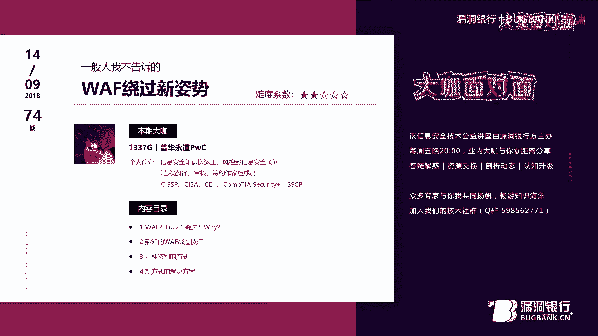
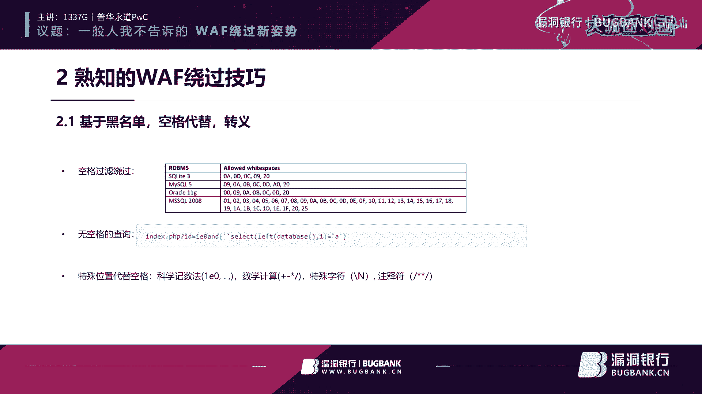
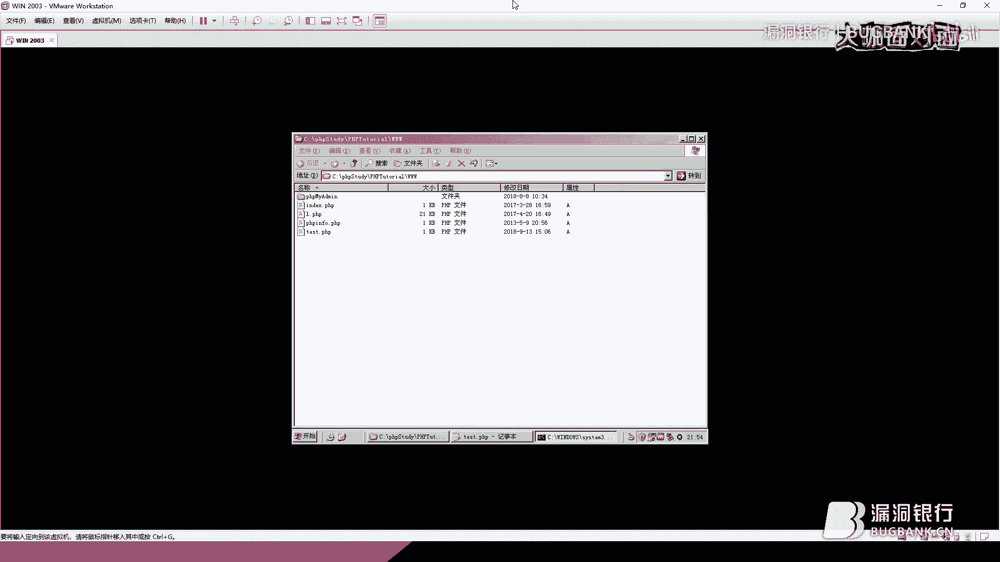
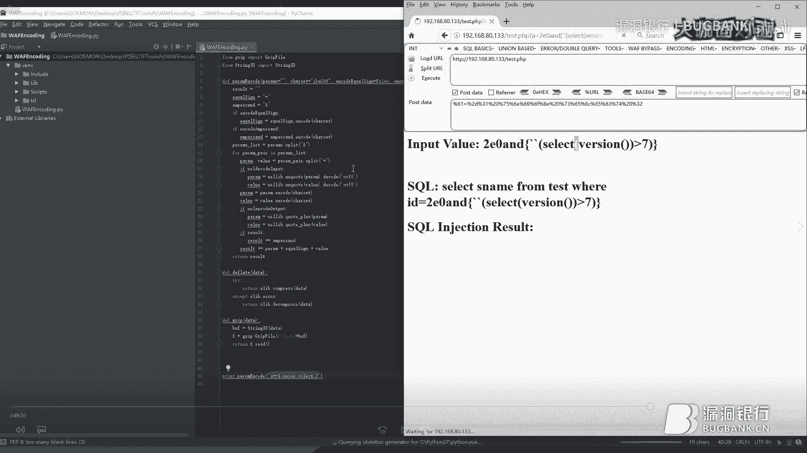
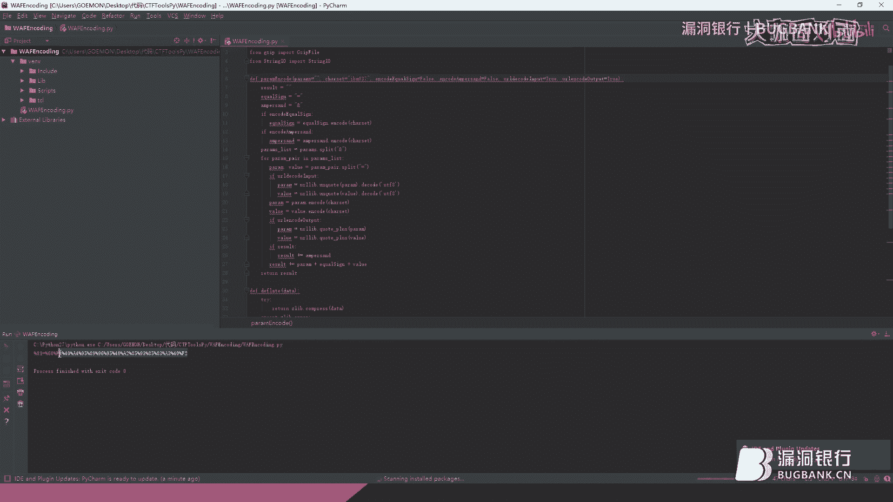

# P1：74期丨一般人我不告诉的WAF绕过新姿势-1337G - 漏洞银行BUGBANK - BV1Ft411f7if

为知识而存，因技术而生，小伙伴晚上好，欢迎参加第74期漏洞银行安全技术直播，打卡面对面，我是春秋秋，今晚我们请来了一位来自普华永道大咖tony，tony是普华永道风控部信息安全顾问。

他也获得了c i s s p，c i s a c h cot s科学家，s s c p等多项能力证书，此处呢我想问问信仰膝盖，所以今晚的内容就是如此，专业的投影大咖个人总结的waf绕过技巧。

希望听完后对你的生活测试能有所帮助，感兴趣的话一定要听到最后哦，那在大咖演讲后的考场问答环节里，大家可以一一提问，问答结束后，欢迎大家会选择一名幸运观众赠与书籍，物联网设备安全。

只要参与互动就有机会拿到，好啦，介绍完毕，下面就请托尼大咖开始分享吧，大家好，我是托尼，我先介绍一下我自己吧，我来自我工作与普华永道，然后是风控部的医院和工作职位是啊，高级安全顾问，然后我自己。

我觉得我自己呢是一个信息全知识的搬运工，因为在爱春秋翻译组审核组，签约组，这个结合组里面，有一些自己的平时的小日常活动吧，然后会经常看一些英文的文章，如果发现好的话，就分享给大家。

这次演讲也是因为在之前在看一些文章的时候，发现了一些比较有意思的点，然后觉得可以跟大家一起分享一下。

今天我们会讲几个重点哇，是什么，会不会为什么要绕过它，绕过他要干什么，还有我们这次会不会用fs去做这样的测试，寻找waf绕过的技巧，然后第二个点呢，我们会讲一下熟知的waf绕过技巧，譬如说基于黑名单。

基于空格代替基及pyo的转移，或者还有在所有的中，就是常见的里面会着重讲一下，注释符加0%a的过后绕过方式啊，之后的话就是我们今天的重点，http协议的绕过方式啊，这是在之前的一篇文章里面发现了。

有一位大神介绍了好多种，就是不常为人知的一些方法，然后今天的话我们就拿拿来说一下啊，最后的话我们会以阿卡玛的防伪强，进行一下实战绕过，还会在最后的时候呢告诉大家一个，我之前在研究中发现了一个小技巧啊。

好我们今天开始第一点什么时候啊，buff的话又称它的英文是叫web application firework，他那个中文名字的话叫做网站应用防火墙，它的目的的话是用来过滤请求包，比如说你要访问一个网站。

如果你是一个正常的访问用户的话，他不应该拦你，如果你的请求包里面带上了一些特殊的参数啊，或者他认为是有威胁的行为的话，他就会把你拦下来呃，他要达到的目的，就是让想让看这个网站的正常用户的话。

看把攻击的或者错误请求给拦下来，防火墙的话就buff的话，其实可以算作代理防火墙中的一种，然后因为他是拆包检查包，内容跟前面下面的这些包过滤防火墙啊，动态过滤防火墙啊的操作不太一样，为什么能绕过waf。

第一点，因为安全性能这两件事情的话，有的时候是冲突的，就比如说假如说wap发现了一些特殊的数据包，然后有可能是这个用户真不小心输错了，这时候的话呃，防火墙他应该把这个数据包拦下来吗，理论上是应该的。

只要是他觉得对应用任有任何威胁的包，他都应该把他拦下来，但是的话由于画幅的厂商的话，他把这个软件做出来的时候，他不知道他要保护什么样的应用，因此的话他也不知道什么样的是什么样的请求，算是100%正确的。

就譬如说当我们在post请求的时候，如果你去把单引号过滤掉的话，那用户在写一篇文章的时候，那就肯定就不能用单引号了，如果说譬如说文章中有些位置出现union，select的这些呃有威胁的关键词的时候。

呃，划分不应该拦下来，那当然不应该，为什么，就是说你上传一个文件的时候，用户在写这篇文章的话，不可能不用到某些特定的英文单词，这是第一点，还有是譬如说一些加密的方式，当有数据流被加密，po被加密的时候。

waf没法去检查你的pyo里面的内容的时候，他这时候是选择把你的包丢掉吗，肯定不能，因为的话，这有可能是一个功能的需要，或者就是应用它默认传输的形式，因此的话现在就是安全和性能的话。

有的时候是会互相冲突的，然后还有经常遇到的情况，这甲方因为买了画幅以后不调任何的设置，不去根据它的应用做相对应的策略，这时候的话一个waf的话就很好被绕过，就是第三点的话，就是前面也说了。

就是厂商才不知道你呃用的应用是哪一款，或者你自己开发的协议的里面的传输的内容性，想长成什么样的，所以桃花他们没有办法全面的做到保护，还有厂商wap的厂商在设计的时候，有可能会去忽略某些语言啊。

中间件数据库的特性，然后导致很好就被绕过，还有一种的话就是写的wap本来就有逻辑问题，比如说像一些或者而不是逻辑问题，就是他写wife的时候本来就是有问题，比如说像一些缓存溢出的这种攻击。

就是建立在waf的话，他在接受参数的时候没有做长度的限制，或者像前不久发生的那个有另有一款waf，都绕过101个参数叫上去，他验前面100个，但是参数验的顺序呢，又不是按照按照第一个到最后一个的顺序。

去验的，所以的话有的时候在101个位置的房产，这就是有威胁的代码的话就进去了，出现这种情况，了解了waf是什么，那我们先来说一下呃，为什么要绕网，然后就最重要的一点，对甲方客户的负责。

因为我们举个例子吧，我们去测评，做测评的时候，有一次去了一个客服，那发现了好多个问题，注入跨站也一堆，然后还有好多其他的，然后我们预期的话是一个礼拜一两个礼拜，他们肯定改不好。

但是的话第二天就打电话来了，叫我们去复测，然后我们就看了一眼，果然上了一个wap，什么都没有改，漏洞还在后面，但是的话假如这就是开发方就说了，既然你们我们上楼啊，那你肯定就黑不进去了。

那我们就可以这几项不过了，就就可以让我们上，我们就改完了行不行，但是的话这样的话，其实对白白猫就是非常不尊重的一件事，因为人家是花了时间去看的，然后你做这样的事，你就上一个buff。

然后就要求你已有的漏洞已经修不好了，在在我们的印象里面，这是一件非常不好的事情，所以我们当天就做了一下绕过呃，果然三分钟就就绕过了他们使用的某狗，然后发现还是用的老版本的某狗，因此的话只要一个04%。

就能过掉所有的防护嗯，这就是为什么这就是绕过我们白帽子，要去去知道这些绕过的方式，这就是重重点就在这就是最好的，就是在最好的情况下的话，能发现最多的漏洞，这就是为什么好，今天我们开始讲我们的重点了。

首先我们讲一下熟悉的wap的绕过技巧呃，第一个是我们这里讲用一些特殊字符，去进行空格代替的操作，然后一旦空格被被代替了以后，外服没办法，准确的就是把词和词之间断开，然后去定位那些黑名单里面的东西。

因此的话就是wap会放过你的数据包，但是呢这个数据包到了数据库那边，是的c口查询的时候，空格的话是可以被某些特定字符代替的，因为之后的话又会正常执行，所以的话我们就达到了，绕过waf的这些那种效果啊。

这里有张表，根据不同的关系型数据库的话，这里稍微列了一下，当然还有好多其他的，大家可以用fs的脚本啊去测呃，今天呢我们就不讲这个了，之前的话也有大咖已经讲过了这些东西啊。

我们这里可以看见我们今天用的环境的话，是p hp加msl的环境，我们就看一下这里呃，090%a0 b0 c0 d a0 ，这些都是可以代替20%空格的，待会儿我们会拿一些。

就是我们会在实际环境做一下例子，然后看一下它的效果，然后无空格，无括号的查询，无空格的查询，这时候的话我们考虑的点就是，我们就干脆不用空格，用一些括号，用括号呀，用一些特殊的像这个位置的急的表示方式啊。

去把一些我们需要用到，还有这个10%啊这些物，或者用我们这些方式去让避免掉，用空格的这样子的操作，然后最后的话还有这种用特殊的位置，特殊的方式代替风格，比如说科学技术法1110，这是科学技术法。

表达方式的话，其实就等于一，所以的话任何数字后面加一零的话，都是代表他自己或或者加点点的话，会把整数型数字转换成小数形，所以的话他后面也是可以不用空格，直接比如说接and或者select或者什么都可以。

额数学技术符，比如说加减乘除，这些都可以加在数字的前面，然后还有特殊字符，一些特殊字符，像杠大n在满溪沟里面的话，其实是代表空，也可以带，用来代替空格，还有注释符等等等等，好现在的话我们就来演示一下。

我们刚才说的这个，用一些特殊的东西代替空格的操作。

达到绕过画的机器的效果，然后我们进入我们的虚拟机。

我首先讲一下今天的测试的方法哈，因为我们今天的绕过，不是针对某一特定buff的产品的绕过技巧，而是通用的技巧分享，这里呢不想针对某一款产品，因此我们的虚拟机里没有把部署waf，验证的过程中呢。

http只要经过了变换，夹带脏数据发给了应用应用服务器，并能够被服务器成功的解析，然后返回结果的话，那我们就假设这个绕过的呃方式的话是可行的，呃，我们在这个虚拟机里面呢，先今天呢先写了个小程序。

我们先看一下，然后这是一个菲律宾的小程序，可分为三部分，然后首先我们把应用户请求的a接过来，然后把它打印出来，我们的c口语句长什么样，然后这里的话连接一下是连接一下数据库，然后把查询结果返回出来。

返回出来之后呢，在这个部分呢，把我们输入的就是用户请请求的a这个值，写到new file。txt里面呃，大概流程就是这样，我会解解释为什么我们会需要这个写文件，这一步，我待会儿再讲。

因为这个话待会儿一个绕过方式的话，需要他才能演示的清楚，好行，那我们就开始今天的操作，第一个操作，首首先我们看一下这个小程序的请求是什么呀，是请求和返回是什么样的，我们看一下。

嗯我们可以看见现在没有提到这个a参数，a的话是有有一点问题的，但那个大概界面就是长这样，现在我们提交一个a试一下，嗯大家可以看见啊，它就显示了这些内容，如果我们提交一个二。

他会数据库里面把这个flag 123查查出来，好现在我们开始我们的输入操作，嗯譬如说像咱们先先来个基本的吧，就是正常的我们的操作，像这样的一个场呃，请求，这样的话我们会把数据库的版本读出来。

我们看一下效果，5。5。53，然后现在我们开始就是绕过的这种，用空格代用器的特殊字符车，代替空格的这种操作来演示一下，首先呢我们有有可能看不清，我们把抓过来的包在贝贝贝贝贝贝sweet里面干。

我看见是这样的，这里的话空格是20%，我们试一下，把09%代替的，我们可以看一下这张表里面有哪些，买西部的话可以把0%a代替0%，b0 c0 d也可以，然后呢我们用一个09%，一个零一个0b试一下。

这样的话这个语句的话就是在请求的时候，我们没有用到真正的20%，作为空格来使用，我们放一下，大家看见啊，这个回响是正常的，但是的话就是刚才这个09%，这个位置点上了。

所以代表他跟其实它的在p h p里面，它的歌它是跟空格是不同的，但是去了数据库以后就不一样，然后这个是一个，然后我们再接下来是第二，第二种方法，我们这里讲的是用，无空格的查询，我们可以试一下这个。

那么这无空格查询要如果要用到急的话，有可能要用个布尔型的输入，所以的话我们先，先02%回复一个正常的包，然后，一零科学记数法的方式来的，来占掉二后面那个空格，然后后面接一个。

and你们用吉的表示方式去在里面做查询，比如说像这里的话，我们可以用select多人，这把不就是数据库版本读出来，因为这是我这里是五点多五点的版本，然后我们可以拿一个大于四来做做来做判断。

我们看一下目录现在的效果，呃因为它读出来的版本是五点多，所以的话他肯定是大于四，因此的话数据库里面的这个flag，123就被读出来，然后我们再去用，假如说我们这里用七呢，大家就看见了。

我们如果把这里换成七的话，因为这个五点几是小于七的，因此的话就没有读出结果，这是我们这里的话，我们就用了三个点去做绕过的操作，第一是这个科学技术法，第二的话是这个集，然后第三个的话是用空格。

而不是用这个括号来来，用括号来代替使用空格的这样的操作，不然的话你就是select空格version，然后这两个两个括号括号括上去好，然后这一点讲完了，我们这里面就基本上就结束了，然后我们先下面再讲。

关于基于黑名单的绕过一些方式，这里的话我们会讲到各种转移，你这在网上的话很容易找到这些内容，比如说像u i l转移啊，还有二次url转移啊，i s转移一次以后，应用可能再会转，第二次会有这样的情况。

还有错误的url转移，错误的url转移，这里是讲的，在i s的环境下的话，你把把百分号加在c 16至七进制的字符前面，譬如说一个i它肯定不是16进制的，这时候的话i是会自作聪明的话。

把这个i前面的百分号给他去掉，然后把它再交给交给后面的数数据库，但是问题就是在waf检查的时候，这个没被去掉，所以的话waf的话一看，我也不认识这个unit百分号什么什么东西是什么。

所以的话他就把把它给放过，还有unit code的转移，unit code转移的话，最简单的转发的话，就是在比如说75%代表u，那我们就可以把它unicode转译成百分之u，007 15。

但是这个的话不仅只有这一种转法，大家可以去查一下其他的表，比如说单引号的话，百分之之002月27，然后你可以有其他的unit go的转发，这个的话大家就自己细查，下面的话还有内部转移。

内部转移的话跟unico的话，url转移的话比较类似呃，就是说我们不转前面那个百分之百分号，百分号的话是25%，大家可以看见，大家可以看见这里百分之二十五二次转移，把百分号转了，但是内部转移的话。

我们不转这个25%，而是有选择性的转后面的转了，后面的这是一个百61%代表a嘛，所以我们不转百分号，我们转六啊，把它转成百分之三十六一，那这样的话有可能会绕过waf，然后错误的16进制转移，这里是讲的。

也也是比较特殊的一种方式，在实际中我还没有遇到过61%，在转码成十进制的时候的话，六乘以了十位的16，然后加上了一得到了97 二的话乘以呃，这里2%u上扬的话，这个月上扬代表65，时间就到65。

然后前面的这个是16位，十位16位乘以了二，然后加上这个65得到的也是97，在一定的情况下的话，我们就可以认为的话，像这两个它转移回来的结果都会变成99，因为环境的关系，这个没有办法，今天再转移。

这就是转移的这边做演示，大家的话可以有空或者什么的时候，自己测的时候的话可以去试一下，然后还有好多我们熟知的话，不知过几条，这些都是能在网上找到，就很容易在一些中文论坛，安全论坛上。

你就可以找到各种方法，而且被人转载，转载了好多好多次，所以的话我们就不再细讲了，就最基本的大小姐替换这种注释注释，来夹在关键词当中绕过，然后还有是像这个加号啊，这个这个都可以加在关键词。

比如说select把它分成两个部分，s一就是前面那个不半个部分，后面半个部分，然后把这个加在中间，这样子的话也可以绕过wap的检查，还有内联注释，内联注释的话，曾经之前的大咖讲的那期。

用fast脚本去做1000种绕过姿势的话，跟这个就有关，就是因为某某狗的话，它其实对内联注释的闭合的话，检查不是有一定的问题，然后再加上一些特殊字符的话，在多重组合之下的话，嗯嗯猫狗的话。

它会找不到就是那些关键词词的位置，然后从而达到绕过，还有常见的百分之df的宽字节，把前面的斜杠吃掉，然后一出绕国一出绕过的话，就像一开始我讲的那几个特殊的情况，就会比如说给给应用为太多的参数。

或者太长的参数，导致他的行为异常，找找这个wap的行为异常，他不去检测用户提交的内容，而且选择直接放过啊，这里有一个特特有意思的，就想讲一下，因为这个东西的话，这个方法的话之前绕过某云好久。

直到最近才把它给修复了，就是注释符加0%a，首先讲一下0%a是什么，0%a的话，他在它其实代表控和换行，在我们数据库里面的话，西库执行的话是可以换行的，我们我们演示一下，给大家看一下。

我们现在进到msl里面，有一个我们使用一个最常见的选择方式，这时候的话其实查询成功，然后我们的话可以上g111 去，细扣的话进行换行的操作，比如说像，在这的话我们敲一下，回车到下一行还是能查询的。

但是有一个问题，假如说我们在这里加上注入，二是注射的话会发生什么事，像这样的语句的话，嗯我们看一下哈，就不能压住这个架，打错了，这井号，这样的话还会像上面一样报错吗，我们看一下，不会，为什么。

因为后面的注释对，后面的这些的话全部已经被注释掉了，然后你换到了下阳下一行的时候，我们再打入一，这样能做查询吗，答案是可以的，这时候的话就出现了一种很有意思的混淆方式，第一行里面我们可以把后面的注释掉。

在里面随便打什么，然后换到下一行之后，我们再做我们相对应的操作，把依据查询语句的话，把它分两人来执行是可以的，这就是为什么这里我想讲的它比较有意思，就是在在之后混淆的里面，我们可以用到它。

而且能用到的地方还是挺多的，目前市面上的话还有好多话，用这种方法可以绕过，就大家自己试吧，熟知的话，不过技巧我就讲这么多，下面进入我们今天的重点，基于http的协议绕过啊。

这这个点的话是在我写一篇小论文的时候，去查了，查资料的时候查到了这位大神，2018年的owasp的app下europe上面讲的一题，就是讲一讲这个http协议绕过。

然后他们的公司的话是n c c group也是很牛逼的，group就很牛逼的公司，然后大家可以有机会的话，看一下这下面的四篇文章，然后了解一下具体的今天绕过产生的原因好。

然后我们讲现在讲第一个基于基于http，0。9的绕过，然后呢这个没有演示，因为的话需要找到相对应的环境比较困难呃，就文章里面说了这一点，就是说他拿世界上排名前十的，我应用防火墙去做了一下测试。

如果这个请求的话，是用来htb 0。9，由于他长得太奇怪，而且太古老，所以的话很多80%的话没有把他拦下来，直接就放心了，因为他们根本就看不懂这是什么东西，我们现在看一下htp 0。9的协议长什么样。

结束了，这就是http 0。9协议，它长的样子，在http 0。9协议下，这样的话只支持一种请求方式，就是get，然后的话不需要下面任何high的，或者巴黎里面的东西，也不需要声明他的版本。

就这么一个请求就过去了，所以说你后面要带参数的话，或者怎么样的话，就直接带，这就跟一般我们看见的http背包，其实长得特别不一样，这也就是他为什么旺夫没有认出来的原因，嗯这个就我们讲这么多。

再讲下面一个呃，现在给大家一个有意思的东西，这个东西的话叫做htp pip，中文叫隧道，有传输，呃换句话的意思就是说，把几个http包压缩在一个请求包里面，然后丢给服务器，然后服务器接到这个包以后的话。

会同时返回等数等量的请求和响应回来，但是的话waf在中间再检查这个这个包的时候，它又可能只检查头，我就是头里面的counter lance这个位置，查了第一个，他发现这个长度，比如说像这个例子里面的话。

这长度等于五，它不检查下面为什么不检查，就是所谓的性能跟安全的一个问题，不过用户在下面打好多或者没用的数据的时候，我应不应该去检查它，因为它的长度只有五，它只接受这些东西。

因此的话我们把有威胁的数据包插在下面，插在下面，然后可以把这些有问题的代码的话带进去，让应用服务器的话执行，达到这样子的效果好，我们现在啊，那我们还是就是看一下这图，这图就代表了。

这个就代表我们现在常见的http v包的请求，请求一下，返回一下，然后这是pipeline请求三下，返回三个，然后我们看一下实力，好，同样的我们做一下这个请求，现在这样的是一个包。

我们拿放到repeater里面去把包改好，在做pine的时候的话，就是留意你如果用的是box suit去做的话，在这上面要把这个update countenance这个关掉。

然后我们看下一个包的请求的样子，长这样对吧，然后现在我们来做pc，首先第一件事的话，我们要保持这里这个位置的长度是一样，第二件事情我们把这里改成t fl，然后第三件事情打一下，回车上面要空空一格。

然后粘贴一下，粘贴一下，这时候这数据这个数据包里面的话，其实有三个http请求，然后我们把我们先看一下效果，大家都可以看见，我们看一下有多少个200，一共有三个200，大家看见有三个请求恢复的请求。

请求恢复在里面，这里的话我们这里在大洋是藏数据景区上，我们看一下45678 90 11，然后把这里改成11，大家就可以看见，其实这个第二个包里面的话是被带进去了，看这里flag的话是正常返回。

因为一是等于一的，那我们把这里改成等于二呢，那这里就是没有范围了，然后第二个包里面我们去抓一下，大家就可以看见结果是空的，就说明查验成功了，这就是我们今天讲的这个，pipeline的一个主要的概念。

然后pine还有一个有意思的地方，大家看一下这个包，你可以用基金包来做到绕过的效果，这时候的话对wap检查的难度又更上了一步，我们还是基于这个包去改它，三个，然后的话我们后面的话看一下。

记得第一步这里要保持一点白板，带的就是1。1的版本，然后我们可以把这个keep live插擦掉，我们把在这里建一个盖，记得这里因为是他是plus的方式，所以的话这里不能直接上空格，一定要是20%。

然后我们看一下效果，然后在这里的话加上后续，最后在最后的位置我们加上这个皮卡来，看一下返回，这里正常返回了，然后下面这个没有想想原因吗，这个里没有收到二，嗯这里应该是我们没有加http一点，我们试一下。

看一下现在的效果，卡住了，下面按下回车，好然后记得最后下面要打两个回车呃，不知道什么原因，反正就是这样的情况，然后我们可以看见现在两个包就正常了，第二个包的话，最多百分之哦，这里少一个摆个空格。

在这大家可以现在就可以看见了，这又是有两个包返回回来，第一个是这个1。1版本的post包，第二这下面的话是一点的这个get的包，这是一个畸形的状态，为什么到这里的话，我们没有打回车，让他回到下面去。

但是的话应用服务器的话，还是照样可以接受这样的请求，但是的话wap在检查的时候只牵连得到a等于二，后面的都不会去看了，因为这个pillow后面的就他以为是没用的数据，就不去检查它。

因此的话我们可以达到绕过的这种效果，好就pine今天就讲这么多，然后我们继续下一个，我们有办法把一个多个数据包放到一个里面，那我们就有这种拆分的方法，在http trunk的这种传输方式下面的话。

我们可以把payload里面的data数据的话，全部把它拆分拆分到什么样的级别，我不是说空格一个空格，把一个词或者换到下一行，这样子它是可以把一个完整的词拆成任意长，你想要的长度。

就比如说select这个词的话，s一你可以把e换到下一行，放在上一行，这样的话大家想象一下这个po的话，其实可以换到很夸张的一种状态，如果无法在e这个包的时候。

没有考虑到这种trunk的分割传输方式的话，那他是我们可以肯定是可以做到他认不出来的，这样的效果，现在的话我们就话不多说，都说了，就我们就直接演示一下这样的操作，因为相对来说比较麻烦。

因为创作的方式我还没把脚本写下来，然后我们就预用预先准备好的一个请求来来发，然后给大家解解释一下原原理，大家看见这个请求的效果的话，就是把数据库的名字查出来了，然后他的请求的话是长这样的。

但是我们现在过来看一下这个包，这个包里面的话就是头下面是长这样，这还看得出来吗，这完全看不出来是是是是什么东西了，如果你不知道就是分块传输的原理的话，好现在我们现在开始看这个包，首先包头呃，一定要记得。

就是创口的话是在http一点一的协议上面才有的，然后头上没什么好说的，就这里，什么都不要改，但是的话要加一个transfer encoding trump，就是告诉服务应用服务器。

这下面的po是以分块传输的方式过去的，然后回撤下来这第一个位置，第一个位置是长度稳，是16进制的长度表示不是十进制，16进制的长度表示，因为下面只有一个a，所以的话我们这里的话长度是一。

然后下面这里的话是一个等于号，所以我们这里的长度是一，这里下面是一个-2空格，所以这里的长度是三，然后这里的话union，我就只选前面四个u n i o这四个词，所以的话它长度是四，同理下面也是一样。

关键点结束的时候，创作的都表示方式需要在末尾加零零的，下面要加两个或者更多的空格回车，不然的话你的请求服务器不会停止，反而有那个就是有超时的那种状况，你在自己在试的时候就行了，就肯定会知道呃，这种的话。

我们看一下它原来长什么样啊，呃首首先给大家看一下，如果没有零下面没有回车的是什么样子的状态，这时候你做请求的时候，现在不会响应，就自己，如果你出现这种情况的话，基本上你下面就忘了打打回车了。

创口的话就是这样的原理，就是威胁非常大，它能绕过不少某云某某狗，某某什么某盾啊，什么什么都可以，但是的话做的好一点的还是不可以，现在我就继续讲下一个做法，它可以和创作的分块传输进行结合。

然后绕过市面上几乎90%的哇，不管是君王白，狼王，白还是云王都可以，现在我们讲这个也算比较常见的一种吧，叫协议未覆盖，绕过content type里面一种有四，一般有四种表达方式。

txt还有jason的，还有url encoding的，还有是这种是最特别的multipart form data，帮加帮助的这种，这种是可以用来传文件的这种形式，但是它同时也可以用来传参数。

呃我们就直接看例子吧，我也是预先准备好了一个给大家看一眼，大家可以看一下效果是跟刚才一样的，我们把数据库名读出来了，呃呃我们解释一下这个包吧，头上没什么好解释的，就是这content type。

这里的话它是长这样，not depart vary，这样子，下面这里帮助的话是分割线的意思，分边界边界，然后边界的头的话，一般是比边界多出来两个两个横杠的，这么多的一个表示方式。

边界结尾的话就是相对应的在，所以结尾加两个横杠就代表这个是一个参数，这里我们就可以发现我们传了一个参数a，它的内容的话是这个，他其实的效果我们可以，其实burg sweet的话提供了这样的效果的操作。

就是在这里面有个change body encoding的这个位置，现在它是我们点一下，它就变成了就是url encoding的传输方式，然后就是长这样，效果的话是跟刚才是一样的。

因此的话像比如说我们如果要绕过的话，其实其实很简单啊，就按一下bencoding可以，我们可以试一下，这种方法的话很有意思，他绕过了某所好几个版本，直到最近的一个版本，摩托才及时的把它修复了。

但是这个这个方法里面还有好多细节，我们可以用来绕过waf的，然后现在我大概给大家讲一下，也可以，如果感兴趣的话，大家可以还可以试一下其他的方式，然后开始吧，然后帮助这的话，我们可以打任意处69，然后。

我们这里的话可以把它缩成69，我看一下他的进球，正常的，那就请求正常，哦不对，这里多了一个东西，这样的话就正常了，database读出来是test的数据库名叫，然后这个69这儿呢。

还能加一些特有意思的事情，就是说我们在这里打一个逗号啊，我们先讲第一点，那我们在后面乱打的话，这个棒槌的话他还会认吗，我们看一下效果出错了，不认为什么，因为应用服务器那边不知道。

你这个传过去的那个这个form data的形式的话，哪里是头，哪里是尾，所以他没办法定位数参数和它的值分别是什么，但是在这个时候呢，你在这里加加一个逗号的话，就会发现神奇的事情。

你后面所有打的东西都没没有效果，包括什么，包括封号，包括我们现在在后面再做混淆，把它改成棒槌，这后面的都不会人了，假如说wap去中123作为边界，去查下面的内容了吗，就会造成一个错误。

就是说他找不到这个边界在哪，跟刚才那个笑话那个应用服务器一样，那这个包里面这些东西都是没用的，然后他就不去检查它了，会出现这样的效果，当然了，还有好多其他的混淆的方式，混淆waf的方式。

那之后的话大家要是感兴趣的话，可以再看，那我们回到我们前面讲的一个东西，这两个方式是可以结合的，而且它的威力是非常巨大的，我们先来看一下，之前我也准备好了一个包，大家看一下。

这里的话我用form data上传显示上传，同时呢也使用分块传输的方式，因此这里面的东西就特别多变，什么意思呢，就是说刚才我们可以看一下这个，刚才那个还记得吧，就是from data的形式，传的话。

它跟一般的po长不一样，那个部分那个不带大的部分的话，也是可以做分割的，就像就像现在目前你看见的这样，我们看一下效果，大家看见我们把数据库版本的名字，版本号读出来了，5。5。5层，这个方法特别厉害。

大家可以去尝试一下，在实际测试中会发现能过好多，那我们继续下面一个，然后下面一个charge set的绕过方式，呃，之前的话我都一直其实就一直在想。

其实经常会看见这个count in coding d deflat，还有这种gzip的形式，就在想有没有可能把pyl的做压缩，让我穿是不可以的，因为为什么，就因为回旋里面你才能做加速。

然后读了那篇大神的文章以后，我就发现就发现了，就是他讲了一个很有意思的一个东西，就是content type里面有个char set，他是负责上传的时候就做请求的时候的。

赔了部分的转移的效果就是由它来控制，我们可以看一下，在content type里面，你只要设设char set，然后向下你的编码类型的话，你可以把payload按照你想要的类型进行编码。

大神的话在四个环境下做了测试呃，有问题就不写，这这这张表的话，如果你想看的话，可以去我写的那个小论文里面看，我同事会也会发上，呃有问题的几个环境，就是先说一下，在点net环境下。

ios全版本基于asp x44 版本的语言，上面的应用的话，支持这种绕过方式，还有tom cat的版本，阿帕奇，tom cat jvm j这边1。81。6的这几个版本，他们开的七和八的话。

上面也支持自定义用户自定义编码类型，这样的操作包的话就是长这样，大家看见它特殊的点，就是在这里恰恰的i b m037 这个位置，一般的话我们看见的都是ut f杠八，有什么不同吗。

这个两个编码是有很大的不同的，就是他们编码出来的结果的话是不一样的，我这里先给大家演示一下，稍等有一个小程序，就是用来专门转这个这几种编码的类型。

就这么一个小程序，好我们现在下面的话，看一下我们的payo长什么样，a等于-1 union select 2，这样的话我们就会把二的二里面的东西读出来，然后我们这里用的是ibm 500的编码。

我们首先看一下这个吧，这个ut f8 的编码的话。

它是长什么样，然后我们做一下ut f8 ，这样吧，百分之60 3/100 d3 d是等于二，我们把它换回来，因为待会儿有时候因为在这个编码里面的话，等号是不能转。

现在的话我们做ibm 500的转移，我们看一下，我们把它复制过来。

最后还变37370票编码，看一下他们的差别。

037哦，不好意思，037。

我们在这个boss里面看一眼咱们的差距，037跟ibm 500是一样的，但是他们ut f8 ，跟ibm系列的编码是完全不一样的，大家可以看见这里的话是a ud f杠八里面，它是61%。

而在ibm 500里面和037里面，它是8% 81%，但是服务器一旦接到这个请求的时候，他只要知道你的编码是什么类型的话，它就可以转过来，如果画幅在没有考虑到鉴别，说是到底是他传的是什么类型的。

都是在恰尔赛什么是类型的编码的时候的，waf就没有办法去正确的翻译这些，假如说waf拿着这个去做ut f转移的话，那他得到的是什么乱码，看不懂导演，他所以的话只能放行这个方法的话，伤害力也很大。

他被之前的话，我是在除了某位置上面，基本上所有的up都过了，然后继续讲今天的最后一个把啊，最后第二个http头部的各种机型，然后达到绕过的方式，想了解这些的话，大家可以去读r f c的标准，很无聊。

但是的话你会发现很多很有意思的地方，在这的话我就稍微的演示一下，让大家看一下他所谓的机型容貌，和一些特别的地方，我们以这个包为例，请求我们返回正常一些，就比如说我们讲第一点在这个位置。

如果我们打一个回车下去的话，会发生什么事呢，不认说这个冒号，这有问题，那就是这是一个错误的包buff的话，这时候应该难吗，可以蓝可以不难对吧，但是的话我们在这里加一些特别的东西，可以让它又恢复正常。

比如说我们这里加一个tab，看服务器有响应正常，因为这种表达方式的话，在rfc里面是这个标头协议里面是允许的，回车加tab，然后这一点在h t t p里面的话，协议里面的话还有个特殊的地方协议。

可能你可以不声明或者直接声明错了，他还是会正常去解析的，但是如果你声明了一点的话呢，这个下面是我们是用的，创口的协议和创口的协议了，也是可以的，我们这里是可以随便任意乱打，还有一个有意思的地方。

就是这个位置post get的请求，当你，当你随便打或者打错的时候的话，应用会默认一默认以get的形式去进行响应，这是这是一点大啊，这个这里没办法测，然后的话就说这么多，这个之后这边还有一些特别的地方。

像这个transfer encoding，这里我们做混淆的话，其实可以加两个，同时两个transfer encoding，第一个的话随便乱打，他还是会认这个创客的。

这个是这个这个他认识的这种传输方式去执行，但是的话像这样做做的话，我们就可以类似绕过，也是一种类似绕过的操作吧，buff读到第一个，他也不是看不懂这个transfer encoding，到底是什么。

所以的话他还是按照按照正常的那种方式去验，下面的这个代码部分的话，那就达到了绕过的效果，还有这个位置，这个位置的话，你在串口的之前能随便打任意的东西，只要一个空格隔开它，请求和响应还是正常的。

这又是一点，后面不能加，后面加的话就会出错了，很奇怪，这也是，多加两个冒号呀，这种会这个会搞错，看一眼哈，好像是这，但这里多加冒号就不会报错，嗯头里面还有很多很有意思的地方。

然后大家这个的话可以画的时间，细细的自己去做发子呀，都可以自己去看啊，都可以，然后我们看一下这些题，现在我们讲到哪，然后下面就是时代阿卡尔玛，还在讲这个阿克曼之前的话呢，我就分享一个。

我自己发现了一个很有意思的绕过的方式吧，首先我们把拿一个之前准备好的包，我们就拿这个包，这是一个form data上传的形式，我们刚才讲这个form data的话。

form data的话它有一个有意思的地方，它为什么存在，就是因为有的时候的话，你上传一个包里面的话，有可能又带参数，又带文件，所以会需要用到它，然后我们讲一下上传文件的方式，如果的话你想上传一个文件。

那这里就是直接打分号，把cao n等于一点jpg，就是做上传漏洞的时候，大家应该经常碰到这种情况，当对你设了file name的时候，就代表你上传的这个东西是一个文件，应用服务器会这么认为。

所以的话即使你前面给赋予了参数名的话，在这里的话他不会去认这个参数零件，而是只会认这是一个文件，大家可以看一下，这是一开始的效果，正常的，这时候的话他就读不到这个a的参数了。

就undefined index，a file name的话，把它删掉，这时候的话会有一个常见的操作，我们在这里打一个空格，又出来了，为什么呢，因为这个这里面的话命名出现了问题。

在这个包里面没有file name这个参数，但是有file name空格这个参数，所以的话应用服务器的话，还是读前面这个参数名a，把它读成一个上传参数，而不是文件。

应用防火墙呢会去这个包里面查这个file name，有没有这个参数，如果有的话呢，这个位置是有的话，那他就是上传的一个文件，我们就不去教研它，为什么，就像我之前讲的这个呃，为了他的性能和可用性的话。

你不能限制用户在文件里面打，譬如说unit select这些东西吧，所以防火墙选择不难的，这是网上常见知道的一点，但是在之前的测试中呢，我发现一个很有意思的是，如果你在这里加上一一个。

呃现现在现在这个状态我们先看一眼，这样的话是上传文件，应用服务器是不接不接的，但是在这里加一个双引号呢，由于双引号闭合的关系，导致了应用那边没有办法去接到这个file name。

而是把这个file name的话组成了一个字符串，这都是现在，现在这个包呢应用服务器那边看呢，其实其实这里是是一个字符串，然后这里是没有闭合，然后这个不知这里一点jpg，就不知道鬼什么鬼东西了。

然后我们可以看一下现在的请求呢，反应响应响应响应是正常的，如果画幅他在验这个包的过程中，也是用同样的原理去看他的话，他会发现这个的话one name这个值的话是存在的，它而且比刚才的我们说的那个情况呢。

更近一步是file name，后面这里是没有空格的，是没有问题的，这里命名规则的话，只是前面这里的单引号，双引号的话没有正常闭合，我们这里的混血条可以做的更更加细致一点，比如说这把这里加上一个封号。

如果应用防火墙的话，就查这个封号和位置，后面有没有发过name这种正则的话他会查到，但是的话应用服务器的话，还是去接前面的a这个参数，这就是我发现的一个小细节，这种方式的话可以绕过很多。

目前市场里面我测的话只有某位使他拦下来了，虽然大家都不喜欢，但是的话他我觉得其实做的真的不错，所以的话这个时候就是看出来一些点的时候，这就是理论上就是说他们的研究人员的话，应该是早就知道这种方式，好啊。

这里我们今天的http绕过协议的方，协议绕过的方式，最后基本上讲完了嗯，那我们就开始我们今天的实战，开麦的话，开麦的话，其实他们公司还挺大的，是是啊，给你算排名前几的waf厂商吧，因为他们公司的话。

其实c d n的技术就是他们公司发明的，然后你想这样的公司的话，肯定会自己做自己的女二，然后我们看一下他的首页，这个页面的话，他请他接受post的请求，为什么我选不选他的手，要是他的选他的这个烟兵。

因为他接受pose的镜头做的好的话，在某些页面里他不该接受post请求的时候，他就直接把你拦下来，这是做的好的挖孔，但是国内很少有这样的挖掘，我们放到了b站里面去，呃我们先在这里，我们先辨别一下。

什么样的情况是这个花被拦下了，这个锦州是被拦下来了，什么情况是通过了，我们先改成post，然后在这里面加个a等于一，我问了一下，我们看见这个页面的话，正常回复对吧，那就是没有来。

因为他们觉得这个a等于一，这个参数没有什么问题，然后我们，明年时代统一，这个是一个很明显的输入的，就是有注入威胁的参数，然后我们现在丢给他，他直接access dnight，然后说你这个这个请求有问题。

然后大家记住，然后就是说xx看见xx deni的时候，那就代表这个数据包被waf拦下来，然后如果页面是像刚才一样正常回血的话，那就代表这个页面的话是没有问题的，这就是你的请求就是绕过了。

或者就是这个请求里面他认为是没有问题的，然后我们现在刚才已经发了一个包，到了get到里面去啊，我们现在就对这个包进行我们的操作，首先我们看一下这个包能不能正常回血，可以正常回血。

我们看见下面推荐了一大串内容，我就直接html啊，之前这样大家看得清楚一点，像然后我们现在要开始把仓数据往里面放，我们先把它嵌入quest，那是把它改成boss a等于一收纳，拦下来了。

对我们想一下我们刚才学习到的那些内容，我老的方法我就不用了，我们今天就用http协议的方式去把它进行绕过，第一个我们是讲的http 0。9，没有办法，这里没有办法实现啊，我们就不是，然后我们拍了。

我们先用这样pipeline的话，我们先得把这个长度更新关掉，然后把价格压到win 8盖子包，藏在后面，然后因为这是外网环境，不是不是不是内网环境的话，我们要加上boss。

然后这个connection的位置我们也要宰掉，把它改成keep the light，然后把第一副歌包的牌，然后想一下啊啊，把第一个包的内容改成没有问题了，改成改成a等于一，现在字符串长度是配露的。

长度是三，把打成改成30，然后把还有问题的他输入，就是我们要把它放进去的，输入的代码放进去，记得这里是白的，加20%，那就是300的九，我们现在试一下吧，看一下，记得第二个包后面也要加这个充电器。

connection keep ali，你看下国旗有没有反应，好像有点慢，但是我们可以从罗贝里面，我们可以看见阿克曼是已经被绕过了，就这么一个简单的bgm就已经过掉了，把它。

然后我们再把它恢复到原来的状态，就是刚才没有绕过之前的这个状态，变拉的状态，我们再继续跌，今天想的第二个方块传输，就是把po的进行分割成这样的传输，我们试一下能不能对它进行绕过，首先第一步我们把它。

从标签里面的高速应用服务器，就是加速后的画面，然后我们对这个yo data里面的东西，就要进行开始进行分割了，首先的话我们就把a等于一空格，作为一个第一段字符串，第二段字符串的话，我们把用链分分割掉。

然后下面select给它分割掉，然后最后留个一记得结尾是零，然后后面要打回车，这时候把更新打开，长度更新打开，这样的话看他会不会来大家看一下，这个是这样子的话，它是不难的，窗口的都可以，直接就可以过。

直接破阿克曼的防火墙，我不明一下，这样的工作是正确的好，我们今天做测试的那个小程序里面，我们，然后我们把这个配料都复制过来，等下半，然后那刚才好像有人说他已经听到创作的了，反正就是创作的可以直接过。

然后创作的配合bb的形式的话也能直接过，然后现在我们就讲，今天就是最后的一个分享的一个东西，就是说用file name的格式的方式去绕过哇，然后我们继续回到没有过的状态，我们首先第一步把它转成文件。

是放在它上传的格式，然后这里多了一个空格，把它删掉，其实这个方式是很多时候最简单的一个方式，就是file name等于123点j，注意我们首先看一下这个用form data。

单用form data能不能过这个阿卡曼的防火墙，理论上应该是过不了的，他是能检查到的，但是如果在这个时候的话，我们设置一个箱内容，他会认为这是一个服务器啊，这就是一张图片。

所以的话他就不对内容进行检查，你们看一下过了吗，那就过了，这样就过了，但是的话服务器接收到这么一个包的话，也没办法按照参数等于a h，然后内容是这个去解析的，他会把他认为上一张图片。

这时候的话我们会要想办法，然后首先第一个常见的方法，到那个后面加个空格，这时候的话就真正的过掉了防火墙，并且让一阿帕奇服务器解析了这个参数为，就是就是常见的方法记住，然后用我之后我分享的那个方法。

前面加一个单引号，这是最暴力简洁的方法，这个阿卡曼的防火墙也拦不住，这个就是可想而知，这个是多么的奇葩的一个防火墙吧，就是说然后加个括号也没有，也没有拦下来，然后这个就是基本上差不多就是这么多分享。

然后我在我们再试一下，边界边界的这个这个这个混淆吧，然后最后一个比如说我们刚才也讲了，把最后一个这个边界结束位置，在后面的两个是两个横线去掉，让他没有办法辨别，就是边界在边界的结束在哪，这样能过吗。

大家看一下这样一点难过，这样去加上了，你看这样过，然后把它去掉了，他也能过了，但是这样的一个包的话，阿帕奇那边是解析的，所以方法太多太多了，那我们今天嗯就是再次感谢大咖的一个分享，后面还是正常的。

我要来到一个大咖跟大家互动的一个环节，就是很想问答第一个吧，他说项目渗透测试会有需要waf绕过吗，如果需要绕过的话，怎么测，如果绕不过不怕怎么测，有没有绕不过的话，绕不过的话肯定有呀。

就是你没有办法保证哪一个，因为是buff在场上太多了，那我不可能每个都测过，但是测过的里面大部分的话，其实都是有自己独特的问题的，然后做项目的时候绕嘛肯定得绕，因为为什么。

因为现在现在基本上所有的甲方客户的话，都会上网了，但但如果你不去绕了，然后你就给他人家出一个测试，那样子的测试报告的话，其实对别人是非常不负责任的，下面一个。

如果啊如果get注入点不支持post传参的话，岂不能没用了啊，对他说呃，其实我碰到了什么样的网站，最讨厌的就是他只支持get的请求，然后waf的话对post的请求包的话全部进行过滤。

但是你想一个网站的话，如果他连boss的请求都不接受的话，也挺少见的，就是实际的话也是挺少遇到这样的嗯，嗯有办法用，有刚才说的办法里面，其实还是有办法去做到你想做的效果。

就是说用pine的形式把第二个带张数学的包，藏在第一个post bj结尾传过去，这是可以做到把get张张数据，用get的形式传过去的，然后哇有比较好的书吗，没有啊，那这个没有人专门讲到话，那就不然的话。

这是一其实这个事情的话，其实应该是厂商研究的事情，就是想达到分享的效果的话，其实厂商如果能看见的话，他们自己的话会最好把这种协议，对协议的理解更深入一点，比如说像rfc的标准的话。

去看一下到底哪些地方是有特别的，其实我有好多还是没有讲到的，rfc里面其实还有好多好多很特殊的点，比如像file name后面加信号啊，都代表不同的意思，这些都是都是要自己场上的话自己去看。

呃我看到哪个了，那我们回顾过来，看上面这个人大概怎么做渗透，要去现场吗，了解一下网络和拓扑，娜迦娜迦瓦图在测，还直接从互联网渗透扫描，工控是什么东西啊，我先回答第一个问题哈，去现场测。

你如果你黑盒测试的话，你不会也不会去现场，那肯定是你自己想办法去了解和自己去验，他的goodwf是大概是什么样子的类型，去辨别它的指纹是到底是什么样的，然后风控风控的话是不是里面的风险控制功能。

然后呃在信息安全领域起到什么样的作用，呃就是呃公共管的事情太多了，不仅仅只是信息安全而已啊，包括一些栽培啊，这些都是公共管的内容，所以系数的话实在是太多了，空空帮一帮，帮什么工。

帮什么哭客户做上市企业啊，好多都有什么都有政府啊，就是小型企业啊，你都需要做空空好吧，他现在还要输，http各种机制怎么协议，怎么学，看rfc的标准，看他要求http的格式的头格式有哪些。

分别代表什么意思，欠记编码的wap是不是基本没戏，没有啊，就是我测出来的话，chair set是很强的，就是这个不是我发现的，是以我手游啊，我再声明一点，就是所有的这些waf绕过方式的话。

只有最后一个是我在测试中发现的，其他的都是那些鬼佬啊，那些白人啊，在年前都已经发到网上，只是好多国内的做安全的没有关注，没有把它翻译过来，放在自己的就是里面，所以的话像天下的这种编码的话，能过好多。

就是前段时间的话，我稍微测了一下，像这样好多buff都能过，其实我就没办法细讲，硬化服软waf云waf哪个更好更更难绕，我只能告诉你哪个更容易绕，云云waf是相对来说，理论上相对来说是最简单可以绕过的。

因为云waf的话，你只要找到他正式ip的话，过了他的流量信息，那就过了，就跟没有waf一样，就回答这么多吧，嗯行行，那因为今天时间有限，然后也比较晚了，我们今天问题就先拿这些了。

大家如果后续还有问题的话，可以嗯私下找大咖的交流吧，那再次感谢大咖一个耐心的分享和解答问题，嗯好，那我们后面最后又来到大咖那边的福利环节了，再开给大家送书啦，那今晚通信大卡准备的证书是物联网设备安全。

那他看的书本为什么选这本书吗，我因为前几天正好在看物联网的东西，然后就变成了变变成了水电工了，然后就这么看，拆拆电视，拆拆冰箱了，就变成就，所以我感觉这个还是挺有意思的呀，就这么通俗易懂的吗。

你解释的哈哈哈好，所以以前都没有感觉i o t有这么神奇，现在一看的话还是挺神奇的，所以大家大咖是想分享一个自己在研究的，新领域，给大家也是了解怎么就差不多了哈行，那下面我们就请托尼带看来选幸运观众吧。

我们恭喜这个直播间的id，我全旁竖的小伙伴，你将获得这么大咖证书，那请你根据直播间提示的下载方式，或者直播后私聊我兑奖，那今天没有拿到书上班也不要气馁，我们每周五的直播都有送书来好好听讲交流。

都有机会获得哈，今晚直播就来到尾声了，那再次感谢科技大咖的精心准备，那今晚同大家分享的wap相关赵国新姿势，你学会了吗，如果想回顾的话，我们下周五会放出今晚的录屏，那非常感谢tony花心思准备这次直播。

然后也做了很多额外的一些付出啊，比如开着流量为我们分享，真的非常非常给力，希望大家以后可以多关注通讯大咖，然后如果想了你的话之后，我们会把他qq号发到直播间里面，大家可以继续交流。

当然啦也感谢大家的踊跃参与，那这里号召一下，如果你也想来做直播的话，可以来找我报名，来展现自己的技术风采，也来传播技术好，那如果想继续关注直播，可以点击页面底部加群链接，那本直播间的地址是固定的。

大家也可以收藏一下，在咖啡的面，周五八点见，我们下周再约吧，行还是想跟大家说的吗，说一下吧，还是那个画幅的话，你绕过的话，只是大家可以作为一个研究，或者一个学习的内容。

但是的话就是说你自己拿去干什么的话，是要负责任的，然后呃，我希望的话就是还是厂家尽量把有的问题，赶紧把它修了，对所以今天的技术内容还是那句老话嘛，只是做技术分享参考，大家千万不要拿去做坏事啊。

做坏事的话，大咖和我们平台都不负责任好吧，好在看见方式，那放直播间里面了，大家可以去嗯加一下他，然后有问题可以再交流，那今天我们再次感谢童年分享。

好小伙伴们再见，i was doing just fine before i met you，i dream too much，your nightan issue，but i'm okay。

hey you tell your friends，it was nice to meet them，but i hope i never see them again。

i know it breaks your heart，moved to the city，and go to gen four years，no calls now。

you're looking pretty in a ho，no i i i kiss up，so baby。

pull me closer in the vaccine of you over that，i know you can't afford bite that tattoo on your。

shoulder pull the sheets，right off the corner of the mattress that you sto from your roommate。

back in boulder，we ain't never get，we can never getting over，we。

