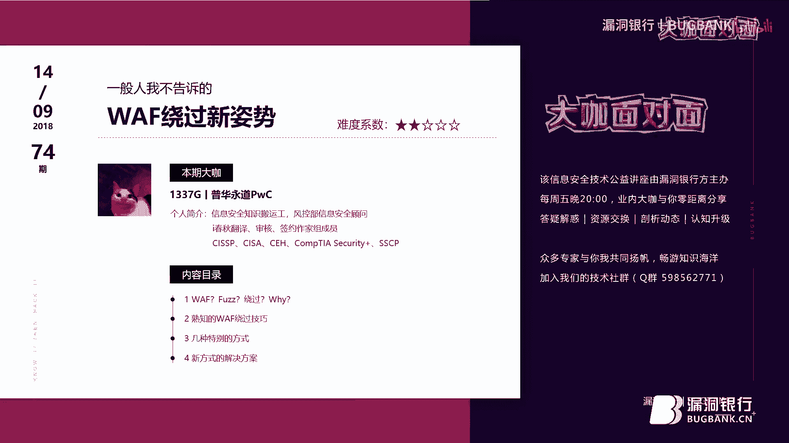

# 课程 P1：WAF绕过新姿势详解 🛡️➡️🔓

在本课程中，我们将学习Web应用防火墙（WAF）的基本概念、其工作原理，以及一系列用于绕过WAF检测的实用技巧。课程内容涵盖从基础的黑名单绕过到基于HTTP协议的高级绕过方法，旨在帮助安全测试人员更全面地理解WAF的局限性。

---

## 概述 📋

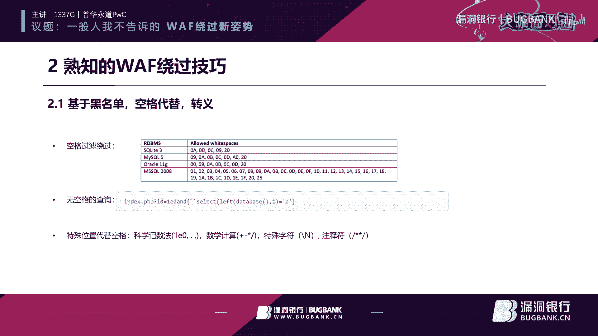

WAF（Web Application Firewall）是一种用于过滤恶意HTTP请求、保护Web应用的安全设备。然而，由于安全性与性能的平衡、配置不当或产品自身逻辑问题，WAF可能存在可被绕过的弱点。本课程将系统性地介绍这些弱点及相应的绕过技术。

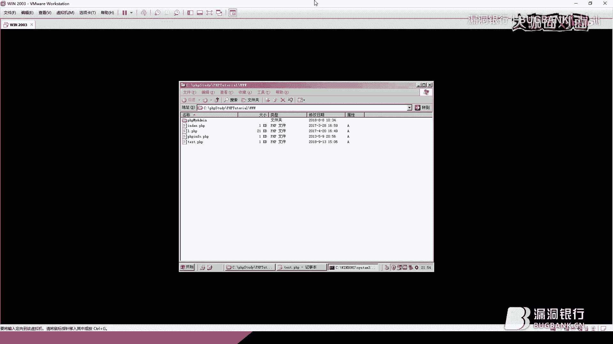

---

## 第一部分：WAF基础与绕过必要性

上一节我们概述了课程内容，本节中我们来看看WAF是什么以及为什么需要研究绕过技术。

WAF的中文名称是网站应用防火墙，其核心目的是检查HTTP请求包，拦截其中被认为有威胁的内容，同时放行正常用户的请求。WAF可以视为一种代理防火墙。

存在多种原因导致WAF可能被绕过：
1.  **安全与性能的冲突**：WAF需要在安全性和应用可用性之间取得平衡。例如，过度过滤单引号会影响用户正常输入；无法解密加密流量则可能选择放行。
2.  **配置不当**：许多用户在部署WAF后不根据自身应用特点调整安全策略，导致防护形同虚设。
3.  **厂商的局限性**：WAF厂商无法预知所有应用的特性和所有编程语言、中间件、数据库的独有行为，可能因此遗漏某些保护点。
4.  **WAF自身逻辑缺陷**：例如，对参数长度检查不严导致的缓存溢出攻击，或检查大量参数时顺序错乱（如只检查前100个参数，但攻击载荷在第101个参数中）。

**绕过WAF的意义在于对客户负责**。在安全测试中，如果甲方仅部署WAF而未修复原有漏洞，并声称已得到保护，测试方有责任通过绕过WAF来证明漏洞依然存在，确保评估结果的真实有效。

---

## 第二部分：熟知的WAF绕过技巧

了解了WAF的基本原理后，本节我们将探讨一些常见且基础的WAF绕过方法。

以下是几种基于黑名单过滤和字符替换的经典绕过技巧：

*   **特殊字符代替空格**：在SQL注入中，空格用于分隔关键词。WAF通常会检测空格（`%20`）。但许多数据库允许用其他字符代替空格。
    *   **公式/代码示例**：在MySQL中，`%09` (TAB)、`%0a` (换行)、`%0b`、`%0c`、`%0d`、`%a0` 都可以作为空格的替代。
    *   例如：`union%09select%09version()` 可能绕过对 `union select version()` 的检测。
*   **无空格/无括号查询**：完全避免使用空格，利用其他语法结构。
    *   **科学技术法**：`1e1` 表示10，`1e0` 表示1。可用于连接数字和关键词，如 `1e0union select`。
    *   **括号包裹**：直接用括号连接语句，如 `union(select(version()))`。
    *   **反引号、加号等**：在某些上下文中，`+`、`-`、`*`、`/` 等数学运算符或反引号也可用于连接。
*   **各种编码与转义**：通过改变payload的编码形式来混淆WAF。
    *   **URL编码**：对关键词进行单次或多次URL编码。
    *   **Unicode编码**：将字符转换为其Unicode表示，如 `u` 转为 `%u0075`。
    *   **HTML实体编码**：在Web上下文中有时有效。
    *   **错误的编码**：提交格式错误的编码（如 `%GG`），WAF可能无法解析而放行，但后端服务器能“智能”纠正。
*   **注释符混淆**：将SQL注释符（`/**/`, `-- `, `#`）插入到关键词中，打断WAF的字符串匹配。
    *   **公式/代码示例**：`uni/**/on sel/**/ect version()`。
*   **内联注释**：利用数据库特定的注释语法，如MySQL的 `/*!50000select*/`，其中50000表示版本号，该语法会被数据库执行但可能绕过WAF。
*   **宽字节注入**：主要针对使用GBK等宽字符集、使用`addslashes`等函数转义的应用，利用编码漏洞“吃掉”转义符`\`。
*   **参数溢出**：提交超长参数或超多参数，触发WAF的处理逻辑缺陷，使其跳过检查。
*   **注释符与换行符结合**：这是一个强力技巧。在SQL中，`%0a` 代表换行。可以利用 `#` 或 `-- ` 注释掉第一行的剩余部分，在第二行开始写入真正的注入语句。
    *   **代码示例**：
        ```sql
        id=1%23%0aunion select version()%23
        ```
        第一行 `id=1#` 注释了后面的换行符（对WAF不可见），第二行的 `union select version()#` 被数据库执行。

---

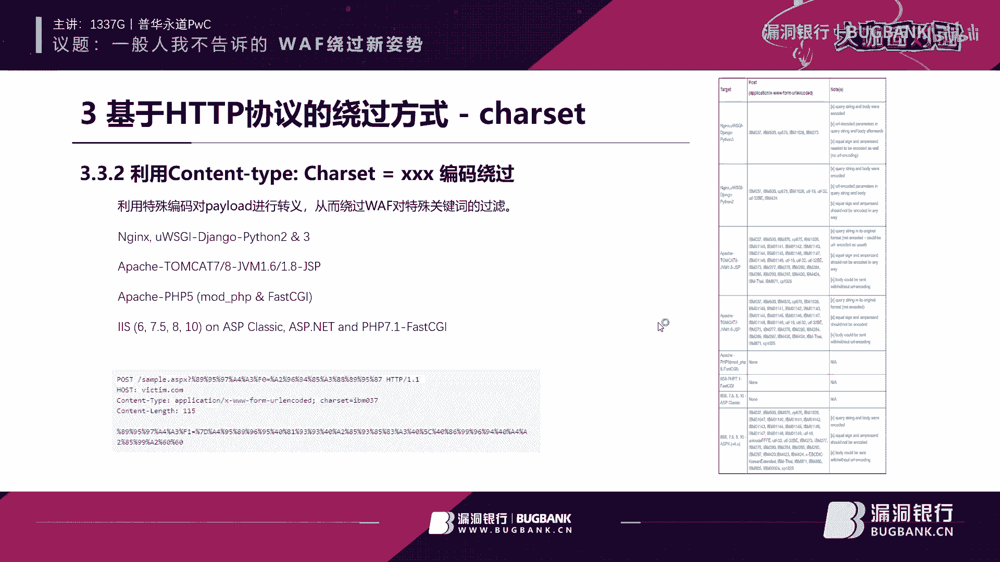

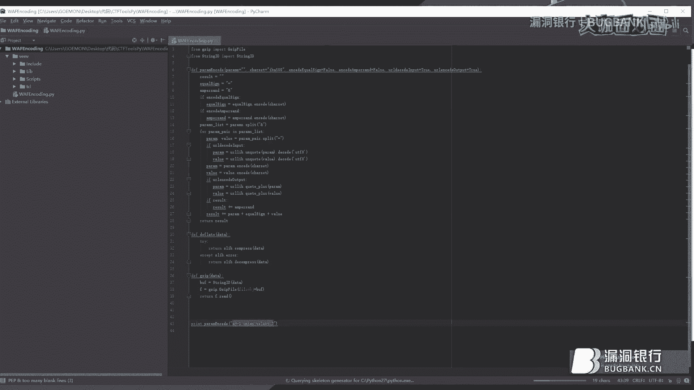

## 第三部分：基于HTTP协议的绕过技巧

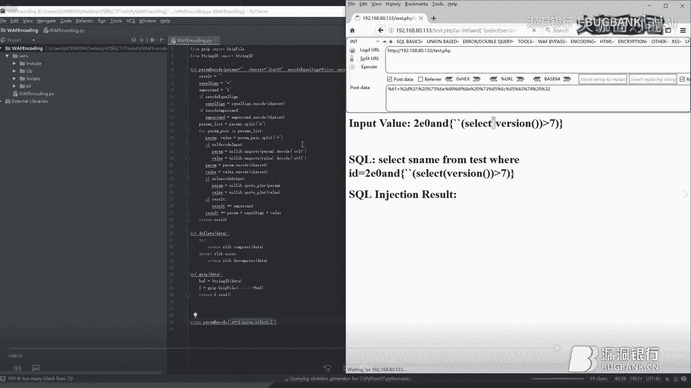

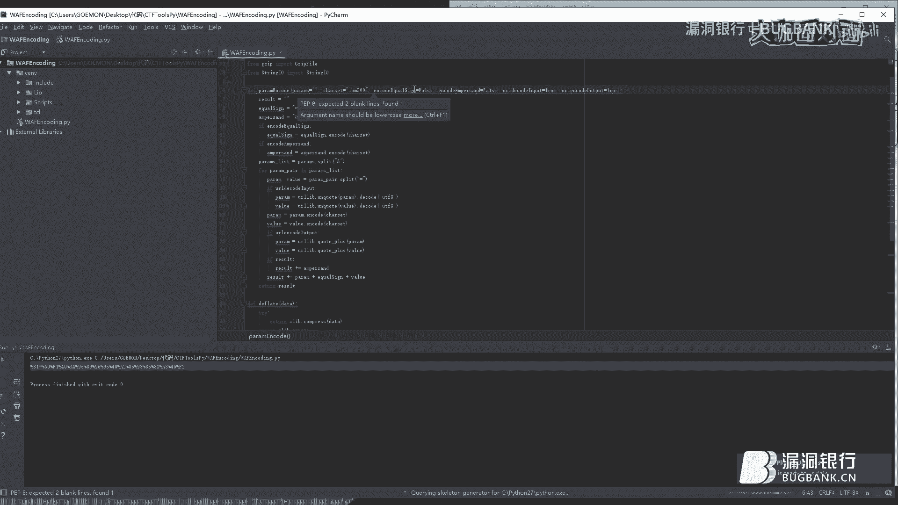

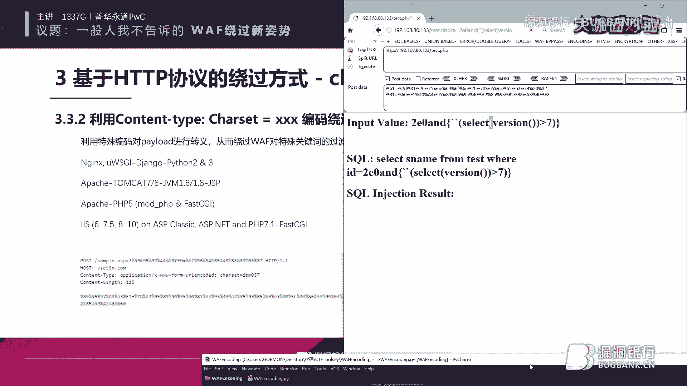

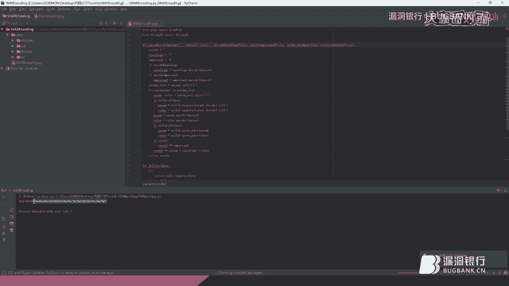

上一节我们回顾了传统的绕过方法，本节我们将深入更高级的层面——利用HTTP协议本身的特性或模糊性来绕过WAF。

以下是几种基于HTTP协议的高级绕过技术：

*   **HTTP/0.9 协议绕过**：HTTP/0.9协议极其简单，只有 `GET /path` 格式，没有版本声明和请求头。许多现代WAF可能无法识别这种古老格式，从而放行。
    *   **代码示例**： `GET /page.php?a=1 union select version()`
*   **HTTP Pipeline（管道化）**：在一个TCP连接中连续发送多个HTTP请求而不等待响应。WAF可能只检查第一个请求的 `Content-Length` 头部，而忽略后续“管道”中的恶意请求。
    *   **原理**：将恶意负载放在第二个或后续的请求包中。WAF解析第一个请求后，根据其 `Content-Length` 判断包体结束，可能将后续的请求视为无关数据而放行。
*   **分块传输编码（Chunked Transfer-Encoding）**：将请求体分割成多个“块”发送。WAF如果没有正确重组这些块，就无法看到完整的payload。
    *   **操作**：在请求头设置 `Transfer-Encoding: chunked`。请求体格式为16进制块长度 + `rn` + 数据块 + `rn`。可以将一个关键词如 `union` 拆分成 `un` 和 `ion` 两个块发送。结尾以 `0rnrn` 结束。
    *   **威力**：可与 `multipart/form-data` 结合，形成极强的混淆。
*   **协议未覆盖/Content-Type 混淆**：WAF通常根据 `Content-Type` 头部决定如何解析请求体。如果使用不常见或畸形的 `Content-Type`，WAF可能解析失败而放行。
    *   **`multipart/form-data` 绕过**：此类型通常用于文件上传。WAF可能对标记为文件上传的部分检查较松。通过构造畸形的边界（boundary），或在 `filename` 参数上做手脚（如添加空格、引号），可以欺骗WAF。
        *   **技巧**：在 `filename=` 后加一个空格（`filename =“test.jpg”`），或使用未闭合的引号，可能导致WAF识别为文件上传而放行，但后端服务器仍将其解析为普通参数。
*   **字符集编码绕过（Charset Encoding）**：通过 `Content-Type` 中的 `charset` 指定非常规的字符集（如 `IBM037`, `IBM500`），将payload按该字符集编码。
    *   **原理**：WAF默认可能使用UTF-8解码请求体。如果payload被编码为IBM037，WAF用UTF-8解码会得到乱码，从而可能放行。而后端服务器根据指定的 `charset` 能正确解码并执行。
    *   **代码示例**： `Content-Type: application/x-www-form-urlencoded; charset=ibm037`，请求体为IBM037编码的 `a=%81%A3...`（对应 `a=1 union...`）。
*   **畸形的HTTP请求头**：利用RFC标准中允许但少见的头部格式来混淆WAF。
    *   **换行符与制表符**：在头部字段值中插入 `rn` 或 `t`，如 `Header: valuern tContinuedValue`，服务器能解析但WAF可能处理异常。
    *   **重复头部**：发送两个 `Transfer-Encoding` 头，一个有效，一个无效。WAF可能处理错误。
    *   **错误的协议版本或方法名**：使用错误的HTTP方法或版本号，服务器有时会宽容处理或默认处理，但WAF可能因此失配。

---

## 第四部分：实战绕过演示与总结

在学习了众多理论技巧后，本节我们将以知名WAF产品阿克曼（Akamai）为例，进行简单的实战思路演示，并对课程内容进行总结。

**针对阿克曼WAF的实战思路：**
1.  **Pipeline绕过**：构造一个Pipeline请求，将恶意注入语句放在第二个HTTP请求中。第一个请求为无害请求。WAF可能只深入检查第一个请求，从而放行整个管道。
2.  **分块传输绕过**：将注入payload进行分块编码。由于阿克曼WAF可能没有完全实现或正确应对分块传输的复杂重组，此方法可能直接绕过。
3.  **`multipart/form-data` 与 `filename` 技巧**：将请求伪装成文件上传（`multipart/form-data`），并利用 `filename` 参数的畸形构造（如加空格、未闭合引号）来欺骗WAF，使其认为这是文件内容而不做深入检查，而后端仍按普通参数解析。

**重要声明**：所有技术分享仅用于安全研究、学习交流及提升企业自身防护能力。未经授权对任何系统进行测试或攻击是非法的，使用者需自行承担一切法律责任。

---

## 总结 🎯

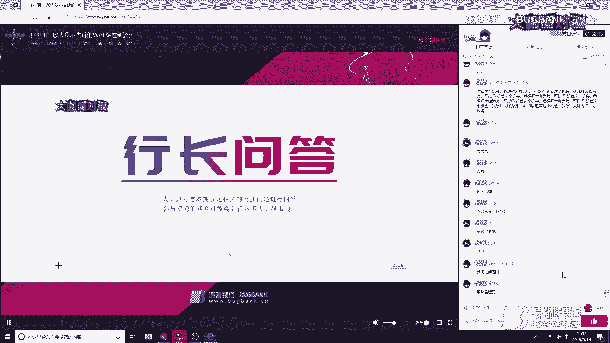

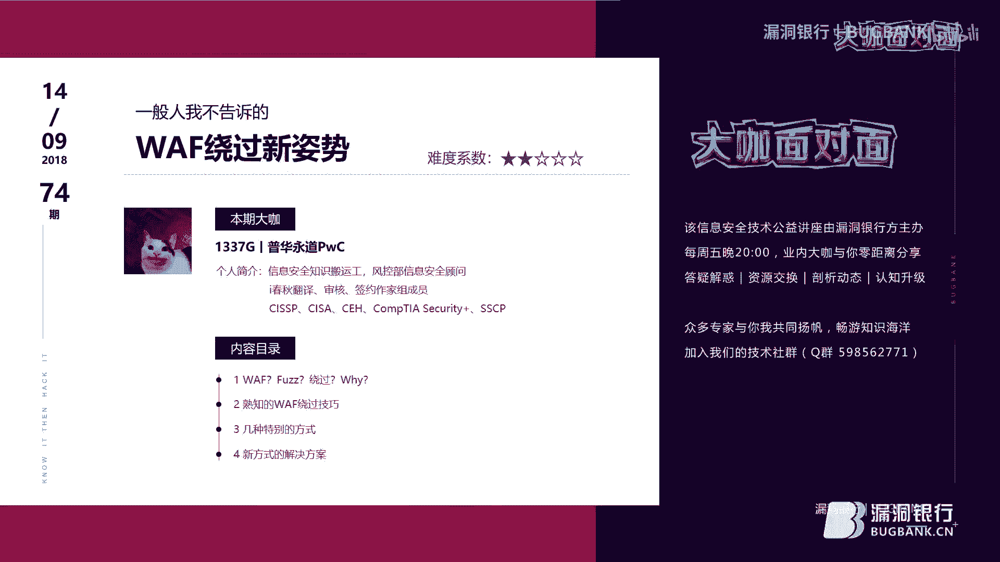

本节课中我们一起学习了WAF绕过的一系列技术：
1.  **基础**：理解了WAF的工作原理及其可被绕过的根本原因（性能冲突、配置、逻辑缺陷）。
2.  **传统技巧**：掌握了利用特殊字符代替空格、各种编码转义、注释符混淆、参数溢出等常见方法。
3.  **协议层技巧**：深入了解了利用HTTP/0.9、Pipeline、分块传输编码、Content-Type/Charset混淆以及畸形HTTP头部等基于协议特性的高级绕过手段。
4.  **实战思路**：了解了如何将这些技巧组合应用于实际WAF产品的测试思路。

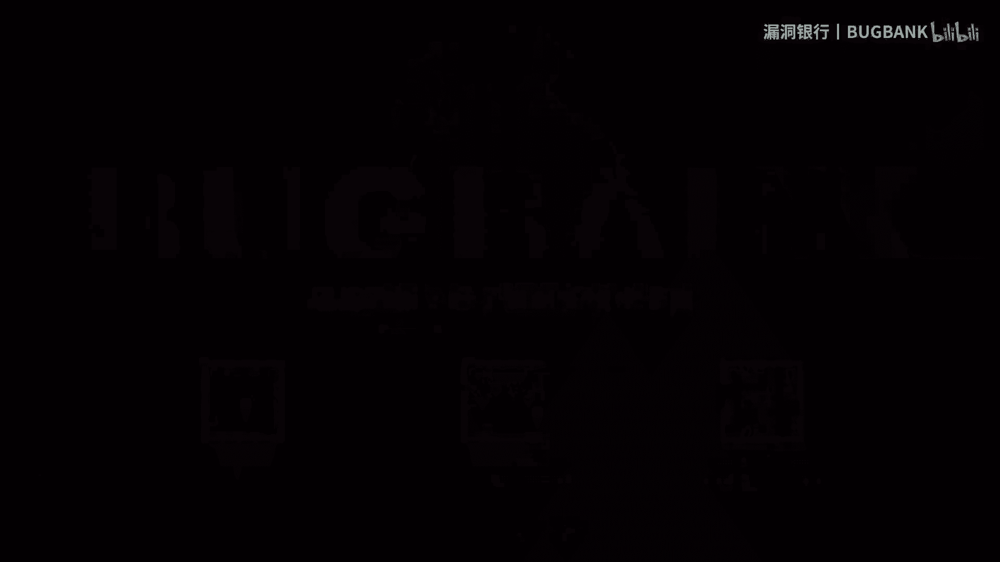

核心在于理解WAF作为一个“中间件”的局限性：它必须在不破坏正常业务的前提下进行检测。任何在协议解析、数据解码、策略匹配上的不一致性或模糊性，都可能成为绕过的突破口。对于防御方而言，应深入理解这些绕过技术，从而配置更严格的策略、选择能更深入解析协议和内容的WAF产品，并始终牢记 **“WAF是缓解措施，而非修复措施”** ，真正的安全在于修复应用自身的漏洞。