# P1：91期-步步为营之游走于内网_x264 - 漏洞银行BUGBANK - BV18441137tQ

为知识而存，因技术而生，小伙伴们晚上好，欢迎参加第91期漏洞银行安全技术直播大咖面对面，我是今天的主持人fancy。今晚将要分享的是MS08067安全实验室的联合创始人之一DM大咖。此外。

DM大咖呢也是破晓团队的核心成员。DM大咖真的十分低调，他对自己的介绍仅仅是安全从业人员、自由职业者。但是说起他的专业研究领域，内网渗透。DM大咖绝对可以算是这方面的专家，专业知识很深厚。

并且在去年年底，他完成了自己的一本书，内网安全攻防渗透测试实战指南，可见，在内网渗透方面造诣确实很深呀。此外，DM大咖也悄悄告诉我，这本书预计会在今年的7月底出版。感兴趣的小伙伴可以关注一下啦。另外。

大家别忘了登录直播间，在聊天区与我们进行讨论互动。在DM大咖演讲完毕后，还有行长问答环节，大咖会在线解答大家提出的问题，积极参与问答互动，还有机会成为幸运观众，获得大咖精心挑选的书籍。

外不安全攻防渗透测试实战指南。好啦，估计大家听我讲了这么多，也有点腻吧，那就不不多说废话了，下面就有请BM大咖开始今天的直播分享吧，大家欢迎。😊，嗯，大家好，那个张张范ancy小姐姐已经那个介绍过我了。

然后我今天呢就是想从这个通过我写这本书，把整个从一个点到整个内网渗透到后渗透，整个呃清除日志整个过程去给大家去介绍一下。嗯，那我们现在。呃，准备开始。嗯，我把整个目录分了这个流程，分了这个七的部分。呃。

从第一个入口点嗯到这个。这个sha怎么去把它弹进来，这个代理这个问题呃，第三步是这个信息收集，第四步权限提升，第五步，横向渗透。第六步是持久化。第七步是对这个日志上的一个处理。嗯。我们接着首先来看这个。

呃，入口点呃，在平时渗透的时候，我们一般拿到的入口点呃，大多数情况是分为这几种。就是比如说是一个web shell，或者是一台个人机的一个copper straight的ba。

或者是metal split的一个shall，呃，或者是你通过水坑呃，配合这个beef啊什么的，去拿到呃通过这个GS控制了目标的这个浏览器。呃，有时候会拿到这个目标网络设备，它的边界的这个路由呃。

和这个防火墙啊、VPN啊这样的东西。然后第五种一般情况下就是呃物理渗透。物理渗透的话，一般就是这两天不是在大家都在打这个新闻还是不断的。呃，又是挖下水道的。呃，又是嗯那个进人家混进机房，呃。

又是像昨天发生了无人机呃，潜入这个某单位的这个办公区，准备带了这个wifi破解的设备，准备去破了这个无线，然后再进内网渗透。呃，所以说。呃。

物理渗透这个还是现在被很多的这个不管是攻击方还是防守方都在开始关注的这个问题了。呃，前几年在爆出来的案例是呃与某白帽子通过这个wifi渗透。因为这个单位的嗯物理隔那个wifi的这个网络区域隔离。

它就做的不行。然后所以说是它通过一个wifi呃，一直内网渗透达到了这个超算，然后一直控制到了这个超算。所以说呃大家还是要关注这个问题。我们今天着重讲的就是这个我们如果获取到了呃一个个人区的这个悲款啊。

我们该来如何进入这个渗透过程。呃，在一般情况下，我们拿到了这个的时候，我们需要判断一下，或者是拿到了这个web shell。我们需要判断一下我们现在当前的这个权限。我们这个sha的这个位置在哪里。呃。

我们从这个网络位置和主机角色，还有这个联通性这个判断呃来介绍一下。嗯，网络区域的话，我们一般把它分为这个呃外网啊，那个DMZ啊、内网啊、办公网啊、生产网啊、运维网啊，一般就是看还是单位的这个业务不同。

呃，它的这个叫法都不同。嗯，网络区域我们一般拿下来的web shell一般都是这个DMZ区的。呃，刚因为介绍过了，我为什么从这个外部渗透转了这个呃通过个人机打点主做内网渗透。

因为现在DMZ区大家对它的这个限制隔离都是做的很严格。呃，我们如果纯粹的拿到了这个一个web shell，嗯，它在这个DMZ区域，我们需要花很久的时间去绕过这台呃绕过整个这个网络限制，呃，就比较麻烦。

有可能是绕不过去的。然后在整个嗯耗费的这时间还是很长的。呃，如果是一台个人机的bitatcon的话，它一般情况下会呃出现在这个办公网的区域。如果运气好，你会出现在这个呃运维网。呃。

我们就是一般情况下运维网是。对呃，对我刚刚看DMZ是访问不到这个用户网段的，一般的这个流程是嗯DMZ区域是可以被外网访问的。因为它是需要在这个单位提供业务使用的，所以它能被这个外网访问，呃。

它也可以被这个内部用户。我们内网办公区访问，但是它是不能访DMZ区是不能访问到这个呃内网办公网的。呃，是这层是做了这个限制，一般就是叫做DMZ到到trust这个区域是做了这个拒绝的。嗯。

我们来说这个主机角色的问题。我们如果拿了一台个人机的，我们呃因为这个钓鱼发过去了，我们呃它上线的人群是不一样的。它可能是HR可能是财务，可能是嗯这个运维，可能是开发呃，它的这个职业不一样。

所以它的机子里的内容也就不一样。我们通过它呃如何获取到内网的这个其他权限，嗯，或者是对我们下一步信息收集的这个主攻方向也是不一样的。呃，就比如说我们如果拿到了这个HR的机器。

我们的机子里是会有大量这个员员工信息的。呃，如果我们拿到这个财务呃，我们是有这财务报表，财务报表或者是呃有这个里面还有这个人的名单。然后我们通过这个名单呀，邮件呀，通过目标。内网中大家整个组织呃所有人。

因为组织内大家都是有一个信任关系的。呃，嗯比如说你从外网发进去一封邮件和你用它的内网呃内部的邮邮件网关发进去的东西是不一样的。嗯，大家的这个信任机制是不一样的。如果我们拿到的是开发人员的话。

我们同可以通过它的机器呃，下载大量这个呃外部源代码，然后我们通过这些源代码，我们把它先荡回来。呃，这些源代码一般情况下是一些这个测试机器或者是一些业务的线上机器都有。嗯。

我们呃可以让团队的其他成员对他进行代码审计，然后审计出来别的漏洞，留作这个呃第二条通道使用，以防止就是这一台机器的设有断掉了。然后如果是我们拿到运维的话，那就是更好的。

一般运维的机器上会有这个比如说是IP地址规划表，内网图扑图啊，呃，或者是这个呃密码表这样的东西。如果能拿到这样的东西，我们对于下一步的内网渗透也是有这个事半功倍的效果的。嗯。说到这个联通性的话。

在这个下一页PPT我们会介绍到，主要是对着联通性做一个介绍。因为呃现在这个嗯。企业对于这个边界的限制越来越严了。呃，也就是刚刚说的，现在外部渗透不太好做的原因。呃，对它限制严了之后。

我们可能呃发了发了这封钓鱼，可能我们花了很久让目标去点了它。嗯，他并且呃执行了它，然后杀毒软件呃我们前期的秒杀也做的很成功，也没有拦截。呃，但是结果是呃在我们这边是没有上线的，原因就是这个流量问题。

流量处理。因为嗯。在早期的这个木马回联基本是使用这个TCPUDP这样的东西。然后这个封杀的已经比较严重了。在这个企业的这个编界防护墙或者是相相关的一些审计流量流量审计的设备，嗯。

都是去对它做了这个严格的这个限制。呃，所以说我们这个近两年用这个HTTP和这个HTTPS多一点。然后现在是这个嗯。隐蔽性和这个穿透性就是最好的也就是这个DNS和ICMP这两种协议。嗯。

如果是在windows的话，我们常用的是那个用一个二进就是二进制可视行文件E叉E或者是使用这个power脚本的PSE呃去去去执行，或者是使用一些目标呃自带的一些东西。

比如说是呃windows操作防火墙的ATSH它也是可以进行端口转发的。后或者是使用这个linux上的I table boxSSH这些东西都是可以呃将目标的内网的端口转发到这个公网上来。嗯。

因为在渗透的时候，我们还是非常建议使用目标自带的这些软件。因为第三方的话，我们可能会涉及到这个呃秒杀啊等等一系列的问题。嗯，我们一般这个这个点的话，我们可以通过它呃把它反弹回来，呃。

可以是反弹一个chll，就是我们拿NC去接像这样的形式嗯像。windows这两年就是power kit。嗯，那个或者是转发某个单端口呃出来，然后或者是就是转转一个st，呃把一个st流量整个把整个机子。

公积机的这个整个流量通过这个边界这台机子，我们整个带进去，嗯，这是三种各有各的好处。嗯，说到这个信息收集的过程的话，我是把它分为了这个工作组和这个域。然工作组的这个信息收集。

就是我们对于这个windows的呃单机常规的信息收集嗯。信息收集我们一般是有呃。分为这个useradminists和那个sstem三种权限。如果你只是呃一个用户组的话，呃。

你是不能对这个呃目标进行这个流。他西亚这些转储等一些或者是敏感操作。然后。我们需要先对它进行一步提全。我们如果把它提提升到了这个本地管理员，就是administrator死组嗯。

我们这个组的权限就是里面有一有默认用户叫administrator。嗯，它是SID为500的，然后。嗯，这个工具的话，等会儿。底下会有介绍。

后面会有这个the administrator组里面有一个默认叫SISID为500的 administratorminist。呃，就是大家用的比较多。嗯，这个时候我们就涉及到UAC的概念。

从那个windows7和windows200呃2008呃就开始引入了这个概念嗯。如果是嗯那个我们比如说建立了用户啊，叫test，我们把它我们来举个例子吧。

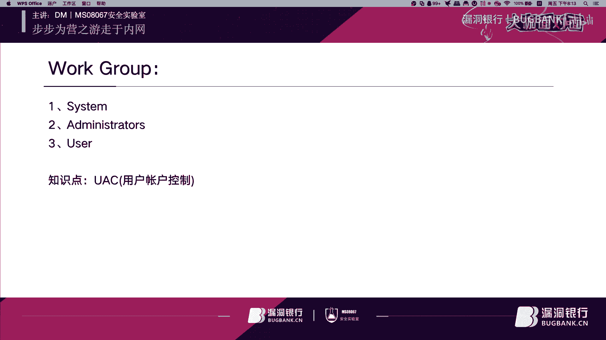

嗯。现在是这个administrator，然后。我们来看一下他的这个令牌部分。它这里显示的是一个一个高级别，就是说到这UAC的话，我们就是已经绕过的这UAC了。嗯，UAC这个概你等我会介绍一下。

但是如果没有要绕过UAC的，是会是这样的情况。我们比如说新建一个用户。叫test。然后。把它。添加到这个专帘组，然后我们可以看到。他已经成功的被我们添加到了这个管理员组。嗯。我们现在来这个。呃。

切换一下用户。我们已经登录了。呃，这里我们如果进CMD可以看到和张刚的区别就是在这个CMD窗口的这个左上角，在之前是有administrator这个标志的，而现在是没有的。

我这是纯英文纯英文版的这个操作系统。然后如果在那个中文操作系统上会写这是管理员，我们现在来看一下这个。我们这个test用户呃，我们可以看到它是这个管理员组，但是呢它不能执行一些特殊的操作特权操作。

比如说是我们现在将这个专储哈希的这个步骤，就是把me pass先导进来，等会儿方便，等会儿讲解的时候使用。哦，是他没有装那个什么，嗯，就先简单这样说一下，等会儿到这个演示还横向横向这一部分。

我们再去讲解这块。

うん。就是在这个右键这个位置，有一个就是以管理员权限去运行它，它会弹着框。呃，这就是我们说的这个UAC了。然后他说这个用户控制主要是针对我们如我点个yes，就像我刚刚说的。

它在这个上面就会出现这个administr这个也就是管理员的这个权限。你看比如说是我们在这里。

看到。我们的这个令牌是这个中级的意思。刚有人说到明天要考四级吧，大家应该认识。嗯，这是个终极权限，在这里你使用这个户IARL大家就能看到了。嗯，但是如果我们在这个呃。已经是呃绕过UAC这个位置。

我们就能看到这是一个高级权限。然后我们当我们在本地拿到一个高级令盘的时候，我们才能够呃把自己的权限提升到这个sst嘛，然后才可以去呃进行一些哈西转储或者是一些特权的操作。呃。

UAC就是为了限制微软用的限制那个呃管理员组的这个某些特权非常大或者是被滥用，他会呃在这里会谈一个是问用户是还是否。

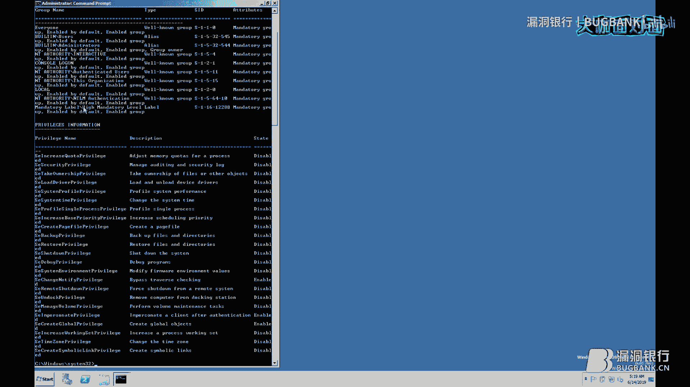

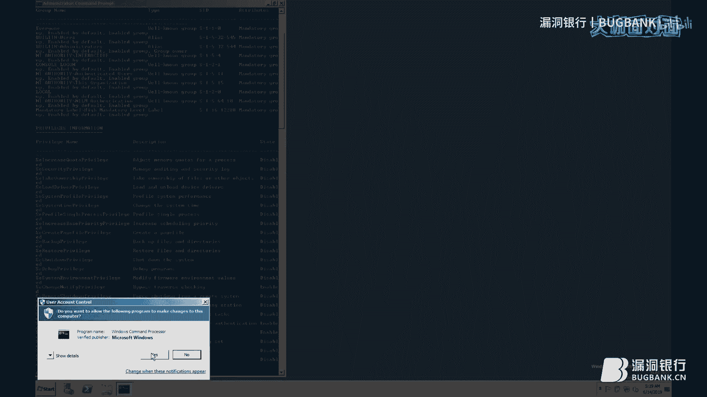

嗯。这里面其实还在那个windows单机上还涉及到了一个概念，叫做那个trus in。这个嗯比如说是C盘s systemstem32下面的某些文件只能是由trus int去修改。

而C即使是sstem都无法修改的这些文件。呃，大家可以去关注一下。嗯，这就是刚刚的这个UV这个中文的这个界面，就是用户账户控制。它会问你选择设黑是否。嗯，我们再来说到这个玉。嗯。

玉这个整个的部分还是呃知识点还是蛮多的。嗯，我们就把它简单的分为这个用户呃用户组和这个域管理员组。嗯，这个打个广告，就是我们在这本新书里对这个玉整个域的这个东西进行了比较详细的一个讲解。

然后用户的话嗯用户权限简单来说就是用户可以呃登录。域内任何一台除域控的主机，如果没在默认情况下，呃，域管理员组的话，就是他能登录这个控制整个域内所有的机器。

然后能控制预控制器上面能这个除理NTDS点DIT等等。嗯。这个前面两种就是我把它分为了这个嗯。工作组和域的这个信息收集。然后第二种我们把它分为这个预管理和非预管理这个信息收集。嗯。

如果是这个非域管理的话。我们可以使用这个因为域的这个东西是基于这个ldap这个来这个数据库，我们可以使用ld去这个查询呃域数据库中的一些信息，方便我们进行一些就是后后一部的这个渗透工作。

然后而预管理的权限就是很大了。它可以将这个NTDS点DIT也就是域数据库呃，进行转储，然后分析把里面所有的东西全导出来。然后下面我们讲一下这个通过这个命令一般我们去收集什么和这个呃一些敏感文件。嗯。

通过命令的话，我们呃一般拿到第一台机子，我们都会收集这个呃IP地址，然后运行的进程分析是否有杀软。然后嗯网络连接，或者是这个呃现在的权限，然后补丁数，然后等等一系列的分析。

方便我们下一步呃的这个持久化呀，或者是一些横向的一些操作。呃，收集的话，这个信息收集嗯渗透测试的本质就是信息收集。这句话是那个侯亮师傅说过嗯。这个敏感文件我们一般把它定义为这个像之前我说过。

可能是这个开发人员的源代码呃，运营人员的密码表，或者是那个外部机器的这个数据库配置文件。嗯。和一些就是内网中大家的一些这个秘密共享啊，或者是这个浏览器中这个保存的信息。呃，曾经有个项目。

就是呃在机器里翻了很多东西，都没有翻到这个敏感的或者是能帮助进行横向的东西。呃，但是最后就是翻到这个chrome。呃，里面是有这个一些。内部测试服务器的这个。

账号密码和一些业务服务器的账号密码都是一些外部登录，都是管理员呃，上去了使用了这个常规的外部渗透，然后去get shell，然后嗯去当了这个哈西具体横量渗透。嗯。我们接下来说到这个权限问题。嗯。

在一般情况下来说，我们是这个我把权限提升分为这几种。然后就是E叉P提全和一些AD的特性提全和windows非E叉P提全。E叉P提权就是。呃，用那个windows内核级的一些齐全的一些漏洞。比如说是。呃。

150511603216135，这几个都是比较成熟的。还有很久以前的像巴西炒肉啊等等一系列的这个呃内核提全。但是这个它好用是很好用，它成功了，它会立马给你返回来1个stem权限的一个1个CMD窗口。呃。

但是它如果失败了，它毕竟是内核级别的，它会导致这个windows系统的蓝屏，呃，大家想一下，如果我们通过呃前期那么多的准备工作去拿到了目标的。嗯，一台个人机的一个becon或者是一个web shell。

呃，就因为我们这个很随意的，或者是即使我们在本地测了很久的一个提全的一个。呃，程序我们传上去了，在目标上就是蓝屏了。如果蓝了，那它就是掉了。呃，我们可能就失去它了。所以嗯E叉P使用这个请谨慎。呃。

AD的这个提权。嗯，刚刚有人提到了。嗯，现在是。嗯，最近这两天爆出来了这个AD的一个提全的一个方法。然后常规的就是使用GPP去寻找一些有没有之前管理员在遗漏设下的一些主策略里面有一些保存的密码。

它虽然通过加密的，但是这个微软是通过把这个私钥已经公布出来了，所以我们在任意所有人都是可以将它解密的。嗯。或者是我们可以使用那个MS14068，嗯，将这个用户权限直接提升为这个预管理员的这个权限。

然后在一些内网中还是能见到这样的东西的。嗯。我们下一步说这个俄罗斯非太币集权，呃，一般情况下就是这个我们对系统进行一些劫持类的一些东西。就是比如说da尔或者一些comm的劫持。嗯。

🎼我们如果是对这个字截持的话，呃，网上还是有很多的这个分析工具的。呃，我们对目标自动启动时嗯一定有就是自启动的某个程序，呃，中间需要的一个袋儿。如果没有的话，我们就可以去这个截持它。

然后达到这个持久化的这个作用。呃，或者是使用这个呃他觉得对于路径，就是这引号的问题，他如果觉得有些东西没有拿引号，路径没有拿引号引起来的话，他会一级一级的往下，就是有一个空格为分界线去找。嗯。

第三方服务提全也就是我们所说的一些呃像数据库啊，呃之前的搜狗优化这样的东西。嗯，比如说是我们现在使用的这个。现在权限非常低，但是它系统里某项它的服务是使用高权限跑的，我们可以读到它相关的一些配置。

我们可以使用这些配置去呃对它进行这个提成的操作。嗯。B。接下来我们说一下这个横向渗透这一部分，呃，我们就是我把它分为这个常规的这个工作组和这个横向渗透和这个利用这个分发这个。呃。

比如说现在比较常见的一些EDR去部署。嗯，说起这个东西。也不是黑哪里，前段时间嗯在一个项目里呃。在通过某漏洞拿到了目标，这个部署了这个。呃，国内某产品的这个EDR的这个权限，后台管理的权限。

然后我们通过这个后台管理的权限上去了之后，发现我们需要找的这个目标就是在上面已经已经已经控制了。然后我们通过EDR进行将我们的码进行一个免杀操作。然后将嗯码推到那个指定推到这个用户，然后自动运行。

然后成功拿下。嗯。还有就是我们比较常见的这个PTHPDT就是pas哈西嗯pas tu和这个over the over past哈西就。这种常见的一些哈西传递的方式。还有我们说的这个常规的外部渗透。

比如说是呃通过因为在内网中呃是没有一些什么像wa呀等种东西拦截的。内网中也是使用有很多的这个测试服务器。呃，它的这个配置也是比较弱的。我们可以通过简很简单的通过这个测试服务器找到它。呃。

并且get shell就是拿到了这台机器的权限。嗯，就是收集这些密码都是对我们下一步工作室有很大的帮助的。呃，我们也可以利用常见的这些服务进行渗呃，横向渗透。

我们可以利用这个用户登录脚本去指定某个用户在登录时自动运行某个脚本。然后呃它就可以上线。董刚一直强调的这个。抓密码抓密码的这个密码呃，在windows里，它是被放在这个s文件里的。然后在域中。

它是被放在这个NPPSS点DIT中，它是在系统运行中的时候，然后windows为了健全方便把它全部存成了那个在进它有个进程叫SISASS点E叉E呃。

它里面在这着windows2000页而透之前的版本都会有这个。呃，铭文密码被保存在里面，也就是我们可以使用这个mimicast去在内存中提取出来铭文的这个原因。呃，我们将这个提取密码我分为这个两步呃。

两种方式。就是第一种就是呃在线的这种方式或离线的这种方式。在线的就是我们呃可以通过上传E叉E呃一个袋儿或者是这个XML或者是呃通过PSE从远程从远端拉出拉回来，然后直接加载到内存里去执行。

然后这一般是这个在线的方式。在线的方式的话呃，它方便是方便。但是它需要用的。呃，主要就是。嗯，免杀性的一个问题。因为嗯比如说像常规的这个哈希处理的这工具，呃。

我们minmipa这样的东西都是被各大AV厂AV厂商都列为了这个嗯。病毒软件。所以如果你想使用它，可以根据相关源代码进行改编处理。嗯，如果是我们离线处理的话，我们常规的来说是可以通过转储的方式。

将萨文件呃，或者将那个NTDS点DIT或者是将内存中的liss，呃把它们进行转储，然后生成一个文件。把它倒回本地，然后去去去解析。对呃。这个有同学已经说了是这个镜头名字，然后对他进行处理。

前这两年还是还是可以用的。但是现在国际的厂商已经对于这个lis萨s斯等这个。呃，已经进行了相当多的这个拦截，我们可以就去这个演示一下。

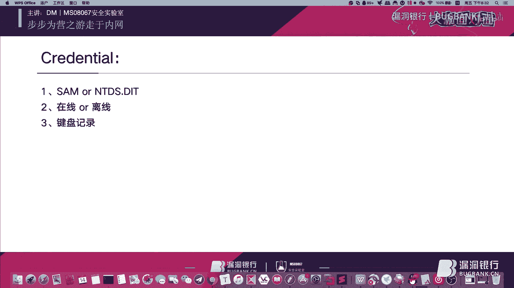

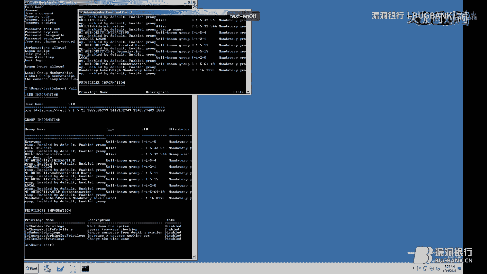

嗯，我先切回我这个。

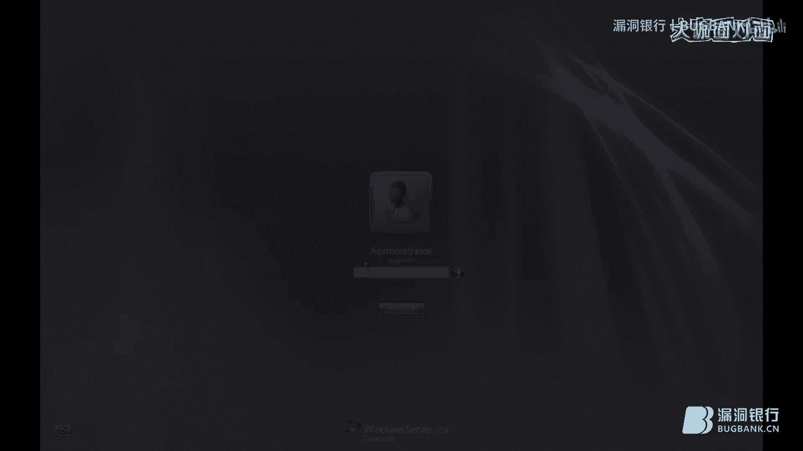

那个我现在把工具传了。这个嗯。我们因为国刚已经提到过了，国际上的一些厂商，对于这个liss斯这个进程已经就是监听已经监视的比较严格了。就是如果有东有进程跟他进行一些交互的话，他就会进行一些拦截。

但是呃去最近测试还是发现国内的。沙软对他这几家都是对它没有任何的这个防范的。Yeah。

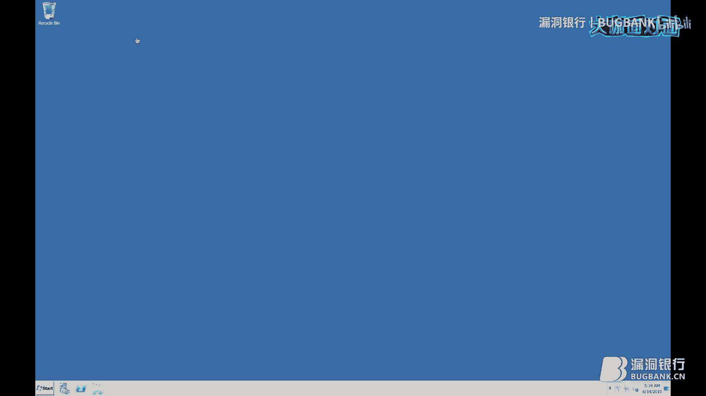

。Yeah。

嗯。我们先启动一个这个CMD，就是大家看到这是一个管理员权限的1个CMD窗口。呃，我们可以。嗯，大家看这条命令执行完了之后，我们就将这个内存中的这个lis啊。就这个进程已经就是专注出来了。

我们在这个新书里对他进行了对这个哈西的这个处理做了很详细的介绍。我们可以看到呃，它被导出来是1个32兆的文件嗯。对lis萨斯进行把它转出来的这个好处是呃，我们这样可以规避这个国内杀软的一些拦截。呃。

我们把它转出来之后，我们现在将这个me叉去放进去。呃，对版本一定要对应好，不然是不成功的。呃，我们先启动命个叉啊。M。嗯，别下。喂。嗯，我们已经成功的将这个镜像，就是我们转取出来的东西呃。

放在了这个呃挂载到了我们当前的系统中。嗯，这他如果演示的话，是哪两台虚机会好一点。呃，我看一下我还有讯机吗？

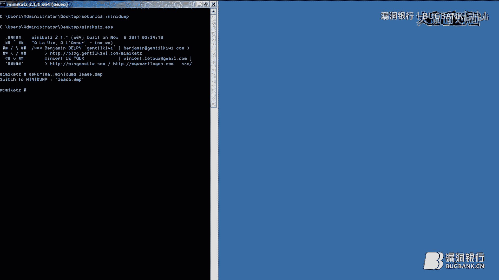

呃，我们来启动另一台虚拟机，为了这个演示的这个。

清晰。就模拟就是我们从目标的机器上转出了这个lisatump，然后我们现在把它都拖回本地。

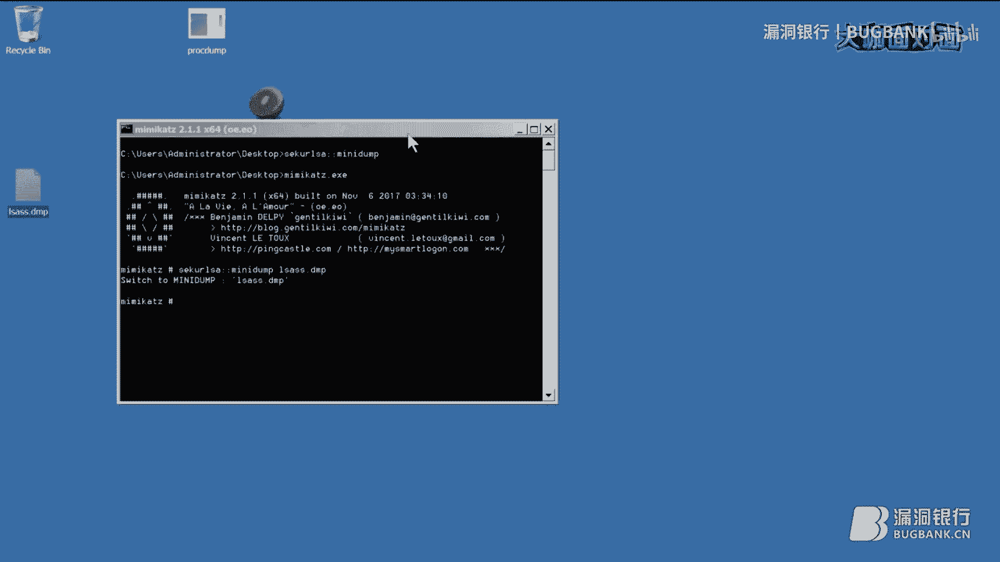

然后。嗯。嗯，我们先把它这个。雷萨斯放进了。啊。

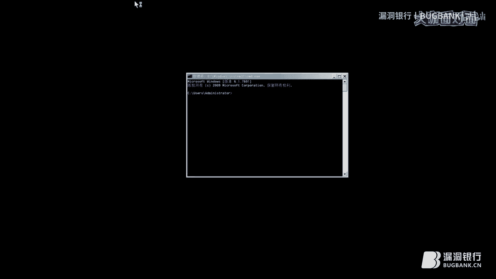

我也先恢复一下快照。

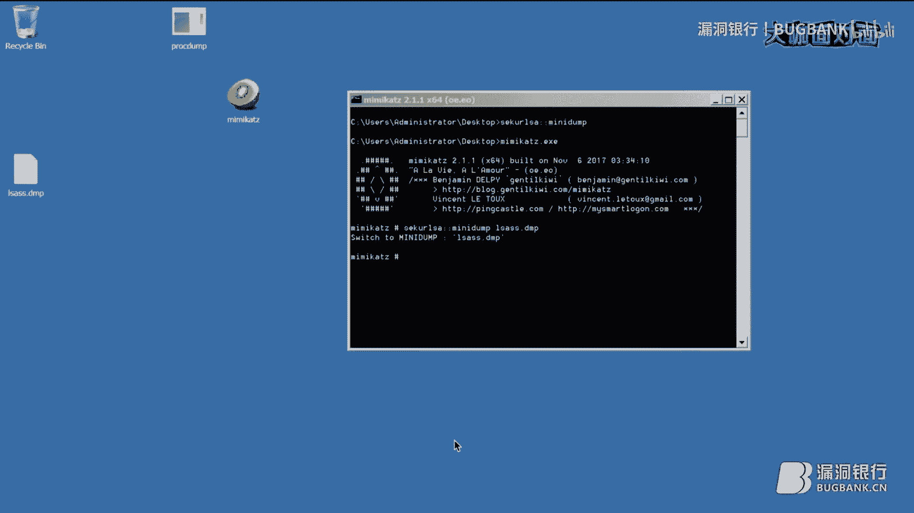

嗯，我们DM大咖现在在准备演示环境，大家稍微等一下哟。嗯，对，是使用工具提取，不会改写原有的数据，会呃直接将内存中的这段数据就整个镜像下来。

对，lis萨斯进场，然后我们再将这个。呃，min case也一并进行导入。然后我们启动这个min太，这是一个。中文的系统。呃，我们已经成功的挂载了。然后我们现在。输入下面的命令，将密码进行导出。

我们就可以看到张张的这台机器密码是这个test at123。嗯，对，这样的话就是已经成功的像那台机子的这个大家来看一下这个机器名。就是机器名是这个winNIDA开头的。

然后我们已经成功的通过这个把这个它这个进程中的这个当普文件，然后挂载到我另一台的机器，然后把里面的密码读出来了，只要test at123。嗯。来看一下整个流程是先这个转储这个进程，然后再把它拖回本地。

然后在本地这个位数一定要一样。就是32位和64位的是如果你拖的是这转储的是这个32位的这个机器的lis，然后你就需要在这332位的去挂载，不然你会加载不成功的。然后如果为如。呃。

大家可以自己去这个在本地安装一下国内的一些刷毒软件。我这里就是。呃。对，适用于所有的windows版本。嗯，我这里就不装模块软件去这样有点恶意的传回对方了。呃。

如果直接在被攻击抓传回本以文本形式传回来的话，呃，他这个毕竟有点大。呃，他有这个32兆，然后你这样你这样转的话就是还是不太好。

呃，我们说完了这个在线和离线的方式，我们再提一下这个键盘记录。呃，我们常规的键盘记录的话，我们如果控制了一台，就是比如说是运维人员或者是开发人员的这个机器。呃，我们可以在目标指机器上植入这个键盘记录。

可以这个用户身份或者是stem权限身份去执行，去去去那个植入到目标，呃，可以监测到监听到到他的机子里所有的用户，嗯，或者是当前用户的s选，呃，键盘输入的所有内容。

就比如说在这里可以抓取到相关的这些密码或账号的内容。然后这就是这个s文件的这个位置，就是在。呃。拿中文的去显示会好一点。C盘的这个windows下的这个。嗯，sstem32就是像这样的一个位置。

的就是confi configurefi下的就是s文件。呃，大家可以看到他是。不允许进行一个复制操作的。对，因为它是被一个锁死的一个状态，它是不能进行复制的。因为呃整个windows的健全。

它的所有的这个本地密码的用户等等密码等一系列信息都是被保存在这里。所以它是一直是被占用的状态，所以它不能直接复制，呃，我们这时候可以使用一些工具，然后对它进行一些处理，呃。

刚我们说的是这对这lisa斯这个对内存中的这个东西离线处理。呃，我们可以使用mi。或者使用那个RG从这个数据呃从注册表里把这个sam文件里面和stem这两个文件去导出来，然后去读取sm文件中的内容。呃。

这个NTDS点DIT就是预数据库也可以使用相同的方法去处理做这个呃sha就是就是卷引副本这样的东西去把它呃然后卷引出来一份，再把它复制出来。就是大家理解的像类似镜像这样的东西，把它镜像一份出来。

再把它复制出来。嗯，我们接下来说一下这个简单的一些持久化的这个问题。呃，在windows持久化的话，我们简单的就是使用就是呃像在注册表就是。软电池啊等等一系列的这个。注册表位置就是在启动时会加载的。嗯。

在这里我可以给大家看一个还没有做完的一个。嗯。一个持久化的一个东西。嗯，在这里的话，我们常规的话就是呃像。这句话我们分为这个metal split自带的一些东西，呃一些启动项后码或者使用这个计划任务。

呃，使用这个RBDP后码。あ后。像SC呀，就是服务based的命一些常见的一些注册表启动。然后。或者使用相关WMI的方式。嗯。说到这个系统自带软件的话，比如说是那个RDP，像我们以前比较常见的。

就是这个年连件，就是shift的后码。大家说的呃，或者是可以使用这个IS，我们可以对IS本身的这个服务嗯就是。加载注入某一些这个后门，然后我们通过这ISIS去控制。然后刚计划任务也说到了。

就是在老版本的windows里是AT在三新版本的叫s task。然后或者是使用使用一些这个troverse的一些特性。对WMI还是比较隐蔽的。嗯，刚这位学同学也提到了。这个。说到cos的一些持久话。

我们就是一般是这个经营票据啊，DSRM啊，这个一些主策略呀，或者是这个SSPIDhoory这些东西我嗯去年花了呃还是花了一些时间去搭建这个环境嗯预环境。然后演示呃配图。

将每一个步骤都是形容的描述的很清晰。在这个新书里都写出来了。呃，我们还可以使用这个常规的web show进行这个控制。做一些持久化。嗯，对于这个最最后就是因为我们只是内网渗透。

我们在这里最好还是别涉及到这个嗯拖资料，然后或者什么样的东西。嗯，这是在这个之前我讲过的一段，就是red team这这个课里有有讲过。然后如何将这个数据回传？嗯，这个日志上的话我们分为两种。

一般我们在拿到这台机子的时候，权限的时候，我们可以将这个日志的进程去结束掉，或者是将这个操作完后，将这个我们在集中操作的这一段时间的这个日志呃进行处理。嗯。如果是这个。这个care日志的话呃。

ca日志的进程的话，就是get up上有一些项目，就是待会后期也可以分享给大家。呃，就是说到这个清除日志的话，我们常规的要清除这个本地的这个session，就是我们的一些绘画。

我们在之前比如说使用这个net use建立的一些绘画。呃，我们常规的windows的这个application和这个s日志。我们一些登录过程，46244625这样的东西。然后一些外部访问的一些日志。

比如说我们访问到我的web show的这个后门会有一个get或一个posts的一个有个请求，就是需要把这段删掉。嗯，不然人家很好找到我们的一个木马在哪。第三方服务。如果我们是借助一些第三方服务。

我们需要把它的日志也清理一下。嗯。第五点是个二进制文件，我们尽量要让这个二进，就是不要让这个文件落地。就是之前有同学说到这个文件嗯，就比如说直接加载到内存里。但是有的时候不得不用一些二进制落地了的话。

嗯，我们记得将它删除掉。嗯，或者是将一些我们这个toppper straight或者是那个metal split的这个shall。嗯，它的启动的一个进程，我们可能是加载了一个袋。

或者是拿Ppower shell去启的，我们需要把它结束掉。在整个这个渗透结束之后。呃，这里我们提到的这个常见的这个呃工具，然后我把它分为了这一部分。呃，在昨天我一直整理到凌晨的四五点，呃。

把这本我们这本新书配套的这些工具，就是包括这些东西都在里面都有，然后全部整理到了这个呃配套的这个工具包里。然后一些常见的嗯包含这些工具，但不仅限于这些工具。呃，接下来就进入到今天的这个问答环节吧。

我这边已经结束。好的，那非常感谢DM大咖的分享。各位直播间的小伙伴们听完大咖的演讲，有没有被大咖的专业度所折服呢？相信认真听课的小伙伴们多多少少还会有一些疑问。那下面就进入我们答疑解惑的环节。

来到我们的行长问答环节，大家现在也可以继续在聊天区里发送问题。大咖会选择高质量的问题进行解答。那我刚刚看到大咖在讲的过程中也好像就不断的回答大家的问题，真的很感谢大咖啦。那在行长问答环节之后呢。

稍后的福利赠书环节，大咖也会基于大家提出的问题来挑选一位认真听讲，积极思考的小伙伴作为幸运观众送出书籍，所以大家快快抓紧机会开始提问呀。那现在就请DM大咖来勾选一下只看提问的选项。

来查看和解答大家的问题吧。😊，呃，光盘的话还在和这个出版社沟通，可能会以线上的形式去放出。日日志是否会不会恢复。对，因为现在这个网络环境的话，会有很多这个日志设备，呃。

它会被发单独发送到某台这个服务器上。所以这个日志还是会存在。所以这个动作还是尽量以小为主。然后。这个。嗯，从这个个人机的PC里PC里看不到这个域的话，就是呃有些就是刚刚说了嘛，分为这是工作组合这个域呃。

有些机子是这个没有加入这个域的，所以就看你们在的这个公司里是是有没有有这个微软的这个活动目录，就就是域。就是怎么导导出这个内存中么的数据，就是prot，这是微软的它自己官方的一款工具。

也就是为什么我们刚常使用这个呃国内的一些杀毒软件都不会查杀它的原因。因为是它带了这个签名呢，就是一个白加黑的一个效果。嗯。当 police。新书当blus的话。

这个网上有也都会在我们的这个呃新书配套的这个工具里都会发出来。呃，新书预计是在这个7月底进行这个发售，呃，具体还在出版社进行审核。嗯。内网渗透是懵逼的，呃。

还是建议先学一些这个呃一定要有一定的代码功底去实现。然后呃要熟悉windows和linux的操作系统。所以就是从运维转型会很方便，然后去学，可以学一些运维相关的内容。然后外部渗透代码审计呃。

外部渗透的话就是常规的从这个公网上找到通过常规的渗透方式找到这个web嗯，目标的外b在哪？我们通过信息收集，它有什么外一共有什么这个外部应用提供什么对外服务。呃，通过比如说是top10及一些销售输入啊。

这个叉SS啊命令执行啊这样的东西，就是在目标机器上执行命令啊，呃，拿到权限再进行下一步内网渗透。呃，代码审计的话就是我们分就是这个刚拿到目标的这个外部源代码的时候。

我们可以通过这个白盒对源代码的这个它这个实现方式进行审计，看里面这个过程有没有对一些呃一些变量它跟踪的时候，它有没有跟踪它它有没有对这个用户的输入进行一些过滤。mm。呃，是。机器在域里。

但只能预列出域主机的话，呃，这一般是不会存在的。呃，在。在单机上的情况下，得看你这个你当前的这个session是否是这个用户的权限。嗯，如果不确定的话，你可以先把它提升这个stem。

它的这个sstem的权限。呃，是他同样就有这个预权限，就是因为你如果拿的是本地用户的话，即使机器加入了这个域，你也是不能访问到域雷的信息的。因为它是需要用到这个用户的这个身份。

也就是这个turt这个crobo呃，基于这个cbo协议去进行健全，然后获取东西的。呃，你可以关注一下这个crobo这个实现过程。嗯，比如说内网渗透内网的话，如果在windows上。

你是不是得懂一些power show一些一些C sharp这样的东西，对不对？比如说在linux上，你是不得熟悉一些背脚本这样的东西。就是尽量要用目标自带的一些东西去进行处理。嗯，白名单验证的话。

白名单呃有一专门的项目呃，LOS bins呃，我也把它加入了这个随术配套的这个包里。我们引引入了这个它这个工具呃，它这一套这个方法是国外的呃一些readd team去进行总结整理的。嗯。

持久化后门控制有什么推荐，还是看你这个最好的控制方法，我还是建议你先了解这个目标业务，基于业务的不同进行一些操作，还是以这个无文件这个去不要落地去。操作用一些目标自带的呃软件去进行数序化。嗯。

这个对CN这样的东西动静是很大的，就是不建议使用。但是所以我把它放在最后了，就是responder啊这样的东西还是用的比较多的。像smaHNTML这样relay这样的东西。呃，现在用的还是蛮多的。

比如说前段时间的这个呃ATM挑的一漏洞，嗯，就是去这NTML这个东西。

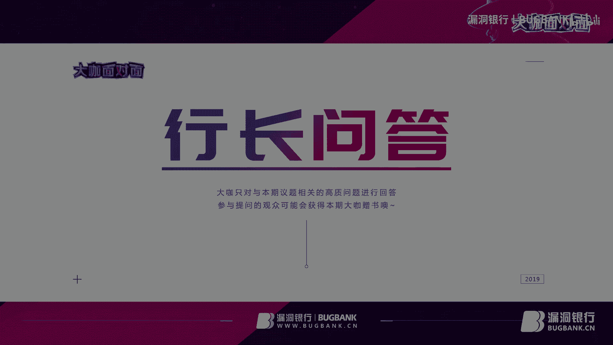

嗯，好的，那现在看大家提问嗯大咖也已经帮大家解答了很多的疑问了。嗯，大咖今天也很辛苦。嗯，大家问的也差不多了。我们今天因为时间有限，大家如果后续还有问题可以私下交流或者加入我们的技术社群进行交流。

都可以，非常感谢DM大咖耐心的解答。接下来我们就进入下一个环节吧，那就是大家最最期待的赠书环节，本期赠书是DM大咖精心挑选的外部安全攻防渗透测试实战指南。那想问一下DM大咖。

你能简单的说说为什么选择了这本书吗？嗯，就是说一下这本书，就是因为也是我们这个团队出品的。然后嗯他对于这个它里面张获很多，他对于这个新手来说他是蛮适合的。因为他每一步都是就像我们这本新书一样，他对。😊。

每一步的操作都进行了这个配图，然后加G的命令就是说明就是包括每条命令能干什么，然后让新手就是能起码真的先操作一遍，并且理解它的含义。然后每条命令的意义，这样能加深他们的这个理解，就是实战和理论相结合吧。

好的，那大咖真的是为大家想的很周到呀，谢谢BM大咖。那下面就请BM大咖来选择一位幸运观众吧。你可以看一下聊天区的聊天记录，然后选择一位呃幸运的小伙伴，在你想要赠书的观众ID上点击设为幸运就可以啦。😊。

好的，或者你也可以直接把他的ID告诉我，我来操作也可以。好的，我已经选了。😔，已经选好了是吧？呃，选的是谁说一下。呃，是在提问里问到这个取证问题，就是说到这个。呃，是否符合这个取证？呃。

从内存中把数据导出来，是否符合取证流程。哦哦，我看到了。他的ID是叫sack875，对吗？这位小伙伴对。啊，好的，那恭喜这位直播间ID为sike875的小伙伴。

你将获得对应的大大咖证书外部安全攻防渗透测试实战指南。请你根据直播间的提示，留下你的联系方式。我们运营小姐姐会联系你兑奖哦。好啦，那亲爱的观众朋友们，今天的直播到这里就已经接近尾声啦。

DM大咖还最后还有什么话想对直播间的小伙伴们说吗？嗯，这个大家如果想要就是接下来进行交流的话，可以去加一下这个。呃，我的这个微信或者是呃留着联系方式都是可以的。嗯，大咖要接小微信了吗？

这个现在就告诉大家了吗？准备准备配合一下这个猫猫头嘛。

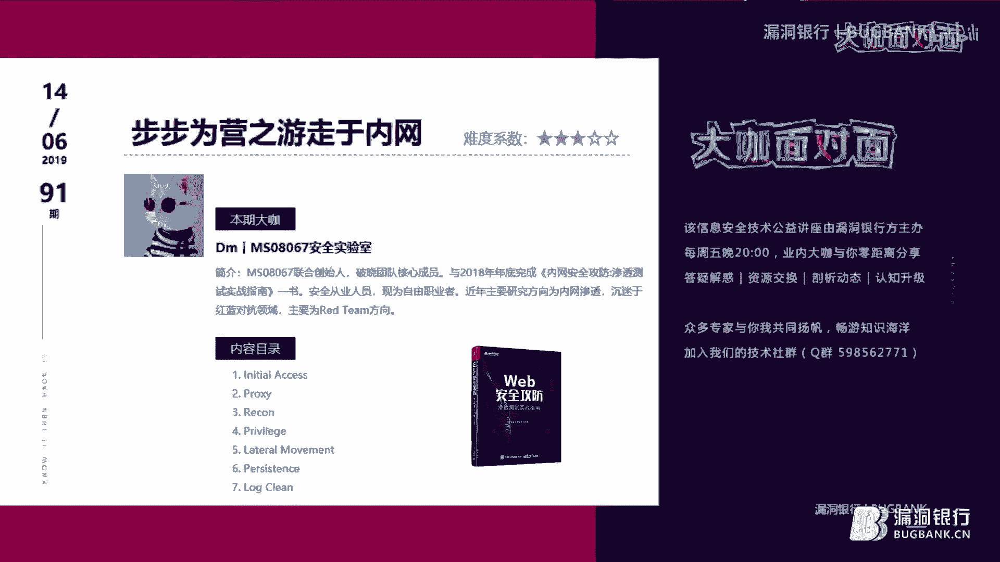

好的好的，呃，如果就是有什么问题，大家可以私下和我去进行一些交流。然后打个广告的话，就是我们团也现在在招人嘛，就是MS08067。我是负责这个呃内网渗透这个小组的这个负责人。现在然后大家如果有兴趣的话。

可以和我进行一些交流。

好啦，那今天的个直播差不多就到这里啦，再次感谢BM大咖的用心准备和精彩演讲。相信认真听讲的，大家一定都有所收获吧。当然，最后还是要感谢你们每一位观众伙伴的支持。如果你也想像大咖一样直播分享。

欢迎找我报名。大咖面对面是一个展示白毛风采和分享技术知识的舞台。这里不具年龄，不为自利，只要你有才华敢分享，我们都欢迎。😊，另外，想进群交流的小伙伴可以在本页面底部点击加群链接，本直播间地址固定。

喜欢观看我们直播的小伙伴，别忘了点一下收藏哦。大咖面对面周五8点见，我们下次再约吧，再次感谢TM大咖来跟大家说声再见吧。好的，再见，希望就是下次能跟大家再会。😊，好的好的。

非常期待大咖下次还有机会再来我们大咖面对面。那最后是我们的听歌时间，我也在这里就要跟各位说声再见啦，非常感谢今晚的陪伴。大咖面对面能有今天的成绩，离不开你们每一位的支持，大家早点休息，拜拜，晚安喽。

DM大咖也辛苦啦。好的，再见。那再次感谢下DM大咖，你现在可以断一下推流啦，大家再见喽。😊，🎼I've seen Istanbul。🎼I seen info for。

I've seen you broke down。🎼F热 now。P yourself up for the horns that you go。🎼You baby。🎼I know you。

🎼But we can see。Sometimes it takes many faces to be。It takes the time and a place to bit free。🎼有点你眼。

🎼你 so crew。🎼To someone like you。🎼多汁。🎼Of the things that you do。🎼you。🎼I woke up the small。🎼G。🎼了不贪陪。

🎼也戒是没。🎼一吹。🎼可是你也。🎼你笑。🎼Someone like you。🎼让我多去。🎼Ths that you do。🎼umb2。

Yeah。

